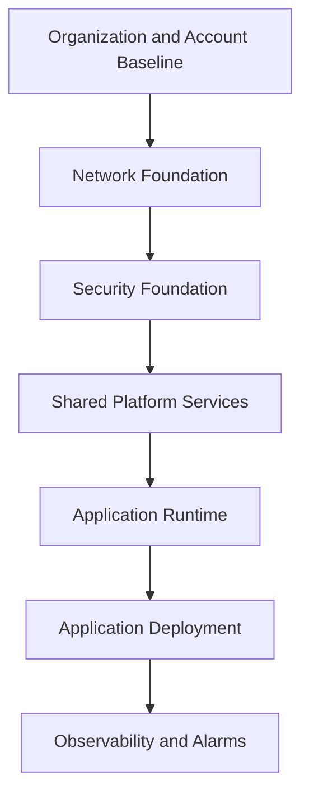
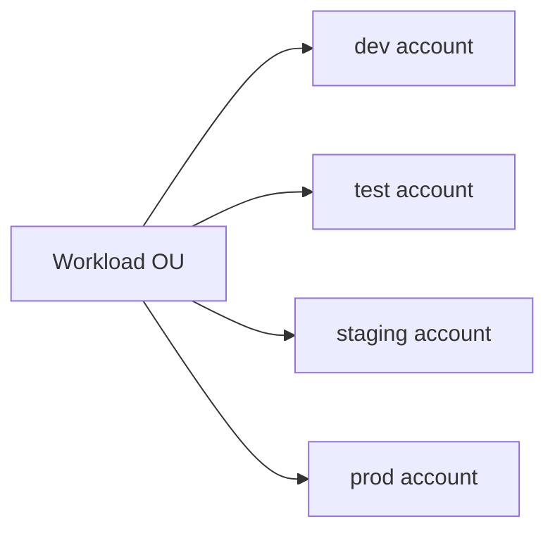
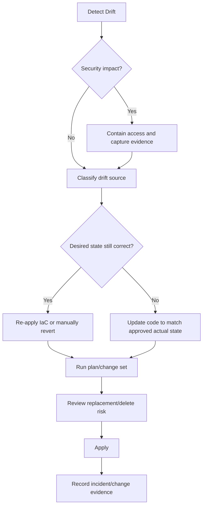
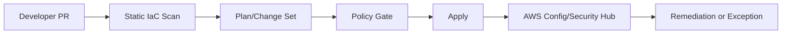
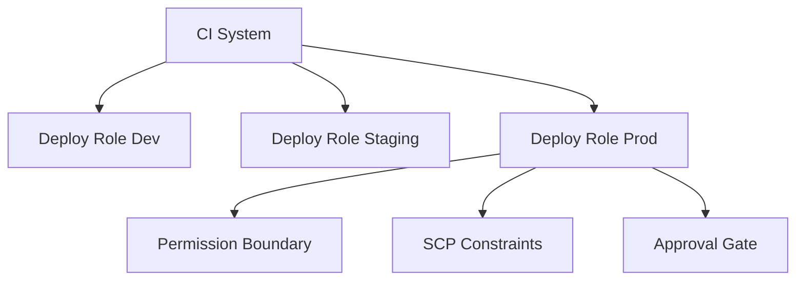
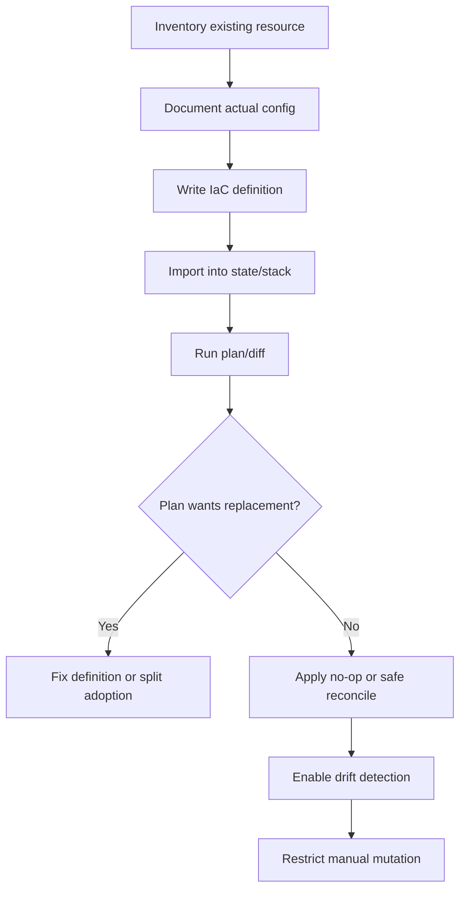

------
title: Learn AWS Engineering Mastery - Part 021
description: Infrastructure as Code mental model for AWS production systems using CloudFormation, CDK, and Terraform, including state, drift, module design, policy-as-code, and safe promotion.
series: learn-aws
seriesTitle: Learn AWS Engineering Mastery
order: 21
partTitle: Infrastructure as Code: CloudFormation, CDK, and Terraform
tags:
- aws
- cloud
- infrastructure-as-code
- cloudformation
- cdk
- terraform
- platform-engineering
- devops
- series
date: 2026-07-01
---

# Infrastructure as Code: CloudFormation, CDK, and Terraform

> Target pembelajaran: setelah bagian ini, kita tidak hanya bisa menulis template IaC. Kita mampu mendesain sistem perubahan infrastruktur yang aman, ter-review, repeatable, auditable, dan bisa dipulihkan ketika terjadi drift, partial failure, atau konflik ownership.

IaC adalah salah satu pembeda utama antara engineer yang “bisa membuat resource AWS” dan engineer yang bisa menjalankan platform AWS production-grade. Di lingkungan kecil, membuat VPC, ECS service, IAM role, atau database dari console mungkin terasa cepat. Di lingkungan enterprise, pendekatan seperti itu menghasilkan konfigurasi tidak terdokumentasi, akses tidak terkendali, lingkungan sulit direplikasi, dan root cause incident yang sulit dibuktikan.

IaC bukan sekadar automation. IaC adalah **sistem kontrol perubahan**.

Kita akan membahas CloudFormation, AWS CDK, dan Terraform bukan sebagai kompetisi tool, tetapi sebagai tiga cara berbeda untuk mengelola state transition di AWS.

---

## 1. Kaufman Skill Map

Dalam pendekatan Josh Kaufman, skill besar harus dipecah menjadi sub-skill kecil yang bisa dilatih secara sengaja. Untuk AWS IaC, skill map-nya seperti ini:

```mermaid
flowchart TD
    A[AWS IaC Mastery] --> B[Desired State Thinking]
    A --> C[Resource Ownership]
    A --> D[State and Drift]
    A --> E[Module and Construct Design]
    A --> F[Environment Promotion]
    A --> G[Policy and Guardrails]
    A --> H[Failure Recovery]

    B --> B1[Template/Config expresses target state]
    B --> B2[Plan/change set predicts transition]
    B --> B3[Apply/deploy mutates real infra]

    C --> C1[One owner per resource]
    C --> C2[Boundary per stack/module]
    C --> C3[No hidden manual mutation]

    D --> D1[Detect drift]
    D --> D2[Classify drift]
    D --> D3[Reconcile or import]

    E --> E1[Reusable modules]
    E --> E2[Opinionated constructs]
    E --> E3[Stable interface]

    F --> F1[Dev to staging to prod]
    F --> F2[Artifact immutability]
    F --> F3[Approval gate]

    G --> G1[IAM constraints]
    G --> G2[Tagging rules]
    G --> G3[Security baseline]

    H --> H1[Rollback]
    H --> H2[Stack failure]
    H --> H3[State repair]
```



Skill yang paling penting bukan menghafal syntax. Yang paling penting adalah kemampuan menjawab:

1. Resource ini dimiliki oleh siapa?
2. State yang benar berada di mana?
3. Apa yang akan berubah sebelum deployment dijalankan?
4. Kalau perubahan gagal di tengah jalan, apa posisi sistem?
5. Kalau ada perubahan manual di console, bagaimana kita tahu dan memulihkannya?
6. Apakah module/construct ini memperkecil risiko atau menyembunyikan risiko?
7. Apakah production bisa dibangun ulang dari definisi yang sama?

---

## 2. Mental Model: IaC as Controlled State Transition

IaC sering dijelaskan sebagai “infrastructure written as code”. Itu benar, tetapi kurang tajam.

Mental model yang lebih berguna:

> IaC adalah mekanisme untuk mengubah real infrastructure dari current state menuju desired state melalui perubahan yang dapat direview, dieksekusi, diaudit, dan dipulihkan.

Ada empat state yang perlu dibedakan:

| State | Makna | Contoh |
|---|---|---|
| Desired state | Definisi yang kita inginkan | CloudFormation template, CDK source, Terraform config |
| Known state | Catatan tool tentang resource | CloudFormation stack state, Terraform state file |
| Actual state | Resource nyata di AWS | VPC, subnet, IAM role, S3 bucket |
| Intended transition | Perubahan yang akan dilakukan | Change set, Terraform plan, CDK diff |

Incident IaC sering terjadi ketika engineer mencampur empat state ini.

Contoh sederhana:

- Desired state mengatakan security group hanya membuka port 443.
- Actual state ternyata membuka port 22 karena ada perubahan manual.
- Known state mungkin belum tahu perubahan tersebut.
- Plan/change set berikutnya mungkin tidak mengubah port 22 jika tool tidak mendeteksi properti tersebut atau resource tidak masuk ownership stack.

Engineer senior selalu bertanya: **state mana yang sedang kita lihat?**

---

## 3. Tool Landscape: CloudFormation, CDK, Terraform

### 3.1 CloudFormation

CloudFormation adalah native AWS IaC engine. Kita mendefinisikan AWS resources dalam template, lalu CloudFormation mengelola resource sebagai stack.

Konsep inti:

| Konsep | Fungsi |
|---|---|
| Template | Deklarasi resource, parameter, mapping, output |
| Stack | Unit lifecycle deployment |
| StackSet | Deployment stack ke banyak account/Region |
| Change set | Preview perubahan sebelum dieksekusi |
| Drift detection | Deteksi konfigurasi resource yang berubah di luar CloudFormation |
| Nested stack | Komposisi stack untuk modularisasi |
| Export/import output | Sharing output antar stack |

CloudFormation kuat untuk organisasi yang ingin native AWS integration, support resmi AWS, dan governance berbasis stack.

Kelemahan utamanya:

- Template bisa verbose.
- Abstraksi reusable tidak senyaman bahasa pemrograman umum.
- Debugging template besar bisa sulit.
- Beberapa lifecycle edge case membutuhkan pemahaman detail atas replacement, deletion policy, dan dependency.

### 3.2 AWS CDK

AWS CDK memungkinkan kita mendefinisikan infrastruktur menggunakan bahasa pemrograman umum. CDK tidak menggantikan CloudFormation sebagai deployment engine untuk mayoritas use case; CDK melakukan synthesis menjadi CloudFormation template.

Konsep inti:

| Konsep | Fungsi |
|---|---|
| App | Root program CDK |
| Stack | Unit deployment, disintesis menjadi CloudFormation stack |
| Construct | Building block reusable |
| L1 construct | Representasi langsung CloudFormation resource |
| L2 construct | Abstraksi AWS opinionated dengan default lebih tinggi |
| L3 construct/pattern | Komposisi arsitektural reusable |
| Synthesis | Proses menghasilkan CloudFormation template |

CDK kuat ketika organisasi ingin reusable platform constructs, abstraction layer, dan developer ergonomics.

Risikonya:

- Abstraksi dapat menyembunyikan detail penting.
- Diff harus dipahami pada output CloudFormation, bukan hanya source code CDK.
- Construct yang terlalu “magical” membuat platform sulit diaudit.
- Bahasa pemrograman membuka peluang logic kompleks yang tidak perlu.

### 3.3 Terraform

Terraform adalah IaC tool multi-provider yang menggunakan deklarasi HCL, provider, modules, state, plan, dan apply.

Konsep inti:

| Konsep | Fungsi |
|---|---|
| Provider | Plugin untuk mengelola API tertentu, misalnya AWS |
| Resource | Objek yang dikelola Terraform |
| Data source | Read-only lookup dari sistem eksternal |
| Module | Komposisi resource reusable |
| State | Mapping antara config Terraform dan actual resources |
| Backend | Lokasi penyimpanan state |
| Plan | Preview perubahan |
| Apply | Eksekusi perubahan |
| Workspace | State terpisah untuk konfigurasi yang sama |

Terraform kuat untuk organisasi multi-cloud, kebutuhan module ecosystem yang luas, dan workflow plan/apply yang mature.

Risikonya:

- State file menjadi komponen kritis.
- Secrets dapat masuk state jika tidak hati-hati.
- Provider behavior dan versioning harus dikontrol.
- Resource ownership antar state harus sangat jelas.

---

## 4. Decision Matrix: Pilih Tool Berdasarkan Boundary, Bukan Fanatisme

Tidak ada tool terbaik universal. Pilihan yang benar tergantung boundary organisasi.

| Situasi | CloudFormation | CDK | Terraform |
|---|---:|---:|---:|
| Native AWS-only dan governance sederhana | Sangat cocok | Cocok | Cocok |
| Butuh abstraksi reusable untuk developer platform | Sedang | Sangat cocok | Cocok |
| Multi-cloud atau banyak SaaS provider | Lemah | Lemah/sedang | Sangat cocok |
| Organisasi sangat AWS-native | Sangat cocok | Sangat cocok | Cocok |
| Tim ops ingin deklarasi eksplisit | Sangat cocok | Sedang | Sangat cocok |
| Tim app ingin infra dalam bahasa aplikasi | Sedang | Sangat cocok | Sedang |
| Audit ingin perubahan stack native | Sangat cocok | Cocok karena output CFN | Cocok jika state/log terkelola |
| Kompleksitas state rendah | Sangat cocok | Sangat cocok | Perlu disiplin backend |
| Library internal platform | Sedang | Sangat cocok | Sangat cocok |

Rule praktis:

- Gunakan **CloudFormation** jika organisasi ingin native AWS IaC dan eksplisitas lebih penting daripada ergonomics.
- Gunakan **CDK** jika organisasi ingin membangun internal platform constructs di atas AWS.
- Gunakan **Terraform** jika organisasi mengelola banyak provider, butuh module ecosystem luas, atau sudah punya Terraform operating model matang.

Yang salah bukan memilih tool tertentu. Yang salah adalah memilih tool tanpa operating model.

---

## 5. IaC Ownership Boundary

Masalah terbesar IaC enterprise biasanya bukan syntax, tetapi ownership.

### 5.1 Satu resource harus punya satu lifecycle owner

Anti-pattern:

- VPC dibuat Terraform.
- Subnet diubah manual.
- Security group ditambah CDK.
- Route table dimodifikasi console.
- Tag diperbaiki automation Lambda.

Hasilnya: tidak ada satu sistem yang benar-benar tahu desired state.

Rule:

> Satu resource harus punya satu owner lifecycle utama. Sistem lain boleh membaca output-nya, tetapi tidak boleh memutasi properti yang sama tanpa kontrak eksplisit.

### 5.2 Boundary berdasarkan lifecycle, bukan hanya service

Stack/module yang baik mengikuti lifecycle perubahan.

Contoh boundary buruk:

```txt
network-and-app-and-db-stack
```

Kenapa buruk?

- VPC berubah jarang.
- App service berubah sering.
- Database berubah dengan risiko tinggi.
- Security baseline punya approval berbeda.

Boundary lebih baik:

```txt
foundation-network-stack
shared-security-stack
application-runtime-stack
application-data-stack
application-observability-stack
```

### 5.3 Dependency direction harus stabil

Dependency IaC sebaiknya mengalir dari foundation ke workload.



Yang harus dihindari:

```txt
network stack depends on app stack output
```

Itu membuat foundation sulit diubah, dihapus, atau direplikasi.

---

## 6. Stack, Module, and Construct Design

### 6.1 Interface lebih penting daripada implementasi

Reusable module/construct bukan sekadar mengurangi copy-paste. Module adalah kontrak.

Module yang baik memiliki:

- Input minimal dan jelas.
- Output stabil.
- Default aman.
- Escape hatch terbatas.
- Naming dan tagging konsisten.
- Validasi parameter.
- Dokumentasi security/cost implication.
- Upgrade path.

Module yang buruk:

- Menerima terlalu banyak parameter.
- Membuka semua opsi AWS mentah tanpa opini.
- Membuat resource tersembunyi yang tidak terlihat oleh pemakai.
- Menghasilkan IAM policy terlalu luas.
- Sulit dihapus karena dependency tidak jelas.
- Tidak punya versioning.

### 6.2 Level abstraksi

| Level | Contoh | Kapan dipakai |
|---|---|---|
| Raw resource | `AWS::S3::Bucket`, `aws_s3_bucket` | Ketika butuh kontrol penuh |
| Service module | `secure-s3-bucket`, `ecs-service` | Untuk baseline berulang |
| Platform pattern | `public-api-service`, `event-consumer-service` | Untuk golden path developer |
| Product blueprint | `regulated-case-management-workload` | Untuk domain enterprise spesifik |

Semakin tinggi abstraksi, semakin besar tanggung jawab desain. Jangan membuat pattern tinggi sebelum invariant rendah stabil.

### 6.3 Construct/module harus expose decision, bukan detail acak

Contoh parameter buruk:

```yaml
bucketAcl: private
blockPublicAcls: true
blockPublicPolicy: true
ignorePublicAcls: true
restrictPublicBuckets: true
encryptionAlgorithm: AES256
versioningStatus: Enabled
```

Untuk internal platform, lebih baik:

```yaml
dataClassification: confidential
retentionProfile: regulated-7-years
publicAccess: false
```

Lalu construct menerjemahkannya menjadi konfigurasi teknis. Ini membuat developer berpikir dalam bahasa risiko, bukan checklist properti.

---

## 7. Environment Strategy

### 7.1 Environment bukan hanya nama

Environment adalah kombinasi dari:

- AWS account.
- Region.
- Network boundary.
- IAM boundary.
- Data classification.
- Approval policy.
- Deployment frequency.
- Observability threshold.
- Cost allocation.

`dev`, `staging`, dan `prod` bukan sekadar variable.

### 7.2 Account-per-environment sebagai baseline enterprise

Untuk workload serius, baseline yang kuat adalah pemisahan account:



Keuntungan:

- Blast radius lebih kecil.
- IAM boundary lebih kuat.
- Billing dan tagging lebih jelas.
- Quota terpisah.
- Audit evidence lebih rapi.
- Cleanup environment lebih aman.

Trade-off:

- Lebih banyak account lifecycle.
- Perlu landing zone dan account vending.
- Cross-account deployment lebih kompleks.
- Shared services harus dirancang matang.

### 7.3 Jangan menyamakan Terraform workspace dengan account isolation

Terraform workspace memisahkan state untuk konfigurasi yang sama. Ini berguna, tetapi bukan pengganti account boundary.

Masalah umum:

```txt
terraform workspace select prod
terraform apply
```

Satu kesalahan context bisa berdampak produksi.

Untuk production, lebih aman jika boundary dipisah melalui:

- Backend state berbeda.
- AWS account berbeda.
- Role berbeda.
- Pipeline berbeda.
- Approval berbeda.
- Variable file eksplisit.

---

## 8. State Management

### 8.1 CloudFormation state

CloudFormation menyimpan stack state di AWS. Engineer biasanya tidak mengelola state file langsung. Namun tetap ada risiko:

- Stack stuck pada rollback state.
- Resource gagal delete karena dependency eksternal.
- Resource diganti karena property replacement.
- Drift terjadi akibat perubahan manual.
- Export/import dependency mengunci urutan perubahan.

### 8.2 Terraform state

Terraform state adalah mapping kritis antara config dan resource nyata.

State harus diperlakukan sebagai asset sensitif.

Baseline Terraform state di AWS biasanya:

- Remote backend S3.
- DynamoDB atau native locking sesuai backend/version strategy yang dipakai organisasi.
- Encryption at rest.
- Versioning bucket.
- Access restricted by IAM.
- Separate state per account/environment/workload boundary.
- CI-only apply untuk production.

Jangan:

- Menyimpan state lokal untuk production.
- Commit `terraform.tfstate` ke Git.
- Memberi akses read state luas jika state dapat berisi sensitive values.
- Menggabungkan semua resource enterprise ke satu state raksasa.

### 8.3 State size and blast radius

State terlalu besar menyebabkan:

- Plan lambat.
- Lock contention.
- Risiko apply besar.
- Sulit delegation antar tim.
- Sulit recovery partial.

State terlalu kecil menyebabkan:

- Terlalu banyak dependency output.
- Orchestration rumit.
- Drift antar boundary.
- Cross-stack reference berlebihan.

Prinsip:

> Pecah state berdasarkan lifecycle, ownership, dan blast radius, bukan berdasarkan preferensi folder.

---

## 9. Drift: Detection, Classification, Recovery

Drift adalah perbedaan antara actual state dan desired/known state.

### 9.1 Sumber drift

| Sumber | Contoh | Risiko |
|---|---|---|
| Manual console change | Security group dibuka sementara | Security exposure |
| Emergency fix | ASG desired capacity diubah saat incident | Config tidak konsisten |
| External automation | Lambda tagging otomatis mengubah tag | Plan noise |
| Service-side default change | AWS menambahkan default property | Diff tidak stabil |
| Import tidak lengkap | Existing resource diadopsi sebagian | Replacement risk |

### 9.2 Drift bukan selalu salah

Drift harus diklasifikasi.

| Kelas drift | Tindakan |
|---|---|
| Unauthorized drift | Revert dan investigasi akses |
| Emergency drift | Backport ke IaC atau rollback manual change |
| Expected external drift | Ubah ownership boundary atau ignore rule secara eksplisit |
| Tool limitation drift | Dokumentasikan dan monitor manual |
| Service-managed drift | Jangan paksa override kecuali berisiko |

### 9.3 Drift recovery playbook



---

## 10. Change Preview: Plan and Change Set Discipline

Production IaC must never be blind apply.

### 10.1 CloudFormation change sets

Change sets allow us to preview resources that will be added, modified, or deleted before executing the change.

Review checklist:

- Is any resource replacement planned?
- Is any data-bearing resource deleted or recreated?
- Are IAM policies expanded?
- Are security group ingress/egress rules relaxed?
- Are route tables modified?
- Are load balancer listeners changed?
- Are KMS keys, bucket policies, or backup settings changed?
- Are deletion policies correct?

### 10.2 Terraform plan

Terraform plan should be treated as a production change artifact.

Review checklist:

- `+` create resources expected?
- `~` update fields expected?
- `-/+` replacement acceptable?
- `-` delete safe?
- Sensitive output handled?
- Provider version stable?
- Data source lookup stable?
- Any unknown values affect critical resources?
- Any `ignore_changes` hiding risk?

### 10.3 CDK diff

CDK source diff is not enough. Review synthesized infrastructure diff.

Important:

- Review generated IAM policies.
- Review generated security groups.
- Review generated logical IDs.
- Watch accidental replacement from construct refactor.
- Pin library versions.
- Snapshot critical generated templates for high-risk constructs.

---

## 11. Secrets, Sensitive Data, and IaC

IaC should define references to secrets, not secret values.

Bad:

```hcl
variable "db_password" {
  default = "SuperSecret123"
}
```

Better:

```hcl
variable "db_password_secret_arn" {
  type = string
}
```

Then application/runtime reads from Secrets Manager or SSM Parameter Store through IAM.

### 11.1 Rules

- Do not commit secrets in IaC source.
- Do not store raw secret values in Terraform state where avoidable.
- Avoid outputting sensitive values.
- Use dynamic references or secret ARNs where supported.
- Restrict who can read state.
- Rotate credentials outside IaC lifecycle unless rotation itself is modeled.
- Avoid using IaC apply as secret distribution mechanism.

### 11.2 KMS and ownership

For KMS keys, define clearly:

- Who administers key policy?
- Which services can use key?
- Which principals can decrypt?
- Is key multi-Region?
- What is deletion window?
- What is rotation policy?
- How is access audited?

KMS misconfiguration can break entire workloads. Treat key policy changes as high-risk IaC changes.

---

## 12. Policy-as-Code and Guardrails

IaC gives repeatability. Policy-as-code gives enforceability.

Policy controls should exist at multiple layers:

| Layer | Control |
|---|---|
| Developer workstation | Linting, formatting, unit tests |
| Pull request | Static analysis, review checklist |
| CI pipeline | Plan/change set, policy evaluation |
| AWS account | SCP, IAM, permission boundary |
| Runtime | AWS Config, Security Hub, CloudTrail |
| Organization | Exception process and evidence |

Examples of policies:

- S3 buckets must block public access unless exception approved.
- RDS must have backup retention above minimum.
- Production security groups cannot expose SSH/RDP to internet.
- IAM policies cannot contain `Action: *` and `Resource: *` without exception.
- Resources must have owner, cost center, data classification tags.
- CloudWatch alarms required for production services.
- KMS encryption required for regulated data stores.

### 12.1 Preventive vs detective

Preventive control blocks bad changes before apply. Detective control finds violations after deployment.

Use both.



---

## 13. Testing IaC

IaC testing has multiple levels.

| Level | Purpose | Example |
|---|---|---|
| Format | Consistency | `terraform fmt`, CDK format |
| Static validation | Syntax/schema | `terraform validate`, CloudFormation validate-template |
| Lint | Best practice | cfn-lint, tflint |
| Unit test | Construct/module output | CDK assertions, Terraform module tests |
| Snapshot test | Catch generated diff | Synthesized templates |
| Security scan | Misconfiguration | Checkov, tfsec, cfn-nag, custom policy |
| Integration test | Real AWS behavior | Deploy ephemeral stack and test endpoints |
| Failure test | Recovery behavior | Delete dependency, simulate denied permission |

Testing IaC tidak boleh hanya memvalidasi “template valid”. Template valid bisa tetap insecure, mahal, atau tidak resilient.

### 13.1 What to test in a platform module

Untuk module `regulated-s3-bucket`, test minimal:

- Block public access enabled.
- Versioning enabled jika profile membutuhkan.
- Default encryption configured.
- Access logs atau data events configured sesuai policy.
- Lifecycle retention sesuai profile.
- Bucket policy tidak membuka public access.
- Tags lengkap.
- Output stabil.
- Deletion policy sesuai data classification.

---

## 14. Promotion Model

IaC production-grade harus bisa dipromosikan.

Anti-pattern:

```txt
Engineer runs local apply to dev.
Engineer edits variable manually.
Engineer runs local apply to prod.
```

Better:



```mermaid
flowchart LR
    A[Pull Request] --> B[Static Checks]
    B --> C[Dev Plan]
    C --> D[Dev Apply]
    D --> E[Integration Tests]
    E --> F[Staging Plan]
    F --> G[Approval]
    G --> H[Staging Apply]
    H --> I[Prod Plan]
    I --> J[Change Approval]
    J --> K[Prod Apply]
    K --> L[Post-change Verification]
```

### 14.1 Artifact immutability

Promotion should promote the same reviewed artifact.

For CDK:

- Source commit is fixed.
- Synthesized template can be archived.
- CDK context is controlled.
- Dependency lockfile is used.

For Terraform:

- Provider versions locked.
- Module versions pinned.
- Plan generated in controlled environment.
- Apply uses reviewed plan where operating model supports it.

For CloudFormation:

- Template package is versioned.
- Change set reviewed.
- Execution approved.

---

## 15. IAM for IaC Pipelines

IaC pipeline permissions are dangerous because IaC can create almost anything.

### 15.1 Separate execution roles

Use different roles per environment.



### 15.2 Least privilege vs practicality

Perfect least privilege for IaC is difficult because resource creation spans many services. Practical approach:

- Use broad deploy role only inside isolated account.
- Constrain with SCP and permission boundary.
- Separate high-risk stacks, e.g. IAM/KMS/network.
- Require approval for production.
- Log all assumes and API calls.
- Prohibit human direct use of deploy role.
- Use session tags for traceability.

### 15.3 High-risk permissions

Review carefully:

- `iam:*`
- `kms:*`
- `organizations:*`
- `route53:*`
- `ec2:CreateRoute`, `ec2:AuthorizeSecurityGroupIngress`
- `s3:PutBucketPolicy`
- `lambda:AddPermission`
- `cloudformation:*` with admin role
- `sts:AssumeRole`

---

## 16. Deletion, Replacement, and Data Safety

The scariest IaC operation is not create. It is delete/replacement.

### 16.1 Data-bearing resources

High-risk resources:

- RDS/Aurora clusters.
- DynamoDB tables.
- S3 buckets.
- EFS file systems.
- KMS keys.
- OpenSearch domains.
- MSK clusters.
- CloudWatch log groups with audit logs.

Baseline protection:

- Deletion protection where supported.
- Retain policy or snapshot policy.
- Backup plan.
- Manual approval for replacement.
- Explicit migration plan.
- Restore test before destructive change.

### 16.2 Logical ID stability in CloudFormation/CDK

CloudFormation tracks resources by logical ID inside stack. In CDK, refactoring construct paths can change logical IDs, which can trigger replacement if not controlled.

Rule:

- Be careful refactoring constructs in production stacks.
- Review synthesized template diff.
- Stabilize logical IDs where needed.
- Avoid unnecessary nesting changes.

### 16.3 Terraform resource address stability

Terraform tracks resources by resource address in state.

Refactor risks:

- Renaming resource block.
- Moving into module.
- Changing `count` to `for_each`.
- Changing keys in `for_each`.

Use state move operations intentionally when refactoring.

---

## 17. Importing Existing Infrastructure

Enterprise teams often inherit manually created resources.

Import is not a shortcut. It is a controlled adoption process.

### 17.1 Adoption flow



### 17.2 Common import mistakes

- Importing without matching all critical properties.
- Importing data resources without backup.
- Adopting resource into wrong state boundary.
- Ignoring generated diff after import.
- Failing to disable manual admin paths.
- Not documenting exceptions.

---

## 18. Folder and Repository Structure

Structure should reflect ownership and lifecycle.

Example monorepo:

```txt
infra/
  foundations/
    organization/
    network/
    security/
  platform/
    ecs-service/
    eks-cluster/
    data-store/
  workloads/
    case-management/
      dev/
      staging/
      prod/
  policies/
  tests/
  docs/
```

Example multi-repo:

```txt
platform-foundation-infra
platform-service-modules
workload-case-management-infra
workload-payment-infra
```

Monorepo advantages:

- Easier cross-cutting refactor.
- Shared CI policy.
- Central visibility.

Multi-repo advantages:

- Ownership isolation.
- Smaller blast radius.
- Easier access control by team.

There is no universal answer. Align repo structure with team ownership.

---

## 19. IaC for Platform Engineering

For internal developer platforms, IaC should expose golden paths.

Example: instead of asking every team to define ALB, ECS service, IAM role, log group, autoscaling, alarms, and dashboard manually, expose:

```yaml
serviceName: enforcement-api
runtime: ecs-fargate
exposure: internal-api
dataClassification: confidential
autoscaling:
  min: 2
  max: 20
slo:
  availability: 99.9
  p95LatencyMs: 300
```

The platform module creates:

- ECS service.
- Task role.
- Execution role.
- Security groups.
- Load balancer target group.
- Listener rule.
- CloudWatch logs.
- Alarms.
- Autoscaling policy.
- Tags.
- Dashboard.
- Deployment policy.

This improves developer velocity while preserving governance.

But platform abstraction must stay inspectable. Engineers must be able to see generated resources and understand failure modes.

---

## 20. Failure Modes

| Failure mode | Symptom | Root cause | Mitigation |
|---|---|---|---|
| Blind apply deletes resource | Data loss or outage | No plan review | Approval gate, deletion protection |
| State lock contention | Pipeline blocked | Too-large state or concurrent applies | Split state, serialize pipeline |
| Manual drift | Plan surprise | Console changes | Drift detection, restrict access |
| Provider version break | Unexpected diff | Unpinned provider | Lock provider versions |
| CDK logical ID change | Resource replacement | Construct refactor | Review synth diff, stabilize IDs |
| Stack rollback stuck | Deployment blocked | Failed resource update/delete | Runbook, retain/import strategy |
| Secrets in state | Data exposure | Secret values passed through IaC | Secret references, state access control |
| Module over-abstraction | Hidden risk | Magical construct | Transparent outputs and docs |
| Cross-stack dependency deadlock | Cannot update/delete | Export/import coupling | Stable contracts, avoid circular dependency |
| IAM escalation | Privilege abuse | Deploy role too broad | SCP, permission boundary, audit |

---

## 21. Production Checklist

Before approving an IaC production change:

- [ ] Does the plan/change set match the intended change?
- [ ] Are there deletions or replacements?
- [ ] Are data-bearing resources protected?
- [ ] Are IAM permissions expanded?
- [ ] Are network routes/security groups changed?
- [ ] Are KMS key policies changed?
- [ ] Are resource names/logical IDs stable?
- [ ] Are module/provider versions pinned?
- [ ] Is state backend healthy and locked?
- [ ] Are secrets excluded from code and outputs?
- [ ] Is rollback/recovery path known?
- [ ] Are observability and alarms updated?
- [ ] Are tags and cost allocation preserved?
- [ ] Is change evidence captured?

---

## 22. Deliberate Practice

### Exercise 1: Build a secure S3 module

Design a reusable module/construct for regulated S3 storage.

Requirements:

- Block public access.
- Default encryption.
- Versioning option.
- Lifecycle policy.
- Tags.
- Access logging or CloudTrail data event note.
- Optional Object Lock profile.
- Stable outputs.

Self-correction:

- Can this module be used safely by an application team?
- What data classification assumptions are encoded?
- What should be configurable and what should be fixed?

### Exercise 2: Review a risky plan

Create an intentional change that causes replacement of a data resource in dev. Review the plan/change set and write the production rejection note.

Focus:

- Identify replacement.
- Identify data loss risk.
- Propose safer migration.
- Define approval requirement.

### Exercise 3: Simulate drift

Manually modify a security group in a sandbox. Then detect drift or plan mismatch.

Write:

- What changed?
- Who could have changed it?
- Was it security relevant?
- Should IaC revert or adopt the change?
- Which access path should be closed?

### Exercise 4: Split state/stack boundary

Given one large stack containing VPC, ECS, RDS, and CloudWatch alarms, propose a split by lifecycle.

Expected output:

- New boundaries.
- Dependency direction.
- Outputs/contracts.
- Migration sequence.
- Rollback plan.

---

## 23. Anti-Patterns

- Treating IaC as deployment script only.
- Letting humans mutate production resources from console.
- Running production apply from laptop.
- Mixing multiple IaC tools on same resource without clear ownership.
- Storing secrets in code or state outputs.
- Creating one giant state for everything.
- Creating too many tiny states with fragile dependencies.
- Accepting every module parameter AWS exposes.
- Hiding IAM/security rules inside magical constructs.
- Ignoring plan/change set because “it usually works”.
- Not testing restore before destructive infrastructure changes.
- Pinning nothing and hoping provider/library updates are safe.
- Refactoring CDK constructs without reviewing logical ID changes.

---

## 24. Engineering Judgment Summary

Top-tier AWS engineer treats IaC as a **change-control system**.

The mature question is not:

> “Can I create this resource?”

The mature question is:

> “Can this resource be created, changed, reviewed, promoted, audited, recovered, and safely deleted under production constraints?”

CloudFormation, CDK, and Terraform are only mechanisms. The real engineering discipline is:

- Clear ownership.
- Stable boundaries.
- Safe state management.
- Predictable promotion.
- Explicit policy gates.
- Drift handling.
- Recovery playbooks.
- Evidence capture.

If those exist, IaC becomes a platform capability. Without them, IaC becomes a faster way to produce undocumented risk.

---

## References

- AWS CloudFormation User Guide: Change Sets — https://docs.aws.amazon.com/AWSCloudFormation/latest/UserGuide/using-cfn-updating-stacks-changesets.html
- AWS CloudFormation User Guide: Drift Detection — https://docs.aws.amazon.com/AWSCloudFormation/latest/UserGuide/using-cfn-stack-drift.html
- AWS CDK Developer Guide — https://docs.aws.amazon.com/cdk/v2/guide/home.html
- AWS CDK Stacks — https://docs.aws.amazon.com/cdk/v2/guide/stacks.html
- Terraform Documentation — https://developer.hashicorp.com/terraform
- Terraform Modules — https://developer.hashicorp.com/terraform/language/modules
- Terraform Workspaces and State — https://developer.hashicorp.com/terraform/language/state/workspaces
