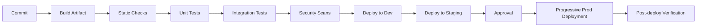
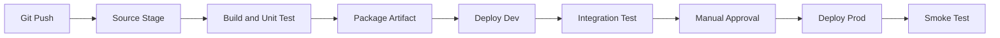
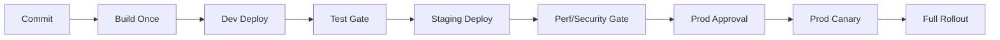
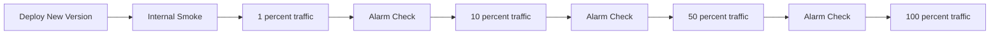
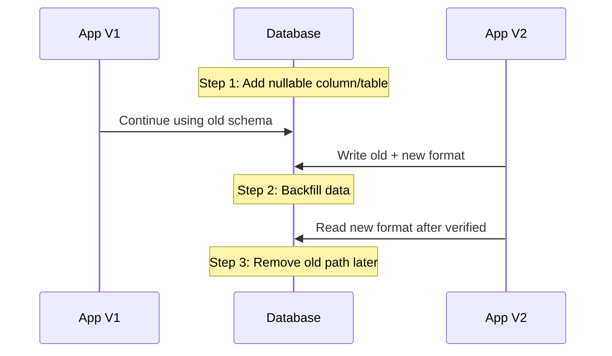
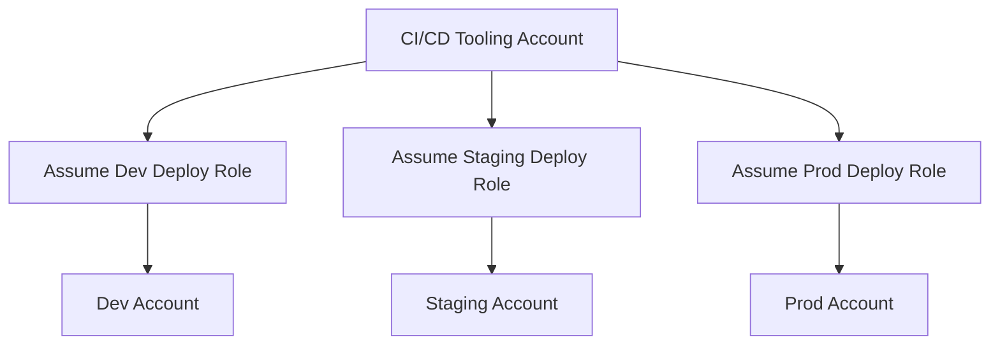

------
title: Learn AWS Engineering Mastery - Part 022
description: CI/CD, release safety, progressive delivery, deployment gates, rollback, artifact integrity, and production release governance on AWS.
series: learn-aws
seriesTitle: Learn AWS Engineering Mastery
order: 22
partTitle: CI/CD, Release Safety, and Progressive Delivery
tags:
- aws
- cicd
- codepipeline
- codebuild
- codedeploy
- devops
- release-engineering
- platform-engineering
- progressive-delivery
- series
date: 2026-07-01
---

# CI/CD, Release Safety, and Progressive Delivery

> Target pembelajaran: setelah bagian ini, kita mampu mendesain release pipeline yang bukan hanya cepat, tetapi juga aman, terukur, bisa rollback, bisa diaudit, dan cocok untuk workload production yang memiliki risiko bisnis/regulasi.

CI/CD sering disalahpahami sebagai “otomatis deploy setelah merge”. Itu terlalu dangkal. Di sistem production-grade, CI/CD adalah **sistem manajemen perubahan** untuk software dan infrastructure.

Pipeline yang baik menjawab:

1. Artifact apa yang dibuat?
2. Siapa yang menyetujui perubahan?
3. Test apa yang membuktikan perubahan aman?
4. Bagaimana traffic dipindahkan?
5. Kapan deployment dihentikan otomatis?
6. Bagaimana rollback dilakukan?
7. Evidence apa yang tersimpan untuk audit?
8. Bagaimana deployment mencegah supply-chain compromise?

AWS menyediakan banyak building block: CodePipeline, CodeBuild, CodeDeploy, CodeArtifact, ECR, CloudFormation/CDK/Terraform integration, Lambda aliases, ECS blue/green, API Gateway stages, CloudWatch alarms, EventBridge, IAM, KMS, S3 artifact bucket, dan integrasi eksternal seperti GitHub Actions/Jenkins/Spinnaker/ArgoCD.

Tetapi tool bukan pusatnya. Pusatnya adalah **release safety**.

---

## 1. Kaufman Skill Map

```mermaid
flowchart TD
    A[AWS Release Engineering Mastery] --> B[Pipeline Architecture]
    A --> C[Artifact Integrity]
    A --> D[Quality Gates]
    A --> E[Deployment Strategy]
    A --> F[Progressive Delivery]
    A --> G[Rollback and Roll Forward]
    A --> H[Audit and Governance]

    B --> B1[Source]
    B --> B2[Build]
    B --> B3[Test]
    B --> B4[Deploy]

    C --> C1[Immutable artifact]
    C --> C2[Provenance]
    C --> C3[Signing/scanning]

    D --> D1[Unit/integration/security tests]
    D --> D2[Manual approval]
    D --> D3[Policy gates]

    E --> E1[Rolling]
    E --> E2[Blue/green]
    E --> E3[Canary/linear]

    F --> F1[Traffic shifting]
    F --> F2[Alarms]
    F --> F3[Automatic stop]

    G --> G1[Rollback trigger]
    G --> G2[Database compatibility]
    G --> G3[Feature flags]

    H --> H1[Change evidence]
    H --> H2[Separation of duties]
    H --> H3[Traceability]
```



Skill inti bukan membuat pipeline YAML. Skill inti adalah mengontrol perubahan produksi.

---

## 2. Mental Model: Release Pipeline as Risk Reduction System

Pipeline adalah rangkaian checkpoint yang mengubah source code menjadi production behavior.



Setiap stage harus mengurangi risiko tertentu.

| Stage | Risiko yang dikurangi |
|---|---|
| Build | Source tidak bisa dikompilasi atau artifact tidak reproducible |
| Unit test | Logic lokal rusak |
| Static analysis | Bug/security smell sebelum runtime |
| Dependency scan | Vulnerable dependency |
| Container scan | Image rentan atau salah konfigurasi |
| IaC scan | Infrastruktur insecure/mahal/rapuh |
| Integration test | Kontrak antar komponen rusak |
| Staging deploy | Environment/runtime mismatch |
| Approval | Business/regulatory risk |
| Canary | Production-specific failure |
| Alarm gate | Error rate/latency meningkat |
| Rollback | Mengurangi durasi incident |

Pipeline buruk hanya memindahkan artifact. Pipeline baik menyaring risiko.

---

## 3. AWS CI/CD Building Blocks

### 3.1 CodePipeline

CodePipeline adalah orchestrator pipeline. Ia mengatur stage dan action.

Konsep:

| Konsep | Makna |
|---|---|
| Pipeline | Workflow release end-to-end |
| Stage | Unit logis seperti Source, Build, Test, Deploy |
| Action | Aktivitas di dalam stage |
| Artifact | File/output yang diproses antar action |
| Approval | Manual gate |
| Execution | Satu run pipeline |

CodePipeline cocok ketika organisasi ingin AWS-native pipeline, integrasi IAM/KMS/S3/CloudWatch/EventBridge, dan deployment lintas AWS services.

### 3.2 CodeBuild

CodeBuild adalah managed build service.

Konsep:

| Konsep | Makna |
|---|---|
| Build project | Definisi build environment |
| Buildspec | YAML berisi command build/test/artifact |
| Environment image | Runtime build, misalnya Java, Node, Docker |
| Artifact output | Hasil build untuk deploy |
| Report group | Test reports |
| Cache | Dependency/build cache |

Buildspec bukan tempat menaruh seluruh release logic. Buildspec sebaiknya menjalankan command reproducible yang juga bisa diuji lokal atau di CI lain.

### 3.3 CodeDeploy

CodeDeploy mengelola deployment ke compute target seperti EC2/on-prem, Lambda, dan ECS.

Strategi penting:

- In-place deployment untuk EC2/on-prem.
- Blue/green deployment untuk ECS/Lambda dan EC2 tertentu.
- Traffic shifting all-at-once, linear, atau canary untuk Lambda/ECS sesuai dukungan platform.
- Alarm-based rollback.
- Lifecycle hooks.

### 3.4 ECR and container artifact

Untuk container workload, ECR adalah artifact registry.

Artifact container harus:

- Immutable by digest.
- Di-scan vulnerability.
- Ditag dengan commit SHA/version.
- Tidak hanya bergantung pada mutable tag seperti `latest`.
- Dipromosikan antar environment dengan digest yang sama.

### 3.5 External CI/CD tools

Banyak organisasi memakai GitHub Actions, GitLab CI, Jenkins, Buildkite, CircleCI, ArgoCD, atau Spinnaker.

Itu valid. Namun AWS boundary tetap harus jelas:

- Bagaimana tool eksternal assume role ke AWS?
- Apakah menggunakan OIDC federation, bukan long-lived key?
- Siapa yang bisa deploy ke prod?
- Bagaimana artifact disimpan dan diverifikasi?
- Bagaimana CloudTrail mencatat deployment identity?
- Bagaimana secrets disediakan?

---

## 4. Pipeline Architecture Patterns

### 4.1 Simple service pipeline



Cocok untuk workload kecil dengan risiko rendah.

### 4.2 Multi-environment promotion pipeline



Prinsip penting: **build once, promote same artifact**.

Jangan build ulang artifact berbeda untuk production kecuali ada alasan kuat. Build ulang membuka risiko perbedaan dependency, base image, compiler, atau generated output.

### 4.3 Platform pipeline vs workload pipeline

Pisahkan pipeline platform dan workload.

| Pipeline | Contoh perubahan | Frekuensi | Risiko |
|---|---|---:|---|
| Foundation pipeline | Account, VPC, IAM baseline | Rendah | Sangat tinggi |
| Platform pipeline | ECS/EKS module, shared ingress | Sedang | Tinggi |
| Workload infra pipeline | Service-specific infra | Sedang | Sedang/tinggi |
| Application pipeline | App image/function | Tinggi | Sedang |

Jangan gunakan approval model yang sama untuk semua layer.

---

## 5. Artifact Integrity

Artifact adalah apa yang benar-benar dideploy.

Untuk Java service, artifact bisa berupa JAR/container image. Untuk Lambda, artifact bisa zip atau container image. Untuk IaC, artifact bisa CloudFormation template, CDK assembly, Terraform plan, atau packaged chart/manifest.

### 5.1 Artifact invariants

Artifact production-grade harus:

- Reproducible.
- Immutable.
- Versioned.
- Traceable ke commit.
- Scanned.
- Stored di registry/bucket dengan access control.
- Deployed by digest/version, bukan floating tag.
- Tidak mengandung secret.

### 5.2 Bad artifact practice

```txt
Build dev image: my-api:latest
Test my-api:latest
Build again for prod: my-api:latest
Deploy prod my-api:latest
```

Masalah:

- Tidak ada jaminan dev dan prod artifact sama.
- `latest` bisa berubah.
- Audit sulit.
- Rollback ambigu.

Better:

```txt
Build image: my-api@sha256:abc...
Tag: my-api:git-9f3a2c1
Scan digest
Deploy same digest to dev
Promote same digest to staging
Promote same digest to prod
```

---

## 6. Quality Gates

Gate bukan birokrasi. Gate adalah filter risiko.

### 6.1 Technical gates

- Unit tests.
- Integration tests.
- Contract tests.
- Static analysis.
- Dependency vulnerability scan.
- Container image scan.
- IaC lint/security scan.
- License scan.
- Performance regression test.
- Migration compatibility test.

### 6.2 Operational gates

- Dashboard exists.
- Alerts configured.
- Runbook updated.
- Rollback path known.
- On-call aware.
- Feature flag configured.
- Capacity check passed.
- Quota check passed.

### 6.3 Governance gates

- Manual approval for production.
- Change ticket linked where required.
- Segregation of duties.
- Evidence archived.
- Security exception documented.
- Data classification reviewed.

### 6.4 Gate placement

Do not put expensive tests too early if cheap tests can fail fast.

Good order:

```txt
format -> compile -> unit -> static scan -> package -> integration -> deploy test -> security/perf -> approval -> prod rollout
```

---

## 7. Deployment Strategies

### 7.1 All-at-once

All traffic moves to new version immediately.

Pros:

- Simple.
- Fast.
- Cheap.

Cons:

- High blast radius.
- Failure impacts all users quickly.
- Rollback must be fast.

Use for:

- Low-risk internal services.
- Non-critical batch workers.
- Dev/test.

Avoid for:

- Critical APIs.
- User-facing systems.
- Regulated workflows with complex state transitions.

### 7.2 Rolling deployment

Replace instances/tasks gradually.

Pros:

- Lower capacity spike.
- Common for ECS/EKS/ASG.
- Simple mental model.

Cons:

- Old and new versions coexist.
- Requires backward compatibility.
- Rollback may still be gradual.

Key invariant:

> Version N and N+1 must be compatible during rollout.

### 7.3 Blue/green deployment

Run blue and green environments/task sets side by side, then shift traffic.

Pros:

- Clear rollback to old environment.
- Pre-traffic validation possible.
- Safer for critical services.

Cons:

- More infrastructure capacity.
- More complex routing.
- Database migrations still hard.

### 7.4 Canary deployment

Send small percentage of traffic to new version first.

Pros:

- Detect production-only failures early.
- Limits blast radius.
- Works well with strong observability.

Cons:

- Needs statistically meaningful traffic.
- Requires fast and accurate alarms.
- Not enough for rare-path failures.

### 7.5 Linear deployment

Shift traffic gradually in fixed increments.

Pros:

- Controlled ramp-up.
- Easier to observe trend.

Cons:

- Takes longer.
- Requires compatibility window.

---

## 8. Progressive Delivery

Progressive delivery means release is not a binary event. It is a controlled exposure process.



Progressive delivery needs:

- Traffic shifting mechanism.
- Versioned target groups/aliases/task sets.
- Metrics with low delay.
- Error budget awareness.
- Automatic rollback conditions.
- Feature flags for behavior-level control.

### 8.1 Lambda progressive delivery

Common pattern:

- Publish immutable Lambda version.
- Point alias to version.
- Shift alias traffic gradually.
- Use CodeDeploy deployment group.
- Attach CloudWatch alarms.
- Roll back alias on alarm.

### 8.2 ECS progressive delivery

Common pattern:

- New task definition revision.
- New task set or service deployment.
- ALB target group traffic shifting.
- CodeDeploy or native deployment controller depending on platform/version and organizational standard.
- Monitor ALB 5xx, target 5xx, latency, task health, custom app metrics.

### 8.3 EKS progressive delivery

AWS-native services can integrate, but EKS progressive delivery often uses Kubernetes ecosystem tools:

- Argo Rollouts.
- Flagger.
- Gateway/ingress traffic weights.
- Service mesh if present.
- Prometheus/CloudWatch metrics.

AWS concern remains:

- IAM identity.
- Cluster access.
- Load balancer behavior.
- CloudWatch/AMP observability.
- Multi-account deployment role.

---

## 9. Rollback, Roll Forward, and Compatibility

Rollback is not always safe.

If release only changes stateless code, rollback may be easy. If release changes database schema, event contract, IAM permissions, or data format, rollback can break.

### 9.1 Backward-compatible database migration

Use expand-and-contract.



Bad migration:

```sql
ALTER TABLE cases DROP COLUMN status;
```

Then deploy app version that expects new field. If rollback app expects old column, rollback fails.

Better sequence:

1. Add new column/table.
2. Deploy app that writes both old and new.
3. Backfill.
4. Switch reads.
5. Verify.
6. Remove old column in later release.

### 9.2 Event contract compatibility

For event-driven systems:

- Additive changes are safer.
- Removing fields breaks old consumers.
- Changing meaning of field is dangerous.
- Reusing enum values is dangerous.
- Ordering changes can affect state machines.
- Poison messages may appear only after deployment.

Release pipeline should include contract tests.

### 9.3 Roll forward

Sometimes roll forward is safer than rollback.

Use roll forward when:

- Data migration is already applied.
- Old version cannot read new data.
- Bug fix is small and understood.
- Rollback would cause longer outage.

Use rollback when:

- New version causes broad impact.
- Old version remains compatible.
- Traffic can be quickly shifted back.
- No destructive migration occurred.

Decision should be in runbook, not invented during incident.

---

## 10. Database and State in CI/CD

Stateless deployment strategy fails when state changes are not managed.

### 10.1 Migration pipeline rules

- Migration scripts must be versioned.
- Migrations must be idempotent where possible.
- Destructive migrations require explicit approval.
- Long-running migrations must be tested with realistic data volume.
- Application compatibility must be verified before schema removal.
- Rollback plan must specify data handling.

### 10.2 Separate migration from app rollout?

Usually yes for high-risk systems.

Example sequence:

```txt
Release A: add schema extension
Release B: deploy app that writes both formats
Release C: backfill
Release D: switch reads
Release E: remove old schema
```

Do not hide all steps behind one “deploy app” button for regulated or high-value workloads.

---

## 11. Environment Promotion and Approvals

### 11.1 Promotion path

A reasonable enterprise path:

```txt
feature branch -> dev -> integration -> staging/pre-prod -> production canary -> production full rollout
```

Each environment has a purpose:

| Environment | Purpose |
|---|---|
| Dev | Fast feedback |
| Integration | Service interaction |
| Staging | Production-like validation |
| Pre-prod | Release rehearsal and governance |
| Prod | Real users/business process |

### 11.2 Manual approval is not enough

Approval without evidence is theater.

Approval should show:

- Commit diff.
- Artifact digest/version.
- Test results.
- Security scan result.
- IaC plan/change set.
- Expected risk.
- Rollback plan.
- Monitoring dashboard link.
- Change ticket if needed.

### 11.3 Separation of duties

In regulated environments:

- Developer may merge.
- Pipeline builds artifact.
- Reviewer approves change.
- Deployment role executes.
- CloudTrail records API calls.
- Evidence stored immutably or with retention control.

The goal is not bureaucracy. The goal is defensibility.

---

## 12. Observability as Deployment Control

You cannot do progressive delivery without observability.

### 12.1 Deployment alarms

Minimum alarm set for API service:

- ALB 5xx rate.
- Target 5xx rate.
- p95/p99 latency.
- Healthy host count/task health.
- Application error rate.
- Dependency error rate.
- Saturation metric: CPU/memory/concurrency/connection pool.
- Business metric if available.

### 12.2 Alarm quality

Bad alarm:

```txt
CPU > 80% for 1 minute
```

Maybe useful, but not enough for rollback.

Better rollback signals:

- Error rate increased above baseline.
- p99 latency exceeds SLO threshold.
- Checkout/case-submission success rate drops.
- Queue DLQ messages increase.
- Lambda iterator age grows.
- ECS task crash loop begins.

### 12.3 Bake time

Bake time is observation time before shifting more traffic.

Trade-off:

- Too short: failures missed.
- Too long: releases slow.
- Too sensitive: false rollback.
- Too insensitive: incident escapes.

Set bake time based on traffic volume and risk.

---

## 13. Security and Supply Chain

CI/CD has high privilege. Compromising pipeline often means compromising production.

### 13.1 Threat model

Attack paths:

- Stolen long-lived AWS keys.
- Malicious dependency.
- Compromised CI runner.
- Pull request injecting build script.
- Artifact substitution.
- Overprivileged deploy role.
- Secret exposure in logs.
- Unreviewed workflow file change.

### 13.2 Controls

- Use OIDC federation for external CI where possible.
- Avoid long-lived AWS access keys.
- Restrict deploy role trust policy.
- Use least privilege with permission boundaries/SCP.
- Pin dependencies and base images.
- Scan artifacts.
- Do not expose secrets to untrusted PR builds.
- Protect main branch.
- Require review for pipeline definition changes.
- Encrypt artifact buckets.
- Use immutable artifact tags/digests.
- Log deployment API calls.

### 13.3 Build environment isolation

Builds may execute arbitrary code from repository.

Therefore:

- Treat build environment as untrusted unless tightly controlled.
- Do not give broad AWS permissions to build stage if only deploy stage needs them.
- Separate test role from deploy role.
- Avoid mounting production secrets during build.
- Use ephemeral build environments.

---

## 14. Infrastructure and Application Release Coupling

Sometimes app release depends on infrastructure change.

Examples:

- New ECS task needs new IAM permission.
- New feature needs SQS queue.
- Lambda needs EventBridge rule.
- API needs new route.
- Service needs new database table.

### 14.1 Safe sequence

Usually:

1. Deploy backward-compatible infrastructure.
2. Deploy application using new capability behind flag.
3. Enable traffic/feature gradually.
4. Remove old infrastructure later.

Bad sequence:

1. Remove old queue.
2. Deploy app expecting new queue.
3. Discover old workers still processing old events.

### 14.2 Combined pipeline vs separate pipeline

Combined pipeline advantages:

- Single release unit.
- Easier traceability.
- Less coordination overhead.

Separate pipeline advantages:

- Different approval levels.
- Foundation changes slower.
- Safer for shared infrastructure.

Rule:

- Service-owned infrastructure can often release with app.
- Shared/foundation infrastructure should usually have separate pipeline.

---

## 15. Feature Flags

Deployment and release are different.

- Deployment: code is in production environment.
- Release: users/business process actually experience behavior.

Feature flags decouple them.

Use flags for:

- Gradual user rollout.
- Kill switch.
- Experimentation.
- Tenant-by-tenant enablement.
- Risky workflow change.

Do not use flags as permanent architecture mess.

Flag hygiene:

- Owner required.
- Expiry date.
- Default state documented.
- Audit high-risk flag changes.
- Remove stale flags.
- Ensure flags are available during dependency failure.

---

## 16. Multi-Account Deployment

Enterprise AWS deployment often crosses accounts.



Baseline:

- Dedicated tooling account.
- Artifact bucket/registry access controlled.
- Cross-account deploy roles.
- Different role per environment.
- Production approval required.
- CloudTrail enabled in all accounts.
- KMS key policy supports artifact access.

Common failure:

- Artifact encrypted with KMS key that target account cannot decrypt.
- Prod role lacks permission for new resource type.
- Pipeline role too broad.
- Account bootstrap inconsistent.
- Environment variable points to wrong account/Region.

---

## 17. Release Evidence

For regulated platforms, release evidence matters.

Evidence should include:

- Change identifier.
- Commit hash.
- Artifact digest.
- Build logs.
- Test report.
- Security scan result.
- IaC plan/change set.
- Approver identity.
- Deployment timestamp.
- Target environment/account/Region.
- Rollback result or rollback readiness.
- Post-deploy smoke test result.
- Incident linkage if rollback occurred.

This evidence lets you answer: “what changed, who approved it, what was deployed, and how do we know it was safe?”

---

## 18. Common AWS Deployment Targets

### 18.1 ECS service

Release artifact:

- Container image digest.
- Task definition revision.

Deployment controls:

- Rolling update parameters.
- Blue/green with target groups.
- Health checks.
- CloudWatch alarms.
- Circuit breaker.

Failure signals:

- Task fails to start.
- Health check fails.
- 5xx increases.
- CPU/memory saturation.
- Dependency errors.

### 18.2 Lambda function

Release artifact:

- Zip or container image.
- Published version.
- Alias.

Deployment controls:

- Alias traffic shifting.
- CodeDeploy deployment config.
- Alarms.
- Provisioned concurrency where needed.

Failure signals:

- Error rate.
- Throttles.
- Duration.
- Iterator age.
- DLQ/destination failures.

### 18.3 EC2/ASG application

Release artifact:

- AMI.
- Launch template version.
- App package.

Deployment controls:

- Instance refresh.
- Blue/green ASG.
- CodeDeploy agent.
- Load balancer health checks.

Failure signals:

- Instance boot failure.
- Health check failure.
- Deployment hook timeout.
- Capacity shortfall.

### 18.4 EKS workload

Release artifact:

- Container image digest.
- Helm chart/Kubernetes manifest.

Deployment controls:

- Rolling update.
- ArgoCD sync.
- Canary/blue-green with rollout controller.
- Pod disruption budgets.
- Readiness/liveness probes.

Failure signals:

- CrashLoopBackOff.
- Readiness failure.
- HPA saturation.
- Ingress 5xx.
- Dependency timeout.

---

## 19. Pipeline Failure Modes

| Failure mode | Symptom | Root cause | Mitigation |
|---|---|---|---|
| Build succeeds but prod fails | Environment mismatch | Staging not representative | Prod-like staging, smoke tests |
| Wrong artifact deployed | Audit mismatch | Mutable tag/latest | Deploy by digest/version |
| Canary misses issue | Rare path failure | Low traffic or bad metric | Synthetic tests, business metrics |
| Rollback fails | Schema incompatible | Destructive migration | Expand-contract migrations |
| Pipeline compromised | Unauthorized deploy | Weak CI identity | OIDC, least privilege, branch protection |
| Approval theater | Risk not reviewed | No evidence | Approval packet with plan/test results |
| Slow rollback | Manual steps unclear | No runbook | Automated rollback path |
| Stuck deployment | Health check never passes | Bad config or dependency | Pre-traffic test, timeout, alarm |
| Prod deploy blocked | KMS/artifact access issue | Cross-account policy gap | Bootstrap validation |
| Excessive false rollbacks | Alarm too sensitive | Poor threshold | Tune with SLO/baseline |

---

## 20. Release Runbook Template

Every critical service should have a release runbook.

```md
# Release Runbook: <service>

## Artifact
- Source repository:
- Commit:
- Artifact type:
- Artifact digest/version:

## Deployment target
- Account:
- Region:
- Runtime:
- Pipeline:

## Pre-deployment checks
- Unit tests:
- Integration tests:
- Security scans:
- IaC plan:
- Capacity/quota check:
- Migration status:

## Deployment strategy
- Strategy: canary/linear/blue-green/rolling/all-at-once
- Initial traffic percentage:
- Bake time:
- Full rollout condition:

## Alarms
- Error rate:
- Latency:
- Saturation:
- Business KPI:
- DLQ/backlog:

## Rollback
- Trigger:
- Automated/manual:
- Rollback command/action:
- Database compatibility note:
- Expected rollback time:

## Post-deployment verification
- Smoke test:
- Dashboard:
- Logs/traces:
- Business metric:

## Evidence
- Approver:
- Change ticket:
- Pipeline execution:
- Deployment timestamp:
```

---

## 21. Production Checklist

Before production rollout:

- [ ] Artifact built once and promoted unchanged.
- [ ] Artifact digest/version recorded.
- [ ] Tests passed and reports archived.
- [ ] Dependency/container/IaC scans passed or exceptions approved.
- [ ] IaC plan/change set reviewed.
- [ ] Database migration is backward compatible.
- [ ] Feature flags configured if needed.
- [ ] Deployment strategy selected based on risk.
- [ ] Alarms attached to deployment.
- [ ] Rollback or roll-forward path known.
- [ ] Manual approval includes evidence.
- [ ] Production role and KMS access validated.
- [ ] Dashboard watched during rollout.
- [ ] Post-deploy smoke test passes.
- [ ] Evidence stored.

---

## 22. Deliberate Practice

### Exercise 1: Design a pipeline for an ECS API

Requirements:

- Build container image.
- Push to ECR.
- Deploy to dev.
- Run integration test.
- Deploy to staging.
- Require approval for prod.
- Prod uses canary or blue/green.
- Rollback on 5xx/latency alarm.

Deliverable:

- Mermaid pipeline diagram.
- Artifact naming strategy.
- IAM role model.
- Alarm list.
- Rollback steps.

### Exercise 2: Design Lambda canary release

Requirements:

- Publish version.
- Use alias.
- Shift 10% traffic first.
- Bake for observation.
- Rollback on error or duration alarm.

Self-correction:

- What happens to async retries?
- What happens to event source mapping?
- Are old and new versions compatible with event schema?

### Exercise 3: Database migration safety

Given a case management system where `case_status` must be changed from string to structured enum table, design a five-release migration plan.

Expected:

- Expand.
- Dual write.
- Backfill.
- Switch read.
- Contract.

### Exercise 4: Approval evidence packet

Create an approval packet for a regulated production release.

Must include:

- Change summary.
- Risk summary.
- Artifact digest.
- Test evidence.
- Security evidence.
- IaC plan summary.
- Rollback plan.
- Monitoring plan.

---

## 23. Anti-Patterns

- Treating CI/CD as “deploy after merge” without risk gates.
- Rebuilding artifact separately for prod.
- Deploying `latest` tag.
- No rollback alarm.
- No database compatibility strategy.
- Using all-at-once for critical user-facing systems by default.
- Giving build job production admin access.
- Storing long-lived AWS keys in CI secrets.
- Allowing PRs to modify pipeline definition without strict review.
- Approval without evidence.
- Canary without meaningful metrics.
- Assuming rollback solves schema/data changes.
- Mixing infrastructure and app changes without sequencing.
- Ignoring post-deploy verification.

---

## 24. Engineering Judgment Summary

Mature release engineering is not about maximum automation. It is about **controlled automation**.

The top-tier AWS engineer does not ask only:

> “Can we deploy faster?”

They ask:

> “Can we deploy frequently while reducing blast radius, preserving evidence, validating health, and recovering quickly?”

CI/CD becomes production-grade when it has:

- Immutable artifacts.
- Clear promotion path.
- Automated quality gates.
- Progressive delivery.
- Observability-driven rollback.
- Compatibility strategy for stateful changes.
- Strong CI/CD security boundary.
- Audit-ready evidence.

Fast deployment without safety is just fast incident delivery.

---

## References

- AWS CodePipeline Concepts — https://docs.aws.amazon.com/codepipeline/latest/userguide/concepts.html
- AWS CodePipeline Artifacts — https://docs.aws.amazon.com/codepipeline/latest/userguide/welcome-introducing-artifacts.html
- AWS CodeBuild User Guide — https://docs.aws.amazon.com/codebuild/latest/userguide/welcome.html
- AWS CodeBuild Buildspec Reference — https://docs.aws.amazon.com/codebuild/latest/userguide/build-spec-ref.html
- AWS CodeDeploy Deployments — https://docs.aws.amazon.com/codedeploy/latest/userguide/deployments.html
- AWS CodeDeploy Deployment Configurations — https://docs.aws.amazon.com/codedeploy/latest/userguide/deployment-configurations.html
- Amazon ECS Blue/Green Deployments with CodeDeploy — https://docs.aws.amazon.com/AmazonECS/latest/developerguide/deployment-type-bluegreen.html
- AWS DevOps Whitepaper: Deployment Strategies — https://docs.aws.amazon.com/whitepapers/latest/introduction-devops-aws/deployment-strategies.html
