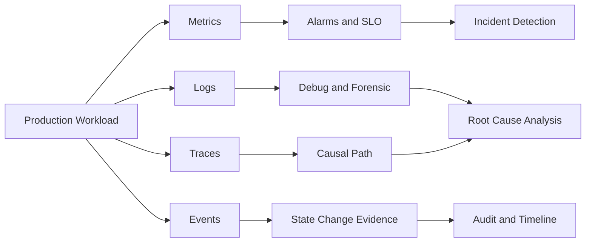
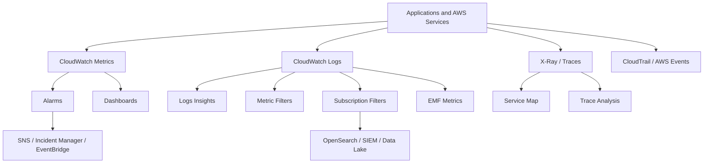
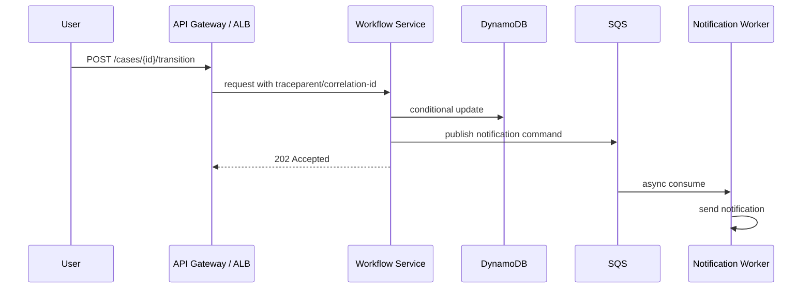
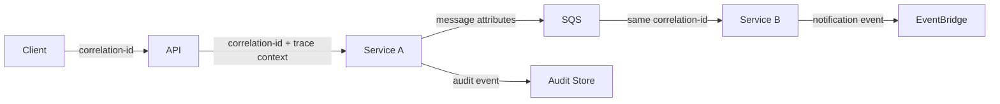
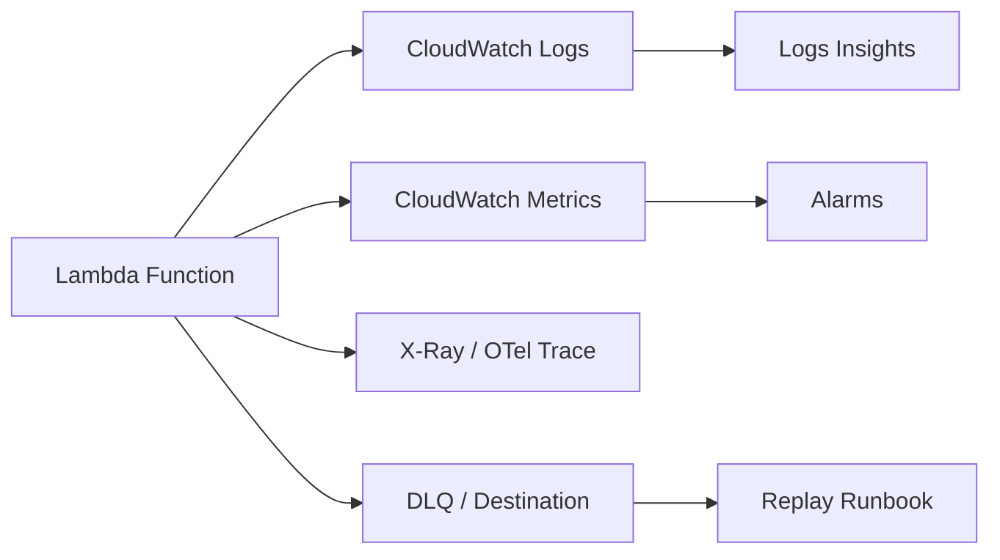
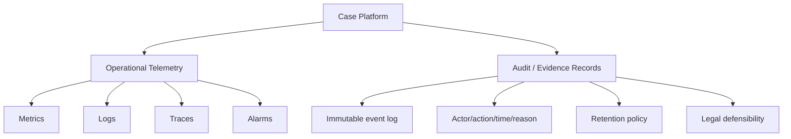

------
title: Learn AWS Engineering Mastery - Part 023
description: Observability engineering on AWS using CloudWatch, X-Ray, OpenTelemetry, correlation IDs, metrics, logs, traces, alarms, dashboards, and SLO-driven operations.
series: learn-aws
seriesTitle: Learn AWS Engineering Mastery
order: 23
partTitle: Observability: CloudWatch, X-Ray, OpenTelemetry, and SLO
tags:
- aws
- cloudwatch
- xray
- opentelemetry
- observability
- sre
- slo
- operations
- platform-engineering
- series
date: 2026-07-01
---

# Observability: CloudWatch, X-Ray, OpenTelemetry, and SLO

> Target pembelajaran: setelah bagian ini, kita mampu mendesain observability production-grade di AWS: bukan hanya membuat dashboard, tetapi membangun telemetry contract yang membantu engineer mendeteksi, menjelaskan, dan memperbaiki kegagalan sistem dengan cepat.

Observability sering direduksi menjadi “kita punya log” atau “kita punya dashboard CloudWatch”. Itu tidak cukup untuk sistem production-grade.

Observability yang baik menjawab pertanyaan operasional berikut:

1. Apakah user sedang terdampak?
2. Dampaknya sebesar apa?
3. Service mana yang menyebabkan degradasi?
4. Apakah masalahnya latency, error, saturation, throttling, dependency, deployment, data, atau quota?
5. Kapan mulai terjadi?
6. Perubahan apa yang terjadi sebelum gejala muncul?
7. Apakah rollback akan membantu?
8. Apakah mitigasi aman dilakukan?
9. Bukti apa yang bisa disimpan untuk post-incident review?

AWS menyediakan CloudWatch, CloudWatch Logs, CloudWatch Metrics, CloudWatch Alarms, CloudWatch Dashboards, CloudWatch Logs Insights, CloudWatch Embedded Metric Format, CloudWatch Agent, X-Ray, AWS Distro for OpenTelemetry, CloudTrail, EventBridge, AWS Health, Config, service-specific metrics, dan integrasi dengan banyak managed services.

Namun tool bukan inti utamanya. Inti observability adalah **struktur informasi yang dapat dipakai saat sistem gagal**.

---

## 1. Kaufman Skill Map

```mermaid
flowchart TD
    A[AWS Observability Mastery] --> B[Telemetry Model]
    A --> C[CloudWatch Metrics]
    A --> D[Logs and Forensics]
    A --> E[Distributed Tracing]
    A --> F[Correlation and Context]
    A --> G[SLO and Alerting]
    A --> H[Operational Dashboards]
    A --> I[Cost and Governance]

    B --> B1[Metrics]
    B --> B2[Logs]
    B --> B3[Traces]
    B --> B4[Events]

    C --> C1[Namespaces]
    C --> C2[Dimensions]
    C --> C3[Alarms]
    C --> C4[Composite alarms]

    D --> D1[Log groups]
    D --> D2[Retention]
    D --> D3[Logs Insights]
    D --> D4[Subscription filters]

    E --> E1[X-Ray]
    E --> E2[OpenTelemetry]
    E --> E3[Sampling]
    E --> E4[Trace propagation]

    G --> G1[SLI]
    G --> G2[SLO]
    G --> G3[Error budget]
    G --> G4[Burn rate]
```



Kaufman-style deconstruction untuk observability:

| Sub-skill | Yang harus dikuasai | Ukuran self-correction |
|---|---|---|
| Telemetry design | Memilih metric/log/trace/event yang benar | Alarm menjawab gejala user, bukan noise infrastructure |
| CloudWatch metrics | Namespace, dimension, statistic, period, alarm | Alarm dapat membedakan error rate, latency, dan saturation |
| Logging | Structured logs, retention, privacy, query | Engineer bisa menjawab “apa yang terjadi?” tanpa SSH |
| Tracing | Trace ID, span, downstream call, sampling | Engineer bisa melihat jalur request lintas service |
| SLO | SLI, objective, error budget, burn rate | Alert berbasis impact, bukan CPU semata |
| Dashboard | Layered dashboard: executive, service, dependency, infrastructure | Dashboard mempercepat diagnosis, bukan memperindah console |
| Governance | Retention, encryption, access, cost | Telemetry tidak bocor data sensitif dan tidak meledakkan biaya |

---

## 2. Mental Model: Observability Is a Runtime Contract

Observability bukan fitur tambahan. Observability adalah **kontrak runtime** antara service dan operator.

Service production harus menerbitkan sinyal berikut:



Empat sinyal utama:

| Signal | Kegunaan utama | Jangan dipakai untuk |
|---|---|---|
| Metrics | Alarm, trend, capacity, SLO | Detail forensic per request |
| Logs | Debug, forensic, audit, detail kejadian | High-cardinality time series sembarangan |
| Traces | Jalur request, dependency latency, causal chain | Audit long-term atau semua event bisnis |
| Events | Perubahan state, deployment, scaling, incident timeline | Debug detail aplikasi tanpa konteks |

Rule sederhana:

- **Metrics** menjawab: “apakah ada masalah?”
- **Logs** menjawab: “apa yang terjadi?”
- **Traces** menjawab: “di mana waktu habis atau error muncul?”
- **Events** menjawab: “perubahan apa yang terjadi?”

Engineer top-tier tidak membuat semua sinyal menjadi log. Mereka memilih sinyal berdasarkan pertanyaan operasional.

---

## 3. AWS Observability Stack

CloudWatch adalah pusat observability umum di AWS. CloudWatch dapat memonitor resource AWS dan aplikasi secara real time, menyediakan metrics, alarms, dashboards, logs, agent, cross-account monitoring, OpenTelemetry support, dan fitur observability lain.



AWS observability tidak harus berarti semua data berhenti di CloudWatch. Banyak enterprise mengirim logs/traces ke SIEM, OpenSearch, Datadog, New Relic, Splunk, Grafana, atau data lake. Namun AWS-native baseline tetap penting karena:

1. Banyak service AWS menerbitkan metrics native ke CloudWatch.
2. CloudWatch alarms mudah dipakai sebagai trigger otomatis.
3. IAM/KMS/CloudTrail integration relatif matang.
4. Cross-account observability bisa menjadi baseline multi-account.
5. Banyak incident workflow AWS berangkat dari alarm dan event AWS-native.

---

## 4. Metrics: Alarmable Facts, Not Debug Text

Metric adalah angka time-series dengan timestamp, namespace, metric name, dimension, statistic, dan period.

Contoh metric yang baik:

| Metric | Dimension | Kenapa baik |
|---|---|---|
| `RequestCount` | `Service`, `Environment`, `Route` | Mengukur traffic |
| `ErrorRate` | `Service`, `Environment` | Alarmable terhadap user impact |
| `LatencyP95` | `Service`, `Route` | Mengukur tail latency |
| `DependencyTimeoutCount` | `Service`, `Dependency` | Mengisolasi dependency failure |
| `QueueAgeSeconds` | `QueueName`, `Consumer` | Mengukur backlog freshness |
| `ThrottleCount` | `Service`, `Resource` | Menandai quota/capacity pressure |

Metric yang buruk:

| Metric | Masalah |
|---|---|
| `RequestId` sebagai dimension | Cardinality ekstrem, biaya naik, alarm tidak berguna |
| `UserId` sebagai dimension default | Cardinality dan privacy risk |
| `ExceptionMessage` sebagai dimension | Fragmentasi metric dan potensi PII |
| CPU sebagai satu-satunya alarm | Tidak selalu mewakili user impact |

### 4.1 Namespace and Dimension Discipline

Rekomendasi namespace custom:

```txt
Company/Product/Service
```

Contoh:

```txt
Acme/EnforcementCase/WorkflowService
```

Contoh dimension minimal:

```txt
Environment=prod
Service=case-workflow
Region=ap-southeast-1
```

Tambahkan dimension hanya jika akan dipakai untuk diagnosis atau alarm.

### 4.2 Golden Signals

Untuk service online, gunakan golden signals:

| Signal | AWS implementation |
|---|---|
| Latency | ALB TargetResponseTime, API Gateway Latency, custom p95/p99 |
| Traffic | RequestCount, Count, Invocations, MessagesReceived |
| Errors | 5XX, function errors, failed transitions, DLQ count |
| Saturation | CPU, memory, concurrency, connection pool, queue age, throttles |

Untuk data pipeline:

| Signal | Metric |
|---|---|
| Freshness | Age of latest processed event |
| Completeness | Expected vs processed records |
| Error | Failed records, DLQ entries |
| Throughput | Records/sec, bytes/sec |
| Lag | IteratorAge, consumer lag, queue age |

Untuk workflow/case-management platform:

| Signal | Metric |
|---|---|
| State transition success rate | Successful transitions / attempted transitions |
| Escalation latency | Time from trigger to escalation created |
| SLA breach risk | Cases nearing deadline |
| Stuck workflow count | Cases with no state change beyond threshold |
| Audit persistence failure | Failed audit append count |

---

## 5. Logs: Structured Evidence for Debugging and Audit

CloudWatch Logs centralizes logs from systems, applications, and AWS services in a scalable service. In a production system, logs are not print statements. Logs are **structured evidence**.

Bad log:

```txt
Something failed
```

Good log:

```json
{
  "timestamp": "2026-07-01T10:15:12.341Z",
  "level": "ERROR",
  "service": "case-workflow",
  "environment": "prod",
  "correlationId": "c-8e9b1",
  "caseIdHash": "h:2a9f...",
  "tenantId": "regulator-a",
  "operation": "transitionCaseState",
  "fromState": "UNDER_REVIEW",
  "toState": "ESCALATED",
  "errorType": "ConditionalWriteFailed",
  "dependency": "dynamodb",
  "durationMs": 184,
  "retryable": true
}
```

### 5.1 Logging Levels

| Level | Meaning | Example |
|---|---|---|
| DEBUG | Development/temporary detailed data | Disabled by default in prod |
| INFO | Business/operational milestone | Case transitioned, job completed |
| WARN | Recoverable anomaly | Retry, fallback, degraded dependency |
| ERROR | Failed operation requiring attention | Request failed, audit append failed |
| FATAL/CRITICAL | Service cannot continue or severe data risk | Cannot load config, integrity breach |

### 5.2 Log Events That Matter

Production logs should capture:

1. Request received and completed.
2. External dependency call and result.
3. State transition attempt and result.
4. Authorization decision failure.
5. Validation failure category, not raw sensitive payload.
6. Retry and final failure.
7. DLQ publication.
8. Idempotency conflict.
9. Data integrity violation.
10. Deployment version and configuration version.

### 5.3 Log Retention

Do not keep all logs forever by default.

| Log type | Typical retention reasoning |
|---|---|
| Debug application logs | Short retention, e.g. 7-30 days |
| Production error logs | Medium retention, e.g. 30-90 days |
| Security/audit logs | Long retention based on compliance |
| Access logs | Depends on forensic and privacy policy |
| Regulated evidence logs | Explicit retention/legal policy |

Important distinction:

- **Operational logs** help run the service.
- **Audit records** prove what happened.
- **Evidence records** may need immutability and chain-of-custody controls.

Do not confuse ordinary logs with regulatory evidence.

---

## 6. Embedded Metric Format

CloudWatch Embedded Metric Format allows applications to emit structured log events that CloudWatch can extract into metrics. This is useful when we want logs and metrics from one event emission path.

Example:

```json
{
  "_aws": {
    "Timestamp": 1782900912341,
    "CloudWatchMetrics": [
      {
        "Namespace": "Acme/CaseWorkflow",
        "Dimensions": [["Environment", "Service"]],
        "Metrics": [
          { "Name": "TransitionLatencyMs", "Unit": "Milliseconds" },
          { "Name": "TransitionFailure", "Unit": "Count" }
        ]
      }
    ]
  },
  "Environment": "prod",
  "Service": "case-workflow",
  "TransitionLatencyMs": 92,
  "TransitionFailure": 0,
  "correlationId": "c-8e9b1"
}
```

Use EMF when:

1. Application code owns the metric.
2. You want structured log + metric together.
3. Metric dimensions are controlled.
4. You avoid high-cardinality dimensions.

Avoid EMF when:

1. Every user/request becomes a metric dimension.
2. You need pure high-throughput metric ingestion without log retention cost.
3. You cannot control payload shape.

---

## 7. Tracing: Causal Path Across Services

Metrics tell us there is a problem. Logs tell us details. Traces show the **path**.

AWS X-Ray collects request data and helps visualize and analyze requests across applications and downstream dependencies. AWS Distro for OpenTelemetry can collect and send metrics/traces to AWS X-Ray, CloudWatch, OpenSearch, and other monitoring systems.



A useful trace should show:

1. Entry point.
2. Service boundaries.
3. Dependency calls.
4. Latency per hop.
5. Error per segment/span.
6. Retry behavior.
7. Trace/correlation ID.

### 7.1 X-Ray vs OpenTelemetry

| Option | Strength | Trade-off |
|---|---|---|
| X-Ray SDK/native integration | AWS-native, service map, direct integration | More AWS-specific instrumentation model |
| OpenTelemetry/ADOT | Open standard, portable, vendor-flexible | Collector/configuration complexity |
| CloudWatch Agent OTLP | Consolidates metrics/traces ingestion path | Requires agent lifecycle management |

Recommended enterprise posture:

- Prefer OpenTelemetry semantic conventions where possible.
- Export to AWS-native backends for operational integration.
- Keep instrumentation independent from dashboard vendor.
- Standardize trace propagation headers.

### 7.2 Sampling

Tracing every request may be expensive. Sampling controls volume.

Sampling strategy:

| Situation | Sampling approach |
|---|---|
| Low traffic critical service | Higher sampling |
| High traffic stable service | Lower default sampling |
| Error responses | Always sample or biased sampling |
| Canary deployment | Temporarily higher sampling |
| Incident investigation | Increase sampling with time limit |

Failure mode: sampling only successful requests makes traces useless during incidents.

---

## 8. Correlation ID and Context Propagation

Every request crossing a boundary should carry context.

Minimum context:

```txt
correlationId
traceId
service
operation
tenantId or tenantHash
environment
requestId
actorType
```

Do not log raw sensitive identifiers when hashes or internal references are sufficient.



For async messaging, context must be placed in message attributes or event metadata. Without this, an incident timeline breaks at the queue boundary.

Recommended event envelope:

```json
{
  "eventId": "evt-001",
  "eventType": "CaseEscalated",
  "occurredAt": "2026-07-01T10:15:12Z",
  "correlationId": "c-8e9b1",
  "traceId": "1-...",
  "producer": "case-workflow",
  "tenantId": "regulator-a",
  "schemaVersion": "1.0",
  "payload": {}
}
```

---

## 9. SLI, SLO, and Error Budget

A dashboard without SLO often becomes decoration. SLO converts telemetry into engineering commitment.

### 9.1 Definitions

| Term | Meaning |
|---|---|
| SLI | Service Level Indicator; measurement |
| SLO | Service Level Objective; target |
| SLA | Legal/business agreement |
| Error budget | Allowed unreliability within SLO window |

Example:

```txt
SLI: percentage of successful case state transitions completed under 500 ms
SLO: 99.5% over rolling 30 days
Error budget: 0.5% failed/slow transitions allowed
```

### 9.2 Good SLI Examples

| Workload | SLI |
|---|---|
| API service | % valid requests that return non-5xx under latency threshold |
| Workflow engine | % state transitions committed successfully under threshold |
| Async worker | % messages processed before freshness deadline |
| Data pipeline | % partitions delivered complete before SLA deadline |
| Search service | % queries returning successful result under p95 threshold |

### 9.3 Burn Rate

Burn rate measures how fast error budget is being consumed.

```txt
burn_rate = current_error_rate / allowed_error_rate
```

If SLO allows 0.1% error and current error is 1%, burn rate is 10x.

A good alert uses multiple windows:

| Alert | Meaning |
|---|---|
| Fast burn | Severe current incident |
| Slow burn | Sustained degradation |
| Ticket alert | Needs action but not page |
| Dashboard-only | Informational trend |

---

## 10. Alarm Design

Bad alarm:

```txt
CPU > 80% for 5 minutes
```

This may be useful, but it is not necessarily user impact.

Better alarm:

```txt
p95 latency > 800 ms AND 5xx rate > 2% for 5 minutes on prod API
```

Or:

```txt
ApproximateAgeOfOldestMessage > freshness target for 10 minutes
```

### 10.1 Alarm Severity

| Severity | Condition | Response |
|---|---|---|
| Sev1 | Broad user impact, data integrity risk, critical security issue | Page immediately |
| Sev2 | Significant degradation, partial region/workload impact | Page team/on-call |
| Sev3 | Degraded non-critical path or approaching quota | Ticket/working-hours response |
| Sev4 | Trend or hygiene issue | Backlog |

### 10.2 Symptom vs Cause Alarms

Use symptom alarms to page. Use cause alarms to diagnose.

| Type | Example | Page? |
|---|---|---|
| Symptom | User request success rate below SLO | Yes |
| Cause | RDS CPU high | Usually no alone |
| Cause | Lambda throttles | Maybe if linked to user impact |
| Cause | Queue age high | Yes if freshness SLO violated |
| Cause | Disk usage high | Ticket unless imminent outage |

### 10.3 Composite Alarms

Composite alarms reduce noise by combining signals:

```txt
ALARM if:
  API5xxHigh == ALARM
  AND RequestCountNormal == ALARM
  AND DeploymentInProgress != ALARM
```

This avoids paging for low traffic anomalies and supports deployment-aware alarms.

---

## 11. Dashboards That Actually Help

Use layered dashboards.

### 11.1 Executive/Service Health Dashboard

Shows:

1. Current SLO compliance.
2. Error budget remaining.
3. Active incidents.
4. User-impacting latency/error.
5. Business process throughput.

### 11.2 Service Owner Dashboard

Shows:

1. Request rate.
2. Error rate.
3. Latency p50/p95/p99.
4. Dependency error/latency.
5. Queue age.
6. Worker throughput.
7. Deployment version.
8. Throttling/quota.

### 11.3 Dependency Dashboard

Shows:

1. RDS/Aurora connections, CPU, replica lag, deadlocks.
2. DynamoDB throttles, consumed capacity, hot partition symptoms.
3. SQS age, visible/not visible messages, DLQ.
4. Lambda concurrency, errors, duration, throttles.
5. ALB target health, 5xx, response time.

### 11.4 Incident Dashboard

Shows only what an incident commander needs:

1. User impact.
2. Start time.
3. Deployment/change timeline.
4. Regional/AZ symptoms.
5. Dependency health.
6. Mitigation state.
7. Recovery trend.

Dashboard smell:

- 80 graphs and no clear answer.
- No SLO.
- No deployment marker.
- No dependency view.
- All p50, no p95/p99.
- No tenant/environment dimension.

---

## 12. Workload-Specific Observability Patterns

### 12.1 Lambda

Minimum signals:

| Signal | Why |
|---|---|
| Invocations | Traffic |
| Errors | Failure rate |
| Duration p95/p99 | Latency and timeout risk |
| Throttles | Concurrency/capacity issue |
| ConcurrentExecutions | Saturation |
| IteratorAge | Stream lag |
| DLQ/destination failures | Async failure |
| Cold start count/custom metric | Runtime efficiency |

Pattern:



### 12.2 ECS/EKS

Minimum signals:

| Layer | Signals |
|---|---|
| Service | Request rate, error rate, latency, dependency latency |
| Container | CPU, memory, restart count, OOMKilled |
| Cluster | capacity, pending tasks/pods, node pressure |
| Ingress | ALB 5xx, target response time, target health |
| Deployment | version, rollout state, failed deployment |

### 12.3 API Gateway / ALB

Minimum signals:

| Signal | Meaning |
|---|---|
| Request count | Traffic |
| 4xx | Client/auth/input issue |
| 5xx | Service/platform issue |
| Latency | End-to-end gateway latency |
| Integration latency | Backend latency |
| Throttles | Rate/quota issue |

### 12.4 SQS/EventBridge/Step Functions

Minimum signals:

| Service | Signals |
|---|---|
| SQS | Age of oldest message, visible messages, not visible messages, DLQ count |
| EventBridge | Failed invocations, throttles, DLQ |
| Step Functions | Failed/timed-out executions, execution duration, state transition failures |

For workflow platform, never monitor only request count. Monitor stuck business state.

Example custom metrics:

```txt
CasesStuckInReview
EscalationDeadlineBreaches
AuditAppendFailureCount
ManualOverrideCount
ReopenCaseRate
```

---

## 13. Observability for Regulated Case Management

A regulated case-management/enforcement system needs two telemetry planes:



Operational telemetry can be sampled, aggregated, and expired. Evidence records often cannot.

Do not store regulatory evidence only in application logs. Logs are optimized for operations, not necessarily legal defensibility.

Minimum regulated observability model:

| Concern | Implementation direction |
|---|---|
| Who changed case state | Append-only audit event |
| Why changed | Reason code/comment reference |
| When changed | Server-side timestamp |
| Under what authority | Role/permission/context |
| Was transition valid | Policy/rule version |
| Was notification sent | Notification event/result |
| Was SLA breached | Case timer metric + event |
| Was evidence accessed | Access audit event |

---

## 14. Security and Privacy

Observability data often contains sensitive information. Treat telemetry as production data.

Rules:

1. Do not log passwords, tokens, session cookies, private keys, or raw secrets.
2. Avoid raw PII unless explicitly required and protected.
3. Use structured redaction libraries.
4. Encrypt log groups if policy requires customer-managed KMS keys.
5. Set retention explicitly.
6. Restrict CloudWatch Logs Insights access.
7. Separate security logs from application debug logs.
8. Store audit/evidence records in tamper-resistant storage when required.
9. Monitor access to logs through CloudTrail.
10. Use account boundary for centralized logging when appropriate.

Bad pattern:

```txt
logger.info("request={}", fullHttpRequest)
```

Better pattern:

```txt
logger.info("request received", fields: method, route, tenant, correlationId, contentLength)
```

---

## 15. Cost Engineering for Observability

Observability cost is real. Cost issues usually come from:

1. Excessive log volume.
2. Long retention for noisy logs.
3. High-cardinality custom metrics.
4. Too many dashboards/alarms with low value.
5. Tracing every request in high-volume service.
6. Copying logs to multiple vendors without filtering.
7. Debug logs left on in production.

Cost controls:

| Control | Benefit |
|---|---|
| Retention by log group | Avoid infinite storage |
| Sampling | Reduce trace cost |
| EMF dimension discipline | Avoid metric explosion |
| Subscription filters | Export only useful streams |
| Log level governance | Reduce noise |
| Aggregated business metrics | Lower cardinality |
| Separate hot/cold storage | Lower long-term cost |

Operational rule:

> Every new telemetry stream should have an owner, retention policy, security classification, and known use case.

---

## 16. Failure Modes

| Failure mode | Symptom | Prevention |
|---|---|---|
| No correlation IDs | Incident timeline breaks across services | Standard request/event envelope |
| Alarm on cause only | Pages for CPU but misses user impact | SLO/symptom alarms |
| High-cardinality metrics | Cost spike and unusable metrics | Dimension review |
| Logs contain secrets | Security incident | Redaction and policy tests |
| No deployment markers | Hard to connect incident with change | Emit deployment events |
| Async boundary loses trace | Cannot diagnose delayed failures | Propagate context through messages |
| Dashboard too broad | Slow diagnosis | Layered dashboards |
| No runbook linked to alarm | On-call improvises | Alarm-to-runbook mapping |
| Sampling hides failures | Traces missing for errors | Bias sampling toward errors |
| Audit mixed with debug logs | Regulatory evidence weak | Separate audit store |

---

## 17. Alarm-to-Runbook Mapping

Every production alarm should have:

```yaml
alarmName: prod-case-workflow-high-transition-failure-rate
owner: case-platform-team
severity: Sev2
userImpact: case state transitions may fail
slo: case-transition-success-rate
firstChecks:
  - check recent deployments
  - check DynamoDB conditional failures
  - check downstream event publish failures
  - check IAM/KMS errors
mitigation:
  - pause non-critical workflow consumers
  - rollback latest deployment if error started after release
  - increase provisioned capacity only if throttling confirmed
rollbackSafe: conditional
escalation:
  - platform-oncall
  - data-platform-oncall if persistence failure
```

If an alarm does not have an owner and first response steps, it is not production-ready.

---

## 18. Deliberate Practice

### Exercise 1: Build a Service Health Dashboard

For one service, define:

1. Request rate.
2. Error rate.
3. p95/p99 latency.
4. Dependency latency.
5. Queue age if async.
6. Current deployment version.
7. SLO compliance.

Self-check:

- Can a new on-call identify impact in under 2 minutes?
- Can they see whether the issue is service or dependency?
- Can they find the latest deployment/change?

### Exercise 2: Design Three Alarms

Create:

1. One fast-burn SLO alarm.
2. One slow-burn SLO alarm.
3. One dependency saturation alarm.

Self-check:

- Which alarm pages humans?
- Which alarm opens ticket only?
- Which alarm triggers automation?

### Exercise 3: Trace an Async Flow

Pick a flow:

```txt
API -> service -> SQS -> worker -> database -> notification
```

Propagate:

1. `correlationId`
2. `traceId`
3. `tenantId`
4. `eventId`
5. `schemaVersion`

Self-check:

- Can you reconstruct the full path from one user complaint?
- Can you find where latency accumulated?
- Can you replay safely if a message failed?

---

## 19. Production Checklist

```txt
[ ] Every service has owner and service catalog entry.
[ ] Every service emits structured logs.
[ ] Every request has correlation ID.
[ ] Async events carry correlation context.
[ ] Metrics separate service, dependency, and business signals.
[ ] SLO is defined for critical user journeys.
[ ] Page alarms are symptom/SLO-based.
[ ] Cause alarms are used for diagnosis or tickets.
[ ] Dashboards are layered by audience.
[ ] Logs have explicit retention.
[ ] Sensitive fields are redacted.
[ ] Trace sampling strategy is documented.
[ ] Deployment markers are visible.
[ ] Alarm has linked runbook.
[ ] Cost/cardinality review exists for custom metrics.
[ ] Audit/evidence records are separate from debug logs.
```

---

## 20. Summary

Observability engineering di AWS adalah kemampuan membangun sistem yang bisa menjelaskan dirinya sendiri saat gagal.

Inti Part 023:

1. Observability adalah runtime contract, bukan dashboard.
2. Metrics untuk alarm dan trend.
3. Logs untuk forensic dan debug.
4. Traces untuk causal path.
5. Events untuk timeline perubahan.
6. SLO mengubah telemetry menjadi komitmen operasional.
7. CloudWatch adalah baseline AWS-native yang kuat.
8. X-Ray dan OpenTelemetry membantu melihat distributed path.
9. Correlation ID adalah tulang punggung investigasi lintas service.
10. Telemetry harus aman, hemat, dan punya owner.

Di Part 024, kita akan membahas bagaimana sinyal observability ini dipakai dalam operasi nyata: Systems Manager, Session Manager, Automation, OpsCenter, Incident Manager, runbooks, playbooks, patching, dan incident response.

---

## References

- AWS Documentation — What is Amazon CloudWatch?: https://docs.aws.amazon.com/AmazonCloudWatch/latest/monitoring/WhatIsCloudWatch.html
- AWS Documentation — What is CloudWatch Logs?: https://docs.aws.amazon.com/AmazonCloudWatch/latest/logs/WhatIsCloudWatchLogs.html
- AWS Documentation — Embedded Metric Format: https://docs.aws.amazon.com/AmazonCloudWatch/latest/monitoring/CloudWatch_Embedded_Metric_Format.html
- AWS Documentation — AWS X-Ray: https://docs.aws.amazon.com/xray/latest/devguide/aws-xray.html
- AWS Documentation — AWS Distro for OpenTelemetry and X-Ray: https://docs.aws.amazon.com/xray/latest/devguide/xray-services-adot.html
- AWS Documentation — OpenTelemetry in CloudWatch: https://docs.aws.amazon.com/AmazonCloudWatch/latest/monitoring/CloudWatch-OpenTelemetry-Sections.html
