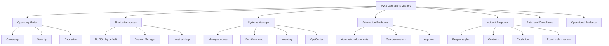
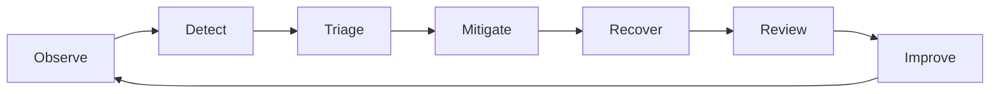
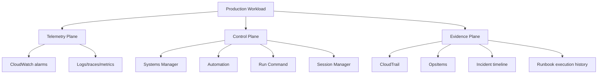
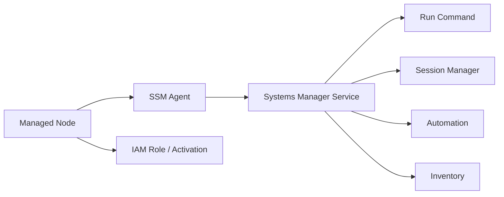
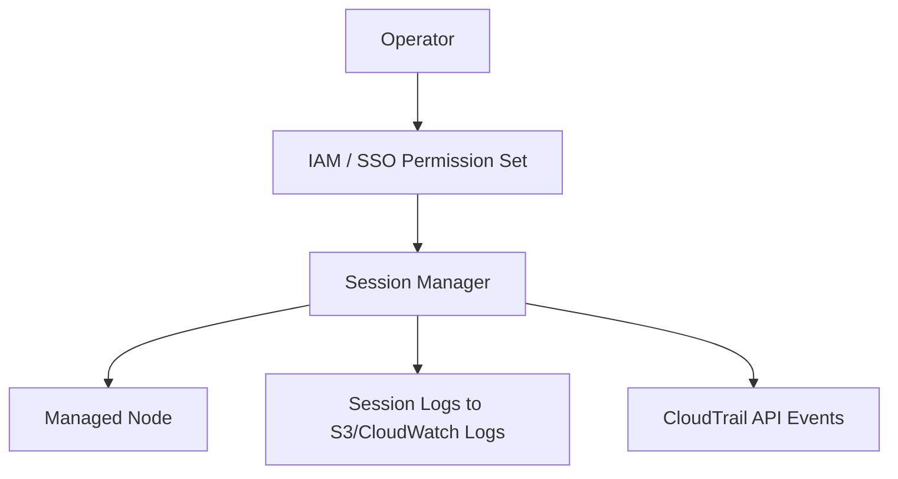
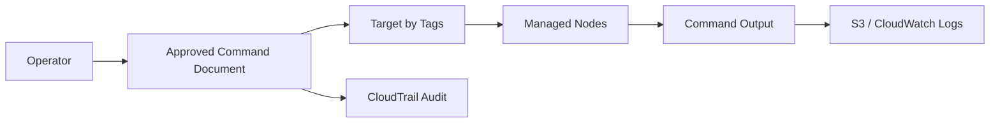
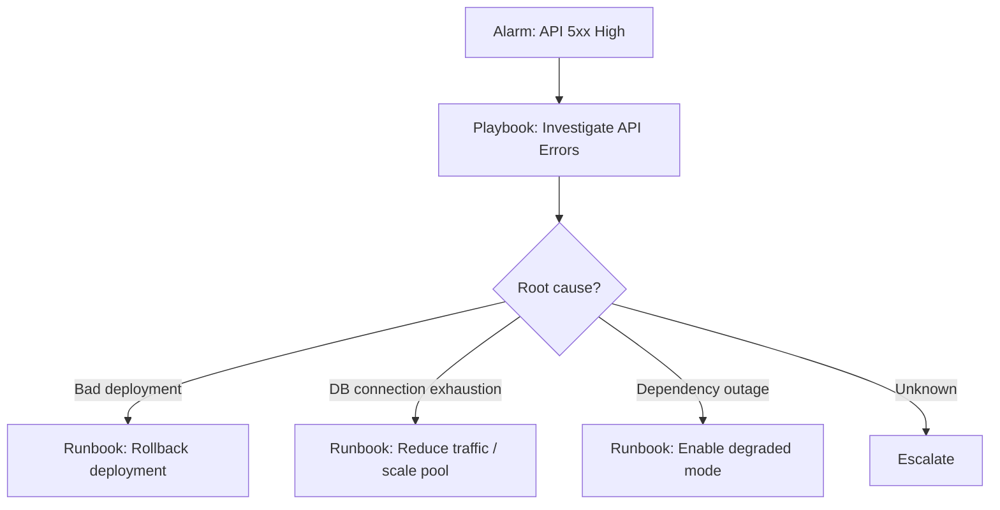
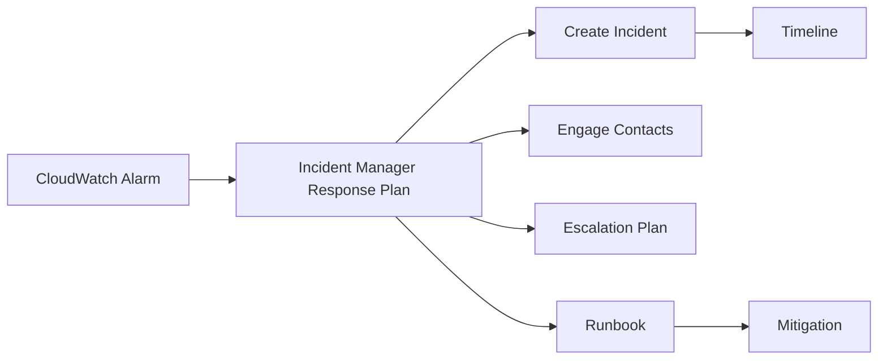
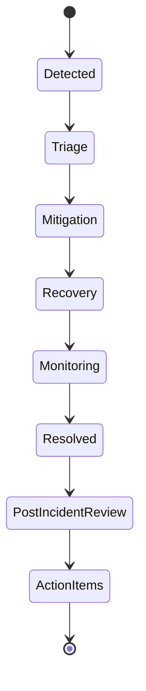
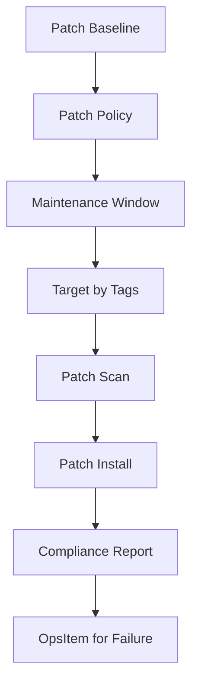

------
title: Learn AWS Engineering Mastery - Part 024
description: AWS operations engineering using Systems Manager, Session Manager, Run Command, Automation runbooks, OpsCenter, Incident Manager, patching, production access, and incident response.
series: learn-aws
seriesTitle: Learn AWS Engineering Mastery
order: 24
partTitle: Operations, Incident Management, SSM, and Runbooks
tags:
- aws
- systems-manager
- ssm
- incident-management
- runbooks
- opscenter
- session-manager
- patch-manager
- operations
- sre
- series
date: 2026-07-01
---

# Operations, Incident Management, SSM, and Runbooks

> Target pembelajaran: setelah bagian ini, kita mampu mendesain operating model AWS yang aman, otomatis, bisa diaudit, dan siap insiden—menggunakan Systems Manager, Session Manager, Automation, OpsCenter, Incident Manager, runbooks, playbooks, patching, dan access control.

Part sebelumnya membahas observability: bagaimana sistem memberi sinyal. Part ini membahas pertanyaan berikutnya:

> Ketika sinyal menunjukkan masalah, siapa melakukan apa, dengan akses apa, mengikuti prosedur apa, dan meninggalkan evidence apa?

Operations bukan hanya “login ke server lalu cek log”. Di AWS modern, operasi production-grade harus:

1. Mengurangi akses manual langsung.
2. Mengganti tindakan ad-hoc dengan runbook.
3. Menghubungkan alarm ke response plan.
4. Menjaga audit trail.
5. Membatasi blast radius operator.
6. Mengotomatiskan remediation yang aman.
7. Memastikan patch/configuration compliance.
8. Menjalankan incident response dengan role dan timeline jelas.

AWS Systems Manager adalah salah satu fondasi utama untuk operasi ini. Systems Manager diposisikan sebagai operations hub dan secure end-to-end management solution untuk AWS, hybrid, dan multicloud environment.

---

## 1. Kaufman Skill Map



Kaufman-style deconstruction:

| Sub-skill | Yang harus dikuasai | Ukuran self-correction |
|---|---|---|
| Operating model | Owner, severity, on-call, escalation, evidence | Insiden tidak bergantung pada hero engineer |
| Production access | Session Manager, IAM, audit, no shared SSH | Bisa debug tanpa membuka inbound SSH |
| SSM managed nodes | Agent, instance profile, hybrid activation | Node bisa dikelola secara konsisten |
| Run Command | Execute command at scale safely | Tidak perlu manual shell loop |
| Automation | Repeatable remediation | Runbook bisa diuji dan dibatasi |
| OpsCenter | Centralized operational work item | Alarm menghasilkan OpsItem yang bisa ditindaklanjuti |
| Incident Manager | Response plan, contacts, escalation | Pihak yang tepat terlibat otomatis |
| Patch/compliance | Patch baselines, windows, inventory | Compliance diketahui, bukan diasumsikan |

---

## 2. Mental Model: Operations Is a Control System

Operations adalah control loop.



AWS operating model yang baik memiliki tiga plane:



Principle:

> Jangan memberi manusia akses luas untuk melakukan operasi yang seharusnya bisa diekspresikan sebagai runbook terbatas.

---

## 3. Systems Manager Overview

AWS Systems Manager mencakup banyak capability. Untuk seri ini, kita fokus pada capability yang penting untuk operations engineering.

| Capability | Fungsi |
|---|---|
| Session Manager | Secure interactive access ke managed node tanpa inbound SSH terbuka |
| Run Command | Menjalankan command administratif secara remote dan terkontrol |
| Automation | Menjalankan runbook untuk maintenance, deployment, dan remediation |
| State Manager | Menjaga managed node/resource pada desired state |
| Patch Manager | Mengotomatisasi patching security dan update lain |
| Inventory | Mengumpulkan metadata software/configuration dari managed nodes |
| OpsCenter | Mengelola operational issues/OpsItems dan menjalankan runbook |
| Incident Manager | Response plan, contacts, escalation, runbook untuk incident response |
| Parameter Store | Configuration/secrets sederhana dengan IAM/KMS integration |
| Change Manager | Approval workflow untuk perubahan operasional tertentu |

Systems Manager mengandalkan konsep **managed node**.

Managed node dapat berupa:

1. EC2 instance.
2. On-premises server.
3. VM di environment lain.
4. Edge/hybrid node yang dikonfigurasi untuk Systems Manager.

Elemen penting:



---

## 4. Production Access: No SSH by Default

Traditional pattern:

```txt
Open port 22 -> SSH key -> bastion -> server shell
```

Problems:

1. Inbound network exposure.
2. Long-lived SSH keys.
3. Weak session audit unless heavily customized.
4. Manual commands not repeatable.
5. Operator blast radius too large.
6. Difficult separation between read-only diagnosis and destructive action.

AWS-native safer baseline:

```txt
No inbound SSH
SSM Agent installed
IAM-controlled access
Session Manager session logging
CloudTrail API audit
Runbooks for common actions
```



### 4.1 Session Manager Guardrails

Recommended controls:

| Control | Why |
|---|---|
| No inbound SSH security group rule | Reduces network attack surface |
| IAM least privilege | Limits who can start sessions |
| Tag-based access | Operators access only owned environment/service |
| Session logging | Supports audit/review |
| KMS encryption | Protects session/log data |
| MFA/SSO | Strengthens human identity |
| Time-bound access | Reduces standing privilege |
| Separate break-glass role | Emergency only, heavily monitored |

Example IAM condition idea:

```json
{
  "Condition": {
    "StringEquals": {
      "ssm:resourceTag/Environment": "prod",
      "ssm:resourceTag/Service": "case-workflow"
    }
  }
}
```

### 4.2 Read-Only First

Production access should be tiered:

| Tier | Capability |
|---|---|
| Observer | View metrics/logs/dashboards only |
| Diagnoser | Start read-only sessions / run diagnostic commands |
| Operator | Execute approved runbooks |
| Maintainer | Perform changes with approval |
| Break-glass | Emergency wide access with high audit |

Avoid giving every on-call admin access. Most incidents need diagnosis and constrained mitigation, not root shell.

---

## 5. Run Command

Run Command allows remote, secure management of configuration and one-time administrative tasks at scale.

Use Run Command for:

1. Collecting diagnostics.
2. Restarting a known service.
3. Checking disk usage.
4. Rotating local agent configuration.
5. Triggering safe cache clear.
6. Running health probe scripts.
7. Verifying patch state.

Avoid Run Command for:

1. Unreviewed arbitrary production mutation.
2. Long-running unknown scripts.
3. Data repair without approval.
4. Running secrets in command parameters.
5. Replacing proper deployment pipelines.

Pattern:



Target by tags, not manually enumerated instance IDs.

Example targeting:

```txt
Environment=prod
Service=case-workflow
Role=worker
```

---

## 6. Automation Runbooks

Systems Manager Automation runbooks simplify maintenance, deployment, and remediation tasks across AWS services.

A runbook should encode:

1. Preconditions.
2. Parameters.
3. Safety checks.
4. Execution steps.
5. Rollback or stop condition.
6. Output/evidence.
7. Access boundary.

Bad runbook:

```txt
SSH into instance and try restarting things.
```

Good runbook:

```txt
Given service, environment, and deployment version:
1. Confirm active alarm.
2. Confirm current deployment marker.
3. Check target health.
4. If latest deployment caused issue, shift traffic back.
5. Verify SLO recovery.
6. Record incident note.
```

### 6.1 Runbook Structure

```yaml
name: RollbackCaseWorkflowCanary
parameters:
  Environment:
    allowedValues: [prod, staging]
  Service:
    allowedPattern: "^[a-z0-9-]+$"
  DeploymentId:
    required: true
preconditions:
  - caller has production-operator role
  - active alarm exists
  - rollback target exists
steps:
  - fetch current deployment state
  - verify rollback candidate health
  - shift traffic to previous version
  - monitor error rate for 10 minutes
  - stop if error rate worsens
outputs:
  - previousVersion
  - finalTrafficState
  - alarmState
```

### 6.2 Safe Automation Principles

| Principle | Explanation |
|---|---|
| Narrow parameter set | Prevent arbitrary target/action |
| Validate preconditions | Avoid running during wrong state |
| Idempotent steps | Safe retry on partial failure |
| Timeouts | Avoid hanging automation |
| Approval for destructive actions | Human gate for irreversible changes |
| Observable execution | Emit logs/events |
| Least privilege role | Automation can only do required actions |
| Dry-run mode where possible | Preview before mutation |

---

## 7. Playbooks vs Runbooks

AWS Well-Architected describes playbooks as step-by-step guides for investigating incidents; runbooks are commonly used to mitigate known issues.

| Type | Purpose | Example |
|---|---|---|
| Playbook | Investigate/scope/root cause | “API 5xx spike investigation” |
| Runbook | Execute known mitigation | “Rollback ECS service to previous task definition” |

A mature team links them:



---

## 8. OpsCenter

OpsCenter centralizes operational work items called OpsItems. OpsItems can contain context, related resources, investigation data, and linked Automation runbooks.

Use OpsCenter for:

1. Non-page operational issues.
2. Repeated alarms that need owner action.
3. Compliance drift findings.
4. Patch failures.
5. Manual remediation tracking.
6. Linking operational evidence and resources.

OpsItem fields should include:

```yaml
source: CloudWatchAlarm
severity: Sev3
service: case-workflow
environment: prod
resourceArn: arn:aws:...
correlationId: optional
alarmName: prod-case-workflow-queue-age-high
firstSeenAt: 2026-07-01T10:15:12Z
owner: case-platform-team
runbook: DiagnoseQueueBacklog
```

OpsCenter smell:

- OpsItems have no owner.
- OpsItems are never closed.
- Alarms generate duplicate spam.
- OpsItems do not link to resources or runbooks.
- There is no severity taxonomy.

---

## 9. Incident Manager

Incident Manager helps define response plans, contacts, escalation plans, and runbooks for incidents.

Incident response preparation happens before the incident:

1. Configure contacts.
2. Configure escalation plans.
3. Configure chat channels.
4. Configure response plans.
5. Attach Automation runbooks.
6. Map alarms to incident creation.
7. Define severity and ownership.



### 9.1 Response Plan Content

A response plan should define:

| Field | Example |
|---|---|
| Incident title template | `Prod API 5xx high - case-workflow` |
| Impact/severity | Sev1/Sev2/Sev3 |
| Contacts | Primary on-call |
| Escalation | Team lead, platform, security, data |
| Chat channel | War-room channel |
| Runbook | Diagnose/mitigate known issue |
| Automation role | Least privilege response role |
| Tags | service, environment, owner, compliance |

### 9.2 Incident Roles

| Role | Responsibility |
|---|---|
| Incident Commander | Coordinates response, protects focus |
| Operations Lead | Executes/coordinates mitigation |
| Communications Lead | Updates stakeholders |
| Scribe | Maintains timeline/evidence |
| Subject Matter Expert | Diagnoses domain-specific issue |
| Approver | Approves risky/destructive mitigation |

Small teams may combine roles, but responsibilities still need to exist.

### 9.3 Incident Lifecycle



Do not end an incident at “service is back”. End it when:

1. User impact is resolved.
2. Monitoring confirms stability.
3. Timeline is captured.
4. Follow-up owners are assigned.
5. Evidence is preserved.

---

## 10. Severity Model

Severity must be explicit.

| Severity | Definition | Example | Response |
|---|---|---|---|
| Sev1 | Critical broad impact or data integrity/security risk | Case transitions failing globally | Immediate page, incident commander |
| Sev2 | Major partial impact | One region or critical workflow degraded | Page owning team |
| Sev3 | Limited degradation or risk | Queue backlog increasing but within SLA | Ticket + timed response |
| Sev4 | Hygiene/improvement | Patch drift in non-prod | Backlog |

Severity should consider:

1. User impact.
2. Regulatory impact.
3. Data integrity risk.
4. Security risk.
5. Duration.
6. Blast radius.
7. Workaround availability.

---

## 11. Patch Manager and Configuration Compliance

Patch Manager automates patching for managed nodes with security-related and other updates.

Patching is not merely “install latest patches”. It is a controlled risk process.

Patch strategy:

| Environment | Policy |
|---|---|
| Dev | Early patch, detect breakage |
| Staging | Patch before prod, representative testing |
| Prod canary | Small subset first |
| Prod fleet | Wave rollout with monitoring |
| Critical emergency | Expedited path with approval |

Patch baseline should define:

1. Approved patches.
2. Rejected patches.
3. Approval delay.
4. Operating system/product scope.
5. Compliance severity.
6. Maintenance window.
7. Reboot behavior.



Failure modes:

| Failure | Prevention |
|---|---|
| Patch all prod at once | Wave/canary rollout |
| No rollback plan | AMI/snapshot strategy |
| Patches break workload | Staging parity and health checks |
| Unknown inventory | Systems Manager Inventory |
| Missed reboot | Explicit reboot policy and alarms |
| Compliance assumed | Centralized compliance dashboard |

---

## 12. Inventory and Fleet Visibility

Inventory collects metadata from managed nodes.

Useful inventory questions:

1. Which instances run unsupported OS versions?
2. Which nodes miss required agent version?
3. Which hosts have vulnerable package versions?
4. Which nodes lack required configuration?
5. Which application versions are deployed?
6. Which nodes are not reporting to SSM?

For regulated environments, inventory is evidence:

```txt
At date X, these nodes existed, with these versions, under this patch baseline, with this compliance state.
```

---

## 13. State Manager

State Manager keeps managed nodes/resources in desired state.

Use cases:

1. Ensure agent installed/running.
2. Ensure security configuration exists.
3. Ensure log collector configuration exists.
4. Ensure file permissions match baseline.
5. Ensure compliance scanner runs.

Be careful: State Manager can fight deployment automation if responsibilities are unclear.

Ownership rule:

| State type | Owner |
|---|---|
| OS/security baseline | Platform/security team |
| Application binaries | Deployment pipeline |
| Runtime config | Config platform / application team |
| Emergency mitigation | Incident runbook with expiry |

---

## 14. Change Manager and Operational Approval

Change Manager can be used when operational changes require approval and controlled execution.

Use it for:

1. High-risk production maintenance.
2. Emergency changes needing evidence.
3. Data repair workflows.
4. Security baseline changes.
5. Cross-account operational actions.

Do not use heavyweight approval for every small change; that creates bypass behavior. Use risk-based approval.

Risk dimensions:

| Dimension | Low risk | High risk |
|---|---|---|
| Scope | One non-prod resource | Multi-account prod |
| Reversibility | Easy rollback | Irreversible data mutation |
| User impact | None | Customer-facing downtime |
| Security impact | No privilege change | IAM/KMS/network change |
| Data impact | No data mutation | Production data repair |

---

## 15. Operational Readiness Review

Before service goes production, require operational readiness.

Checklist:

```txt
[ ] Service owner defined.
[ ] On-call rotation exists.
[ ] Severity model mapped.
[ ] CloudWatch alarms defined.
[ ] SLO or critical SLIs defined.
[ ] Dashboards exist.
[ ] Logs are structured and retained.
[ ] Correlation IDs propagate.
[ ] Runbooks linked to alarms.
[ ] Session Manager access works.
[ ] No inbound SSH required.
[ ] Patch baseline applied if compute fleet exists.
[ ] Backup/restore runbook tested.
[ ] Rollback runbook tested.
[ ] Incident response plan exists.
[ ] Escalation contacts configured.
[ ] Security and compliance logs retained.
[ ] Cost alarms/budgets exist.
```

A workload without runbooks is not ready. A workload with runbooks that were never tested is also not ready.

---

## 16. Runbook Patterns

### 16.1 Diagnose API Error Spike

```txt
Input: service, environment, alarmName

1. Confirm alarm state and start time.
2. Check request count to rule out low-traffic noise.
3. Check recent deployment events.
4. Compare 4xx vs 5xx.
5. Check ALB/API Gateway integration latency.
6. Check service logs by correlation IDs.
7. Check dependency metrics.
8. Check regional/AZ distribution.
9. Decide: rollback, scale, degrade, or escalate.
10. Record finding in incident timeline.
```

### 16.2 Drain Bad ECS Task Set

```txt
Input: cluster, service, taskSet/deploymentId

1. Confirm latest deployment correlates with error spike.
2. Confirm previous task set is healthy.
3. Stop traffic shift or rollback deployment.
4. Watch 5xx, latency, target health.
5. Confirm error budget burn returns to normal.
6. Record deployment ID and rollback result.
```

### 16.3 Replay DLQ Safely

```txt
Input: dlq, sourceQueue, maxMessages, timeWindow

1. Identify failure reason category.
2. Confirm bug/config causing failure is fixed.
3. Sample messages and validate schema.
4. Re-drive small batch.
5. Monitor target processing error rate.
6. Increase batch gradually.
7. Stop on repeated failure.
8. Record replay count and remaining DLQ depth.
```

### 16.4 Emergency Read-Only Data Inspection

```txt
Input: caseId, environment, reason

1. Require approver if prod regulated data.
2. Use read-only role.
3. Query by internal ID, not broad scan.
4. Redact sensitive output in shared channels.
5. Record reason, actor, timestamp, query reference.
6. Close access session.
```

---

## 17. Incident Timeline

A useful timeline includes:

```txt
10:01 Alarm triggered: prod-case-workflow-5xx-high
10:02 Incident created by response plan
10:03 On-call acknowledged
10:05 Impact confirmed: 32% transition requests failing
10:07 Recent deployment identified: version 2026.07.01-1042
10:10 Rollback runbook started
10:14 Traffic shifted to previous version
10:18 Error rate returned below threshold
10:25 Monitoring stable for 7 minutes
10:30 Incident resolved
10:45 Follow-up action: add compatibility test for transition policy schema
```

Bad timeline:

```txt
Had issue, fixed by rollback.
```

That is not enough for learning or audit.

---

## 18. Post-Incident Review

Post-incident review is not blame. It is system improvement.

Include:

1. What happened?
2. What was the user/business/regulatory impact?
3. How was it detected?
4. Why was it not prevented?
5. What made diagnosis slow?
6. What mitigated the issue?
7. What made mitigation risky?
8. Which alarms/runbooks worked?
9. Which assumptions were wrong?
10. What concrete action items reduce recurrence or impact?

Action items should be system-level:

| Weak action | Better action |
|---|---|
| Be more careful | Add deployment compatibility gate |
| Improve monitoring | Add SLO burn-rate alarm for transition failures |
| Document better | Link alarm to tested runbook |
| Avoid mistakes | Add policy-as-code validation |

---

## 19. Security Model for Operations

Operational capability is powerful. Treat it like production write access.

Controls:

1. Separate human identity from workload identity.
2. Use IAM Identity Center/SSO where possible.
3. Use permission sets by operational role.
4. Require MFA for production access.
5. Avoid long-lived access keys.
6. Use Session Manager instead of SSH where feasible.
7. Log sessions and API activity.
8. Restrict automation roles.
9. Use approvals for destructive runbooks.
10. Monitor break-glass role usage.

### 19.1 Break-Glass Access

Break-glass should be:

1. Rare.
2. Time-bound.
3. MFA-protected.
4. Heavily logged.
5. Alerted when used.
6. Reviewed after use.
7. Separated from normal on-call workflow.

Break-glass becoming daily workflow is a governance failure.

---

## 20. Cost and Operational Efficiency

Operations also has cost.

Cost drivers:

1. Idle overprovisioned fleets due to fear of incidents.
2. Manual on-call time.
3. Repeated incidents without root fix.
4. Excessive logs/metrics from diagnostic panic.
5. Delayed patching causing emergency work.
6. Overly complex incident tooling with no adoption.

Efficiency patterns:

| Pattern | Benefit |
|---|---|
| Runbooks for common actions | Lower MTTR |
| Alarm deduplication | Less fatigue |
| SLO-based paging | Fewer useless pages |
| OpsItem automation | Better tracking |
| Patch waves | Lower change risk |
| Session Manager | Less network/security maintenance |
| Game days | Practice before real incidents |

---

## 21. Failure Modes

| Failure mode | Symptom | Prevention |
|---|---|---|
| SSH/bastion dependency | Access blocked or unaudited during incident | Session Manager baseline |
| Runbooks outdated | On-call follows wrong steps | Scheduled runbook tests |
| Alarm without owner | Nobody responds | Ownership registry |
| Too many pages | Alert fatigue | SLO/severity design |
| Automation too powerful | Wrong target mutated | Least privilege + parameters |
| No incident commander | Chaotic parallel actions | Explicit roles |
| No timeline | Weak postmortem | Scribe role and Incident Manager timeline |
| Patch all-at-once | Fleet outage | Waves/canary |
| Manual data repair | Integrity/audit risk | Approved data repair runbook |
| Break-glass normalized | Governance erosion | Monitor and review every use |

---

## 22. Deliberate Practice

### Exercise 1: Replace SSH with Session Manager

For one EC2 workload:

1. Remove inbound SSH from security group.
2. Ensure SSM Agent is available.
3. Attach minimal instance profile.
4. Configure session logging.
5. Create IAM policy for team access by tags.
6. Test read-only diagnostic session.

Self-check:

- Can operator access without public IP?
- Is session logged?
- Can operator access only the intended environment?

### Exercise 2: Convert a Manual Fix into Runbook

Pick a common incident action:

```txt
restart worker
clear stuck deployment
re-drive DLQ
rollback service
increase queue consumers
```

Convert it into:

1. Inputs.
2. Preconditions.
3. Safety checks.
4. Execution steps.
5. Rollback/stop condition.
6. Output evidence.

Self-check:

- Can a new on-call run it safely?
- Does it prevent wrong environment targeting?
- Does it emit evidence?

### Exercise 3: Create Response Plan

For one Sev2 alarm:

1. Define response plan.
2. Add contacts.
3. Add escalation.
4. Add linked runbook.
5. Define chat channel.
6. Simulate alarm.

Self-check:

- Was the right person engaged?
- Did the runbook appear in context?
- Was timeline created?

---

## 23. Production Checklist

```txt
[ ] No inbound SSH required for standard operations.
[ ] Session Manager configured and tested.
[ ] Session logs retained and protected.
[ ] Run Command usage restricted by IAM and tags.
[ ] Automation runbooks exist for common mitigations.
[ ] Destructive runbooks require approval.
[ ] Alarms map to owner and runbook.
[ ] Response plans exist for Sev1/Sev2 scenarios.
[ ] Contacts and escalation plans are current.
[ ] OpsItems have owner/severity/resource context.
[ ] Patch baseline and patch windows are defined.
[ ] Inventory collection is enabled where compute fleet exists.
[ ] Break-glass role is monitored.
[ ] Incident timeline process is defined.
[ ] Post-incident review template exists.
[ ] Game days test operational readiness.
```

---

## 24. Summary

Operations engineering di AWS adalah desain control loop yang aman dan bisa diaudit.

Inti Part 024:

1. Operations bukan heroics; operations adalah sistem.
2. Systems Manager adalah fondasi penting untuk production access dan automation.
3. Session Manager mengurangi kebutuhan inbound SSH.
4. Run Command menjalankan administrative task secara aman dan terkontrol.
5. Automation runbooks mengubah mitigasi menjadi prosedur repeatable.
6. Playbooks membantu investigasi; runbooks menjalankan mitigasi.
7. OpsCenter membantu mengelola operational work items.
8. Incident Manager menghubungkan alarm, contacts, escalation, dan runbook.
9. Patch Manager dan Inventory penting untuk compliance dan fleet hygiene.
10. Break-glass harus jarang, time-bound, dan heavily audited.

Di Part 025, kita akan masuk ke reliability engineering: HA, failover, chaos, graceful degradation, backup/restore, RTO/RPO, dan failure-mode-driven architecture.

---

## References

- AWS Documentation — AWS Systems Manager: https://docs.aws.amazon.com/systems-manager/latest/APIReference/Welcome.html
- AWS Documentation — Session Manager: https://docs.aws.amazon.com/systems-manager/latest/userguide/session-manager.html
- AWS Documentation — Run Command: https://docs.aws.amazon.com/systems-manager/latest/userguide/run-command.html
- AWS Documentation — Systems Manager Automation: https://docs.aws.amazon.com/systems-manager/latest/userguide/systems-manager-automation.html
- AWS Documentation — OpsCenter: https://docs.aws.amazon.com/systems-manager/latest/userguide/OpsCenter.html
- AWS Documentation — Patch Manager: https://docs.aws.amazon.com/systems-manager/latest/userguide/patch-manager.html
- AWS Documentation — Incident Manager response plans: https://docs.aws.amazon.com/incident-manager/latest/userguide/response-plans.html
- AWS Documentation — Incident Manager runbooks: https://docs.aws.amazon.com/incident-manager/latest/userguide/runbooks.html
- AWS Well-Architected — Use playbooks to investigate issues: https://docs.aws.amazon.com/wellarchitected/latest/framework/ops_ready_to_support_use_playbooks.html
