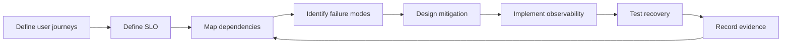
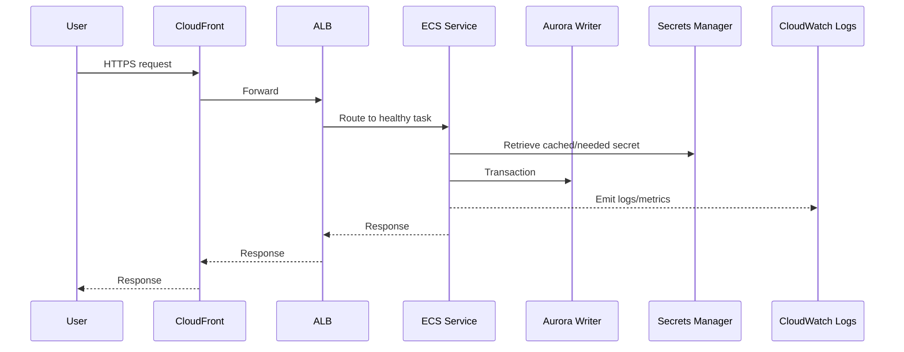
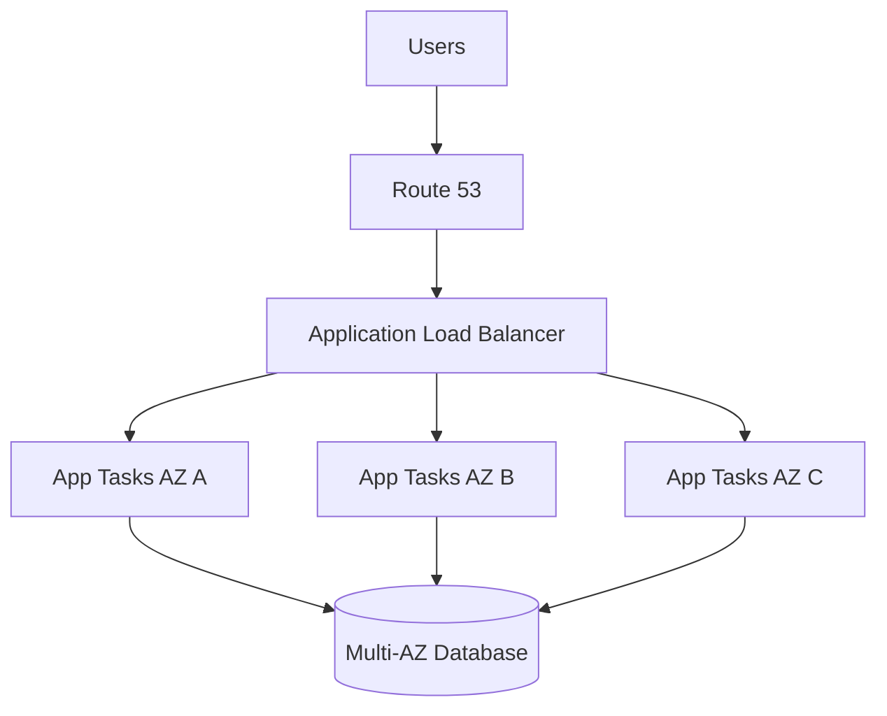
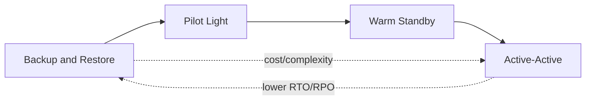
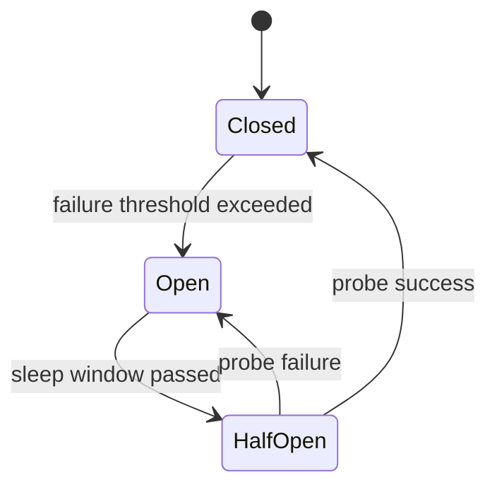

------
title: Learn AWS Engineering Mastery - Part 025
description: AWS reliability engineering for high availability, failover, graceful degradation, disaster recovery, chaos engineering, RTO, RPO, and production resilience.
series: learn-aws
seriesTitle: Learn AWS Engineering Mastery
order: 25
partTitle: Reliability Engineering: HA, Failover, Chaos, and RTO/RPO
tags:
- aws
- reliability
- high-availability
- disaster-recovery
- rto
- rpo
- chaos-engineering
- fault-injection
- sre
- well-architected
- series
date: 2026-07-01
---

# Reliability Engineering: HA, Failover, Chaos, and RTO/RPO

> Target pembelajaran: setelah bagian ini, kita mampu mendesain, mengevaluasi, menguji, dan mengoperasikan workload AWS yang tetap benar dan cukup tersedia ketika instance mati, AZ terganggu, dependency melambat, deployment gagal, kuota habis, data perlu dipulihkan, atau region harus diganti.

Part sebelumnya membahas operasi dan incident management: bagaimana merespons saat sinyal produksi menunjukkan masalah. Part ini naik satu level: bagaimana mendesain sistem agar sebagian besar kegagalan tidak langsung menjadi outage besar.

Reliability bukan sekadar “pakai Multi-AZ”. Reliability adalah kemampuan sistem untuk:

1. Menjalankan fungsi bisnis yang benar.
2. Bertahan saat komponen gagal.
3. Pulih dalam batas waktu yang disepakati.
4. Melindungi data dari kehilangan yang tidak dapat diterima.
5. Mengurangi blast radius.
6. Menguji asumsi recovery secara berkala.
7. Menjaga perubahan produksi tetap aman.

Di AWS, reliability harus dibaca sebagai kombinasi dari arsitektur, operasi, observability, deployment discipline, limit management, dan recovery rehearsal.

---

## 1. Kaufman Skill Map

```mermaid
flowchart TD
    A[AWS Reliability Mastery] --> B[Failure Model]
    A --> C[Availability Design]
    A --> D[Recovery Objectives]
    A --> E[Dependency Resilience]
    A --> F[Data Resilience]
    A --> G[Traffic and Failover]
    A --> H[Chaos and Game Days]
    A --> I[Operational Readiness]

    B --> B1[Fault vs Failure]
    B --> B2[Blast Radius]
    B --> B3[Failure Domain]
    B --> B4[Control Plane vs Data Plane]

    C --> C1[Multi-AZ]
    C --> C2[Horizontal Scaling]
    C --> C3[Health Checks]
    C --> C4[Load Shedding]

    D --> D1[RTO]
    D --> D2[RPO]
    D --> D3[MTTR]
    D --> D4[SLO]

    E --> E1[Timeouts]
    E --> E2[Retries]
    E --> E3[Circuit Breakers]
    E --> E4[Bulkheads]

    F --> F1[Backup]
    F --> F2[Replication]
    F --> F3[Restore Drill]
    F --> F4[Consistency]

    G --> G1[ALB/NLB]
    G --> G2[Route 53]
    G --> G3[CloudFront]
    G --> G4[Regional Failover]

    H --> H1[FIS]
    H --> H2[Hypothesis]
    H --> H3[Stop Conditions]
    H --> H4[Learning]
```



Cara belajar ala Kaufman di bagian ini:

- Jangan mulai dari daftar layanan.
- Mulai dari kegagalan yang harus ditahan.
- Pecah kegagalan menjadi kategori kecil.
- Latih satu failure mode sampai bisa menjelaskan deteksi, dampak, mitigasi, dan recovery.
- Bangun checklist self-correction: “apakah desain ini benar-benar pulih, atau hanya terlihat highly available di diagram?”

---

## 2. Mental Model: Reliability adalah Kontrak Perilaku Saat Gagal

Sistem reliable bukan sistem yang tidak pernah gagal. Sistem reliable adalah sistem yang kegagalannya sudah diperkecil, dibatasi, diamati, dan dipulihkan.

Mental model yang harus dipakai:

```txt
Business objective
  -> user journey
  -> critical operation
  -> dependency graph
  -> failure domain
  -> tolerated degradation
  -> recovery objective
  -> testable recovery mechanism
```

Contoh:

```txt
Business objective:
  User dapat submit enforcement case.

Critical operation:
  Create case + persist audit event + enqueue review workflow.

Dependencies:
  API Gateway, Lambda/ECS, database, event bus, audit store, identity provider.

Failure question:
  Jika EventBridge gagal sementara, apakah case creation harus gagal?
  Jika audit write gagal, apakah case boleh dibuat?
  Jika database writer failover, berapa lama user boleh menerima error?

Reliability design:
  Idempotency key, transaction boundary, outbox pattern, retry, DLQ,
  database Multi-AZ, alarm, runbook, restore drill.
```

Top 1% engineer tidak hanya mengatakan “gunakan managed service”. Ia bisa menjawab:

- Komponen mana yang boleh degraded?
- Komponen mana yang harus fail closed?
- Komponen mana yang boleh eventually consistent?
- Bagian mana yang memiliki human recovery step?
- Apakah RTO/RPO benar-benar diuji?
- Apa evidence bahwa recovery bekerja?

---

## 3. Vocabulary yang Harus Tepat

| Istilah | Makna Praktis | Kesalahan Umum |
|---|---|---|
| Fault | Kondisi abnormal pada komponen | Disamakan dengan outage total |
| Failure | Sistem gagal memenuhi kontrak eksternal | Mengukur hanya dari resource health, bukan user impact |
| Error | State internal yang salah | Tidak dikaitkan ke user journey |
| Failure domain | Batas tempat fault dapat terjadi bersamaan | Mengira AZ name konsisten lintas account tanpa AZ ID |
| Blast radius | Luas dampak dari satu fault/change | Semua tenant, semua region, semua workload terdampak satu konfigurasi |
| RTO | Maksimum waktu pemulihan yang dapat diterima | Dipilih tanpa drill restore nyata |
| RPO | Maksimum kehilangan data yang dapat diterima | Menganggap backup harian cukup untuk transaksi kritikal |
| MTTR | Waktu rata-rata memperbaiki/memulihkan | Fokus memperbaiki root cause, bukan restore service dulu |
| SLO | Target reliability yang terlihat user | Memakai CPU/Memory sebagai proxy tunggal user experience |
| HA | Desain agar tetap melayani saat komponen lokal gagal | Disamakan dengan DR multi-region |
| DR | Strategi pulih dari gangguan besar | Tidak diuji sampai terjadi bencana |

Prinsip penting:

- HA biasanya berfokus pada gangguan dalam satu region atau satu layer.
- DR biasanya berfokus pada gangguan besar seperti kehilangan region, kehilangan data plane penting, atau kerusakan data serius.
- Backup bukan DR sampai restore diuji.
- Replication bukan backup karena corruption bisa ikut tereplikasi.
- Multi-AZ bukan multi-region.
- Multi-region bukan otomatis active-active yang benar.

---

## 4. AWS Reliability Pillar sebagai Sistem Berpikir

AWS Well-Architected Reliability Pillar menekankan kemampuan workload untuk menjalankan fungsi yang diharapkan secara benar dan konsisten. Pilar ini mencakup foundation, workload architecture, change management, dan failure management.

Dalam praktik, gunakan Reliability Pillar sebagai review loop:



Pertanyaan yang harus sering muncul:

1. Apa fungsi paling kritikal workload ini?
2. Dependency apa yang paling sering gagal atau melambat?
3. Apakah sistem otomatis pulih dari kegagalan instance, task, pod, atau container?
4. Apakah kegagalan AZ bisa ditoleransi?
5. Apakah sistem bisa scale sebelum overload berubah menjadi outage?
6. Apakah recovery procedure diuji?
7. Apakah ada alarm yang menilai user impact, bukan hanya resource health?
8. Apakah quota sudah diperhitungkan?
9. Apakah perubahan produksi bisa rollback?
10. Apakah data bisa dipulihkan ke titik waktu yang benar?

---

## 5. Availability: Jangan Menghitung Tanpa Memahami Dependency Graph

Availability sistem end-to-end tidak bisa dinilai hanya dari availability satu layanan AWS. Yang penting adalah rantai dependency dari user journey.

Contoh dependency untuk request synchronous:



Jika semua dependency wajib sukses untuk satu request, maka reliability request tersebut adalah kombinasi dependency. Itulah mengapa reliability design harus menghapus dependency yang tidak wajib dari critical path.

Contoh:

| Dependency | Harus di critical path? | Pattern |
|---|---:|---|
| Database transaction utama | Ya | Multi-AZ, timeout, pool, failover awareness |
| Audit event | Sering ya untuk regulated system | Transactional outbox atau fail closed dengan explicit user message |
| Notification email | Tidak | Async queue/event |
| Analytics event | Tidak | Fire-and-forget dengan buffer |
| External enrichment | Tergantung | Timeout pendek, cache, fallback, async enrichment |
| Log shipping | Tidak untuk response user | Local buffering atau non-blocking emit |

Reliability meningkat ketika critical path lebih kecil, dependency tidak kritikal dipindahkan ke async, dan setiap dependency memiliki timeout serta fallback yang jelas.

---

## 6. Multi-AZ: Fondasi HA, Bukan Jaminan Ajaib

Multi-AZ adalah baseline banyak workload production AWS. Namun Multi-AZ tidak cukup jika aplikasi tidak siap.

Untuk workload stateless:



Checklist Multi-AZ yang benar:

- Subnet private tersedia di minimal dua AZ, idealnya tiga untuk workload penting.
- Load balancer memiliki subnet di AZ yang sama dengan target capacity.
- Auto Scaling dapat menambah capacity lintas AZ.
- Database menggunakan Multi-AZ atau cluster architecture yang sesuai.
- NAT Gateway tidak menjadi single-AZ dependency untuk semua private subnet.
- Endpoint penting tersedia secara regional atau desain tahu dependency tersebut.
- Health check mengukur kesiapan aplikasi, bukan hanya port terbuka.
- Deployment tidak mengganti semua instance di semua AZ sekaligus.
- Cache/session tidak melekat pada satu instance.
- Worker/consumer dapat resume tanpa kehilangan state.

Anti-pattern:

```txt
ALB multi-AZ
  + app multi-AZ
  + database single-AZ
  + NAT single-AZ
  + deployment all-at-once
  = diagram terlihat HA, sistem tidak HA.
```

---

## 7. Control Plane vs Data Plane dalam Reliability

Part 002 sudah memperkenalkan control plane dan data plane. Dalam reliability engineering, perbedaannya sangat penting.

Control plane adalah tempat kita membuat, mengubah, atau menghapus resource. Data plane adalah jalur resource melayani traffic runtime.

Contoh:

| Layanan | Control Plane | Data Plane |
|---|---|---|
| EC2 | Create/Terminate/Modify instance | Instance melayani traffic |
| ELB | Create listener/target group | Load balancer routing request |
| DynamoDB | Create table/update capacity | Read/write item |
| S3 | Create bucket/config policy | GetObject/PutObject |
| Route 53 | Change record | DNS resolution |
| Lambda | Update function config/code | Invoke function |

Reliability implication:

- Jangan membuat recovery yang bergantung pada control plane ketika data plane failure harus dipulihkan cepat.
- Pre-provision capacity untuk scenario penting.
- Gunakan warm standby jika RTO tidak memberi waktu create infrastructure dari nol.
- Pastikan break-glass/runbook tidak bergantung pada service yang sedang diasumsikan gagal.
- Jangan menaruh failover logic yang memerlukan banyak manual console change tanpa latihan.

Contoh buruk:

```txt
RTO: 15 menit
DR plan: buat VPC, subnet, EKS cluster, RDS restore, deploy app, update DNS secara manual
Kesimpulan: RTO tidak realistis.
```

Contoh lebih baik:

```txt
RTO: 15 menit
DR plan: warm standby region sudah punya VPC, cluster, secrets, parameter,
read replica/global database, pre-tested runbook, Route 53 failover,
dan regular game day.
```

---

## 8. RTO dan RPO: Harus Dibeli, Bukan Diinginkan

RTO dan RPO adalah kontrak bisnis-teknis.

```txt
RTO = berapa lama layanan boleh tidak tersedia.
RPO = berapa banyak data boleh hilang.
```

Semakin rendah RTO/RPO, semakin mahal desainnya.

| Target | Implikasi |
|---|---|
| RTO 24 jam, RPO 24 jam | Backup/restore mungkin cukup untuk workload non-kritikal |
| RTO 4 jam, RPO 1 jam | Pilot light atau warm restore dengan automation kuat |
| RTO 1 jam, RPO menit | Warm standby, replication, pre-provisioned infra |
| RTO menit, RPO near-zero | Active-active atau active-passive sangat siap, mahal, kompleks |

Pertanyaan yang harus diajukan ke stakeholder:

1. Berapa biaya bisnis outage per jam?
2. Berapa data yang legal/operasional boleh hilang?
3. Apakah data corruption lebih berbahaya daripada downtime?
4. Apakah read-only mode lebih baik daripada total outage?
5. Apakah sebagian fitur boleh dinonaktifkan?
6. Apakah semua tenant sama kritikal?
7. Apakah ada jam operasional dengan prioritas berbeda?
8. Apakah regulasi mewajibkan evidence restore?

Untuk platform regulatory/case management, RPO sering lebih ketat daripada yang terlihat karena audit trail, legal action, dan case state transition tidak boleh hilang diam-diam.

---

## 9. DR Strategy Decision Matrix

AWS umumnya membahas beberapa strategi DR di cloud: backup and restore, pilot light, warm standby, dan multi-site active-active. Jangan memilih berdasarkan keren. Pilih berdasarkan RTO/RPO, biaya, kompleksitas, dan kemampuan operasi.

| Strategy | RTO | RPO | Biaya | Kompleksitas | Cocok Untuk |
|---|---:|---:|---:|---:|---|
| Backup and restore | Tinggi | Tergantung backup | Rendah | Rendah-menengah | Workload non-kritikal, arsip, dev/test, internal tool |
| Pilot light | Menengah | Menengah-rendah | Menengah | Menengah | Workload penting tapi tidak perlu instant failover |
| Warm standby | Rendah | Rendah | Tinggi | Tinggi | Platform kritikal dengan RTO menit-jam |
| Active-active | Sangat rendah | Rendah/near-zero tergantung data | Sangat tinggi | Sangat tinggi | Global product, extremely high availability, careful conflict model |

Diagram sederhana:



### 9.1 Backup and Restore

Karakteristik:

- Infrastructure utama mungkin tidak berjalan di secondary region.
- Data dibackup ke tempat aman.
- Saat disaster, restore dilakukan dan aplikasi dinyalakan.

Risiko:

- Restore lebih lama dari estimasi.
- IAM/KMS/key policy tidak siap di region restore.
- DNS/cert/secrets tidak siap.
- Backup rusak atau tidak lengkap.
- Urutan restore antar sistem tidak jelas.

Gunakan jika:

- RTO longgar.
- Biaya harus rendah.
- Workload bukan user-facing kritikal.
- Recovery bisa manual dengan runbook matang.

### 9.2 Pilot Light

Karakteristik:

- Komponen inti minimal tersedia di secondary region.
- Data direplikasi/tersedia.
- Compute skala penuh belum berjalan.

Contoh:

```txt
Secondary region:
  VPC siap
  IAM/secrets/KMS siap
  database replica siap
  container image tersedia
  ECS/EKS minimal atau template siap
  deployment automation siap
```

Risiko:

- Scaling saat disaster gagal karena quota/capacity.
- Runbook tidak pernah diuji.
- Dependency eksternal belum dikonfigurasi.

### 9.3 Warm Standby

Karakteristik:

- Environment secondary berjalan dengan capacity lebih kecil.
- Semua layer penting sudah aktif.
- Saat disaster, scaling dan traffic shift dilakukan.

Keuntungan:

- RTO lebih rendah.
- Banyak dependency sudah tervalidasi setiap hari.
- Monitoring bisa mendeteksi drift.

Risiko:

- Biaya lebih tinggi.
- Data replication dan failback lebih kompleks.
- Jika secondary jarang menerima traffic, bug bisa tersembunyi.

### 9.4 Active-Active

Karakteristik:

- Dua atau lebih region melayani traffic aktif.
- Data dan session model harus mendukung multi-writer atau partitioned ownership.
- Conflict resolution menjadi problem bisnis, bukan hanya teknis.

Gunakan sangat hati-hati.

Pertanyaan wajib:

- Apakah operasi bisnis idempotent?
- Apakah ada global uniqueness constraint?
- Bagaimana conflict antar region diselesaikan?
- Apakah user bisa melihat state berbeda antar region?
- Apakah audit event order harus total-order atau per-entity order cukup?
- Bagaimana failback dilakukan?

Untuk regulated case management, active-active global sering tidak cocok jika workflow state transition membutuhkan ordering kuat. Cell-based atau active-passive per jurisdiction sering lebih masuk akal.

---

## 10. Data Resilience: Backup, Replication, Restore, dan Corruption

Data resilience adalah inti reliability. Compute bisa dibuat ulang. Data tidak.

### 10.1 Backup vs Replication

| Mekanisme | Fungsi | Kelemahan |
|---|---|---|
| Backup | Pulih ke titik waktu sebelumnya | Restore butuh waktu |
| Replication | Membuat salinan dekat real-time | Corruption/delete bisa ikut tereplikasi |
| Snapshot | Capture state resource | Perlu lifecycle dan restore test |
| Versioning | Melindungi object update/delete | Biaya naik jika lifecycle tidak diatur |
| PITR | Pulih ke waktu tertentu | Tidak mengganti kebutuhan validasi aplikasi |
| Immutable retention | Melindungi dari delete/tamper | Salah konfigurasi retention bisa mahal/sulit |

Rule:

```txt
Replication protects availability.
Backup protects recoverability.
Immutability protects against destructive change.
Restore drill proves all three.
```

### 10.2 RDS/Aurora

Reliability concern:

- Multi-AZ untuk HA.
- Automated backup dan PITR untuk recovery.
- Read replica bukan backup.
- Failover mengubah writer endpoint behaviour.
- Application harus tahan connection reset.
- Connection pool harus punya retry/backoff yang benar.
- Schema migration harus backward compatible.

Runbook pertanyaan:

- Bagaimana mendeteksi writer failover?
- Apakah aplikasi reconnect otomatis?
- Apakah transaction retry aman?
- Apakah migration bisa rollback?
- Apakah restore cluster diuji dengan data masking jika perlu?

### 10.3 DynamoDB

Reliability concern:

- On-demand/provisioned capacity dan hot partition.
- PITR untuk table recovery.
- Global tables untuk multi-region active-active replication.
- Conditional write untuk correctness.
- Streams untuk downstream projection.
- Idempotency untuk retry.

Global tables bukan solusi ajaib jika data model tidak siap conflict.

### 10.4 S3

Reliability concern:

- Versioning.
- Lifecycle.
- Replication.
- Object Lock untuk immutability.
- Bucket policy/KMS key policy saat restore/cross-account.
- Recovery dari accidental delete.

Untuk audit evidence, S3 versioning + Object Lock + lifecycle + access logging/CloudTrail data events bisa menjadi foundation kuat, tetapi harus diuji dengan retention policy nyata.

### 10.5 Event Data

Queue/event stream memiliki risiko berbeda:

- Message backlog saat consumer down.
- DLQ penuh tanpa owner.
- Retention habis sebelum recovery.
- Replay menghasilkan duplicate side effects.
- Ordering rusak setelah retry parallel.

Reliability pattern:

- Idempotency key.
- Consumer checkpoint.
- DLQ alarm.
- Replay runbook.
- Poison message quarantine.
- Backpressure dan rate limiting.

---

## 11. Dependency Resilience: Timeout, Retry, Circuit Breaker, Bulkhead

Banyak outage bukan karena dependency mati total, tetapi karena dependency melambat dan caller terus menunggu.

### 11.1 Timeout

Setiap network call harus punya timeout eksplisit.

```txt
No timeout = borrowed outage.
```

Guideline:

- Timeout harus lebih kecil dari request budget end-to-end.
- Timeout connect dan read harus dipisahkan jika library mendukung.
- Timeout harus dikonfigurasi per dependency, bukan default global asal-asalan.

### 11.2 Retry

Retry membantu transient failure, tetapi bisa memperburuk overload.

Retry yang sehat:

- Exponential backoff.
- Jitter.
- Max attempts.
- Idempotency.
- Retry hanya untuk error yang aman.
- Observability untuk retry count.

Anti-pattern:

```txt
User request timeout: 3 detik
Service A retry Service B 5x
Service B retry DB 5x
Service C retry Service A 5x

Hasil: retry storm.
```

### 11.3 Circuit Breaker

Circuit breaker menghentikan sementara panggilan ke dependency yang sedang gagal agar caller tidak ikut runtuh.

State umum:



Gunakan untuk dependency eksternal, enrichment service, third-party API, atau internal service yang tidak wajib berada di critical path.

### 11.4 Bulkhead

Bulkhead memisahkan resource agar satu failure tidak menghabiskan semua capacity.

Contoh:

- Thread pool terpisah per dependency.
- Queue terpisah per workload priority.
- Tenant cell terpisah.
- Account/VPC terpisah untuk domain risiko.
- Reserved concurrency Lambda untuk fungsi kritikal.

### 11.5 Load Shedding

Load shedding menolak sebagian traffic agar sistem inti tetap hidup.

Contoh:

- Return 429 untuk non-critical write.
- Disable expensive search sementara.
- Read-only mode.
- Drop analytics events.
- Queue low-priority jobs.
- Prioritize authenticated critical workflow.

Reliability bukan selalu melayani semua fitur. Kadang reliability berarti mengorbankan fitur non-kritikal agar core workflow tetap berjalan.

---

## 12. Graceful Degradation untuk Enterprise Platform

Untuk sistem enforcement/case management, graceful degradation harus dirancang berdasarkan business criticality.

| Fitur | Degradation Mode | Catatan |
|---|---|---|
| Login | Fail closed jika identity tidak tersedia | Bisa ada break-glass untuk admin terbatas |
| Case creation | Mungkin fail closed jika audit tidak bisa ditulis | Regulated context butuh evidence |
| Case search | Bisa degraded ke cached/recent index | Jangan tampilkan data stale tanpa label |
| Notification | Async retry | Tidak boleh block core transaction |
| Reporting | Defer/batch later | Jangan membebani OLTP saat incident |
| Attachment upload | Queue/temporary unavailable | Harus jelas ke user |
| Audit trail | Fail closed atau local durable buffer | Tergantung legal requirement |
| External registry lookup | Timeout + async enrichment | Jangan block jika bukan wajib |

Design question:

```txt
Jika fitur ini gagal, apakah lebih aman:
1. menolak operasi,
2. menerima operasi dengan status pending,
3. menerima operasi dengan warning,
4. melayani data stale,
5. menyembunyikan fitur sementara?
```

Jawaban tidak bisa generik. Harus ditentukan per user journey.

---

## 13. Health Checks: Liveness, Readiness, dan Correctness

Health check yang buruk membuat load balancer mengirim traffic ke target yang belum siap atau membuang target yang sebenarnya masih bisa melayani.

| Check | Pertanyaan | Contoh |
|---|---|---|
| Liveness | Proses masih hidup? | HTTP `/live` return 200 jika process loop sehat |
| Readiness | Siap menerima traffic? | Config loaded, DB reachable jika wajib |
| Dependency health | Dependency kritikal sehat? | DB connection pool usable |
| Business health | User journey sukses? | Synthetic transaction |

Anti-pattern:

```txt
/health returns 200 if process is alive
but app cannot connect to database
and deployment sends 100% traffic.
```

Pattern yang lebih baik:

- `/live` sederhana, tidak bergantung pada dependency eksternal.
- `/ready` memeriksa readiness dependency kritikal dengan timeout pendek.
- Synthetic canary memeriksa journey end-to-end.
- Alarm user-impact memakai SLO/error rate/latency, bukan hanya target healthy count.

---

## 14. Failover: Otomatis, Manual, atau Semi-Otomatis?

Failover otomatis terdengar ideal, tetapi tidak selalu benar.

| Mode | Cocok Untuk | Risiko |
|---|---|---|
| Otomatis | Local component failure yang jelas | False positive, split brain |
| Semi-otomatis | Regional failover dengan approval | Butuh on-call matang |
| Manual | Rare disaster/high-risk operation | Lambat, rawan human error |

Contoh keputusan:

- ALB target failover antar task sehat: otomatis.
- RDS/Aurora writer failover: managed/otomatis oleh service sesuai konfigurasi.
- DNS failover untuk read-only public endpoint: bisa otomatis jika health check valid.
- Regional failover untuk transactional platform: sering lebih aman semi-otomatis karena data correctness dan stakeholder communication penting.

Failover harus selalu punya failback plan.

Pertanyaan failback:

1. Region lama masih punya data yang harus direkonsiliasi?
2. Apakah writes terjadi di secondary?
3. Apakah DNS TTL dan cache client sudah dipahami?
4. Apakah user session harus invalidated?
5. Apakah background job double-run?
6. Apakah audit sequence berubah?
7. Siapa menyatakan primary pulih?

---

## 15. Chaos Engineering dengan AWS FIS

AWS Fault Injection Service adalah managed service untuk menjalankan fault injection experiments pada workload AWS. Tujuannya bukan merusak sistem, tetapi menguji hipotesis resilience.

Mental model:

```txt
Hypothesis:
  Jika satu AZ capacity untuk service X hilang,
  maka ALB akan mengalihkan traffic ke AZ lain,
  error rate tetap di bawah 1%,
  dan alarm yang benar akan aktif dalam 2 menit.

Experiment:
  Induce controlled fault.

Observation:
  Compare actual behavior to expected behavior.

Learning:
  Improve design/runbook/alarm.
```

Experiment yang baik memiliki:

- Hypothesis eksplisit.
- Blast radius terbatas.
- Scope resource jelas.
- Stop condition otomatis.
- Observability siap.
- Rollback/abort path.
- Stakeholder aware.
- Post-experiment review.

Contoh FIS/game day:

| Experiment | Tujuan |
|---|---|
| Stop subset EC2 instances | Validasi Auto Scaling dan ALB health check |
| Reboot database replica | Validasi read path dan alarm |
| Inject latency | Validasi timeout/circuit breaker |
| Fill queue backlog | Validasi autoscaling consumer dan DLQ alarm |
| Deny egress sementara | Validasi fallback external dependency |
| Reduce Lambda concurrency | Validasi throttling, retry, DLQ |

Jangan mulai chaos engineering di production tanpa maturity. Mulai dari staging yang representatif, lalu production dengan scope kecil dan stop condition kuat.

---

## 16. Reliability Review Checklist

Gunakan checklist ini untuk review desain workload.

### 16.1 User Journey

- Apakah journey kritikal sudah diidentifikasi?
- Apakah SLO didefinisikan per journey?
- Apakah ada journey non-kritikal yang bisa degraded?
- Apakah error budget dipakai untuk release decision?

### 16.2 Architecture

- Apakah compute stateless sejauh mungkin?
- Apakah stateful dependency punya HA?
- Apakah dependency non-kritikal dipindahkan dari synchronous path?
- Apakah setiap dependency punya timeout?
- Apakah retry memakai backoff + jitter?
- Apakah idempotency tersedia untuk write/retry?
- Apakah ada bulkhead untuk workload/tenant/dependency?

### 16.3 AWS Foundation

- Apakah resource tersebar di minimal dua AZ?
- Apakah NAT/egress tidak menjadi single-AZ bottleneck?
- Apakah quota sudah diperiksa untuk scale/failover?
- Apakah service limits memiliki alarm atau review process?
- Apakah route/DNS health check sesuai user impact?
- Apakah IAM/KMS/secrets tersedia untuk restore region?

### 16.4 Data

- Apakah backup aktif?
- Apakah restore diuji?
- Apakah RPO terukur?
- Apakah corruption scenario dipikirkan?
- Apakah replication dan backup dipisahkan?
- Apakah retention sesuai regulasi?

### 16.5 Operations

- Apakah alarm actionable?
- Apakah runbook punya owner?
- Apakah recovery drill dijalankan?
- Apakah post-incident learning masuk backlog?
- Apakah game day terjadwal?
- Apakah evidence recovery disimpan?

---

## 17. Failure Mode Catalog

| Failure Mode | Gejala | Mitigasi |
|---|---|---|
| Instance/task mati | Target unhealthy, error naik | ASG/ECS/EKS replacement, ALB health check |
| AZ impairment | Latency/error dari subset AZ | Multi-AZ capacity, zonal shift strategy, failover |
| DB writer failover | Connection reset, write error sementara | Pool reconnect, retry safe transaction, alarm |
| Hot partition DynamoDB | Throttling pada key tertentu | Better key design, write sharding, adaptive capacity awareness |
| Queue backlog | Latency async naik | Consumer autoscaling, DLQ, backpressure |
| Retry storm | Traffic internal melonjak | Backoff, jitter, circuit breaker, budgeted retry |
| Deployment regression | Error rate naik setelah release | Canary, blue/green, rollback/roll-forward |
| KMS key inaccessible | Data decrypt gagal | Key policy review, multi-region planning, break-glass |
| Secret rotation broken | App auth DB gagal | Rotation test, version staging, cached secret strategy |
| DNS misconfiguration | Traffic ke endpoint salah | Change review, low TTL during migration, rollback record |
| Quota exhaustion | Scale-out gagal | Quota monitoring, pre-approval, capacity planning |
| Data corruption | Wrong state persisted | PITR, immutable backup, validation, replay plan |

---

## 18. Anti-Patterns

1. **Diagram-driven reliability**  
   Diagram multi-AZ tanpa health check, failover drill, dan data recovery bukan reliability.

2. **RTO/RPO wishful thinking**  
   Menulis RTO 15 menit tetapi restore database saja 90 menit.

3. **Backup tanpa restore**  
   Backup dianggap berhasil karena job sukses, bukan karena aplikasi bisa berjalan dari hasil restore.

4. **Retry tanpa idempotency**  
   Retry write operation menyebabkan double charge, duplicate case, atau duplicate notification.

5. **Semua dependency di critical path**  
   Email, analytics, search indexing, dan external lookup memblokir transaksi utama.

6. **Failover tanpa failback**  
   Secondary region berhasil aktif, tetapi tidak ada rencana kembali atau rekonsiliasi.

7. **Alarm terlalu banyak, signal terlalu sedikit**  
   Banyak alarm resource-level, tetapi tidak ada alarm user journey.

8. **Shared fate tersembunyi**  
   Semua workload berbeda memakai satu KMS key, satu NAT, satu queue, satu database, satu deployment pipeline.

9. **Chaos tanpa hypothesis**  
   Mematikan resource untuk “melihat apa yang terjadi” tanpa stop condition dan observability.

10. **DR hanya dokumen**  
    Runbook terlihat lengkap tetapi tidak pernah dilatih oleh orang yang benar-benar on-call.

---

## 19. Decision Framework

Saat mendesain reliability, gunakan urutan berikut:

```txt
1. Tentukan user journey kritikal.
2. Tetapkan SLO, RTO, RPO.
3. Petakan dependency graph.
4. Tandai dependency synchronous vs async.
5. Tandai dependency hard requirement vs optional.
6. Tentukan degradation mode.
7. Desain HA lokal.
8. Desain data recovery.
9. Desain DR regional jika perlu.
10. Implement observability.
11. Tulis runbook.
12. Uji failover/restore.
13. Simpan evidence.
14. Review setelah incident/game day.
```

Rule of thumb:

- Untuk setiap synchronous dependency, punya timeout.
- Untuk setiap retry, punya idempotency.
- Untuk setiap queue, punya DLQ dan owner.
- Untuk setiap database, punya backup dan restore drill.
- Untuk setiap failover, punya failback.
- Untuk setiap alarm, punya runbook.
- Untuk setiap RTO/RPO, punya evidence.

---

## 20. Deliberate Practice

### Latihan 1: Dependency Graph

Ambil satu layanan API production. Buat dependency graph untuk satu critical endpoint.

Output:

- Dependency list.
- Critical vs optional.
- Timeout per dependency.
- Retry rule.
- Degradation mode.
- Alarm yang dibutuhkan.

### Latihan 2: RTO/RPO Reality Check

Pilih satu database. Jawab:

- Backup frequency.
- PITR availability.
- Last successful restore test.
- Restore duration.
- Data validation method.
- IAM/KMS restore dependency.
- RTO/RPO aktual berdasarkan drill.

### Latihan 3: Queue Failure

Simulasikan consumer down selama 30 menit.

Amati:

- Backlog growth.
- Consumer scale-out.
- DLQ movement.
- Processing latency after recovery.
- Duplicate handling.
- User-visible impact.

### Latihan 4: AZ Capacity Loss

Di staging yang representatif, kurangi capacity satu AZ.

Validasi:

- Load balancer routing.
- Remaining AZ capacity.
- Auto Scaling behavior.
- Error rate.
- Latency.
- Alarm.

### Latihan 5: DR Tabletop

Jalankan tabletop untuk skenario primary region unavailable.

Dokumenkan:

- Siapa incident commander.
- Siapa approval failover.
- Step-by-step failover.
- Data risk.
- Communication plan.
- Failback plan.
- Gap yang ditemukan.

---

## 21. Self-Correction ala Kaufman

Setelah mempelajari bagian ini, kita belum dianggap paham jika hanya bisa menyebut “Multi-AZ, backup, failover”. Kita dianggap mulai competent jika bisa menjawab pertanyaan ini tanpa membuka template:

1. Apa perbedaan HA dan DR untuk workload ini?
2. Apa RTO/RPO realistis berdasarkan drill terakhir?
3. Dependency mana yang harus dihapus dari critical path?
4. Di mana blast radius terbesar?
5. Bagaimana sistem berperilaku saat database writer failover?
6. Apa yang terjadi jika queue consumer mati satu jam?
7. Apakah retry bisa menciptakan duplicate side effect?
8. Apakah health check benar-benar mengukur readiness?
9. Apakah failover membutuhkan control plane change?
10. Apakah backup bisa dipulihkan dengan KMS key dan IAM policy yang benar?
11. Apakah alarm memetakan user impact?
12. Apa experiment kecil yang bisa membuktikan resilience assumption minggu ini?

---

## 22. Ringkasan Engineering Judgment

Reliability engineering di AWS adalah kemampuan menyambungkan user journey, failure domain, dependency graph, recovery objective, data protection, traffic control, observability, dan operational rehearsal.

Keputusan matang biasanya terlihat seperti ini:

```txt
Untuk workload case submission:
- Compute berjalan multi-AZ.
- Database memakai HA yang sesuai.
- Audit write berada dalam correctness boundary.
- Notification dan analytics async.
- External dependency memiliki timeout dan fallback.
- Write operation idempotent.
- Queue punya DLQ dan replay runbook.
- Backup dan restore diuji.
- RTO/RPO berdasarkan evidence, bukan harapan.
- Game day menguji failure mode prioritas.
```

Top 1% engineer tidak mendesain sistem yang “terlihat redundant”. Ia mendesain sistem yang kegagalannya bisa diprediksi, dibatasi, diamati, dipulihkan, dan dibuktikan.

---

## 23. Referensi Resmi

- AWS Well-Architected Framework - Reliability Pillar: https://docs.aws.amazon.com/wellarchitected/latest/reliability-pillar/welcome.html
- AWS Well-Architected - Disaster Recovery strategies: https://docs.aws.amazon.com/wellarchitected/latest/reliability-pillar/rel_planning_for_recovery_disaster_recovery.html
- Disaster Recovery of Workloads on AWS: https://docs.aws.amazon.com/whitepapers/latest/disaster-recovery-workloads-on-aws/disaster-recovery-workloads-on-aws.html
- AWS Fault Injection Service User Guide: https://docs.aws.amazon.com/fis/latest/userguide/what-is.html
- Planning AWS FIS experiments: https://docs.aws.amazon.com/fis/latest/userguide/getting-started-planning.html
- Amazon Route 53 health checks and DNS failover: https://docs.aws.amazon.com/Route53/latest/DeveloperGuide/dns-failover.html
- Amazon RDS Multi-AZ deployments: https://docs.aws.amazon.com/AmazonRDS/latest/UserGuide/Concepts.MultiAZ.html
- Amazon Aurora high availability: https://docs.aws.amazon.com/AmazonRDS/latest/AuroraUserGuide/Concepts.AuroraHighAvailability.html
