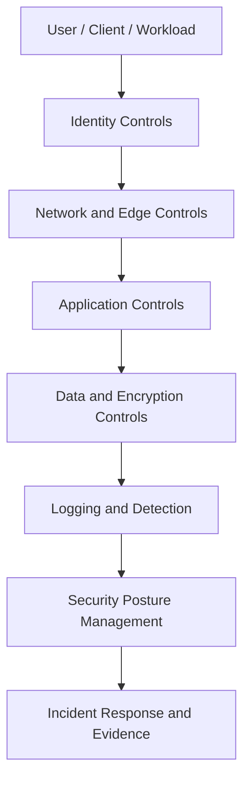
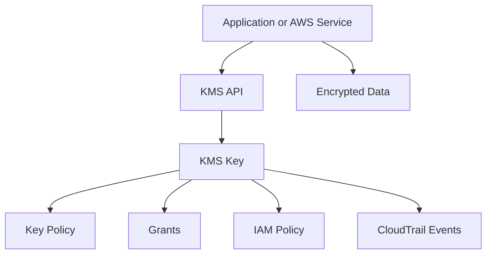
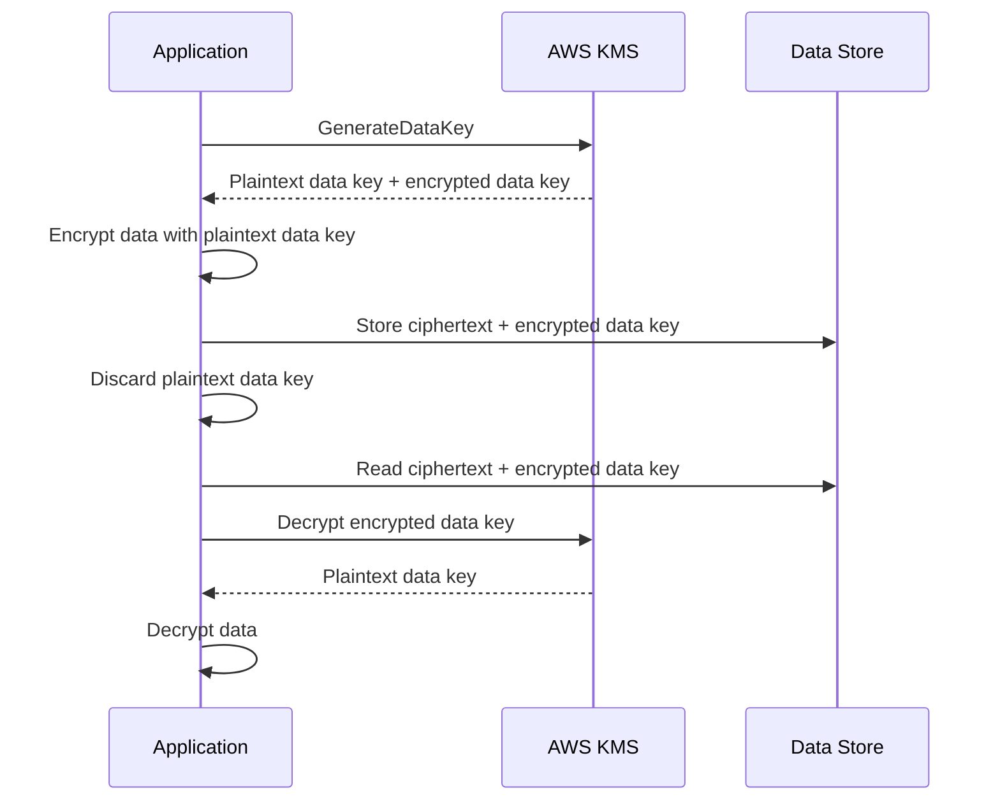
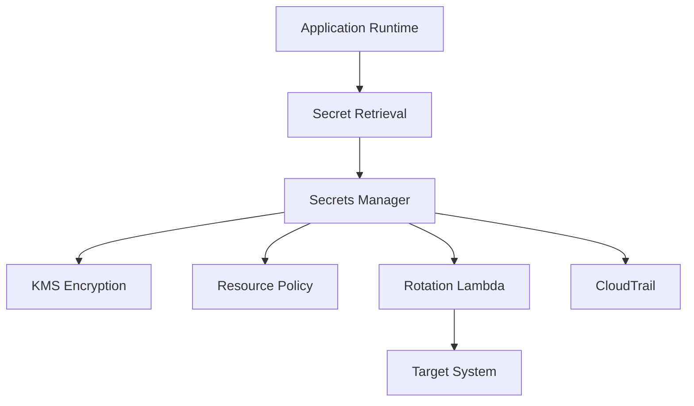
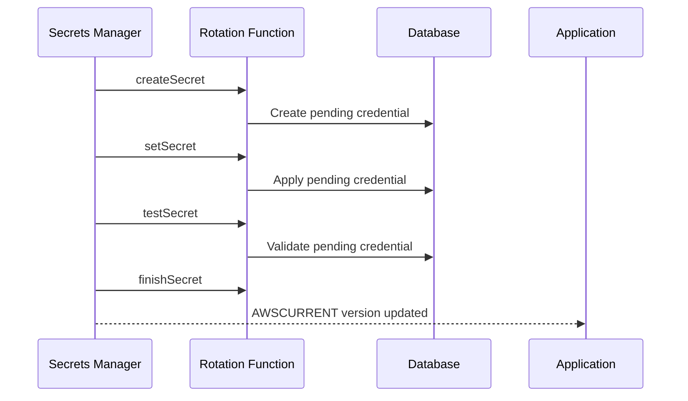
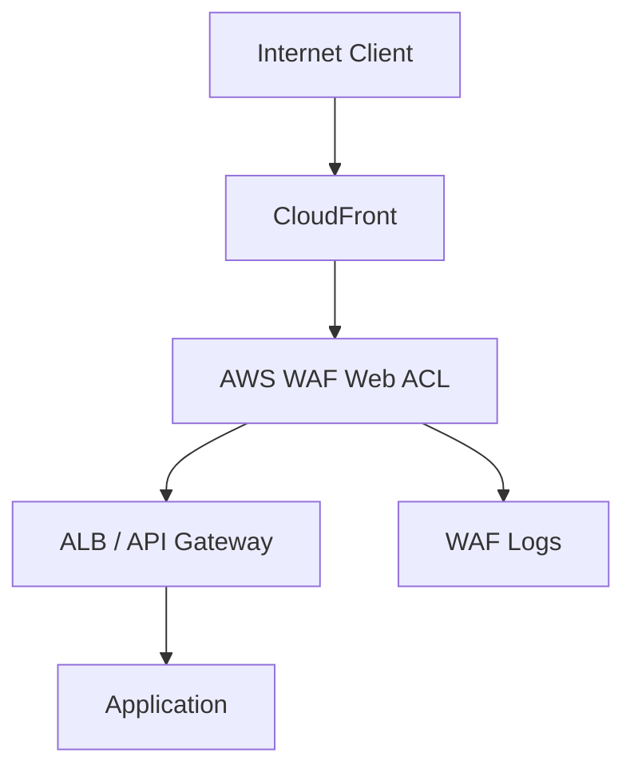
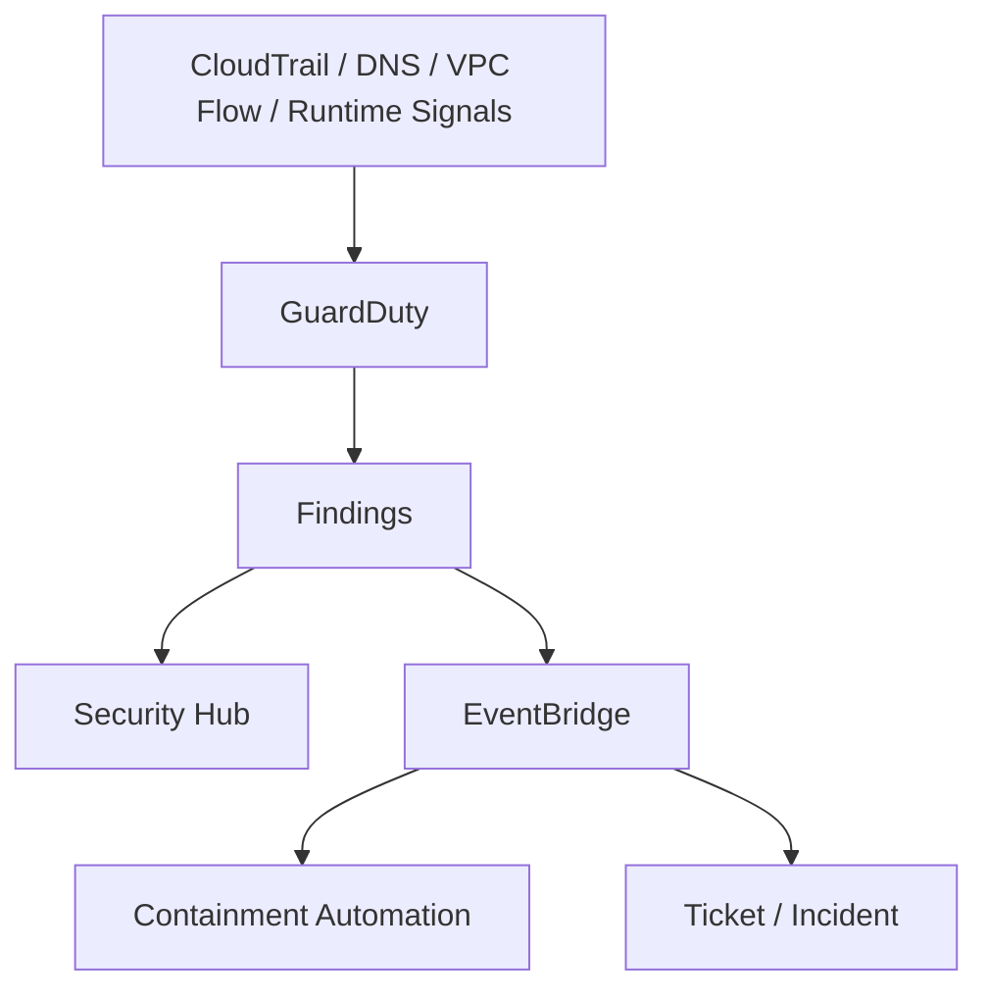
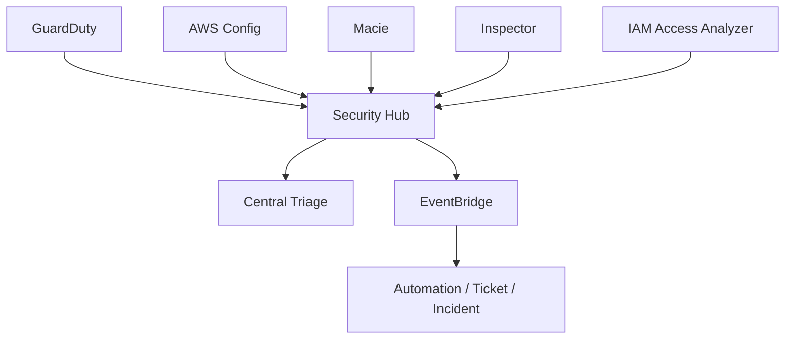
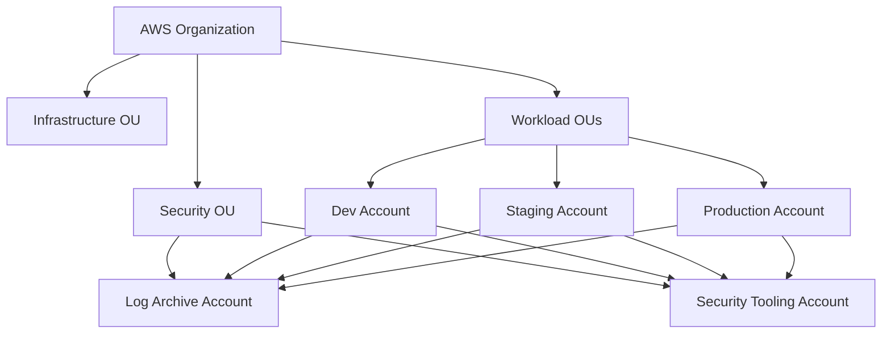

------
title: Learn AWS Engineering Mastery - Part 026
description: AWS security engineering with KMS, envelope encryption, Secrets Manager, WAF, Shield, GuardDuty, Security Hub, detective controls, threat modeling, and incident containment.
series: learn-aws
seriesTitle: Learn AWS Engineering Mastery
order: 26
partTitle: Security Engineering: KMS, Secrets, WAF, GuardDuty, and Security Hub
tags:
- aws
- security
- kms
- secrets-manager
- waf
- shield
- guardduty
- security-hub
- threat-detection
- encryption
- series
date: 2026-07-01
---

# Security Engineering: KMS, Secrets, WAF, GuardDuty, and Security Hub

> Target pembelajaran: setelah bagian ini, kita mampu mendesain security operating model AWS yang melindungi data, mengendalikan secrets, memfilter traffic, mendeteksi ancaman, mengonsolidasikan findings, dan menyiapkan containment yang bisa diaudit.

Part sebelumnya membahas reliability: bagaimana sistem tetap melayani saat gagal. Security engineering membahas pertanyaan yang berbeda tetapi sama kritikal:

> Ketika identitas disalahgunakan, konfigurasi keliru, data harus dilindungi, traffic berbahaya masuk, credential bocor, atau resource diakses lintas boundary, bagaimana sistem mencegah, mendeteksi, membatasi, dan membuktikan responsnya?

Security di AWS bukan satu layanan. Security adalah sistem kontrol yang terdiri dari:

1. Identity boundary.
2. Network boundary.
3. Encryption boundary.
4. Secret lifecycle.
5. Workload hardening.
6. Preventive controls.
7. Detective controls.
8. Response automation.
9. Evidence dan auditability.
10. Governance lintas account.

Part 006 sudah membahas IAM secara mendalam. Part ini tidak mengulang IAM, tetapi memakai IAM sebagai fondasi untuk membahas KMS, Secrets Manager, WAF, GuardDuty, Security Hub, dan operating model keamanan.

---

## 1. Kaufman Skill Map

```mermaid
flowchart TD
    A[AWS Security Engineering Mastery] --> B[Threat Model]
    A --> C[Encryption and KMS]
    A --> D[Secrets Lifecycle]
    A --> E[Edge Protection]
    A --> F[Threat Detection]
    A --> G[Security Posture]
    A --> H[Incident Containment]
    A --> I[Evidence]

    B --> B1[Assets]
    B --> B2[Actors]
    B --> B3[Trust Boundaries]
    B --> B4[Abuse Cases]

    C --> C1[KMS Keys]
    C --> C2[Key Policies]
    C --> C3[Envelope Encryption]
    C --> C4[Encryption Context]

    D --> D1[Secret Storage]
    D --> D2[Rotation]
    D --> D3[Runtime Retrieval]
    D --> D4[Access Audit]

    E --> E1[WAF]
    E --> E2[Shield]
    E --> E3[Rate Limit]
    E --> E4[Managed Rules]

    F --> F1[GuardDuty]
    F --> F2[Inspector]
    F --> F3[Macie]
    F --> F4[Detective]

    G --> G1[Security Hub]
    G --> G2[Config]
    G --> G3[Access Analyzer]
    G --> G4[Control Mapping]

    H --> H1[Containment]
    H --> H2[Isolation]
    H --> H3[Forensics]
    H --> H4[Recovery]
```



Cara belajar efektif:

- Jangan mulai dari “apa itu KMS/GuardDuty/WAF”.
- Mulai dari asset dan threat.
- Tentukan boundary.
- Pilih kontrol preventif dan detektif.
- Tentukan signal dan response.
- Uji apakah kontrol bekerja dengan skenario abuse yang realistis.

---

## 2. Mental Model: Security sebagai Boundary + Evidence

Security engineering di AWS harus menjawab lima pertanyaan:

```txt
1. Apa asset yang dilindungi?
2. Siapa/apa yang boleh mengaksesnya?
3. Dari boundary mana akses terjadi?
4. Bagaimana misuse dicegah atau dibatasi?
5. Bagaimana misuse dideteksi, ditangani, dan dibuktikan?
```

Diagram security control stack:



Top-tier security judgment bukan “aktifkan semua service”. Judgment yang benar:

- Mengetahui data mana yang paling sensitif.
- Menentukan trust boundary per account/VPC/service/tenant.
- Menghindari long-lived credential.
- Membatasi permissions runtime.
- Memakai encryption dengan key ownership yang benar.
- Mengelola secret lifecycle.
- Menempatkan WAF di edge yang tepat.
- Mengaktifkan detective controls secara organisasi.
- Menormalisasi findings.
- Menulis containment runbook.
- Menyimpan evidence yang cukup untuk audit dan post-incident analysis.

---

## 3. Security Control Taxonomy

| Control Type | Tujuan | AWS Examples |
|---|---|---|
| Preventive | Mencegah aksi berbahaya | IAM, SCP, permission boundary, VPC endpoint policy, KMS key policy, WAF block rule |
| Detective | Mendeteksi kondisi/aktivitas mencurigakan | GuardDuty, Security Hub, CloudTrail, Config, Access Analyzer, Macie, Inspector |
| Responsive | Menahan dan memperbaiki | EventBridge rule, Lambda remediation, SSM Automation, quarantine security group |
| Corrective | Mengembalikan sistem ke state aman | Patch, rotate secret, revoke session, restore resource |
| Deterrent | Mengurangi niat/risiko melalui auditability | Logging, legal banner, immutable audit trail |
| Compensating | Mengurangi risiko ketika kontrol utama tidak mungkin | Manual approval, dual control, restricted break-glass |

Security design yang matang tidak bergantung pada satu control. Ia menggunakan layered control.

Contoh:

```txt
S3 sensitive evidence bucket:
- Preventive: bucket policy, Block Public Access, KMS key policy, SCP.
- Detective: CloudTrail data events, Access Analyzer, Security Hub controls, Macie.
- Responsive: EventBridge remediation jika policy public.
- Corrective: revoke policy, rotate keys if needed, review access.
- Evidence: CloudTrail, Config timeline, incident record.
```

---

## 4. Threat Modeling untuk AWS Workload

Threat model minimal untuk workload AWS:

```txt
Asset:
  Data, identity, compute, network path, secrets, logs, audit evidence.

Actor:
  Human user, admin, developer, workload role, third-party system, attacker, insider.

Entry point:
  Public API, console, CI/CD, IAM role assumption, S3 object, message queue, container image.

Trust boundary:
  Account, VPC, subnet, security group, service role, tenant, KMS key, data classification.

Abuse case:
  Credential theft, privilege escalation, data exfiltration, tampering, denial of service.

Control:
  Prevent, detect, contain, recover.
```

Contoh untuk API publik:

| Threat | Control |
|---|---|
| Credential stuffing | Cognito controls, WAF rate-based rule, bot mitigation, alarms |
| SQL injection attempt | Input validation, parameterized query, WAF managed rules, logging |
| Token replay | Short token lifetime, audience/issuer validation, TLS, nonce where needed |
| DDoS | CloudFront, Shield, WAF, autoscaling, rate limit, fail closed design |
| Excessive API usage | API Gateway throttling, usage plan, WAF rate limit, application quota |
| Unauthorized admin access | IAM Identity Center, MFA, SCP, permission boundary, CloudTrail |
| Secret leakage | Secrets Manager, rotation, no secret in image/env/log, scanning |
| Data exfiltration | VPC endpoint policy, S3 bucket policy, KMS context, GuardDuty/Macie |

---

## 5. KMS Mental Model

AWS Key Management Service adalah service untuk membuat dan mengontrol cryptographic keys yang digunakan untuk melindungi data. KMS sering dipakai secara langsung oleh aplikasi atau secara tidak langsung oleh layanan AWS seperti S3, EBS, RDS, DynamoDB, CloudWatch Logs, Secrets Manager, dan banyak layanan lain.

Mental model KMS:



KMS bukan hanya “encryption on”. KMS adalah boundary authorization untuk decrypt.

Jika data terenkripsi dengan KMS key tertentu, maka akses data membutuhkan dua hal:

1. Akses ke data encrypted itu sendiri.
2. Izin menggunakan KMS key untuk decrypt.

Ini menciptakan defense-in-depth.

Contoh:

```txt
User punya s3:GetObject
Tetapi tidak punya kms:Decrypt pada key bucket
=> object tidak bisa dibaca.
```

---

## 6. Envelope Encryption

Envelope encryption adalah pattern umum: data dienkripsi dengan data key, lalu data key dienkripsi dengan KMS key.



Keuntungan:

- KMS key tidak langsung mengenkripsi data besar.
- Aplikasi bisa mengenkripsi banyak data dengan data key lokal.
- KMS tetap mengontrol decrypt data key.
- CloudTrail dapat mencatat penggunaan KMS API.

Engineering concern:

- Cache data key dengan hati-hati.
- Jangan log plaintext key.
- Gunakan encryption context untuk mengikat konteks penggunaan.
- Pahami latency dan quota KMS jika decrypt per request.
- Jangan membuat satu key global tanpa boundary.

---

## 7. KMS Key Policy, IAM Policy, Grants, dan SCP

KMS authorization sering membingungkan karena tidak hanya IAM policy.

| Mechanism | Fungsi |
|---|---|
| Key policy | Resource policy utama pada KMS key |
| IAM policy | Izin principal untuk memanggil KMS API |
| Grants | Delegasi permission KMS untuk use case tertentu, sering dipakai service AWS |
| SCP | Boundary organisasi yang bisa membatasi izin account |
| VPC endpoint policy | Boundary jika akses KMS lewat VPC endpoint |

Rule penting:

```txt
Jangan mengelola KMS hanya dengan IAM policy tanpa memahami key policy.
```

Checklist key policy:

- Siapa key administrator?
- Siapa key user?
- Apakah root account principal dipakai untuk enable IAM delegation dengan aman?
- Apakah cross-account access diperlukan?
- Apakah service principal tertentu butuh grant?
- Apakah key deletion dibatasi?
- Apakah CloudTrail mencatat key usage?
- Apakah ada break-glass yang diaudit?

Anti-pattern:

```txt
Satu KMS key untuk semua workload, semua environment, semua tenant.
```

Pattern lebih baik:

- Key per data domain sensitif.
- Key per environment.
- Key per tenant hanya jika isolation/regulasi/operasional membutuhkan.
- Centralized key management untuk evidence, tetapi decrypt permission tetap least privilege.

---

## 8. Encryption Context

Encryption context adalah additional authenticated data yang ikut diverifikasi saat decrypt. Ia tidak rahasia, tetapi membantu membatasi penggunaan ciphertext pada konteks yang benar.

Contoh konsep:

```txt
Encrypt object dengan context:
  tenantId=tenant-123
  dataDomain=evidence

Decrypt hanya valid jika context yang sama dipakai.
```

Manfaat:

- Mengurangi risiko ciphertext dipakai ulang di konteks salah.
- Membantu audit CloudTrail karena context muncul di log event.
- Bisa dipakai dalam policy condition untuk membatasi penggunaan key.

Gunakan untuk aplikasi yang melakukan envelope encryption sendiri, terutama multi-tenant atau regulated workload.

---

## 9. KMS Multi-Region Keys

Multi-Region keys membantu scenario client-side encryption atau aplikasi yang perlu decrypt data di lebih dari satu region dengan key material terkait. Namun ini bukan pengganti desain DR.

Pertanyaan sebelum memakai multi-Region keys:

- Apakah data benar-benar harus didekripsi lintas region?
- Apakah key policy di setiap region konsisten?
- Apakah rotation dan deletion process jelas?
- Apakah CloudTrail multi-region logging aktif?
- Apakah compliance mengizinkan key material replication?

Untuk banyak workload, service-managed regional key cukup. Untuk DR yang ketat, key strategy harus didesain bersama data replication dan restore plan.

---

## 10. Secrets Manager Mental Model

AWS Secrets Manager membantu menyimpan, mengambil, dan merotasi secret seperti database credential, API key, OAuth token, dan application credential.

Mental model:



Secret lifecycle:

```txt
Create -> Store -> Retrieve -> Cache -> Rotate -> Audit -> Retire
```

Security rule:

- Jangan hardcode secret di source code.
- Jangan memasukkan secret ke container image.
- Jangan menyimpan secret di plain environment variable jika platform/logging bisa mengeksposnya.
- Jangan menulis secret ke log.
- Jangan membagi satu secret untuk banyak service tanpa alasan.
- Jangan memberi wildcard access ke semua secret.

---

## 11. Secret Rotation

Rotation bukan hanya mengganti nilai. Rotation adalah koordinasi antara secret store, target system, dan aplikasi pengguna secret.

Pattern umum:



Operational concern:

- Aplikasi harus menangani credential berubah.
- Connection pool harus reconnect.
- Rotation failure harus alarm.
- Secret version staging label harus dipahami.
- Rollback secret harus terdefinisi.
- Least privilege rotation Lambda harus ketat.
- Cross-account secret access perlu resource policy dan KMS permission.

Anti-pattern:

```txt
Secret rotation aktif
application credential cached selamanya
connection pool tidak refresh
hasil: outage saat rotation sukses.
```

---

## 12. WAF dan Edge Protection

AWS WAF membantu membuat rules untuk memonitor, allow, block, atau count web requests. WAF bisa dipasang pada resource seperti CloudFront distribution, Application Load Balancer, API Gateway, AppSync, dan beberapa resource lain tergantung dukungan saat itu.

Mental model:



WAF bukan pengganti secure coding. WAF adalah compensating/preventive edge control.

Rule category:

| Rule | Tujuan |
|---|---|
| Managed rule group | Proteksi umum dari pattern serangan known |
| Rate-based rule | Membatasi request berlebihan dari source tertentu |
| IP match | Allow/block IP range tertentu |
| Geo match | Kontrol berbasis lokasi jika relevan |
| Regex/string match | Deteksi pattern spesifik |
| Bot controls | Mengurangi automated abuse jika diperlukan |
| Count mode | Observasi sebelum block |

Deployment approach:

1. Pasang WAF di edge terluar yang relevan.
2. Mulai managed rules di count mode untuk memahami false positive.
3. Aktifkan block untuk rule matang.
4. Tambahkan rate-based rules untuk endpoint sensitif.
5. Log WAF ke destination yang bisa dianalisis.
6. Buat alarm untuk blocked spike dan allowed suspicious pattern.
7. Review exceptions secara berkala.

Anti-pattern:

```txt
WAF managed rules langsung block semua tanpa observability.
Hasil: legitimate customer traffic ikut terblokir.
```

---

## 13. Shield dan DDoS Resilience

AWS Shield Standard menyediakan proteksi DDoS otomatis untuk semua customer AWS. AWS Shield Advanced memberikan proteksi dan fitur tambahan untuk workload yang membutuhkan perlindungan lebih kuat dan respons khusus.

DDoS resilience tidak hanya Shield.

Layer yang perlu dipikirkan:

```txt
DNS -> CDN/edge -> WAF/rate limit -> load balancer/API -> autoscaling -> app-level quota -> dependency protection
```

Checklist:

- CloudFront untuk absorb dan cache traffic jika cocok.
- WAF rate-based rule untuk endpoint sensitif.
- API Gateway throttling untuk API.
- ALB/NLB capacity dan target scaling.
- App-level quota per user/tenant/API key.
- Backpressure ke queue.
- Protection untuk expensive endpoint.
- Runbook untuk traffic spike.

DDoS sering menjadi masalah cost dan dependency exhaustion, bukan hanya availability.

---

## 14. GuardDuty: Threat Detection

Amazon GuardDuty adalah threat detection service yang memonitor aktivitas mencurigakan dan malicious behavior pada AWS account, workload, Kubernetes cluster, dan data tertentu seperti S3. GuardDuty menggunakan sumber seperti CloudTrail events, VPC Flow Logs, DNS logs, dan lainnya sesuai fitur yang aktif.

Mental model:



GuardDuty finding bukan otomatis breach. Finding adalah signal yang harus triaged.

Contoh kategori concern:

- Credential exfiltration indicator.
- Unusual API call.
- Reconnaissance activity.
- Crypto mining behavior.
- Suspicious network connection.
- S3 data access anomaly.
- EKS runtime/network finding jika fitur terkait aktif.

Operating model:

- Enable organization-wide via delegated administrator.
- Kirim findings ke Security Hub.
- Buat severity mapping.
- Buat EventBridge rules untuk finding kritikal.
- Automate containment yang aman.
- Hindari auto-remediation destruktif tanpa confidence tinggi.
- Latih runbook untuk credential compromise.

---

## 15. Security Hub: Finding Normalization dan Posture Management

AWS Security Hub CSPM mengonsolidasikan findings dari layanan keamanan AWS dan partner dalam format standar. Security Hub juga menyediakan controls yang mengevaluasi posture terhadap best practices/standards tertentu.

Mental model:



Security Hub berguna karena organisasi besar tidak bisa triage dari 15 console terpisah.

Namun Security Hub bukan SIEM penuh dan bukan pengganti SOC process. Ia adalah finding aggregation dan posture management layer.

Checklist Security Hub:

- Delegated admin di security tooling account.
- Enable lintas account dan region yang relevan.
- Integrasi GuardDuty, Inspector, Macie, IAM Access Analyzer, Config.
- Standard/control yang dipakai jelas.
- Suppression workflow terdokumentasi.
- Finding severity mapping ke SLA response.
- False positive punya expiration/review date.
- Findings dikirim ke ticketing/SIEM jika ada.
- Metrics: open critical findings, mean time to remediate, recurring findings.

Anti-pattern:

```txt
Security Hub enabled
10,000 findings ignored
no owner
no suppression policy
no SLA
= security theater.
```

---

## 16. IAM Access Analyzer dalam Security Posture

IAM Access Analyzer membantu mengidentifikasi resource policy yang memberi akses eksternal/public/cross-account yang tidak diinginkan, dan dapat terintegrasi dengan Security Hub.

Gunakan untuk:

- S3 bucket policy.
- KMS key policy.
- IAM role trust policy.
- SQS/SNS resource policy.
- Lambda function policy.
- Cross-account access review.

Access Analyzer sangat penting di multi-account AWS karena resource policy sering menjadi jalur bypass yang tidak terlihat dari IAM identity policy saja.

Review question:

```txt
Apakah resource ini bisa diakses dari luar account/organization?
Jika ya, apakah itu intended, approved, dan monitored?
```

---

## 17. Security Reference Architecture untuk Multi-Account

Dalam enterprise AWS, security tooling sebaiknya tidak tersebar manual di setiap workload account tanpa pola. Gunakan model multi-account:



Security tooling account biasanya menampung delegated administration dan central visibility untuk GuardDuty, Security Hub, Macie, Inspector, IAM Access Analyzer, Firewall Manager, dan sejenisnya sesuai kebutuhan organisasi.

Log archive account menyimpan log yang harus dilindungi dari perubahan workload account.

Prinsip:

- Workload account tidak boleh bisa menghapus evidence central.
- Security tooling punya visibility, bukan akses produksi tak terbatas.
- Delegated admin harus diaudit.
- SCP mencegah mematikan control penting.
- Region enablement harus konsisten dengan footprint organisasi.

---

## 18. Incident Containment Patterns

Security incident response berbeda dari reliability incident. Pada reliability incident, kita sering ingin memulihkan secepat mungkin. Pada security incident, kita juga harus mempertahankan evidence dan mencegah attacker bergerak.

Containment actions:

| Scenario | Containment |
|---|---|
| IAM access key leaked | Disable key, revoke sessions where possible, rotate secret, analyze CloudTrail |
| EC2 suspected compromise | Isolate security group, snapshot volume for forensics, preserve instance metadata |
| S3 public exposure | Block Public Access, fix policy, review access logs/CloudTrail/Macie |
| Malicious role assumption | Update trust policy, revoke path, review STS activity |
| Container image vulnerable | Block deployment, patch image, scan running workload |
| Suspicious egress | Restrict security group/NACL/route, inspect VPC Flow Logs |
| Secret exposed in logs | Rotate secret, remove log access, assess readers, adjust logging filters |
| KMS key misuse | Disable key only with extreme care, review grants/policies, assess dependent services |

Jangan otomatis disable KMS key atau delete resource tanpa impact analysis. Tindakan containment yang salah bisa membuat outage lebih besar dan menghancurkan evidence.

---

## 19. Security Logging dan Evidence

Minimal evidence layer:

- CloudTrail organization trail.
- CloudTrail management events.
- CloudTrail data events untuk resource sensitif.
- AWS Config recording untuk resource posture.
- VPC Flow Logs untuk network investigation.
- WAF logs untuk edge attack visibility.
- GuardDuty findings.
- Security Hub findings.
- KMS key usage events.
- Secrets Manager access/rotation events.
- Application audit logs.

Pertanyaan audit:

1. Siapa mengakses data?
2. Dari role/session mana?
3. Resource apa yang diakses?
4. KMS key apa yang dipakai?
5. Apakah akses sesuai policy?
6. Apakah data berubah?
7. Apakah control dimatikan?
8. Siapa menyetujui exception?
9. Kapan incident dimulai dan selesai?
10. Evidence apa yang immutable?

Untuk regulated platform, security logging harus dipisahkan dari application logging biasa. Audit log bukan debug log.

---

## 20. Security Failure Modes

| Failure Mode | Dampak | Mitigasi |
|---|---|---|
| KMS key policy terlalu longgar | Data decrypt oleh principal tidak sah | Key policy review, Access Analyzer, least privilege |
| KMS key tidak bisa dipakai saat restore | DR gagal | Test restore dengan IAM/KMS policy yang sama |
| Secret hardcoded | Credential bocor permanen | Secrets Manager, scanning, rotation |
| Rotation memutus aplikasi | Outage | Test rotation, caching strategy, connection refresh |
| WAF false positive | Legitimate traffic diblokir | Count mode, staged rollout, exception review |
| WAF terlalu permisif | Attack traffic lolos | Managed rules, custom rules, logs, tuning |
| GuardDuty finding ignored | Compromise tidak ditangani | Severity SLA, EventBridge, incident process |
| Security Hub noise | Finding penting tenggelam | Suppression policy, owner, automation, metrics |
| Public resource policy | Data exposure | Block Public Access, Access Analyzer, SCP |
| Overprivileged workload role | Lateral movement | Least privilege, permission boundary, Access Analyzer |
| Logs berisi secret | Secondary leakage | Log scrubbing, secret detection, rotation |
| Shared admin role | Accountability hilang | Identity federation, named sessions, CloudTrail review |

---

## 21. Secure Design Checklist

### 21.1 Data Protection

- Data diklasifikasikan?
- Encryption at rest aktif?
- KMS key ownership jelas?
- Key policy least privilege?
- KMS usage tercatat di CloudTrail?
- Encryption context dipakai untuk data sensitif jika relevan?
- Backup terenkripsi dan restore diuji?
- Cross-region/cross-account decrypt path diuji?

### 21.2 Secrets

- Tidak ada secret di source code/image/log?
- Secret disimpan di Secrets Manager atau mekanisme approved?
- Secret access dibatasi per workload role?
- Rotation aktif untuk secret yang memungkinkan?
- Rotation failure alarm tersedia?
- App bisa handle rotated credential?
- Secret caching punya TTL aman?

### 21.3 Edge and Network

- Public entry point terdaftar?
- WAF dipasang di boundary yang benar?
- Managed rules diuji dengan count mode?
- Rate limit untuk endpoint sensitif?
- WAF logs dikirim ke tempat analisis?
- DDoS runbook tersedia?
- Egress dibatasi sesuai kebutuhan?

### 21.4 Detection

- GuardDuty organization-wide aktif?
- Security Hub delegated admin aktif?
- Findings punya owner dan SLA?
- EventBridge rule untuk critical finding?
- IAM Access Analyzer aktif?
- CloudTrail organization trail aktif?
- AWS Config merekam resource kritikal?

### 21.5 Response

- Credential compromise runbook tersedia?
- Instance/container compromise runbook tersedia?
- S3 exposure runbook tersedia?
- Secret leak runbook tersedia?
- KMS incident runbook tersedia?
- Evidence preservation jelas?
- Post-incident review dilakukan?

---

## 22. Deliberate Practice

### Latihan 1: KMS Policy Review

Ambil satu KMS key production. Jawab:

- Siapa key admin?
- Siapa key user?
- Apakah ada wildcard principal?
- Apakah service principal diperlukan?
- Apakah key bisa dipakai cross-account?
- Apakah CloudTrail menunjukkan usage wajar?
- Apa blast radius jika key disabled?

### Latihan 2: Secret Rotation Drill

Pilih satu secret non-kritikal.

Uji:

- Rotation berjalan.
- Aplikasi tetap connect.
- Connection pool refresh.
- Alarm muncul jika rotation gagal.
- Rollback secret version dipahami.

### Latihan 3: WAF Count-to-Block

Pasang rule baru di count mode.

Analisis:

- Berapa request match?
- Apakah ada false positive?
- Endpoint mana terdampak?
- Kapan aman pindah ke block?
- Apa rollback plan?

### Latihan 4: GuardDuty Triage

Ambil sample finding atau finding historis.

Dokumenkan:

- Severity.
- Affected resource.
- Timeline.
- Possible root cause.
- Containment action.
- Evidence.
- Closure criteria.

### Latihan 5: Security Hub Noise Reduction

Ambil 20 findings.

Klasifikasikan:

- True positive critical.
- True positive low priority.
- Accepted risk.
- False positive.
- Duplicate.
- Needs owner.

Buat policy suppression dengan expiration date.

---

## 23. Anti-Patterns

1. **Encryption checkbox mentality**  
   Semua resource terenkripsi, tetapi key policy terlalu luas dan decrypt tidak diaudit.

2. **Secret Manager tanpa lifecycle**  
   Secret disimpan aman, tetapi tidak pernah dirotasi dan semua service berbagi credential yang sama.

3. **WAF sebagai pengganti validasi aplikasi**  
   WAF membantu, tetapi aplikasi tetap harus aman terhadap injection, auth bypass, dan business logic abuse.

4. **Detective control tanpa response**  
   GuardDuty aktif tetapi findings tidak punya owner/SLA/runbook.

5. **Security Hub sebagai tempat sampah findings**  
   Semua findings masuk, tidak ada triage, tidak ada suppression policy, tidak ada metrics.

6. **Central security account dengan akses terlalu kuat**  
   Security tooling butuh visibility dan delegated admin, bukan unrestricted production admin untuk semua orang.

7. **Disable resource saat incident tanpa preserving evidence**  
   Containment harus cepat, tetapi forensics dan audit evidence tetap perlu dijaga.

8. **Satu key untuk semua domain**  
   Blast radius decrypt terlalu besar.

9. **Long-lived access key untuk automation**  
   Gunakan role assumption dan temporary credentials jika memungkinkan.

10. **False positive dianggap alasan mematikan kontrol**  
    Seharusnya tuning, staged rollout, dan exception review, bukan mematikan seluruh detection.

---

## 24. Self-Correction ala Kaufman

Kita belum dianggap paham security engineering hanya karena tahu nama layanan. Kita mulai competent jika bisa menjawab:

1. Asset apa yang paling sensitif di workload ini?
2. Boundary apa yang melindunginya?
3. Siapa yang bisa decrypt data?
4. Bagaimana membuktikan siapa memakai KMS key?
5. Secret mana yang paling berbahaya jika bocor?
6. Apakah aplikasi bisa bertahan saat secret rotation?
7. WAF rule mana yang block, count, atau allow?
8. Apa false positive WAF terakhir dan bagaimana ditangani?
9. GuardDuty finding critical masuk ke mana?
10. Siapa owner findings Security Hub?
11. Berapa lama critical finding boleh terbuka?
12. Bagaimana isolate EC2/container yang diduga compromise?
13. Bagaimana menjaga evidence agar tidak dihapus workload account?
14. Apakah cross-account resource access intended dan terdokumentasi?
15. Apakah security exception punya expiry?

---

## 25. Ringkasan Engineering Judgment

Security engineering AWS yang matang terlihat seperti sistem, bukan daftar fitur:

```txt
- IAM membatasi siapa melakukan apa.
- SCP membatasi account dari aksi berbahaya.
- KMS mengontrol decrypt boundary.
- Secrets Manager mengelola credential lifecycle.
- WAF/Shield melindungi edge dari abuse dan volumetric attack.
- GuardDuty mendeteksi aktivitas mencurigakan.
- Security Hub mengonsolidasikan findings dan posture.
- CloudTrail/Config/log archive menyimpan evidence.
- EventBridge/SSM/Lambda membantu containment terkontrol.
- Runbook dan SLA memastikan signal menjadi aksi.
```

Top 1% engineer tidak puas dengan “semua encrypted dan GuardDuty aktif”. Ia bertanya:

```txt
Jika credential bocor hari ini,
apa yang attacker bisa lakukan,
apa yang akan mendeteksi,
siapa yang menerima signal,
bagaimana kita contain,
dan evidence apa yang membuktikan scope dampaknya?
```

Itulah security engineering yang operational, defensible, dan bisa dipertanggungjawabkan.

---

## 26. Referensi Resmi

- AWS Key Management Service Developer Guide: https://docs.aws.amazon.com/kms/latest/developerguide/overview.html
- AWS KMS envelope encryption: https://docs.aws.amazon.com/kms/latest/developerguide/concepts.html#enveloping
- AWS Secrets Manager User Guide: https://docs.aws.amazon.com/secretsmanager/latest/userguide/intro.html
- AWS WAF Developer Guide: https://docs.aws.amazon.com/waf/latest/developerguide/what-is-aws-waf.html
- AWS Shield Developer Guide: https://docs.aws.amazon.com/waf/latest/developerguide/ddos-overview.html
- Amazon GuardDuty User Guide: https://docs.aws.amazon.com/guardduty/latest/ug/what-is-guardduty.html
- AWS Security Hub CSPM User Guide: https://docs.aws.amazon.com/securityhub/latest/userguide/what-is-securityhub.html
- AWS Security Reference Architecture: https://docs.aws.amazon.com/prescriptive-guidance/latest/security-reference-architecture/architecture.html
- IAM Access Analyzer: https://docs.aws.amazon.com/IAM/latest/UserGuide/what-is-access-analyzer.html
