------
title: Learn AWS Engineering Mastery - Part 027
description: AWS compliance, auditability, evidence engineering, CloudTrail, AWS Config, Audit Manager, policy-as-code, control mapping, exception governance, and regulatory defensibility.
series: learn-aws
seriesTitle: Learn AWS Engineering Mastery
order: 27
partTitle: Compliance, Auditability, Config, CloudTrail, and Policy-as-Code
tags:
- aws
- compliance
- auditability
- cloudtrail
- config
- audit-manager
- policy-as-code
- governance
- evidence
- series
date: 2026-07-01
---

# Compliance, Auditability, Config, CloudTrail, and Policy-as-Code

> Target pembelajaran: setelah bagian ini, kita mampu mendesain sistem AWS yang bukan hanya aman secara teknis, tetapi juga bisa dibuktikan, diaudit, dijelaskan, dan dipertahankan di hadapan auditor, regulator, security reviewer, dan incident review board.

Part sebelumnya membahas security engineering: KMS, secrets, WAF, GuardDuty, Security Hub, dan containment. Part ini membahas lapisan yang sering gagal di organisasi besar:

> Bagaimana kita membuktikan bahwa kontrol benar-benar berjalan, perubahan tercatat, konfigurasi sesuai policy, exception disetujui, evidence bisa ditemukan, dan narasi compliance tidak hanya berupa screenshot manual menjelang audit?

Compliance di AWS bukan sekadar checklist. Compliance adalah sistem bukti.

Engineer top-tier harus mampu menjawab lima pertanyaan:

1. **Who did what?** Siapa melakukan aksi apa, kapan, dari mana, menggunakan identitas apa?
2. **What changed?** Resource apa berubah dari state apa ke state apa?
3. **Was it allowed?** Apakah perubahan sesuai policy, kontrol, dan approval path?
4. **Was it remediated?** Jika tidak compliant, apakah ada koreksi, exception, atau risk acceptance?
5. **Can we prove it later?** Apakah bukti lengkap, immutable, queryable, dan bisa dijelaskan?

Jika jawaban atas pertanyaan tersebut masih bergantung pada ingatan manusia, screenshot console, atau spreadsheet manual, sistem belum audit-ready.

---

## 1. Kaufman Skill Map

```mermaid
flowchart TD
    A[AWS Compliance and Auditability Mastery] --> B[Evidence Mental Model]
    A --> C[CloudTrail Events]
    A --> D[AWS Config State]
    A --> E[Config Rules and Conformance Packs]
    A --> F[Audit Manager]
    A --> G[Policy as Code]
    A --> H[Exception Governance]
    A --> I[Regulatory Defensibility]
    A --> J[Continuous Assurance]

    B --> B1[Control Intent]
    B --> B2[Evidence Source]
    B --> B3[Evidence Retention]
    B --> B4[Evidence Query]

    C --> C1[Management Events]
    C --> C2[Data Events]
    C --> C3[Insights]
    C --> C4[CloudTrail Lake]

    D --> D1[Configuration Recorder]
    D --> D2[Configuration Items]
    D --> D3[Resource Relationships]
    D --> D4[Timeline]

    F --> F1[Framework]
    F --> F2[Control]
    F --> F3[Assessment]
    F --> F4[Evidence]
```

Kaufman-style skill deconstruction untuk compliance AWS:

| Sub-skill | Pertanyaan inti | Output yang harus bisa dibuat |
|---|---|---|
| Evidence design | Bukti apa yang dibutuhkan untuk membuktikan kontrol? | Evidence map per control |
| Audit logging | Event apa yang harus direkam dan disimpan? | CloudTrail org trail + data event strategy |
| Config compliance | State resource apa yang harus dievaluasi? | Config rules + conformance packs |
| Policy-as-code | Policy mana yang bisa dicegah/dideteksi otomatis? | Guardrail repo + CI evaluation |
| Exception handling | Bagaimana pelanggaran yang legitimate diproses? | Exception workflow + expiry |
| Audit response | Bagaimana menjawab auditor tanpa kerja manual besar? | Evidence query + report package |
| Continuous assurance | Bagaimana compliance dijaga setiap hari? | Dashboard, alarm, remediation, review cadence |

Skill target bukan “tahu CloudTrail dan Config”. Skill targetnya adalah mampu membangun **assurance loop**.

---

## 2. Mental Model: Compliance Is Evidence of Control Operation

Compliance bukan keadaan statis. Compliance adalah kemampuan menunjukkan bahwa kontrol berjalan sepanjang waktu.

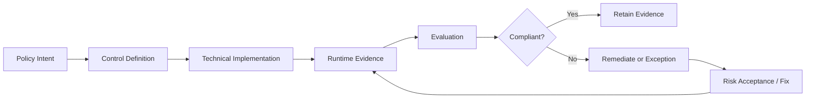

Contoh:

| Control intent | Technical implementation | Evidence source |
|---|---|---|
| Semua S3 bucket production terenkripsi | S3 default encryption + SCP/IaC guardrail | AWS Config, CloudTrail, S3 config |
| Hanya role tertentu bisa deploy ke prod | IAM role + CI/CD approval + SCP | CloudTrail, pipeline logs, IAM policy |
| Semua database production punya backup | RDS backup policy + AWS Backup plan | AWS Backup, AWS Config, CloudTrail |
| Tidak ada public database | Security group rules + Config rule | AWS Config, VPC flow logs, Security Hub |
| Semua akses break-glass direkam | IAM role + CloudTrail + ticket reference | CloudTrail, IAM Identity Center, ticket system |

Perhatikan pola: **policy intent tidak otomatis menjadi evidence**. Kita harus merancang jalur bukti.

### 2.1 Compliance vs Security

Security bertanya:

> Apakah sistem terlindungi?

Compliance bertanya:

> Bisakah kita membuktikan sistem terlindungi sesuai kontrol yang disepakati?

Sistem bisa relatif aman tetapi buruk compliance-nya jika tidak ada bukti. Sistem juga bisa terlihat compliant tetapi tetap rapuh jika kontrol hanya formalitas. Top-tier engineer menghindari dua-duanya.

### 2.2 Auditability vs Observability

Observability menjawab kondisi teknis runtime:

- request gagal di mana;
- latency naik kenapa;
- dependency mana yang timeout;
- error rate per service.

Auditability menjawab kondisi governance:

- siapa mengubah policy;
- siapa membuka security group;
- perubahan dilakukan melalui pipeline atau manual;
- apakah perubahan sesuai approved change;
- apakah pelanggaran policy diperbaiki.

Keduanya saling melengkapi, tapi tidak sama.

---

## 3. AWS Evidence Stack

AWS evidence stack bisa dilihat sebagai beberapa lapisan:

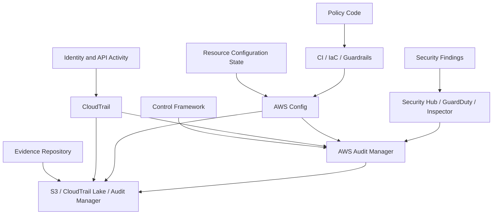

| Layer | AWS capability | Apa yang dibuktikan |
|---|---|---|
| Activity | CloudTrail | API/action history |
| State | AWS Config | Resource configuration over time |
| Compliance evaluation | AWS Config Rules | Whether resource state satisfies rules |
| Packaged governance | Conformance Packs | Standardized controls across accounts/Regions |
| Security posture | Security Hub | Aggregated findings and standards |
| Audit workflow | Audit Manager | Control mapping, evidence collection, assessment |
| Preventive governance | SCP/IAM/IaC policy | What cannot be changed or deployed |
| Retention | S3 Object Lock / CloudTrail Lake | Long-term evidence preservation |

A mature organization does not pick only one. It combines them into an assurance pipeline.

---

## 4. CloudTrail: The API Activity Ledger

CloudTrail records actions taken by users, roles, AWS services, console, CLI, SDKs, and APIs. For auditability, CloudTrail is the first answer to: **who did what?**

### 4.1 CloudTrail Event Categories

| Category | Meaning | Typical usage |
|---|---|---|
| Management events | Control plane actions like create bucket, attach policy, modify security group | Core audit trail |
| Data events | High-volume object/function-level access such as S3 object API or Lambda invoke | Sensitive data access audit |
| Insights events | Unusual API activity patterns | Detection of anomalous control-plane behavior |
| Network activity events | VPC endpoint API activity visibility where supported | Private path auditing |

Do not assume management events are enough. Regulated systems often need data event strategy for sensitive buckets, key workloads, or high-risk resources.

### 4.2 Organization Trail

For enterprise AWS, prefer organization-level CloudTrail where possible.

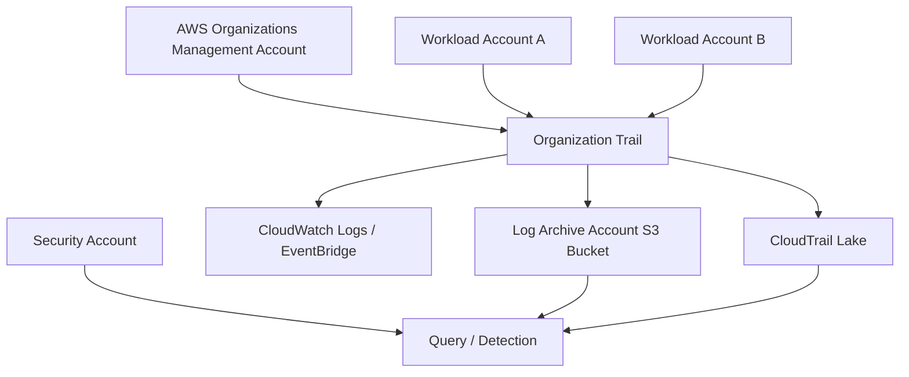

Design principle:

> Workload account owners should not be able to erase or weaken central audit evidence.

Common pattern:

1. Organization trail is configured centrally.
2. Logs are delivered to a dedicated log archive/security account.
3. S3 bucket has restrictive bucket policy.
4. Encryption is controlled centrally.
5. Log integrity validation is enabled where applicable.
6. Retention follows regulatory requirement.
7. Critical events are routed to detection pipelines.

### 4.3 Management Events vs Data Events

Management events show control-plane operations. Data events show data-plane operations.

Example:

| Action | CloudTrail event type |
|---|---|
| Create S3 bucket | Management event |
| Change S3 bucket policy | Management event |
| Get object from sensitive bucket | Data event |
| Put object into evidence bucket | Data event |
| Invoke sensitive Lambda | Data event |

Trade-off:

| Choice | Benefit | Risk/cost |
|---|---|---|
| Management events only | Lower volume/cost, broad control-plane audit | Weak data access evidence |
| Data events for all buckets | Stronger audit coverage | High volume, high cost, noisy evidence |
| Data events for classified buckets | Balanced | Requires data classification maturity |
| Data events on evidence buckets | Proves evidence access path | Must protect from excessive noise |

Do not enable high-volume data events blindly. Tie them to classification and control objectives.

### 4.4 CloudTrail Lake

CloudTrail Lake is useful when audit queries become frequent, cross-account, or historical.

Typical queries:

- Who changed this IAM policy in the last 90 days?
- Which principals called `PutBucketPolicy` on production buckets?
- Was this security group rule opened manually or by pipeline role?
- Which accounts had root user activity?
- Which role assumed break-glass access during an incident window?

CloudTrail Lake shifts evidence from raw files to queryable event stores.

### 4.5 CloudTrail Failure Modes

| Failure mode | Consequence | Mitigation |
|---|---|---|
| Trail only in one account | Missing org-wide activity | Organization trail |
| Trail only in one Region | Missing regional activity | Multi-Region trail |
| Logs stored in same workload account | Tampering risk | Central log archive account |
| No data event strategy | Sensitive object access invisible | Classify and enable selective data events |
| No retention policy | Evidence unavailable during audit | Retention by control requirement |
| No alerting on trail changes | Logging can be disabled silently | Config rule + EventBridge alert |
| Unrestricted log bucket access | Evidence confidentiality risk | Bucket policy, KMS, least privilege |
| No linkage to change tickets | Hard to prove authorization | Require deployment metadata/tags/ticket references |

### 4.6 CloudTrail Design Checklist

- [ ] Is there an organization trail?
- [ ] Is it multi-Region?
- [ ] Are logs delivered to a separate security/log archive account?
- [ ] Is the log bucket protected by bucket policy and encryption?
- [ ] Is there alerting on `StopLogging`, `DeleteTrail`, and trail modification?
- [ ] Are data events enabled for classified data stores?
- [ ] Is retention aligned with regulatory and legal requirements?
- [ ] Are audit queries tested before real audit season?
- [ ] Can you answer who changed a critical resource within minutes?

---

## 5. AWS Config: The Resource State Timeline

CloudTrail tells you what API calls happened. AWS Config tells you what resource configuration existed and how it changed over time.

Mental model:

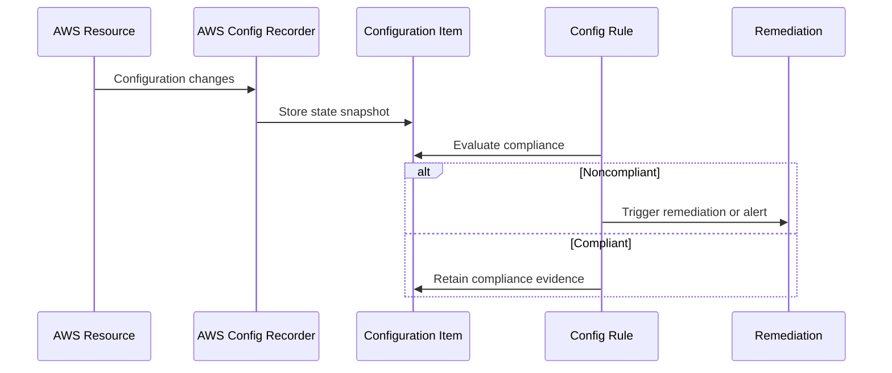

AWS Config is central to answering:

- What was the configuration of this resource at a point in time?
- When did the resource become noncompliant?
- Which resources violate this rule?
- What relationships did this resource have?
- Did remediation happen?

### 5.1 Configuration Recorder

The configuration recorder determines which resource types AWS Config records.

Design concern:

> If the resource type is not recorded, you cannot evaluate or reconstruct it later through Config.

Common mistakes:

- Config enabled only in some Regions.
- Global resources omitted unintentionally.
- Recorder scope too narrow.
- Delivery channel misconfigured.
- No aggregation across accounts.

### 5.2 Configuration Items

A configuration item is a point-in-time representation of resource state. For compliance, configuration items are stronger than screenshots because they are time-stamped, structured, queryable, and linked to resource identity.

Example audit question:

> Was encryption enabled on all production RDS instances between January and March?

Manual answer: spreadsheet and screenshots.

AWS Config answer: query configuration items and rule evaluations by resource, account, Region, and time.

### 5.3 AWS Config Rules

Rules evaluate whether resources comply with expected configuration.

| Rule type | Use case |
|---|---|
| AWS managed rule | Common controls like encryption, public access, required tags |
| Custom rule | Organization-specific policy logic |
| Periodic rule | Time-based evaluation |
| Change-triggered rule | Evaluate when resource changes |

Rule design principles:

1. Rule name should map to control intent.
2. Rule should identify resource scope clearly.
3. Rule result should be actionable.
4. Rule should not create unmanageable noise.
5. Rule should support exception logic where needed.
6. Rule evaluation should feed dashboard and audit evidence.

### 5.4 Conformance Packs

A conformance pack packages Config rules and remediation actions as a deployable compliance unit.

Use conformance packs when you need:

- standardized controls across accounts;
- baseline governance per environment;
- evidence by framework/control;
- organization-wide rollout;
- drift detection against a baseline.

Example pack categories:

| Pack | Typical controls |
|---|---|
| Security baseline | CloudTrail enabled, S3 public access blocked, root MFA, encryption |
| Data protection | KMS encryption, backup enabled, restricted public access |
| Network baseline | No unrestricted ingress, flow logs enabled, endpoint policies |
| Tagging baseline | Required cost/security/owner/environment tags |
| Regulated workload baseline | Logging, encryption, retention, access controls, backup |

### 5.5 Remediation

AWS Config can trigger remediation through Systems Manager Automation documents.

However, remediation is not always safe.

| Noncompliance | Auto-remediate? | Reasoning |
|---|---:|---|
| Missing required tag | Often yes | Low risk if standard tags known |
| S3 public access opened | Often yes for sensitive account | High security risk, quick correction valuable |
| Security group port 22 open to internet | Often yes or quarantine | Context-dependent, but high-risk |
| RDS backup retention too low | Maybe | Could affect cost/operations |
| Deleting unauthorized resource | Rarely automatic | High business risk |
| Changing IAM policy | Usually careful workflow | Could break production |

Remediation design must include:

- blast radius;
- rollback path;
- notification;
- exception handling;
- owner routing;
- evidence of remediation.

### 5.6 Config Failure Modes

| Failure mode | Consequence | Mitigation |
|---|---|---|
| Config not enabled in all accounts/Regions | Blind spots | Organization rollout + periodic audit |
| Rules too generic | Low signal | Map rule to explicit control |
| Rules too noisy | Alert fatigue | Severity, owner mapping, exception workflow |
| No remediation strategy | Noncompliance accumulates | Auto/manual remediation playbooks |
| No exception expiry | Permanent policy bypass | Time-bound exception registry |
| No aggregation | Central team cannot see risk | Config aggregator/delegated admin |
| No cost awareness | Config itself becomes expensive/noisy | Scope resource recording intentionally |

---

## 6. CloudTrail vs AWS Config

CloudTrail and Config are often confused. Treat them as complementary evidence systems.

| Question | CloudTrail | AWS Config |
|---|---:|---:|
| Who made API call? | Strong | Weak/indirect |
| What changed? | API-level change | Resource-state change |
| What was config at time T? | Harder | Strong |
| Is resource compliant? | Not primary | Strong |
| Can we reconstruct user activity? | Strong | Not primary |
| Can we evaluate baseline? | Indirect | Strong |
| Can we trigger detection/remediation? | Yes via events | Yes via rules |

Example:

> Security group allowed `0.0.0.0/0` to port 5432.

CloudTrail answers:

- which principal called `AuthorizeSecurityGroupIngress`;
- from which source IP;
- using which assumed role;
- at what time.

AWS Config answers:

- when the security group became noncompliant;
- whether it is still noncompliant;
- what rule detected it;
- what related resources are affected.

A defensible audit answer uses both.

---

## 7. AWS Audit Manager: Control-to-Evidence Workflow

AWS Audit Manager helps organize control frameworks, assessments, and evidence collection.

Mental model:

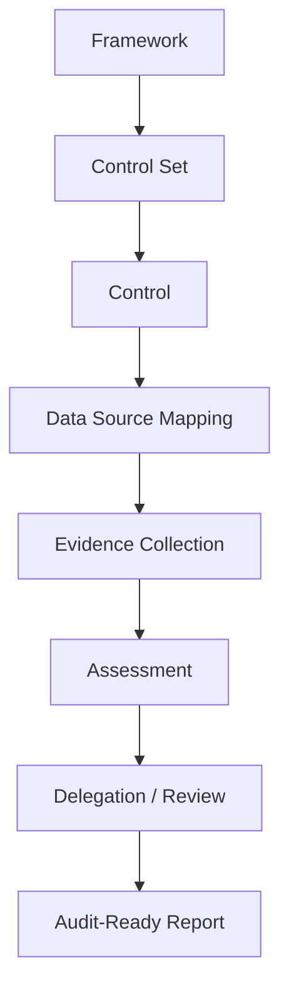

Audit Manager should not be treated as magic compliance. It automates parts of evidence collection, but you still need:

- correct scope;
- correct AWS account mapping;
- correct control interpretation;
- manual evidence for non-AWS processes;
- owner review;
- exception documentation;
- auditor-ready narrative.

### 7.1 Frameworks, Controls, and Assessments

| Concept | Meaning |
|---|---|
| Framework | A collection of controls, often aligned to a standard |
| Control | A requirement or safeguard to be evaluated |
| Assessment | Evaluation of scoped AWS usage against a framework |
| Evidence | Data collected to support control operation |
| Delegation | Assigning evidence/control review to owners |

For engineering teams, the important discipline is mapping controls to technical evidence.

Example:

| Control | Evidence |
|---|---|
| Audit logging is enabled | CloudTrail configuration, Config rule result, log delivery evidence |
| Access is reviewed | IAM Access Analyzer finding review, IAM Identity Center assignment export, ticket approval |
| Encryption at rest | Config rule result, KMS key policy, resource encryption setting |
| Backup retention | AWS Backup plan, RDS retention setting, restore test record |
| Change management | CI/CD approval logs, CloudTrail deployment role events, change ticket |

### 7.2 Automatic vs Manual Evidence

Not all controls are automatically provable from AWS.

| Evidence type | Example | Risk |
|---|---|---|
| Automated AWS evidence | Config rule output, CloudTrail event | Strong but must be scoped correctly |
| Semi-automated evidence | Athena query output, generated report | Requires query validation |
| Manual evidence | Policy document, meeting approval, training record | Higher process risk |
| External evidence | Jira, ServiceNow, GitHub, HR system | Requires integration/chain of custody |

A mature program reduces manual evidence but does not pretend all evidence can be automated.

### 7.3 Evidence Finder and Queryability

Evidence that cannot be searched quickly becomes operational debt.

A useful evidence search model includes:

- by account;
- by Region;
- by workload;
- by control;
- by resource;
- by owner;
- by compliance status;
- by time window;
- by exception ID.

Do not wait for audit season to test evidence retrieval. Test it like restore drills.

---

## 8. Policy-as-Code

Policy-as-code means control intent is expressed in versioned, testable, reviewable rules.

It can operate at several stages:

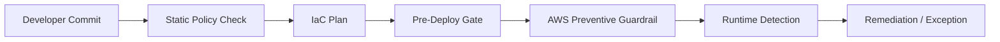

| Stage | Example control |
|---|---|
| Pre-commit | No plaintext secret in repo |
| CI static check | S3 bucket must not be public |
| IaC plan check | RDS must have backup retention >= required threshold |
| Deployment gate | Production changes require approval |
| AWS preventive | SCP denies disabling CloudTrail |
| Runtime detective | AWS Config detects drift |
| Remediation | SSM Automation corrects tag or blocks public access |

### 8.1 Policy Code vs Human Policy

Human policy:

> Production databases must be encrypted.

Policy-as-code:

```pseudo
DENY resource.aws_db_instance WHERE
  environment == "prod" AND
  storage_encrypted != true
```

But good policy-as-code also needs:

- naming standard;
- account/environment context;
- exception model;
- severity;
- remediation hint;
- test cases;
- ownership;
- audit mapping.

### 8.2 Preventive vs Detective Guardrails

| Guardrail type | Example | Strength | Weakness |
|---|---|---|---|
| Preventive | SCP denies disabling CloudTrail | Stops bad action | Can block urgent work if too broad |
| Detective | Config rule flags noncompliance | Flexible | Bad state can exist for some time |
| Corrective | Automation fixes noncompliance | Fast response | Can break workloads if unsafe |
| Advisory | CI warning | Low friction | Easy to ignore |

Use preventive guardrails for actions that should almost never happen. Use detective/corrective controls where context matters.

### 8.3 Policy Repository Structure

Example governance repo:

```text
aws-governance/
  controls/
    CT-LOG-001-cloudtrail-enabled.yaml
    DP-ENC-001-s3-encryption.yaml
    IAM-PRIV-001-no-wildcard-admin.yaml
  rules/
    config/
    cfn-guard/
    opa/
    terraform-policy/
  exceptions/
    approved/
    expired/
  mappings/
    iso27001.yaml
    soc2.yaml
    internal-regulatory.yaml
  tests/
    compliant/
    noncompliant/
  docs/
    control-catalog.md
    evidence-map.md
```

Control files should include:

```yaml
id: DP-ENC-001
title: Production storage must use approved encryption
intent: Protect regulated data at rest
severity: high
scope:
  environments: [prod]
  resourceTypes: [s3, rds, dynamodb, ebs]
evidenceSources:
  - aws-config
  - cloudtrail
  - kms
exception:
  allowed: true
  maxDurationDays: 30
  approvalRole: security-risk-owner
remediation:
  mode: manual-or-automated-by-resource-type
```

This turns compliance from scattered tribal knowledge into an engineering artifact.

---

## 9. Exception Governance

Exception handling is where many compliance systems become fiction.

A real system has exceptions because production has constraints. But an exception must not become an invisible permanent bypass.

### 9.1 Exception Record

Minimum fields:

| Field | Why it matters |
|---|---|
| Exception ID | Traceability |
| Control ID | What is being bypassed |
| Resource/account/Region | Scope |
| Owner | Accountability |
| Reason | Risk narrative |
| Compensating control | How risk is reduced |
| Approval | Who accepted risk |
| Expiry date | Prevents permanent bypass |
| Review cadence | Ensures reassessment |
| Evidence link | Audit trace |

### 9.2 Exception State Machine

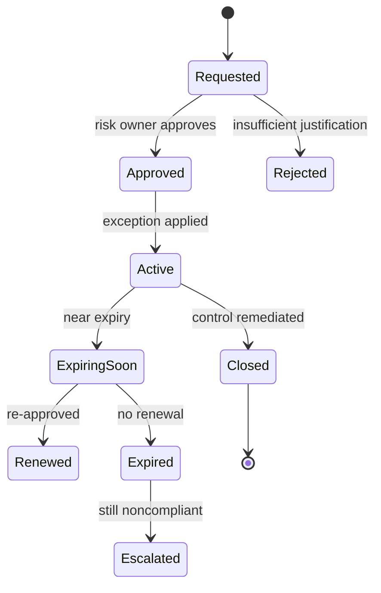

A good exception workflow is strict enough for audit but practical enough for engineering.

### 9.3 Exception Anti-Patterns

| Anti-pattern | Why dangerous |
|---|---|
| “Temporary” exception without expiry | Becomes permanent bypass |
| Exception approved by resource owner only | Conflict of interest |
| Exception not linked to control ID | Hard to audit |
| Exception not machine-readable | Cannot integrate with policy-as-code |
| Exception suppresses all alerts | Hides unrelated risks |
| No compensating control | Risk is accepted blindly |

---

## 10. Control Mapping for Regulated Workloads

A control catalog bridges regulation and AWS implementation.

Example:

| Control ID | Intent | AWS implementation | Evidence |
|---|---|---|---|
| LOG-001 | Record administrative activity | Org CloudTrail multi-Region trail | CloudTrail trail config, S3 log objects |
| LOG-002 | Protect audit logs | Log archive account, KMS, bucket policy, Object Lock where required | S3 policy, KMS policy, CloudTrail delivery |
| CFG-001 | Monitor resource configuration | AWS Config recorder all required accounts/Regions | Config recorder status |
| CFG-002 | Detect public exposure | Config managed/custom rules | Rule evaluations |
| IAM-001 | Enforce least privilege | IAM roles, permission boundaries, SCP | IAM policy, Access Analyzer review |
| BCK-001 | Ensure recoverability | AWS Backup plan, RDS backup retention | Backup job reports, restore drill |
| CHG-001 | Govern production change | CI/CD approval, deployment role | Pipeline logs, CloudTrail AssumeRole |

### 10.1 Evidence Quality Criteria

Good evidence is:

1. **Relevant**: proves the control, not adjacent activity.
2. **Complete**: covers required accounts, Regions, resources, and time period.
3. **Reliable**: generated by system of record, not manually edited.
4. **Time-bound**: shows when control operated.
5. **Tamper-resistant**: protected against unauthorized modification/deletion.
6. **Queryable**: can be found and filtered.
7. **Explainable**: auditor can understand mapping from requirement to evidence.

Bad evidence is a screenshot with no timestamp, no scope, no query, and no link to control.

---

## 11. Regulatory Defensibility

Regulatory defensibility means you can explain your system in terms of controls, risk, evidence, and operational behavior.

It is not enough to say:

> We use AWS, therefore we are compliant.

The stronger answer is:

> AWS provides compliant infrastructure and service capabilities. We are responsible for configuring workloads, access, logging, encryption, retention, monitoring, response, and evidence collection according to our regulatory obligations. This control catalog maps each obligation to AWS technical controls and evidence sources. Exceptions are time-bound and approved by risk owners.

### 11.1 Responsibility Boundary

For each control, document:

| Question | Example |
|---|---|
| What does AWS operate? | Physical datacenter, managed service infrastructure |
| What do we configure? | IAM, encryption, logging, network access, backup |
| What evidence comes from AWS? | CloudTrail, Config, Audit Manager, service configuration |
| What evidence comes from us? | Change approval, risk acceptance, runbook, incident report |
| What evidence comes from vendors? | SaaS logs, identity provider audit logs, ticketing system |

### 11.2 Evidence Chain

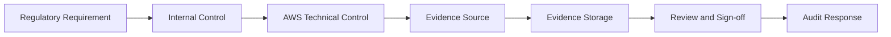

If any link is missing, the audit story becomes weak.

---

## 12. Designing a Continuous Assurance Platform

A serious AWS environment should not collect compliance evidence once per year. It should run continuous assurance.

### 12.1 Reference Architecture

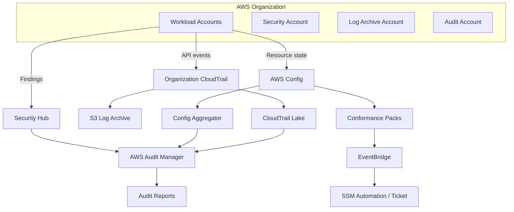

### 12.2 Control Loop

1. Define control catalog.
2. Map controls to AWS services and evidence.
3. Implement preventive controls where safe.
4. Implement detective controls for configuration and activity.
5. Route noncompliance to owner.
6. Remediate or create exception.
7. Retain evidence.
8. Review metrics monthly.
9. Test evidence retrieval quarterly.
10. Re-map controls when architecture changes.

### 12.3 Compliance Metrics

Useful compliance metrics:

| Metric | Meaning |
|---|---|
| Control coverage | Percentage of controls mapped to evidence |
| Account coverage | Percentage of accounts with required logging/config |
| Region coverage | Percentage of used Regions covered |
| Noncompliance age | How long violations remain open |
| Exception count | Active exceptions by severity |
| Exception age | How long risk acceptance persists |
| Auto-remediation success rate | Whether corrective controls work |
| Evidence retrieval time | How fast audit package can be produced |
| Manual evidence ratio | Amount of evidence still manually collected |

If a control is “green” but evidence retrieval takes days, compliance maturity is low.

---

## 13. Policy-as-Code in CI/CD and IaC

### 13.1 Pre-Deployment Guardrail Example

A production RDS instance should not deploy if backup retention is below policy.

```pseudo
rule prod_rds_backup_retention {
  when resource.type == "aws_db_instance" and resource.tags.Environment == "prod" {
    assert resource.backup_retention_period >= 7
  }
}
```

### 13.2 Runtime Guardrail Example

If a manual console change reduces retention:

1. AWS Config records resource state change.
2. Config rule evaluates noncompliance.
3. EventBridge routes event to remediation workflow.
4. Workflow checks exception registry.
5. If no exception, creates ticket or remediates.
6. Evidence is stored.

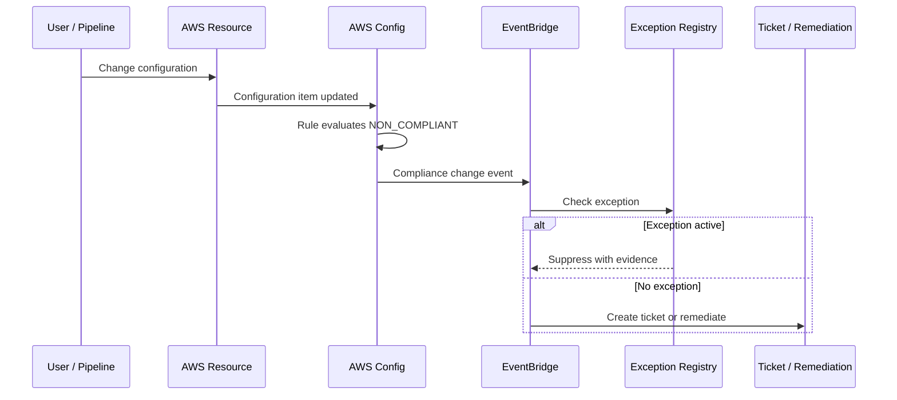

### 13.3 Why Both CI and Runtime Checks Are Needed

CI checks only catch code-driven changes. Runtime checks catch:

- console changes;
- emergency operations;
- third-party automation;
- service-created resources;
- drift;
- changes from old pipelines;
- imported resources.

Runtime checks without CI checks allow bad changes into production and then detect them late. Use both.

---

## 14. Workload Evidence Map Template

For each production workload, maintain an evidence map.

```yaml
workload: regulated-case-management
owner: platform-enforcement-team
environment: production
accounts:
  - prod-app
  - prod-data
  - prod-security
regions:
  - ap-southeast-1
  - ap-southeast-3
controls:
  - id: LOG-001
    title: Administrative activity logging
    implementation:
      - organization-cloudtrail
      - cloudtrail-lake
      - log-archive-s3
    evidence:
      - cloudtrail-trail-config
      - sample-event-query
      - s3-log-delivery-proof
    reviewCadence: monthly
  - id: CFG-001
    title: Resource configuration monitoring
    implementation:
      - aws-config-recorder
      - conformance-pack-regulated-baseline
    evidence:
      - recorder-status
      - rule-evaluation-report
    reviewCadence: weekly
```

This template prevents audit work from becoming a last-minute archaeology project.

---

## 15. Common Production Scenarios

### 15.1 Auditor asks: “Show all privileged access to production.”

Good response path:

1. Identify privileged roles.
2. Query CloudTrail `AssumeRole` events.
3. Join with identity provider/ticket references if available.
4. Filter by production accounts.
5. Provide evidence with time window, principal, role, source, and approval link.

Weak response:

- Export IAM users manually.
- Screenshot role list.
- Ask team leads whether anyone accessed production.

### 15.2 Security review asks: “Can someone disable logging?”

Good response path:

1. SCP denies disabling CloudTrail except break-glass/security admin path.
2. Config rule detects CloudTrail disabled.
3. EventBridge alert fires on trail modification events.
4. Log archive bucket cannot be modified by workload accounts.
5. Evidence shows tests of detection.

### 15.3 Incident review asks: “When did the bucket become public?”

Good response path:

1. Config timeline shows when public policy/block setting changed.
2. CloudTrail shows who made the change.
3. Security Hub/Config finding shows detection time.
4. Ticket/remediation record shows closure time.
5. Exception registry shows whether it was approved.

---

## 16. Decision Matrix

### 16.1 Which Service for Which Evidence?

| Need | Primary service | Supporting service |
|---|---|---|
| API activity audit | CloudTrail | CloudTrail Lake, EventBridge |
| Resource state over time | AWS Config | Config aggregator |
| Baseline compliance | Config Rules | Conformance Packs |
| Automated remediation | AWS Config | Systems Manager Automation |
| Audit framework mapping | Audit Manager | Security Hub, Config, CloudTrail |
| Security posture | Security Hub | GuardDuty, Inspector, Config |
| Long-term log retention | S3 | Object Lock, KMS |
| Queryable audit events | CloudTrail Lake | Athena/S3 depending design |
| Preventive org-level guardrail | SCP | IAM permission boundary |
| Pre-deploy validation | IaC policy-as-code | CI/CD gates |

### 16.2 Prevent, Detect, or Correct?

| Control | Preferred mode | Reasoning |
|---|---|---|
| Disable CloudTrail | Prevent + detect | Almost never legitimate |
| Public S3 bucket in data account | Prevent + detect + correct | High-risk exposure |
| Missing cost tag | Detect + correct | Low-risk automation |
| Nonstandard instance type | Detect/advisory | May have workload-specific reason |
| Root user activity | Detect + alert | Must be investigated |
| KMS key deletion schedule | Prevent/detect | Could destroy data access |
| Security group open to internet | Detect/correct depending port/account | Context-dependent |
| Backup disabled | Detect + owner workflow | Remediation may affect workload behavior |

---

## 17. Failure Modeling

### 17.1 Evidence Blind Spot

**Symptom:** Auditor asks for historical state; team cannot reconstruct it.

Likely causes:

- Config not enabled;
- CloudTrail retention too short;
- data events not enabled;
- logs stored in workload account;
- resource type not recorded;
- no account/Region inventory.

Mitigation:

- baseline evidence services in landing zone;
- periodic evidence retrieval drills;
- resource inventory reconciliation;
- conformance pack for logging/config coverage.

### 17.2 False Compliance

**Symptom:** Dashboard green, but auditor rejects evidence.

Likely causes:

- control poorly mapped;
- rule checks only existence, not effectiveness;
- evidence not time-bound;
- scope excludes some accounts;
- manual exception not documented.

Mitigation:

- control-to-evidence review;
- sample audit walkthrough;
- control owner sign-off;
- automated scope inventory.

### 17.3 Policy Noise

**Symptom:** Thousands of findings ignored.

Likely causes:

- rules too broad;
- missing owner tags;
- no severity model;
- no exception process;
- no remediation path.

Mitigation:

- classify severity;
- route to owners;
- suppress only with expiry;
- automate low-risk fixes;
- review noisy rules quarterly.

### 17.4 Remediation Breaks Production

**Symptom:** Auto-remediation changes resource and causes outage.

Likely causes:

- remediation not risk-classified;
- no safe rollback;
- no staging test;
- no workload owner notification;
- one-size-fits-all remediation.

Mitigation:

- separate advisory/detect/correct policies;
- implement dry-run;
- run remediation in nonprod first;
- use approval for high-risk changes;
- maintain remediation runbooks.

---

## 18. Internal Engineering Handbook Rules

### Rule 1: Evidence must be designed with the system

Do not deploy regulated workloads and add audit later. Logging, Config, retention, control mapping, and evidence ownership are part of architecture.

### Rule 2: Every production exception expires

If exception cannot expire, it is not an exception; it is a policy change. Treat it as such.

### Rule 3: A control without evidence is an aspiration

Write controls so they map to evidence sources. If you cannot identify evidence, the control is not operationalized.

### Rule 4: A dashboard is not an audit package

Dashboards help operators. Audit packages need scope, time window, evidence source, explanation, and sign-off.

### Rule 5: Compliance should be continuous

Annual audit preparation should mostly package existing evidence, not discover whether controls exist.

### Rule 6: Manual evidence is expensive risk

Manual evidence may be necessary, but it should be minimized, versioned, linked, and reviewed.

---

## 19. Implementation Blueprint

### Phase 1: Baseline Logging and State

- Enable organization CloudTrail.
- Centralize logs in log archive account.
- Enable AWS Config in required accounts/Regions.
- Create account/Region coverage dashboard.
- Protect evidence buckets.

### Phase 2: Control Catalog

- Define control IDs.
- Map each control to AWS implementation.
- Map each control to evidence source.
- Define owner and review cadence.
- Define exception rules.

### Phase 3: Config Rules and Conformance Packs

- Start with high-risk controls:
  - CloudTrail enabled;
  - S3 public access blocked;
  - encryption enabled;
  - required tags;
  - no unrestricted ingress;
  - backup enabled.
- Deploy conformance packs to pilot OU.
- Tune noise.
- Expand to production OUs.

### Phase 4: Policy-as-Code Gates

- Add IaC static checks.
- Add CI policy checks.
- Add deployment approval gates for production.
- Require metadata: owner, environment, data classification, change ID.

### Phase 5: Evidence Automation

- Configure Audit Manager assessments.
- Build recurring evidence exports.
- Create evidence retrieval runbooks.
- Test audit response scenarios.

### Phase 6: Continuous Assurance

- Review compliance metrics monthly.
- Review exception inventory.
- Run evidence retrieval game days.
- Add new controls when architecture changes.

---

## 20. Deliberate Practice

### Practice 1: Reconstruct a Manual Change

Simulate a manual security group change in a sandbox account.

Deliverables:

- CloudTrail event query showing who changed it.
- AWS Config timeline showing when it became noncompliant.
- Config rule result.
- Remediation/ticket record.
- Short audit narrative.

### Practice 2: Build a Mini Conformance Pack

Create a small pack with controls:

- CloudTrail enabled.
- S3 bucket public read prohibited.
- Required tags exist.
- EBS volumes encrypted.

Deliverables:

- rule definitions;
- deployment method;
- evaluation output;
- remediation decision table.

### Practice 3: Design an Exception Workflow

For a public S3 bucket used by a demo app, define:

- exception record;
- risk owner;
- expiry;
- compensating control;
- detection behavior;
- closure criteria.

### Practice 4: Audit Package Drill

Pick one control and produce a package:

- control description;
- scope;
- AWS implementation;
- evidence source;
- sample evidence;
- review sign-off;
- known exceptions.

Timebox: 90 minutes.

Goal: discover whether your evidence system is real.

---

## 21. Anti-Patterns

| Anti-pattern | Better approach |
|---|---|
| Enabling CloudTrail only after audit request | Organization trail as landing zone baseline |
| Treating Config findings as “security team problem” | Owner routing by account/workload/team |
| Screenshot-driven audit evidence | Queryable, retained, structured evidence |
| Permanent exception spreadsheet | Machine-readable exception registry with expiry |
| Ignoring disabled Regions | Explicit Region policy and coverage checks |
| No linkage between control and evidence | Control catalog with evidence mapping |
| Auto-remediating everything | Risk-based remediation modes |
| Only checking IaC | Runtime drift detection with Config |
| Only checking runtime | Pre-deployment policy gates |
| Compliance owned only by GRC | Shared ownership between platform, security, workload, and risk owners |

---

## 22. Self-Correction Checklist

Ask these questions before claiming a workload is audit-ready:

- [ ] Can we list all in-scope AWS accounts and Regions?
- [ ] Is CloudTrail enabled centrally and protected from workload owners?
- [ ] Is AWS Config enabled for required resource types?
- [ ] Can we show resource state at a point in time?
- [ ] Can we connect CloudTrail activity to change approval?
- [ ] Do Config rules map to named controls?
- [ ] Are conformance packs deployed consistently?
- [ ] Is there an exception workflow with expiry?
- [ ] Are remediation actions tested and safe?
- [ ] Can we produce evidence without manual archaeology?
- [ ] Is evidence retained for the required period?
- [ ] Can an auditor understand the control-to-evidence chain?

---

## 23. Engineering Judgment Summary

Compliance on AWS is not a pile of screenshots. It is an engineered feedback loop.

The strongest mental model:

> CloudTrail proves activity. AWS Config proves state. Config Rules prove compliance evaluation. Conformance Packs package baseline controls. Audit Manager organizes control evidence. Policy-as-code shifts controls earlier. Exception governance keeps reality honest. Retention and queryability make evidence usable when pressure arrives.

A top-tier AWS engineer designs workloads so that audit evidence is a natural by-product of operating the system correctly.

If a system cannot explain who changed what, what state existed, why it was allowed, how noncompliance was handled, and where evidence lives, then it is not truly production-ready for regulated environments.

---

## 24. References

- AWS CloudTrail User Guide — What is AWS CloudTrail: https://docs.aws.amazon.com/awscloudtrail/latest/userguide/cloudtrail-user-guide.html
- AWS CloudTrail security best practices: https://docs.aws.amazon.com/awscloudtrail/latest/userguide/best-practices-security.html
- AWS Config Developer Guide — What is AWS Config: https://docs.aws.amazon.com/config/latest/developerguide/WhatIsConfig.html
- AWS Config conformance packs: https://docs.aws.amazon.com/config/latest/developerguide/conformance-packs.html
- AWS Config remediation: https://docs.aws.amazon.com/config/latest/developerguide/remediation.html
- AWS Audit Manager User Guide — What is AWS Audit Manager: https://docs.aws.amazon.com/audit-manager/latest/userguide/what-is.html
- AWS Security Hub service integrations with Audit Manager: https://docs.aws.amazon.com/securityhub/latest/userguide/securityhub-internal-providers.html
