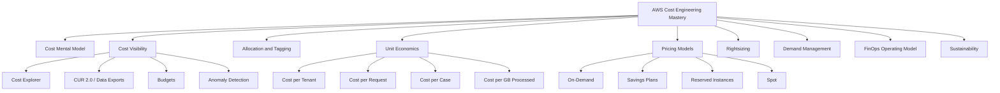
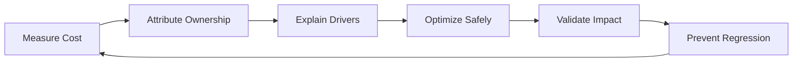
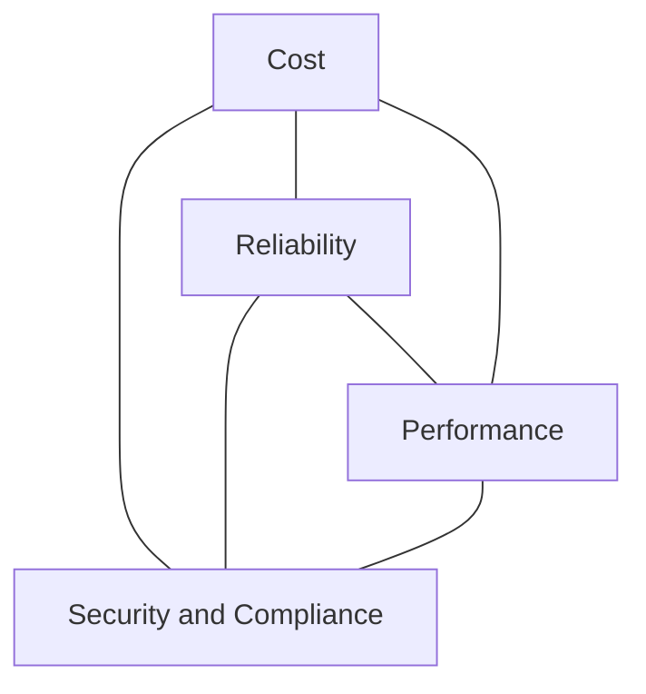
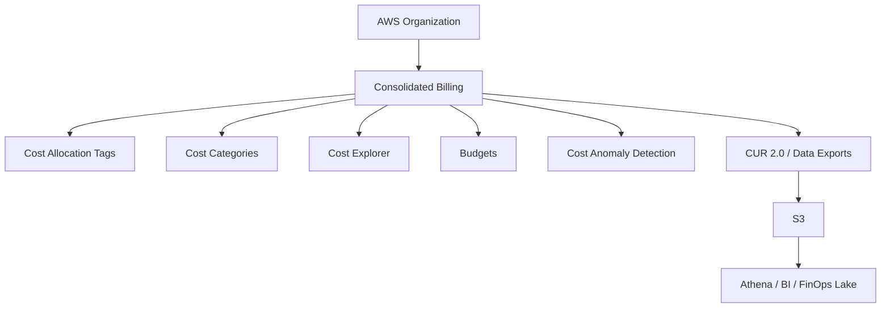
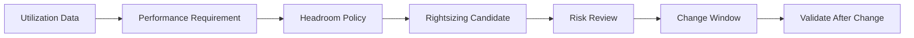

------
title: Learn AWS Engineering Mastery - Part 028
description: AWS cost engineering, FinOps operating model, unit economics, tagging, Cost Explorer, CUR 2.0, Budgets, Cost Anomaly Detection, Savings Plans, rightsizing, and sustainability.
series: learn-aws
seriesTitle: Learn AWS Engineering Mastery
order: 28
partTitle: Cost Engineering: FinOps, Unit Economics, and Sustainability
tags:
- aws
- cost-engineering
- finops
- cost-optimization
- sustainability
- budgets
- cost-explorer
- cur
- savings-plans
- compute-optimizer
- series
date: 2026-07-01
---

# Cost Engineering: FinOps, Unit Economics, and Sustainability

> Target pembelajaran: setelah bagian ini, kita mampu memperlakukan biaya AWS sebagai sinyal arsitektur, bukan sekadar urusan billing. Kita akan mampu mendesain tagging, cost allocation, unit economics, guardrails, pricing model, rightsizing, dan sustainability trade-off untuk workload production-grade.

Part sebelumnya membahas compliance dan evidence. Part ini membahas dimensi yang sering memisahkan engineer biasa dari engineer senior/top-tier:

> Apakah kita bisa menjelaskan mengapa arsitektur ini menghabiskan biaya tertentu, cost driver mana yang paling besar, bagaimana biaya berubah ketika traffic naik, dan apa trade-off antara reliability, performance, security, sustainability, dan cost?

Cost engineering bukan “memurah-murahkan sistem”. Cost engineering adalah kemampuan menjalankan sistem yang memberikan business value dengan penggunaan resource yang efektif, transparan, dan terkontrol.

---

## 1. Kaufman Skill Map



Kaufman-style skill deconstruction:

| Sub-skill | Pertanyaan inti | Output yang harus bisa dibuat |
|---|---|---|
| Cost visibility | Di mana uang keluar? | Cost dashboard by account/service/workload |
| Cost allocation | Siapa pemilik biaya? | Tagging taxonomy + Cost Categories |
| Unit economics | Biaya per unit bisnis berapa? | Cost per tenant/request/case/job |
| Pricing model | Komitmen apa yang rasional? | Savings Plans/RI/Spot decision |
| Rightsizing | Resource mana over/under-provisioned? | Rightsizing backlog with risk |
| Demand shaping | Bisakah demand diratakan/dikurangi? | Scaling, schedule, cache, lifecycle policies |
| Governance | Bagaimana mencegah runaway spend? | Budgets, anomaly detection, guardrails |
| Sustainability | Resource mana tidak perlu? | Utilization and waste reduction plan |

Skill targetnya bukan hanya “bisa buka Cost Explorer”. Skill targetnya adalah mampu menutup loop:



---

## 2. Mental Model: Cost Is an Architecture Signal

AWS cost berasal dari keputusan arsitektur.

| Architecture decision | Cost consequence |
|---|---|
| Multi-AZ database | Higher availability, higher cost |
| NAT Gateway for all private egress | Simpler private routing, data processing cost |
| High-cardinality logs | Better debugging, high ingestion/storage cost |
| Always-on EKS cluster | Platform flexibility, baseline cost |
| Lambda high memory | Faster execution, different GB-second cost profile |
| S3 lifecycle policy absent | Old data accumulates in expensive class |
| Cross-AZ chatty services | Higher data transfer cost and latency |
| Overprovisioned RDS | Lower performance risk, wasted capacity |
| Underprovisioned cache | Lower cache cost, higher database load |

Cost is not a bill at the end of the month. Cost is telemetry about system design.

### 2.1 The Cost Triangle



Examples:

- Increasing redundancy improves reliability but increases cost.
- Encrypting and retaining logs supports security/compliance but increases storage/processing cost.
- Caching improves latency and reduces database load but adds infrastructure and invalidation complexity.
- Aggressive rightsizing reduces cost but can reduce headroom.
- Removing unused resources improves cost and sustainability.

Top-tier judgment means not optimizing cost in isolation.

### 2.2 Cost Engineering vs Cost Cutting

| Cost cutting | Cost engineering |
|---|---|
| “Reduce the AWS bill by 30%.” | “Reduce waste while preserving SLO and risk posture.” |
| Deletes resources reactively | Uses ownership, telemetry, and change control |
| Ignores unit economics | Optimizes cost per business outcome |
| Creates reliability regressions | Evaluates risk and rollback |
| One-time effort | Continuous operating model |

Cost engineering is a product and platform discipline.

---

## 3. Cost Visibility Foundation

You cannot optimize what you cannot attribute.

Minimum cost visibility stack:



### 3.1 Account-Based Allocation

The first allocation boundary is the AWS account.

Good multi-account cost design:

| Account type | Cost ownership |
|---|---|
| Shared network | Platform/network team, allocated by consuming workload if possible |
| Log archive | Security/platform baseline cost |
| Security tooling | Security/platform baseline cost |
| Dev workload | Product/team owner |
| Prod workload | Product/team owner |
| Sandbox | Individual/team owner with strict budget |
| Data platform | Data platform owner, sometimes allocated by dataset/consumer |

Accounts are clean billing containers, but shared services still need allocation model.

### 3.2 Tagging Taxonomy

Tags are the bridge between resource and business context.

Recommended core tags:

| Tag | Purpose |
|---|---|
| `Environment` | prod, staging, dev, sandbox |
| `Application` | workload/application name |
| `Service` | component/service name |
| `Owner` | accountable team or group |
| `CostCenter` | financial allocation |
| `DataClassification` | public/internal/confidential/restricted |
| `Criticality` | tier-0/tier-1/tier-2/etc. |
| `ManagedBy` | terraform/cdk/cloudformation/manual |
| `Lifecycle` | permanent/ephemeral/experimental |
| `TenantId` | only if safe and cardinality is controlled |

Tagging rules:

1. Tags must be standardized.
2. Tags must be enforced at creation time where possible.
3. Tags must be activated for cost allocation when needed.
4. Tags must not contain secrets or sensitive personal data.
5. High-cardinality tags need careful review.
6. Shared cost needs explicit allocation policy.

### 3.3 Cost Categories

Cost Categories let finance/platform map costs into business dimensions without requiring every resource to have perfect tags.

Examples:

- map accounts to business units;
- map services to platform domains;
- group shared infrastructure;
- split production vs non-production;
- isolate experimental spend;
- build showback/chargeback views.

Tags are resource-side metadata. Cost Categories are billing-side grouping rules. Use both.

---

## 4. Cost Explorer, Budgets, Anomaly Detection, CUR

### 4.1 Cost Explorer

Use Cost Explorer for interactive exploration:

- service-level spend;
- account-level trends;
- daily/monthly breakdown;
- amortized vs unblended cost;
- usage type;
- linked account;
- tag/category grouping;
- RI/Savings Plans coverage/utilization views.

Cost Explorer is good for asking: “What changed?”

But it is not always enough for detailed engineering analysis. For high-resolution analysis, use CUR/Data Exports.

### 4.2 AWS Budgets

Budgets are guardrails and feedback mechanisms.

Budget types:

| Budget type | Use case |
|---|---|
| Cost budget | Monthly cost threshold |
| Usage budget | Specific service usage threshold |
| RI utilization/coverage | Commitment tracking |
| Savings Plans utilization/coverage | Commitment tracking |

Budget design:

- budget per environment;
- budget per product/team;
- budget for sandbox;
- budget for experimental accounts;
- alerts at multiple thresholds;
- action playbooks, not only email noise.

Example budget policy:

| Threshold | Action |
|---|---|
| 50% forecast exceeded | Notify owner |
| 80% actual exceeded | Notify owner + platform |
| 100% forecast exceeded | Review top cost drivers |
| 120% actual exceeded | Escalate and require mitigation plan |

### 4.3 Cost Anomaly Detection

Cost anomaly detection catches unusual spend patterns that normal budget thresholds miss.

Common anomaly scenarios:

- runaway logs;
- misconfigured autoscaling;
- data transfer spike;
- accidental large instance family;
- unbounded Kinesis shard scaling;
- NAT Gateway egress surge;
- forgotten load test;
- snapshots accumulating;
- unexpected Region usage;
- public API abuse.

Design principle:

> An anomaly alert without an owner and runbook is just billing noise.

### 4.4 CUR 2.0 and Data Exports

CUR is the detailed cost dataset for serious analysis. CUR 2.0/Data Exports provide detailed cost and usage data that can be delivered to S3 and queried.

Use cases:

- unit cost calculation;
- cost per tenant/request/job;
- shared cost allocation;
- anomaly forensic analysis;
- pricing model simulation;
- historical trend modeling;
- internal chargeback;
- sustainability/waste analysis.

Example Athena-style questions:

```sql
-- Pseudo-query: monthly service cost by application
SELECT
  month,
  resource_tags_application,
  product_product_name,
  SUM(line_item_unblended_cost) AS cost
FROM cur
WHERE month = '2026-06'
GROUP BY 1, 2, 3
ORDER BY cost DESC;
```

CUR is where cost engineering becomes data engineering.

---

## 5. Unit Economics

A bill says how much you spent. Unit economics says whether the spend makes sense.

### 5.1 Choosing the Unit

Pick units that match product value.

| System | Useful unit cost |
|---|---|
| API platform | cost per million requests |
| SaaS platform | cost per tenant per month |
| Case management | cost per case lifecycle |
| Document processing | cost per document processed |
| Streaming ingestion | cost per GB ingested |
| Search platform | cost per indexed document/query |
| AI inference | cost per successful inference/task |
| Data lake | cost per TB stored and scanned |

For a regulatory case management platform, useful unit metrics might be:

- cost per active case;
- cost per investigation workflow;
- cost per evidence document;
- cost per enforcement decision;
- cost per tenant/agency;
- cost per audit query;
- cost per notification/event.

### 5.2 Unit Cost Formula

```text
unit_cost = allocated_total_cost / business_units_processed
```

But allocated total cost must be carefully defined:

```text
allocated_total_cost = direct_service_cost
                     + allocated_shared_platform_cost
                     + allocated_observability_cost
                     + allocated_security_cost
                     + allocated_data_transfer_cost
                     + allocated_support/backup cost
```

### 5.3 Example: Cost per Case

Suppose a case management platform has:

| Cost component | Monthly cost |
|---|---:|
| App compute | 4,000 |
| Database | 7,000 |
| Search | 2,000 |
| S3 evidence storage | 1,500 |
| Eventing/workflow | 1,200 |
| Observability/logs | 2,300 |
| Shared platform allocation | 3,000 |
| Security/audit tooling allocation | 1,000 |
| Total | 22,000 |

If 55,000 active case lifecycle steps were processed:

```text
cost_per_case_step = 22,000 / 55,000 = 0.40
```

This number becomes powerful when tracked over time:

| Month | Cost | Case steps | Cost per case step | Interpretation |
|---|---:|---:|---:|---|
| Jan | 20,000 | 50,000 | 0.40 | baseline |
| Feb | 24,000 | 75,000 | 0.32 | scale efficiency improved |
| Mar | 30,000 | 60,000 | 0.50 | regression or fixed-cost spike |

A rising bill is not automatically bad. A rising unit cost may be bad.

### 5.4 Unit Cost Failure Modes

| Failure mode | Consequence | Mitigation |
|---|---|---|
| Wrong denominator | Misleading efficiency metric | Align with business value |
| Shared cost ignored | Unit cost underreported | Allocation model |
| Observability excluded | Debug cost hidden | Include telemetry cost |
| Tenant cost blended | Noisy-neighbor invisible | Tenant-aware metering |
| One-time migration cost included | False regression | Separate project vs run cost |
| Discounts ignored | Bad optimization decisions | Use amortized/effective cost where appropriate |

---

## 6. Pricing Model Strategy

### 6.1 On-Demand

On-Demand is good for:

- unpredictable workloads;
- experimentation;
- early-stage systems;
- spiky workloads with no baseline;
- workloads with short lifespan;
- avoiding commitment risk.

It is expensive if you have stable baseline usage.

### 6.2 Savings Plans

Savings Plans provide discounts in exchange for consistent hourly spend commitment for one- or three-year terms.

Use Savings Plans when:

- compute baseline is stable;
- services include EC2/Fargate/Lambda depending plan type;
- commitment can be applied broadly;
- organization has cost forecasting maturity.

Risks:

- overcommitment;
- wrong plan type;
- purchasing before architecture stabilizes;
- ignoring upcoming migration/modernization;
- treating commitment as optimization before rightsizing.

Decision rule:

> Rightsize first, commit second.

### 6.3 Reserved Instances

Reserved Instances still matter for services and scenarios where RI model applies, especially databases and some service-specific commitments.

Use RIs when:

- workload is stable;
- instance family/Region/service is unlikely to change;
- higher discount justifies reduced flexibility;
- database baseline is well understood.

### 6.4 Spot

Spot is useful for interruptible compute:

- batch jobs;
- CI workers;
- data processing;
- rendering;
- stateless workers;
- async queues;
- fault-tolerant Kubernetes/ECS workloads.

Spot is dangerous for:

- stateful primary databases;
- non-checkpointed long jobs;
- latency-critical synchronous services without fallback;
- workloads that cannot handle interruption.

### 6.5 Pricing Model Matrix

| Workload pattern | Recommended pricing posture |
|---|---|
| Stable always-on API compute | Savings Plans after rightsizing |
| Production RDS stable DB | RI/commitment after capacity validation |
| Batch processing | Spot + checkpointing |
| Developer sandbox | Scheduled shutdown + On-Demand |
| New product experiment | On-Demand until baseline emerges |
| Lambda event burst | On-Demand; commit only after stable GB-second baseline |
| ECS/Fargate baseline | Compute Savings Plans if stable |
| EKS node groups | Blend Savings Plans + Spot for tolerant workloads |

---

## 7. Rightsizing and Waste Reduction

### 7.1 Rightsizing Mental Model

Rightsizing is not “choose smaller instance”. It is matching provisioned capacity to observed and expected demand while preserving risk posture.



### 7.2 Compute Optimizer

Compute Optimizer analyzes resource configuration and utilization metrics to generate recommendations for resources such as EC2, Auto Scaling groups, EBS, Lambda, ECS on Fargate, RDS/Aurora, and idle resources where supported.

Use recommendations as decision input, not automatic truth.

Review:

- observation period;
- CPU/memory/disk/network signals;
- peak vs average;
- workload seasonality;
- SLO requirements;
- failover headroom;
- deployment schedule;
- commitment coverage.

### 7.3 Common Waste Sources

| Waste source | Detection | Fix |
|---|---|---|
| Idle EC2 | low utilization, no traffic | stop/terminate/schedule |
| Oversized RDS | low CPU/memory/IO | resize, tune, proxy, read scaling |
| Old snapshots | age and ownership query | retention lifecycle |
| Unused EBS volumes | unattached volumes | delete after approval |
| Excess logs | ingestion/storage analysis | sampling, retention, structured logs |
| NAT egress | usage type analysis | endpoints, egress architecture |
| Over-sharded streams | low per-shard throughput | reshard/downscale |
| Over-provisioned OpenSearch | low JVM/CPU/storage pressure | resize/index lifecycle |
| Unused load balancers | no target/no traffic | delete |
| Nonprod always on | schedules missing | stop schedules/ephemeral envs |

### 7.4 Rightsizing Risk Matrix

| Change | Risk | Control |
|---|---|---|
| Reduce EC2 size | CPU/memory saturation | canary, ASG rollback |
| Reduce RDS class | DB bottleneck | performance test, maintenance window |
| Lower log retention | forensic evidence loss | compliance review |
| Move S3 to colder class | restore latency/cost | lifecycle by access pattern |
| Reduce provisioned concurrency | cold start impact | SLO validation |
| Reduce stream shards | consumer lag | lag monitoring |
| Delete snapshots | recovery loss | retention policy approval |

Rightsizing should be safe, reversible where possible, and tied to telemetry.

---

## 8. Service-Specific Cost Drivers

### 8.1 EC2 and Auto Scaling

Cost drivers:

- instance family/size;
- OS/license;
- EBS volumes;
- data transfer;
- load balancers;
- idle capacity;
- commitment coverage;
- Spot interruption handling.

Optimization:

- use ASG target tracking;
- use Graviton where compatible;
- separate baseline and burst capacity;
- use Spot for fault-tolerant workers;
- schedule nonprod;
- monitor EBS waste.

### 8.2 ECS/Fargate

Cost drivers:

- vCPU and memory requested;
- task count;
- always-on services;
- image pull/deploy frequency;
- logs;
- data transfer;
- load balancers;
- NAT egress.

Optimization:

- rightsize task CPU/memory;
- autoscale on queue depth/request metrics;
- use Savings Plans for stable baseline;
- avoid excessive sidecars;
- tune log volume;
- prefer VPC endpoints where cost-effective.

### 8.3 EKS

Cost drivers:

- cluster control plane;
- node groups;
- over-requested CPU/memory;
- daemonsets;
- load balancers;
- NAT egress;
- observability cardinality;
- persistent volumes;
- cross-AZ traffic.

Optimization:

- request/limit discipline;
- bin packing;
- Karpenter/cluster autoscaling;
- namespace/team chargeback;
- spot nodes for tolerant workloads;
- rightsize daemonsets;
- watch metrics/log cardinality.

### 8.4 Lambda

Cost drivers:

- invocation count;
- duration;
- memory;
- provisioned concurrency;
- logs;
- downstream retries;
- event source batch size;
- architecture choice.

Optimization:

- tune memory for duration/cost sweet spot;
- make handlers idempotent to reduce retry waste;
- batch where appropriate;
- avoid chatty synchronous chains;
- control log volume;
- use provisioned concurrency only where needed.

### 8.5 RDS/Aurora

Cost drivers:

- instance class;
- storage;
- I/O;
- backup retention;
- replicas;
- Multi-AZ;
- data transfer;
- connection scaling;
- query inefficiency.

Optimization:

- tune queries before scaling vertically;
- use read replicas only for real read load;
- use RDS Proxy where connection storm exists;
- align backup retention to requirement;
- monitor I/O cost;
- evaluate Aurora Serverless only if workload pattern fits.

### 8.6 DynamoDB

Cost drivers:

- read/write capacity or request units;
- item size;
- GSI count;
- Streams;
- global tables replication;
- TTL usage;
- backup/export;
- hot partitions causing overprovisioning.

Optimization:

- access-pattern-first modeling;
- keep item size reasonable;
- avoid unnecessary GSIs;
- use on-demand/provisioned appropriately;
- model partitions to avoid hot keys;
- use TTL for ephemeral data.

### 8.7 S3 and Data Lake

Cost drivers:

- storage class;
- request count;
- data retrieval;
- lifecycle transitions;
- replication;
- inventory;
- Athena scan volume;
- small files;
- logs/evidence retention.

Optimization:

- lifecycle policies;
- partitioning;
- columnar formats;
- compaction;
- avoid scanning raw huge datasets;
- align retention with value/compliance;
- use Intelligent-Tiering where pattern fits.

### 8.8 Observability

Cost drivers:

- log ingestion;
- log retention;
- custom metrics;
- high-cardinality metrics;
- trace sampling;
- dashboard/alarm scale;
- repeated query patterns.

Optimization:

- structured logs with controlled fields;
- sample traces intentionally;
- set retention by log class;
- avoid logging full payloads;
- reduce noisy debug logs;
- use metric filters carefully;
- define telemetry budget per service.

Observability cost is not waste by default. But unbounded telemetry is architectural debt.

---

## 9. Demand Management

Cost follows demand, but demand can be shaped.

### 9.1 Scaling to Demand

Good scaling signals:

| Workload | Better scaling signal |
|---|---|
| API compute | request rate, CPU, latency, target response time |
| Queue workers | queue depth per worker, oldest message age |
| Stream consumers | consumer lag |
| Batch jobs | job backlog and deadline |
| Search | query latency, CPU/JVM, indexing backlog |
| Database | CPU, connections, IOPS, query latency |

Bad scaling signals:

- average CPU only for latency-sensitive service;
- queue depth without processing rate;
- memory without GC/runtime understanding;
- request count without latency/SLO;
- manual desired capacity forever.

### 9.2 Scheduling Nonprod

Nonprod cost often hides waste.

Patterns:

- stop dev/test databases outside office hours;
- tear down preview environments;
- use ephemeral test stacks;
- schedule batch clusters;
- limit sandbox account budgets;
- expire experimental resources.

### 9.3 Caching and Work Avoidance

The cheapest work is work you do not perform.

Examples:

- cache reference data;
- precompute expensive reports;
- use CDN for static assets;
- deduplicate events;
- compact small files;
- avoid repeated full table scans;
- use lifecycle rules;
- drop unnecessary logs.

Cost optimization often starts in application behavior, not AWS console.

---

## 10. Sustainability

Sustainability in AWS is shared responsibility. AWS optimizes the sustainability of the cloud infrastructure; customers optimize workloads in the cloud.

Practical sustainability overlaps heavily with cost and performance:

| Sustainability principle | Engineering action |
|---|---|
| Maximize utilization | Rightsize, autoscale, consolidate idle resources |
| Reduce waste | Delete unused assets, lifecycle old data |
| Match demand | Scale down nonprod, avoid overprovisioning |
| Efficient software | Optimize hot code paths and database queries |
| Efficient data | Compress, partition, avoid repeated scans |
| Region choice | Consider business, latency, cost, and sustainability goals |
| Modern hardware | Evaluate efficient instance families such as Graviton where compatible |

### 10.1 Sustainability Is Not Only “Choose a Green Region”

Region selection matters, but workload behavior matters too.

Examples:

- keeping 50 idle dev databases running wastes resources in any Region;
- scanning 100 TB daily because files are unpartitioned wastes compute;
- logging full payloads forever wastes storage and query compute;
- overprovisioning for peak all month wastes capacity;
- inefficient code increases CPU time and energy use.

### 10.2 Sustainability and Cost Trade-Offs

| Action | Cost impact | Sustainability impact | Caveat |
|---|---:|---:|---|
| Delete unused resources | Lower | Better | Need ownership approval |
| Autoscale down | Lower | Better | Must preserve availability |
| Use colder S3 class | Lower | Often better | Retrieval latency/cost |
| Use Graviton | Often lower | Often better efficiency | Compatibility testing |
| Reduce log retention | Lower | Better | Compliance/forensics risk |
| Compress data | Lower storage/scans | Better | CPU overhead |
| Multi-Region active-active | Higher | More resources | May be required for resilience |

Sustainability is an architectural dimension, not a marketing label.

---

## 11. FinOps Operating Model

FinOps is the operating discipline that connects engineering, product, finance, and leadership around cloud value.

### 11.1 Ownership Model

| Role | Responsibility |
|---|---|
| Workload team | Own direct cost, unit economics, optimization backlog |
| Platform team | Shared services cost, guardrails, golden paths |
| Security team | Security tooling cost and risk justification |
| Finance | Forecasting, allocation, budget process |
| Product owner | Business value and acceptable unit cost |
| Engineering leadership | Trade-off decisions and accountability |

Cost without ownership is just a number.

### 11.2 Showback vs Chargeback

| Model | Meaning | When useful |
|---|---|---|
| Showback | Show teams their cost, no internal billing transfer | Early maturity, education |
| Chargeback | Allocate/bill cost to teams/business units | Mature org, strong tagging/allocation |
| Hybrid | Direct cost charged, shared cost shown or allocated | Common enterprise pattern |

Start with showback if allocation quality is weak. Chargeback with bad data creates political conflict.

### 11.3 Cost Review Cadence

Recommended cadence:

| Cadence | Activity |
|---|---|
| Daily | anomaly alerts for runaway spend |
| Weekly | top cost drivers and new spikes |
| Monthly | budget vs actual, unit cost trends, optimization backlog |
| Quarterly | commitment planning, architecture review, shared cost allocation |
| Before major launch | cost model and load-test cost projection |
| After incident/load test | cost impact review |

---

## 12. Guardrails

### 12.1 Preventive Guardrails

Examples:

- restrict expensive instance families in sandbox;
- deny unsupported Regions;
- require tags on deploy through IaC;
- restrict public data transfer paths;
- limit creation of certain resources by account type.

Be careful: cost guardrails can block legitimate engineering work if too blunt.

### 12.2 Detective Guardrails

Examples:

- untagged resources report;
- idle resources report;
- budget threshold alert;
- anomaly detection alert;
- unattached EBS alert;
- old snapshot report;
- top data transfer report;
- high log ingestion report.

### 12.3 Corrective Guardrails

Examples:

- stop sandbox instances at night;
- delete expired preview environments;
- reduce log retention for nonprod;
- quarantine unowned resources;
- notify owner before deletion.

Corrective guardrails need safety valves and owner communication.

---

## 13. Cost-Aware Architecture Review

Before production launch, ask:

### 13.1 Visibility

- [ ] Are all resources tagged?
- [ ] Is the workload mapped to account, application, owner, environment?
- [ ] Are shared costs understood?
- [ ] Is CUR/Data Export available for deeper analysis?

### 13.2 Forecasting

- [ ] What is the expected monthly cost at baseline traffic?
- [ ] What is the expected cost at 2x/5x/10x traffic?
- [ ] What is fixed vs variable cost?
- [ ] What service has nonlinear cost risk?

### 13.3 Scaling

- [ ] What metric drives autoscaling?
- [ ] What is minimum capacity?
- [ ] What happens during traffic spike?
- [ ] Is there queue/backpressure?

### 13.4 Data

- [ ] What is retention policy?
- [ ] What data moves across AZ/Region/internet?
- [ ] Are lifecycle rules defined?
- [ ] Are analytics queries partitioned?

### 13.5 Observability

- [ ] What is log volume per request?
- [ ] What is trace sampling policy?
- [ ] Are custom metrics bounded?
- [ ] What is telemetry retention?

### 13.6 Commitment

- [ ] Is usage stable enough for Savings Plans/RI?
- [ ] Has rightsizing happened first?
- [ ] Are migrations planned that may invalidate commitments?

---

## 14. Failure Modeling

### 14.1 Runaway Spend

**Symptom:** Cost spikes unexpectedly.

Causes:

- load test left running;
- autoscaling runaway;
- recursive Lambda/event loop;
- logs exploded;
- public endpoint abused;
- NAT egress spike;
- large data scan;
- backup/snapshot accumulation.

Mitigation:

- anomaly detection;
- budget alerts;
- service quotas;
- circuit breakers;
- log sampling;
- query limits;
- owner routing;
- emergency cost runbook.

### 14.2 Invisible Shared Cost

**Symptom:** Product teams look cheap but platform account grows.

Causes:

- shared NAT;
- shared observability;
- centralized logging;
- shared security scanning;
- shared data platform;
- shared EKS cluster.

Mitigation:

- allocation rules;
- per-tenant/service telemetry;
- platform cost dashboard;
- showback model.

### 14.3 Wrong Commitment

**Symptom:** Organization buys Savings Plans/RI but usage changes.

Causes:

- bought before rightsizing;
- migration to serverless/containers;
- wrong Region/family;
- overestimated baseline;
- product decommissioned.

Mitigation:

- commitment governance;
- rolling purchase strategy;
- coverage/utilization tracking;
- architecture roadmap review.

### 14.4 Optimization Causes Outage

**Symptom:** Cost reduction breaks SLO.

Causes:

- insufficient headroom;
- no load test;
- changed DB class too aggressively;
- removed redundancy;
- reduced cache too much;
- shortened retention needed for incident.

Mitigation:

- risk review;
- canary;
- rollback;
- SLO validation;
- workload owner sign-off.

---

## 15. Runbook: Investigating a Cost Spike

1. Identify time window.
2. Check Cost Explorer by service and linked account.
3. Compare daily/hourly trend if available.
4. Group by usage type.
5. Group by tag/cost category.
6. Check anomaly detection detail.
7. Query CUR for top line items.
8. Identify owner from tags/account mapping.
9. Determine whether spike is expected business demand.
10. If unexpected, classify:
    - runaway usage;
    - one-time event;
    - deployment regression;
    - abuse/security incident;
    - data transfer/logging issue.
11. Mitigate safely.
12. Record finding and prevention control.

Example spike narrative:

```text
On 2026-06-14, NAT Gateway data processing cost in prod-network increased 4.7x.
CUR showed source workload app-case-api after release 2026.06.14.2.
VPC Flow Logs and service metrics indicated large S3 traffic via NAT instead of Gateway Endpoint.
Mitigation: route S3 access through gateway endpoint, add CI check for private subnet S3 endpoint dependency, and add NAT usage anomaly alert.
```

This is engineering-grade cost analysis.

---

## 16. Optimization Backlog Template

```yaml
id: COST-2026-001
title: Reduce NAT Gateway data processing from case-api to S3
owner: platform-network
workload: regulated-case-management
monthlySavingsEstimate: 1800
risk: low
riskNotes: requires route table update and endpoint policy validation
sloImpact: none expected
securityImpact: improves private access path
sustainabilityImpact: reduces unnecessary data path
implementation:
  - create S3 gateway endpoint
  - update route tables
  - validate endpoint policy
  - monitor NAT bytes
rollback:
  - restore previous route tables
validation:
  - NAT processed bytes reduced
  - case-api S3 calls successful
  - no increase in error rate
status: proposed
```

Good cost backlog items include risk, validation, and owner—not just savings estimate.

---

## 17. Deliberate Practice

### Practice 1: Build a Cost Allocation Model

For a fictional AWS organization:

- 5 workload accounts;
- 1 network account;
- 1 security account;
- 1 log archive account;
- 1 data platform account.

Deliverables:

- account-to-owner mapping;
- tag taxonomy;
- Cost Categories proposal;
- shared cost allocation rule;
- showback dashboard layout.

### Practice 2: Design Unit Economics

Pick one system:

- API;
- SaaS;
- case management;
- document processing;
- data lake.

Define:

- business unit metric;
- direct cost;
- shared cost;
- telemetry cost;
- formula;
- dashboard fields;
- interpretation rules.

### Practice 3: Cost Spike Investigation

Simulate a spike caused by:

- NAT egress;
- log ingestion;
- DynamoDB GSI;
- Athena scans;
- Lambda retry loop.

Create:

- investigation steps;
- likely source queries;
- owner routing;
- mitigation;
- prevention guardrail.

### Practice 4: Commitment Decision

Given 6 months of stable compute usage:

- identify baseline;
- rightsizing candidates;
- migration risks;
- recommended Savings Plans/RI posture;
- what not to commit.

### Practice 5: Sustainability Review

For a workload, identify:

- idle resources;
- overprovisioned capacity;
- excessive retention;
- inefficient queries;
- unnecessary data movement;
- nonprod always-on resources.

Produce a sustainability improvement plan with cost and risk notes.

---

## 18. Anti-Patterns

| Anti-pattern | Better approach |
|---|---|
| Cost only reviewed by finance | Shared engineering/product/finance review |
| No tags or inconsistent tags | Standard taxonomy + enforcement |
| Optimizing only top-line bill | Track unit economics |
| Buying commitments before rightsizing | Rightsize first, commit second |
| Deleting resources without owner review | Safe optimization workflow |
| Treating logs as free | Telemetry budget and retention policy |
| Ignoring data transfer | Model network/data path cost |
| Chargeback with bad allocation data | Start showback, improve allocation quality |
| Cost alerts to nobody | Owner-routed alerts and runbooks |
| Cost optimization breaks reliability | SLO-aware optimization |
| Sustainability as separate initiative | Integrate with utilization/waste reviews |

---

## 19. Self-Correction Checklist

Before saying an AWS workload is cost mature:

- [ ] Can we attribute cost by account, application, owner, and environment?
- [ ] Are cost allocation tags activated and enforced?
- [ ] Are Cost Categories defined for business reporting?
- [ ] Is CUR 2.0/Data Export available for detailed analysis?
- [ ] Are budgets configured with meaningful owners?
- [ ] Is Cost Anomaly Detection routed to a runbook?
- [ ] Do we know fixed vs variable costs?
- [ ] Do we know unit cost per business outcome?
- [ ] Are rightsizing recommendations reviewed safely?
- [ ] Are commitments purchased only after baseline validation?
- [ ] Are nonprod environments scheduled/ephemeral where possible?
- [ ] Are logs/traces/metrics cost-aware?
- [ ] Are S3 lifecycle and data retention policies defined?
- [ ] Are shared platform costs visible?
- [ ] Are sustainability improvements part of architecture review?

---

## 20. Engineering Judgment Summary

Cost engineering in AWS is a control loop.

The strongest mental model:

> AWS cost is the financial shadow of architecture, usage, reliability posture, observability choices, data movement, and organizational ownership. We manage it by measuring accurately, attributing ownership, explaining cost drivers, optimizing safely, validating impact, and preventing regression.

A top-tier engineer can say:

- what the workload costs;
- why it costs that much;
- how cost changes with usage;
- who owns each cost driver;
- what can be optimized safely;
- what should not be optimized because it protects reliability/security/compliance;
- how unit economics trend over time;
- how sustainability improves through less waste and better utilization.

Do not reduce cost by weakening the system blindly. Reduce waste, improve efficiency, and make trade-offs explicit.

---

## 21. References

- AWS Well-Architected Framework — Cost Optimization Pillar: https://docs.aws.amazon.com/wellarchitected/latest/cost-optimization-pillar/welcome.html
- AWS Billing and Cost Management — What is AWS Billing and Cost Management: https://docs.aws.amazon.com/cost-management/latest/userguide/what-is-costmanagement.html
- AWS Cost and Usage Reports / Data Exports: https://docs.aws.amazon.com/cur/latest/userguide/what-is-cur.html
- Cost and Usage Report 2.0: https://docs.aws.amazon.com/cur/latest/userguide/table-dictionary-cur2.html
- AWS Budgets: https://docs.aws.amazon.com/cost-management/latest/userguide/budgets-managing-costs.html
- AWS Cost Anomaly Detection: https://docs.aws.amazon.com/cost-management/latest/userguide/manage-ad.html
- AWS Savings Plans User Guide: https://docs.aws.amazon.com/savingsplans/latest/userguide/what-is-savings-plans.html
- AWS Compute Optimizer User Guide: https://docs.aws.amazon.com/compute-optimizer/latest/ug/what-is-compute-optimizer.html
- AWS Well-Architected Framework — Sustainability Pillar: https://docs.aws.amazon.com/wellarchitected/latest/sustainability-pillar/sustainability-pillar.html
- Sustainability design principles: https://docs.aws.amazon.com/wellarchitected/latest/sustainability-pillar/design-principles-for-sustainability-in-the-cloud.html
