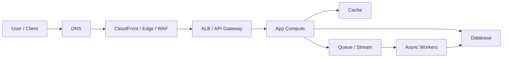
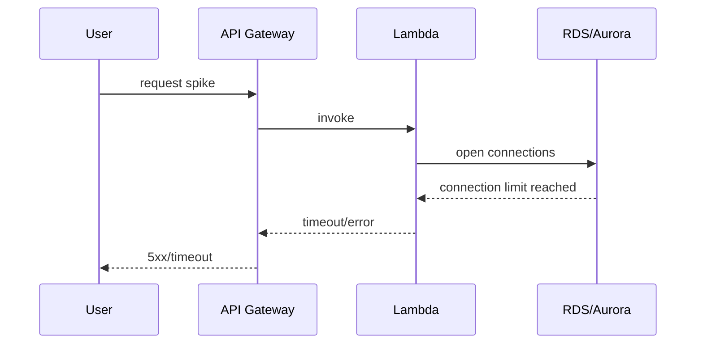
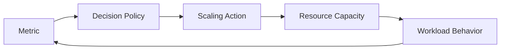
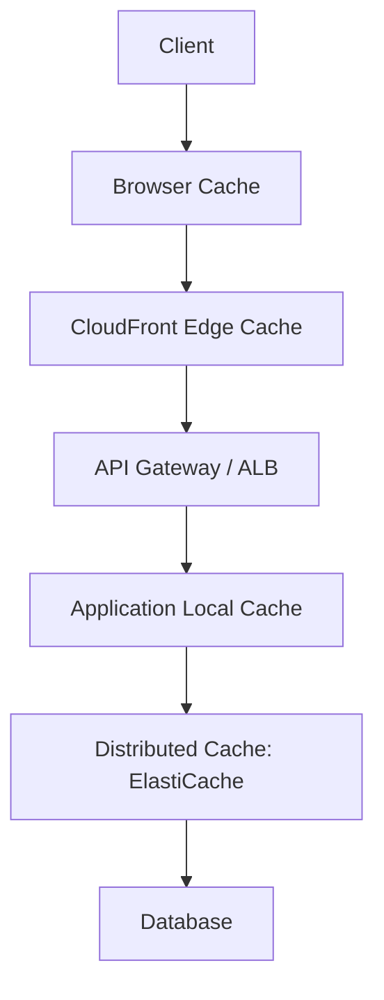
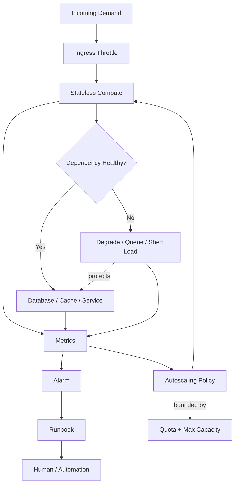

------
title: Learn AWS Engineering Mastery - Part 029
description: Performance efficiency engineering on AWS through capacity modeling, scaling feedback loops, latency budgeting, quota-aware design, load testing, caching, placement, and workload profiling.
series: learn-aws
seriesTitle: Learn AWS Engineering Mastery
order: 29
partTitle: Performance Efficiency: Capacity, Scaling, and Latency
tags:
- aws
- cloud
- architecture
- performance
- scalability
- capacity-planning
- sre
date: 2026-07-01
---

# Learn AWS Engineering Mastery - Part 029

## Performance Efficiency: Capacity, Scaling, and Latency

Performance efficiency is the discipline of using cloud resources efficiently to meet performance requirements and to keep that efficiency as demand, architecture, and AWS services evolve. In AWS Well-Architected terms, this pillar is not only about making systems fast. It is about choosing the right resource types, reviewing choices as new technologies appear, monitoring performance, and making trade-offs explicit.

For a senior AWS engineer, performance work is not “increase instance size until the graph looks better.” It is a structured loop:

1. define the user-visible performance target;
2. decompose the request path;
3. identify the constrained resource;
4. model capacity and concurrency;
5. choose the right scaling mechanism;
6. test against realistic traffic;
7. observe p95/p99 behavior;
8. reduce waste without violating the target.

This part focuses on that loop.

---

## 1. Target Skill

After this part, you should be able to:

- translate product expectations into concrete latency, throughput, concurrency, and availability targets;
- design capacity for EC2, ECS, EKS, Lambda, API Gateway, SQS, DynamoDB, Aurora, RDS, Kinesis, ElastiCache, and CloudFront-backed systems;
- reason about p50, p95, p99, tail latency, saturation, queue depth, retry amplification, throttling, and quota limits;
- decide when to scale vertically, horizontally, asynchronously, regionally, or through caching;
- build a quota-aware design before production traffic hits AWS service limits;
- design load tests that validate behavior instead of producing vanity numbers;
- detect whether a bottleneck is CPU, memory, network, disk, database connection, lock contention, downstream service, DNS, TLS, quota, or client-side fanout;
- explain the performance-cost-reliability trade-off of a proposed AWS architecture.

This is the performance capability expected from an engineer who can own production systems, not just deploy infrastructure.

---

## 2. Kaufman Skill Decomposition

Josh Kaufman’s learning method starts by decomposing a skill into smaller sub-skills. For AWS performance efficiency, the high-value sub-skills are:

```mermaid
flowchart TD
    A[AWS Performance Efficiency] --> B[Latency Budgeting]
    A --> C[Capacity Modeling]
    A --> D[Scaling Control Loops]
    A --> E[Quota-Aware Design]
    A --> F[Workload Profiling]
    A --> G[Load Testing]
    A --> H[Service Selection]
    A --> I[Cost-Performance Trade-off]

    B --> B1[p50 p95 p99]
    B --> B2[critical path]
    B --> B3[network placement]

    C --> C1[concurrency]
    C --> C2[throughput]
    C --> C3[saturation]

    D --> D1[target tracking]
    D --> D2[step scaling]
    D --> D3[queue based scaling]
    D --> D4[pre-scaling]

    E --> E1[service quotas]
    E --> E2[account limits]
    E --> E3[regional limits]

    F --> F1[CPU memory IO]
    F --> F2[connection pools]
    F --> F3[downstream latency]

    G --> G1[steady state]
    G --> G2[spike]
    G --> G3[soak]
    G --> G4[failure load]
```



The fastest path to competence is not to memorize every AWS performance feature. It is to repeatedly practice the same reasoning pattern on different workload types.

---

## 3. The Core Mental Model

A production system is a chain of constrained resources.



The system is only as fast as its critical path and only as scalable as its tightest bottleneck.

Important implications:

- A fast EC2 instance does not fix a slow database query.
- A larger database does not fix retry storms.
- A cache does not fix incorrect consistency requirements.
- A multi-AZ architecture does not automatically have enough spare capacity during AZ impairment.
- A queue protects the caller only if consumers can drain it fast enough.
- A Lambda system can still fail from downstream connection exhaustion.
- A high p50 can indicate general slowness; a high p99 often indicates contention, retry, dependency variance, cold start, GC pause, noisy neighbor, or queueing.

Performance engineering is the practice of finding and managing constraints.

---

## 4. Vocabulary You Must Use Precisely

### 4.1 Latency

Latency is the time taken to complete an operation. It can be measured at different boundaries:

| Boundary | Example | Why It Matters |
|---|---|---|
| Client-perceived latency | Browser click to rendered result | The only latency the user actually experiences |
| Edge latency | Client to CloudFront/API edge | Affected by geography, DNS, TLS, routing, caching |
| Server latency | ALB/API Gateway to application response | Affected by app code and dependency calls |
| Dependency latency | App to DB/cache/service | Usually dominates tail latency |
| Queue latency | Message creation to processing completion | Critical for async workflows |

### 4.2 Throughput

Throughput is completed work per unit time: requests per second, messages per second, writes per second, MB/s, jobs per minute, or events per shard.

Do not say “the system handles 10,000 users” unless you define:

- active concurrent users;
- requests per user per minute;
- payload size;
- read/write ratio;
- cache hit ratio;
- peak-to-average multiplier;
- tolerated latency;
- tolerated error rate.

### 4.3 Concurrency

Concurrency is the amount of work in progress at the same time. It is often more important than throughput.

A simple approximation:

```txt
concurrency ≈ throughput_per_second × average_latency_seconds
```

If a service processes 500 requests per second and each request takes 200 ms, average in-flight concurrency is roughly:

```txt
500 × 0.2 = 100 concurrent requests
```

If latency rises to 2 seconds under load, concurrency becomes:

```txt
500 × 2 = 1,000 concurrent requests
```

This is why latency degradation can become a capacity incident.

### 4.4 Saturation

Saturation means a resource is near or beyond useful capacity. Typical indicators:

- CPU consistently high;
- memory pressure or swapping;
- disk queue depth;
- network bandwidth cap;
- connection pool exhaustion;
- thread pool exhaustion;
- Lambda concurrency throttling;
- SQS backlog growth;
- Kinesis iterator age rising;
- DynamoDB throttled requests;
- database locks or connection limit exhaustion;
- ALB target response time increasing;
- API Gateway 429s;
- NAT Gateway port exhaustion or bandwidth pressure;
- downstream timeout rate rising.

### 4.5 Tail Latency

Tail latency is latency at higher percentiles such as p95, p99, or p99.9.

Averages hide production pain. In many distributed systems, the user-visible request fans out to multiple dependencies. If each dependency has acceptable p99 independently, the combined request can still have poor tail latency.

Example:

```txt
Request = call A + call B + call C + call D
```

If any one dependency is slow, the entire request is slow. Tail latency compounds with fanout.

---

## 5. Latency Budgeting

A latency budget decomposes a user-visible target into internal budgets.

Example target:

```txt
Search case API p95 <= 500 ms
```

Possible budget:

| Segment | Budget |
|---|---:|
| DNS/TLS/edge | 40 ms |
| API Gateway/ALB overhead | 30 ms |
| Auth/session lookup | 40 ms |
| Application processing | 80 ms |
| Cache lookup | 20 ms |
| Database/search query | 220 ms |
| Serialization/response | 40 ms |
| Buffer | 30 ms |

This is not perfect prediction. It is a design constraint that prevents accidental architecture.

### 5.1 Budget Rules

1. Put budgets on the critical path, not only on services.
2. Define p95/p99, not only average.
3. Include retries and timeouts.
4. Include cross-region or on-prem calls if they exist.
5. Reserve buffer for variance.
6. Revisit the budget after real telemetry.
7. Make dependency owners accountable for their segment.

### 5.2 Bad Latency Budget

```txt
The API should be fast.
```

This is untestable.

### 5.3 Good Latency Budget

```txt
For authenticated case search with <= 20 filters and <= 100 returned records:
- p50 <= 150 ms
- p95 <= 500 ms
- p99 <= 1,200 ms
- 5xx <= 0.1% over 10 minutes
- timeout <= 2 seconds
- no synchronous cross-region calls
```

This can be tested.

---

## 6. Capacity Modeling

Capacity modeling answers: “How much work can this system absorb before it violates the target?”

Start with traffic shape.

| Question | Example |
|---|---|
| What is peak request rate? | 2,000 RPS |
| What is average request latency? | 150 ms |
| What is p95 latency? | 450 ms |
| What is write ratio? | 20% writes, 80% reads |
| What is payload size? | 30 KB request, 120 KB response |
| What is fanout? | API calls DB + cache + event bus |
| What is burst multiplier? | Peak is 6x average |
| What is failure mode? | downstream DB slow, queue backlog |

Then calculate rough concurrency:

```txt
in_flight = RPS × latency_seconds
```

Then add headroom:

```txt
required_capacity = expected_peak × safety_factor
```

Safety factor depends on business criticality, scaling lag, and failure assumptions.

### 6.1 Capacity Is Multi-Dimensional

Do not model only CPU.

| Dimension | AWS Examples |
|---|---|
| CPU | EC2, ECS, EKS nodes, Lambda vCPU share via memory |
| Memory | container limits, JVM heap, Redis memory, DB buffer cache |
| Network | ENI bandwidth, NAT Gateway throughput, inter-AZ traffic |
| Disk IOPS | EBS gp3/io2, RDS storage, OpenSearch storage |
| Disk throughput | snapshot restore, log ingestion, analytics scan |
| Connections | RDS max connections, ALB target connections, Redis clients |
| Threads | app thread pool, worker pool, async executor |
| Queue depth | SQS, Kinesis consumer lag, MSK lag |
| Quotas | Lambda concurrency, API Gateway throttles, DynamoDB capacity |
| Human ops | how fast engineers can detect, decide, and act |

### 6.2 Headroom

Headroom is unused capacity reserved for variance, deployment, burst, failover, and unknowns.

A system running at 85-95% saturation in normal conditions may look cost-efficient, but it has no room for:

- traffic spike;
- bad deployment;
- AZ impairment;
- retry storm;
- slow dependency;
- failover from another cell/region;
- batch job overlap;
- reprocessing backlog;
- emergency forensic query.

For critical systems, performance efficiency means “efficient at the target reliability,” not “maximally utilized every minute.”

---

## 7. Quota-Aware Design

AWS services have quotas. Some are adjustable; some are not; some are regional; some are per account; some are per resource.

A top-tier AWS engineer treats quotas as architecture constraints.

### 7.1 Quota Checklist

For each workload, identify quotas for:

- Lambda concurrency;
- API Gateway account-level and route-level throttles;
- ALB/NLB target and listener behavior;
- ENI limits;
- NAT Gateway bandwidth/port behavior;
- VPC endpoints;
- security group rules;
- IAM policy size and role trust limits;
- DynamoDB table/index capacity;
- Kinesis shards;
- SQS in-flight messages;
- RDS connections;
- Aurora replicas;
- EBS IOPS/throughput;
- CloudWatch metric/log ingestion;
- EventBridge PutEvents rate;
- Step Functions state transition rate;
- Route 53 health checks;
- service-specific account/region limits.

### 7.2 Quota Failure Mode

A quota incident often looks like an application bug:



The root cause may not be code correctness. It may be uncontrolled concurrency.

### 7.3 Quota Design Rules

1. Know account-level quotas before launch.
2. Request quota increases before load testing, not during incident.
3. Reserve concurrency for critical Lambda functions.
4. Use throttling to protect downstream systems.
5. Use queues to absorb bursts, but size workers to drain backlog.
6. Split accounts or cells when quota isolation is needed.
7. Make quota dashboards part of production observability.
8. Document non-adjustable quotas in architecture decision records.

---

## 8. Scaling Control Loops

Scaling is a feedback loop.



A bad scaling loop oscillates, reacts too late, scales on the wrong metric, or overloads dependencies.

### 8.1 Target Tracking

Target tracking adjusts capacity to keep a metric near a target value.

Good for:

- CPU-based stateless services;
- request-count-per-target on ALB-backed services;
- ECS service scaling;
- ASG scaling;
- predictable proportional load.

Risk:

- if CPU is not the bottleneck, scaling on CPU is misleading;
- if downstream is saturated, adding workers increases pressure;
- if scale-out takes minutes, spikes still hurt.

### 8.2 Step Scaling

Step scaling changes capacity by different amounts based on metric breach size.

Good for:

- coarse-grained control;
- known load thresholds;
- queue backlogs;
- controlled emergency response.

Risk:

- threshold tuning can be fragile;
- may overreact to noise;
- may underreact to exponential spikes.

### 8.3 Scheduled Scaling

Scheduled scaling pre-scales before known traffic.

Good for:

- office-hour traffic;
- monthly reporting;
- batch windows;
- predictable public events;
- regulatory deadlines.

Risk:

- misses unexpected traffic;
- stale schedules become dangerous;
- does not solve dependency saturation.

### 8.4 Queue-Based Scaling

Queue-based scaling uses backlog signals.

Good metric examples:

- SQS ApproximateNumberOfMessagesVisible;
- SQS ApproximateAgeOfOldestMessage;
- Kinesis IteratorAgeMilliseconds;
- MSK consumer lag;
- custom “backlog per worker” metric.

A better formula:

```txt
desired_workers = backlog / acceptable_messages_per_worker
```

Even better:

```txt
desired_workers = backlog / (target_drain_time_seconds × processing_rate_per_worker)
```

### 8.5 Scaling Safety Rules

1. Scale on saturation or work backlog, not vanity traffic.
2. Use cooldowns to avoid oscillation.
3. Know startup/warmup time.
4. Pre-scale when startup time exceeds burst tolerance.
5. Limit max capacity to protect dependencies.
6. Use load shedding before total failure.
7. Couple scale-out with observability for downstream pressure.

---

## 9. Compute Performance Patterns

### 9.1 EC2

Use EC2 when you need high control over runtime, networking, storage, specialized hardware, or long-running workloads.

Performance considerations:

- instance family selection;
- vCPU and memory ratio;
- network bandwidth;
- EBS bandwidth;
- placement groups;
- AMI boot time;
- warm pool;
- ENI limits;
- kernel/runtime tuning;
- Graviton compatibility;
- NUMA/specialized hardware for extreme workloads.

Decision rule:

```txt
Use EC2 when control and predictable capacity matter more than platform abstraction.
```

### 9.2 ECS/Fargate

Use ECS/Fargate when you want containerized workloads with low cluster-management burden.

Performance considerations:

- CPU/memory task size;
- task startup time;
- image size;
- ALB request count per target;
- service autoscaling;
- capacity provider strategy;
- Fargate platform limits;
- networking mode;
- sidecar overhead;
- container-level CPU throttling.

Decision rule:

```txt
Use ECS/Fargate when workload boundaries are service/task-oriented and platform simplicity is valuable.
```

### 9.3 EKS

Use EKS when Kubernetes ecosystem, scheduling control, workload portability, or platform extensibility is justified.

Performance considerations:

- node sizing;
- pod requests and limits;
- bin-packing;
- HPA/VPA/Karpenter;
- CNI IP availability;
- ingress controller behavior;
- service mesh overhead;
- control plane/API server pressure;
- DaemonSet overhead;
- cluster autoscaler lag;
- noisy neighbor isolation.

Decision rule:

```txt
Use EKS when Kubernetes-level flexibility is worth day-2 operational complexity.
```

### 9.4 Lambda

Use Lambda when event-driven execution, burst handling, operational simplicity, and per-invocation cost model fit the workload.

Performance considerations:

- memory setting affects CPU allocation;
- cold start;
- package size;
- init code;
- VPC networking;
- provisioned concurrency;
- SnapStart for supported Java runtimes;
- reserved concurrency;
- downstream connections;
- batch size;
- partial batch failure;
- timeout and retry interaction.

Decision rule:

```txt
Use Lambda when execution is bounded, event-shaped, and downstream systems can tolerate concurrency semantics.
```

---

## 10. Data Performance Patterns

### 10.1 Aurora/RDS

Common bottlenecks:

- slow queries;
- missing indexes;
- lock contention;
- connection exhaustion;
- storage IOPS;
- replica lag;
- write hot spots;
- transaction scope too large;
- inefficient ORM access pattern;
- N+1 query pattern;
- failover connection handling.

AWS scaling tools:

- instance class sizing;
- read replicas;
- Aurora replicas;
- RDS Proxy;
- storage scaling;
- query optimization;
- parameter tuning;
- connection pool tuning;
- partitioning/sharding outside managed DB when required.

Important rule:

```txt
Adding read replicas does not scale writes.
```

Another important rule:

```txt
A connection pool protects the database only when max connections and timeouts are intentionally bounded.
```

### 10.2 DynamoDB

Common bottlenecks:

- hot partition;
- insufficient read/write capacity;
- poorly chosen partition key;
- overused GSI;
- large item size;
- scan-heavy access;
- unbounded result sets;
- high-cardinality writes to same key;
- global table conflict semantics;
- lack of backoff on throttling.

Performance tools:

- access-pattern-first modeling;
- partition key design;
- sort key design;
- sparse indexes;
- write sharding;
- on-demand capacity;
- provisioned capacity with autoscaling;
- DAX for selected read-heavy patterns;
- streams for async projection;
- TTL for lifecycle;
- batch APIs with backoff.

Important rule:

```txt
DynamoDB performance begins with key design, not instance sizing.
```

### 10.3 ElastiCache

Common bottlenecks:

- low cache hit rate;
- hot keys;
- large values;
- memory fragmentation;
- eviction storms;
- connection overload;
- cache stampede;
- replication lag;
- slow Lua/scripts;
- cross-AZ latency.

Performance tools:

- read-through/write-through/cache-aside patterns;
- TTL discipline;
- jittered expiry;
- request coalescing;
- key hashing;
- cluster mode;
- replica reads;
- connection pooling;
- local in-process cache for tiny hot data.

Important rule:

```txt
A cache is a consistency trade-off, not free performance.
```

### 10.4 OpenSearch

Common bottlenecks:

- shard count too high or too low;
- JVM heap pressure;
- expensive aggregations;
- bad mapping;
- high-cardinality fields;
- indexing pressure;
- query fanout;
- storage I/O;
- hot shards;
- no lifecycle policy.

Performance tools:

- index design;
- shard sizing;
- rollover/lifecycle;
- dedicated master nodes;
- warm/cold storage tiering;
- bulk indexing;
- query optimization;
- denormalized search documents;
- backpressure from source systems.

Important rule:

```txt
Search systems should usually be projections, not systems of record.
```

---

## 11. Network and Placement Performance

AWS networking performance is affected by geography, Region choice, AZ placement, edge usage, VPC design, NAT, TLS, packet path, and cross-service integration.

### 11.1 Placement Rules

| Workload Concern | Placement Pattern |
|---|---|
| Global user latency | CloudFront, Route 53 latency routing, Global Accelerator where appropriate |
| Low app-to-DB latency | Same Region, usually same VPC, Multi-AZ DB design |
| AZ failure tolerance | Multi-AZ compute and data design |
| Cross-region DR | asynchronous replication with explicit RTO/RPO |
| Hybrid dependency | Direct Connect/VPN, regional placement near on-prem |
| Data sovereignty | Region and account boundary aligned to legal requirements |

### 11.2 Cross-AZ and Cross-Region Calls

Cross-AZ calls may be acceptable and necessary for HA, but they are not free. Cross-region synchronous calls should be treated as a major design smell unless the workload explicitly requires it.

Rules:

1. Avoid synchronous cross-region dependency in request paths.
2. Prefer local reads for latency-sensitive systems.
3. Use async replication for DR and analytics.
4. Keep failover dependencies pre-provisioned.
5. Test DNS and client behavior during failover.
6. Budget for inter-AZ and cross-region data transfer.

### 11.3 Edge Acceleration

CloudFront can reduce latency and origin load by caching content at edge locations. It is useful for:

- static assets;
- public APIs with cacheable responses;
- global distribution;
- TLS termination close to users;
- WAF integration;
- origin shielding;
- reducing repeated origin fetches.

But CloudFront is not magic. You must design:

- cache keys;
- TTLs;
- invalidation strategy;
- auth behavior;
- header/cookie/query forwarding;
- origin timeout;
- stale-on-error behavior;
- observability.

---

## 12. Caching Strategy

Caching is one of the most powerful performance tools and one of the easiest ways to introduce subtle correctness bugs.

### 12.1 Cache Layers



### 12.2 Cache Decision Matrix

| Question | Implication |
|---|---|
| Is stale data acceptable? | Determines TTL and invalidation model |
| Is data user-specific? | Affects cache key and privacy risk |
| Is data read-heavy? | Improves cache value |
| Is recomputation expensive? | Cache may reduce CPU/database cost |
| Is write frequency high? | Cache invalidation becomes harder |
| Is data regulated/sensitive? | Requires strict key isolation and encryption |
| Is miss storm possible? | Need request coalescing/jitter |

### 12.3 Cache Anti-Patterns

- caching authorization decisions without expiry discipline;
- cache key omits tenant/user dimension;
- long TTL for frequently corrected regulatory data;
- no invalidation path;
- same TTL for all keys causing synchronized expiry;
- cache-as-database;
- no metric for hit rate/miss latency;
- no fallback when cache is unavailable;
- unlimited local cache causing memory pressure.

---

## 13. Load Testing That Actually Teaches You

A good load test validates assumptions.

### 13.1 Test Types

| Test Type | Purpose |
|---|---|
| Smoke test | Confirm basic path works |
| Baseline test | Establish normal performance |
| Load test | Validate expected peak traffic |
| Stress test | Find breaking point |
| Spike test | Validate burst handling |
| Soak test | Detect leaks and degradation over time |
| Failover load test | Validate performance during component failure |
| Backlog drain test | Validate async recovery speed |

### 13.2 Load Test Inputs

Define:

- user journeys;
- request mix;
- payload size;
- data distribution;
- auth behavior;
- tenant distribution;
- cache warm/cold state;
- think time;
- concurrency;
- ramp-up pattern;
- peak duration;
- failure injection;
- success criteria.

### 13.3 Load Test Success Criteria

Bad:

```txt
The load test passed.
```

Good:

```txt
At 2,000 RPS for 30 minutes with 20% writes and warm cache:
- p95 API latency <= 500 ms
- p99 API latency <= 1,200 ms
- 5xx <= 0.1%
- DB CPU <= 65%
- DB connections <= 60% of max
- SQS oldest message age <= 120 seconds
- no Lambda throttles
- no DynamoDB throttles
- no CloudWatch alarm in critical state
```

### 13.4 Failure Load Testing

Test under degraded conditions:

- one AZ removed;
- cache unavailable;
- read replica lagging;
- DB failover;
- dependency latency injected;
- queue consumer disabled;
- downstream 429s;
- DNS failover;
- quota intentionally constrained;
- deployment during load.

This is how you discover whether the architecture is resilient or merely fast in happy path.

---

## 14. Observability for Performance

Performance observability must answer:

1. What is the user experiencing?
2. Which path is slow?
3. Which dependency is causing it?
4. Is the system saturated?
5. Is the problem load, code, data shape, network, quota, or dependency?
6. Is scaling helping or hurting?
7. Are retries amplifying the problem?

### 14.1 Golden Signals

| Signal | Meaning |
|---|---|
| Latency | How long requests take |
| Traffic | How much demand exists |
| Errors | What fraction fails |
| Saturation | How full constrained resources are |

### 14.2 AWS Metrics to Correlate

| Layer | Metrics |
|---|---|
| CloudFront | cache hit rate, origin latency, 4xx/5xx |
| API Gateway | latency, integration latency, 4xx/5xx, throttles |
| ALB | target response time, target 5xx, healthy hosts, request count per target |
| ECS/EKS | CPU, memory, task/pod count, restart count, pending pods |
| Lambda | duration, init duration, concurrent executions, throttles, errors, iterator age |
| SQS | visible messages, oldest message age, in-flight messages |
| DynamoDB | consumed capacity, throttles, latency, hot partitions indirectly |
| RDS/Aurora | CPU, connections, read/write IOPS, replica lag, lock waits, deadlocks |
| ElastiCache | CPU, memory, evictions, cache hits/misses, connections |
| Kinesis | incoming records, write/read throttles, iterator age |
| NAT Gateway | bytes, packets, error port allocation, connection metrics |

### 14.3 Trace Requirements

For distributed systems, include:

- correlation ID at ingress;
- trace ID propagated across services;
- tenant/request classification;
- dependency span timings;
- retry count;
- timeout reason;
- cache hit/miss tag;
- database query class, not raw sensitive query text;
- queue message age;
- region/AZ/cell dimension where relevant.

---

## 15. Performance Design by Workload Type

### 15.1 Public Read-Heavy API

Likely tools:

- CloudFront;
- API Gateway/ALB;
- ElastiCache;
- DynamoDB or Aurora read replicas;
- autoscaled stateless compute;
- strict cache key design.

Main risks:

- cache poisoning;
- tenant data leakage;
- origin overload on cache miss;
- uneven hot keys;
- p99 from dependency fanout.

### 15.2 Write-Heavy Transactional System

Likely tools:

- Aurora/RDS primary write path;
- SQS/EventBridge for async side effects;
- idempotency keys;
- bounded connection pools;
- careful transaction boundaries;
- outbox pattern.

Main risks:

- lock contention;
- connection exhaustion;
- write hot spots;
- retry duplicate writes;
- synchronous side effects in transaction path.

### 15.3 Event Processing Pipeline

Likely tools:

- SQS/Kinesis/MSK;
- Lambda/ECS/EKS workers;
- DLQ;
- partial batch failure;
- idempotent consumers;
- backlog-aware scaling.

Main risks:

- poison messages;
- backlog growth;
- ordering assumptions;
- replay duplicate effects;
- downstream overload.

### 15.4 Analytics Workload

Likely tools:

- S3;
- Glue Data Catalog;
- Athena/Redshift/EMR;
- partitioning;
- columnar formats;
- lifecycle policies.

Main risks:

- too many small files;
- poor partitioning;
- expensive full scans;
- mixed operational and analytics workloads;
- no data quality gates.

---

## 16. Performance Anti-Patterns

1. Scaling every tier except the bottleneck.
2. Synchronous cross-region calls in user request path.
3. No quota review before launch.
4. No load test with production-like data shape.
5. Averages instead of p95/p99.
6. Retrying without jitter/backoff.
7. No timeout budget.
8. Unlimited concurrency into a limited database.
9. Caching sensitive data with incomplete keys.
10. Treating queues as infinite.
11. Using Lambda for long-running, connection-heavy workloads without modeling concurrency.
12. Using Kubernetes when ECS/Fargate would meet requirements with less operational cost.
13. Using Aurora when DynamoDB access patterns are simpler and predictable.
14. Using DynamoDB without access-pattern-first modeling.
15. Running at high utilization without failover headroom.
16. Not testing performance during deployment.
17. Not testing performance during dependency impairment.
18. Confusing successful scaling with efficient scaling.

---

## 17. Decision Matrix: Scaling Strategy

| Symptom | Likely Cause | Better Response |
|---|---|---|
| CPU high, latency high | compute saturation | horizontal/vertical scale, optimize code |
| CPU low, latency high | dependency or lock wait | trace dependency, DB/cache analysis |
| DB connections maxed | uncontrolled concurrency | pool limits, RDS Proxy, async, throttle |
| Queue backlog grows | consumers insufficient or downstream slow | scale consumers, reduce processing time, protect downstream |
| DynamoDB throttles | key/capacity issue | inspect access pattern, capacity mode, write sharding |
| p99 high only | tail dependency variance | trace p99, reduce fanout, hedge carefully, timeout budget |
| 429s from API Gateway | throttle/quota | adjust quota/throttle, protect backend, client backoff |
| Lambda throttles | concurrency limit | reserve/increase concurrency, reduce fanout, queue buffering |
| Cache hit rate low | bad key/TTL/access pattern | redesign caching strategy |
| Intermittent network errors | NAT/connection/DNS/TLS | inspect VPC path, NAT metrics, client reuse |

---

## 18. Production Review Checklist

Use this before launching or approving an AWS workload.

### 18.1 Latency

- [ ] User-visible latency target is defined.
- [ ] p50/p95/p99 targets are defined.
- [ ] Timeout budget exists.
- [ ] Critical path is documented.
- [ ] No accidental synchronous cross-region call exists.
- [ ] External dependencies have explicit timeout and retry policy.

### 18.2 Capacity

- [ ] Peak RPS/message rate is estimated.
- [ ] Burst multiplier is estimated.
- [ ] Concurrency is estimated.
- [ ] Per-tier bottlenecks are identified.
- [ ] Headroom is defined.
- [ ] Failover capacity is modeled.

### 18.3 Scaling

- [ ] Scaling metric matches bottleneck.
- [ ] Scale-out time is known.
- [ ] Cooldown is configured.
- [ ] Max capacity protects dependencies.
- [ ] Pre-scaling exists for predictable spikes.
- [ ] Queue drain time is tested.

### 18.4 Quotas

- [ ] Service quotas are reviewed.
- [ ] Regional/account quotas are reviewed.
- [ ] Quota increase requests are submitted where needed.
- [ ] Non-adjustable quotas are documented.
- [ ] Quota alarms exist for critical limits.

### 18.5 Load Testing

- [ ] Production-like data exists.
- [ ] Request mix is realistic.
- [ ] Cache warm and cold tests are run.
- [ ] Soak test is run.
- [ ] Spike test is run.
- [ ] Failure load test is run.
- [ ] Results are compared to SLO.

### 18.6 Observability

- [ ] Metrics exist per critical tier.
- [ ] Traces show dependency timings.
- [ ] Logs include correlation ID.
- [ ] Dashboards separate user, service, dependency, and infrastructure view.
- [ ] Alarms are actionable.
- [ ] Cost-performance metrics are visible.

---

## 19. Mermaid: Scaling Feedback with Protection



The key point: autoscaling must not be allowed to destroy a dependency. Scaling and throttling are paired controls.

---

## 20. Deliberate Practice

### Exercise 1: Latency Budget

Create a latency budget for an API endpoint:

```txt
GET /cases/{caseId}/timeline
```

Assume:

- user is in Southeast Asia;
- workload runs in ap-southeast-1;
- authentication required;
- timeline data is in Aurora;
- attachments metadata is in DynamoDB;
- audit event is emitted asynchronously;
- p95 target is 600 ms.

Deliverables:

- segment budget;
- timeout per dependency;
- retry policy;
- tracing fields;
- failure response behavior.

### Exercise 2: Queue Drain Model

Given:

```txt
Backlog: 2,000,000 messages
Each worker processes: 40 messages/second
Target drain time: 30 minutes
```

Calculate required workers:

```txt
workers = backlog / (drain_time_seconds × rate_per_worker)
workers = 2,000,000 / (1,800 × 40)
workers ≈ 27.8
```

So you need at least 28 workers before adding headroom.

Then answer:

- can downstream DB handle 28 workers?
- what max concurrency should workers use?
- what happens if 1% messages poison-fail?
- what alarm detects failure to drain?

### Exercise 3: Quota Review

Pick one existing workload and document:

- Lambda concurrency;
- API Gateway throttles;
- DB connection limit;
- SQS in-flight limit;
- CloudWatch log ingestion;
- VPC endpoint quotas;
- ENI limits;
- NAT metrics;
- DynamoDB capacity if used.

Write one ADR titled:

```txt
ADR: Performance Quotas and Launch Headroom for <Workload>
```

### Exercise 4: Load Test Plan

Design a load test for a case-management search API.

Include:

- data volume;
- tenant distribution;
- search filter distribution;
- request mix;
- cache state;
- concurrency ramp;
- pass/fail criteria;
- dashboard links;
- rollback criteria;
- cost limit for test.

---

## 21. Self-Correction Questions

Ask these during design review:

1. What is the user-visible performance target?
2. What is the critical path?
3. What is the bottleneck at normal load?
4. What is the bottleneck at peak load?
5. What is the bottleneck during failure?
6. Which metric proves saturation?
7. Which scaling policy responds to that metric?
8. How long does scale-out take?
9. What protects dependencies during scale-out?
10. Which AWS quota fails first?
11. What happens if cache hit rate drops to zero?
12. What happens if one AZ is removed?
13. What happens if downstream latency increases by 10x?
14. What is the p99 path?
15. What test proves the design?

If you cannot answer these, you do not yet understand the performance posture of the workload.

---

## 22. Key Takeaways

- Performance efficiency is not raw speed; it is efficient satisfaction of explicit performance targets.
- Latency must be budgeted across the critical path.
- Capacity must be modeled through concurrency, throughput, saturation, and headroom.
- Scaling is a feedback loop and can harm dependencies if uncontrolled.
- Quotas are architecture constraints, not operational footnotes.
- Load tests must validate realistic traffic, data, cache state, and failure behavior.
- p95/p99 matter more than average for production user experience.
- Caching is a correctness trade-off, not free performance.
- Efficient architecture balances latency, cost, reliability, security, and operational complexity.

---

## 23. References

- AWS Well-Architected Framework - Performance Efficiency Pillar: https://docs.aws.amazon.com/wellarchitected/latest/framework/performance-efficiency.html
- AWS Well-Architected Performance Efficiency - Design Principles: https://docs.aws.amazon.com/wellarchitected/latest/performance-efficiency-pillar/design-principles.html
- AWS Well-Architected Performance Efficiency - Networking and Content Delivery: https://docs.aws.amazon.com/wellarchitected/latest/performance-efficiency-pillar/networking-and-content-delivery.html
- AWS Service Quotas: https://docs.aws.amazon.com/servicequotas/latest/userguide/intro.html
- Amazon EC2 Auto Scaling Target Tracking Scaling Policies: https://docs.aws.amazon.com/autoscaling/ec2/userguide/as-scaling-target-tracking.html
- Amazon ECS Service Auto Scaling: https://docs.aws.amazon.com/AmazonECS/latest/developerguide/service-auto-scaling.html
- AWS Lambda Concurrency: https://docs.aws.amazon.com/lambda/latest/dg/lambda-concurrency.html
- Amazon CloudWatch: https://docs.aws.amazon.com/AmazonCloudWatch/latest/monitoring/WhatIsCloudWatch.html
