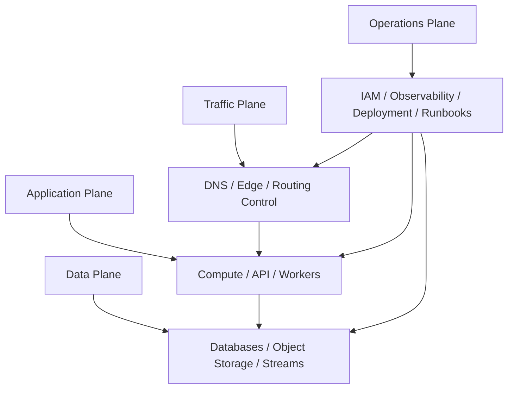
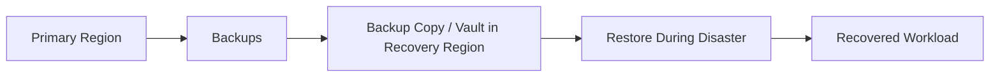
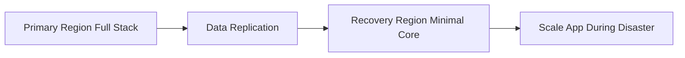
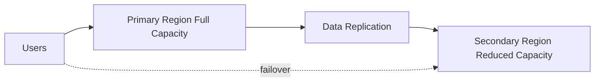
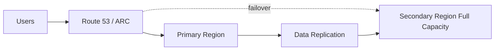
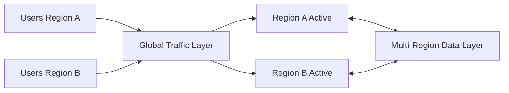
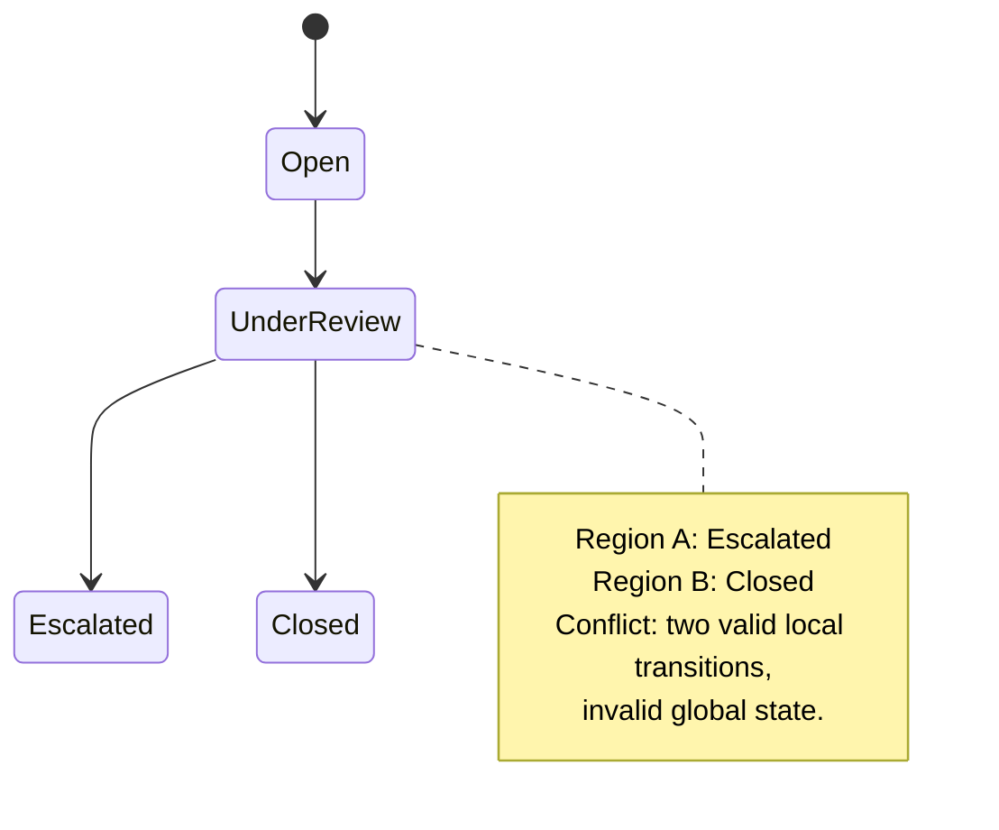
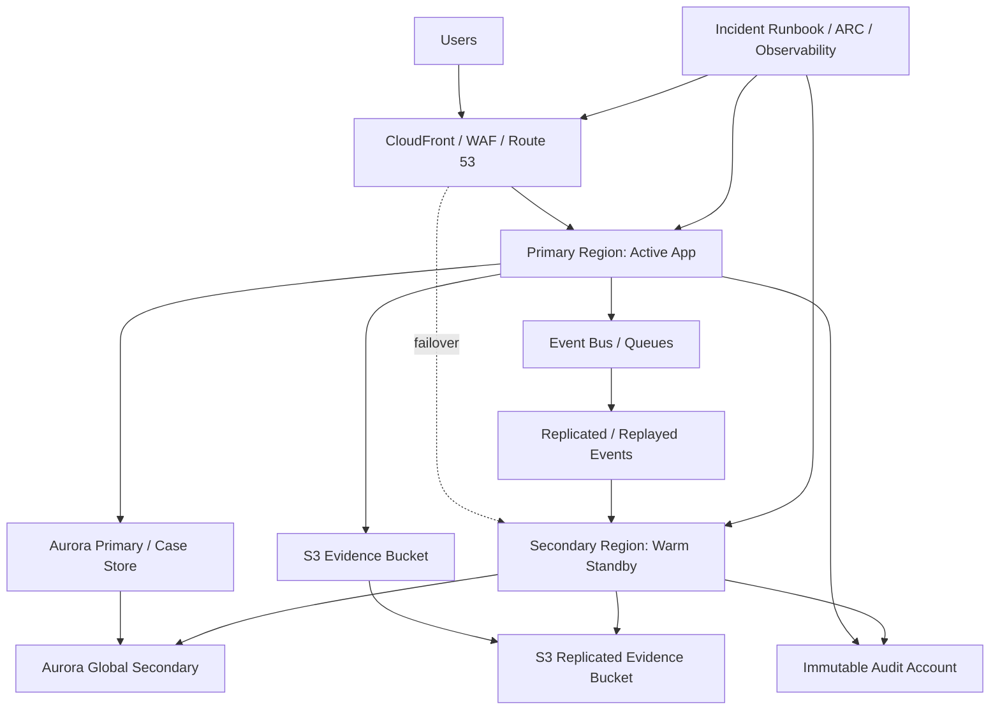

------
title: Learn AWS Engineering Mastery - Part 030
description: Multi-region architecture on AWS through disaster recovery strategy, RTO/RPO contracts, Route 53 and ARC traffic control, data replication, failover, failback, consistency, and operational drills.
series: learn-aws
seriesTitle: Learn AWS Engineering Mastery
order: 30
partTitle: Multi-Region Architecture: DR, Data Replication, and Traffic Control
tags:
- aws
- cloud
- architecture
- multi-region
- disaster-recovery
- reliability
- data-replication
date: 2026-07-01
---

# Learn AWS Engineering Mastery - Part 030

## Multi-Region Architecture: DR, Data Replication, and Traffic Control

Multi-region architecture is one of the most misunderstood areas of AWS system design. It is often presented as the ultimate maturity level, but in practice it is a trade-off. Multi-region can improve survivability against regional impairment, reduce latency for global users, or satisfy data-residency requirements. It can also multiply cost, operational complexity, consistency problems, deployment risk, observability burden, security surface, and incident response difficulty.

A senior AWS engineer does not ask, “Can we run this in multiple Regions?” The better question is:

```txt
What failure or business requirement justifies multi-region complexity, and what exact RTO/RPO/consistency contract must the design satisfy?
```

This part teaches how to answer that question.

---

## 1. Target Skill

After this part, you should be able to:

- distinguish high availability, disaster recovery, regional redundancy, and active-active architecture;
- choose between backup/restore, pilot light, warm standby, active/passive, and active/active;
- define RTO and RPO as testable contracts;
- design multi-region traffic control using Route 53, health checks, failover routing, latency routing, weighted routing, and Amazon Application Recovery Controller where appropriate;
- reason about Aurora Global Database, DynamoDB global tables, S3 replication, Kinesis/MSK replication alternatives, ECR replication, secrets replication, and KMS key strategy;
- avoid split brain, data loss, stale reads, duplicate processing, inconsistent authorization, and broken failback;
- design failover and failback runbooks;
- evaluate when multi-region is overengineering.

---

## 2. Kaufman Skill Decomposition

Multi-region architecture decomposes into the following sub-skills:

```mermaid
flowchart TD
    A[Multi-Region Architecture] --> B[Requirement Framing]
    A --> C[Traffic Control]
    A --> D[Data Replication]
    A --> E[Application Topology]
    A --> F[Operational Readiness]
    A --> G[Consistency and Conflict Handling]
    A --> H[Security and Governance]

    B --> B1[RTO]
    B --> B2[RPO]
    B --> B3[Data residency]
    B --> B4[Latency]

    C --> C1[Route 53]
    C --> C2[Health checks]
    C --> C3[ARC routing controls]
    C --> C4[Global Accelerator]

    D --> D1[S3 replication]
    D --> D2[DynamoDB global tables]
    D --> D3[Aurora Global Database]
    D --> D4[Backup restore]

    E --> E1[Active passive]
    E --> E2[Warm standby]
    E --> E3[Active active]
    E --> E4[Cell based]

    F --> F1[Failover runbook]
    F --> F2[Failback runbook]
    F --> F3[Game day]
    F --> F4[Observability]
```



Kaufman-style learning here means you practice failover reasoning repeatedly until you can predict failure behavior before seeing the outage.

---

## 3. Core Mental Model

A multi-region system has four planes:



A design is not multi-region-ready until all four planes are ready.

Common incomplete designs:

- traffic can fail over, but data cannot;
- data is replicated, but application secrets are missing;
- application is deployed, but IAM roles differ;
- DNS fails over, but clients cache old endpoints;
- secondary Region exists, but capacity is too small;
- failover works, but failback is undefined;
- dashboards show primary Region only;
- runbook requires console access that is unavailable during incident;
- data model cannot tolerate concurrent writes in multiple Regions.

---

## 4. Terms You Must Not Confuse

### 4.1 High Availability

High availability usually means the workload continues despite component or AZ-level failures. On AWS, this often means Multi-AZ within one Region.

### 4.2 Disaster Recovery

Disaster recovery means the workload can be recovered after a larger failure such as regional impairment, severe data corruption, major security event, or accidental deletion.

### 4.3 Multi-Region

Multi-region means workload capabilities exist in more than one AWS Region. It does not automatically mean active-active or zero data loss.

### 4.4 Active/Passive

One Region serves production traffic; another is ready to take over at some level of preparedness.

### 4.5 Active/Active

More than one Region serves production traffic at the same time.

Active-active is not “just Route 53 latency routing.” True active-active requires data, conflict, identity, idempotency, operations, and consistency design.

### 4.6 RTO

Recovery Time Objective: how long the business can tolerate the system being unavailable after a disaster.

### 4.7 RPO

Recovery Point Objective: how much data loss the business can tolerate, measured as time or committed work.

### 4.8 Failover

Moving service from impaired primary capability to recovery capability.

### 4.9 Failback

Returning service to the original Region or steady-state topology after recovery.

Failback is often more dangerous than failover because data divergence may have accumulated.

---

## 5. Do Not Start with Active-Active

Active-active is expensive and difficult. Many workloads do not need it.

Start with requirements:

| Requirement | Likely Pattern |
|---|---|
| Can tolerate hours of downtime and data restored from backup | Backup/restore |
| Need infrastructure pre-created, but data restore/startup can take time | Pilot light |
| Need fast recovery with scaled-down live stack | Warm standby |
| Need low RTO with one active serving Region | Active/passive hot standby |
| Need global low latency and Region survivability | Active-active or cell-based multi-region |
| Need local data residency | Regional isolation or partitioned multi-region |
| Need zero/near-zero data loss | Stronger replication/consistency design, often more expensive |

The strongest design principle:

```txt
Choose the simplest DR pattern that satisfies RTO, RPO, compliance, and user-experience requirements.
```

---

## 6. Disaster Recovery Strategy Matrix

| Strategy | Approximate Cost | Complexity | RTO | RPO | Typical Use |
|---|---:|---:|---:|---:|---|
| Backup/Restore | Low | Low-Medium | Hours+ | Last backup/PITR | Internal systems, lower criticality |
| Pilot Light | Low-Medium | Medium | Tens of minutes to hours | Replication-dependent | Core data protected, app rebuilt/scaled during event |
| Warm Standby | Medium | Medium-High | Minutes to tens of minutes | Replication-dependent | Critical systems needing faster recovery |
| Active/Passive Hot Standby | High | High | Minutes | Low, replication-dependent | High criticality with one serving Region |
| Active/Active | Very High | Very High | Seconds-minutes | Depends on data model | Global systems, low latency, regional survivability |

Do not treat this as exact SLA math. It is a design framing tool. Actual RTO/RPO must be tested.

---

## 7. Multi-Region Reference Architectures

### 7.1 Backup/Restore



Characteristics:

- low steady-state cost;
- slower recovery;
- requires restore automation;
- good for lower criticality;
- RTO depends on restore time;
- RPO depends on backup frequency/PITR;
- must test restore regularly.

Failure mode:

```txt
Backups exist, but nobody has restored them at production scale.
```

### 7.2 Pilot Light



Characteristics:

- critical data path kept ready;
- app infrastructure partially prepared;
- lower cost than warm standby;
- recovery depends on scaling and deployment speed;
- requires tested automation.

Failure mode:

```txt
The pilot light exists, but dependencies such as secrets, DNS, IAM, and observability are incomplete.
```

### 7.3 Warm Standby



Characteristics:

- secondary Region runs scaled-down live environment;
- faster recovery than pilot light;
- requires pre-scaling before or during failover;
- good for critical workloads with acceptable cost.

Failure mode:

```txt
Secondary Region is alive but cannot absorb full traffic.
```

### 7.4 Active/Passive Hot Standby



Characteristics:

- secondary Region is near full capacity;
- failover mostly traffic/data-role decision;
- higher cost;
- simpler consistency than active-active;
- still needs failback strategy.

Failure mode:

```txt
Automated health check fails over during partial dependency issue and creates unnecessary regional event.
```

### 7.5 Active/Active



Characteristics:

- multiple Regions serve traffic simultaneously;
- low user latency possible;
- can reduce regional blast radius;
- complex consistency/conflict handling;
- expensive observability and operations;
- requires strong idempotency and regional isolation design.

Failure mode:

```txt
Both Regions accept conflicting writes and business process has no deterministic conflict resolution.
```

---

## 8. Traffic Control

Traffic control is how you move users between regional capabilities.

### 8.1 Route 53 Health Checks and Failover Routing

Route 53 health checks can monitor endpoints, other health checks, or CloudWatch alarms. Failover routing can route to a primary resource when healthy and secondary resource when the primary is unhealthy.

Use cases:

- active/passive DNS failover;
- regional endpoint health;
- static website failover;
- API failover when clients use DNS correctly.

Risks:

- DNS TTL means failover is not instantaneous;
- client resolvers may cache longer than expected;
- health checks can be too shallow;
- false positive failover can worsen incident;
- DNS failover does not solve data promotion.

### 8.2 Weighted Routing

Weighted routing can gradually shift traffic between Regions.

Use cases:

- controlled migration;
- blue/green region rollout;
- canarying secondary Region;
- partial traffic steering.

Risks:

- client stickiness may not match weights exactly;
- stateful sessions need design;
- data writes can diverge if both Regions accept traffic without plan.

### 8.3 Latency-Based Routing

Latency routing routes users to the Region with lowest measured latency from their location.

Use cases:

- global active-active read-heavy services;
- regional user experience optimization;
- multi-region frontend/API.

Risks:

- nearest Region may not contain correct data;
- session/data affinity must be designed;
- compliance may restrict routing;
- latency routing is not a data consistency strategy.

### 8.4 Geolocation and Geoproximity Routing

Use when routing must follow geography, regulation, or business partitioning.

Examples:

- EU users to eu-central-1;
- Indonesian users to ap-southeast-3 or ap-southeast-1 depending requirement;
- tenant-specific regional residency;
- government workloads isolated by jurisdiction.

Risk:

```txt
Geographic routing solves policy placement, not failover correctness.
```

### 8.5 Amazon Application Recovery Controller

Amazon Application Recovery Controller provides capabilities such as routing controls for multi-region recovery and zonal shift/zonal autoshift for supported resources. ARC routing controls are designed for highly reliable failover control, while zonal shift lets you move traffic away from an impaired AZ for supported resources.

Use cases:

- high-confidence manual or automated regional failover;
- safety rules before traffic shift;
- zonal evacuation for supported resources;
- operational drills.

Important principle:

```txt
For critical failover, prefer explicit recovery control with safety checks over shallow automatic DNS health logic.
```

---

## 9. Data Replication

Traffic failover is easy compared to data failover. Data determines correctness.

### 9.1 Data Replication Questions

For every data store, answer:

1. Is it system of record or projection?
2. Is replication synchronous or asynchronous?
3. What is expected replication lag?
4. What is the RPO under normal conditions?
5. What is the RPO under regional failure?
6. Can the secondary become writable?
7. How is writer promotion done?
8. Can both Regions accept writes?
9. What happens to conflicting writes?
10. What is the failback process?
11. How is data corruption handled?
12. How is deletion replicated?
13. Are backups isolated from replication mistakes?

### 9.2 Aurora Global Database

Aurora Global Database has one primary Region where writes occur and up to multiple read-only secondary Regions. It is designed for globally distributed applications with low-latency reads in secondary Regions and disaster recovery capability.

Design implications:

- writes go to the primary Region;
- secondary Regions can support local reads;
- failover/switchover must promote a secondary;
- application connection endpoints must handle role change;
- RPO/RTO depend on replication and failover execution;
- failback requires careful reconciliation and planned switchover.

Good use cases:

- mostly single-writer systems;
- global read latency improvement;
- regional DR for relational workloads;
- systems where write locality can be centralized.

Bad fit:

- true multi-writer relational workload without conflict model;
- low-latency writes required in every Region;
- systems where ORM/connection behavior cannot tolerate failover.

### 9.3 DynamoDB Global Tables

DynamoDB global tables provide multi-Region, multi-active replication. Applications can write to replicas in different Regions, and DynamoDB replicates changes.

Design implications:

- excellent for region-local reads/writes when access patterns fit DynamoDB;
- conflict behavior must be understood;
- idempotency is mandatory;
- item ownership and update semantics should avoid conflicts;
- global secondary indexes and capacity must be region-aware;
- streams/side effects must avoid duplicate processing across Regions.

Good use cases:

- tenant/session/profile/config data with clear item ownership;
- globally distributed metadata;
- event idempotency tables;
- user-facing low-latency reads/writes where conflict can be controlled.

Bad fit:

- complex relational transactions;
- heavy cross-item consistency requirements;
- workloads that cannot tolerate eventual replication behavior.

### 9.4 S3 Replication

S3 replication can replicate objects across buckets in the same or different Regions, subject to configuration requirements such as versioning.

Design implications:

- good for object DR and regional data distribution;
- replication is asynchronous;
- delete marker behavior must be explicitly understood;
- metadata/tag/encryption behavior must be configured correctly;
- replication failures need monitoring;
- replication is not a backup substitute for corruption/deletion unless combined with versioning/Object Lock/backup strategy.

Good use cases:

- document/archive replication;
- static assets;
- data lake distribution;
- cross-account evidence copy;
- recovery Region object availability.

Bad fit:

- synchronous object consistency across Regions;
- replacing backup retention controls;
- high-frequency overwrite workloads without versioning discipline.

### 9.5 RDS Cross-Region Read Replicas

For some engines and configurations, RDS supports cross-region read replicas. They can improve read locality or support DR patterns.

Design implications:

- asynchronous replication;
- replica lag matters;
- promotion changes topology;
- application endpoints and secrets must be ready;
- failback is non-trivial.

### 9.6 Streams and Event Replication

For Kinesis, MSK, and event systems, multi-region design is not only “copy messages.” You must decide:

- event identity;
- ordering scope;
- duplicate handling;
- replay boundary;
- consumer idempotency;
- regional ownership;
- poison message handling;
- schema compatibility;
- replication lag;
- data retention.

Common pattern:


But the critical detail is duplicate-safe semantics, not the pipe.

---

## 10. Application State and Session Design

Multi-region systems fail when application state is region-bound accidentally.

### 10.1 Avoid Local Sticky State

Avoid storing critical session/process state only in:

- EC2 instance memory;
- pod local filesystem;
- single-AZ cache;
- local worker queue;
- primary-region-only database;
- unreplicated S3 bucket;
- region-specific secret without equivalent in secondary.

### 10.2 Session Patterns

| Pattern | Multi-Region Impact |
|---|---|
| Stateless JWT | Easier routing, but revocation/claims freshness must be handled |
| Server-side session in regional cache | Requires regional affinity or replicated/session fallback |
| DB-backed session | Simpler consistency, can add DB load |
| Sticky DNS/load balancer | Fragile during failover |
| Tenant-region affinity | Good for residency and data locality |

### 10.3 Idempotency

Idempotency is mandatory for multi-region systems because failover creates ambiguity:

- Did the request reach primary before failure?
- Did the event replicate?
- Did the client retry to secondary?
- Did the workflow partially complete?

Use:

- idempotency keys;
- request IDs;
- deterministic business keys;
- conditional writes;
- deduplication tables;
- outbox/inbox pattern;
- exactly-once illusion through at-least-once plus idempotent effects.

---

## 11. Consistency and Conflict Handling

Multi-region data usually means some form of eventual consistency unless using specialized strongly consistent systems with trade-offs.

### 11.1 Conflict Types

| Conflict | Example |
|---|---|
| Concurrent update | Same case edited in two Regions |
| Duplicate create | Same business request retried after failover |
| Delete/update race | Record deleted in one Region and updated in another |
| Workflow transition conflict | Enforcement case moves to different states in different Regions |
| Counter conflict | Metrics/counts incremented in multiple Regions |
| Authorization conflict | User permission revoked in one Region but accepted in another |

### 11.2 Conflict Strategies

| Strategy | Use When | Risk |
|---|---|---|
| Single writer | Stronger correctness needed | Higher write latency for remote users |
| Regional ownership | Tenant/entity belongs to one Region at a time | Rebalancing complexity |
| Last writer wins | Low-value overwrite data | Can lose business updates |
| Version/check-and-set | Conflicts should be rejected | Requires user/workflow resolution |
| CRDT/counter design | Specific commutative updates | Complexity and limited fit |
| Workflow compensation | Business process can reverse/adjust | Requires auditability |
| Manual reconciliation | Rare high-value conflicts | Operational burden |

### 11.3 Regulatory Workflow Example

For enforcement lifecycle systems, active-active writes are dangerous if case state transitions are not conflict-safe.

Example invalid state race:



Better design:

- single writer per case;
- case-region ownership;
- command idempotency;
- versioned state transitions;
- append-only audit log;
- async replicated read model;
- explicit transfer-of-ownership workflow.

---

## 12. Identity, Secrets, and Key Management

Multi-region is not only compute and data.

### 12.1 IAM

IAM is global for many identity constructs, but deployed workload roles, resource policies, permission boundaries, SCPs, and account structure must be consistent.

Checklist:

- same account/OUs guardrails;
- same workload roles;
- same trust policies;
- same permission boundaries;
- same break-glass path;
- same CI/CD deployment role model;
- same audit logging baseline;
- cross-region assumptions documented.

### 12.2 Secrets

Secrets must exist in the recovery Region before failover.

Watch for:

- Secrets Manager replication strategy;
- region-specific ARNs;
- app config references;
- rotation lambdas;
- DB credentials after promotion;
- third-party API credentials with regional allowlists;
- emergency manual rotation.

### 12.3 KMS

KMS design matters because encrypted data cannot be recovered if keys and policies are not available.

Questions:

- Are keys regional or multi-region keys?
- Are key policies equivalent?
- Can recovery roles decrypt replicated data?
- Are grants recreated in secondary?
- Are backup vault keys available?
- Is key deletion protected?
- Does data residency restrict key placement?

---

## 13. Deployment and Configuration

A common multi-region failure is configuration drift.

### 13.1 Deployment Rules

1. Use the same artifact across Regions.
2. Promote configuration explicitly.
3. Separate global config from regional config.
4. Validate regional dependencies before traffic shift.
5. Use health checks that verify real dependency readiness.
6. Keep database migrations backward-compatible.
7. Roll out primary and secondary with controlled order.
8. Test rollback in both Regions.
9. Ensure feature flags are region-aware.
10. Store deployment evidence.

### 13.2 Regional Configuration Example

```yaml
service: case-api
artifactVersion: 2026.07.01-1842
regions:
  ap-southeast-1:
    active: true
    databaseRole: primary
    trafficWeight: 100
  ap-southeast-3:
    active: false
    databaseRole: standby
    trafficWeight: 0
```

Avoid hidden Region-specific values buried inside application code.

---

## 14. Observability for Multi-Region

A multi-region dashboard must compare Regions.

### 14.1 Required Dimensions

- Region;
- AZ;
- account;
- cell;
- tenant;
- workload;
- dependency;
- traffic source;
- data replication lag;
- failover state;
- deployment version;
- feature flag state.

### 14.2 Critical Metrics

| Area | Metrics |
|---|---|
| Traffic | request count per Region, error rate, latency, health check status |
| Data | replication lag, conflict count, write error, restore status |
| Compute | capacity, saturation, warm standby size, scaling lag |
| Queue/Stream | backlog per Region, iterator age, duplicate count |
| DNS/Routing | active routing state, TTL, health check result |
| Security | GuardDuty/Security Hub findings per Region, CloudTrail delivery |
| Cost | steady-state multi-region cost, data transfer, standby waste |
| DR | last failover drill, RTO achieved, RPO observed |

### 14.3 Alarm Design

Avoid single-region blind spots.

Example alarms:

- primary Region 5xx > threshold;
- secondary Region readiness check fails;
- replication lag > RPO threshold;
- standby capacity < failover requirement;
- Route 53 health check unhealthy;
- ARC routing control changed;
- global table replication errors;
- S3 replication failure;
- Aurora global replication lag high;
- failover runbook step timeout;
- cross-region data transfer anomaly.

---

## 15. Failover Runbook

A failover runbook must be executable under stress.

### 15.1 Pre-Failover Checks

- Confirm incident scope: AZ, service, Region, app-only, data corruption, security event.
- Confirm failover is safer than staying.
- Confirm secondary Region health.
- Confirm secondary capacity.
- Confirm replication lag and possible RPO impact.
- Freeze risky deployments.
- Stop conflicting writers if needed.
- Notify stakeholders.
- Assign incident commander and scribe.

### 15.2 Failover Steps

Example active/passive relational workload:

```txt
1. Declare failover decision.
2. Disable writes in primary application if reachable.
3. Check replication lag.
4. Promote secondary database or execute managed failover/switchover.
5. Validate database writer endpoint.
6. Scale secondary application to required capacity.
7. Validate secrets/config/IAM access.
8. Run synthetic checks against secondary.
9. Shift traffic using Route 53/ARC/traffic layer.
10. Monitor error rate, latency, write success, replication status.
11. Communicate user impact and current operating mode.
```

### 15.3 Post-Failover Checks

- Error rate stable.
- Latency acceptable.
- Data writes succeeding.
- No unexpected writes to old primary.
- Queue backlog controlled.
- Security monitoring active.
- Audit logging active.
- Cost anomaly expected.
- Business-critical workflows validated.

---

## 16. Failback Runbook

Failback is not rollback.

### 16.1 Failback Risks

- old primary has stale data;
- both Regions accepted writes;
- replication direction changed;
- DNS/client caches still point to secondary;
- queues contain old messages;
- scheduled jobs run twice;
- audit logs split;
- third-party integrations changed callback endpoint;
- secrets rotated in only one Region;
- operators assume original topology is still valid.

### 16.2 Failback Steps

```txt
1. Confirm original Region is healthy.
2. Decide whether to fail back or remain in new primary.
3. Reconcile data divergence.
4. Re-establish replication direction.
5. Validate app stack in original Region.
6. Run synthetic and business checks.
7. Shift small traffic percentage if possible.
8. Monitor error, latency, data correctness.
9. Complete traffic shift.
10. Keep enhanced monitoring during stabilization.
11. Document observed RTO/RPO and lessons.
```

A mature organization may choose not to fail back immediately. Sometimes the safer move is to operate from the recovery Region until a planned migration window.

---

## 17. Cost Model

Multi-region cost includes more than duplicate compute.

### 17.1 Cost Categories

- duplicate or standby compute;
- duplicate load balancers/API endpoints;
- data replication transfer;
- inter-region data transfer;
- replicated storage;
- database replicas/global database cost;
- monitoring/logging duplication;
- security tooling per Region;
- backup copies;
- Route 53 health checks;
- ARC features where used;
- operational drills;
- engineering complexity;
- incident response training;
- compliance evidence duplication.

### 17.2 Cost Questions

- Is the workload valuable enough for this RTO/RPO?
- What is the cost of downtime per hour?
- What is the cost of data loss per minute?
- What is the cost of inconsistent decisions?
- Can we use warm standby instead of active-active?
- Can we partition by tenant/cell instead of global active-active?
- Can we reduce RTO through automation without full duplicate capacity?

---

## 18. Security and Compliance

Multi-region expands security scope.

### 18.1 Security Checklist

- [ ] CloudTrail enabled in all Regions/accounts.
- [ ] Config/security controls deployed in all Regions.
- [ ] GuardDuty/Security Hub coverage includes recovery Region.
- [ ] KMS keys and policies support recovery.
- [ ] Secrets exist and rotate safely.
- [ ] WAF rules and edge controls consistent.
- [ ] IAM deployment roles exist in recovery Region.
- [ ] Break-glass access tested.
- [ ] Data residency requirements documented.
- [ ] Replication does not violate regulatory boundary.
- [ ] Backup vault isolation exists.
- [ ] Audit evidence includes failover events.

### 18.2 Compliance Trap

A system may be technically recoverable but non-compliant after failover.

Example:

```txt
Primary Region stores regulated records in approved jurisdiction.
Failover Region is technically ready but not approved for that data class.
```

That is not a valid DR design.

---

## 19. Multi-Region Anti-Patterns

1. “Active-active” with no conflict strategy.
2. DNS failover without data promotion plan.
3. Replication without restore/failover drills.
4. Secondary Region without enough capacity.
5. Backups copied but never restored.
6. Hard-coded regional ARNs in application config.
7. Secrets only in primary Region.
8. Dashboards only in primary Region.
9. CI/CD deploys primary but not recovery Region.
10. Health checks that only test `/health` and not dependencies.
11. Automatic failover on shallow signal.
12. No failback plan.
13. Using active-active to hide poor single-region reliability.
14. Cross-region synchronous calls in normal request path.
15. Replicating corrupted data without immutable backup.
16. Running scheduled jobs in both Regions without leader election or idempotency.
17. No RTO/RPO measurement during drills.
18. Ignoring client DNS caching behavior.
19. No regional cost allocation.
20. No regulatory approval for recovery Region.

---

## 20. Decision Matrix: Should This Be Multi-Region?

| Question | If Yes | If No |
|---|---|---|
| Is regional outage survivability required? | Consider DR/multi-region | Multi-AZ may be enough |
| Is RTO less than one hour? | Warm standby/hot standby likely | Backup/restore may fit |
| Is RPO near zero? | Need strong replication/data strategy | Periodic backup may fit |
| Are users global and latency-sensitive? | Consider regional serving/edge | Single Region + CloudFront may fit |
| Is data residency regional? | Partition by jurisdiction | Simpler global data placement possible |
| Can writes be single-region? | Active/passive simpler | Active-active conflict design needed |
| Can business tolerate conflict resolution? | Multi-writer possible | Avoid active-active writes |
| Is team operationally mature? | Consider advanced design | Start simpler and drill |
| Is cost justified? | Proceed with evidence | Do not overbuild |

---

## 21. Reference Blueprint: Regulated Case Platform DR

For a regulated enforcement/case-management platform, a sane default is often:

- primary Region active;
- secondary Region warm standby;
- single writer for case state;
- Aurora Global Database or cross-region DR strategy for relational case store;
- S3 replication for documents/evidence with versioning/Object Lock where required;
- DynamoDB global table only for suitable metadata/idempotency/session/config patterns;
- EventBridge/SQS workflows designed for idempotency and replay;
- Route 53/ARC traffic control;
- immutable audit logs replicated to separate account/Region;
- failover runbook requiring incident commander approval;
- failback treated as planned recovery project, not automatic reversal.



Why this is safer than naive active-active:

- case state transitions remain single-writer;
- auditability is preserved;
- recovery is fast enough for many regulated workloads;
- conflict model is simpler;
- cost is lower than full active-active;
- failover can be drilled.

---

## 22. Production Readiness Checklist

### 22.1 Requirement

- [ ] RTO defined.
- [ ] RPO defined.
- [ ] Data residency defined.
- [ ] User latency requirement defined.
- [ ] Critical workflow list defined.
- [ ] Downtime cost estimated.
- [ ] Data loss cost estimated.

### 22.2 Topology

- [ ] DR strategy selected.
- [ ] Primary/secondary roles documented.
- [ ] Regional account structure defined.
- [ ] Network baseline deployed.
- [ ] Compute baseline deployed.
- [ ] Ingress/egress baseline deployed.
- [ ] Capacity target for failover defined.

### 22.3 Data

- [ ] System-of-record data mapped.
- [ ] Projection data mapped.
- [ ] Replication mode documented.
- [ ] Replication lag monitored.
- [ ] Backup strategy independent of replication.
- [ ] Restore tested.
- [ ] Conflict strategy documented.

### 22.4 Traffic

- [ ] Route 53/ARC/traffic layer selected.
- [ ] Health checks validate real readiness.
- [ ] DNS TTL understood.
- [ ] Manual override path exists.
- [ ] Traffic shift tested.
- [ ] Client behavior tested.

### 22.5 Operations

- [ ] Failover runbook tested.
- [ ] Failback runbook drafted and tested where possible.
- [ ] Incident roles defined.
- [ ] Dashboards include both Regions.
- [ ] Alarms include replication/readiness.
- [ ] Break-glass tested.
- [ ] Game day completed.

### 22.6 Security and Compliance

- [ ] CloudTrail/Config/Security Hub coverage in all Regions.
- [ ] KMS and secrets ready in recovery Region.
- [ ] Data movement approved.
- [ ] Audit evidence replicated.
- [ ] Access controls consistent.
- [ ] Recovery Region included in compliance scope.

---

## 23. Game Day Scenarios

Run these before claiming multi-region readiness.

### Scenario 1: Primary App Region Unavailable

- block primary application endpoint;
- verify health checks;
- promote/activate secondary;
- shift traffic;
- measure RTO;
- estimate RPO;
- validate critical workflows.

### Scenario 2: Database Primary Unavailable

- simulate database failover;
- validate app reconnection;
- verify no duplicate writes;
- confirm read/write endpoints;
- measure recovery.

### Scenario 3: Replication Lag Exceeds RPO

- delay replication;
- trigger alarm;
- decide whether failover is allowed;
- document decision policy.

### Scenario 4: Corrupted Data Replicated

- introduce controlled bad data in non-prod;
- observe replication;
- restore from backup/versioned data;
- validate audit trail.

### Scenario 5: Secondary Region Missing Secret

- remove a non-prod secret equivalent;
- test synthetic readiness;
- ensure failover blocked before user traffic.

### Scenario 6: Duplicate Event Replay

- replay event stream after failover;
- confirm idempotent consumers;
- inspect side effects.

---

## 24. Deliberate Practice

### Exercise 1: Pick a DR Strategy

Given:

```txt
System: regulatory case management API
Users: national agency staff
Data: sensitive enforcement records
Downtime tolerance: 30 minutes
Data loss tolerance: <= 1 minute
Budget: medium-high
Writes: mostly during office hours
Read traffic: high during reporting deadlines
```

Deliver:

- DR strategy;
- primary/secondary topology;
- data replication choice;
- traffic control choice;
- failover steps;
- failback risks;
- why not active-active.

### Exercise 2: Conflict Model

Design a conflict model for:

```txt
Case status transition: UnderReview -> Escalated / Closed
```

Assume failover occurs while users retry requests.

Deliver:

- idempotency key design;
- version check;
- state transition validation;
- audit log entry;
- retry behavior;
- operator reconciliation path.

### Exercise 3: Multi-Region Readiness Review

For an existing workload, create a table:

| Component | Primary Region | Secondary Region | Replication | RTO Risk | RPO Risk |
|---|---|---|---|---|---|
| API |  |  |  |  |  |
| DB |  |  |  |  |  |
| S3 |  |  |  |  |  |
| Queue |  |  |  |  |  |
| Secrets |  |  |  |  |  |
| KMS |  |  |  |  |  |
| Observability |  |  |  |  |  |

Then identify the first component that blocks real failover.

### Exercise 4: Failover Runbook Test

Write a failover runbook with:

- decision criteria;
- required approver;
- exact commands or console actions;
- validation queries;
- traffic shift method;
- rollback/abort criteria;
- communication template;
- RTO/RPO measurement fields.

Run it in non-prod.

---

## 25. Self-Correction Questions

Ask these in every multi-region design review:

1. What exact failure are we designing for?
2. What is the agreed RTO?
3. What is the agreed RPO?
4. Who accepts data loss if RPO is exceeded?
5. Is the secondary Region already deployed?
6. Is secondary capacity sufficient?
7. What data is replicated?
8. What data is not replicated?
9. Is replication asynchronous?
10. How do we detect replication lag?
11. Can both Regions accept writes?
12. If yes, what is the conflict strategy?
13. If no, how is single-writer enforced?
14. How is traffic shifted?
15. What prevents false failover?
16. How do clients behave during DNS change?
17. Are secrets and KMS keys ready?
18. Are IAM and policies equivalent?
19. Does compliance allow this recovery Region?
20. Has failover been tested under load?
21. Has failback been tested or at least designed?
22. What is the cost of steady-state readiness?

If the team cannot answer these, the architecture is not multi-region-ready.

---

## 26. Key Takeaways

- Multi-region architecture is a business-risk decision, not a badge of maturity.
- RTO and RPO must be explicit, testable, and accepted by stakeholders.
- Traffic failover without data readiness is not disaster recovery.
- Active-active is usually the hardest and most expensive option.
- Data consistency and conflict handling determine correctness.
- DNS, health checks, ARC, and routing controls solve traffic movement, not application semantics.
- Failover and failback are separate operational procedures.
- Replication is not a substitute for immutable backup.
- Recovery Region must include security, observability, IAM, secrets, keys, and compliance scope.
- A simpler warm-standby design with tested runbooks often beats an untested active-active design.

---

## 27. References

- AWS Well-Architected Reliability Pillar - Disaster Recovery: https://docs.aws.amazon.com/wellarchitected/latest/reliability-pillar/rel_planning_for_recovery_disaster_recovery.html
- Amazon Route 53 Health Checks: https://docs.aws.amazon.com/Route53/latest/DeveloperGuide/dns-failover.html
- Amazon Route 53 Failover Routing: https://docs.aws.amazon.com/Route53/latest/DeveloperGuide/routing-policy-failover.html
- Amazon Application Recovery Controller: https://docs.aws.amazon.com/r53recovery/latest/dg/what-is-route53-recovery.html
- ARC Zonal Shift: https://docs.aws.amazon.com/r53recovery/latest/dg/arc-zonal-shift.html
- Aurora Global Database: https://docs.aws.amazon.com/AmazonRDS/latest/AuroraUserGuide/aurora-global-database.html
- Aurora Global Database Disaster Recovery: https://docs.aws.amazon.com/AmazonRDS/latest/AuroraUserGuide/aurora-global-database-disaster-recovery.html
- DynamoDB Global Tables: https://docs.aws.amazon.com/amazondynamodb/latest/developerguide/GlobalTables.html
- Amazon S3 Replication: https://docs.aws.amazon.com/AmazonS3/latest/userguide/replication.html
- AWS Backup: https://docs.aws.amazon.com/aws-backup/latest/devguide/whatisbackup.html
