------
title: Learn AWS Engineering Mastery - Part 031
description: Modernization and migration on AWS through portfolio assessment, 7R strategies, migration waves, strangler architecture, data migration, cutover, and risk-controlled transformation.
series: learn-aws
seriesTitle: Learn AWS Engineering Mastery
order: 31
partTitle: Modernization, Migration, and Strangler Architecture
tags:
- aws
- cloud
- architecture
- migration
- modernization
- strangler-fig
- enterprise-architecture
date: 2026-07-01
---

# Learn AWS Engineering Mastery - Part 031

## Modernization, Migration, and Strangler Architecture

Modernization is not the same as moving servers to AWS.

A migration can move a workload from one hosting environment to another while preserving most of its architecture. Modernization changes the workload so that it becomes easier to operate, safer to change, more observable, more resilient, more cost-transparent, and better aligned with business capability boundaries.

A senior AWS engineer does not treat migration as a one-time infrastructure project. They treat it as a controlled transformation program with measurable risk, staged learning, explicit rollback points, and clear ownership.

The core question is not:

```txt
How do we migrate this application to AWS?
```

The better question is:

```txt
Which business capability should change, which risk should be reduced, and which parts of the system should remain boring for now?
```

This part teaches how to think about migration and modernization as engineering change management.

---

## 1. Target Skill

After this part, you should be able to:

- distinguish migration, modernization, transformation, refactoring, replatforming, and re-architecture;
- select an appropriate migration strategy using the 7 Rs: retire, retain, rehost, relocate, repurchase, replatform, refactor/re-architect;
- design a portfolio assessment that avoids arbitrary migration sequencing;
- structure migration waves based on risk, dependency, business priority, and learning value;
- apply the strangler fig pattern to incrementally replace legacy functionality;
- choose safe cutover models: big-bang, phased, parallel run, shadow traffic, dark launch, and dual-write with reconciliation;
- identify migration failure modes before execution;
- plan data migration, CDC, backfill, validation, and rollback;
- create modernization roadmaps that balance speed, risk, and engineering sustainability.

---

## 2. Kaufman Skill Decomposition

Migration and modernization are too broad to learn as one skill. Decompose them into sub-skills:

```mermaid
flowchart TD
    A[AWS Migration and Modernization] --> B[Portfolio Assessment]
    A --> C[Migration Strategy Selection]
    A --> D[Landing and Foundation Readiness]
    A --> E[Application Decomposition]
    A --> F[Data Migration]
    A --> G[Cutover and Release Safety]
    A --> H[Operational Readiness]
    A --> I[Modernization Governance]

    B --> B1[Inventory]
    B --> B2[Dependency mapping]
    B --> B3[Business criticality]
    B --> B4[Risk classification]

    C --> C1[7 Rs]
    C --> C2[Decision tree]
    C --> C3[Exception rationale]

    E --> E1[Strangler fig]
    E --> E2[Branch by abstraction]
    E --> E3[Capability decomposition]
    E --> E4[Anti-corruption layer]

    F --> F1[Backfill]
    F --> F2[CDC]
    F --> F3[Dual-write]
    F --> F4[Reconciliation]

    G --> G1[Canary]
    G --> G2[Blue/green]
    G --> G3[Parallel run]
    G --> G4[Rollback]

    H --> H1[Runbooks]
    H --> H2[Monitoring]
    H --> H3[Access]
    H --> H4[Incident response]
```

### First 20 Hours Focus

For the first 20 hours of advanced practice, focus on these high-yield sub-skills:

| Timebox | Focus | Practice Output |
|---:|---|---|
| 2h | Migration vocabulary and 7Rs | Classify 20 workloads into migration strategies |
| 3h | Dependency mapping | Draw dependency graph for a legacy system |
| 3h | Strangler design | Design incremental extraction for one capability |
| 3h | Data migration risk | Create backfill + CDC + reconciliation plan |
| 3h | Cutover plan | Write phased cutover and rollback runbook |
| 3h | Operational readiness | Create go/no-go checklist |
| 3h | Modernization governance | Build decision log and exception model |

---

## 3. Core Mental Model

Migration is movement.
Modernization is capability change.
Transformation is organizational change.

```txt
Migration changes where the system runs.
Modernization changes how the system behaves and evolves.
Transformation changes how teams build, operate, and govern systems.
```

A cloud migration that keeps every legacy failure mode intact is often just a data-center relocation with a new bill.

A good modernization effort changes at least one of these properties:

- deployment frequency;
- lead time for change;
- recovery time;
- observability;
- security posture;
- cost transparency;
- operational toil;
- scaling behavior;
- tenant isolation;
- data governance;
- release safety;
- team ownership boundaries.

### The Transformation Triangle

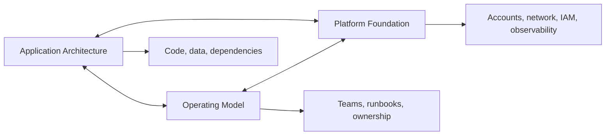

You cannot modernize only the code while ignoring the operating model. A new containerized service with no ownership, no SLO, no deployment safety, and no cost allocation is not modern. It is just packaged differently.

---

## 4. Migration vs Modernization vs Refactoring

| Term | Meaning | Typical Scope | Risk |
|---|---|---|---|
| Migration | Move workload to AWS | Hosting/platform | Operational and cutover risk |
| Rehost | Move with minimal change | VM/server level | Lower transformation risk, may preserve legacy flaws |
| Replatform | Move with selected platform improvements | Runtime/data/service layer | Moderate risk |
| Refactor | Improve internal structure without changing external behavior | Code/module level | Code correctness risk |
| Re-architect | Change structure, boundaries, data model, or integration style | System level | High design and delivery risk |
| Modernization | Improve evolvability, operability, scalability, and governance | End-to-end capability | Program risk |

### Practical Example

Legacy application:

```txt
- Java monolith on VM
- Oracle database
- file-based batch integration
- manual deployments
- shared admin credential
- no structured logs
- weekly release window
```

Possible approaches:

| Approach | Result |
|---|---|
| Rehost | Run VM on EC2, preserve most behavior |
| Replatform | Move database to RDS/Aurora where compatible, automate deployment |
| Refactor | Improve internal modules, remove hard-coded config |
| Re-architect | Extract case intake, workflow, audit, notification as separate capabilities |
| Modernize | Introduce IaC, CI/CD, observability, IAM roles, SLOs, runbooks, cost tags, resilience patterns |

Top-tier engineers know when *not* to modernize. A stable, low-value, soon-to-retire app should not consume the same design energy as a strategic enforcement platform.

---

## 5. The 7 Rs Migration Strategies

AWS Prescriptive Guidance commonly describes seven migration strategies, known as the 7 Rs:

1. **Retire** — decommission applications that are no longer needed.
2. **Retain** — keep applications where they are for now.
3. **Rehost** — move application infrastructure with minimal changes.
4. **Relocate** — move workloads at the hypervisor/platform level where supported.
5. **Repurchase** — replace with a different product, often SaaS.
6. **Replatform** — make some optimizations without changing core architecture.
7. **Refactor or re-architect** — redesign to use cloud-native capabilities or new architecture.

The key is not memorizing the list. The key is choosing the strategy that fits:

- business criticality;
- remaining lifespan;
- regulatory constraints;
- operational pain;
- technical debt;
- dependency complexity;
- migration window;
- team capability;
- cost pressure;
- resilience requirement;
- security risk.

### Strategy Decision Matrix

| Condition | Likely Strategy | Reasoning |
|---|---|---|
| App unused or duplicated | Retire | Avoid migrating waste |
| App tied to unsupported hardware/regulatory location | Retain | Cloud move may be unsafe now |
| App stable, low change, urgent data-center exit | Rehost | Speed over transformation |
| VMware estate with compatible target | Relocate | Reduce migration friction |
| Commodity business capability | Repurchase | Buy instead of rebuild |
| App can benefit from managed DB/cache/storage with minimal code change | Replatform | Improve operations without full rewrite |
| App is strategic but blocked by architecture | Refactor/re-architect | Enable long-term agility and resilience |

### Bad Strategy Smells

| Smell | Why It Is Dangerous |
|---|---|
| “Everything will be refactored” | Usually too slow, too risky, and too expensive |
| “Everything will be lift-and-shifted” | Preserves cost, security, and operability problems |
| “We will decide after migration” | Creates cloud-hosted technical debt |
| “The tool will migrate it” | Tooling does not decide architecture or ownership |
| “No app can be retired” | Indicates weak portfolio governance |
| “Modernization means Kubernetes” | Confuses platform choice with business capability improvement |

---

## 6. Portfolio Assessment

Before designing migrations, you need a portfolio view.

A portfolio assessment answers:

```txt
What exists, who owns it, why does it matter, what does it depend on, how risky is it, and what should happen to it?
```

### Minimum Portfolio Fields

| Field | Why It Matters |
|---|---|
| Application name | Basic inventory |
| Business capability | Prevents purely technical grouping |
| Owner | Enables accountability |
| Criticality | Drives sequencing and DR |
| Users/consumers | Reveals impact |
| Data classification | Drives security and compliance |
| Runtime | Migration compatibility |
| Database | Data migration risk |
| Integration dependencies | Wave planning |
| Authentication model | Identity modernization |
| Deployment model | Release readiness |
| Observability level | Operational risk |
| Compliance obligations | Audit/evidence requirements |
| Current pain | Modernization value |
| Cost baseline | Business case |
| End-of-life dates | Urgency |
| Recommended 7R | Migration strategy |
| Rationale | Governance evidence |

### Portfolio Maturity Levels

| Level | Behavior |
|---|---|
| 0 | No reliable inventory |
| 1 | Spreadsheet inventory, incomplete dependency data |
| 2 | Inventory plus owners and criticality |
| 3 | Dependency graph, cost baseline, data classification |
| 4 | Migration waves, risk scoring, decision log |
| 5 | Continuously maintained portfolio, integrated with CMDB/IaC/observability |

### Dependency Graph Example

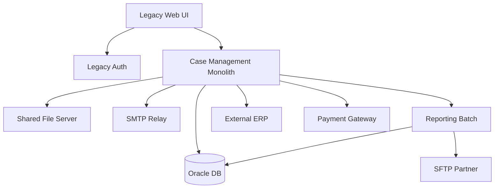

A dependency graph prevents naive sequencing. You cannot migrate the reporting batch if it depends on a database, file server, and partner SFTP path that will not exist in the target environment.

---

## 7. Migration Wave Planning

A migration wave is a batch of applications or components migrated together.

Bad wave planning groups workloads by convenience:

```txt
Wave 1: all Linux servers
Wave 2: all Windows servers
Wave 3: all databases
```

Better wave planning groups workloads by dependency, risk, and learning value:

```txt
Wave 1: non-critical app with representative architecture
Wave 2: low-risk apps using shared network/auth baseline
Wave 3: medium-critical apps with database migration
Wave 4: strategic capability with strangler extraction
Wave 5: high-criticality workload after readiness improves
```

### Wave Design Criteria

| Criterion | Question |
|---|---|
| Dependency closure | Can this wave run independently after migration? |
| Learning value | What reusable pattern will this wave prove? |
| Blast radius | What happens if cutover fails? |
| Business timing | Are there blackout windows? |
| Data complexity | Is there CDC, backfill, or dual-write? |
| Security readiness | Are IAM, network, secrets, and audit ready? |
| Operational readiness | Are runbooks and monitoring ready? |
| Rollback feasibility | Can we safely revert? |

### Wave Anti-Pattern

```txt
Pick the easiest apps first, learn nothing, then discover the hard platform gaps on the most critical workload.
```

A better approach: choose early waves that are safe but representative.

---

## 8. Landing Zone Readiness Before Migration

Migration without a ready landing zone creates chaos.

Before serious workload migration, ensure these foundations exist:

| Foundation | Required Capability |
|---|---|
| Account strategy | Workload/account/environment separation |
| Network | VPC, subnet, routing, DNS, endpoint, ingress/egress pattern |
| Identity | Federation, roles, least privilege, break-glass |
| Logging | CloudTrail, Config, VPC Flow Logs, application logs |
| Security | Guardrails, KMS, secrets, vulnerability detection |
| Deployment | IaC, CI/CD, artifact promotion |
| Observability | Metrics, logs, traces, alarms, dashboards |
| Operations | Runbooks, incident management, SSM access |
| Cost | Tags, budgets, cost allocation |
| Compliance | Evidence, controls, exception process |

### Foundation Dependency Diagram

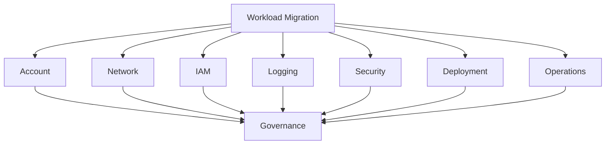

A workload should not be the first place where you invent production access, logging, network egress, backup policy, or deployment promotion.

---

## 9. Modernization Candidate Selection

Not every app deserves deep modernization.

### High-Value Modernization Candidates

Modernize aggressively when the workload:

- is strategically important;
- changes frequently;
- blocks business agility;
- has high operational toil;
- has recurring incidents;
- has scaling or latency bottlenecks;
- has security/compliance weaknesses;
- has unclear ownership boundaries;
- has strong coupling across business capabilities;
- is expensive because of inefficient architecture;
- needs multi-tenant or self-service capability.

### Low-Value Modernization Candidates

Avoid deep modernization when the workload:

- is near retirement;
- is stable and rarely changed;
- has low business impact;
- is replaceable by SaaS;
- has no meaningful scaling or operational issue;
- has unclear product sponsorship;
- has limited team capacity.

### Modernization Prioritization Matrix

| Business Value | Technical Pain | Suggested Approach |
|---|---|---|
| High | High | Modernize incrementally |
| High | Low | Migrate safely, defer deep changes |
| Low | High | Retire, replace, or contain |
| Low | Low | Rehost/retain/retire depending on lifecycle |

---

## 10. Strangler Fig Pattern

The strangler fig pattern incrementally replaces parts of a legacy system with new services while the old and new systems coexist.

It is useful when a big-bang rewrite is too risky.

### Basic Flow

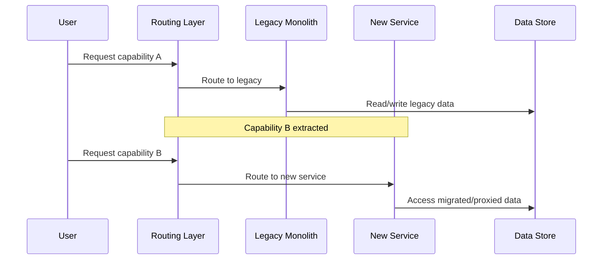

### Strangler Stages

| Stage | Description |
|---|---|
| 1. Identify seam | Find a capability boundary that can be intercepted |
| 2. Introduce routing | Route selected traffic through a facade/proxy/API gateway |
| 3. Extract capability | Build new implementation outside monolith |
| 4. Sync or migrate data | Decide data ownership and transition model |
| 5. Shift traffic | Route more traffic to new capability |
| 6. Monitor and reconcile | Compare behavior and data correctness |
| 7. Decommission old path | Remove legacy code/data/integration once safe |

### Good Strangler Candidates

| Candidate | Why It Works |
|---|---|
| Notification service | Often peripheral, event-driven, low data ownership risk |
| Reporting projection | Can be built from replicated data before becoming authoritative |
| Read-only search | Can use shadow indexing and compare results |
| Authentication facade | Enables identity modernization carefully |
| Case intake API | Often a clear edge boundary |
| Document generation | Often separable from core transaction workflow |

### Poor Early Strangler Candidates

| Candidate | Why Risky |
|---|---|
| Core transaction commit | High correctness and data ownership risk |
| Shared authorization logic | Cross-cutting and high blast radius |
| Database schema core tables | Many hidden dependencies |
| Batch settlement | Often complex reconciliation and timing constraints |
| High-regulatory audit log | Must preserve evidence integrity |

---

## 11. Finding Seams in Legacy Systems

A seam is a place where behavior can be changed without rewriting the entire system.

Common seams:

- URL route;
- API endpoint;
- message queue;
- database table ownership boundary;
- file exchange;
- batch job;
- UI module;
- feature flag;
- authentication boundary;
- reporting read model;
- external integration adapter.

### Seam Evaluation Matrix

| Seam | Good When | Risk |
|---|---|---|
| API route | Requests can be routed by path/header/tenant | Contract compatibility |
| UI route | Frontend module can call new backend | User experience inconsistency |
| Queue | Consumers can be added or replaced | Ordering/retry semantics |
| Database table | Ownership can be isolated | Hidden coupling |
| File feed | Contract can remain stable | Batch timing and duplicate processing |
| Report | Read-only projection acceptable | Data freshness expectations |
| Auth | Token boundary can be introduced | Lockout/security risk |

### Example: Case Intake Extraction

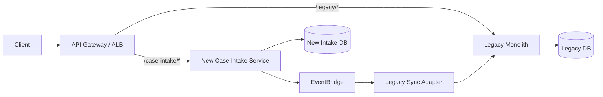

The new service owns the intake workflow. A sync adapter updates the legacy system only where needed. Over time, downstream consumers move from the legacy database to published domain events or new APIs.

---

## 12. Anti-Corruption Layer

An anti-corruption layer protects new architecture from legacy model leakage.

Without it, a new service becomes a thin wrapper around old data structures, old error semantics, old permissions, and old coupling.

### Responsibilities

| Responsibility | Example |
|---|---|
| Model translation | Legacy `CASE_STATUS='P'` becomes `PENDING_REVIEW` |
| Protocol adaptation | SOAP/file/database call becomes REST/event interface |
| Error mapping | Legacy error code becomes domain-specific error |
| Identity mapping | Legacy user ID maps to federated subject/tenant |
| Data normalization | Inconsistent legacy fields become canonical DTO |
| Policy enforcement | New authorization policy wraps legacy permissiveness |
| Observability | Adds correlation ID and structured logging |

### Diagram

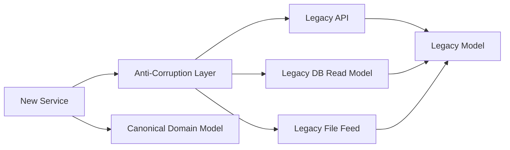

### Rule

```txt
Never let the legacy data model become the public contract of the new platform.
```

---

## 13. Branch by Abstraction

Branch by abstraction is a technique where you introduce an abstraction over old behavior, then gradually swap implementations behind that abstraction.

It is useful when you cannot safely maintain a long-lived source-control branch.

### Example

```java
public interface CaseAssignmentEngine {
    AssignmentDecision assign(CaseContext context);
}

public final class LegacyCaseAssignmentEngine implements CaseAssignmentEngine {
    public AssignmentDecision assign(CaseContext context) {
        // Existing behavior
    }
}

public final class NewRuleBasedAssignmentEngine implements CaseAssignmentEngine {
    public AssignmentDecision assign(CaseContext context) {
        // New behavior
    }
}
```

With feature flags, tenant routing, or traffic sampling, you can route selected calls to the new implementation.

### AWS Mapping

| Need | AWS Mechanism |
|---|---|
| Toggle implementation | AppConfig feature flags |
| Route traffic | ALB weighted target groups / API Gateway / CloudFront behavior |
| Compare behavior | CloudWatch Logs, metrics, traces |
| Release gradually | CodeDeploy canary/linear deployment |
| Roll back | Deployment rollback and feature flag disable |

---

## 14. Data Migration Mental Model

Application migration is often limited by data migration.

Data has properties code does not:

- volume;
- history;
- legal retention;
- lineage;
- referential integrity;
- privacy constraints;
- encryption requirements;
- ownership ambiguity;
- downstream consumers;
- analytical use;
- audit evidence;
- long-lived mistakes.

### Data Migration Options

| Pattern | Description | Use When |
|---|---|---|
| Big-bang export/import | Stop writes, export, import, switch | Small data, tolerable downtime |
| Backfill + CDC | Load historical data, stream ongoing changes | Medium/large DB, limited downtime |
| Dual-write | App writes to old and new systems | Requires strong reconciliation discipline |
| Event rebuild | Rebuild new state from event history | Reliable event log exists |
| Read replica transition | Use replica then promote/switch | Supported engine/topology |
| Shadow read | New system reads and compares without serving | Validation before cutover |

### Backfill + CDC Flow

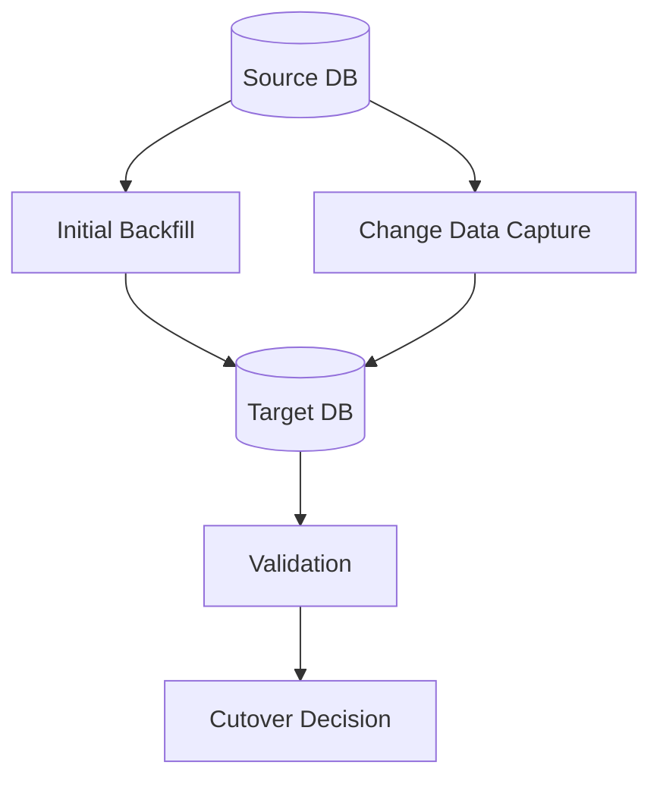

### Data Validation Types

| Validation | Purpose |
|---|---|
| Row count | Basic completeness |
| Checksums | Detect content mismatch |
| Referential checks | Detect broken relations |
| Business invariants | Validate domain correctness |
| Sample replay | Compare behavior using historical cases |
| Dual-read comparison | Compare old/new read output |
| Reconciliation report | Explain remaining differences |

### Dangerous Assumption

```txt
If the migration tool finishes successfully, the business data is correct.
```

Tool success means the process executed. It does not prove business correctness.

---

## 15. Dual-Write and Reconciliation

Dual-write is often necessary and often dangerous.

The problem:

```txt
Old system write succeeds, new system write fails.
New system write succeeds, old system write fails.
Both succeed but with different interpretation.
Retry creates duplicate.
Ordering changes final state.
```

### Safer Alternative: Outbox Pattern

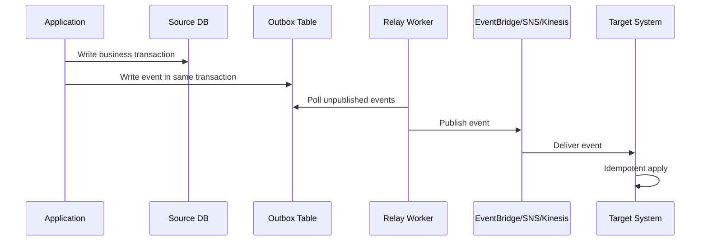

### Reconciliation Requirements

If dual-write exists, define:

- source of truth per field;
- idempotency key;
- ordering rule;
- retry policy;
- compensation process;
- reconciliation frequency;
- mismatch severity classification;
- operator runbook;
- audit trail;
- decommission condition.

---

## 16. Cutover Patterns

Cutover is the moment users or systems start relying on the migrated target.

### Cutover Pattern Matrix

| Pattern | Description | Strength | Risk |
|---|---|---|---|
| Big-bang | Switch all users at once | Simple coordination | High blast radius |
| Phased by tenant | Move selected tenants/groups | Lower blast radius | Compatibility complexity |
| Phased by capability | Route specific functions to new system | Aligns with strangler | Shared data complexity |
| Blue/green | Two environments, switch traffic | Fast rollback when stateless | Data rollback hard |
| Canary | Small traffic percentage first | Early detection | Requires good telemetry |
| Parallel run | Old and new run together | Strong validation | Expensive and complex |
| Shadow traffic | New system receives copied traffic | Safe behavior comparison | Must avoid side effects |
| Dark launch | Deploy but do not expose | Production validation | Does not prove user behavior |

### Cutover Runbook Skeleton

```mdx
## Cutover Runbook

### Preconditions
- Target environment deployed from approved artifact.
- Data backfill complete.
- CDC lag below threshold.
- Reconciliation mismatch below threshold.
- Monitoring dashboard verified.
- Rollback path tested.
- Business owner approval recorded.
- Support team staffed.

### Steps
1. Freeze non-essential changes.
2. Confirm source and target health.
3. Reduce TTL if DNS switch is used.
4. Enable maintenance banner if needed.
5. Stop or drain source writes if required.
6. Apply final CDC catch-up.
7. Run final validation.
8. Switch traffic.
9. Monitor error rate, latency, queue depth, and business metrics.
10. Declare success or execute rollback.

### Rollback Trigger
- Error rate above threshold for N minutes.
- Data mismatch above severity threshold.
- Critical workflow unavailable.
- Security control failure.
- Business owner declares unacceptable impact.

### Post-Cutover
- Keep source read-only for agreed window.
- Archive evidence.
- Update CMDB/catalog.
- Remove temporary credentials.
- Schedule decommission tasks.
```

---

## 17. Rollback vs Roll-Forward

Rollback is not always possible.

Code rollback is easy compared to data rollback.

| Change Type | Rollback Difficulty |
|---|---|
| Stateless code deploy | Usually easy |
| Config toggle | Easy if tracked |
| DNS traffic switch | Moderate due to caching/TTL |
| Database schema additive | Usually manageable |
| Database destructive change | Hard |
| Data migration with new writes | Very hard |
| External side effects | Often impossible |

### Rule

```txt
For every migration step, classify rollback as easy, hard, or impossible before execution.
```

If rollback is impossible, design roll-forward, compensation, and containment.

---

## 18. Modernization Architecture Patterns

### 18.1 Rehost + Stabilize

Use when speed is critical but you still need governance improvements.

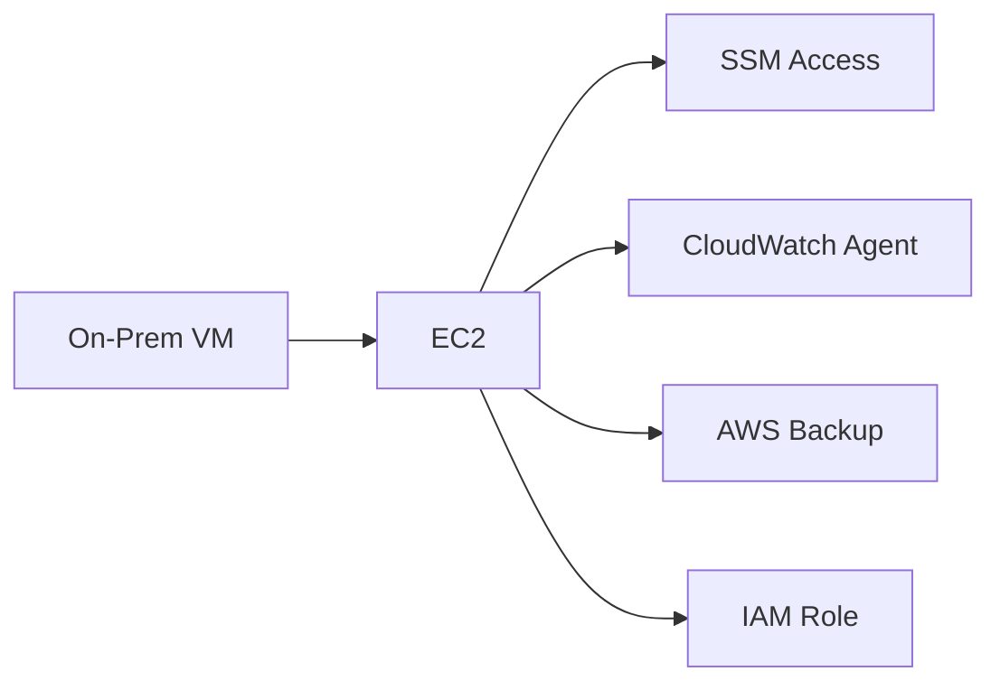

Improvements:

- replace SSH/RDP with SSM Session Manager;
- add CloudWatch logs/metrics;
- use IAM roles instead of static credentials;
- attach backup policy;
- tag resources;
- place in governed account/VPC;
- document runbook.

### 18.2 Replatform to Managed Services

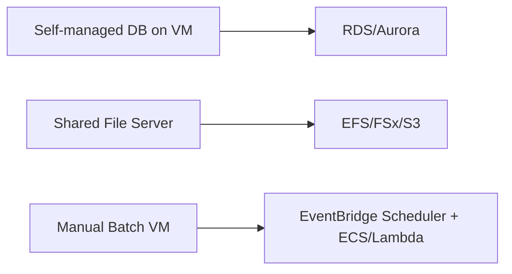

Benefits:

- reduce infrastructure toil;
- improve backup/patching posture;
- gain managed monitoring hooks;
- standardize encryption and access;
- simplify scaling in some cases.

### 18.3 Strangler to Services

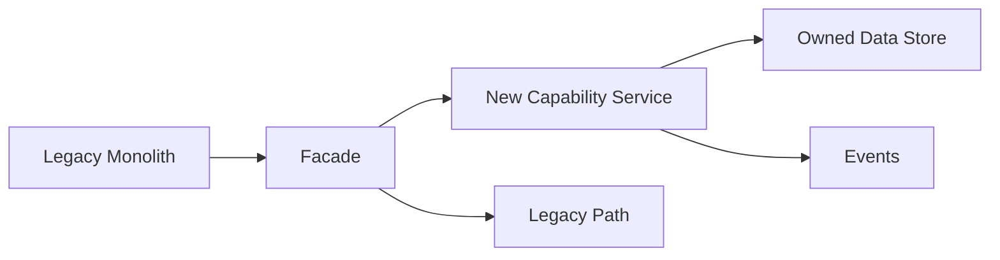

Benefits:

- incremental change;
- lower rewrite risk;
- capability ownership;
- targeted modernization.

### 18.4 Event-Driven Extraction

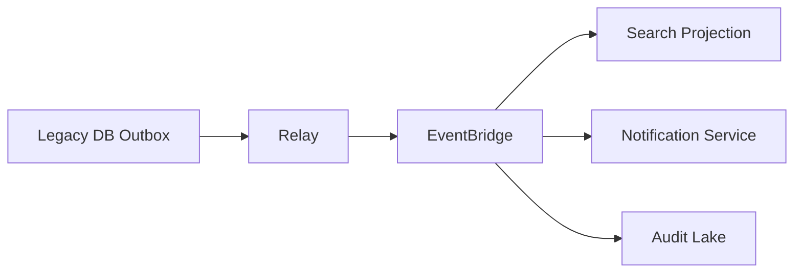

Benefits:

- decouple read models;
- introduce new consumers safely;
- build observability and audit projections;
- reduce direct database dependency.

---

## 19. Modernization of Monoliths

A monolith is not automatically bad.

A monolith becomes problematic when:

- many teams must coordinate for small changes;
- deployments are risky and infrequent;
- unrelated capabilities share state unpredictably;
- scaling one function requires scaling everything;
- ownership is unclear;
- test cycles are too slow;
- incident blast radius is too large;
- data model changes affect unrelated workflows;
- compliance evidence is hard to isolate.

### Decomposition Options

| Decomposition Axis | Good For | Risk |
|---|---|---|
| Business capability | Aligns teams and domain ownership | Requires domain clarity |
| Subdomain | Strong DDD fit | Requires modeling discipline |
| Transaction boundary | Reduces distributed transaction risk | May not align with product teams |
| User journey | Improves experience ownership | Can duplicate backend logic |
| Data ownership | Clarifies persistence boundary | Requires migration discipline |
| Operational profile | Isolate high-load components | Can fragment domain model |

### Decomposition Smell

```txt
A service exists because a class existed.
```

Microservices should not mirror legacy package structure. They should reflect durable capability boundaries.

---

## 20. Regulated Workload Modernization

For regulated systems, modernization must preserve evidence, accountability, and defensibility.

### Extra Concerns

| Concern | Requirement |
|---|---|
| Audit trail | Preserve who/what/when/why across old and new paths |
| Data lineage | Explain where migrated data came from |
| Legal retention | Do not lose or alter records under retention |
| Access control | Maintain least privilege and tenant/role boundaries |
| Evidence | Store cutover approvals, validation reports, logs |
| Reproducibility | Be able to explain migration logic later |
| Exception governance | Record deviations and approval rationale |
| Chain of custody | Protect exported/imported data |
| Privacy | Mask/tokenize data in non-prod migration tests |

### Enforcement Lifecycle Example

A regulatory enforcement platform may have:

- complaint intake;
- triage;
- investigation;
- evidence collection;
- legal review;
- enforcement decision;
- appeal;
- remediation tracking;
- reporting;
- audit trail.

Do not extract these randomly. Extract around workflow and evidence boundaries.

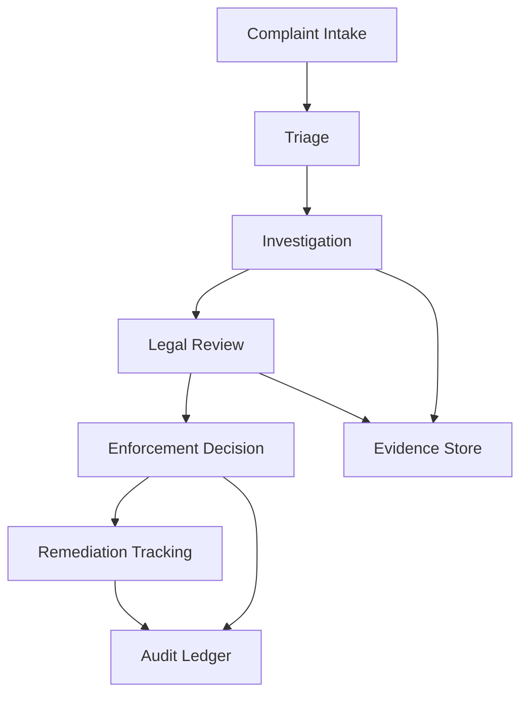

Good first extraction candidates may be:

- notification;
- document generation;
- read-only reporting;
- intake facade;
- audit projection;
- external partner adapter.

Riskier candidates:

- enforcement decision engine;
- legal hold model;
- canonical evidence store;
- identity/authorization model;
- appeal state machine.

---

## 21. Migration Tooling Landscape

AWS provides many migration-related services and patterns, but tooling must serve architecture.

| Need | Common AWS Capability |
|---|---|
| Portfolio discovery | Migration Hub, Application Discovery Service |
| Server migration | Application Migration Service |
| Database migration | Database Migration Service |
| Mainframe modernization | AWS Mainframe Modernization |
| Data transfer | DataSync, Transfer Family, Snow Family |
| VMware migration/relocation | VMware-related AWS migration options, where applicable |
| Modernization guidance | AWS Prescriptive Guidance |
| Landing zone | Organizations, Control Tower, IAM Identity Center |
| IaC deployment | CloudFormation, CDK, Terraform |

### Tooling Rule

```txt
Use tools to reduce mechanical migration effort, not to outsource architectural judgment.
```

---

## 22. Operational Readiness Review for Migration

Before go-live, answer these questions:

### Availability

- What is the expected availability target?
- Which AZs are used?
- What dependencies are single-AZ or single-instance?
- What health checks prove service readiness?

### Security

- Which IAM roles exist and why?
- Are static credentials eliminated?
- Are secrets stored in Secrets Manager/Parameter Store?
- Is encryption configured for data at rest and in transit?
- Are audit logs enabled?

### Observability

- What dashboards exist?
- Which alarms page humans?
- Are business metrics monitored?
- Are logs structured and searchable?
- Are traces/correlation IDs available for request paths?

### Operations

- Who owns the workload?
- What is the escalation path?
- What are the runbooks?
- How is production access granted and audited?
- How are patches handled?

### Data

- Is backup configured?
- Has restore been tested?
- Is data migration validated?
- Is there a reconciliation report?
- Is retention preserved?

### Cost

- Are tags applied?
- Are budgets configured?
- Is there a baseline estimate?
- Is rightsizing scheduled after stabilization?

---

## 23. Migration Failure Modes

| Failure Mode | Cause | Prevention |
|---|---|---|
| Hidden dependency breaks | Incomplete dependency discovery | Network flow analysis, logs, stakeholder review |
| Cutover fails | Runbook untested | Rehearsal, rollback test, clear thresholds |
| Data mismatch | Weak validation | Checksums, business rules, reconciliation |
| Performance regression | Target sizing wrong | Load test, scaling policy, capacity model |
| Security regression | Lifted credentials/network assumptions | IAM redesign, secrets migration, least privilege |
| Observability gap | Logs/metrics not ready | Telemetry acceptance criteria |
| Cost surprise | Overprovisioning, data transfer, NAT, idle resources | Baseline, tags, budgets, rightsizing |
| Team confusion | Ownership unclear | RACI, runbooks, escalation |
| Legacy never decommissioned | No exit criteria | Decommission backlog and deadlines |
| Shadow system divergence | Parallel old/new without reconciliation | Source-of-truth policy and reconciliation |

---

## 24. Decision Records

Every significant migration decision should leave evidence.

### ADR Template

```mdx
# ADR: <Decision Title>

## Status
Proposed | Accepted | Superseded

## Context
What is the system, constraint, business driver, and risk?

## Decision
What are we doing?

## Options Considered
- Option A
- Option B
- Option C

## Consequences
Positive and negative outcomes.

## Rollback or Exit Plan
How can this decision be reversed or retired?

## Evidence
Links to assessment, test, approval, cost estimate, runbook.
```

### Migration Decision Examples

- Why rehost instead of refactor now?
- Why choose RDS instead of self-managed DB?
- Why keep mainframe integration for Phase 1?
- Why choose tenant-by-tenant cutover?
- Why accept temporary dual-write?
- Why use S3 object store for evidence archive?
- Why defer active-active multi-region?

---

## 25. Modernization Roadmap Template

```txt
Phase 0: Foundation
- Landing zone
- Network
- IAM federation
- Logging/audit
- Cost tagging
- Deployment baseline

Phase 1: Stabilize
- Rehost/replatform low-risk workloads
- Add observability
- Remove static credentials
- Establish backup/restore
- Build runbooks

Phase 2: Decouple
- Introduce facade/routing layer
- Extract low-risk capabilities
- Add event bus/outbox
- Build read projections
- Reduce direct DB coupling

Phase 3: Own Capabilities
- Extract strategic domain services
- Assign team ownership
- Introduce SLOs
- Split data ownership
- Automate release safety

Phase 4: Optimize
- Rightsize cost
- Improve performance
- Decommission legacy paths
- Harden compliance evidence
- Mature platform self-service
```

---

## 26. Example: Modernizing a Case Management Monolith

### Starting Point

```txt
- Monolithic case management application
- Shared relational database
- Manual deployment
- Batch reporting
- Ad hoc audit table
- SFTP partner feeds
- Direct database access by reporting tools
- On-prem identity integration
```

### Target Direction

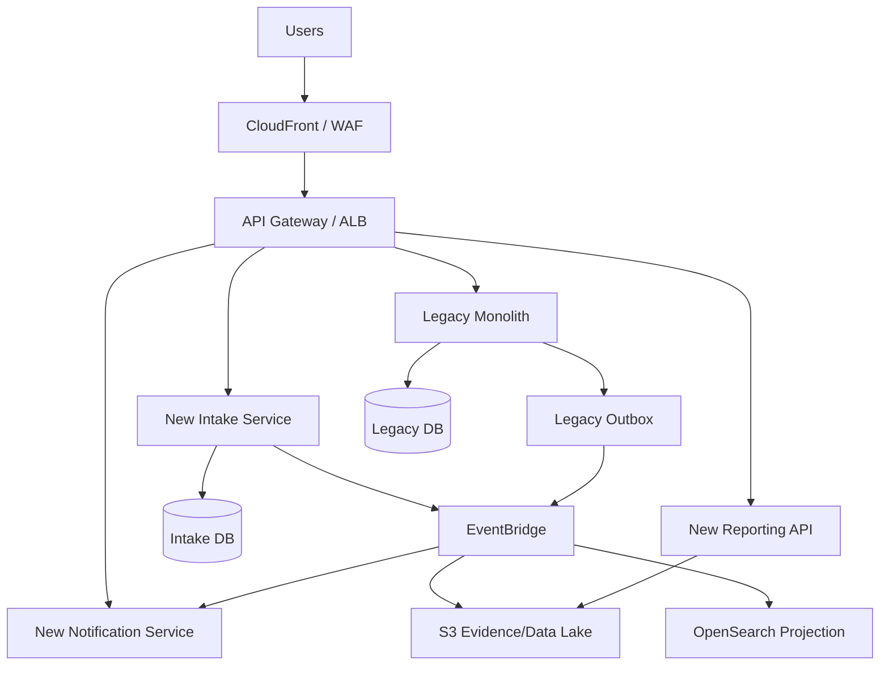

### Phased Plan

| Phase | Change | Risk Reduced |
|---|---|---|
| 1 | Move app to governed AWS account/VPC | Hosting and governance foundation |
| 2 | Add CloudWatch, CloudTrail, Config, SSM | Operability and auditability |
| 3 | Introduce API facade | Routing seam for extraction |
| 4 | Extract notification service | Low-risk capability decoupling |
| 5 | Add outbox and event stream | Reduce direct database coupling |
| 6 | Build reporting projection | Remove reporting pressure from legacy DB |
| 7 | Extract case intake | Create first strategic domain service |
| 8 | Decommission old intake path | Reduce legacy surface |

---

## 27. Modernization Metrics

Use metrics that reveal real improvement.

| Dimension | Metric |
|---|---|
| Delivery | Deployment frequency, lead time, rollback time |
| Reliability | Incident count, MTTR, error budget burn |
| Operations | Manual steps per release, toil hours, patch compliance |
| Security | Static credential count, critical findings, access exceptions |
| Cost | Unit cost per transaction/case/tenant, idle resource spend |
| Performance | p95/p99 latency, saturation, queue lag |
| Data | Reconciliation mismatch rate, CDC lag, restore success |
| Business | Case cycle time, complaint intake completion rate |

### Bad Metrics

| Metric | Problem |
|---|---|
| Number of servers migrated | Says nothing about business value |
| Number of microservices created | May reward fragmentation |
| Percent cloud migrated | May include waste |
| Lines of code rewritten | Not a value metric |
| Kubernetes adoption | Platform choice, not modernization outcome |

---

## 28. Common Anti-Patterns

### Anti-Pattern 1: Big-Bang Rewrite

Symptoms:

- multi-year rewrite;
- old system frozen in theory but changing in practice;
- feature parity target keeps moving;
- no production feedback until late;
- migration team detached from business users.

Better:

- strangler extraction;
- capability-by-capability replacement;
- parallel run for high-risk functions;
- production validation early.

### Anti-Pattern 2: Lift-and-Shift Forever

Symptoms:

- EC2 estate looks like old data center;
- static credentials moved unchanged;
- manual patching persists;
- no IaC;
- no cost allocation;
- no observability improvement.

Better:

- rehost only as a phase;
- set stabilization backlog;
- define modernization triggers.

### Anti-Pattern 3: Microservices Without Ownership

Symptoms:

- many services owned by same overloaded team;
- shared database persists;
- no independent deployment;
- cross-service changes require coordination;
- observability poor.

Better:

- align services to teams and capabilities;
- split data ownership intentionally;
- enforce service contracts.

### Anti-Pattern 4: Data Migration as Afterthought

Symptoms:

- application plan exists, data plan vague;
- rollback undefined;
- validation limited to row counts;
- downstream consumers ignored.

Better:

- plan data first;
- define source of truth;
- validate business invariants;
- rehearse cutover.

### Anti-Pattern 5: Temporary Becomes Permanent

Symptoms:

- temporary VPN never retired;
- dual-write continues indefinitely;
- legacy database read access remains;
- exception roles persist;
- migration accounts become production accounts.

Better:

- every temporary state has owner and expiry;
- track decommissioning as first-class work;
- audit exceptions.

---

## 29. Deliberate Practice

### Exercise 1: Classify a Portfolio

Create a table of 15 workloads and assign a 7R strategy to each. Include rationale.

Required columns:

```txt
Application | Owner | Criticality | Dependencies | Data Class | Pain | Recommended 7R | Rationale | Risk
```

### Exercise 2: Design a Strangler Plan

Choose one monolith capability and design:

- seam;
- routing mechanism;
- new service boundary;
- data ownership;
- event model;
- rollback plan;
- decommission criteria.

### Exercise 3: Data Migration Plan

For a relational database migration, write:

- source/target engines;
- backfill plan;
- CDC plan;
- validation plan;
- cutover threshold;
- rollback/roll-forward plan.

### Exercise 4: Cutover Runbook

Write a cutover runbook with:

- preconditions;
- exact steps;
- owners;
- timing;
- monitoring;
- rollback trigger;
- post-cutover cleanup.

---

## 30. Self-Correction Checklist

You understand this part when you can answer:

- What is the difference between migration and modernization?
- Why is the 7R strategy not just a checklist?
- Which workloads should not be modernized?
- What is a migration wave and how should it be sequenced?
- What must exist in a landing zone before migration?
- What is a seam in a legacy system?
- How does strangler fig reduce rewrite risk?
- What is an anti-corruption layer and why does it matter?
- Why is dual-write dangerous?
- How do you validate migrated data beyond row counts?
- When is rollback impossible?
- What evidence should a regulated migration preserve?
- Which metrics prove modernization success?

---

## 31. Engineering Judgment Summary

Migration and modernization are not about moving everything fast or rewriting everything perfectly.

The senior engineering posture is:

```txt
Move what should be moved.
Retire what should not exist.
Modernize where change creates durable value.
Use strangler patterns to reduce risk.
Treat data migration as a correctness problem.
Treat cutover as an incident waiting to happen.
Preserve evidence for every important decision.
```

The best modernization programs are boring in execution because the risk was made visible before production changed.

---

## References

- AWS Prescriptive Guidance — About the migration strategies: https://docs.aws.amazon.com/prescriptive-guidance/latest/large-migration-guide/migration-strategies.html
- AWS Prescriptive Guidance — Strangler fig pattern: https://docs.aws.amazon.com/prescriptive-guidance/latest/cloud-design-patterns/strangler-fig.html
- AWS Prescriptive Guidance — Modernization decomposing monoliths, strangler fig: https://docs.aws.amazon.com/prescriptive-guidance/latest/modernization-decomposing-monoliths/strangler-fig.html
- AWS Prescriptive Guidance — Application portfolio assessment, prioritization and migration strategy: https://docs.aws.amazon.com/prescriptive-guidance/latest/application-portfolio-assessment-guide/prioritization-and-migration-strategy.html
- AWS Prescriptive Guidance — Migration readiness glossary / AWS CAF perspectives: https://docs.aws.amazon.com/prescriptive-guidance/latest/migration-readiness/apg-gloss.html
