------
title: Learn AWS Engineering Mastery - Part 032
description: Enterprise SaaS and multi-tenant architecture on AWS through tenant isolation, pooled/siloed/bridge models, tenant lifecycle, entitlement, metering, noisy-neighbor control, and cell-based architecture.
series: learn-aws
seriesTitle: Learn AWS Engineering Mastery
order: 32
partTitle: Enterprise SaaS, Multitenancy, and Cell-Based Architecture
tags:
- aws
- cloud
- architecture
- saas
- multitenancy
- tenant-isolation
- cell-based-architecture
- platform-engineering
date: 2026-07-01
---

# Learn AWS Engineering Mastery - Part 032

## Enterprise SaaS, Multitenancy, and Cell-Based Architecture

SaaS architecture is not just “one application used by many customers.”

A serious SaaS platform must solve tenant identity, tenant isolation, provisioning, entitlement, metering, billing, observability, deployment, noisy-neighbor control, compliance evidence, lifecycle management, and failure containment.

A senior AWS engineer does not begin with:

```txt
Should we put all tenants in one database or separate databases?
```

The better question is:

```txt
What tenant boundary must be enforced for security, operations, performance, cost, compliance, and product experience?
```

This part teaches how to design SaaS and multi-tenant systems on AWS using tenant isolation, pooled/siloed/bridge deployment models, and cell-based architecture.

---

## 1. Target Skill

After this part, you should be able to:

- define tenant, tenant context, tenant isolation, tenant partitioning, tenant lifecycle, and tenant control plane;
- distinguish silo, pool, and bridge SaaS deployment models;
- design tenant isolation at identity, API, compute, data, network, observability, and operations layers;
- choose when to use shared resources, dedicated resources, account-per-tenant, or cell-based segmentation;
- prevent cross-tenant data leakage and noisy-neighbor effects;
- design tenant onboarding, offboarding, suspension, entitlement, metering, and audit workflows;
- reason about multi-tenant cost allocation and unit economics;
- design cell-based architecture to limit blast radius;
- explain trade-offs for regulated enterprise SaaS on AWS.

---

## 2. Kaufman Skill Decomposition

SaaS architecture decomposes into the following sub-skills:

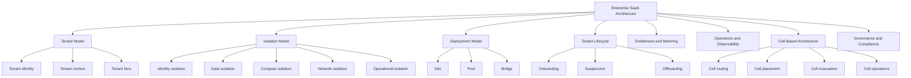

### First 20 Hours Focus

| Timebox | Focus | Practice Output |
|---:|---|---|
| 2h | SaaS vocabulary | Define tenant, isolation, partitioning, tier, cell |
| 3h | Isolation model | Draw isolation layers for one SaaS workload |
| 3h | Silo/pool/bridge trade-off | Select model for 5 tenant types |
| 3h | Tenant lifecycle | Design onboarding/offboarding workflows |
| 3h | Noisy-neighbor control | Define quotas, throttles, and metrics |
| 3h | Cell-based architecture | Design cell routing and blast-radius boundary |
| 3h | Regulated SaaS review | Create evidence and audit checklist |

---

## 3. Core Mental Model

SaaS is a control-plane problem and a data-plane problem.

```txt
The SaaS control plane manages tenants.
The SaaS data plane serves tenant workload traffic.
```

### Control Plane Responsibilities

- tenant registration;
- tenant identity linkage;
- provisioning;
- plan/tier assignment;
- entitlement configuration;
- billing and metering;
- tenant suspension/reactivation;
- tenant placement into cells/environments;
- tenant configuration;
- audit and lifecycle evidence;
- admin operations;
- tenant-aware support tooling.

### Data Plane Responsibilities

- serve user/API traffic;
- enforce tenant context;
- isolate tenant data;
- apply entitlement decisions;
- emit tenant-tagged telemetry;
- enforce quotas/throttles;
- protect against noisy neighbors;
- preserve tenant-level audit events.

### Diagram

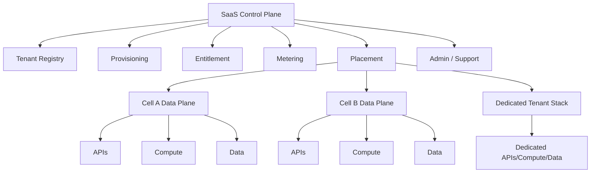

### Key Rule

```txt
A multi-tenant application without a tenant control plane eventually becomes operationally unmanageable.
```

---

## 4. Tenant Vocabulary

| Term | Meaning |
|---|---|
| Tenant | A customer, organization, business unit, or logical consumer of the SaaS system |
| Tenant user | A human or machine principal associated with a tenant |
| Tenant context | The tenant identity attached to a request, event, job, or data object |
| Tenant isolation | Controls that prevent one tenant from accessing or impacting another tenant improperly |
| Tenant partitioning | The storage or placement model used to organize tenant data/resources |
| Tenant tier | Commercial/operational class such as Free, Standard, Enterprise, Regulated |
| Tenant lifecycle | Onboarding, activation, configuration, suspension, deletion/offboarding |
| Tenant entitlement | What a tenant is allowed to use |
| Tenant metering | Measurement of tenant usage for cost, billing, quota, or abuse detection |
| Tenant cell | Isolated workload slice serving a subset of tenants |

### Tenant Context Invariant

Every request, event, job, log, metric, trace, audit record, object, row, and support action must answer:

```txt
Which tenant is this for?
```

If tenant context is missing, the system cannot reliably enforce isolation, troubleshoot tenant impact, allocate cost, or prove audit boundaries.

---

## 5. Silo, Pool, and Bridge Models

AWS SaaS Lens describes common SaaS architectural models as silo, pool, and bridge.

### 5.1 Silo Model

A tenant gets dedicated resources.

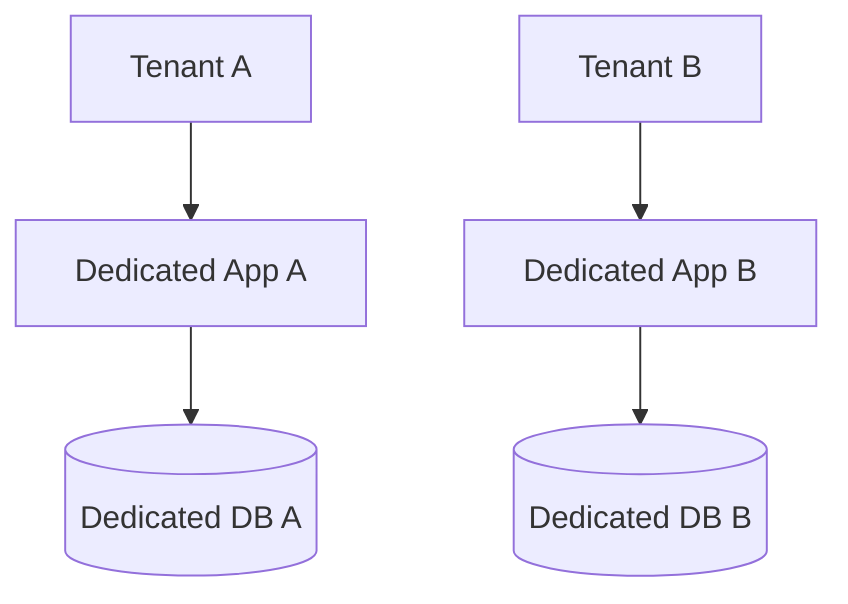

#### Strengths

- strong isolation;
- easier tenant-specific compliance;
- simpler noisy-neighbor containment;
- tenant-specific maintenance windows possible;
- simpler per-tenant restore in many designs;
- clearer cost allocation.

#### Weaknesses

- higher cost;
- more operational overhead;
- harder fleet management;
- slower tenant onboarding unless automated;
- version drift risk;
- inefficient utilization.

#### Use When

- enterprise tenant requires dedicated deployment;
- compliance requires stronger physical/logical separation;
- tenant workload is large enough to justify dedicated capacity;
- custom maintenance or data residency is required;
- tenant contract demands strong isolation.

### 5.2 Pool Model

Multiple tenants share resources.

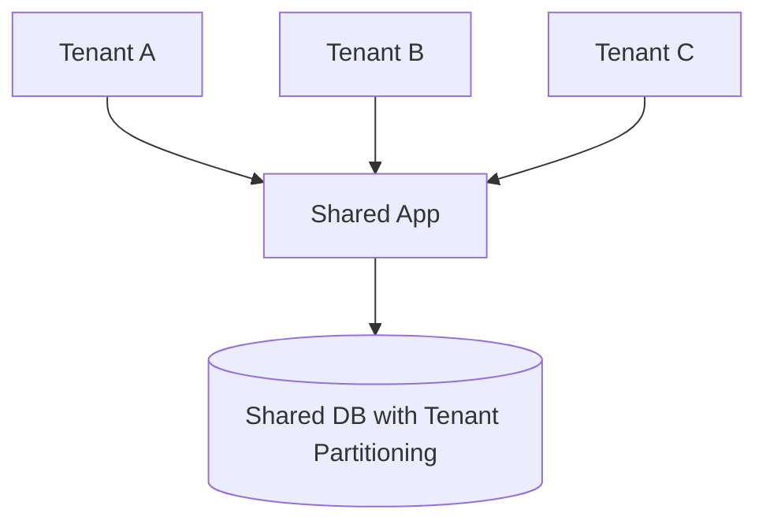

#### Strengths

- cost efficiency;
- high utilization;
- simpler global deployment;
- faster onboarding;
- easier feature rollout;
- less infrastructure sprawl.

#### Weaknesses

- isolation must be enforced in software/policy;
- noisy-neighbor risk;
- more complex tenant-aware observability;
- per-tenant restore/export/deletion is harder;
- compliance evidence requires stronger controls;
- blast radius can be larger.

#### Use When

- tenants are small/medium;
- cost efficiency matters;
- product experience is standardized;
- tenant-specific customization is limited;
- compliance allows logical isolation.

### 5.3 Bridge Model

Some layers are pooled and others are siloed.

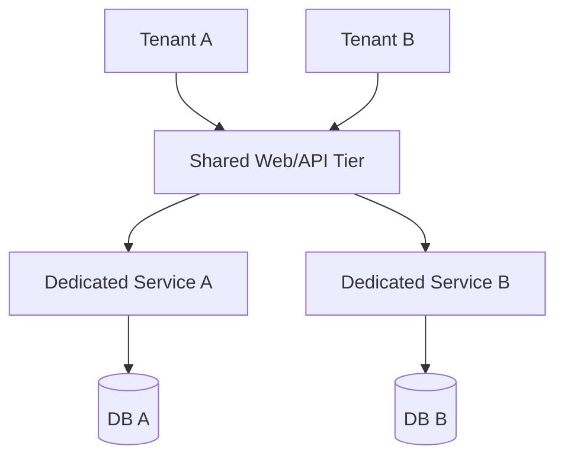

#### Strengths

- balances cost and isolation;
- supports tier-based offerings;
- allows dedicated data with shared edge/control plane;
- practical for regulated enterprise SaaS.

#### Weaknesses

- operational complexity;
- multiple deployment patterns;
- entitlement and routing complexity;
- requires strong automation.

#### Use When

- some tenants require dedicated resources;
- most tenants can share pooled infrastructure;
- certain data classes need stronger isolation;
- enterprise tiers differ meaningfully.

---

## 6. Tenant Isolation vs Data Partitioning

Tenant isolation and data partitioning are related but not the same.

```txt
Partitioning decides where tenant data is stored.
Isolation ensures one tenant cannot access another tenant's data or resources.
```

A shared table with `tenant_id` is partitioning. It is not sufficient isolation unless every access path enforces tenant constraints.

### Isolation Layers

| Layer | Isolation Mechanism |
|---|---|
| Identity | Tenant claims in token, tenant-bound roles, federation mapping |
| API | Authorizer validates tenant context and entitlement |
| Application | Tenant-aware service logic and invariant checks |
| Data | Row/item/object partitioning, separate schema, separate DB, separate account |
| Compute | Shared worker pool, per-tenant workers, per-cell services |
| Network | Security groups, VPC segmentation, PrivateLink, account boundary |
| Operations | Tenant-scoped admin tools and support authorization |
| Observability | Tenant-tagged logs/metrics/traces without data leakage |
| Cost | Tenant allocation tags, metering, usage reports |
| Compliance | Audit evidence, retention, access review |

### Isolation Failure Example

```txt
API validates tenant_id on normal user requests.
Background job queries all rows without tenant filter.
Support tool allows operator to search by case number globally.
Export job writes multiple tenants into same file.
Logs contain cross-tenant payload data.
```

Isolation must be system-wide, not endpoint-specific.

---

## 7. Tenant Identity and Context Propagation

Tenant context usually starts at identity.

### Request Path

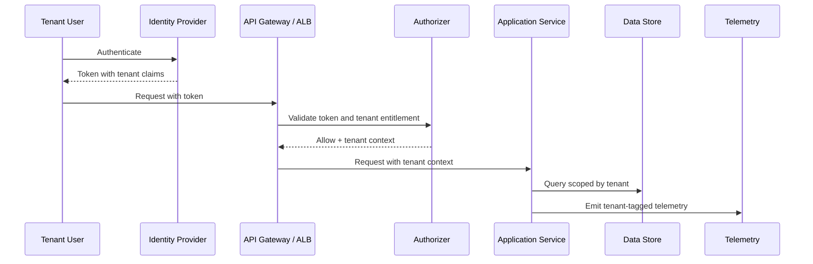

### Tenant Claims

A token may include:

```json
{
  "sub": "user-123",
  "tenant_id": "tenant-abc",
  "tenant_tier": "enterprise",
  "roles": ["case_manager", "reviewer"],
  "entitlements": ["case.write", "evidence.read"]
}
```

### Rules

- Do not trust tenant IDs supplied only in request body.
- Bind tenant context to authenticated identity or machine identity.
- Validate that requested tenant equals authorized tenant.
- For cross-tenant admin, require explicit elevated workflow and audit.
- Propagate tenant context to async events and background jobs.
- Reject work items that lack tenant context unless explicitly system-scoped.

---

## 8. Tenant-Aware Data Models

### 8.1 Shared Table

```sql
CREATE TABLE cases (
  tenant_id varchar(64) NOT NULL,
  case_id varchar(64) NOT NULL,
  status varchar(32) NOT NULL,
  created_at timestamp NOT NULL,
  PRIMARY KEY (tenant_id, case_id)
);
```

#### Strengths

- simple pooled model;
- efficient for many small tenants;
- easier global schema rollout;
- good utilization.

#### Risks

- every query must include tenant predicate;
- accidental cross-tenant scans;
- hard per-tenant restore;
- noisy tenant can affect shared DB;
- data deletion/export requires discipline.

### 8.2 Schema-per-Tenant

```txt
DB cluster
├── tenant_a_schema
├── tenant_b_schema
└── tenant_c_schema
```

#### Strengths

- stronger logical separation;
- easier per-tenant export in some cases;
- familiar relational model.

#### Risks

- schema migration fanout;
- connection pool complexity;
- many schema operational overhead;
- risk of version drift.

### 8.3 Database-per-Tenant

```txt
Tenant A -> DB A
Tenant B -> DB B
Tenant C -> DB C
```

#### Strengths

- strong isolation;
- easier per-tenant backup/restore;
- clearer noisy-neighbor boundary;
- clearer cost allocation.

#### Risks

- expensive for many small tenants;
- provisioning complexity;
- fleet patching and upgrades;
- connection management;
- cross-tenant analytics harder.

### 8.4 Account-per-Tenant

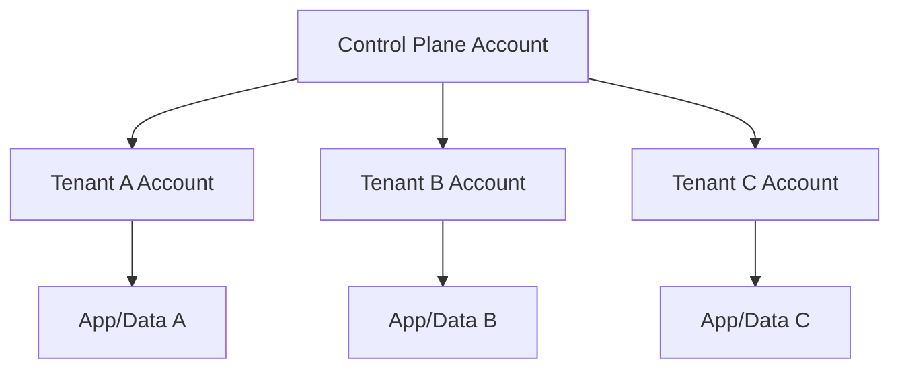

#### Strengths

- strongest AWS account-level isolation;
- SCP/CloudTrail/Config/account boundary per tenant;
- strong compliance story;
- easier tenant-specific networking.

#### Risks

- AWS account quota/management complexity;
- slower onboarding without account vending automation;
- cross-account operations complexity;
- higher platform engineering burden.

---

## 9. DynamoDB Multi-Tenant Modeling

DynamoDB is common for SaaS because partitioning can be explicit and high-scale, but tenant isolation must still be designed carefully.

### Basic Pooled Key Pattern

```txt
PK = TENANT#<tenantId>
SK = CASE#<caseId>
```

Example:

```json
{
  "PK": "TENANT#t-123",
  "SK": "CASE#c-456",
  "status": "PENDING_REVIEW",
  "createdAt": "2026-07-01T10:00:00Z"
}
```

### Better for High-Volume Tenants

```txt
PK = TENANT#<tenantId>#BUCKET#<bucketId>
SK = CASE#<caseId>
```

This can avoid a single tenant concentrating too much traffic into one partition key design.

### Isolation Concerns

| Concern | Mitigation |
|---|---|
| Missing tenant key | Use repository/access layer that requires tenant context |
| Cross-tenant GSI query | Include tenant in GSI partition key where needed |
| Hot tenant | Shard/bucket tenant keys, throttle, or isolate tenant |
| Tenant export | Build tenant-scoped export workflow |
| Tenant deletion | Track all tenant item collections and asynchronous purge |
| Audit | Emit tenant ID for all write events |

---

## 10. S3 Multi-Tenant Modeling

S3 can support pooled or siloed tenant storage.

### Pooled Bucket Prefix Model

```txt
s3://case-platform-evidence/tenant=t-123/case=c-456/document=d-789.pdf
```

### Dedicated Bucket Model

```txt
s3://tenant-t-123-evidence/case=c-456/document=d-789.pdf
```

### Comparison

| Model | Strength | Risk |
|---|---|---|
| Shared bucket, tenant prefix | Cost-efficient, manageable for many tenants | IAM/policy complexity, accidental broad access |
| Bucket per tenant | Stronger boundary, easier lifecycle/replication customization | Bucket count/operations/policy scale |
| Account per tenant with buckets | Strong isolation and compliance | More platform automation required |

### S3 Tenant Isolation Controls

- bucket policy;
- IAM policy with tenant-scoped prefixes;
- session tags / ABAC;
- KMS key strategy;
- object tags;
- access points;
- signed URLs with tenant validation;
- CloudTrail data events for sensitive buckets;
- Macie for sensitive data discovery where appropriate.

---

## 11. Tenant Lifecycle

A SaaS system must manage tenants as first-class entities.

### Lifecycle States

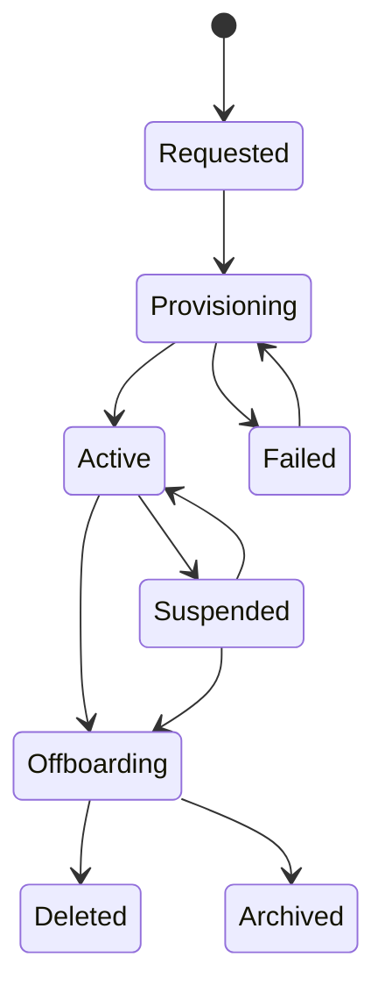

### Lifecycle Operations

| Operation | Required Actions |
|---|---|
| Onboard | Create tenant record, assign tier, provision resources, configure identity, seed defaults |
| Activate | Enable access, verify health, emit audit event |
| Update tier | Change entitlement, quota, routing, capacity, billing plan |
| Suspend | Block access, preserve data, stop billing or change status, audit action |
| Reactivate | Restore access and quotas safely |
| Offboard | Export data, enforce retention, revoke access, delete or archive resources |
| Delete | Purge data where legally allowed, retain required audit evidence |

### Tenant Registry Example

```json
{
  "tenantId": "t-123",
  "name": "Acme Regulation Group",
  "tier": "regulated-enterprise",
  "status": "ACTIVE",
  "cellId": "cell-02",
  "isolationModel": "BRIDGE",
  "dataRegion": "ap-southeast-3",
  "kmsKeyRef": "alias/tenant-t-123",
  "createdAt": "2026-07-01T09:00:00Z"
}
```

---

## 12. Tenant Provisioning Architecture

Tenant provisioning should be automated and idempotent.

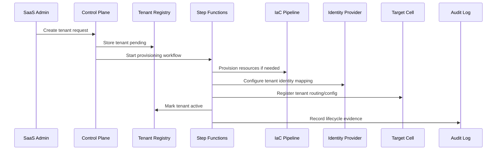

### Provisioning Invariants

- safe to retry;
- every step auditable;
- partial failure recoverable;
- resource names deterministic;
- tenant ID immutable;
- no tenant traffic before activation;
- failure state visible to operators;
- cleanup path exists.

---

## 13. Entitlement and Authorization

Authorization answers:

```txt
Who can do this?
```

Entitlement answers:

```txt
Is this tenant allowed to use this product capability at all?
```

### Example

A user may have role `case_manager`, but their tenant may not have the `advanced_evidence_analytics` entitlement.

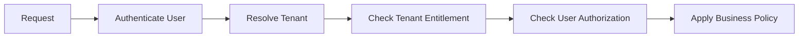

### Entitlement Types

| Type | Example |
|---|---|
| Feature | Evidence analytics enabled |
| Capacity | Max 10,000 active cases |
| Rate | 100 API calls/sec |
| Region | Data must stay in ap-southeast-3 |
| Integration | SFTP partner export enabled |
| Compliance | Legal hold feature enabled |
| Support | Dedicated support SLA |

### Common Mistake

```txt
Putting tenant entitlements only in frontend feature flags.
```

Entitlements must be enforced server-side.

---

## 14. Metering and Unit Economics

SaaS without metering is financially blind.

### Metering Events

```json
{
  "tenantId": "t-123",
  "eventType": "CASE_CREATED",
  "quantity": 1,
  "timestamp": "2026-07-01T10:00:00Z",
  "source": "case-service",
  "idempotencyKey": "case-created:c-456"
}
```

### What to Meter

| Dimension | Example |
|---|---|
| API usage | Requests per tenant |
| Storage | GB per tenant, object count |
| Compute | Jobs executed, function invocations |
| Workflow | Cases opened/closed |
| Data transfer | Export volume |
| Search | Indexed documents, queries |
| AI usage | Tokens, model calls, embeddings |
| Support | Admin operations, SLA tier |

### Uses of Metering

- billing;
- cost allocation;
- quota enforcement;
- abuse detection;
- capacity planning;
- tenant profitability;
- tier design;
- sustainability optimization.

### Metering Pipeline

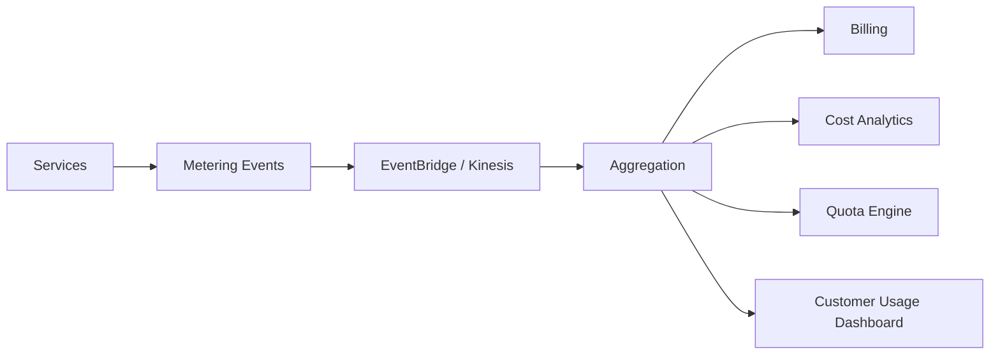

---

## 15. Noisy-Neighbor Control

A noisy neighbor is a tenant whose usage degrades other tenants.

### Noisy-Neighbor Sources

| Source | Example |
|---|---|
| API traffic | Tenant floods API endpoints |
| Database | Tenant causes hot partition or heavy queries |
| Queue | Tenant fills shared queue backlog |
| Storage | Tenant uploads many large objects |
| Search | Tenant runs expensive queries |
| Batch | Tenant jobs consume worker pool |
| Reporting | Tenant scans large history repeatedly |
| AI inference | Tenant consumes expensive model quota |

### Controls

| Control | AWS/Architecture Mechanism |
|---|---|
| Rate limit | API Gateway usage plans/throttling, WAF rate rules, app quota |
| Queue isolation | Per-tenant queue or priority queue |
| Worker isolation | Per-tier worker pools, reserved concurrency |
| DB isolation | Tenant partitioning, read replicas, dedicated DB for large tenant |
| Cache isolation | tenant-aware keys, eviction strategy, separate cluster for large tenants |
| Search isolation | per-tenant index or routing key for high-volume tenants |
| Cell isolation | place groups of tenants into separate cells |
| Tiering | stronger limits for lower tiers, dedicated capacity for enterprise |

### Tenant-Level SLO

Global SLOs can hide tenant pain.

```txt
Overall p95 latency: 180ms
Tenant A p95 latency: 120ms
Tenant B p95 latency: 4.8s
```

A SaaS platform must support tenant-level observability.

---

## 16. Tenant-Aware Observability

Telemetry must include tenant context while protecting sensitive data.

### Required Dimensions

| Signal | Tenant Attributes |
|---|---|
| Metrics | tenant_id or tenant_tier for aggregated metrics, carefully controlled cardinality |
| Logs | tenant_id, request_id, user_id/sub, operation, outcome |
| Traces | tenant_id as attribute/baggage where safe |
| Audit | tenant_id, actor, action, resource, decision, timestamp |
| Cost | tenant_id/tier/cell where available |

### Cardinality Warning

Putting raw `tenant_id` on high-cardinality metrics may become expensive or operationally difficult. Use:

- tenant tier metrics;
- top-N tenant dashboards;
- per-tenant logs/traces;
- sampled tenant-level metrics;
- dedicated metrics for enterprise tenants;
- aggregate + drill-down strategy.

### Tenant Dashboard

A useful tenant dashboard includes:

- request rate;
- error rate;
- p95/p99 latency;
- throttling count;
- queue backlog;
- workflow completion time;
- storage usage;
- quota usage;
- recent incidents;
- entitlement status;
- deployment version/cell.

---

## 17. Cell-Based Architecture

AWS Well-Architected guidance describes cell-based architecture as multiple isolated instances of a workload, where each cell handles a subset of requests and does not share state with other cells.

The goal is to reduce blast radius.

### Basic Cell Model

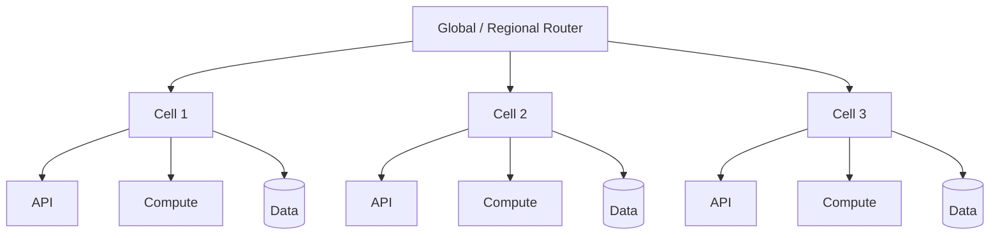

### Cell Properties

A proper cell:

- serves a bounded set of tenants or workload partitions;
- has independent data state;
- can fail without failing all tenants;
- can be deployed/upgraded independently or progressively;
- has cell-level observability;
- has routing/placement control;
- has capacity boundaries;
- has operational runbooks;
- avoids shared critical dependencies where possible.

### What Is Not a Cell

| Not a Cell | Why |
|---|---|
| Multiple pods in one Kubernetes cluster sharing one DB | Shared blast radius persists |
| Multiple ECS services sharing same global database | Data dependency can fail all tenants |
| Multiple AZs in one app tier with one overloaded dependency | Failure not contained by workload subset |
| Shards with no operational isolation | Sharding alone is not cell-based architecture |

---

## 18. Cell Router and Placement

Cell architecture needs a routing and placement mechanism.

### Tenant Placement Record

```json
{
  "tenantId": "t-123",
  "cellId": "cell-apac-02",
  "region": "ap-southeast-3",
  "tier": "enterprise",
  "status": "ACTIVE"
}
```

### Routing Flow

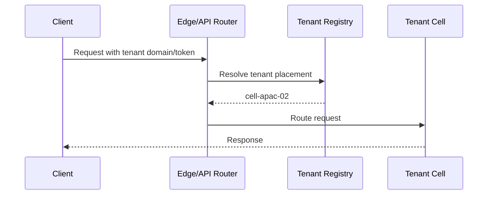

### Routing Options

| Option | Use When | Concern |
|---|---|---|
| Tenant subdomain | `tenant.example.com` maps to cell | DNS/cache complexity |
| Token claim | Tenant ID in JWT resolves to cell | Router must validate token |
| API key | Machine integrations | Key lifecycle/security |
| Header from trusted gateway | Internal routing | Must prevent spoofing |
| Control-plane lookup | Dynamic placement | Latency/cache/fallback |

### Placement Strategy

| Strategy | Description |
|---|---|
| Hash-based | Tenant mapped by hash to cell |
| Capacity-aware | Place tenant where capacity exists |
| Tier-based | Enterprise tenants placed in stronger cells |
| Geography-based | Place tenant based on data residency/latency |
| Compliance-based | Regulated tenants placed in compliant cells |
| Dedicated | Large tenant gets own cell or stack |

---

## 19. Cell Blast Radius

Cell design is about limiting impact.

### Blast Radius Questions

- How many tenants can one bad deployment affect?
- How many tenants can one database failure affect?
- How many tenants can one queue backlog affect?
- How many tenants can one noisy tenant affect?
- How many tenants can one IAM mistake affect?
- How many tenants can one regional issue affect?
- How many tenants can one operator action affect?

### Cell Size Trade-Off

| Smaller Cells | Larger Cells |
|---|---|
| Lower blast radius | Better utilization |
| More operational overhead | Fewer deployments/resources |
| More routing complexity | Simpler management |
| Easier tenant evacuation per group | Larger failure impact |
| More expensive | More cost-efficient |

### Rule

```txt
A cell is valuable only if its failure is meaningfully contained.
```

If every cell depends on the same write-critical global database, the cell boundary is weak.

---

## 20. Cell-Based SaaS on AWS

### Example Architecture

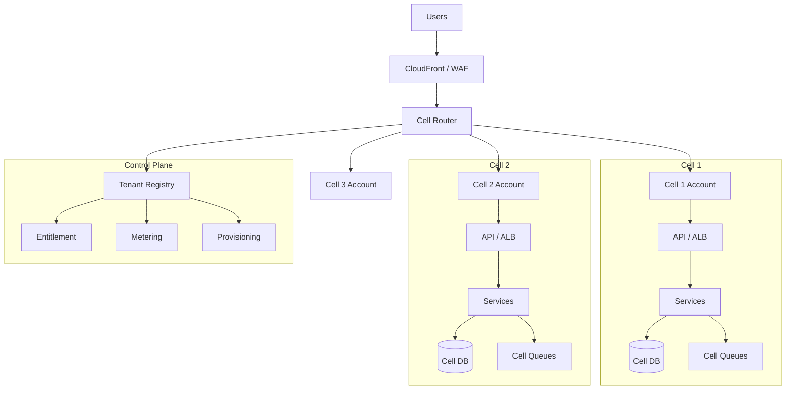

### Account Strategy Options

| Model | Strength | Risk |
|---|---|---|
| All cells in one account | Simple early-stage | Weak account blast-radius boundary |
| Account per environment, cells inside | Moderate isolation | Shared account quota/policy risk |
| Account per cell | Stronger isolation and quota boundary | More automation needed |
| Account per large tenant | Strongest tenant boundary | Highest operational complexity |

---

## 21. Shared Services in Cell Architecture

Cells often need shared services, but shared services can become shared failure domains.

### Shared Service Examples

- identity provider;
- tenant registry;
- entitlement service;
- billing/metering pipeline;
- observability platform;
- deployment pipeline;
- support/admin tooling;
- artifact registry;
- public edge/router;
- audit lake.

### Classification

| Shared Service Type | Failure Impact | Design Guidance |
|---|---|---|
| Read-mostly config | Can be cached | Cache locally in cell |
| Write-critical registry | Can block onboarding/routing | Replicate or degrade gracefully |
| Runtime authorization | Can affect all requests | Cache entitlements, fail closed/open by policy |
| Observability | Should not break serving path | Async telemetry, backpressure protection |
| Billing | Should not block core user action | Async metering with replay |
| Identity | High impact | Token validation cache, defined outage behavior |

### Rule

```txt
A shared service must not silently erase the blast-radius benefit of cells.
```

---

## 22. Tenant Evacuation and Cell Rebalancing

A mature cell architecture may need to move tenants between cells.

Reasons:

- noisy tenant isolation;
- cell capacity pressure;
- compliance/data residency change;
- cell maintenance;
- disaster recovery;
- enterprise tenant upgrade;
- shard/cell imbalance.

### Tenant Evacuation Steps

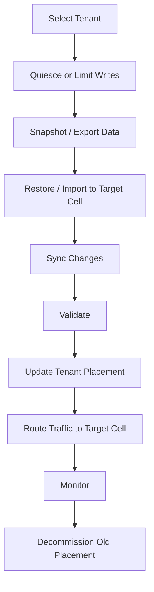

### Evacuation Requirements

- tenant-scoped data ownership;
- consistent export/import;
- idempotent provisioning;
- placement registry update;
- routing cache invalidation;
- reconciliation report;
- rollback/roll-forward plan;
- tenant communication plan;
- audit evidence.

---

## 23. Multi-Tenant Security Failure Modes

| Failure Mode | Example | Prevention |
|---|---|---|
| Tenant context spoofing | User passes another tenant ID in body | Derive tenant from trusted identity/token |
| Missing tenant filter | Query returns all tenant rows | Repository guardrails, tests, DB policies where available |
| Cross-tenant cache leak | Cache key lacks tenant ID | Tenant-aware cache keys |
| Shared S3 prefix leak | Policy allows broad prefix access | IAM conditions, access points, tests |
| Admin overreach | Support user sees all tenants unnecessarily | Tenant-scoped support tooling and just-in-time access |
| Log leakage | Logs contain another tenant's PII | Redaction and structured logging policy |
| Async job leak | Worker processes wrong tenant data | Tenant context in event envelope |
| Metrics leak | Customer dashboard exposes another tenant stats | Dashboard access control and aggregation |
| Backup restore mistake | Restore tenant A over tenant B | Tenant-scoped restore runbooks and validation |

### Tenant-Aware Cache Key

Bad:

```txt
case:123
```

Good:

```txt
tenant:t-123:case:123
```

---

## 24. Multi-Tenant Testing

SaaS systems require isolation tests.

### Test Categories

| Test | Purpose |
|---|---|
| Cross-tenant access test | Ensure tenant A cannot read/write tenant B |
| Tenant context missing test | Ensure request/event without tenant is rejected |
| Entitlement test | Ensure disabled feature cannot be invoked |
| Noisy-neighbor test | Ensure tenant A load does not break tenant B |
| Tenant deletion test | Ensure data purge/export behavior works |
| Admin access test | Ensure support tools are tenant-scoped |
| Migration test | Ensure tenant movement between cells works |
| Restore test | Ensure tenant-level restore does not affect others |
| Observability test | Ensure tenant telemetry exists without data leakage |

### Example Isolation Test Cases

```txt
1. User from tenant A requests /tenants/B/cases/123 -> denied.
2. User from tenant A requests /cases/123 where case belongs to B -> denied or not found.
3. Worker receives event with tenant_id missing -> dead-letter or reject.
4. Cache lookup for tenant A cannot return tenant B object.
5. Support operator without tenant grant cannot view tenant data.
6. Tenant A export contains no tenant B records.
7. Tenant B high load does not violate tenant A SLO.
```

---

## 25. Regulated Enterprise SaaS

Regulated enterprise SaaS often needs stronger boundaries.

### Typical Requirements

- tenant-specific data residency;
- legal hold and retention;
- customer-managed keys or dedicated keys;
- tenant-specific audit export;
- dedicated support access approval;
- stricter isolation for evidence data;
- private connectivity;
- compliance reports;
- per-tenant backup/restore;
- custom incident notification;
- tenant-level DR commitments.

### Architecture Direction

For regulated tenants, prefer bridge or siloed elements:

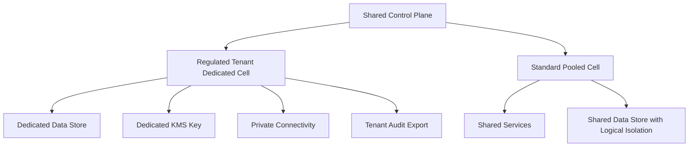

### Evidence Requirements

| Evidence | Purpose |
|---|---|
| Tenant provisioning log | Prove lifecycle control |
| Access logs | Prove who accessed tenant data |
| Authorization decisions | Prove policy enforcement |
| Data export logs | Prove data handling |
| Backup/restore evidence | Prove recoverability |
| Key usage logs | Prove cryptographic control |
| Incident records | Prove response process |
| Change records | Prove deployment governance |
| Tenant deletion record | Prove retention/deletion handling |

---

## 26. SaaS on ECS, EKS, Lambda, and Serverless

### ECS/Fargate

Good fit when:

- services are containerized;
- platform wants simpler operations than Kubernetes;
- tenant isolation can be by service, task, cluster, or account;
- predictable microservice runtime is needed.

Tenant isolation options:

- pooled ECS service;
- per-tenant task/service for large tenants;
- per-tier cluster;
- per-cell ECS cluster/account;
- task role boundaries.

### EKS

Good fit when:

- Kubernetes ecosystem is required;
- many teams deploy workloads;
- platform has strong day-2 operations capability;
- namespace/network policy/admission control are mature.

Tenant isolation options:

- namespace per tenant/team;
- node pool per tier;
- cluster per cell;
- cluster per regulated tenant;
- Kubernetes RBAC + IAM + network policy.

Warning:

```txt
Kubernetes namespace isolation is not equivalent to tenant isolation for hostile or regulated tenants.
```

### Lambda/Serverless

Good fit when:

- workload is event-driven;
- tenant traffic is bursty;
- per-function scaling is useful;
- operational overhead should be minimized.

Tenant isolation options:

- pooled function with tenant-aware logic;
- reserved concurrency per critical function;
- separate functions per tier/tenant for stronger isolation;
- per-tenant queues;
- per-cell serverless stack.

### API Gateway/AppSync

Good fit when:

- API boundary needs auth/throttling;
- tenant-specific usage plans/keys are useful;
- GraphQL access control can be enforced carefully;
- edge authorization and request validation matter.

---

## 27. Tenant Cost Allocation

Tenant cost allocation is rarely perfect, but it must be useful.

### Allocation Methods

| Method | Accuracy | Cost |
|---|---|---|
| Dedicated resources | High | High infrastructure cost |
| Tags | Medium/high where supported | Low/medium effort |
| Usage metering | High for application events | Requires pipeline |
| Proportional allocation | Approximate | Easy but less defensible |
| Hybrid | Practical | Requires governance |

### Unit Economics Examples

| Product | Unit Metric |
|---|---|
| Case management | Cost per active case |
| Evidence platform | Cost per GB-month and document processed |
| API product | Cost per 1,000 API calls |
| Analytics | Cost per report/query/job |
| AI assistant | Cost per tenant token/model invocation |
| Workflow engine | Cost per state transition/process instance |

### Tenant Profitability View

```txt
Tenant revenue
- allocated infrastructure cost
- support cost
- third-party/API cost
- AI/model cost
- data transfer cost
= gross margin estimate
```

A tenant can be high revenue and still unprofitable if the architecture gives it unbounded shared-resource consumption.

---

## 28. Deployment Strategy for SaaS

SaaS deployment must account for tenant impact.

### Deployment Options

| Option | Use When |
|---|---|
| All tenants at once | Small/simple product, low risk |
| Canary by percentage | Good telemetry, homogeneous tenants |
| Canary by tenant | Enterprise-safe validation |
| Canary by cell | Cell architecture exists |
| Tier-first rollout | Internal/free tier before enterprise |
| Dedicated tenant rollout | Regulated tenants need controlled windows |

### Cell-Based Progressive Delivery

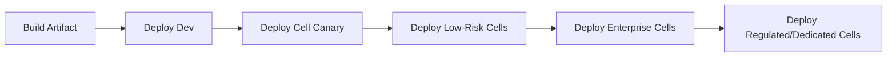

### SaaS Deployment Safety Criteria

- tenant impact prediction;
- cell health before/after;
- tenant-level SLOs;
- rollback per cell;
- database migration compatibility;
- feature flag by tenant/tier;
- entitlement compatibility;
- support readiness;
- release notes per tenant tier.

---

## 29. SaaS Admin and Support Tooling

Support tooling is a major isolation risk.

### Required Controls

| Control | Why |
|---|---|
| Tenant-scoped access | Prevent broad customer data exposure |
| Just-in-time elevation | Reduce standing privilege |
| Approval workflow | Regulated access evidence |
| Session logging | Investigation and audit |
| Reason code | Explain why access occurred |
| Data masking | Reduce sensitive data exposure |
| Break-glass path | Emergency access with strong audit |
| Time-bound grants | Prevent privilege persistence |

### Support Tool Invariant

```txt
An operator must not be able to accidentally operate on the wrong tenant.
```

Design support UI/API so tenant context is explicit, locked, visible, and logged.

---

## 30. Common SaaS Anti-Patterns

### Anti-Pattern 1: Tenant ID as Optional Field

Symptoms:

- some tables have tenant ID, some do not;
- events sometimes omit tenant ID;
- logs cannot be filtered by tenant;
- support tools search globally by default.

Fix:

- tenant context is mandatory except for explicit system-scoped records;
- schema/API/event contracts enforce tenant context;
- tests reject missing tenant context.

### Anti-Pattern 2: Shared Everything, No Guardrails

Symptoms:

- all tenants share DB/queue/cache;
- no quotas;
- no tenant-level metrics;
- enterprise tenant performance depends on free-tier load.

Fix:

- quotas;
- per-tier pools;
- cell boundaries;
- dedicated resources for large tenants.

### Anti-Pattern 3: Silo Everything Too Early

Symptoms:

- one full stack per tiny tenant;
- onboarding slow;
- cost high;
- patching painful;
- versions drift.

Fix:

- use pooled model for small tenants;
- automate dedicated stacks only for justified tiers;
- keep common control plane.

### Anti-Pattern 4: Billing Added Later

Symptoms:

- no usage events;
- no cost allocation;
- expensive tenants hidden;
- plan limits unenforceable.

Fix:

- design metering as platform capability from the start;
- connect metering to entitlement and quota.

### Anti-Pattern 5: Cell Architecture With Shared Fate

Symptoms:

- cells share one global write DB;
- cells share one critical queue;
- deployment still rolls everywhere at once;
- routing cannot isolate unhealthy cell.

Fix:

- make state and operations cell-local where possible;
- deploy progressively by cell;
- define cell evacuation/failover.

---

## 31. Design Review Checklist

### Tenant Model

- Is tenant defined clearly?
- Is tenant context mandatory?
- Are tenant IDs immutable?
- Are tenant tiers explicit?
- Is tenant lifecycle modeled?

### Isolation

- Can tenant A access tenant B data through any path?
- Are background jobs tenant-scoped?
- Are support tools tenant-scoped?
- Are cache keys tenant-aware?
- Are exports tenant-scoped?
- Are logs safe?

### Operations

- Can we see tenant-level health?
- Can we throttle one tenant?
- Can we suspend one tenant?
- Can we move one tenant?
- Can we restore one tenant?
- Can we notify impacted tenants?

### Cost

- Can we estimate tenant cost?
- Can we detect unprofitable tenants?
- Can quotas protect shared resources?
- Can tenant tier drive capacity allocation?

### Cell Architecture

- What is the cell boundary?
- What dependencies are shared?
- How many tenants can one cell failure impact?
- Can routing isolate a bad cell?
- Can deployment roll out by cell?
- Can tenants be rebalanced?

### Compliance

- Can we prove tenant isolation?
- Can we export tenant audit logs?
- Can we enforce data residency?
- Can we support legal hold and retention?
- Can we delete tenant data where legally required?

---

## 32. Deliberate Practice

### Exercise 1: Choose Silo/Pool/Bridge

For each tenant profile, choose a model and justify it:

| Tenant | Profile |
|---|---|
| A | 20 users, low data volume, standard support |
| B | 5,000 users, high API usage, strict SLA |
| C | Government regulator, data residency, legal hold |
| D | Free-tier trial tenant |
| E | Enterprise tenant requiring private connectivity |

### Exercise 2: Tenant Isolation Threat Model

Draw every access path where cross-tenant leakage could occur:

- API;
- background job;
- cache;
- logs;
- support UI;
- export;
- data lake;
- search index;
- backup restore;
- analytics dashboard.

For each path, define prevention, detection, and response.

### Exercise 3: Design a Tenant Lifecycle Workflow

Create an onboarding workflow using Step Functions-style states:

- create tenant record;
- allocate cell;
- provision resources;
- configure identity;
- configure entitlements;
- run health checks;
- activate tenant;
- emit audit event.

### Exercise 4: Design a Cell Model

Design a three-cell SaaS architecture and define:

- cell size;
- routing strategy;
- tenant placement;
- shared services;
- deployment order;
- evacuation plan;
- metrics per cell.

---

## 33. Self-Correction Checklist

You understand this part when you can answer:

- What is a tenant?
- Why is tenant context an invariant?
- What is the difference between tenant isolation and data partitioning?
- When should you choose silo, pool, or bridge?
- How can pooled infrastructure still enforce isolation?
- Why are background jobs a cross-tenant risk?
- How do tenant entitlement and user authorization differ?
- What is noisy-neighbor control?
- Why does SaaS require tenant-level observability?
- What is a cell in cell-based architecture?
- What shared services can weaken cell isolation?
- How do you move a tenant between cells?
- How do you prove tenant isolation to an auditor?

---

## 34. Engineering Judgment Summary

Enterprise SaaS architecture is boundary engineering.

The senior posture is:

```txt
Make tenant context explicit.
Enforce isolation at every access path.
Use pooled resources where efficiency matters.
Use siloed resources where isolation matters.
Use bridge models when enterprise reality requires both.
Use cells to limit blast radius.
Meter usage so cost and behavior are visible.
Automate tenant lifecycle so operations scale.
```

A SaaS platform fails when tenancy is treated as a column in a database. It succeeds when tenancy becomes a first-class architectural, operational, security, and economic boundary.

---

## References

- AWS Well-Architected SaaS Lens: https://docs.aws.amazon.com/wellarchitected/latest/saas-lens/saas-lens.html
- AWS SaaS Lens — Tenant: https://docs.aws.amazon.com/wellarchitected/latest/saas-lens/tenant.html
- AWS SaaS Lens — Silo, Pool, and Bridge Models: https://docs.aws.amazon.com/wellarchitected/latest/saas-lens/silo-pool-and-bridge-models.html
- AWS SaaS Lens — Tenant Isolation: https://docs.aws.amazon.com/wellarchitected/latest/saas-lens/tenant-isolation.html
- AWS SaaS Lens — Isolation Mindset: https://docs.aws.amazon.com/wellarchitected/latest/saas-lens/isolation-mindset.html
- AWS SaaS Lens — Bridge Model: https://docs.aws.amazon.com/wellarchitected/latest/saas-lens/bridge-model.html
- AWS Prescriptive Guidance — SaaS tenant isolation and S3 token vending machine: https://docs.aws.amazon.com/prescriptive-guidance/latest/patterns/implement-saas-tenant-isolation-for-amazon-s3-by-using-an-aws-lambda-token-vending-machine.html
- AWS Prescriptive Guidance — Manage tenants across multiple SaaS products on a single control plane: https://docs.aws.amazon.com/prescriptive-guidance/latest/patterns/manage-tenants-across-multiple-saas-products-on-a-single-control-plane.html
- AWS Well-Architected — Reducing Scope of Impact with Cell-Based Architecture: https://docs.aws.amazon.com/wellarchitected/latest/reducing-scope-of-impact-with-cell-based-architecture/what-is-a-cell-based-architecture.html
