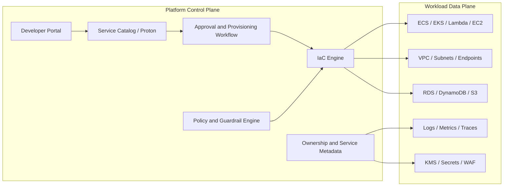
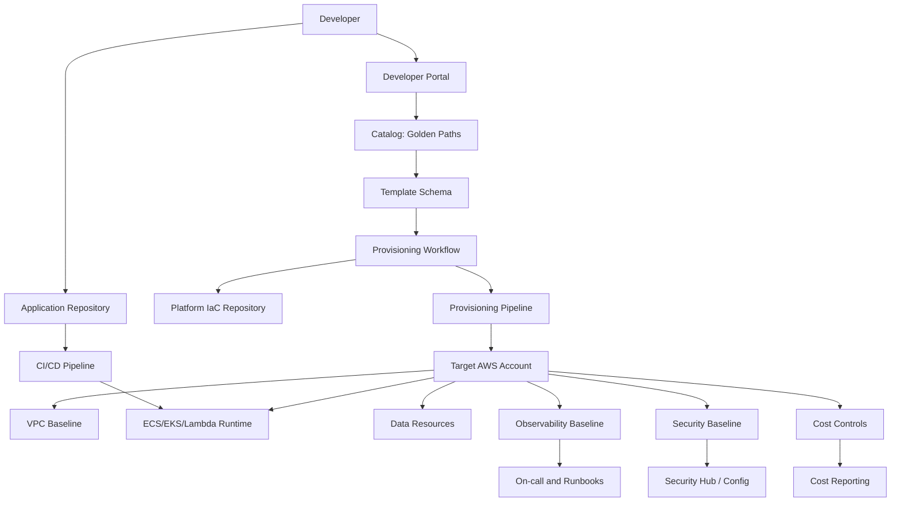
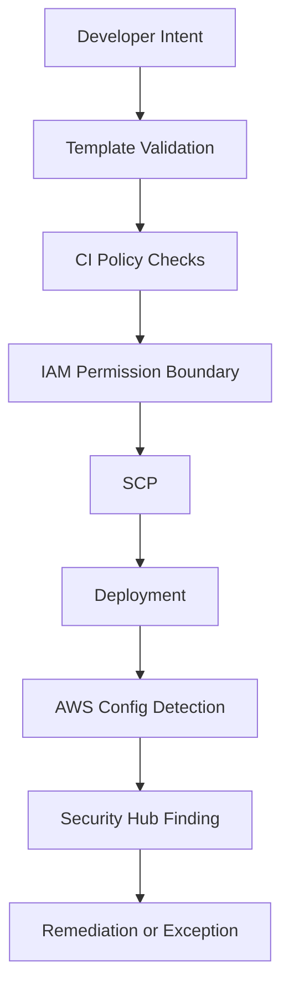
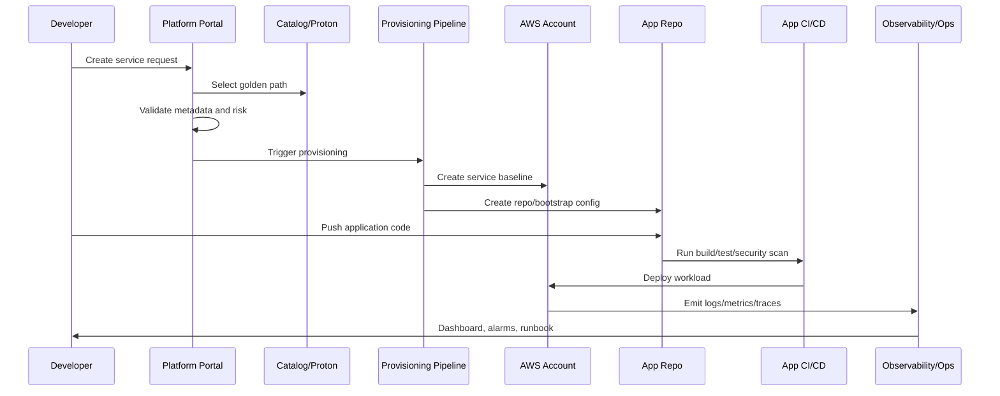
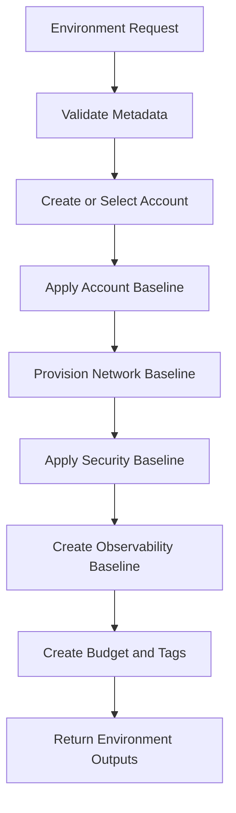

------
title: Learn AWS Engineering Mastery - Part 033
description: Platform engineering on AWS through golden paths, internal developer platforms, service catalogs, account and environment factories, reusable IaC, guardrails, self-service workflows, and platform operating models.
series: learn-aws
seriesTitle: Learn AWS Engineering Mastery
order: 33
partTitle: Platform Engineering, Golden Paths, and Internal Developer Platforms
tags:
- aws
- cloud
- platform-engineering
- internal-developer-platform
- golden-path
- service-catalog
- aws-proton
- devex
- governance
date: 2026-07-01
---

# Learn AWS Engineering Mastery - Part 033

## Platform Engineering, Golden Paths, and Internal Developer Platforms

Platform engineering is not “a team that owns Kubernetes” and it is not “a collection of Terraform modules.”

A serious platform is a productized operating model that lets teams ship safely without becoming experts in every AWS service, security rule, network topology, deployment strategy, logging convention, tagging rule, and cost-control mechanism.

The goal is not to hide AWS. The goal is to compress good AWS decisions into reusable paths that make the right thing the easy thing.

A senior AWS engineer does not ask only:

```txt
Should we use Service Catalog, Proton, Backstage, CDK, or Terraform?
```

The better question is:

```txt
Which decisions must be standardized, which decisions must remain flexible, and which decisions are too dangerous to leave to every application team independently?
```

This part teaches how to design an AWS platform as a product: golden paths, paved roads, environment factories, account factories, service templates, deployment guardrails, observability defaults, security defaults, cost controls, and developer self-service.

---

## 1. Target Skill

After this part, you should be able to:

- explain platform engineering as a product discipline, not merely an infrastructure discipline;
- design a golden path for common workload types such as REST service, event consumer, scheduled job, data pipeline, and AI service;
- distinguish portal, catalog, workflow engine, IaC module, runtime platform, and governance control;
- design an AWS internal developer platform using AWS Organizations, Control Tower, Service Catalog, Proton, CDK, Terraform, CloudFormation, CodePipeline, SSM, CloudWatch, Config, and IAM boundaries;
- define service ownership metadata, cost allocation tags, SLO defaults, security classification, and operational runbook requirements;
- create reusable templates without creating an unmaintainable abstraction layer;
- design guardrails that preserve developer autonomy while preventing dangerous misconfiguration;
- reason about platform adoption, versioning, migration, escape hatches, and support models;
- evaluate platform maturity using developer experience, governance, reliability, cost, and operability metrics.

---

## 2. Kaufman Skill Decomposition

Following Kaufman, do not try to “learn every AWS platform tool.” Deconstruct platform engineering into sub-skills that produce useful outcomes quickly.

```mermaid
flowchart TD
    A[AWS Platform Engineering] --> B[Platform Product Thinking]
    A --> C[Golden Path Design]
    A --> D[Self-Service Provisioning]
    A --> E[Guardrail Engineering]
    A --> F[Reusable IaC]
    A --> G[Developer Experience]
    A --> H[Operations and Support]
    A --> I[Adoption and Governance]

    B --> B1[Users]
    B --> B2[Jobs to be done]
    B --> B3[Platform API]
    B --> B4[Versioning]

    C --> C1[Service templates]
    C --> C2[Environment templates]
    C --> C3[Observability defaults]
    C --> C4[Security defaults]

    D --> D1[Service Catalog]
    D --> D2[AWS Proton]
    D --> D3[Portal workflow]
    D --> D4[Approval workflow]

    E --> E1[SCP]
    E --> E2[IAM boundaries]
    E --> E3[Config rules]
    E --> E4[Policy as code]
    E --> E5[Template constraints]

    F --> F1[CloudFormation]
    F --> F2[CDK constructs]
    F --> F3[Terraform modules]
    F --> F4[StackSets]

    H --> H1[Runbooks]
    H --> H2[Incident handoff]
    H --> H3[Upgrade cadence]
    H --> H4[Deprecation policy]
```



### First 20 Hours Focus

| Timebox | Focus | Practice Output |
|---:|---|---|
| 2h | Platform vocabulary | Define golden path, paved road, escape hatch, service catalog, environment factory |
| 3h | Developer journey | Map request → provision → deploy → observe → operate → retire |
| 3h | Golden path design | Design one REST API service template |
| 3h | Guardrails | Define SCP/IAM/Config/tagging controls for the template |
| 3h | IaC productization | Convert one architecture into reusable inputs/outputs |
| 2h | Observability defaults | Define dashboards, alarms, logs, traces, and SLO fields |
| 2h | Cost controls | Define tags, budgets, quotas, and unit-cost metadata |
| 2h | Platform operating model | Define ownership, support, versioning, and deprecation rules |

The purpose of these first 20 hours is not to build the perfect internal developer platform. The purpose is to build the mental model required to avoid two common extremes:

```txt
Extreme 1: Every team hand-builds AWS infrastructure differently.
Extreme 2: The platform team creates a rigid abstraction nobody wants to use.
```

---

## 3. Core Mental Model

A platform is a set of productized decisions.

```txt
Application teams should own product logic.
Platform teams should own repeated operational decisions.
Security teams should define non-negotiable boundaries.
Finance teams should see cost attribution automatically.
Leadership should see risk and delivery metrics without manual archaeology.
```

The platform is the contract between these groups.

### 3.1 Platform Is Not a Portal

A portal can be useful, but a portal is not the platform.

| Thing | What It Is | What It Is Not |
|---|---|---|
| Portal | Human-facing UI for discovery and workflows | The actual enforcement mechanism |
| Catalog | List of approved products/templates | Full operating model |
| IaC module | Reusable infrastructure implementation | Developer experience by itself |
| Runtime platform | ECS, EKS, Lambda, EC2, data platform, AI platform | Governance by itself |
| Golden path | Opinionated end-to-end route to production | Mandatory prison with no escape hatch |
| Guardrail | Preventive/detective control | A replacement for engineering judgment |

A good internal developer platform connects these pieces.

### 3.2 Platform Control Plane vs Workload Data Plane



The control plane decides what should exist and under which rules. The data plane runs business workload traffic.

A platform failure should not automatically break all running workloads. A workload failure should not corrupt the platform control plane. This separation is a fundamental design invariant.

---

## 4. Why Platform Engineering Matters on AWS

AWS gives teams enormous power. That power creates both speed and entropy.

Without platform engineering, typical failure modes appear:

- every team invents its own VPC layout;
- every service has a different tagging scheme;
- IAM permissions sprawl without ownership;
- logs are inconsistent or missing;
- dashboards are decorative, not actionable;
- alarms notify the wrong people;
- deployments are hand-built and hard to audit;
- security exceptions are hidden in ticket comments;
- cost attribution is impossible;
- compliance evidence requires manual collection;
- teams depend on tribal knowledge for production access;
- migration and deprecation are painful because infrastructure has no versioned contract.

A platform converts repeated decisions into reusable defaults.

```txt
Repeated decision + high risk + high frequency = platform candidate.
```

Examples:

| Repeated Decision | Platform Default |
|---|---|
| How should a new service get an account? | Account vending workflow |
| How should a service expose HTTP traffic? | Approved ALB/API Gateway template |
| How should logs be emitted? | Standard log schema and retention |
| How should secrets be stored? | Secrets Manager/KMS template |
| How should deployments roll out? | Blue/green or canary template |
| How should teams declare ownership? | Required metadata contract |
| How should cost be allocated? | Mandatory tags and budget creation |
| How should security baseline be enforced? | SCP, IAM boundary, Config, Security Hub |

---

## 5. Golden Path vs Paved Road vs Escape Hatch

These terms are often used loosely. Use them precisely.

### 5.1 Golden Path

A golden path is the recommended end-to-end way to build and run a specific workload type.

Example:

```txt
Golden path: public REST service
- API Gateway or ALB ingress
- ECS Fargate service
- private subnets
- Secrets Manager
- CloudWatch logs
- X-Ray or OpenTelemetry traces
- canary deployment
- WAF if internet-facing
- SLO dashboard
- cost tags
- runbook skeleton
```

The golden path should reduce decision load.

### 5.2 Paved Road

A paved road is an approved route that has support, documentation, observability, and security baseline.

There can be multiple paved roads:

- ECS Fargate service;
- EKS service;
- Lambda API;
- event consumer;
- batch job;
- data pipeline;
- AI/RAG service;
- static site;
- regulated workflow service.

A paved road can be less opinionated than a golden path.

### 5.3 Escape Hatch

An escape hatch is a controlled way to deviate.

Escape hatches are necessary because not every serious workload fits the default path. But escape hatches must be visible.

An escape hatch requires:

- reason;
- owner;
- risk acceptance;
- review date;
- compensating controls;
- telemetry;
- migration path back to the paved road if possible.

```txt
A platform without escape hatches becomes bureaucracy.
A platform with invisible escape hatches becomes chaos.
```

---

## 6. AWS Building Blocks for an Internal Developer Platform

AWS does not provide one single “IDP product” that solves all organizational needs. Instead, you compose platform capabilities.

### 6.1 Account and Organization Layer

| Capability | AWS Building Block | Purpose |
|---|---|---|
| Multi-account governance | AWS Organizations | OU structure, consolidated billing, policy boundary |
| Landing zone | AWS Control Tower | Baseline accounts, guardrails, account factory |
| Permission boundary | SCP, IAM permission boundaries | Prevent dangerous operations |
| Identity | IAM Identity Center, IAM roles | Workforce and workload access |
| Audit | CloudTrail, Config | Evidence and configuration tracking |
| Baseline deployment | CloudFormation StackSets, Control Tower customizations | Common resources across accounts |

### 6.2 Catalog and Provisioning Layer

| Capability | AWS Building Block | Purpose |
|---|---|---|
| Product catalog | AWS Service Catalog | Approved deployable products |
| Product governance | Portfolios, constraints, TagOptions | Control who can launch what and with which parameters |
| Environment/service templates | AWS Proton | Standardized service and environment infrastructure |
| Provisioning implementation | CloudFormation, CDK, Terraform | Actual infrastructure definitions |
| Workflow | CodePipeline, Step Functions, EventBridge, ticketing integration | Approval, provisioning, notification |

AWS Service Catalog is strongest when the platform team wants to expose approved infrastructure products with portfolio access and constraints. AWS Proton is strongest when the platform team wants environment templates and service templates that developers can use to deploy application infrastructure consistently.

### 6.3 Runtime Layer

| Workload Type | Common Runtime Choices |
|---|---|
| HTTP microservice | ECS Fargate, EKS, Lambda, EC2 ASG |
| Event consumer | Lambda, ECS service, EKS deployment |
| Scheduled job | EventBridge Scheduler + Lambda/ECS task |
| Batch workload | AWS Batch, ECS task, Step Functions |
| Data pipeline | Glue, Step Functions, EMR, Lambda |
| ML inference | Bedrock, SageMaker endpoint, ECS-hosted model |
| Internal tool | App Runner, ECS, Lambda, Amplify, S3/CloudFront |

The platform should avoid pretending one runtime fits every workload.

### 6.4 Observability and Operations Layer

| Capability | AWS Building Block |
|---|---|
| Metrics | CloudWatch Metrics, Embedded Metric Format |
| Logs | CloudWatch Logs, subscription filters, OpenSearch/S3 archive |
| Traces | X-Ray, ADOT/OpenTelemetry |
| Dashboards | CloudWatch Dashboards, Grafana if adopted |
| Alarms | CloudWatch Alarms, composite alarms |
| Runbooks | Systems Manager Automation, Markdown runbooks, Incident Manager |
| Inventory | Systems Manager Inventory, tags, CMDB integration |
| Incidents | Incident Manager, PagerDuty/Opsgenie integration if used |

### 6.5 Security and Compliance Layer

| Capability | AWS Building Block |
|---|---|
| Preventive guardrail | SCP, IAM boundary, VPC endpoint policy, security group rule constraints |
| Detective guardrail | AWS Config, Security Hub, GuardDuty, Access Analyzer |
| Encryption | KMS, ACM, Secrets Manager |
| Evidence | CloudTrail, Config snapshots, Audit Manager |
| Policy as code | CloudFormation Guard, OPA/Conftest, Terraform policy checks, custom CI gates |

### 6.6 Cost and Sustainability Layer

| Capability | AWS Building Block |
|---|---|
| Cost allocation | Tags, Cost Categories, account structure |
| Budgeting | AWS Budgets |
| Anomaly detection | Cost Anomaly Detection |
| Rightsizing | Compute Optimizer, Trusted Advisor where applicable |
| Usage data | Data Exports / Cost and Usage Reports |
| Sustainability | Well-Architected Sustainability reviews, utilization tracking |

---

## 7. Platform Product Design

Treat the platform as a product with users, APIs, support, versioning, and measurable outcomes.

### 7.1 Platform Users

Common user groups:

| User | Need |
|---|---|
| Application developer | Create, deploy, observe, and troubleshoot services quickly |
| Tech lead | Understand operational posture, risk, cost, and ownership |
| Security engineer | Enforce controls and review exceptions |
| SRE/operations | Receive actionable alerts and runbooks |
| Finance/FinOps | Attribute spend and forecast usage |
| Auditor/compliance | Retrieve evidence without reconstructing history manually |
| Platform engineer | Maintain reusable paths without drowning in custom support |

### 7.2 Platform Jobs To Be Done

A platform should support jobs like:

- create a new service;
- create a new environment;
- provision a database;
- expose an API;
- add an event consumer;
- request a secret;
- add dashboard and alarms;
- request production access;
- rotate credentials;
- deploy safely;
- roll back safely;
- retire a service;
- export compliance evidence;
- view cost per service or tenant;
- request exception with expiry.

If the platform does not map to real jobs, it becomes an internal hobby project.

---

## 8. The Platform API

A golden path should expose a stable platform API. This API can be a YAML schema, portal form, Terraform module interface, CDK construct props, Service Catalog product parameters, or Proton service template schema.

Example service contract:

```yaml
service:
  name: enforcement-case-api
  owner: regulatory-platform-team
  tier: critical
  dataClassification: confidential
  runtime: ecs-fargate
  exposure: internal
  region: ap-southeast-3
  environments:
    - dev
    - staging
    - prod
  availability:
    targetSlo: 99.9
    rto: 4h
    rpo: 15m
  observability:
    logs: standard-json
    traces: true
    dashboard: true
    pager: regulatory-platform-oncall
  security:
    secrets: true
    kmsKeyType: customer-managed
    waf: false
    privateSubnetsOnly: true
  cost:
    costCenter: regulatory-systems
    product: case-management
    tenantAware: true
```

The platform API is more important than the portal. A clean API can support many interfaces. A messy API with a nice UI still creates confusion.

---

## 9. Golden Path Reference Architecture



This architecture separates:

- developer intent;
- platform contract;
- provisioning implementation;
- workload runtime;
- operational evidence.

---

## 10. Designing a Golden Path

A golden path should be specific enough to be useful and general enough to be reusable.

### 10.1 Example: Internal REST Service on ECS Fargate

A mature golden path might include:

| Layer | Default |
|---|---|
| Account | Workload account under application OU |
| Network | Private subnets across at least two AZs |
| Ingress | Internal ALB or API Gateway private integration |
| Compute | ECS Fargate service |
| Images | ECR repository with scan policy |
| Secrets | Secrets Manager references only, no plaintext env secrets |
| IAM | Task role with least-privilege policy generated from declared dependencies |
| Deployment | Blue/green or rolling with health checks and rollback |
| Observability | Structured logs, metrics, traces, dashboard, alarms |
| SLO | Default availability and latency fields required |
| Cost | Mandatory tags and service-level cost allocation |
| Security | KMS encryption, security group template, WAF if public |
| Operations | Runbook skeleton and on-call metadata |
| Compliance | CloudTrail/Config baseline, evidence tags |

### 10.2 Example: Event Consumer Golden Path

| Layer | Default |
|---|---|
| Trigger | SQS queue or EventBridge rule |
| Runtime | Lambda or ECS worker |
| Retry | Explicit retry policy |
| DLQ | Required |
| Idempotency | Required idempotency key declaration |
| Observability | Queue depth, age of oldest message, failure rate |
| Backpressure | Concurrency limit or worker scaling policy |
| Security | Producer/consumer resource policy boundary |
| Runbook | Replay, redrive, poison message triage |

### 10.3 Example: Data Store Golden Path

| Workload Need | Default Product |
|---|---|
| Relational OLTP | Aurora/RDS template |
| Key-value high scale | DynamoDB table template |
| Object storage | S3 bucket template |
| Cache | ElastiCache template |
| Search projection | OpenSearch template |

Each data product must include backup, retention, encryption, access policy, ownership, monitoring, restore test, and deletion protection rules.

---

## 11. AWS Service Catalog Design

AWS Service Catalog lets platform teams publish approved products to portfolios and grant access to users, groups, or roles. Constraints control how products can be launched.

### 11.1 Service Catalog Concepts

| Concept | Meaning |
|---|---|
| Product | Deployable thing such as VPC, RDS cluster, ECS service, or account baseline |
| Provisioning artifact | Product version, often backed by CloudFormation |
| Portfolio | Collection of products shared with users/accounts |
| Constraint | Rule controlling launch/update behavior |
| TagOption | Approved tag key/value governance helper |
| Launch role | IAM role used to provision product resources |

### 11.2 Good Service Catalog Use Cases

Use Service Catalog when:

- product is stable and repeatable;
- platform wants controlled self-service;
- launch parameters are known;
- governance needs portfolio access and constraints;
- products should be visible to many teams;
- the organization prefers AWS-native cataloging.

Examples:

- standard S3 bucket;
- standard RDS instance;
- logging account integration;
- approved network endpoint;
- team sandbox environment;
- baseline workload account resources.

### 11.3 Bad Service Catalog Use Cases

Avoid using Service Catalog as:

- a dumping ground for every CloudFormation template;
- a substitute for platform design;
- a place to expose dangerous knobs without guardrails;
- a way to bypass code review;
- a mechanism for one-off bespoke infrastructure.

### 11.4 Constraint Design

A product without constraints is often just delegated risk.

Examples:

| Risk | Constraint/Guardrail |
|---|---|
| User chooses unapproved instance type | Template constraint |
| Product launches with wrong role | Launch constraint |
| Missing mandatory tags | TagOptions + Config rule + CI validation |
| Product creates public endpoint | Template restriction + SCP + Config detection |
| Product exceeds cost boundary | Parameter limit + Budget alarm |

---

## 12. AWS Proton Design

AWS Proton helps platform teams define environment templates and service templates. The platform team owns the template. Developers instantiate services from those templates.

### 12.1 Proton Mental Model

```txt
Environment template = shared infrastructure context.
Service template = application infrastructure pattern.
Service instance = a deployed service in an environment.
```

Example:

```txt
Environment: production ECS cluster with VPC, ALB, logging baseline.
Service template: ECS Fargate API service.
Service instance: case-command-api deployed to production.
```

### 12.2 When Proton Fits

Use Proton when:

- platform team wants standardized service/environment templates;
- teams deploy many similar services;
- templates need lifecycle/version management;
- platform wants a native AWS service to connect application infrastructure with deployment workflows;
- environment and service boundaries are clear.

### 12.3 Proton Design Rules

Good Proton templates:

- define minimal required inputs;
- hide dangerous implementation details;
- expose meaningful business/operational parameters;
- version templates explicitly;
- include observability and security defaults;
- define outputs consumed by deployment pipelines;
- document migration between template versions.

Bad Proton templates:

- expose every CloudFormation/Terraform knob;
- require developers to know platform internals;
- hard-code environment-specific values;
- lack upgrade path;
- create resources without ownership metadata.

---

## 13. Reusable IaC Without Abstraction Failure

Reusable IaC should encode policy and reduce repetition. But over-abstraction causes hidden coupling.

### 13.1 IaC Reuse Layers

| Layer | Example | Stability |
|---|---|---|
| Primitive | Security group, bucket, IAM role | High |
| Pattern | ECS service, Lambda API, RDS cluster | Medium |
| Product | “regulated REST service” | Medium-high |
| Application | case management API | Low |

Do not force all layers into one mega-module.

### 13.2 Good Module Interface

A good module asks for intent:

```yaml
runtime: ecs-fargate
public: false
dataClassification: confidential
sloTier: tier-1
allowedCallers:
  - case-ui
requiresDatabase: true
```

A poor module asks for implementation trivia:

```yaml
albListenerPriority: 43
subnetId1: subnet-abc
subnetId2: subnet-def
logGroupName: /aws/custom/foo/bar
securityGroupIngressRuleNumber: 7
```

Some implementation details must be configurable, but the main interface should express workload intent.

### 13.3 Versioning Rules

Each platform component needs versioning semantics.

| Change Type | Example | Handling |
|---|---|---|
| Patch | Fix alarm threshold bug | Auto-upgrade or simple rollout |
| Minor | Add optional metric | Safe upgrade with release notes |
| Major | Change networking topology | Migration plan required |
| Breaking | Replace runtime or database | Explicit opt-in and support window |

No platform team should silently mutate production infrastructure in ways application teams cannot reason about.

---

## 14. Guardrail Engineering

Guardrails should be layered.



### 14.1 Preventive Controls

| Control | Use |
|---|---|
| SCP | Deny account-wide or OU-wide dangerous actions |
| IAM permission boundary | Limit roles created by automation/developers |
| VPC endpoint policy | Restrict service access through endpoint |
| KMS key policy | Control cryptographic boundary |
| Template constraints | Restrict launch parameters |
| CI policy checks | Prevent bad IaC before deployment |

### 14.2 Detective Controls

| Control | Use |
|---|---|
| AWS Config | Detect resource drift or noncompliance |
| CloudTrail | Audit API activity |
| Security Hub | Aggregate findings |
| GuardDuty | Detect suspicious activity |
| Access Analyzer | Detect unintended access paths |
| Cost Anomaly Detection | Detect unexpected spend |

### 14.3 Corrective Controls

Corrective controls include:

- SSM Automation runbooks;
- automatic rollback pipelines;
- Config remediation;
- quarantining security groups;
- revoking credentials;
- disabling public access;
- tagging resource as exception;
- creating incident ticket.

Corrective automation must be safe. An aggressive auto-remediation can cause outage if it deletes or blocks legitimate production resources.

---

## 15. Developer Journey Design

A platform must optimize the whole journey, not only provisioning.



### 15.1 Request Phase

Required inputs:

- service name;
- owner;
- business capability;
- data classification;
- criticality;
- exposure: public/internal/private;
- runtime preference;
- dependencies;
- RTO/RPO;
- expected traffic;
- cost center;
- compliance scope;
- on-call route.

### 15.2 Provision Phase

Platform creates:

- repository skeleton or configuration;
- IaC baseline;
- deployment pipeline;
- runtime resources;
- IAM roles;
- secrets namespace;
- dashboards;
- alarms;
- runbook template;
- cost tags;
- security controls.

### 15.3 Operate Phase

Platform must support:

- production access path;
- incident routing;
- rollback;
- log search;
- dependency map;
- SLO review;
- cost review;
- patch/upgrade notifications;
- exception review.

### 15.4 Retire Phase

Service retirement is often ignored. A serious platform makes retirement explicit.

Retirement checklist:

- remove DNS/ingress;
- stop deployment pipeline;
- archive logs and evidence;
- snapshot or export data if required;
- delete secrets;
- remove IAM roles;
- release quotas/capacity;
- close cost allocation;
- update service catalog/CMDB;
- document final owner approval.

---

## 16. Platform Metadata Model

Metadata is the backbone of platform operations.

Minimum service metadata:

```yaml
serviceId: case-command-api
ownerTeam: regulatory-platform
technicalOwner: team-lead@example.com
businessOwner: compliance-ops@example.com
criticality: tier-1
dataClassification: confidential
internetFacing: false
runtime: ecs-fargate
accountId: "111122223333"
region: ap-southeast-3
repository: org/case-command-api
onCall: regulatory-platform-primary
costCenter: regtech-platform
slo:
  availability: 99.9
  p95LatencyMs: 300
resilience:
  rto: 4h
  rpo: 15m
compliance:
  auditScope: true
  retentionYears: 7
lifecycle:
  state: production
  createdAt: 2026-07-01
```

This metadata should drive:

- tags;
- dashboards;
- alarms;
- ownership reports;
- cost reports;
- evidence collection;
- incident routing;
- exception approvals;
- service lifecycle management.

---

## 17. Service Ownership and Team Boundaries

A platform should not centralize all operational responsibility.

### 17.1 Responsibility Split

| Responsibility | Application Team | Platform Team | Security/Compliance |
|---|---|---|---|
| Business logic | Owns | Supports runtime patterns | Reviews risk when needed |
| Runtime template | Consumes | Owns | Reviews controls |
| IAM guardrails | Requests app permissions | Provides boundaries | Defines non-negotiable controls |
| Deployment pipeline | Uses and configures | Provides pattern | Reviews supply-chain controls |
| Logs/metrics/traces | Emits domain signals | Provides baseline | Defines retention and sensitive data policy |
| Incident response | Owns service incident | Supports platform failures | Supports security incidents |
| Cost | Owns service usage | Provides attribution | N/A |
| Compliance evidence | Provides domain evidence | Provides platform evidence | Owns audit framework |

The platform team should not become the bottleneck for every production issue.

### 17.2 Ownership Invariant

Every resource should answer:

```txt
Who owns this?
Why does it exist?
What business capability does it support?
What data classification does it process?
What happens if it fails?
What does it cost?
When can it be deleted?
```

If the platform cannot answer these questions, it does not have operational control.

---

## 18. Platform Security Model

Security should be embedded in the golden path.

### 18.1 Security Defaults

A baseline service template should include:

- private subnets by default;
- no public ingress unless explicitly requested;
- TLS for ingress;
- KMS encryption where supported;
- Secrets Manager for secrets;
- IAM role per workload;
- no long-lived access keys;
- VPC endpoints for supported AWS service access where appropriate;
- least-privilege dependency policy;
- CloudTrail and Config baseline;
- Security Hub findings routing;
- log redaction expectations;
- WAF for public HTTP endpoints;
- image scanning for containers;
- dependency scanning in CI;
- break-glass access path.

### 18.2 Permission Boundary Pattern

For self-service platforms, permission boundaries are critical.

```txt
Developer automation may create roles,
but roles must remain within approved boundaries.
```

Pattern:

1. platform defines a permission boundary policy;
2. provisioning role can create workload roles only if boundary is attached;
3. SCP denies creating roles without approved boundary;
4. Config detects noncompliant roles;
5. remediation workflow quarantines or reports.

### 18.3 Public Exposure Control

Public exposure must be explicit.

A service template should require:

- exposure type: `private`, `internal`, or `public`;
- data classification;
- WAF decision;
- auth mode;
- rate limiting;
- logging retention;
- owner approval;
- security review if conditions exceed threshold.

---

## 19. Platform Observability Defaults

A service should not reach production without minimum telemetry.

### 19.1 Minimum Telemetry Contract

| Signal | Required Fields |
|---|---|
| Logs | timestamp, level, service, environment, requestId, traceId, tenantId if applicable, error code |
| Metrics | request count, error rate, latency, saturation, dependency error, business metric |
| Traces | ingress span, dependency calls, error status, latency attribution |
| Events | deployment, rollback, config change, incident, scaling event |
| Alarms | user-impacting symptoms first, saturation second, causes third |

### 19.2 Platform-Provided Dashboard

Every service should receive a default dashboard:

- request rate;
- error rate;
- p95/p99 latency;
- saturation;
- dependency errors;
- deployment markers;
- rollback markers;
- cost trend;
- SLO burn if configured.

### 19.3 Alarm Philosophy

Do not create alarms because metrics exist. Create alarms because action is required.

Bad alarm:

```txt
CPU > 70% for 5 minutes
```

Better alarm:

```txt
p95 latency above SLO and error rate above threshold for 10 minutes after deployment
```

CPU can be diagnostic. User impact should drive paging.

---

## 20. Platform Cost Controls

Cost control should be built into provisioning, not reconstructed later.

### 20.1 Cost Metadata

Required tags:

- `Service`;
- `OwnerTeam`;
- `Environment`;
- `CostCenter`;
- `Product`;
- `DataClassification`;
- `Criticality`;
- `ManagedBy`;
- `LifecycleState`.

### 20.2 Cost Guardrails

| Guardrail | Purpose |
|---|---|
| Budget per account/service | Detect spend drift |
| Cost anomaly detection | Detect unusual patterns |
| Instance size constraints | Prevent accidental expensive launch |
| Retention defaults | Prevent log/storage cost explosion |
| Autoscaling max bounds | Prevent runaway scaling |
| Sandbox TTL | Delete forgotten experiments |
| Tag enforcement | Preserve cost attribution |

### 20.3 Unit Economics

For platform services, cost should be expressible per unit:

- cost per request;
- cost per tenant;
- cost per case;
- cost per workflow execution;
- cost per GB processed;
- cost per model invocation;
- cost per environment.

Platform maturity improves when teams can connect engineering choices to unit cost.

---

## 21. Environment Factory

An environment factory creates standardized environments.



Environment outputs might include:

- account ID;
- region;
- VPC ID;
- private subnet IDs;
- public subnet IDs if allowed;
- KMS key ARN;
- log archive destination;
- deployment role ARN;
- secrets namespace;
- default security group IDs;
- observability workspace IDs;
- service discovery namespace.

Application templates should consume outputs, not rediscover environment internals.

---

## 22. Service Factory

A service factory creates standardized application services.

### 22.1 Inputs

- service name;
- workload type;
- environment;
- exposure;
- data classification;
- dependencies;
- scaling target;
- SLO;
- RTO/RPO;
- repository;
- owner metadata.

### 22.2 Outputs

- repository configuration;
- pipeline;
- runtime resources;
- IAM roles;
- ingress endpoint;
- logs/metrics/traces;
- dashboard;
- alarms;
- runbook;
- cost budget;
- security findings routing.

### 22.3 Platform-Generated Repository Skeleton

A mature service factory can generate:

```txt
/service
  /src
  /deploy
  /docs
    runbook.md
    architecture.md
    operational-readiness.md
  /tests
  service.yaml
  README.md
```

The important file is often `service.yaml`, because it encodes platform metadata and intent.

---

## 23. Data Product Factory

Data resources need stronger controls than many stateless services.

A database factory should require:

- data classification;
- access model;
- backup retention;
- PITR setting where applicable;
- restore test cadence;
- encryption key selection;
- deletion protection decision;
- migration plan;
- ownership;
- schema ownership;
- RTO/RPO;
- read/write workload estimate;
- cost center;
- data retention policy.

Never let a team create production data stores without lifecycle and restore semantics.

---

## 24. Exception Governance

A platform that blocks all exceptions will be bypassed. A platform that allows all exceptions is not a platform.

Exception record:

```yaml
exceptionId: EX-2026-0017
service: case-report-exporter
requestedBy: regulatory-platform
control: public-s3-block-required
requestedState: temporary-public-access-via-cloudfront-oac
reason: legacy partner integration migration
risk: medium
compensatingControls:
  - CloudFront signed URLs
  - WAF allowlist
  - object expiration 7 days
  - access logging enabled
expiresAt: 2026-08-31
approvers:
  - security
  - platform
  - data-owner
reviewCadence: weekly
```

Key invariant:

```txt
Every exception needs an expiry date or it is not an exception; it is a new unmanaged standard.
```

---

## 25. Platform Adoption Strategy

Build platforms incrementally.

### 25.1 Start With High-Value Paths

Do not start by building a universal platform.

Start with:

1. most common service type;
2. highest-risk repeated misconfiguration;
3. most painful onboarding bottleneck;
4. most expensive operational inconsistency.

For many organizations, the first good golden path is:

```txt
Internal HTTP service with CI/CD, private networking, logs, metrics, alarms, secrets, IAM role, tags, and runbook.
```

### 25.2 Adoption Metrics

Track:

- time to first production deployment;
- number of services using golden path;
- percentage of services with owner metadata;
- percentage of services with dashboards and alarms;
- number of security exceptions;
- mean time to provision environment;
- deployment frequency;
- failed deployment rate;
- incident rate by platform version;
- cost attribution coverage;
- developer satisfaction;
- support ticket volume per service.

### 25.3 Migration Strategy

Existing services will not magically conform.

Use migration tiers:

| Tier | Meaning |
|---|---|
| Native | Created on golden path |
| Adopted | Existing service imported into platform metadata and observability |
| Partially managed | Some platform controls applied |
| Legacy exception | Documented deviation with review date |
| Retiring | Being decommissioned |

---

## 26. Platform Operating Model

A platform team needs operational discipline.

### 26.1 Platform Team Responsibilities

- publish and maintain golden paths;
- define platform APIs;
- maintain templates/modules;
- manage compatibility and migration;
- operate provisioning workflows;
- respond to platform incidents;
- publish release notes;
- support onboarding;
- collect feedback;
- review adoption metrics;
- coordinate with security, SRE, FinOps, and compliance.

### 26.2 Platform Support Levels

| Support Level | Meaning |
|---|---|
| Fully supported | Golden path; platform team owns template support |
| Supported with constraints | Paved road; some flexibility but documented |
| Best effort | Allowed but not recommended |
| Unsupported | Teams own all risk; may require exception |
| Prohibited | Violates non-negotiable controls |

### 26.3 Upgrade Cadence

Each platform product needs:

- owner;
- semantic version;
- changelog;
- migration guide;
- deprecation policy;
- support window;
- compatibility tests;
- rollback plan.

Without versioning, a platform becomes a hidden source of production change.

---

## 27. Anti-Patterns

### 27.1 Portal-First Platform

The team builds a beautiful portal before defining the platform API, ownership model, or golden path.

Result:

```txt
Nice UI. Weak operating model. Low trust.
```

### 27.2 Terraform Module Graveyard

Many modules exist, but nobody knows which are supported, which are safe, and which are obsolete.

Fix:

- mark support level;
- add owners;
- version modules;
- add examples;
- add policy tests;
- deprecate aggressively.

### 27.3 Over-Abstracted Cloud

The platform hides AWS so aggressively that engineers cannot debug failures.

Fix:

- expose architecture diagrams;
- include generated resource map;
- link to AWS console views;
- teach core AWS mental models;
- preserve escape hatch.

### 27.4 TicketOps Disguised as Platform

Every request still requires manual platform team work.

Fix:

- automate safe requests;
- reserve human review for high-risk changes;
- use policy checks instead of manual review where possible.

### 27.5 No Ownership Metadata

Resources exist without owner, service, environment, or cost center.

Fix:

- enforce metadata at provisioning;
- detect drift;
- block production promotion if metadata missing.

### 27.6 Platform Team Owns All Incidents

Application teams ship through the platform but do not own service behavior.

Fix:

- define responsibility split;
- require on-call metadata;
- provide runbooks;
- route service alarms to service owners.

---

## 28. Failure Modes

| Failure Mode | Symptom | Root Cause | Prevention |
|---|---|---|---|
| Golden path too rigid | Teams bypass platform | No escape hatch or poor fit | Supported paved roads and exception process |
| Golden path too flexible | Inconsistent outcomes | Exposed too many knobs | Intent-based API and constraints |
| Unsafe self-service | Public resources, IAM sprawl | Weak guardrails | SCP, boundaries, template checks, Config |
| Hidden platform change | Services break after template update | No versioning | SemVer, migration plans, release notes |
| Portal unavailable | Teams cannot deploy | Control plane dependency | Decouple runtime from portal and provide CLI/API fallback |
| Cost explosion | Runaway environments | No quota/budget/TTL | Budgets, max bounds, sandbox expiry |
| Compliance evidence missing | Audit scramble | Metadata/evidence not captured | Built-in CloudTrail/Config/Audit Manager integration |
| Platform becomes bottleneck | Long lead time | Manual approvals for low-risk changes | Automate low-risk path |
| Developer distrust | Low adoption | Platform does not solve real pain | Product discovery, feedback loop, metrics |

---

## 29. Decision Matrix

| Question | Prefer Golden Path | Prefer Paved Road | Prefer Custom |
|---|---|---|---|
| Is workload common? | Yes | Maybe | No |
| Is risk high? | Yes | Yes | Only with review |
| Are requirements stable? | Yes | Maybe | No |
| Does platform team support it? | Yes | Yes | No |
| Does team need unusual performance/security model? | No | Maybe | Yes |
| Is there regulatory impact? | Yes | Yes | Only with evidence |
| Is time-to-market critical? | Yes | Maybe | Maybe |

Custom is not bad. Unowned custom is bad.

---

## 30. Operational Readiness Checklist

Before a platform product is marked production-ready:

- [ ] Owner is defined.
- [ ] Supported workload type is explicit.
- [ ] Platform API/schema is documented.
- [ ] IAM model is reviewed.
- [ ] Network model is reviewed.
- [ ] Encryption defaults are defined.
- [ ] Logs, metrics, traces are included.
- [ ] Default alarms are actionable.
- [ ] Cost tags are mandatory.
- [ ] Budget/anomaly controls exist.
- [ ] Deployment strategy is defined.
- [ ] Rollback path is documented.
- [ ] Runbook template is generated.
- [ ] Security findings route correctly.
- [ ] Compliance evidence is captured.
- [ ] Versioning and deprecation policy exists.
- [ ] Escape hatch process exists.
- [ ] Example service exists.
- [ ] Developer docs exist.
- [ ] Support channel and SLA are clear.

---

## 31. Deliberate Practice

### Practice 1: Design a Golden Path

Design a golden path for an internal API service.

Required output:

- service schema;
- AWS architecture diagram;
- provisioning steps;
- guardrails;
- observability baseline;
- cost controls;
- runbook skeleton.

### Practice 2: Build a Risk-Based Catalog

Create a catalog with five platform products:

1. internal REST service;
2. event consumer;
3. S3 bucket with lifecycle;
4. Aurora cluster;
5. scheduled batch job.

For each product, define:

- owner;
- inputs;
- outputs;
- constraints;
- supported environments;
- cost model;
- operational readiness checklist.

### Practice 3: Review a Bad Platform

Given this anti-pattern:

```txt
A platform exposes 150 Terraform variables for an ECS service and lets every team choose networking, IAM, logging, deployment, and tagging independently.
```

Rewrite it into an intent-based platform API.

### Practice 4: Design an Exception Workflow

Create an exception workflow for a team that needs temporary public exposure.

Include:

- risk classification;
- approvers;
- expiry;
- compensating controls;
- monitoring;
- automatic reminder;
- closure criteria.

---

## 32. Self-Correction Questions

Use these questions to check whether your platform design is serious:

1. Can a team deploy a standard service without reading 20 AWS docs?
2. Can a senior engineer still see the real AWS architecture behind the abstraction?
3. Are production resources traceable to service owner and cost center?
4. Are guardrails enforced by code/policy, not only wiki pages?
5. Can teams deviate safely when justified?
6. Can the platform be upgraded without surprise production breakage?
7. Do alarms route to people who can act?
8. Can auditors retrieve evidence without manual archaeology?
9. Can FinOps see unit cost by service/product/tenant?
10. Does the platform reduce cognitive load or merely move complexity elsewhere?

---

## 33. Engineering Judgment Summary

Platform engineering on AWS is the discipline of turning repeated cloud decisions into safe, reusable, observable, and supportable product paths.

The winning mental model:

```txt
A platform is not a tool.
A platform is a productized set of decisions, contracts, controls, and workflows.
```

Golden paths should make common work fast. Guardrails should make dangerous work difficult. Escape hatches should make unusual work possible without becoming invisible risk.

A top-tier AWS engineer can design not only one workload, but also the platform that lets many teams create many workloads with consistent security, reliability, observability, cost attribution, and auditability.

---

## 34. References

- AWS Service Catalog Administrator Guide: https://docs.aws.amazon.com/servicecatalog/latest/adminguide/what-is_concepts.html
- AWS Service Catalog Constraints: https://docs.aws.amazon.com/servicecatalog/latest/adminguide/constraints.html
- AWS Proton User Guide: https://docs.aws.amazon.com/proton/latest/userguide/Welcome.html
- AWS Proton Templates: https://docs.aws.amazon.com/proton/latest/userguide/ag-templates.html
- AWS Proton Environments: https://docs.aws.amazon.com/proton/latest/userguide/ag-environments.html
- AWS Organizations User Guide: https://docs.aws.amazon.com/organizations/latest/userguide/orgs_introduction.html
- AWS Control Tower User Guide: https://docs.aws.amazon.com/controltower/latest/userguide/what-is-control-tower.html
- AWS CloudFormation StackSets: https://docs.aws.amazon.com/AWSCloudFormation/latest/UserGuide/what-is-cfnstacksets.html
- AWS Config Developer Guide: https://docs.aws.amazon.com/config/latest/developerguide/WhatIsConfig.html
- AWS Well-Architected Framework: https://docs.aws.amazon.com/wellarchitected/latest/framework/welcome.html
