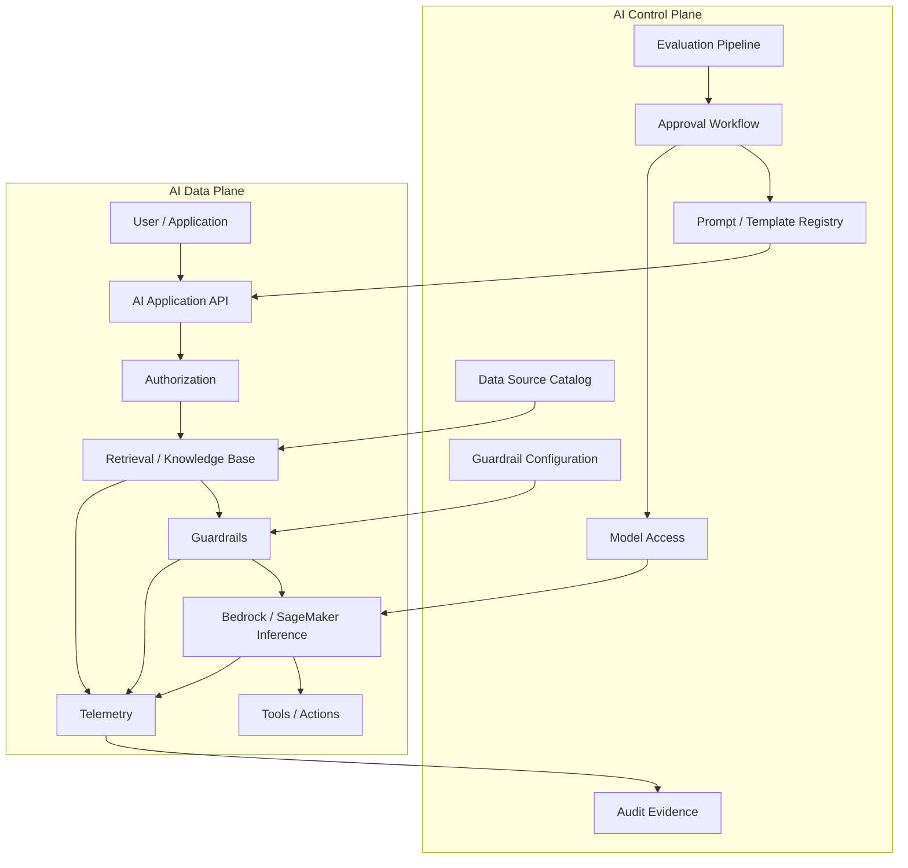
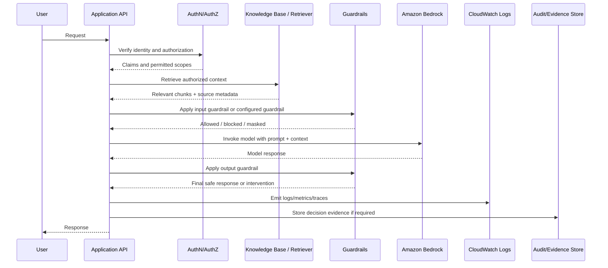
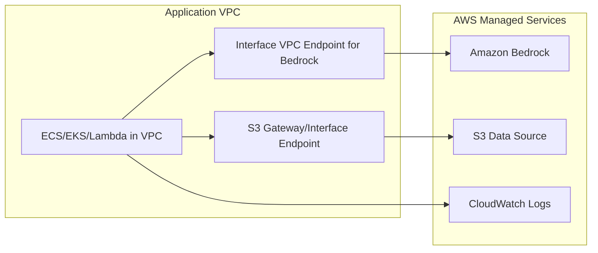
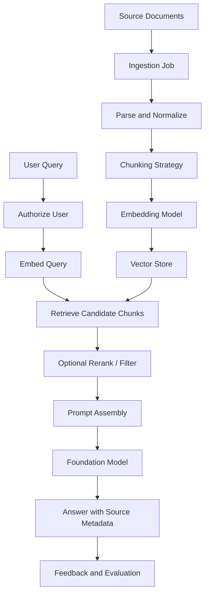
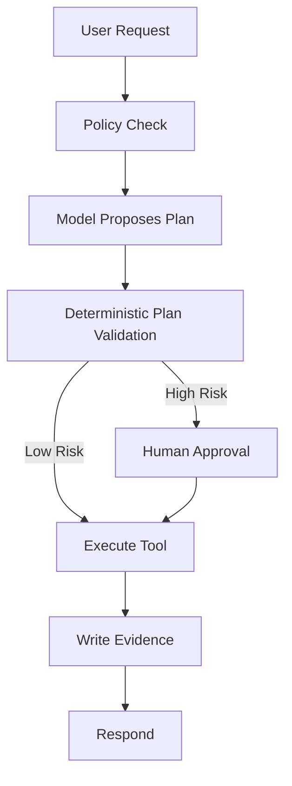
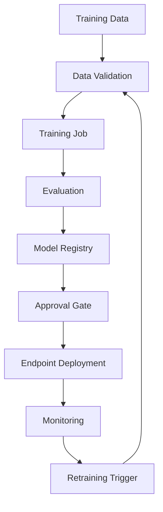
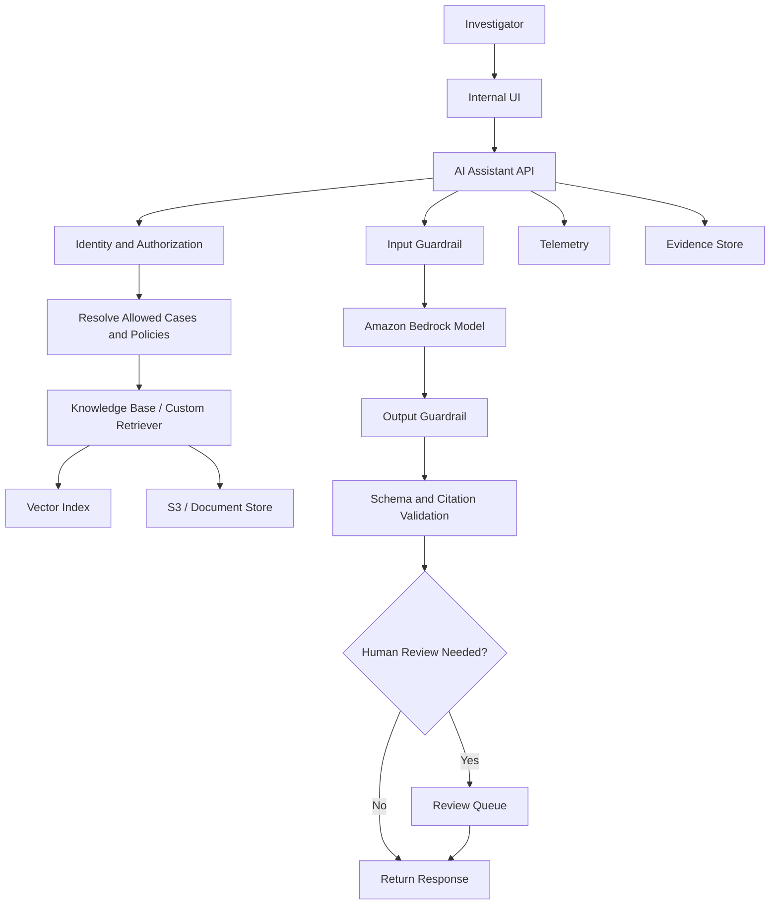

------
title: Learn AWS Engineering Mastery - Part 034
description: Production AI/ML platform design on AWS using Amazon Bedrock, SageMaker AI, RAG, guardrails, model invocation logging, IAM, PrivateLink, evaluation, observability, cost controls, and governance.
series: learn-aws
seriesTitle: Learn AWS Engineering Mastery
order: 34
partTitle: AWS for AI/ML and Bedrock Production Platforms
tags:
- aws
- cloud
- ai
- ml
- amazon-bedrock
- sagemaker
- rag
- guardrails
- mlops
- platform-engineering
date: 2026-07-01
---

# Learn AWS Engineering Mastery - Part 034

## AWS for AI/ML and Bedrock Production Platforms

AI/ML on AWS is not only about calling a model.

A production AI platform must solve identity, data access, model access, inference reliability, prompt safety, retrieval quality, evaluation, observability, cost control, human oversight, audit evidence, and incident response.

The dangerous beginner assumption is:

```txt
AI platform = model endpoint + prompt.
```

The production-grade mental model is:

```txt
AI platform = governed data + controlled model access + safe inference boundary + measurable quality + observable runtime + accountable operations.
```

This part teaches how to design AI/ML and generative-AI platforms on AWS using Amazon Bedrock, SageMaker AI, Knowledge Bases, Guardrails, model invocation logging, PrivateLink, IAM, vector retrieval, evaluation, MLOps, and operational governance.

---

## 1. Target Skill

After this part, you should be able to:

- distinguish classic ML workloads, generative AI workloads, RAG systems, agentic workflows, and AI-assisted business processes;
- explain the production boundaries of Amazon Bedrock and SageMaker AI;
- design a secure Bedrock invocation path with IAM, model access, logging, encryption, network controls, and guardrails;
- design RAG using Knowledge Bases or custom retrieval while preserving data classification and access control;
- reason about prompt injection, data leakage, retrieval poisoning, hallucination, model drift, and tool misuse;
- define observability for AI workloads: latency, errors, tokens, cost, retrieval hit rate, guardrail interventions, quality metrics, and human feedback;
- design cost controls for token-based inference, provisioned throughput, vector storage, pipelines, and endpoints;
- design model governance using model registry, model cards, approval workflows, evaluation reports, and audit trails;
- decide when to use Bedrock, SageMaker managed endpoints, custom containers, or external model providers;
- create a golden path for regulated AI applications on AWS.

---

## 2. Kaufman Skill Decomposition

AI/ML platform engineering is too broad to learn as one topic. Decompose it into practical sub-skills.

```mermaid
flowchart TD
    A[AWS AI/ML Platform Engineering] --> B[AI Workload Taxonomy]
    A --> C[Bedrock Inference Platform]
    A --> D[RAG and Knowledge Systems]
    A --> E[Guardrails and Safety]
    A --> F[MLOps with SageMaker]
    A --> G[Observability and Evaluation]
    A --> H[Security and Governance]
    A --> I[Cost and Capacity]
    A --> J[Operational Readiness]

    B --> B1[Classic ML]
    B --> B2[GenAI]
    B --> B3[RAG]
    B --> B4[Agents]

    C --> C1[Model access]
    C --> C2[Invoke APIs]
    C --> C3[Provisioned throughput]
    C --> C4[Cross-Region inference]

    D --> D1[Embeddings]
    D --> D2[Vector store]
    D --> D3[Chunking]
    D --> D4[Retrieval quality]
    D --> D5[Source authorization]

    E --> E1[Prompt injection]
    E --> E2[Content filters]
    E --> E3[PII handling]
    E --> E4[Tool safety]

    F --> F1[Pipelines]
    F --> F2[Model Registry]
    F --> F3[Model Cards]
    F --> F4[Endpoints]

    G --> G1[Telemetry]
    G --> G2[Offline eval]
    G --> G3[Online eval]
    G --> G4[Human feedback]
```



### First 20 Hours Focus

| Timebox | Focus | Practice Output |
|---:|---|---|
| 2h | AI workload taxonomy | Classify 10 use cases: ML, GenAI, RAG, agent, workflow automation |
| 3h | Bedrock invocation path | Draw secure invocation architecture |
| 3h | RAG design | Build retrieval mental model: source → chunks → embeddings → retrieval → answer |
| 3h | Safety model | Define threats and guardrails for one regulated assistant |
| 3h | Observability | Define metrics/logs/traces/eval dashboard |
| 2h | Cost model | Estimate cost drivers for tokens, vector storage, endpoints, pipelines |
| 2h | Governance | Define approval workflow, model card, evidence, and human review |
| 2h | Golden path | Create a production AI service template |

The goal is not to become a data scientist in 20 hours. The goal is to become dangerous in the right direction: able to design safe and operable AI systems without magical thinking.

---

## 3. Core Mental Model

AI applications have two planes:

```txt
AI control plane: governs models, data sources, prompts, policies, evaluations, approvals, and evidence.
AI data plane: handles user requests, retrieval, model invocation, tool calls, responses, logging, and runtime safety.
```



A production AI platform must control both planes.

---

## 4. AI Workload Taxonomy

Before selecting services, classify the workload.

| Workload Type | Example | Main Risk | Common AWS Building Blocks |
|---|---|---|---|
| Classic supervised ML | Fraud score, risk score | Training data quality, drift | SageMaker AI, Pipelines, Model Registry |
| Batch ML | Nightly prediction | Stale output, pipeline failure | SageMaker Processing/Batch Transform, Step Functions |
| Real-time ML inference | Eligibility decision | Latency, scaling, explainability | SageMaker endpoint, Lambda/ECS wrapper |
| Generative AI | Summarization, drafting | Hallucination, sensitive data | Amazon Bedrock, Guardrails, logging |
| RAG | Policy assistant over internal docs | Wrong retrieval, stale source, leakage | Bedrock Knowledge Bases, OpenSearch Serverless, S3 |
| Agentic workflow | Assistant taking actions | Tool misuse, runaway loops | Bedrock Agents, Step Functions, IAM boundaries |
| AI-assisted human workflow | Case triage recommendation | Overreliance, auditability | Bedrock/SageMaker + human approval + evidence store |

A regulated platform usually needs human accountability even when AI assists the workflow.

---

## 5. Amazon Bedrock Mental Model

Amazon Bedrock is a managed foundation model platform. It allows applications to invoke foundation models and use related capabilities such as Knowledge Bases, Agents, Guardrails, model customization, model invocation logging, and provisioned throughput depending on model and Region support.

The critical mental model:

```txt
Bedrock does not remove architecture responsibility.
It moves model hosting responsibility to AWS/model providers while leaving application, data, authorization, prompt, evaluation, and business accountability with you.
```

### 5.1 Bedrock Building Blocks

| Capability | Use |
|---|---|
| Foundation models | Text, image, embeddings, reasoning, coding, multimodal use cases depending on model availability |
| InvokeModel / Converse APIs | Runtime model invocation |
| Knowledge Bases | Managed RAG over supported data sources/vector stores |
| Agents | Orchestrate model reasoning with actions/tools |
| Guardrails | Apply configurable safety/privacy filters to inputs and outputs |
| Model invocation logging | Capture invocation input/output metadata for monitoring/audit if enabled |
| Provisioned Throughput | Reserve model invocation capacity for supported models/use cases |
| Cross-Region inference profiles | Route inference to supported Regions for throughput/performance when residency allows |
| PrivateLink | Private VPC connectivity to Bedrock endpoints |

### 5.2 Bedrock Is Not a Complete App Platform

Bedrock does not automatically solve:

- application authentication;
- business authorization;
- tenant isolation;
- source document authorization;
- prompt lifecycle management;
- evaluation design;
- regulatory approval;
- human review;
- cost attribution;
- incident response;
- product UX;
- workflow correctness.

Your architecture must handle those.

---

## 6. Secure Bedrock Invocation Architecture



### 6.1 Security Layers

| Layer | Control |
|---|---|
| Workforce/application identity | IAM role, IAM Identity Center, Cognito, OIDC, JWT |
| Bedrock API permission | Least-privilege IAM actions and resource scope where supported |
| Model access | Explicitly managed model access and allowed model list |
| Network | VPC interface endpoint/PrivateLink where appropriate |
| Data | S3/KMS policies, vector store policies, source authorization |
| Prompt | Prompt template review, injection defenses, variable validation |
| Guardrails | Content filters, denied topics, sensitive information controls |
| Logging | Invocation logging with data protection decisions |
| Audit | Request metadata, source citations, human approval, version IDs |

### 6.2 Least Privilege for Bedrock

Do not grant broad Bedrock permissions to every application.

A production design should define:

- which role can invoke which model;
- which role can manage Knowledge Bases;
- which role can create or update Guardrails;
- which role can access invocation logs;
- which role can configure model access;
- which role can create provisioned throughput;
- which role can operate agents/actions.

Model selection is a policy decision, not just an SDK parameter.

---

## 7. Network Boundary with PrivateLink

For private workloads, use VPC interface endpoints where appropriate so applications can reach Bedrock APIs privately from a VPC without relying on public IPs, internet gateways, or NAT devices for that service path.

### 7.1 Private AI Service Pattern



### 7.2 Network Design Rules

- Prefer private subnets for application runtime.
- Use VPC endpoints for supported AWS service access when private routing and reduced NAT dependency are desired.
- Do not assume PrivateLink solves data authorization; it solves network path control.
- Combine endpoint policies, IAM, KMS, and source data policies.
- Monitor endpoint errors, DNS resolution, security group rules, and route table behavior.

---

## 8. RAG Mental Model

Retrieval Augmented Generation is not “upload documents and ask questions.”

RAG is a data pipeline plus an inference pattern.

```txt
Source data → ingestion → parsing → chunking → embedding → indexing → retrieval → prompt assembly → model generation → citation/evidence → feedback/evaluation.
```



### 8.1 RAG Design Decisions

| Decision | Why It Matters |
|---|---|
| Source selection | Determines truth boundary |
| Source authorization | Prevents data leakage |
| Chunk size | Affects recall, precision, and cost |
| Chunk overlap | Helps context continuity but increases index size |
| Embedding model | Affects semantic retrieval quality |
| Vector store | Affects latency, cost, filtering, operations |
| Metadata filters | Enforce tenant, classification, jurisdiction, version |
| Prompt template | Determines how context is used |
| Citation policy | Supports auditability and user trust |
| Freshness | Prevents stale answers |
| Evaluation set | Prevents silent quality degradation |

### 8.2 Knowledge Bases vs Custom RAG

| Use Knowledge Bases When | Use Custom RAG When |
|---|---|
| Managed ingestion/retrieval is enough | Need highly custom retrieval/ranking |
| Supported data sources fit | Complex authorization model required |
| Faster time-to-value matters | You need full control over chunking/indexing |
| Standard enterprise search assistant | Need domain-specific query planning |
| Managed integration is preferred | Need custom vector store or hybrid search design |

Knowledge Bases can accelerate RAG, but source authorization and data governance remain your responsibility.

---

## 9. Source Authorization in RAG

The worst RAG failure in enterprise systems is not a bad answer. It is a correct answer from data the user should not see.

### 9.1 Authorization Invariant

```txt
Retrieval must be authorization-aware before generation.
```

Do not retrieve all relevant chunks and hope the model refuses to reveal unauthorized data.

### 9.2 Metadata Filter Pattern

Each chunk should carry metadata:

```yaml
documentId: policy-2026-019
sourceSystem: enforcement-policy-repository
classification: confidential
jurisdiction: ID
tenantId: regulator-a
allowedRoles:
  - senior-investigator
  - legal-reviewer
version: "2026.04"
effectiveFrom: 2026-04-01
effectiveTo: null
retentionClass: regulatory-record
```

At query time:

1. authenticate user;
2. resolve authorization claims;
3. translate claims into retrieval filters;
4. retrieve only permitted chunks;
5. pass permitted chunks to model;
6. log source IDs and policy version;
7. return citations only for permitted sources.

### 9.3 Tenant-Aware Retrieval

For multi-tenant systems:

- include `tenantId` in index metadata;
- enforce tenant filter outside the model;
- consider separate indexes for high-risk tenants;
- isolate encryption keys for sensitive tenants if required;
- log retrieval scope;
- test cross-tenant leakage continuously.

---

## 10. Prompt and Context Engineering

Prompt engineering in production is not clever wording. It is controlled instruction design.

### 10.1 Prompt Template Contract

A prompt template should have:

- name;
- version;
- owner;
- purpose;
- model compatibility;
- approved variables;
- input validation;
- safety instructions;
- context formatting;
- output schema;
- evaluation results;
- approval status;
- rollback version.

Example:

```yaml
prompt:
  name: enforcement-case-summary
  version: 3.2.1
  owner: regulatory-ai-platform
  modelFamily: anthropic-claude-compatible
  purpose: summarize enforcement case evidence for investigator review
  inputVariables:
    - caseFacts
    - evidenceList
    - jurisdiction
  outputSchema:
    type: object
    required:
      - summary
      - openQuestions
      - citedEvidence
      - confidenceNotes
  safety:
    noLegalConclusion: true
    requireCitations: true
    flagMissingEvidence: true
  approval:
    status: approved
    approvedBy: ai-governance-board
```

### 10.2 Prompt Versioning

A prompt change is a production change.

Track:

- who changed it;
- why it changed;
- evaluation result;
- impacted use cases;
- rollback version;
- production release date.

---

## 11. Guardrails and Safety

Amazon Bedrock Guardrails provides configurable safeguards for generative AI applications, including controls that can evaluate user inputs and model responses depending on configuration.

### 11.1 Guardrail Layers

| Layer | Example |
|---|---|
| Input validation | Reject unsupported file type or oversized prompt |
| Authorization | Ensure user can access requested data |
| Prompt guard | Detect prompt injection or prohibited requests |
| Model guardrail | Apply Bedrock Guardrails to input/output |
| Tool guard | Restrict what actions an agent can perform |
| Output validation | Enforce JSON schema or citation requirement |
| Human review | Require approval for high-impact outputs |
| Audit logging | Store request metadata and guardrail decisions |

### 11.2 Safety Is Not One Control

Guardrails are important, but they are not a complete safety strategy.

A regulated AI platform also needs:

- data minimization;
- source authorization;
- prompt versioning;
- evaluation;
- red-team testing;
- human approval for consequential decisions;
- output schema validation;
- tool permission boundaries;
- incident response;
- monitoring for drift and abuse.

### 11.3 Prompt Injection Defense

Prompt injection is when untrusted input attempts to override instructions or manipulate model behavior.

Defense-in-depth:

- separate system instructions from user content;
- delimit retrieved content;
- never put secrets in prompt context;
- retrieve only authorized content;
- treat documents as untrusted input;
- validate tool calls outside the model;
- require output schema validation;
- log suspicious patterns;
- test with adversarial prompt sets.

---

## 12. Agentic Workflows on AWS

Agents are powerful because they can choose actions. They are dangerous for the same reason.

### 12.1 Agent Risk Model

| Risk | Example | Control |
|---|---|---|
| Unauthorized action | Agent closes case without approval | Tool IAM boundary + human approval |
| Wrong tool call | Agent updates wrong record | Deterministic validation before execution |
| Runaway loop | Agent repeatedly calls expensive tools | Step limit, timeout, budget control |
| Data exfiltration | Agent sends sensitive data to external endpoint | Network/IAM boundary, egress control |
| Misleading explanation | Agent invents rationale | Require source evidence and audit trail |
| Prompt injection | Retrieved doc instructs agent to ignore rules | Prompt isolation and tool validation |

### 12.2 Agent Pattern with Deterministic Workflow



The model may propose. Deterministic code must validate. Humans should approve high-impact actions.

---

## 13. SageMaker AI and MLOps Mental Model

SageMaker AI is more relevant when you need custom ML lifecycle control: training, processing, model registry, pipelines, model cards, deployment endpoints, batch transform, and MLOps governance.

### 13.1 SageMaker Building Blocks

| Capability | Use |
|---|---|
| Processing jobs | Data preprocessing, evaluation, feature generation |
| Training jobs | Train custom models |
| Pipelines | Orchestrate ML workflows |
| Model Registry | Catalog versions and approval status |
| Model Cards | Document model details and governance information |
| Endpoints | Real-time inference |
| Batch Transform | Batch inference |
| Feature Store | Managed feature storage if used |

### 13.2 MLOps Pipeline



### 13.3 Model Registry Governance

A registered model version should include:

- training data reference;
- code version;
- hyperparameters;
- evaluation metrics;
- bias/fairness notes if relevant;
- intended use;
- limitations;
- approval status;
- deployment environment;
- rollback version;
- owner;
- expiry/review date.

### 13.4 Model Cards

Model cards document model details for governance and reporting. For regulated environments, model cards help create a durable record of model purpose, risk, evaluation, limitations, and approval.

---

## 14. Choosing Bedrock vs SageMaker vs Custom Hosting

| Requirement | Prefer Bedrock | Prefer SageMaker AI | Prefer Custom Hosting |
|---|---|---|---|
| Use managed foundation models | Yes | Maybe | No |
| Need fast GenAI application launch | Yes | Maybe | Maybe |
| Need custom model training | Maybe | Yes | Maybe |
| Need full container/runtime control | No | Maybe | Yes |
| Need model registry and MLOps | Limited/adjacent | Yes | Custom build required |
| Need RAG with managed integration | Yes | Maybe | Maybe |
| Need strict model/provider selection | Yes, via allowed models | Yes | Yes |
| Need exotic inference optimization | Maybe | Maybe | Yes |
| Need minimal ops burden | Yes | Medium | No |
| Need full portability | Low | Medium | High |

The correct answer may combine them:

```txt
Bedrock for foundation model inference.
SageMaker for custom ML models.
ECS/EKS/Lambda for application orchestration.
S3/OpenSearch/DynamoDB for data and retrieval.
Step Functions for deterministic workflow.
```

---

## 15. AI Observability

AI observability extends normal service observability.

### 15.1 Standard Service Signals

- request count;
- error rate;
- latency;
- saturation;
- dependency failures;
- deployment events;
- trace correlation.

### 15.2 AI-Specific Signals

| Signal | Why It Matters |
|---|---|
| Input tokens | Cost and context size |
| Output tokens | Cost and response behavior |
| Model ID/version | Reproducibility |
| Prompt template version | Change tracking |
| Guardrail intervention count | Safety signal |
| Blocked requests | Abuse or misclassification signal |
| Retrieval latency | RAG performance |
| Retrieved document IDs | Audit and debugging |
| Retrieval hit rate | Relevance quality |
| Citation coverage | Trust/evidence |
| Human override rate | Quality and risk indicator |
| User feedback | Online quality signal |
| Evaluation score trend | Regression detection |

### 15.3 Logging Caution

Model invocation logging can capture model input and output. That is powerful for debugging and audit, but risky for privacy and compliance.

Before enabling detailed logs, decide:

- whether prompts contain PII or confidential data;
- whether responses contain sensitive generated content;
- log retention;
- encryption key;
- access policy;
- redaction/masking;
- audit access;
- regional storage requirement;
- whether sampling is enough;
- whether a separate evidence store is required.

---

## 16. Evaluation Strategy

Production AI needs evaluation before and after release.

### 16.1 Evaluation Types

| Evaluation | Purpose |
|---|---|
| Unit prompt tests | Check prompt behavior for known cases |
| Golden dataset eval | Detect regression against curated examples |
| Retrieval eval | Measure whether correct source chunks are retrieved |
| Safety eval | Test prohibited content, injection, leakage |
| Human evaluation | Review usefulness and correctness |
| Online feedback | Capture user ratings, corrections, escalation |
| Business outcome eval | Measure effect on workflow quality/time/risk |

### 16.2 Evaluation Dataset

For a regulated assistant, include:

- normal cases;
- edge cases;
- incomplete evidence;
- conflicting evidence;
- outdated policy;
- cross-jurisdiction question;
- unauthorized data request;
- prompt injection attempt;
- sensitive personal data;
- ambiguous user request;
- high-impact decision request;
- required refusal cases.

### 16.3 Release Gate

A prompt/model/retrieval change should require:

- evaluation result;
- safety test result;
- cost estimate;
- rollback plan;
- owner approval;
- deployment window;
- monitoring plan.

---

## 17. Cost Engineering for AI

AI cost can scale unexpectedly because usage is easy to generate.

### 17.1 Cost Drivers

| Cost Driver | Examples |
|---|---|
| Input tokens | Long context, large retrieved chunks |
| Output tokens | Verbose responses |
| Model choice | Larger models typically cost more |
| Invocation count | Chatty UX, retries, agents |
| Provisioned throughput | Reserved capacity billing |
| Cross-Region inference | Architecture and pricing implications |
| Vector store | Index size, replicas, queries |
| Ingestion pipeline | Embedding and parsing jobs |
| Logs | Full prompt/response logging volume |
| SageMaker endpoints | Always-on instances or serverless inference usage |
| Evaluation | Repeated offline eval across models/prompts |

### 17.2 Cost Controls

- limit max input length;
- limit max output tokens;
- choose model tier by task complexity;
- cache deterministic or repeated responses where safe;
- summarize conversation history;
- retrieve fewer but better chunks;
- set agent step limits;
- apply per-user/per-tenant quotas;
- monitor token usage;
- allocate cost tags;
- set budgets;
- use provisioned throughput only when usage pattern justifies commitment;
- avoid logging unnecessary full payloads;
- periodically delete stale indexes and test environments.

### 17.3 Model Routing

Use task-based routing:

| Task | Model Strategy |
|---|---|
| Simple classification | Smaller/cheaper model |
| Draft generation | Medium model |
| Complex reasoning | Stronger model |
| Embedding | Embedding-specific model |
| High-risk final decision | Human review, not model-only |

Do not send every request to the most expensive model by default.

---

## 18. Capacity, Throughput, and Reliability

AI workloads introduce dependency uncertainty.

### 18.1 Failure Modes

| Failure Mode | Symptom | Mitigation |
|---|---|---|
| Throttling | 429/rate exceeded | Backoff, quota request, provisioned throughput, model routing |
| High latency | Slow response | Streaming, shorter context, smaller model, async workflow |
| Regional capacity issue | Increased errors | Cross-Region inference if residency allows, fallback model |
| Retrieval outage | RAG cannot answer | Degraded response, cached docs, incident route |
| Guardrail false positive | Valid answer blocked | Review policy, exception workflow, human fallback |
| Guardrail false negative | Unsafe content passes | Eval/red-team, layered controls |
| Prompt regression | Worse answer after prompt change | Versioning, eval gate, rollback |
| Tool failure | Agent cannot complete action | Retry policy, compensation, human handoff |

### 18.2 Timeout Budget

Example synchronous AI API latency budget:

```txt
AuthN/AuthZ:           50 ms
Request validation:    20 ms
Retrieval:            300 ms
Prompt assembly:       20 ms
Guardrail input:      150 ms
Model inference:    2,500 ms
Guardrail output:     150 ms
Response formatting:   30 ms
Network overhead:     100 ms
-----------------------------
Total target:       3,320 ms
```

If the model may exceed UX tolerance, use async workflow or streaming.

---

## 19. Human-in-the-Loop Design

Not all AI outputs should directly affect business state.

### 19.1 Human Review Triggers

Require human review when:

- output affects legal/regulatory rights;
- confidence/evaluation score is low;
- retrieved evidence is insufficient;
- user asks for a high-impact decision;
- model detects conflicting sources;
- action changes production data;
- output contains sensitive classification;
- system is in degraded mode;
- policy requires approval.

### 19.2 Review Record

```yaml
review:
  requestId: ai-req-2026-0710-00031
  reviewer: investigator-42
  modelId: bedrock-model-id
  promptVersion: enforcement-summary-3.2.1
  sourceDocuments:
    - policy-2026-019
    - case-note-3819
  modelOutputHash: sha256:...
  decision: approved-with-edits
  editsSummary: removed unsupported conclusion
  reviewedAt: 2026-07-01T10:42:00+07:00
```

For regulated systems, the human review record is often as important as the AI output.

---

## 20. AI Security Threat Model

| Threat | Description | Control |
|---|---|---|
| Prompt injection | User/source text manipulates model | Prompt isolation, guardrails, eval, output validation |
| Data leakage | Model sees or returns unauthorized data | Authorization-aware retrieval, IAM, KMS, metadata filters |
| Retrieval poisoning | Bad source content enters index | source approval, ingestion validation, provenance |
| Tool abuse | Agent invokes unsafe action | IAM boundary, deterministic validation, human approval |
| Secret exposure | Secret placed in prompt/log | never inject secrets, log redaction, scanner |
| Model overreliance | User trusts unsupported answer | citations, confidence notes, human review |
| Cost abuse | User generates large token usage | quotas, throttling, budgets |
| Model/provider change | Behavior changes unexpectedly | eval, model pinning where possible, release gates |
| Log exposure | Sensitive prompts in logs | encryption, access control, retention, masking |
| Cross-tenant leakage | Tenant A retrieves Tenant B data | tenant metadata filters, separate indexes, tests |

---

## 21. Governance Model

An AI platform needs governance without blocking all experimentation.

### 21.1 Risk Tiers

| Tier | Example | Required Controls |
|---|---|---|
| Low | Draft marketing copy from public content | Basic logging, cost controls |
| Medium | Internal knowledge assistant | AuthZ-aware retrieval, guardrails, eval |
| High | Regulatory case summary | citations, human review, audit evidence, approved prompts |
| Critical | Automated enforcement decision | Usually avoid full automation; require deterministic rules and formal governance |

### 21.2 AI Change Types

| Change | Treat As |
|---|---|
| Prompt template update | Production change |
| Model switch | Production change with eval |
| Retrieval source addition | Data governance change |
| Guardrail policy update | Safety control change |
| Tool/action addition | Security and workflow change |
| Embedding model change | Retrieval quality change |
| Chunking strategy change | Retrieval quality and cost change |

### 21.3 Evidence Artifacts

A governed AI release should produce:

- architecture diagram;
- model list;
- prompt versions;
- data source inventory;
- risk assessment;
- evaluation report;
- red-team/safety test report;
- guardrail configuration;
- logging/retention decision;
- human review policy;
- rollback plan;
- owner approval.

---

## 22. Golden Path: Regulated RAG Assistant

### 22.1 Use Case

An internal assistant helps investigators summarize enforcement case documents and relevant policy. It must not make final legal conclusions. It must cite sources. It must respect user authorization.

### 22.2 Architecture



### 22.3 Platform Contract

```yaml
aiService:
  name: enforcement-rag-assistant
  owner: regulatory-ai-platform
  riskTier: high
  allowedModels:
    - approved-bedrock-model-family
  dataSources:
    - enforcement-policy-repository
    - case-document-store
  retrieval:
    authorizationAware: true
    requireCitations: true
    maxChunks: 8
  guardrails:
    input: enabled
    output: enabled
    piiHandling: mask
    deniedTopics:
      - final-legal-determination
  humanReview:
    requiredFor:
      - low-confidence
      - missing-citation
      - high-impact-recommendation
  observability:
    invocationLogging: restricted
    metrics:
      - latency
      - tokenUsage
      - retrievalHitRate
      - guardrailIntervention
      - humanOverrideRate
  cost:
    perUserQuota: true
    perTenantBudget: true
```

---

## 23. Production Readiness Checklist

Before releasing an AI workload:

- [ ] Use case is classified by risk tier.
- [ ] Model/provider list is approved.
- [ ] IAM permissions are least privilege.
- [ ] Network path is defined.
- [ ] Data sources are inventoried.
- [ ] Source authorization is enforced before retrieval.
- [ ] Prompt templates are versioned.
- [ ] Guardrails are configured and tested.
- [ ] Output schema validation exists where applicable.
- [ ] Evaluation dataset exists.
- [ ] Regression tests run in CI/CD.
- [ ] Prompt injection tests exist.
- [ ] Cost quotas and budgets exist.
- [ ] Token usage metrics exist.
- [ ] Invocation logging decision is documented.
- [ ] Sensitive logs are encrypted and access-controlled.
- [ ] Human review policy exists.
- [ ] Rollback path exists.
- [ ] Incident runbook exists.
- [ ] Evidence artifacts are stored.
- [ ] Users are informed of limitations.

---

## 24. Anti-Patterns

### 24.1 Model-First Architecture

The team starts by choosing a model and then tries to retrofit data, security, evaluation, and UX.

Fix:

```txt
Start with risk, data, user journey, correctness requirement, and operational constraints.
Then choose the model.
```

### 24.2 RAG Without Authorization

All documents are indexed together and the model is expected not to reveal sensitive content.

Fix:

- enforce authorization at retrieval;
- use metadata filters;
- separate indexes where risk requires;
- test leakage.

### 24.3 No Evaluation Set

Prompt changes are tested by “looks good to me.”

Fix:

- maintain golden test cases;
- run eval before release;
- track regression.

### 24.4 Logging Everything Forever

The platform logs full prompts and responses indefinitely.

Fix:

- classify data;
- minimize logs;
- mask where possible;
- define retention;
- restrict access;
- encrypt logs.

### 24.5 Agent With Broad Permissions

An agent can perform many actions using an overpowered role.

Fix:

- narrow tools;
- use action-specific roles;
- validate arguments;
- require human approval for high-impact actions;
- set time/step/budget limits.

### 24.6 AI as Decision Maker Without Accountability

The model makes consequential decisions without human review or deterministic rules.

Fix:

- use AI as decision support;
- require human approval;
- log evidence;
- make deterministic policy checks explicit.

---

## 25. Failure Modes

| Failure Mode | Symptom | Root Cause | Prevention |
|---|---|---|---|
| Hallucinated answer | Unsupported claim | Weak prompt/eval/context | Require citations, eval, human review |
| Data leak | User sees unauthorized data | Retrieval not authorization-aware | Metadata filters, separate indexes, tests |
| Prompt injection success | Model follows malicious document | Untrusted source not isolated | Delimit context, guardrails, output validation |
| Silent quality regression | New prompt worse | No eval gate | Golden dataset and release gate |
| Cost spike | Token usage jumps | Long context or runaway agents | quotas, budgets, max tokens, step limits |
| Latency spike | Poor UX | large context/model/Region issue | model routing, streaming, async, capacity planning |
| Guardrail overblocking | Valid work blocked | Policy too broad | review metrics and tune policies |
| Guardrail underblocking | Unsafe output | Weak safety tests | red-team suite and layered controls |
| Stale retrieval | Old policy used | ingestion lag or version issue | freshness metadata, ingestion monitoring |
| Untraceable decision | Audit cannot reconstruct | Missing logs/evidence | prompt/model/source/version logging |

---

## 26. Deliberate Practice

### Practice 1: Secure Bedrock Invocation

Design a secure Bedrock invocation path for an internal application.

Required output:

- IAM role design;
- allowed models;
- network path;
- logging decision;
- guardrail configuration;
- cost controls;
- failure modes.

### Practice 2: RAG Authorization Design

Design RAG for confidential policy documents.

Required output:

- document metadata schema;
- authorization filter model;
- chunking strategy;
- retrieval evaluation plan;
- leakage test cases.

### Practice 3: AI Evaluation Gate

Create an evaluation gate for prompt/model changes.

Required output:

- test categories;
- golden dataset structure;
- pass/fail thresholds;
- rollback criteria;
- approval workflow.

### Practice 4: Regulated AI Runbook

Create a runbook for “assistant returns unsupported regulatory conclusion.”

Required output:

- detection signals;
- triage steps;
- immediate mitigation;
- user communication;
- evidence collection;
- rollback/update path;
- post-incident review questions.

---

## 27. Self-Correction Questions

Use these questions to test your design:

1. Does the system retrieve only data the user is authorized to see?
2. Can you identify which model, prompt version, and sources produced an answer?
3. Can you roll back a prompt change?
4. Are guardrails tested against known failure cases?
5. Is there an evaluation set for each critical use case?
6. Are token usage and cost visible by service/user/tenant?
7. Are logs safe to store under the chosen retention policy?
8. Can the system degrade gracefully when Bedrock/retrieval is unavailable?
9. Are high-impact actions validated outside the model?
10. Is human review required where business/regulatory risk demands it?

---

## 28. Engineering Judgment Summary

A production AI platform on AWS is not a model wrapper.

It is an operational system where data governance, model access, prompt control, retrieval authorization, guardrails, evaluation, observability, cost control, and human accountability work together.

The winning mental model:

```txt
Do not trust the model as the boundary.
Build deterministic boundaries around the model.
```

Amazon Bedrock can reduce the burden of foundation model access and inference operations. SageMaker AI can support custom ML and MLOps lifecycle. But neither removes the need for engineering judgment.

For regulated systems, AI should usually begin as assistive, evidence-producing, and reviewable. Automation can increase only when the platform can prove correctness, safety, auditability, and accountability.

---

## 29. References

- Amazon Bedrock User Guide: https://docs.aws.amazon.com/bedrock/latest/userguide/what-is-bedrock.html
- Amazon Bedrock Inference: https://docs.aws.amazon.com/bedrock/latest/userguide/inference.html
- Amazon Bedrock Guardrails: https://docs.aws.amazon.com/bedrock/latest/userguide/guardrails.html
- Amazon Bedrock Guardrails How It Works: https://docs.aws.amazon.com/bedrock/latest/userguide/guardrails-how.html
- Amazon Bedrock Model Invocation Logging: https://docs.aws.amazon.com/bedrock/latest/userguide/model-invocation-logging.html
- Amazon Bedrock Knowledge Bases: https://docs.aws.amazon.com/bedrock/latest/userguide/knowledge-base.html
- Amazon Bedrock PrivateLink/VPC Endpoints: https://docs.aws.amazon.com/bedrock/latest/userguide/vpc-interface-endpoints.html
- Amazon Bedrock IAM: https://docs.aws.amazon.com/bedrock/latest/userguide/security-iam.html
- Amazon Bedrock Provisioned Throughput: https://docs.aws.amazon.com/bedrock/latest/userguide/prov-throughput.html
- Amazon Bedrock Cross-Region Inference: https://docs.aws.amazon.com/bedrock/latest/userguide/cross-region-inference.html
- Amazon SageMaker AI Pipelines: https://docs.aws.amazon.com/sagemaker/latest/dg/pipelines.html
- Amazon SageMaker Model Registry: https://docs.aws.amazon.com/sagemaker/latest/dg/model-registry.html
- Amazon SageMaker Model Cards: https://docs.aws.amazon.com/sagemaker/latest/dg/model-cards.html
- AWS Well-Architected Machine Learning Lens: https://docs.aws.amazon.com/wellarchitected/latest/machine-learning-lens/welcome.html
