------
title: Learn AWS Engineering Mastery - Part 035
description: Capstone end-to-end architecture for a regulated enterprise platform on AWS, integrating landing zone, IAM, networking, workflow, data, auditability, reliability, operations, compliance, and cost engineering.
series: learn-aws
seriesTitle: Learn AWS Engineering Mastery
order: 35
partTitle: Capstone: Regulated Enterprise Platform on AWS
tags:
- aws
- cloud
- architecture
- regulated-platform
- compliance
- platform-engineering
- reliability
- security
- capstone
date: 2026-07-01
---

# Capstone: Regulated Enterprise Platform on AWS

This is the final part of the **Learn AWS Engineering Mastery** series.

The goal of this capstone is not to introduce a new AWS service. The goal is to assemble the previous parts into a defensible, production-grade AWS architecture for a regulated enterprise workload.

We will use a concrete scenario:

> Build a regulated case management and enforcement lifecycle platform on AWS.

This kind of system is not simply a CRUD application. It contains long-running workflows, evidence handling, documents, approvals, external notifications, strict auditability, role-based access, data retention, legal defensibility, supervisory escalation, operational readiness, and controlled change management.

The important question is not:

> Which AWS services should we use?

The better question is:

> Which boundaries must exist so the platform remains secure, auditable, resilient, operable, cost-aware, and explainable under regulatory scrutiny?

That is the core engineering skill this capstone develops.

---

## 1. Target Skill

After this part, you should be able to design and defend an AWS architecture for a regulated enterprise platform where:

- accounts are separated by responsibility and blast radius;
- network paths are intentional and observable;
- identities are federated, least-privileged, and auditable;
- application workflows are explicit state machines, not hidden side effects;
- data stores are chosen by consistency, query, retention, and failure requirements;
- audit evidence is tamper-resistant enough for the stated risk model;
- deployments are controlled, reversible, and evidence-producing;
- operations have runbooks, dashboards, alarms, and incident flows;
- reliability targets are tied to tested RTO/RPO, not diagram optimism;
- cost is allocated to workloads, tenants, environments, and units of business value.

The top-tier skill is **architecture reasoning under constraints**.

---

## 2. Kaufman Framing

Kaufman's learning model asks us to deconstruct the skill, learn enough to self-correct, remove practice barriers, and practice the high-value sub-skills deliberately.

For this capstone, the sub-skills are:

| Sub-skill | What You Must Be Able To Do |
|---|---|
| Boundary design | Decide account, VPC, IAM, service, data, and workflow boundaries. |
| Failure reasoning | Explain what happens when AZ, Region, dependency, identity, data, or deployment fails. |
| Compliance reasoning | Map controls to evidence, ownership, detection, remediation, and exceptions. |
| Workflow modeling | Represent lifecycle transitions, approvals, escalations, and audit events explicitly. |
| Data placement | Choose relational, document, object, search, cache, stream, and analytics stores deliberately. |
| Operational design | Define alarms, dashboards, runbooks, access paths, and incident response. |
| Release safety | Prove that change can be tested, promoted, monitored, rolled back, or rolled forward. |
| Cost reasoning | Attach spend to workload behavior, scaling, retention, and business units. |

The practice target is a complete architecture review, not a code exercise.

---

## 3. Business Scenario

We are building an enterprise platform named **RegulaCase**.

It supports the lifecycle of regulated enforcement cases:

1. intake of complaints, signals, referrals, and reports;
2. triage and risk scoring;
3. case creation;
4. assignment to investigators;
5. evidence collection;
6. document generation;
7. supervisory review;
8. legal approval;
9. notice issuance;
10. appeal or remediation tracking;
11. closure;
12. retention, audit, and reporting.

The platform must support internal staff, supervisors, external agencies, regulated entities, auditors, and integration systems.

---

## 4. Requirements

### 4.1 Functional Requirements

| Area | Requirement |
|---|---|
| Case lifecycle | Cases move through explicit states with valid transitions only. |
| Role-based work | Investigators, supervisors, legal reviewers, administrators, auditors, and external users have different rights. |
| Evidence | Documents, attachments, correspondence, and investigation notes must be retained and traceable. |
| Approval | Certain actions require supervisor or legal approval. |
| Notification | Notices must be issued through approved channels and recorded. |
| Search | Users need search over case metadata, parties, references, and documents. |
| Reporting | Management needs operational, risk, workload, SLA, and compliance reports. |
| Integration | External systems can submit referrals and receive status updates through controlled APIs/events. |
| Audit | Every material action must have actor, time, context, before/after, and reason. |
| Retention | Records must follow configurable retention and legal hold rules. |

### 4.2 Non-Functional Requirements

| Area | Requirement |
|---|---|
| Availability | Core internal case operations target high availability across multiple AZs. |
| DR | Recovery strategy must define RTO/RPO by capability, not one blanket target. |
| Security | Least privilege, encryption, segmentation, threat detection, and controlled production access. |
| Compliance | Evidence must be collected continuously and reviewed regularly. |
| Privacy | Sensitive personal, legal, and regulatory information must have strict access and logging. |
| Operability | Incidents, deployments, access requests, and exceptions must be runbook-driven. |
| Performance | Search, case view, queue processing, and reporting must have explicit latency budgets. |
| Cost | Spend must be attributable by environment, workload, and business capability. |
| Evolvability | New case types, states, retention rules, and integrations should not require unsafe rewrites. |

---

## 5. Core Invariants

These invariants protect the system from becoming an ungoverned enterprise application.

1. **Every user action that changes case state emits an immutable audit event.**
2. **Every case state transition is validated by a workflow/state-machine rule.**
3. **Every privileged action is tied to a federated identity, temporary credential, ticket, or approved break-glass path.**
4. **Every production deployment is traceable to source commit, artifact, approval, and deployment evidence.**
5. **Every externally visible API has authentication, authorization, throttling, validation, logging, and versioning.**
6. **Every data store has a defined owner, classification, encryption policy, retention policy, backup policy, and restore procedure.**
7. **Every cross-account and cross-VPC path is intentional, documented, and observable.**
8. **Every critical operational alarm has an owner and a runbook.**
9. **Every exception has expiry, risk owner, and compensating control.**
10. **Every DR claim is tested, not assumed.**

An architecture that cannot satisfy these invariants is not ready for regulated production.

---

## 6. AWS Reference Foundation

This capstone builds on these AWS architectural foundations:

- AWS Well-Architected Framework and its six pillars;
- AWS Organizations and multi-account strategy;
- AWS Control Tower landing zone concepts;
- AWS Security Reference Architecture;
- IAM Identity Center, IAM roles, SCPs, permission boundaries, and resource policies;
- VPC, subnet, route table, endpoint, inspection, ingress, and egress patterns;
- ECS/EKS/Lambda/Step Functions/API Gateway/EventBridge/SQS/SNS patterns;
- S3, RDS/Aurora, DynamoDB, OpenSearch, Glue, Athena, Redshift patterns;
- CloudTrail, AWS Config, Security Hub, GuardDuty, KMS, Secrets Manager, WAF, and CloudWatch;
- IaC, CI/CD, progressive delivery, observability, incident management, and FinOps.

References are listed at the end of this file.

---

## 7. High-Level Architecture

At a high level, RegulaCase separates concerns into accounts, network zones, compute boundaries, workflow boundaries, data domains, and evidence domains.

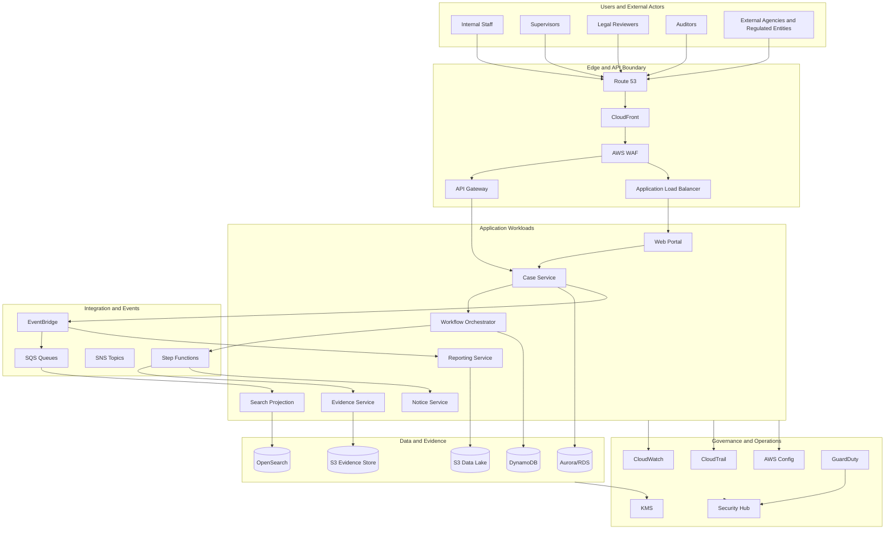

The diagram is not the architecture. It is only the visible surface.

The architecture is the set of decisions behind it:

- which accounts own which services;
- which paths are allowed;
- which logs are immutable;
- which identities can assume which roles;
- which failures are tolerated;
- which changes are blocked;
- which data can move across boundaries;
- which controls produce evidence.

---

## 8. Account and OU Strategy

A regulated workload should not run in a single AWS account. One account is too coarse for security, audit, blast-radius control, and operational separation.

A reasonable starting structure:

```mermaid
flowchart TB
    Root[AWS Organization]

    Root --> SecurityOU[Security OU]
    Root --> InfrastructureOU[Infrastructure OU]
    Root --> WorkloadsOU[Workloads OU]
    Root --> SandboxOU[Sandbox OU]
    Root --> SuspendedOU[Suspended OU]

    SecurityOU --> LogArchive[Log Archive Account]
    SecurityOU --> Audit[Audit Account]
    SecurityOU --> SecurityTooling[Security Tooling Account]

    InfrastructureOU --> Network[Network Account]
    InfrastructureOU --> SharedServices[Shared Services Account]
    InfrastructureOU --> Platform[Platform Tooling Account]

    WorkloadsOU --> Dev[RegulaCase Dev Account]
    WorkloadsOU --> Test[RegulaCase Test Account]
    WorkloadsOU --> Staging[RegulaCase Staging Account]
    WorkloadsOU --> Prod[RegulaCase Prod Account]
    WorkloadsOU --> Analytics[Analytics Account]

    SandboxOU --> EngineerSandbox[Engineer Sandbox Accounts]
```

### 8.1 Account Responsibilities

| Account | Responsibility |
|---|---|
| Management account | Organization-level administration only; no workloads. |
| Log Archive | Central immutable-ish log archive for CloudTrail, Config, VPC Flow Logs, WAF logs, DNS logs, application audit exports. |
| Audit | Read-only or security-review access for auditors and security reviewers. |
| Security Tooling | GuardDuty, Security Hub, Detective, Macie, Access Analyzer aggregation, security automation. |
| Network | Transit Gateway, inspection VPC, shared ingress/egress controls, Route 53 Resolver, hybrid connectivity. |
| Shared Services | IAM Identity Center integration, shared directory services, artifact registries if centralized, internal DNS. |
| Platform Tooling | CI/CD, IaC pipelines, environment factory, service catalog, golden path templates. |
| Dev/Test/Staging/Prod | Environment-specific application workloads. |
| Analytics | Data lake, reporting, governance, read models, analytical workloads. |
| Sandbox | Isolated experimentation with restrictive SCPs and budgets. |

### 8.2 Why This Matters

Account boundaries provide:

- blast-radius reduction;
- billing and cost isolation;
- permission boundary simplification;
- log ownership separation;
- security duty separation;
- environment lifecycle control;
- easier incident containment;
- clearer audit evidence.

Do not create accounts randomly. Create accounts when the boundary gives you stronger control, clearer ownership, or lower blast radius.

### 8.3 SCP Strategy

SCPs are not identity policies. They define the maximum available permission boundary for accounts in an organization.

Useful SCP patterns:

| SCP Pattern | Purpose |
|---|---|
| Deny disabling CloudTrail/Config/GuardDuty | Protect detection and evidence. |
| Deny leaving organization | Prevent rogue account detachment. |
| Deny unsupported Regions | Enforce data residency and governance. |
| Deny public S3 bucket policy except approved accounts | Reduce accidental exposure. |
| Deny root user actions except break-glass recovery | Reduce unmanaged privileged actions. |
| Deny deleting KMS keys without exception workflow | Protect data recoverability. |
| Deny changes to log archive buckets outside security roles | Protect audit evidence. |

The key rule: **use SCPs for organization guardrails, not application-level authorization.**

---

## 9. Identity and Access Architecture

### 9.1 Human Access

Human access should be federated. Long-lived IAM users should not be the normal operating model.

Recommended pattern:

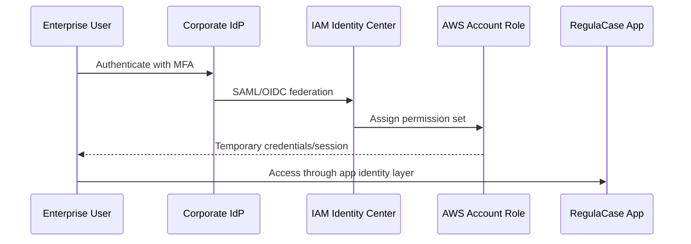

Human access should have layers:

| Layer | Control |
|---|---|
| Corporate identity | MFA, lifecycle, HR joiner/mover/leaver process. |
| IAM Identity Center | Permission sets, account assignments, session duration. |
| AWS IAM | Roles, policies, resource boundaries. |
| Application RBAC/ABAC | Business-level authorization. |
| Audit | Actor, session, request, reason, ticket. |

### 9.2 Workload Identity

Workloads should use roles, not embedded credentials.

| Workload | Identity Pattern |
|---|---|
| Lambda | Execution role. |
| ECS task | Task role and task execution role. |
| EKS pod | EKS Pod Identity or IRSA. |
| EC2 | Instance profile. |
| Cross-account automation | Explicit role assumption with external ID or trusted principal conditions. |
| CI/CD | OIDC/federated deployment role or tightly controlled pipeline role. |

### 9.3 Application Authorization

AWS IAM does not replace domain authorization.

RegulaCase needs domain authorization such as:

- investigator can edit assigned case notes;
- supervisor can approve escalation;
- legal reviewer can approve notice text;
- auditor can read evidence but cannot modify case state;
- external entity can view only its own notices and submissions;
- system integration can submit referral but not approve enforcement action.

A clean model separates:

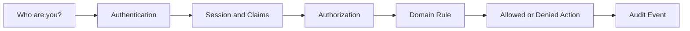

### 9.4 Privileged Access

Production privileged access must be rare, temporary, and logged.

Minimum controls:

- no shared admin users;
- no default SSH bastion dependency;
- Session Manager preferred for EC2 access;
- just-in-time role assumption;
- approval or ticket reference for elevated access;
- CloudTrail evidence;
- session logs where possible;
- break-glass path tested and reviewed;
- periodic access review.

---

## 10. Network Architecture

### 10.1 Network Principles

Regulated AWS networking should follow these rules:

1. **Private by default.** Workloads should not require public IPs.
2. **Explicit ingress.** External entry points are limited and protected.
3. **Controlled egress.** Outbound traffic is routed, inspected, and logged where required.
4. **Endpoint-first design.** Use VPC endpoints for AWS service access when appropriate.
5. **Segmentation by function.** Public, private app, private data, inspection, and shared-service zones are distinct.
6. **DNS is part of architecture.** Hybrid DNS and private hosted zones need ownership.
7. **Network logs are evidence.** Flow logs, WAF logs, DNS logs, and load balancer logs are retained intentionally.

### 10.2 VPC Layout

A production workload VPC might use three AZs and at least these subnet tiers:

| Subnet Tier | Purpose |
|---|---|
| Public ingress | ALB/NLB or edge integration if needed. |
| Private app | ECS/EKS/EC2 workloads. |
| Private data | Databases, caches, internal data services. |
| Private endpoint | Interface endpoints and endpoint security groups. |
| Inspection/egress | Firewall and NAT path, usually in network account for centralized model. |

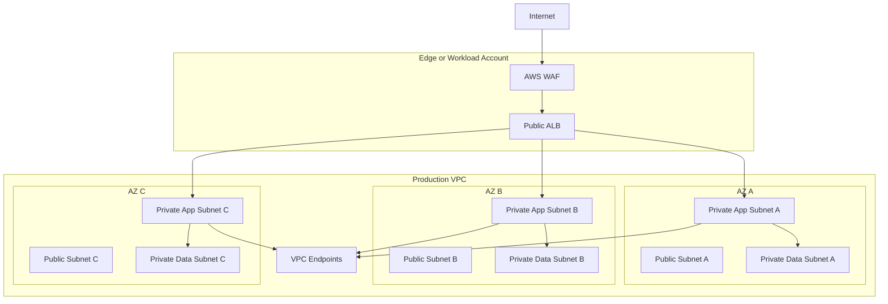

### 10.3 Ingress

Ingress choices:

| Use Case | Boundary |
|---|---|
| Public web portal | CloudFront + WAF + ALB/API Gateway. |
| Public API | API Gateway + WAF + authorizer + throttling. |
| Internal web app | Private ALB + VPN/Direct Connect/Zero Trust access path. |
| Partner API | API Gateway with mutual TLS/private connectivity/allowlist depending on sensitivity. |
| Event intake | EventBridge API destinations, partner event bus, or controlled API Gateway endpoint. |

Ingress should always define:

- TLS termination point;
- authentication point;
- request validation point;
- WAF rule scope;
- throttling scope;
- logging destination;
- ownership of certificates;
- failure behavior.

### 10.4 Egress

Outbound traffic is often under-designed.

For a regulated platform, egress should answer:

- Which workloads can reach the internet?
- Which destinations are allowed?
- Is traffic inspected?
- Is DNS logged?
- Are AWS service calls private through VPC endpoints?
- Can data be exfiltrated through unexpected paths?
- Are NAT costs visible?
- Are third-party integrations isolated?

A common model:

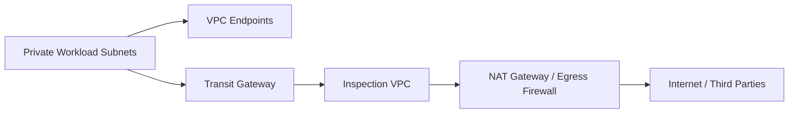

---

## 11. Application Architecture

RegulaCase should be decomposed by business capability, not by AWS service.

### 11.1 Suggested Bounded Contexts

| Domain | Responsibility |
|---|---|
| Identity and Access | Application-level user, role, team, assignment, delegation. |
| Case | Case metadata, lifecycle, parties, risk, ownership. |
| Workflow | State transitions, approvals, escalation, timers, SLA. |
| Evidence | Evidence metadata, file ingestion, integrity, retention, legal hold. |
| Document | Templates, generated documents, notice packages. |
| Notification | Email/SMS/postal/portal notification orchestration. |
| Search | Search projection and query index. |
| Reporting | Operational and compliance reporting models. |
| Audit | Append-only business audit events. |
| Integration | External APIs, inbound referrals, outbound status events. |

### 11.2 Compute Model

A reasonable architecture can mix ECS/Fargate, Lambda, and Step Functions.

| Capability | Good Fit | Why |
|---|---|---|
| Web portal | ECS/Fargate or static SPA + API | Predictable app serving and managed scaling. |
| Case service | ECS/Fargate or EKS | Stateful domain logic, database transactions, clear service ownership. |
| Workflow orchestration | Step Functions | Explicit long-running transitions, retries, human/system steps. |
| Event processors | Lambda or ECS workers | Asynchronous projection, notification, enrichment. |
| Search indexing | Lambda/ECS workers | Consume events and update OpenSearch. |
| Reporting jobs | Glue, Lambda, ECS scheduled tasks | Batch/analytical transformations. |
| AI assistance | Bedrock-mediated service | Controlled summarization/classification with logging and guardrails. |

Avoid the false debate of “serverless vs containers.” The real question is workload shape:

- request/response latency;
- execution duration;
- concurrency behavior;
- dependency packaging;
- operational ownership;
- scaling variability;
- cost curve;
- runtime constraints;
- compliance controls.

---

## 12. Case Lifecycle State Machine

The case lifecycle must be explicit. Hidden lifecycle transitions inside random service methods are dangerous in regulated systems.

Example state machine:

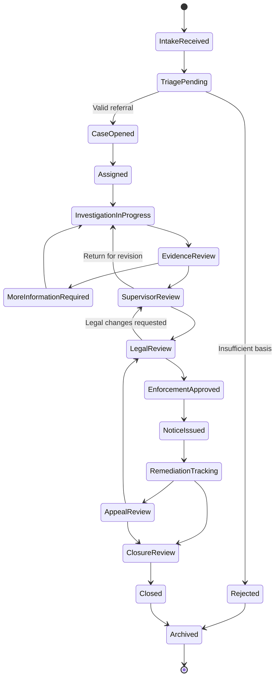

Each transition should define:

| Transition Concern | Example |
|---|---|
| Actor allowed | Investigator, supervisor, legal reviewer, system. |
| Preconditions | Required evidence present, risk score calculated, review completed. |
| Side effects | Audit event, notification, task assignment, SLA timer. |
| Data mutation | Case state, assigned team, due date, decision reason. |
| Idempotency | Repeated request cannot duplicate notice or audit side effect. |
| Compensation | Reversal or correction path if allowed. |
| Evidence | Before/after state and reason captured. |

Step Functions can orchestrate system steps, but the business state model should be owned by the domain, not blindly delegated to infrastructure.

---

## 13. Data Architecture

### 13.1 Data Store Mapping

| Data Type | Primary Store | Reason |
|---|---|---|
| Case core metadata | Aurora/RDS | Relational integrity, transactions, complex constraints. |
| Workflow runtime state | Step Functions + DynamoDB | Explicit orchestration and fast state lookup. |
| Evidence files | S3 | Durable object storage, retention, lifecycle, legal hold. |
| Evidence metadata | Aurora/RDS or DynamoDB | Depends on query and transaction needs. |
| Audit events | Append-only table + S3 export | Queryable operational audit plus long-term archive. |
| Search index | OpenSearch | Full-text and faceted search. |
| Notifications | DynamoDB/SQS/SNS/EventBridge | Event-driven delivery and retry tracking. |
| Reporting | S3 data lake + Glue/Athena/Redshift | Analytical access and historical reporting. |
| Caches | ElastiCache | Low-latency derived data, not source of truth. |

### 13.2 Source of Truth Rules

Every data element needs a source-of-truth decision.

Bad pattern:

> Case status is in Aurora, DynamoDB, OpenSearch, and S3, and whichever is latest is treated as truth.

Better pattern:

| Data | Source of Truth | Projections |
|---|---|---|
| Case state | Case database + audit log | Search index, reporting lake, dashboard cache. |
| Evidence object | S3 object + metadata record | Search OCR projection, reporting summaries. |
| Notification status | Notification service store | Audit log, reporting lake. |
| Assignment | Case service | Search index, operational dashboard. |

### 13.3 Audit Event Model

A regulated audit event should be structured.

Example logical schema:

```json
{
  "eventId": "evt-123",
  "eventType": "CASE_STATE_CHANGED",
  "occurredAt": "2026-07-01T10:15:30Z",
  "actor": {
    "type": "HUMAN",
    "subjectId": "user-456",
    "role": "SUPERVISOR",
    "sessionId": "session-789"
  },
  "target": {
    "caseId": "case-001",
    "tenantId": "agency-a"
  },
  "before": {
    "state": "SUPERVISOR_REVIEW"
  },
  "after": {
    "state": "LEGAL_REVIEW"
  },
  "reason": "Supervisor approved escalation to legal review",
  "requestId": "req-abc",
  "correlationId": "corr-def",
  "sourceIp": "203.0.113.10",
  "evidenceRefs": ["s3://evidence-bucket/case-001/doc-999"],
  "integrity": {
    "hash": "...",
    "schemaVersion": "audit.v1"
  }
}
```

Key rules:

- audit event is append-only;
- audit event is schema-versioned;
- actor identity is normalized;
- request ID and correlation ID are present;
- before/after is captured when material;
- event is exported to long-term archive;
- deletion is blocked or strongly controlled;
- corrections are new events, not silent mutation.

---

## 14. Event-Driven Backbone

RegulaCase should use events to decouple projections and side effects, but not to hide business correctness.

### 14.1 Event Categories

| Event Type | Example | Purpose |
|---|---|---|
| Domain event | `CaseOpened`, `EvidenceAccepted`, `NoticeIssued` | Business fact. |
| Integration event | `ExternalReferralReceived` | Boundary with external systems. |
| Audit event | `UserChangedCaseState` | Evidence and accountability. |
| Operational event | `IndexingFailed`, `NotificationRetryExceeded` | Operability. |
| Data event | `CaseProjectionUpdated` | Derived model update. |

### 14.2 Backbone Pattern

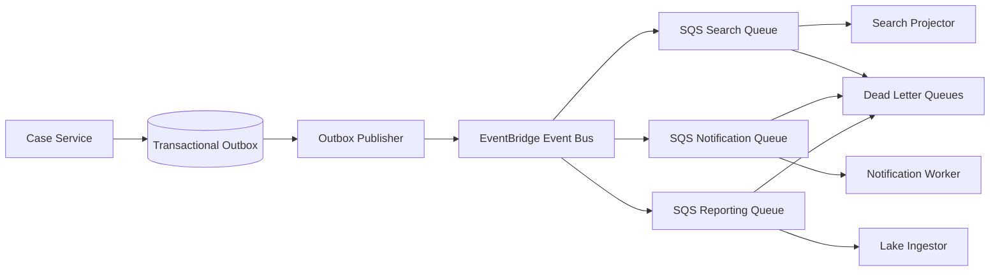

### 14.3 Event Invariants

- Events are facts, not commands disguised as facts.
- Event schema is versioned.
- Consumers are idempotent.
- DLQs are monitored and owned.
- Replay behavior is documented.
- PII in events is minimized.
- EventBridge archive/replay is used intentionally, not as a substitute for a real data recovery plan.
- Critical state transitions are not considered complete until source-of-truth transaction and audit event are durable.

---

## 15. Evidence and Document Architecture

Evidence handling is central to a regulated platform.

### 15.1 Evidence Object Flow

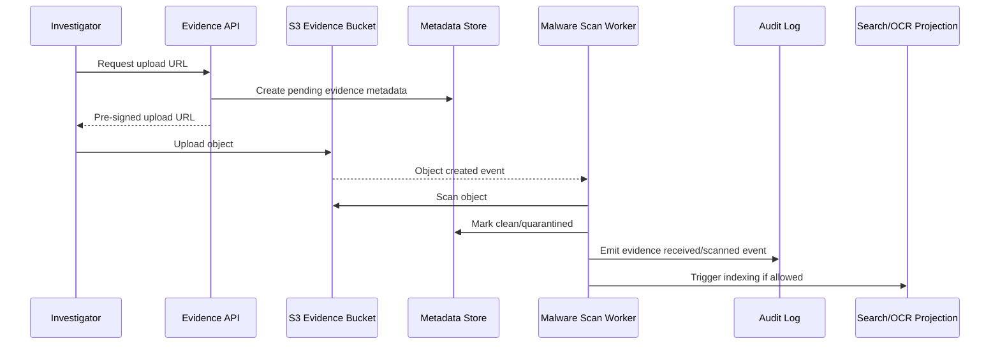

### 15.2 Evidence Controls

| Control | Purpose |
|---|---|
| S3 bucket per environment/domain | Isolation and policy simplicity. |
| KMS encryption | Cryptographic control and access logging. |
| Object versioning | Protection against overwrite. |
| Object Lock where required | Retention and write-once-read-many behavior for certain records. |
| Legal hold workflow | Prevent deletion while case/legal process is active. |
| Pre-signed upload constraints | Limit upload scope, size, content type, and duration. |
| Malware scanning | Reduce risk from untrusted uploads. |
| Metadata transaction | Object is not accepted until metadata and scan state are consistent. |
| Hashing | Integrity verification. |
| Lifecycle rules | Transition/archive/delete according to retention policy. |

### 15.3 Retention Model

Retention should be policy-driven.

| Record Type | Example Retention Rule |
|---|---|
| Rejected intake | 2 years after rejection. |
| Closed case | 7 years after closure. |
| Enforcement action | 10 years or statute-defined period. |
| Legal hold | Until hold released, regardless of default lifecycle. |
| Audit logs | Longer than operational logs; sometimes aligned to regulatory requirement. |
| Security logs | Aligned to incident response and compliance framework. |

Do not encode retention only in application code. Use S3 lifecycle, Object Lock where appropriate, retention metadata, and governance workflows.

---

## 16. Security Architecture

### 16.1 Defense-in-Depth Layers

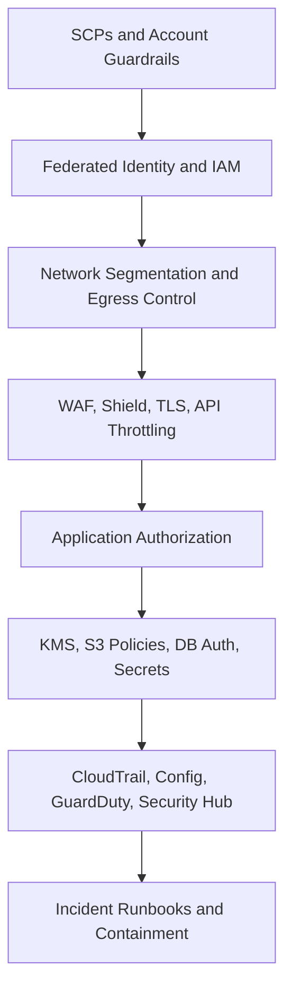

### 16.2 KMS Strategy

Use KMS intentionally.

| Key Scope | Example |
|---|---|
| AWS managed key | Low-risk service defaults where key policy control is not required. |
| Customer managed key per domain | Evidence, audit logs, sensitive case data. |
| Customer managed key per tenant | Only when tenant isolation or contractual requirement justifies complexity. |
| Multi-Region key | Only when multi-Region cryptographic continuity is required. |

Key design should answer:

- Who administers the key?
- Who uses the key?
- Which services can use the key on behalf of principals?
- What encryption context is required?
- What happens if the key is disabled?
- How is deletion prevented?
- How are grants audited?
- How is cross-account access controlled?

### 16.3 Secrets

Secrets handling rules:

- store secrets in Secrets Manager or approved equivalent;
- avoid secrets in environment variables when exposure risk is unacceptable;
- rotate where feasible;
- separate secret read from secret administration;
- log access patterns, not secret values;
- never place secrets in CI logs, build artifacts, container images, or IaC state;
- define incident runbook for secret compromise.

### 16.4 Threat Model

| Threat | Control |
|---|---|
| Accidental public exposure | SCPs, S3 Block Public Access, Config rules, Security Hub findings. |
| Privilege escalation | Least privilege, permission boundaries, IAM Access Analyzer, review of `iam:PassRole`. |
| Data exfiltration | Egress control, VPC endpoints, KMS policies, Macie, GuardDuty, CloudTrail. |
| Unauthorized case access | App RBAC/ABAC, row/tenant scoping, audit events. |
| Tampering with evidence | S3 versioning, Object Lock, KMS, restricted delete, audit log. |
| Malicious upload | Pre-signed constraints, malware scanning, quarantine bucket/prefix. |
| Insider misuse | Segregation of duties, session logging, anomaly detection, supervisor review. |
| Supply-chain compromise | Artifact signing, dependency scanning, provenance, restricted deployment roles. |
| Logging disabled | SCP deny, Config detection, Security Hub alerting. |
| Key deletion | SCP/policy control, scheduled deletion monitoring, break-glass review. |

---

## 17. Compliance and Auditability

Compliance is not a PDF generated at the end of the project. It is an operating model.

### 17.1 Control-to-Evidence Map

| Control Objective | AWS Evidence Source | Owner |
|---|---|---|
| API activity is recorded | CloudTrail organization trail | Security/platform |
| Resource configuration is tracked | AWS Config aggregator | Security/platform |
| Security findings are aggregated | Security Hub | Security operations |
| Threats are detected | GuardDuty | Security operations |
| Evidence objects are retained | S3 versioning/Object Lock/lifecycle reports | Application/platform |
| Access is reviewed | IAM Identity Center assignments, IAM Access Analyzer | Security/IAM owner |
| Deployments are approved | CI/CD pipeline logs, change tickets, artifact metadata | Platform/application |
| Incidents are managed | Incident Manager/OpsCenter/ticketing records | Operations |
| Backups are tested | AWS Backup reports, restore drill records | Application/platform |
| Cost is allocated | Tags, CUR/Data Exports, budgets | FinOps/workload owner |

### 17.2 Audit Event vs CloudTrail

Do not confuse application audit with CloudTrail.

| Audit Type | Captures | Example |
|---|---|---|
| CloudTrail | AWS API activity | Role assumed, S3 object deleted, security group changed. |
| Application audit | Business action | Supervisor approved enforcement notice. |
| Data audit | Data access/change | User viewed sensitive evidence. |
| Deployment audit | Change history | Version 1.42 deployed to production. |
| Operational audit | Incident/action history | On-call operator restarted worker through runbook. |

You usually need all of them.

### 17.3 Evidence Quality

Good evidence has:

- timestamp;
- actor;
- system of origin;
- resource or business entity affected;
- before/after where relevant;
- control identifier;
- retention period;
- integrity protection;
- access control;
- ownership;
- review status.

Weak evidence is a screenshot with no context.

---

## 18. Reliability and DR Architecture

### 18.1 Capability-Based RTO/RPO

Not every capability needs the same recovery target.

| Capability | Example RTO | Example RPO | Notes |
|---|---:|---:|---|
| Internal case view/edit | 1 hour | 15 minutes | Core operational capability. |
| Public notice portal | 4 hours | 1 hour | Important external visibility. |
| Evidence upload | 4 hours | 15 minutes | Must avoid evidence loss. |
| Search | 8 hours | 24 hours | Rebuildable projection if source of truth exists. |
| Analytics/reporting | 24-48 hours | 24 hours | Lower urgency. |
| Audit log ingest | 1 hour | Near-zero desired | Critical for defensibility. |

RTO/RPO without tests are wishes.

### 18.2 Availability Pattern

For primary Region production:

- multi-AZ VPC design;
- ALB/API Gateway across AZs;
- ECS/EKS workloads spread across AZs;
- Aurora Multi-AZ or Aurora cluster design;
- S3 regional durability;
- SQS/EventBridge managed availability;
- OpenSearch Multi-AZ if needed;
- CloudWatch alarms for AZ-level imbalance;
- dependency fallback where feasible.

### 18.3 DR Pattern

A practical regulated platform often starts with:

| Capability | DR Pattern |
|---|---|
| Core database | Cross-Region snapshot copy or Aurora Global Database depending RTO/RPO. |
| S3 evidence | Cross-Region Replication where required. |
| Audit archive | Cross-Region replication and restricted deletion. |
| IaC | Re-deployable from source in secondary Region. |
| Secrets/keys | Explicit secondary Region plan. |
| Search | Rebuild from events/source data. |
| Reporting lake | Replicate critical curated zones or rebuild from source. |
| Edge routing | Route 53 failover or controlled manual failover. |

### 18.4 Failover Runbook Outline

1. Declare incident and severity.
2. Identify impacted capability and Region/AZ/dependency.
3. Freeze non-emergency deployments.
4. Confirm current data replication status.
5. Decide failover mode: partial, service-specific, or full platform.
6. Promote secondary database or restore backup if required.
7. Deploy or scale application stack in secondary Region.
8. Switch traffic using Route 53/ARC/manual controlled process.
9. Validate core workflows.
10. Communicate status to stakeholders.
11. Monitor error rate, latency, queue depth, data consistency.
12. Record evidence of actions and timing.
13. Plan failback only after root cause and consistency review.

---

## 19. Observability and Operations

### 19.1 Observability Contract

Each service must expose:

| Signal | Requirement |
|---|---|
| Metrics | Request count, error rate, latency, saturation, dependency errors, queue depth. |
| Logs | Structured JSON, request ID, correlation ID, actor where appropriate, no secrets. |
| Traces | Cross-service causal path for critical request flows. |
| Events | Business events and operational events. |
| Audit | Domain-relevant immutable business action history. |
| Dashboards | Service, workload, executive/SLO, and incident views. |
| Alarms | Actionable, owner-bound, runbook-linked. |

### 19.2 Example SLOs

| User Journey | SLI | Example SLO |
|---|---|---|
| View case | Successful case view requests under latency threshold | 99.5% under 800 ms monthly. |
| Submit evidence | Successful accepted uploads | 99.0% monthly excluding client/network errors. |
| Change case state | Valid state transition success | 99.9% monthly. |
| Issue notice | Notice workflow reaches delivery provider | 99.5% within 15 minutes. |
| Search cases | Search queries successful | 99.0% under 2 seconds. |

The exact numbers must come from business needs and empirical performance. The point is to make user experience measurable.

### 19.3 Runbook Inventory

Minimum runbooks:

- elevated error rate on Case API;
- database failover or connection exhaustion;
- SQS backlog growth;
- DLQ message triage;
- evidence upload failure;
- malware scan failure;
- OpenSearch degraded cluster;
- notification delivery failure;
- CloudTrail/Config disabled alert;
- KMS key disabled or access denied;
- WAF false-positive surge;
- deployment rollback;
- secret compromise;
- suspected data exposure;
- regional failover;
- restore from backup.

Each runbook should include:

- trigger;
- severity;
- owner;
- dashboard links;
- diagnostic commands;
- safe mitigations;
- escalation path;
- rollback path;
- customer/stakeholder communication guidance;
- evidence to collect;
- post-incident review questions.

---

## 20. CI/CD and Change Control

### 20.1 Deployment Pipeline

```mermaid
flowchart LR
    Dev[Developer Commit]
    PR[Pull Request]
    CI[CI Build and Tests]
    Scan[Security and Dependency Scan]
    Artifact[Immutable Artifact]
    DevDeploy[Deploy Dev]
    TestDeploy[Deploy Test]
    StageDeploy[Deploy Staging]
    Approval[Change Approval]
    ProdCanary[Production Canary]
    ProdFull[Production Full Rollout]
    Observe[Post-Deploy Observation]

    Dev --> PR --> CI --> Scan --> Artifact
    Artifact --> DevDeploy --> TestDeploy --> StageDeploy --> Approval --> ProdCanary --> Observe --> ProdFull
```

### 20.2 Release Invariants

- Build once, promote same artifact.
- Environment configuration is externalized and versioned.
- Production deployment requires change evidence.
- Database migration is backward-compatible before rollout.
- Canary or blue/green is used for risky services.
- Rollback and roll-forward are known before deployment.
- Alarms can stop deployment automatically where supported.
- Deployment metadata is written to observability systems.
- Emergency changes still produce evidence.

### 20.3 IaC Promotion

IaC changes should pass through:

1. static validation;
2. policy-as-code checks;
3. security review for sensitive changes;
4. change set/plan review;
5. non-prod deployment;
6. drift detection;
7. production approval;
8. monitored rollout;
9. evidence archival.

The most dangerous IaC changes are often identity, network, KMS, logging, and deletion-related changes.

---

## 21. Data Governance and Analytics

### 21.1 Data Lake Zones

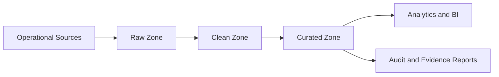

### 21.2 Governance Rules

| Rule | Purpose |
|---|---|
| Classify data at ingestion | Know sensitivity and handling requirements. |
| Minimize PII in analytical copies | Reduce exposure and access burden. |
| Use Glue Data Catalog | Central metadata and schema visibility. |
| Apply Lake Formation where appropriate | Fine-grained access to tables/columns. |
| Partition intentionally | Performance and cost. |
| Track lineage | Explain where reports came from. |
| Reconcile operational and analytical counts | Detect pipeline gaps. |
| Control exports | Prevent uncontrolled data movement. |

---

## 22. Cost and FinOps

### 22.1 Cost Allocation

Mandatory tags:

| Tag | Example |
|---|---|
| `Application` | `RegulaCase` |
| `Environment` | `prod` |
| `Owner` | `case-platform-team` |
| `CostCenter` | `regulatory-systems` |
| `DataClassification` | `restricted` |
| `BusinessCapability` | `case-management` |
| `Tenant` | Use carefully; sometimes via app metadata instead of AWS tag. |
| `ComplianceScope` | `regulated` |

### 22.2 Cost Drivers

| Area | Cost Driver |
|---|---|
| NAT Gateway | Data processing and hourly cost. |
| CloudWatch Logs | Ingestion, retention, high-cardinality logs. |
| OpenSearch | Instance/storage sizing and retention. |
| Aurora | Instance size, I/O, replicas, backup retention. |
| DynamoDB | RCU/WCU/on-demand, hot access patterns, GSIs. |
| S3 | Storage class, requests, replication, retrieval. |
| KMS | Request volume. |
| Data transfer | Cross-AZ, cross-Region, internet egress. |
| Lambda | Duration, memory, concurrency. |
| ECS/EKS | Compute utilization, overprovisioning, idle clusters. |
| Security tools | Aggregated findings, log volume, scans. |

### 22.3 Unit Economics

Define unit metrics:

- cost per active case per month;
- cost per evidence GB retained;
- cost per notice issued;
- cost per search query;
- cost per external referral processed;
- cost per tenant/agency;
- cost per audit report generated.

Without unit economics, cost optimization becomes random cutting.

---

## 23. AI Assistance Boundary

AI can help regulated case platforms, but it must be bounded.

Possible AI use cases:

- intake summarization;
- duplicate complaint detection;
- evidence classification;
- policy guidance retrieval;
- draft notice assistance;
- investigator note summarization;
- report generation assistance;
- anomaly detection in workload queues.

Unsafe pattern:

> AI autonomously changes enforcement state or issues a legal notice without human approval.

Safer pattern:

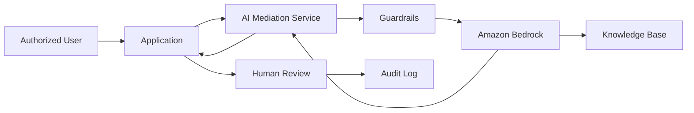

AI platform requirements:

- no uncontrolled prompt data leakage;
- model access through approved mediation service;
- prompt and output logging according to policy;
- guardrails and content filters;
- human approval for material decisions;
- evaluation datasets;
- hallucination mitigation through retrieval and citation where appropriate;
- data classification-aware access;
- cost controls;
- incident path for harmful output.

---

## 24. Decision Records

A senior engineer should produce decision records, not just diagrams.

### ADR-001: Use Multi-Account Landing Zone

| Field | Decision |
|---|---|
| Context | Regulated workload requires separation of duties, security tooling, logging, environment isolation. |
| Decision | Use AWS Organizations/Control Tower-style landing zone with Security, Infrastructure, Workloads, Sandbox OUs. |
| Consequences | More governance and account automation required; stronger isolation and auditability. |

### ADR-002: Use Aurora for Case Core

| Field | Decision |
|---|---|
| Context | Case state requires transactions, relationships, constraints, and reporting-friendly consistency. |
| Decision | Use Aurora/RDS for source-of-truth case metadata. |
| Consequences | Need connection scaling, migration discipline, backup/restore drills, and failover tests. |

### ADR-003: Use S3 for Evidence Store

| Field | Decision |
|---|---|
| Context | Evidence objects are large, durable, retention-bound, and need lifecycle/legal hold support. |
| Decision | Store evidence in S3 with versioning, KMS, retention controls, metadata record, and scan workflow. |
| Consequences | Need object/metadata consistency model, malware scanning, lifecycle governance, and access policy discipline. |

### ADR-004: Use EventBridge/SQS for Projections

| Field | Decision |
|---|---|
| Context | Search, reporting, notification, and audit projections should not block core transaction path unnecessarily. |
| Decision | Publish domain events via transactional outbox to EventBridge and SQS consumers. |
| Consequences | Need idempotency, DLQ ownership, replay rules, and schema governance. |

### ADR-005: Use Step Functions for Long-Running System Workflows

| Field | Decision |
|---|---|
| Context | Case lifecycle contains asynchronous steps, retries, approvals, timers, and integrations. |
| Decision | Use Step Functions for system orchestration while keeping business state rules in domain services. |
| Consequences | Need workflow versioning, idempotent tasks, explicit compensation, and observability. |

---

## 25. Failure Mode Matrix

| Failure Mode | Impact | Detection | Mitigation |
|---|---|---|---|
| Aurora writer unavailable | Case updates fail | DB alarms, app error rate | Multi-AZ failover, retry with backoff, connection pool tuning. |
| SQS backlog grows | Search/notification/reporting delayed | Queue age alarm | Scale consumers, inspect poison messages, DLQ triage. |
| OpenSearch degraded | Search degraded | Cluster health alarm | Degrade to filtered DB search, rebuild index from source. |
| Evidence upload fails | Users cannot submit evidence | S3/API error rate | Retry upload, alternate path, preserve metadata pending state. |
| Malware scanner fails | Evidence stuck pending | Pending scan age alarm | Scale scanner, quarantine, manual review workflow. |
| KMS access denied | Data read/write fails | KMS error metrics, app errors | Rollback key policy, break-glass security review. |
| WAF false positive | Users blocked | WAF logs, support tickets | Rule tuning, emergency allow rule with expiry. |
| CloudTrail disabled attempt | Evidence risk | Security alert | SCP deny, Security Hub escalation. |
| Bad deployment | User journey broken | Canary alarms | Auto rollback or manual rollback. |
| Region impairment | Platform degraded | Multi-signal incident | DR runbook, traffic shift, secondary activation. |
| Compromised secret | Unauthorized access risk | GuardDuty/app anomaly | Rotate secret, revoke sessions, investigate logs. |
| Hot DynamoDB partition | Throttling | Throttle metrics | Key redesign, write sharding, adaptive controls. |
| NAT failure/misroute | External integrations fail | Egress metrics/logs | Multi-AZ NAT, endpoint preference, route validation. |
| Accidental object deletion | Evidence loss risk | S3 event/audit | Versioning/Object Lock/restore process. |

---

## 26. Implementation Roadmap

### Phase 1: Foundation

- Establish Organizations/landing zone.
- Configure Security, Log Archive, Audit, Network, Platform accounts.
- Enable CloudTrail, Config, GuardDuty, Security Hub, IAM Access Analyzer.
- Define SCPs and Region restrictions.
- Establish IAM Identity Center and permission sets.
- Define tagging, naming, environment, and account vending standards.
- Create baseline VPCs and network routing.

Exit criteria:

- new account can be provisioned repeatably;
- logs flow to log archive;
- security findings aggregate centrally;
- baseline guardrails are enforced;
- break-glass access is tested.

### Phase 2: Platform Golden Path

- Create IaC modules/constructs for VPC, ECS/Lambda, API, S3, Aurora, DynamoDB, queues, alarms.
- Create CI/CD pipeline templates.
- Define service metadata standard.
- Define observability contract.
- Define secrets and KMS patterns.
- Create deployment promotion workflow.

Exit criteria:

- a new service can be created with approved defaults;
- deployment produces evidence;
- alarms and dashboards are generated by default;
- policy checks block unsafe changes.

### Phase 3: Core Case Platform

- Build case service and workflow model.
- Implement domain state machine.
- Implement audit event model.
- Implement evidence upload and scanning.
- Implement assignment, review, and approval flows.
- Implement application authorization.

Exit criteria:

- case lifecycle transitions are controlled;
- every material action emits audit event;
- evidence can be uploaded, scanned, retained, and retrieved;
- authorization tests cover critical roles.

### Phase 4: Integration and Projections

- Implement transactional outbox.
- Publish domain events.
- Build search projection.
- Build reporting ingest pipeline.
- Build notification workflow.
- Build external referral API.

Exit criteria:

- consumers are idempotent;
- DLQs are monitored;
- replay process is documented;
- search/reporting are eventually consistent by design.

### Phase 5: Production Readiness

- Load test critical journeys.
- Run backup and restore drills.
- Run incident game day.
- Run security review and threat model.
- Run Well-Architected review.
- Finalize runbooks and operational ownership.
- Configure budgets and cost anomaly detection.

Exit criteria:

- RTO/RPO claims are tested;
- SLO dashboards exist;
- runbooks are usable by on-call engineers;
- compliance evidence is available;
- production deployment is approved.

### Phase 6: Continuous Improvement

- Conduct recurring access review.
- Review costs and unit economics monthly.
- Review incidents and near misses.
- Review security findings and exceptions.
- Evolve workflow configuration safely.
- Expand automation and self-service.
- Revisit architecture when workload shape changes.

---

## 27. Architecture Review Checklist

### 27.1 Account and Governance

- [ ] Are accounts separated by responsibility and blast radius?
- [ ] Are logs stored outside workload accounts?
- [ ] Are Security/Audit/Log Archive accounts protected?
- [ ] Are SCPs used for critical preventive guardrails?
- [ ] Are unsupported Regions denied or controlled?
- [ ] Is account vending automated and repeatable?

### 27.2 Identity

- [ ] Is human access federated?
- [ ] Are long-lived IAM users avoided?
- [ ] Are production roles temporary and reviewed?
- [ ] Is application authorization separate from IAM?
- [ ] Is privileged access tied to approval/ticket/evidence?
- [ ] Are workload roles least-privileged?

### 27.3 Network

- [ ] Are workloads private by default?
- [ ] Are ingress points limited and protected?
- [ ] Is egress controlled and logged?
- [ ] Are VPC endpoints used where appropriate?
- [ ] Are route tables documented and tested?
- [ ] Are network logs retained?

### 27.4 Application and Workflow

- [ ] Is case lifecycle explicit?
- [ ] Are invalid state transitions impossible?
- [ ] Are approvals modeled as first-class workflow states?
- [ ] Are retries and idempotency handled?
- [ ] Are side effects event-driven and observable?
- [ ] Are domain events schema-versioned?

### 27.5 Data

- [ ] Is every source of truth defined?
- [ ] Are projections rebuildable?
- [ ] Are backup and restore tested?
- [ ] Are retention and legal hold rules implemented?
- [ ] Is sensitive data minimized in logs/events?
- [ ] Are data access paths audited?

### 27.6 Security

- [ ] Is encryption policy defined per data class?
- [ ] Are KMS key policies reviewed?
- [ ] Are secrets managed and rotated?
- [ ] Are Security Hub and GuardDuty findings triaged?
- [ ] Are WAF rules monitored for false positives?
- [ ] Is incident containment practiced?

### 27.7 Operations

- [ ] Are critical alarms actionable?
- [ ] Does every alarm have owner and runbook?
- [ ] Are dashboards layered by service/workload/executive view?
- [ ] Are deployment events visible in observability?
- [ ] Are incident response paths tested?
- [ ] Are post-incident reviews used to change the system?

### 27.8 Reliability

- [ ] Are RTO/RPO defined per capability?
- [ ] Are failover and restore runbooks tested?
- [ ] Are critical dependencies degraded gracefully?
- [ ] Are queues and DLQs monitored?
- [ ] Are AZ-level failures considered?
- [ ] Is multi-Region complexity justified by requirements?

### 27.9 Cost

- [ ] Are tags enforced?
- [ ] Are budgets and anomaly detection configured?
- [ ] Are high-cost services reviewed regularly?
- [ ] Are unit economics defined?
- [ ] Are retention policies cost-aware?
- [ ] Are idle environments controlled?

---

## 28. Common Anti-Patterns

| Anti-Pattern | Why It Fails |
|---|---|
| Single account for everything | No meaningful blast-radius or duty separation. |
| IAM-only authorization | IAM does not model business case rules. |
| Hidden workflow in application methods | Impossible to audit, reason about, or safely evolve. |
| Audit logs as plain application logs | Weak evidence and poor queryability. |
| Search index as source of truth | Derived index can lag, corrupt, or be rebuilt. |
| Multi-Region without tested failover | Expensive illusion of resilience. |
| DLQs nobody owns | Failure is merely delayed, not handled. |
| Public subnets for convenience | Expands attack surface unnecessarily. |
| Manual production changes | Creates drift, weak evidence, and inconsistent environments. |
| Cost review only after bill shock | No unit economics or ownership. |
| Compliance as document project | Controls are not continuously enforced or evidenced. |
| AI directly making regulated decisions | High legal, ethical, and correctness risk. |

---

## 29. Deliberate Practice Exercises

### Exercise 1: Defend the Account Model

Explain why the platform uses separate Security, Log Archive, Network, Platform, Prod, and Analytics accounts.

Then answer:

- What would break if all were merged?
- Which accounts require strongest guardrails?
- Which account should own centralized network inspection?
- Who can access Log Archive?
- How are exceptions approved?

### Exercise 2: Model a New Case Type

Add a new case type with extra legal review.

Design:

- state transitions;
- roles;
- audit events;
- data fields;
- reporting impact;
- retention impact;
- migration strategy;
- backward compatibility.

### Exercise 3: Evidence Tampering Scenario

Assume an insider tries to delete or replace evidence.

Explain:

- which controls prevent it;
- which controls detect it;
- which logs prove what happened;
- how restore works;
- what incident runbook runs;
- what evidence is given to auditors.

### Exercise 4: Search Index Corruption

OpenSearch index becomes corrupted.

Explain:

- source of truth;
- user impact;
- rebuild process;
- temporary degraded mode;
- alarms;
- runbook;
- data reconciliation.

### Exercise 5: Regional Impairment

Primary Region has severe impairment.

Explain:

- whether you fail over;
- who declares failover;
- which capabilities move first;
- data consistency risks;
- traffic control;
- user communication;
- failback process.

### Exercise 6: Cost Spike

Monthly bill increases 60%.

Investigate:

- CloudWatch log ingestion;
- NAT data processing;
- OpenSearch sizing;
- S3 replication;
- cross-AZ traffic;
- Aurora I/O;
- KMS request volume;
- queue retry storms;
- idle non-prod workloads.

Produce a cost RCA and prevention plan.

---

## 30. Final Mental Model

A regulated AWS platform is not a pile of managed services.

It is a system of boundaries:

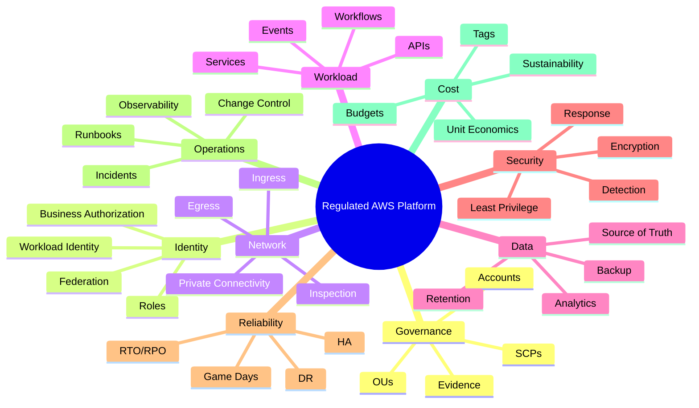

The architecture is good only if it can answer difficult questions:

- Who can do this?
- Who approved it?
- What changed?
- What failed?
- What data was affected?
- What evidence proves it?
- How do we restore?
- How do we contain?
- How much does it cost?
- How do we know the control still works?

That is AWS engineering maturity.

---

## 31. Self-Correction Checklist

Use this checklist to judge your own architecture.

- Can I explain the account model without naming services first?
- Can I draw all ingress and egress paths?
- Can I explain the difference between AWS audit, application audit, and data access audit?
- Can I identify every source of truth and every projection?
- Can I describe how a case state change is authorized, persisted, audited, and published?
- Can I recover from failed search without data loss?
- Can I prove evidence retention and legal hold behavior?
- Can I explain what happens if KMS access breaks?
- Can I explain which alarms page humans and why?
- Can I fail over or restore according to tested runbooks?
- Can I trace a production deployment to source, artifact, approval, and runtime version?
- Can I show cost by workload and business unit?
- Can I defend why multi-Region is or is not necessary?
- Can I onboard a new team through a golden path instead of tribal knowledge?

If the answer is mostly yes, you are thinking like a senior AWS platform engineer.

---

## 32. Completion Marker

This is the final part of the series:

```txt
learn-aws-part-035-capstone-regulated-enterprise-platform-on-aws.mdx
```

The **Learn AWS Engineering Mastery** series is now complete at **35 parts**.

---

## 33. References

Primary AWS references used as factual anchors for this capstone:

- AWS Well-Architected Framework: https://docs.aws.amazon.com/wellarchitected/latest/framework/welcome.html
- The pillars of the AWS Well-Architected Framework: https://docs.aws.amazon.com/wellarchitected/latest/framework/the-pillars-of-the-framework.html
- AWS Security Reference Architecture: https://docs.aws.amazon.com/prescriptive-guidance/latest/security-reference-architecture/introduction.html
- AWS SRA account structure: https://docs.aws.amazon.com/prescriptive-guidance/latest/security-reference-architecture/account-structure.html
- AWS Control Tower multi-account landing zone: https://docs.aws.amazon.com/controltower/latest/userguide/aws-multi-account-landing-zone.html
- What is AWS Control Tower: https://docs.aws.amazon.com/controltower/latest/userguide/what-is-control-tower.html
- Organizing your AWS environment using multiple accounts: https://docs.aws.amazon.com/whitepapers/latest/organizing-your-aws-environment/organizing-your-aws-environment.html
- AWS Control Tower logging guidance: https://docs.aws.amazon.com/prescriptive-guidance/latest/designing-control-tower-landing-zone/logging.html
- AWS SRA Log Archive account: https://docs.aws.amazon.com/prescriptive-guidance/latest/security-reference-architecture/log-archive.html
- AWS SRA Security Tooling account: https://docs.aws.amazon.com/prescriptive-guidance/latest/security-reference-architecture/security-tooling.html
- AWS Organizations SCPs: https://docs.aws.amazon.com/organizations/latest/userguide/orgs_manage_policies_scps.html
- IAM policy evaluation logic: https://docs.aws.amazon.com/IAM/latest/UserGuide/reference_policies_evaluation-logic.html
- Amazon VPC route tables: https://docs.aws.amazon.com/vpc/latest/userguide/subnet-route-tables.html
- AWS CloudTrail User Guide: https://docs.aws.amazon.com/awscloudtrail/latest/userguide/cloudtrail-user-guide.html
- AWS Config Developer Guide: https://docs.aws.amazon.com/config/latest/developerguide/WhatIsConfig.html
- Amazon GuardDuty User Guide: https://docs.aws.amazon.com/guardduty/latest/ug/what-is-guardduty.html
- AWS Security Hub User Guide: https://docs.aws.amazon.com/securityhub/latest/userguide/what-is-securityhub.html
- AWS Key Management Service Developer Guide: https://docs.aws.amazon.com/kms/latest/developerguide/overview.html
- AWS Systems Manager User Guide: https://docs.aws.amazon.com/systems-manager/latest/userguide/what-is-systems-manager.html
- AWS Step Functions Developer Guide: https://docs.aws.amazon.com/step-functions/latest/dg/welcome.html
- Amazon EventBridge User Guide: https://docs.aws.amazon.com/eventbridge/latest/userguide/eb-what-is.html
- Amazon SQS Developer Guide: https://docs.aws.amazon.com/AWSSimpleQueueService/latest/SQSDeveloperGuide/welcome.html
- Amazon S3 User Guide: https://docs.aws.amazon.com/AmazonS3/latest/userguide/Welcome.html
- Amazon RDS User Guide: https://docs.aws.amazon.com/AmazonRDS/latest/UserGuide/Welcome.html
- Amazon DynamoDB Developer Guide: https://docs.aws.amazon.com/amazondynamodb/latest/developerguide/Introduction.html
- Amazon CloudWatch User Guide: https://docs.aws.amazon.com/AmazonCloudWatch/latest/monitoring/WhatIsCloudWatch.html
- Amazon Bedrock User Guide: https://docs.aws.amazon.com/bedrock/latest/userguide/what-is-bedrock.html
