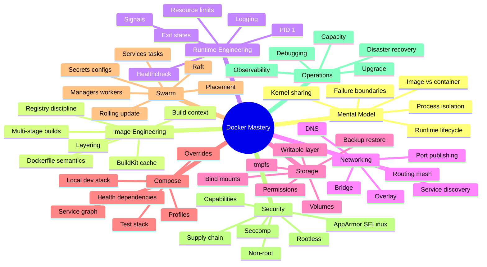
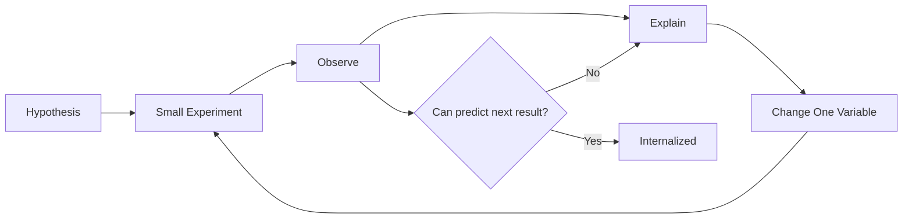
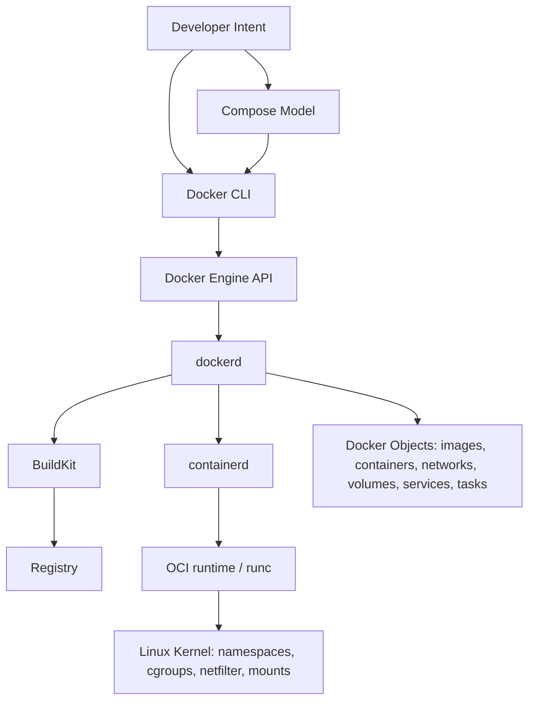
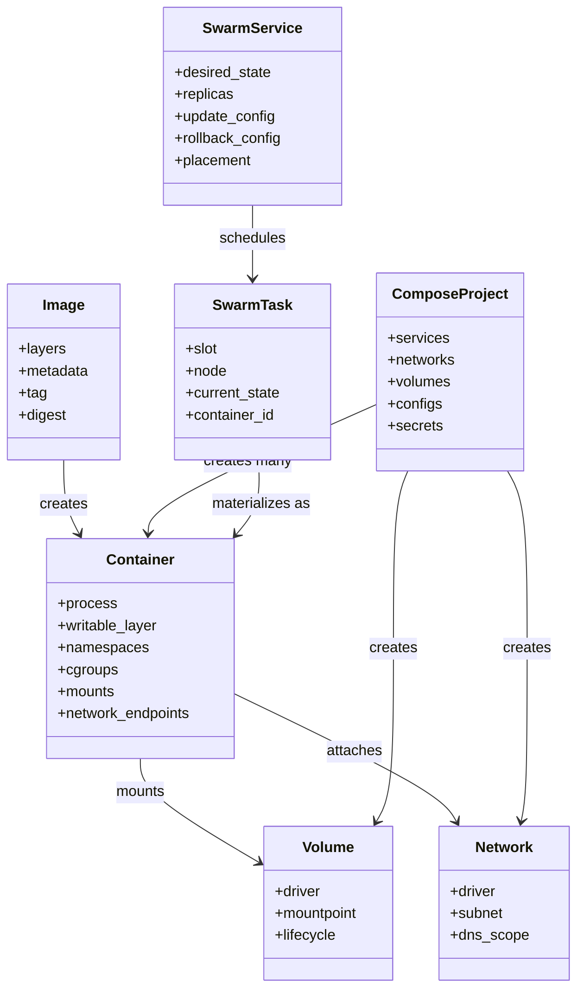

# Part 001 — Kaufman Skill Map for Docker Mastery

## 1. Tujuan Part Ini

Part ini bukan tutorial `docker run hello-world`. Part ini adalah **peta belajar operasional** untuk seri Docker, Containerization, Docker Compose, dan Docker Swarm.

Kita akan memakai pendekatan Josh Kaufman dari *The First 20 Hours*: bukan belajar sebanyak mungkin secara acak, tetapi **membongkar skill menjadi subskill**, belajar cukup untuk bisa mengoreksi diri, menghilangkan hambatan latihan, lalu melakukan latihan terarah pada bagian yang paling berdampak.

Dalam konteks software engineer senior, targetnya bukan sekadar bisa menjalankan container. Targetnya adalah bisa menjawab pertanyaan seperti ini dengan tenang:

- Mengapa container ini jalan di laptop tetapi gagal di CI?
- Apakah image ini aman, reproducible, dan tidak membawa secret?
- Mengapa service A di Compose tidak bisa resolve service B?
- Apakah data ini aman jika container dihancurkan?
- Apa yang terjadi ketika container menerima `SIGTERM`?
- Kapan cukup memakai Compose, kapan Swarm masuk akal, dan kapan perlu orchestrator lain?
- Bagaimana membuat rollback yang tidak bergantung pada keberuntungan?
- Bagaimana membedakan bug aplikasi, bug image, bug runtime, bug network, bug host, dan bug orchestration?

Docker secara resmi diposisikan sebagai platform untuk developing, shipping, dan running applications, dengan pemisahan aplikasi dari infrastructure. Docker Engine sendiri adalah teknologi containerization open source dengan model client-server: daemon `dockerd`, API, dan Docker CLI. Ini penting karena Docker bukan satu benda tunggal; ia adalah ekosistem object, daemon, runtime, image, registry, networking, storage, dan workflow automation.

Referensi resmi utama:

- Docker Engine: https://docs.docker.com/engine/
- Dockerfile reference: https://docs.docker.com/reference/dockerfile/
- BuildKit: https://docs.docker.com/build/buildkit/
- Docker Compose: https://docs.docker.com/compose/
- Compose application model: https://docs.docker.com/compose/intro/compose-application-model/
- Swarm key concepts: https://docs.docker.com/engine/swarm/key-concepts/
- Swarm services: https://docs.docker.com/engine/swarm/how-swarm-mode-works/services/
- Docker security: https://docs.docker.com/engine/security/

---

## 2. Prinsip Kaufman yang Kita Pakai

Kaufman menekankan bahwa skill cepat dikuasai ketika kita melakukan hal-hal berikut:

1. Menentukan target performa yang jelas.
2. Memecah skill kompleks menjadi subskill kecil.
3. Belajar cukup untuk mulai praktik dan mengoreksi kesalahan.
4. Menghilangkan hambatan latihan.
5. Melakukan latihan terarah minimal 20 jam.

Kita akan mengadaptasinya untuk engineering skill.

### 2.1 Target Performa

Target performa untuk seri ini:

> Mampu mendesain, membangun, menjalankan, mengamankan, mengamati, men-debug, dan mengoperasikan aplikasi containerized multi-service dari laptop hingga cluster Swarm kecil/menengah dengan reasoning yang defensible.

Ini bukan target “hafal command Docker”. Command hanya interface. Skill sebenarnya ada pada mental model berikut:

- image adalah artifact immutable;
- container adalah process runtime yang diberi isolation, resource control, filesystem view, network view, dan metadata;
- Compose adalah model aplikasi multi-service;
- Swarm adalah desired-state orchestration layer di atas Docker Engine;
- security container adalah defense-in-depth, bukan magic sandbox;
- production readiness ditentukan oleh determinism, observability, rollback, resource boundary, secrets handling, dan failure-mode awareness.

### 2.2 Deconstruct: Skill Docker Itu Bukan Satu Skill

Docker mastery adalah bundle subskill.



Top 1% engineer tidak hanya tahu setiap cabang; mereka tahu **relasi antar-cabang**. Misalnya, masalah startup service bisa berasal dari Compose dependency, DNS, healthcheck, process readiness, database migration, atau aplikasi yang tidak menangani retry. Masalah memory bisa berasal dari JVM heap, cgroup limit, OOM killer, container restart policy, atau scheduler placement.

### 2.3 Learn Enough to Self-Correct

Dalam seri ini, setiap part harus membuat kamu bisa mengoreksi diri melalui pertanyaan seperti:

- Apa object Docker yang sedang berubah: image, container, network, volume, service, task, stack, atau registry artifact?
- Apakah masalah terjadi saat build-time, push-time, pull-time, create-time, start-time, run-time, shutdown-time, atau deploy-time?
- Apakah state berada di image, writable layer, volume, bind mount, external service, registry, atau orchestrator state?
- Apakah failure ini deterministic atau tergantung race condition?
- Apakah command yang dipakai mengubah desired state atau hanya melihat current state?

### 2.4 Remove Barriers

Hambatan belajar Docker biasanya bukan konsepnya, tetapi friction berikut:

| Friction | Efek | Cara Menghilangkan |
|---|---|---|
| Banyak command tapi tidak tahu object model | Hafal command tanpa reasoning | Mulai dari object model dan lifecycle |
| Setup lokal tidak konsisten | Praktik gagal karena environment | Standarisasi lab folder dan Compose project |
| Tidak bisa melihat isi container/network | Debugging jadi trial-and-error | Biasakan `inspect`, `logs`, `events`, `exec`, `stats` |
| Menganggap container seperti VM kecil | Salah desain process, state, update | Gunakan mental model process + filesystem view |
| Image terlalu besar dan mutable | Build lambat, rentan, susah audit | Pakai multi-stage, cache discipline, pinning |
| Secret bocor ke image/env/log | Risiko security tinggi | Pisahkan build secret dan runtime secret |
| Tidak membedakan readiness vs startup | Compose/Swarm tampak flaky | Gunakan healthcheck dan retry app-level |

### 2.5 Practice Loop

Setiap konsep harus melewati loop berikut:



Jika kamu belum bisa memprediksi akibat dari perubahan kecil, berarti belum menguasai mental model-nya. Misalnya:

- Ubah `ENTRYPOINT`, apa beda dengan `CMD`?
- Hapus named volume, apa data database hilang?
- Ganti network dari default bridge ke custom bridge, apa DNS berubah?
- Set memory limit terlalu rendah, apa proses exit atau OOM?
- Tambahkan `depends_on`, apakah service benar-benar siap menerima traffic?

---

## 3. Scope Seri

Seri ini mencakup:

1. Containerization mental model.
2. Docker Engine architecture.
3. Docker image dan Dockerfile engineering.
4. BuildKit, cache, multi-stage build, dan build reproducibility.
5. Runtime lifecycle, resource management, dan observability.
6. Docker networking dan storage.
7. Docker Compose untuk development, testing, dan bounded production.
8. Security, secrets, hardening, supply chain, SBOM, scanning.
9. Docker Swarm architecture, services, tasks, stacks, overlay network, rolling update, rollback, HA, dan operations.
10. Patterns, anti-patterns, decision framework, dan capstone platform.

Seri ini tidak akan mengulang detail dari seri Java lain. Ketika memakai contoh Java, fokusnya pada container boundary, bukan Spring Boot, JPA, networking Java, atau API design.

### 3.1 Yang Sengaja Tidak Jadi Fokus Utama

| Area | Alasan |
|---|---|
| Kubernetes deep dive | Ini seri Docker/Compose/Swarm. Kubernetes hanya akan disebut sebagai pembanding boundary. |
| Bahasa pemrograman tertentu | Container boundary bersifat lintas bahasa. |
| Cloud provider managed container services | Bisa dibahas sebagai extension, tetapi bukan core skill Docker. |
| CI/CD lengkap | Kita bahas build/release interface, bukan seluruh platform CI/CD. |
| GUI Docker Desktop | Berguna, tapi top-level skill harus CLI/API/model-based. |

---

## 4. Mental Model Utama: Docker sebagai Layered Control Plane

Jangan melihat Docker sebagai “tool untuk menjalankan container”. Lihat sebagai beberapa layer:



Docker Engine documentation menyebut Engine sebagai client-server application yang terdiri dari daemon, API, dan CLI. Dokumentasi `dockerd` juga menjelaskan bahwa daemon bergantung pada OCI-compliant runtime melalui `containerd` untuk berinteraksi dengan Linux namespaces, cgroups, dan SELinux.

Implikasi praktis:

- ketika command gagal, belum tentu container gagal;
- ketika build gagal, belum tentu runtime bermasalah;
- ketika container exit, belum tentu Docker bermasalah;
- ketika service tidak reachable, masalah bisa ada di DNS, network, port publishing, firewall, app binding, atau health;
- ketika Swarm tidak reconcile, masalah bisa ada di desired state, manager quorum, task scheduling, node availability, atau image pull.

---

## 5. Object Model yang Harus Dikuasai

Docker object model adalah fondasi untuk semua debugging.

| Object | Sifat | Pertanyaan Kunci |
|---|---|---|
| Image | Immutable artifact berlapis | Dibangun dari apa? Tag/digest apa? Multi-arch? Vulnerable? |
| Container | Runtime instance dari image | State apa? Exit code apa? Health apa? Resource limit apa? |
| Layer | Unit filesystem image | Cache kena atau miss? Ada secret tertinggal? |
| Volume | Durable Docker-managed storage | Siapa owner? Backup bagaimana? Lifecycle bagaimana? |
| Bind mount | Host path masuk ke container | Path benar? Permission benar? Risiko host leakage? |
| Network | Connectivity domain | DNS resolve? Port publish? Bridge/overlay? |
| Context | Target Engine endpoint | Command berjalan ke daemon mana? |
| Compose project | Group multi-service lokal | Project name apa? Network/volume prefix apa? |
| Service | Desired state di Swarm | Berapa replica? Update policy? Placement? |
| Task | Unit eksekusi Swarm | Assigned ke node mana? Current state apa? |
| Stack | Group services di Swarm | Compose deploy spec apa? Config/secrets apa? |
| Secret | Sensitive runtime blob | Siapa diberi akses? Rotasi bagaimana? |
| Config | Non-sensitive runtime config | Immutable versioning bagaimana? |

### 5.1 Object Relationship



---

## 6. Skill Levels dan Evaluation Rubric

### 6.1 Level 0 — Command User

Ciri:

- bisa `docker run`, `docker ps`, `docker build`;
- sering copy-paste Dockerfile;
- menghapus semua container/volume ketika bingung;
- belum paham kenapa `localhost` di container berbeda dari `localhost` host;
- belum bisa menjelaskan image layer atau volume lifecycle.

Ini cukup untuk demo, tidak cukup untuk engineering.

### 6.2 Level 1 — Application Containerizer

Ciri:

- bisa membuat Dockerfile untuk aplikasi;
- paham build context, `.dockerignore`, dan image size;
- bisa menjalankan database + app dengan Compose;
- bisa membaca logs dan inspect container;
- bisa memperbaiki masalah port binding, env, dan volume dasar.

Target minimal setelah beberapa part awal.

### 6.3 Level 2 — Production-Aware Engineer

Ciri:

- bisa membuat image kecil, reproducible, non-root, dan tidak membawa secret;
- bisa mendesain healthcheck, graceful shutdown, dan restart policy;
- bisa membedakan startup order dan readiness;
- bisa menentukan state mana yang boleh berada di container dan mana yang harus di volume/external service;
- bisa men-debug memory, DNS, file permission, dan network issue secara sistematis.

Ini target utama untuk engineer product/platform senior.

### 6.4 Level 3 — Platform Engineer

Ciri:

- bisa mendesain Compose stack untuk dev/test yang reliable;
- bisa membuat build pipeline dengan cache, SBOM/scanning, digest pinning, dan promotion gate;
- bisa mengoperasikan Swarm service, rolling update, rollback, node drain, secrets, configs, dan placement;
- bisa membuat runbook incident untuk container platform;
- bisa menjelaskan trade-off Docker vs Compose vs Swarm vs Kubernetes secara defensible.

### 6.5 Level 4 — Top 1% Practical Fluency

Ciri:

- tidak hanya tahu best practice, tetapi tahu **alasan dan failure mode**;
- bisa membuat keputusan arsitektural dengan constraints nyata;
- bisa menulis Dockerfile/Compose/Stack yang terbaca, aman, dan operable;
- bisa melakukan forensics tanpa panik;
- bisa melatih engineer lain dan membuat guardrail organisasi.

Rubrik sederhana:

| Dimensi | Belum Cukup | Cukup | Advanced |
|---|---|---|---|
| Build | Build berhasil | Build cepat dan kecil | Build reproducible, cache-aware, scanned, policy-gated |
| Runtime | Container jalan | Graceful shutdown dan healthcheck | Resource-aware, signal-safe, observable |
| Network | Port bisa diakses | DNS/service network paham | Bisa debug bridge/overlay/routing mesh |
| Storage | Data muncul | Volume lifecycle paham | Backup/restore/permission/state strategy kuat |
| Security | Tidak pakai privileged | Non-root dan cap drop | Supply chain + runtime hardening + secrets governance |
| Compose | Multi-service jalan | Dev/test repeatable | Profiles, overrides, health gates, CI isolation |
| Swarm | Service deploy | Rolling update/rollback | Quorum, placement, HA, secrets/configs, incident runbook |

---

## 7. Roadmap Belajar 35 Part

Seri lengkap terdiri dari 35 part. Part 035 adalah penutup/capstone.

### Phase 1 — Foundation

1. Kaufman Skill Map.
2. Containerization Mental Model.
3. Docker Architecture and Object Model.
4. Local Environment and Operational Baseline.

### Phase 2 — Image, Build, Runtime

5. Image Internals.
6. Dockerfile Semantics.
7. BuildKit and Multi-Stage Builds.
8. Production-Grade Image Design.
9. Container Runtime Lifecycle.
10. Resource Management.

### Phase 3 — Host Integration

11. Docker Networking Single Host.
12. Docker Storage.
13. Host Boundaries.
14. Debugging Containers.

### Phase 4 — Compose

15. Compose Application Model.
16. Compose File Deep Dive.
17. Dependency, Health, Startup Order.
18. Development Workflows.
19. Testing and Integration Environments.
20. Production Boundaries.

### Phase 5 — Security and Supply Chain

21. Container Security Model.
22. Least Privilege Runtime Hardening.
23. Secrets and Sensitive Data.
24. Image Supply Chain.

### Phase 6 — Swarm

25. Swarm Mode Architecture.
26. Services, Tasks, Scheduling.
27. Overlay Networking and Routing Mesh.
28. Stacks and Compose Deploy Spec.
29. Secrets, Configs, Stateful Services.
30. Rolling Updates and Rollbacks.
31. Operations, HA, Backup, Quorum.

### Phase 7 — Advanced Engineering

32. Observability.
33. Performance and Capacity.
34. Patterns, Anti-Patterns, Decision Frameworks.
35. Capstone Production-Grade Container Platform.

---

## 8. The 20-Hour Practice Plan

Kaufman-style 20 hours bukan berarti menjadi expert dalam 20 jam. Untuk Docker, 20 jam pertama dipakai untuk mencapai **working fluency**: cukup paham untuk praktik mandiri dan mengoreksi error sendiri.

### 8.1 Hour 0–2: Orientation and Object Model

Tujuan:

- memahami object: image, container, volume, network;
- menjalankan container dan membaca state;
- melihat hubungan `docker run`, `docker create`, `docker start`, `docker stop`, `docker rm`.

Latihan:

```bash
mkdir -p docker-lab/part-001
cd docker-lab/part-001

docker version
docker info
docker context ls
docker run --name web -d -p 8080:80 nginx:alpine
docker ps
docker inspect web
docker logs web
docker stop web
docker rm web
```

Pertanyaan koreksi diri:

- Object apa yang dibuat oleh `docker run`?
- Apa beda image `nginx:alpine` dan container `web`?
- Port mana milik host, mana milik container?
- Apa yang berubah setelah `docker stop`?

### 8.2 Hour 2–5: Dockerfile and Build

Tujuan:

- menulis Dockerfile sederhana;
- memahami build context;
- memahami layer dan cache;
- membedakan `CMD` dan `ENTRYPOINT`.

Latihan:

```dockerfile
FROM alpine:3.20
RUN addgroup -S app && adduser -S app -G app
WORKDIR /app
COPY hello.sh .
RUN chmod +x hello.sh
USER app
ENTRYPOINT ["./hello.sh"]
```

Pertanyaan koreksi diri:

- Mengapa `COPY` setelah `RUN apk add` biasanya lebih baik untuk cache?
- Apakah file di luar build context bisa di-copy?
- Apa yang terjadi jika `hello.sh` tidak executable?
- Siapa user runtime container?

### 8.3 Hour 5–8: Runtime Lifecycle

Tujuan:

- memahami PID 1;
- memahami signal handling;
- memahami exit code;
- memahami healthcheck.

Latihan:

- buat script yang menangkap `SIGTERM`;
- jalankan container;
- stop container;
- lihat apakah shutdown graceful;
- tambahkan healthcheck yang sengaja gagal.

Pertanyaan koreksi diri:

- Apakah proses menerima `SIGTERM`?
- Berapa lama sebelum `SIGKILL`?
- Exit code apa yang muncul?
- Health status berubah tetapi container tetap running atau tidak?

### 8.4 Hour 8–11: Networking

Tujuan:

- memahami custom bridge network;
- memahami container DNS;
- memahami `localhost` trap;
- memahami port publishing.

Latihan:

```bash
docker network create labnet
docker run -d --name api --network labnet nginx:alpine
docker run --rm --network labnet alpine:3.20 wget -qO- http://api
```

Pertanyaan koreksi diri:

- Mengapa `api` bisa di-resolve di custom network?
- Apa beda akses dari container lain dan akses dari host?
- Apa yang berubah jika tidak memakai custom network?

### 8.5 Hour 11–14: Storage

Tujuan:

- membedakan writable layer, volume, bind mount, tmpfs;
- memahami lifecycle data;
- memahami permission.

Latihan:

```bash
docker volume create labdata
docker run --rm -v labdata:/data alpine:3.20 sh -c 'date > /data/created.txt'
docker run --rm -v labdata:/data alpine:3.20 cat /data/created.txt
```

Pertanyaan koreksi diri:

- Mengapa data tetap ada meskipun container pertama hilang?
- Siapa owner file di volume?
- Apa beda named volume dan bind mount untuk portability?

### 8.6 Hour 14–17: Compose

Tujuan:

- membuat stack app + database;
- memahami service name DNS;
- memahami named volume;
- memahami startup order dan healthcheck.

Latihan:

```yaml
services:
  db:
    image: postgres:16-alpine
    environment:
      POSTGRES_PASSWORD: example
    healthcheck:
      test: ["CMD-SHELL", "pg_isready -U postgres"]
      interval: 5s
      timeout: 3s
      retries: 10
    volumes:
      - dbdata:/var/lib/postgresql/data

  adminer:
    image: adminer:latest
    ports:
      - "8080:8080"
    depends_on:
      db:
        condition: service_healthy

volumes:
  dbdata:
```

Pertanyaan koreksi diri:

- Apa nama network default?
- Apa hostname database dari container lain?
- Apakah `depends_on` menjamin aplikasi siap secara bisnis?
- Apa yang terjadi jika volume dihapus?

### 8.7 Hour 17–20: Swarm Mini-Lab

Tujuan:

- memahami service desired state;
- membuat replicated service;
- melakukan update dan rollback sederhana;
- membaca task state.

Latihan:

```bash
docker swarm init
docker service create --name web --replicas 3 -p 8080:80 nginx:alpine
docker service ps web
docker service update --image nginx:stable-alpine web
docker service rollback web
docker service rm web
docker swarm leave --force
```

Pertanyaan koreksi diri:

- Apa beda service dan container?
- Siapa yang menciptakan task?
- Apa desired state service?
- Apa current state task?

---

## 9. Learning Contract untuk Seri Ini

Agar pembelajaran tidak berubah menjadi bacaan pasif, setiap part akan mengikuti format:

1. Problem framing.
2. Mental model.
3. Core concepts.
4. Operational implications.
5. Failure modes.
6. Examples/labs.
7. Debugging checklist.
8. Self-test.
9. Production checklist.

### 9.1 Prinsip Materi

- Tidak menghafal command tanpa model.
- Tidak menulis Dockerfile tanpa memikirkan cache, security, dan reproducibility.
- Tidak memakai Compose tanpa memahami network dan volume yang dibuat.
- Tidak deploy Swarm service tanpa memahami desired state dan rollback.
- Tidak menyimpan state penting di writable container layer.
- Tidak menganggap container adalah security boundary sempurna.

### 9.2 Style Penulisan

Gaya materi akan seperti engineering handbook:

- singkat pada konsep mudah;
- detail pada area yang sering menjadi production failure;
- selalu membedakan local convenience dan production correctness;
- selalu mengaitkan command dengan object model;
- memberi checklist, invariant, dan anti-pattern.

---

## 10. Standard Lab Repository

Direkomendasikan memakai struktur lab berikut:

```text
docker-lab/
  README.md
  part-001/
  part-002/
  part-003/
  apps/
    hello-http/
    worker/
    api/
    frontend/
  compose/
    dev/
    test/
    observability/
  swarm/
    stack-files/
    secrets/
    configs/
  scripts/
    clean.sh
    inspect.sh
    net-debug.sh
```

Kenapa perlu struktur ini?

- setiap eksperimen reproducible;
- tidak mencampur build context;
- mudah membandingkan Compose dan Swarm;
- mudah membuat cleanup script;
- semua artifact latihan bisa masuk version control.

### 10.1 Baseline Tooling

Minimal:

```bash
docker version
docker info
docker compose version
```

Opsional tetapi berguna:

```bash
jq --version
git --version
curl --version
```

Untuk debugging mendalam di Linux:

```bash
ip -V
ss --version
nsenter --version
```

---

## 11. Core Invariants

Invariant adalah aturan mental yang jarang berubah dan membantu debugging.

### 11.1 Image Invariants

- Image harus dianggap immutable.
- Tag bisa berubah; digest adalah content-addressed reference.
- Layer lama bisa menyimpan data yang sudah “dihapus” di layer berikutnya.
- Build context menentukan file apa yang bisa dilihat builder.
- `.dockerignore` adalah bagian dari performance, security, dan determinism.

### 11.2 Container Invariants

- Container adalah process runtime, bukan VM penuh.
- Container berhenti ketika process utama berhenti.
- `localhost` di dalam container adalah network namespace container itu sendiri.
- Writable layer container bukan tempat state durable.
- PID 1 punya tanggung jawab signal dan child process handling.

### 11.3 Compose Invariants

- Compose membuat project-scoped resources.
- Service name menjadi DNS name di network Compose.
- `depends_on` mengatur dependency order, bukan menggantikan retry logic aplikasi.
- Named volume bertahan melewati container recreation.
- Override/profiles harus dijaga agar tidak membuat environment drift.

### 11.4 Swarm Invariants

- Service adalah desired state.
- Task adalah unit kerja yang dijadwalkan.
- Manager menjaga cluster state; worker menjalankan task.
- Raft quorum menentukan kemampuan manager mengambil keputusan cluster.
- Rolling update aman hanya jika health, readiness, rollback, dan state migration dipikirkan.

### 11.5 Security Invariants

- Container bukan boundary security absolut.
- Docker daemon/socket adalah high-privilege interface.
- Jangan build secret ke dalam image.
- Jangan default ke `--privileged`.
- Kurangi capability, user, mount, network, dan filesystem privilege.

---

## 12. Failure Taxonomy

Top 1% engineer cepat karena mereka punya taxonomy failure.

```mermaid
flowchart TD
    Failure[Containerized System Failure]
    Failure --> Build[Build Failure]
    Failure --> Runtime[Runtime Failure]
    Failure --> Network[Network Failure]
    Failure --> Storage[Storage Failure]
    Failure --> Security[Security Failure]
    Failure --> Orchestration[Orchestration Failure]
    Failure --> SupplyChain[Supply Chain Failure]

    Build --> B1[Missing file in context]
    Build --> B2[Cache invalidation]
    Build --> B3[Non-reproducible dependency]
    Build --> B4[Wrong platform architecture]

    Runtime --> R1[PID 1 signal issue]
    Runtime --> R2[OOM]
    Runtime --> R3[Bad env/config]
    Runtime --> R4[Healthcheck failure]

    Network --> N1[Wrong bind address]
    Network --> N2[DNS scope]
    Network --> N3[Port publishing]
    Network --> N4[Bridge/overlay issue]

    Storage --> S1[Permission]
    Storage --> S2[Ephemeral writable layer]
    Storage --> S3[Volume lifecycle]
    Storage --> S4[Host path drift]

    Security --> SE1[Secret leakage]
    Security --> SE2[Privileged container]
    Security --> SE3[Docker socket exposure]
    Security --> SE4[Vulnerable base image]

    Orchestration --> O1[Desired/current drift]
    Orchestration --> O2[Placement impossible]
    Orchestration --> O3[Quorum loss]
    Orchestration --> O4[Bad rollout policy]

    SupplyChain --> SC1[Mutable tag]
    SupplyChain --> SC2[Unsigned artifact]
    SupplyChain --> SC3[Unknown SBOM]
    SupplyChain --> SC4[Registry outage]
```



Saat incident, jangan mulai dari command acak. Mulai dari klasifikasi failure.

---

## 13. Practice Design: Dari Toy Example ke Realistic System

Toy example berguna untuk isolasi konsep, tetapi tidak cukup untuk engineering.

Kita akan naik level seperti ini:

1. Single container stateless.
2. Single container dengan volume.
3. App + database dengan Compose.
4. App + database + broker + observability.
5. Build pipeline dengan cache dan scanning.
6. Swarm service replicated.
7. Swarm stack multi-service.
8. Rolling update dan rollback drill.
9. Failure injection.
10. Capstone platform.

### 13.1 Progressive Complexity

```mermaid
flowchart LR
    A[Single Process] --> B[Image Build]
    B --> C[Container Runtime]
    C --> D[Network + Volume]
    D --> E[Compose Multi-Service]
    E --> F[CI Build + Registry]
    F --> G[Swarm Service]
    G --> H[Swarm Stack]
    H --> I[Observability + Security]
    I --> J[Failure Drill]
```



Setiap kenaikan complexity harus membawa satu konsep baru saja. Jika terlalu banyak variabel berubah, debugging menjadi kabur.

---

## 14. Decision Framework Awal

### 14.1 Docker vs Compose vs Swarm

| Need | Docker CLI | Compose | Swarm |
|---|---:|---:|---:|
| Run one-off container | Excellent | Overkill | Overkill |
| Build image | Excellent | Good for integrated workflow | Not primary |
| Local multi-service dev | Manual and noisy | Excellent | Overkill |
| Integration test stack | Possible | Excellent | Rarely needed |
| Single-host small deployment | Possible | Good with discipline | Possible |
| Multi-node desired state | No | No | Yes |
| Rolling update | Manual | Limited | Yes |
| Service scheduling | No | No | Yes |
| Overlay network | No single-host only | No direct cluster orchestration | Yes |
| Secrets distribution to services | Limited | Limited/local | Stronger in Swarm |

### 14.2 Compose vs Swarm Mental Difference

Compose asks:

> Given this local application model, create/update containers, networks, volumes, configs, and secrets for this project.

Swarm asks:

> Given this desired service state, continuously reconcile tasks across cluster nodes.

This distinction matters. Compose is excellent for development and test environments. Swarm is about desired-state orchestration inside Docker Engine.

---

## 15. Professional Heuristics

### 15.1 Build Heuristics

- Put slow-changing dependency install before fast-changing app code.
- Keep build context small.
- Prefer multi-stage builds for compiled languages.
- Separate build image from runtime image.
- Pin important versions; do not rely blindly on floating tags.
- Never pass secrets using `ARG` if they can end up in history/layers.

### 15.2 Runtime Heuristics

- One service responsibility per container is a good default, not a religion.
- Ensure process handles `SIGTERM`.
- Make logs go to stdout/stderr.
- Make config externalized and explicit.
- Make healthcheck measure actual dependency readiness carefully.
- Avoid writing durable state to the container writable layer.

### 15.3 Compose Heuristics

- Use service names for internal DNS.
- Use named volumes for durable local dev state.
- Use profiles for optional tooling.
- Keep dev override separate from base model.
- Make startup robust even if dependencies are slow.
- Use project names deliberately in CI to avoid collision.

### 15.4 Swarm Heuristics

- Treat managers as critical control plane nodes.
- Keep odd number of managers for quorum planning.
- Use placement constraints intentionally.
- Define update and rollback config explicitly.
- Design secrets/configs as versioned runtime inputs.
- Avoid stateful services on local-only volumes unless placement and backup are solved.

---

## 16. What “Good” Looks Like

A good Docker-based system has these properties:

### 16.1 Build Quality

- small enough for fast pull/deploy;
- deterministic enough to reproduce;
- cache-friendly enough for CI;
- minimal enough to reduce attack surface;
- tagged and digested enough for promotion.

### 16.2 Runtime Quality

- starts predictably;
- stops gracefully;
- has clear health semantics;
- logs meaningful structured output;
- exposes metrics/traces where needed;
- respects resource limits;
- does not require shell access to diagnose common issues.

### 16.3 Operational Quality

- rollback is practiced, not theoretical;
- secrets are not in image, logs, Git, or shell history;
- config drift is visible;
- volumes have backup/restore plan;
- networking is named and documented;
- failure modes are rehearsed.

### 16.4 Security Quality

- non-root runtime where feasible;
- minimal capabilities;
- no Docker socket exposure unless deliberately controlled;
- image scanning and SBOM available;
- base image lifecycle known;
- registry permissions controlled;
- sensitive data injected at runtime through appropriate mechanism.

---

## 17. Exercises for This Part

### Exercise 1 — Build Your Skill Inventory

Create a table with three columns:

| Subskill | Current confidence 1-5 | Evidence |
|---|---:|---|
| Dockerfile cache |  |  |
| Volume lifecycle |  |  |
| Compose health dependency |  |  |
| Container signal handling |  |  |
| Swarm rolling update |  |  |
| Docker security hardening |  |  |

Do not rate based on feeling. Rate based on evidence: “I have debugged X”, “I have built Y”, “I can explain Z”.

### Exercise 2 — Create Lab Repository

```bash
mkdir -p docker-lab/{apps,compose,swarm,scripts}
cd docker-lab
git init
cat > README.md <<'README'
# Docker Lab

This repository contains Docker, Compose, and Swarm experiments.
README
```

### Exercise 3 — Object Model Flashcards

Answer without command docs:

1. What is the difference between image and container?
2. What is the difference between tag and digest?
3. What object owns durable data?
4. What object owns service desired state in Swarm?
5. What happens if process PID 1 exits?
6. Why is Docker socket exposure dangerous?

### Exercise 4 — Failure Classification Drill

Classify these failures:

| Symptom | Likely Category |
|---|---|
| `COPY failed: file not found in build context` |  |
| App can connect to DB by IP but not by service name |  |
| Container restarts every 10 seconds |  |
| Database data disappears after `docker compose down -v` |  |
| Swarm service stuck in `Rejected` state |  |
| Secret appears in `docker history` |  |

---

## 18. Self-Test

Jawab dengan singkat tetapi presisi.

1. Mengapa “Docker container adalah VM ringan” adalah mental model yang berbahaya?
2. Apa bedanya current state dan desired state?
3. Kenapa Compose cocok untuk local multi-service development?
4. Kenapa Swarm memakai service/task abstraction, bukan hanya container langsung?
5. Apa risiko terbesar dari mutable image tag seperti `latest`?
6. Kenapa `depends_on` tidak cukup untuk menggantikan retry logic aplikasi?
7. Apa yang harus kamu cek ketika container jalan tetapi tidak bisa diakses dari host?
8. Apa bedanya data di writable layer dan named volume?
9. Kenapa non-root runtime tidak otomatis membuat container aman?
10. Apa arti “learn enough to self-correct” dalam konteks Docker?

---

## 19. Production Checklist Awal

Sebelum sebuah aplikasi dianggap layak containerized production, minimal cek:

- [ ] Dockerfile tidak membawa secret.
- [ ] Build context kecil dan `.dockerignore` benar.
- [ ] Image memakai base image yang dipilih secara sadar.
- [ ] Runtime user bukan root jika memungkinkan.
- [ ] Process utama menangani `SIGTERM`.
- [ ] Healthcheck jelas dan tidak terlalu mahal.
- [ ] Logs keluar ke stdout/stderr.
- [ ] Config dipisahkan dari image.
- [ ] Durable data tidak berada di writable layer.
- [ ] Volume lifecycle dan backup dipahami.
- [ ] Network internal dan published port jelas.
- [ ] Resource limits/reservations dipikirkan.
- [ ] Image tag/digest strategy jelas.
- [ ] Vulnerability scanning dan dependency inventory tersedia.
- [ ] Rollback path diuji.

---

## 20. Ringkasan

Docker mastery harus dimulai dari peta skill, bukan dari command. Dengan pendekatan Kaufman, kita memecah skill Docker menjadi subskill yang bisa dilatih: image, runtime, network, storage, Compose, Swarm, security, observability, dan operations.

Mental model paling penting:

- Docker adalah layered system, bukan satu binary ajaib.
- Container adalah process runtime dengan isolation dan resource boundary.
- Image adalah artifact immutable berlapis.
- Compose adalah model aplikasi multi-service.
- Swarm adalah desired-state orchestration layer.
- Production readiness bergantung pada failure modeling, bukan sekadar container berhasil start.

Part berikutnya akan masuk ke fondasi terdalam: **containerization mental model** — process, isolation, kernel, filesystem, network, resource, dan security boundary.
