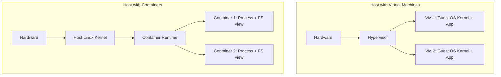
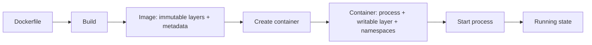
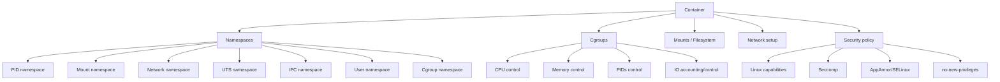
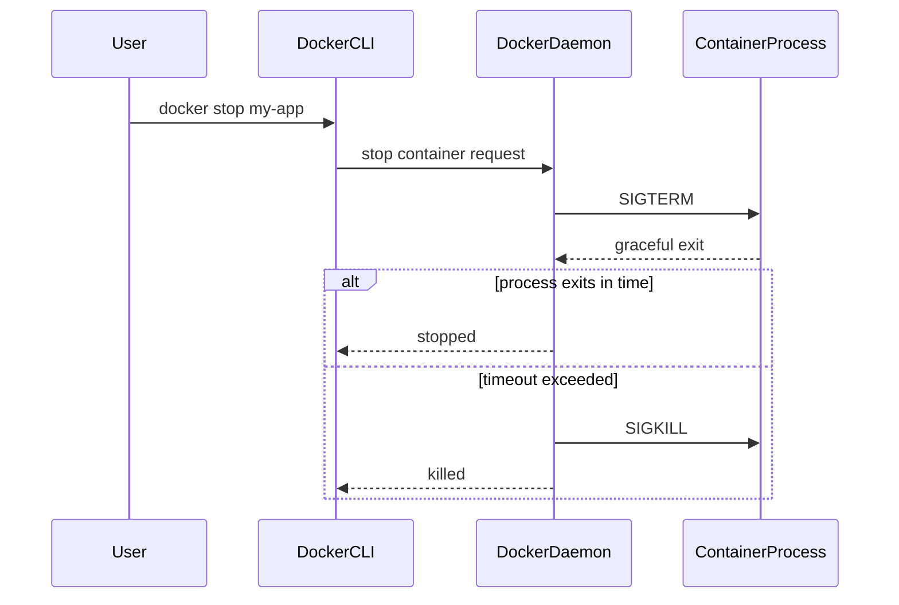
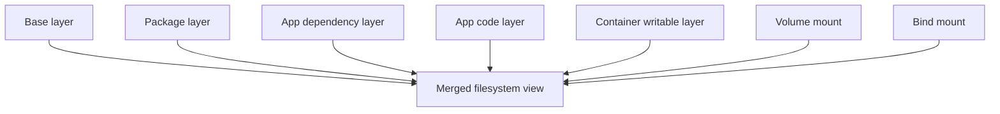
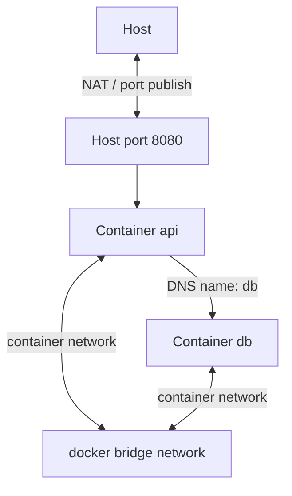
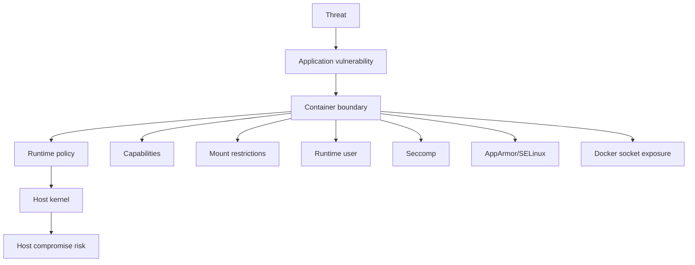
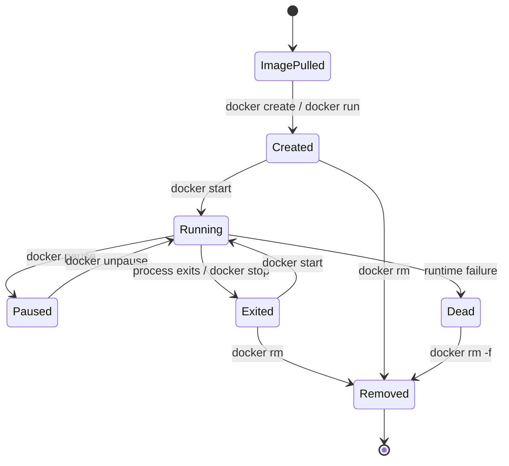

# Part 002 — Containerization Mental Model: Process, Isolation, Kernel, and Boundary

## 1. Tujuan Part Ini

Part ini membangun mental model paling penting dalam Docker:

> Container adalah process atau sekumpulan process yang dijalankan dengan filesystem view, network view, process view, resource control, dan security constraints tertentu di atas kernel host yang sama.

Container bukan VM kecil. Container juga bukan sekadar folder berisi aplikasi. Container adalah runtime arrangement yang menggabungkan:

- image filesystem;
- writable layer;
- namespace isolation;
- cgroup resource accounting/limit;
- mounts;
- network endpoint;
- process tree;
- environment;
- user/capability/security profile;
- lifecycle state.

Docker documentation untuk `dockerd` menjelaskan bahwa Docker daemon menggunakan OCI-compliant runtime melalui `containerd` sebagai interface ke Linux kernel namespaces, cgroups, dan SELinux. Docker security documentation juga menempatkan namespaces dan cgroups sebagai area utama dalam model security Docker, bersama attack surface daemon, konfigurasi container, dan fitur hardening kernel.

Referensi resmi utama:

- Docker Engine: https://docs.docker.com/engine/
- dockerd reference: https://docs.docker.com/reference/cli/dockerd/
- Docker Engine security: https://docs.docker.com/engine/security/
- Rootless mode: https://docs.docker.com/engine/security/rootless/
- User namespace remap: https://docs.docker.com/engine/security/userns-remap/
- Dockerfile reference: https://docs.docker.com/reference/dockerfile/

---

## 2. Mental Model Pertama: Container Bukan VM

VM memvirtualisasi hardware. Container mengisolasi process di atas kernel yang sama.

| Dimensi | Virtual Machine | Container |
|---|---|---|
| Kernel | Tiap VM punya kernel sendiri | Berbagi kernel host |
| Boot | Boot OS guest | Start process |
| Artifact | Disk image OS lengkap | Image filesystem + metadata |
| Isolation | Hypervisor boundary | Kernel primitives + runtime policy |
| Resource control | VM allocation | cgroups, scheduler, limits |
| Startup | Relatif lebih lambat | Relatif cepat |
| OS compatibility | Bisa beda kernel/OS | Harus compatible dengan kernel host |
| Operational model | Manage machines | Manage processes/artifacts |

Container terasa seperti machine kecil karena punya filesystem sendiri, hostname sendiri, process tree sendiri, network interface sendiri, dan user database sendiri. Tetapi itu adalah ilusi yang sengaja dibuat oleh kernel namespaces dan runtime setup.

### 2.1 Diagram: VM vs Container



### 2.2 Kenapa Mental Model “VM Ringan” Berbahaya

Mental model VM ringan sering menyebabkan kesalahan:

| Salah Kaprah | Dampak |
|---|---|
| Container dianggap punya kernel sendiri | Bingung saat kernel module/sysctl/seccomp tergantung host |
| Container dianggap aman seperti VM boundary | Meremehkan risiko privileged container dan Docker socket |
| Container dianggap tempat state durable | Data hilang saat container dihapus |
| Container dianggap boleh menjalankan banyak service seperti init system OS | Signal, logging, lifecycle, health jadi tidak jelas |
| Container dianggap punya localhost yang sama dengan host | Network binding dan connection string salah |

Mental model yang benar:

> Container adalah process boundary, bukan machine boundary.

---

## 3. Mental Model Kedua: Image vs Container

Image adalah artifact. Container adalah runtime instance.



### 3.1 Image

Image berisi:

- filesystem layers;
- default command/entrypoint;
- environment metadata;
- exposed ports metadata;
- working directory;
- user metadata;
- labels;
- architecture/platform metadata.

Image tidak “berjalan”. Image hanya source material untuk container.

### 3.2 Container

Container memiliki:

- reference ke image;
- writable layer;
- process utama;
- namespace assignments;
- cgroup assignments;
- mounts;
- network endpoints;
- runtime config;
- state: created, running, paused, exited, dead;
- exit code;
- logs;
- health status jika ada healthcheck.

Container bisa dihapus tanpa menghapus image. Image bisa dihapus jika tidak lagi direferensikan oleh container. Volume bisa tetap hidup meskipun container dihapus.

### 3.3 Practical Consequence

Jika kamu `docker exec` ke container lalu install package manual, kamu mengubah container writable layer, bukan image. Perubahan itu hilang ketika container diganti. Production container harus diperlakukan immutable: perubahan harus berasal dari image baru atau runtime config/mount yang jelas.

---

## 4. Mental Model Ketiga: Kernel Primitives

Container isolation adalah komposisi beberapa primitive kernel dan runtime policy.



### 4.1 Namespaces: “What Can This Process See?”

Namespaces isolate views of global system resources.

| Namespace | What It Changes | Practical Meaning |
|---|---|---|
| PID | Process ID view | Container sees its own PID tree; process may be PID 1 inside container |
| Mount | Filesystem mount view | Container gets its own root filesystem and mounted volumes |
| Network | Network interfaces/routes/ports | Container has its own network stack view |
| UTS | Hostname/domain name | Container can have its own hostname |
| IPC | IPC resources | Isolates shared memory/semaphores/message queues |
| User | User/group ID mapping | Root inside container can map to non-root outside |
| Cgroup | Cgroup hierarchy view | Process sees cgroup membership differently |

Namespace does not necessarily limit resource consumption. It primarily changes visibility and identity. Resource accounting/limits are handled by cgroups.

### 4.2 Cgroups: “How Much Can This Process Use?”

Cgroups control and account resource usage.

Common resource dimensions:

- CPU scheduling weight/quota;
- memory limit;
- swap behavior;
- pids limit;
- block IO weight/limit;
- device access in combination with device policies.

Practical examples:

- container can see only its process tree, but still consume too much memory if not limited;
- memory limit can trigger OOM kill;
- CPU quota can cause latency spikes under load;
- pid limit can prevent fork bombs or runaway process creation.

### 4.3 Security Profiles: “What Is This Process Allowed To Do?”

Container isolation is not only namespace/cgroup. Security posture also depends on:

- Linux capabilities;
- seccomp profile;
- AppArmor/SELinux profile;
- user identity;
- privileged flag;
- mount flags;
- read-only filesystem;
- device access;
- Docker daemon exposure;
- kernel version and configuration.

Docker security documentation highlights several review areas: kernel support for namespaces/cgroups, daemon attack surface, container configuration profile, and kernel hardening features.

---

## 5. Process Model: The Heart of a Container

A container exists to run a process. When the main process exits, the container exits.

### 5.1 PID 1 Problem

Inside a PID namespace, the main container process often becomes PID 1. PID 1 has special behavior on Linux:

- it receives signals as the init process of that namespace;
- it may need to reap zombie child processes;
- some runtimes/frameworks do not handle `SIGTERM` correctly by default;
- shell-form commands can accidentally hide the real application process behind `/bin/sh`.

Example risky Dockerfile pattern:

```dockerfile
CMD java -jar app.jar
```

This is shell form. It runs through a shell.

Better default:

```dockerfile
CMD ["java", "-jar", "app.jar"]
```

Exec form makes the application process receive signals more directly.

### 5.2 Signal Flow

When you run:

```bash
docker stop my-app
```

Docker sends a termination signal to the main process, waits for a grace period, then forcefully kills it if still running.



Engineering implication:

- HTTP server should stop accepting new requests;
- in-flight requests should complete or be cancelled safely;
- workers should finish or requeue jobs;
- DB transactions should be committed/rolled back;
- logs/metrics should flush quickly;
- process should exit with meaningful code.

### 5.3 Exit Code and Restart Policy

A container exiting is not always a failure. It depends on intent.

| Container Type | Exit Expected? | Example |
|---|---:|---|
| Web service | No, unless shutdown | API server |
| Batch job | Yes | migration, report generation |
| One-off task | Yes | data import |
| Worker | Usually no | queue consumer |
| Init/setup helper | Yes | permission bootstrap |

Restart policy should match service semantics.

Bad pattern:

```bash
docker run --restart=always migration-job
```

A migration job that exits successfully should not restart forever.

---

## 6. Filesystem Model

A container has a root filesystem built from image layers plus a writable layer.



### 6.1 Image Layers

Each Dockerfile instruction can contribute to filesystem changes. Layers are reused by cache when possible. Layering impacts:

- build speed;
- image size;
- vulnerability surface;
- secret leakage risk;
- reproducibility;
- network transfer time.

### 6.2 Writable Layer

The writable layer exists per container. It is not durable application storage.

Bad assumption:

> “I wrote uploaded files to `/app/uploads`; they will survive deployment.”

Correct reasoning:

- If `/app/uploads` is inside writable layer, it is tied to that container instance.
- If the container is replaced, data may disappear.
- Durable data must go to volume, bind mount, or external storage.

### 6.3 Copy-on-Write

When a file from a lower image layer is modified, the storage driver may copy it into the writable layer. This is useful but has implications:

- modifying many files at runtime can be slower than writing to a volume;
- image layer content remains in history even if “deleted” later;
- containers should avoid mutating installed dependencies at runtime.

### 6.4 Mount Types

| Mount Type | Managed By | Best For | Main Risk |
|---|---|---|---|
| Writable layer | Docker container | Temporary container changes | Lost on replacement/removal |
| Named volume | Docker | Durable app data | Backup/permission lifecycle must be managed |
| Bind mount | Host filesystem | Dev code mount, host integration | Host path drift, permission issue, leakage |
| tmpfs | Memory | Sensitive/temporary data | Lost on stop, memory pressure |

### 6.5 Permission Model

File permission issues are common because container user IDs map to host user IDs unless user namespaces are used.

Example:

- process inside container runs as UID 1000;
- bind-mounted host directory is owned by UID 501;
- application cannot write;
- developer changes container to run as root;
- issue “fixed” locally but security posture worsens.

Better approach:

- understand UID/GID mapping;
- choose runtime user deliberately;
- set ownership at build time for image paths;
- use volume initialization carefully;
- avoid broad `chmod 777` as default solution.

---

## 7. Network Model

Each container can have its own network namespace. Docker attaches containers to networks using drivers such as bridge or overlay.

### 7.1 Localhost Trap

Inside a container:

```text
localhost == the container itself
```

Not the host. Not another container.

This is one of the most frequent Docker mistakes.

If app container tries to connect to:

```text
localhost:5432
```

it is trying to reach PostgreSQL inside the same container. If PostgreSQL is another container in the same Compose network, use service name:

```text
db:5432
```

### 7.2 Bridge Network Mental Model



Internal container-to-container traffic uses the Docker network. Host-to-container traffic usually requires port publishing.

### 7.3 DNS Scope

On user-defined bridge networks, Docker provides service/container name resolution. In Compose, service names become DNS names within the project network.

Practical consequence:

- `api` can call `db:5432` if both are on same Compose network;
- host cannot necessarily resolve `db` unless configured separately;
- two Compose projects can have different scoped networks and same service names without conflict.

### 7.4 Bind Address Trap

A server inside container must bind to an address reachable within the container network.

Bad inside container:

```text
127.0.0.1:8080
```

This binds only to loopback inside the container. Port publishing from host may not reach it as expected depending on app/network behavior.

Better for service intended to receive traffic:

```text
0.0.0.0:8080
```

### 7.5 Port Publishing

Port publishing maps host port to container port.

```bash
docker run -p 8080:80 nginx:alpine
```

Means:

```text
host:8080 -> container:80
```

Not:

```text
container:8080 -> host:80
```

Always read `-p HOST_PORT:CONTAINER_PORT`.

---

## 8. Resource Model

Container isolation does not automatically mean safe resource behavior. A container can still consume too much CPU, memory, disk IO, or processes unless constrained.

### 8.1 Memory

Memory limits matter because many runtimes infer available memory from host or cgroup depending on version/configuration.

Failure mode:

- app sees host memory or is configured too aggressively;
- cgroup limit is lower;
- app exceeds limit;
- OOM kill occurs;
- container exits;
- restart policy restarts it;
- service enters crash loop.

### 8.2 CPU

CPU limits affect latency, not only throughput.

Examples:

- CPU quota too low can make garbage collection pauses worse;
- background jobs can starve HTTP request handling;
- co-located containers can cause noisy-neighbor behavior;
- load tests on unconstrained dev environment hide production throttling.

### 8.3 PIDs

PIDs limit protects against runaway child process creation.

Failure mode:

- app leaks subprocesses;
- container hits pid limit;
- new process/thread creation fails;
- symptoms look like random runtime errors.

### 8.4 Disk and Logs

Container logs can consume host disk if logging configuration is ignored. Writable layers can also grow unexpectedly.

Production posture:

- configure log rotation or logging driver intentionally;
- write large mutable data to volumes/external storage;
- monitor disk usage;
- avoid debug logs at unbounded volume.

---

## 9. Security Boundary Model

Container security is defense-in-depth. It is not equivalent to a VM boundary.



### 9.1 Dangerous Defaults and Flags

Some flags drastically change risk:

| Flag/Pattern | Risk |
|---|---|
| `--privileged` | Grants broad access; collapses many isolation assumptions |
| Docker socket mount | Container can control Docker daemon and often host-level resources |
| Running as root | Increases impact of escape/misconfig/mount issue |
| Broad bind mounts | Exposes host files to container |
| `--network host` | Removes network namespace isolation for that container |
| Extra capabilities | Expands kernel operation surface |
| Secrets in image layers | Secrets can be recovered from history/artifacts |

### 9.2 Rootless Mode

Docker rootless mode runs Docker daemon and containers as non-root user to reduce risk from daemon/runtime vulnerabilities. This mitigates certain classes of host-level impact, but it does not remove the need for application hardening, image hygiene, careful mounts, network policy, and secret discipline.

### 9.3 User Namespace Remapping

User namespaces can map root inside container to a non-root user outside. This changes the risk profile of UID 0 inside the container.

Important nuance:

- root inside container may not equal root on host when remapped;
- not all workflows work transparently with user namespace remapping;
- file ownership and bind mounts need more care.

---

## 10. Lifecycle State Machine

A container has lifecycle states. Understanding state transitions makes debugging deterministic.



### 10.1 Build-Time vs Runtime

Separate these phases:

| Phase | Example Failure | Debug Surface |
|---|---|---|
| Build-time | `COPY failed`, package install failed | Dockerfile, build context, network, cache |
| Push-time | registry auth failed | credentials, registry policy |
| Pull-time | manifest not found, wrong arch | tag/digest/platform/registry |
| Create-time | invalid mount, port conflict | host paths, daemon config, network |
| Start-time | executable not found | image metadata, entrypoint, permissions |
| Run-time | app crash, OOM, DNS failure | logs, inspect, stats, exec, events |
| Stop-time | graceful shutdown fails | signals, PID 1, timeout |
| Deploy-time | Swarm task rejected | placement, resources, image access, constraints |

Do not debug build-time problems with runtime tools. Do not debug runtime app crash by rewriting Dockerfile blindly.

---

## 11. Container Boundary Checklist

Whenever designing a container, answer these questions.

### 11.1 Process Boundary

- What is the main process?
- Does it run in exec form?
- Does it handle `SIGTERM`?
- Does it reap child processes if it spawns them?
- What exit codes are expected?
- Is it long-running or one-shot?

### 11.2 Filesystem Boundary

- What is baked into the image?
- What is written at runtime?
- Which paths must be writable?
- Which paths should be read-only?
- What data must survive container replacement?
- What is mounted from host or volume?

### 11.3 Network Boundary

- Which port does the process listen on?
- Does it bind to `0.0.0.0` if it must receive traffic?
- Which networks is it attached to?
- Which service names must resolve?
- Which ports are internal only?
- Which ports are published to host/external traffic?

### 11.4 Resource Boundary

- What memory limit is safe?
- What CPU quota/reservation is realistic?
- Can it tolerate throttling?
- Does it create subprocesses/threads?
- How much disk/log output can it generate?

### 11.5 Security Boundary

- What user does it run as?
- Does it need root?
- Which Linux capabilities does it need?
- Does it need write access to root filesystem?
- Does it need access to host paths/devices?
- Are secrets injected at runtime, not baked into image?

---

## 12. Common Failure Modes

### 12.1 “Works on My Machine” Due to Hidden Host Dependency

Symptoms:

- works locally;
- fails in CI or another developer laptop;
- missing file, path, credential, or architecture mismatch.

Root causes:

- bind mount hides missing image content;
- local `.env` not committed or not documented;
- build context includes untracked files;
- image built for wrong platform;
- host has cached dependency.

Corrective model:

- image must contain everything needed to run except explicit runtime config/secrets/data;
- build context must be controlled;
- Compose dev convenience should not hide production artifact defects.

### 12.2 Container Running but App Unreachable

Checklist:

1. Is process listening?
2. Is it listening on correct port?
3. Is it bound to `0.0.0.0` or only `127.0.0.1`?
4. Is host port published?
5. Is firewall blocking?
6. Is the request going from host, another container, or external network?
7. Is DNS name valid in that network scope?

### 12.3 Container Exits Immediately

Possible causes:

- command completed successfully;
- executable not found;
- permission denied;
- missing env/config;
- app crash;
- signal received;
- architecture mismatch;
- entrypoint script failed.

Debug path:

```bash
docker ps -a
docker logs <container>
docker inspect <container> --format '{{.State.ExitCode}} {{.State.Error}}'
```

### 12.4 Data Disappears

Possible causes:

- data was written to writable layer;
- `docker compose down -v` removed named volume;
- bind mount path differed between environments;
- app wrote to unexpected directory;
- permission error caused fallback path.

### 12.5 Permission Denied

Possible causes:

- runtime user lacks access;
- volume initialized with different owner;
- bind mount UID/GID mismatch;
- read-only filesystem;
- SELinux/AppArmor restriction;
- rootless/user namespace mapping.

Bad quick fix:

```bash
chmod -R 777 .
```

Better debug:

```bash
id
ls -la /target/path
mount | grep target
stat /target/path
```

### 12.6 Secret Leakage

Possible causes:

- secret passed as build arg;
- secret copied into image then deleted later;
- secret stored in `.env` committed to Git;
- secret printed in logs;
- secret visible in process args;
- Docker socket or broad bind mount allows unintended access.

Correct posture:

- use BuildKit secret mount for build-time secrets;
- use runtime secrets mechanism for runtime secrets;
- avoid secrets in image layers, env dumps, logs, and shell history.

---

## 13. Labs

### Lab 1 — Prove Container Is a Process

Run:

```bash
docker run --name sleep-lab -d alpine:3.20 sleep 300
docker inspect sleep-lab --format '{{.State.Pid}}'
ps -fp $(docker inspect sleep-lab --format '{{.State.Pid}}')
docker rm -f sleep-lab
```

Observe:

- container maps to a host process;
- Docker metadata knows host PID;
- container lifecycle is process lifecycle.

### Lab 2 — Prove Localhost Isolation

```bash
docker network create mental-model-net

docker run -d --name web --network mental-model-net nginx:alpine

docker run --rm --network mental-model-net alpine:3.20 sh -c \
  "wget -qO- http://web | head"

docker run --rm alpine:3.20 sh -c \
  "wget -qO- http://web || true"

docker rm -f web
docker network rm mental-model-net
```

Expected:

- container on same custom network resolves `web`;
- container not on that network does not resolve `web`.

### Lab 3 — Prove Writable Layer Is Ephemeral

```bash
docker run --name writable-lab alpine:3.20 sh -c 'echo hello > /tmp/data.txt'
docker start -a writable-lab
docker rm writable-lab

docker run --rm alpine:3.20 sh -c 'cat /tmp/data.txt || echo missing'
```

Expected:

- file exists only in that container instance;
- new container from same image does not have it.

### Lab 4 — Prove Volume Persists

```bash
docker volume create durable-lab

docker run --rm -v durable-lab:/data alpine:3.20 sh -c 'echo durable > /data/value.txt'
docker run --rm -v durable-lab:/data alpine:3.20 cat /data/value.txt

docker volume rm durable-lab
```

Expected:

- data survives across containers;
- data disappears when volume is removed.

### Lab 5 — Signal Handling Observation

Create `trap.sh`:

```sh
#!/bin/sh
trap 'echo received SIGTERM; exit 0' TERM
trap 'echo received SIGINT; exit 0' INT
echo "started pid=$$"
while true; do sleep 1; done
```

Create Dockerfile:

```dockerfile
FROM alpine:3.20
WORKDIR /app
COPY trap.sh .
RUN chmod +x trap.sh
CMD ["/app/trap.sh"]
```

Run:

```bash
docker build -t signal-lab .
docker run --name signal-lab -d signal-lab
docker logs signal-lab
docker stop signal-lab
docker logs signal-lab
docker rm signal-lab
```

Expected:

- process receives termination signal;
- logs show graceful handling.

---

## 14. Debugging Playbook

### 14.1 First 60 Seconds

Run:

```bash
docker ps -a
docker inspect <container>
docker logs --tail=200 <container>
docker events --since 10m
```

Ask:

- Is the container running, exited, restarting, paused, or dead?
- What is the exit code?
- Was it killed by OOM?
- What command/entrypoint ran?
- What mounts exist?
- What networks is it attached to?
- What health status exists?

### 14.2 Process Debug

```bash
docker exec <container> ps aux
docker exec <container> sh -c 'echo $$; id; pwd; env | sort'
```

If image has no shell, use a debug sidecar/container with shared network namespace or rebuild a debug variant intentionally. Do not permanently bloat production image only for emergency shell access.

### 14.3 Network Debug

```bash
docker inspect <container> --format '{{json .NetworkSettings.Networks}}' | jq
docker network inspect <network>
docker exec <container> sh -c 'getent hosts db || nslookup db || true'
docker exec <container> sh -c 'ss -lntp || netstat -lntp || true'
```

Ask:

- Can name resolve?
- Can port connect?
- Is app listening?
- Is traffic host-to-container or container-to-container?

### 14.4 Storage Debug

```bash
docker inspect <container> --format '{{json .Mounts}}' | jq
docker exec <container> sh -c 'id; df -h; mount; ls -la /path'
```

Ask:

- Is the mount present?
- Is the path shadowing image content?
- Does runtime user have permission?
- Is data written to expected path?

---

## 15. Anti-Patterns

### 15.1 Treating Container as Mutable Server

Bad:

```bash
docker exec -it prod-container sh
apk add debug-tool
vi config.yml
service restart
```

Why bad:

- changes are not in image;
- not reproducible;
- lost on replacement;
- not auditable;
- creates environment drift.

Better:

- rebuild image;
- change config source;
- redeploy;
- use debug image/ephemeral debug container for investigation.

### 15.2 Putting Secrets in Dockerfile

Bad:

```dockerfile
ARG TOKEN
RUN curl -H "Authorization: Bearer $TOKEN" https://example.com/private.tar.gz
```

Risk:

- build args may appear in metadata/history/logs depending on usage;
- layer content may retain secret-derived artifacts;
- CI logs may leak values.

Better:

- use BuildKit secret mount for build-time secret;
- use runtime secret mechanism for runtime secret;
- verify image history and layers.

### 15.3 Using Host Network to Avoid Learning Networking

Bad default:

```bash
docker run --network host my-app
```

Why bad:

- removes network namespace isolation;
- hides port publishing issues;
- creates environment-specific behavior;
- reduces portability.

Use only when there is a deliberate reason.

### 15.4 Running Everything as Root

Bad:

```dockerfile
FROM ubuntu:latest
COPY app /app
CMD ["/app"]
```

Better pattern:

```dockerfile
FROM alpine:3.20
RUN addgroup -S app && adduser -S app -G app
WORKDIR /app
COPY --chown=app:app app /app/app
USER app
CMD ["/app/app"]
```

### 15.5 Using `latest` Blindly

Bad:

```dockerfile
FROM node:latest
```

Risk:

- builds change without source change;
- rollback becomes ambiguous;
- vulnerability baseline changes unexpectedly;
- architecture/platform behavior may change.

Better:

- pin meaningful version tags;
- use digest pinning for high-control production paths;
- rebuild intentionally for patch updates.

---

## 16. Engineering Reasoning Examples

### Example 1 — App Cannot Connect to Database in Compose

Symptom:

```text
ECONNREFUSED 127.0.0.1:5432
```

Reasoning:

- app is inside container;
- `127.0.0.1` means app container itself;
- database is likely another service;
- correct host should be Compose service name, e.g. `db`;
- even after hostname fix, database readiness may still lag;
- app should retry or wait using readiness logic.

Fix direction:

```text
DATABASE_HOST=db
DATABASE_PORT=5432
```

Plus app-level retry or health-aware startup.

### Example 2 — Container Exits on `docker stop` with Dirty Shutdown

Symptom:

- logs show abrupt termination;
- graceful shutdown hook not executed;
- data flush incomplete.

Reasoning:

- main process may be shell wrapper;
- signal may not reach app;
- app may ignore `SIGTERM`;
- stop timeout may be too short;
- PID 1 may not reap children.

Fix direction:

- use exec-form `ENTRYPOINT`/`CMD`;
- ensure wrapper uses `exec "$@"`;
- handle `SIGTERM` in app;
- configure stop grace period appropriately;
- use init process only when needed.

### Example 3 — Permission Works on Linux, Fails on macOS/CI

Symptom:

- bind-mounted directory not writable;
- container user non-root;
- works on one machine but not another.

Reasoning:

- bind mount maps host filesystem behavior;
- UID/GID may differ;
- Docker Desktop virtualization may alter file-sharing semantics;
- CI runner user differs from local user.

Fix direction:

- avoid relying on arbitrary host ownership;
- set explicit runtime UID/GID strategy;
- use named volumes for container-managed state;
- initialize permissions carefully;
- document dev setup.

---

## 17. Self-Test

1. Why is a container better modeled as a process boundary than a machine boundary?
2. What does a PID namespace isolate?
3. What do cgroups control?
4. Why does `localhost` inside a container not mean the host?
5. What happens when PID 1 exits?
6. Why can data disappear when a container is removed?
7. What is the difference between writable layer and named volume?
8. Why is `--privileged` dangerous?
9. Why can running as non-root still fail with bind mounts?
10. What is the difference between startup and readiness?
11. Why should long-running services handle `SIGTERM`?
12. What debugging information does `docker inspect` provide that `docker logs` does not?
13. Why is Docker socket exposure high risk?
14. How can mutable tags reduce reproducibility?
15. Why is container security a defense-in-depth model?

---

## 18. Production Checklist

Before containerizing a service, verify:

- [ ] Main process is explicit.
- [ ] Exec-form command is used where appropriate.
- [ ] Process handles `SIGTERM`.
- [ ] Healthcheck has clear semantics.
- [ ] Runtime user is deliberate.
- [ ] Writable paths are known.
- [ ] Durable paths use volumes or external storage.
- [ ] App binds to correct network address.
- [ ] Internal hostnames use service/network DNS, not accidental localhost.
- [ ] Resource limits are tested.
- [ ] Logs go to stdout/stderr.
- [ ] Secrets are not baked into image.
- [ ] No unnecessary privileged mode/capabilities.
- [ ] Host mounts are minimized and documented.
- [ ] Image tag/version strategy is explicit.

---

## 19. Ringkasan

Containerization adalah tentang membuat process berjalan dalam boundary yang dikendalikan:

- namespace mengatur apa yang process lihat;
- cgroup mengatur apa yang process gunakan;
- mounts mengatur filesystem view dan state boundary;
- network namespace mengatur interface, route, DNS, dan port view;
- security profile mengatur operasi kernel yang diizinkan;
- image memberi filesystem dan metadata awal;
- container menambahkan writable layer dan runtime state;
- Docker daemon/runtime mengorkestrasi semua ini melalui Engine, containerd, dan OCI runtime.

Mental model paling penting:

> Container bukan VM kecil. Container adalah process yang diberi ilusi environment sendiri melalui kernel primitives dan runtime policy.

Jika mental model ini kuat, Dockerfile, Compose, dan Swarm akan jauh lebih mudah dipahami. Part berikutnya akan membedah **Docker Architecture and Object Model**: Docker CLI, API, daemon, containerd, runc, BuildKit, registry, image store, volume store, network store, dan lifecycle object secara sistematis.
