# Part 003 — Docker Architecture and Object Model

## 1. Tujuan Part Ini

Part sebelumnya membangun mental model bahwa container bukan mini-VM, melainkan **process yang diberi boundary**. Sekarang kita naik satu level: bagaimana Docker sebagai platform mengatur build, image, container, network, volume, registry, dan runtime.

Target setelah part ini:

- bisa menjelaskan Docker sebagai **client-server system**, bukan satu binary ajaib;
- bisa membedakan Docker CLI, Docker Engine API, `dockerd`, `containerd`, shim, OCI runtime, BuildKit, registry, image store, network driver, dan volume driver;
- bisa membaca masalah Docker berdasarkan boundary: apakah gagal di client, API, daemon, build backend, registry, runtime, kernel, filesystem, network, atau policy;
- bisa memahami object model Docker: image, container, network, volume, build cache, context, secret, config, service, stack;
- bisa membuat diagram reasoning saat production incident container terjadi.

Part ini sangat penting karena banyak engineer bisa memakai Docker, tetapi tidak bisa menjawab: **komponen mana yang sebenarnya sedang gagal?**

---

## 2. Docker Bukan Satu Benda

Di command line kita menulis:

```bash

docker run nginx
```

Tetapi secara arsitektur, itu bukan hanya menjalankan satu program. Ada beberapa lapisan:

1. **Docker CLI** menerima command user.
2. CLI mengirim request ke **Docker Engine API**.
3. API diterima oleh **Docker daemon / `dockerd`**.
4. Daemon mengatur object Docker: image, container, network, volume, build, plugin.
5. Untuk menjalankan container, daemon berinteraksi dengan **container runtime stack**.
6. Runtime stack membuat process container memakai primitive kernel: namespaces, cgroups, capabilities, mount, seccomp, networking.
7. Image ditarik dari registry atau dibangun lewat build backend.
8. Metadata dan state dicatat di storage Docker.

Docker Engine secara resmi adalah teknologi client-server yang mencakup Docker daemon, REST API, dan Docker CLI. Ini berarti Docker harus dipahami seperti distributed-ish local control plane, bukan sekadar command executor.

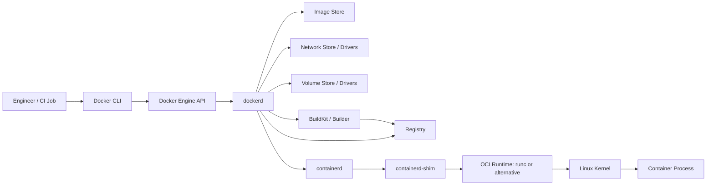

### 2.1 Mental Model Control Plane vs Data Plane

Untuk reasoning yang lebih kuat, pisahkan Docker menjadi dua plane.

**Control plane** adalah lapisan yang menerima intention dan mengatur state:

- CLI;
- Docker API;
- daemon;
- metadata store;
- build scheduler;
- swarm manager, nanti di part Swarm;
- registry interaction;
- object reconciliation.

**Data plane** adalah lapisan yang benar-benar menjalankan workload:

- container process;
- kernel namespaces;
- cgroups;
- virtual ethernet;
- bridge/overlay network;
- filesystem layer;
- volume mount;
- log stream.

Kesalahan umum: menganggap semua error `docker` berarti container error. Padahal error bisa terjadi sebelum container process pernah dibuat.

Contoh:

| Symptom | Kemungkinan Boundary |
|---|---|
| `Cannot connect to the Docker daemon` | CLI/API socket/daemon |
| `pull access denied` | registry/auth/image name |
| `exec format error` | image architecture mismatch |
| `no space left on device` saat build | image store/build cache/storage |
| container langsung exit code 127 | command/app/runtime filesystem |
| service tidak bisa resolve hostname | network/DNS/Compose/Swarm discovery |
| `permission denied` saat mount file | host filesystem/UID/GID/SELinux/AppArmor |
| CPU stuck walau app tidak sibuk | cgroup quota/throttling/scheduler |

---

## 3. Komponen Utama Docker Architecture

## 3.1 Docker CLI

Docker CLI adalah client. Ia bukan tempat utama container hidup.

Command seperti ini:

```bash

docker ps

docker run --rm alpine echo hello

docker build -t app:dev .
```

akan diterjemahkan menjadi request ke Docker API. CLI bisa berbicara ke daemon lokal atau daemon remote melalui context.

Implikasinya:

- command Docker bisa mengontrol host lain;
- hasil `docker ps` bergantung pada daemon yang sedang aktif, bukan folder kerja;
- salah context bisa berbahaya karena command yang tampak lokal bisa menargetkan remote host;
- automation CI harus eksplisit terhadap context/endpoint.

### 3.1.1 CLI Bukan Source of Truth

CLI hanya interface. Source of truth ada pada daemon dan object store-nya.

Misalnya:

```bash

docker context ls

docker info

docker system df
```

lebih penting daripada hanya menghafal command `run`, karena command tersebut memberi tahu **daemon mana**, **runtime apa**, **storage driver apa**, **cgroup version apa**, dan **resource state apa** yang sedang digunakan.

---

## 3.2 Docker Engine API

Docker Engine API adalah boundary antara client dan daemon. Docker menyediakan API untuk berinteraksi dengan daemon, juga SDK untuk Go dan Python.

Kenapa ini penting untuk engineer senior?

Karena banyak tooling platform dibangun di atas API ini:

- CI runner;
- local development tools;
- Docker SDK;
- Compose;
- build orchestration;
- testcontainers-like tooling;
- platform automation;
- internal developer portal;
- custom cleanup job;
- security scanner;
- monitoring collector.

Jika Docker API socket diekspos sembarangan, itu hampir setara dengan memberikan kontrol besar atas host Docker. Ini akan dibahas lebih dalam di part security, tetapi dari sisi arsitektur sudah harus jelas: **API Docker adalah control plane yang sangat sensitif**.

### 3.2.1 API Versioning

Docker API version penting karena client dan daemon tidak selalu berada pada versi yang sama. Command bisa gagal bukan karena Dockerfile salah, tetapi karena client mencoba memakai fitur yang tidak didukung daemon.

Praktik baseline:

```bash

docker version
```

Perhatikan dua bagian:

- `Client`;
- `Server`.

Jika troubleshooting environment, jangan hanya screenshot error. Simpan output:

```bash

docker version

docker info
```

---

## 3.3 Docker Daemon: `dockerd`

`dockerd` adalah persistent process yang mengelola container dan object Docker. Docker memakai binary berbeda untuk daemon dan client.

Tanggung jawab daemon:

- menerima request API;
- mengelola image;
- membuat container;
- mengatur network;
- mengatur volume;
- berinteraksi dengan registry;
- mengatur logging driver;
- menyimpan metadata;
- mengatur plugin;
- memanggil runtime stack;
- mengelola swarm mode saat diaktifkan.

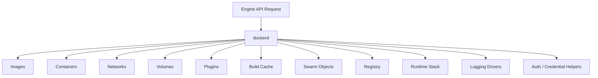

### 3.3.1 Daemon adalah Root of Operational Risk

Pada banyak instalasi Linux tradisional, daemon berjalan sebagai root. Akibatnya:

- user yang bisa mengontrol Docker daemon sering kali dapat memperoleh privilege yang sangat besar;
- mount Docker socket ke container adalah high-risk pattern;
- group `docker` pada Linux harus diperlakukan seperti privileged access, bukan sekadar convenience;
- rootless mode dapat mengurangi beberapa risiko, tetapi membawa batasan dan trade-off.

Jangan memandang Docker permission seperti permission aplikasi biasa. Mengizinkan user menjalankan container dengan mount host path dan privileged flag dapat menjadi jalur eskalasi.

---

## 3.4 containerd

Docker tidak langsung memanggil primitive kernel untuk semua hal. Pada stack modern, Docker menggunakan `containerd` sebagai runtime layer untuk mengelola lifecycle container lebih rendah.

`containerd` menangani pekerjaan seperti:

- pull/push image pada level runtime;
- container lifecycle;
- snapshots;
- runtime shims;
- task execution;
- integration dengan OCI runtime.

Untuk engineer aplikasi, `containerd` sering tidak terlihat. Tetapi saat debugging runtime-level failure, ia menjadi penting.

Contoh area masalah:

- container created tetapi task tidak start;
- runtime shim tertinggal;
- image store/snapshotter bermasalah;
- mismatch runtime;
- container stuck karena runtime/daemon boundary.

### 3.4.1 Mengapa Ada Shim?

Shim memungkinkan process container tetap berjalan lebih terisolasi dari daemon utama dan membantu mengelola stdio serta lifecycle. Secara konseptual:

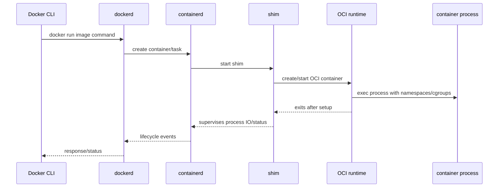

Runtime seperti `runc` biasanya melakukan setup container lalu keluar. Shim tetap memantau process container.

---

## 3.5 OCI Runtime: `runc` dan Alternatif

OCI runtime adalah lapisan yang benar-benar membuat environment container berdasarkan OCI runtime spec. Docker memakai `runc` sebagai default container runtime, tetapi daemon bisa dikonfigurasi memakai alternative runtime.

Tugas runtime:

- membuat namespaces;
- mengatur mount;
- menerapkan cgroups;
- menerapkan capabilities;
- menerapkan seccomp/AppArmor/SELinux profile;
- menjalankan process container;
- mengatur terminal/stdio sesuai konfigurasi.

### 3.5.1 Runtime Bukan Orchestrator

Runtime tidak peduli soal:

- service discovery;
- rolling update;
- Compose dependency;
- replica count;
- deployment strategy;
- business readiness;
- registry promotion.

Runtime hanya menjalankan container sesuai config. Jika container crash, keputusan restart ada di Docker/Compose/Swarm policy, bukan di `runc`.

---

## 3.6 Kernel

Container isolation bergantung pada kernel host. Docker bukan hypervisor penuh. Ia memakai primitive kernel.

Boundary penting:

| Kernel Feature | Peran |
|---|---|
| PID namespace | process tree terisolasi |
| Mount namespace | view filesystem berbeda |
| Network namespace | interface, route, port, iptables context |
| UTS namespace | hostname/domain name isolation |
| IPC namespace | IPC object isolation |
| User namespace | mapping user/group container ke host |
| Cgroups | resource accounting dan limits |
| Capabilities | memecah privilege root menjadi unit kecil |
| Seccomp | filter syscall |
| LSM: AppArmor/SELinux | mandatory access control |

Karena kernel dipakai bersama, container bukan security boundary sempurna. Ia adalah boundary kuat jika dikonfigurasi baik, tetapi tetap defense-in-depth.

---

## 3.7 BuildKit

BuildKit adalah builder backend modern Docker. Ia menggantikan banyak keterbatasan legacy builder dan memberi fitur seperti:

- parallel build graph;
- cache yang lebih efisien;
- cache mount;
- secret mount;
- SSH mount;
- frontend Dockerfile modern;
- buildx integration;
- multi-platform build;
- external cache.

Dalam mental model architecture, build tidak sama dengan run.

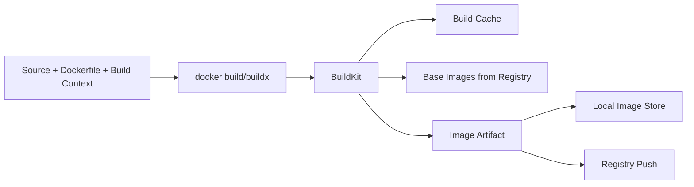

### 3.7.1 Build Graph vs Shell Script

Dockerfile terlihat seperti urutan instruksi linear, tetapi builder modern dapat memodelkannya sebagai graph operasi. Ini penting untuk cache dan parallelism.

Bad mental model:

> Dockerfile adalah shell script panjang.

Better mental model:

> Dockerfile adalah deklarasi transformasi filesystem dan metadata yang menghasilkan image artifact berlapis.

Konsekuensi:

- urutan instruksi memengaruhi cache invalidation;
- `COPY . .` terlalu awal bisa menghancurkan cache dependency;
- secret build tidak boleh lewat `ARG` atau `ENV` jika akan terekam di layer/history;
- multi-stage build memisahkan toolchain build dari runtime artifact;
- build output harus bisa direproduksi dari source + Dockerfile + dependency lock.

---

## 3.8 Registry

Registry adalah tempat image disimpan dan didistribusikan.

Elemen penting:

- repository;
- tag;
- digest;
- manifest;
- layer blob;
- authentication;
- authorization;
- retention policy;
- vulnerability scanning;
- promotion policy.

### 3.8.1 Tag vs Digest

Tag adalah nama mutable. Digest adalah content-addressed identity.

```text
nginx:latest                         # tag; bisa berubah
nginx:1.27                           # tag; masih bisa berubah kalau publisher overwrite
nginx@sha256:<digest>                # content identity
```

Untuk production-grade reasoning:

- tag nyaman untuk manusia;
- digest penting untuk reproducibility;
- deployment aman biasanya mempromosikan digest, bukan hanya tag;
- rollback harus tahu artifact identity yang persis.

### 3.8.2 Registry sebagai Supply Chain Boundary

Registry bukan hanya storage. Ia adalah control point supply chain.

Pertanyaan yang harus dijawab:

- siapa boleh push image?
- apakah image ditandatangani?
- apakah image sudah discan?
- apakah base image diperbolehkan?
- apakah digest dipromosikan antar environment?
- apakah tag immutable?
- apakah ada retention policy?
- apakah SBOM tersedia?

---

## 4. Docker Object Model

Docker memakai object-object yang berinteraksi. Menguasai object model lebih penting daripada menghafal command.

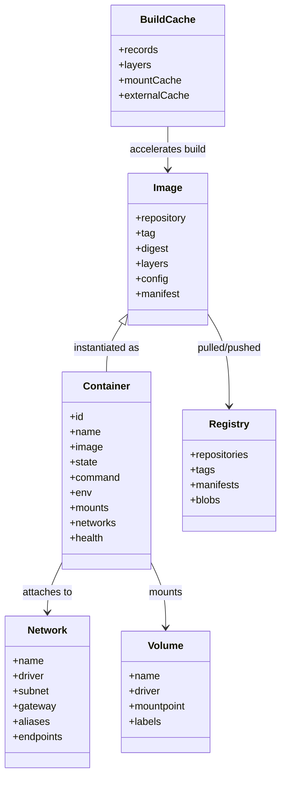

## 4.1 Image

Image adalah artifact immutable yang berisi:

- filesystem layers;
- metadata config;
- default command;
- environment variable defaults;
- exposed port metadata;
- working directory;
- user;
- labels;
- healthcheck metadata jika ada.

Image bukan process. Image tidak “jalan”. Image menjadi container ketika runtime membuat process dari config image + runtime overrides.

### 4.1.1 Image Config vs Runtime Config

Image dapat membawa default:

```Dockerfile
WORKDIR /app
USER app
ENV NODE_ENV=production
ENTRYPOINT ["java", "-jar"]
CMD ["app.jar"]
```

Saat run, default itu bisa dioverride:

```bash

docker run --user 1000:1000 --env NODE_ENV=staging my-app:1.0 diagnostics
```

Jadi container config adalah hasil merge:

```text
image config + docker run options + daemon defaults + platform constraints
```

---

## 4.2 Container

Container adalah runtime instance dari image.

Ia punya:

- ID dan name;
- process utama;
- state;
- writable layer;
- mounts;
- network attachments;
- cgroup allocation;
- log stream;
- health status;
- restart policy;
- labels;
- exit code.

### 4.2.1 Container State Machine

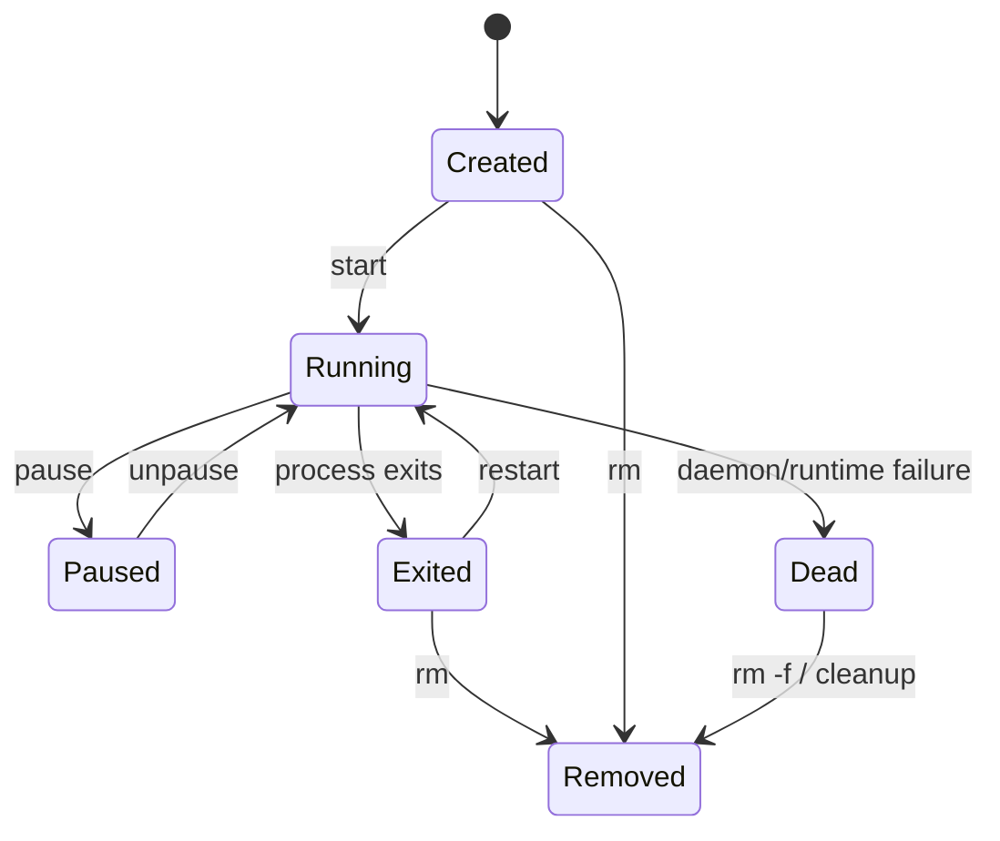

Kunci mental model:

- container hidup selama process utamanya hidup;
- container exit bukan berarti image rusak;
- restart policy tidak memperbaiki bug aplikasi;
- healthcheck bisa unhealthy walau process masih running;
- `docker exec` masuk ke namespace container running, bukan membuat image baru;
- `docker commit` ada, tetapi sering menjadi anti-pattern karena menghasilkan artifact yang tidak reproducible.

---

## 4.3 Network

Network Docker adalah object yang mengatur connectivity dan service discovery.

Untuk single host, driver umum:

- `bridge`;
- `host`;
- `none`;
- `macvlan`;
- `ipvlan`.

Untuk Swarm:

- `overlay`;
- `ingress`;
- routing mesh;
- service discovery.

Network object punya endpoint. Container attach ke network melalui endpoint.

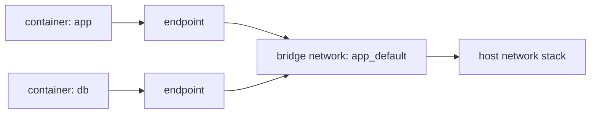

### 4.3.1 Network Name adalah API Contract Lokal

Di Compose, service bisa resolve service lain lewat service name pada network yang sama. Ini bukan magic global DNS. Ini bergantung pada Docker embedded DNS dan network attachment.

Jika container ada di network berbeda, nama bisa tidak resolve.

---

## 4.4 Volume

Volume adalah object untuk state yang dikelola Docker.

Jenis mount utama:

- named volume;
- bind mount;
- tmpfs;
- anonymous volume.

Volume harus dipahami sebagai persistence boundary.

Bad mental model:

> Data container ada di container.

Better mental model:

> Data yang harus bertahan harus keluar dari writable layer container melalui volume, bind mount, external storage, atau service khusus.

### 4.4.1 Volume Lifecycle Tidak Sama dengan Container Lifecycle

Container bisa dihapus, volume bisa tetap ada.

```bash

docker rm my-db

docker volume ls
```

Ini adalah fitur sekaligus sumber bug. Banyak environment test menjadi tidak deterministik karena named volume lama tidak dibersihkan.

---

## 4.5 Build Cache

Build cache adalah object operational yang sering diabaikan.

Dampaknya:

- build cepat atau lambat;
- CI cost;
- reproducibility;
- disk pressure;
- stale dependency;
- secret leakage jika salah pakai;
- cache poisoning risk dalam pipeline tidak aman.

Build cache bukan image final, tetapi cache dapat berisi data sensitif jika engineer memasukkan secret ke layer atau command build.

---

## 4.6 Context

Docker context adalah object client-side yang menyimpan endpoint dan konfigurasi untuk mengelola daemon tertentu.

Ini akan dibahas lebih detail di Part 004, tetapi secara object model ia penting karena:

- command yang sama bisa menarget daemon berbeda;
- CI harus eksplisit;
- local laptop bisa punya context Docker Desktop, rootless engine, remote VM, dan swarm manager;
- salah context adalah failure mode manusia yang sangat nyata.

---

## 4.7 Compose Object

Compose tidak hanya menjalankan beberapa container. Compose membuat model project:

- project;
- services;
- networks;
- volumes;
- configs;
- secrets;
- profiles;
- dependency relation;
- environment interpolation.

Compose akan dibahas mulai Part 015.

---

## 4.8 Swarm Object

Swarm memperkenalkan object orchestration:

- node;
- manager;
- worker;
- service;
- task;
- stack;
- secret;
- config;
- overlay network;
- ingress network.

Swarm akan dibahas mulai Part 025.

---

## 5. Object Lifecycle: Dari Source ke Running Process

Mari lihat lifecycle penuh.

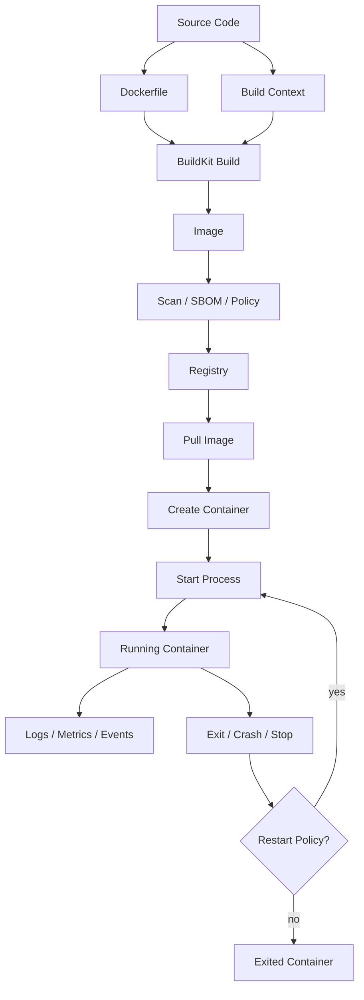

### 5.1 Lifecycle Boundary Questions

Saat ada masalah, jangan langsung patch Dockerfile. Tanyakan:

1. Apakah source benar?
2. Apakah build context benar?
3. Apakah Dockerfile deterministic?
4. Apakah build cache menyebabkan stale artifact?
5. Apakah image berhasil dibuat?
6. Apakah image sesuai architecture host?
7. Apakah image berhasil dipush/pull?
8. Apakah container config benar?
9. Apakah process utama start?
10. Apakah process menerima signal dengan benar?
11. Apakah network/mount/resource tersedia?
12. Apakah restart policy menyembunyikan crash loop?
13. Apakah healthcheck merepresentasikan readiness yang benar?

---

## 6. Command sebagai Probe, Bukan Tujuan

Command Docker harus dipakai sebagai probe untuk memahami state.

## 6.1 Probe Arsitektur

```bash

docker version

docker info

docker system df

docker context ls

docker context inspect
```

Gunakan untuk menjawab:

- client dan server version apa?
- daemon running di mana?
- storage driver apa?
- cgroup driver/version apa?
- rootless atau rootful?
- BuildKit aktif?
- swarm aktif?
- image/container/volume/cache memakai disk berapa?

## 6.2 Probe Object

```bash

docker image ls

docker image inspect nginx:latest

docker container ls -a

docker inspect <container>

docker network ls

docker network inspect <network>

docker volume ls

docker volume inspect <volume>
```

Gunakan untuk menjawab:

- image ID/digest/layer apa?
- container memakai command apa?
- mount apa yang aktif?
- env apa yang masuk?
- network mana yang attach?
- IP dan alias apa?
- volume mountpoint mana?

## 6.3 Probe Runtime

```bash

docker logs <container>

docker events

docker stats

docker top <container>

docker exec -it <container> sh
```

Gunakan untuk menjawab:

- process masih hidup?
- exit code apa?
- resource pressure apa?
- event restart/kill/oom terjadi?
- log berasal dari stdout/stderr?

---

## 7. Failure Boundary Matrix

Docker architecture membantu kita membuat failure matrix.

| Layer | Example Failure | Probe | Typical Fix |
|---|---|---|---|
| CLI | wrong context | `docker context ls` | switch explicit context |
| API socket | daemon unreachable | `docker version` | start daemon / fix socket permission |
| Daemon | bad config | `dockerd --validate`, logs | fix `daemon.json` |
| Registry | auth denied | `docker login`, pull logs | fix credentials/RBAC/name |
| BuildKit | cache/secret/build driver issue | `docker buildx ls`, build logs | fix builder/cache/config |
| Image | wrong arch/missing binary | `docker image inspect` | rebuild multi-arch/fix image |
| Runtime | OCI create failed | daemon/containerd logs | fix runtime config/security profile |
| Kernel | cgroup/seccomp/AppArmor denial | host logs/audit | adjust limits/profile |
| Filesystem | permission denied | inspect mounts/UID/GID | fix ownership/mount mode/user |
| Network | DNS/port issue | inspect network/exec probe | fix network attachment/ports |
| App | exits/crashes | logs/exit code | fix app config/code |

---

## 8. Docker Architecture Anti-Patterns

## 8.1 Treating Docker as a Shell Script Runner

Docker is not just:

```bash

docker run something
```

It is artifact + runtime + network + storage + security boundary. Treating it as shell wrapper leads to:

- mutable image;
- hidden dependency;
- secret baked into layer;
- non-deterministic build;
- fragile startup;
- no lifecycle reasoning.

## 8.2 Debugging from the Wrong Layer

Example: service cannot connect to database. Junior response: “Docker networking is broken.”

Senior response decomposes:

- Is DB process running?
- Is DB listening on expected interface?
- Are app and DB on same Docker network?
- Is hostname correct?
- Is port internal or published port confused?
- Is app using localhost incorrectly?
- Is readiness wait missing?
- Is credential/config wrong?

## 8.3 Confusing Image Build and Container Runtime

Build-time variables are not runtime variables. Runtime secrets are not build args. Build cache is not runtime state.

This matters because:

- secrets in build args can leak;
- dependency downloaded during build is frozen into image;
- runtime env override does not rebuild image;
- image labels are metadata, not live state;
- container writable layer is disposable unless explicitly persisted.

## 8.4 Treating `latest` as a Version

`latest` is a tag, not a guarantee of latest semantic version. In serious environments, use explicit versions and promote digests.

## 8.5 Treating Docker Socket as Harmless

Mounting Docker socket into a container gives that container access to Docker control plane. This is often equivalent to letting the container create sibling containers, mount host paths, and escape intended boundaries.

---

## 9. Architecture Diagrams You Should Be Able to Draw

By the end of this part, you should be able to draw these without notes.

### 9.1 Run Path

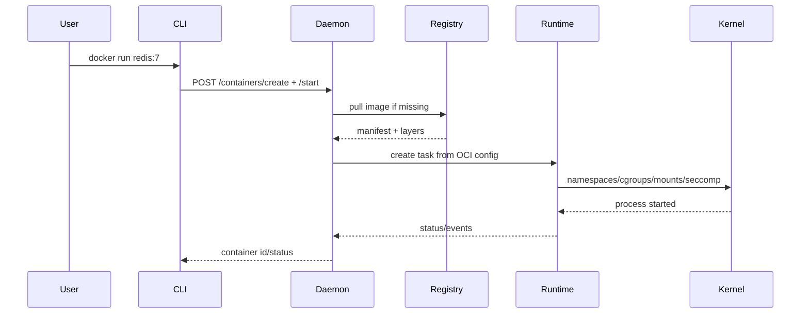

### 9.2 Build Path

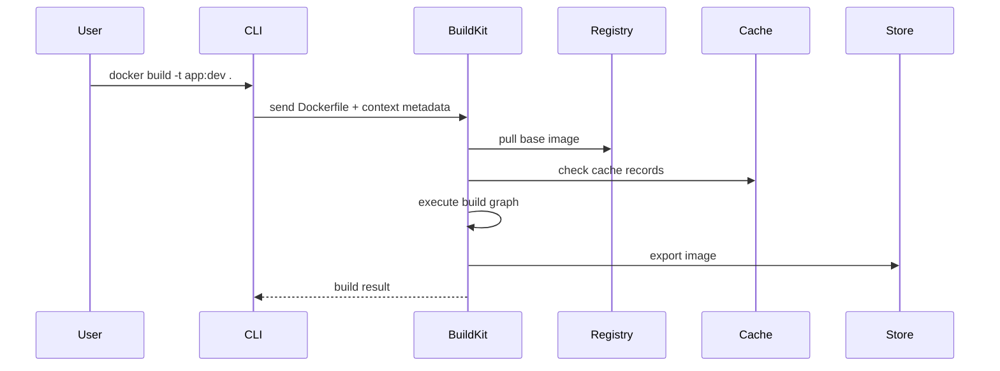

### 9.3 Compose Preview

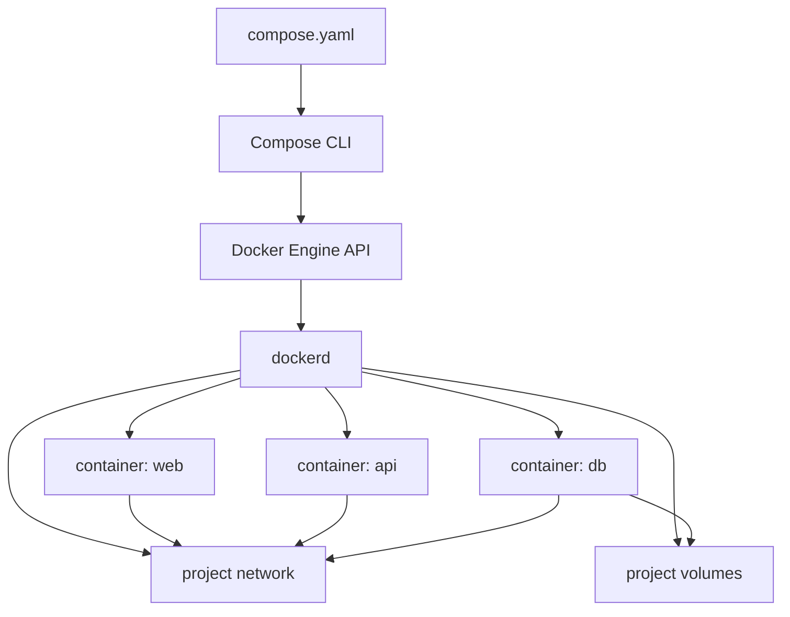

### 9.4 Swarm Preview

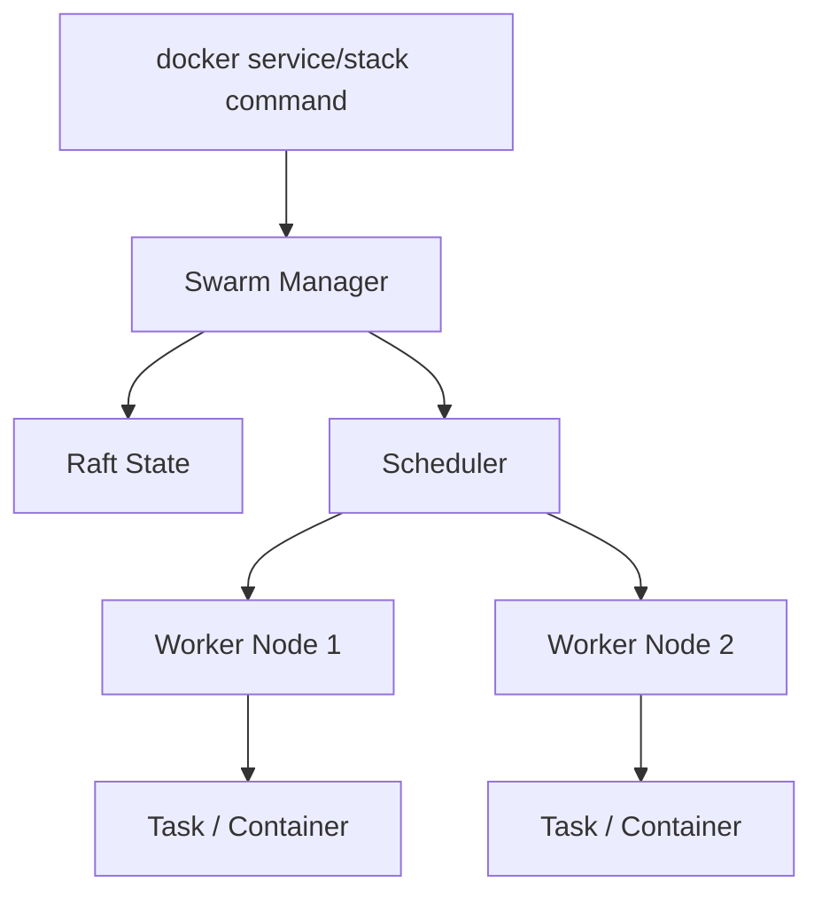

---

## 10. Practical Lab: Inspect Your Docker Architecture

Jalankan ini di environment lokal.

### 10.1 Baseline Info

```bash

docker version

docker info

docker context ls

docker system df
```

Catat:

- client version;
- server version;
- OS/architecture;
- cgroup version;
- storage driver;
- logging driver;
- rootless status;
- swarm status;
- Docker root dir;
- buildx version/context.

### 10.2 Inspect Runtime Path

```bash

docker run --name arch-probe --rm -d nginx:alpine

docker inspect arch-probe

docker top arch-probe

docker logs arch-probe

docker exec arch-probe cat /etc/os-release

docker stop arch-probe
```

Reasoning questions:

1. Apa image yang dipakai?
2. Apa command utama?
3. Apa user container?
4. Apa network yang attach?
5. Apa IP container?
6. Apa mount aktif?
7. Apa signal stop yang dikirim?
8. Apakah container punya healthcheck?

### 10.3 Inspect Build Path

Buat file:

```Dockerfile
FROM alpine:3.20
RUN echo "build-time" > /build-info.txt
CMD ["cat", "/build-info.txt"]
```

Build:

```bash

docker build -t arch-build-probe:dev .

docker image inspect arch-build-probe:dev

docker run --rm arch-build-probe:dev
```

Reasoning questions:

1. Apa layer yang berubah ketika `RUN` berubah?
2. Apa yang terjadi jika Dockerfile sama tetapi build context berubah?
3. Apa bedanya image config dan container runtime config?
4. Apakah image ini punya tag atau digest lokal?

---

## 11. Operational Invariants

Invariants adalah aturan yang harus tetap benar agar Docker environment bisa dipercaya.

### 11.1 Artifact Invariants

- Image production harus dibangun dari source version yang jelas.
- Image harus bisa direproduksi tanpa state manual di container.
- Runtime secret tidak boleh baked into image.
- Base image harus diketahui dan dipin secara wajar.
- Promotion harus berdasarkan artifact identity, idealnya digest.

### 11.2 Runtime Invariants

- Container harus bisa dihancurkan dan dibuat ulang.
- Persistent state harus berada di volume/storage yang eksplisit.
- Process utama harus handle signal shutdown.
- Resource limit harus realistis.
- Healthcheck harus mengukur kondisi yang benar.

### 11.3 Environment Invariants

- Context aktif harus diketahui.
- Daemon config harus version-controlled atau terdokumentasi.
- Disk usage harus dimonitor.
- Docker socket access harus dibatasi.
- Build cache harus dikelola.
- Registry auth harus tidak bergantung pada laptop personal.

### 11.4 Debugging Invariants

- Selalu ambil `docker version` dan `docker info` untuk issue environment.
- Selalu bedakan build-time, pull-time, create-time, start-time, run-time, dan network-time failure.
- Jangan restart sebagai diagnosis utama. Restart boleh jadi mitigasi, bukan penjelasan.

---

## 12. Checklist Pemahaman Part 003

Kamu siap lanjut jika bisa menjawab tanpa membuka catatan:

1. Apa perbedaan Docker CLI, Docker API, dan `dockerd`?
2. Mengapa Docker context bisa menjadi sumber kesalahan operasional?
3. Apa peran `containerd` dalam stack Docker?
4. Apa peran OCI runtime seperti `runc`?
5. Mengapa container tetap bergantung pada kernel host?
6. Apa bedanya image, container, volume, network, dan build cache?
7. Apa bedanya tag dan digest?
8. Apa bedanya build-time dan runtime?
9. Apa yang terjadi saat `docker run nginx`?
10. Bagaimana menentukan apakah error berasal dari registry, daemon, runtime, network, filesystem, atau aplikasi?

---

## 13. Ringkasan

Docker adalah sistem dengan beberapa boundary:

- **CLI/API boundary**: bagaimana user/tooling berbicara ke daemon.
- **Daemon boundary**: bagaimana Docker mengelola object dan state.
- **Build boundary**: bagaimana source menjadi image artifact.
- **Registry boundary**: bagaimana artifact didistribusikan dan dipromosikan.
- **Runtime boundary**: bagaimana image menjadi process terisolasi.
- **Kernel boundary**: bagaimana isolation dan resource control benar-benar diterapkan.
- **Object boundary**: bagaimana image, container, network, volume, cache, context, service, dan stack berinteraksi.

Top-tier Docker engineering bukan soal hafal command. Skill utamanya adalah **membaca state, boundary, dan lifecycle**.

Di part berikutnya kita akan membangun baseline environment operasional: Docker Desktop vs Docker Engine, rootless vs rootful, context, daemon config, BuildKit config, permission, disk hygiene, dan standard environment yang tidak rapuh.

---

## 14. Referensi Utama

- Docker Engine: https://docs.docker.com/engine/
- Docker Engine API: https://docs.docker.com/reference/api/engine/
- Docker Glossary — Docker Engine: https://docs.docker.com/reference/glossary/
- `dockerd` CLI reference: https://docs.docker.com/reference/cli/dockerd/
- Alternative container runtimes: https://docs.docker.com/engine/daemon/alternative-runtimes/
- BuildKit: https://docs.docker.com/build/buildkit/
- Build drivers: https://docs.docker.com/build/builders/drivers/
- Docker contexts: https://docs.docker.com/engine/manage-resources/contexts/
- Running containers: https://docs.docker.com/engine/containers/run/
