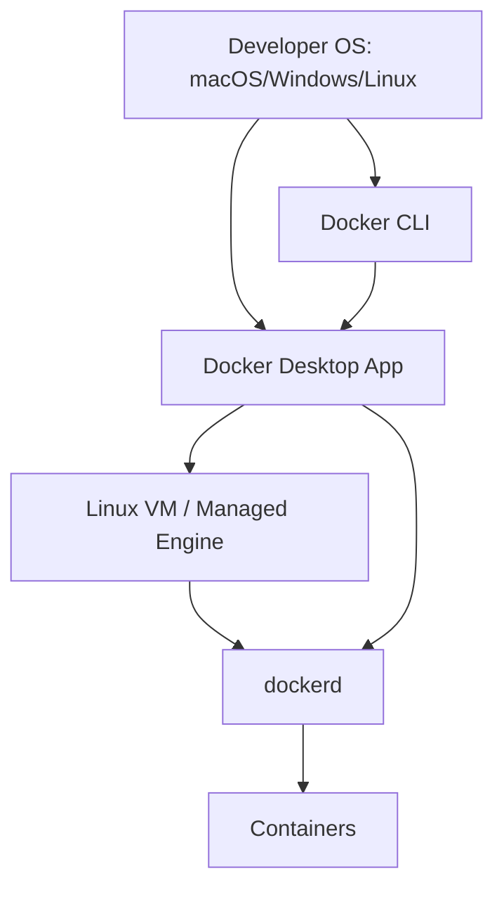

# Part 004 — Local Environment and Operational Baseline

## 1. Tujuan Part Ini

Docker skill sering gagal bukan karena engineer tidak tahu command, tetapi karena environment-nya tidak jelas:

- Docker Desktop atau Docker Engine native?
- Daemon lokal atau remote?
- Rootful atau rootless?
- Context aktif yang mana?
- BuildKit builder yang mana?
- Storage driver apa?
- Image store mana?
- Cgroup version apa?
- User punya permission apa?
- Proxy/registry auth dari mana?
- Disk penuh karena image, volume, atau build cache?

Part ini membuat baseline environment yang rapi dan defensible. Tujuannya bukan “install Docker”, tetapi **membuat Docker environment yang bisa dipercaya untuk development, debugging, CI parity, dan production reasoning**.

Target setelah part ini:

- bisa memilih Docker Desktop vs Docker Engine secara sadar;
- bisa memahami rootful vs rootless dan konsekuensinya;
- bisa mengelola Docker contexts agar tidak salah target;
- bisa membaca dan mengatur `daemon.json` secara aman;
- bisa menyiapkan BuildKit/buildx baseline;
- bisa menjaga disk, cache, volume, network, dan registry credential;
- bisa membuat environment checklist yang repeatable untuk tim.

---

## 2. Prinsip Baseline Environment

Docker lokal bukan mainan. Ia adalah mini platform runtime di laptop/VM.

Prinsip baseline:

1. **Explicit target** — selalu tahu daemon mana yang dikontrol.
2. **Least privilege** — jangan memberi akses Docker tanpa memahami privilege-nya.
3. **Reproducible setup** — konfigurasi penting harus terdokumentasi.
4. **Separation of concerns** — dev environment, CI builder, dan production host tidak disamakan mentah-mentah.
5. **Fast feedback** — environment lokal harus cepat untuk build/run/test.
6. **Safe cleanup** — cleanup tidak boleh menghapus data penting tanpa sadar.
7. **Observable baseline** — selalu bisa membaca version, driver, disk, context, dan runtime status.

---

## 3. Docker Desktop vs Docker Engine

## 3.1 Docker Desktop

Docker Desktop adalah aplikasi one-click install untuk macOS, Windows, dan Linux yang menyediakan environment lokal untuk build, share, dan run containerized applications. Docker Desktop juga menyediakan GUI untuk mengelola containers, images, dan aplikasi.

Cocok untuk:

- developer laptop macOS/Windows;
- onboarding cepat;
- Compose local development;
- tim yang butuh UX konsisten;
- engineer yang butuh integration dengan credential store, extensions, Kubernetes opsional, GUI, dan update flow mudah.

Trade-off:

- di macOS/Windows, container Linux berjalan melalui VM/virtualization layer;
- filesystem bind mount bisa lebih lambat daripada Linux-native;
- beberapa perilaku networking berbeda dari Linux server;
- enterprise licensing/policy perlu diperhatikan;
- performance dan resource allocation bergantung pada setting Desktop.

### 3.1.1 Docker Desktop Mental Model



Pada macOS/Windows, kamu tidak benar-benar menjalankan Linux container langsung di kernel host utama. Ada layer VM. Ini memengaruhi:

- filesystem latency;
- networking semantics;
- host path mapping;
- resource allocation;
- debugging kernel-level behavior.

## 3.2 Docker Engine Native

Docker Engine native biasanya dipakai di Linux server atau Linux development workstation. Docker Engine adalah komponen client-server dengan daemon, API, dan CLI.

Cocok untuk:

- Linux workstation;
- CI runner;
- VM lab;
- server dev/staging;
- Swarm node;
- production-like runtime.

Trade-off:

- setup lebih manual;
- permission/security perlu lebih diperhatikan;
- tidak ada GUI Desktop default;
- update/patching harus dikelola;
- user yang diberi akses Docker perlu diperlakukan sebagai privileged.

## 3.3 Decision Matrix

| Need | Docker Desktop | Docker Engine Native |
|---|---:|---:|
| macOS/Windows dev UX | Excellent | Tidak native untuk Linux containers tanpa VM/WSL |
| Linux server parity | Medium | Excellent |
| Simple onboarding | Excellent | Medium |
| Low-level runtime debugging | Medium | Excellent |
| Swarm node lab | Possible but less ideal | Excellent |
| CI runner | Usually not preferred | Excellent |
| GUI management | Built-in | External/manual |
| Filesystem performance on Linux | Good | Excellent |
| Filesystem performance on macOS/Windows bind mount | Can be bottleneck | Depends on VM/WSL approach |

Rekomendasi untuk seri ini:

- Jika memakai macOS/Windows: Docker Desktop boleh untuk part awal, Compose, dan local dev.
- Untuk memahami runtime serius: sediakan minimal satu Linux VM dengan Docker Engine native.
- Untuk Swarm: gunakan beberapa Linux VM/node agar network/quorum/failure mode realistis.

---

## 4. Rootful vs Rootless Docker

## 4.1 Rootful Docker

Rootful adalah mode tradisional: daemon berjalan dengan privilege tinggi, sering sebagai root.

Kelebihan:

- kompatibilitas luas;
- networking lebih straightforward;
- port privileged lebih mudah;
- resource control lebih lengkap;
- banyak tutorial mengasumsikan mode ini;
- lebih mirip banyak production server lama.

Risiko:

- akses ke Docker daemon adalah akses sangat kuat;
- user dalam group `docker` bisa melakukan tindakan high privilege;
- container yang diberi mount/privilege salah dapat merusak host;
- socket `/var/run/docker.sock` sangat sensitif.

## 4.2 Rootless Docker

Rootless mode memungkinkan Docker daemon dan containers berjalan sebagai non-root user untuk mengurangi potensi vulnerability pada daemon dan runtime.

Kelebihan:

- mengurangi blast radius jika daemon/runtime tereksploitasi;
- tidak perlu root privilege untuk daemon selama prasyarat terpenuhi;
- cocok untuk developer environment tertentu;
- cocok untuk skenario multi-user yang butuh isolasi lebih baik.

Trade-off:

- networking dapat lebih lambat karena user-mode network stack;
- beberapa fitur terbatas atau berbeda;
- privileged port butuh konfigurasi tambahan;
- storage/network driver bisa berbeda;
- troubleshooting lebih kompleks;
- tidak semua production setup cocok langsung.

```mermaid
flowchart LR
    subgraph Rootful
      U1[User in docker group] --> S1[/var/run/docker.sock]
      S1 --> D1[dockerd as root]
      D1 --> C1[Containers]
    end

    subgraph Rootless
      U2[Non-root user] --> S2[User socket]
      S2 --> D2[dockerd as user]
      D2 --> C2[Containers in user namespace]
    end
```

## 4.3 User Namespace Remapping

User namespace remapping berbeda dari full rootless mode. Ia memetakan user dalam container ke user range berbeda di host. Ini membantu mengurangi risiko ketika process terlihat sebagai root di container.

Mental model:

```text
inside container: uid 0
host mapping:     uid 100000+
```

Ini bukan silver bullet. Tetap perlu:

- drop capabilities;
- avoid privileged;
- restrict mounts;
- read-only filesystem jika bisa;
- secrets hygiene;
- seccomp/AppArmor/SELinux;
- daemon access control.

## 4.4 Decision Matrix Rootful vs Rootless

| Scenario | Prefer |
|---|---|
| belajar Docker architecture umum | rootful boleh, dengan awareness risiko |
| developer laptop personal | rootless atau Desktop default, tergantung OS |
| CI runner isolated VM | rootful sering lebih sederhana, VM memberi boundary |
| shared Linux host | rootless lebih menarik |
| production Swarm traditional | rootful umum, hardening wajib |
| high-security multi-tenant | rootless saja belum cukup; pertimbangkan isolation tambahan |

---

## 5. Permission Baseline

## 5.1 Docker Group Bukan Permission Ringan

Pada Linux, menambahkan user ke group `docker` sering dipakai agar user tidak perlu `sudo`.

```bash
sudo usermod -aG docker $USER
```

Tetapi secara risk model, akses ke Docker daemon dapat memungkinkan tindakan sangat kuat, seperti:

- menjalankan container privileged;
- mount host filesystem;
- mengakses Docker socket;
- membuat network;
- membaca environment container;
- menghapus container/volume/image;
- memengaruhi workload lain.

Jadi rule-nya:

> Treat Docker daemon access as privileged operational access.

## 5.2 Docker Socket Risk

Socket Docker biasanya:

```text
/var/run/docker.sock
```

Mount socket ini ke container:

```yaml
volumes:
  - /var/run/docker.sock:/var/run/docker.sock
```

harus dianggap high-risk. Container tersebut bisa mengontrol daemon host.

Alternatif lebih aman bergantung kebutuhan:

- avoid socket mount;
- gunakan narrowly scoped API proxy;
- gunakan rootless/isolated VM;
- gunakan build service terpisah;
- gunakan CI runner ephemeral;
- gunakan orchestrator-native abstraction;
- gunakan least-privilege credential bukan host daemon control.

---

## 6. Docker Contexts

Docker contexts memungkinkan satu Docker client mengelola beberapa daemon. Setiap context berisi informasi endpoint dan konfigurasi yang dibutuhkan untuk mengelola resource pada daemon.

Command penting:

```bash

docker context ls

docker context show

docker context inspect

docker context use default
```

### 6.1 Context Failure Mode

Kesalahan context bisa fatal.

Contoh:

```bash

docker context use prod

docker compose down -v
```

Jika command diarahkan ke daemon production atau shared environment, dampaknya bisa besar.

### 6.2 Baseline Context Naming

Gunakan nama eksplisit:

```text
desktop-linux
local-rootless
local-rootful
ci-builder
swarm-manager-dev
swarm-manager-staging
```

Hindari nama ambigu:

```text
test
docker
server
remote
new
```

### 6.3 Context Prompt Safety

Untuk shell lokal, tampilkan context aktif di prompt atau jalankan wrapper:

```bash

docker context show
```

Sebelum command destruktif:

```bash

docker context show

docker ps
```

Rule:

> Never run destructive Docker commands until you know the active context.

Destructive commands:

```bash

docker rm -f ...

docker compose down -v

docker system prune -a --volumes

docker volume rm ...

docker stack rm ...
```

---

## 7. Daemon Configuration Baseline

Docker daemon dapat dikonfigurasi melalui file config dan flags. Pada manual Docker Engine installation, konfigurasi umum ada di `daemon.json`.

Lokasi umum Linux rootful:

```text
/etc/docker/daemon.json
```

Contoh baseline minimal:

```json
{
  "log-driver": "json-file",
  "log-opts": {
    "max-size": "10m",
    "max-file": "3"
  },
  "features": {
    "buildkit": true
  }
}
```

Validasi daemon config penting sebelum restart. Beberapa versi Docker menyediakan validasi `dockerd --validate`.

```bash
sudo dockerd --validate --config-file /etc/docker/daemon.json
```

Restart daemon:

```bash
sudo systemctl restart docker
```

## 7.1 Config Areas

| Area | Why It Matters |
|---|---|
| logging driver | mencegah disk penuh karena log |
| data-root | lokasi image/container/volume metadata |
| registry mirrors | mempercepat pull dan stabilitas CI |
| insecure registries | risk tinggi; harus eksplisit dan terbatas |
| default runtime | runtime security/performance |
| features BuildKit | modern build behavior |
| live-restore | workload behavior saat daemon restart |
| userns-remap | host UID/GID isolation |
| default-address-pools | menghindari subnet conflict |
| metrics-addr | observability daemon |

## 7.2 `data-root`

Docker menyimpan data internal di Docker root dir. Di Linux umumnya:

```text
/var/lib/docker
```

Jika disk OS kecil, `data-root` dapat dipindah ke disk khusus. Tetapi jangan memindahkan manual tanpa prosedur jelas.

Contoh:

```json
{
  "data-root": "/mnt/docker-data"
}
```

Pertanyaan sebelum mengubah:

- Apakah disk punya filesystem yang sesuai?
- Apakah backup policy jelas?
- Apakah SELinux/AppArmor policy perlu disesuaikan?
- Apakah service Docker dimatikan saat migrasi?
- Apakah volume data penting sudah dibackup?

## 7.3 Logging Baseline

Default logging yang tidak dibatasi bisa memenuhi disk.

Untuk environment dev/CI, batasi log:

```json
{
  "log-driver": "json-file",
  "log-opts": {
    "max-size": "10m",
    "max-file": "3"
  }
}
```

Untuk production, logging strategy bergantung platform:

- local JSON file with rotation;
- journald;
- fluentd;
- syslog;
- external log agent;
- sidecar-like collection pattern.

Rule:

> Container log adalah data operasional. Ia harus punya retention, routing, dan failure mode.

---

## 8. BuildKit and Buildx Baseline

BuildKit adalah builder backend modern Docker yang meningkatkan performa build dan mendukung skenario lebih kompleks. Buildx selalu menggunakan BuildKit.

Command baseline:

```bash

docker buildx version

docker buildx ls

docker buildx inspect
```

### 8.1 Builder Driver

Buildx mendukung beberapa driver. Driver menentukan bagaimana dan di mana BuildKit berjalan.

Common drivers:

| Driver | Use Case |
|---|---|
| `docker` | simple local build using Docker Engine integration |
| `docker-container` | builder isolated dalam container, lebih fleksibel |
| `kubernetes` | build di Kubernetes cluster |
| `remote` | connect ke BuildKit daemon eksternal |

Untuk seri ini:

- local simple: `docker` driver cukup;
- advanced cache/multi-arch: `docker-container` lebih berguna;
- CI serius: pertimbangkan dedicated builder.

### 8.2 Create Dedicated Builder

```bash

docker buildx create --name local-builder --driver docker-container --use

docker buildx inspect --bootstrap
```

Cek:

```bash

docker buildx ls
```

### 8.3 BuildKit Configuration

BuildKit daemon dapat dikonfigurasi dengan `buildkitd.toml`. Dokumentasi Docker menyebut path umum `/etc/buildkit/buildkitd.toml` untuk rootful dan `~/.config/buildkit/buildkitd.toml` untuk rootless.

Area konfigurasi:

- registry mirror;
- garbage collection;
- worker settings;
- entitlements;
- insecure registry jika benar-benar diperlukan;
- proxy/network environment.

Rule:

> Build environment harus diperlakukan sebagai supply-chain environment, bukan sekadar cache optimizer.

---

## 9. Filesystem and Disk Hygiene

Docker disk usage berasal dari beberapa sumber:

- images;
- containers;
- volumes;
- build cache;
- logs;
- overlay/snapshot data;
- registry pull cache;
- dangling layers.

Probe:

```bash

docker system df

docker system df -v

docker image ls

docker container ls -a

docker volume ls

docker buildx du
```

### 9.1 Cleanup Commands and Risk

| Command | Risk |
|---|---|
| `docker container prune` | menghapus stopped containers |
| `docker image prune` | menghapus dangling images |
| `docker image prune -a` | menghapus unused images, bisa membuat rebuild/pull lama |
| `docker volume prune` | menghapus unused volumes, bisa menghapus data dev penting |
| `docker builder prune` | menghapus build cache |
| `docker system prune` | gabungan beberapa cleanup |
| `docker system prune -a --volumes` | high-risk cleanup; cek context dulu |

Rule:

> Jangan pernah menjalankan prune destruktif sebelum tahu context, environment, dan apakah volume berisi data penting.

### 9.2 Safe Cleanup Routine for Dev

Aman relatif untuk environment dev pribadi:

```bash

docker context show

docker system df

docker container prune

docker image prune

docker builder prune

docker system df
```

High-risk:

```bash

docker system prune -a --volumes
```

Gunakan hanya jika kamu yakin semua volume disposable.

### 9.3 Volume Inventory

Untuk named volume penting, beri label atau nama jelas:

```text
project_postgres_data
project_minio_data
project_rabbitmq_data
```

Hindari volume anonim tidak jelas untuk state penting.

---

## 10. Network Baseline

Docker network default bisa bertabrakan dengan VPN/corporate network. Ini sering menyebabkan bug “kadang bisa, kadang tidak”.

Probe:

```bash

docker network ls

docker network inspect bridge

docker info | grep -i address
```

Jika perlu, gunakan `default-address-pools` di daemon config:

```json
{
  "default-address-pools": [
    {
      "base": "172.30.0.0/16",
      "size": 24
    }
  ]
}
```

Prinsip:

- jangan bergantung pada default subnet jika environment punya VPN kompleks;
- dokumentasikan subnet untuk local/dev swarm;
- hindari overlap dengan corporate/VPC/VPN networks;
- network issue sering terlihat seperti DNS atau timeout aplikasi.

---

## 11. Registry and Credential Baseline

Docker environment perlu auth ke registry.

Command umum:

```bash

docker login <registry>
```

Credential bisa disimpan melalui credential helper/store tergantung OS/setup.

Baseline practice:

- gunakan robot/service account untuk CI;
- jangan pakai credential personal di CI;
- batasi scope push/pull;
- pin registry host eksplisit;
- gunakan private registry mirror/cache bila perlu;
- jangan taruh registry password di Compose file;
- jangan bake credential ke image.

### 11.1 Registry Naming Convention

Gunakan naming yang jelas:

```text
registry.example.com/platform/payment-api:1.8.3
registry.example.com/platform/payment-api:git-a1b2c3d
registry.example.com/platform/payment-api@sha256:...
```

Untuk promotion:

```text
dev -> staging -> production
```

lebih baik mempromosikan artifact yang sama, bukan rebuild ulang secara diam-diam.

---

## 12. Proxy, DNS, and Corporate Environment

Banyak Docker issue di perusahaan berasal dari proxy, TLS inspection, private CA, dan DNS.

Checklist:

- Apakah Docker daemon tahu HTTP/HTTPS proxy?
- Apakah build step punya proxy env?
- Apakah container runtime perlu proxy?
- Apakah private CA tersedia di image?
- Apakah registry memakai certificate internal?
- Apakah VPN mengubah DNS?
- Apakah subnet Docker overlap dengan VPN?

Pisahkan tiga level proxy:

1. **daemon pull/push proxy**;
2. **build-time package manager proxy**;
3. **runtime application proxy**.

Jangan menganggap setting proxy shell user otomatis berlaku untuk daemon.

---

## 13. Baseline Directory Layout for Learning Labs

Gunakan struktur eksplisit:

```text
learn-docker-containerization/
  part-003-architecture/
    Dockerfile
    README.md
  part-004-baseline/
    daemon-examples/
      daemon.dev.json
      daemon.rootless.notes.md
    scripts/
      docker-baseline-report.sh
  compose-labs/
  swarm-labs/
```

Untuk tiap lab, simpan:

- commands yang dijalankan;
- expected output;
- actual output;
- environment info;
- cleanup step;
- failure notes.

Ini membangun kebiasaan engineering handbook, bukan tutorial sekali jalan.

---

## 14. Baseline Report Script

Buat script:

```bash
#!/usr/bin/env bash
set -euo pipefail

echo "## Docker Context"
docker context ls || true
echo

echo "## Active Context"
docker context show || true
echo

echo "## Docker Version"
docker version || true
echo

echo "## Docker Info"
docker info || true
echo

echo "## Disk Usage"
docker system df || true
echo

echo "## Buildx"
docker buildx version || true
docker buildx ls || true
echo

echo "## Networks"
docker network ls || true
echo

echo "## Volumes"
docker volume ls || true
```

Simpan sebagai:

```text
scripts/docker-baseline-report.sh
```

Jalankan:

```bash
chmod +x scripts/docker-baseline-report.sh
./scripts/docker-baseline-report.sh > baseline-$(date +%Y%m%d-%H%M%S).log
```

Gunakan file ini saat debugging environment.

---

## 15. Environment Readiness Checklist

## 15.1 Personal Laptop

- [ ] Docker CLI tersedia.
- [ ] `docker version` berhasil.
- [ ] `docker info` berhasil.
- [ ] Context aktif jelas.
- [ ] Docker Desktop resource limit disesuaikan jika memakai Desktop.
- [ ] Buildx tersedia.
- [ ] Disk usage diketahui.
- [ ] Registry login bekerja.
- [ ] Compose tersedia.
- [ ] Cleanup routine dipahami.
- [ ] Tidak ada secret di image/lab files.

## 15.2 Linux VM Lab

- [ ] Docker Engine terinstall dari sumber resmi/terkontrol.
- [ ] User permission dipahami.
- [ ] Risiko group `docker` diterima secara sadar.
- [ ] `daemon.json` terdokumentasi.
- [ ] log rotation diatur.
- [ ] data-root cukup besar.
- [ ] cgroup version diketahui.
- [ ] storage driver diketahui.
- [ ] default address pool tidak overlap.
- [ ] firewall/network policy dipahami.
- [ ] rootless dievaluasi jika perlu.

## 15.3 CI Runner

- [ ] Runner isolated.
- [ ] Docker daemon access dibatasi.
- [ ] Registry credential memakai service account.
- [ ] Build cache strategy jelas.
- [ ] BuildKit/buildx version diketahui.
- [ ] Cleanup policy ada.
- [ ] Disk monitoring ada.
- [ ] Image promotion tidak bergantung pada mutable tag saja.
- [ ] Secret injection memakai mekanisme aman.

## 15.4 Swarm Lab Preview

- [ ] Minimal 3 node untuk manager quorum lab realistis.
- [ ] Semua node punya Docker Engine compatible.
- [ ] Hostname unik.
- [ ] Time sync aktif.
- [ ] Firewall port swarm dipahami.
- [ ] Network subnet tidak overlap.
- [ ] Registry accessible dari semua node.
- [ ] Backup strategy untuk manager state akan dipelajari nanti.

---

## 16. Operational Runbook: “Docker Saya Bermasalah”

Gunakan urutan ini.

### Step 1 — Confirm Target

```bash

docker context show

docker version
```

Jika daemon tidak reachable, jangan lanjut ke Dockerfile.

### Step 2 — Confirm Daemon Health

```bash

docker info
```

Lihat:

- server version;
- rootless;
- cgroup version;
- storage driver;
- logging driver;
- Docker root dir;
- warnings.

### Step 3 — Confirm Disk

```bash

docker system df
```

Jika disk penuh, banyak error akan terlihat unrelated.

### Step 4 — Confirm Object State

```bash

docker ps -a

docker image ls

docker volume ls

docker network ls
```

### Step 5 — Confirm Specific Container

```bash

docker inspect <container>

docker logs <container>

docker events --since 10m
```

### Step 6 — Confirm Runtime from Inside

```bash

docker exec -it <container> sh
```

Jika image minimal tidak punya shell, gunakan debug strategy yang akan dibahas di part debugging.

---

## 17. Practical Lab: Build Your Baseline

## 17.1 Capture Baseline

Jalankan:

```bash
mkdir -p learn-docker-containerization/part-004-baseline
cd learn-docker-containerization/part-004-baseline
```

Buat script baseline report seperti bagian sebelumnya, lalu jalankan.

Deliverable:

```text
baseline-<date>.log
```

Analisis minimal:

- Apa active context?
- Apakah Docker rootless?
- Apa storage driver?
- Apa cgroup version?
- Berapa disk used oleh images, containers, volumes, cache?
- Buildx builder apa yang aktif?

## 17.2 Create a Dedicated Network

```bash

docker network create baseline_net

docker network inspect baseline_net
```

Catat subnet dan gateway.

Cleanup:

```bash

docker network rm baseline_net
```

## 17.3 Create and Inspect Volume

```bash

docker volume create baseline_data

docker volume inspect baseline_data
```

Cleanup:

```bash

docker volume rm baseline_data
```

## 17.4 Buildx Inspection

```bash

docker buildx ls

docker buildx inspect
```

Jika ingin dedicated builder:

```bash

docker buildx create --name series-builder --driver docker-container --use

docker buildx inspect --bootstrap
```

Cleanup jika perlu:

```bash

docker buildx use default

docker buildx rm series-builder
```

---

## 18. Team Baseline Policy Template

Gunakan sebagai starting point internal handbook.

```mdx
# Docker Local Development Baseline

## Supported Setups

- macOS/Windows: Docker Desktop with approved version range.
- Linux: Docker Engine native with documented daemon config.
- CI: isolated runner with BuildKit/buildx enabled.

## Required Practices

- Engineers must know active Docker context before destructive commands.
- Production registry credentials must not be stored in project files.
- Docker socket must not be mounted into application containers without architecture review.
- Compose `down -v` must be treated as destructive.
- Images must be built from Dockerfile, not manually committed containers.
- Build secrets must use BuildKit secret mounts or approved secret mechanism.
- Logs must be rotated in long-running environments.
- Volumes containing important dev data must use explicit names.

## Diagnostic Bundle

Every Docker environment issue should include:

- `docker version`
- `docker info`
- `docker context ls`
- `docker context show`
- `docker system df`
- relevant `docker inspect`
- relevant logs
```

---

## 19. Anti-Patterns Environment

## 19.1 “It Works on My Docker”

Ini terjadi ketika environment tidak dideskripsikan.

Minimal metadata harus selalu ada:

- OS;
- Docker Engine/Desktop version;
- architecture;
- cgroup version;
- storage driver;
- rootless/rootful;
- active context;
- Compose version;
- buildx builder.

## 19.2 Running Everything as Privileged

`--privileged` sering dipakai untuk “membuat error hilang”. Ini menghapus banyak boundary security.

Gunakan hanya jika tahu:

- capability apa yang dibutuhkan;
- device apa yang dibutuhkan;
- syscall apa yang diblokir;
- mount apa yang gagal;
- apakah alternatif lebih sempit tersedia.

## 19.3 Blind Prune

`docker system prune -a --volumes` bukan cleanup ringan. Itu bisa menghapus volume yang berisi database dev penting.

## 19.4 Hidden Context

Salah context adalah human failure mode. Buat prompt, alias, atau ritual eksplisit.

## 19.5 CI Using Personal Credentials

CI harus memakai service account, bukan credential developer.

## 19.6 Treating Docker Desktop Exactly Like Linux Production

Docker Desktop sangat berguna, tetapi environment Desktop punya layer tambahan. Untuk runtime/network/storage debugging serius, validasi di Linux Engine native.

---

## 20. Advanced Notes: Environment Parity Is Not Identity

Banyak engineer mengejar “local equals production” secara literal. Itu salah framing.

Yang dibutuhkan bukan identitas sempurna, melainkan **parity pada boundary yang relevan**.

| Boundary | Local Needs to Match Production? | Reason |
|---|---|---|
| image build | high | artifact harus sama |
| runtime command/env | high | behavior app bergantung config |
| port mapping | medium | local convenience boleh berbeda |
| filesystem performance | medium/high | tergantung workload |
| kernel version | medium | penting untuk low-level issue |
| cgroup behavior | high untuk perf | resource issue bisa berbeda |
| network topology | medium | service discovery harus mirip |
| secrets mechanism | high conceptually | implementation bisa berbeda |
| orchestrator | depends | Compose local bisa cukup, tapi Swarm/K8s behavior berbeda |

Rule:

> Samakan artifact dan contract; dokumentasikan boundary yang memang berbeda.

---

## 21. Checklist Pemahaman Part 004

Kamu siap lanjut jika bisa menjawab:

1. Apa bedanya Docker Desktop dan Docker Engine native?
2. Mengapa Docker Desktop di macOS/Windows punya behavior filesystem/network berbeda?
3. Mengapa akses group `docker` harus dianggap privileged?
4. Apa manfaat dan trade-off rootless Docker?
5. Apa bedanya rootless mode dan user namespace remapping?
6. Mengapa Docker context bisa berbahaya?
7. Apa isi minimum diagnostic bundle untuk issue Docker?
8. Apa risiko `docker system prune -a --volumes`?
9. Mengapa BuildKit/buildx perlu baseline sendiri?
10. Apa tiga level proxy yang perlu dibedakan?
11. Kapan perlu Linux VM native walau sudah punya Docker Desktop?
12. Mengapa environment parity tidak berarti semua detail harus identik?

---

## 22. Ringkasan

Baseline environment yang baik membuat pembelajaran Docker lebih cepat dan debugging lebih rasional.

Hal yang harus selalu eksplisit:

- Docker Desktop atau Docker Engine;
- rootful atau rootless;
- active context;
- daemon version/config;
- BuildKit/buildx builder;
- storage driver dan disk usage;
- registry auth;
- network subnet;
- log/cleanup policy;
- permission model.

Docker environment adalah mini platform. Jika baseline-nya kabur, semua troubleshooting akan berubah menjadi tebak-tebakan.

Di part berikutnya kita akan masuk ke **image internals**: layer, tag, digest, manifest, registry, image config, multi-architecture image, dan mengapa artifact identity adalah fondasi deployment yang aman.

---

## 23. Referensi Utama

- Docker Desktop: https://docs.docker.com/desktop/
- Docker Engine: https://docs.docker.com/engine/
- Install Docker Engine: https://docs.docker.com/engine/install/
- Docker daemon configuration: https://docs.docker.com/engine/daemon/
- `dockerd` CLI reference: https://docs.docker.com/reference/cli/dockerd/
- Rootless mode: https://docs.docker.com/engine/security/rootless/
- Rootless troubleshooting: https://docs.docker.com/engine/security/rootless/troubleshoot/
- User namespace remap: https://docs.docker.com/engine/security/userns-remap/
- Docker contexts: https://docs.docker.com/engine/manage-resources/contexts/
- BuildKit: https://docs.docker.com/build/buildkit/
- Build drivers: https://docs.docker.com/build/builders/drivers/
- BuildKit TOML configuration: https://docs.docker.com/build/buildkit/toml-configuration/
- Build garbage collection: https://docs.docker.com/build/cache/garbage-collection/
