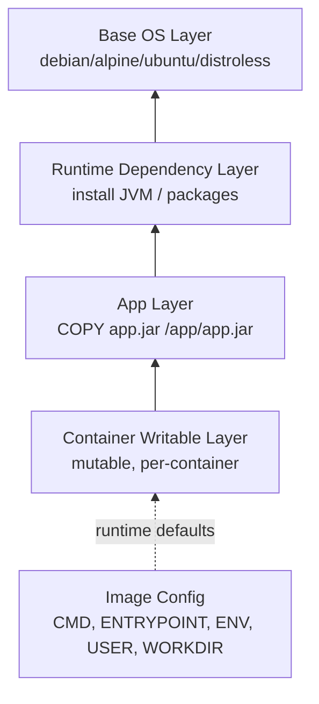
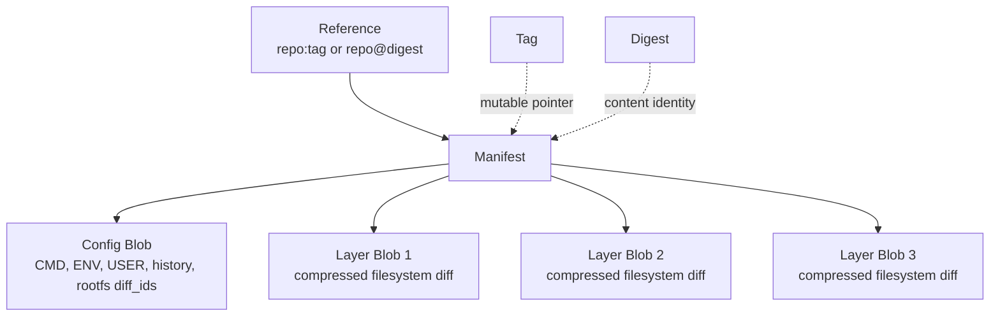
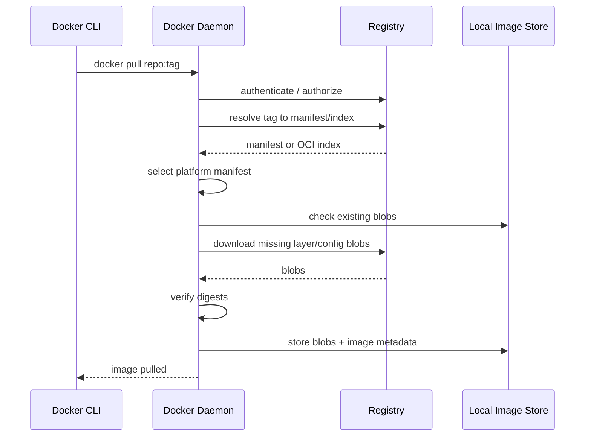
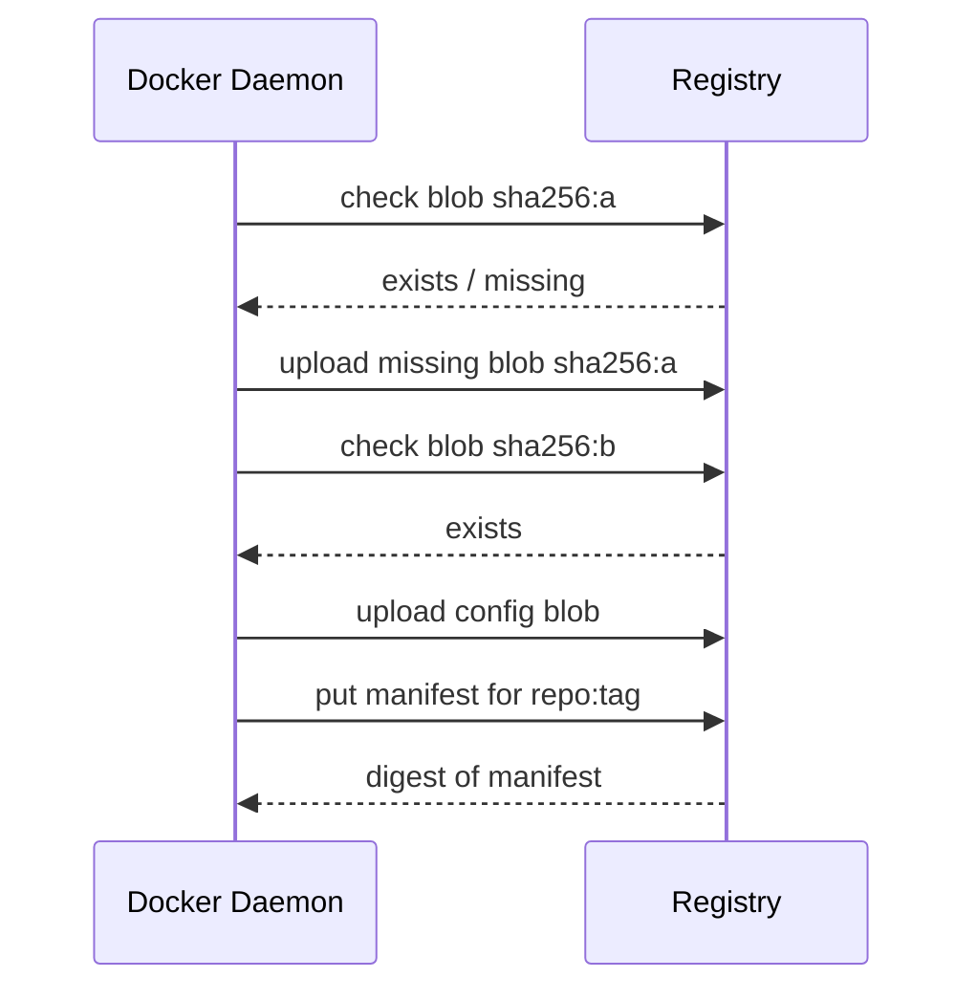
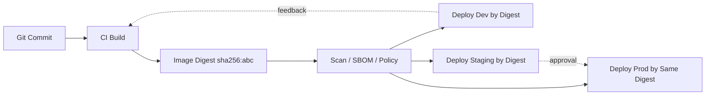
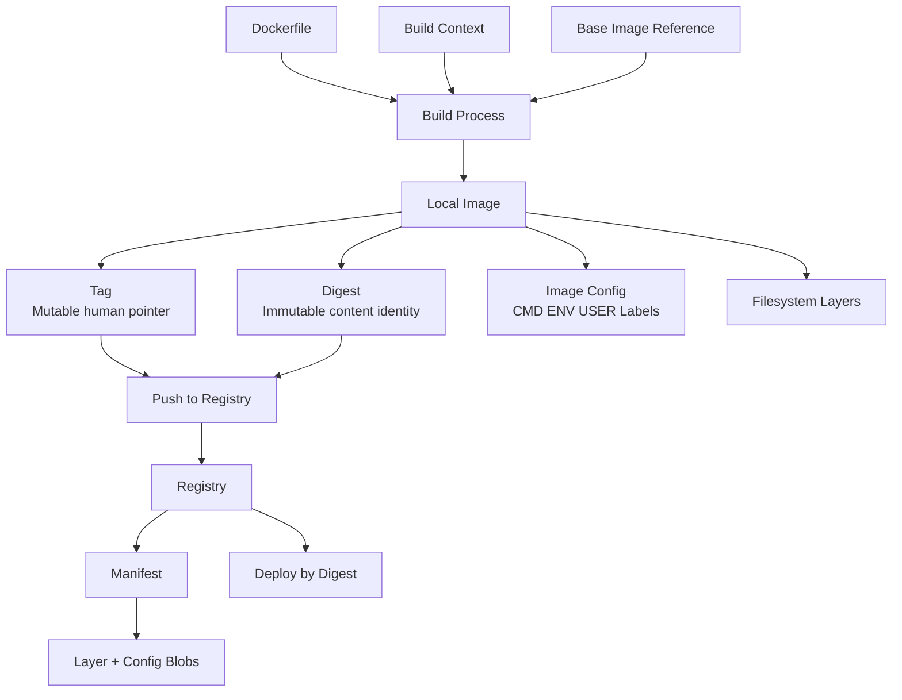

# Part 005 — Image Internals, Layers, Tags, Digests, Manifests

## 1. Tujuan Part Ini

Part sebelumnya membahas arsitektur Docker Engine dan baseline environment. Sekarang kita masuk ke object paling fundamental dalam container workflow: **image**.

Banyak engineer memakai image sebagai nama string seperti `nginx:latest` atau `my-app:1.2.3`. Itu cukup untuk demo, tetapi tidak cukup untuk production-grade engineering. Di sistem nyata, image adalah:

- artifact immutable yang dibangun dari instruksi build;
- kumpulan layer filesystem yang content-addressed;
- metadata runtime default;
- unit promosi antar environment;
- unit audit supply chain;
- unit rollback;
- dependency transitive terhadap base image, package OS, runtime language, CA bundle, timezone data, dan native library;
- boundary antara build-time dan run-time.

Target setelah part ini:

- bisa membedakan **repository**, **tag**, **digest**, **image ID**, **manifest**, **manifest list / OCI index**, dan **layer**;
- bisa menjelaskan mengapa tag mutable tetapi digest immutable;
- bisa memahami bagaimana Docker pull/push berinteraksi dengan registry;
- bisa membaca risiko `latest`, tag floating, retagging, dan multi-architecture mismatch;
- bisa merancang image promotion strategy yang defensible untuk engineering platform;
- bisa melakukan inspeksi image untuk debugging, reproducibility, dan incident response.

Inti part ini: **image bukan file tunggal dan tag bukan identitas artifact yang kuat**.

---

## 2. Mental Model: Image sebagai Artifact Berlapis

Image dapat dipahami sebagai paket artifact yang terdiri dari dua kategori besar:

1. **Filesystem content**
   - disusun sebagai layer-layer immutable;
   - setiap layer merepresentasikan perubahan filesystem dari step tertentu;
   - layer bisa dipakai ulang oleh image lain;
   - layer disimpan dan didistribusikan berdasarkan digest konten.

2. **Metadata eksekusi**
   - command default;
   - entrypoint default;
   - environment variable default;
   - working directory;
   - exposed port metadata;
   - user default;
   - healthcheck metadata;
   - labels;
   - architecture/OS metadata.

Ketika image dijalankan menjadi container, Docker tidak “menyalin seluruh image” sebagai filesystem baru. Runtime membuat writable layer tipis di atas image layers. Jadi container adalah kombinasi:

```text
container writable layer
+ image layer N
+ image layer N-1
+ ...
+ base image layer 1
+ runtime metadata
+ kernel isolation
= running container
```

Diagram sederhana:



Layer image bersifat immutable, tetapi container writable layer bersifat mutable. Inilah alasan mengapa perubahan file di dalam container yang sedang berjalan tidak otomatis menjadi image baru.

---

## 3. Istilah Dasar yang Sering Tertukar

### 3.1 Repository

Repository adalah namespace nama image di registry.

Contoh:

```text
nginx
library/nginx
my-company/payment-service
ghcr.io/acme/fraud-engine
registry.internal/platform/case-api
```

Repository bukan image tunggal. Satu repository bisa memiliki banyak tag dan banyak digest.

---

### 3.2 Tag

Tag adalah label yang menunjuk ke image manifest tertentu pada saat tertentu.

Contoh:

```text
nginx:1.27
nginx:latest
payment-service:2026-07-01.5
payment-service:main
payment-service:prod
```

Tag berguna untuk ergonomi manusia, tetapi tidak cukup kuat sebagai identitas artifact karena tag bisa dipindahkan.

Contoh risiko:

```text
Hari Senin:
payment-service:prod -> sha256:aaa

Hari Selasa:
payment-service:prod -> sha256:bbb
```

Nama tag sama, isi image berbeda.

Kesalahan mental model yang umum:

```text
Salah: tag adalah versi immutable.
Benar: tag adalah pointer mutable kecuali registry/policy memaksa immutability.
```

---

### 3.3 Digest

Digest adalah identitas berbasis hash kriptografis terhadap konten tertentu.

Contoh:

```text
nginx@sha256:0f9c...
my-company/payment-service@sha256:ab12...
```

Digest memberikan identitas yang jauh lebih kuat daripada tag. Jika konten berubah, digest berubah.

Dalam deployment yang butuh reproducibility tinggi, digest lebih defensible daripada tag.

Prinsip engineering:

```text
Gunakan tag untuk discovery dan workflow manusia.
Gunakan digest untuk deployment yang harus repeatable dan auditable.
```

---

### 3.4 Image ID

Image ID adalah identifier lokal yang muncul di Docker image store.

Contoh:

```bash
docker image ls
```

Output bisa menampilkan `IMAGE ID`. Dua tag berbeda bisa menunjuk ke image ID yang sama jika kontennya sama.

Image ID relevan untuk inspeksi lokal, tetapi biasanya bukan identitas utama untuk deployment lintas host/registry.

---

### 3.5 Manifest

Manifest adalah dokumen metadata registry yang menjelaskan image tertentu, termasuk layer dan config object yang perlu diunduh.

Secara konseptual:

```json
{
  "schemaVersion": 2,
  "mediaType": "application/vnd.oci.image.manifest.v1+json",
  "config": {
    "digest": "sha256:..."
  },
  "layers": [
    { "digest": "sha256:..." },
    { "digest": "sha256:..." }
  ]
}
```

Manifest bukan semua layer itu sendiri. Manifest menunjuk ke blob config dan blob layer.

---

### 3.6 Manifest List / OCI Index

Multi-platform image seperti `nginx:1.27` bisa menunjuk ke beberapa manifest platform-specific.

Contoh:

```text
nginx:1.27
  -> linux/amd64 manifest
  -> linux/arm64 manifest
  -> linux/arm/v7 manifest
```

Ketika Docker pull dilakukan, client/daemon memilih manifest yang cocok dengan platform target.

Masalah yang sering muncul:

```text
Image bisa jalan di laptop Mac ARM, tetapi gagal di server Linux AMD64.
```

Atau sebaliknya:

```text
CI membangun linux/amd64, tetapi developer mencoba menjalankan di linux/arm64 tanpa emulation atau multi-platform build.
```

---

## 4. Object Model Image Registry

Registry menyimpan image sebagai graph object, bukan sebagai file `.zip` tunggal.



Registry pada dasarnya menyediakan operasi:

- menerima upload blob layer;
- menerima upload config blob;
- menerima manifest;
- mengasosiasikan tag dengan manifest;
- melayani pull berdasarkan tag atau digest;
- melakukan deduplication blob berdasarkan digest;
- mengatur auth, scope, policy, retention, dan garbage collection.

---

## 5. Pull Lifecycle

Ketika menjalankan:

```bash
docker pull nginx:1.27
```

Secara konseptual Docker melakukan langkah berikut:

1. Resolve registry dari reference.
2. Authenticate jika registry butuh credential.
3. Resolve `nginx:1.27` ke manifest atau index.
4. Jika index multi-platform, pilih manifest sesuai platform target.
5. Cek layer mana yang sudah ada lokal.
6. Download layer yang belum ada.
7. Download config blob.
8. Verifikasi digest konten.
9. Simpan metadata image di local image store.
10. Buat tag lokal yang menunjuk ke image tersebut.

Diagram:



Failure bisa terjadi di beberapa titik:

| Failure | Kemungkinan Penyebab | Cara Reasoning |
|---|---|---|
| `pull access denied` | repo private, credential salah, scope token salah | cek auth dan registry namespace |
| `manifest unknown` | tag/digest tidak ada | cek apakah push benar-benar publish manifest |
| `no matching manifest` | platform tidak tersedia | cek `--platform`, manifest list, arsitektur host |
| lambat | layer besar, registry lambat, cache miss | cek layer size dan proximity registry |
| digest mismatch | corruption, proxy, registry bug | treat sebagai supply-chain critical |

---

## 6. Push Lifecycle

Ketika menjalankan:

```bash
docker push registry.internal/app/payment-service:1.8.0
```

Docker tidak selalu meng-upload semua layer. Registry bisa sudah memiliki sebagian blob.

Secara konseptual:

1. Docker menghitung layer/config blob yang diperlukan.
2. Docker bertanya ke registry apakah blob tertentu sudah ada.
3. Blob yang belum ada di-upload.
4. Manifest di-upload.
5. Tag di registry diarahkan ke manifest.

Diagram:



Engineering implication:

- Image dengan base layer umum bisa push/pull lebih cepat karena deduplication.
- Mengubah layer awal membuat layer setelahnya sering berubah juga.
- Build yang buruk menyebabkan banyak layer invalid dan registry churn.
- Tag yang di-overwrite tanpa policy bisa membuat deployment tidak repeatable.

---

## 7. Layer Internals: Apa yang Sebenarnya Disimpan?

Layer adalah filesystem diff. Ia menyimpan perubahan dari layer sebelumnya.

Contoh Dockerfile:

```dockerfile
FROM eclipse-temurin:21-jre
WORKDIR /app
COPY app.jar /app/app.jar
ENTRYPOINT ["java", "-jar", "/app/app.jar"]
```

Secara sederhana:

```text
base image layers dari eclipse-temurin
+ metadata WORKDIR
+ layer COPY app.jar
+ metadata ENTRYPOINT
```

Tidak semua Dockerfile instruction membuat filesystem layer baru. Beberapa instruction hanya mengubah metadata image.

Umumnya:

| Instruction | Membuat filesystem layer? | Catatan |
|---|---:|---|
| `FROM` | baseline | menentukan parent/root stage |
| `RUN` | ya | hasil perubahan filesystem dari command |
| `COPY` | ya | menambahkan file dari context/stage |
| `ADD` | ya | seperti COPY plus kemampuan ekstra |
| `CMD` | tidak | metadata default command |
| `ENTRYPOINT` | tidak | metadata default executable |
| `ENV` | metadata, memengaruhi layer berikutnya | disimpan di config |
| `WORKDIR` | metadata | memengaruhi instruksi berikutnya |
| `USER` | metadata | memengaruhi instruksi berikutnya dan runtime default |
| `EXPOSE` | tidak | dokumentasi metadata port |
| `LABEL` | tidak | metadata |
| `HEALTHCHECK` | tidak | metadata runtime health |

Nuance: implementasi builder menyimpan perubahan metadata sebagai image config/history. Dari sisi praktis, `RUN`, `COPY`, dan `ADD` adalah sumber utama perubahan filesystem.

---

## 8. Layer Ordering dan Cache Consequence

Urutan layer sangat penting. Build cache bekerja efektif ketika layer yang jarang berubah ditempatkan sebelum layer yang sering berubah.

Buruk:

```dockerfile
FROM node:22
WORKDIR /app
COPY . .
RUN npm ci
RUN npm run build
CMD ["node", "dist/server.js"]
```

Masalah:

- perubahan kecil di source code membuat `COPY . .` berubah;
- cache `npm ci` ikut invalid;
- dependency install jalan ulang terlalu sering.

Lebih baik:

```dockerfile
FROM node:22
WORKDIR /app
COPY package.json package-lock.json ./
RUN npm ci
COPY . .
RUN npm run build
CMD ["node", "dist/server.js"]
```

Prinsip:

```text
Copy dependency manifest dulu.
Install dependency.
Baru copy source code yang sering berubah.
```

Untuk Java/Maven, pattern serupa:

```dockerfile
FROM maven:3.9-eclipse-temurin-21 AS build
WORKDIR /src
COPY pom.xml ./
COPY .mvn .mvn
RUN mvn -q -DskipTests dependency:go-offline
COPY src ./src
RUN mvn -q -DskipTests package
```

Tetapi ini bukan template mutlak. Multi-module Maven, Gradle, private repository, dan generated code bisa butuh struktur berbeda.

---

## 9. Tags: Ergonomi vs Defensibility

Tag adalah alat koordinasi manusia dan pipeline.

Contoh tag yang umum:

```text
latest
main
dev
staging
prod
1.8.0
1.8.0-rc.1
2026-07-01.5
git-4f2a91c
```

Setiap pola punya trade-off.

| Tag Pattern | Kelebihan | Risiko |
|---|---|---|
| `latest` | mudah untuk demo | tidak jelas versi, mutable, buruk untuk prod |
| branch tag: `main` | cocok untuk dev environment | mutable, bukan release artifact |
| semver: `1.8.0` | mudah dibaca manusia | bisa tetap mutable jika registry mengizinkan overwrite |
| timestamp/build number | bagus untuk trace build | tidak menjelaskan source commit sendiri |
| git SHA | traceability kuat | kurang ramah manusia |
| environment tag: `prod` | mudah melihat current promoted | mutable pointer, jangan jadikan source of truth tunggal |
| digest | immutable | tidak ergonomis untuk manusia |

Rekomendasi praktis untuk platform internal:

```text
Build menghasilkan tag:
- app:git-<short-sha>
- app:build-<build-number>
- app:<semver> jika release resmi

Deployment menyimpan digest resolved:
- app@sha256:<manifest-digest>

Environment tag seperti app:prod boleh dipakai sebagai pointer convenience,
tetapi audit record harus menyimpan digest.
```

---

## 10. Digest-Pinned Deployment

Deployment dengan tag:

```yaml
image: registry.internal/payment-service:1.8.0
```

Lebih mudah dibaca, tetapi jika tag diganti, hasil pull berikutnya bisa berbeda.

Deployment dengan digest:

```yaml
image: registry.internal/payment-service@sha256:ab12cdef...
```

Lebih reproducible karena menunjuk ke konten immutable.

Gabungan yang sering dipakai:

```yaml
image: registry.internal/payment-service:1.8.0@sha256:ab12cdef...
```

Secara mental, tag membantu pembaca, digest menentukan konten.

---

## 11. Multi-Architecture Image

Modern engineering sering melibatkan:

- developer Mac ARM64;
- CI runner AMD64;
- production Linux AMD64;
- edge device ARM64;
- local test via Docker Desktop;
- cloud build remote.

Jika image hanya dibangun untuk satu platform, runtime di platform lain bisa gagal.

Cek platform image:

```bash
docker buildx imagetools inspect nginx:1.27
```

Atau:

```bash
docker manifest inspect nginx:1.27
```

Build multi-platform biasanya memakai BuildKit/buildx:

```bash
docker buildx build \
  --platform linux/amd64,linux/arm64 \
  -t registry.internal/payment-service:1.8.0 \
  --push \
  .
```

Engineering nuance:

- Multi-platform image bukan satu binary universal.
- Manifest list/index menunjuk ke manifest per-platform.
- Setiap platform bisa punya layer berbeda.
- Native dependency bisa berbeda antar architecture.
- Emulation via QEMU berguna, tetapi build bisa lebih lambat dan kadang menyembunyikan issue performa/native.

---

## 12. Image Config: Metadata yang Sering Dilupakan

Image bukan hanya filesystem. Image memiliki config yang memengaruhi runtime default.

Cek image config:

```bash
docker image inspect nginx:1.27
```

Field yang penting:

- `Config.Cmd`
- `Config.Entrypoint`
- `Config.Env`
- `Config.WorkingDir`
- `Config.User`
- `Config.ExposedPorts`
- `Config.Labels`
- `Config.Healthcheck`
- `Architecture`
- `Os`
- `RootFS.Layers`

Contoh reasoning:

```bash
docker image inspect my-app:1.8.0 \
  --format '{{json .Config.Entrypoint}} {{json .Config.Cmd}} {{json .Config.User}}'
```

Pertanyaan yang harus bisa dijawab:

- Apakah image berjalan sebagai root?
- Apa command default-nya?
- Apakah environment default membawa secret?
- Apakah working directory sesuai?
- Apakah image punya healthcheck?
- Apakah image punya label revision/source?
- Apakah architecture cocok dengan host?

---

## 13. Image History dan Forensics

`docker image history` membantu melihat lapisan historis build.

```bash
docker image history my-app:1.8.0
```

Gunanya:

- mendeteksi layer besar;
- melihat apakah secret pernah muncul di command build;
- melihat instruksi mana yang menyebabkan image membengkak;
- membandingkan dua build;
- memahami cache behavior.

Contoh smell:

```text
RUN echo $NPM_TOKEN > .npmrc && npm ci
```

Walaupun file `.npmrc` dihapus di layer berikutnya, token bisa tetap muncul di layer/history tergantung cara build dilakukan. Solusi yang benar adalah memakai secret mount BuildKit pada part berikutnya, bukan ARG/ENV biasa untuk secret.

---

## 14. Size: Virtual Size vs Transfer Size vs Runtime Size

Ukuran image sering membingungkan.

Ada beberapa ukuran:

1. **Compressed layer size**
   - ukuran yang dikirim lewat registry;
   - relevan untuk pull/push speed.

2. **Uncompressed layer size**
   - ukuran di local storage setelah extract;
   - relevan untuk disk usage.

3. **Shared layer size**
   - layer yang dipakai ulang oleh image lain;
   - tidak selalu menambah disk secara linear.

4. **Writable container size**
   - perubahan runtime per container;
   - relevan untuk container yang menulis banyak file.

Cek:

```bash
docker image ls

docker system df

docker container ls -s
```

Jangan membuat keputusan hanya berdasarkan angka `docker image ls`. Gunakan `docker system df` untuk melihat shared size dan reclaimable size.

---

## 15. Base Image Selection

Base image adalah dependency besar. Ia menentukan:

- libc: glibc vs musl;
- package manager;
- CA bundle;
- timezone data;
- shell availability;
- debugging tools;
- vulnerability surface;
- runtime compatibility;
- image size;
- operational ergonomics.

Pilihan umum:

| Base | Kelebihan | Risiko |
|---|---|---|
| Debian/Ubuntu | kompatibilitas luas, glibc, mudah debug | lebih besar |
| Alpine | kecil, populer | musl compatibility issue untuk beberapa native dependency |
| Distroless | surface kecil, bagus untuk prod | debug lebih sulit, tidak ada shell |
| Scratch | minimal ekstrem | hanya cocok untuk static binary/sangat terkontrol |
| Language official image | ergonomis | kadang terlalu besar untuk runtime final |

Untuk Java:

- build stage bisa memakai Maven/Gradle image;
- runtime stage cukup JRE atau custom runtime image;
- distroless Java cocok untuk service yang sudah stabil;
- jangan memakai full build image sebagai runtime final kecuali ada alasan kuat.

Decision rule:

```text
Development image boleh ergonomis.
Production image harus minimal, patchable, observable, dan predictable.
```

---

## 16. Mutable Runtime adalah Anti-Pattern

Container sering dianggap disposable. Artinya image harus membawa semua dependency aplikasi, bukan bergantung pada manual change di container berjalan.

Anti-pattern:

```bash
docker exec -it prod-container bash
apt-get update
apt-get install some-package
vi /app/config.yml
```

Masalah:

- perubahan tidak masuk artifact;
- tidak reproducible;
- hilang saat container recreate;
- tidak audited;
- menyebabkan configuration drift;
- sulit rollback.

Pattern yang benar:

```text
Change source/config -> build image/config artifact -> push -> deploy -> observe.
```

Jika butuh hotfix production:

- buat branch hotfix;
- build image baru;
- beri tag/digest baru;
- deploy secara eksplisit;
- catat release note;
- rollback memakai digest sebelumnya jika gagal.

---

## 17. Promotion Strategy: Jangan Rebuild Per Environment

Kesalahan umum:

```text
Build dev image.
Build staging image.
Build prod image.
```

Jika source commit sama tetapi image dibangun ulang per environment, artifact bisa berbeda karena:

- base image tag berubah;
- package repository berubah;
- dependency resolver berubah;
- timestamp berubah;
- cache berbeda;
- build arg berbeda;
- network mirror berbeda.

Strategi yang lebih baik:

```text
Build once.
Scan once.
Sign/attest once.
Promote same digest across environments.
```

Diagram:



Environment-specific behavior sebaiknya berasal dari:

- environment variable non-secret;
- config object;
- secret manager;
- service discovery;
- mounted config;
- deployment manifest;
- runtime arguments yang jelas.

Bukan dari rebuild image.

---

## 18. Labels untuk Traceability

Image labels membantu audit dan observability.

Contoh Dockerfile:

```dockerfile
LABEL org.opencontainers.image.title="payment-service"
LABEL org.opencontainers.image.description="Payment case processing API"
LABEL org.opencontainers.image.source="https://git.example.com/acme/payment-service"
LABEL org.opencontainers.image.revision="${GIT_SHA}"
LABEL org.opencontainers.image.version="${APP_VERSION}"
LABEL org.opencontainers.image.created="${BUILD_TIME}"
```

Dengan label, engineer bisa menjawab:

- source repository mana yang menghasilkan image ini?
- commit mana?
- versi aplikasi apa?
- kapan dibangun?
- siapa pipeline pembuatnya?
- policy apa yang lolos?

Cek:

```bash
docker image inspect my-app:1.8.0 \
  --format '{{json .Config.Labels}}'
```

Nuance: label bukan security proof. Label bisa dipalsukan jika supply chain tidak dikontrol. Tetapi label tetap penting untuk ergonomi dan traceability.

---

## 19. Registry Governance

Registry production bukan hanya tempat upload image. Ia adalah artifact control point.

Hal yang perlu dirancang:

| Area | Pertanyaan Engineering |
|---|---|
| Namespace | siapa boleh push ke repository mana? |
| Tag immutability | apakah release tag boleh overwrite? |
| Retention | image lama disimpan berapa lama? |
| Garbage collection | kapan blob tidak terpakai dihapus? |
| Vulnerability scan | scan saat push atau scheduled? |
| Promotion | copy antar registry atau tag promotion? |
| Access | apakah prod cluster punya read-only token? |
| Audit | siapa push tag ini dan kapan? |
| Availability | apa fallback jika registry down? |
| Latency | apakah butuh mirror dekat cluster? |

Minimal policy untuk organisasi serius:

```text
- CI boleh push ke repository aplikasi yang dimiliki team.
- Developer tidak boleh overwrite release tag.
- Production deployment memakai digest.
- Cluster production memakai read-only pull credential.
- Image dengan critical vulnerability tertentu diblokir atau butuh exception.
- Retention policy tidak menghapus digest yang masih dipakai deployment aktif.
```

---

## 20. Failure Mode: Registry Down

Apa yang terjadi jika registry down?

Tergantung kondisi node.

Jika image sudah ada lokal:

```text
Container bisa start dari local image store.
```

Jika image belum ada lokal:

```text
Pull gagal, deployment gagal schedule/start.
```

Jika tag mutable dan node punya tag lama:

```text
Ada risiko node menjalankan image lama sementara node lain menarik image baru ketika registry pulih.
```

Mitigasi:

- pakai digest;
- pre-pull image untuk critical workloads;
- gunakan registry HA;
- gunakan registry mirror/cache;
- jangan prune image aktif sembarangan;
- pastikan orchestrator policy jelas: pull always vs if not present.

---

## 21. Failure Mode: `latest` Drift

Skenario:

```text
Service A deploy nginx:latest di node-1 hari Senin.
Node-1 pull digest aaa.
Hari Selasa latest berubah ke digest bbb.
Service recreate di node-2.
Node-2 pull digest bbb.
```

Hasil:

```text
Satu service logical bisa berjalan dengan dua image berbeda.
```

Ini buruk untuk incident analysis.

Rule:

```text
Jangan gunakan latest untuk production deployment.
```

`latest` boleh dipakai untuk:

- tutorial;
- local throwaway testing;
- base image exploration;
- non-critical sandbox.

Tetapi untuk engineering serius, gunakan versioned tag + digest.

---

## 22. Failure Mode: Base Image Rebuild

Walaupun Dockerfile tidak berubah, hasil build bisa berubah jika base image tag berubah.

Contoh:

```dockerfile
FROM ubuntu:24.04
```

Tag `24.04` relatif stabil secara versi, tetapi manifest di registry bisa berubah karena security rebuild.

Ini punya dua sisi:

- bagus: rebuild mendapatkan patch security;
- risiko: rebuild tidak bit-for-bit sama seperti sebelumnya.

Untuk supply chain ketat:

```dockerfile
FROM ubuntu:24.04@sha256:<digest>
```

Tetapi ada trade-off:

- digest pinning meningkatkan reproducibility;
- digest pinning juga membuat update security tidak otomatis;
- perlu proses terjadwal untuk memperbarui digest base image.

Strategi mature:

```text
Pin digest untuk release.
Automate dependency/base-image update PR.
Scan ulang image secara berkala.
Rebuild dan promote secara eksplisit.
```

---

## 23. Failure Mode: Layer Berisi Secret

Secret bisa bocor ke image melalui:

- `ARG TOKEN=...`;
- `ENV TOKEN=...`;
- `RUN echo token > file`;
- `.npmrc`, `.pypirc`, `settings.xml` ikut `COPY . .`;
- `.env` masuk build context;
- SSH key masuk image;
- build log mencetak credential.

Contoh buruk:

```dockerfile
ARG NPM_TOKEN
RUN npm config set //registry.npmjs.org/:_authToken=$NPM_TOKEN && npm ci
```

Walaupun token tidak ada di filesystem final, ia bisa muncul di history/metadata/build logs tergantung cara pemakaian.

Pattern yang benar akan dibahas detail di Part 007 dan Part 023, tetapi prinsipnya:

```text
Secret untuk build harus diberikan sebagai secret mount / secure credential mechanism,
bukan sebagai ARG/ENV biasa dan bukan sebagai file di context.
```

---

## 24. Debugging Image Identity

Command yang wajib dikuasai:

```bash
# Lihat image lokal
docker image ls

# Lihat detail image
docker image inspect my-app:1.8.0

# Lihat history layer
docker image history my-app:1.8.0

# Lihat disk usage Docker
docker system df

# Pull berdasarkan digest
docker pull nginx@sha256:<digest>

# Inspect multi-platform image
docker buildx imagetools inspect nginx:1.27

# Tag image lokal
docker tag my-app:local registry.internal/my-app:1.8.0

# Push image
docker push registry.internal/my-app:1.8.0
```

Pertanyaan debugging:

1. Image yang berjalan ini berasal dari tag apa?
2. Digest aktualnya apa?
3. Kapan image dibangun?
4. Commit apa yang dipakai?
5. Base image apa?
6. Platform apa?
7. Apakah ada layer besar yang tidak perlu?
8. Apakah image config menjalankan user root?
9. Apakah ada environment default yang sensitif?
10. Apakah tag ini pernah overwrite?

---

## 25. Reading `docker image inspect`

Contoh command:

```bash
docker image inspect my-app:1.8.0 | jq '.[0] | {
  Id,
  RepoTags,
  RepoDigests,
  Created,
  Architecture,
  Os,
  Config: .Config,
  RootFS: .RootFS
}'
```

Field penting:

```text
Id
RepoTags
RepoDigests
Created
Architecture
Os
Config.User
Config.Env
Config.Entrypoint
Config.Cmd
Config.WorkingDir
Config.Labels
RootFS.Layers
```

Jika `RepoDigests` kosong, biasanya image belum pernah dipull/push dengan digest reference dari registry atau metadata digest belum tersedia lokal.

---

## 26. Image Naming Strategy untuk Enterprise

Naming harus memudahkan ownership dan policy.

Contoh buruk:

```text
registry.internal/app:1.0
registry.internal/service:latest
registry.internal/backend:prod
```

Masalah:

- ownership kabur;
- nama terlalu generic;
- sulit policy per domain;
- sulit retention per team;
- sulit audit.

Lebih baik:

```text
registry.internal/<org>/<domain>/<service>:<version>
registry.internal/acme/payments/payment-api:1.8.0
registry.internal/acme/enforcement/case-worker:git-4f2a91c
```

Aturan:

```text
Repository name harus menjawab: siapa pemiliknya, domain apa, aplikasi apa.
Tag harus menjawab: artifact build/release yang mana.
Digest harus menjawab: konten persis yang mana.
```

---

## 27. Retention dan Garbage Collection

Image lama tidak boleh dihapus sembarangan.

Risiko retention agresif:

- rollback gagal karena digest lama hilang;
- audit gagal karena artifact historis tidak tersedia;
- environment lama tidak bisa recreate;
- disaster recovery terhambat.

Risiko retention terlalu longgar:

- storage registry membengkak;
- vulnerability backlog besar;
- image tidak jelas ownership;
- biaya naik.

Policy realistis:

```text
- Simpan release production minimal selama masa rollback + audit requirement.
- Simpan digest yang masih direferensikan deployment aktif.
- Hapus branch/dev images setelah N hari.
- Hapus dangling/untagged manifest setelah aman.
- Jangan hanya berdasarkan tag; cek manifest/digest reference.
```

---

## 28. Image as Contract

Image adalah contract antara build pipeline dan runtime platform.

Build pipeline berjanji:

- image berisi binary yang benar;
- dependency cukup;
- metadata traceable;
- user/security posture sesuai;
- image bisa berjalan dengan command default;
- healthcheck/logging behavior sesuai;
- tidak membawa secret;
- vulnerability level diterima.

Runtime platform berjanji:

- menyediakan CPU/memory/network/storage;
- inject config/secrets;
- menjalankan image dengan policy yang benar;
- mengumpulkan log/metrics;
- restart/rollout sesuai policy;
- membatasi privilege.

Jika image contract buruk, Compose, Swarm, atau Kubernetes tidak bisa menyelamatkan desain secara ajaib.

---

## 29. Anti-Patterns

### 29.1 `latest` di Production

```yaml
image: my-app:latest
```

Masalah:

- tidak reproducible;
- tidak jelas rollback;
- tidak jelas audit;
- rawan drift antar node.

---

### 29.2 Rebuild per Environment

```text
Build dev -> deploy dev
Build staging -> deploy staging
Build prod -> deploy prod
```

Masalah:

- environment tidak menjalankan artifact yang sama;
- testing staging tidak membuktikan prod artifact;
- supply chain makin sulit diaudit.

---

### 29.3 Secret Masuk Build Context

```dockerfile
COPY . .
```

Jika `.env`, key, token, atau credential ada di directory, ia bisa masuk context atau image.

Solusi:

- `.dockerignore` agresif;
- secret mount;
- dedicated build context;
- CI secret masking;
- image scanning.

---

### 29.4 Fat Runtime Image

Runtime image berisi:

- compiler;
- package manager;
- test tools;
- source code penuh;
- build cache;
- credential build;
- shell tools tidak perlu.

Masalah:

- attack surface lebih besar;
- image pull lebih lambat;
- cold start lebih lambat;
- vulnerability lebih banyak;
- debug surface tidak terkontrol.

---

### 29.5 Mutable Image Tag untuk Release

Jika tag `1.8.0` bisa overwrite, versi release tidak lagi bermakna.

Solusi:

- aktifkan tag immutability untuk release repo/tag;
- gunakan digest di deployment;
- audit push event;
- blokir overwrite via CI policy.

---

## 30. Decision Framework

Saat merancang image strategy, jawab pertanyaan berikut.

### 30.1 Identity

```text
Bagaimana kita tahu artifact persis yang sedang berjalan?
```

Jawaban minimal:

- image digest tercatat di deployment;
- label revision ada;
- build metadata tersimpan;
- registry audit tersedia.

---

### 30.2 Reproducibility

```text
Jika kita rebuild besok dari commit yang sama, apakah hasilnya sama?
```

Jika tidak, apa yang berubah?

- base image tag;
- OS package repository;
- language dependency resolver;
- timestamp;
- generated file;
- network dependency;
- secret/config injection.

---

### 30.3 Security

```text
Apa yang ada di image yang tidak perlu ada?
```

Cek:

- shell;
- package manager;
- compiler;
- source code;
- test fixture;
- private key;
- token;
- default root user;
- vulnerable native library.

---

### 30.4 Operability

```text
Jika production incident terjadi, bisakah kita memahami image ini dalam 5 menit?
```

Perlu:

- label source/revision/version;
- image history wajar;
- log ke stdout/stderr;
- predictable entrypoint;
- healthcheck jelas;
- platform cocok;
- artifact tersedia untuk rollback.

---

## 31. Minimal Image Quality Bar

Sebuah image production-grade minimal harus memenuhi:

```text
[ ] tidak memakai latest untuk deployment
[ ] punya version tag dan digest
[ ] base image dipilih sadar trade-off
[ ] tidak berjalan sebagai root kecuali ada alasan eksplisit
[ ] tidak menyimpan secret di layer/config/history
[ ] image size masuk akal
[ ] Dockerfile layer order mendukung cache
[ ] label revision/source/version tersedia
[ ] command/entrypoint predictable
[ ] logs keluar ke stdout/stderr
[ ] artifact yang sama dipromosikan antar environment
[ ] bisa discan vulnerability/SBOM
[ ] rollback digest tersedia
```

---

## 32. Practice: Image Forensics Drill

Ambil satu image aplikasi internal atau public image.

Lakukan:

```bash
docker pull nginx:1.27

docker image inspect nginx:1.27

docker image history nginx:1.27

docker buildx imagetools inspect nginx:1.27

docker system df
```

Jawab:

1. Repo tag apa yang kamu pull?
2. Repo digest apa yang tersedia?
3. Platform apa saja yang didukung?
4. Berapa layer?
5. Apakah image punya default user?
6. Entrypoint dan CMD apa?
7. Label apa yang tersedia?
8. Layer mana yang paling besar?
9. Apa yang terjadi jika tag berubah besok?
10. Bagaimana kamu deploy image ini secara reproducible?

---

## 33. Practice: Design Internal Tagging Policy

Buat policy untuk service `case-api`.

Constraint:

- ada branch `main`;
- ada release `v2.4.0`;
- deployment dev otomatis;
- deployment staging butuh approval;
- deployment prod butuh manual promotion;
- rollback harus tersedia minimal 90 hari;
- registry mendukung tag immutability.

Rancang:

```text
Repository:
Tag saat CI build:
Tag saat release:
Digest recording:
Promotion mechanism:
Retention policy:
Overwrite policy:
Rollback mechanism:
```

Contoh jawaban matang:

```text
Repository:
registry.internal/regtech/enforcement/case-api

CI build tags:
case-api:git-<short-sha>
case-api:build-<build-number>

Release tag:
case-api:2.4.0

Deployment:
Dev boleh dari git tag resolved ke digest.
Staging dan prod memakai digest yang sama.

Overwrite:
Release tag immutable.
Branch tag mutable hanya untuk non-prod convenience.

Retention:
Prod digests disimpan minimal 180 hari.
Branch images yang tidak dipromosikan dihapus setelah 14 hari.
```

---

## 34. Mermaid Summary



---

## 35. Ringkasan

Image adalah pusat container engineering. Container runtime, Compose, dan Swarm semuanya bergantung pada kualitas image.

Hal terpenting:

- image bukan file tunggal, tetapi manifest/config/layers;
- tag adalah pointer mutable;
- digest adalah identitas konten;
- layer ordering memengaruhi cache, size, dan rebuild speed;
- base image adalah dependency supply chain;
- deployment production sebaiknya memakai digest atau minimal mencatat digest;
- artifact yang sama harus dipromosikan antar environment;
- registry adalah control point untuk ownership, retention, audit, dan policy.

Setelah ini, Part 006 akan membahas **Dockerfile semantics dan build context**: bagaimana instruksi Dockerfile benar-benar bekerja, kenapa `.dockerignore` penting, bagaimana cache invalidation terjadi, dan bagaimana menulis Dockerfile yang deterministic, aman, dan efisien.
