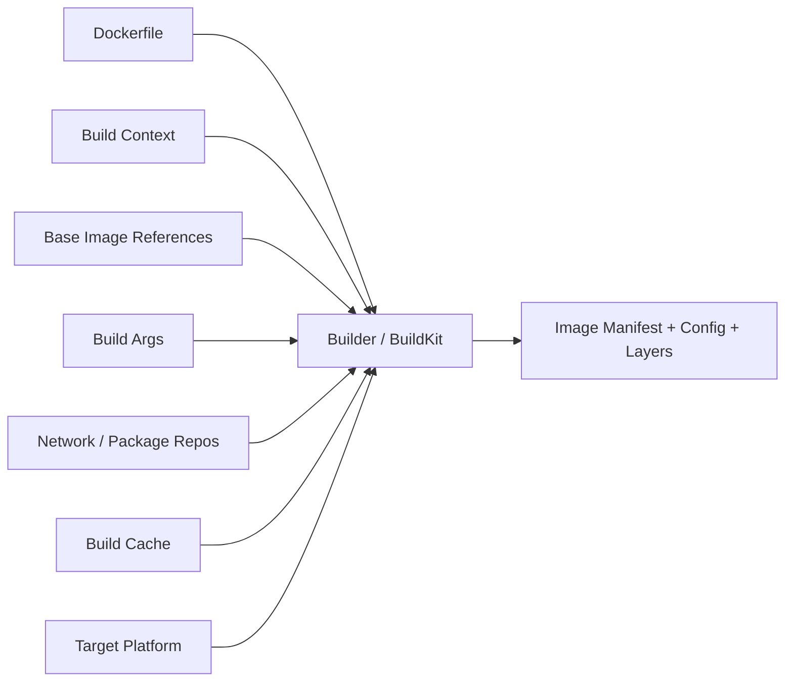
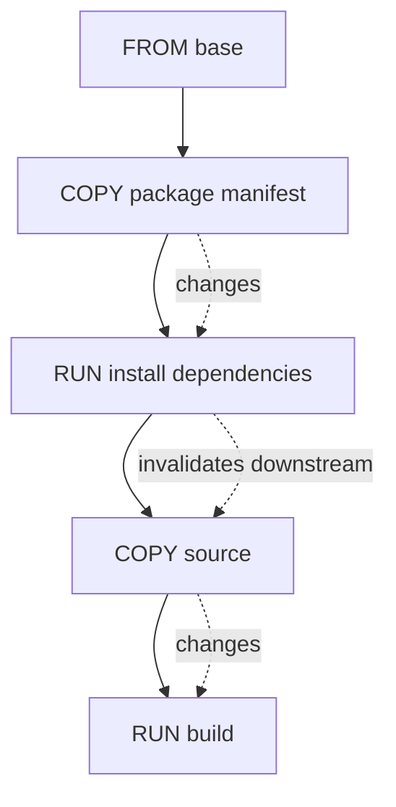
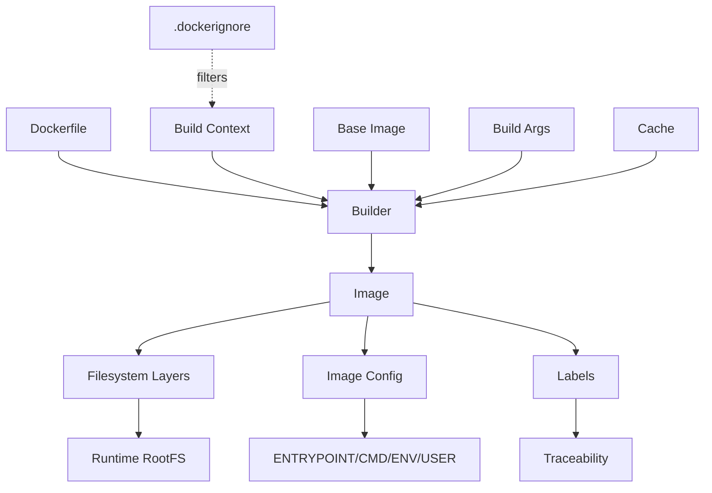

# Part 006 — Dockerfile Semantics and Build Context

## 1. Tujuan Part Ini

Part sebelumnya membahas image internals: layer, tag, digest, manifest, dan registry. Sekarang kita turun ke sumber utama image: **Dockerfile dan build context**.

Dockerfile sering terlihat seperti script shell yang dibungkus Docker. Itu mental model yang kurang tepat. Dockerfile adalah **declarative-ish build recipe** yang dieksekusi oleh builder untuk menghasilkan image graph. Setiap instruksi punya efek terhadap:

- filesystem layer;
- image config;
- build cache;
- metadata;
- dependency chain;
- security exposure;
- reproducibility;
- runtime behavior.

Target setelah part ini:

- memahami Dockerfile sebagai input ke builder, bukan sekadar shell script;
- bisa menjelaskan build context dan `.dockerignore` secara tepat;
- bisa membedakan efek instruksi `FROM`, `RUN`, `COPY`, `ADD`, `ARG`, `ENV`, `WORKDIR`, `USER`, `CMD`, `ENTRYPOINT`, `EXPOSE`, `VOLUME`, `HEALTHCHECK`, `LABEL`;
- bisa merancang Dockerfile yang cache-friendly;
- bisa menghindari secret leak lewat build context, ARG, ENV, dan layer;
- bisa membuat build lebih deterministic dan auditable;
- bisa membaca Dockerfile seperti engineer production, bukan sekadar user CLI.

Inti part ini: **Dockerfile yang benar bukan yang sekadar berhasil build, tetapi yang menghasilkan artifact yang aman, repeatable, kecil, cepat, dan mudah dioperasikan**.

---

## 2. Build sebagai Fungsi

Secara konseptual, build image adalah fungsi:

```text
Image = f(Dockerfile, build context, base image refs, build args, builder version, platform, network, cache, time, external repositories)
```

Jika salah satu input berubah, output bisa berubah.

Diagram:



Implikasi:

- Dockerfile sama tidak menjamin image sama.
- `FROM ubuntu:24.04` bisa resolve ke digest berbeda di masa depan.
- `apt-get install package` bisa menghasilkan versi package berbeda.
- `COPY . .` bisa berubah karena file lokal tidak sengaja ikut context.
- build tanpa `.dockerignore` bisa bocor secret dan lambat.
- cache bisa menyembunyikan non-determinism saat local build.

---

## 3. Anatomy Dockerfile

Contoh sederhana:

```dockerfile
# syntax=docker/dockerfile:1
FROM eclipse-temurin:21-jre

WORKDIR /app

COPY target/app.jar /app/app.jar

USER 10001:10001

EXPOSE 8080

ENTRYPOINT ["java", "-jar", "/app/app.jar"]
```

Bagian penting:

| Bagian | Fungsi |
|---|---|
| `# syntax=...` | memilih Dockerfile frontend/syntax version untuk BuildKit |
| `FROM` | menentukan base image/stage |
| `WORKDIR` | menentukan working directory default dan instruksi berikutnya |
| `COPY` | membawa file dari build context atau stage lain ke image |
| `USER` | menentukan user default untuk instruksi berikutnya dan runtime |
| `EXPOSE` | metadata port dokumentatif |
| `ENTRYPOINT` | executable utama container |

Dockerfile bukan runtime config lengkap. Resource limit, network, volume, secret runtime, restart policy, dan placement bukan tanggung jawab Dockerfile.

---

## 4. Build Context: Boundary yang Sering Diabaikan

Build context adalah kumpulan file yang tersedia untuk builder saat build.

Command:

```bash
docker build -t my-app .
```

Titik `.` adalah build context.

Jika menjalankan:

```bash
docker build -f docker/Dockerfile .
```

Dockerfile berada di `docker/Dockerfile`, tetapi build context tetap current directory `.`.

Jika menjalankan:

```bash
docker build -f docker/Dockerfile docker/
```

Maka build context adalah directory `docker/`.

Ini penting karena instruksi `COPY` dan `ADD` tidak bisa mengambil file sembarangan dari host di luar context.

Contoh:

```text
repo/
  Dockerfile
  src/
  target/app.jar
  ../secrets.txt
```

Dockerfile:

```dockerfile
COPY ../secrets.txt /secrets.txt
```

Ini tidak boleh karena file di luar build context.

Mental model:

```text
Builder hanya boleh melihat file yang dikirim sebagai context,
kecuali memakai fitur khusus seperti named context, bind mount build, atau remote source yang eksplisit.
```

---

## 5. Mengapa Build Context Berbahaya?

Build context terlalu besar atau tidak dikontrol dapat menyebabkan:

- build lambat karena banyak file dikirim ke builder;
- cache invalidation tidak perlu;
- secret masuk context;
- file lokal developer memengaruhi image;
- binary lama ikut ter-copy;
- `.git` history ikut terkirim;
- dependency folder lokal seperti `node_modules` ikut masuk;
- test report, coverage, temporary file ikut masuk;
- hasil build tidak sama antara developer dan CI.

Contoh berbahaya:

```dockerfile
COPY . .
```

Jika context berisi:

```text
.env
id_rsa
.git/
target/
node_modules/
coverage/
local-config.yml
```

Maka `COPY . .` berpotensi membawa semuanya ke image kecuali diabaikan oleh `.dockerignore`.

---

## 6. `.dockerignore` sebagai Security dan Performance Boundary

`.dockerignore` bekerja seperti filter terhadap build context.

Contoh baseline:

```dockerignore
.git
.gitignore
.env
*.pem
*.key
*.crt
*.p12
*.jks
node_modules
coverage
dist
target
build
.tmp
tmp
.DS_Store
.idea
.vscode
```

Tetapi `.dockerignore` tidak boleh sekadar copy-paste. Ia harus disesuaikan dengan workflow.

Untuk Java Maven yang ingin copy `target/app.jar`, jangan ignore seluruh `target` jika artifact dibutuhkan sebagai input build. Lebih baik gunakan build multi-stage atau copy path spesifik.

Contoh jika build dilakukan di luar Docker:

```dockerignore
.git
.env
*.pem
*.key
**/target/*
!target/app.jar
```

Namun pattern seperti ini lebih fragile. Untuk production, multi-stage build sering lebih defensible.

---

## 7. Dockerfile-Specific Ignore File

Untuk repository dengan beberapa Dockerfile, satu `.dockerignore` global kadang tidak cukup.

Contoh struktur:

```text
repo/
  Dockerfile
  Dockerfile.dev
  Dockerfile.lint
  .dockerignore
  Dockerfile.dev.dockerignore
  Dockerfile.lint.dockerignore
```

Docker mendukung ignore file spesifik Dockerfile dengan nama seperti:

```text
<dockerfile-name>.dockerignore
```

Ini berguna ketika:

- image dev butuh source file lebih banyak;
- image lint butuh config lint/test;
- image production hanya butuh artifact final;
- build context untuk setiap target ingin diperkecil.

Prinsip:

```text
Setiap Dockerfile boleh punya context diet sendiri jika kebutuhan build-nya berbeda.
```

---

## 8. `FROM`: Base Image dan Stage Boundary

`FROM` menentukan base image untuk stage.

```dockerfile
FROM eclipse-temurin:21-jre
```

Dengan multi-stage:

```dockerfile
FROM maven:3.9-eclipse-temurin-21 AS build
WORKDIR /src
COPY pom.xml .
COPY src ./src
RUN mvn -q -DskipTests package

FROM eclipse-temurin:21-jre
WORKDIR /app
COPY --from=build /src/target/app.jar /app/app.jar
ENTRYPOINT ["java", "-jar", "/app/app.jar"]
```

Setiap `FROM` memulai stage baru. Stage sebelumnya bisa menjadi sumber `COPY --from=...`.

Advanced nuance:

```dockerfile
ARG BASE_IMAGE=eclipse-temurin:21-jre
FROM ${BASE_IMAGE}
```

`ARG` sebelum `FROM` hanya tersedia untuk `FROM`, dan perlu dideklarasikan ulang setelah `FROM` jika ingin dipakai lagi.

Contoh:

```dockerfile
ARG APP_VERSION=dev
FROM eclipse-temurin:21-jre
ARG APP_VERSION
LABEL org.opencontainers.image.version=$APP_VERSION
```

---

## 9. Pinning Base Image

Tidak cukup hanya menulis:

```dockerfile
FROM ubuntu:latest
```

Masalah:

- `latest` tidak menjelaskan versi OS;
- tag bisa berubah;
- rebuild tidak repeatable;
- sulit audit.

Lebih baik:

```dockerfile
FROM ubuntu:24.04
```

Lebih reproducible lagi:

```dockerfile
FROM ubuntu:24.04@sha256:<digest>
```

Trade-off:

| Approach | Kelebihan | Risiko |
|---|---|---|
| `latest` | mudah | tidak repeatable |
| version tag | jelas secara manusia | masih bisa berubah |
| digest pinned | konten persis | perlu update digest manual/otomatis |

Maturity pattern:

```text
Pin digest untuk release.
Gunakan automation untuk update base image digest.
Scan image secara berkala.
Promote rebuild secara eksplisit.
```

---

## 10. `RUN`: Build-Time Execution

`RUN` menjalankan command saat build dan menyimpan hasil filesystem sebagai layer.

Contoh:

```dockerfile
RUN apt-get update && apt-get install -y curl
```

Setiap `RUN` menghasilkan snapshot perubahan filesystem.

Buruk:

```dockerfile
RUN apt-get update
RUN apt-get install -y curl
```

Masalah:

- cache `apt-get update` bisa reuse metadata lama;
- install bisa gagal atau memakai index usang;
- layer terpisah tidak efisien.

Lebih baik:

```dockerfile
RUN apt-get update \
    && apt-get install -y --no-install-recommends curl ca-certificates \
    && rm -rf /var/lib/apt/lists/*
```

Catatan:

- hapus package index di layer yang sama;
- gunakan `--no-install-recommends` jika sesuai;
- hindari install tool tidak perlu di runtime image;
- pikirkan reproducibility package version.

---

## 11. `RUN` dan Shell Form vs Exec Form

`RUN` shell form:

```dockerfile
RUN echo hello
```

Biasanya dijalankan lewat shell default, misalnya `/bin/sh -c` pada Linux.

`RUN` exec form:

```dockerfile
RUN ["echo", "hello"]
```

Exec form tidak memakai shell kecuali command yang dipanggil adalah shell.

Shell form berguna untuk pipeline dan expansion:

```dockerfile
RUN set -eux; \
    apt-get update; \
    apt-get install -y curl
```

Tetapi shell form rentan jika quoting buruk.

---

## 12. `COPY`: Transfer File yang Predictable

`COPY` menyalin file dari build context atau stage lain ke image.

Contoh:

```dockerfile
COPY target/app.jar /app/app.jar
```

Atau dari stage:

```dockerfile
COPY --from=build /src/target/app.jar /app/app.jar
```

Gunakan `COPY` sebagai default. Ia lebih predictable daripada `ADD`.

Good practice:

```dockerfile
COPY package.json package-lock.json ./
RUN npm ci
COPY src ./src
```

Daripada:

```dockerfile
COPY . .
RUN npm ci
```

Karena copy spesifik mendukung cache dan mengurangi accidental inclusion.

---

## 13. `ADD`: Gunakan Hanya Saat Butuh Semantik Ekstra

`ADD` mirip `COPY`, tetapi memiliki kemampuan tambahan seperti:

- mengambil URL remote pada beberapa mode;
- otomatis extract archive lokal tar ke filesystem image.

Karena behavior ekstra ini bisa mengejutkan, gunakan `COPY` kecuali benar-benar butuh `ADD`.

Contoh penggunaan `ADD` yang valid:

```dockerfile
ADD rootfs.tar.gz /
```

Jika hanya copy file biasa:

```dockerfile
COPY app.jar /app/app.jar
```

Rule:

```text
Default ke COPY.
Gunakan ADD hanya jika efek tambahannya memang disengaja dan didokumentasikan.
```

---

## 14. `ARG`: Build-Time Variable

`ARG` tersedia saat build.

```dockerfile
ARG APP_VERSION=dev
LABEL org.opencontainers.image.version=$APP_VERSION
```

Build:

```bash
docker build --build-arg APP_VERSION=1.8.0 -t my-app:1.8.0 .
```

`ARG` bukan tempat secret.

Salah:

```dockerfile
ARG TOKEN
RUN curl -H "Authorization: Bearer $TOKEN" https://private.example.com/pkg
```

Masalah:

- bisa muncul di history/log;
- bisa ter-cache;
- bisa bocor lewat metadata atau debugging.

Gunakan BuildKit secret mount untuk secret build-time. Itu dibahas detail di Part 007 dan Part 023.

---

## 15. `ENV`: Runtime Default dan Build Influence

`ENV` menyimpan environment variable di image config dan tersedia saat runtime kecuali dioverride.

Contoh:

```dockerfile
ENV JAVA_OPTS="-XX:MaxRAMPercentage=75"
```

`ENV` juga memengaruhi instruksi build setelahnya.

```dockerfile
ENV APP_HOME=/app
WORKDIR $APP_HOME
```

Jangan simpan secret di `ENV`:

```dockerfile
ENV DB_PASSWORD=secret
```

Masalah:

- terlihat di `docker image inspect`;
- bisa terlihat oleh process;
- masuk metadata image;
- sulit rotate;
- rawan log/debug leak.

ENV cocok untuk default non-secret:

- mode aplikasi default;
- path;
- JVM option default;
- feature flag non-sensitive default;
- locale/timezone jika memang bagian dari image contract.

---

## 16. `WORKDIR`: Hindari `cd` di RUN

Buruk:

```dockerfile
RUN mkdir -p /app
RUN cd /app && java -version
```

Lebih baik:

```dockerfile
WORKDIR /app
RUN java -version
```

`WORKDIR` membuat instruksi berikutnya lebih jelas dan menjadi runtime default working directory.

Jika directory belum ada, `WORKDIR` akan membuatnya.

Good practice:

```dockerfile
WORKDIR /app
COPY app.jar ./app.jar
ENTRYPOINT ["java", "-jar", "app.jar"]
```

---

## 17. `USER`: Default Privilege Boundary

Jika tidak ditentukan, banyak image berjalan sebagai root.

Tambahkan user non-root jika aplikasi tidak butuh root:

```dockerfile
RUN groupadd -g 10001 app \
    && useradd -u 10001 -g app -d /app -s /usr/sbin/nologin app

WORKDIR /app
COPY --chown=10001:10001 app.jar /app/app.jar
USER 10001:10001
ENTRYPOINT ["java", "-jar", "/app/app.jar"]
```

Atau jika base image sudah menyediakan user:

```dockerfile
USER nonroot:nonroot
```

Nuance:

- user non-root tidak otomatis membuat container aman;
- bind mount permission bisa bermasalah;
- port <1024 butuh privilege/capability tertentu;
- aplikasi harus bisa menulis hanya ke path yang memang disiapkan;
- jangan jadikan seluruh filesystem writable hanya untuk menghindari permission issue.

---

## 18. `CMD` dan `ENTRYPOINT`: Runtime Command Contract

`ENTRYPOINT` menentukan executable utama.

`CMD` menyediakan default argument.

Contoh:

```dockerfile
ENTRYPOINT ["java", "-jar", "/app/app.jar"]
CMD ["--server.port=8080"]
```

Saat run:

```bash
docker run my-app --server.port=9090
```

Argumen `CMD` diganti dengan `--server.port=9090`, tetapi entrypoint tetap `java -jar /app/app.jar`.

### 18.1 Exec Form Lebih Baik untuk Runtime

Gunakan exec form:

```dockerfile
ENTRYPOINT ["java", "-jar", "/app/app.jar"]
```

Daripada shell form:

```dockerfile
ENTRYPOINT java -jar /app/app.jar
```

Exec form lebih baik untuk signal handling karena process aplikasi menjadi process utama, bukan dibungkus shell.

### 18.2 Matrix

| Dockerfile | `docker run image` | `docker run image arg` |
|---|---|---|
| `CMD ["echo", "hi"]` | `echo hi` | `arg` sebagai command baru |
| `ENTRYPOINT ["echo"]` | `echo` | `echo arg` |
| `ENTRYPOINT ["echo"]` + `CMD ["hi"]` | `echo hi` | `echo arg` |

Untuk aplikasi service, pattern umum:

```dockerfile
ENTRYPOINT ["/app/start"]
CMD []
```

Atau langsung:

```dockerfile
ENTRYPOINT ["java", "-jar", "/app/app.jar"]
```

Hindari entrypoint script kompleks kecuali memang perlu. Jika memakai script, pastikan menggunakan `exec` pada akhir script agar signal diteruskan.

```sh
#!/usr/bin/env sh
set -e

# prepare runtime env
exec java -jar /app/app.jar "$@"
```

---

## 19. `EXPOSE`: Dokumentasi, Bukan Publish Port

```dockerfile
EXPOSE 8080
```

`EXPOSE` tidak membuat port host terbuka. Ia hanya metadata bahwa container process diharapkan listen pada port tersebut.

Untuk publish port:

```bash
docker run -p 8080:8080 my-app
```

Atau di Compose:

```yaml
ports:
  - "8080:8080"
```

Kesalahan umum:

```text
Saya sudah EXPOSE 8080, kenapa tidak bisa diakses dari host?
```

Karena `EXPOSE` bukan port publishing.

---

## 20. `VOLUME`: Hati-Hati di Dockerfile

`VOLUME` membuat mount point runtime dan dapat menyebabkan data path menjadi dikelola volume anonim jika tidak dioverride.

Contoh:

```dockerfile
VOLUME /data
```

Untuk base image database, ini bisa masuk akal. Untuk aplikasi biasa, hati-hati karena:

- perubahan path setelah `VOLUME` bisa tidak masuk image final sesuai ekspektasi;
- anonymous volume membuat data tersembunyi dari engineer;
- Compose/runtime lebih cocok untuk mendefinisikan volume eksplisit.

Rule:

```text
Jangan tambahkan VOLUME di Dockerfile aplikasi kecuali path tersebut memang bagian eksplisit dari image contract.
Prefer definisikan volume di runtime/Compose/Swarm stack.
```

---

## 21. `HEALTHCHECK`: Contract Kesehatan Default

Dockerfile bisa mendefinisikan healthcheck:

```dockerfile
HEALTHCHECK --interval=30s --timeout=3s --start-period=20s --retries=3 \
  CMD wget -qO- http://localhost:8080/health || exit 1
```

Tetapi ada trade-off:

- butuh tool seperti `wget` atau `curl` di image;
- health endpoint harus murah dan reliable;
- healthcheck default mungkin tidak cocok di semua runtime;
- Compose/Swarm bisa override healthcheck.

Untuk minimal image, healthcheck bisa dilakukan oleh orchestrator atau sidecar/external probe. Tetapi jika Dockerfile membawa healthcheck, ia menjadi default yang portable untuk Docker runtime.

Healthcheck bukan observability lengkap. Ia hanya sinyal status sederhana.

---

## 22. `LABEL`: Metadata untuk Operability

Tambahkan label OCI-style:

```dockerfile
ARG APP_VERSION=dev
ARG GIT_SHA=unknown
ARG BUILD_TIME=unknown

LABEL org.opencontainers.image.title="case-api"
LABEL org.opencontainers.image.version=$APP_VERSION
LABEL org.opencontainers.image.revision=$GIT_SHA
LABEL org.opencontainers.image.created=$BUILD_TIME
LABEL org.opencontainers.image.source="https://git.example.com/regtech/case-api"
```

Label membantu:

- audit;
- incident response;
- inventory;
- policy;
- image scanning;
- ownership mapping.

Tetapi label tidak menggantikan attestation/signing. Ia metadata, bukan proof.

---

## 23. Cache Invalidation Mental Model

Build cache bekerja per instruction. Jika instruction dan input yang relevan sama, builder bisa reuse cache.

Cache invalidation umum:

- command `RUN` berubah;
- file yang di-`COPY`/`ADD` berubah;
- metadata file berubah;
- base image berubah;
- build arg yang digunakan berubah;
- stage sebelumnya berubah;
- builder cache tidak tersedia;
- instruksi sebelumnya invalid, sehingga instruksi setelahnya ikut rebuild.

Diagram:



Jika source code berubah tetapi dependency manifest tidak, kita ingin cache dependency install tetap dipakai.

---

## 24. Cache-Friendly Pattern: Node Example

Buruk:

```dockerfile
FROM node:22
WORKDIR /app
COPY . .
RUN npm ci
RUN npm run build
CMD ["node", "dist/server.js"]
```

Baik:

```dockerfile
FROM node:22 AS build
WORKDIR /app
COPY package.json package-lock.json ./
RUN npm ci
COPY src ./src
COPY tsconfig.json ./
RUN npm run build

FROM node:22-slim
WORKDIR /app
ENV NODE_ENV=production
COPY package.json package-lock.json ./
RUN npm ci --omit=dev
COPY --from=build /app/dist ./dist
USER node
CMD ["node", "dist/server.js"]
```

Masih bisa ditingkatkan dengan cache mount di Part 007.

---

## 25. Cache-Friendly Pattern: Java Maven Example

Simple multi-stage:

```dockerfile
# syntax=docker/dockerfile:1
FROM maven:3.9-eclipse-temurin-21 AS build
WORKDIR /src

COPY pom.xml ./
RUN mvn -q -DskipTests dependency:go-offline

COPY src ./src
RUN mvn -q -DskipTests package

FROM eclipse-temurin:21-jre
WORKDIR /app
COPY --from=build /src/target/*.jar /app/app.jar
USER 10001:10001
ENTRYPOINT ["java", "-jar", "/app/app.jar"]
```

Nuance untuk Maven:

- `dependency:go-offline` tidak selalu sempurna untuk plugin/transitive plugin dependency;
- multi-module project perlu copy parent POM dan module POM secara hati-hati;
- private repository credential jangan pakai ARG/ENV;
- local `.m2` cache sebaiknya memakai BuildKit cache mount, bukan dicopy ke image final;
- wildcard `target/*.jar` bisa ambigu jika menghasilkan lebih dari satu jar.

Lebih defensible:

```dockerfile
COPY --from=build /src/target/case-api.jar /app/case-api.jar
```

---

## 26. Deterministic Build

Build deterministic berarti input yang sama menghasilkan output yang sama, atau minimal perubahan output bisa dijelaskan.

Hambatan determinism:

- base image floating;
- OS package repository berubah;
- language dependency tidak lock;
- timestamp embedded;
- random generated files;
- remote download tanpa checksum;
- build mengambil branch mutable;
- file lokal tidak terkontrol masuk context;
- dependency cache tercemar;
- native compilation berbeda platform.

Mitigasi:

```text
- Pin base image by digest untuk release.
- Gunakan lockfile dependency.
- Hindari download remote tanpa checksum.
- Gunakan .dockerignore ketat.
- Jangan copy file hasil lokal yang tidak dikontrol.
- Build di CI environment standar.
- Catat Git SHA dan build metadata.
- Gunakan digest untuk deployment.
```

Contoh buruk:

```dockerfile
RUN curl -L https://example.com/tool-latest-linux-amd64 -o /usr/local/bin/tool
```

Lebih baik:

```dockerfile
ARG TOOL_VERSION=1.4.2
ARG TOOL_SHA256=<expected-sha>
RUN curl -L "https://example.com/tool-${TOOL_VERSION}-linux-amd64" -o /usr/local/bin/tool \
    && echo "${TOOL_SHA256}  /usr/local/bin/tool" | sha256sum -c - \
    && chmod +x /usr/local/bin/tool
```

---

## 27. Secret-Safe Build

Jangan lakukan ini:

```dockerfile
ARG GITHUB_TOKEN
RUN git clone https://$GITHUB_TOKEN@github.com/acme/private-repo.git
```

Jangan lakukan ini:

```dockerfile
COPY .npmrc /root/.npmrc
RUN npm ci
RUN rm /root/.npmrc
```

Menghapus secret di layer berikutnya tidak menjamin secret hilang dari image history/layer sebelumnya.

Pattern aman dengan BuildKit akan dibahas detail di Part 007, tetapi arah umumnya:

```dockerfile
# syntax=docker/dockerfile:1
RUN --mount=type=secret,id=npmrc,target=/root/.npmrc npm ci
```

Build:

```bash
docker build --secret id=npmrc,src=$HOME/.npmrc -t app .
```

Prinsip:

```text
Secret tidak boleh menjadi bagian dari Dockerfile, build context, ARG, ENV, layer, image config, atau final artifact.
```

---

## 28. File Ownership dan Permission

Jika menjalankan container sebagai non-root, file harus readable/executable oleh user tersebut.

Buruk:

```dockerfile
COPY app.jar /app/app.jar
USER 10001
ENTRYPOINT ["java", "-jar", "/app/app.jar"]
```

Bisa gagal jika permission tidak sesuai.

Lebih baik:

```dockerfile
COPY --chown=10001:10001 app.jar /app/app.jar
USER 10001:10001
```

Untuk directory writable:

```dockerfile
RUN mkdir -p /app/logs /tmp/app \
    && chown -R 10001:10001 /app /tmp/app
```

Tetapi jangan menulis log ke file internal jika platform mengharapkan stdout/stderr.

---

## 29. Runtime Writable Paths

Production image sebaiknya bisa berjalan dengan read-only root filesystem jika memungkinkan.

Persiapkan path writable eksplisit:

```dockerfile
RUN mkdir -p /tmp/app \
    && chown -R 10001:10001 /tmp/app
ENV TMPDIR=/tmp/app
```

Runtime:

```bash
docker run --read-only --tmpfs /tmp/app my-app
```

Atau di Compose/Swarm nanti:

```yaml
tmpfs:
  - /tmp/app
```

Prinsip:

```text
Aplikasi boleh menulis ke path yang secara eksplisit disiapkan.
Jangan mengandalkan root filesystem writable sebagai default.
```

---

## 30. Shell Availability dan Debug Trade-Off

Minimal/distroless image sering tidak punya shell.

Kelebihan:

- attack surface lebih kecil;
- image lebih kecil;
- runtime lebih predictable.

Risiko:

- `docker exec -it container sh` tidak bisa;
- debugging production lebih sulit;
- perlu observability lebih baik;
- perlu debug image terpisah atau ephemeral debugging workflow.

Pattern mature:

```text
Production image minimal.
Debug image terpisah dengan tool tambahan.
Observability cukup kuat sehingga tidak bergantung pada shell di prod.
```

Jangan memasukkan semua debug tool ke image production hanya karena proses incident belum matang.

---

## 31. Dockerfile untuk Aplikasi Java: Production Runtime Example

Contoh ini bukan template universal, tetapi baseline reasoning.

```dockerfile
# syntax=docker/dockerfile:1

FROM maven:3.9-eclipse-temurin-21 AS build
WORKDIR /src

COPY pom.xml ./
COPY .mvn .mvn
COPY mvnw ./
RUN ./mvnw -q -DskipTests dependency:go-offline

COPY src ./src
RUN ./mvnw -q -DskipTests package

FROM eclipse-temurin:21-jre

ARG APP_VERSION=dev
ARG GIT_SHA=unknown
ARG BUILD_TIME=unknown

LABEL org.opencontainers.image.title="case-api"
LABEL org.opencontainers.image.version=$APP_VERSION
LABEL org.opencontainers.image.revision=$GIT_SHA
LABEL org.opencontainers.image.created=$BUILD_TIME

RUN groupadd -g 10001 app \
    && useradd -u 10001 -g app -d /app -s /usr/sbin/nologin app

WORKDIR /app
COPY --from=build --chown=10001:10001 /src/target/case-api.jar /app/case-api.jar

USER 10001:10001
EXPOSE 8080
ENTRYPOINT ["java", "-jar", "/app/case-api.jar"]
```

Review:

- build stage terpisah dari runtime stage;
- runtime tidak membawa Maven;
- metadata traceability tersedia;
- non-root user;
- artifact spesifik, bukan wildcard ambigu;
- port hanya metadata;
- entrypoint exec form.

Masih bisa ditingkatkan:

- base image digest pinning;
- jlink custom runtime;
- distroless runtime;
- BuildKit cache mount Maven;
- secret mount untuk private Maven repo;
- SBOM/scanning/signing;
- healthcheck strategy.

---

## 32. Dockerfile Smell Catalog

### 32.1 `COPY . .` Terlalu Awal

```dockerfile
COPY . .
RUN npm ci
```

Efek:

- cache dependency sering invalid;
- context leak;
- build lambat.

---

### 32.2 Secret sebagai ARG/ENV

```dockerfile
ARG TOKEN
ENV TOKEN=$TOKEN
```

Efek:

- secret masuk metadata atau history;
- mudah bocor lewat inspect/log.

---

### 32.3 Runtime Image Berisi Build Tools

```dockerfile
FROM maven:3.9-eclipse-temurin-21
COPY . .
RUN mvn package
CMD ["java", "-jar", "target/app.jar"]
```

Efek:

- image besar;
- attack surface besar;
- cache/build artifact tercampur runtime.

---

### 32.4 Floating Everything

```dockerfile
FROM node:latest
RUN apt-get update && apt-get install -y curl
RUN npm install
```

Efek:

- sulit reproduce;
- dependency berubah tanpa kontrol.

---

### 32.5 Shell Form Entrypoint

```dockerfile
ENTRYPOINT java -jar /app/app.jar
```

Efek:

- signal handling bisa buruk;
- shutdown tidak graceful;
- wrapper shell menjadi process utama.

---

### 32.6 Root Default

```dockerfile
FROM ubuntu:24.04
COPY app /app
CMD ["/app"]
```

Efek:

- process berjalan sebagai root;
- dampak exploit lebih tinggi;
- host-mounted files bisa bermasalah.

---

### 32.7 Download Tanpa Checksum

```dockerfile
RUN curl -L https://example.com/tool -o /usr/local/bin/tool
```

Efek:

- supply chain tidak tervalidasi;
- artifact bisa berubah;
- MITM/proxy compromise lebih berbahaya.

---

## 33. Dockerfile Review Checklist

Gunakan checklist ini saat code review.

```text
Base Image
[ ] Tidak memakai latest untuk production
[ ] Base image dipilih sadar trade-off
[ ] Digest pinned untuk release atau ada update process

Build Context
[ ] .dockerignore ada dan ketat
[ ] Tidak ada secret/config lokal masuk context
[ ] COPY path spesifik, tidak copy repo penuh tanpa alasan

Cache
[ ] Dependency manifest dicopy sebelum source
[ ] Layer jarang berubah ditempatkan sebelum layer sering berubah
[ ] Build cache tidak menyembunyikan non-determinism

Security
[ ] Tidak ada secret di ARG/ENV/layer/history
[ ] Runtime user non-root jika memungkinkan
[ ] File ownership sesuai user runtime
[ ] Runtime image tidak membawa build tools tidak perlu

Runtime Contract
[ ] ENTRYPOINT/CMD exec form dan predictable
[ ] WORKDIR jelas
[ ] EXPOSE hanya metadata dan tidak disalahpahami
[ ] Healthcheck strategy jelas
[ ] Logs ke stdout/stderr

Operability
[ ] LABEL source/revision/version tersedia
[ ] Image size masuk akal
[ ] Platform target jelas
[ ] Artifact final spesifik
```

---

## 34. Practice: Dockerfile Refactoring Drill

Refactor Dockerfile buruk ini:

```dockerfile
FROM node:latest
WORKDIR /app
COPY . .
ARG NPM_TOKEN
RUN echo "//registry.npmjs.org/:_authToken=$NPM_TOKEN" > .npmrc
RUN npm install
RUN npm run build
RUN rm .npmrc
EXPOSE 3000
CMD npm start
```

Masalah yang harus ditemukan:

1. `latest` floating.
2. `COPY . .` terlalu awal.
3. Secret via ARG dan file layer.
4. `npm install` bukan `npm ci` jika lockfile ada.
5. Runtime membawa source/build dependency mungkin tidak perlu.
6. Shell form CMD.
7. Tidak ada non-root strategy eksplisit.
8. Tidak ada `.dockerignore` dibahas.
9. Tidak ada metadata traceability.
10. Build dan runtime belum dipisah.

Refactor awal:

```dockerfile
# syntax=docker/dockerfile:1

FROM node:22 AS build
WORKDIR /app
COPY package.json package-lock.json ./
RUN --mount=type=secret,id=npmrc,target=/root/.npmrc npm ci
COPY src ./src
COPY tsconfig.json ./
RUN npm run build

FROM node:22-slim
WORKDIR /app
ENV NODE_ENV=production
COPY package.json package-lock.json ./
RUN --mount=type=secret,id=npmrc,target=/root/.npmrc npm ci --omit=dev
COPY --from=build /app/dist ./dist
USER node
EXPOSE 3000
CMD ["node", "dist/server.js"]
```

Masih bisa ditingkatkan dengan digest pinning dan labels.

---

## 35. Practice: Build Context Audit

Di repository aplikasi nyata, jalankan:

```bash
du -sh .
find . -maxdepth 3 -type f | sed 's#^./##' | sort | head -200
```

Lalu jawab:

1. File apa yang tidak boleh masuk build context?
2. Apakah `.git` ikut context?
3. Apakah `.env` ada?
4. Apakah private key ada?
5. Apakah build artifact lama ada?
6. Apakah dependency directory lokal ada?
7. Apakah test report/coverage ada?
8. Apakah Dockerfile butuh seluruh repo atau hanya subset?
9. Apakah perlu Dockerfile-specific `.dockerignore`?
10. Apakah CI context sama dengan local context?

Buat `.dockerignore` dan validasi ulang build.

---

## 36. Mermaid Summary



---

## 37. Ringkasan

Dockerfile adalah kontrak build yang menghasilkan image artifact. Kualitas Dockerfile menentukan kualitas runtime, bukan hanya kecepatan build.

Hal terpenting:

- build context adalah boundary keamanan dan performa;
- `.dockerignore` wajib diperlakukan serius;
- `FROM` menentukan dependency supply chain terbesar;
- `RUN`, `COPY`, dan `ADD` adalah sumber utama filesystem layer;
- `ARG` adalah build-time variable, bukan secret mechanism;
- `ENV` masuk image config dan tidak boleh membawa secret;
- `ENTRYPOINT`/`CMD` menentukan runtime command contract;
- layer ordering menentukan efektivitas cache;
- deterministic build butuh pinning, lockfile, context hygiene, dan metadata;
- Dockerfile production harus aman, repeatable, kecil, cepat, dan operable.

Part berikutnya, Part 007, akan membahas **BuildKit, cache, multi-stage builds, buildx, secret mount, cache mount, dan build acceleration** secara lebih dalam.
