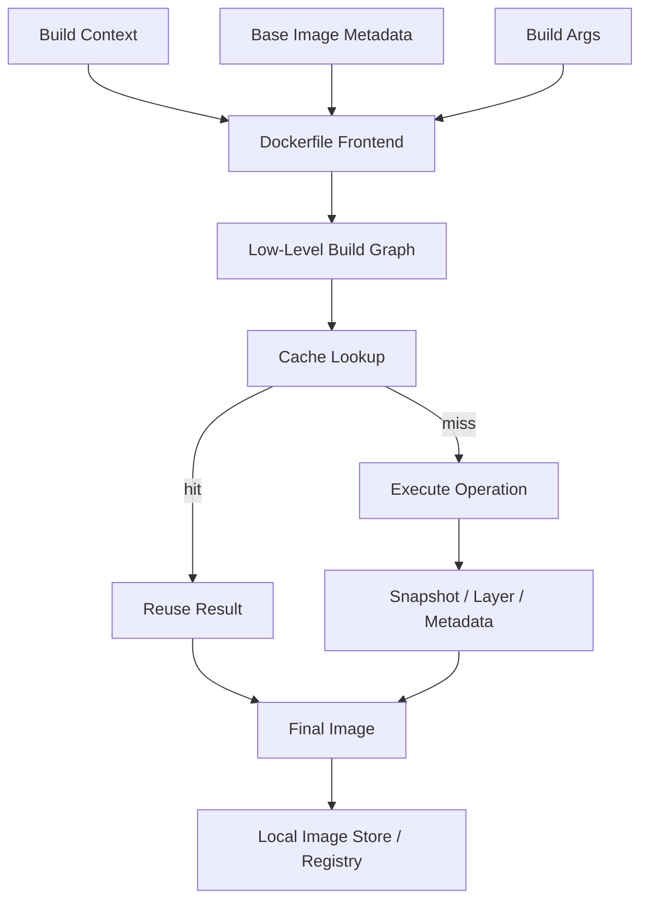
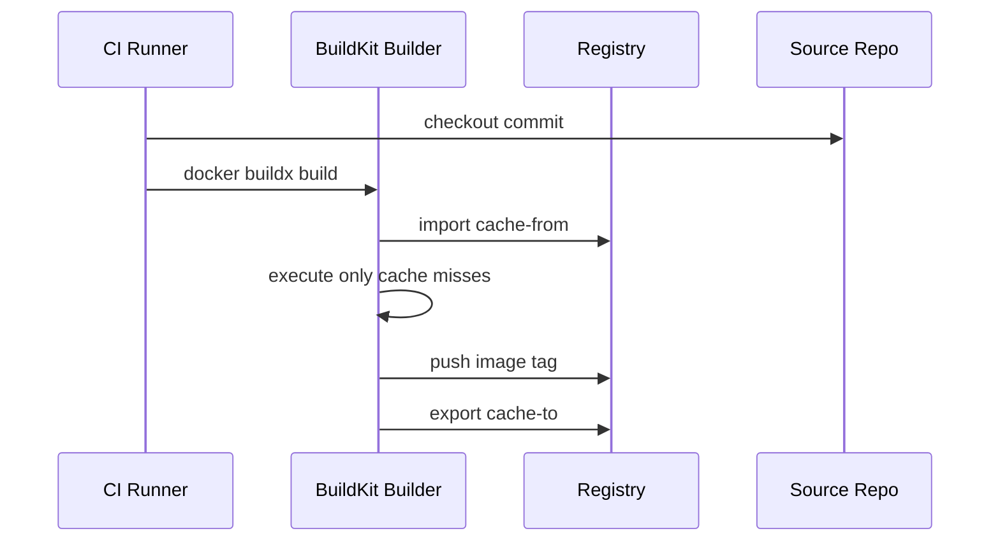
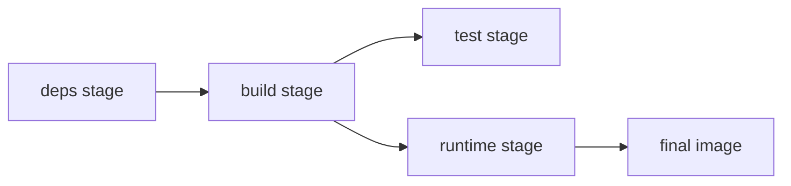
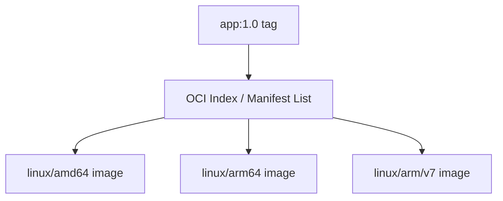
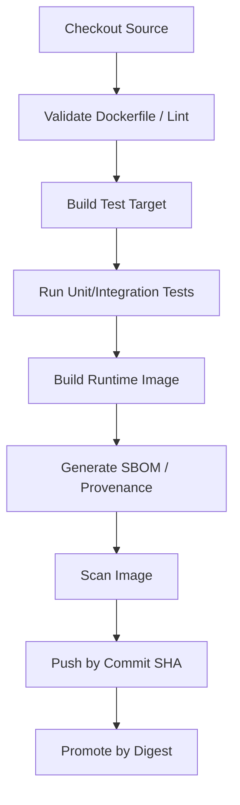

# Part 007 — BuildKit, Cache, Multi-Stage Builds, and Build Acceleration

## 1. Tujuan Part Ini

Part sebelumnya membahas Dockerfile dan build context. Sekarang kita naik satu level: **bagaimana builder mengeksekusi Dockerfile, menghitung cache, mengelola graph build, dan menghasilkan image artifact secara cepat serta aman**.

Banyak engineer bisa menulis Dockerfile yang “berhasil build”. Tetapi production engineer harus bisa menjawab pertanyaan yang lebih dalam:

- mengapa build lambat walaupun Dockerfile terlihat sederhana;
- mengapa cache tidak terpakai di CI;
- mengapa secret pernah bocor ke image history;
- mengapa image final membawa compiler, package manager, dan test dependency;
- mengapa build lokal berhasil tetapi build multi-architecture gagal;
- mengapa pipeline build tidak reproducible;
- bagaimana membuat build yang cepat tanpa mengorbankan keamanan.

Target setelah part ini:

- memahami BuildKit sebagai build engine modern, bukan sekadar flag tambahan;
- memahami build cache sebagai graph cache, bukan hanya urutan layer linear;
- bisa merancang Dockerfile yang cache-friendly;
- bisa memakai multi-stage build untuk memisahkan build-time dependency dan runtime artifact;
- bisa memakai `RUN --mount=type=cache` untuk dependency cache yang aman dan cepat;
- bisa memakai `RUN --mount=type=secret` dan `RUN --mount=type=ssh` tanpa memasukkan credential ke image;
- bisa memakai `docker buildx` untuk multi-platform build, external cache, provenance, dan CI;
- bisa mengevaluasi trade-off antara speed, reproducibility, determinism, dan debuggability.

Inti part ini: **build pipeline adalah supply-chain factory. Output-nya bukan hanya image, tetapi artifact yang harus cepat dibuat, aman dibuktikan, mudah dipromosikan, dan konsisten lintas environment**.

---

## 2. Kaufman Framing: Build Skill yang Harus Dipecah

Dalam pendekatan Josh Kaufman, skill besar harus dipecah menjadi subskill kecil yang bisa dilatih dengan feedback cepat. Untuk Docker build, subskill-nya bukan “hafal command build”, tetapi:

| Subskill | Pertanyaan yang Harus Bisa Dijawab | Feedback Cepat |
|---|---|---|
| Build graph reading | Stage mana yang dieksekusi? Stage mana yang di-skip? | `--progress=plain`, build log |
| Cache reasoning | Instruksi mana yang invalidate cache? | waktu build, `CACHED`, layer reuse |
| Context control | File apa yang masuk ke builder? | ukuran context, `.dockerignore` |
| Multi-stage design | Artifact apa yang berpindah antar-stage? | ukuran image final, `docker history` |
| Secret hygiene | Credential muncul di layer/history/log atau tidak? | inspect, history, scanner |
| CI cache design | Cache tetap berguna walau runner ephemeral? | external cache hit ratio |
| Multi-platform build | Platform target compatible atau tidak? | manifest inspect, runtime test |
| Artifact governance | Image bisa ditrace ke source, commit, build, SBOM? | labels, attestations, provenance |

Latihan terbaik untuk part ini: ambil satu Dockerfile yang lambat, ukur baseline, optimalkan struktur cache, pindahkan dependency build ke stage terpisah, tambahkan cache mount, lalu bandingkan hasilnya.

---

## 3. Mental Model: Build sebagai Graph, Bukan Script Linear

Dockerfile memang ditulis berurutan, tetapi builder modern dapat memodelkan proses build sebagai **graph dependency**. BuildKit membuat proses build lebih cerdas dengan graph solver yang dapat menjalankan step secara paralel ketika memungkinkan dan menghindari eksekusi step yang tidak memengaruhi output final.



Mental model yang penting:

1. **Dockerfile adalah input deklaratif-operasional.** Ia menyatakan operasi build, tetapi hasil akhirnya bergantung pada context, base image, argumen, platform, jaringan, cache, dan builder.
2. **Cache bukan sekadar “layer sebelumnya”.** Cache dihitung dari operation, input file, argumen, metadata, dan dependency operation.
3. **Stage final menentukan apa yang masuk ke image.** Stage yang tidak direferensikan oleh final output dapat tidak dieksekusi.
4. **Secret harus diperlakukan sebagai transient mount.** Secret yang masuk via `ARG`, `ENV`, atau `COPY` berisiko terekam dalam image/layer/history/log.
5. **Build cepat adalah hasil desain, bukan keberuntungan.** Urutan Dockerfile, context, cache backend, dependency manager, dan CI topology menentukan performa.

---

## 4. BuildKit vs Legacy Builder

BuildKit adalah backend build modern Docker. Perbedaan konseptualnya:

| Area | Legacy Builder Mental Model | BuildKit Mental Model |
|---|---|---|
| Eksekusi | cenderung linear | graph solver, dapat paralel |
| Cache | layer cache sederhana | operation-level cache lebih ekspresif |
| Context | context dikirim lebih naif | transfer context lebih optimal |
| Secret | sering diakali dengan ARG/COPY | secret mount transient |
| SSH | sering mount manual atau copy key | SSH mount khusus |
| Cache package manager | sering bergantung layer cache | cache mount persistent |
| Output | image lokal | image, registry push, cache export, attestations |
| Multi-platform | terbatas | buildx + builder driver + platform output |

BuildKit bukan berarti semua build otomatis cepat. BuildKit memberi kemampuan; Dockerfile dan pipeline tetap harus didesain benar.

### 4.1 Indikator BuildKit Aktif

Biasanya Docker modern memakai BuildKit secara default. Namun sebagai engineer, jangan bergantung pada asumsi. Validasi:

```bash
# Lihat builder yang aktif
docker buildx ls

# Build dengan output plain agar dependency dan cache terlihat
docker buildx build --progress=plain .
```

Output BuildKit biasanya menampilkan step seperti:

```text
#1 [internal] load build definition from Dockerfile
#2 [internal] load .dockerignore
#3 [internal] load metadata for docker.io/library/eclipse-temurin:21-jre
#4 [builder 1/6] FROM docker.io/library/eclipse-temurin:21-jdk
#5 [builder 2/6] WORKDIR /workspace
...
```

Gunakan `--progress=plain` ketika sedang debugging. UI default yang ringkas bagus untuk penggunaan normal, tetapi kurang jelas untuk analisis cache.

---

## 5. Build Cache: Apa yang Sebenarnya Di-cache?

Build cache adalah reuse hasil operasi build sebelumnya. Secara sederhana:

```text
CacheKey = hash(operation + input metadata + input content + build args + parent result + platform + relevant builder state)
```

Ini bukan formula implementasi literal, tetapi cukup akurat untuk reasoning.

Jika salah satu input penting berubah, cache key berubah. Contoh:

```dockerfile
COPY package.json package-lock.json ./
RUN npm ci
COPY . .
RUN npm run build
```

Dengan struktur ini, perubahan source code biasa tidak selalu invalidate `npm ci`, karena dependency manifest dicopy lebih dulu. Bandingkan dengan:

```dockerfile
COPY . .
RUN npm ci
RUN npm run build
```

Dalam versi kedua, perubahan file source apa pun bisa invalidate cache untuk `npm ci`, karena `COPY . .` berubah.

### 5.1 Cache-Friendly Ordering

Prinsip umum:

1. **Letakkan dependency manifest sebelum source code.**
2. **Letakkan instruksi yang jarang berubah lebih awal.**
3. **Pisahkan dependency resolution dari compilation.**
4. **Pisahkan build artifact dari runtime artifact.**
5. **Jangan menggabungkan semua operasi dalam satu `RUN` besar jika mengurangi cache reuse secara ekstrem.**
6. **Jangan memecah operasi terlalu kecil jika hanya membuat layer noise tanpa manfaat cache.**

Contoh Java/Maven:

```dockerfile
# syntax=docker/dockerfile:1.7
FROM eclipse-temurin:21-jdk AS build
WORKDIR /workspace

COPY .mvn .mvn
COPY mvnw pom.xml ./
RUN --mount=type=cache,target=/root/.m2 ./mvnw -B -q dependency:go-offline

COPY src ./src
RUN --mount=type=cache,target=/root/.m2 ./mvnw -B -q package -DskipTests

FROM eclipse-temurin:21-jre
WORKDIR /app
COPY --from=build /workspace/target/*.jar app.jar
ENTRYPOINT ["java", "-jar", "/app/app.jar"]
```

Di sini dependency cache Maven dipisahkan dari source code, dan cache mount membuat repository Maven bisa dipakai ulang lintas build.

---

## 6. Layer Cache vs Cache Mount

Banyak engineer mencampuradukkan layer cache dan cache mount. Keduanya berbeda.

| Aspek | Layer Cache | Cache Mount |
|---|---|---|
| Apa yang disimpan | hasil filesystem operation sebagai layer/snapshot | direktori cache persistent selama build |
| Cocok untuk | output deterministic dari instruksi | dependency manager cache, package cache |
| Terlihat di image final | jika layer masuk stage final | tidak otomatis masuk image final |
| Invalidasi | berdasarkan instruksi/input parent | tetap dapat reuse meski layer step rebuild |
| Contoh | `RUN apt-get install ...` | `RUN --mount=type=cache,target=/root/.m2 mvn package` |

### 6.1 Mengapa Cache Mount Penting

Misalnya `RUN mvn package` harus rebuild karena source berubah. Tanpa cache mount, Maven bisa perlu download dependency lagi jika layer cache tidak valid. Dengan cache mount, direktori `/root/.m2` tetap bisa menyimpan dependency yang pernah diunduh.

```dockerfile
RUN --mount=type=cache,target=/root/.m2 \
    ./mvnw -B package
```

Untuk npm:

```dockerfile
RUN --mount=type=cache,target=/root/.npm \
    npm ci
```

Untuk Go:

```dockerfile
RUN --mount=type=cache,target=/go/pkg/mod \
    --mount=type=cache,target=/root/.cache/go-build \
    go build -o /out/app ./cmd/app
```

Untuk apt, gunakan hati-hati karena package index dan mirror state bisa berubah:

```dockerfile
RUN --mount=type=cache,target=/var/cache/apt,sharing=locked \
    --mount=type=cache,target=/var/lib/apt,sharing=locked \
    apt-get update && apt-get install -y --no-install-recommends curl
```

Tetap bersihkan dan minimalkan package runtime di final stage. Cache mount membantu speed, bukan izin untuk membuat image final gemuk.

---

## 7. Cache Invalidation Pattern

### 7.1 Invalidation yang Diinginkan

Ada invalidation yang memang benar:

- `pom.xml` berubah → dependency resolution berubah;
- `package-lock.json` berubah → npm dependency berubah;
- `go.sum` berubah → module graph berubah;
- base image digest berubah → parent filesystem berubah;
- build arg yang memengaruhi output berubah → output harus berubah.

### 7.2 Invalidation yang Tidak Diinginkan

Ada invalidation yang biasanya bug desain:

- README berubah → dependency install ulang;
- `.git` berubah → seluruh build invalidate;
- local test output masuk context → cache berubah terus;
- timestamp generated file masuk context → cache berubah terus;
- secret file masuk context → cache berubah dan credential berisiko bocor;
- `.env` local masuk context → image tidak reproducible.

Gunakan `.dockerignore` secara agresif:

```dockerignore
.git
.gitignore
README.md
node_modules
target
build
dist
coverage
.env
.env.*
*.log
.DS_Store
.idea
.vscode
```

Catatan: jangan copy `.env` ke image. Config runtime harus diinjeksi saat run/deploy, bukan dibakar ke image.

---

## 8. External Cache untuk CI/CD

Runner CI sering ephemeral. Artinya cache lokal hilang setelah job selesai. BuildKit mendukung export/import cache ke backend eksternal, misalnya registry.

Contoh umum:

```bash
docker buildx build \
  --platform linux/amd64 \
  --cache-from type=registry,ref=registry.example.com/team/app:buildcache \
  --cache-to type=registry,ref=registry.example.com/team/app:buildcache,mode=max \
  -t registry.example.com/team/app:${GIT_SHA} \
  --push \
  .
```

Mental model:



### 8.1 Cache Export Mode

Secara praktis:

- `mode=min`: cache yang cukup untuk final image path;
- `mode=max`: cache lebih lengkap untuk intermediate stages, lebih berguna untuk CI tetapi dapat lebih besar.

Gunakan `mode=max` untuk pipeline yang sering rebuild intermediate stages. Gunakan policy retention di registry agar cache tidak tumbuh tanpa batas.

### 8.2 Cache Governance

Cache juga bagian dari supply chain. Pertanyaan governance:

- siapa boleh push cache ke namespace produksi;
- apakah cache dari branch tidak trusted boleh dipakai di main build;
- apakah cache bisa menyebabkan dependency lama terus dipakai;
- apakah cache backend punya retention policy;
- apakah cache dipisah per architecture;
- apakah cache dipisah untuk trusted vs untrusted PR.

Untuk open-source atau PR dari fork, hati-hati memakai cache write. Build dari source tidak trusted sebaiknya tidak diberi akses menulis ke cache production namespace.

---

## 9. Multi-Stage Build: Separation of Concerns

Multi-stage build memungkinkan satu Dockerfile memiliki beberapa `FROM`, masing-masing menjadi stage. Artifact bisa dicopy dari stage sebelumnya ke stage final.

Mental model:



Tujuan multi-stage bukan sekadar mengecilkan image. Tujuannya adalah **memisahkan responsibility**:

| Stage | Responsibility | Boleh Berisi | Tidak Boleh Masuk Final |
|---|---|---|---|
| deps | resolve dependency | package manager cache, lockfile, dependency metadata | cache, token, temp files |
| build | compile/package | compiler, SDK, source code | compiler, source code |
| test | run tests/scans | test tools, fixtures | test reports kecuali dibutuhkan |
| runtime | run app | runtime minimal, app artifact, CA certs | build tools, package manager cache |
| debug | troubleshooting optional | shell, curl, diagnostics | jangan jadikan default prod image |

### 9.1 Java Multi-Stage Example

```dockerfile
# syntax=docker/dockerfile:1.7
FROM eclipse-temurin:21-jdk AS build
WORKDIR /workspace

COPY .mvn .mvn
COPY mvnw pom.xml ./
RUN --mount=type=cache,target=/root/.m2 ./mvnw -B dependency:go-offline

COPY src ./src
RUN --mount=type=cache,target=/root/.m2 ./mvnw -B package -DskipTests

FROM eclipse-temurin:21-jre AS runtime
WORKDIR /app
RUN useradd --system --uid 10001 --create-home appuser
USER 10001:10001
COPY --from=build /workspace/target/*.jar /app/app.jar
EXPOSE 8080
ENTRYPOINT ["java", "-jar", "/app/app.jar"]
```

Catatan engineering:

- JDK hanya ada di stage build.
- JRE ada di stage runtime.
- Source code tidak masuk runtime.
- Maven cache tidak masuk runtime.
- Runtime user non-root.

### 9.2 Node Multi-Stage Example

```dockerfile
# syntax=docker/dockerfile:1.7
FROM node:22-bookworm-slim AS deps
WORKDIR /workspace
COPY package.json package-lock.json ./
RUN --mount=type=cache,target=/root/.npm npm ci

FROM deps AS build
COPY . .
RUN npm run build

FROM node:22-bookworm-slim AS runtime
WORKDIR /app
ENV NODE_ENV=production
RUN useradd --system --uid 10001 appuser
USER 10001:10001
COPY --from=deps /workspace/node_modules ./node_modules
COPY --from=build /workspace/dist ./dist
COPY package.json ./
EXPOSE 3000
CMD ["node", "dist/server.js"]
```

Untuk Node, pertimbangkan apakah `node_modules` build-time sama dengan runtime. Jika perlu dependency pruning:

```dockerfile
RUN npm prune --omit=dev
```

atau gunakan stage khusus production dependencies.

### 9.3 Go Multi-Stage Example

```dockerfile
# syntax=docker/dockerfile:1.7
FROM golang:1.24-bookworm AS build
WORKDIR /src
COPY go.mod go.sum ./
RUN --mount=type=cache,target=/go/pkg/mod go mod download
COPY . .
RUN --mount=type=cache,target=/go/pkg/mod \
    --mount=type=cache,target=/root/.cache/go-build \
    CGO_ENABLED=0 GOOS=linux go build -trimpath -ldflags="-s -w" -o /out/app ./cmd/app

FROM gcr.io/distroless/static-debian12 AS runtime
COPY --from=build /out/app /app
USER nonroot:nonroot
ENTRYPOINT ["/app"]
```

Trade-off:

- `distroless/static` cocok untuk binary statis.
- Jika butuh shell untuk debug, siapkan image debug terpisah, bukan menambahkan shell ke production image tanpa alasan.

---

## 10. Stage Targeting untuk Feedback Cepat

Multi-stage build memungkinkan target stage tertentu:

```bash
# Build hanya stage build
docker buildx build --target build -t app:build .

# Build stage test jika ada
docker buildx build --target test .

# Build final runtime
docker buildx build -t app:runtime .
```

Pattern yang berguna:

```dockerfile
FROM build AS unit-test
RUN ./mvnw -B test

FROM build AS integration-test
RUN ./mvnw -B verify -Pintegration

FROM runtime AS final
```

CI bisa menjalankan target berbeda:

```bash
docker buildx build --target unit-test .
docker buildx build --target integration-test .
docker buildx build -t registry.example.com/app:${GIT_SHA} --push .
```

Keuntungan:

- feedback test terjadi dalam environment build yang sama;
- dependency cache reuse antar-target;
- final image tetap bersih;
- pipeline lebih eksplisit.

Risiko:

- test dalam Dockerfile bisa membuat build terlalu berat jika tidak dipisah dengan target;
- hasil test report perlu diekspor dengan cara yang tepat;
- build/test coupling bisa membuat pipeline sulit dipahami jika stage terlalu banyak.

---

## 11. Build Secrets: Jangan Pakai ARG untuk Credential

Anti-pattern berbahaya:

```dockerfile
ARG NPM_TOKEN
RUN npm config set //registry.npmjs.org/:_authToken=$NPM_TOKEN && npm ci
```

Masalah:

- token bisa muncul di history atau log;
- token menjadi bagian dari cache metadata;
- token dapat bocor jika command meninggalkan file config;
- `ARG` bukan secret management.

Pattern BuildKit:

```bash
docker buildx build \
  --secret id=npmrc,src=$HOME/.npmrc \
  .
```

```dockerfile
# syntax=docker/dockerfile:1.7
RUN --mount=type=secret,id=npmrc,target=/root/.npmrc \
    npm ci
```

Untuk Maven settings:

```bash
docker buildx build \
  --secret id=maven_settings,src=$HOME/.m2/settings.xml \
  .
```

```dockerfile
RUN --mount=type=secret,id=maven_settings,target=/root/.m2/settings.xml \
    --mount=type=cache,target=/root/.m2 \
    ./mvnw -B package
```

Invariant:

> Credential boleh tersedia saat step build berjalan, tetapi tidak boleh menjadi bagian dari filesystem layer, image config, image history, build log, atau final artifact.

### 11.1 Secret Leak Checklist

Setelah build, cek:

```bash
docker history --no-trunc app:latest

docker save app:latest -o image.tar
mkdir /tmp/image-check
bsdtar -xf image.tar -C /tmp/image-check
grep -R "TOKEN\|PASSWORD\|SECRET" /tmp/image-check || true
```

Ini bukan scanner sempurna, tetapi bagus untuk smoke test. Di production, tambahkan secret scanning dan SBOM/vulnerability checks.

---

## 12. SSH Mounts untuk Private Git Dependency

Kadang build perlu mengakses private Git repository. Jangan copy private key ke image.

Pattern:

```bash
docker buildx build --ssh default .
```

```dockerfile
# syntax=docker/dockerfile:1.7
RUN --mount=type=ssh git clone git@github.com:example/private-lib.git
```

SSH mount membuat SSH agent/socket tersedia selama step tertentu. Setelah step selesai, credential tidak masuk ke image layer.

Checklist:

- gunakan known_hosts dengan eksplisit jika memungkinkan;
- jangan disable host key checking sembarangan;
- batasi akses key hanya ke repository yang diperlukan;
- pisahkan dependency private dari final runtime image;
- hindari clone repo private jika artifact bisa dipublish ke package registry internal.

---

## 13. `docker buildx`: Builder Modern untuk Multi-Platform dan Advanced Output

`docker buildx` adalah antarmuka Docker untuk kemampuan BuildKit yang lebih luas.

Command dasar:

```bash
docker buildx ls

docker buildx create --name team-builder --use

docker buildx inspect --bootstrap
```

Build dan push:

```bash
docker buildx build \
  --platform linux/amd64,linux/arm64 \
  -t registry.example.com/team/app:${GIT_SHA} \
  --push \
  .
```

### 13.1 Multi-Platform Mental Model

Multi-platform image bukan satu filesystem. Ia biasanya manifest list / OCI index yang menunjuk ke image per-platform.



Saat `docker pull app:1.0`, client/daemon memilih image yang sesuai dengan platform host, kecuali override:

```bash
docker pull --platform linux/arm64 registry.example.com/team/app:1.0
```

### 13.2 Multi-Platform Failure Modes

| Failure | Gejala | Penyebab Umum | Mitigasi |
|---|---|---|---|
| Native dependency gagal | build arm64 gagal | package tidak tersedia | pilih base image multi-arch, pin dependency compatible |
| Binary salah platform | `exec format error` | copy binary amd64 ke arm64 image | build per-platform, jangan reuse artifact lintas arch sembarang |
| CGO issue | runtime missing lib | binary dynamic linked | cek `ldd`, gunakan base runtime compatible |
| Test tidak jalan | emulator lambat/flaky | QEMU overhead | pakai native builder untuk arch kritis |
| Manifest tidak lengkap | pull gagal di arm64 | hanya push amd64 | inspect manifest setelah push |

Command inspeksi:

```bash
docker buildx imagetools inspect registry.example.com/team/app:1.0
```

---

## 14. Reproducibility vs Freshness

Build production harus seimbang antara reproducibility dan patch freshness.

### 14.1 Tag Pinning vs Digest Pinning

```dockerfile
FROM eclipse-temurin:21-jre
```

Tag ini mudah dibaca, tetapi dapat berubah seiring waktu.

```dockerfile
FROM eclipse-temurin:21-jre@sha256:...
```

Digest pinning lebih reproducible karena merujuk konten spesifik. Tetapi digest pinning membuat patch base image tidak otomatis masuk. Maka perlu proses update terjadwal:

1. scanner mendeteksi base image outdated;
2. dependency bot membuka PR digest update;
3. CI rebuild dan test;
4. image baru dipromosikan.

### 14.2 Jangan Rebuild Production dari Floating Inputs Tanpa Kontrol

Floating input:

- package repository latest;
- base image tag tanpa digest;
- `curl https://.../install.sh | sh`;
- dependency range terlalu longgar;
- generated file berdasarkan timestamp;
- download artifact tanpa checksum.

Production-grade build harus punya jejak:

- source commit;
- Dockerfile version;
- base image digest;
- dependency lockfile;
- builder version;
- target platform;
- image digest output;
- SBOM/provenance jika tersedia.

---

## 15. Build Network and Dependency Risk

Build sering membutuhkan network: pull base image, download dependency, access package registry. Ini membuka failure modes:

| Dependency | Failure Mode | Mitigation |
|---|---|---|
| Public registry | rate limit, outage | mirror/proxy/cache, vendor critical artifacts |
| OS package repo | package removed, metadata drift | snapshot repo, digest/checksum, rebuild policy |
| Language package repo | typosquatting, compromised package | lockfile, private proxy, allowlist |
| Git repository | branch force-push | pin commit SHA/tag signed |
| Download URL | file changed | checksum verification |

Anti-pattern:

```dockerfile
RUN curl -fsSL https://example.com/install.sh | sh
```

Better:

```dockerfile
ARG TOOL_VERSION=1.2.3
ARG TOOL_SHA256=...
RUN curl -fsSLo /tmp/tool.tar.gz https://example.com/tool-${TOOL_VERSION}.tar.gz \
    && echo "${TOOL_SHA256}  /tmp/tool.tar.gz" | sha256sum -c - \
    && tar -xzf /tmp/tool.tar.gz -C /usr/local/bin \
    && rm /tmp/tool.tar.gz
```

---

## 16. Build Output: Local Load vs Registry Push

`buildx` output harus dipahami.

| Mode | Command | Kapan Dipakai |
|---|---|---|
| local image load | `--load` | dev lokal single-platform |
| registry push | `--push` | CI/CD, multi-platform |
| tar/local output | `--output` | artifact export khusus |
| cache export | `--cache-to` | CI acceleration |

Contoh local dev:

```bash
docker buildx build --load -t app:dev .
```

Contoh CI production:

```bash
docker buildx build \
  --platform linux/amd64,linux/arm64 \
  -t registry.example.com/team/app:${GIT_SHA} \
  -t registry.example.com/team/app:main \
  --cache-from type=registry,ref=registry.example.com/team/app:buildcache \
  --cache-to type=registry,ref=registry.example.com/team/app:buildcache,mode=max \
  --push \
  .
```

Peringatan: multi-platform build biasanya tidak bisa sekadar `--load` ke local Docker image store lama sebagai manifest list penuh. Untuk multi-platform, push ke registry lebih natural.

---

## 17. Dockerfile Frontend Syntax Directive

BuildKit features sering membutuhkan syntax directive:

```dockerfile
# syntax=docker/dockerfile:1.7
```

Directive ini memberi tahu builder untuk memakai Dockerfile frontend tertentu. Praktik baik:

- letakkan di baris pertama;
- pin versi yang sesuai fitur yang digunakan;
- jangan gunakan fitur experimental tanpa alasan;
- dokumentasikan jika memakai mount/cache/secret fitur tertentu.

Contoh:

```dockerfile
# syntax=docker/dockerfile:1.7
FROM alpine:3.20
RUN --mount=type=cache,target=/var/cache/apk \
    apk add --no-cache curl
```

---

## 18. Advanced Build Pattern: Test, Scan, Runtime

Untuk service production, Dockerfile bisa punya beberapa target:

```dockerfile
# syntax=docker/dockerfile:1.7
FROM eclipse-temurin:21-jdk AS deps
WORKDIR /workspace
COPY .mvn .mvn
COPY mvnw pom.xml ./
RUN --mount=type=cache,target=/root/.m2 ./mvnw -B dependency:go-offline

FROM deps AS build
COPY src ./src
RUN --mount=type=cache,target=/root/.m2 ./mvnw -B package -DskipTests

FROM build AS unit-test
RUN --mount=type=cache,target=/root/.m2 ./mvnw -B test

FROM eclipse-temurin:21-jre AS runtime
WORKDIR /app
RUN useradd --system --uid 10001 appuser
USER 10001:10001
COPY --from=build /workspace/target/*.jar /app/app.jar
ENTRYPOINT ["java", "-jar", "/app/app.jar"]
```

Pipeline:

```bash
# Fast feedback
docker buildx build --target unit-test --progress=plain .

# Final artifact
docker buildx build \
  -t registry.example.com/regulatory/case-service:${GIT_SHA} \
  --push \
  .
```

Jika organisasi memakai scanner/SBOM/provenance, tambahkan tahap pipeline setelah image build, bukan mengotori runtime image dengan scanner binary.

---

## 19. Anti-Patterns BuildKit dan Multi-Stage

### 19.1 “Multi-Stage Tetapi Final Tetap Gemuk”

```dockerfile
FROM maven:3-eclipse-temurin-21
WORKDIR /app
COPY . .
RUN mvn package
CMD ["java", "-jar", "target/app.jar"]
```

Masalah:

- runtime berisi Maven, JDK, source code;
- image besar;
- attack surface besar;
- runtime artifact tidak jelas;
- cache dependency buruk.

### 19.2 “Secret via ARG”

```dockerfile
ARG TOKEN
RUN curl -H "Authorization: Bearer $TOKEN" https://private.example.com/artifact
```

Gunakan secret mount.

### 19.3 “COPY . . Sebelum Dependency Install”

```dockerfile
COPY . .
RUN npm ci
```

Cache dependency mudah invalidate.

### 19.4 “Build Mengandalkan Network Tanpa Pinning”

```dockerfile
RUN curl -fsSL https://example.com/latest.tar.gz | tar xz
```

Gunakan version dan checksum.

### 19.5 “Satu Cache Namespace untuk Semua Branch Tidak Trusted”

Risiko cache poisoning dan governance. Pisahkan cache untuk trusted main branch dan untrusted PR.

### 19.6 “Debug Tool Masuk Runtime Image Secara Permanen”

Kadang perlu shell/curl untuk troubleshooting. Namun jangan jadikan ini default tanpa keputusan sadar. Gunakan debug variant atau ephemeral debug container jika platform mendukung.

---

## 20. Build Performance Troubleshooting

### 20.1 Gejala: Build Selalu Lambat dari Awal

Cek:

```bash
docker buildx build --progress=plain .
```

Cari:

- context terlalu besar;
- `.dockerignore` kurang agresif;
- base image selalu berubah;
- dependency install invalidated;
- cache backend tidak dipakai;
- CI tidak import/export cache;
- build pakai platform emulation lambat.

### 20.2 Gejala: Cache Hit Lokal, Miss di CI

Penyebab umum:

- runner ephemeral tanpa external cache;
- cache key registry berbeda;
- branch tidak punya akses cache;
- builder driver berbeda;
- context path berbeda;
- build arg berbeda;
- base image berubah.

Mitigasi:

```bash
--cache-from type=registry,ref=registry.example.com/app:buildcache
--cache-to type=registry,ref=registry.example.com/app:buildcache,mode=max
```

### 20.3 Gejala: Final Image Tetap Besar

Cek:

```bash
docker history app:latest

docker image inspect app:latest --format '{{.Size}}'
```

Pertanyaan:

- apakah final stage memakai base runtime minimal;
- apakah `COPY --from` terlalu luas;
- apakah source code ikut masuk;
- apakah package manager cache masuk;
- apakah dev dependency masuk;
- apakah artifact build disalin semua, bukan artifact final saja.

### 20.4 Gejala: Secret Bocor

Cek:

- Dockerfile memakai `ARG TOKEN`;
- log build mencetak token;
- `.npmrc`, `settings.xml`, `.env` masuk context;
- secret dicopy lalu dihapus di layer berikutnya;
- package manager menulis credential ke cache yang masuk image.

Ingat: menghapus secret pada layer berikutnya tidak selalu menghapus secret dari layer sebelumnya.

---

## 21. CI/CD Blueprint: Production Build Pipeline

Blueprint minimal:



Command contoh:

```bash
IMAGE=registry.example.com/regulatory/case-service
SHA=$(git rev-parse --short=12 HEAD)

# Test target
docker buildx build \
  --target unit-test \
  --cache-from type=registry,ref=$IMAGE:buildcache \
  --cache-to type=registry,ref=$IMAGE:buildcache,mode=max \
  --progress=plain \
  .

# Runtime image
docker buildx build \
  --platform linux/amd64,linux/arm64 \
  --cache-from type=registry,ref=$IMAGE:buildcache \
  --cache-to type=registry,ref=$IMAGE:buildcache,mode=max \
  -t $IMAGE:$SHA \
  --push \
  .
```

Promotion sebaiknya berdasarkan digest:

```bash
docker buildx imagetools inspect $IMAGE:$SHA
```

Kemudian deployment system memakai digest, bukan tag mutable.

---

## 22. Decision Matrix

### 22.1 Kapan Pakai Multi-Stage?

| Kondisi | Multi-Stage? | Alasan |
|---|---:|---|
| App compiled language | Ya | build tools tidak perlu di runtime |
| Node/Frontend build | Ya | source/build tool tidak perlu di runtime |
| Python simple script | Biasanya ya | dependency build native dapat dipisah |
| Image hanya wrapper binary kecil | Ya, jika binary dibangun dari source | runtime bisa minimal |
| Debug image | Bisa stage terpisah | jangan campur dengan prod default |

### 22.2 Kapan Pakai Cache Mount?

| Dependency Manager | Cache Mount Target | Catatan |
|---|---|---|
| Maven | `/root/.m2` | perhatikan settings secret |
| Gradle | `/home/gradle/.gradle` atau user-specific cache | gunakan user konsisten |
| npm | `/root/.npm` | `npm ci` tetap deterministic dari lockfile |
| pnpm | pnpm store path | set store-dir eksplisit |
| pip | `/root/.cache/pip` | lock requirements tetap penting |
| Go | `/go/pkg/mod`, `/root/.cache/go-build` | pisahkan module dan build cache |
| apt | `/var/cache/apt`, `/var/lib/apt` | gunakan `sharing=locked`, hati-hati freshness |

### 22.3 Kapan Pakai External Cache?

| Environment | External Cache? | Alasan |
|---|---:|---|
| Laptop lokal | Opsional | cache lokal cukup |
| CI ephemeral | Ya | runner tidak menyimpan cache |
| Multi-branch trusted | Ya, dengan policy | speed |
| PR dari fork | Hati-hati | risiko cache poisoning / secret exposure |
| Regulated production | Ya, tapi governed | audit namespace dan retention |

---

## 23. Practice Lab

### Lab 1 — Baseline Build

Buat service sederhana, lalu Dockerfile naif:

```dockerfile
FROM node:22
WORKDIR /app
COPY . .
RUN npm install
RUN npm run build
CMD ["node", "dist/server.js"]
```

Ukur:

```bash
time docker buildx build --progress=plain --load -t app:naive .
docker image inspect app:naive --format '{{.Size}}'
docker history app:naive
```

### Lab 2 — Cache-Friendly Build

Refactor:

```dockerfile
# syntax=docker/dockerfile:1.7
FROM node:22-bookworm-slim AS deps
WORKDIR /workspace
COPY package.json package-lock.json ./
RUN --mount=type=cache,target=/root/.npm npm ci

FROM deps AS build
COPY . .
RUN npm run build

FROM node:22-bookworm-slim AS runtime
WORKDIR /app
ENV NODE_ENV=production
COPY --from=deps /workspace/node_modules ./node_modules
COPY --from=build /workspace/dist ./dist
COPY package.json ./
CMD ["node", "dist/server.js"]
```

Ukur ulang.

### Lab 3 — Cache Invalidation Drill

Lakukan perubahan:

1. ubah README;
2. ubah satu file source;
3. ubah lockfile;
4. ubah Dockerfile `RUN`;
5. ubah base image tag.

Catat step mana yang cache miss.

### Lab 4 — Secret Mount Drill

Buat file dummy secret:

```bash
echo 'token=SUPER_SECRET_DO_NOT_LEAK' > /tmp/private.conf
```

Build dengan secret mount:

```bash
docker buildx build --secret id=private_conf,src=/tmp/private.conf --progress=plain .
```

Dockerfile:

```dockerfile
# syntax=docker/dockerfile:1.7
FROM alpine:3.20
RUN --mount=type=secret,id=private_conf,target=/run/secrets/private.conf \
    test -f /run/secrets/private.conf && echo "secret available during build"
CMD ["sh", "-c", "echo runtime"]
```

Cek apakah secret masuk image:

```bash
docker history --no-trunc <image>
```

---

## 24. Review Checklist untuk Pull Request Dockerfile

Gunakan checklist ini saat review Dockerfile/build pipeline:

### Build Correctness

- [ ] Dockerfile punya syntax directive jika memakai BuildKit feature.
- [ ] Build context kecil dan `.dockerignore` benar.
- [ ] Dependency manifest dicopy sebelum source code.
- [ ] Lockfile dipakai.
- [ ] Base image jelas dan sesuai runtime.
- [ ] `COPY --from` hanya mengambil artifact yang diperlukan.

### Cache and Speed

- [ ] Dependency manager memakai cache mount jika cocok.
- [ ] CI memakai external cache jika runner ephemeral.
- [ ] Cache namespace dipisah untuk trusted/untrusted build.
- [ ] Build log menunjukkan cache hit untuk step mahal.
- [ ] Multi-platform build tidak bergantung pada artifact platform salah.

### Security

- [ ] Tidak ada credential via `ARG` atau `ENV`.
- [ ] Secret memakai BuildKit secret/SSH mount.
- [ ] Final image tidak membawa source code, compiler, package cache, atau private config.
- [ ] Runtime user bukan root jika memungkinkan.
- [ ] Dependency download memakai version/checksum/digest jika memungkinkan.

### Governance

- [ ] Image ditag dengan commit SHA.
- [ ] Promotion memakai digest.
- [ ] SBOM/provenance/scanning tersedia sesuai kebutuhan organisasi.
- [ ] Base image update punya proses terkontrol.
- [ ] Artifact bisa ditelusuri ke source commit dan pipeline run.

---

## 25. Ringkasan Mental Model

BuildKit dan multi-stage build membuat Docker build berubah dari “script packaging” menjadi **artifact factory**.

Ingat lima invariant:

1. **Cache adalah fungsi dari input.** Jika input tidak dikontrol, build tidak bisa diprediksi.
2. **Multi-stage adalah boundary.** Build-time dependency tidak boleh bocor ke runtime image.
3. **Secret harus transient.** Credential tidak boleh masuk layer, image config, history, log, atau cache yang tidak aman.
4. **CI butuh external cache.** Runner ephemeral tanpa cache backend akan membuang banyak waktu.
5. **Production build harus auditable.** Tag saja tidak cukup; digest, source commit, SBOM, provenance, dan policy jauh lebih kuat.

Setelah part ini, kita siap membahas image final secara lebih sistematis: **bagaimana merancang production-grade image yang minimal, secure, reproducible, observable, dan tetap operable**.

---

## 26. Referensi

- Docker Docs — BuildKit: `https://docs.docker.com/build/buildkit/`
- Docker Docs — Multi-stage builds: `https://docs.docker.com/build/building/multi-stage/`
- Docker Docs — Building best practices: `https://docs.docker.com/build/building/best-practices/`
- Docker Docs — Optimize cache usage in builds: `https://docs.docker.com/build/cache/optimize/`
- Docker Docs — Cache storage backends: `https://docs.docker.com/build/cache/backends/`
- Docker Docs — Build secrets: `https://docs.docker.com/build/building/secrets/`
- Docker Docs — Dockerfile reference: `https://docs.docker.com/reference/dockerfile/`
- Docker Docs — docker buildx build reference: `https://docs.docker.com/reference/cli/docker/buildx/build/`
