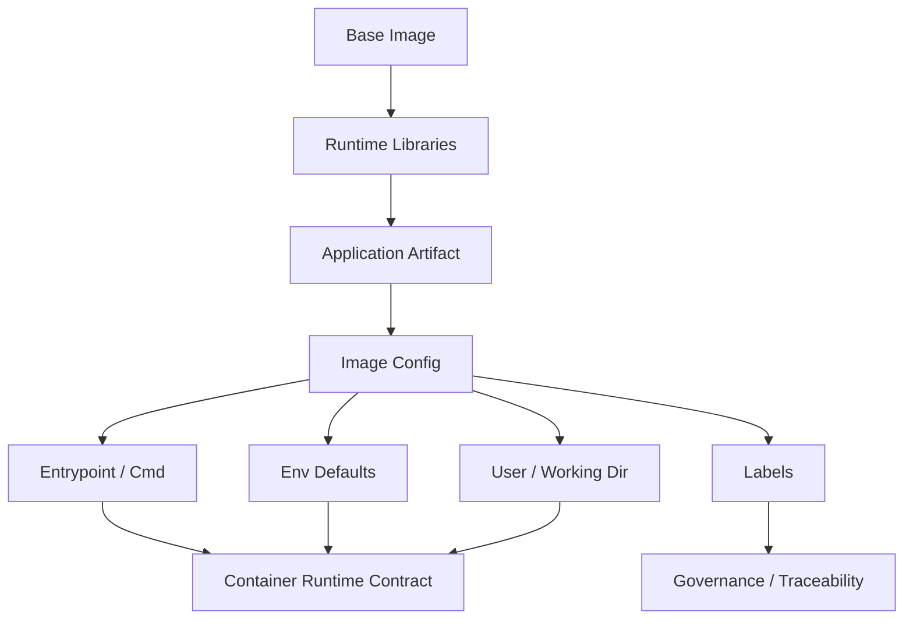

# Part 008 — Production-Grade Image Design: Minimal, Secure, Reproducible, Observable

## 1. Tujuan Part Ini

Part sebelumnya membahas BuildKit, cache, dan multi-stage build sebagai mekanisme membuat image. Sekarang fokusnya bergeser ke kualitas artifact final: **seperti apa image yang layak dipakai production?**

Image production bukan sekadar “container bisa jalan”. Image adalah unit distribusi software yang membawa:

- filesystem runtime;
- command contract;
- environment contract;
- user dan permission model;
- dependency runtime;
- metadata supply chain;
- attack surface;
- observability assumptions;
- upgrade dan rollback semantics.

Target setelah part ini:

- bisa memilih base image dengan sadar, bukan ikut template;
- bisa membedakan minimal, slim, Alpine, distroless, scratch, dan full runtime image;
- bisa merancang image dengan non-root user dan filesystem writable yang eksplisit;
- bisa memastikan app menulis log ke stdout/stderr, bukan file tersembunyi;
- bisa menghindari secret, source code, compiler, package cache, dan dev tool masuk image final;
- bisa memakai label/metadata untuk traceability;
- bisa menyeimbangkan size, compatibility, debuggability, dan security;
- bisa membuat debug variant tanpa merusak production image;
- bisa membuat review checklist untuk image production.

Inti part ini: **production-grade image adalah operational contract. Ia harus kecil secukupnya, aman secara default, reproducible, observable, dan tetap bisa dioperasikan ketika terjadi incident**.

---

## 2. Mental Model: Image sebagai Runtime Contract

Jangan memandang image sebagai zip file aplikasi. Image lebih tepat dilihat sebagai kontrak:

```text
Image = Runtime Filesystem + Process Contract + Metadata + Security Posture + Operational Assumptions
```

Diagram:



Sebuah image production-grade harus menjawab:

1. proses apa yang dijalankan;
2. user mana yang menjalankan proses;
3. file mana yang boleh dibaca dan ditulis;
4. port apa yang diekspos secara konvensi;
5. environment variable apa yang didukung;
6. dependency runtime apa yang tersedia;
7. bagaimana log keluar;
8. bagaimana image ditelusuri ke source/build;
9. bagaimana image discan dan dipatch;
10. bagaimana engineer men-debug ketika gagal.

---

## 3. Production Image Invariants

Gunakan invariant berikut sebagai standar review:

### 3.1 Minimal But Sufficient

Image hanya membawa hal yang diperlukan untuk menjalankan aplikasi.

Tidak boleh masuk final image kecuali ada alasan kuat:

- source code mentah;
- compiler;
- SDK lengkap jika runtime cukup;
- package manager cache;
- test fixtures;
- private config;
- credential;
- `.git` directory;
- build reports;
- temporary files;
- editor files;
- local environment files.

### 3.2 Secure by Default

Image default seharusnya:

- menjalankan proses sebagai non-root jika memungkinkan;
- tidak membutuhkan privileged container;
- tidak membutuhkan Docker socket;
- tidak menulis ke filesystem root kecuali path eksplisit;
- tidak membawa shell/debug tool jika tidak diperlukan;
- tidak membawa secret baked-in;
- memakai dependency runtime yang punya patch path jelas.

### 3.3 Reproducible and Traceable

Image harus bisa dijawab asal-usulnya:

- commit mana;
- Dockerfile mana;
- base image mana;
- dependency lockfile mana;
- pipeline run mana;
- digest output apa;
- SBOM/scanning status apa.

### 3.4 Observable

Image harus kompatibel dengan platform observability:

- log ke stdout/stderr;
- tidak hanya log ke file lokal;
- expose port dan health endpoint secara jelas;
- process menerima signal dengan benar;
- metadata label cukup untuk routing, ownership, dan incident response.

### 3.5 Operable

Minimalisme tidak boleh membuat operasi buta. Jika image sangat minimal, siapkan strategi debug:

- debug variant;
- ephemeral debug container;
- sidecar diagnostic;
- runbook `docker exec`/`nsenter` dari host;
- standard logs/metrics/traces.

---

## 4. Base Image Selection

Base image adalah keputusan arsitektur. Ia menentukan libc, package manager, CA certs, timezone data, shell, security update path, dan compatibility.

### 4.1 Decision Matrix

| Base Image Type | Contoh | Kelebihan | Risiko / Trade-off | Cocok Untuk |
|---|---|---|---|---|
| Full distro | `debian`, `ubuntu` | compatibility tinggi, mudah debug | besar, attack surface lebih luas | image internal/debug, app kompleks |
| Slim runtime | `debian:bookworm-slim`, `node:*slim`, `python:*slim` | lebih kecil, tetap familiar | masih perlu patching dan hygiene | default aman untuk banyak service |
| Alpine | `alpine` | kecil, cepat pull | musl vs glibc compatibility, native deps | tool kecil, static-ish app, workload compatible |
| Distroless | `gcr.io/distroless/...` | kecil, attack surface rendah | sulit debug, tidak ada shell | production runtime matang |
| Scratch | `scratch` | kosong/minimal ekstrem | harus bawa semua dependency | static binary, expert use |
| Official language image | `eclipse-temurin`, `node`, `python`, `golang` | maintained, familiar | tag variant perlu dipilih | build stage dan runtime tertentu |
| Hardened/enterprise image | vendor-specific | policy/security support | dependency vendor, license | regulated enterprise |

### 4.2 Prinsip Pemilihan

Pilih base image berdasarkan kebutuhan runtime, bukan ukuran saja.

Pertanyaan:

- Apakah aplikasi butuh glibc?
- Apakah binary statis atau dinamis?
- Apakah butuh CA certificates?
- Apakah butuh timezone data?
- Apakah butuh shell saat runtime?
- Apakah security team punya scanning/policy untuk base itu?
- Apakah image tersedia untuk `linux/amd64` dan `linux/arm64`?
- Apakah patch cadence jelas?
- Apakah ada official/verified image?

### 4.3 Alpine Trap

Alpine sering dipilih karena kecil. Namun Alpine memakai musl libc, bukan glibc. Untuk beberapa native dependency, JVM/native lib, Python wheel, Node native module, atau binary vendor, ini bisa menimbulkan issue.

Gunakan Alpine jika:

- dependency kompatibel dengan musl;
- team paham debugging Alpine;
- ukuran benar-benar penting;
- test production-like sudah mencakup Alpine runtime.

Jangan gunakan Alpine hanya karena “best practice lama” mengatakan semua image harus Alpine.

### 4.4 Distroless Trap

Distroless bagus untuk mengurangi attack surface, tetapi bukan silver bullet.

Gunakan distroless jika:

- runtime dependency sudah jelas;
- observability tidak bergantung pada shell/curl di container;
- team punya debug strategy;
- scanner dan SBOM bisa memahami image;
- incident runbook tidak mengandalkan `docker exec sh`.

Jika team belum punya tooling observability dan debug kuat, distroless bisa mempercepat security posture tetapi memperlambat incident response.

---

## 5. Base Image Pinning and Update Policy

Floating tag:

```dockerfile
FROM eclipse-temurin:21-jre
```

Digest pinning:

```dockerfile
FROM eclipse-temurin:21-jre@sha256:...
```

Trade-off:

| Strategy | Kelebihan | Risiko |
|---|---|---|
| Floating tag | patch bisa masuk saat rebuild | build tidak fully reproducible |
| Digest pin | reproducible, auditable | patch tidak masuk otomatis |
| Tag + update bot | readable dan maintainable | butuh automation |
| Internal base image | governance kuat | platform team harus maintain |

Production rekomendasi:

1. gunakan tag variant yang spesifik (`21-jre`, `bookworm-slim`, bukan `latest`);
2. untuk environment regulated, pin digest;
3. gunakan automated PR untuk update digest/base;
4. scan hasil rebuild;
5. promote berdasarkan digest image final.

---

## 6. Runtime User: Jangan Root by Default

Default banyak image berjalan sebagai root. Ini tidak selalu langsung fatal, tetapi memperbesar impact jika aplikasi compromise.

Pattern Debian/Ubuntu style:

```dockerfile
RUN useradd --system --uid 10001 --create-home --home-dir /home/app appuser
USER 10001:10001
```

Pattern Alpine:

```dockerfile
RUN addgroup -S app && adduser -S -G app -u 10001 app
USER 10001:10001
```

Distroless sering menyediakan user nonroot:

```dockerfile
USER nonroot:nonroot
```

### 6.1 UID/GID Stability

Gunakan UID/GID numerik yang stabil untuk menghindari ambiguity saat runtime:

```dockerfile
USER 10001:10001
```

Kenapa?

- orchestrator/security policy bisa mengevaluasi numeric user;
- mounted volume permission lebih predictable;
- tidak bergantung pada `/etc/passwd` jika base minimal;
- membantu audit.

### 6.2 File Ownership

Jangan membuat image non-root tetapi file app hanya readable oleh root.

```dockerfile
WORKDIR /app
COPY --chown=10001:10001 app.jar /app/app.jar
USER 10001:10001
```

Untuk artifact dari stage build:

```dockerfile
COPY --from=build --chown=10001:10001 /workspace/target/app.jar /app/app.jar
```

### 6.3 Privileged Port Trap

Port di bawah 1024 biasanya butuh privilege tambahan pada Linux. Lebih mudah expose aplikasi di port non-privileged seperti 8080/3000, lalu biarkan proxy/orchestrator melakukan mapping ke 80/443.

---

## 7. Filesystem Contract

Container filesystem sebaiknya dianggap immutable, kecuali path tertentu.

Prinsip:

- `/app` untuk aplikasi;
- `/config` jika perlu config file mounted;
- `/data` untuk data stateful eksplisit;
- `/tmp` untuk temporary files;
- jangan menulis ke `/`, `/usr`, `/opt` sembarang saat runtime;
- jangan mengandalkan file yang dibuat saat build untuk menyimpan state runtime.

Contoh:

```dockerfile
WORKDIR /app
RUN mkdir -p /app /tmp/app /data \
    && chown -R 10001:10001 /app /tmp/app /data
USER 10001:10001
ENV TMPDIR=/tmp/app
```

### 7.1 Read-Only Root Filesystem Readiness

Image yang baik bisa berjalan dengan root filesystem read-only jika writable path dimount eksplisit.

Test lokal:

```bash
docker run --rm \
  --read-only \
  --tmpfs /tmp:rw,noexec,nosuid,size=64m \
  app:latest
```

Jika gagal, cari path yang ditulis aplikasi. Untuk Java, cek:

- temp directory;
- log file path;
- heap dump path;
- JIT/cache behavior;
- framework generated files;
- upload directory.

### 7.2 Log File Trap

Anti-pattern:

```dockerfile
RUN mkdir -p /var/log/myapp
ENV LOG_FILE=/var/log/myapp/app.log
```

Dalam container, default logs harus ke stdout/stderr. Platform container sudah punya log driver/collector.

Jika aplikasi framework default menulis file, ubah config:

```text
logging.file.name=
logging.pattern.console=...
```

atau set appender console.

---

## 8. ENTRYPOINT and CMD Contract

`ENTRYPOINT` dan `CMD` sering dianggap detail kecil. Di production, ini menentukan process contract.

### 8.1 Exec Form vs Shell Form

Baik:

```dockerfile
ENTRYPOINT ["java", "-jar", "/app/app.jar"]
```

Kurang baik untuk banyak production case:

```dockerfile
ENTRYPOINT java -jar /app/app.jar
```

Exec form membuat proses aplikasi menerima signal lebih langsung. Shell form menjalankan shell sebagai wrapper, yang bisa mengganggu signal handling.

### 8.2 ENTRYPOINT vs CMD

Gunakan mental model:

- `ENTRYPOINT`: executable utama image;
- `CMD`: default arguments yang bisa dioverride.

Contoh:

```dockerfile
ENTRYPOINT ["java"]
CMD ["-jar", "/app/app.jar"]
```

Atau lebih sederhana:

```dockerfile
ENTRYPOINT ["java", "-jar", "/app/app.jar"]
```

Untuk CLI tool:

```dockerfile
ENTRYPOINT ["mycli"]
CMD ["--help"]
```

### 8.3 Init Process

Jika aplikasi spawn child process dan tidak reap zombie, pertimbangkan init process pada runtime:

```bash
docker run --init app:latest
```

Jangan otomatis memasukkan supervisor berat ke image kecuali memang butuh multi-process. Satu container biasanya satu primary process, tetapi bukan dogma absolut; yang penting lifecycle dan failure semantics jelas.

---

## 9. Environment Variable Contract

Image production harus punya environment variable contract yang eksplisit.

Contoh buruk:

```dockerfile
ENV DB_PASSWORD=secret
ENV SPRING_PROFILES_ACTIVE=prod
```

Masalah:

- secret baked into image;
- profile prod tertanam dan sulit reuse;
- image tidak environment-agnostic.

Contoh lebih baik:

```dockerfile
ENV APP_PORT=8080
ENV JAVA_OPTS=""
EXPOSE 8080
```

Credential diinjeksi di runtime melalui secret manager/orchestrator, bukan Dockerfile.

### 9.1 Config Build-Time vs Runtime

| Jenis Config | Masuk Build? | Masuk Image? | Runtime Injection? |
|---|---:|---:|---:|
| app artifact version | Ya | label/env metadata boleh | tidak perlu |
| compiler flag | Ya | tidak biasanya | tidak |
| port default | boleh | boleh | bisa override |
| DB password | tidak | tidak | ya |
| API key | tidak | tidak | ya |
| feature flag | tidak biasanya | tidak | ya |
| environment name | tidak | tidak | ya |

### 9.2 Fail Fast on Missing Runtime Config

Aplikasi harus fail fast jika required runtime config tidak ada. Jangan menyimpan default production credential di image.

Baik:

```text
FATAL: DB_URL is required
```

Buruk:

```text
Using default database localhost:5432 with default password
```

---

## 10. Labels and Metadata

Image labels membantu ownership, traceability, dan governance.

Contoh OCI labels:

```dockerfile
LABEL org.opencontainers.image.title="case-service" \
      org.opencontainers.image.description="Regulatory case lifecycle service" \
      org.opencontainers.image.source="https://git.example.com/regulatory/case-service" \
      org.opencontainers.image.revision="$VCS_REF" \
      org.opencontainers.image.version="$VERSION" \
      org.opencontainers.image.created="$BUILD_DATE"
```

Dengan build args:

```dockerfile
ARG VCS_REF
ARG VERSION
ARG BUILD_DATE
```

Build:

```bash
docker buildx build \
  --build-arg VCS_REF=$(git rev-parse HEAD) \
  --build-arg VERSION=1.4.0 \
  --build-arg BUILD_DATE=$(date -u +%Y-%m-%dT%H:%M:%SZ) \
  -t registry.example.com/case-service:1.4.0 .
```

Catatan reproducibility: timestamp build membuat image berbeda walau source sama. Dalam environment yang menuntut bit-for-bit reproducibility, gunakan `SOURCE_DATE_EPOCH` atau policy metadata yang sadar trade-off.

---

## 11. Package Hygiene

Jika perlu install package OS di runtime image:

```dockerfile
RUN apt-get update \
    && apt-get install -y --no-install-recommends ca-certificates tzdata \
    && rm -rf /var/lib/apt/lists/*
```

Prinsip:

- install hanya package yang dibutuhkan runtime;
- gunakan `--no-install-recommends` untuk Debian/Ubuntu;
- gabungkan update/install dalam satu `RUN` agar package index tidak stale;
- hapus package list/cache jika masuk layer final;
- jangan install compiler di runtime jika bisa dipisah ke build stage;
- jangan install `curl`, `bash`, `vim`, `git` di production image tanpa alasan operasional yang jelas.

### 11.1 CA Certificates

Banyak service membutuhkan TLS outbound. Minimal image kadang tidak punya CA certificates.

Gejala:

```text
x509: certificate signed by unknown authority
```

Mitigasi:

- pilih runtime image yang membawa CA certs;
- install `ca-certificates`;
- untuk scratch/static image, copy CA bundle dari build/base stage.

Contoh Go scratch:

```dockerfile
FROM alpine:3.20 AS certs
RUN apk add --no-cache ca-certificates

FROM scratch
COPY --from=certs /etc/ssl/certs/ca-certificates.crt /etc/ssl/certs/
COPY --from=build /out/app /app
ENTRYPOINT ["/app"]
```

### 11.2 Timezone Data

Banyak aplikasi seharusnya menyimpan dan memproses waktu dalam UTC. Namun beberapa library membutuhkan timezone database.

Jika perlu:

```dockerfile
RUN apt-get update \
    && apt-get install -y --no-install-recommends tzdata \
    && rm -rf /var/lib/apt/lists/*
ENV TZ=UTC
```

Jangan menjadikan timezone lokal sebagai default image production kecuali domain memang mengharuskannya. Gunakan UTC sebagai default operasional.

---

## 12. Language-Specific Production Image Patterns

### 12.1 Java / JVM Service

Baseline:

```dockerfile
# syntax=docker/dockerfile:1.7
FROM eclipse-temurin:21-jdk AS build
WORKDIR /workspace
COPY .mvn .mvn
COPY mvnw pom.xml ./
RUN --mount=type=cache,target=/root/.m2 ./mvnw -B dependency:go-offline
COPY src ./src
RUN --mount=type=cache,target=/root/.m2 ./mvnw -B package -DskipTests

FROM eclipse-temurin:21-jre AS runtime
WORKDIR /app
RUN useradd --system --uid 10001 --create-home appuser
USER 10001:10001
COPY --from=build --chown=10001:10001 /workspace/target/*.jar /app/app.jar
ENV JAVA_OPTS=""
EXPOSE 8080
ENTRYPOINT ["sh", "-c", "exec java $JAVA_OPTS -jar /app/app.jar"]
```

Perhatikan: contoh ini memakai shell agar `JAVA_OPTS` expansion mudah. Trade-off-nya signal handling harus dijaga dengan `exec`. Alternatif lebih ketat adalah launcher script kecil atau tidak memakai `JAVA_OPTS` string.

Lebih ketat tanpa shell:

```dockerfile
ENTRYPOINT ["java", "-jar", "/app/app.jar"]
```

Jika butuh JVM flags, orchestrator dapat override command/args atau gunakan environment yang dibaca aplikasi/launcher.

JVM considerations:

- pastikan JVM container-aware;
- set memory behavior via `-XX:MaxRAMPercentage` jika perlu;
- heap dump path writable jika diaktifkan;
- log GC ke stdout/stderr atau path writable;
- jangan menjalankan sebagai root;
- pertimbangkan JRE vs custom runtime dengan `jlink` untuk advanced optimization.

### 12.2 Node.js Service

```dockerfile
# syntax=docker/dockerfile:1.7
FROM node:22-bookworm-slim AS deps
WORKDIR /workspace
COPY package.json package-lock.json ./
RUN --mount=type=cache,target=/root/.npm npm ci

FROM deps AS build
COPY . .
RUN npm run build
RUN npm prune --omit=dev

FROM node:22-bookworm-slim AS runtime
WORKDIR /app
ENV NODE_ENV=production
RUN useradd --system --uid 10001 appuser
USER 10001:10001
COPY --from=build --chown=10001:10001 /workspace/node_modules ./node_modules
COPY --from=build --chown=10001:10001 /workspace/dist ./dist
COPY --from=build --chown=10001:10001 /workspace/package.json ./package.json
EXPOSE 3000
CMD ["node", "dist/server.js"]
```

Node considerations:

- `NODE_ENV=production` memengaruhi behavior framework/dependencies;
- lockfile wajib;
- native modules harus compatible dengan runtime base;
- jangan copy seluruh workspace ke runtime;
- gunakan non-root user.

### 12.3 Go Service

```dockerfile
# syntax=docker/dockerfile:1.7
FROM golang:1.24-bookworm AS build
WORKDIR /src
COPY go.mod go.sum ./
RUN --mount=type=cache,target=/go/pkg/mod go mod download
COPY . .
RUN --mount=type=cache,target=/go/pkg/mod \
    --mount=type=cache,target=/root/.cache/go-build \
    CGO_ENABLED=0 GOOS=linux go build -trimpath -ldflags="-s -w" -o /out/app ./cmd/app

FROM gcr.io/distroless/static-debian12 AS runtime
COPY --from=build /out/app /app
USER nonroot:nonroot
EXPOSE 8080
ENTRYPOINT ["/app"]
```

Go considerations:

- jika `CGO_ENABLED=1`, runtime butuh libc/library compatible;
- untuk scratch/distroless, pastikan CA cert/timezone jika diperlukan;
- expose health endpoint;
- jangan mengandalkan shell.

### 12.4 Python Service

Python production image tricky karena dependency native dan virtualenv.

Pattern sederhana:

```dockerfile
# syntax=docker/dockerfile:1.7
FROM python:3.12-slim AS build
WORKDIR /build
RUN apt-get update \
    && apt-get install -y --no-install-recommends build-essential \
    && rm -rf /var/lib/apt/lists/*
COPY requirements.txt .
RUN --mount=type=cache,target=/root/.cache/pip \
    pip wheel --wheel-dir /wheels -r requirements.txt

FROM python:3.12-slim AS runtime
WORKDIR /app
RUN useradd --system --uid 10001 appuser
COPY --from=build /wheels /wheels
COPY requirements.txt .
RUN pip install --no-cache-dir --no-index --find-links=/wheels -r requirements.txt \
    && rm -rf /wheels
COPY --chown=10001:10001 . .
USER 10001:10001
EXPOSE 8000
CMD ["python", "-m", "myapp"]
```

Python considerations:

- build dependency jangan masuk runtime;
- wheel harus compatible dengan runtime base;
- lock dependencies;
- jangan menjalankan dev server untuk production;
- non-root user;
- logs ke stdout/stderr.

---

## 13. Healthcheck: Image-Level atau Orchestrator-Level?

Dockerfile mendukung `HEALTHCHECK`, tetapi decision-nya harus sadar.

Contoh:

```dockerfile
HEALTHCHECK --interval=30s --timeout=3s --start-period=20s --retries=3 \
  CMD wget -qO- http://127.0.0.1:8080/health || exit 1
```

Trade-off:

| Pendekatan | Kelebihan | Risiko |
|---|---|---|
| Healthcheck di Dockerfile | default ikut image | butuh tool seperti wget/curl di image |
| Healthcheck di Compose/Swarm/K8s | environment-specific | config tersebar |
| App-native health endpoint | reusable | perlu platform config |

Untuk image minimal/distroless, healthcheck di orchestrator sering lebih baik agar tidak perlu menambahkan curl/wget ke image hanya untuk healthcheck. Detail health lifecycle akan dibahas lebih dalam pada part runtime lifecycle.

---

## 14. Observability Contract

Image yang baik tidak mempersulit observability.

### 14.1 Logs

Default:

- app logs ke stdout/stderr;
- structured JSON jika platform log mendukung;
- no local rotating file logger dalam container;
- request/correlation ID ikut log;
- startup log menampilkan version/build metadata non-sensitive.

Contoh startup log yang baik:

```json
{
  "event": "service_started",
  "service": "case-service",
  "version": "1.4.0",
  "revision": "abc123",
  "port": 8080
}
```

Jangan log secret, token, full connection string, atau PII.

### 14.2 Metrics and Traces

Image tidak harus membawa metrics agent. Biasanya app mengekspos endpoint metrics atau mengirim telemetry ke collector.

Contract:

- port metrics jelas;
- env var telemetry documented;
- trace exporter configurable runtime;
- default aman jika telemetry endpoint tidak tersedia;
- shutdown flush telemetry dengan grace period.

---

## 15. Debug Strategy: Minimal Image Tanpa Buta Operasi

Semakin minimal image, semakin penting strategi debug.

### 15.1 Debug Variant

Dockerfile bisa punya target debug:

```dockerfile
FROM runtime AS debug
USER root
RUN apt-get update \
    && apt-get install -y --no-install-recommends curl procps netcat-openbsd \
    && rm -rf /var/lib/apt/lists/*
USER 10001:10001
```

Build:

```bash
docker buildx build --target debug -t app:debug --load .
```

Policy:

- debug image tidak otomatis dipakai production;
- debug image punya tag dan access control berbeda;
- debug image tetap tidak membawa secret;
- debug image dipakai untuk reproduction atau incident terbatas.

### 15.2 Runtime Debug Without Shell

Jika container tidak punya shell:

- gunakan `docker logs`;
- gunakan `docker inspect`;
- gunakan host-level `nsenter` jika punya akses;
- gunakan ephemeral debug container di network namespace yang sama jika platform mendukung;
- gunakan metrics/traces;
- gunakan core dump/heap dump path yang eksplisit jika diperlukan.

Minimalisme tanpa observability hanya memindahkan risiko dari security ke operations.

---

## 16. Image Size: Optimize yang Benar

Ukuran image penting, tetapi bukan satu-satunya metrik.

Manfaat image kecil:

- pull lebih cepat;
- cold start lebih cepat;
- registry storage lebih rendah;
- attack surface cenderung lebih kecil;
- scanning lebih fokus.

Namun mengejar size ekstrem bisa merugikan:

- compatibility rusak;
- debug sulit;
- dependency runtime kurang;
- team kehilangan patch path jelas;
- image terlalu custom sehingga sulit distandardisasi.

Gunakan ukuran sebagai signal, bukan agama.

### 16.1 Cara Mengukur

```bash
docker image ls app

docker image inspect app:latest --format '{{.Size}}'

docker history app:latest
```

Cari layer besar:

```bash
docker history --no-trunc app:latest
```

Pertanyaan:

- layer mana paling besar;
- apakah layer itu runtime dependency sah;
- apakah build artifact/source ikut masuk;
- apakah package cache tidak dibersihkan;
- apakah base image terlalu besar;
- apakah dependency perlu dipruning.

---

## 17. Supply Chain Metadata: SBOM, Provenance, Digest

Image production modern harus diperlakukan sebagai supply-chain artifact.

Minimal metadata:

- image digest;
- source commit;
- build pipeline URL atau ID;
- creation time jika policy mengizinkan;
- version;
- source repository;
- SBOM;
- vulnerability scan result;
- base image lineage.

Build contoh dengan SBOM/provenance jika builder/tooling mendukung:

```bash
docker buildx build \
  --sbom=true \
  --provenance=true \
  -t registry.example.com/team/app:${GIT_SHA} \
  --push \
  .
```

Catatan: exact support dan format dapat bergantung pada Docker/BuildKit/buildx version dan registry. Selalu validasi dengan toolchain organisasi.

---

## 18. Production-Grade Dockerfile Example: Java Service

Contoh ini menggabungkan prinsip part 007 dan 008.

```dockerfile
# syntax=docker/dockerfile:1.7

ARG JAVA_VERSION=21

FROM eclipse-temurin:${JAVA_VERSION}-jdk AS build
WORKDIR /workspace

COPY .mvn .mvn
COPY mvnw pom.xml ./
RUN --mount=type=cache,target=/root/.m2 \
    ./mvnw -B dependency:go-offline

COPY src ./src
RUN --mount=type=cache,target=/root/.m2 \
    ./mvnw -B package -DskipTests

FROM eclipse-temurin:${JAVA_VERSION}-jre AS runtime

ARG VCS_REF="unknown"
ARG VERSION="unknown"
ARG BUILD_DATE="unknown"

LABEL org.opencontainers.image.title="case-service" \
      org.opencontainers.image.description="Regulatory case lifecycle service" \
      org.opencontainers.image.revision="${VCS_REF}" \
      org.opencontainers.image.version="${VERSION}" \
      org.opencontainers.image.created="${BUILD_DATE}"

WORKDIR /app

RUN useradd --system --uid 10001 --create-home --home-dir /home/app appuser \
    && mkdir -p /app /tmp/app \
    && chown -R 10001:10001 /app /tmp/app

COPY --from=build --chown=10001:10001 /workspace/target/*.jar /app/app.jar

USER 10001:10001
ENV TMPDIR=/tmp/app
ENV JAVA_OPTS=""
EXPOSE 8080

ENTRYPOINT ["java", "-jar", "/app/app.jar"]
```

Review:

- build stage memakai JDK;
- runtime stage memakai JRE;
- Maven cache tidak masuk final;
- user non-root;
- writable temp eksplisit;
- metadata label tersedia;
- command contract jelas;
- source code tidak masuk final.

Jika perlu `JAVA_OPTS`, jangan sembarang ganti ke shell form tanpa memahami signal. Alternatif: launcher script kecil dengan `exec`.

```sh
#!/usr/bin/env sh
set -eu
exec java ${JAVA_OPTS:-} -jar /app/app.jar
```

Dockerfile:

```dockerfile
COPY --chown=10001:10001 docker-entrypoint.sh /app/docker-entrypoint.sh
ENTRYPOINT ["/app/docker-entrypoint.sh"]
```

Pastikan script executable dan tidak mengandung secret/default prod yang berbahaya.

---

## 19. Production Image Review Framework

Saat review image, jangan hanya tanya “bisa jalan?”. Pakai framework berikut.

### 19.1 Runtime Contract

- [ ] Apa executable utama?
- [ ] Apakah menggunakan exec form?
- [ ] Apakah signal shutdown diterima dengan benar?
- [ ] Apakah port default jelas?
- [ ] Apakah env var runtime terdokumentasi?
- [ ] Apakah app fail fast jika config wajib hilang?

### 19.2 Filesystem

- [ ] Apakah working directory jelas?
- [ ] Apakah image bisa read-only root filesystem?
- [ ] Apakah writable paths eksplisit?
- [ ] Apakah permission cocok dengan non-root user?
- [ ] Apakah logs tidak ditulis ke file lokal default?

### 19.3 Security

- [ ] Non-root user?
- [ ] Tidak ada secret di image?
- [ ] Tidak ada source code/private files di final?
- [ ] Tidak ada compiler/build tools di runtime kecuali justified?
- [ ] Package cache dibersihkan?
- [ ] Base image punya patch/update path?
- [ ] Scanner tidak menemukan vulnerability kritis tanpa waiver?

### 19.4 Supply Chain

- [ ] Base image tag/digest jelas?
- [ ] Lockfile dipakai?
- [ ] Image tagged by immutable commit SHA?
- [ ] Deployment memakai digest atau immutable tag?
- [ ] Labels mencakup source/revision/version?
- [ ] SBOM/provenance tersedia jika required?

### 19.5 Operability

- [ ] Logs ke stdout/stderr?
- [ ] Health endpoint tersedia?
- [ ] Metrics/tracing configurable?
- [ ] Debug strategy tersedia?
- [ ] Image minimal tidak membuat incident response mustahil?

---

## 20. Common Production Anti-Patterns

### 20.1 Fat Runtime Image

```dockerfile
FROM maven:3-eclipse-temurin-21
COPY . .
RUN mvn package
CMD ["java", "-jar", "target/app.jar"]
```

Masalah: Maven, JDK, source, dependency cache, dan build tool ikut runtime.

### 20.2 Root Runtime Tanpa Alasan

```dockerfile
FROM node:22
WORKDIR /app
COPY . .
CMD ["node", "server.js"]
```

Jika image default root, proses berjalan root. Tambahkan user non-root dan permission yang benar.

### 20.3 Secret Baked Into Image

```dockerfile
COPY .env /app/.env
ENV DB_PASSWORD=prod-password
```

Ini fatal untuk production. Secret harus runtime injection.

### 20.4 `latest` di Production

```dockerfile
FROM node:latest
```

Masalah: reproducibility buruk, upgrade tidak terkontrol, debugging sulit.

### 20.5 Debug Tools by Default

```dockerfile
RUN apt-get update && apt-get install -y curl vim net-tools iputils-ping
```

Jika ini production image, tanyakan: apakah semua tool ini benar-benar diperlukan saat runtime? Jika hanya untuk troubleshooting, gunakan debug variant.

### 20.6 File Logger Default

Aplikasi menulis ke `/var/log/app.log`, tetapi container runtime mengumpulkan stdout/stderr. Akibatnya log hilang dari platform observability.

### 20.7 Writable Unknown Paths

Aplikasi mencoba menulis ke `/app`, `/root`, atau `/var/lib/...` saat runtime, lalu gagal ketika non-root/read-only rootfs diterapkan.

---

## 21. Practice Lab

### Lab 1 — Audit Image Existing

Pilih image internal atau contoh image.

```bash
docker image inspect app:latest

docker history --no-trunc app:latest

docker run --rm app:latest id
```

Jawab:

- user runtime siapa;
- command apa;
- working dir apa;
- exposed port apa;
- label apa;
- size berapa;
- layer terbesar apa.

### Lab 2 — Non-Root Hardening

Tambahkan user non-root:

```dockerfile
RUN useradd --system --uid 10001 appuser
USER 10001:10001
```

Jika app gagal, jangan balik ke root. Cari path yang butuh permission.

### Lab 3 — Read-Only Root Filesystem Test

```bash
docker run --rm \
  --read-only \
  --tmpfs /tmp:rw,nosuid,nodev,size=64m \
  app:latest
```

Jika gagal, dokumentasikan writable path yang valid.

### Lab 4 — Remove Build Tools from Runtime

Ubah Dockerfile single-stage menjadi multi-stage. Ukur:

```bash
docker image inspect app:before --format '{{.Size}}'
docker image inspect app:after --format '{{.Size}}'
docker history app:after
```

### Lab 5 — Add Metadata Labels

Tambahkan OCI labels dan build args. Inspect:

```bash
docker image inspect app:latest --format '{{json .Config.Labels}}' | jq
```

---

## 22. Decision Framework: Image Design Trade-Off

### 22.1 Minimal vs Debuggable

| Situation | Recommended Approach |
|---|---|
| Mature service with good telemetry | minimal/distroless runtime + debug strategy |
| New service under active debugging | slim runtime image, not full build image |
| Critical regulated workload | governed base image + SBOM/scanning + digest pin |
| CLI tool static binary | scratch/distroless static |
| Native dependency heavy app | Debian/Ubuntu slim before Alpine |

### 22.2 Generic vs Specialized Base

| Choice | Use When | Avoid When |
|---|---|---|
| Official language runtime | team needs familiar support | final image carries too much unused tooling |
| OS slim + app runtime installed | platform standardizes OS | language runtime install becomes custom burden |
| Distroless | artifact and observability mature | team relies on shell debugging |
| Scratch | static binary fully understood | app needs CA/timezone/libc unexpectedly |

### 22.3 Security vs Patchability

A tiny image with no clear update path is not automatically safer than a slightly larger image with maintained patches. Security is not only absence of files; it is also **ability to identify, patch, rebuild, and redeploy**.

---

## 23. Top 1% Engineering Habits for Image Design

1. **Read `docker history` before approving production image.** Surprises often appear there.
2. **Treat base image as dependency.** It needs ownership, update policy, scanning, and changelog awareness.
3. **Never bake environment identity into image.** Same image should move dev → staging → production with external config.
4. **Use digest for deployment decisions.** Tags are pointers; digests are content identities.
5. **Make non-root the default.** Root should require explicit justification.
6. **Test read-only root filesystem readiness.** Even if not enforced today, it reveals bad write assumptions.
7. **Do not optimize size blindly.** Optimize risk, cold start, patchability, and operability together.
8. **Separate production and debug variants.** Do not let incident convenience silently become production attack surface.
9. **Attach metadata.** Future incident response depends on knowing what code is running.
10. **Automate review gates.** Human review catches design; automation catches regression.

---

## 24. Ringkasan

Production-grade image design adalah disiplin engineering, bukan estetika Dockerfile.

Lima hal terpenting:

1. **Base image adalah keputusan arsitektur.** Pilih berdasarkan compatibility, patchability, security, dan operability.
2. **Final image harus bersih.** Build tools, source, cache, secrets, dan test artifacts tidak boleh ikut runtime.
3. **Runtime contract harus eksplisit.** User, command, working dir, writable paths, logs, ports, dan env var harus jelas.
4. **Security harus default, bukan add-on.** Non-root, no secrets, minimal dependency, dan clear update path adalah baseline.
5. **Operability tetap wajib.** Minimal image tanpa observability/debug strategy akan menyulitkan incident response.

Part berikutnya akan masuk ke lifecycle runtime container: **create, start, stop, restart, health, exit code, PID 1, signal handling, dan state machine container**.

---

## 25. Referensi

- Docker Docs — Building best practices: `https://docs.docker.com/build/building/best-practices/`
- Docker Docs — Base images: `https://docs.docker.com/build/building/base-images/`
- Docker Docs — Dockerfile reference: `https://docs.docker.com/reference/dockerfile/`
- Docker Docs — Multi-stage builds: `https://docs.docker.com/build/building/multi-stage/`
- Docker Docs — Build secrets: `https://docs.docker.com/build/building/secrets/`
- Docker Docs — Docker Scout: `https://docs.docker.com/scout/`
- Docker Docs — Docker Scout SBOMs: `https://docs.docker.com/scout/how-tos/view-create-sboms/`
- OCI Image Spec Annotations: `https://github.com/opencontainers/image-spec/blob/main/annotations.md`
