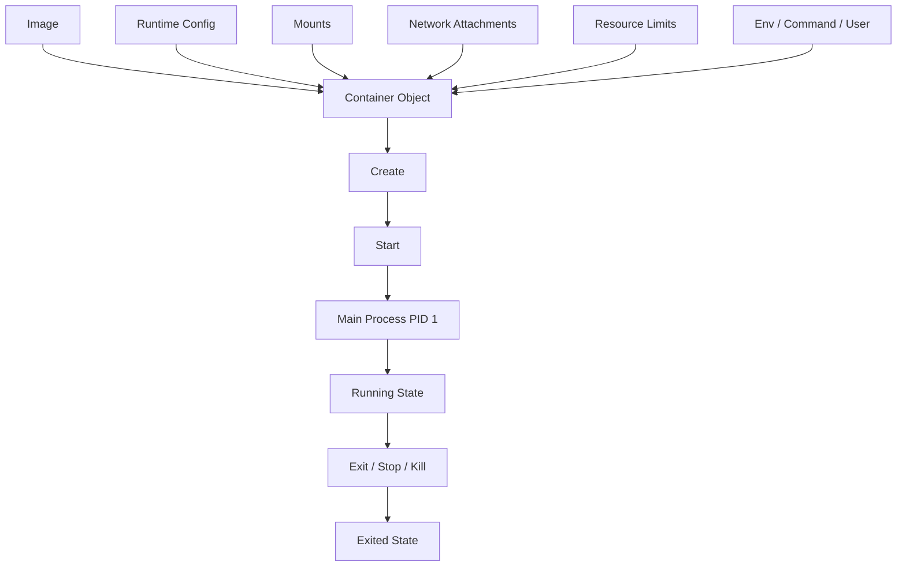
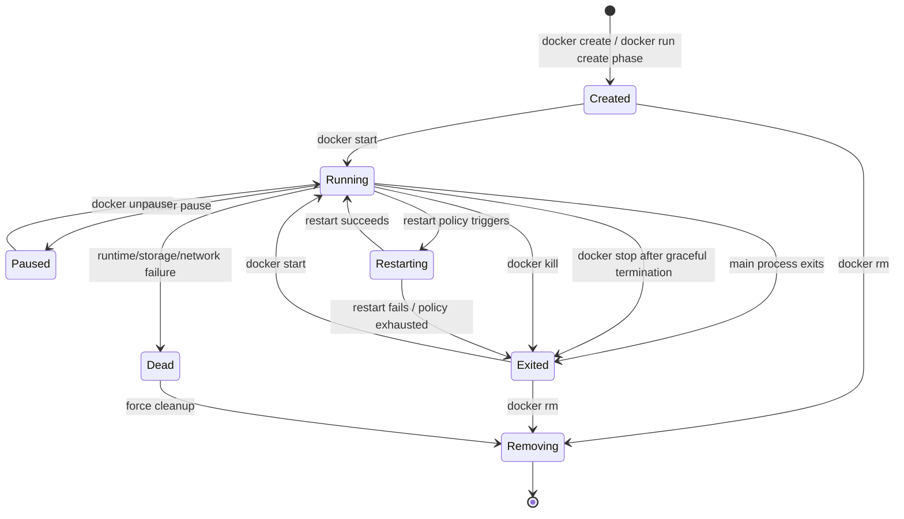
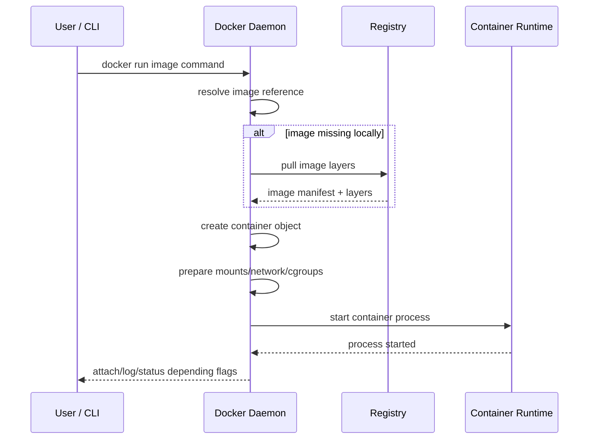
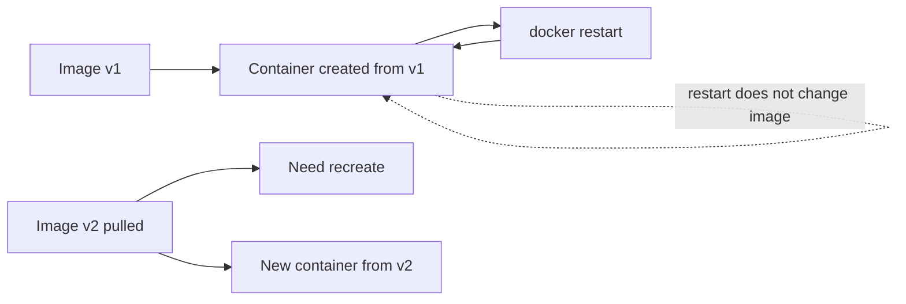
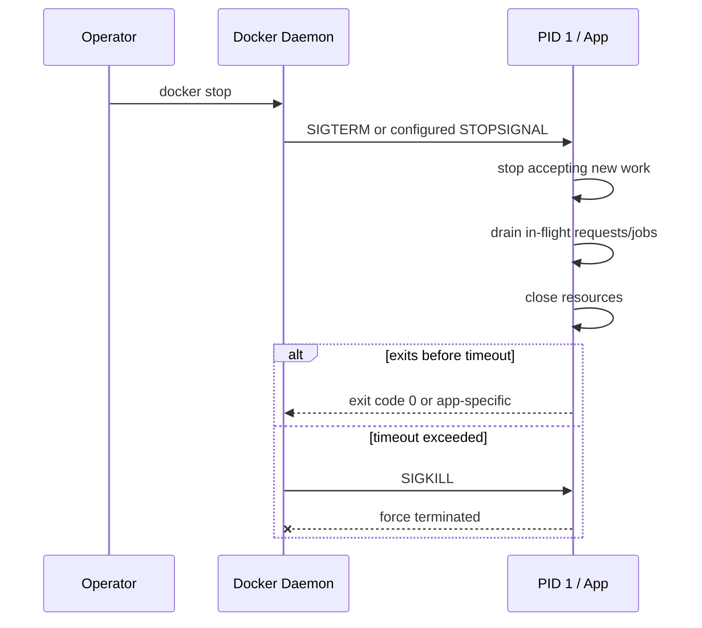
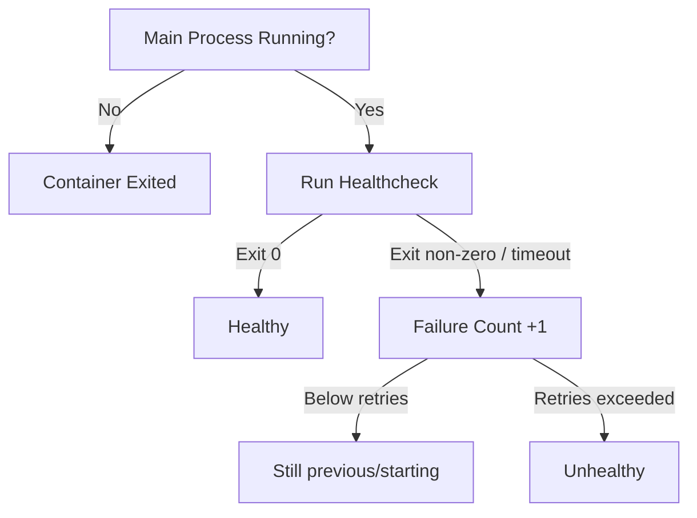
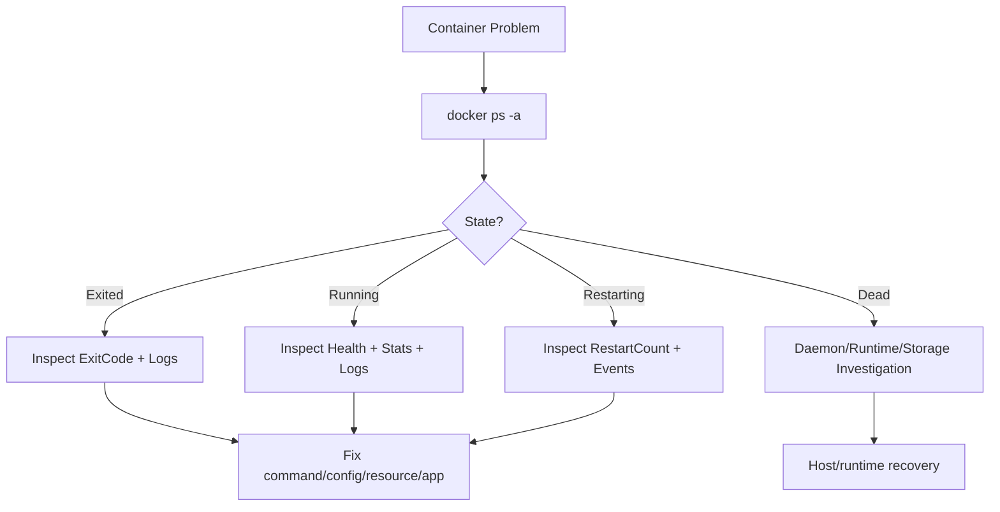
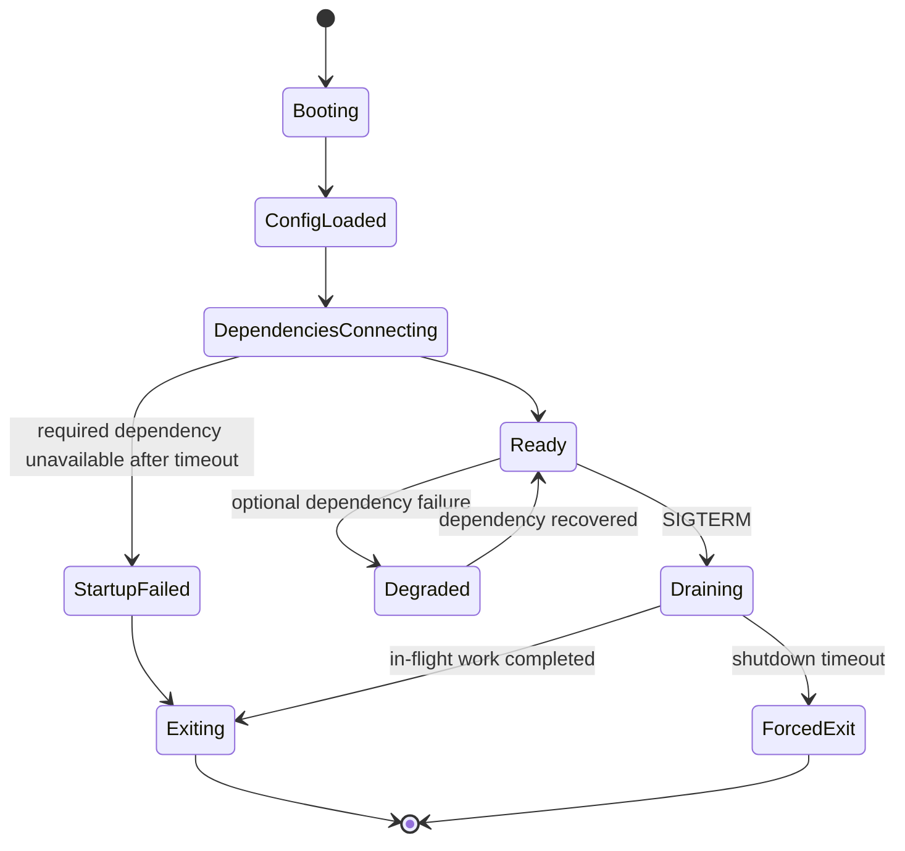

# Part 009 — Container Runtime Lifecycle: Create, Start, Stop, Restart, Health, Exit

## 1. Tujuan Part Ini

Pada part sebelumnya kita sudah membahas image sebagai artifact production-grade. Sekarang kita masuk ke fase berikutnya: **apa yang benar-benar terjadi ketika image dijalankan sebagai container?**

Banyak engineer bisa mengetik:

```bash
docker run nginx
```

Namun engineer level senior harus bisa menjawab:

- container object dibuat di mana?
- process utama container itu siapa?
- apa bedanya `created`, `running`, `exited`, `restarting`, `paused`, dan `dead`?
- sinyal apa yang dikirim ketika `docker stop`?
- kenapa shell form `CMD app start` sering merusak graceful shutdown?
- apa hubungan `ENTRYPOINT`, `CMD`, PID 1, signal forwarding, zombie process, dan restart policy?
- apakah `HEALTHCHECK` otomatis me-restart container?
- kenapa container restart loop kadang tidak langsung ditangkap policy?
- apa arti exit code `0`, `1`, `125`, `126`, `127`, `137`, dan `143`?
- kapan harus recreate container, bukan restart?
- bagaimana membedakan bug aplikasi, bug image, bug runtime, dan bug host?

Target setelah part ini:

- memahami container lifecycle sebagai **state machine**, bukan command hafalan;
- bisa merancang process contract yang menerima signal dengan benar;
- bisa mendesain graceful shutdown dan startup behavior;
- bisa membaca status, exit code, logs, events, inspect output, dan health status;
- bisa membedakan `restart`, `recreate`, `rebuild`, dan `redeploy`;
- bisa membuat runbook failure untuk container crash, hang, unhealthy, dan stuck shutdown;
- bisa menghindari anti-pattern yang membuat container terlihat jalan tetapi tidak operasional.

Inti part ini: **container adalah process contract yang dikelola oleh runtime. Image hanya menjelaskan apa yang tersedia; lifecycle menentukan bagaimana proses itu hidup, gagal, berhenti, dan diobservasi.**

---

## 2. Mental Model: Container sebagai Runtime Object + Main Process

Container bukan hanya process. Container adalah object runtime yang mengikat beberapa hal:

```text
Container = Image Snapshot + Runtime Config + Namespaces + Cgroups + Mounts + Network + Main Process + State
```

Docker image bersifat immutable. Container adalah instansiasi image dengan runtime configuration tertentu.

Diagram sederhana:



Dua hal penting:

1. **Container object bisa ada tanpa process yang sedang berjalan.**
   Itu terjadi pada state `created` atau `exited`.

2. **Container dianggap hidup selama main process masih hidup.**
   Jika PID 1 exit, container selesai, meskipun child process lain sempat dibuat.

Jadi pertanyaan yang benar bukan hanya “container jalan atau tidak?”, tetapi:

- process utama apa yang menjadi lifecycle anchor?
- apakah process itu menerima signal?
- apakah process itu me-reap child process?
- apakah process itu expose readiness/health?
- apakah exit code-nya bermakna?
- apakah container state sesuai dengan real operational state?

---

## 3. Docker Container State Machine

Lifecycle container dapat dipahami sebagai state machine berikut:



Status utama:

| State | Makna | Biasanya Terjadi Karena |
|---|---|---|
| `created` | container object sudah dibuat, process belum start | `docker create`, atau create phase dari `docker run` gagal lanjut |
| `running` | main process masih hidup | `docker start`, `docker run` |
| `paused` | semua process container di-freeze | `docker pause` |
| `restarting` | Docker sedang mencoba restart container | restart policy aktif |
| `exited` | main process selesai | normal exit, crash, stop, kill |
| `dead` | Docker gagal membersihkan atau mengelola container secara normal | runtime/storage/kernel edge case |
| `removing` | container sedang dihapus | `docker rm` |

Yang perlu diingat: `running` tidak berarti aplikasi sehat. `running` hanya berarti main process masih hidup.

Aplikasi bisa:

- running tetapi tidak menerima request;
- running tetapi stuck deadlock;
- running tetapi dependency database putus;
- running tetapi thread pool penuh;
- running tetapi disk penuh;
- running tetapi heap mendekati OOM;
- running tetapi readiness sudah gagal.

Karena itu lifecycle process harus dipisahkan dari lifecycle health.

---

## 4. `docker run` Bukan Satu Operasi Tunggal

Secara praktis, `docker run` terlihat seperti satu command. Secara mental model, ia menggabungkan beberapa langkah:



Secara kasar:

```text
docker run = optional pull + create + start + optional attach
```

Ini menjelaskan beberapa perilaku penting:

- Jika image belum ada, `docker run` bisa gagal pada fase pull.
- Jika image ada tetapi runtime config salah, bisa gagal pada fase create.
- Jika command tidak ditemukan, bisa gagal pada fase start.
- Jika process start lalu langsung exit, container pernah `running` sebentar lalu `exited`.
- Jika command berjalan foreground, container tetap hidup.
- Jika command daemonize ke background lalu parent exit, container mati.

Contoh anti-pattern:

```Dockerfile
CMD service nginx start
```

Banyak init script model lama menjalankan service di background lalu command selesai. Dalam container, itu salah karena Docker memonitor process utama. Yang benar adalah menjalankan process utama di foreground.

Contoh lebih tepat:

```Dockerfile
CMD ["nginx", "-g", "daemon off;"]
```

Invariant: **main process container harus merepresentasikan lifecycle aplikasi.**

---

## 5. `docker create`, `docker start`, `docker stop`, `docker kill`, `docker rm`

Perbedaan command lifecycle:

| Command | Efek | Mengubah Config? | Menghapus Data? |
|---|---|---:|---:|
| `docker create` | membuat container object tanpa start | ya, saat create | tidak |
| `docker start` | menjalankan container yang sudah ada | tidak | tidak |
| `docker stop` | meminta process berhenti graceful lalu force kill jika timeout | tidak | tidak |
| `docker kill` | mengirim signal langsung, default `SIGKILL` | tidak | tidak |
| `docker restart` | stop lalu start lagi | tidak | tidak |
| `docker rm` | menghapus container object | tidak relevan | writable layer hilang |
| `docker rm -v` | menghapus container dan anonymous volumes tertentu | tidak relevan | bisa menghapus volume anonymous |

Dampak penting:

- `restart` tidak mengambil perubahan image baru.
- `restart` tidak mengambil perubahan environment variable baru.
- `restart` tidak mengubah port, mount, user, network config, dan resource limit.
- Untuk mengubah runtime config, container umumnya harus **recreate**.
- Untuk mengambil artifact baru, image harus **pull/build** lalu container harus **recreate**.

Diagram:



Prinsip operasional:

```text
Restart fixes transient process state.
Recreate applies runtime configuration changes.
Rebuild creates a new image artifact.
Redeploy coordinates replacement in an environment.
```

---

## 6. `ENTRYPOINT` dan `CMD` sebagai Process Contract

`ENTRYPOINT` dan `CMD` menentukan command final yang dijalankan di container.

Mental model:

```text
ENTRYPOINT = executable utama / fixed command
CMD        = default arguments / overridable default
```

Contoh:

```Dockerfile
ENTRYPOINT ["java", "-jar", "/app/app.jar"]
CMD ["--server.port=8080"]
```

Command final:

```text
java -jar /app/app.jar --server.port=8080
```

Jika user menjalankan:

```bash
docker run myapp --server.port=9090
```

Maka `CMD` diganti, `ENTRYPOINT` tetap:

```text
java -jar /app/app.jar --server.port=9090
```

### Exec Form vs Shell Form

Exec form:

```Dockerfile
CMD ["node", "server.js"]
```

Shell form:

```Dockerfile
CMD node server.js
```

Shell form membuat command berjalan melalui shell, biasanya:

```text
/bin/sh -c "node server.js"
```

Dampaknya:

- process aplikasi bukan PID 1 langsung;
- signal bisa berhenti di shell;
- `SIGTERM` mungkin tidak diteruskan ke aplikasi;
- shutdown bisa timeout lalu Docker mengirim `SIGKILL`;
- child process bisa menjadi zombie jika tidak direap.

Untuk production image, default yang lebih aman:

```Dockerfile
ENTRYPOINT ["/app/server"]
```

atau:

```Dockerfile
ENTRYPOINT ["java", "-jar", "/app/app.jar"]
```

Gunakan shell form hanya jika benar-benar membutuhkan shell expansion, pipe, glob, atau control operator. Jika butuh shell wrapper, gunakan script yang memanggil `exec`.

Contoh wrapper aman:

```sh
#!/bin/sh
set -eu

# optional preflight here

exec java -jar /app/app.jar "$@"
```

Tanpa `exec`, shell tetap menjadi PID 1 dan aplikasi menjadi child process.

---

## 7. PID 1: Detail Kecil yang Sering Menjadi Incident Besar

Di Linux, process dengan PID 1 punya perilaku khusus:

- menjadi root process dalam namespace PID container;
- menerima signal dari Docker saat stop;
- bertanggung jawab mengadopsi/reap orphaned child process;
- beberapa default signal handling berbeda dari process biasa.

Jika aplikasi utama menjadi PID 1 tetapi tidak menangani signal dengan benar, shutdown bisa buruk.

Jika shell wrapper menjadi PID 1 dan tidak forward signal, aplikasi tidak tahu harus berhenti.

Jika process utama membuat child process tetapi tidak melakukan wait/reap, zombie process bisa menumpuk.

Masalah umum:

```Dockerfile
CMD ["sh", "-c", "java -jar /app/app.jar"]
```

Lebih baik:

```Dockerfile
CMD ["java", "-jar", "/app/app.jar"]
```

Atau jika perlu script:

```Dockerfile
COPY docker-entrypoint.sh /usr/local/bin/
ENTRYPOINT ["docker-entrypoint.sh"]
CMD ["--spring.profiles.active=prod"]
```

Isi script:

```sh
#!/bin/sh
set -eu
exec java -jar /app/app.jar "$@"
```

Untuk aplikasi yang benar-benar perlu init kecil, Docker mendukung opsi `--init` yang menjalankan init process ringan untuk forward signal dan reap zombie process. Namun jangan jadikan `--init` sebagai alasan untuk membuat process model berantakan.

---

## 8. Signal Handling dan Graceful Shutdown

Ketika kita menjalankan:

```bash
docker stop myapp
```

Docker secara default mengirim signal termination ke main process container, menunggu timeout, lalu memaksa kill jika process belum keluar.

Secara konseptual:



Graceful shutdown bukan fitur Docker saja; ia harus didukung aplikasi.

Aplikasi production harus melakukan:

1. berhenti menerima request baru;
2. memberi sinyal readiness menjadi false jika ada orchestrator;
3. menyelesaikan request/job yang sedang berjalan dalam batas waktu;
4. flush log/metric/trace penting;
5. close database connection, file handle, socket, dan producer/consumer;
6. exit dengan code yang jelas.

Untuk aplikasi HTTP:

```text
SIGTERM received
  -> stop listener / stop accepting new connection
  -> drain in-flight request
  -> close pool
  -> exit
```

Untuk worker queue:

```text
SIGTERM received
  -> stop fetching new messages
  -> finish current message or safely requeue
  -> commit/ack only if work is durable
  -> exit
```

Untuk scheduler:

```text
SIGTERM received
  -> stop starting new jobs
  -> mark running jobs cancel/drain
  -> persist checkpoint if needed
  -> exit
```

Dockerfile dapat menentukan signal default:

```Dockerfile
STOPSIGNAL SIGTERM
```

Runtime juga bisa menentukan timeout stop:

```bash
docker run --stop-timeout 30 myapp
```

Prinsip: **timeout shutdown harus lebih besar dari waktu drain normal, tetapi cukup kecil untuk tidak membuat deploy dan incident recovery macet.**

---

## 9. Exit Code Semantics

Exit code adalah kontrak penting antara aplikasi dan runtime.

| Exit Code | Makna Umum | Interpretasi Operasional |
|---:|---|---|
| `0` | selesai sukses | normal completion atau graceful stop |
| `1` | general error | aplikasi gagal |
| `2` | misuse of shell builtins / app-specific | cek dokumentasi app |
| `125` | Docker daemon gagal menjalankan container | error pada Docker command/runtime setup |
| `126` | command ditemukan tetapi tidak executable | permission/format issue |
| `127` | command tidak ditemukan | path/image/entrypoint salah |
| `130` | terminated by Ctrl-C / SIGINT | interactive interruption |
| `137` | killed dengan SIGKILL, sering OOM atau forced kill | cek OOM, stop timeout, operator kill |
| `143` | terminated dengan SIGTERM | graceful termination path umum |

Exit code bisa dilihat dengan:

```bash
docker inspect myapp --format '{{.State.ExitCode}}'
```

Atau:

```bash
docker ps -a
```

Contoh analisis:

```text
Exited (127) 2 seconds ago
```

Kemungkinan:

- executable tidak ada;
- path salah;
- `ENTRYPOINT` mengarah ke file yang tidak tercopy;
- line ending script CRLF;
- shell tidak tersedia di minimal image;
- interpreter shebang tidak ada.

Contoh:

```text
Exited (137)
```

Kemungkinan:

- container terkena OOM kill;
- operator menjalankan `docker kill`;
- `docker stop` timeout lalu Docker mengirim SIGKILL;
- host memory pressure sangat tinggi.

Exit code bukan diagnosis final. Ia adalah pointer untuk investigasi.

---

## 10. Restart Policy: Availability Primitive, Bukan Obat Semua Crash

Docker mendukung restart policy pada container standalone:

```bash
docker run --restart no myapp
docker run --restart on-failure:3 myapp
docker run --restart always myapp
docker run --restart unless-stopped myapp
```

Makna ringkas:

| Policy | Perilaku |
|---|---|
| `no` | tidak restart otomatis |
| `on-failure[:max-retries]` | restart jika exit code non-zero |
| `always` | selalu restart jika berhenti, termasuk setelah daemon restart |
| `unless-stopped` | mirip `always`, tetapi tidak restart jika sebelumnya dihentikan manual |

Restart policy berguna untuk transient failure, tetapi berbahaya jika menutupi bug konfigurasi.

Contoh failure loop:

```text
container starts
  -> config missing
  -> app exits code 1
  -> Docker restarts
  -> app exits code 1
  -> repeated loop
```

Masalahnya bukan “butuh restart lebih kuat”. Masalahnya adalah image/config contract invalid.

### Restart Policy dan Successful Start

Docker memiliki detail penting: restart policy mulai efektif setelah container berhasil start dan dipantau. Secara operasional, container yang langsung gagal pada fase awal bisa menunjukkan perilaku berbeda dari ekspektasi sederhana “selalu restart”. Ini mencegah container yang tidak pernah benar-benar start masuk loop yang tidak terkendali.

### Kapan Memakai Policy Apa?

| Workload | Policy Awal yang Masuk Akal | Catatan |
|---|---|---|
| HTTP service lokal sederhana | `unless-stopped` | cocok untuk dev/single host |
| batch job one-shot | `no` | job selesai tidak harus restart |
| worker long-running | `on-failure` atau orchestrator policy | hindari infinite poison crash |
| database lokal dev | `unless-stopped` | pastikan volume jelas |
| production orchestrated | gunakan policy orchestrator | Swarm/Kubernetes lebih tepat |

Prinsip:

```text
Restart policy improves process availability.
It does not validate correctness, readiness, data safety, or dependency health.
```

---

## 11. Healthcheck: Process Alive Bukan Berarti Service Healthy

Dockerfile dapat mendefinisikan healthcheck:

```Dockerfile
HEALTHCHECK --interval=30s --timeout=3s --start-period=20s --retries=3 \
  CMD curl -fsS http://localhost:8080/health || exit 1
```

Status health umum:

| Health Status | Makna |
|---|---|
| `starting` | masih dalam grace/start period |
| `healthy` | health command exit `0` |
| `unhealthy` | health command gagal sesuai threshold |
| none | tidak ada healthcheck |

State container dan health status berbeda:

```text
container state: running
health status: unhealthy
```

Artinya process utama masih hidup, tetapi health probe gagal.

Diagram:



Healthcheck yang baik harus:

- cepat;
- side-effect free;
- tidak membuat load besar;
- mengecek komponen yang benar-benar menentukan service readiness;
- punya timeout lebih kecil dari interval;
- membedakan startup grace period dari failure sungguhan;
- tidak bergantung pada tool yang tidak ada di image final, kecuali memang sengaja disediakan.

Anti-pattern healthcheck:

```Dockerfile
HEALTHCHECK CMD ps aux | grep java
```

Itu hanya mengecek process ada. Docker sudah tahu process ada.

Lebih baik:

```Dockerfile
HEALTHCHECK CMD wget -qO- http://127.0.0.1:8080/ready || exit 1
```

Namun hati-hati: minimal image mungkin tidak punya `wget`, `curl`, atau shell. Untuk image sangat minimal, healthcheck bisa berupa binary kecil, endpoint internal, atau pengecekan command aplikasi.

### Apakah Healthcheck Otomatis Me-restart Container?

Untuk container standalone, health status tidak otomatis berarti Docker me-restart container. Health status adalah sinyal. Compose, Swarm, atau orchestrator dapat menggunakannya untuk dependency ordering, routing, update decision, atau replacement policy tergantung konteks.

Jadi jangan membuat asumsi:

```text
unhealthy == automatically restarted
```

Yang benar:

```text
unhealthy == runtime-observable signal that another control loop may use
```

---

## 12. Readiness, Liveness, dan Startup: Jangan Campur Semua ke Satu Probe

Walau Docker standalone hanya memiliki healthcheck generik, engineer perlu memahami tiga konsep:

| Probe Concept | Pertanyaan | Contoh |
|---|---|---|
| Startup | “Aplikasi masih booting atau gagal start?” | migration/startup cache belum selesai |
| Readiness | “Boleh menerima traffic sekarang?” | DB connected, queue ready, config loaded |
| Liveness | “Process perlu dibunuh/restart?” | deadlock fatal, event loop stuck |

Jika semua digabung asal-asalan, failure behavior menjadi buruk.

Contoh buruk:

```text
/health checks DB, Redis, downstream payment, search, and external email provider
```

Dampak:

- service dianggap unhealthy ketika dependency non-critical down;
- rolling update bisa gagal karena external dependency lambat;
- local dev sulit jalan;
- health endpoint menjadi distributed dependency test yang mahal.

Desain lebih baik:

```text
/live   -> process alive and event loop responsive
/ready  -> service can accept core traffic
/health -> human/diagnostic aggregate, not always used for routing
```

Untuk Dockerfile `HEALTHCHECK`, pilih endpoint sesuai tujuan. Jika container dipakai di Compose untuk dependency startup, readiness lebih masuk akal. Jika dipakai untuk restart/replacement oleh platform, liveness harus sangat hati-hati agar tidak membunuh service karena dependency sementara.

---

## 13. Logs: Container Tidak Boleh Menyembunyikan Sinyal Operasional

Container production harus menulis log ke stdout/stderr.

Alasan:

- Docker logging driver membaca stdout/stderr process;
- `docker logs` menjadi sumber observability awal;
- Compose dapat aggregate output service;
- platform logging agent dapat collect log secara konsisten;
- log file internal container bisa hilang ketika container dihapus;
- log file internal dapat memenuhi writable layer.

Anti-pattern:

```text
/app/logs/app.log
/var/log/myapp/app.log
```

Kecuali ada alasan khusus, jangan jadikan file internal sebagai log utama.

Untuk aplikasi yang default log ke file, konfigurasi ulang ke console.

Contoh Java/Spring Boot:

```properties
logging.file.name=
logging.pattern.console=%d{yyyy-MM-dd'T'HH:mm:ss.SSSXXX} %-5level [%thread] %logger - %msg%n
```

Contoh Node.js:

```js
console.log(JSON.stringify({ level: 'info', msg: 'server started' }));
```

Log contract minimal:

- startup config summary tanpa secret;
- port/listener aktif;
- dependency critical status;
- signal received;
- shutdown started;
- shutdown completed;
- fatal error with stack/context;
- request/job correlation id jika relevan.

---

## 14. Inspect, Logs, Events: Tiga Sumber Kebenaran Awal

Saat container bermasalah, gunakan tiga sumber awal:

```bash
docker inspect myapp
docker logs myapp
docker events --filter container=myapp
```

### `docker inspect`

Memberi object state/config.

Field penting:

```bash
docker inspect myapp --format '{{json .State}}'
```

Perhatikan:

- `Status`;
- `Running`;
- `Paused`;
- `Restarting`;
- `OOMKilled`;
- `Dead`;
- `Pid`;
- `ExitCode`;
- `Error`;
- `StartedAt`;
- `FinishedAt`;
- `Health`.

### `docker logs`

Memberi output stdout/stderr.

Gunakan:

```bash
docker logs --tail 200 myapp
docker logs --since 10m myapp
docker logs -f myapp
```

Jika logs kosong, kemungkinan:

- aplikasi log ke file internal;
- process gagal sebelum logging initialized;
- entrypoint salah;
- logging driver tidak mendukung `docker logs` seperti ekspektasi;
- container tidak pernah start.

### `docker events`

Memberi timeline event:

```bash
docker events --since 30m
```

Useful untuk melihat:

- create;
- start;
- die;
- kill;
- oom;
- health_status;
- restart;
- destroy;
- network connect/disconnect.

Diagram investigasi:



---

## 15. `docker exec` Bukan Bagian dari Normal Operation

`docker exec` berguna untuk debugging:

```bash
docker exec -it myapp sh
```

Tetapi container production tidak boleh bergantung pada manual exec sebagai bagian normal operasi.

Jika runbook berkata:

```text
exec into container and run migration manually
```

Maka desain lifecycle belum matang.

Lebih baik:

- migration menjadi job explicit;
- admin task menjadi command explicit;
- debug image variant tersedia;
- observability cukup tanpa shell;
- operational action dicatat melalui pipeline/tooling.

Masalah lain: minimal image sering tidak punya shell.

Contoh:

```bash
docker exec -it distroless-app sh
# error: executable file not found
```

Itu bukan bug image jika image memang distroless. Solusinya bukan memasukkan shell ke image production, tetapi menyediakan debug strategy:

- debug variant;
- sidecar/debug container di platform yang mendukung;
- host-level namespace debugging;
- richer metrics/logging;
- ephemeral copy di environment non-production.

---

## 16. Pause dan Unpause: Freeze Process, Bukan Graceful Stop

`docker pause` membekukan process container menggunakan freezer cgroup.

```bash
docker pause myapp
docker unpause myapp
```

Perilaku:

- process tidak dieksekusi sementara;
- socket/file handle tetap ada;
- client mungkin timeout;
- app tidak menerima signal graceful stop;
- time-sensitive logic bisa mengalami efek buruk.

Jangan gunakan pause sebagai mekanisme deployment atau maintenance normal. Ia lebih berguna untuk eksperimen, debugging, atau situasi sangat spesifik.

Untuk maintenance normal, gunakan:

- stop/drain;
- scale down;
- remove from routing;
- rolling update;
- node drain pada orchestrator.

---

## 17. Container Hang: Running tapi Tidak Progress

Container hang lebih berbahaya dari container crash karena restart policy mungkin tidak aktif.

Gejala:

- `docker ps` menunjukkan running;
- log berhenti;
- healthcheck mungkin unhealthy atau belum ada;
- CPU bisa 0% atau 100%;
- memory mungkin stabil atau terus naik;
- endpoint tidak merespons;
- shutdown lambat atau timeout.

Kemungkinan penyebab:

- deadlock;
- thread pool exhaustion;
- event loop blocked;
- DNS call menggantung;
- dependency connection pool exhausted;
- filesystem blocking;
- stdout blocked karena logging driver/backpressure;
- memory pressure ekstrem;
- app menunggu lock/file/socket.

Investigasi awal:

```bash
docker inspect myapp --format '{{json .State.Health}}'
docker stats myapp
docker logs --tail 200 myapp
docker exec myapp ps aux
```

Untuk Java:

```bash
docker exec myapp jcmd 1 Thread.print
```

Jika tool tidak tersedia, gunakan debug image atau external profiler strategy di environment yang aman.

Prinsip: **crash is loud; hang is silent. Healthcheck dan metrics harus dirancang untuk mendeteksi non-progress.**

---

## 18. Compose Lifecycle: Service Recreate Lebih Penting daripada Container Restart

Dalam Compose, kita biasanya tidak mengelola container satu per satu, tetapi service.

Command penting:

```bash
docker compose up
docker compose up -d
docker compose down
docker compose start
docker compose stop
docker compose restart
docker compose logs -f
docker compose ps
```

Perbedaan penting:

| Command | Efek |
|---|---|
| `docker compose start` | start container yang sudah ada |
| `docker compose stop` | stop container tanpa remove |
| `docker compose restart` | restart container yang ada |
| `docker compose up` | create/recreate/start sesuai perubahan config/image |
| `docker compose up --build` | build image lalu create/recreate/start |
| `docker compose down` | stop dan remove container/network default |

Jika environment variable di Compose file berubah, `restart` tidak cukup. Perlu `up` agar container direcreate.

Contoh:

```yaml
services:
  api:
    image: myorg/api:1.0
    environment:
      FEATURE_X: "true"
```

Jika `FEATURE_X` diubah menjadi `false`, jalankan:

```bash
docker compose up -d
```

bukan hanya:

```bash
docker compose restart api
```

Mental model:

```text
compose restart = same container config, new process
compose up      = reconcile desired service config to actual containers
```

---

## 19. Lifecycle Failure Taxonomy

Gunakan taxonomy berikut saat container gagal.

### 19.1 Fails Before Start

Gejala:

- `docker run` error langsung;
- container tidak muncul atau status `created`;
- no logs.

Kemungkinan:

- image reference salah;
- platform architecture mismatch;
- invalid mount;
- invalid port mapping;
- invalid resource flag;
- permission denied pada runtime config.

Diagnosis:

```bash
docker run --rm ...
docker inspect <container-if-created>
```

### 19.2 Starts then Exits Immediately

Gejala:

- `Exited (1)` atau `Exited (127)`;
- logs berisi config error atau command not found.

Kemungkinan:

- command salah;
- missing env;
- missing file;
- app config invalid;
- dependency required at startup unavailable;
- permission denied.

Diagnosis:

```bash
docker logs <container>
docker inspect <container> --format '{{.State.ExitCode}} {{.State.Error}}'
```

### 19.3 Runs then Crashes Later

Gejala:

- restart count naik;
- exit code non-zero;
- log fatal error.

Kemungkinan:

- unhandled exception;
- dependency failure tidak ditangani;
- memory leak;
- disk full;
- OOM;
- file descriptor exhaustion.

Diagnosis:

```bash
docker inspect <container> --format '{{.RestartCount}} {{.State.OOMKilled}} {{.State.ExitCode}}'
docker events --since 1h
```

### 19.4 Runs but Unhealthy

Gejala:

- `docker ps` menunjukkan `(unhealthy)`;
- process masih hidup.

Kemungkinan:

- health endpoint gagal;
- dependency belum ready;
- health command tidak ada;
- timeout terlalu pendek;
- DNS/network issue;
- app stuck sebagian.

Diagnosis:

```bash
docker inspect <container> --format '{{json .State.Health}}'
```

### 19.5 Cannot Stop Gracefully

Gejala:

- `docker stop` lambat;
- exit code `137`;
- logs tidak menunjukkan shutdown hook.

Kemungkinan:

- shell form tidak forward signal;
- app tidak handle SIGTERM;
- shutdown hook stuck;
- request/job drain terlalu lama;
- deadlock saat shutdown.

Diagnosis:

```bash
docker kill --signal=SIGTERM <container>
docker logs -f <container>
```

---

## 20. Designing a Runtime State Machine for Your Service

Untuk service production, tulis lifecycle eksplisit.

Contoh state machine aplikasi:



Mapping ke container:

| App State | Container State | Health Status | Expected Logs |
|---|---|---|---|
| Booting | running | starting | config loading |
| Ready | running | healthy | listening on port |
| Degraded | running | depends | dependency degraded |
| Draining | running | unhealthy/not ready | shutdown started |
| Exiting | exited soon | none | shutdown completed |
| StartupFailed | exited | none | fatal startup error |

Aplikasi yang matang tidak hanya “jalan”. Ia mengomunikasikan lifecycle-nya.

---

## 21. Runtime Contract Checklist

Gunakan checklist ini saat review image/service.

### Process Contract

- [ ] `ENTRYPOINT`/`CMD` memakai exec form kecuali ada alasan kuat.
- [ ] Jika memakai wrapper script, script memanggil `exec`.
- [ ] Main process berjalan foreground.
- [ ] PID 1 menerima `SIGTERM`.
- [ ] Child process direap atau gunakan init jika diperlukan.
- [ ] Tidak ada daemonization internal.

### Shutdown Contract

- [ ] Aplikasi menangani termination signal.
- [ ] Stop timeout sesuai waktu drain realistik.
- [ ] Shutdown logs jelas.
- [ ] Worker tidak ack message sebelum durable completion.
- [ ] HTTP server berhenti menerima request baru sebelum exit.

### Health Contract

- [ ] Healthcheck cepat dan side-effect free.
- [ ] Ada startup grace period.
- [ ] Timeout tidak terlalu panjang.
- [ ] Probe mengecek readiness yang tepat.
- [ ] Failure health bisa didiagnosis dari logs/inspect.

### Restart Contract

- [ ] Restart policy sesuai workload.
- [ ] Batch job tidak memakai restart infinite sembarangan.
- [ ] Crash loop tidak menutupi config error.
- [ ] Restart count dimonitor.

### Observability Contract

- [ ] Log ke stdout/stderr.
- [ ] Startup dan shutdown event tercatat.
- [ ] Exit code bermakna.
- [ ] `docker inspect` cukup memberi state awal.
- [ ] Metrics tersedia untuk hang, OOM, CPU throttling, dan memory pressure.

---

## 22. Lab 009 — Lifecycle Failure Drill

Buat folder:

```text
labs/009-runtime-lifecycle/
```

### 22.1 App yang Exit Normal

```Dockerfile
FROM alpine:3.20
CMD ["sh", "-c", "echo hello; exit 0"]
```

Build dan run:

```bash
docker build -t lifecycle-normal .
docker run --name lifecycle-normal-1 lifecycle-normal
docker ps -a --filter name=lifecycle-normal-1
```

Amati exit code.

### 22.2 App yang Command Not Found

```Dockerfile
FROM alpine:3.20
CMD ["/missing-binary"]
```

Run dan baca error:

```bash
docker build -t lifecycle-missing .
docker run --name lifecycle-missing-1 lifecycle-missing
docker inspect lifecycle-missing-1 --format '{{.State.ExitCode}} {{.State.Error}}'
```

### 22.3 Signal Handling Buruk vs Baik

Buruk:

```Dockerfile
FROM alpine:3.20
CMD sh -c 'trap "echo got term" TERM; sleep 9999'
```

Lebih baik:

```Dockerfile
FROM alpine:3.20
CMD ["sh", "-c", "trap 'echo got term; exit 0' TERM; while true; do sleep 1; done"]
```

Lalu:

```bash
docker run --name signal-test lifecycle-signal
docker stop --time 3 signal-test
docker inspect signal-test --format '{{.State.ExitCode}}'
```

Diskusikan:

- apakah signal diterima?
- apakah shutdown hook jalan?
- apakah exit code masuk akal?

### 22.4 Healthcheck Failure

```Dockerfile
FROM alpine:3.20
RUN apk add --no-cache curl
HEALTHCHECK --interval=5s --timeout=2s --retries=2 CMD curl -fsS http://127.0.0.1:8080/ready || exit 1
CMD ["sh", "-c", "while true; do sleep 1; done"]
```

Run:

```bash
docker build -t lifecycle-unhealthy .
docker run -d --name lifecycle-unhealthy-1 lifecycle-unhealthy
watch docker ps --filter name=lifecycle-unhealthy-1
```

Amati bahwa container bisa tetap running tetapi unhealthy.

---

## 23. Common Pitfalls

### Pitfall 1 — Menganggap Running Sama dengan Ready

`docker ps` hanya menunjukkan process masih hidup. Gunakan health/readiness untuk service readiness.

### Pitfall 2 — Shell Form Merusak Signal

`CMD app start` terlihat sederhana, tetapi bisa membuat signal berhenti di shell. Gunakan exec form.

### Pitfall 3 — Restart Policy Menutupi Config Error

Crash karena config invalid tidak selesai dengan `--restart always`. Perbaiki config validation dan startup diagnostics.

### Pitfall 4 — Healthcheck Terlalu Mahal

Healthcheck yang memanggil dependency berat setiap beberapa detik bisa menjadi sumber load sendiri.

### Pitfall 5 — Manual Exec sebagai Operation Normal

Jika production butuh `docker exec` manual, lifecycle design belum selesai.

### Pitfall 6 — Log ke File Internal

Log internal hilang saat container dihapus dan bisa memenuhi writable layer. Log ke stdout/stderr.

### Pitfall 7 — Tidak Membedakan Restart dan Recreate

Perubahan env, port, volume, user, network, dan image tidak otomatis diterapkan dengan restart.

---

## 24. Kaufman Practice Loop

Gunakan 20–30 menit deliberate practice:

1. Buat container yang exit `0`, `1`, `127`, dan `137`.
2. Baca state dengan `docker inspect`.
3. Tambahkan restart policy dan amati restart count.
4. Tambahkan healthcheck yang sengaja gagal.
5. Ubah shell form menjadi exec form.
6. Kirim `SIGTERM` dan amati logs.
7. Ubah env di Compose, coba `restart`, lalu `up`, dan bandingkan.

Feedback loop:

```text
Change one lifecycle variable -> run -> inspect state/log/event -> explain what happened -> fix mental model
```

Tujuan practice bukan menghafal command. Tujuannya adalah bisa memprediksi state transition.

---

## 25. Ringkasan

Container runtime lifecycle adalah state machine.

Hal yang harus melekat:

- `docker run` menggabungkan pull/create/start/attach.
- Container hidup selama main process hidup.
- PID 1 dan signal handling menentukan graceful shutdown.
- Exec form lebih aman daripada shell form untuk `ENTRYPOINT`/`CMD`.
- `docker stop` memberi kesempatan graceful sebelum force kill.
- Exit code adalah sinyal diagnosis awal.
- Restart policy membantu availability tetapi tidak memperbaiki correctness.
- Healthcheck memberi sinyal health, bukan jaminan auto-restart standalone.
- Running tidak sama dengan healthy atau ready.
- Restart tidak sama dengan recreate.
- Logs, inspect, dan events adalah baseline debugging lifecycle.

Pada part berikutnya kita akan masuk ke resource management: CPU, memory, IO, PID, OOM, dan bagaimana cgroups mengubah container dari “process yang jalan” menjadi “process dengan budget dan batas kegagalan yang eksplisit”.

---

## References

- Docker Docs — Running containers: `https://docs.docker.com/engine/containers/run/`
- Docker Docs — Start containers automatically: `https://docs.docker.com/engine/containers/start-containers-automatically/`
- Docker Docs — Dockerfile reference: `https://docs.docker.com/reference/dockerfile/`
- Docker Docs — JSONArgsRecommended build check: `https://docs.docker.com/reference/build-checks/json-args-recommended/`
- Docker Docs — docker container create: `https://docs.docker.com/reference/cli/docker/container/create/`
- Docker Docs — docker container kill: `https://docs.docker.com/reference/cli/docker/container/kill/`
- Docker Docs — docker compose up: `https://docs.docker.com/reference/cli/docker/compose/up/`
- Docker Docs — docker compose restart: `https://docs.docker.com/reference/cli/docker/compose/restart/`
