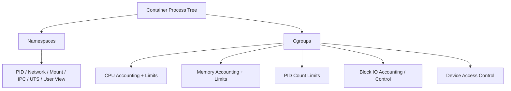
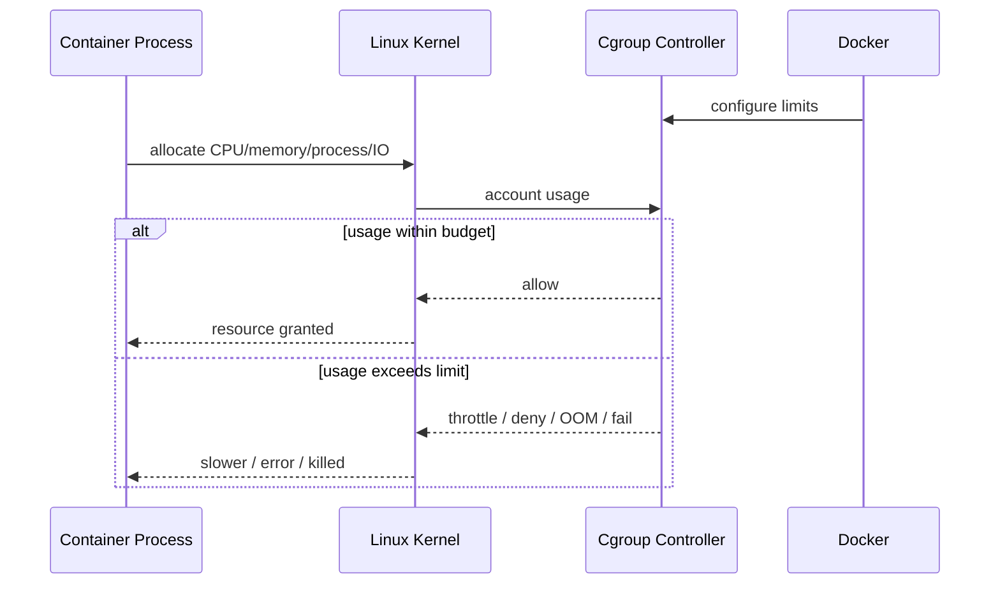
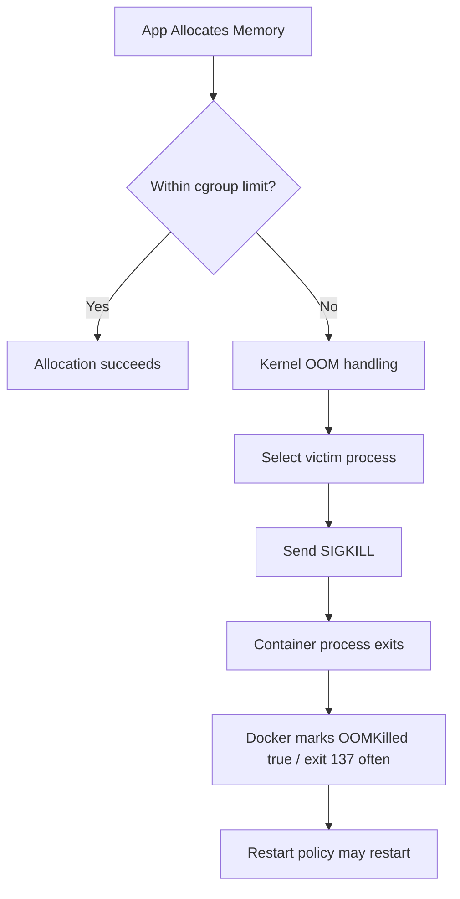
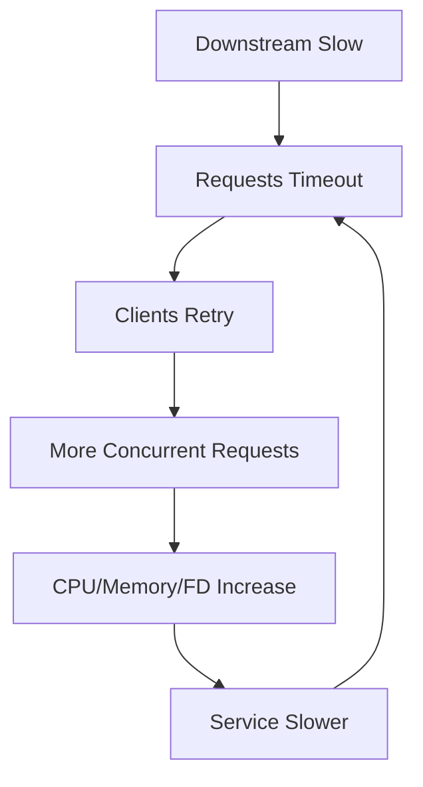
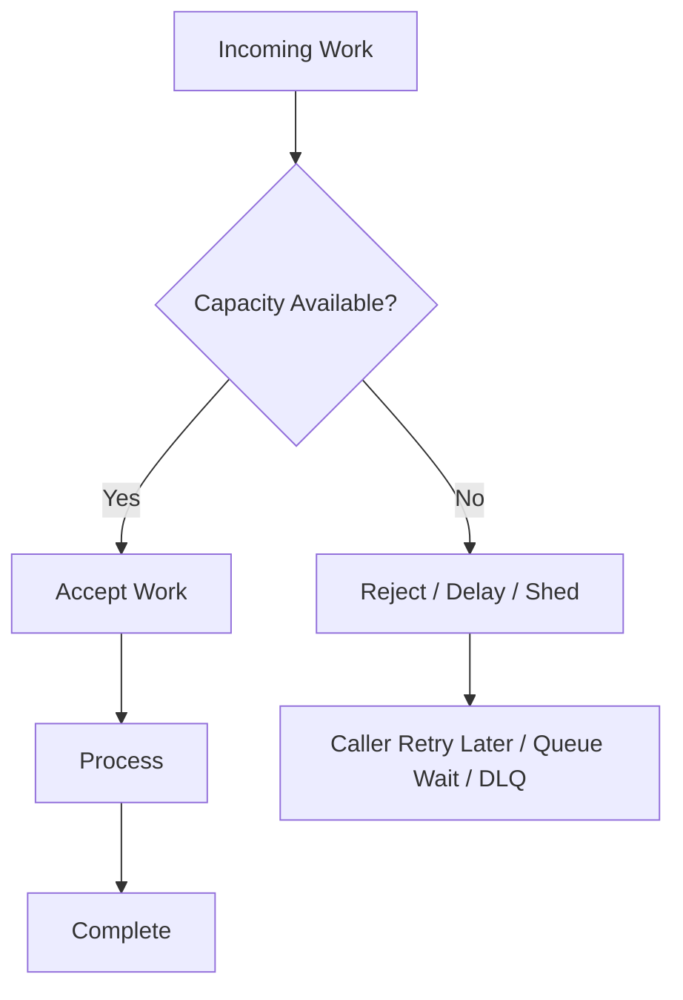

# Part 010 — Resource Management: CPU, Memory, IO, PIDs, OOM, and Backpressure

## 1. Tujuan Part Ini

Part sebelumnya membahas lifecycle container: bagaimana container dibuat, start, stop, restart, exit, dan dilihat health-nya. Sekarang kita masuk ke hal yang menentukan apakah container tetap aman ketika workload meningkat: **resource management**.

Resource management bukan sekadar performance tuning. Dalam sistem production, resource limit adalah:

- failure boundary;
- fairness mechanism;
- blast-radius limiter;
- capacity contract;
- scheduling input;
- incident prevention tool;
- signal observability.

Tanpa resource limit, satu container bisa:

- memakai seluruh memory host;
- membuat host swap storm;
- menghabiskan CPU dan membuat service lain latency spike;
- membuat fork bomb dan memenuhi process table;
- membuka terlalu banyak file descriptor;
- menulis data besar ke writable layer;
- membuat disk IO service lain tersendat;
- menutupi memory leak sampai host ikut tidak stabil.

Target setelah part ini:

- memahami cgroups sebagai mekanisme kernel untuk accounting dan limiting;
- bisa membedakan CPU shares, quota, period, cpuset, dan throttling;
- bisa mengatur memory limit, reservation, swap behavior, dan membaca OOM signal;
- bisa menggunakan PID limit dan ulimit untuk mencegah runaway process;
- bisa memahami IO bottleneck dan storage pressure;
- bisa membaca `docker stats` dan mengaitkannya dengan failure mode;
- bisa membuat resource envelope untuk HTTP service, worker, batch job, dan database lokal;
- bisa membedakan resource limit di Docker standalone, Compose, dan Swarm;
- bisa menghubungkan limit dengan backpressure, load shedding, dan graceful degradation.

Inti part ini: **container tanpa resource contract adalah process yang hanya “berharap” host cukup kuat. Production-grade container harus punya budget, limit, dan failure semantics yang eksplisit.**

---

## 2. Mental Model: Resource Limit sebagai Circuit Breaker Host

Container isolation memiliki dua sisi:

1. **Namespace** menjawab: “apa yang container bisa lihat?”
2. **Cgroup** menjawab: “berapa banyak resource yang container boleh pakai?”

Diagram:



Mental model yang benar:

```text
Resource limits do not make the application faster.
They make resource usage explicit and failure contained.
```

Jika limit terlalu rendah, app gagal lebih cepat.
Jika limit tidak ada, app bisa merusak host atau service lain.
Jika limit tepat, app gagal dalam boundary yang bisa diprediksi.

---

## 3. Cgroups: Accounting, Control, dan Enforcement

Docker menggunakan fitur kernel Linux cgroups untuk membatasi dan mengukur resource container. Ada perbedaan implementasi antara cgroups v1 dan v2, tetapi mental model engineering tetap sama:

```text
process belongs to cgroup -> kernel accounts usage -> kernel enforces configured limits
```

Yang penting untuk engineer:

- resource limit diterapkan oleh kernel, bukan oleh aplikasi;
- aplikasi sering “melihat” CPU/memory yang berbeda tergantung runtime awareness;
- beberapa runtime modern sudah container-aware, tetapi jangan mengandalkannya tanpa validasi;
- metrics container perlu dibaca dari perspektif cgroup, bukan hanya host;
- resource limit adalah runtime config, sehingga mengubahnya sering butuh recreate/update container/service.

Diagram enforcement:



---

## 4. CPU: Share, Quota, Period, Cpuset

CPU limit sering disalahpahami. Ada beberapa mekanisme berbeda.

### 4.1 CPU Shares / Weight

CPU shares adalah relative weight saat terjadi contention.

Contoh:

```bash
docker run --cpu-shares 512 app-a
docker run --cpu-shares 1024 app-b
```

Jika CPU idle, container bisa memakai lebih banyak. Jika contention, `app-b` mendapat weight lebih besar daripada `app-a`.

Mental model:

```text
CPU shares = fairness under contention, not hard cap.
```

Cocok untuk:

- memberi prioritas relatif;
- multi-container host dengan workload campuran;
- soft isolation.

Tidak cocok untuk:

- hard tenant cap;
- memastikan service tidak melewati jumlah core tertentu;
- billing/capacity strict.

### 4.2 CPU Quota dan Period

CPU quota memberi hard-ish cap atas waktu CPU dalam periode tertentu.

Command modern yang mudah:

```bash
docker run --cpus=1.5 myapp
```

Artinya container mendapat sekitar 1.5 CPU worth of runtime.

Bentuk lebih rendah:

```bash
docker run --cpu-period=100000 --cpu-quota=150000 myapp
```

Mental model:

```text
CPU quota = maximum CPU time allowed per scheduling period.
```

Dampak quota:

- CPU-bound workload bisa throttled;
- latency bisa spike ketika thread pool terlalu besar;
- GC atau background thread bisa bersaing dengan request thread;
- app yang mengira punya banyak core bisa oversubscribe.

### 4.3 Cpuset

Cpuset membatasi container ke CPU core tertentu:

```bash
docker run --cpuset-cpus="0-1" myapp
```

Cocok untuk:

- low-latency tuning;
- isolasi workload tertentu;
- eksperimen performance;
- mengurangi cross-core noise.

Tidak selalu cocok untuk default production, karena bisa membuat scheduling lebih kaku.

### 4.4 CPU Throttling sebagai Failure Signal

CPU throttling berarti container ingin memakai CPU lebih banyak dari quota, lalu kernel menahan eksekusinya.

Gejala:

- latency naik meskipun CPU host tidak 100%;
- thread pool penuh;
- request timeout;
- GC pause terasa lebih buruk;
- background job terlambat;
- healthcheck timeout.

Problem klasik:

```text
Container sees 8 host CPUs
CPU limit is 1 CPU
App creates thread pool for 8 CPUs
All threads contend under 1 CPU quota
Latency spikes due to throttling
```

Untuk Java, pastikan runtime dan konfigurasi aware terhadap container limit. Banyak JVM modern sudah container-aware, tetapi tetap validasi `availableProcessors`, GC thread, heap percentage, dan thread pool sizing.

Contoh Java flags yang sering relevan:

```bash
-XX:MaxRAMPercentage=75
-XX:InitialRAMPercentage=50
-XX:ActiveProcessorCount=2
```

Jangan copy-paste. Ukur.

---

## 5. CPU Design Patterns

### 5.1 HTTP API Service

Karakteristik:

- latency-sensitive;
- thread/event loop count penting;
- healthcheck bisa timeout saat CPU throttled.

Rekomendasi:

- mulai dari CPU request/reservation realistis;
- batasi max concurrency;
- gunakan timeout;
- monitor p95/p99 latency dan CPU throttling;
- jangan membuat worker thread jauh melebihi CPU efektif.

### 5.2 Background Worker

Karakteristik:

- throughput-sensitive;
- bisa lebih toleran latency;
- concurrency bisa dikontrol oleh jumlah consumer.

Rekomendasi:

- concurrency = fungsi CPU limit dan external dependency limit;
- gunakan backoff;
- jangan consume lebih cepat dari kemampuan process;
- gunakan idempotency dan safe retry.

### 5.3 Batch Job

Karakteristik:

- CPU burst mungkin tinggi;
- runtime sementara;
- bisa mengganggu service long-running.

Rekomendasi:

- hard cap CPU;
- schedule di host/node yang sesuai;
- limit IO;
- deadline dan checkpoint.

---

## 6. Memory: Limit, Reservation, Swap, OOM

Memory adalah resource yang paling sering menyebabkan container failure.

Command dasar:

```bash
docker run --memory=512m myapp
```

Alias pendek:

```bash
docker run -m 512m myapp
```

Tanpa memory limit, container bisa memakai memory sebanyak yang host kernel izinkan.

### 6.1 Memory Limit

Memory limit adalah batas maksimum memory yang dapat digunakan container sebelum kernel mengambil tindakan.

Mental model:

```text
memory limit = maximum memory envelope for process tree in container cgroup
```

Jika melewati limit, container bisa mengalami OOM kill.

Cek:

```bash
docker inspect myapp --format '{{.State.OOMKilled}} {{.State.ExitCode}}'
```

Exit code umum untuk process yang dibunuh SIGKILL adalah `137`.

### 6.2 Memory Reservation

Memory reservation adalah soft limit atau target minimum yang membantu scheduler/host pressure decision.

```bash
docker run --memory=1g --memory-reservation=512m myapp
```

Mental model:

```text
reservation = expected/guaranteed-ish working set
limit       = maximum tolerated usage before enforcement
```

Di orchestrator seperti Swarm, reservation juga membantu placement decision.

### 6.3 Swap

Swap behavior kompleks dan tergantung host/kernel configuration.

Docker memiliki opsi seperti:

```bash
docker run --memory=512m --memory-swap=1g myapp
```

Interpretasi umum:

- `--memory` membatasi memory fisik;
- `--memory-swap` mengatur total memory + swap yang bisa digunakan;
- jika swap tidak dikontrol dengan sadar, latency bisa memburuk drastis.

Prinsip production:

```text
For latency-sensitive services, swap is often worse than fast failure.
```

Swap dapat mengubah OOM cepat menjadi latency collapse panjang.

### 6.4 OOM Kill

OOM kill adalah mekanisme kernel untuk membunuh process ketika memory tidak cukup.

Diagram:



Gejala OOM:

- container tiba-tiba exit `137`;
- `OOMKilled=true`;
- logs mungkin berhenti tanpa fatal exception;
- host dmesg/journal mencatat OOM;
- restart count naik;
- memory usage mendekati limit sebelum crash.

Perlu dibedakan:

| Gejala | Kemungkinan |
|---|---|
| exit `137`, `OOMKilled=true` | container melewati memory cgroup limit |
| exit `137`, `OOMKilled=false` | manual kill atau stop timeout |
| app throws OutOfMemoryError lalu exit `1` | runtime/app mendeteksi OOM sebelum kernel kill |
| host unstable | host-level memory pressure, limit tidak cukup atau tidak ada |

---

## 7. Memory Design Patterns

### 7.1 JVM Service

JVM container harus membagi memory limit ke beberapa area:

```text
container memory limit
  = Java heap
  + metaspace
  + thread stacks
  + direct buffers
  + code cache
  + native libraries
  + GC overhead
  + OS/process overhead
```

Kesalahan umum:

```text
container limit = 512m
-Xmx512m
```

Ini hampir pasti terlalu tinggi karena heap bukan satu-satunya memory.

Lebih aman:

```bash
-XX:MaxRAMPercentage=70
```

atau eksplisit:

```bash
-Xmx350m
```

untuk container `512m`, tergantung workload.

### 7.2 Node.js Service

Node heap default bisa tidak sesuai limit container. Untuk service dengan limit ketat, validasi `--max-old-space-size`.

Contoh:

```bash
node --max-old-space-size=384 server.js
```

### 7.3 Go Service

Go modern memiliki memory limit control seperti `GOMEMLIMIT`. Tetap validasi karena memory total process bukan hanya heap sederhana.

Contoh:

```bash
GOMEMLIMIT=400MiB
```

### 7.4 Database Container Lokal

Database di container butuh memory untuk buffer/cache. Limit terlalu kecil menyebabkan performa buruk atau crash.

Untuk dev lokal:

- pasang limit agar laptop tidak rusak;
- gunakan volume eksplisit;
- jangan menyamakan dev limit dengan production database sizing;
- perhatikan shared memory untuk PostgreSQL/container tertentu jika relevan.

---

## 8. PID Limit: Mencegah Fork Bomb dan Process Leak

PID limit membatasi jumlah process/thread yang bisa dibuat dalam container.

```bash
docker run --pids-limit=256 myapp
```

Mengapa penting?

- fork bomb bisa menghabiskan process table host;
- bug worker bisa spawn process tanpa batas;
- script shell bisa membuat loop process;
- thread leak bisa menjadi incident lambat.

Mental model:

```text
PID limit = maximum process/thread count in container cgroup
```

Gejala limit tercapai:

- `fork: Resource temporarily unavailable`;
- app gagal membuat thread;
- healthcheck gagal karena tidak bisa spawn process;
- worker stuck.

Untuk JVM, thread count berhubungan dengan memory juga karena setiap thread punya stack. PID/thread limit dan memory limit harus dirancang bersama.

Prinsip:

```text
PID limit should be high enough for normal peak, low enough to stop runaway creation.
```

---

## 9. Ulimits: File Descriptor, Process, Locked Memory, dan Lainnya

`ulimit` mengatur resource limit di level process.

Contoh Docker:

```bash
docker run --ulimit nofile=8192:8192 myapp
```

Compose:

```yaml
services:
  api:
    image: myorg/api:1.0
    ulimits:
      nofile:
        soft: 8192
        hard: 8192
```

Limit penting:

| Ulimit | Apa yang Dibatasi | Failure Mode |
|---|---|---|
| `nofile` | open file descriptors | too many open files |
| `nproc` | number of processes untuk user | gagal fork/thread |
| `memlock` | locked memory | app tertentu gagal lock memory |
| `core` | core dump size | debugging artifact tidak muncul |

File descriptor sangat sering menjadi masalah pada HTTP service, proxy, queue consumer, dan database client.

Jika `nofile` terlalu rendah:

- accept socket gagal;
- koneksi database gagal;
- DNS/file read gagal;
- error sporadic di high traffic.

Namun menaikkan `nofile` tanpa memperbaiki leak hanya menunda incident.

---

## 10. Block IO dan Storage Pressure

Docker storage bukan hanya soal volume. Runtime IO mempengaruhi latency dan reliability.

Sumber IO:

- container writable layer;
- bind mount;
- named volume;
- overlay filesystem metadata;
- log driver;
- database data files;
- temp files;
- package cache yang tidak dibersihkan;
- application uploads;
- build cache;
- registry pull/push.

Docker memiliki opsi block IO tertentu seperti weight atau throttling device, tetapi praktiknya banyak deployment mengandalkan host/storage/orchestrator layer untuk IO isolation.

Contoh opsi:

```bash
docker run --blkio-weight=300 myapp
```

Atau device-specific throttling pada environment tertentu:

```bash
docker run --device-read-bps /dev/sda:10mb myapp
```

Namun jangan mengandalkan ini tanpa validasi platform. Storage driver, filesystem, host OS, dan runtime environment mempengaruhi behavior.

### Writable Layer Trap

Container writable layer bukan tempat yang bagus untuk data besar atau durable.

Anti-pattern:

```text
app writes uploads to /app/uploads inside container layer
```

Dampak:

- data hilang saat container dihapus;
- layer membesar;
- performance buruk;
- backup tidak jelas;
- disk penuh sulit didiagnosis.

Gunakan volume/bind mount/object storage sesuai kebutuhan.

### Log Disk Pressure

Jika aplikasi log terlalu banyak ke stdout/stderr, Docker logging driver tetap menulis ke host. Tanpa log rotation, host disk bisa penuh.

Daemon config dapat mengatur logging default, misalnya `json-file` dengan rotation:

```json
{
  "log-driver": "json-file",
  "log-opts": {
    "max-size": "10m",
    "max-file": "3"
  }
}
```

Ini bukan pengganti log hygiene. Aplikasi tetap harus menghindari log storm.

---

## 11. Network Resource dan Backpressure

Docker standalone tidak memberi network bandwidth QoS sederhana seperti `--cpus` untuk CPU. Tetapi network tetap resource yang harus dikelola.

Failure mode network:

- connection pool terlalu besar;
- retry storm;
- DNS latency;
- ephemeral port exhaustion;
- file descriptor exhaustion;
- downstream overload;
- queue consumer lebih cepat dari processor;
- healthcheck menambah traffic saat dependency lambat.

Resource management network biasanya dilakukan di aplikasi/platform:

- timeout;
- retry budget;
- circuit breaker;
- connection pool limit;
- rate limit;
- queue prefetch limit;
- bulkhead;
- backpressure;
- load shedding.

Diagram retry storm:



Container resource limit tanpa aplikasi backpressure bisa membuat failure lebih eksplosif:

```text
CPU limit hit -> latency rises -> retries rise -> memory rises -> OOM -> restart loop
```

Solusi harus lintas layer.

---

## 12. `docker stats`: Membaca Sinyal Runtime

Command:

```bash
docker stats
```

Untuk container tertentu:

```bash
docker stats myapp
```

Metric umum:

| Metric | Makna | Perhatikan |
|---|---|---|
| CPU % | usage CPU relatif | bisa misleading dengan multi-core |
| MEM USAGE / LIMIT | memory used vs limit | mendekati limit berarti risiko OOM |
| MEM % | persentase memory limit | jika no limit, limit bisa host memory |
| NET I/O | network read/write | spike, stuck, asymmetry |
| BLOCK I/O | disk read/write | log storm, DB write, temp files |
| PIDS | process/thread count | leak/fork bomb |

`docker stats` bagus untuk baseline, tetapi production observability butuh time-series metrics.

Pertanyaan saat membaca stats:

- Apakah memory naik terus tanpa turun?
- Apakah CPU mentok selama latency tinggi?
- Apakah PIDS naik perlahan?
- Apakah Block I/O spike sesuai log storm?
- Apakah network I/O turun saat service dianggap healthy?
- Apakah limit terlihat sesuai desain?

---

## 13. Resource Configuration di `docker run`

Contoh envelope untuk API service kecil:

```bash
docker run -d \
  --name api \
  --cpus=1.0 \
  --memory=512m \
  --memory-reservation=384m \
  --pids-limit=256 \
  --ulimit nofile=8192:8192 \
  myorg/api:1.0
```

Contoh worker:

```bash
docker run -d \
  --name worker \
  --cpus=2.0 \
  --memory=1g \
  --pids-limit=512 \
  --ulimit nofile=4096:4096 \
  -e WORKER_CONCURRENCY=8 \
  myorg/worker:1.0
```

Perhatikan hubungan:

```text
CPU limit -> concurrency
memory limit -> heap/buffer/cache
pids limit -> process/thread count
nofile -> socket/file concurrency
```

Jangan setting resource sebagai angka terpisah. Mereka saling mempengaruhi.

---

## 14. Resource Configuration di Compose

Compose dapat mengekspresikan beberapa resource setting.

Contoh untuk local/dev Compose:

```yaml
services:
  api:
    image: myorg/api:1.0
    cpus: 1.0
    mem_limit: 512m
    pids_limit: 256
    ulimits:
      nofile:
        soft: 8192
        hard: 8192
```

Untuk Compose Deploy Specification / Swarm-oriented config:

```yaml
services:
  api:
    image: myorg/api:1.0
    deploy:
      resources:
        reservations:
          cpus: "0.50"
          memory: 384M
        limits:
          cpus: "1.00"
          memory: 512M
```

Nuance penting:

- `deploy.resources` adalah model yang penting untuk Swarm/compatible platforms.
- Untuk local Docker Compose, dukungan tiap field harus divalidasi terhadap versi Compose yang dipakai.
- Jika targetnya Docker Engine standalone/local, gunakan field yang benar-benar diterapkan oleh Compose versi Anda.
- Jangan menganggap YAML resource setting efektif sebelum diverifikasi dengan `docker inspect` dan eksperimen load.

Validasi:

```bash
docker compose up -d
docker inspect <container> --format '{{json .HostConfig.Memory}} {{json .HostConfig.NanoCpus}} {{json .HostConfig.PidsLimit}}'
```

---

## 15. Resource Configuration di Swarm: Reservations vs Limits

Swarm membedakan reservation dan limit.

Contoh stack:

```yaml
services:
  api:
    image: myorg/api:1.0
    deploy:
      replicas: 3
      resources:
        reservations:
          cpus: "0.50"
          memory: 384M
        limits:
          cpus: "1.00"
          memory: 512M
```

Mental model:

```text
reservation = scheduling promise / capacity planning input
limit       = enforcement boundary / runtime cap
```

Scheduler memakai reservation untuk menentukan node mana yang bisa menjalankan task.

Jika reservation terlalu rendah:

- node bisa overcommitted;
- latency naik saat peak;
- OOM risk meningkat;
- placement terlihat sukses tetapi runtime buruk.

Jika reservation terlalu tinggi:

- cluster underutilized;
- task sulit ditempatkan;
- scale-out gagal meski ada kapasitas idle secara nyata.

Jika limit terlalu rendah:

- throttling/OOM sering terjadi.

Jika limit terlalu tinggi:

- satu task bisa mengganggu task lain.

Resource design adalah trade-off.

---

## 16. Capacity Envelope: Cara Menentukan Angka Awal

Jangan mulai dari angka random. Gunakan proses berikut.

### 16.1 Tentukan Workload Type

| Workload | Dominant Resource | Primary Risk |
|---|---|---|
| HTTP API | CPU + memory + FD | latency spike, thread exhaustion |
| Worker queue | CPU + memory + downstream | retry storm, poison message |
| Batch job | CPU + IO + memory | noisy neighbor, long runtime |
| Database | memory + IO | data loss, fsync latency |
| Proxy/gateway | CPU + network + FD | connection exhaustion |

### 16.2 Ukur Baseline

Jalankan dengan representative load:

```bash
docker stats
```

Catat:

- idle memory;
- steady-state memory;
- peak memory;
- CPU average;
- CPU peak;
- PIDS;
- open file descriptors;
- request latency;
- throughput;
- GC/heap metrics jika ada.

### 16.3 Tambahkan Headroom

Contoh formula awal:

```text
memory_limit = peak_observed_memory * 1.3 to 1.8
cpu_limit    = CPU required for p95/p99 latency under target load
pids_limit   = peak_threads/processes * 2, bounded by safety
nofile       = max_connections + files + overhead
```

Jangan jadikan formula absolut. Ia hanya titik awal.

### 16.4 Validasi Failure

Uji:

- dependency lambat;
- traffic burst;
- large payload;
- log storm;
- memory leak simulation;
- graceful shutdown under load;
- restart under OOM;
- host pressure.

---

## 17. Backpressure dan Load Shedding

Resource limit tanpa backpressure hanya membuat failure terjadi lebih cepat.

Backpressure berarti sistem menolak atau memperlambat input ketika kapasitas internal mendekati batas.

Contoh untuk HTTP API:

- max concurrent requests;
- request queue bounded;
- timeout pendek dan jelas;
- reject dengan `429` atau `503` sebelum heap habis;
- circuit breaker downstream;
- bulkhead per dependency.

Contoh untuk queue worker:

- prefetch count terbatas;
- concurrency sesuai CPU/memory;
- retry dengan exponential backoff;
- dead-letter queue;
- poison message detection;
- idempotent processing.

Diagram:



Prinsip:

```text
A good service fails by refusing excess work, not by consuming all resources and dying.
```

---

## 18. Failure Mode Matrix

| Symptom | Likely Resource | Signal | First Action |
|---|---|---|---|
| Exit `137`, `OOMKilled=true` | memory | inspect state, host logs | reduce memory, fix leak, tune heap, raise limit |
| High latency, CPU not host-saturated | CPU quota | throttling, high CPU in cgroup | tune limit/thread pool/concurrency |
| `too many open files` | file descriptor | app logs, ulimit | fix leak, increase `nofile`, pool limits |
| `fork: Resource temporarily unavailable` | PIDs/nproc | PIDS near limit | fix process/thread leak, adjust pids limit |
| Disk full on host | logs/writable layer/volumes | df, docker system df | log rotation, volume hygiene, cleanup |
| Healthcheck timeout during load | CPU/memory/dependency | health logs, stats | tune timeout, reduce load, improve readiness |
| Slow database container | IO/memory | block IO, DB metrics | volume/storage tuning, memory buffer, avoid laptop overload |
| Restart loop after traffic spike | memory/CPU/app | events + logs | analyze crash cause, not only restart policy |

---

## 19. Observability Needed for Resource Engineering

`docker stats` saja tidak cukup untuk production. Minimal signal:

### Container-Level

- CPU usage;
- CPU throttling;
- memory usage;
- memory limit;
- OOM kill count/event;
- network I/O;
- block I/O;
- PIDS;
- restart count;
- health status.

### Application-Level

- request rate;
- error rate;
- latency percentiles;
- queue length;
- worker concurrency;
- retry count;
- timeout count;
- heap/non-heap;
- GC pause;
- thread count;
- connection pool usage;
- file descriptor usage.

### Host-Level

- CPU load;
- memory pressure;
- swap usage;
- disk usage;
- disk latency;
- network saturation;
- Docker daemon health;
- storage driver usage;
- image/build cache size.

Correlation lebih penting dari angka tunggal.

Contoh:

```text
p99 latency spikes
  + CPU throttling increases
  + request concurrency high
  + healthcheck occasionally timeout
=> CPU quota/concurrency mismatch likely
```

Contoh lain:

```text
memory usage grows linearly
  + GC frequency increases
  + OOMKilled true after 40 minutes
=> memory leak or unbounded cache likely
```

---

## 20. Resource Anti-Patterns

### Anti-Pattern 1 — No Limits in Shared Host

```bash
docker run myapp
```

Di laptop pribadi ini mungkin tidak langsung terlihat. Di shared host, ini risk.

### Anti-Pattern 2 — Limit Sama dengan Observed Average

Jika memory average 400 MB, limit 400 MB akan crash saat peak.

Gunakan peak dan headroom.

### Anti-Pattern 3 — Heap Sama dengan Container Limit

Untuk JVM/Node/native runtime, heap bukan seluruh memory. Sisakan ruang untuk non-heap/native/thread/OS overhead.

### Anti-Pattern 4 — CPU Limit Kecil, Thread Pool Besar

Oversubscription menyebabkan context switching, queueing, throttling, dan latency spike.

### Anti-Pattern 5 — Menangani OOM dengan Restart Policy Saja

Restart mengembalikan service sementara, tetapi leak tetap ada.

### Anti-Pattern 6 — Unbounded Queue di Dalam Container

Queue internal tanpa batas mengubah traffic spike menjadi memory spike.

### Anti-Pattern 7 — Healthcheck Terlalu Sensitif terhadap Resource Spike

Jika healthcheck timeout setiap CPU spike ringan, orchestrator bisa mengganti container sehat secara berlebihan.

### Anti-Pattern 8 — Logs Tidak Di-rotate

Log ke stdout tetap menulis ke host. Tanpa rotation, disk host bisa penuh.

---

## 21. Practical Defaults: Starting Points, Not Rules

Angka berikut hanya starting point untuk lab/dev/small services. Production harus diukur.

### Small HTTP API

```yaml
cpus: 1.0
mem_limit: 512m
pids_limit: 256
nofile: 8192
```

App-level:

```text
max concurrent requests: bounded
connection pool: bounded
timeout: explicit
heap: 60-75% of memory limit if JVM
```

### Worker

```yaml
cpus: 2.0
mem_limit: 1g
pids_limit: 512
nofile: 4096
```

App-level:

```text
worker concurrency: derived from CPU + dependency capacity
queue prefetch: bounded
retry: exponential backoff
DLQ: enabled
```

### Local Database

```yaml
cpus: 2.0
mem_limit: 2g
pids_limit: 512
```

Operational:

```text
named volume: required
backup: explicit
log volume: monitored
not equal to production HA database design
```

---

## 22. Lab 010 — Resource Failure Drill

Buat folder:

```text
labs/010-resource-management/
```

### 22.1 Memory OOM Drill

Dockerfile:

```Dockerfile
FROM python:3.12-slim
COPY oom.py /oom.py
CMD ["python", "/oom.py"]
```

`oom.py`:

```python
chunks = []
while True:
    chunks.append(bytearray(10 * 1024 * 1024))
    print(f"allocated {len(chunks) * 10} MB", flush=True)
```

Run:

```bash
docker build -t resource-oom .
docker run --name resource-oom-1 --memory=128m resource-oom
```

Inspect:

```bash
docker inspect resource-oom-1 --format '{{.State.OOMKilled}} {{.State.ExitCode}}'
```

Explain:

- kenapa logs berhenti mendadak?
- apakah app sempat menangani exception?
- apa bedanya OOM runtime vs kernel kill?

### 22.2 CPU Throttling Drill

Dockerfile:

```Dockerfile
FROM alpine:3.20
CMD ["sh", "-c", "while true; do :; done"]
```

Run:

```bash
docker build -t resource-cpu .
docker run -d --name cpu-025 --cpus=0.25 resource-cpu
docker run -d --name cpu-100 --cpus=1.00 resource-cpu
docker stats cpu-025 cpu-100
```

Observe CPU behavior.

### 22.3 PID Limit Drill

Dockerfile:

```Dockerfile
FROM alpine:3.20
CMD ["sh", "-c", "while true; do sleep 1000 & done"]
```

Run:

```bash
docker build -t resource-pids .
docker run --name pids-test --pids-limit=50 resource-pids
```

Observe failure once process creation hits limit.

### 22.4 File Descriptor Drill

Run shell with low nofile:

```bash
docker run --rm -it --ulimit nofile=32:32 alpine:3.20 sh
```

Inside container:

```sh
ulimit -n
```

Discuss effect on high-concurrency services.

---

## 23. Resource Review Checklist

### CPU

- [ ] CPU limit/reservation defined for shared environments.
- [ ] App concurrency matches CPU budget.
- [ ] CPU throttling monitored.
- [ ] Thread pool/event loop sizing validated under container limit.
- [ ] Healthcheck does not timeout under normal CPU peak.

### Memory

- [ ] Memory limit defined.
- [ ] Heap/cache/buffer settings fit inside limit.
- [ ] Non-heap/native/thread overhead included.
- [ ] OOMKilled monitored.
- [ ] Memory leak detection path exists.
- [ ] Swap behavior understood.

### PIDs and Ulimits

- [ ] PID limit set for untrusted or process-spawning workloads.
- [ ] `nofile` adequate for expected connection/file usage.
- [ ] Thread/process leak monitored.
- [ ] Limits validated with load test.

### IO and Disk

- [ ] Persistent data uses volume or external storage.
- [ ] Writable layer not used for durable data.
- [ ] Log rotation configured.
- [ ] Build cache/image cache cleanup policy exists.
- [ ] Disk pressure is monitored.

### Backpressure

- [ ] Request/job concurrency bounded.
- [ ] Queue prefetch bounded.
- [ ] Retry budget exists.
- [ ] Circuit breaker/load shedding considered.
- [ ] Failure mode under overload tested.

---

## 24. Kaufman Practice Loop

Resource management mastery datang dari eksperimen kecil yang menghasilkan feedback cepat.

Practice loop:

```text
Set one limit -> run workload -> observe stats/logs/exit -> explain behavior -> adjust limit/app config
```

Latihan 60 menit:

1. Jalankan app tanpa limit, amati stats.
2. Tambahkan memory limit rendah, trigger OOM.
3. Tambahkan CPU limit, ukur latency atau loop speed.
4. Tambahkan PID limit, trigger process creation failure.
5. Tambahkan ulimit `nofile`, simulasi open file/socket.
6. Buat Compose file dengan resource config.
7. Validasi hasil dengan `docker inspect`.
8. Tulis resource envelope final dan failure mode-nya.

Output latihan:

```text
Service: api
CPU: 1.0 limit, 0.5 reservation
Memory: 512m limit, 384m expected steady-state
PIDs: 256
nofile: 8192
App concurrency: 100 max requests, DB pool 20
Expected failure: reject excess requests before memory rises unbounded
Signals: CPU throttling, OOMKilled, p99 latency, queue depth
```

---

## 25. Ringkasan

Resource management adalah bagian inti container engineering.

Hal yang harus melekat:

- cgroups memberi accounting dan enforcement resource.
- CPU shares adalah relative fairness, bukan hard cap.
- `--cpus`/quota membatasi CPU time dan bisa menyebabkan throttling.
- Memory limit mencegah container mengambil seluruh host, tetapi bisa menyebabkan OOM kill.
- Exit `137` sering mengarah ke SIGKILL, tetapi perlu cek `OOMKilled`.
- Heap tidak boleh disamakan dengan container memory limit.
- PID limit mencegah fork bomb dan process/thread leak ekstrem.
- Ulimit seperti `nofile` penting untuk service high-concurrency.
- Writable layer bukan tempat durable data.
- Log stdout tetap perlu rotation di host.
- Resource limit harus dikombinasikan dengan backpressure dan load shedding.
- Compose dan Swarm punya model resource yang perlu divalidasi sesuai target runtime.

Pada part berikutnya kita akan masuk ke Docker networking single-host: bridge, host, none, macvlan, DNS, port publishing, localhost trap, dan bagaimana container berkomunikasi secara benar di satu host.

---

## References

- Docker Docs — Resource constraints: `https://docs.docker.com/engine/containers/resource_constraints/`
- Docker Docs — Runtime metrics: `https://docs.docker.com/engine/containers/runmetrics/`
- Docker Docs — docker container stats: `https://docs.docker.com/reference/cli/docker/container/stats/`
- Docker Docs — Compose Deploy Specification resources: `https://docs.docker.com/reference/compose-file/deploy/`
- Docker Docs — Compose services reference: `https://docs.docker.com/reference/compose-file/services/`
- Docker Docs — Swarm services resource requirements: `https://docs.docker.com/engine/swarm/services/`
- Docker Docs — docker service update resource flags: `https://docs.docker.com/reference/cli/docker/service/update/`
