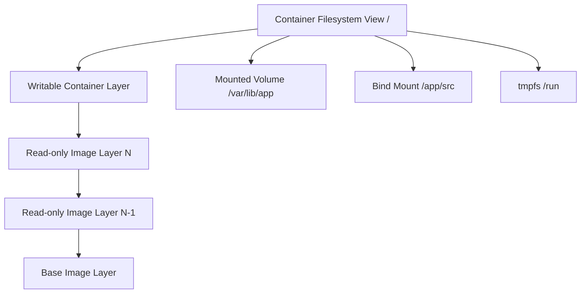
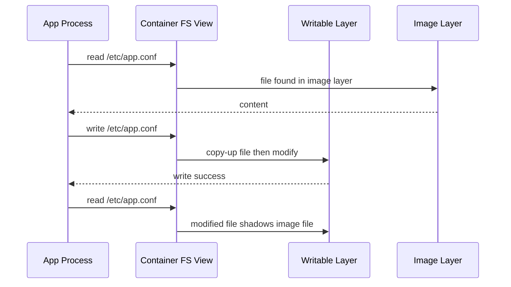
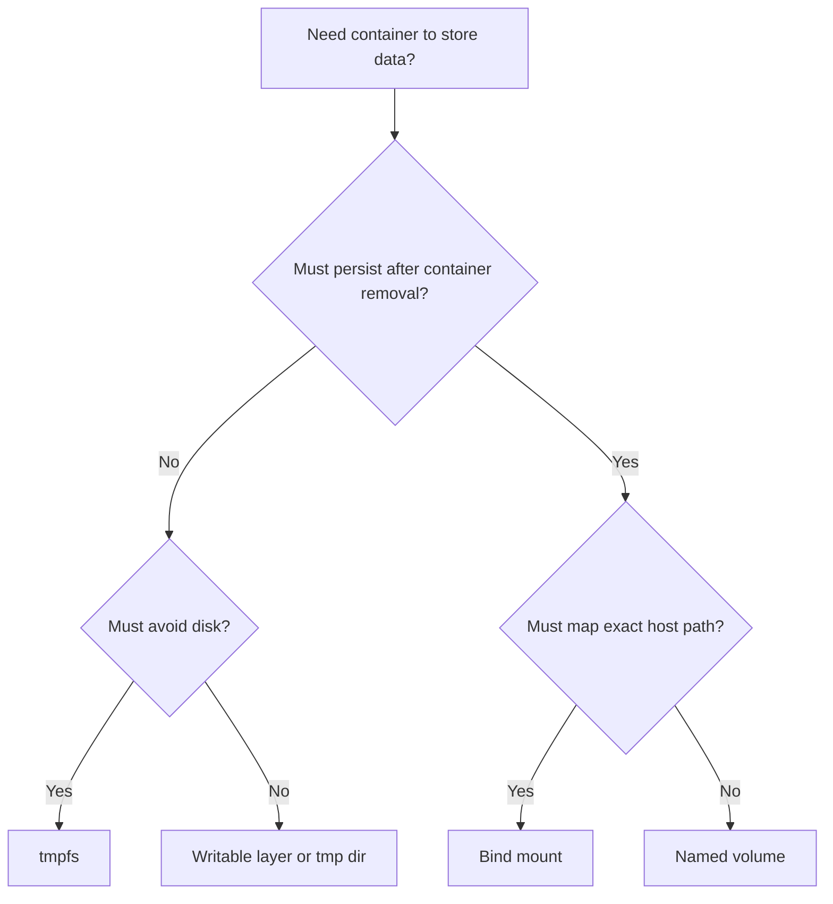
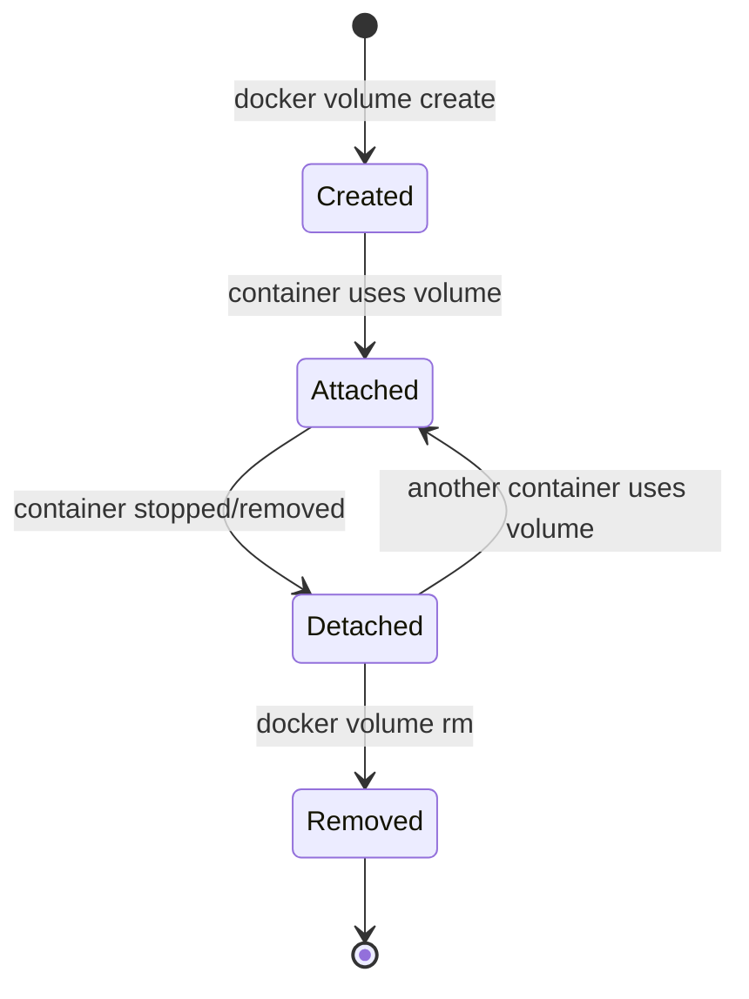

# Part 012 — Docker Storage: Volumes, Bind Mounts, tmpfs, Copy-on-Write, and Drivers

## 1. Tujuan Part Ini

Part sebelumnya membahas networking. Sekarang kita membahas boundary yang lebih berbahaya bila salah: **storage**.

Networking failure sering langsung terlihat: connection refused, timeout, DNS fail. Storage failure bisa lebih licik:

- data tampak tersimpan, lalu hilang saat container dihapus;
- file permission berubah dan service gagal start;
- bind mount menutupi file penting di image;
- secret/config ikut masuk image layer;
- database berjalan di writable layer yang tidak cocok;
- backup meng-copy data dalam kondisi tidak konsisten;
- volume anonymous menumpuk dan memenuhi disk;
- container menulis log/cache besar ke writable layer;
- dev environment berbeda jauh dari production karena bind mount host.

Target setelah part ini:

- memahami perbedaan image layer, writable layer, volume, bind mount, dan tmpfs;
- memahami copy-on-write secara praktis;
- bisa memilih storage mechanism berdasarkan data contract;
- bisa mendesain volume untuk database, queue, cache, upload, dan test fixture;
- bisa mengelola permission UID/GID antara host dan container;
- bisa backup/restore volume dengan aman;
- bisa menghindari data loss akibat `docker rm`, `compose down -v`, anonymous volume, dan mount shadowing;
- bisa memahami storage driver/snapshotter pada level mental model;
- bisa membuat checklist stateful container yang layak production.

Inti part ini: **container filesystem bersifat layered dan ephemeral kecuali kita mendefinisikan persistence boundary secara eksplisit.**

---

## 2. Kaufman Deconstruction: Subskill Storage

Pecah Docker storage menjadi subskill berikut:

| Subskill | Pertanyaan yang Harus Bisa Dijawab | Bukti Penguasaan |
|---|---|---|
| Layer model | Apa beda image layer dan writable layer? | Bisa memprediksi file mana hilang saat container dihapus |
| Mount selection | Kapan pakai volume, bind mount, tmpfs? | Bisa memilih berdasarkan lifecycle/security/performance |
| Permission mapping | UID/GID siapa yang menulis file? | Bisa menyelesaikan permission error tanpa `chmod 777` |
| Persistence design | Data mana persistent, ephemeral, rebuildable? | Bisa membuat storage contract per directory |
| Backup/restore | Bagaimana backup data konsisten? | Bisa backup volume tanpa corrupt DB |
| Compose storage | Bagaimana named volume dan bind mount dideklarasikan? | Bisa membuat dev/test/prod storage profile |
| Cleanup | Apa yang dihapus oleh `down`, `down -v`, `rm`, `prune`? | Tidak menghapus data penting secara tidak sengaja |
| Failure modeling | Bagaimana disk full, inode full, permission, mount shadowing terjadi? | Bisa debug dan prevent |

---

## 3. Mental Model: Container Filesystem adalah Layered View

Container filesystem terlihat seperti satu filesystem normal, tetapi sebenarnya gabungan dari:

1. read-only image layers;
2. writable container layer;
3. mounts tambahan: volume, bind, tmpfs.

Diagram:



Konsekuensi:

- file dari image bisa dibaca container;
- perubahan file tanpa mount masuk writable layer;
- writable layer terkait lifecycle container;
- volume/bind/tmpfs dapat menimpa path di filesystem view;
- data penting tidak boleh bergantung pada writable layer;
- mount bisa menyembunyikan file yang sudah ada di image.

---

## 4. Image Layer vs Writable Layer

Saat image dibuat, tiap instruksi tertentu menghasilkan layer read-only. Saat container dibuat dari image, Docker menambahkan writable layer di atasnya.

Contoh:

```dockerfile
FROM alpine:3.20
RUN echo "from image" > /message.txt
CMD ["sh", "-c", "cat /message.txt && sleep 3600"]
```

Run:

```bash
 docker build -t storage-demo .
 docker run -d --name demo storage-demo
 docker exec demo sh -c 'echo "changed in container" > /message.txt'
 docker exec demo cat /message.txt
 docker rm -f demo
 docker run --rm storage-demo cat /message.txt
```

Hasil mental:

- perubahan `/message.txt` terjadi di writable layer container `demo`;
- setelah container dihapus, writable layer hilang;
- image tetap memiliki `/message.txt` versi awal.

Rule:

> Image is template. Container writable layer is runtime scratchpad. Volume/bind mount is explicit persistence boundary.

---

## 5. Copy-on-Write Practical Model

Copy-on-write berarti file dari lower image layer tidak langsung diubah. Ketika container menulis perubahan pada file itu, Docker membuat salinan ke writable layer lalu perubahan terjadi di sana.

Diagram:



Practical effects:

- modifying many files from image can be expensive;
- package install at runtime bloats writable layer;
- logs/cache in writable layer can fill Docker disk;
- deleting a large file from lower layer does not necessarily shrink image/container storage the way people expect;
- storage driver/snapshotter details affect performance.

Anti-pattern:

```bash
 docker exec api apt-get update && apt-get install -y vim
```

Why bad:

- not reproducible;
- lost when container replaced;
- bloats writable layer;
- bypasses image governance;
- makes debugging environment different from deploy artifact.

---

## 6. Docker Storage Mechanisms

Docker has three main ways to mount data into containers:

| Mechanism | Managed By | Persistence | Coupling to Host Path | Typical Use |
|---|---|---|---|---|
| Writable layer | Docker/container lifecycle | Removed with container | None | Temporary runtime changes only |
| Named volume | Docker | Persists beyond container | Low | DB data, app data, durable local state |
| Bind mount | Host filesystem | Persists on host | High | Source code, config files, dev artifacts |
| tmpfs | Host memory | Ephemeral | None/path only | Secrets at runtime, sockets, temp files |

Decision tree:



General rule:

- use **named volumes** for persistent application data managed by Docker;
- use **bind mounts** for development source code/config or explicit host integration;
- use **tmpfs** for ephemeral in-memory data;
- avoid storing important data in writable layer.

---

## 7. Volumes

Volume adalah storage object yang dikelola Docker.

Create/list/inspect:

```bash
 docker volume create pgdata
 docker volume ls
 docker volume inspect pgdata
```

Use:

```bash
 docker run -d --name db \
   -e POSTGRES_PASSWORD=example \
   -v pgdata:/var/lib/postgresql/data \
   postgres:16
```

More explicit `--mount`:

```bash
 docker run -d --name db \
   -e POSTGRES_PASSWORD=example \
   --mount type=volume,src=pgdata,dst=/var/lib/postgresql/data \
   postgres:16
```

### 7.1 Named Volume Lifecycle



Important:

- removing container does not remove named volume by default;
- `docker compose down` does not remove named volumes by default;
- `docker compose down -v` removes volumes declared by the Compose project;
- `docker volume prune` removes unused volumes;
- anonymous volumes are easier to orphan.

### 7.2 Volume for Database

Compose:

```yaml
services:
  db:
    image: postgres:16
    environment:
      POSTGRES_PASSWORD: example
    volumes:
      - pgdata:/var/lib/postgresql/data

volumes:
  pgdata:
```

Why volume:

- data survives container recreation;
- host path is abstracted;
- Docker manages location;
- easier for local dev and single-host deployment;
- portable across team machines compared with absolute bind path.

### 7.3 Volume Naming Strategy

Bad:

```yaml
volumes:
  data:
```

Better:

```yaml
volumes:
  postgres_data:
  redis_data:
  uploads_data:
```

For production-like host:

```yaml
volumes:
  case_mgmt_postgres_data:
    labels:
      app: case-management
      data-classification: persistent
```

Labeling matters for cleanup and audit.

---

## 8. Bind Mounts

Bind mount maps a host file/directory into container.

```bash
 docker run --rm \
   --mount type=bind,src="$PWD",dst=/workspace \
   alpine ls /workspace
```

Short syntax:

```bash
 docker run --rm -v "$PWD:/workspace" alpine ls /workspace
```

Use cases:

- source code hot reload;
- local config file injection;
- test fixture sharing;
- build artifact export;
- host logs/debugging;
- integration with host tools.

### 8.1 Bind Mount Coupling

Bind mount couples container to host:

- path must exist or be created depending syntax;
- host OS path semantics matter;
- file permissions are host permissions;
- case sensitivity can differ across OS;
- line endings can differ;
- Docker Desktop file sharing has VM boundary/performance nuance;
- host directory layout becomes part of runtime contract.

This is fine for development. It is dangerous if accidental in production.

### 8.2 Mount Shadowing

If you mount over a path that already contains files in image, those files are hidden.

Image:

```dockerfile
COPY config/default.yaml /app/config/default.yaml
```

Run:

```bash
 docker run -v "$PWD/config:/app/config" my-api
```

If host `./config` does not contain `default.yaml`, then `/app/config/default.yaml` from image is obscured.

Failure symptom:

```text
FileNotFoundError: /app/config/default.yaml
```

But the file exists in the image. It is hidden by the bind mount.

Diagram:

```mermaid
flowchart TD
    A[Image contains /app/config/default.yaml] --> B[Container starts]
    C[Bind mount host ./config to /app/config] --> B
    B --> D[/app/config view comes from host]
    D --> E[Image config files hidden]
```

### 8.3 Read-only Bind Mounts

Prefer read-only for config/test input:

```bash
 docker run --rm \
   --mount type=bind,src="$PWD/config",dst=/app/config,readonly \
   my-api
```

Compose:

```yaml
services:
  api:
    volumes:
      - type: bind
        source: ./config
        target: /app/config
        read_only: true
```

Security rule:

> A writable bind mount gives the container write access to host files at that path. Treat it as host integration, not harmless convenience.

### 8.4 Bind Mounting Docker Socket

Common but dangerous:

```yaml
volumes:
  - /var/run/docker.sock:/var/run/docker.sock
```

This effectively gives the container control over Docker daemon. Since Docker daemon controls containers and mounts, this can become host-level power.

Use only for trusted infrastructure components and with explicit risk acceptance.

---

## 9. tmpfs Mounts

tmpfs stores data in host memory and does not persist to disk.

```bash
 docker run --rm \
   --mount type=tmpfs,dst=/run/app \
   my-api
```

Use cases:

- runtime sockets;
- temporary credentials;
- scratch files that should not persist;
- high-churn temporary data;
- apps expecting writable `/run` or `/tmp` while root filesystem is read-only.

Compose:

```yaml
services:
  api:
    image: my-api
    tmpfs:
      - /run/app
      - /tmp
```

Important:

- tmpfs consumes memory;
- data disappears when container stops;
- not a replacement for durable storage;
- apply size limit if needed.

Example with read-only root FS:

```yaml
services:
  api:
    image: my-api
    read_only: true
    tmpfs:
      - /tmp
      - /run
    volumes:
      - app_data:/var/lib/app

volumes:
  app_data:
```

This creates a clear contract:

- root filesystem immutable;
- `/tmp` and `/run` ephemeral;
- `/var/lib/app` persistent.

---

## 10. Storage Contract per Directory

Production-grade containers should document writable paths.

Example API service:

| Path | Data Type | Storage | Lifecycle | Backup Needed? |
|---|---|---|---|---|
| `/app` | application code | image | immutable | no |
| `/app/config` | config | image/config/bind RO | deployment lifecycle | maybe versioned elsewhere |
| `/tmp` | temp | tmpfs | container lifecycle | no |
| `/run` | sockets/pids | tmpfs | container lifecycle | no |
| `/var/log/app` | logs | stdout preferred | external log pipeline | no local backup |
| `/var/lib/app/uploads` | user files | volume/external storage | persistent | yes |

Example DB service:

| Path | Data Type | Storage | Lifecycle | Backup Needed? |
|---|---|---|---|---|
| `/var/lib/postgresql/data` | database files | named/external volume | persistent | yes |
| `/docker-entrypoint-initdb.d` | init scripts | bind RO/image | init only | versioned |
| `/tmp` | temp | tmpfs/writable | ephemeral | no |

This is the difference between “it runs” and “it is operable”.

---

## 11. Permissions and UID/GID

A common failure:

```text
permission denied: /var/lib/app
```

Root cause usually:

- process in container runs as UID 10001;
- mounted directory on host owned by different UID;
- volume initialized with root ownership;
- image changed `USER` but did not prepare writable paths;
- bind mount from macOS/Windows behaves differently from Linux;
- database image expects specific owner.

### 11.1 UID/GID are Numbers

Linux permissions are based on numeric UID/GID. Names are just mappings.

Inside container:

```bash
 id
 ls -ln /var/lib/app
```

On host:

```bash
 ls -ln ./data
```

If container user is UID 10001, host directory may need to be writable by UID 10001.

### 11.2 Avoid `chmod 777`

Bad:

```bash
 chmod -R 777 data
```

Better:

```bash
 sudo chown -R 10001:10001 data
 chmod -R u+rwX,g-rwx,o-rwx data
```

Or use Docker-managed named volume initialized by image entrypoint when appropriate.

### 11.3 Prepare Writable Paths in Image

```dockerfile
RUN addgroup --system app && adduser --system --ingroup app app \
    && mkdir -p /var/lib/app /tmp/app \
    && chown -R app:app /var/lib/app /tmp/app
USER app
```

But note: bind mount or volume mounted later can replace ownership. Image preparation does not automatically fix mounted storage.

### 11.4 Volume Initialization Behavior

Some official images initialize data directory when empty. For example database images often initialize `/var/lib/...` if volume is empty. Understand image-specific entrypoint behavior; do not assume every image fixes permission.

---

## 12. Backup and Restore

### 12.1 Backup Named Volume with Helper Container

For generic file volume:

```bash
 docker run --rm \
   -v app_data:/data:ro \
   -v "$PWD/backups:/backup" \
   alpine tar czf /backup/app_data.tar.gz -C /data .
```

Restore:

```bash
 docker run --rm \
   -v app_data:/data \
   -v "$PWD/backups:/backup:ro" \
   alpine sh -c 'cd /data && tar xzf /backup/app_data.tar.gz'
```

### 12.2 Database Backup Must Be Consistent

Do not blindly `tar` live database files unless database-specific backup procedure supports it.

For PostgreSQL logical backup:

```bash
 docker exec db pg_dump -U postgres app > app.sql
```

For full cluster or physical backup, use database-native backup tooling and consistency rules.

Rule:

> Filesystem backup captures bytes. Database backup must capture a consistent database state.

### 12.3 Backup Contract

For each persistent volume, define:

- owner service;
- data classification;
- RPO;
- RTO;
- backup method;
- restore test frequency;
- retention;
- encryption;
- off-host copy location;
- restore runbook.

A volume without restore test is not really backed up.

---

## 13. Compose Storage Model

Compose short syntax:

```yaml
services:
  api:
    volumes:
      - ./src:/app/src
      - app_cache:/app/cache

volumes:
  app_cache:
```

Compose long syntax:

```yaml
services:
  api:
    volumes:
      - type: bind
        source: ./src
        target: /app/src
        read_only: true
      - type: volume
        source: app_cache
        target: /app/cache
      - type: tmpfs
        target: /tmp

volumes:
  app_cache:
```

Prefer long syntax for serious files because intent is explicit.

### 13.1 Dev Override Pattern

Base `compose.yaml`:

```yaml
services:
  api:
    image: my-api:${APP_VERSION:-dev}
    read_only: true
    tmpfs:
      - /tmp
    volumes:
      - api_data:/var/lib/api

volumes:
  api_data:
```

Development `compose.override.yaml`:

```yaml
services:
  api:
    build: .
    read_only: false
    volumes:
      - ./src:/app/src
      - ./config/dev.yaml:/app/config/dev.yaml:ro
```

Principle:

- base file models runtime contract;
- override file adds development convenience;
- production should not accidentally inherit dev bind mounts.

### 13.2 Test Fixture Pattern

```yaml
services:
  tests:
    build: .
    volumes:
      - type: bind
        source: ./test-fixtures
        target: /fixtures
        read_only: true
      - type: tmpfs
        target: /tmp
```

Fixtures read-only, outputs explicit.

---

## 14. Stateful Containers: Design Rules

A stateful container is not wrong. An unclear state boundary is wrong.

### 14.1 Good Stateful Container Contract

A good stateful design defines:

- exact persistent paths;
- exact ephemeral paths;
- owner UID/GID;
- backup method;
- restore method;
- migration/upgrade path;
- disk capacity alert;
- fsync/durability expectations;
- single-writer or multi-writer rule;
- placement constraints if multi-host.

### 14.2 Database on Docker Single Host

Fine for:

- local development;
- CI integration test;
- small single-host internal tools;
- controlled environments with backup and monitoring.

Risky for:

- unclear backup;
- local volume on ephemeral VM;
- multi-host failover expectation without storage architecture;
- high write workloads without IO design;
- Swarm service rescheduled to another node while volume is local.

The container is not the problem. The persistence architecture is the problem.

### 14.3 Cache vs Durable State

Redis can be either cache or durable-ish store depending configuration.

If cache:

```yaml
volumes: []
```

If durable queue/session/state:

```yaml
volumes:
  - redis_data:/data
```

Same software, different data contract.

---

## 15. Storage Driver and Snapshotter Mental Model

Docker stores images and container writable layers using storage drivers or snapshotters depending Engine configuration/version.

You do not need to become kernel filesystem expert for daily use, but you must understand the role:

- store image layers;
- present merged filesystem view;
- implement copy-on-write;
- manage writable layer;
- affect performance and disk usage;
- interact with backing filesystem.

Check:

```bash
 docker info | grep -i "Storage Driver"
 docker system df
```

Common practical points:

- `overlay2` has historically been common on Linux;
- newer Docker Engine versions may use containerd image store/snapshotter paths depending installation/configuration;
- Docker Desktop adds VM disk abstraction;
- do not manually edit `/var/lib/docker`;
- moving Docker data-root requires controlled daemon config and migration;
- disk pressure in Docker data-root can break builds and runtime.

### 15.1 Docker Disk Usage

```bash
 docker system df
 docker system df -v
```

Outputs include:

- images;
- containers;
- local volumes;
- build cache.

Clean carefully:

```bash
 docker builder prune
 docker image prune
 docker container prune
 docker volume prune
 docker system prune
```

Danger:

```bash
 docker system prune --volumes
```

This can remove unused volumes. “Unused” means no container currently references them, not “unimportant”.

---

## 16. Disk Full and Inode Full Failure Modes

Storage incident categories:

### 16.1 Docker Data Root Full

Symptoms:

- build fails with no space left;
- container cannot start;
- logs cannot write;
- DB errors;
- image pull fails;
- host unstable.

Check:

```bash
 df -h
 docker system df -v
 du -sh /var/lib/docker/* 2>/dev/null
```

### 16.2 Inode Exhaustion

Many tiny files can exhaust inodes before bytes.

```bash
 df -i
```

Common causes:

- package caches;
- build cache;
- test artifacts;
- node_modules bind/volume churn;
- application temp files.

### 16.3 Log Growth

If app writes large logs to file inside container writable layer, disk grows.

Prefer stdout/stderr and log rotation configuration.

Check container log size:

```bash
 ls -lh /var/lib/docker/containers/*/*-json.log 2>/dev/null
```

Configure logging driver/rotation at daemon or service level where appropriate.

---

## 17. Mount Propagation and Advanced Host Integration

Most app teams do not need mount propagation. But platform engineers may see it in:

- Docker-in-Docker-like workflows;
- Kubernetes node agents;
- storage plugins;
- nested mount scenarios;
- backup tools;
- filesystem watchers.

Bind mount propagation controls whether mounts created under a bind mount are propagated between host and container.

Default usually works for normal apps. If a tool requires `rshared`/`rslave`, treat it as infrastructure-level decision and review security implications.

---

## 18. Security Considerations

### 18.1 Writable Host Mounts

Writable bind mount can alter host files.

Dangerous examples:

```yaml
volumes:
  - /:/host
  - /etc:/host-etc
  - /var/run/docker.sock:/var/run/docker.sock
```

These are not normal app mounts. They grant strong host access.

### 18.2 Secrets in Image Layers

Bad:

```dockerfile
COPY .env /app/.env
RUN export TOKEN=secret && npm install
```

Even if deleted later, secret may remain in build context, layer history, cache, or logs.

Use BuildKit secrets for build-time secret and runtime secret mechanisms for runtime.

### 18.3 Read-only Root Filesystem

A strong runtime posture:

```yaml
services:
  api:
    image: my-api
    read_only: true
    tmpfs:
      - /tmp
      - /run
    volumes:
      - api_data:/var/lib/api
```

This forces writable paths to be explicit.

---

## 19. Anti-Patterns

### 19.1 Data in Writable Layer

Bad:

```bash
 docker run -d --name db postgres:16
```

Without volume, DB files are in container writable layer. Removing container can remove data.

Better:

```bash
 docker run -d --name db \
   -v pgdata:/var/lib/postgresql/data \
   postgres:16
```

### 19.2 Anonymous Volumes Without Tracking

Some images declare `VOLUME`. If no named volume is provided, Docker may create anonymous volume.

Problem:

- data persists but name is random;
- cleanup/audit harder;
- multiple recreated containers create multiple orphan volumes.

Prefer named volumes in Compose.

### 19.3 Bind Mounting Source Over Built Artifact in Production

Bad:

```yaml
services:
  api:
    image: my-api:1.0
    volumes:
      - ./src:/app/src
```

This makes runtime dependent on host checkout and bypasses immutable artifact model.

### 19.4 `chmod 777` as Permission Strategy

Bad because it hides ownership design and expands write access.

Fix UID/GID and path ownership deliberately.

### 19.5 Backing Up Live DB Files Blindly

Bad because backup may be inconsistent.

Use database-native backup or filesystem snapshot with correct freeze/consistency procedure.

### 19.6 `docker compose down -v` in Shared Environment

Danger: removes volumes for the project.

Use only when you intend to delete persistent state.

---

## 20. Practice Lab

### Lab 1 — Writable Layer Disappears

```bash
 docker run -d --name wl alpine sleep 3600
 docker exec wl sh -c 'echo hello > /data.txt'
 docker exec wl cat /data.txt
 docker rm -f wl
 docker run --rm alpine sh -c 'ls /data.txt || true'
```

Explain why file disappeared.

### Lab 2 — Named Volume Persists

```bash
 docker volume create lab_data
 docker run --rm -v lab_data:/data alpine sh -c 'echo hello > /data/message.txt'
 docker run --rm -v lab_data:/data alpine cat /data/message.txt
```

Inspect:

```bash
 docker volume inspect lab_data
```

Questions:

- Who manages volume path?
- Does volume survive container removal?

### Lab 3 — Bind Mount Host Directory

```bash
 mkdir -p /tmp/docker-bind-lab
 echo host-file > /tmp/docker-bind-lab/message.txt
 docker run --rm \
   --mount type=bind,src=/tmp/docker-bind-lab,dst=/data \
   alpine cat /data/message.txt
```

Write from container:

```bash
 docker run --rm \
   --mount type=bind,src=/tmp/docker-bind-lab,dst=/data \
   alpine sh -c 'echo written-by-container > /data/out.txt'
 cat /tmp/docker-bind-lab/out.txt
```

Now repeat read-only:

```bash
 docker run --rm \
   --mount type=bind,src=/tmp/docker-bind-lab,dst=/data,readonly \
   alpine sh -c 'echo fail > /data/should-not-write.txt'
```

### Lab 4 — Mount Shadowing

Create Dockerfile:

```dockerfile
FROM alpine
RUN mkdir -p /app/config && echo image-default > /app/config/default.txt
CMD ["cat", "/app/config/default.txt"]
```

Build and run:

```bash
 docker build -t shadow-demo .
 docker run --rm shadow-demo
```

Now mount empty config:

```bash
 mkdir -p /tmp/empty-config
 docker run --rm -v /tmp/empty-config:/app/config shadow-demo
```

Explain why it fails.

### Lab 5 — tmpfs

```bash
 docker run --rm \
   --mount type=tmpfs,dst=/scratch \
   alpine sh -c 'echo secret > /scratch/file && cat /scratch/file'
```

Data disappears when container exits. Discuss use cases.

### Lab 6 — Backup and Restore Volume

```bash
 docker volume create backup_lab
 docker run --rm -v backup_lab:/data alpine sh -c 'echo important > /data/file.txt'
 mkdir -p /tmp/backup-lab
 docker run --rm \
   -v backup_lab:/data:ro \
   -v /tmp/backup-lab:/backup \
   alpine tar czf /backup/backup_lab.tar.gz -C /data .

 docker volume create restore_lab
 docker run --rm \
   -v restore_lab:/data \
   -v /tmp/backup-lab:/backup:ro \
   alpine sh -c 'cd /data && tar xzf /backup/backup_lab.tar.gz'
 docker run --rm -v restore_lab:/data alpine cat /data/file.txt
```

Cleanup:

```bash
 docker volume rm lab_data backup_lab restore_lab || true
 docker image rm shadow-demo || true
 rm -rf /tmp/docker-bind-lab /tmp/empty-config /tmp/backup-lab
```

---

## 21. Storage Review Checklist

For every containerized service:

- What paths are writable?
- Which writable paths are persistent?
- Which paths are ephemeral?
- Are persistent paths volumes or external storage?
- Are dev bind mounts excluded from production?
- Are config bind mounts read-only?
- Is the root filesystem able to run read-only?
- What UID/GID owns mounted paths?
- Are any host-sensitive paths mounted?
- Is Docker socket mounted? Why?
- Are secrets copied into image or writable layer?
- Is backup method defined?
- Has restore been tested?
- Are volumes named and labeled?
- Is cleanup command safe for current environment?
- Are logs written to stdout/stderr rather than unbounded file in writable layer?
- Is disk/inode usage monitored?

---

## 22. Decision Matrix

| Requirement | Recommended Mechanism | Reason |
|---|---|---|
| Database data local single-host | Named volume | Persistent, Docker-managed |
| Source hot reload | Bind mount | Direct host edit visibility |
| Static config file from repo | Bind mount read-only or image COPY | Explicit and reviewable |
| Runtime temp files | tmpfs or writable `/tmp` | Ephemeral |
| Sensitive temp material | tmpfs | Avoid disk persistence |
| User uploads | Volume or external object storage | Must persist and backup |
| Cache rebuildable | Named volume or writable layer depending cost | Persistence optional |
| CI test fixtures | Bind mount read-only | Deterministic test input |
| Production immutable app code | Image only | Reproducible artifact |
| Host-level agent | Bind mount selected host paths | Explicit host integration |

---

## 23. Key Takeaways

- Container writable layer is not durable application storage.
- Volumes are the default choice for Docker-managed persistent data.
- Bind mounts are powerful but couple container to host filesystem and can create security risk.
- tmpfs is ideal for ephemeral in-memory data and read-only-root-filesystem support.
- Mounting over a path hides image content at that path.
- UID/GID mismatches are normal; fix ownership deliberately, not with `chmod 777`.
- Backup and restore are part of the storage contract, not operational afterthoughts.
- `docker compose down -v` and `docker volume prune` can destroy data if used casually.
- Stateful containers are acceptable only when persistence, backup, placement, and recovery are explicit.
- Storage design should be reviewed with the same seriousness as API and database schema design.

---

## 24. Transisi ke Part 013

Part ini membahas storage boundary. Part berikutnya akan menggabungkan beberapa boundary host yang sering tersembunyi tetapi berpengaruh besar:

- users and groups;
- file permissions;
- time and timezone;
- DNS resolver;
- `/etc/hosts`;
- kernel parameters;
- devices;
- Docker socket;
- host leakage.

Kita akan membahas bagaimana container tetap portable tanpa pura-pura terlepas total dari host.
