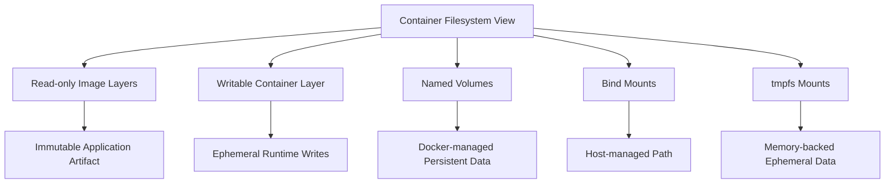
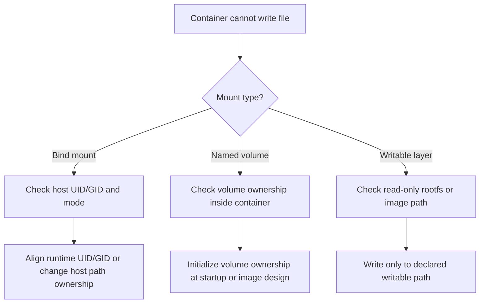
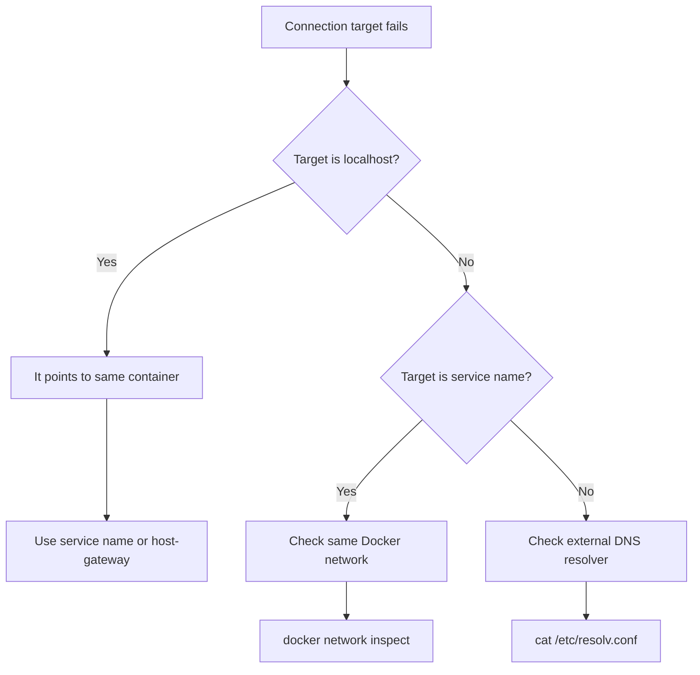
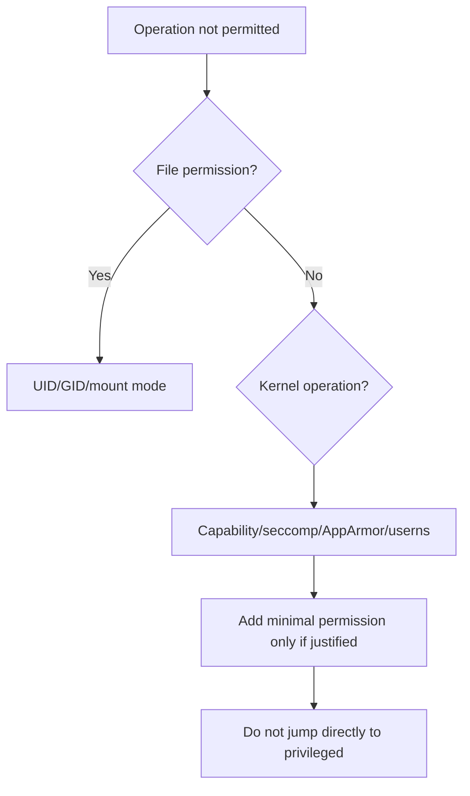

# Part 013 — Host Boundary Engineering: Files, Users, Time, DNS, Kernel, and Devices

Container mastery is mostly boundary mastery.

A container looks isolated, but it is not a small computer floating independently from the host. It is a constrained process tree that borrows the host kernel, host scheduler, host storage, host network plumbing, host DNS resolver path, host clock, host device model, and sometimes host files. This is the reason Docker is powerful. It is also the reason many production incidents happen at the boundary.

This part focuses on the boundary between a container and its host.

We will not treat the host as an invisible implementation detail. We will model it explicitly.

## 1. Learning Objective

After this part, we want to be able to answer these questions confidently:

1. Why does a file created by a container sometimes appear as `root:root` on the host?
2. Why does a non-root container still fail to write to a bind mount?
3. Why does `localhost` inside a container not mean the host?
4. Why can DNS behave differently between the default bridge and a user-defined bridge?
5. Why is mounting `/var/run/docker.sock` almost equivalent to giving host control?
6. Why does `--privileged` collapse multiple boundaries at once?
7. Why is a container's timezone sometimes wrong while the kernel clock is correct?
8. Why can a container see or modify host files when bind mounts are used carelessly?
9. Why are device mounts and kernel capabilities not just operational options but security decisions?
10. How should we design a container contract so the host boundary is explicit, reviewable, and repeatable?

The deeper goal is not command memorization. The deeper goal is to develop an instinct for when a container is crossing a boundary.

## 2. Kaufman Skill Deconstruction

Josh Kaufman's learning approach starts by decomposing a skill into smaller subskills, then practicing the most important subskills first. For host boundary engineering, the critical subskills are:

| Subskill | What to Learn | Why It Matters |
|---|---|---|
| Identity mapping | `USER`, UID/GID, host file ownership, user namespace remapping, rootless mode | Prevents permission bugs and privilege confusion |
| Filesystem crossing | bind mounts, volumes, tmpfs, read-only mounts, socket mounts | Most host compromise paths start with unsafe mounts |
| Time boundary | kernel clock, timezone files, app-level timezone | Prevents audit, schedule, and test failures |
| DNS boundary | `/etc/resolv.conf`, embedded DNS, `--dns`, `extra_hosts`, `host-gateway` | Prevents environment-specific connectivity bugs |
| Kernel boundary | syscalls, capabilities, seccomp, AppArmor/SELinux | Defines what the containerized process can actually ask the kernel to do |
| Device boundary | `/dev/*`, GPUs, block devices, serial ports, CDI-style device access | Required for some workloads but easy to overgrant |
| Daemon boundary | Docker socket, remote daemon, Docker group | One of the most misunderstood privilege boundaries |
| Operational review | turn boundary assumptions into checklists | Makes container usage defensible in teams |

The first 20 hours of practice for this topic should not be spent reading every flag in `docker run`. It should be spent reproducing boundary failures, explaining them, then designing safer defaults.

## 3. Mental Model: A Container Is a Process Contract, Not a Machine Contract

A strong mental model:

> A container is a process contract executed through host-controlled kernel mechanisms.

It has several boundary dimensions:

```mermaid
flowchart TD
    A[Containerized Process Tree] --> B[Host Kernel]
    A --> C[Filesystem View]
    A --> D[Network Namespace]
    A --> E[Identity Mapping]
    A --> F[Resource Controls]
    A --> G[Device Access]
    A --> H[Daemon/API Access]

    C --> C1[Image Layers]
    C --> C2[Writable Layer]
    C --> C3[Volumes]
    C --> C4[Bind Mounts]
    C --> C5[tmpfs]

    E --> E1[Container UID/GID]
    E --> E2[Host UID/GID]
    E --> E3[User Namespace]

    D --> D1[Bridge]
    D --> D2[Host]
    D --> D3[Custom Network DNS]
    D --> D4[/etc/resolv.conf]

    H --> H1[/var/run/docker.sock]
    H --> H2[Remote API]
    H --> H3[Docker Group]
```

A container does not own these boundaries independently. Docker creates and configures them, but the host enforces them.

This leads to an important invariant:

> If a container can reach a host resource through a mount, device, socket, capability, or network route, the host boundary has been intentionally or accidentally widened.

## 4. Boundary Inventory

Before debugging any host/container issue, list the boundary surfaces.

| Boundary | Common Docker Mechanism | Typical Risk | Typical Failure |
|---|---|---|---|
| File boundary | bind mount, volume, tmpfs | Host file mutation, secret leak | Permission denied, unexpected ownership |
| Identity boundary | `USER`, `--user`, userns-remap, rootless | Root confusion, privilege leak | App cannot write, app writes as host root |
| Network boundary | bridge, host, macvlan, published ports | Unintended exposure | Service reachable locally but not from peer |
| DNS boundary | embedded DNS, `/etc/resolv.conf`, `--dns`, `extra_hosts` | Environment drift | Works on one machine, fails in CI |
| Time boundary | host kernel clock, timezone config | Audit/order bugs | Cron/scheduler wrong local time |
| Kernel boundary | capabilities, seccomp, AppArmor, sysctls | Container escape surface | Operation not permitted |
| Device boundary | `--device`, `--privileged`, CDI devices | Hardware/host compromise | Missing GPU/serial/block device |
| Daemon boundary | Docker socket, Docker group, TCP API | Host control | Container can launch privileged sibling |

For serious engineering, every container should have a boundary contract.

Example boundary contract:

```yaml
service: billing-worker
identity:
  uid: 10001
  gid: 10001
filesystem:
  rootfs: read-only-capable
  writable_paths:
    - /tmp
    - /var/run/app
  persistent_paths:
    - /data via named volume
  forbidden_mounts:
    - /var/run/docker.sock
    - /etc
    - /var/lib/docker
network:
  inbound_ports:
    - none
  outbound_dependencies:
    - postgres:5432
    - kafka:9092
kernel:
  privileged: false
  capabilities:
    drop: [ALL]
    add: []
  devices: []
secrets:
  source: runtime secret provider
  not_allowed:
    - baked into image
    - committed in compose file
```

## 5. Identity Boundary: UID, GID, `USER`, Rootless, and User Namespace

### 5.1 The Basic Trap

Inside a container, `root` means UID `0` inside the container's user namespace. In the default/rootful case, this often maps directly to UID `0` on the host. That is why a process running as root inside the container can create host bind-mounted files owned by root.

Example:

```bash
mkdir -p ./data

docker run --rm \
  -v "$PWD/data:/data" \
  alpine sh -c 'id && touch /data/from-container && ls -ln /data'

ls -ln ./data
```

If the container runs as root, the resulting host file may be owned by UID `0`.

The problem is not that Docker is broken. The problem is that bind mounts expose host filesystem semantics to the container.

### 5.2 `USER` in Dockerfile

A production image should normally define an application user:

```dockerfile
FROM eclipse-temurin:21-jre

RUN groupadd --system --gid 10001 app \
 && useradd --system --uid 10001 --gid app --home-dir /app app

WORKDIR /app
COPY --chown=app:app target/app.jar /app/app.jar

USER 10001:10001
ENTRYPOINT ["java", "-jar", "/app/app.jar"]
```

Key detail:

`USER` changes the user that runs the process. It does not magically change host bind mount permissions.

If `/host/path` is owned by host UID `1000`, but the container process runs as UID `10001`, writing to the bind mount may fail.

### 5.3 `--user` at Runtime

Runtime override:

```bash
docker run --rm \
  --user "$(id -u):$(id -g)" \
  -v "$PWD/work:/work" \
  alpine sh -c 'id && touch /work/ok'
```

This is common for development tools that need to write files back to the working directory.

However, be careful with this pattern in production. Matching the host user's UID can make sense for local developer ergonomics, but a production service should usually use a stable, documented runtime identity.

### 5.4 Named Volumes vs Bind Mounts for Identity

Named volumes reduce host path coupling. Docker manages the volume location and lifecycle. Bind mounts directly couple the container to the host path, ownership, permission model, directory layout, and OS behavior.

Use bind mounts when the host path itself is part of the contract:

- source code during local development
- read-only config from a known host path
- integration with a host agent
- log collection path, if required by legacy infrastructure

Use named volumes when persistence is needed but host path coupling is not:

- database data in local development
- cache directory
- application generated state on single-host deployment

### 5.5 User Namespace Remapping

User namespace remapping changes the mapping between container UIDs and host UIDs. The idea is that UID `0` inside the container maps to a non-root subordinate UID on the host.

Conceptual example:

```text
container UID 0      -> host UID 231072
container UID 1      -> host UID 231073
container UID 10001  -> host UID 241073
```

This reduces the blast radius if a process escapes some part of the container boundary or writes through a mounted path. But it also changes file ownership behavior and can create compatibility issues with bind mounts.

### 5.6 Rootless Docker

Rootless Docker goes further by running the Docker daemon and containers as a non-root user. This reduces daemon/runtime privilege exposure but has operational trade-offs:

- some network modes may behave differently
- low port binding may need additional configuration
- storage drivers and cgroup features can differ by kernel/distribution
- device access is more constrained

Use rootless mode when the threat model prioritizes reducing root daemon exposure and the workload fits the constraints.

### 5.7 Identity Decision Matrix

| Scenario | Recommended Identity Pattern | Reason |
|---|---|---|
| Production app service | Fixed non-root UID/GID in image | Repeatable, auditable, least privilege |
| Local dev tool writing generated files | `--user $(id -u):$(id -g)` or Compose `user:` | Prevents root-owned files on developer machine |
| Security-sensitive multi-tenant host | rootless Docker or userns-remap | Reduces root mapping risk |
| Container needs package install at startup | Reconsider design | Runtime mutation usually indicates weak image design |
| Container needs host device | explicit `--device` with least permission | Avoid `--privileged` as default |

## 6. Filesystem Boundary: Image Layers, Writable Layer, Volumes, Bind Mounts, tmpfs

### 6.1 Filesystem Layers Are Not Equal

A container filesystem has multiple sources:



Each layer has a different operational meaning.

| Source | Lifecycle | Ownership | Best For | Avoid For |
|---|---|---|---|---|
| Image layer | immutable | image builder | app binaries, static assets | runtime state |
| Writable layer | container lifecycle | Docker | temporary accidental writes | important data |
| Named volume | independent from container | Docker-managed | persistent app data | source code dev loops needing host editing |
| Bind mount | host lifecycle | host-managed | source code, host integrations | opaque production state |
| tmpfs | memory-backed, ephemeral | host memory | secrets/temp files | durable data |

### 6.2 Bind Mounts Are Boundary Expansions

Bind mounts are powerful because they directly project a host path into the container.

That means:

- a process in the container can mutate host files if the mount is writable
- host path layout becomes part of the container's runtime contract
- the application becomes less portable
- CI, Linux, macOS, and Windows can behave differently
- host file ownership and permissions become application concerns

Use read-only bind mounts when possible:

```bash
docker run --rm \
  --mount type=bind,source="$PWD/config",target=/etc/app,readonly \
  my-app:local
```

Compose:

```yaml
services:
  app:
    image: my-app:local
    volumes:
      - type: bind
        source: ./config
        target: /etc/app
        read_only: true
```

### 6.3 The Docker Socket Is a Special Bind Mount

This is one of the most important host boundary rules:

> Mounting the Docker socket into a container gives the container a path to control Docker Engine.

Example dangerous pattern:

```yaml
services:
  ci-agent:
    image: some-agent
    volumes:
      - /var/run/docker.sock:/var/run/docker.sock
```

Why dangerous?

A process with access to the Docker socket may be able to ask the Docker daemon to create containers, mount host paths, run privileged workloads, inspect secrets, or interact with other containers. The socket is not just a file. It is an API control channel.

Safer alternatives depend on the use case:

| Use Case | Safer Direction |
|---|---|
| CI building images | remote builder, rootless builder, BuildKit daemon with limited access, isolated runner |
| Local Docker UI/extension | explicit trust boundary, least exposed socket, Docker Desktop ECI where available |
| App wants container metadata | expose only required metadata through a sidecar/proxy, not full Docker socket |
| Need Docker-in-Docker | isolate runner VM, rootless dind where viable, short-lived environment |

### 6.4 Read-Only Root Filesystem

A mature container can often run with a read-only root filesystem:

```bash
docker run --rm \
  --read-only \
  --tmpfs /tmp \
  --tmpfs /var/run \
  my-app:prod
```

Compose approximation:

```yaml
services:
  app:
    image: my-app:prod
    read_only: true
    tmpfs:
      - /tmp
      - /var/run
```

This surfaces hidden runtime mutation. If the app tries to write to `/app`, `/usr`, `/etc`, or another unexpected path, it fails quickly.

A good production image has an explicit writable path contract:

```text
Writable:
- /tmp
- /var/run/app
- /data if stateful

Read-only:
- /app
- /usr
- /etc except injected config path if needed
```

### 6.5 File Boundary Failure Modes

| Symptom | Likely Cause | First Check | Durable Fix |
|---|---|---|---|
| `Permission denied` writing bind mount | container UID lacks host write permission | `id`, `ls -ln` inside and outside | align UID/GID or use named volume |
| host files become `root:root` | container ran as root | `docker inspect .Config.User` | run as non-root or dev `--user` |
| app works locally but fails in CI | bind path missing/different | `docker inspect .Mounts` | use declared volume or CI setup step |
| config ignored | mount target masks image files | inspect mount target | mount single file or separate config directory |
| secrets appear in image | copied at build time | `docker history`, build context | runtime secret injection |
| database data disappears | stored in writable layer | `docker inspect .Mounts` | named volume or external DB |

## 7. Time Boundary: Kernel Clock vs Timezone

Containers use the host kernel clock. They do not normally run an independent kernel clock.

But timezone representation is not the same as kernel time.

You can have:

- correct UTC time
- wrong local timezone
- missing timezone database
- application-level timezone mismatch
- scheduler interpreting dates incorrectly

### 7.1 Prefer UTC Internally

For backend services, prefer UTC for:

- logs
- event timestamps
- database storage
- audit trail
- message metadata
- distributed tracing

Local timezone should be a display or business-rule concern, not a hidden container dependency.

### 7.2 Timezone Configuration Patterns

Pattern 1: application-level timezone:

```bash
JAVA_TOOL_OPTIONS="-Duser.timezone=UTC"
TZ=UTC
```

Pattern 2: include timezone package if application truly needs local zone database:

```dockerfile
RUN apt-get update \
 && apt-get install -y --no-install-recommends tzdata \
 && rm -rf /var/lib/apt/lists/*
ENV TZ=UTC
```

Pattern 3: avoid mounting host timezone files blindly unless the host contract is explicit.

Common but coupling-heavy pattern:

```yaml
volumes:
  - /etc/localtime:/etc/localtime:ro
  - /etc/timezone:/etc/timezone:ro
```

This may be acceptable for tightly controlled single-host environments, but it reduces portability.

### 7.3 Time Boundary Checklist

- Are logs emitted in UTC?
- Does the app parse external business dates with explicit zone rules?
- Does the image include timezone data if it needs it?
- Are tests independent from developer machine timezone?
- Does audit logging store both instant and business-zone context where required?
- Is `TZ` only used as an application contract, not as a hidden host dependency?

## 8. DNS Boundary: `/etc/resolv.conf`, Embedded DNS, `extra_hosts`, and `host-gateway`

DNS failures are often misdiagnosed as application failures.

Docker has multiple DNS behaviors depending on network type.

### 8.1 Default Bridge vs User-Defined Bridge

On the default bridge, containers have more limited name-based discovery. On user-created bridge networks, Docker provides DNS resolution between containers using container names.

That is why this is better:

```bash
docker network create app-net

docker run -d --name postgres --network app-net postgres:16

docker run --rm --network app-net alpine getent hosts postgres
```

than relying on IPs or default bridge behavior.

Compose creates a project network by default, so service names become discoverable:

```yaml
services:
  api:
    build: .
    depends_on:
      - postgres
  postgres:
    image: postgres:16
```

Inside `api`, the database host should be `postgres`, not `localhost`.

### 8.2 The `localhost` Trap

Inside a container:

```text
localhost == this container's own network namespace
```

It does not mean:

```text
localhost == the Docker host
```

This mistake causes many local development bugs.

Wrong:

```yaml
DATABASE_URL: jdbc:postgresql://localhost:5432/app
```

Correct when Postgres is another Compose service:

```yaml
DATABASE_URL: jdbc:postgresql://postgres:5432/app
```

Correct when connecting from a container to a service running on the host:

```yaml
extra_hosts:
  - "host.docker.internal:host-gateway"
environment:
  CALLBACK_URL: http://host.docker.internal:8080/callback
```

### 8.3 `/etc/resolv.conf` and Embedded DNS

Linux containers have `/etc/resolv.conf`. Depending on the network, Docker may copy host resolver configuration or use Docker's embedded DNS server for custom networks. On Docker custom networks, the embedded DNS server is commonly visible as `127.0.0.11` inside the container.

Useful checks:

```bash
docker exec app cat /etc/resolv.conf
docker exec app getent hosts postgres
docker exec app nslookup postgres || true
docker exec app cat /etc/hosts
```

Prefer `getent hosts` over assuming `nslookup` exists or behaves exactly like application resolver logic.

### 8.4 Custom DNS in Compose

Compose supports DNS-related service fields:

```yaml
services:
  app:
    image: my-app
    dns:
      - 8.8.8.8
      - 9.9.9.9
    dns_search:
      - internal.example.com
    dns_opt:
      - use-vc
```

Use this sparingly. Custom DNS settings are part of the environment contract and can create drift between laptop, CI, and production.

### 8.5 DNS Failure Modes

| Symptom | Likely Cause | Check | Fix |
|---|---|---|---|
| `localhost` connection refused | app points to itself, not dependency | env vars | use service name or host gateway |
| service name not resolved | not on same user-defined network | `docker network inspect` | attach to same network |
| works in Compose, fails with `docker run` | Compose creates DNS-capable network | compare networks | create explicit network |
| external DNS fails | host resolver/proxy issue | `/etc/resolv.conf` | configure Docker daemon/DNS/proxy |
| intermittent DNS issue | stale dependency assumptions | app retry logs | add retries, use health/readiness gates |

## 9. Kernel Boundary: Capabilities, Seccomp, AppArmor/SELinux, Sysctls

Containers share the host kernel. Docker restricts what container processes can do by combining kernel features and runtime configuration.

Important controls:

- namespaces
- cgroups
- Linux capabilities
- seccomp profile
- AppArmor/SELinux profile
- read-only mounts and masked paths
- user namespace mapping
- `no-new-privileges`

### 9.1 Capabilities

Linux capabilities split root privileges into smaller units.

Instead of giving a container broad root power, Docker can add/drop capabilities.

Hardening pattern:

```bash
docker run --rm \
  --cap-drop=ALL \
  --security-opt no-new-privileges:true \
  my-app:prod
```

If the app needs a specific capability, add only that capability:

```bash
docker run --rm \
  --cap-drop=ALL \
  --cap-add=NET_BIND_SERVICE \
  my-app:prod
```

But always ask: can the app avoid that need?

For example, instead of granting low-port bind capability, run the app on port `8080` inside the container and publish host port `80` externally through a reverse proxy or port mapping.

### 9.2 Seccomp

Seccomp filters system calls. Docker's default seccomp profile blocks a set of system calls while keeping broad compatibility.

If you see:

```text
Operation not permitted
```

or application features involving low-level kernel operations fail, it may be capability, seccomp, AppArmor, or user namespace related.

Do not immediately use `--privileged`. Debug which kernel permission is missing.

### 9.3 AppArmor and SELinux

On supported hosts, AppArmor or SELinux adds another mandatory access control layer.

This can affect:

- file access
- mount behavior
- ptrace/debugging
- device use
- network operations

A container may fail on one Linux distribution and work on another because host-level LSM policy differs.

### 9.4 Sysctls

Some sysctls are namespaced and can be set per container. Others affect the host and should not be changed from a container.

Compose example:

```yaml
services:
  app:
    image: my-app
    sysctls:
      net.ipv4.tcp_keepalive_time: "600"
```

Treat sysctls as platform policy. Do not let every service invent its own kernel tuning without review.

### 9.5 Privileged Mode

`--privileged` is not a small permission tweak.

It broadens multiple boundaries at once:

- grants broad capabilities
- provides access to host devices
- loosens security profiles
- makes the container much closer to a host process from a privilege perspective

A good review question:

> What exact capability, device, mount, or sysctl is required, and why is the narrow version insufficient?

If the answer is unknown, `--privileged` is probably hiding missing understanding.

## 10. Device Boundary: `/dev`, GPUs, Serial Ports, Block Devices

Some workloads legitimately need devices:

- GPU workloads
- hardware integration
- serial ports
- USB devices
- FUSE
- block devices
- observability or security agents

Device access must be explicit.

Example:

```bash
docker run --rm \
  --device=/dev/ttyUSB0:/dev/ttyUSB0 \
  my-hardware-agent
```

Compose:

```yaml
services:
  hardware-agent:
    image: my-hardware-agent
    devices:
      - "/dev/ttyUSB0:/dev/ttyUSB0"
```

Avoid this unless absolutely required:

```bash
docker run --privileged my-agent
```

The difference is reviewability. An explicit device mapping can be audited. Privileged mode is broad and ambiguous.

### 10.1 Device Decision Questions

1. Which exact device is needed?
2. Is it read-only, write-only, or read-write?
3. Which container user needs access?
4. Is a group mapping required?
5. Does the host device path remain stable after reboot?
6. Does the container need a capability in addition to the device?
7. Can the device be accessed through a safer host-side agent instead?
8. Is the device exclusive or can multiple containers access it?
9. What is the blast radius if the container is compromised?

## 11. Docker Daemon Boundary: Docker Group, Socket, Remote API

Docker Engine is a privileged control plane.

A local Docker client usually talks to the Docker daemon through a Unix socket:

```text
/var/run/docker.sock
```

On Linux, users in the `docker` group can typically interact with that socket. That is operationally convenient but security-sensitive. Treat Docker group membership as a high-privilege role.

### 11.1 Socket Mount Risk Scenario

A container with socket access can ask the daemon to create another container that mounts the host root filesystem:

```bash
docker run --rm -it \
  -v /:/host \
  alpine sh
```

If a process inside a socket-mounted container can reach the daemon and the daemon is privileged on the host, the original container's apparent isolation is not the meaningful boundary anymore. The daemon is.

### 11.2 Remote Daemon Access

A remote Docker daemon should not be exposed casually over TCP. Use authenticated, encrypted access patterns such as SSH or TLS-protected daemon access where remote control is required.

Bad smell:

```text
tcp://0.0.0.0:2375
```

This is an unauthenticated control plane exposure pattern when not protected by external controls.

Better:

```bash
docker context create prod \
  --docker "host=ssh://ops@docker-host"
```

The details depend on the environment, but the invariant is stable:

> Docker daemon access is infrastructure control access, not ordinary application access.

## 12. Compose Host Boundary Patterns

### 12.1 Development-Friendly But Risky

```yaml
services:
  app:
    build: .
    volumes:
      - .:/workspace
    user: "${UID:-1000}:${GID:-1000}"
```

Good for local iteration. Not a production pattern.

Risks:

- host source tree is writable by the container
- secrets in project directory may become visible
- file watcher behavior differs across platforms
- UID/GID handling may differ across developer machines

### 12.2 Production-Oriented Boundary

```yaml
services:
  app:
    image: registry.example.com/billing-api@sha256:...
    user: "10001:10001"
    read_only: true
    tmpfs:
      - /tmp
      - /var/run/app
    cap_drop:
      - ALL
    security_opt:
      - no-new-privileges:true
    volumes:
      - type: volume
        source: app-data
        target: /data
    networks:
      - backend

volumes:
  app-data:

networks:
  backend:
```

This is not automatically perfect, but it is reviewable.

### 12.3 Host-Integrated Agent Pattern

Some agents need more access:

```yaml
services:
  node-exporter-like-agent:
    image: internal/node-agent
    user: "0:0"
    read_only: true
    pid: host
    volumes:
      - type: bind
        source: /proc
        target: /host/proc
        read_only: true
      - type: bind
        source: /sys
        target: /host/sys
        read_only: true
```

This pattern should be treated as a privileged infrastructure component, not as an ordinary application container.

## 13. Host Boundary Review Checklist

Use this checklist before approving a container or Compose service.

### Identity

- [ ] Does the container run as non-root by default?
- [ ] Is the UID/GID fixed and documented?
- [ ] Does it need root at runtime, or only during build?
- [ ] Are bind-mounted paths writable by the runtime UID/GID?
- [ ] Is user namespace remapping or rootless mode part of the platform baseline?

### Filesystem

- [ ] Are bind mounts necessary?
- [ ] Are bind mounts read-only unless writes are required?
- [ ] Are persistent writes going to named volumes or external storage?
- [ ] Is the root filesystem read-only-capable?
- [ ] Are writable paths explicitly listed?
- [ ] Are secrets excluded from image layers and source bind mounts?
- [ ] Is the Docker socket forbidden unless explicitly approved?

### Network and DNS

- [ ] Does the app use service names, not `localhost`, for peer containers?
- [ ] Are networks explicitly declared?
- [ ] Are published ports minimal?
- [ ] Are custom DNS settings necessary and documented?
- [ ] Is host access via `host.docker.internal`/`host-gateway` intentional?

### Kernel and Device

- [ ] Is `--privileged` absent?
- [ ] Are capabilities dropped by default?
- [ ] Are added capabilities justified individually?
- [ ] Are security options documented?
- [ ] Are device mounts explicit and minimal?
- [ ] Are sysctls approved as platform policy?

### Daemon

- [ ] Is Docker socket access absent?
- [ ] Is Docker group membership controlled?
- [ ] Is remote daemon access protected?
- [ ] Are CI/build agents isolated if they need Docker control?

## 14. Failure Modeling

### 14.1 Permission Failure



### 14.2 DNS Failure



### 14.3 Privilege Failure



## 15. Practice Lab

### Lab 1 — UID/GID Boundary

1. Create a directory on the host.
2. Run an Alpine container as root and create a file in the bind mount.
3. Inspect file ownership on the host.
4. Run the same container with `--user $(id -u):$(id -g)`.
5. Explain the ownership difference.

Expected learning:

- `USER` and host file ownership interact through numeric UID/GID.
- Names inside `/etc/passwd` matter less than numeric identity at the filesystem boundary.

### Lab 2 — Read-Only Root Filesystem

1. Run an app container with `--read-only`.
2. Observe which writes fail.
3. Add `--tmpfs /tmp`.
4. Move application runtime files to an explicit writable directory.
5. Document the writable path contract.

Expected learning:

- Many images accidentally rely on mutable root filesystems.
- Production hardening requires making write paths explicit.

### Lab 3 — DNS and `localhost`

1. Create a Compose file with `api` and `postgres`.
2. Configure `api` incorrectly with `localhost`.
3. Observe connection failure.
4. Change host to `postgres`.
5. Inspect `/etc/resolv.conf` and service name resolution.

Expected learning:

- `localhost` is namespaced.
- Compose service names are the correct dependency identity inside the Compose network.

### Lab 4 — Docker Socket Risk

1. Start a container with the Docker socket mounted in a disposable VM only.
2. From inside, list host containers through the socket.
3. Explain why this breaks the expected isolation model.
4. Design a safer alternative for the original use case.

Expected learning:

- The Docker socket is control-plane access.
- Socket mounting must be treated as privileged infrastructure behavior.

### Lab 5 — Device vs Privileged

1. Identify a harmless device or use a test environment.
2. Try explicit `--device` mapping.
3. Compare with `--privileged`.
4. Write down what permissions each grants conceptually.

Expected learning:

- Explicit device access is reviewable.
- `--privileged` is broad and should not be the default answer.

## 16. Engineering Heuristics

1. **Prefer image immutability over host mutation.** Runtime writes should be explicit.
2. **Prefer named volumes over bind mounts for managed persistence.** Bind mounts are host contracts.
3. **Prefer service names over IP addresses.** IPs are runtime details.
4. **Prefer non-root UIDs.** Root inside a container is still a risk boundary.
5. **Prefer read-only root filesystem.** It reveals hidden mutation.
6. **Prefer explicit device mappings over privileged mode.** Review the specific need.
7. **Prefer minimal capabilities.** Add only what is justified.
8. **Prefer rootless/user namespace where compatible.** Reduce daemon/runtime privilege blast radius.
9. **Never mount Docker socket by habit.** Treat it as platform control access.
10. **Document every host crossing.** Hidden boundary crossings become incidents.

## 17. Anti-Patterns

### Anti-Pattern: `chmod 777` the Host Directory

This hides identity design failures and broadens access unnecessarily.

Better:

- choose a stable container UID/GID
- align host directory ownership
- use a named volume
- initialize volume ownership safely

### Anti-Pattern: `--privileged` for Permission Problems

This hides whether the issue is file permission, capability, seccomp, device, or LSM policy.

Better:

- reproduce the failure
- identify the missing permission class
- add the narrowest permission
- document the rationale

### Anti-Pattern: Mounting Project Root into Every Container

Useful for development, dangerous as a default.

Problems:

- secrets in source tree become visible
- build artifacts pollute host
- file watchers behave inconsistently
- dependency directories can mask image content

Better:

- mount only required paths
- use named volumes for dependency caches
- use `.dockerignore`
- separate development Compose from production Compose

### Anti-Pattern: Application Depends on Host Timezone

Better:

- use UTC internally
- configure business timezone explicitly
- test date logic with fixed zones

### Anti-Pattern: Docker Socket Sidecar Without Threat Model

Better:

- use constrained API proxy
- isolate runner VM
- rootless builder
- remote build service
- short-lived CI environment

## 18. Summary

Host boundary engineering is about making the invisible visible.

A container crosses into the host through identity, files, DNS, network, devices, kernel permissions, and daemon access. Each crossing can be valid. Each crossing also increases coupling and risk.

A top-level engineer does not ask only, “Does the container run?”

They ask:

- What host resources can it reach?
- Which user is it running as?
- Which files can it mutate?
- Which network identities does it depend on?
- Which kernel capabilities does it need?
- Which devices can it access?
- Can it control Docker itself?
- Is this boundary explicit enough for review, incident response, and future migration?

If the boundary is implicit, the system is not fully understood.

## References

- Docker Docs — Bind mounts: https://docs.docker.com/engine/storage/bind-mounts/
- Docker Docs — Volumes: https://docs.docker.com/engine/storage/volumes/
- Docker Docs — Docker Engine security: https://docs.docker.com/engine/security/
- Docker Docs — Rootless mode: https://docs.docker.com/engine/security/rootless/
- Docker Docs — Isolate containers with a user namespace: https://docs.docker.com/engine/security/userns-remap/
- Docker Docs — Protect the Docker daemon socket: https://docs.docker.com/engine/security/protect-access/
- Docker Docs — Networking overview: https://docs.docker.com/engine/network/
- Docker Docs — Compose file services reference: https://docs.docker.com/reference/compose-file/services/
- Docker Docs — `docker container run`: https://docs.docker.com/reference/cli/docker/container/run/
- Docker Docs — `dockerd` host gateway configuration: https://docs.docker.com/reference/cli/dockerd/
