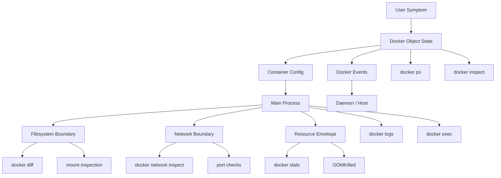
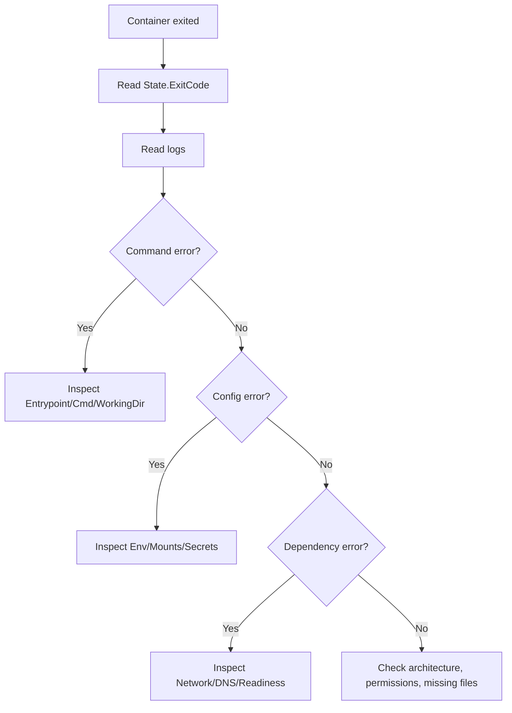
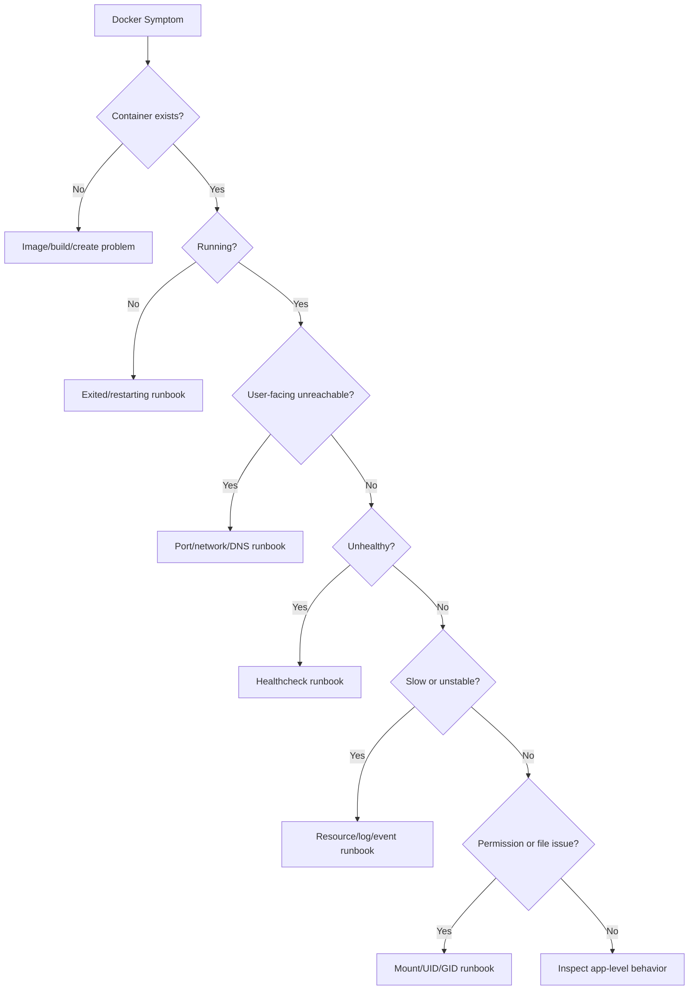
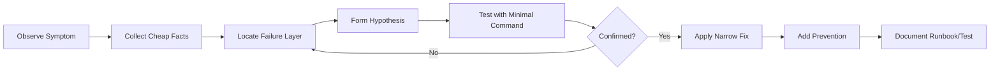

# Part 014 — Debugging Containers Like a Systems Engineer

Debugging containers is not about memorizing more commands.

It is about building a repeatable evidence path from symptom to boundary to root cause.

Many Docker debugging sessions fail because the engineer jumps directly into the container and starts poking around. That sometimes works, but it often creates noise. A better approach is to first locate the failure layer:

1. Is the image wrong?
2. Is the container configuration wrong?
3. Is the process failing?
4. Is the filesystem boundary wrong?
5. Is the network boundary wrong?
6. Is DNS wrong?
7. Is the host resource envelope wrong?
8. Is Docker daemon state wrong?
9. Is the assumption about lifecycle wrong?

This part gives a systems-debugging method for Docker.

## 1. Learning Objective

After this part, we want to be able to:

1. Debug a container without randomly trying flags.
2. Read `docker inspect` as a runtime contract.
3. Use logs, events, stats, and exit codes as evidence.
4. Distinguish image failure from container configuration failure.
5. Debug minimal images that do not contain shells or network tools.
6. Diagnose permission, DNS, port, mount, healthcheck, signal, and OOM failures.
7. Build reusable runbooks for common Docker incidents.
8. Avoid unsafe debugging practices that mutate production containers.

## 2. Kaufman Skill Deconstruction

The debugging skill decomposes into smaller subskills:

| Subskill | Practice Target | Feedback Signal |
|---|---|---|
| Container state reading | `ps`, `inspect`, lifecycle status, exit code | Can explain what Docker thinks exists |
| Process debugging | `logs`, `exec`, `top`, PID 1, signals | Can explain what the main process did |
| Filesystem debugging | mounts, ownership, `diff`, `cp`, read-only paths | Can explain what files are visible/mutable |
| Network debugging | ports, networks, DNS, routes | Can explain who can reach whom |
| Resource debugging | `stats`, OOM, CPU throttling, disk pressure | Can explain resource-induced failures |
| Daemon debugging | `events`, daemon logs, Docker Desktop diagnose | Can explain infrastructure-level symptoms |
| Minimal image debugging | sidecar/debug toolbox, `docker debug`, debug variants | Can debug without polluting prod image |
| Runbook writing | symptom -> evidence -> cause -> fix | Can help teammates repeat the reasoning |

## 3. Debugging Mental Model: Evidence Layers

A container incident is usually visible at multiple layers.



Do not start at the deepest layer. Start with the cheapest facts.

A good order:

1. `docker ps -a`
2. `docker inspect <container>`
3. `docker logs <container>`
4. `docker events --since ...`
5. `docker stats` if running
6. `docker exec` or `docker debug` if process is running or image needs inspection
7. network/mount/volume inspect
8. daemon logs if Docker itself behaves unexpectedly

## 4. First Principle: Separate Desired State, Actual State, and Observed Symptom

Every debugging session should separate three things:

| Layer | Question | Example |
|---|---|---|
| Desired state | What did we ask Docker to run? | image, command, env, mounts, ports, user |
| Actual Docker state | What did Docker create/start/stop? | created, running, exited, health status |
| Observed symptom | What did user/app see? | HTTP 502, connection refused, permission denied |

Example:

```text
Symptom: API returns 502 from reverse proxy.
Desired state: app should listen on 8080 inside container.
Actual Docker state: container running but healthcheck unhealthy.
Process evidence: app logs say failed to connect to database at localhost:5432.
Root cause: dependency host should be postgres, not localhost.
```

Without this separation, teams often fix the proxy when the root cause is database configuration.

## 5. Command Map: What Each Tool Answers

| Command | Primary Question | Notes |
|---|---|---|
| `docker ps -a` | What containers exist and in what state? | First command for lifecycle issues |
| `docker inspect` | What exact config and runtime metadata exist? | Truth source for mounts, env, network, state |
| `docker logs` | What did the container write to stdout/stderr? | Depends on logging driver availability |
| `docker events` | What did Docker observe over time? | Useful for restarts, kills, OOM, health events |
| `docker exec` | Can we run a command inside a running container? | Requires process/container to be running |
| `docker debug` | Can we debug a slim image/container without built-in tools? | Useful for minimal production images |
| `docker stats` | What resources are being used now? | CPU, memory, network IO, block IO |
| `docker top` | What processes are running? | Quick process tree signal |
| `docker port` | How are ports published? | Validates host-to-container mapping |
| `docker network inspect` | Which containers are attached to a network? | DNS/connectivity debugging |
| `docker volume inspect` | Where/how is a volume managed? | Persistence and data debugging |
| `docker diff` | What changed in writable layer? | Finds unexpected runtime mutation |
| `docker cp` | Extract files for inspection | Useful when container exited |
| `docker system df` | What consumes Docker disk? | Cleanup/capacity debugging |

## 6. `docker inspect` as Runtime Contract

`docker inspect` is not just verbose JSON. It is the realized runtime contract.

```bash
docker inspect app | jq '.[0] | {
  Id,
  Name,
  State,
  Config: {
    Image: .Config.Image,
    User: .Config.User,
    Entrypoint: .Config.Entrypoint,
    Cmd: .Config.Cmd,
    Env: .Config.Env,
    WorkingDir: .Config.WorkingDir,
    Healthcheck: .Config.Healthcheck
  },
  HostConfig: {
    Binds: .HostConfig.Binds,
    Mounts: .Mounts,
    PortBindings: .HostConfig.PortBindings,
    NetworkMode: .HostConfig.NetworkMode,
    RestartPolicy: .HostConfig.RestartPolicy,
    Memory: .HostConfig.Memory,
    NanoCpus: .HostConfig.NanoCpus,
    CapAdd: .HostConfig.CapAdd,
    CapDrop: .HostConfig.CapDrop,
    Privileged: .HostConfig.Privileged
  },
  NetworkSettings
}'
```

Important fields:

| Field | Why It Matters |
|---|---|
| `.State.Status` | created, running, paused, restarting, exited, dead |
| `.State.ExitCode` | process termination clue |
| `.State.OOMKilled` | memory limit failure signal |
| `.State.Health` | healthcheck state and recent outputs |
| `.Config.Entrypoint` + `.Config.Cmd` | actual process contract |
| `.Config.User` | runtime identity |
| `.Config.Env` | environment contract; be careful with secrets |
| `.Mounts` | actual mounted paths |
| `.HostConfig.PortBindings` | host port publishing |
| `.NetworkSettings.Networks` | network attachment and IPs |
| `.HostConfig.RestartPolicy` | restart behavior |
| `.HostConfig.Privileged` | broad boundary expansion |
| `.HostConfig.CapAdd/CapDrop` | kernel capability contract |

A senior engineer should be able to look at `inspect` and say, “This container could never have worked because the process listens on port 8080 but only port 8081 is published,” or “The app is running as UID 10001 but the bind mount is host-owned by UID 1000 with mode 700.”

## 7. Logs: Useful, but Not Complete

`docker logs` fetches logs captured from the container's stdout/stderr stream for logging drivers that support it.

Basic usage:

```bash
docker logs app

docker logs --tail=100 app

docker logs -f app

docker logs --since=30m app

docker logs --timestamps app
```

Important constraints:

- logs show what the process emitted, not everything Docker knows
- some logging drivers change retrieval behavior
- logs may contain secrets if the app logs environment/config carelessly
- logs may not exist if the process fails before emitting output
- logs do not prove a port is listening or dependency is reachable

Use logs as one evidence stream, not the entire debugging model.

## 8. Events: Debugging Time and Lifecycle

`docker events` gives real-time events from the Docker daemon.

Examples:

```bash
docker events --since 30m

docker events \
  --filter container=app \
  --since 1h

docker events \
  --filter type=container \
  --filter event=die \
  --since 2h
```

Events help answer:

- Did Docker restart the container?
- Did it die repeatedly?
- Was it killed?
- Did the health status change?
- Did a network connect/disconnect happen?
- Did a volume or image operation happen around the incident?

Example interpretation:

```text
2026-07-01T10:00:03 container start app
2026-07-01T10:00:05 container health_status: unhealthy app
2026-07-01T10:00:07 container die app exitCode=1
2026-07-01T10:00:08 container restart app
```

This points to a startup/restart loop, not necessarily a network outage.

## 9. Exec vs Debug vs Recreate

### 9.1 `docker exec`

`docker exec` runs a new command in a running container.

```bash
docker exec -it app sh

docker exec app id

docker exec app ps aux

docker exec app cat /etc/resolv.conf
```

Limitations:

- the container must be running
- the image must contain the command you want to run
- slim/distroless images may not include a shell
- mutating a running container can invalidate evidence

### 9.2 `docker debug`

Modern Docker provides `docker debug` to enter or inspect containers/images even when the image itself does not include common debugging tools. This is important because production images should be small and secure, not packed with shells, package managers, and troubleshooting utilities.

Typical intent:

```bash
docker debug app
```

Use it to inspect:

- process state
- network settings
- mounted files
- filesystem content
- runtime assumptions

The key engineering idea:

> Do not bloat production images just to make debugging convenient. Attach debugging capability when needed through controlled tooling.

### 9.3 Recreate for Clean Evidence

Sometimes the safest debug step is not to mutate the running container but to create a comparable one:

```bash
docker run --rm -it \
  --entrypoint sh \
  my-app:prod
```

or inspect the image:

```bash
docker image inspect my-app:prod
```

For crashed containers, preserve evidence before cleanup:

```bash
docker ps -a

docker logs crashed-app

docker inspect crashed-app > crashed-app.inspect.json

docker cp crashed-app:/app/logs ./extracted-logs || true
```

## 10. Debugging Runbook: Container Exits Immediately

Symptom:

```bash
docker run my-app
# container exits immediately
```

Evidence path:

```bash
docker ps -a --no-trunc

docker logs <container>

docker inspect <container> | jq '.[0].State'

docker inspect <container> | jq '.[0].Config.Entrypoint, .[0].Config.Cmd, .[0].Config.Env'
```

Common causes:

| Cause | Evidence | Fix |
|---|---|---|
| wrong command/entrypoint | `exec: not found`, exit 127 | fix Dockerfile `ENTRYPOINT`/`CMD` |
| missing executable permission | permission denied | `chmod +x` at build time, correct copy mode |
| app config missing | logs mention missing env/config | inject required config properly |
| dependency unavailable | connection refused/name not resolved | fix dependency host/readiness/retry |
| app runs foreground incorrectly | main process exits | run actual long-lived process |
| architecture mismatch | exec format error | build correct platform |
| file path wrong | no such file | correct `WORKDIR`, copy path, command |

Decision tree:



## 11. Debugging Runbook: Container Is Running but App Is Unreachable

Symptom:

```text
curl localhost:8080 fails
```

Evidence path:

```bash
docker ps

docker port app

docker inspect app | jq '.[0].NetworkSettings.Ports'

docker exec app ss -ltnp || docker exec app netstat -ltnp || true

docker logs --tail=100 app
```

Common causes:

| Cause | Evidence | Fix |
|---|---|---|
| port not published | `docker port` empty | add `-p host:container` or Compose `ports` |
| app listens on wrong port | process listens on 8081 not 8080 | align app config and port mapping |
| app binds to `127.0.0.1` inside container | only loopback listener | bind to `0.0.0.0` inside container |
| host firewall blocks port | container port mapping exists | fix host firewall/security group |
| wrong protocol | HTTP vs HTTPS/TCP | test correct protocol |
| reverse proxy target wrong | proxy logs 502 | use service name and correct internal port |

Important principle:

> Publishing a port maps host traffic to a container port. It does not force the application inside the container to listen on that port or on the correct interface.

Wrong app behavior:

```text
Listening on 127.0.0.1:8080
```

Better container behavior:

```text
Listening on 0.0.0.0:8080
```

## 12. Debugging Runbook: Compose Service Cannot Reach Another Service

Symptom:

```text
api cannot connect to postgres
```

Evidence path:

```bash
docker compose ps

docker compose logs api postgres

docker compose exec api cat /etc/resolv.conf

docker compose exec api getent hosts postgres

docker compose exec api sh -c 'nc -vz postgres 5432' || true

docker network ls

docker network inspect <project>_default
```

Common causes:

| Cause | Evidence | Fix |
|---|---|---|
| using `localhost` | env shows `localhost:5432` | use `postgres:5432` |
| service not on same network | network inspect missing peer | attach services to same network |
| database not ready | DNS resolves but connection fails | healthcheck/retry/backoff |
| wrong exposed port | using host-published port internally | use container port inside network |
| wrong credentials/db name | auth errors | fix env/secrets |
| dependency crashed | `compose ps` shows exited | debug dependency first |

Internal Compose connectivity should use service names and container ports.

Do not do this inside Compose:

```yaml
DATABASE_URL: postgres://localhost:5432/app
```

Use:

```yaml
DATABASE_URL: postgres://postgres:5432/app
```

## 13. Debugging Runbook: Permission Denied on Mounted Path

Symptom:

```text
Permission denied: /data/file
```

Evidence path:

```bash
docker inspect app | jq '.[0].Config.User, .[0].Mounts'

docker exec app id

docker exec app ls -lna /data

ls -lna ./data
```

Common causes:

| Cause | Evidence | Fix |
|---|---|---|
| container UID cannot write host dir | numeric UID mismatch | align ownership or runtime user |
| bind mount read-only | inspect shows RW false | make writable only if safe |
| rootfs read-only | write outside allowed path fails | write to declared tmpfs/volume |
| named volume initialized as root | volume content root-owned | initialization/chown strategy |
| AppArmor/SELinux denial | host audit logs | correct label/profile/policy |

Do not fix blindly with:

```bash
chmod -R 777 data
```

A better fix is to understand the numeric identity contract.

## 14. Debugging Runbook: Healthcheck Is Failing

Symptom:

```bash
docker ps
# STATUS: Up 2 minutes (unhealthy)
```

Evidence path:

```bash
docker inspect app | jq '.[0].State.Health'

docker logs --tail=100 app

docker exec app sh -c '<healthcheck-command>'
```

Common causes:

| Cause | Evidence | Fix |
|---|---|---|
| command missing | health log says executable not found | use available binary or app endpoint |
| endpoint too strict | app works but health fails | separate liveness/readiness semantics |
| startup takes longer | fails early then recovers | add start period / interval tuning |
| dependency included in liveness | unhealthy during dependency blip | don't confuse liveness with readiness |
| wrong port/path | 404/connection refused | align healthcheck command |

Healthcheck design matters. A healthcheck is not just a command; it is a lifecycle signal consumed by humans and orchestrators.

Bad healthcheck:

```dockerfile
HEALTHCHECK CMD curl -f http://localhost:8080/full-dependency-check || exit 1
```

Better liveness-oriented healthcheck:

```dockerfile
HEALTHCHECK --interval=30s --timeout=3s --start-period=20s --retries=3 \
  CMD wget -qO- http://localhost:8080/health/live || exit 1
```

Readiness often belongs at the orchestrator/reverse proxy layer or in application startup logic, depending on platform.

## 15. Debugging Runbook: OOMKilled or Memory Pressure

Symptom:

```bash
docker inspect app | jq '.[0].State.OOMKilled'
# true
```

Evidence path:

```bash
docker inspect app | jq '.[0].State'

docker inspect app | jq '.[0].HostConfig.Memory, .[0].HostConfig.MemorySwap'

docker stats app

docker logs --tail=200 app
```

Common causes:

| Cause | Evidence | Fix |
|---|---|---|
| memory limit too low | OOMKilled true | set realistic limit |
| JVM/Go/runtime unaware of limit | heap too large | configure runtime memory behavior |
| memory leak | increasing RSS over time | fix app, add profiling |
| bursty workload | spikes before death | queue/backpressure/concurrency limit |
| page cache/IO pressure | system-level pressure | capacity planning |

For Java containers, do not only set Docker memory limit. Make sure JVM ergonomics are understood. Modern JVMs are container-aware, but application-specific heap, direct memory, metaspace, thread stacks, native buffers, and off-heap caches still need a memory budget.

Example memory budget:

```text
Container limit: 1024 MiB
JVM heap:        512 MiB
Metaspace:       128 MiB
Direct/native:   128 MiB
Thread stacks:    64 MiB
OS/libs/headroom:192 MiB
```

## 16. Debugging Runbook: CPU Throttling and Slow App

Symptom:

```text
app works but latency is high under load
```

Evidence path:

```bash
docker stats app

docker inspect app | jq '.[0].HostConfig.NanoCpus, .[0].HostConfig.CpuQuota, .[0].HostConfig.CpuPeriod, .[0].HostConfig.CpuShares'
```

Host-level checks may be needed:

```bash
cat /sys/fs/cgroup/*/cpu.stat 2>/dev/null || true
```

Common causes:

| Cause | Evidence | Fix |
|---|---|---|
| CPU quota too low | high CPU %, throttling | increase quota or reduce concurrency |
| too many app threads | context switching, latency | tune thread pools |
| noisy neighbor | host saturation | isolate workload/capacity |
| build tasks in same host | CPU spikes | separate build/runtime capacity |
| app blocks on IO | CPU low, latency high | debug network/storage dependency |

Do not confuse CPU limit with CPU reservation. A container can be throttled even though the application logic is correct.

## 17. Debugging Runbook: Image Builds but Runtime File Missing

Symptom:

```text
No such file or directory: /app/app.jar
```

Evidence path:

```bash
docker image inspect my-app

docker run --rm --entrypoint sh my-app -c 'ls -lna /app || true'

docker history my-app

docker build --no-cache --progress=plain .
```

Common causes:

| Cause | Evidence | Fix |
|---|---|---|
| wrong `COPY` path | build logs | fix build context/path |
| `.dockerignore` excluded file | file absent in context | update `.dockerignore` |
| multi-stage wrong source | `COPY --from` wrong | correct stage alias/path |
| mount masks image content | app exists in image but not container | inspect mounts |
| architecture mismatch | exec format error | build correct platform |

Important boundary:

> A file can exist in the image but disappear in the running container if a mount overlays the target path.

Example:

```yaml
services:
  app:
    image: my-app
    volumes:
      - ./empty-dir:/app
```

This hides `/app` from the image with the host directory.

## 18. Debugging Runbook: Minimal Image Has No Shell

Symptom:

```bash
docker exec -it app sh
# executable file not found
```

This is not a bad image. It may be a good production image.

Options:

1. Use `docker debug`.
2. Run a separate debug container on the same network.
3. Use a development/debug image variant.
4. Recreate with an alternate entrypoint only if the image has necessary tools.
5. Inspect artifacts using `docker cp` or image export techniques.

Example sidecar network debug:

```bash
docker run --rm -it \
  --network container:app \
  nicolaka/netshoot
```

Use third-party debug images carefully. In restricted environments, maintain an internal approved debug toolbox image.

## 19. Debugging Network Namespaces

For advanced Linux debugging, the key concept is namespace sharing.

Debug from a helper container sharing the target's network namespace:

```bash
docker run --rm -it \
  --network container:app \
  alpine sh
```

Inside helper:

```bash
ip addr
ip route
cat /etc/resolv.conf
wget -qO- http://127.0.0.1:8080/health || true
```

This helps when the target image lacks tools.

On a Linux host, `nsenter` can be used when you know the target process PID:

```bash
PID=$(docker inspect -f '{{.State.Pid}}' app)
sudo nsenter -t "$PID" -n ip addr
sudo nsenter -t "$PID" -n ip route
```

Use host-level namespace debugging carefully in production. It is powerful and can bypass some operational guardrails.

## 20. Debugging Filesystem Mutation

Find unexpected writes:

```bash
docker diff app
```

Output meanings:

```text
A = Added
C = Changed
D = Deleted
```

Example:

```text
C /etc/app/config.yml
A /tmp/cache.bin
A /app/generated.log
```

Interpretation:

- `/tmp/cache.bin` may be fine if `/tmp` is declared writable.
- `/app/generated.log` may indicate the app writes into the immutable application directory.
- `/etc/app/config.yml` changed at runtime may be dangerous unless explicitly designed.

Extract files:

```bash
docker cp app:/app/generated.log ./generated.log
```

Compare with expected image state:

```bash
docker run --rm --entrypoint sh my-app -c 'find /app -maxdepth 2 -type f -ls'
```

## 21. Debugging Docker Daemon and Desktop Issues

Sometimes the container is not the problem. Docker itself or Docker Desktop integration is.

Symptoms:

- Docker commands hang
- pulls fail despite internet working on host
- DNS works on host but not container
- volumes behave differently on macOS/Windows
- file sharing path not mounted
- WSL integration issue
- daemon restart disrupted containers

Evidence path:

```bash
docker version

docker info

docker system df

docker events --since 1h
```

On Linux hosts:

```bash
journalctl -u docker --since "1 hour ago"
```

Docker daemon debug logging can be enabled through `daemon.json`, but do not leave verbose debug logging on by default in production unless approved.

Docker Desktop has diagnostic tooling and logs accessible through its troubleshooting UI. For team environments, record the exact Desktop version, backend, OS version, and resource settings.

## 22. Debugging Compose as an Application Graph

Compose debugging is graph debugging.

Useful commands:

```bash
docker compose config

docker compose ps

docker compose logs -f --tail=100

docker compose events

docker compose top

docker compose exec api sh

docker compose down --remove-orphans
```

### 22.1 Render the Effective Config

Always inspect effective Compose config:

```bash
docker compose config
```

This catches:

- environment interpolation mistakes
- override file effects
- profile activation assumptions
- invalid indentation hidden by YAML anchors
- unexpected default network/volume names

### 22.2 Orphans and Project Names

Compose project names affect network, volume, and container names.

Symptoms of project-name confusion:

- old containers still running
- wrong network used
- app connects to stale database
- volume from previous run reused

Useful cleanup:

```bash
docker compose down --remove-orphans
```

For test isolation:

```bash
docker compose -p "test_${BUILD_ID}" up -d
```

Then cleanup:

```bash
docker compose -p "test_${BUILD_ID}" down -v --remove-orphans
```

## 23. Debugging Build Failures

Build failures often involve context, cache, platform, credentials, or multi-stage references.

Evidence path:

```bash
docker build --progress=plain .

docker build --no-cache --progress=plain .

docker buildx build --progress=plain --platform linux/amd64 .
```

Common causes:

| Cause | Evidence | Fix |
|---|---|---|
| missing file in context | `COPY failed` | check build context and `.dockerignore` |
| cache hides stale state | build succeeds unexpectedly | use `--no-cache` for diagnosis |
| wrong platform | exec format or package mismatch | set `--platform` intentionally |
| private dependency auth | 401/403 | use BuildKit secrets/SSH, not copied credentials |
| multi-stage alias wrong | missing from stage | name stages clearly |
| package repo transient issue | apt/apk timeout | retry strategy, mirror policy |

Do not put credentials into Dockerfile or build args as a lazy debug step. Use BuildKit secret/SSH mechanisms.

## 24. Debugging Decision Tree



The decision tree is intentionally boring. Good incident response is often boring because it follows evidence instead of drama.

## 25. Safe Debugging Rules

1. Preserve evidence before cleanup.
2. Avoid mutating production containers unless required for mitigation.
3. Do not install tools into a running production container as the default debugging method.
4. Prefer debug sidecar/toolbox patterns.
5. Export `inspect`, logs, events, and Compose config into incident artifacts.
6. Do not print secrets from environment variables into shared channels.
7. Use read-only inspection where possible.
8. Reproduce in disposable environment before changing platform policy.
9. Do not solve unknown permission issues with `--privileged`.
10. Convert repeated incidents into runbooks and tests.

## 26. Incident Artifact Template

When debugging a non-trivial Docker issue, collect a structured artifact:

```md
# Docker Incident Artifact

## Summary
- Symptom:
- First observed:
- Impact:
- Environment:

## Docker Version
```bash
docker version
docker info
```

## Container State
```bash
docker ps -a --no-trunc
docker inspect <container>
```

## Logs
```bash
docker logs --timestamps --tail=500 <container>
```

## Events
```bash
docker events --since <time> --until <time>
```

## Compose Effective Config
```bash
docker compose config
```

## Network Evidence
```bash
docker network inspect <network>
docker port <container>
```

## Mount/Volume Evidence
```bash
docker inspect <container> | jq '.[0].Mounts'
docker volume inspect <volume>
```

## Resource Evidence
```bash
docker stats --no-stream <container>
```

## Root Cause

## Fix

## Prevention
```

This makes debugging reviewable and teachable.

## 27. Practice Labs

### Lab 1 — Exit Code and Entrypoint

1. Build an image with a wrong `ENTRYPOINT` path.
2. Run it and observe failure.
3. Use `docker ps -a`, `logs`, and `inspect` to identify the error.
4. Fix the Dockerfile.

Expected learning:

- Container exit is often command contract failure.
- `inspect` shows what Docker actually tried to run.

### Lab 2 — Port Binding Failure

1. Run an app that listens on `127.0.0.1` inside the container.
2. Publish the port.
3. Try to reach it from the host.
4. Change app binding to `0.0.0.0`.
5. Explain the difference.

Expected learning:

- Published ports do not fix app listener binding.

### Lab 3 — Compose `localhost` Trap

1. Create `api` and `postgres` services.
2. Configure `api` to connect to `localhost`.
3. Observe failure.
4. Change to `postgres`.
5. Use `getent hosts postgres` from inside `api`.

Expected learning:

- Container localhost is not dependency localhost.

### Lab 4 — Mount Masks Image Content

1. Build an image with `/app/app.jar`.
2. Run it with `-v ./empty:/app`.
3. Observe missing file.
4. Inspect mounts.
5. Explain why the file exists in the image but not the container.

Expected learning:

- Mount targets overlay image paths.

### Lab 5 — OOMKilled

1. Run a memory-hungry process with a low memory limit.
2. Observe `OOMKilled` in inspect.
3. Check logs and stats.
4. Increase memory or reduce workload.

Expected learning:

- Not every crash is an application exception.

### Lab 6 — Minimal Image Debugging

1. Run a minimal image with no shell.
2. Try `docker exec -it app sh`.
3. Use `docker debug` or a toolbox container sharing the network namespace.
4. Inspect network/process/filesystem.

Expected learning:

- Production images can be minimal and still debuggable with the right method.

## 28. Patterns for Better Debuggability

### 28.1 Emit Logs to stdout/stderr

Container platforms expect logs on stdout/stderr. Avoid hidden log files unless an agent explicitly collects them.

### 28.2 Make Config Visible Without Exposing Secrets

At startup, log safe config summary:

```text
profile=prod
http.port=8080
database.host=postgres
database.port=5432
feature.x.enabled=true
secret.database.password=<redacted>
```

This saves hours.

### 28.3 Include Health Endpoints

Expose clear endpoints:

- `/health/live` — process is alive
- `/health/ready` — ready to serve traffic
- `/metrics` — operational metrics

Do not make liveness depend on every downstream dependency.

### 28.4 Label Containers

Labels make filtering easier:

```dockerfile
LABEL org.opencontainers.image.source="https://example.com/repo"
LABEL com.example.service="billing-api"
LABEL com.example.team="payments-platform"
```

Compose:

```yaml
services:
  app:
    labels:
      com.example.service: billing-api
      com.example.team: payments-platform
```

Then:

```bash
docker ps --filter label=com.example.team=payments-platform
```

### 28.5 Provide a Debug Variant

Production image:

```text
my-app:1.4.2
```

Debug image:

```text
my-app:1.4.2-debug
```

Rules:

- same app artifact
- extra tools allowed
- not used as production runtime
- stored in same registry with clear policy
- scanned separately

### 28.6 Make Startup Failures Explicit

Bad:

```text
Error occurred
```

Good:

```text
ConfigurationError: DATABASE_URL is required. Expected format: jdbc:postgresql://<host>:<port>/<db>
```

Container debugging quality often begins in application error quality.

## 29. Common Root Cause Patterns

| Symptom | Root Cause Pattern | Prevention |
|---|---|---|
| Works on laptop, fails in CI | hidden bind mount, env var, platform difference | render config, isolate test project, avoid host assumptions |
| Works with `docker run`, fails in Compose | different network/env/command | compare `inspect` and `compose config` |
| Works in Compose, fails in production | Compose conveniences not present | define production runtime contract separately |
| Random permission errors | UID/GID not specified | fixed non-root identity and volume init policy |
| Random DNS failures | host resolver/proxy/custom DNS drift | explicit DNS/network policy |
| Unreachable service | wrong bind address or port mapping | bind `0.0.0.0`, document internal/external ports |
| Repeated restarts | restart policy masking app crash | inspect events and exit code |
| Image too hard to debug | minimal image without debug plan | `docker debug`, toolbox, debug variant |
| Disk fills host | unused images/volumes/logs | `system df`, log rotation, prune policy |
| Secrets exposed | printed env/logs or copied into image | runtime secrets and redaction |

## 30. The Senior Engineer's Docker Debug Loop

Use this loop until it becomes automatic:



The prevention step is where top engineers separate themselves.

A fix without prevention is local heroism.

A fix with runbook, test, config validation, or platform default is engineering leverage.

## 31. Summary

Docker debugging is structured boundary reasoning.

The main skill is to avoid guessing. Start with state, then inspect the realized contract, then read logs/events, then go into the container or debug namespace only when needed.

The most important debugging questions are:

- What did Docker create?
- What process actually ran?
- What user did it run as?
- What filesystem did it see?
- What network namespace did it use?
- What DNS resolver did it use?
- What resource envelope constrained it?
- What did Docker events say happened over time?
- What changed between the environment where it works and the one where it fails?

A container is easy to run. A containerized system is easy to misunderstand.

Debugging is the discipline that closes that gap.

## References

- Docker Docs — `docker inspect`: https://docs.docker.com/reference/cli/docker/inspect/
- Docker Docs — `docker container logs`: https://docs.docker.com/reference/cli/docker/container/logs/
- Docker Docs — `docker system events`: https://docs.docker.com/reference/cli/docker/system/events/
- Docker Docs — `docker container exec`: https://docs.docker.com/reference/cli/docker/container/exec/
- Docker Docs — `docker debug`: https://docs.docker.com/reference/cli/docker/debug/
- Docker Docs — `docker container run`: https://docs.docker.com/reference/cli/docker/container/run/
- Docker Docs — Docker networking overview: https://docs.docker.com/engine/network/
- Docker Docs — Docker daemon logs: https://docs.docker.com/engine/daemon/logs/
- Docker Docs — Docker Desktop troubleshoot: https://docs.docker.com/desktop/troubleshoot-and-support/troubleshoot/
- Docker Docs — Compose file reference: https://docs.docker.com/reference/compose-file/
