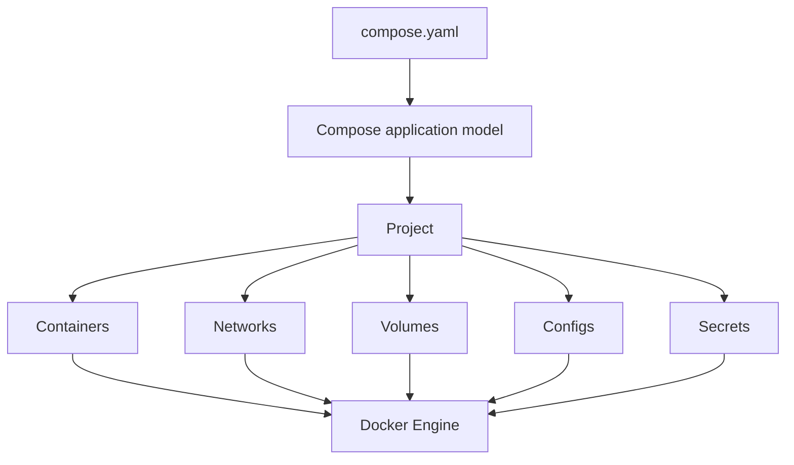
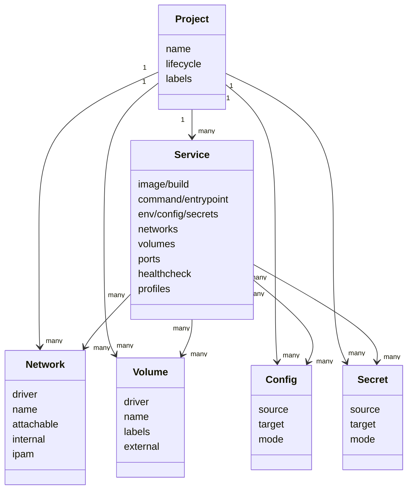
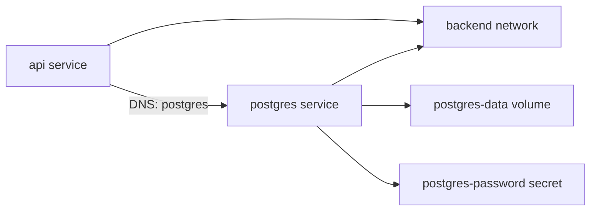
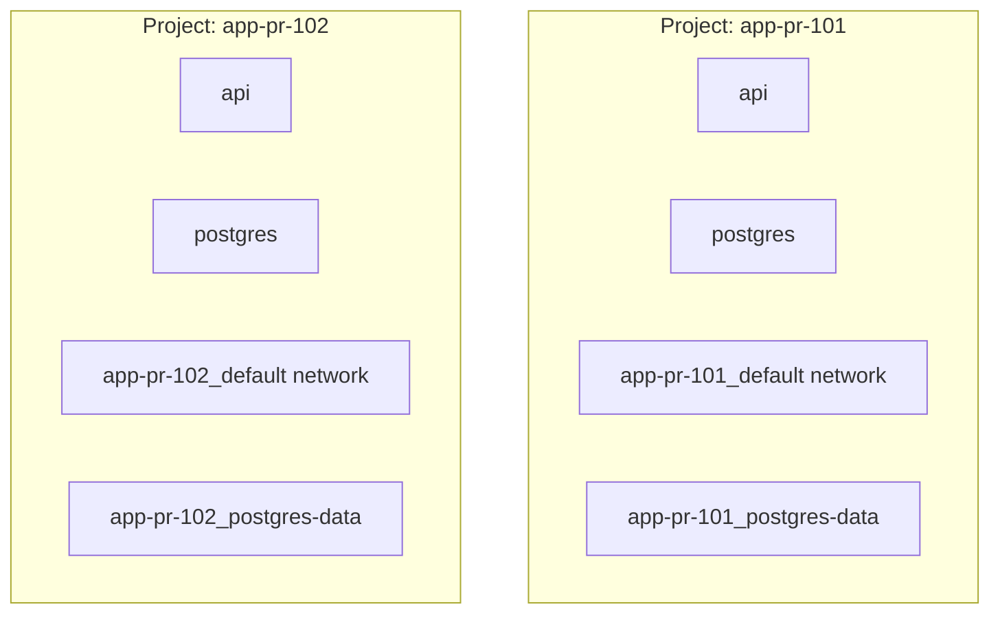
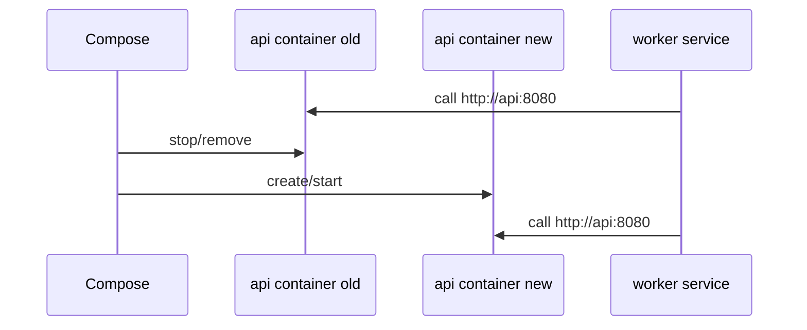
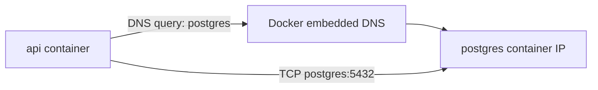
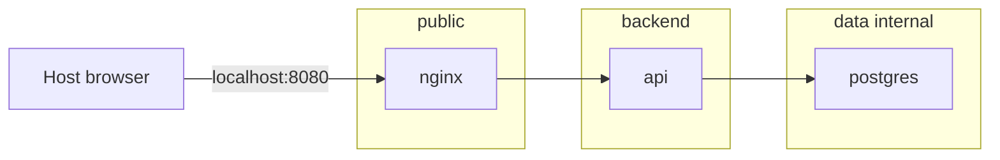
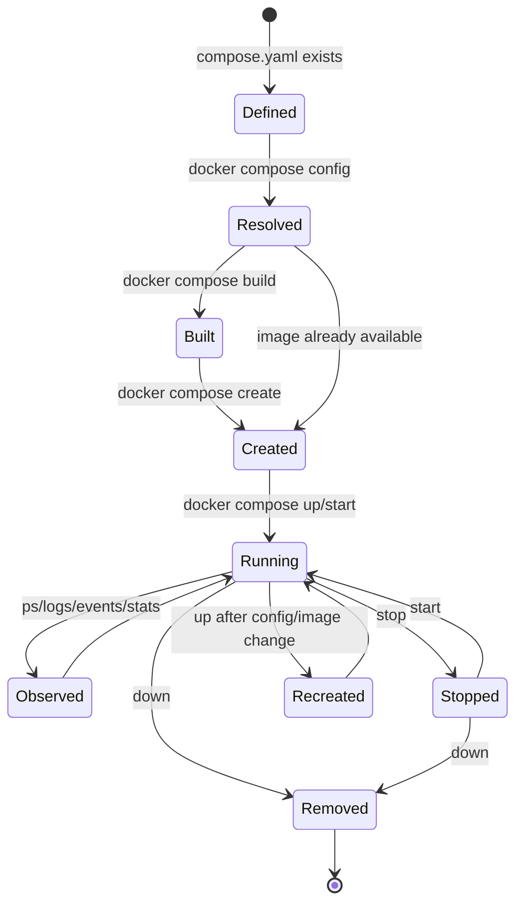
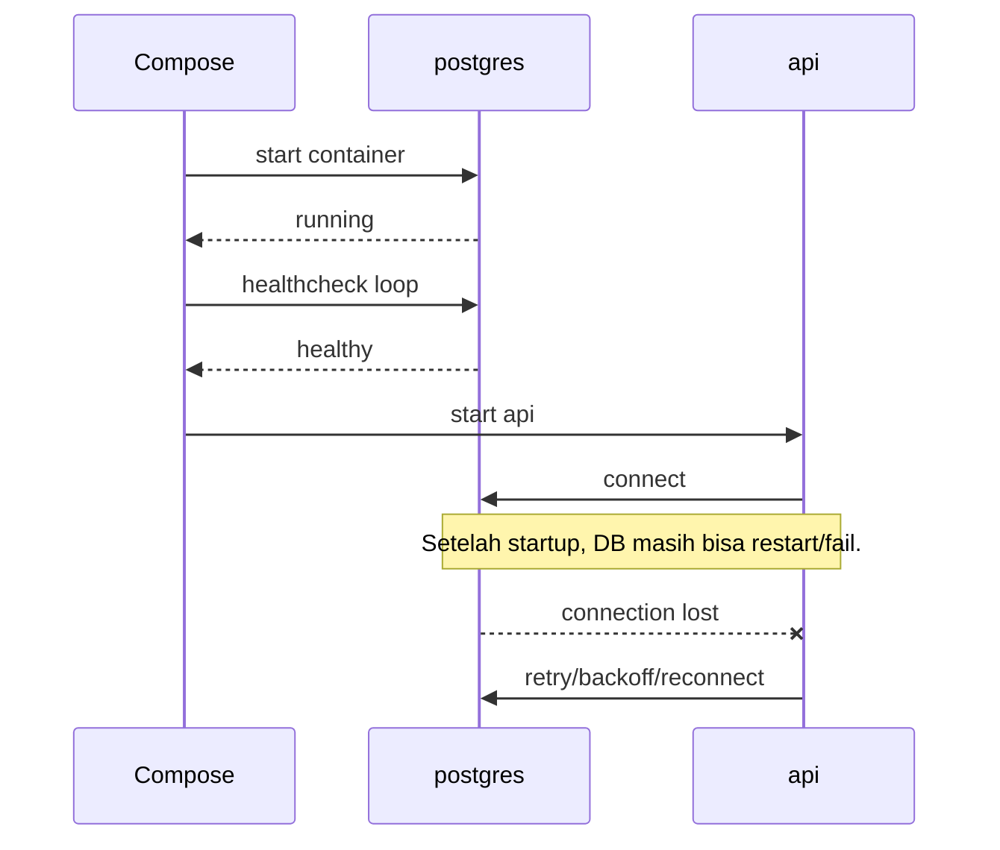
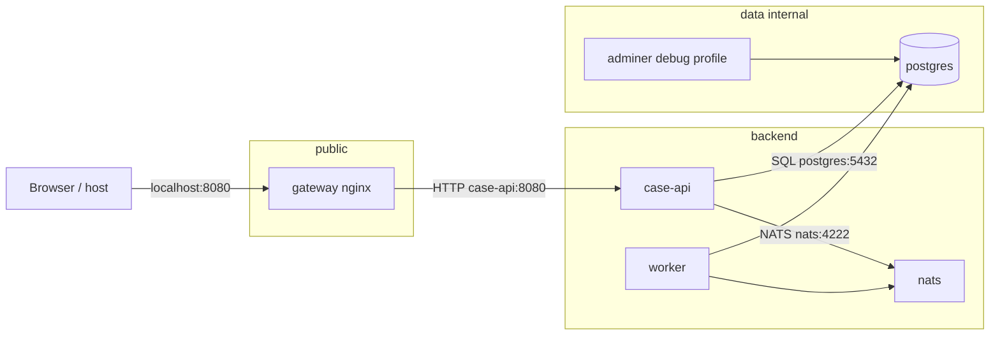

# Part 015 — Docker Compose Application Model: Services, Networks, Volumes, Configs

> Target pembelajaran: setelah part ini, kita tidak melihat Compose sebagai “file YAML untuk menjalankan beberapa container”, tetapi sebagai **model aplikasi lokal/multi-container** yang memiliki object graph, lifecycle, boundary, naming, network topology, storage topology, configuration boundary, dan failure mode.

Compose adalah lapisan yang mengubah kumpulan container individual menjadi **application graph**. Ia bukan orchestrator penuh seperti Kubernetes, dan bukan scheduler cluster seperti Swarm. Namun untuk development, integration test, single-host deployment, demo environment, dan reproducible dependency stack, Compose adalah salah satu alat paling efektif.

Docker mendokumentasikan Compose sebagai alat untuk mendefinisikan dan menjalankan aplikasi multi-container, dengan konfigurasi YAML untuk services, networks, volumes, dan elemen lain. Secara operasional, `docker compose up` akan membuat/start service, network, volume, config, dan secret yang diperlukan oleh model aplikasi.

Materi ini mengikuti pendekatan Kaufman:

1. **Deconstruct the skill** — pecah Compose menjadi subskill: service model, project model, network model, storage model, configuration model, lifecycle, dan failure reasoning.
2. **Learn enough to self-correct** — pahami output dari `config`, `ps`, `logs`, `events`, `inspect`, dan naming convention agar bisa mengoreksi asumsi.
3. **Remove practice barriers** — gunakan template lab yang konsisten dan command loop singkat.
4. **Practice the most important subskills** — desain Compose stack kecil, ubah satu variabel, observasi efeknya, lalu jelaskan invariant-nya.

---

## 1. Compose Bukan Sekadar “docker run dalam YAML”

Cara berpikir pemula:

```text
compose.yaml = daftar container yang mau dijalankan
```

Cara berpikir engineer:

```text
compose.yaml = declarative application model untuk satu project boundary
```

Compose mendefinisikan:

- service apa yang ada;
- image/build contract setiap service;
- environment/config apa yang diberikan;
- network apa yang menghubungkan service;
- volume apa yang menyimpan state;
- port apa yang dipublikasikan ke host;
- dependency startup/shutdown apa yang diharapkan;
- profile apa yang aktif untuk mode tertentu;
- naming boundary apa yang mencegah benturan antar project.

Compose mengambil model itu dan menghasilkan object Docker konkret:



Perbedaan utama dengan `docker run`:

| Aspek | `docker run` | Docker Compose |
|---|---|---|
| Unit berpikir | satu container | satu application graph |
| Naming | manual | project-scoped |
| Network | manual/per-command | dideklarasikan sebagai bagian graph |
| Volume | manual/per-command | reusable, named, project-aware |
| Startup | command ad-hoc | lifecycle model |
| Repeatability | bergantung command history | file-based, reviewable |
| Collaboration | sulit distandardisasi | bisa masuk repo dan code review |
| Debuggability | inspect per object | inspect via project/service model |

Compose tidak membuat container menjadi magic. Compose hanya menambahkan **model layer** di atas Docker Engine object.

---

## 2. Compose Object Model

Compose Specification memakai beberapa top-level element. Yang paling penting:

```yaml
services:
  app:
    image: example/app:1.0

networks:
  backend: {}

volumes:
  db-data: {}

configs:
  app-config:
    file: ./config/app.yml

secrets:
  db-password:
    file: ./secrets/db-password.txt
```

Mental model-nya:



Semua elemen itu harus dipahami sebagai **kontrak aplikasi**, bukan sebagai properti teknis terpisah.

Contoh:

```yaml
services:
  api:
    build: ./api
    environment:
      DB_HOST: postgres
    networks:
      - backend
    depends_on:
      - postgres

  postgres:
    image: postgres:16
    environment:
      POSTGRES_DB: app
      POSTGRES_USER: app
      POSTGRES_PASSWORD_FILE: /run/secrets/postgres-password
    secrets:
      - postgres-password
    volumes:
      - postgres-data:/var/lib/postgresql/data
    networks:
      - backend

networks:
  backend: {}

volumes:
  postgres-data: {}

secrets:
  postgres-password:
    file: ./secrets/postgres-password.txt
```

Application graph-nya:



Yang penting bukan hanya bahwa `api` bisa konek ke `postgres`. Yang penting adalah:

- koneksi terjadi lewat service name `postgres`, bukan `localhost`;
- state database dipisahkan ke named volume;
- password tidak di-hardcode ke image;
- semua object berada dalam project scope;
- graph bisa dijalankan ulang secara konsisten.

---

## 3. Project: Boundary Paling Penting dalam Compose

Compose selalu bekerja dalam konteks **project**.

Project menentukan namespace untuk object yang dibuat. Secara default, nama project biasanya berasal dari nama direktori kerja. Bisa juga diatur lewat:

```bash
docker compose -p myapp up
```

atau environment variable:

```bash
COMPOSE_PROJECT_NAME=myapp docker compose up
```

atau top-level `name`:

```yaml
name: myapp

services:
  api:
    image: example/api
```

Project name memengaruhi object name. Misalnya project `myapp` dengan service `api` bisa menghasilkan container seperti:

```text
myapp-api-1
```

network default:

```text
myapp_default
```

volume:

```text
myapp_postgres-data
```

### 3.1 Kenapa Project Boundary Penting?

Tanpa project boundary yang jelas, local environment akan saling mengganggu:

- dua branch aplikasi memakai service name sama;
- dua developer menjalankan stack berbeda di host yang sama;
- CI parallel job memakai volume/network sama;
- test stack menghapus volume milik dev stack;
- port host bentrok.

Compose project adalah cara paling sederhana untuk isolasi multi-stack di satu host.



### 3.2 Engineering Rule

Untuk environment automation, jangan bergantung pada default directory name. Gunakan project name eksplisit.

```bash
COMPOSE_PROJECT_NAME="app-${GIT_BRANCH}-${BUILD_ID}" docker compose up -d --build
```

Untuk CI:

```bash
export COMPOSE_PROJECT_NAME="app-ci-${CI_PIPELINE_ID}"
docker compose up -d --build
docker compose run --rm test
 docker compose down -v --remove-orphans
```

Catatan: command di atas memiliki satu spasi sebelum `docker compose down` hanya karena contoh visual; di script sebenarnya jangan pakai indentation acak.

### 3.3 Invariant Project

> Satu project harus merepresentasikan satu application boundary yang dapat dibuat, diinspeksi, dijalankan, dihentikan, dan dibersihkan tanpa menyentuh project lain.

Jika `docker compose down -v` pada satu project berisiko menghapus data project lain, model Compose-nya salah.

---

## 4. Service: Abstraksi Compute dalam Compose

Service adalah definisi compute resource. Service bukan container tunggal secara konseptual, walaupun pada mode Compose lokal biasanya satu service menghasilkan satu container per replica.

Contoh sederhana:

```yaml
services:
  api:
    image: ghcr.io/acme/api:1.4.2
    ports:
      - "8080:8080"
```

Service mendefinisikan:

- image atau build instruction;
- command/entrypoint;
- environment;
- filesystem mounts;
- networks;
- published ports;
- healthcheck;
- restart behavior;
- labels;
- profile;
- dependency.

### 4.1 Service Identity vs Container Identity

Service name adalah identitas stabil dalam application graph.

Container name adalah object runtime yang bisa dibuat ulang.

```text
service: api
container: myapp-api-1
```

Aplikasi lain harus merujuk `api` atau `postgres` sebagai service DNS name, bukan container ID dan bukan generated container name.

Bad:

```yaml
services:
  worker:
    environment:
      API_URL: http://myapp-api-1:8080
```

Good:

```yaml
services:
  worker:
    environment:
      API_URL: http://api:8080
```

### 4.2 Service as Replacement Boundary

Service harus bisa diganti container-nya tanpa mengubah service lain.



Jika service lain bergantung pada container name, IP address, atau internal PID, replacement boundary rusak.

---

## 5. Image vs Build dalam Compose

Compose service bisa memakai image yang sudah ada:

```yaml
services:
  api:
    image: ghcr.io/acme/api:1.4.2
```

Atau membangun image dari source:

```yaml
services:
  api:
    build:
      context: ./api
      dockerfile: Dockerfile
    image: ghcr.io/acme/api:local
```

Aturan engineering:

| Context | Preferensi |
|---|---|
| local inner loop | `build` boleh dipakai |
| integration test | `build` boleh, tetapi harus reproducible |
| staging/prod | prefer image immutable dari registry |
| release promotion | jangan rebuild source yang sama di tiap environment |

### 5.1 Compose sebagai Build Coordinator

Compose bisa build beberapa service dengan dependency berbeda. Namun jangan mencampur tanggung jawab tanpa sadar.

Compose untuk local dev:

```yaml
services:
  api:
    build: ./api
  worker:
    build: ./worker
```

Compose untuk environment yang lebih production-like:

```yaml
services:
  api:
    image: ghcr.io/acme/api@sha256:...
  worker:
    image: ghcr.io/acme/worker@sha256:...
```

Perbedaan ini penting karena environment production harus menjawab pertanyaan:

- artifact mana yang berjalan?
- siapa yang membangun artifact itu?
- kapan dipromosikan?
- apakah artifact yang sama pernah diuji?

Jika production melakukan build dari source saat deploy, traceability melemah.

---

## 6. Network Model: Default Network, User-Defined Network, and Service Discovery

Secara default, Compose membuat satu network untuk project.

```yaml
services:
  api:
    image: example/api
  postgres:
    image: postgres:16
```

Dalam praktik, Compose akan membuat network default project. Kedua service bisa saling resolve berdasarkan service name.

```text
api -> postgres:5432
postgres -> api:<port internal>
```

### 6.1 Service DNS

Di Compose, service name menjadi DNS name di network yang sama.

```yaml
services:
  api:
    environment:
      DB_HOST: postgres
    networks:
      - backend

  postgres:
    image: postgres:16
    networks:
      - backend

networks:
  backend: {}
```

Aplikasi tidak perlu tahu IP container. IP bisa berubah saat container dibuat ulang.



### 6.2 Internal Port vs Published Port

Ini salah satu sumber bug paling umum.

```yaml
services:
  postgres:
    image: postgres:16
    ports:
      - "15432:5432"
```

Dari host:

```text
localhost:15432
```

Dari service Compose lain:

```text
postgres:5432
```

Bukan:

```text
postgres:15432
```

Karena `15432` adalah host published port. Container lain di network Compose memakai container port internal.

### 6.3 Network Segmentation

Gunakan lebih dari satu network untuk memodelkan boundary.

```yaml
services:
  nginx:
    image: nginx:1.27
    ports:
      - "8080:80"
    networks:
      - public
      - backend

  api:
    image: example/api
    networks:
      - backend
      - data

  postgres:
    image: postgres:16
    networks:
      - data

networks:
  public: {}
  backend: {}
  data:
    internal: true
```

Topology:



Design intent:

- `nginx` bisa menerima traffic dari host;
- `api` tidak dipublish ke host;
- `postgres` hanya reachable dari `api`;
- data network tidak perlu exposed ke dunia luar.

### 6.4 Network Design Rule

> Jangan publish port hanya supaya service lain bisa mengaksesnya. Publish port hanya ketika host/external client perlu masuk.

Bad:

```yaml
services:
  postgres:
    ports:
      - "5432:5432"
```

Jika hanya `api` yang butuh DB, cukup:

```yaml
services:
  postgres:
    expose:
      - "5432"
```

Bahkan `expose` sering tidak wajib untuk komunikasi internal; image metadata dan actual listening port lebih penting. Gunakan `expose` jika ingin dokumentasi intent.

---

## 7. Volume Model: State Boundary dalam Compose

Container seharusnya disposable. State harus keluar dari writable layer.

Compose volume model:

```yaml
services:
  postgres:
    image: postgres:16
    volumes:
      - postgres-data:/var/lib/postgresql/data

volumes:
  postgres-data: {}
```

Compose akan membuat named volume project-scoped, misalnya:

```text
myapp_postgres-data
```

### 7.1 Named Volume vs Bind Mount

| Tipe | Cocok untuk | Risiko |
|---|---|---|
| named volume | database/local state yang dikelola Docker | kurang transparan bagi pemula |
| bind mount | source code, config lokal, fixture | permission issue, host coupling, accidental overwrite |
| tmpfs | ephemeral sensitive/temp data | hilang saat stop/recreate |

Development source mount:

```yaml
services:
  api:
    build: ./api
    volumes:
      - ./api/src:/app/src
```

Database data:

```yaml
services:
  postgres:
    volumes:
      - postgres-data:/var/lib/postgresql/data

volumes:
  postgres-data: {}
```

Sensitive temporary runtime data:

```yaml
services:
  processor:
    tmpfs:
      - /tmp/work
```

### 7.2 Volume Lifecycle

Common commands:

```bash
docker compose up -d
```

Membuat container, network, dan volume jika belum ada.

```bash
docker compose down
```

Menghapus container dan network project, tetapi tidak menghapus named volume default.

```bash
docker compose down -v
```

Menghapus container, network, dan named volume project.

### 7.3 Invariant Storage

> Setiap service stateful harus punya jawaban eksplisit: state-nya ephemeral, persistent, atau external?

Contoh klasifikasi:

| Service | State | Compose strategy |
|---|---|---|
| API stateless | ephemeral | no named volume |
| Postgres local dev | persistent local | named volume |
| Redis cache | usually ephemeral | no volume or explicit volume depending need |
| LocalStack data | ephemeral/test | named volume only if useful |
| Object storage emulator | persistent local | named volume |
| test DB | disposable | project-scoped volume + `down -v` |

Jangan membiarkan keputusan state terjadi secara implisit.

---

## 8. Config and Secret Model

Compose punya beberapa jalur untuk memasukkan configuration:

- `environment`;
- `env_file`;
- interpolation dari shell atau `.env`;
- bind-mounted config file;
- top-level `configs`;
- top-level `secrets`;
- command-line override.

### 8.1 Environment Variables

```yaml
services:
  api:
    environment:
      APP_ENV: development
      DB_HOST: postgres
      DB_PORT: "5432"
```

Gunakan mapping syntax untuk clarity. Semua value sebaiknya diperlakukan sebagai string secara mental, meskipun YAML bisa punya tipe boolean/number. Quote value yang rentan salah interpretasi.

Bad:

```yaml
services:
  api:
    environment:
      FEATURE_FLAG: false
```

Better:

```yaml
services:
  api:
    environment:
      FEATURE_FLAG: "false"
```

### 8.2 `.env` File Bukan Container Env File Sederhana

Compose menggunakan `.env` untuk interpolation variable di Compose file.

`.env`:

```dotenv
API_TAG=1.4.2
HOST_PORT=8080
```

`compose.yaml`:

```yaml
services:
  api:
    image: ghcr.io/acme/api:${API_TAG}
    ports:
      - "${HOST_PORT}:8080"
```

Ini berbeda dari `env_file`, yang memasukkan variable ke container environment.

```yaml
services:
  api:
    env_file:
      - ./api.env
```

Rule:

> `.env` mengisi Compose interpolation. `env_file` mengisi container environment.

Keduanya bisa bertemu, tetapi jangan dicampur tanpa sadar.

### 8.3 Configs

Configs cocok untuk non-secret configuration file.

```yaml
services:
  api:
    image: example/api
    configs:
      - source: api-config
        target: /etc/app/config.yml

configs:
  api-config:
    file: ./config/api.yml
```

Gunakan configs ketika ingin model aplikasi menyatakan bahwa file config adalah dependency service, bukan bind mount ad-hoc.

### 8.4 Secrets

Secrets cocok untuk material sensitif.

```yaml
services:
  postgres:
    image: postgres:16
    environment:
      POSTGRES_PASSWORD_FILE: /run/secrets/postgres-password
    secrets:
      - postgres-password

secrets:
  postgres-password:
    file: ./secrets/postgres-password.txt
```

Untuk Compose lokal, secret file tetap berasal dari filesystem host. Jangan menganggap ini sama kuat dengan secret manager production. Namun ini tetap lebih baik daripada membangun secret ke image atau commit ke Compose file.

Bad:

```yaml
services:
  postgres:
    environment:
      POSTGRES_PASSWORD: supersecret
```

Better:

```yaml
services:
  postgres:
    environment:
      POSTGRES_PASSWORD_FILE: /run/secrets/postgres-password
    secrets:
      - postgres-password
```

### 8.5 Config Boundary Rule

> Config boleh berubah antar environment. Image sebaiknya tidak berubah hanya karena config environment berubah.

Jika setiap environment butuh Dockerfile berbeda, kemungkinan boundary image/config salah.

---

## 9. Lifecycle Model: From File to Running Stack

Command penting:

```bash
docker compose config
```

Mengevaluasi Compose file final setelah interpolation/merge.

```bash
docker compose up -d --build
```

Build image jika perlu, create/recreate container, network, volume, lalu start.

```bash
docker compose ps
```

Lihat container dalam project.

```bash
docker compose logs -f api
```

Ikuti logs service.

```bash
docker compose exec api sh
```

Masuk ke running container service.

```bash
docker compose run --rm api ./scripts/migrate.sh
```

Jalankan one-off container dari service definition.

```bash
docker compose down
```

Stop dan remove container/network project.

```bash
docker compose down -v --remove-orphans
```

Bersihkan container, network, volume, dan orphan dari project.

### 9.1 Lifecycle State Graph



### 9.2 `up` vs `run` vs `exec`

| Command | Meaning | Typical use |
|---|---|---|
| `up` | run declared application graph | start app stack |
| `run` | create one-off container from service definition | migration, test command, job |
| `exec` | execute command inside existing running container | debug, shell, inspect runtime |

Common mistake:

```bash
docker compose run api sh
```

Untuk debugging running app, sering lebih tepat:

```bash
docker compose exec api sh
```

Karena `run` membuat container baru. Container baru itu mungkin tidak memiliki state runtime yang sama dengan container `api` yang sedang melayani traffic.

### 9.3 Recreate Behavior

Compose akan recreate container jika konfigurasi atau image berubah. Ini berarti:

- filesystem writable layer container lama hilang;
- named volume tetap ada;
- container IP bisa berubah;
- logs lama mungkin tidak lagi attached ke container baru;
- service DNS tetap stabil.

Invariant:

> Container replacement tidak boleh merusak correctness aplikasi jika state sudah ditempatkan di boundary yang benar.

---

## 10. Dependency Graph: `depends_on` Bukan Distributed Readiness Magic

Compose bisa menyatakan dependency:

```yaml
services:
  api:
    build: ./api
    depends_on:
      - postgres

  postgres:
    image: postgres:16
```

Ini membantu urutan start/stop, tetapi tidak otomatis berarti database sudah siap menerima koneksi pada level aplikasi.

Better:

```yaml
services:
  api:
    build: ./api
    depends_on:
      postgres:
        condition: service_healthy

  postgres:
    image: postgres:16
    healthcheck:
      test: ["CMD-SHELL", "pg_isready -U app -d app"]
      interval: 5s
      timeout: 3s
      retries: 20
```

Tetap, aplikasi harus resilient terhadap dependency yang restart setelah startup.



Rule:

> Compose dependency dapat mengurangi race saat startup, tetapi tidak menggantikan retry, timeout, circuit breaker, dan graceful degradation di aplikasi.

Part 017 akan membahas dependency, startup order, healthcheck, dan shutdown order lebih dalam.

---

## 11. Labels: Metadata untuk Tooling dan Governance

Labels sering diremehkan. Padahal label adalah cara yang baik untuk menempelkan metadata ke service/container.

```yaml
services:
  api:
    image: ghcr.io/acme/api:1.4.2
    labels:
      com.acme.owner: platform
      com.acme.service: api
      com.acme.tier: backend
      com.acme.data-classification: internal
```

Use case:

- log routing;
- monitoring discovery;
- reverse proxy routing;
- cost attribution;
- ownership;
- cleanup automation;
- policy check.

Compose sendiri menambahkan label project/service tertentu pada object yang dibuatnya. Jangan bergantung pada detail internal yang tidak perlu, tetapi pahami bahwa label bisa dipakai untuk filter:

```bash
docker ps --filter label=com.docker.compose.project=myapp
```

Governance rule:

> Untuk stack serius, service tanpa owner label adalah service yang sulit dioperasikan.

---

## 12. Profiles: Application Variant Tanpa Menggandakan File

Profiles memungkinkan service tertentu hanya aktif saat profile dinyalakan.

```yaml
services:
  api:
    build: ./api

  postgres:
    image: postgres:16

  adminer:
    image: adminer:4
    profiles:
      - debug
    ports:
      - "8081:8080"
```

Default:

```bash
docker compose up -d
```

Menjalankan `api` dan `postgres`, bukan `adminer`.

Dengan profile:

```bash
docker compose --profile debug up -d
```

Menjalankan `adminer` juga.

### 12.1 Good Profile Examples

| Profile | Isi |
|---|---|
| `debug` | admin UI, debug tools, mail UI |
| `observability` | Prometheus, Grafana, log collector |
| `e2e` | browser runner, mock external dependencies |
| `loadtest` | k6/JMeter/Gatling runner |
| `localcloud` | LocalStack, object storage emulator |

### 12.2 Bad Profile Usage

Jangan memakai profile untuk menyembunyikan dependency wajib.

Bad:

```yaml
services:
  api:
    build: ./api

  postgres:
    image: postgres:16
    profiles:
      - database
```

Jika `api` wajib butuh `postgres`, jangan buat DB opsional kecuali aplikasi memang bisa berjalan tanpa DB.

Rule:

> Profile cocok untuk optional tooling atau environment variant, bukan untuk dependency inti yang diam-diam wajib.

---

## 13. Compose File Naming and Layering Preview

File modern yang direkomendasikan biasanya bernama:

```text
compose.yaml
```

Bukan wajib, tetapi lebih selaras dengan Compose V2 naming modern.

Compose mendukung beberapa file:

```bash
docker compose -f compose.yaml -f compose.override.yaml up -d
```

Umum dipakai:

```text
compose.yaml              # base application model
compose.override.yaml     # local default override
compose.dev.yaml          # development-specific
compose.test.yaml         # integration test
compose.prod.yaml         # production-ish single host or Swarm input variant
```

Part 016 akan membahas merge, anchors, extension fields, dan override secara detail.

### 13.1 Layering Principle

Base file harus menyatakan **truth aplikasi**:

- service graph;
- internal port;
- network relationship;
- required volume;
- required config/secret abstraction.

Override file boleh menyatakan **environment-specific choice**:

- published host port;
- bind mount source code;
- debug profile;
- local-only env value;
- resource constraints;
- alternative image tag.

Bad base file:

```yaml
services:
  api:
    volumes:
      - /Users/alice/work/app:/app
```

Good base + local override:

```yaml
# compose.yaml
services:
  api:
    image: ghcr.io/acme/api:dev
```

```yaml
# compose.override.yaml
services:
  api:
    volumes:
      - ./api:/app
```

---

## 14. A Production-Like Local Stack Example

Kita akan membuat contoh stack yang cukup realistis tetapi tidak berlebihan.

```yaml
name: enforcement-case-platform

services:
  gateway:
    image: nginx:1.27-alpine
    ports:
      - "8080:80"
    volumes:
      - ./infra/nginx/default.conf:/etc/nginx/conf.d/default.conf:ro
    depends_on:
      - case-api
    networks:
      - public
      - backend
    labels:
      com.acme.service: gateway
      com.acme.tier: edge

  case-api:
    build:
      context: ./services/case-api
      dockerfile: Dockerfile
    environment:
      APP_ENV: development
      DB_HOST: postgres
      DB_PORT: "5432"
      DB_NAME: cases
      DB_USER: cases
      DB_PASSWORD_FILE: /run/secrets/postgres-password
      EVENT_BROKER_URL: nats://nats:4222
    secrets:
      - postgres-password
    depends_on:
      postgres:
        condition: service_healthy
      nats:
        condition: service_started
    networks:
      - backend
      - data
    labels:
      com.acme.service: case-api
      com.acme.tier: backend

  worker:
    build:
      context: ./services/worker
    environment:
      APP_ENV: development
      DB_HOST: postgres
      EVENT_BROKER_URL: nats://nats:4222
    depends_on:
      postgres:
        condition: service_healthy
      nats:
        condition: service_started
    networks:
      - backend
      - data
    labels:
      com.acme.service: worker
      com.acme.tier: backend

  postgres:
    image: postgres:16-alpine
    environment:
      POSTGRES_DB: cases
      POSTGRES_USER: cases
      POSTGRES_PASSWORD_FILE: /run/secrets/postgres-password
    healthcheck:
      test: ["CMD-SHELL", "pg_isready -U cases -d cases"]
      interval: 5s
      timeout: 3s
      retries: 20
    volumes:
      - postgres-data:/var/lib/postgresql/data
    secrets:
      - postgres-password
    networks:
      - data
    labels:
      com.acme.service: postgres
      com.acme.tier: data

  nats:
    image: nats:2.10-alpine
    command: ["-js"]
    networks:
      - backend
    labels:
      com.acme.service: nats
      com.acme.tier: messaging

  adminer:
    image: adminer:4
    profiles:
      - debug
    ports:
      - "8081:8080"
    networks:
      - data

networks:
  public: {}
  backend: {}
  data:
    internal: true

volumes:
  postgres-data: {}

secrets:
  postgres-password:
    file: ./secrets/postgres-password.txt
```

Topology:



Observations:

- only `gateway` is exposed by default;
- `adminer` only exists under `debug` profile;
- `postgres` is isolated in internal data network;
- API and worker share backend/data dependency;
- password enters through secret file;
- DB state is in named volume;
- service names become internal DNS names.

---

## 15. Compose as Local Platform Contract

A strong Compose file can become the local version of a platform contract.

It answers:

1. What services exist?
2. Which services are stateless vs stateful?
3. Which services are externally reachable?
4. Which services are internal-only?
5. Which ports are internal and which are host-published?
6. Which config is runtime config?
7. Which secrets are required?
8. Which service owns which volume?
9. What dependency graph exists?
10. What optional tooling is available?
11. How do we cleanly create and destroy the stack?

Poor Compose files usually fail because they are treated as developer convenience scripts, not as architecture artifacts.

### 15.1 Compose Review Questions

When reviewing `compose.yaml`, ask:

- Is the project boundary explicit enough?
- Are service names stable and meaningful?
- Are host ports minimized?
- Are internal dependencies using service DNS, not host ports?
- Is persistent state explicit?
- Are secrets excluded from images and Git?
- Are debug tools behind profiles?
- Is the default `up` path minimal and useful?
- Can a new engineer run the stack without tribal knowledge?
- Can CI create an isolated project and destroy it safely?
- Can we explain every mount, port, network, and env variable?

---

## 16. Common Compose Application Model Anti-Patterns

### 16.1 Publishing Every Port

Bad:

```yaml
services:
  api:
    ports:
      - "8080:8080"
  postgres:
    ports:
      - "5432:5432"
  redis:
    ports:
      - "6379:6379"
```

Problem:

- expands host attack surface;
- creates port conflicts;
- confuses internal vs external path;
- trains developers to connect via localhost from containers.

Better:

```yaml
services:
  gateway:
    ports:
      - "8080:80"
  api:
    networks:
      - backend
  postgres:
    networks:
      - data
```

### 16.2 Using `localhost` Between Containers

Bad:

```yaml
services:
  api:
    environment:
      DB_HOST: localhost
```

Inside `api`, `localhost` means the `api` container itself, not `postgres`.

Good:

```yaml
services:
  api:
    environment:
      DB_HOST: postgres
```

### 16.3 Putting Secrets in Image or Compose File

Bad:

```dockerfile
ENV DB_PASSWORD=supersecret
```

Bad:

```yaml
services:
  api:
    environment:
      DB_PASSWORD: supersecret
```

Better:

```yaml
secrets:
  db-password:
    file: ./secrets/db-password.txt
```

### 16.4 Bind Mounting the Whole Repo Everywhere

Bad:

```yaml
services:
  api:
    volumes:
      - .:/app
```

Risks:

- overwrites image content;
- leaks secrets/build files;
- breaks Linux permission assumptions;
- makes container dependent on host layout;
- slows filesystem performance on some platforms.

Better:

```yaml
services:
  api:
    volumes:
      - ./services/api/src:/app/src
      - ./services/api/package.json:/app/package.json:ro
```

Or use language-specific dev strategy.

### 16.5 Making Compose a Production Orchestrator Without Understanding Limits

Compose is excellent for local/dev/test/single-host workflows. It does not automatically solve:

- multi-host scheduling;
- service rescheduling across node failure;
- cluster-level rolling update semantics;
- distributed secret management at production standard;
- ingress/load balancing across nodes;
- storage replication;
- policy enforcement.

Swarm or Kubernetes-style orchestration exists because multi-host reliability needs extra control loops.

---

## 17. Practice Lab: Build a Compose Application Model

### 17.1 Goal

Create a Compose stack with:

- `api` service;
- `postgres` service;
- `redis` service;
- one `backend` network;
- one `data` internal network;
- named volume for Postgres;
- host-published port only for API;
- optional `adminer` under `debug` profile;
- secret file for DB password.

### 17.2 Expected Compose File

```yaml
name: compose-model-lab

services:
  api:
    build: ./api
    ports:
      - "8080:8080"
    environment:
      DB_HOST: postgres
      DB_PORT: "5432"
      REDIS_HOST: redis
      DB_PASSWORD_FILE: /run/secrets/db-password
    secrets:
      - db-password
    depends_on:
      postgres:
        condition: service_healthy
      redis:
        condition: service_started
    networks:
      - backend
      - data

  postgres:
    image: postgres:16-alpine
    environment:
      POSTGRES_DB: app
      POSTGRES_USER: app
      POSTGRES_PASSWORD_FILE: /run/secrets/db-password
    healthcheck:
      test: ["CMD-SHELL", "pg_isready -U app -d app"]
      interval: 5s
      timeout: 3s
      retries: 20
    volumes:
      - postgres-data:/var/lib/postgresql/data
    secrets:
      - db-password
    networks:
      - data

  redis:
    image: redis:7-alpine
    networks:
      - backend

  adminer:
    image: adminer:4
    profiles:
      - debug
    ports:
      - "8081:8080"
    networks:
      - data

networks:
  backend: {}
  data:
    internal: true

volumes:
  postgres-data: {}

secrets:
  db-password:
    file: ./secrets/db-password.txt
```

### 17.3 Observation Commands

```bash
docker compose config
```

Check final resolved model.

```bash
docker compose up -d --build
```

Start default stack.

```bash
docker compose ps
```

Observe services.

```bash
docker network ls | grep compose-model-lab
```

Observe networks.

```bash
docker volume ls | grep compose-model-lab
```

Observe volumes.

```bash
docker compose --profile debug up -d
```

Activate optional debug service.

```bash
docker compose down -v --remove-orphans
```

Clean project and volume.

### 17.4 Self-Correction Questions

Answer without looking at the file:

1. Which service is reachable from host?
2. Which services can reach Postgres?
3. Which service owns persistent data?
4. What happens if the `api` container is recreated?
5. What happens if `docker compose down` runs without `-v`?
6. Why should `api` use `postgres:5432` instead of `localhost:5432`?
7. Why is `adminer` behind a profile?
8. What object names will Compose generate under the project?
9. Which config is safe to commit and which is not?
10. Which parts would change in CI?

---

## 18. Kaufman 20-Hour Deliberate Practice for Compose Model

### Hour 1–2: Read and Draw

Take an existing `compose.yaml`, draw:

- service graph;
- network graph;
- storage graph;
- published port map;
- secret/config map.

### Hour 3–5: Build Minimal Stack

Create a 3-service stack:

- app;
- database;
- cache.

Use only one host-published port.

### Hour 6–8: Break Networking Intentionally

Change `DB_HOST` to `localhost`, observe failure, fix with service DNS.

Change internal port vs host port, observe failure.

### Hour 9–11: Break Storage Intentionally

Run DB without named volume, recreate container, observe data loss.

Add named volume, repeat, observe persistence.

### Hour 12–14: Add Secret and Config Boundary

Move password from environment literal to secret file.

Move app config from baked-in image to config file.

### Hour 15–17: Add Profiles

Add debug tooling behind profile.

Confirm default stack remains minimal.

### Hour 18–20: Explain the Model

Without opening docs, explain:

- project;
- service;
- network;
- volume;
- config;
- secret;
- profile;
- lifecycle;
- cleanup.

If explanation becomes command memorization, return to graph drawing.

---

## 19. Key Takeaways

- Compose is a declarative **application graph**, not just a YAML wrapper around `docker run`.
- Project name is the namespace boundary for containers, networks, and volumes.
- Service name is the stable identity; container identity is disposable.
- Internal service communication should use service DNS and container ports.
- Host port publishing is for host/external access, not service-to-service access.
- Named volumes are the default answer for persistent local state.
- Bind mounts are useful but should be treated as host coupling.
- `.env` interpolation and `env_file` container environment are different mechanisms.
- Secrets/configs should be explicit runtime dependencies, not image content.
- Profiles are for optional tooling and environment variants, not hidden mandatory dependencies.
- A good Compose file is an architecture artifact that can be reviewed.

---

## 20. What Comes Next

Part 016 goes deeper into the Compose file itself:

- service attributes;
- build attributes;
- environment precedence;
- profiles;
- extension fields;
- YAML anchors;
- multiple Compose files;
- merge behavior;
- Compose validation;
- production-quality file organization.

