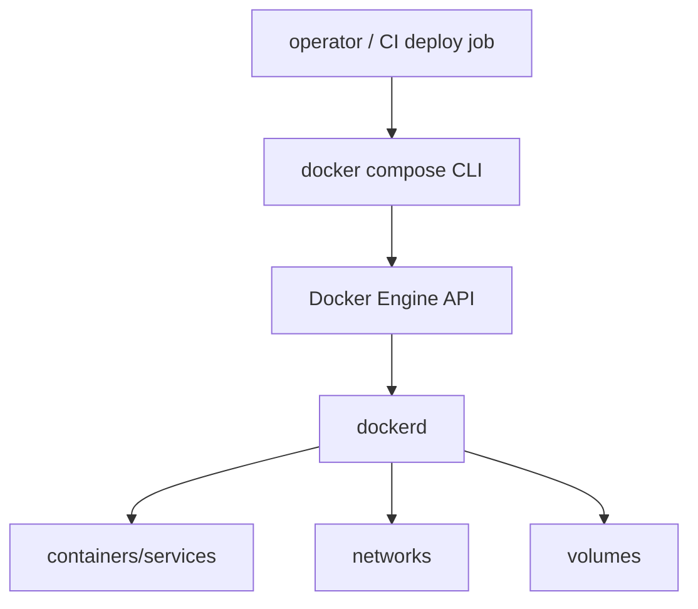
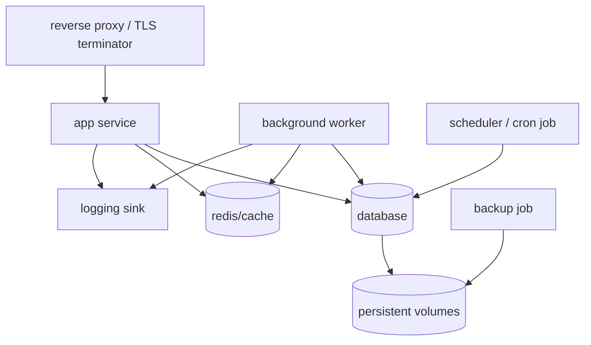
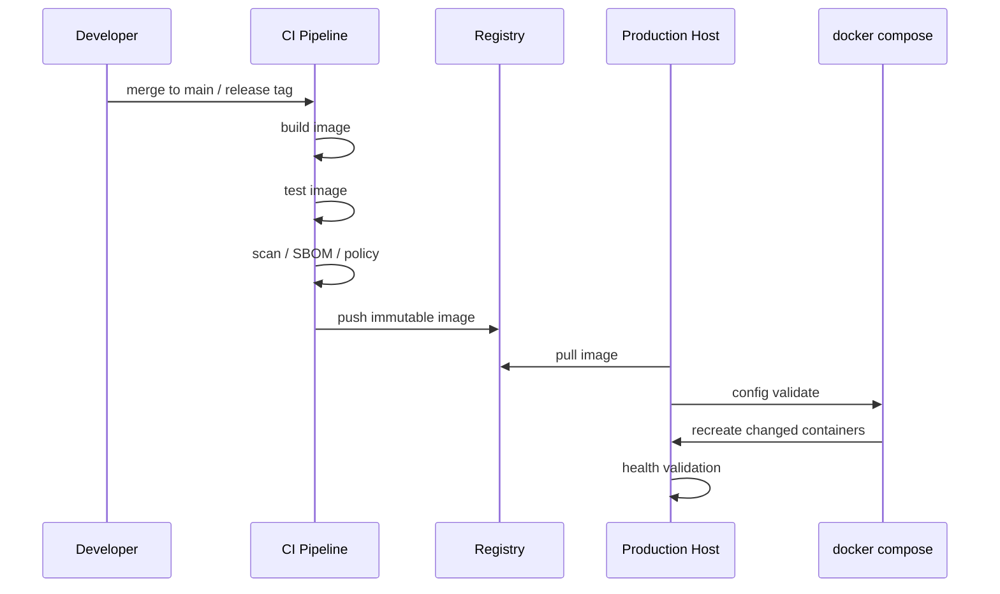
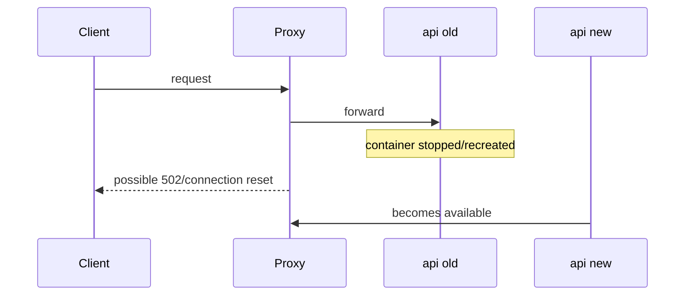
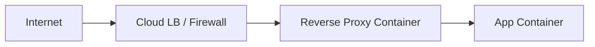
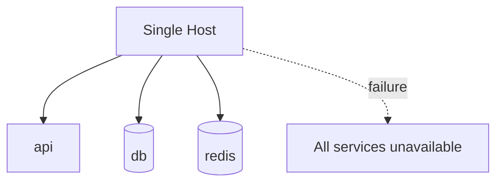

# Part 020 — Compose Production Boundaries: What Compose Is Good At and Where It Ends

> Target pembelajaran: setelah part ini, kita mampu menentukan secara defensible kapan Docker Compose layak untuk production, kapan Compose hanya cocok untuk single-host deployment, risiko apa yang harus diterima, dan kapan harus naik ke orchestrator seperti Docker Swarm atau Kubernetes.

Part 019 membahas Compose untuk testing. Part ini membahas Compose saat mendekati production.

Penting: pembahasan ini bukan dogma “Compose tidak boleh production”. Docker sendiri mendokumentasikan penggunaan Compose untuk production dan single-server deployment. Namun engineer senior harus memahami batasnya.

```text
Compose can run production workloads.
Compose is not, by itself, a distributed orchestrator.
```

---

## 1. Compose Production Mental Model

Compose adalah **application model + lifecycle CLI** untuk satu Docker context/daemon.



Compose tidak menyimpan desired state cluster seperti Swarm manager atau Kubernetes control plane. Compose menjalankan operasi terhadap Docker Engine saat command dieksekusi.

Implikasi:

| Concern | Compose Behavior |
|---|---|
| service lifecycle | dikelola lewat Docker Engine container lifecycle |
| restart after crash | bisa via restart policy |
| node failure | tidak ada failover multi-node bawaan |
| rolling update cluster | tidak ada scheduler multi-node bawaan |
| desired state reconciliation | terbatas pada command Compose saat dijalankan |
| service discovery | ada di Compose network single-host |
| secret management | ada Compose secrets, tetapi capability berbeda dari orchestrator secrets |

---

## 2. Kapan Compose Layak untuk Production?

Compose bisa masuk akal untuk:

- single-server application;
- internal tool;
- low-to-medium traffic app;
- small business system;
- staging/demo environment;
- self-hosted service;
- edge deployment sederhana;
- regulated workload kecil dengan backup dan runbook kuat;
- migration bridge sebelum orchestrator.

Compose kurang cocok jika butuh:

- high availability multi-node;
- automatic rescheduling saat host mati;
- rolling update multi-replica yang matang;
- autoscaling;
- multi-tenant platform;
- complex ingress/service mesh;
- policy-as-code cluster-level;
- centralized secret rotation;
- workload placement across nodes;
- zero-downtime strict SLO dengan banyak instance.

Decision rule:

```text
Jika satu host mati dan sistem boleh down sampai operator/automation memulihkan, Compose mungkin cukup.
Jika satu host mati dan sistem harus tetap serving, Compose saja tidak cukup.
```

---

## 3. Compose vs Swarm vs Kubernetes

| Capability | Compose | Docker Swarm | Kubernetes |
|---|---:|---:|---:|
| Single-host app graph | sangat baik | bisa | bisa tapi berat |
| Multi-host scheduling | tidak native | ya | ya |
| Desired state reconciliation | terbatas | ya | ya |
| Rolling update service | manual/limited | ya | ya |
| Service discovery multi-node | tidak | ya | ya |
| Secret distribution cluster | terbatas | ya | ya |
| Autoscaling ecosystem | tidak native | terbatas | kuat |
| Operational complexity | rendah | sedang | tinggi |
| Learning curve | rendah-sedang | sedang | tinggi |
| Best fit | simple prod/dev/test | small cluster/orchestration | platform besar |

Compose bukan “mainan”. Compose adalah tool yang tepat untuk boundary tertentu. Kesalahan terjadi saat Compose dipakai melampaui boundary tanpa sadar.

---

## 4. Production Stack Anatomy

Production Compose stack biasanya punya:



Komponen yang harus dipikirkan:

- ingress/TLS;
- application container;
- worker container;
- scheduler/job;
- database/cache;
- persistent volumes;
- backup/restore;
- logs/metrics;
- update/rollback;
- secrets/config;
- host hardening;
- disaster recovery.

---

## 5. File Layering untuk Production

Jangan pakai satu Compose file raksasa untuk semua environment.

Pola:

```text
compose.yml                 # base service model
compose.override.yml        # local dev default override, biasanya tidak untuk production
compose.prod.yml            # production-specific override
compose.prod.secrets.yml    # optional, generated/deployed securely
```

Deploy:

```bash
docker compose \
  -f compose.yml \
  -f compose.prod.yml \
  config

docker compose \
  -f compose.yml \
  -f compose.prod.yml \
  up -d
```

Production deployment script sebaiknya strict:

```bash
#!/usr/bin/env bash
set -euo pipefail

COMPOSE_FILES=(-f compose.yml -f compose.prod.yml)

docker compose "${COMPOSE_FILES[@]}" config --quiet
docker compose "${COMPOSE_FILES[@]}" pull
docker compose "${COMPOSE_FILES[@]}" up -d --remove-orphans
docker compose "${COMPOSE_FILES[@]}" ps
```

---

## 6. Base Compose vs Production Override

Base:

```yaml
# compose.yml
services:
  api:
    image: registry.example.com/myapp/api:${APP_VERSION:-latest}
    environment:
      APP_ENV: ${APP_ENV:-development}
    depends_on:
      postgres:
        condition: service_healthy
      redis:
        condition: service_healthy
    networks:
      - appnet

  worker:
    image: registry.example.com/myapp/api:${APP_VERSION:-latest}
    command: ["./bin/worker"]
    environment:
      APP_ENV: ${APP_ENV:-development}
    networks:
      - appnet

  postgres:
    image: postgres:16
    networks:
      - appnet

  redis:
    image: redis:7
    networks:
      - appnet

networks:
  appnet: {}
```

Production override:

```yaml
# compose.prod.yml
services:
  api:
    restart: unless-stopped
    environment:
      APP_ENV: production
      LOG_FORMAT: json
    ports:
      - "127.0.0.1:8080:8080"
    read_only: true
    tmpfs:
      - /tmp
    security_opt:
      - no-new-privileges:true
    cap_drop:
      - ALL

  worker:
    restart: unless-stopped
    read_only: true
    tmpfs:
      - /tmp
    security_opt:
      - no-new-privileges:true
    cap_drop:
      - ALL

  postgres:
    restart: unless-stopped
    volumes:
      - pgdata:/var/lib/postgresql/data
    ports: []

  redis:
    restart: unless-stopped
    ports: []

volumes:
  pgdata:
```

Production override harus mengubah posture:

- restart policy;
- logging;
- published ports;
- resource constraints jika digunakan;
- read-only FS;
- security options;
- persistent volume;
- secrets/config source.

---

## 7. Image Strategy: Jangan Build di Production Host secara Default

Anti-pattern umum:

```bash
git pull
docker compose up --build -d
```

Masalah:

- production host menjadi build server;
- build dependency harus ada di production;
- image tidak immutable;
- rollback sulit;
- vulnerability scanning/provenance sulit;
- hasil build bisa berbeda antar host.

Lebih baik:

```text
CI builds image -> scan/sign/push -> production host pulls digest/tag immutable -> compose up -d
```

Production Compose:

```yaml
services:
  api:
    image: registry.example.com/myapp/api@sha256:...
```

Atau minimal:

```yaml
services:
  api:
    image: registry.example.com/myapp/api:${APP_VERSION}
```

Rule:

```text
Production Compose should consume release artifacts, not create them.
```

---

## 8. Deployment Flow yang Defensible



Deployment script:

```bash
#!/usr/bin/env bash
set -euo pipefail

APP_VERSION="${1:?usage: deploy.sh <app-version>}"
export APP_VERSION

FILES=(-f compose.yml -f compose.prod.yml)

docker compose "${FILES[@]}" config --quiet
docker compose "${FILES[@]}" pull
docker compose "${FILES[@]}" up -d --remove-orphans
docker compose "${FILES[@]}" ps
./scripts/prod-smoke-test.sh
```

Production deploy harus punya post-deploy validation. `up -d` sukses hanya berarti container dibuat/start, bukan berarti aplikasi sehat secara bisnis.

---

## 9. Updating Services with Compose

Docker mendokumentasikan pattern production update seperti:

```bash
docker compose build web
docker compose up --no-deps -d web
```

Untuk production artifact-based deployment, variant-nya:

```bash
export APP_VERSION=2026.07.01-abcdef

docker compose -f compose.yml -f compose.prod.yml pull api

docker compose -f compose.yml -f compose.prod.yml up -d --no-deps api
```

Makna:

- `pull api` mengambil image baru;
- `up -d --no-deps api` recreate service target;
- dependency tidak ikut direcreate.

Risiko:

- ada downtime singkat untuk single replica;
- tidak ada rolling update multi-replica native seperti Swarm;
- connection draining bergantung pada reverse proxy/app;
- migration compatibility harus dijaga.

---

## 10. Downtime Model Compose

Compose `up -d` pada service yang berubah biasanya recreate container.

Untuk single API container:



Mitigasi:

- external reverse proxy dengan healthcheck;
- run multiple app instances dengan nama service berbeda;
- blue/green manual;
- graceful shutdown;
- backwards-compatible migrations;
- deploy saat low traffic;
- naik ke Swarm/Kubernetes jika zero-downtime penting.

---

## 11. Manual Blue/Green dengan Compose

Compose bisa melakukan blue/green sederhana, tetapi manual.

```yaml
services:
  api_blue:
    image: registry.example.com/myapp/api:${BLUE_VERSION}
    networks: [appnet]

  api_green:
    image: registry.example.com/myapp/api:${GREEN_VERSION}
    networks: [appnet]

  proxy:
    image: nginx:stable
    ports:
      - "80:80"
    volumes:
      - ./nginx.conf:/etc/nginx/nginx.conf:ro
    networks: [appnet]
```

Flow:

```text
run green -> smoke test green -> update proxy upstream -> reload proxy -> monitor -> remove blue
```

Kelemahan:

- perlu scripting;
- database migration tetap sulit;
- resource dua versi harus tersedia;
- operator harus disiplin.

---

## 12. Database Migration Strategy

Compose production sering gagal bukan karena container, tetapi karena migration.

Safe migration model:

```text
expand -> deploy compatible app -> backfill -> switch behavior -> contract
```

Contoh:

1. tambah kolom nullable;
2. deploy app yang bisa membaca lama/baru;
3. backfill data;
4. aktifkan write baru;
5. setelah aman, hapus kolom lama.

Jangan lakukan destructive migration bersamaan dengan app deploy jika rollback aplikasi masih mungkin.

Compose migration job:

```yaml
services:
  migrate:
    image: registry.example.com/myapp/api:${APP_VERSION}
    command: ["./bin/migrate"]
    environment:
      DATABASE_URL: ${DATABASE_URL:?missing}
    restart: "no"
```

Run explicit:

```bash
docker compose -f compose.yml -f compose.prod.yml run --rm migrate
```

Keputusan penting:

- migration before app?
- migration after app?
- migration manual approval?
- rollback behavior?

Untuk production serius, migration harus punya runbook.

---

## 13. Secrets in Compose Production

Compose mendukung secrets, tetapi jangan salah memahami boundary-nya.

Contoh:

```yaml
secrets:
  db_password:
    file: ./secrets/db_password.txt

services:
  api:
    secrets:
      - db_password
    environment:
      DB_PASSWORD_FILE: /run/secrets/db_password
```

Masalah operasional:

- file secret tetap harus diamankan di host;
- distribusi secret bukan otomatis multi-node;
- rotation harus discript;
- backup host bisa berisi secret;
- permission file penting.

Minimal rule:

```text
Secret boleh masuk container runtime, tetapi tidak boleh masuk image, Git, log, atau artifact build.
```

Production alternative:

- host secret file provisioned by secure deployment;
- environment variable dari secret manager CI dengan hati-hati;
- external secret manager sidecar/agent;
- Swarm/Kubernetes secret jika memakai orchestrator.

---

## 14. Config Management

Config harus dipisah dari image.

Bad:

```Dockerfile
COPY application-prod.yml /app/application.yml
```

Better:

```yaml
services:
  api:
    environment:
      APP_ENV: production
      CONFIG_PATH: /config/application.yml
    volumes:
      - ./config/application.prod.yml:/config/application.yml:ro
```

Namun bind mount config file punya risiko:

- config drift;
- edit manual di server;
- audit sulit;
- rollback config terpisah dari image.

Lebih defensible:

```text
versioned config template + deployment-time rendered config + checksum/logging
```

Tambahkan label config version:

```yaml
services:
  api:
    labels:
      com.example.config_version: ${CONFIG_VERSION:-unknown}
```

---

## 15. Networking Production Compose

Default rule:

```text
Publish hanya port yang harus diakses dari luar host.
Dependency internal jangan publish port.
```

Bad:

```yaml
postgres:
  ports:
    - "5432:5432"
```

Better:

```yaml
postgres:
  networks:
    - appnet
```

API diakses reverse proxy:

```yaml
services:
  proxy:
    image: nginx:stable
    ports:
      - "80:80"
      - "443:443"
    networks:
      - appnet

  api:
    expose:
      - "8080"
    networks:
      - appnet
```

Jika API hanya perlu diakses proxy lokal host:

```yaml
api:
  ports:
    - "127.0.0.1:8080:8080"
```

---

## 16. TLS and Reverse Proxy Boundary

Compose tidak menyelesaikan TLS sendiri. Biasanya gunakan:

- Nginx;
- Caddy;
- Traefik;
- HAProxy;
- cloud load balancer di depan host.

Pattern:



Pertanyaan design:

- TLS terminate di load balancer atau container proxy?
- certificate renewal siapa yang mengelola?
- proxy config versioned atau manual?
- request body limit?
- timeout proxy vs app?
- health endpoint apa yang dipakai?

---

## 17. Logging in Production Compose

Default Docker json-file logging bisa memenuhi kebutuhan kecil, tetapi harus dikontrol.

Masalah umum:

- disk penuh karena log;
- log tidak structured;
- tidak ada correlation id;
- log tersebar di host;
- tidak ada retention policy.

Compose logging options:

```yaml
services:
  api:
    logging:
      driver: json-file
      options:
        max-size: "10m"
        max-file: "5"
```

Aplikasi harus log ke stdout/stderr:

```text
container log stream is the contract
```

Untuk sistem lebih matang:

- logging driver central;
- agent collector;
- OpenTelemetry collector;
- sidecar/log forwarder;
- host-level journald/syslog integration.

---

## 18. Metrics and Health

Healthcheck production:

```yaml
api:
  healthcheck:
    test: ["CMD", "curl", "-fsS", "http://localhost:8080/health/ready"]
    interval: 10s
    timeout: 3s
    retries: 3
    start_period: 30s
```

Health endpoint harus membedakan:

| Endpoint | Meaning |
|---|---|
| `/health/live` | process masih hidup |
| `/health/ready` | siap menerima traffic |
| `/health/startup` | startup/migration/cache warmup selesai |

Compose healthcheck membantu observability, tetapi Compose tidak otomatis melakukan traffic routing berdasarkan readiness seperti orchestrator/service mesh. Reverse proxy perlu health awareness jika ingin zero-downtime lebih baik.

---

## 19. Resource Constraints

Compose production bisa mendefinisikan resource limit tergantung runtime support dan mode.

Contoh service-level resource options:

```yaml
services:
  api:
    mem_limit: 768m
    cpus: "1.0"
    pids_limit: 256
```

Pertanyaan penting:

- apa yang terjadi saat API OOM?
- apakah restart policy cukup?
- apakah memory leak akan loop restart?
- apakah DB butuh memory reservation lebih besar?
- apakah host punya swap?
- apakah logs/volumes bisa memenuhi disk?

Resource discipline bukan sekadar limit. Ia butuh monitoring.

---

## 20. Persistent Data and Backup

Jika Compose menjalankan stateful service, backup wajib.

Named volume:

```yaml
volumes:
  pgdata:

services:
  postgres:
    volumes:
      - pgdata:/var/lib/postgresql/data
```

Backup job contoh:

```yaml
backup:
  image: postgres:16
  profiles: ["ops"]
  environment:
    PGPASSWORD: ${POSTGRES_PASSWORD:?missing}
  command:
    - sh
    - -c
    - |
      pg_dump -h postgres -U app app > /backup/app_$(date +%Y%m%d_%H%M%S).sql
  volumes:
    - ./backups:/backup
  depends_on:
    postgres:
      condition: service_healthy
```

Run:

```bash
docker compose -f compose.yml -f compose.prod.yml --profile ops run --rm backup
```

Backup invariant:

```text
Backup yang belum pernah di-restore adalah asumsi, bukan backup.
```

---

## 21. Host-Level Production Concerns

Compose production sangat bergantung pada host.

Checklist host:

```text
[ ] OS patching strategy
[ ] Docker Engine version management
[ ] disk monitoring
[ ] log rotation
[ ] firewall rules
[ ] SSH access control
[ ] registry credentials
[ ] backup destination
[ ] time sync/NTP
[ ] DNS resolver reliability
[ ] kernel/sysctl settings if needed
[ ] Docker daemon config
[ ] user permissions / rootless consideration
```

Compose tidak menggantikan host operations.

---

## 22. Restart Policy and Failure Behavior

Production services biasanya butuh restart policy:

```yaml
restart: unless-stopped
```

Atau:

```yaml
restart: on-failure:5
```

Trade-off:

| Policy | Behavior | Risk |
|---|---|---|
| `no` | tidak restart | downtime setelah crash |
| `on-failure` | restart jika exit non-zero | crash loop terbatas jika max retry |
| `always` | selalu restart | bisa start setelah daemon restart meski operator stop |
| `unless-stopped` | restart kecuali dihentikan manual | umum untuk service daemon |

Restart policy bukan reliability strategy penuh. Ia hanya local recovery.

---

## 23. Rollback Strategy

Rollback dengan Compose biasanya berarti:

1. set `APP_VERSION` ke versi sebelumnya;
2. pull image lama jika belum ada;
3. `docker compose up -d`;
4. smoke test;
5. monitor logs/metrics.

Script:

```bash
#!/usr/bin/env bash
set -euo pipefail

PREVIOUS_VERSION="${1:?usage: rollback.sh <previous-version>}"
export APP_VERSION="$PREVIOUS_VERSION"

FILES=(-f compose.yml -f compose.prod.yml)

docker compose "${FILES[@]}" pull api worker
docker compose "${FILES[@]}" up -d --no-deps api worker
./scripts/prod-smoke-test.sh
```

Rollback blocker:

```text
Database migration yang destructive bisa membuat rollback aplikasi mustahil.
```

Karena itu migration compatibility adalah bagian dari release design, bukan tugas DBA belakangan.

---

## 24. Scaling with Compose

Compose bisa scale service tertentu:

```bash
docker compose up -d --scale worker=3
```

Cocok untuk worker stateless di satu host.

Risiko:

- semua replica di host sama;
- resource contention;
- port publishing service dengan banyak replica sulit jika static host port;
- tidak ada node spreading;
- host failure mematikan semua replica.

Untuk API multi-replica di satu host, gunakan reverse proxy internal yang bisa resolve multiple containers atau konfigurasi upstream manual. Namun ini lebih kompleks daripada kelihatannya.

Rule:

```text
Compose scale meningkatkan concurrency di satu host, bukan availability terhadap host failure.
```

---

## 25. Scheduler and Cron Jobs

Pola sederhana:

```yaml
scheduler:
  image: registry.example.com/myapp/api:${APP_VERSION}
  command: ["./bin/scheduler"]
  restart: unless-stopped
  environment:
    APP_ENV: production
```

Atau host cron menjalankan Compose command:

```cron
0 2 * * * cd /opt/myapp && docker compose -f compose.yml -f compose.prod.yml run --rm backup
```

Pertanyaan:

- apakah job boleh overlap?
- bagaimana lock job?
- bagaimana log job dikumpulkan?
- bagaimana retry?
- bagaimana alert jika gagal?

Compose tidak menyediakan distributed scheduler. Untuk single host, locking bisa di DB atau file lock. Untuk multi-host, gunakan orchestrator/job scheduler.

---

## 26. Security Hardening Production Compose

Minimal posture:

```yaml
services:
  api:
    user: "10001:10001"
    read_only: true
    tmpfs:
      - /tmp
    cap_drop:
      - ALL
    security_opt:
      - no-new-privileges:true
    pids_limit: 256
```

Tambahkan jika cocok:

```yaml
    cap_add:
      - NET_BIND_SERVICE
```

Hanya jika app perlu bind port rendah.

Security review:

```text
[ ] no privileged container
[ ] no Docker socket mount
[ ] no broad host bind mount
[ ] dependency ports not public
[ ] app runs non-root
[ ] root filesystem read-only where possible
[ ] secrets mounted, not baked into image
[ ] image pinned/scanned
[ ] host firewall configured
```

---

## 27. Docker Socket Risk

Anti-pattern berbahaya:

```yaml
volumes:
  - /var/run/docker.sock:/var/run/docker.sock
```

Container dengan akses socket Docker bisa mengontrol Docker daemon, yang sering berarti kontrol host secara efektif.

Jika perlu Docker socket untuk reverse proxy auto-discovery atau CI runner:

- pahami threat model;
- gunakan socket proxy dengan allowlist;
- isolasi host;
- jangan jalankan di host production utama jika tidak perlu;
- audit image container tersebut.

---

## 28. Registry Authentication on Production Host

Production host perlu pull image.

Options:

- `docker login` manual;
- credential helper;
- deploy token read-only;
- short-lived token from CI;
- private registry in same network.

Rules:

```text
Production host registry credential harus read-only jika memungkinkan.
Credential tidak boleh tercetak di deploy logs.
Credential rotation harus punya prosedur.
```

---

## 29. Environment Variables: Discipline and Validation

Compose variable interpolation memudahkan deployment, tetapi bisa berbahaya jika missing variable silently default.

Gunakan required variable:

```yaml
services:
  api:
    image: registry.example.com/myapp/api:${APP_VERSION:?APP_VERSION is required}
    environment:
      DATABASE_URL: ${DATABASE_URL:?DATABASE_URL is required}
```

Gunakan `.env.production` dengan hati-hati. Jangan commit secret.

Preflight:

```bash
docker compose --env-file .env.production -f compose.yml -f compose.prod.yml config --quiet
```

---

## 30. Drift Management

Compose production rentan drift:

- file di server diedit manual;
- image tag mutable;
- env var berubah tanpa audit;
- volume data berubah tanpa migration record;
- proxy config beda dari repo;
- operator menjalankan command manual.

Mitigasi:

- deploy dari Git/CI;
- image digest/tag immutable;
- generated config dengan checksum;
- store Compose files versioned;
- record deployed version;
- avoid manual edits;
- run `docker compose config` and save artifact.

Drift detector sederhana:

```bash
docker compose -f compose.yml -f compose.prod.yml config > /var/lib/myapp/last-compose-config.yml
```

---

## 31. Operational Runbook

Production Compose wajib punya runbook.

Minimal commands:

```bash
# status
docker compose -f compose.yml -f compose.prod.yml ps

# logs
docker compose -f compose.yml -f compose.prod.yml logs --tail=200 api

# follow logs
docker compose -f compose.yml -f compose.prod.yml logs -f api

# restart one service
docker compose -f compose.yml -f compose.prod.yml restart api

# update one service
docker compose -f compose.yml -f compose.prod.yml pull api
docker compose -f compose.yml -f compose.prod.yml up -d --no-deps api

# backup
docker compose -f compose.yml -f compose.prod.yml --profile ops run --rm backup

# cleanup old images carefully
docker image prune
```

Runbook juga harus menjawab:

- kapan restart aman?
- siapa boleh deploy?
- bagaimana rollback?
- bagaimana restore DB?
- bagaimana rotate secret?
- apa health endpoint?
- apa expected startup time?
- apa alert critical?

---

## 32. Incident Patterns

### 32.1 Container Crash Loop

Investigasi:

```bash
docker compose ps
docker compose logs --tail=200 api
docker inspect <container>
```

Cari:

- missing env;
- secret file missing;
- permission error;
- migration mismatch;
- OOMKilled;
- port already allocated;
- failed dependency.

### 32.2 Disk Full

Cari:

```bash
docker system df
du -h /var/lib/docker | sort -h | tail
```

Sumber:

- logs;
- image lama;
- build cache;
- volume data;
- backup lokal.

### 32.3 DB Down

Pertanyaan:

- container running?
- volume mounted?
- disk penuh?
- credential berubah?
- migration corrupt?
- backup ada?

---

## 33. Single-Host HA Reality

Compose dapat restart container, tetapi tidak bisa menyelamatkan workload jika host mati.



Untuk mitigasi:

- snapshot host;
- backup off-host;
- infrastructure-as-code rebuild;
- DNS failover manual;
- standby host;
- managed database;
- external load balancer;
- orchestrator.

Tapi itu bukan Compose murni lagi; itu architecture di sekitar Compose.

---

## 34. Compose with Managed Services

Satu pola production yang masuk akal:

```text
Compose runs stateless app containers.
Database/cache/object storage use managed services.
```

Keuntungan:

- host lebih mudah replace;
- backup DB managed;
- state tidak seluruhnya di Docker volume lokal;
- Compose cukup untuk app deployment.

Kelemahan:

- dependency network eksternal;
- credential management lebih penting;
- latency/cost;
- provider-specific failure mode.

---

## 35. Migration Path to Swarm

Compose file bisa menjadi awal menuju Swarm, tetapi tidak semua key sama maknanya.

Swarm mengenal:

- services;
- stacks;
- replicated/global mode;
- placement constraints;
- update_config;
- rollback_config;
- secrets/configs cluster;
- overlay network;
- manager/worker nodes.

Compose production boundary yang mulai sakit:

```text
need multi-host -> need scheduler -> need desired state -> need rolling update -> need orchestrator
```

Part berikutnya setelah security phase akan masuk Docker Swarm secara detail.

---

## 36. Migration Path to Kubernetes

Kubernetes cocok jika butuh ekosistem platform besar:

- autoscaling;
- operators;
- ingress ecosystem;
- policy admission;
- service mesh;
- multi-tenant namespace;
- mature observability ecosystem;
- managed cluster platform.

Namun complexity-nya besar. Jangan naik ke Kubernetes hanya karena “production”. Naik karena requirements-nya benar-benar membutuhkan capability tersebut.

---

## 37. Compose Production Decision Matrix

| Question | Jika Jawaban Ya | Implikasi |
|---|---|---|
| Boleh downtime saat host maintenance? | ya | Compose mungkin cukup |
| Workload stateless dan DB managed? | ya | Compose lebih layak |
| Butuh failover otomatis saat host mati? | ya | Compose saja tidak cukup |
| Butuh rolling update tanpa downtime? | ya | pertimbangkan Swarm/K8s/blue-green |
| Tim kecil dan app sederhana? | ya | Compose bisa efisien |
| Regulated/audit heavy? | ya | butuh runbook, immutable artifact, config audit |
| Banyak service dan tenant? | ya | Compose akan cepat rapuh |
| Resource satu host cukup? | tidak | perlu orchestrator/scale-out |

---

## 38. Production Readiness Checklist

```text
[ ] Image dibuild di CI, bukan production host
[ ] Image memakai immutable tag/digest
[ ] Compose config divalidasi sebelum deploy
[ ] Required env var memakai `${VAR:?error}`
[ ] Production override terpisah dari dev override
[ ] App berjalan non-root
[ ] Read-only filesystem jika memungkinkan
[ ] No privileged container
[ ] No Docker socket mount kecuali ada threat model
[ ] Hanya ingress/proxy yang publish public port
[ ] DB/cache tidak expose port publik
[ ] Restart policy eksplisit
[ ] Healthcheck eksplisit
[ ] Logs punya rotation/centralization
[ ] Persistent data punya backup off-host
[ ] Restore pernah diuji
[ ] Deployment script idempotent
[ ] Rollback script tersedia
[ ] Migration runbook tersedia
[ ] Host disk/CPU/memory dimonitor
[ ] Registry credential read-only/rotatable
[ ] Secrets tidak masuk Git/image/log
[ ] Incident runbook tersedia
```

---

## 39. Anti-Patterns

### 39.1 Building on Production Host

```bash
docker compose up --build -d
```

Boleh untuk toy deployment, tidak ideal untuk serious production.

### 39.2 Mutable `latest`

```yaml
image: myapp/api:latest
```

Tidak jelas versi apa yang berjalan. Rollback dan audit sulit.

### 39.3 Publishing Every Port

```yaml
postgres:
  ports:
    - "5432:5432"
redis:
  ports:
    - "6379:6379"
```

Membuka attack surface tanpa kebutuhan.

### 39.4 No Backup Test

Backup hanya dianggap valid setelah restore berhasil.

### 39.5 Manual Server Edits

Edit langsung di production host menyebabkan drift.

### 39.6 Treat Restart Policy as HA

Restart policy memulihkan process crash lokal, bukan host failure.

---

## 40. Lab Praktik

### Lab 1 — Convert Dev Compose to Production Override

Ambil Compose dev dari Part 018.

Buat:

```text
compose.yml
compose.prod.yml
```

Kriteria:

- dev-specific bind mount hilang;
- image memakai `APP_VERSION`;
- restart policy ada;
- DB volume persistent;
- hanya proxy/API yang publish port.

### Lab 2 — Deployment Script

Buat `scripts/deploy-prod.sh`.

Kriteria:

- strict mode;
- validasi config;
- pull image;
- up detached;
- run smoke test;
- print status.

### Lab 3 — Rollback Script

Buat `scripts/rollback-prod.sh <version>`.

Kriteria:

- set version lama;
- pull image lama;
- recreate service;
- smoke test;
- log deployed version.

### Lab 4 — Backup and Restore Drill

Buat backup DB dan restore ke environment staging.

Kriteria:

- restore berhasil;
- checksum/row count masuk akal;
- waktu restore dicatat;
- runbook diperbarui.

---

## 41. Rubric Penguasaan

| Level | Indikator |
|---|---|
| Junior | bisa menjalankan Compose di server |
| Intermediate | punya prod override, restart policy, volume, dan basic deploy script |
| Senior | image immutable, config validation, backup/restore, secrets discipline, rollback, smoke test, logging, host checklist |
| Staff+ | mampu membela keputusan Compose vs orchestrator berdasarkan SLO, failure domain, compliance, operability, team capacity, dan migration path |

---

## 42. Ringkasan

Compose production bukan salah. Yang salah adalah menggunakannya tanpa memahami boundary.

Invariant utama:

```text
Compose cocok untuk single-host production yang sederhana dan terkontrol.
Compose tidak memberi HA multi-node otomatis.
Production host bukan build server.
Image harus immutable dan bisa diaudit.
Deployment harus idempotent.
Migration harus backward-compatible.
Secrets tidak boleh bocor ke image/Git/log.
Backup harus pernah di-restore.
Restart policy bukan HA.
Jika failure domain satu host tidak bisa diterima, naik ke orchestrator.
```

Part berikutnya memulai fase security dan supply chain: container security model, namespaces/cgroups/capabilities/seccomp/AppArmor, daemon attack surface, dan hardening boundary yang harus dipahami sebelum masuk Swarm production.

---

## References

- Docker Docs — Use Compose in production: https://docs.docker.com/compose/how-tos/production/
- Docker Docs — Docker Compose overview: https://docs.docker.com/compose/
- Docker Docs — Compose file reference: https://docs.docker.com/reference/compose-file/
- Docker Docs — Compose environment variables: https://docs.docker.com/compose/how-tos/environment-variables/envvars/
- Docker Docs — Docker Engine security: https://docs.docker.com/engine/security/
