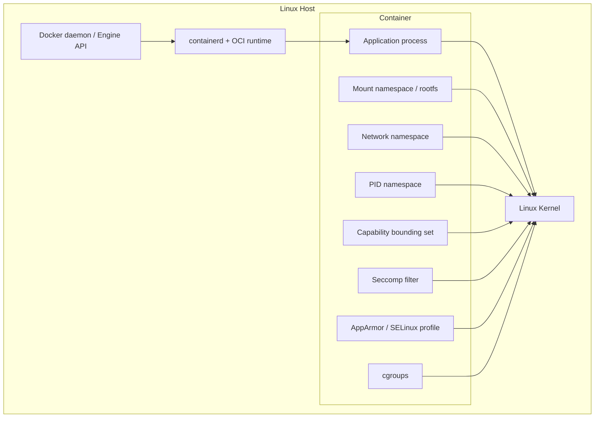
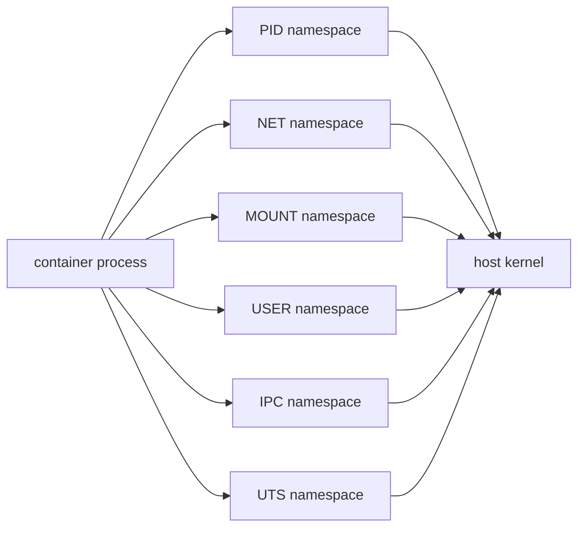
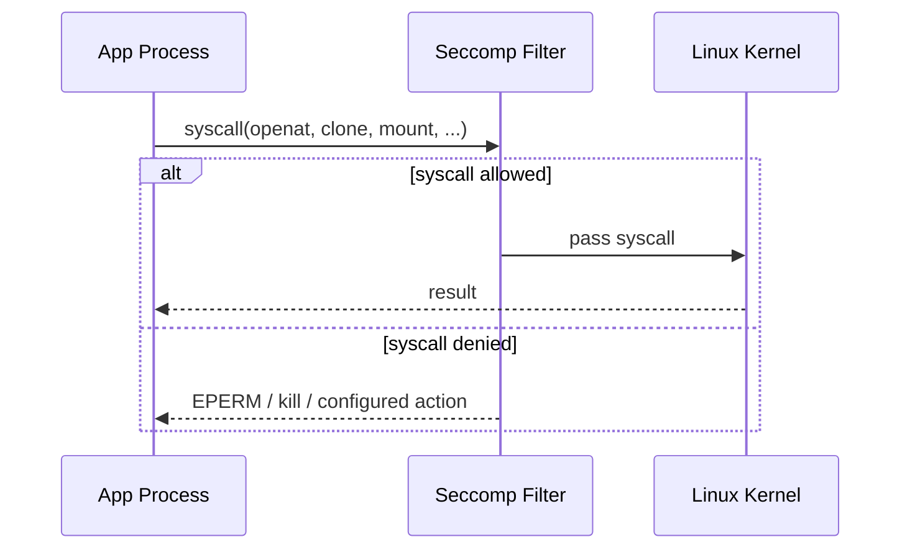
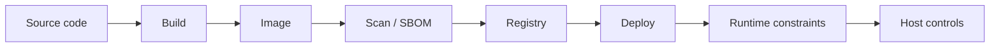
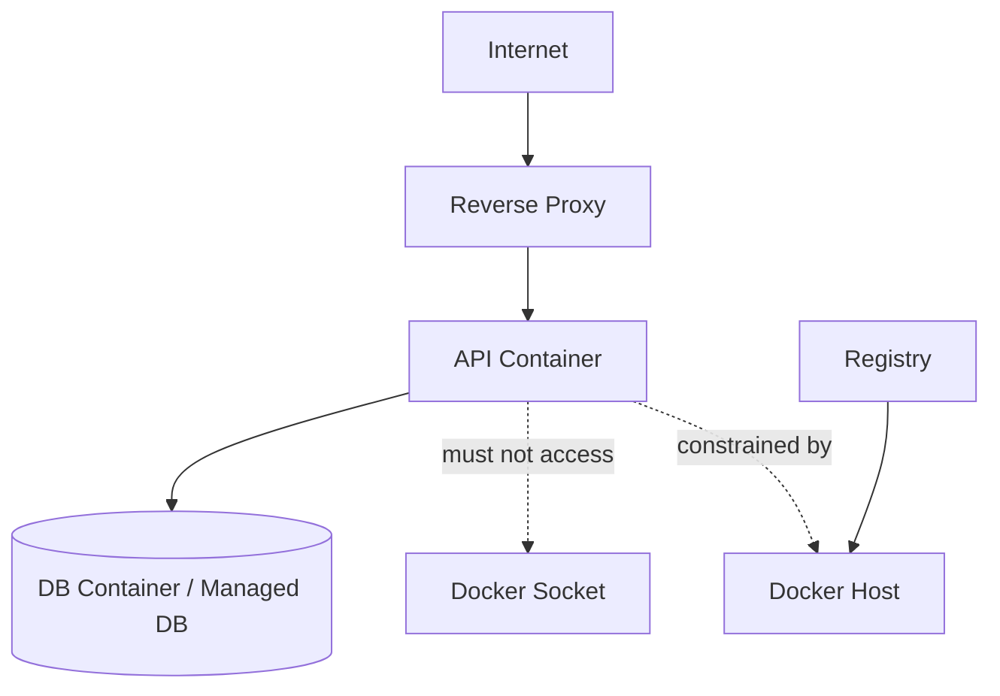
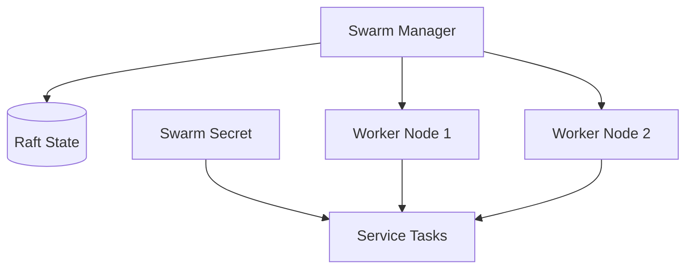

# Part 021 — Container Security Model: Namespaces, Cgroups, Capabilities, Seccomp, AppArmor

> Target pembelajaran: setelah part ini, kita mampu membaca container sebagai sistem keamanan berlapis, membedakan isolation boundary dari security guarantee, mengidentifikasi privilege escalation path, dan menjelaskan secara defensible mengapa sebuah container configuration aman atau berisiko.

Part 020 menutup fase Compose production boundary. Part ini membuka fase security.

Docker security tidak bisa dipahami hanya dengan checklist `USER nonroot`. Container berjalan di atas kernel host. Maka security container adalah kombinasi dari:

- kernel isolation primitive;
- Docker daemon control-plane security;
- image supply-chain security;
- runtime configuration;
- host hardening;
- network and storage boundary;
- operational discipline.

Docker sendiri merangkum area review security dalam beberapa area besar: kernel support untuk namespaces dan cgroups, attack surface Docker daemon, loophole dari konfigurasi container, serta hardening kernel features yang berinteraksi dengan container.

```text
Container security is not one switch.
It is a stack of constraints.
```

---

## 1. Security Mental Model

Container adalah proses host yang dibatasi.



Security boundary utama bukan Docker CLI. Boundary utamanya adalah kernel.

Docker membantu membuat container dengan konfigurasi default yang lebih aman daripada menjalankan proses langsung sebagai root di host, tetapi container bukan VM dan bukan sandbox absolut.

### 1.1 Pertanyaan Security yang Benar

Jangan mulai dari:

```text
Apakah container aman?
```

Mulai dari:

```text
Apa yang bisa dilakukan proses ini jika dikompromikan?
Boundary mana yang mencegahnya?
Boundary mana yang sengaja kita buka?
Apa dampaknya jika boundary itu gagal?
```

Container security selalu threat-specific.

| Threat | Pertanyaan Review |
|---|---|
| application compromise | apa privilege proses di container? |
| container breakout | kernel surface apa yang diekspos? |
| host filesystem damage | mount apa yang writable? |
| credential leakage | secret masuk image/env/log atau runtime secret? |
| lateral movement | network apa yang reachable dari container? |
| noisy neighbor | resource limit dan pids limit ada? |
| control-plane takeover | Docker socket/API terekspos? |
| supply-chain compromise | base image, dependency, digest, SBOM, scanning? |

---

## 2. Isolation vs Authorization vs Hardening

Security container punya tiga kategori mekanisme.

| Category | Contoh | Fungsi |
|---|---|---|
| isolation | namespaces, cgroups | memisahkan view dan resource |
| authorization | Linux permissions, capabilities, LSM | menentukan operasi yang boleh dilakukan |
| hardening | seccomp, read-only FS, non-root, no-new-privileges | mengurangi attack surface dan blast radius |

Kesalahan umum: menganggap salah satu mekanisme cukup.

Contoh:

- namespace network memisahkan interface, tetapi tidak otomatis membatasi egress;
- cgroups membatasi resource, tetapi tidak mencegah akses file host jika bind mount writable;
- non-root mengurangi privilege, tetapi tidak memperbaiki image yang menyimpan secret;
- seccomp mengurangi syscall surface, tetapi tidak mengganti patching kernel;
- read-only filesystem mengurangi persistence, tetapi aplikasi tetap bisa exfiltrate data lewat network.

Security yang kuat adalah komposisi.

---

## 3. Kernel Namespaces

Namespaces memberi proses container **view yang berbeda** terhadap resource kernel.

Container biasanya memakai beberapa namespace:

| Namespace | Mengisolasi | Contoh Dampak |
|---|---|---|
| PID | process ID tree | container melihat process set sendiri |
| NET | network interfaces, routes, ports | container punya interface dan network stack sendiri |
| MNT | mount points | container punya root filesystem view sendiri |
| UTS | hostname/domainname | container bisa punya hostname sendiri |
| IPC | System V IPC, POSIX message queues | IPC tidak bercampur antar container |
| USER | UID/GID mapping | root di container dapat dipetakan ke non-root di host |
| CGROUP | cgroup view | container dapat diberi view cgroup berbeda |



### 3.1 PID Namespace

PID namespace membuat proses dalam container melihat process tree sendiri.

Namun PID namespace bukan berarti proses bukan proses host. Di host, proses container tetap terlihat sebagai proses biasa.

```bash
# Dari container
ps aux

# Dari host
ps aux | grep <process>
```

Implication:

- monitoring host masih bisa melihat proses container;
- host root tetap bisa inspect/kill process;
- container tidak otomatis bisa melihat process host;
- `--pid=host` membuka boundary ini.

#### Risiko `--pid=host`

Jika container memakai PID namespace host, proses di container dapat melihat proses host.

```bash
# Berisiko
 docker run --pid=host ...
```

Gunakan hanya untuk observability/debugging agent yang memang butuh akses process host, dan kombinasikan dengan hardening lain.

### 3.2 Network Namespace

Network namespace memisahkan interface, route table, firewall view, dan port binding.

Default bridge memberi container interface virtual yang terhubung ke bridge host.

Risiko boundary:

| Configuration | Risiko |
|---|---|
| `--network host` | container memakai network namespace host |
| published port terlalu luas | service internal terekspos keluar |
| default egress bebas | compromised container bisa outbound scan/exfiltrate |
| shared network besar | lateral movement antar service |

Security review network harus bertanya:

```text
Siapa yang bisa masuk ke container?
Container bisa keluar ke mana?
Service mana yang bisa bicara langsung?
DNS name apa yang tersedia?
```

### 3.3 Mount Namespace

Mount namespace memberi root filesystem view terpisah.

Namun bind mount bisa membuka host filesystem.

```bash
# Sangat berisiko jika writable
 docker run -v /:/host alpine
```

Jika aplikasi hanya perlu membaca file config, jangan mount directory besar secara writable.

Gunakan prinsip:

```text
Mount only what is needed.
Make it read-only if possible.
Avoid mounting host control-plane paths.
```

Contoh lebih baik:

```bash
 docker run \
   --read-only \
   --mount type=bind,src=/opt/app/config.yaml,dst=/app/config.yaml,readonly \
   --tmpfs /tmp \
   myapp:1.0
```

### 3.4 User Namespace

User namespace memungkinkan UID/GID dalam container dipetakan ke UID/GID lain di host.

Tanpa user namespace remapping, root di container biasanya root juga dari perspektif kernel host untuk beberapa operasi yang lolos lewat boundary. Dengan user namespace, UID 0 di container dapat dipetakan ke subordinate UID non-privileged di host.

Mental model:

```text
container UID 0 != host UID 0
```

User namespace bukan pengganti non-root application user, tetapi sangat berguna untuk mengurangi dampak jika proses harus terlihat sebagai root di container.

---

## 4. Control Groups: Resource Isolation is Security

Cgroups membatasi dan mengukur resource.

Resource exhaustion adalah masalah security dan reliability.

| Resource | Risiko Tanpa Limit |
|---|---|
| memory | host OOM, service lain mati |
| CPU | starvation service lain |
| pids | fork bomb, host process table pressure |
| IO | disk latency spike |
| network | saturation, cascading timeout |

Contoh hardening dasar:

```bash
 docker run \
   --memory=512m \
   --cpus=1.0 \
   --pids-limit=256 \
   myapp:1.0
```

Compose equivalent:

```yaml
services:
  api:
    image: registry.example.com/api:1.0.0
    mem_limit: 512m
    cpus: 1.0
    pids_limit: 256
```

Untuk Swarm, resource harus diekspresikan lewat `deploy.resources`.

```yaml
services:
  api:
    image: registry.example.com/api:1.0.0
    deploy:
      resources:
        reservations:
          cpus: "0.25"
          memory: 256M
        limits:
          cpus: "1.0"
          memory: 512M
```

### 4.1 Security Invariant untuk Resource

```text
Every production container must have a resource envelope.
```

Tanpa envelope, kita tidak bisa menjawab:

- berapa banyak instance aman dijalankan di satu node;
- apa blast radius memory leak;
- apa dampak request spike;
- apakah OOM berasal dari aplikasi atau node pressure;
- apakah fork bomb bisa merusak host.

---

## 5. Docker Daemon Attack Surface

Docker daemon adalah komponen sangat sensitif.

Siapa pun yang punya akses penuh ke Docker daemon pada host biasanya dapat mendapatkan privilege tinggi di host, karena daemon bisa membuat container privileged, mount host filesystem, mengatur network, dan mengakses Docker control plane.

```mermaid
flowchart TB
  User[User / CI job / compromised app]
  Sock[/var/run/docker.sock]
  Daemon[dockerd]
  Priv[Privileged container]
  HostFS[Host filesystem mount]
  HostRoot[Host-level impact]

  User --> Sock --> Daemon
  Daemon --> Priv
  Daemon --> HostFS
  Priv --> HostRoot
  HostFS --> HostRoot
```

### 5.1 Docker Socket Is Root-Like

Mount Docker socket ke container hampir selalu high-risk.

```yaml
# Dangerous pattern
services:
  agent:
    image: some-agent
    volumes:
      - /var/run/docker.sock:/var/run/docker.sock
```

Risiko:

- container dapat membuat container lain;
- container dapat mount host filesystem;
- container dapat membaca metadata/image/secret yang tersedia ke daemon;
- compromised agent menjadi control-plane compromise.

Jika harus, batasi:

- hanya trusted agent;
- dedicated host;
- socket proxy dengan allowlist API;
- read-only observability alternatif bila cukup;
- network isolation;
- minimal token/credential;
- audit log.

### 5.2 Docker Group Risk

Menambahkan user ke group `docker` praktis memberi akses powerful ke Docker daemon. Ini harus diperlakukan sebagai privilege administratif, bukan sekadar convenience development.

Security review host harus mencatat:

```bash
getent group docker
```

---

## 6. Linux Capabilities

Linux capabilities memecah privilege root menjadi unit lebih kecil.

Root tradisional terlalu besar. Capabilities membuat operasi seperti mengubah network, mount filesystem, mengatur time, atau bypass permission bisa dikontrol lebih granular.

Contoh capability penting:

| Capability | Bisa Digunakan Untuk | Risiko |
|---|---|---|
| `CAP_NET_BIND_SERVICE` | bind port <1024 | biasanya relatif kecil |
| `CAP_NET_ADMIN` | ubah network config, iptables | sangat kuat |
| `CAP_SYS_ADMIN` | banyak operasi administratif | hampir setara “too much power” |
| `CAP_SYS_PTRACE` | trace process | sensitive untuk debugging/profiling |
| `CAP_CHOWN` | ubah ownership file | bisa perlu untuk init logic |
| `CAP_DAC_OVERRIDE` | bypass file permission checks | tinggi |
| `CAP_SETUID` | ubah UID | bisa perlu, tapi berisiko |
| `CAP_MKNOD` | create device node | berisiko |

Default Docker sudah membatasi capabilities, tetapi production hardening sering memakai `cap_drop`.

```bash
 docker run \
   --cap-drop=ALL \
   --cap-add=NET_BIND_SERVICE \
   myapp:1.0
```

Compose:

```yaml
services:
  api:
    image: registry.example.com/api:1.0.0
    cap_drop:
      - ALL
    cap_add:
      - NET_BIND_SERVICE
```

### 6.1 Capability Review Method

Jangan bertanya:

```text
Capability apa yang biasa dipakai image ini?
```

Tanyakan:

```text
System call dan kernel operation apa yang benar-benar dibutuhkan aplikasi ini?
```

Untuk HTTP API umum pada port non-privileged, biasanya tidak perlu capability tambahan sama sekali.

Jika app butuh bind port 80, opsi lebih aman:

- jalankan app di port 8080 dan expose via reverse proxy;
- gunakan `CAP_NET_BIND_SERVICE` saja;
- hindari `privileged`.

---

## 7. Seccomp

Seccomp membatasi syscall yang dapat dipanggil proses.

Container escape sering melibatkan kernel syscall surface. Mengurangi syscall surface mengurangi kemungkinan exploit berhasil.

Docker menyediakan default seccomp profile. Default profile dirancang sebagai trade-off: cukup protektif untuk memblokir sejumlah syscall berisiko, tetapi masih kompatibel dengan banyak workload.

```bash
# default seccomp digunakan secara otomatis pada Linux umum
 docker run myapp:1.0

# custom profile
 docker run --security-opt seccomp=/path/profile.json myapp:1.0

# jangan dilakukan kecuali debugging sangat spesifik
 docker run --security-opt seccomp=unconfined myapp:1.0
```

### 7.1 Seccomp Mental Model



### 7.2 Kapan Custom Seccomp Diperlukan?

Custom seccomp masuk akal ketika:

- workload butuh syscall yang diblok default profile;
- security baseline organisasi lebih ketat;
- workload sangat critical dan syscall set bisa dikontrol;
- runtime environment regulated/high assurance.

Namun custom seccomp punya maintenance cost.

Jika terlalu ketat:

- aplikasi gagal start;
- language runtime gagal membuat thread/process;
- profiler/debugger gagal;
- library update memperkenalkan syscall baru;
- incident debugging menjadi sulit.

---

## 8. AppArmor and SELinux

AppArmor dan SELinux adalah Linux Security Modules yang menerapkan mandatory access control.

Keduanya bisa membatasi apa yang boleh dilakukan proses, bahkan jika Linux discretionary permission biasa mengizinkan.

Docker dapat memakai profile default seperti `docker-default` pada platform yang mendukung AppArmor.

Contoh:

```bash
# AppArmor custom profile
 docker run --security-opt apparmor=my-profile myapp:1.0

# Disable AppArmor confinement; hindari di production
 docker run --security-opt apparmor=unconfined myapp:1.0
```

SELinux banyak ditemui pada RHEL/Fedora/CentOS family.

Bind mount SELinux context sering menjadi sumber permission issue. Namun solusi tidak boleh asal disable SELinux. Pahami label dan opsi mount.

```bash
# Contoh SELinux relabel untuk bind mount, tergantung kebutuhan host policy
 docker run -v ./data:/data:Z myapp:1.0
```

### 8.1 LSM as Last-Line Policy

LSM berguna karena:

- membatasi file path yang bisa diakses;
- membatasi capability effect;
- memberi policy tambahan di luar UID/GID;
- mengurangi impact exploit runtime;
- membantu compliance.

Namun LSM bukan pengganti:

- patching kernel;
- non-root user;
- minimal mount;
- no Docker socket exposure;
- image scanning;
- secret management.

---

## 9. Privileged Mode

`--privileged` adalah salah satu flag paling berbahaya.

Secara praktis, privileged mode membuka banyak boundary:

- memberi banyak/all capabilities;
- melemahkan seccomp/AppArmor/SELinux profile default;
- memberi akses device lebih luas;
- membuat container jauh lebih dekat ke host.

```bash
# Avoid in production unless you can defend it strongly
 docker run --privileged some-image
```

Compose:

```yaml
services:
  risky:
    image: some-image
    privileged: true
```

### 9.1 Pertanyaan Sebelum Privileged

Sebelum menyetujui privileged mode, jawab:

1. Operasi kernel spesifik apa yang dibutuhkan?
2. Capability spesifik apa yang sebenarnya cukup?
3. Device spesifik apa yang perlu di-mount?
4. Apakah bisa pakai sidecar/agent khusus di host terpisah?
5. Apakah workload harus berjalan di production node yang sama dengan workload lain?
6. Apa blast radius jika image ini compromised?
7. Apa audit dan detection yang tersedia?

Biasanya alternatif lebih baik:

```bash
 docker run \
   --cap-add=<specific-capability> \
   --device=/dev/<specific-device> \
   --security-opt=<specific-policy> \
   myagent:1.0
```

---

## 10. Root in Container

Root dalam container bukan selalu sama dengan root di host, tetapi tetap berisiko.

Risiko root in container:

- dapat menulis semua path writable dalam rootfs;
- dapat memodifikasi file yang dimiliki root pada mounted volume;
- dapat memanfaatkan capability default;
- jika breakout terjadi, dampaknya bisa lebih besar;
- jika host path mounted, ownership/perms bisa rusak;
- process dapat bind privileged port jika capability mengizinkan.

Dockerfile buruk:

```dockerfile
FROM eclipse-temurin:21-jre
WORKDIR /app
COPY app.jar app.jar
CMD ["java", "-jar", "app.jar"]
```

Lebih baik:

```dockerfile
FROM eclipse-temurin:21-jre
WORKDIR /app
RUN groupadd --system app && useradd --system --gid app --home-dir /app app
COPY --chown=app:app app.jar app.jar
USER app
CMD ["java", "-jar", "app.jar"]
```

Namun non-root saja tidak cukup jika:

- container diberi Docker socket;
- container privileged;
- bind mount writable ke host path sensitif;
- secret tersimpan di image;
- network egress tidak dikontrol;
- aplikasi punya RCE dan token cloud admin.

---

## 11. Filesystem Boundary

Filesystem adalah tempat security leak paling sering terjadi.

| Pattern | Risiko |
|---|---|
| secret di image layer | tetap bisa muncul lewat history/layer cache |
| writable rootfs | attacker bisa drop tool/persistence sementara |
| bind mount luas | host filesystem exposure |
| running as root | ownership host path rusak |
| shared volume antar trust boundary | data cross-contamination |
| Docker socket mount | control-plane takeover |

### 11.1 Read-only Root Filesystem

Read-only rootfs mengurangi kemampuan attacker memodifikasi runtime filesystem.

```bash
 docker run \
   --read-only \
   --tmpfs /tmp \
   --tmpfs /run \
   myapp:1.0
```

Compose:

```yaml
services:
  api:
    image: registry.example.com/api:1.0.0
    read_only: true
    tmpfs:
      - /tmp
      - /run
```

Read-only rootfs memaksa kita mendesain filesystem contract:

```text
What paths are writable?
Why?
By which UID?
For how long?
Is the data durable or temporary?
```

---

## 12. Network Boundary

Container network security tidak otomatis ketat.

Docker network memisahkan network namespace, tetapi egress biasanya bebas kecuali host/network policy membatasi.

Security invariant:

```text
Every service should be placed only on networks it actually needs.
```

Compose example:

```yaml
services:
  web:
    image: nginx:alpine
    ports:
      - "443:443"
    networks:
      - public
      - backend

  api:
    image: registry.example.com/api:1.0.0
    networks:
      - backend
      - data

  db:
    image: postgres:16
    networks:
      - data

networks:
  public: {}
  backend:
    internal: true
  data:
    internal: true
```

Catatan: `internal: true` pada Compose network membatasi external connectivity untuk network tersebut, tetapi jangan jadikan satu-satunya kontrol security. Host firewall, reverse proxy, dan environment policy tetap penting.

---

## 13. Image Security vs Runtime Security

Image security dan runtime security berbeda.

| Area | Pertanyaan |
|---|---|
| image | apa yang ada di artifact? |
| runtime | apa yang boleh dilakukan process? |
| registry | siapa boleh push/pull? |
| deployment | image mana yang boleh dipromosikan? |
| host | boundary kernel/daemon seperti apa? |

Image yang bersih tidak otomatis aman jika dijalankan privileged.

Runtime yang ketat tidak otomatis aman jika image membawa backdoor.

Maka security pipeline harus memeriksa keduanya.



---

## 14. Threat Modeling Container Workload

Gunakan template berikut untuk setiap workload production.

### 14.1 Asset

Apa yang dilindungi?

- customer data;
- database credentials;
- internal API token;
- service-to-service mTLS cert;
- host filesystem;
- Docker control plane;
- registry credential;
- CI/CD secret;
- logs with PII;
- model/data artifact;
- regulatory evidence.

### 14.2 Entry Points

Bagaimana attacker masuk?

- HTTP request;
- deserialization bug;
- dependency CVE;
- exposed admin endpoint;
- SSRF;
- shell in CI job;
- compromised base image;
- malicious internal user;
- published port;
- queue message;
- mounted file;
- environment variable leakage;
- debug endpoint.

### 14.3 Trust Boundaries

Boundary mana yang dilewati?



### 14.4 Misuse Case

Untuk setiap workload, tulis minimal lima misuse case:

1. Attacker mendapat RCE di API container.
2. Attacker membaca environment variable.
3. Attacker menulis ke mounted volume.
4. Attacker scan network internal.
5. Attacker mencoba akses Docker socket.
6. Attacker memicu memory leak/fork bomb.
7. Attacker memanfaatkan capability berlebih.
8. Attacker menulis binary persistence ke writable path.

### 14.5 Control Mapping

| Misuse Case | Control |
|---|---|
| RCE menulis rootfs | `read_only: true`, non-root, tmpfs minimal |
| RCE membaca secret env | runtime secret file, short-lived token, avoid env secret |
| fork bomb | `pids_limit`, memory limit |
| network scan | network segmentation, firewall, no unnecessary network attachment |
| host mount damage | read-only bind, no host root mount, UID/GID control |
| capability abuse | `cap_drop: [ALL]`, add only needed capabilities |
| syscall exploit | default/custom seccomp, patched kernel |
| daemon takeover | never mount Docker socket, protect daemon API |

---

## 15. Compose Security Model

Compose memudahkan konfigurasi, tetapi juga mudah menyembunyikan risiko dalam YAML.

Security-sensitive keys:

| Compose Key | Review Question |
|---|---|
| `privileged` | mengapa perlu? apa alternatifnya? |
| `cap_add` | capability mana dan kenapa? |
| `cap_drop` | apakah bisa drop all? |
| `security_opt` | seccomp/AppArmor/no-new-privileges? |
| `user` | apakah non-root? UID/GID stabil? |
| `read_only` | apakah rootfs immutable? |
| `tmpfs` | path writable sementara apa saja? |
| `volumes` | apakah host path sensitif? read-only? |
| `ports` | apakah port perlu publish ke host? interface terbatas? |
| `network_mode` | apakah memakai host network? |
| `pid` | apakah memakai host PID namespace? |
| `ipc` | apakah share IPC? |
| `devices` | device apa diekspos? |
| `environment` | apakah ada secret? |
| `secrets` | apakah secret runtime dipakai? |

Contoh Compose yang lebih defensible:

```yaml
services:
  api:
    image: registry.example.com/payments-api@sha256:...
    user: "10001:10001"
    read_only: true
    tmpfs:
      - /tmp:size=64m,noexec,nosuid,nodev
    cap_drop:
      - ALL
    security_opt:
      - no-new-privileges:true
    pids_limit: 256
    mem_limit: 512m
    cpus: 1.0
    networks:
      - backend
    secrets:
      - db_password
    environment:
      DB_PASSWORD_FILE: /run/secrets/db_password
    volumes:
      - type: volume
        source: api-cache
        target: /app/cache
    ports:
      - "127.0.0.1:8080:8080"

secrets:
  db_password:
    file: ./secrets/dev-db-password.txt

volumes:
  api-cache: {}

networks:
  backend:
    internal: true
```

---

## 16. Swarm Security Preview

Swarm menambah security layer dan complexity:

- node join token;
- manager/worker role;
- Raft state;
- mutual TLS antar node;
- secrets/configs;
- overlay network;
- service update policy;
- manager quorum.

Swarm security akan dibahas mendalam di part 025–031. Untuk sekarang, cukup pahami bahwa Swarm mengubah scope threat model dari single host ke cluster.



Manager compromise lebih serius daripada worker compromise karena manager mengontrol desired state cluster.

---

## 17. Security Anti-Patterns

### 17.1 `--privileged` by Default

Biasanya muncul karena permission issue tidak dipahami.

Lebih baik debug:

```bash
strace -f -e trace=file,process,network <app>
```

atau inspect permission/capability yang sebenarnya dibutuhkan.

### 17.2 Mount Docker Socket for Convenience

Sering muncul pada CI runner, reverse proxy auto-discovery, monitoring agent.

Tindakan:

- pisahkan host;
- gunakan socket proxy;
- baca-only alternative;
- API allowlist;
- jangan jalankan workload untrusted di host yang sama.

### 17.3 Secret in Environment

Environment variable mudah bocor lewat:

- process inspection;
- crash dump;
- logs;
- debugging output;
- metrics tags;
- `/proc` dalam kondisi tertentu;
- accidental support bundle.

Lebih baik secret file dengan permission ketat, runtime secret manager, atau orchestrator secret mechanism.

### 17.4 `latest` in Production

`latest` menghilangkan auditability. Security incident membutuhkan jawaban precise:

```text
Artifact mana yang berjalan pada waktu kejadian?
Digest-nya apa?
SBOM-nya apa?
CVE state saat deploy apa?
```

### 17.5 Shared Network for Everything

Network datar membuat lateral movement mudah.

Pisahkan:

- ingress/public;
- backend service;
- data service;
- observability;
- admin-only.

### 17.6 Host Path Mount Without Contract

Bind mount tanpa kontrak membuat aplikasi dapat merusak host path.

Kontrak minimal:

```text
source path:
target path:
read-only or writable:
owner UID/GID:
data classification:
retention:
backup requirement:
```

---

## 18. A Practical Security Review Checklist

Gunakan checklist ini saat code review Dockerfile/Compose/deployment.

### 18.1 Image

- [ ] image memakai tag immutable/digest untuk production;
- [ ] base image jelas dan disetujui;
- [ ] package manager cache dibersihkan;
- [ ] tidak ada secret di layer;
- [ ] image tidak membawa tool debug berlebihan di runtime variant;
- [ ] SBOM/scanning tersedia;
- [ ] image berjalan sebagai non-root atau ada alasan tertulis.

### 18.2 Runtime Identity

- [ ] `USER` diset di Dockerfile atau runtime;
- [ ] UID/GID stabil dan tidak bergantung pada username host;
- [ ] user tidak perlu shell/login;
- [ ] file ownership sesuai;
- [ ] no-new-privileges dipertimbangkan.

### 18.3 Filesystem

- [ ] root filesystem read-only jika bisa;
- [ ] writable path eksplisit;
- [ ] `/tmp`/`/run` memakai tmpfs bila cocok;
- [ ] bind mount read-only bila hanya perlu read;
- [ ] tidak mount `/`, `/etc`, `/var/run/docker.sock`, `/proc`, `/sys` tanpa alasan kuat;
- [ ] volume ownership jelas.

### 18.4 Kernel Surface

- [ ] tidak privileged;
- [ ] `cap_drop: [ALL]` dipakai jika mungkin;
- [ ] capability tambahan minimal dan terdokumentasi;
- [ ] default/custom seccomp aktif;
- [ ] AppArmor/SELinux tidak disabled tanpa alasan;
- [ ] host PID/network/IPC namespace tidak dipakai tanpa alasan.

### 18.5 Resource

- [ ] memory limit;
- [ ] CPU limit/reservation;
- [ ] pids limit;
- [ ] log rotation;
- [ ] disk growth risk dipahami;
- [ ] healthcheck tidak menyebabkan thundering herd.

### 18.6 Network

- [ ] port published hanya bila perlu;
- [ ] bind address eksplisit untuk local-only service;
- [ ] service berada pada network minimal;
- [ ] network internal digunakan untuk dependency privat;
- [ ] egress policy dipertimbangkan;
- [ ] admin/debug port tidak terekspos publik.

### 18.7 Secret

- [ ] secret tidak ada di image;
- [ ] secret tidak ada di Dockerfile `ARG`/`ENV` final;
- [ ] secret tidak dicetak ke log;
- [ ] secret dipasang sebagai runtime file/secret manager;
- [ ] rotation strategy ada;
- [ ] blast radius credential jelas.

---

## 19. Security Decision Matrix

| Workload Type | Recommended Baseline |
|---|---|
| stateless HTTP API | non-root, read-only, cap_drop all, no-new-privileges, memory/CPU/pids limit, internal network |
| background worker | same as API, no published ports, queue-only network |
| database container | non-root if supported, explicit volume, backup, strict network, resource limit, no public port |
| reverse proxy | bind public port, minimal caps, read-only config, cert secret, no Docker socket unless justified |
| CI runner | dedicated host, no mixed-trust workload, strict credential scope, ephemeral workspace |
| observability agent | carefully justified host mounts/caps, read-only where possible, dedicated profile |
| network appliance | high-risk; capability/device requirement must be explicit |

---

## 20. Debugging Security Failures

Security hardening often breaks assumptions. Diagnose systematically.

### 20.1 Permission Denied

Checklist:

```bash
id
ls -la /path
stat /path
mount | grep /path
```

Questions:

- process UID/GID apa?
- file owner siapa?
- bind mount dari host punya owner apa?
- SELinux/AppArmor blocking?
- rootfs read-only?
- path seharusnya tmpfs?

### 20.2 Operation Not Permitted

Possible causes:

- missing Linux capability;
- seccomp blocked syscall;
- AppArmor/SELinux denial;
- rootless limitation;
- read-only filesystem;
- host kernel restriction.

### 20.3 App Cannot Write `/tmp`

Jika rootfs read-only, tambahkan tmpfs:

```yaml
services:
  api:
    read_only: true
    tmpfs:
      - /tmp
```

### 20.4 Binding Port 80 Fails as Non-Root

Options:

- run app on 8080 and proxy 80/443;
- add `CAP_NET_BIND_SERVICE` only;
- configure runtime/sysctl depending on environment;
- avoid full root just for low port.

---

## 21. Minimal Secure Compose Example

```yaml
services:
  api:
    image: registry.example.com/api@sha256:replace-with-real-digest
    user: "10001:10001"
    read_only: true
    init: true
    cap_drop:
      - ALL
    security_opt:
      - no-new-privileges:true
    pids_limit: 256
    mem_limit: 512m
    cpus: 1.0
    tmpfs:
      - /tmp:size=64m,noexec,nosuid,nodev
      - /run:size=16m,noexec,nosuid,nodev
    environment:
      DB_PASSWORD_FILE: /run/secrets/db_password
    secrets:
      - db_password
    networks:
      - backend
    ports:
      - "127.0.0.1:8080:8080"
    healthcheck:
      test: ["CMD", "wget", "-q", "--spider", "http://127.0.0.1:8080/health"]
      interval: 10s
      timeout: 3s
      retries: 3
      start_period: 20s

secrets:
  db_password:
    file: ./secrets/dev-db-password.txt

networks:
  backend:
    internal: true
```

Catatan: contoh ini baseline, bukan universal. Beberapa image membutuhkan writable path tambahan, capability tertentu, atau healthcheck tool yang tidak tersedia di minimal image.

---

## 22. Practice Lab

### Lab 1 — Inspect Default Security

Run container:

```bash
 docker run --rm -it alpine sh
```

Inside:

```sh
id
cat /proc/self/status | grep Cap
mount | head
cat /proc/self/status | grep Seccomp
```

Goal:

- lihat UID;
- lihat capability mask;
- lihat mount;
- lihat seccomp status.

### Lab 2 — Drop All Capabilities

```bash
 docker run --rm -it --cap-drop=ALL alpine sh
```

Bandingkan:

```sh
cat /proc/self/status | grep Cap
```

### Lab 3 — Read-only Rootfs

```bash
 docker run --rm -it --read-only alpine sh
```

Coba:

```sh
touch /hello
```

Lalu tambah tmpfs:

```bash
 docker run --rm -it --read-only --tmpfs /tmp alpine sh
```

Coba:

```sh
touch /tmp/hello
```

### Lab 4 — Docker Socket Risk Thought Experiment

Jalankan hanya di lab disposable, bukan mesin penting.

```bash
 docker run --rm -it \
   -v /var/run/docker.sock:/var/run/docker.sock \
   docker:cli sh
```

Inside:

```sh
docker ps
```

Diskusikan: jika container ini compromised, apa yang dapat attacker lakukan?

### Lab 5 — Compose Security Review

Ambil Compose file aplikasi internal dan beri rating:

| Area | Score 0–2 | Finding |
|---|---:|---|
| non-root | | |
| read-only | | |
| capabilities | | |
| seccomp/AppArmor/no-new-privileges | | |
| resource limits | | |
| network segmentation | | |
| secrets | | |
| mounts | | |
| port exposure | | |

---

## 23. Mental Model Recap

Container security bukan “container aman atau tidak”. Container security adalah pertanyaan tentang **constraint**.

```text
A secure container is a constrained process with explicit privileges, explicit filesystem contract, explicit network reachability, explicit resource envelope, and controlled access to secrets and host interfaces.
```

Layer utama:

1. Namespaces memberi view terpisah.
2. Cgroups memberi resource boundary.
3. Capabilities mengurangi root power.
4. Seccomp mengurangi syscall surface.
5. AppArmor/SELinux memberi mandatory policy.
6. Non-root mengurangi privilege inside container.
7. Read-only filesystem mengurangi mutation/persistence.
8. No Docker socket menjaga control-plane boundary.
9. Resource limits menjaga host dan neighbor.
10. Secret discipline menjaga credential tidak bocor.

---

## 24. References

- Docker Docs — Docker Engine security: https://docs.docker.com/engine/security/
- Docker Docs — Seccomp security profiles: https://docs.docker.com/engine/security/seccomp/
- Docker Docs — AppArmor security profiles: https://docs.docker.com/engine/security/apparmor/
- Docker Docs — Rootless mode: https://docs.docker.com/engine/security/rootless/
- Docker Docs — Isolate containers with a user namespace: https://docs.docker.com/engine/security/userns-remap/
- Docker Docs — `docker container run`: https://docs.docker.com/reference/cli/docker/container/run/
- Docker Docs — Compose services reference: https://docs.docker.com/reference/compose-file/services/

---

## 25. What Comes Next

Part 022 akan mengubah model security ini menjadi runtime hardening standard yang lebih operasional:

- non-root image design;
- read-only root filesystem;
- `cap_drop` dan capability allowlist;
- `no-new-privileges`;
- user namespace remapping;
- rootless Docker;
- hardening Dockerfile, `docker run`, Compose, dan daemon configuration.
