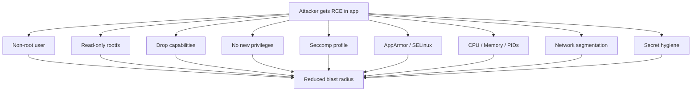
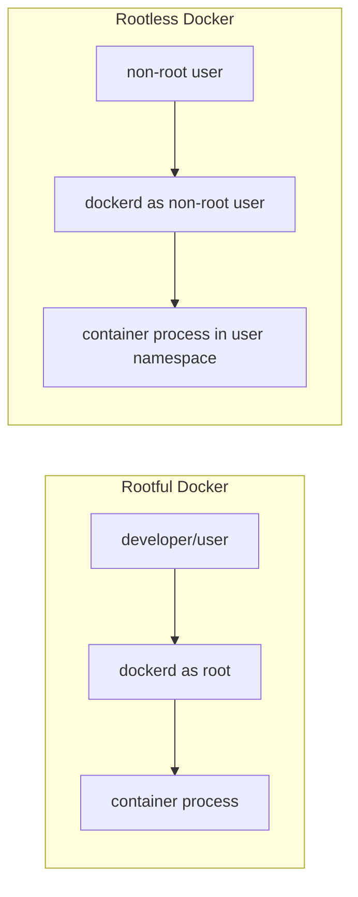
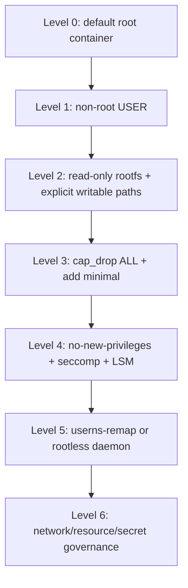

# Part 022 — Runtime Hardening: Non-Root, Read-Only FS, Cap Drop, UserNS, Rootless

> Target pembelajaran: setelah part ini, kita mampu membuat baseline runtime hardening yang bisa diterapkan pada Dockerfile, `docker run`, Compose, dan Docker daemon; mampu menjelaskan trade-off setiap kontrol; dan mampu memverifikasi apakah hardening benar-benar aktif.

Part 021 menjelaskan model security container. Part ini mengubah model itu menjadi standard operasional.

Hardening bukan sekadar menyalakan semua flag. Hardening adalah proses mengurangi privilege sampai aplikasi masih berjalan dengan benar.

```text
Start restrictive.
Add only what the workload proves it needs.
Document every exception.
```

---

## 1. Runtime Hardening Mental Model

Runtime hardening menjawab satu pertanyaan utama:

```text
If this process is compromised, what can it still do?
```

Container hardening mengurangi kemampuan attacker setelah masuk.



Hardening layer:

| Control | Mengurangi Risiko |
|---|---|
| non-root user | privilege di filesystem/process turun |
| read-only rootfs | attacker sulit menulis binary/persistence |
| tmpfs explicit | writable path dibatasi dan ephemeral |
| cap drop | root power dipotong |
| no-new-privileges | proses tidak bisa memperoleh privilege tambahan lewat exec/setuid |
| seccomp | syscall surface turun |
| AppArmor/SELinux | mandatory policy tambahan |
| userns-remap | container root dipetakan ke host non-root |
| rootless Docker | daemon dan container tidak berjalan sebagai host root |
| resource limits | DoS blast radius turun |
| network segmentation | lateral movement turun |
| secret file | credential leakage turun dibanding image/env |

---

## 2. Baseline Hardening Standard

Untuk stateless application umum, baseline yang bagus:

```yaml
services:
  api:
    image: registry.example.com/api@sha256:replace-with-real-digest
    user: "10001:10001"
    read_only: true
    init: true
    cap_drop:
      - ALL
    security_opt:
      - no-new-privileges:true
    pids_limit: 256
    mem_limit: 512m
    cpus: 1.0
    tmpfs:
      - /tmp:size=64m,noexec,nosuid,nodev
      - /run:size=16m,noexec,nosuid,nodev
    networks:
      - backend
    environment:
      APP_ENV: production
      DB_PASSWORD_FILE: /run/secrets/db_password
    secrets:
      - db_password
    ports:
      - "127.0.0.1:8080:8080"

secrets:
  db_password:
    file: ./secrets/dev-db-password.txt

networks:
  backend:
    internal: true
```

Baseline ini tidak universal, tetapi memberi titik awal yang defensible.

Untuk production Swarm, syntax resource/secrets berbeda sebagian dan akan dibahas pada part Swarm.

---

## 3. Non-Root User

### 3.1 Why Non-Root Matters

Root dalam container tetap powerful dalam container boundary. Jika boundary salah konfigurasi, root memperbesar dampak.

Non-root membantu ketika:

- aplikasi memiliki RCE;
- filesystem writable;
- mounted volume punya permission terbatas;
- capability set minimal;
- rootfs read-only;
- attacker mencoba menulis path milik root;
- dependency mencoba menjalankan privileged operation.

### 3.2 Dockerfile Pattern

Contoh Java application:

```dockerfile
FROM eclipse-temurin:21-jre

WORKDIR /app

RUN groupadd --system --gid 10001 app \
 && useradd --system --uid 10001 --gid 10001 --home-dir /app --shell /usr/sbin/nologin app

COPY --chown=10001:10001 target/app.jar /app/app.jar

USER 10001:10001

EXPOSE 8080

ENTRYPOINT ["java", "-jar", "/app/app.jar"]
```

Kenapa UID numerik?

- tidak bergantung pada `/etc/passwd` runtime;
- lebih jelas saat bind mount/volume;
- mudah diaudit;
- konsisten linting/security policy.

### 3.3 Alpine Pattern

```dockerfile
FROM alpine:3.20

RUN addgroup -S -g 10001 app \
 && adduser -S -D -H -u 10001 -G app app

WORKDIR /app
COPY --chown=10001:10001 app /app/app
USER 10001:10001
ENTRYPOINT ["/app/app"]
```

### 3.4 Distroless Pattern

Distroless image sering tidak punya package manager/shell. Ini bagus untuk runtime minimal, tetapi debugging perlu strategi.

```dockerfile
FROM gcr.io/distroless/java21-debian12:nonroot
WORKDIR /app
COPY app.jar /app/app.jar
USER nonroot
ENTRYPOINT ["java", "-jar", "/app/app.jar"]
```

Catatan: base image dan tag harus sesuai policy organisasi. Distroless memerlukan debug approach berbeda, misalnya debug image variant atau ephemeral debug tooling.

### 3.5 Runtime Override

Jika image belum non-root, override di runtime:

```bash
 docker run --user 10001:10001 myapp:1.0
```

Compose:

```yaml
services:
  api:
    image: myapp:1.0
    user: "10001:10001"
```

Namun runtime override bisa gagal jika image filesystem belum siap:

- `/app` dimiliki root;
- app ingin write ke home directory;
- cache directory tidak writable;
- cert/truststore path tidak readable;
- entrypoint script perlu root.

Image yang baik harus dirancang untuk non-root sejak build.

---

## 4. Filesystem Hardening

### 4.1 Read-Only Root Filesystem

Read-only rootfs membuat root filesystem immutable saat runtime.

```bash
 docker run --read-only myapp:1.0
```

Compose:

```yaml
services:
  api:
    image: myapp:1.0
    read_only: true
```

Dampak positif:

- mencegah write ke `/usr`, `/bin`, `/app`, `/etc`;
- mengurangi persistence jika RCE;
- memaksa explicit writable contract;
- memudahkan reasoning incident response.

Dampak operasional:

- app yang menulis log file lokal akan gagal;
- language runtime mungkin butuh `/tmp`;
- framework mungkin menulis cache;
- pid file path perlu writable;
- package update saat runtime tidak mungkin.

### 4.2 Explicit Writable Paths

Tambahkan hanya path yang benar-benar perlu writable.

```yaml
services:
  api:
    image: myapp:1.0
    read_only: true
    tmpfs:
      - /tmp:size=64m,noexec,nosuid,nodev
      - /run:size=16m,noexec,nosuid,nodev
    volumes:
      - type: volume
        source: app-cache
        target: /app/cache

volumes:
  app-cache: {}
```

Rule:

| Data Type | Storage |
|---|---|
| temporary scratch | tmpfs |
| durable app data | named volume / external storage |
| config | read-only file/config object |
| secret | runtime secret file |
| logs | stdout/stderr, not local file unless justified |
| cache | volume only if beneficial and safe |

### 4.3 tmpfs Mount Options

Gunakan opsi untuk mengurangi risiko:

```yaml
services:
  api:
    tmpfs:
      - /tmp:size=64m,noexec,nosuid,nodev
```

| Option | Meaning |
|---|---|
| `size=64m` | batasi memory tmpfs |
| `noexec` | file tidak bisa dieksekusi dari mount |
| `nosuid` | setuid/setgid tidak berlaku |
| `nodev` | device file tidak diperlakukan sebagai device |

### 4.4 Bind Mount Hardening

Bind mount harus rare di production kecuali ada alasan kuat.

Bad:

```yaml
volumes:
  - /:/host
```

Better:

```yaml
volumes:
  - type: bind
    source: /etc/myapp/config.yaml
    target: /app/config.yaml
    read_only: true
```

Checklist:

- source path spesifik;
- read-only jika memungkinkan;
- owner UID/GID cocok;
- SELinux/AppArmor dipahami;
- tidak mount Docker socket;
- tidak mount host root;
- tidak mount `/proc`/`/sys` kecuali agent khusus;
- data classification jelas.

---

## 5. Capability Hardening

### 5.1 Drop All, Add Back Only What Is Needed

Pattern paling defensible:

```bash
 docker run \
   --cap-drop=ALL \
   myapp:1.0
```

Jika perlu bind port rendah:

```bash
 docker run \
   --cap-drop=ALL \
   --cap-add=NET_BIND_SERVICE \
   myapp:1.0
```

Compose:

```yaml
services:
  api:
    image: myapp:1.0
    cap_drop:
      - ALL
    cap_add:
      - NET_BIND_SERVICE
```

### 5.2 Avoid `CAP_SYS_ADMIN`

`CAP_SYS_ADMIN` terlalu luas. Banyak engineer menyebutnya “the new root” karena banyak operasi kernel administratif dikumpulkan di sana.

Jika sebuah image meminta `CAP_SYS_ADMIN`, treat as high-risk exception.

Pertanyaan review:

```text
Operasi spesifik apa yang membutuhkan CAP_SYS_ADMIN?
Apakah ada capability lebih sempit?
Apakah bisa memakai helper di host terpisah?
Apakah workload ini harus co-located dengan workload lain?
```

### 5.3 Common Capability Decisions

| Need | Better Option |
|---|---|
| bind port 80/443 | reverse proxy atau `NET_BIND_SERVICE` |
| packet capture | dedicated debug session, temporary `NET_RAW`/`NET_ADMIN` if justified |
| iptables | avoid in app container; use network layer/host agent |
| mount filesystem | avoid; use orchestrator/host preparation |
| ptrace profiler | temporary debug profile, not always-on production |
| change system time | avoid; use host time sync |

---

## 6. No New Privileges

`no-new-privileges` mencegah proses memperoleh privilege tambahan melalui `execve`, misalnya lewat setuid/setgid binary atau file capability.

Docker run:

```bash
 docker run --security-opt no-new-privileges:true myapp:1.0
```

Compose:

```yaml
services:
  api:
    image: myapp:1.0
    security_opt:
      - no-new-privileges:true
```

Ini hampir selalu layak untuk aplikasi stateless biasa.

Namun bisa mengganggu workload yang memang mengandalkan setuid behavior. Jika demikian, workload harus diberi exception yang terdokumentasi.

---

## 7. Seccomp Hardening

Docker default seccomp profile biasanya aktif di Linux default. Jangan disable tanpa alasan kuat.

```bash
# default
 docker run myapp:1.0

# custom
 docker run --security-opt seccomp=./seccomp-profile.json myapp:1.0

# avoid
 docker run --security-opt seccomp=unconfined myapp:1.0
```

Compose:

```yaml
services:
  api:
    image: myapp:1.0
    security_opt:
      - seccomp=./seccomp-profile.json
```

### 7.1 When Default Seccomp Breaks Apps

Gejala:

- `Operation not permitted` tanpa file permission issue;
- profiler/debugger gagal;
- sandboxed runtime gagal;
- language runtime tertentu gagal melakukan syscall baru;
- browser/headless workload butuh konfigurasi khusus.

Process:

1. reproduksi di environment disposable;
2. cek log kernel/audit jika tersedia;
3. identifikasi syscall;
4. pertimbangkan capability/seccomp profile minimal;
5. jangan langsung `unconfined` permanen.

---

## 8. AppArmor / SELinux Hardening

### 8.1 AppArmor

Jika platform mendukung AppArmor, Docker bisa menjalankan container dengan profile default.

Custom AppArmor:

```bash
 docker run --security-opt apparmor=my-profile myapp:1.0
```

Disable confinement hanya untuk debugging terbatas:

```bash
 docker run --security-opt apparmor=unconfined myapp:1.0
```

### 8.2 SELinux

Pada host SELinux, permission issue bind mount sering muncul.

Jangan reflex disable SELinux.

Periksa:

```bash
ls -Z /path/on/host
```

Mount relabeling, jika sesuai policy:

```bash
 docker run -v /host/data:/data:Z myapp:1.0
```

atau shared label:

```bash
 docker run -v /host/data:/data:z myapp:1.0
```

Catatan: penggunaan `:Z`/`:z` harus dipahami karena mengubah label context host path.

---

## 9. User Namespace Remapping

User namespace remapping memetakan UID/GID container ke subordinate UID/GID di host.

Tujuan:

```text
root inside container should not be root on host.
```

Docker daemon config example:

```json
{
  "userns-remap": "default"
}
```

Biasanya disimpan di:

```text
/etc/docker/daemon.json
```

Lalu restart daemon:

```bash
sudo systemctl restart docker
```

### 9.1 How to Think About It

Tanpa userns-remap:

```text
container UID 0 -> host UID 0-ish behavior through kernel boundary
```

Dengan userns-remap:

```text
container UID 0 -> host subordinate UID, e.g. 231072
container UID 1 -> host subordinate UID + 1
```

### 9.2 Benefits

- mengurangi impact root in container;
- melindungi host file ownership;
- membuat breakout/mount mistake lebih sulit dieksploitasi;
- bagus sebagai daemon-level defense.

### 9.3 Trade-Offs

- bind mount permission lebih kompleks;
- existing volumes/image cache bisa butuh migration;
- beberapa workloads/tools tidak kompatibel;
- debugging UID/GID mapping lebih sulit;
- perlu konfigurasi `/etc/subuid` dan `/etc/subgid`.

### 9.4 When to Use

Strong candidate:

- shared hosts;
- regulated environment;
- multi-team Docker host;
- production nodes;
- workload yang tidak butuh host-level privilege.

Caution:

- host agents;
- Docker-in-Docker;
- workloads dengan device/mount khusus;
- legacy app yang sangat bergantung UID host.

---

## 10. Rootless Docker

Rootless mode menjalankan Docker daemon dan container sebagai non-root user.

Ini berbeda dari hanya menjalankan app sebagai non-root di dalam container.



### 10.1 Benefits

- mengurangi risiko vulnerability di daemon/runtime;
- mengurangi host root exposure;
- cocok untuk developer workstation dan beberapa server workload;
- mengurangi bahaya akses daemon tertentu.

### 10.2 Limitations

Rootless punya limitation yang harus dipahami:

- network behavior bisa berbeda;
- privileged ports mungkin butuh konfigurasi tambahan;
- cgroup/resource limit tergantung cgroup v2/systemd support;
- storage driver support bisa berbeda;
- beberapa host integration/device workload tidak cocok;
- performance karakteristik bisa berbeda tergantung environment.

### 10.3 Rootless Is Not Magic

Rootless Docker tidak otomatis memperbaiki:

- vulnerable application;
- secret di image;
- broad network egress;
- overly permissive cloud credentials;
- image supply-chain compromise;
- application-level auth bug.

Tetap butuh hardening container.

---

## 11. Privilege Escalation Prevention Ladder

Gunakan ladder ini sebagai review standard.



Minimum recommended for internal production stateless apps:

```text
Level 4, plus resource and network controls.
```

For high-risk multi-tenant/shared host:

```text
Level 5+ strongly recommended.
```

---

## 12. Dockerfile Hardening Pattern

A production Dockerfile should encode as much safety as possible at build time.

```dockerfile
FROM eclipse-temurin:21-jre AS runtime

LABEL org.opencontainers.image.title="payments-api" \
      org.opencontainers.image.description="Payments API runtime image" \
      org.opencontainers.image.vendor="Example Corp"

WORKDIR /app

RUN groupadd --system --gid 10001 app \
 && useradd --system --uid 10001 --gid 10001 --home-dir /app --shell /usr/sbin/nologin app \
 && mkdir -p /app/cache \
 && chown -R 10001:10001 /app

COPY --chown=10001:10001 target/payments-api.jar /app/app.jar

USER 10001:10001

EXPOSE 8080

ENTRYPOINT ["java", "-jar", "/app/app.jar"]
```

Design choices:

| Choice | Reason |
|---|---|
| numeric UID/GID | stable identity |
| no shell login | reduce interactive assumption |
| `COPY --chown` | avoid root-owned app artifact |
| no package manager in final stage if possible | reduce runtime surface |
| app writes only known paths | enables read-only rootfs |
| no secret in image | preserves artifact integrity |

---

## 13. Hardened `docker run` Pattern

```bash
 docker run --rm \
   --name payments-api \
   --user 10001:10001 \
   --read-only \
   --tmpfs /tmp:size=64m,noexec,nosuid,nodev \
   --tmpfs /run:size=16m,noexec,nosuid,nodev \
   --cap-drop=ALL \
   --security-opt no-new-privileges:true \
   --memory=512m \
   --cpus=1.0 \
   --pids-limit=256 \
   --network payments-backend \
   --publish 127.0.0.1:8080:8080 \
   registry.example.com/payments-api@sha256:replace
```

Add only if needed:

```bash
--cap-add=NET_BIND_SERVICE
--mount type=volume,source=payments-cache,target=/app/cache
--security-opt seccomp=/path/profile.json
--security-opt apparmor=my-profile
```

Avoid unless justified:

```bash
--privileged
--pid=host
--network=host
-v /var/run/docker.sock:/var/run/docker.sock
-v /:/host
--security-opt seccomp=unconfined
--security-opt apparmor=unconfined
```

---

## 14. Hardened Compose Pattern

```yaml
services:
  payments-api:
    image: registry.example.com/payments-api@sha256:replace
    user: "10001:10001"
    read_only: true
    init: true
    cap_drop:
      - ALL
    security_opt:
      - no-new-privileges:true
    pids_limit: 256
    mem_limit: 512m
    cpus: 1.0
    tmpfs:
      - /tmp:size=64m,noexec,nosuid,nodev
      - /run:size=16m,noexec,nosuid,nodev
    volumes:
      - type: volume
        source: payments-cache
        target: /app/cache
    secrets:
      - db_password
    environment:
      SPRING_PROFILES_ACTIVE: production
      DB_PASSWORD_FILE: /run/secrets/db_password
    networks:
      - backend
    ports:
      - "127.0.0.1:8080:8080"
    healthcheck:
      test: ["CMD", "java", "-jar", "/app/app.jar", "--healthcheck"]
      interval: 10s
      timeout: 3s
      retries: 3
      start_period: 30s

volumes:
  payments-cache: {}

secrets:
  db_password:
    file: ./secrets/db_password.txt

networks:
  backend:
    internal: true
```

### 14.1 Compose Review Questions

- Apakah `user` numeric?
- Apakah rootfs read-only?
- Apakah writable path eksplisit?
- Apakah `cap_drop: ALL` bisa dipakai?
- Apakah `security_opt` memakai no-new-privileges?
- Apakah port bind ke `127.0.0.1` jika tidak public?
- Apakah network segmentation masuk akal?
- Apakah secret via file, bukan env literal?
- Apakah resource limit ada?
- Apakah tidak ada Docker socket mount?
- Apakah tidak ada `privileged: true`?

---

## 15. Hardening Exceptions

Tidak semua workload bisa baseline ketat. Yang penting: exception harus eksplisit.

Exception template:

```mdx
### Security Exception: <service>/<control>

- Control being relaxed:
- Required because:
- Alternative considered:
- Blast radius:
- Compensating controls:
- Owner:
- Expiry/review date:
- Test proving requirement:
```

Contoh:

```mdx
### Security Exception: observability-agent/CAP_SYS_PTRACE

- Control being relaxed: add CAP_SYS_PTRACE
- Required because: temporary production profiling during incident analysis
- Alternative considered: application-level profiler endpoint, insufficient for native thread state
- Blast radius: process inspection risk on same PID namespace
- Compensating controls: dedicated debug host, short TTL, no secrets mounted, audit command log
- Owner: platform team
- Expiry/review date: 2026-07-15
- Test proving requirement: profiler fails with EPERM without capability
```

---

## 16. Verification: Do Not Trust YAML Blindly

A setting in YAML is not proof. Verify runtime state.

### 16.1 Verify User

```bash
 docker exec <container> id
```

Expected:

```text
uid=10001 gid=10001
```

### 16.2 Verify Read-Only Rootfs

```bash
 docker exec <container> sh -c 'touch /should-fail'
```

Expected: permission/read-only error.

### 16.3 Verify tmpfs

```bash
 docker exec <container> sh -c 'touch /tmp/should-work && mount | grep /tmp'
```

### 16.4 Verify Capabilities

```bash
 docker exec <container> sh -c 'grep Cap /proc/self/status'
```

Interpretation may require capability decoder:

```bash
capsh --decode=<hex-value>
```

If `capsh` is not in container, run debug tool externally or use a temporary debug image in same security context.

### 16.5 Verify Seccomp

```bash
 docker exec <container> sh -c 'grep Seccomp /proc/self/status'
```

Typical values:

| Value | Meaning |
|---:|---|
| 0 | disabled |
| 1 | strict mode |
| 2 | filter mode |

### 16.6 Inspect HostConfig

```bash
 docker inspect <container> \
   --format '{{json .HostConfig.SecurityOpt}}'

 docker inspect <container> \
   --format '{{json .HostConfig.CapDrop}}'

 docker inspect <container> \
   --format '{{json .HostConfig.ReadonlyRootfs}}'
```

### 16.7 Verify Published Ports

```bash
 docker port <container>
 ss -lntp | grep 8080
```

Expected if local-only:

```text
127.0.0.1:8080
```

---

## 17. Common Breakages and Fixes

### 17.1 App Fails Because It Cannot Write Logs

Bad assumption: app writes to `/var/log/app.log`.

Better:

- write logs to stdout/stderr;
- let logging driver/agent collect;
- avoid local file logs unless legacy.

### 17.2 Java App Needs `/tmp`

Add tmpfs:

```yaml
services:
  api:
    read_only: true
    tmpfs:
      - /tmp:size=128m,noexec,nosuid,nodev
```

### 17.3 App Needs Cache Directory

Create explicit volume or tmpfs depending on durability.

```yaml
volumes:
  - type: volume
    source: app-cache
    target: /app/cache
```

Ensure ownership:

```dockerfile
RUN mkdir -p /app/cache && chown -R 10001:10001 /app/cache
```

### 17.4 Binding Port 80 Fails

Prefer:

```text
container listens on 8080
reverse proxy listens on 80/443
```

Or add minimal capability:

```yaml
cap_drop:
  - ALL
cap_add:
  - NET_BIND_SERVICE
```

### 17.5 Healthcheck Tool Missing

Minimal image may not have `curl`, `wget`, or shell.

Options:

- app exposes built-in healthcheck subcommand;
- use runtime-native check;
- include minimal healthcheck binary;
- use external health monitoring instead;
- create debug variant, not bloated production image.

Example:

```dockerfile
HEALTHCHECK --interval=10s --timeout=3s --retries=3 \
  CMD ["/app/app", "healthcheck"]
```

### 17.6 Non-Root Cannot Read Mounted Secret

Check:

```bash
ls -l /run/secrets
id
```

Fix may involve:

- orchestrator secret permission support;
- app reading file as allowed user;
- entrypoint not changing ownership at runtime;
- avoid baking secret into image.

---

## 18. CI/CD Hardening Gates

Hardening should be automated.

### 18.1 Dockerfile Lint Ideas

Fail build if:

- no `USER` in final stage;
- `ADD` remote URL used without strong reason;
- package manager cache remains;
- secret-looking `ENV` exists;
- `latest` base image used;
- final image contains shell when policy forbids;
- final image runs as root.

### 18.2 Compose Policy Ideas

Fail deploy if:

- `privileged: true` without exception label;
- Docker socket mounted;
- host root mounted;
- `network_mode: host` without exception;
- `pid: host` without exception;
- `cap_add` contains `SYS_ADMIN` without exception;
- `security_opt` disables seccomp/AppArmor;
- missing resource limits;
- published port lacks bind address where required;
- secret literal in environment.

### 18.3 Example Policy-as-Code Pseudocode

```rego
package docker.compose.security

deny[msg] {
  service := input.services[name]
  service.privileged == true
  not service.labels["security.exception/id"]
  msg := sprintf("service %s is privileged without exception", [name])
}

deny[msg] {
  service := input.services[name]
  volume := service.volumes[_]
  contains(volume, "/var/run/docker.sock")
  msg := sprintf("service %s mounts Docker socket", [name])
}
```

The exact policy engine is less important than the invariant: risky runtime settings require review.

---

## 19. Hardening by Workload Type

### 19.1 Stateless HTTP API

Baseline:

- non-root;
- read-only;
- tmpfs `/tmp` and `/run`;
- cap_drop all;
- no-new-privileges;
- memory/CPU/pids limit;
- no Docker socket;
- no host network;
- no secret env literal;
- internal backend network;
- public exposure only through reverse proxy.

### 19.2 Worker

Additional:

- no published ports;
- network only to broker and dependencies;
- strict queue credential;
- concurrency tied to CPU/memory envelope;
- idempotency for restart.

### 19.3 Database

Nuance:

- database images often need writable data volume;
- read-only rootfs may still work if data/tmp paths explicit;
- resource reservation important;
- no public port;
- backup path explicit;
- volume encryption/host disk policy;
- UID/GID ownership must be stable.

### 19.4 Reverse Proxy

Nuance:

- needs public port;
- may need cert secret;
- should not automatically require Docker socket;
- if auto-discovery uses socket, use socket proxy/isolated host;
- config read-only;
- logs stdout/stderr.

### 19.5 Observability Agent

Nuance:

- often needs host PID, `/proc`, `/sys`, Docker socket, or capabilities;
- treat as privileged infrastructure component;
- isolate from business workloads if possible;
- use vendor hardening guide;
- document exceptions.

---

## 20. Runtime Hardening Scorecard

Use this scorecard for review.

| Control | 0 | 1 | 2 |
|---|---|---|---|
| user | root | runtime override only | image designed non-root |
| rootfs | fully writable | partial writable discipline | read-only + explicit writable paths |
| capabilities | default/unknown | some dropped | drop all + allowlist |
| privilege escalation | unknown | no-new-privileges considered | enforced |
| seccomp | disabled/unknown | default | default verified/custom justified |
| LSM | disabled/unknown | default | custom/profiled where needed |
| user namespace | none | evaluated | userns-remap/rootless where appropriate |
| mounts | broad writable | scoped | scoped + read-only by default |
| resources | none | partial | CPU/memory/pids/log controls |
| network | flat/public | partial segmentation | minimal networks + explicit ports |
| secrets | image/env | mixed | runtime files/secret manager |
| auditability | mutable tags | versioned tags | digest + SBOM + policy evidence |

Target:

- dev local: at least 12/24;
- internal production: at least 18/24;
- regulated/high-risk: 21+/24 with documented exceptions.

---

## 21. Hardening Failure Mode Table

| Control Missing | Plausible Failure Mode |
|---|---|
| non-root | RCE modifies app files and volume content as root |
| read-only rootfs | attacker drops tooling/backdoor in writable rootfs |
| cap drop | process abuses default capability |
| no-new-privileges | setuid/file capability path escalates privilege |
| seccomp | exploit gets larger syscall surface |
| LSM | filesystem/kernel policy less constrained |
| pids limit | fork bomb impacts host |
| memory limit | memory leak pressures node/neighbor |
| network segmentation | compromised API scans DB/admin service |
| secret file discipline | secret appears in logs/env/inspection output |
| digest pinning | redeploy pulls unexpected artifact |
| Docker socket protection | container controls host Docker daemon |

---

## 22. Secure-by-Default Template Repository Structure

A mature team can encode hardening in repo templates.

```text
service-template/
  Dockerfile
  compose.yaml
  compose.override.yaml
  compose.test.yaml
  .dockerignore
  policy/
    compose-security.rego
    dockerfile-rules.md
  scripts/
    verify-container-hardening.sh
    smoke-test.sh
  docs/
    security-exceptions.md
    runtime-contract.md
```

`runtime-contract.md` should define:

```mdx
# Runtime Contract

## Identity
- UID:
- GID:
- Needs root? no

## Writable Paths
- /tmp: tmpfs, max 64m
- /app/cache: named volume, non-sensitive

## Network
- listens on: 8080
- outbound dependencies:
  - postgres:5432
  - redis:6379

## Secrets
- DB_PASSWORD_FILE=/run/secrets/db_password

## Capabilities
- cap_drop: ALL
- cap_add: none

## Resource Envelope
- memory: 512m
- cpu: 1.0
- pids: 256
```

---

## 23. Practice Lab

### Lab 1 — Harden an Existing Image

Pick a simple API image and run baseline:

```bash
 docker run --rm -p 8080:8080 myapi:dev
```

Then harden step-by-step:

```bash
 docker run --rm \
   --user 10001:10001 \
   --read-only \
   --tmpfs /tmp:size=64m,noexec,nosuid,nodev \
   --cap-drop=ALL \
   --security-opt no-new-privileges:true \
   --memory=512m \
   --cpus=1.0 \
   --pids-limit=256 \
   -p 127.0.0.1:8080:8080 \
   myapi:dev
```

Record every failure and classify:

| Failure | Root Cause | Correct Fix |
|---|---|---|
| cannot write `/tmp` | read-only rootfs | tmpfs `/tmp` |
| permission denied `/app/cache` | UID ownership | `COPY --chown` / volume ownership |
| cannot bind 80 | non-root | use 8080/proxy or `NET_BIND_SERVICE` |

### Lab 2 — Compose Hardening Diff

Start from insecure Compose:

```yaml
services:
  api:
    image: myapi:latest
    privileged: true
    ports:
      - "8080:8080"
    volumes:
      - .:/app
      - /var/run/docker.sock:/var/run/docker.sock
    environment:
      DB_PASSWORD: supersecret
```

Refactor to:

- immutable image reference;
- no privileged;
- no Docker socket;
- non-root;
- read-only;
- secret file;
- internal network;
- local-only published port;
- resource limit.

### Lab 3 — Verify Runtime State

Write `verify-container-hardening.sh`:

```bash
#!/usr/bin/env bash
set -euo pipefail

container="$1"

echo "== Identity =="
docker exec "$container" id

echo "== Readonly rootfs =="
docker inspect "$container" --format 'ReadonlyRootfs={{.HostConfig.ReadonlyRootfs}}'

echo "== SecurityOpt =="
docker inspect "$container" --format '{{json .HostConfig.SecurityOpt}}'

echo "== CapDrop =="
docker inspect "$container" --format '{{json .HostConfig.CapDrop}}'

echo "== PidsLimit =="
docker inspect "$container" --format 'PidsLimit={{.HostConfig.PidsLimit}}'

echo "== Memory =="
docker inspect "$container" --format 'Memory={{.HostConfig.Memory}}'

echo "== Seccomp status =="
docker exec "$container" sh -c 'grep Seccomp /proc/self/status || true'
```

Run:

```bash
chmod +x verify-container-hardening.sh
./verify-container-hardening.sh <container>
```

---

## 24. Mental Model Recap

Runtime hardening is controlled deprivation.

```text
A hardened container is not one that has many security flags.
A hardened container is one whose allowed behavior closely matches the application runtime contract.
```

Core invariants:

1. Application should not run as root unless proven necessary.
2. Root filesystem should be read-only unless proven impossible.
3. Writable paths should be explicit, small, and classified.
4. Capabilities should be dropped by default.
5. Privilege escalation should be blocked.
6. Seccomp and LSM should not be disabled casually.
7. Docker socket should not be mounted into application containers.
8. Resource limits are security controls.
9. Network attachment should be minimal.
10. Every exception needs owner, reason, compensating control, and expiry.

---

## 25. References

- Docker Docs — Rootless mode: https://docs.docker.com/engine/security/rootless/
- Docker Docs — Isolate containers with a user namespace: https://docs.docker.com/engine/security/userns-remap/
- Docker Docs — Seccomp security profiles: https://docs.docker.com/engine/security/seccomp/
- Docker Docs — AppArmor security profiles: https://docs.docker.com/engine/security/apparmor/
- Docker Docs — Docker Engine security: https://docs.docker.com/engine/security/
- Docker Docs — `docker container run`: https://docs.docker.com/reference/cli/docker/container/run/
- Docker Docs — Compose file reference / services: https://docs.docker.com/reference/compose-file/services/

---

## 26. What Comes Next

Part 023 akan fokus ke secrets, configs, dan sensitive data:

- build-time secret vs runtime secret;
- kenapa `ARG`/`ENV` bisa bocor;
- BuildKit secret mount;
- Compose secrets;
- Swarm secrets/configs;
- rotation;
- secret leakage incident model;
- auditability dan governance.
