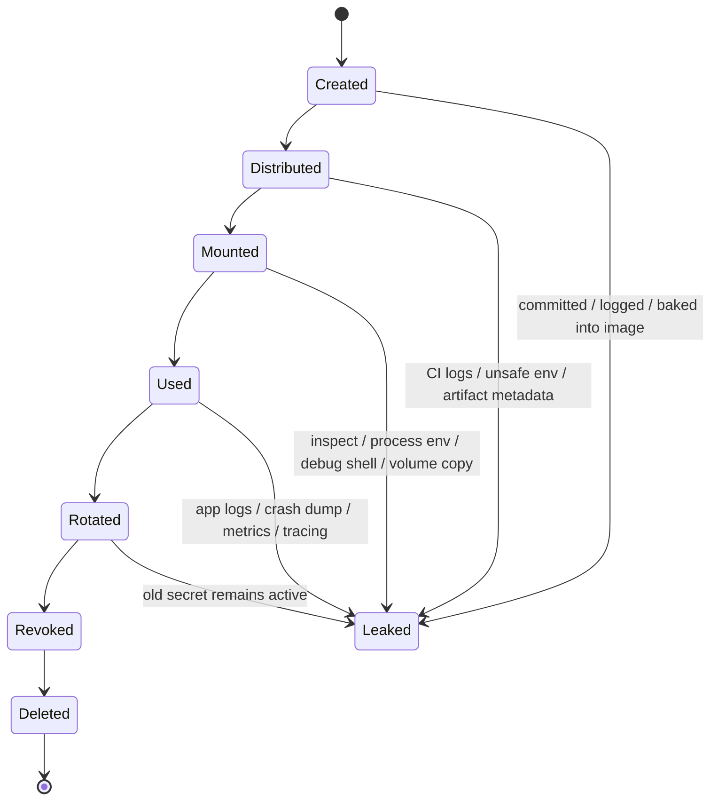
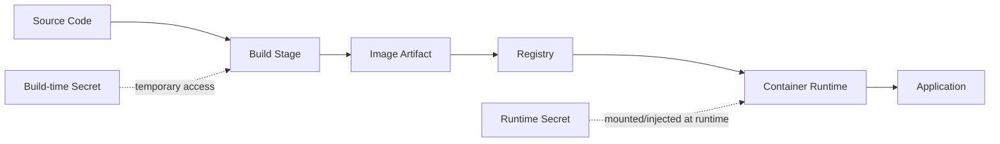
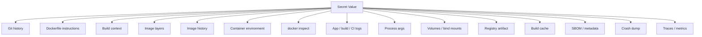
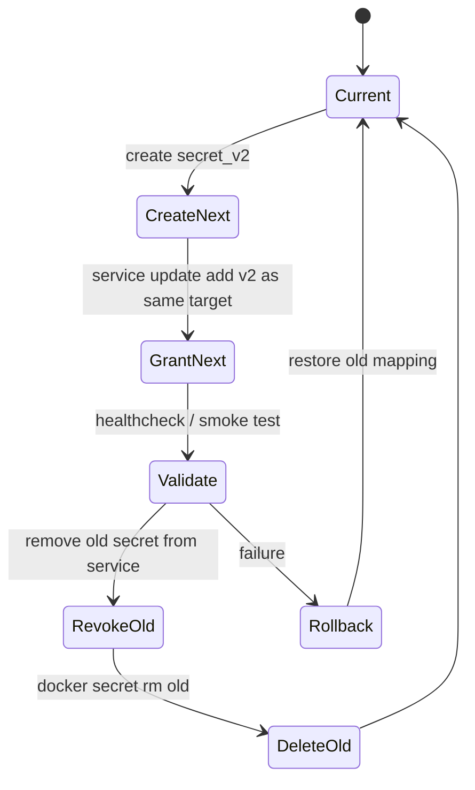
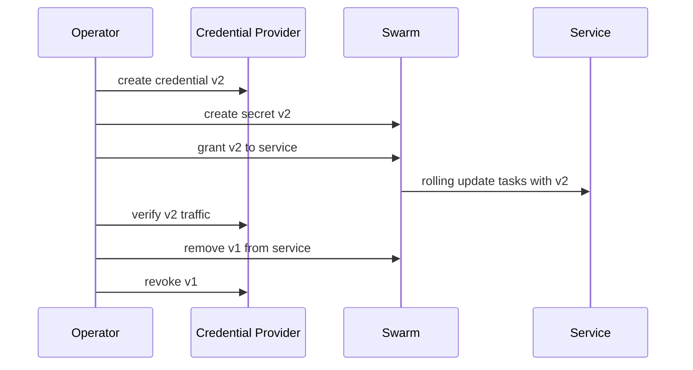
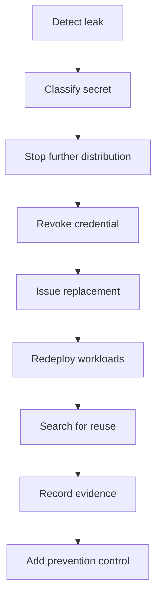
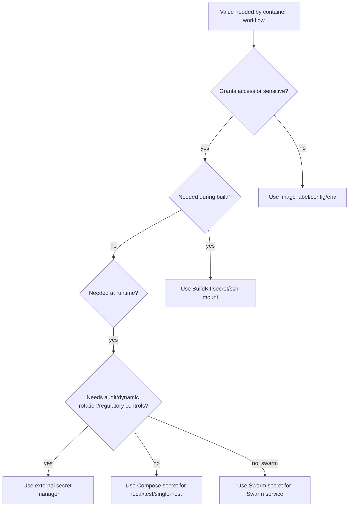

# Part 023 — Secrets, Configs, and Sensitive Data: Build-Time vs Runtime Exposure

> Target pembelajaran: setelah part ini, kita mampu membedakan build-time secret, runtime secret, config non-sensitif, environment variable, dan artifact metadata; mampu menganalisis semua jalur kebocoran secret di Dockerfile, image layer, Compose, Swarm, CI/CD, registry, log, dan runtime; serta mampu mendesain pattern rotasi dan governance yang defensible.

Part 021 dan Part 022 membahas security boundary dan runtime hardening. Part ini fokus ke satu boundary yang paling sering gagal di sistem nyata: **sensitive data boundary**.

Container membuat packaging aplikasi menjadi mudah. Tetapi packaging yang mudah juga membuat kebocoran secret menjadi mudah.

```text
A container image is a distribution artifact.
Never put anything in an image that you would not publish to every future runtime.
```

Secret handling bukan sekadar "jangan commit `.env`". Secret handling adalah desain lifecycle data sensitif dari developer laptop sampai production service.

---

## 1. Mental Model: Sensitive Data Has a Lifecycle

Secret bukan hanya value. Secret adalah object dengan lifecycle.



Top 1% engineer tidak bertanya:

```text
How do I pass the password?
```

Mereka bertanya:

```text
Where can this value persist, who can read it, how can it be rotated, and how do we prove it was not baked into artifacts?
```

---

## 2. Core Vocabulary

| Istilah | Makna | Contoh | Boleh Masuk Image? |
|---|---|---|---|
| Secret | Data sensitif yang memberi akses | password DB, API token, private key | Tidak |
| Config | Data konfigurasi non-sensitif | port, feature flag non-rahasia, URL service internal | Kadang boleh |
| Credential | Secret yang membuktikan identitas | username/password, token, cert/key pair | Tidak |
| Key material | Material kriptografis | private key, signing key, TLS key | Tidak |
| Build-time secret | Secret yang diperlukan saat build | token private package registry | Tidak |
| Runtime secret | Secret yang diperlukan saat app berjalan | DB password, OAuth client secret | Tidak |
| Public metadata | Metadata distribusi | version, commit SHA, OCI label | Ya |
| Sensitive metadata | Metadata yang bisa membantu attacker | internal hostname, account id, path privat | Hindari |

Perbedaan paling penting:

```text
Config controls behavior.
Secret grants access.
```

Jika config bocor, sistem mungkin dipahami attacker. Jika secret bocor, sistem mungkin bisa diakses attacker.

---

## 3. Data Classification untuk Container Platform

Sebelum memilih Docker mechanism, klasifikasikan data.

| Kelas | Contoh | Risiko | Mechanism Minimal |
|---|---|---|---|
| Public | app version, maintainer label | rendah | image label / config file |
| Internal | internal service URL, queue topic | sedang | runtime config / Compose env |
| Sensitive | DB username, feature flag bisnis sensitif | sedang-tinggi | file mount / secret manager |
| Secret | password, token, private key | tinggi | Docker/Swarm secret atau external secret manager |
| Regulated | PII, key customer, signing key | sangat tinggi | external KMS/secret manager, audit, rotation |

Rule praktis:

```text
If the value can authenticate, decrypt, sign, impersonate, bypass authorization, or expose customer data, treat it as a secret.
```

---

## 4. Build-Time vs Runtime Secret

Secret bisa dibutuhkan pada dua fase berbeda.



| Fase | Pertanyaan | Contoh | Mechanism |
|---|---|---|---|
| Build-time | Apa yang diperlukan untuk menghasilkan artifact? | token private npm/Maven/Go module registry | BuildKit `--secret` / SSH mount |
| Runtime | Apa yang diperlukan aplikasi saat berjalan? | DB password, JWT signing key, API token | Compose secret / Swarm secret / external secret store |

Invariant:

```text
Build-time secret must not survive in the image.
Runtime secret must not be present during build.
```

Jika runtime secret tersedia saat build, build pipeline menjadi tempat privilege terlalu besar. Jika build-time secret masuk ke image, semua environment yang menarik image itu ikut menerima secret.

---

## 5. Secret Exposure Surface Map

Secret bisa bocor di banyak tempat.



Top 1% engineer membuat threat model untuk semua node di atas.

---

## 6. The Dangerous Illusion: "I Removed the File Later"

Docker image menggunakan layer. Jika secret disalin pada layer awal lalu dihapus pada layer berikutnya, secret bisa tetap berada di layer lama.

Anti-pattern:

```Dockerfile
FROM alpine:3.20
COPY id_rsa /root/.ssh/id_rsa
RUN apk add --no-cache git \
    && git clone git@github.com:company/private-repo.git /src \
    && rm -f /root/.ssh/id_rsa
```

Masalah:

1. `id_rsa` masuk ke layer `COPY`.
2. `rm` membuat layer baru yang menyembunyikan file, bukan menghapus histori layer lama dari artifact.
3. Image yang sudah dipush ke registry tetap menyimpan layer lama.
4. Build cache bisa menyimpan intermediate state.

Mental model:

```text
Deleting a secret in a later Dockerfile instruction is not equivalent to never adding it.
```

Correct direction:

- jangan `COPY` secret;
- jangan `ARG` secret;
- jangan `ENV` secret;
- pakai BuildKit secret mount atau SSH mount;
- pastikan build output tidak menyimpan secret.

---

## 7. Why `ARG` Is Not a Secret Mechanism

`ARG` berguna untuk parameter build. `ARG` bukan secret store.

Anti-pattern:

```Dockerfile
ARG NPM_TOKEN
RUN npm config set //registry.npmjs.org/:_authToken=$NPM_TOKEN && npm ci
```

Build:

```bash
docker build --build-arg NPM_TOKEN="$NPM_TOKEN" -t app:bad .
```

Risiko:

| Surface | Risiko |
|---|---|
| shell history | command bisa tersimpan |
| CI log | build args bisa tercetak |
| image history | instruksi bisa terlihat |
| cache metadata | value dapat memengaruhi cache |
| provenance/log | parameter build bisa terekam |
| developer habit | pattern menyebar ke Dockerfile lain |

`ARG` masih boleh untuk value non-secret:

```Dockerfile
ARG APP_VERSION
ARG GIT_COMMIT
ARG TARGETPLATFORM
```

Rule:

```text
ARG is for build configuration, not build credentials.
```

---

## 8. Why `ENV` Is Worse for Secrets

`ENV` akan menjadi bagian dari image config dan tersedia sebagai environment variable di container.

Anti-pattern:

```Dockerfile
ENV DB_PASSWORD=super-secret
```

Masalah:

- value melekat pada image;
- bisa terlihat via `docker inspect`;
- diwarisi container;
- bisa muncul di app diagnostics;
- bisa muncul di crash dumps;
- bisa dibaca proses anak;
- bisa tidak sengaja tercetak di logs;
- cenderung menyebar ke Compose dan deployment config.

Compose anti-pattern:

```yaml
services:
  api:
    image: company/api:1.0.0
    environment:
      DB_PASSWORD: "super-secret"
```

Environment variable memang convenient, tetapi bukan isolation boundary yang kuat.

Better pattern:

```yaml
services:
  api:
    image: company/api:1.0.0
    secrets:
      - db_password

secrets:
  db_password:
    file: ./secrets/db_password.txt
```

Aplikasi membaca file:

```text
/run/secrets/db_password
```

---

## 9. Environment Variables: When They Are Acceptable

Tidak semua environment variable buruk. Yang buruk adalah memperlakukan environment variable sebagai secret boundary.

Aman untuk:

```yaml
environment:
  APP_ENV: production
  LOG_LEVEL: info
  HTTP_PORT: "8080"
  FEATURE_X_ENABLED: "true"
```

Hindari untuk:

```yaml
environment:
  DB_PASSWORD: ...
  AWS_SECRET_ACCESS_KEY: ...
  JWT_PRIVATE_KEY: ...
  OAUTH_CLIENT_SECRET: ...
  STRIPE_SECRET_KEY: ...
```

Rule:

```text
Use environment variables for behavior.
Use secrets for authority.
```

---

## 10. BuildKit Secret Mounts

BuildKit menyediakan secret mount untuk kebutuhan build-time. Secret tersedia hanya selama instruksi `RUN` tertentu dan tidak disalin otomatis ke image layer.

CLI:

```bash
docker build \
  --secret id=npmrc,src="$HOME/.npmrc" \
  -t company/web:dev .
```

Dockerfile:

```Dockerfile
# syntax=docker/dockerfile:1
FROM node:22-bookworm AS deps
WORKDIR /app
COPY package.json package-lock.json ./
RUN --mount=type=secret,id=npmrc,target=/root/.npmrc \
    npm ci
```

Mental model:

```text
The secret is mounted into the build container for one RUN step.
It is not part of COPY, ADD, ENV, ARG, or final filesystem output unless your command writes it somewhere.
```

Pitfall penting: BuildKit mencegah secret menjadi input layer secara langsung, tetapi command yang Anda jalankan masih bisa membocorkannya.

Buruk:

```Dockerfile
RUN --mount=type=secret,id=token \
    cat /run/secrets/token > /app/token.txt
```

Baik:

```Dockerfile
RUN --mount=type=secret,id=token \
    TOKEN_PATH=/run/secrets/token ./download-private-dependencies.sh
```

Pastikan script tidak menyalin token ke artifact final.

---

## 11. BuildKit Secret from Environment

Secret juga bisa bersumber dari environment variable host/CI.

```bash
export API_TOKEN="..."

docker build \
  --secret id=api_token,env=API_TOKEN \
  -t company/app:dev .
```

Dockerfile:

```Dockerfile
# syntax=docker/dockerfile:1
FROM alpine:3.20
RUN --mount=type=secret,id=api_token \
    TOKEN="$(cat /run/secrets/api_token)" \
    && wget --header="Authorization: Bearer ${TOKEN}" https://example.internal/artifact.tar.gz
```

Better shell hygiene:

```Dockerfile
RUN --mount=type=secret,id=api_token \
    ./fetch-artifact.sh /run/secrets/api_token
```

Kenapa? Karena inline shell command mudah di-log atau di-debug dengan `set -x`.

---

## 12. BuildKit `required` Pattern

Untuk mencegah build "diam-diam" berjalan tanpa secret, gunakan mount yang required jika syntax/BuildKit version mendukungnya.

```Dockerfile
# syntax=docker/dockerfile:1
RUN --mount=type=secret,id=maven_settings,target=/root/.m2/settings.xml,required=true \
    mvn -B -DskipTests package
```

Tanpa `required`, build bisa gagal lebih jauh dengan error yang tidak jelas. Dengan `required`, failure lebih awal dan eksplisit.

Failure yang baik:

```text
secret maven_settings is required but not provided
```

Failure yang buruk:

```text
Could not resolve dependencies for project ... 401 Unauthorized
```

---

## 13. BuildKit SSH Mounts

Jika build perlu mengakses Git repository privat via SSH, jangan copy private key.

Anti-pattern:

```Dockerfile
COPY id_rsa /root/.ssh/id_rsa
RUN git clone git@github.com:company/private-lib.git
```

Pattern:

```bash
docker build \
  --ssh default \
  -t company/app:dev .
```

Dockerfile:

```Dockerfile
# syntax=docker/dockerfile:1
FROM alpine:3.20 AS source
RUN apk add --no-cache git openssh-client
RUN mkdir -p -m 0700 ~/.ssh \
    && ssh-keyscan github.com >> ~/.ssh/known_hosts
RUN --mount=type=ssh \
    git clone git@github.com:company/private-lib.git /src/private-lib
```

SSH mount memberi akses ke agent/socket, bukan menyalin private key ke image.

Tetap perlu hardening:

- pin `known_hosts` jika memungkinkan;
- jangan disable host key checking;
- jangan menulis key ke filesystem image;
- audit repository mana yang bisa diakses oleh key/agent tersebut.

---

## 14. Build Cache and Secret Safety

Build cache bisa mempercepat build, tetapi juga perlu boundary.

Risk model:

| Cache Type | Risiko |
|---|---|
| local cache | developer machine menyimpan intermediate build state |
| registry cache | cache didistribusikan ke environment lain |
| CI cache | banyak pipeline/job bisa mengakses cache |
| inline cache | metadata cache ikut image |

Safe pattern:

```Dockerfile
RUN --mount=type=secret,id=npmrc,target=/root/.npmrc \
    --mount=type=cache,target=/root/.npm \
    npm ci
```

Catatan:

- secret mount bukan cache mount;
- cache mount bisa menyimpan downloaded dependencies;
- pastikan package manager tidak menyimpan token di cache;
- periksa config file package manager setelah command selesai;
- jangan cache directory yang berisi credential.

Verification:

```bash
docker history --no-trunc company/web:dev

docker run --rm company/web:dev sh -c '
  find / -type f \( -name "*.npmrc" -o -name "settings.xml" -o -name "id_rsa" \) 2>/dev/null
'
```

---

## 15. Build Context Hygiene

Secret sering bocor bukan karena Dockerfile salah, tetapi karena build context terlalu besar.

Anti-pattern:

```text
.
├── Dockerfile
├── app/
├── .env
├── secrets/
│   └── prod-db-password.txt
├── id_rsa
└── target/
```

Jika `.dockerignore` buruk, file sensitif bisa dikirim ke builder.

Baseline `.dockerignore`:

```dockerignore
.git
.gitignore
.env
.env.*
*.pem
*.key
*.crt
id_rsa
id_ed25519
secrets/
**/secrets/
**/*secret*
**/*password*
**/*token*
node_modules/
target/
build/
dist/
coverage/
```

Catatan penting:

```text
.dockerignore is not a secret manager.
It is a damage reduction control.
```

Tetap jangan simpan secret di directory project.

---

## 16. Runtime Secret Delivery Options

Runtime secret bisa dikirim dengan beberapa cara.

| Option | Kelebihan | Risiko | Cocok Untuk |
|---|---|---|---|
| ENV | mudah | gampang bocor via inspect/log/process | non-secret config |
| bind-mounted file | sederhana | host file lifecycle/manual permission | local/dev sederhana |
| Compose secret | explicit per service | local Compose bukan full secret manager seperti Swarm/KMS | dev/test/single-host |
| Swarm secret | encrypted transit/rest di swarm, service-scoped | Swarm-specific, secret immutable | Swarm production |
| external secret manager | audit/rotation/policy kuat | kompleksitas integrasi | regulated/high scale |

Mental model:

```text
The more authority a secret grants, the more formal its lifecycle must be.
```

---

## 17. Compose Secrets

Compose menyediakan cara untuk memberikan secret ke service tanpa memasukkannya sebagai environment variable.

Example:

```yaml
services:
  db:
    image: postgres:16
    environment:
      POSTGRES_DB: app
      POSTGRES_USER: app
      POSTGRES_PASSWORD_FILE: /run/secrets/db_password
    secrets:
      - db_password

  api:
    image: company/api:1.0.0
    environment:
      DB_HOST: db
      DB_NAME: app
      DB_USER: app
      DB_PASSWORD_FILE: /run/secrets/db_password
    secrets:
      - db_password
    depends_on:
      db:
        condition: service_started

secrets:
  db_password:
    file: ./secrets/dev-db-password.txt
```

Di dalam container, secret diproyeksikan sebagai file:

```text
/run/secrets/db_password
```

Kenapa file lebih baik daripada env?

- tidak menjadi bagian dari environment process;
- tidak langsung muncul di `docker inspect` sebagai env var;
- aksesnya eksplisit per service;
- app bisa membaca path yang jelas;
- kompatibel dengan banyak image resmi yang mendukung `*_FILE` convention.

---

## 18. Compose Secret from Host Environment

Compose Specification mendukung secret source dari `file`, dan Docker Compose juga mendukung source dari `environment`.

Example:

```yaml
services:
  api:
    image: company/api:1.0.0
    secrets:
      - api_token

secrets:
  api_token:
    environment: API_TOKEN
```

Run:

```bash
export API_TOKEN="..."
docker compose up -d
```

Catatan penting:

```text
A secret sourced from host environment is still exposed to the host shell/CI environment before Compose creates the secret projection.
```

Ini lebih baik daripada memasukkan value ke `compose.yaml`, tetapi bukan pengganti secret manager enterprise.

Gunakan untuk:

- local development;
- CI job ephemeral;
- transitional workflow.

Hindari untuk:

- long-lived production secrets;
- regulated secrets;
- manual copy-paste secret antar operator.

---

## 19. Compose Secret Permission and Ownership

Compose long syntax bisa mengatur target file, mode, uid, dan gid tergantung implementation/support.

```yaml
services:
  api:
    image: company/api:1.0.0
    user: "10001:10001"
    secrets:
      - source: db_password
        target: db_password
        mode: 0400

secrets:
  db_password:
    file: ./secrets/dev-db-password.txt
```

Aplikasi membaca:

```text
/run/secrets/db_password
```

Jika container berjalan sebagai non-root, pastikan user bisa membaca secret file.

Debug:

```bash
docker compose exec api sh -c 'id && ls -l /run/secrets && cat /run/secrets/db_password >/dev/null && echo ok'
```

Jangan print value secret.

---

## 20. Compose Secrets Are Not Magic Encryption

Compose secrets memberi projection yang lebih aman daripada env var dalam model lokal, tetapi jangan overclaim.

Compose local mode bukan sama dengan Swarm secret control plane.

Mental model:

```text
Compose secrets improve service-level explicitness and avoid env var exposure.
Swarm secrets add orchestration-level encrypted distribution and service-scoped access in the swarm.
External secret managers add centralized lifecycle, audit, and enterprise rotation.
```

Gunakan Compose secrets untuk development/test/single-host dengan disiplin:

- secret source file tidak masuk Git;
- path source file di luar repository jika memungkinkan;
- `.gitignore` dan `.dockerignore` tetap disiapkan;
- jangan commit generated secret;
- gunakan dev-only secret yang tidak bisa mengakses production;
- jangan reuse secret lokal untuk staging/prod.

---

## 21. Swarm Secrets

Swarm secrets adalah mechanism orchestration-level untuk data sensitif.

Membuat secret:

```bash
printf '%s' 'change-me-in-real-life' | docker secret create db_password -
```

Service menggunakan secret:

```bash
docker service create \
  --name api \
  --secret db_password \
  --env DB_PASSWORD_FILE=/run/secrets/db_password \
  company/api:1.0.0
```

Secret hanya diberikan ke service yang diberi akses.

Inspect service:

```bash
docker service inspect api --format '{{json .Spec.TaskTemplate.ContainerSpec.Secrets}}' | jq
```

Di task/container:

```bash
docker exec -it <container> sh -c 'ls -l /run/secrets'
```

Jangan pernah:

```bash
docker exec -it <container> cat /run/secrets/db_password
```

kecuali dalam lab lokal disposable. Di production, membaca secret value melalui shell adalah access event yang perlu diperlakukan sensitif.

---

## 22. Swarm Secret Access Model

```mermaid
flowchart TB
  Manager[Swarm Managers]
  SecretStore[Encrypted Secret Store]
  Service[Service Spec]
  Task[Running Task]
  Mount[/run/secrets/name]

  Manager --> SecretStore
  SecretStore --> Service
  Service --> Task
  Task --> Mount

  OtherService[Other Service]
  SecretStore -.no access unless granted.-> OtherService
```

Invariants:

1. Secret dibuat di swarm control plane.
2. Secret diberikan ke service, bukan global ke semua container.
3. Hanya task dari service yang diberi secret yang bisa mengaksesnya.
4. Secret tersedia selama task berjalan.
5. Rotation harus memakai secret baru dan update service.

---

## 23. Swarm Secrets Are Immutable

Secret value tidak diedit in-place. Pattern rotasi menggunakan secret baru.

```bash
printf '%s' 'new-password' | docker secret create db_password_v2 -
```

Update service:

```bash
docker service update \
  --secret-rm db_password \
  --secret-add source=db_password_v2,target=db_password \
  api
```

Setelah semua task stabil:

```bash
docker secret rm db_password
```

Kenapa target tetap `db_password`?

Aplikasi tetap membaca path yang sama:

```text
/run/secrets/db_password
```

Control plane memakai object baru:

```text
db_password_v2
```

Ini memisahkan **runtime contract** dari **secret versioning**.

---

## 24. Secret Rotation State Machine



Rotation checklist:

- secret baru dibuat;
- downstream credential sudah valid;
- service diupdate dengan rolling update;
- healthcheck melewati monitor window;
- old secret access dicabut dari service;
- old secret direvoke dari provider asli;
- old secret object dihapus;
- evidence rotasi dicatat.

---

## 25. Swarm Configs

Swarm configs mirip secrets dari sisi distribution mechanism, tetapi digunakan untuk data non-sensitif.

Contoh:

```bash
docker config create nginx_conf ./nginx.conf
```

Service:

```bash
docker service create \
  --name web \
  --config source=nginx_conf,target=/etc/nginx/nginx.conf \
  nginx:1.27
```

Gunakan configs untuk:

- nginx config;
- application YAML non-sensitif;
- logging config;
- routing config non-rahasia;
- feature flag non-rahasia.

Jangan gunakan configs untuk:

- password;
- token;
- private key;
- customer data;
- signing material.

Rule:

```text
If disclosure of the value grants access, it is not a config. It is a secret.
```

---

## 26. Config Versioning Pattern

Seperti secret, config sering lebih aman diperlakukan immutable.

```bash
docker config create nginx_conf_2026_07_01 ./nginx.conf

docker service update \
  --config-rm nginx_conf_2026_06_15 \
  --config-add source=nginx_conf_2026_07_01,target=/etc/nginx/nginx.conf \
  web
```

Dengan pattern ini:

- rollback jelas;
- audit jelas;
- service spec mereferensi versi config;
- operator tidak perlu menebak isi config lama;
- drift lebih mudah dilacak.

---

## 27. Application Contract: Prefer `*_FILE`

Banyak official image mendukung convention `*_FILE`, misalnya database password file.

Pattern:

```yaml
environment:
  DB_PASSWORD_FILE: /run/secrets/db_password
secrets:
  - db_password
```

Aplikasi custom juga sebaiknya mendukung pattern yang sama.

Pseudo-code:

```text
if DB_PASSWORD_FILE exists:
  read password from file path
else if DB_PASSWORD exists:
  read password from env var
else:
  fail fast
```

Namun di production, Anda bisa enforce:

```text
DB_PASSWORD_FILE required.
DB_PASSWORD forbidden.
```

---

## 28. Secret Loading Pattern in Application Code

Aplikasi harus punya loader kecil dan deterministik.

Pseudo-code:

```text
function readSecret(name):
  filePath = env[name + "_FILE"]
  envValue = env[name]

  if filePath != empty and envValue != empty:
    fail("ambiguous secret source")

  if filePath != empty:
    return trimRightNewline(readFile(filePath))

  if envValue != empty:
    warn("secret read from environment; not recommended")
    return envValue

  fail("secret missing")
```

Invariants:

- fail fast jika missing;
- fail jika dua source aktif;
- jangan log value;
- jangan expose via actuator/debug endpoint;
- jangan simpan secret ke global dump;
- jangan print config object lengkap.

---

## 29. Secret and Logs

Secret leakage paling sering terjadi bukan dari Docker, tetapi dari aplikasi.

Anti-pattern:

```text
Starting app with config: { dbPassword: "..." }
```

Better:

```text
Starting app with config: { dbPassword: "<redacted>" }
```

Logging rules:

| Data | Log? |
|---|---|
| secret value | tidak |
| secret path | boleh jika tidak sensitif |
| secret version/name | boleh hati-hati |
| credential provider id | boleh jika tidak membuka internal sensitive context |
| auth failure reason | boleh, tanpa token |
| token prefix/suffix | hindari kecuali incident process formal |

Redaction utility harus digunakan sebelum config object masuk log.

---

## 30. Secret and Observability

Observability pipeline bisa menjadi exfiltration channel.

Periksa:

- logs;
- metrics labels;
- trace attributes;
- exception messages;
- HTTP request dump;
- database query logs;
- message payload sampling;
- crash dumps;
- debug endpoints;
- support bundles.

Rule:

```text
Anything emitted to observability should be treated as copied to a broader audience.
```

Maka secret tidak boleh menjadi:

- log field;
- metric label;
- trace span attribute;
- error message;
- healthcheck output;
- diagnostic endpoint response.

---

## 31. Secret and `docker inspect`

Container env bisa terlihat melalui inspect.

```bash
docker inspect <container> --format '{{json .Config.Env}}' | jq
```

Jika secret ada di env var, siapa pun dengan akses Docker daemon dapat melihatnya.

Ingat dari part security sebelumnya:

```text
Docker daemon access is effectively high-privilege host access.
```

Tetapi operationally, kita tetap mengurangi exposure. File secret lebih baik karena value tidak dimasukkan ke `.Config.Env`.

---

## 32. Secret and Process Arguments

Jangan berikan secret sebagai command-line argument.

Anti-pattern:

```yaml
services:
  api:
    image: company/api:1.0.0
    command: ["./api", "--db-password", "super-secret"]
```

Risiko:

- process args terlihat di `ps`;
- command bisa terlihat di inspect;
- log startup bisa menampilkan args;
- crash dump bisa merekam args.

Better:

```yaml
services:
  api:
    image: company/api:1.0.0
    command: ["./api", "--db-password-file", "/run/secrets/db_password"]
    secrets:
      - db_password
```

---

## 33. Secret and Volumes

Jangan copy secret ke named volume kecuali memang lifecycle-nya dikelola.

Anti-pattern:

```bash
cp /run/secrets/db_password /data/db_password
```

Masalah:

- volume persisten;
- backup volume membawa secret;
- rotation tidak menghapus copy lama;
- service lain yang mount volume bisa membaca;
- forensic cleanup sulit.

Better:

- baca secret langsung dari `/run/secrets/...`;
- jika aplikasi perlu file di path tertentu, gunakan secret target path;
- jika aplikasi harus generate derived credential, simpan derived value di controlled path dengan TTL/rotation.

---

## 34. Secret and Healthchecks

Healthcheck tidak boleh mengekspos secret.

Buruk:

```Dockerfile
HEALTHCHECK CMD curl "http://localhost:8080/health?token=$HEALTH_TOKEN"
```

Lebih baik:

```Dockerfile
HEALTHCHECK CMD wget -qO- http://localhost:8080/healthz || exit 1
```

Jika health endpoint perlu auth, gunakan loopback-only endpoint, Unix socket, atau internal unauthenticated health check yang tidak membuka sensitive data.

Health output harus minimal:

```json
{"status":"ok"}
```

Bukan:

```json
{"status":"ok","dbPassword":"...","token":"..."}
```

---

## 35. Secret and CI/CD

CI/CD adalah tempat paling rawan karena banyak system bertemu:

- source code;
- Dockerfile;
- build context;
- build cache;
- registry credentials;
- deploy credentials;
- logs;
- artifacts;
- operator override.

CI rules:

1. Gunakan secret store bawaan CI.
2. Jangan echo secret.
3. Matikan shell tracing untuk step yang memakai secret.
4. Gunakan BuildKit `--secret`, bukan `--build-arg`.
5. Scope token minimal: read package, push registry, deploy environment tertentu.
6. Secret production hanya tersedia untuk protected branch/tag/environment.
7. Jangan share cache antar trust boundary berbeda.
8. Scan image untuk secret leakage sebelum push atau sebelum promotion.
9. Rotate token jika log leak terjadi, walaupun hanya partial.
10. Jangan simpan deploy credentials dalam image.

---

## 36. CI Build Example with BuildKit Secrets

Example generic:

```bash
set -euo pipefail

# Avoid set -x around secret operations.
docker buildx build \
  --secret id=npmrc,src="$NPMRC_PATH" \
  --secret id=maven_settings,src="$MAVEN_SETTINGS_PATH" \
  --tag "$IMAGE_REF" \
  --push \
  .
```

Dockerfile:

```Dockerfile
# syntax=docker/dockerfile:1
FROM eclipse-temurin:21-jdk AS build
WORKDIR /workspace
COPY . .
RUN --mount=type=secret,id=maven_settings,target=/root/.m2/settings.xml,required=true \
    --mount=type=cache,target=/root/.m2/repository \
    ./mvnw -B -DskipTests package

FROM eclipse-temurin:21-jre
WORKDIR /app
COPY --from=build /workspace/target/app.jar /app/app.jar
USER 10001:10001
ENTRYPOINT ["java", "-jar", "/app/app.jar"]
```

Verification:

```bash
docker history --no-trunc "$IMAGE_REF"
docker run --rm "$IMAGE_REF" sh -c 'find / -name settings.xml -o -name "*.npmrc" 2>/dev/null'
```

---

## 37. Registry Credentials Are Secrets Too

Registry credentials sering dianggap operational detail, padahal memberi akses pull/push image.

Risk:

| Credential | Impact Jika Bocor |
|---|---|
| pull token | attacker bisa membaca proprietary image |
| push token | attacker bisa push poisoned image |
| admin registry token | attacker bisa delete/replace artifact |
| Docker Hub PAT | akses sesuai scope account/org |

Best practice:

- gunakan token scoped per repo/org;
- bedakan pull token dan push token;
- deploy node hanya perlu pull;
- CI release job saja yang boleh push;
- protected branch/tag untuk push production tag;
- enable audit log jika registry mendukung;
- revoke token saat engineer/offboarding/system compromise.

---

## 38. Secret Naming

Nama secret bukan value, tetapi bisa tetap sensitif.

Buruk:

```text
prod-root-rds-password-superuser
```

Lebih baik:

```text
billing-db-password-v20260701
```

Naming convention:

```text
<domain>-<purpose>-<kind>-v<date-or-version>
```

Contoh:

```text
billing-db-password-v20260701
billing-jwt-signing-key-v3
ledger-partner-api-token-v2026q3
```

Hindari:

- nama customer;
- host internal detail berlebihan;
- privilege detail seperti `root`, `admin`, `superuser` jika tidak perlu;
- environment rahasia yang tidak perlu diketahui luas.

---

## 39. Secret Rotation Design

Rotasi bukan event manual. Rotasi adalah workflow.

Jenis rotasi:

| Jenis | Contoh | Strategy |
|---|---|---|
| scheduled | password DB per 90 hari | create next, update service, revoke old |
| incident | token muncul di log | revoke immediately, redeploy, investigate |
| personnel | engineer keluar | rotate shared credentials |
| privilege change | service tidak butuh akses lagi | remove secret grant |
| dependency change | pindah provider | introduce new secret, run dual-read jika perlu |

Zero-downtime rotation sering butuh aplikasi mendukung reload atau rolling restart.

---

## 40. Dual Secret Rotation Pattern

Untuk beberapa sistem, aplikasi perlu menerima credential lama dan baru selama transisi.



Runtime contract options:

1. Same target path, rolling restart.
2. Two paths: `secret_current` and `secret_next`.
3. External provider with dynamic credentials.
4. App reload endpoint or SIGHUP.

Simplest Swarm pattern: same target path + rolling update.

---

## 41. Secret Revocation

Rotasi tanpa revocation belum selesai.

Checklist revocation:

- remove from Docker service/Compose config;
- remove secret object if applicable;
- revoke upstream credential;
- invalidate token/session if provider supports;
- remove old secret from CI/CD secret store;
- delete local copies;
- purge leaked logs if policy allows;
- record incident/evidence;
- scan images/artifacts for old value/fingerprint.

Rule:

```text
A secret is not retired until the authority it grants has been revoked at the source.
```

---

## 42. Secret Scanning

Secret scanning harus ada di beberapa gate.

| Gate | Tujuan |
|---|---|
| pre-commit | mencegah secret masuk Git |
| pull request | menangkap secret sebelum merge |
| CI build context | menangkap secret sebelum build |
| image scan | menangkap secret di filesystem image |
| registry scan | monitoring artifact yang sudah publish |
| log scan | mendeteksi incident runtime/CI |

Tools bisa berbeda, tapi policy sama:

```text
If a real secret reaches a durable artifact, rotate it.
```

Jangan hanya menghapus commit atau image. Anggap secret sudah terbaca.

---

## 43. Secret Leakage Incident Model

Ketika secret bocor, jangan mulai dari "siapa yang salah". Mulai dari blast radius.



Questions:

- Secret jenis apa?
- Akses apa yang diberikan?
- Environment mana yang terdampak?
- Kapan pertama bocor?
- Artifact apa yang menyimpan secret?
- Siapa/apa yang bisa membaca artifact itu?
- Apakah secret dipakai setelah bocor?
- Apakah ada reuse di environment lain?
- Kontrol apa yang gagal?
- Gate apa yang harus ditambah?

---

## 44. Secret Access Governance

Secret harus punya metadata.

Minimum metadata:

| Field | Contoh |
|---|---|
| owner | billing-platform-team |
| purpose | billing service DB access |
| environment | prod |
| privilege | read/write schema billing |
| rotation interval | 90 days |
| last rotated | 2026-07-01 |
| consumers | billing-api service |
| source authority | RDS/IAM/Vault/etc |
| emergency contact | team channel / on-call |

Tanpa metadata, rotasi dan incident response menjadi tebak-tebakan.

---

## 45. Principle of Least Secret

Least privilege biasanya bicara permission. Untuk secret, gunakan **least secret**.

```text
A workload should receive only the secrets it needs, only in the environment where it needs them, only for the time it needs them.
```

Anti-pattern:

```yaml
services:
  api:
    secrets:
      - db_password
      - redis_password
      - stripe_key
      - aws_admin_key
      - jwt_private_key
      - github_token
```

Review question:

```text
Can this service still perform its job if we remove this secret?
```

Jika ya, hapus grant.

---

## 46. Docker Socket Is a Secret Boundary Breaker

Mounting Docker socket ke container memberi container akses ke Docker daemon.

```yaml
services:
  agent:
    image: some/tool
    volumes:
      - /var/run/docker.sock:/var/run/docker.sock
```

Jika container ini compromise, attacker bisa:

- inspect containers;
- read env vars;
- mount host paths;
- start privileged containers;
- access other service metadata;
- potentially read files/secrets indirectly.

Rule:

```text
Do not mount Docker socket into general application containers.
```

Jika benar-benar perlu:

- gunakan socket proxy dengan allowlist;
- dedicated host;
- read-only jika possible, walau Docker socket read-only mount tidak membuat API read-only;
- least privilege via external authorization plugin jika available;
- audit commands;
- isolate network;
- treat as high-risk exception.

---

## 47. Secret Boundary in Multi-Tenant Hosts

Jika banyak team/service berbagi Docker host, secret leakage risk meningkat.

Risiko:

- operator dengan daemon access bisa inspect banyak workload;
- bind mount salah bisa membaca secret source file;
- shared volume bisa menjadi data exfiltration path;
- default network terlalu luas;
- logs dari banyak service terkumpul di satu backend.

Controls:

- separate hosts/contexts per environment;
- separate projects/stacks;
- least Docker daemon access;
- use Swarm service-scoped secrets or external manager;
- network segmentation;
- label-based audit;
- avoid shared global volumes;
- central logging redaction.

---

## 48. Local Development Secret Strategy

Developer butuh ergonomics, tetapi jangan berikan production secret ke laptop.

Recommended local pattern:

```text
Use disposable local secrets that only unlock local dependencies.
```

Example directory:

```text
.dev-secrets/
  db_password.txt
  minio_access_key.txt
  minio_secret_key.txt
```

`.gitignore`:

```gitignore
.dev-secrets/
.env
.env.*
```

Compose:

```yaml
secrets:
  db_password:
    file: ./.dev-secrets/db_password.txt
```

Bootstrap script:

```bash
#!/usr/bin/env bash
set -euo pipefail
mkdir -p .dev-secrets
[ -f .dev-secrets/db_password.txt ] || openssl rand -base64 32 > .dev-secrets/db_password.txt
chmod 600 .dev-secrets/*
```

Do not:

- copy staging/prod secrets locally;
- share `.env` over chat;
- commit sample secrets that look real;
- use same password across engineers.

---

## 49. Staging and Production Secret Strategy

Staging should not be a dumping ground for production secrets.

| Environment | Secret Rule |
|---|---|
| local | generated disposable secrets |
| CI test | short-lived test credentials |
| staging | staging-only credentials with limited data |
| production | production-only credentials with strict audit |

Never:

```text
prod secret == staging secret == local secret
```

If staging needs realistic behavior, copy shape, not authority.

---

## 50. Secret Manager Integration Boundary

Docker mechanisms are enough for many setups, especially Compose and Swarm. But some environments need external secret managers.

External manager is appropriate when:

- dynamic credentials are required;
- rotation must be automatic;
- per-access audit is required;
- regulatory controls require centralized policy;
- secret values must not be stored in orchestrator state;
- cross-platform secret distribution is needed;
- human break-glass workflow is required.

Integration patterns:

| Pattern | Description | Trade-off |
|---|---|---|
| render-before-deploy | CI fetches secret and creates Docker secret | simple, CI sees secret |
| sidecar/agent | agent fetches secret at runtime | more moving parts |
| app SDK | app fetches secret directly | app coupled to provider |
| file projection | external tool writes secret file | familiar app contract |
| dynamic credentials | short-lived credential per workload | strongest lifecycle, more complexity |

---

## 51. Docker Secret vs External Secret Manager

| Capability | Compose Secret | Swarm Secret | External Secret Manager |
|---|---:|---:|---:|
| file projection | yes | yes | depends |
| env avoidance | yes | yes | yes |
| service-scoped grant | yes | yes | yes/depends |
| encrypted swarm distribution | no/local model | yes | provider-specific |
| centralized audit | limited | limited | strong |
| dynamic credential | no | no | yes |
| automatic rotation | manual | manual/service update | often supported |
| policy workflow | limited | limited | strong |
| multi-orchestrator | no | no | yes |

Do not choose mechanism by hype. Choose based on lifecycle requirement.

---

## 52. Secret Review Checklist for Dockerfile

Review every Dockerfile:

```text
[ ] No secret in ARG.
[ ] No secret in ENV.
[ ] No COPY of credential files.
[ ] No ADD of credential archives.
[ ] No curl/wget URL containing token.
[ ] No git clone using embedded token URL.
[ ] BuildKit secret mount used for private dependencies.
[ ] SSH mount used instead of private key COPY.
[ ] Build logs do not print secret.
[ ] Package manager config not copied into final image.
[ ] Final image scan finds no key/token/password file.
[ ] docker history shows no secret-looking value.
```

---

## 53. Secret Review Checklist for Compose

```text
[ ] No production secret committed in compose.yaml.
[ ] No secret in environment field.
[ ] No secret in command args.
[ ] No secret in labels.
[ ] No secret in healthcheck command.
[ ] Secrets declared top-level and granted per service.
[ ] Services only receive secrets they need.
[ ] App reads *_FILE path where possible.
[ ] Secret source files are gitignored and dockerignored.
[ ] Local secrets are disposable and non-production.
[ ] Compose profiles do not accidentally enable production secret sources locally.
```

---

## 54. Secret Review Checklist for Swarm

```text
[ ] Secret names follow versioning convention.
[ ] Secret grants are service-scoped.
[ ] No unused service secret grants.
[ ] Rotation runbook exists.
[ ] Rollback path exists.
[ ] Secret object removed after retirement.
[ ] Upstream credential revoked after retirement.
[ ] Manager access is restricted.
[ ] Raft backup is protected.
[ ] Service update uses health gates.
[ ] Stack files do not contain secret values.
```

---

## 55. Secret Review Checklist for CI/CD

```text
[ ] CI secrets scoped by environment.
[ ] Production secrets only available on protected refs/environments.
[ ] Shell tracing disabled around secret usage.
[ ] Secret masking enabled, but not relied on as primary control.
[ ] Build uses BuildKit --secret, not --build-arg.
[ ] Registry token scoped minimally.
[ ] Build cache not shared across untrusted branches.
[ ] Image scanned for secret leakage before promotion.
[ ] Logs retained according to sensitivity.
[ ] Incident rotation process tested.
```

---

## 56. Practical Lab 1 — Detect `ARG` Leakage

Create bad Dockerfile:

```Dockerfile
FROM alpine:3.20
ARG API_TOKEN
RUN echo "Fetching with token $API_TOKEN" > /tmp/build.log
CMD ["sh", "-c", "echo hello"]
```

Build:

```bash
docker build --build-arg API_TOKEN=super-secret-token -t secret-bad:arg .
```

Inspect:

```bash
docker history --no-trunc secret-bad:arg
```

Then ask:

```text
Where did the secret appear?
Would deleting /tmp/build.log in a later layer fix the history?
Would pushing this image to a private registry still be a leak?
```

Expected conclusion:

```text
The pattern is invalid even if the image is private.
```

---

## 57. Practical Lab 2 — BuildKit Secret Mount

Dockerfile:

```Dockerfile
# syntax=docker/dockerfile:1
FROM alpine:3.20
RUN --mount=type=secret,id=demo_token \
    test -s /run/secrets/demo_token \
    && echo "secret was available during build" > /result.txt
CMD ["cat", "/result.txt"]
```

Build:

```bash
printf '%s' 'super-secret-token' > /tmp/demo_token

docker build \
  --secret id=demo_token,src=/tmp/demo_token \
  -t secret-good:buildkit .
```

Verify:

```bash
docker run --rm secret-good:buildkit

docker run --rm secret-good:buildkit sh -c 'ls -l /run/secrets || true; grep -R "super-secret-token" / 2>/dev/null || true'

docker history --no-trunc secret-good:buildkit
```

Learning point:

```text
The secret was present during the RUN instruction but should not be present in the final filesystem or image history.
```

---

## 58. Practical Lab 3 — Compose Secret File

`compose.yaml`:

```yaml
services:
  app:
    image: alpine:3.20
    command: ["sh", "-c", "test -s /run/secrets/demo && echo secret-file-present && sleep 3600"]
    secrets:
      - demo

secrets:
  demo:
    file: ./demo-secret.txt
```

Run:

```bash
printf '%s' 'local-dev-secret' > demo-secret.txt
docker compose up -d
```

Verify without printing value:

```bash
docker compose exec app sh -c 'ls -l /run/secrets && test -s /run/secrets/demo && echo ok'
docker inspect "$(docker compose ps -q app)" --format '{{json .Config.Env}}' | jq
```

Expected:

- secret file exists;
- value is not in env list;
- source file still exists on host and must be protected.

---

## 59. Practical Lab 4 — Swarm Secret Rotation

Initialize lab swarm:

```bash
docker swarm init
```

Create secret v1:

```bash
printf '%s' 'password-v1' | docker secret create demo_password_v1 -
```

Create service:

```bash
docker service create \
  --name secret-demo \
  --secret source=demo_password_v1,target=demo_password \
  alpine:3.20 \
  sh -c 'while true; do test -s /run/secrets/demo_password && echo ok; sleep 10; done'
```

Create v2:

```bash
printf '%s' 'password-v2' | docker secret create demo_password_v2 -
```

Rotate:

```bash
docker service update \
  --secret-rm demo_password_v1 \
  --secret-add source=demo_password_v2,target=demo_password \
  secret-demo
```

Cleanup:

```bash
docker service rm secret-demo
docker secret rm demo_password_v1 demo_password_v2
docker swarm leave --force
```

Learning point:

```text
Runtime path stayed stable; secret object changed.
```

---

## 60. Common Anti-Patterns

| Anti-Pattern | Why It Fails | Better Pattern |
|---|---|---|
| `ARG TOKEN` | build metadata/history/log risk | BuildKit secret |
| `ENV PASSWORD=...` | image/container env exposure | secret file |
| `COPY id_rsa` then `rm` | secret remains in layer | SSH mount |
| secret in `.env` committed | Git history leak | local generated secret + gitignore |
| secret in Compose `environment` | inspect/log exposure | Compose secret |
| secret as CLI arg | process list/inspect exposure | file path |
| app logs full config | observability leak | redaction |
| same secret in all envs | broad blast radius | env-specific secrets |
| manual rotation only | slow incident response | tested rotation runbook |
| secret in labels | metadata leak | label non-sensitive IDs only |

---

## 61. Decision Framework

Ask these questions:

1. Is this value sensitive?
2. Does disclosure grant access?
3. Is it needed at build or runtime?
4. Who should be able to read it?
5. Where will it persist?
6. How is it rotated?
7. How is it revoked?
8. How do we verify it is not in image layers/history?
9. How do we detect if it leaks?
10. What is the blast radius if it leaks?

Decision tree:



---

## 62. Engineering Standard: Secret Handling Policy

Reusable policy:

```text
1. Secrets must never be committed to source control.
2. Secrets must never be baked into Docker images.
3. Secrets must never be passed using Dockerfile ARG or ENV.
4. Build-time secrets must use BuildKit secret mounts or SSH mounts.
5. Runtime secrets must be delivered as files through Compose secrets, Swarm secrets, or an approved external secret manager.
6. Environment variables may be used for non-sensitive configuration only.
7. Applications must support *_FILE style secret loading for production secrets.
8. Secret values must not appear in logs, metrics, traces, healthchecks, labels, or command-line args.
9. Every production secret must have an owner, purpose, consumer list, rotation policy, and revocation runbook.
10. Any confirmed secret leak requires rotation/revocation, not only deletion.
```

---

## 63. Mental Model Recap

Secrets are authority.

```text
A secret is not safe because the repository is private.
A secret is not safe because the image is private.
A secret is not safe because the log is internal.
A secret is safe only when its lifecycle, access, persistence, rotation, and revocation are controlled.
```

Core invariants:

1. Build-time secret does not survive build.
2. Runtime secret is not available during build.
3. Image artifact is secret-free.
4. Environment variables are not a strong secret boundary.
5. Compose secrets improve local/service explicitness.
6. Swarm secrets provide service-scoped secret delivery in swarm.
7. Configs are for non-sensitive data.
8. Rotation requires revocation at source.
9. Logs and observability are exfiltration surfaces.
10. Docker socket access can break secret boundaries.

---

## 64. References

- Docker Docs — Build secrets: https://docs.docker.com/build/building/secrets/
- Docker Docs — Compose secrets: https://docs.docker.com/compose/how-tos/use-secrets/
- Docker Docs — Compose file reference / secrets: https://docs.docker.com/reference/compose-file/secrets/
- Docker Docs — Set environment variables in Compose: https://docs.docker.com/compose/how-tos/environment-variables/set-environment-variables/
- Docker Docs — Manage sensitive data with Docker secrets: https://docs.docker.com/engine/swarm/secrets/
- Docker Docs — Store configuration data using Docker configs: https://docs.docker.com/engine/swarm/configs/
- Docker Docs — Dockerfile reference: https://docs.docker.com/reference/dockerfile/
- Docker Docs — Docker Engine security: https://docs.docker.com/engine/security/

---

## 65. What Comes Next

Part 024 akan fokus ke image supply chain:

- SBOM;
- vulnerability scanning;
- Docker Scout;
- base image governance;
- digest pinning;
- image signing;
- provenance/attestations;
- policy gates;
- registry promotion;
- supply-chain incident model.
