# Part 024 — Image Supply Chain: SBOM, Vulnerability Scanning, Signing, Trust, and Policy

> Target pembelajaran: setelah part ini, kita mampu mendesain supply chain container image yang traceable, scannable, policy-driven, dan promotable; memahami batas SBOM/scanning/signing; menggunakan digest, SBOM, provenance, Docker Scout, attestations, dan signing sebagai evidence chain; serta membuat release gate yang realistis untuk engineering organization.

Part 023 membahas secret dan sensitive data. Part ini membahas **trust terhadap image artifact**.

Pertanyaan utama:

```text
How do we know this image is the artifact we intended to build, from the source we intended, with dependencies we understand, and acceptable risk for the environment where it will run?
```

Image supply chain bukan hanya vulnerability scan. Ia adalah gabungan dari:

- source integrity;
- dependency governance;
- build reproducibility/traceability;
- image identity;
- SBOM;
- vulnerability intelligence;
- signing;
- provenance;
- registry promotion;
- deployment policy;
- runtime drift monitoring.

---

## 1. Supply Chain Mental Model

Container image adalah artifact distribusi. Supply chain adalah jalur dari source sampai runtime.

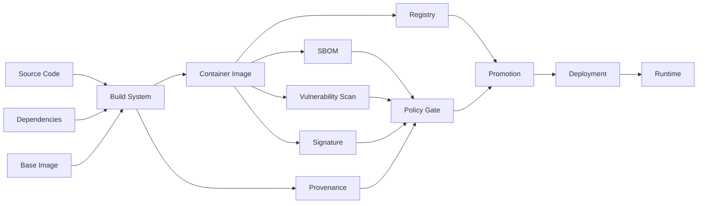

Goal:

```text
No image reaches production unless identity, contents, origin, and risk are known and acceptable.
```

---

## 2. What "Trust" Means for Container Images

Trust bukan perasaan. Trust adalah evidence.

| Question | Evidence |
|---|---|
| Image apa yang dijalankan? | digest |
| Source mana yang membangunnya? | provenance / labels / CI metadata |
| Dependency apa yang ada di dalamnya? | SBOM |
| Vulnerability apa yang diketahui? | scan report |
| Siapa/apa yang membangun? | CI identity / attestation |
| Apakah artifact diubah setelah build? | signature / digest verification |
| Apakah policy terpenuhi? | policy evaluation |
| Apakah image dari base yang disetujui? | base image policy |
| Apakah deploy sesuai environment? | promotion record |

Top 1% engineer tidak berkata:

```text
It came from our registry, so it is safe.
```

Mereka berkata:

```text
It is digest X, built by workflow Y from commit Z, with SBOM A, scan result B, signature C, and policy decision D.
```

---

## 3. Threat Model

Supply chain threat meliputi:

| Threat | Contoh |
|---|---|
| malicious dependency | package dependency disusupi |
| vulnerable dependency | CVE pada OS/library package |
| compromised base image | base image mengandung malware/vulnerability |
| mutable tag attack | `latest` berubah tanpa kontrol |
| registry compromise | image diganti/ditimpa |
| CI compromise | pipeline membangun artifact malicious |
| secret leakage | token masuk image layer |
| build context poisoning | file tidak sengaja masuk build context |
| cache poisoning | cache dari boundary tidak terpercaya |
| provenance gap | tidak jelas image berasal dari commit mana |
| signing key compromise | attacker bisa sign image palsu |
| policy bypass | deployment tidak memverifikasi gate |

Diagram:

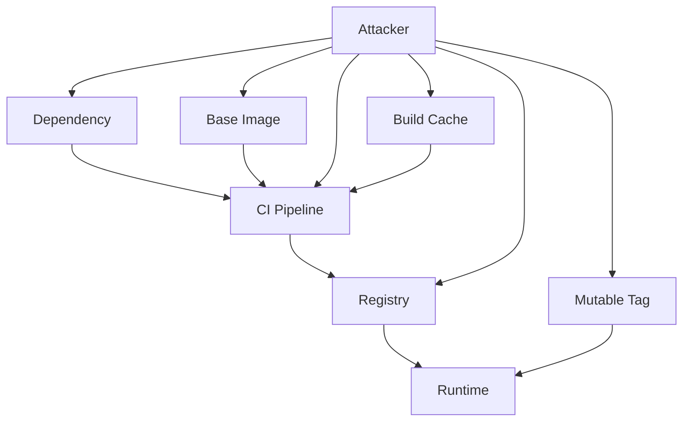

---

## 4. Image Identity: Tag vs Digest

Part 005 sudah membahas tag/digest. Dalam supply chain, ini menjadi governance rule.

Tag:

```text
company/api:1.4.2
```

Digest:

```text
company/api@sha256:...
```

Tag adalah nama manusia. Digest adalah identitas konten.

| Attribute | Tag | Digest |
|---|---:|---:|
| mudah dibaca | ya | tidak |
| mutable | bisa | tidak secara konten |
| cocok untuk UX | ya | terbatas |
| cocok untuk verification | lemah | kuat |
| cocok untuk promotion evidence | lemah sendiri | kuat |

Policy:

```text
Humans may discuss tags.
Systems should deploy digests or verify that tags resolve to expected digests.
```

---

## 5. Production Rule: Pin What You Promote

Bad deployment:

```yaml
services:
  api:
    image: company/api:latest
```

Better deployment:

```yaml
services:
  api:
    image: company/api:1.4.2
```

Best evidence-oriented deployment:

```yaml
services:
  api:
    image: company/api@sha256:aaaaaaaaaaaaaaaaaaaaaaaaaaaaaaaaaaaaaaaaaaaaaaaaaaaaaaaaaaaaaaaa
```

Trade-off:

- digest sulit dibaca;
- tag mudah untuk human release note;
- registry/CI bisa menyimpan mapping tag → digest;
- deployment manifest bisa memakai digest dan metadata comment/label untuk readability.

Example release record:

```yaml
service: billing-api
version: 1.4.2
image: registry.example.com/billing/api@sha256:...
gitCommit: 3f2a9c1
builtBy: github-actions://company/billing/.github/workflows/release.yml
sbom: registry-attestation://...
scanDecision: pass-with-exceptions
approvedBy: platform-security
```

---

## 6. Base Image Governance

Base image adalah inherited trust.

Jika base image buruk, semua image turunan mewarisi risiko.

Base image policy harus menjawab:

- base image apa yang boleh dipakai?
- siapa owner base image?
- bagaimana update base dilakukan?
- bagaimana CVE base image dipantau?
- apakah digest dipin?
- apakah image berasal dari official/trusted source?
- apakah distro lifecycle masih aktif?
- apakah runtime image terlalu besar?
- apakah debug tools boleh ada di production image?

Base image categories:

| Type | Kelebihan | Risiko |
|---|---|---|
| full distro | debugging mudah, package lengkap | attack surface besar |
| slim | lebih kecil | kadang library/tool hilang |
| Alpine | kecil | musl compatibility issue untuk beberapa workload |
| distroless | attack surface kecil | debugging lebih sulit |
| scratch | minimal total | hanya cocok untuk static binary tertentu |
| internal golden image | standard org kuat | harus dikelola aktif |

---

## 7. Approved Base Image Matrix

Contoh matrix organization:

| Workload | Approved Base | Notes |
|---|---|---|
| Java service | `eclipse-temurin:21-jre` internal mirror | pin major runtime, scan weekly |
| Node service | `node:22-bookworm-slim` internal mirror | no dev dependencies in runtime |
| Go service | `gcr.io/distroless/static` or internal scratch template | static binary preferred |
| Nginx edge | `nginx:stable-alpine` internal mirror | config owned by platform |
| Debug variant | full distro debug image | never production default |

Governance point:

```text
An approved base image list without an update process becomes stale documentation.
```

---

## 8. Base Image Update Strategy

Base image update harus menjadi recurring workflow.

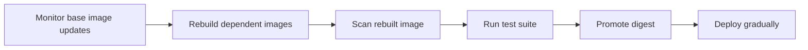

Practices:

- rebuild images even when app code does not change;
- track base image digest in metadata;
- use dependency bot/scout recommendations if available;
- separate emergency rebuild from regular release;
- test runtime compatibility;
- have rollback digest.

---

## 9. Labels and OCI Metadata

Labels membantu traceability.

Dockerfile:

```Dockerfile
ARG VERSION
ARG REVISION
ARG CREATED

LABEL org.opencontainers.image.title="billing-api" \
      org.opencontainers.image.description="Billing API service" \
      org.opencontainers.image.version="$VERSION" \
      org.opencontainers.image.revision="$REVISION" \
      org.opencontainers.image.created="$CREATED" \
      org.opencontainers.image.source="https://github.com/company/billing" \
      org.opencontainers.image.licenses="Apache-2.0"
```

Do not put secrets in labels.

Good labels:

- service name;
- commit SHA;
- version;
- source repository;
- build timestamp;
- license;
- vendor.

Bad labels:

- token;
- internal password;
- customer identifier;
- private endpoint with embedded credential;
- deploy approval secret.

---

## 10. SBOM Mental Model

SBOM = Software Bill of Materials.

It answers:

```text
What components are inside this artifact?
```

It does not automatically answer:

```text
Is this artifact safe?
```

SBOM is inventory. Risk decision needs inventory + vulnerability data + exploitability + context + policy.

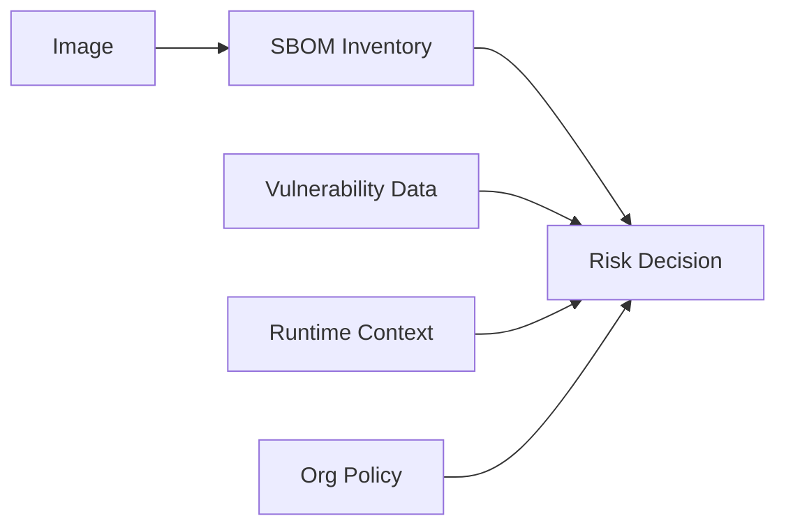

---

## 11. What an SBOM Usually Contains

Typical SBOM records:

- package name;
- package version;
- package type/ecosystem;
- supplier/origin;
- license;
- file/package relationships;
- checksums;
- dependency relationships;
- metadata about generation tool/time.

Container image SBOM often includes:

- OS packages;
- language dependencies;
- application packages;
- sometimes files/binaries;
- sometimes base image relation;
- sometimes license data.

Caveat:

```text
SBOM quality depends on generator coverage and package metadata quality.
```

---

## 12. SBOM Formats

Common formats:

| Format | Common Use |
|---|---|
| SPDX | legal/license and software package data, widely standardized |
| CycloneDX | application security and dependency inventory |
| Syft JSON | tool-specific output from Anchore Syft |
| in-toto/SLSA provenance | build provenance, not SBOM itself |

Do not over-optimize early. For engineering workflow, first ensure:

1. every production image has an SBOM;
2. SBOM is tied to image digest;
3. SBOM can be retrieved later;
4. SBOM is used by scanner/policy;
5. SBOM generation is automated.

---

## 13. Docker Build SBOM Attestation

Docker Buildx/BuildKit can produce SBOM attestations.

Example:

```bash
docker buildx build \
  --tag registry.example.com/billing/api:1.4.2 \
  --sbom=true \
  --push \
  .
```

Equivalent explicit form:

```bash
docker buildx build \
  --tag registry.example.com/billing/api:1.4.2 \
  --attest type=sbom \
  --push \
  .
```

Mental model:

```text
An SBOM attestation attaches inventory evidence to the image artifact/digest in the registry ecosystem.
```

Do not store SBOM only as a detached CI log artifact that disappears after retention window.

---

## 14. Provenance Mental Model

Provenance answers:

```text
How was this artifact built?
```

A useful provenance record can include:

- builder identity;
- source repository;
- commit SHA;
- build workflow;
- build arguments/parameters;
- build start/end time;
- materials/input digests;
- build platform;
- invocation metadata.

SBOM says:

```text
What is in it?
```

Provenance says:

```text
Where did it come from and how was it produced?
```

Signature says:

```text
Who/what claims this artifact is authentic?
```

Policy says:

```text
Is this acceptable for this environment?
```

---

## 15. Docker Build Provenance Attestation

Example:

```bash
docker buildx build \
  --tag registry.example.com/billing/api:1.4.2 \
  --provenance=mode=max \
  --push \
  .
```

Combined:

```bash
docker buildx build \
  --tag registry.example.com/billing/api:1.4.2 \
  --sbom=true \
  --provenance=mode=max \
  --push \
  .
```

Trade-off:

- more provenance detail improves auditability;
- some metadata may expose internal details;
- review what is emitted before enabling broad external publishing;
- internal registry can often store richer evidence than public distribution.

---

## 16. Vulnerability Scanning Mental Model

Scanner compares image inventory against vulnerability intelligence.

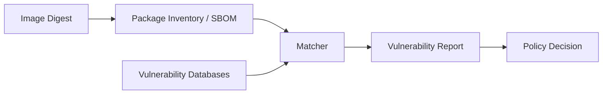

Scanner output is not a final decision. It is input to risk triage.

Questions:

- Is vulnerable package actually present?
- Is vulnerable code path reachable?
- Is vulnerability fixed upstream?
- Is patched base image available?
- Is exploit public/active?
- Is service exposed externally?
- Is compensating control present?
- Is exception time-limited?

---

## 17. Docker Scout

Docker Scout analyzes images, creates/infer inventories/SBOM, matches them against vulnerability data, and supports policy evaluation.

Typical commands:

```bash
docker scout quickview registry.example.com/billing/api:1.4.2

docker scout cves registry.example.com/billing/api:1.4.2

docker scout recommendations registry.example.com/billing/api:1.4.2
```

Policy evaluation:

```bash
docker scout policy registry.example.com/billing/api:1.4.2
```

Use Scout as part of engineering loop:

- local quick feedback;
- PR gate;
- release gate;
- registry monitoring;
- base image update recommendation;
- org policy compliance.

---

## 18. Vulnerability Severity Is Not Enough

Severity alone is insufficient.

Example matrix:

| Vulnerability | Severity | Runtime Exposure | Decision |
|---|---:|---|---|
| critical OpenSSL in public TLS edge | critical | reachable | block release |
| critical package in unused debug tool not in prod image | critical | absent | not applicable after image fix |
| high CVE in build-stage only dependency | high | not in final image | acceptable if final scan clean |
| medium vulnerability in internal admin tool | medium | VPN-only + auth | fix scheduled |
| low vulnerability in base package | low | low | monitor |

Better gate:

```text
Block critical/high vulnerabilities with available fixes unless exception is approved and expires.
```

---

## 19. False Positives and False Negatives

Vulnerability scanning has limits.

False positive examples:

- package version patched by distro backport but scanner sees old upstream version;
- vulnerable package installed but vulnerable feature not used;
- scanner misidentifies binary/package;
- dev dependency appears but not used at runtime.

False negative examples:

- statically linked binary not detected;
- manually copied binary has no package metadata;
- language dependency hidden in vendored directory;
- vulnerability database lacks advisory;
- SBOM generator misses ecosystem.

Engineering implication:

```text
Scanning is necessary but not sufficient.
```

Use:

- minimal images;
- dependency lockfiles;
- SBOM;
- base image governance;
- regular rebuilds;
- runtime controls;
- security review for high-risk components.

---

## 20. Fix Strategy

When scan finds vulnerabilities, fix in order:

1. Update base image digest/tag.
2. Rebuild image.
3. Update OS packages only if base-image policy allows it.
4. Update language dependencies.
5. Remove unnecessary packages.
6. Move build-only tools out of runtime image.
7. Switch to smaller runtime base.
8. Add exception only with reason and expiry.

Bad habit:

```Dockerfile
RUN apt-get update && apt-get upgrade -y
```

This can make image less reproducible and drift from base image lifecycle.

Better in many orgs:

```text
Update base image centrally, rebuild dependents, promote new digest.
```

---

## 21. Build Stage vs Runtime Stage Scanning

Multi-stage build reduces runtime surface, but only if final image is clean.

Example:

```Dockerfile
FROM node:22-bookworm AS build
WORKDIR /src
COPY package*.json ./
RUN npm ci
COPY . .
RUN npm run build

FROM nginx:1.27-alpine AS runtime
COPY --from=build /src/dist /usr/share/nginx/html
```

Scan final image:

```bash
docker scout cves company/web:1.0.0
```

But also consider scanning build images if they are pushed/cached/shared.

Rule:

```text
Anything pushed to a registry is an artifact and should be governed.
```

---

## 22. Secret Scanning in Image Supply Chain

Part 023 covered secret leakage. In supply chain gate, add secret scan.

Search final image filesystem for obvious patterns:

```bash
docker run --rm company/app:1.0.0 sh -c '
  find / -type f \( -name "*.pem" -o -name "id_rsa" -o -name "*.key" -o -name ".npmrc" \) 2>/dev/null
'
```

Use dedicated scanners in CI/registry where possible.

Policy:

```text
If a real secret is found in an image, block promotion and rotate the secret.
```

Deleting/rebuilding is not enough.

---

## 23. Signing Mental Model

Signing answers:

```text
Did an identity we trust sign this artifact digest?
```

Signing does not answer:

```text
Is the artifact vulnerability-free?
```

A signed vulnerable image is still vulnerable.

A signed malicious image built by compromised CI may still verify unless provenance/policy catches the issue.

Signing is one layer:

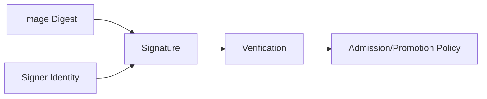

---

## 24. Docker Content Trust

Docker Content Trust uses Notary-based signing through Docker CLI commands such as `docker trust`.

Example pattern:

```bash
export DOCKER_CONTENT_TRUST=1

docker push registry.example.com/billing/api:1.4.2
```

Manual trust command style:

```bash
docker trust sign registry.example.com/billing/api:1.4.2
```

Important caveat:

```text
Content Trust is one trust mechanism, but modern supply-chain workflows often also evaluate SBOM, provenance, CI identity, and policy. Do not treat signing alone as sufficient.
```

Many organizations use Sigstore Cosign or registry-native signing/attestation workflows alongside or instead of older trust workflows, depending on platform compatibility.

---

## 25. Sigstore Cosign Pattern

Cosign is widely used for container image signing and verification.

Keyless signing pattern:

```bash
cosign sign registry.example.com/billing/api@sha256:...
```

Verify:

```bash
cosign verify \
  --certificate-identity-regexp 'https://github.com/company/billing/.github/workflows/release.yml@refs/tags/.*' \
  --certificate-oidc-issuer https://token.actions.githubusercontent.com \
  registry.example.com/billing/api@sha256:...
```

Conceptual value:

- signature is bound to digest;
- keyless flow can bind signing to OIDC identity;
- transparency log can improve auditability;
- CI identity can become part of trust policy.

Caveat:

- verification policy must be enforced;
- signing key/identity compromise remains a risk;
- signature does not replace vulnerability management.

---

## 26. Policy Gate Architecture

A serious pipeline has gates.

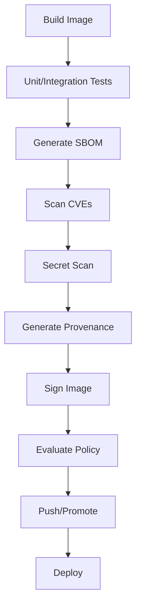

Policy examples:

```text
[ ] image has digest
[ ] image has SBOM
[ ] image has provenance
[ ] image has valid signature from approved CI identity
[ ] no critical/high CVE with fix available
[ ] no secret detected
[ ] base image approved
[ ] image runs as non-root
[ ] no privileged runtime setting in deployment spec
[ ] license policy satisfied
```

---

## 27. Example CI Gate Script

Illustrative script:

```bash
#!/usr/bin/env bash
set -euo pipefail

IMAGE="${IMAGE:?must set IMAGE}"

# Build and push with metadata.
docker buildx build \
  --tag "$IMAGE" \
  --sbom=true \
  --provenance=mode=max \
  --push \
  .

# Basic vulnerability check.
docker scout cves "$IMAGE"

# Policy evaluation if configured.
docker scout policy "$IMAGE"

# Optional signing after policy passes.
DIGEST_REF="$(docker buildx imagetools inspect "$IMAGE" --format '{{json .Manifest.Digest}}' | tr -d '"')"

echo "Built digest: $DIGEST_REF"
```

Real pipelines should avoid fragile shell parsing. Store digest as CI output from build action/tooling when possible.

---

## 28. GitHub Actions Pattern with Docker Buildx

Illustrative workflow fragment:

```yaml
name: release-image

on:
  push:
    tags:
      - 'v*'

permissions:
  contents: read
  packages: write
  id-token: write

jobs:
  build:
    runs-on: ubuntu-latest
    steps:
      - uses: actions/checkout@v4

      - uses: docker/setup-buildx-action@v3

      - uses: docker/login-action@v3
        with:
          registry: ghcr.io
          username: ${{ github.actor }}
          password: ${{ secrets.GITHUB_TOKEN }}

      - uses: docker/build-push-action@v6
        with:
          context: .
          push: true
          tags: ghcr.io/company/billing-api:${{ github.ref_name }}
          sbom: true
          provenance: mode=max
```

Add signing/policy according to organization tooling.

---

## 29. Registry Promotion Model

Avoid rebuilding separately for each environment.

Bad:

```text
build dev image
build staging image
build prod image
```

Better:

```text
build once -> scan/sign -> promote same digest across environments
```

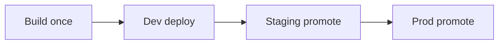

Promotion should move trust decision, not mutate artifact.

Good release record:

```text
staging approved digest sha256:X
prod approved same digest sha256:X
```

If production rebuilds from same source, you have two artifacts and need two evidence chains.

---

## 30. Registry Tag Strategy

Recommended tag set:

| Tag | Purpose | Mutable? |
|---|---|---:|
| `1.4.2` | semantic release | should not mutate |
| `1.4` | minor channel | may move by policy |
| `1` | major channel | may move by policy |
| `git-3f2a9c1` | commit trace | should not mutate |
| `build-20260701.1234` | build trace | should not mutate |
| `latest` | convenience only | mutable |

Production deployment should not rely on `latest`.

Policy:

```text
Mutable tags are channels, not evidence.
```

---

## 31. Registry Immutability

If registry supports immutable tags, use them for release tags.

Benefits:

- prevents accidental overwrite;
- protects release evidence;
- simplifies incident analysis;
- makes rollback reliable;
- reduces mutable tag attack.

Still store digest.

```text
Immutable tag protects name.
Digest identifies content.
```

---

## 32. Pull Policy and Deployment Drift

Runtime can drift if deployment uses mutable tags and nodes pull at different times.

Example failure:

```text
node A pulls api:latest at 10:00 -> digest X
node B pulls api:latest at 10:05 -> digest Y
same service version now runs different code
```

Mitigation:

- deploy digest;
- use immutable release tags;
- record resolved digest;
- avoid `latest` in production;
- force controlled rollout after promotion.

Swarm stack file can use digest references:

```yaml
services:
  api:
    image: registry.example.com/billing/api@sha256:...
```

---

## 33. License Governance

Image supply chain is not only CVE.

SBOM can support license review.

Questions:

- Are licenses allowed for distribution model?
- Are copyleft obligations understood?
- Are commercial dependencies licensed?
- Is license metadata accurate?
- Are generated artifacts including third-party assets?

Policy examples:

```text
Block GPL-3.0 in proprietary distributed client artifact unless approved.
Warn for unknown license.
Require legal review for custom license.
```

For backend-only services, license risk differs from distributed software, but still needs governance.

---

## 34. Non-Root and Runtime Policy as Supply Chain Signals

Supply chain policy can inspect image config.

Check default user:

```bash
docker image inspect company/api:1.0.0 --format '{{json .Config.User}}'
```

Check healthcheck:

```bash
docker image inspect company/api:1.0.0 --format '{{json .Config.Healthcheck}}'
```

Check labels:

```bash
docker image inspect company/api:1.0.0 --format '{{json .Config.Labels}}' | jq
```

Policy examples:

- image must not run as root by default;
- image must have OCI labels;
- image must not include secret-looking env vars;
- image must not define privileged assumptions;
- image must expose only expected ports;
- image must define a sane entrypoint.

---

## 35. Image Size Is a Supply Chain Signal

Large images are not automatically insecure, but size often correlates with:

- unused packages;
- build tools left in runtime;
- debug utilities in production;
- larger scan surface;
- slower pull/startup;
- more patch obligations.

Check:

```bash
docker image ls company/api

docker history company/api:1.0.0
```

Policy should not blindly block by size, but can flag anomalies:

```text
billing-api runtime image grew from 250MB to 1.2GB in one release.
```

That deserves review.

---

## 36. Reproducibility Reality

Docker improves environment packaging, but does not automatically guarantee reproducible builds.

Sources of non-reproducibility:

- unpinned package versions;
- `apt-get update` against moving repository;
- mutable base tags;
- timestamps in artifacts;
- random build output;
- network downloads without checksum;
- architecture differences;
- dependency lockfile drift;
- build args not captured;
- external scripts fetched at build time.

Better patterns:

- pin base image digest for release builds;
- use lockfiles;
- verify checksums for downloaded artifacts;
- avoid `curl | sh`;
- record build provenance;
- build once, promote digest;
- rebuild regularly under controlled process.

---

## 37. Dangerous Pattern: `curl | sh`

Anti-pattern:

```Dockerfile
RUN curl -fsSL https://example.com/install.sh | sh
```

Risks:

- remote script mutable;
- no checksum;
- hard to audit;
- build non-deterministic;
- attacker controlling endpoint can affect build.

Better:

```Dockerfile
ARG TOOL_VERSION=1.2.3
ARG TOOL_SHA256=...
RUN curl -fsSLo /tmp/tool.tar.gz "https://example.com/tool-${TOOL_VERSION}.tar.gz" \
    && echo "${TOOL_SHA256}  /tmp/tool.tar.gz" | sha256sum -c - \
    && tar -xzf /tmp/tool.tar.gz -C /usr/local/bin \
    && rm -f /tmp/tool.tar.gz
```

---

## 38. Dependency Lockfiles

Lockfiles are supply-chain artifacts.

Examples:

| Ecosystem | Lockfile |
|---|---|
| npm | `package-lock.json` |
| yarn | `yarn.lock` |
| pnpm | `pnpm-lock.yaml` |
| Maven | less strict by default; use dependency management / enforcer |
| Gradle | dependency locking |
| Go | `go.sum` |
| Python | `requirements.txt` with hashes / lock tools |
| Rust | `Cargo.lock` |

Docker build should copy lockfiles before installing dependencies to get stable cache and stable dependency graph.

Example:

```Dockerfile
COPY package.json package-lock.json ./
RUN npm ci
```

Not:

```Dockerfile
RUN npm install
```

for production build reproducibility.

---

## 39. Build Context Policy

Part 023 covered secrets. Supply chain adds additional concerns.

`.dockerignore` should exclude:

- `.git` if provenance captured elsewhere;
- local build outputs;
- credentials;
- test coverage;
- node_modules/target/build unless intentionally copied;
- editor/IDE files;
- local caches.

But be careful: excluding `.git` can make build scripts unable to derive commit. Prefer passing commit as build arg from CI:

```bash
docker buildx build \
  --build-arg REVISION="$GIT_SHA" \
  --label "org.opencontainers.image.revision=$GIT_SHA" \
  .
```

The value is non-secret metadata, so `ARG` is appropriate.

---

## 40. Policy as Code

Manual checklist does not scale.

Supply-chain policy should be executable.

Policy examples:

```text
deny if image tag == latest in production
warn if base image not approved
deny if critical CVE has fix and no exception
deny if image lacks SBOM attestation
deny if image lacks provenance
deny if signer identity is not approved CI workflow
deny if default user is root
warn if image size increased > 50%
deny if secret scan detects credential
```

Tools vary, but architecture is stable:

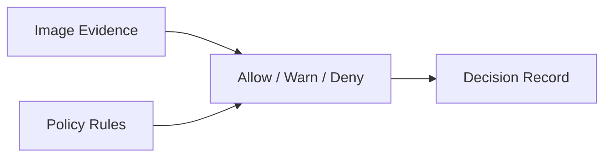

---

## 41. Exception Management

Zero vulnerability policy is often unrealistic. Unlimited exceptions are dangerous.

Good exception fields:

| Field | Example |
|---|---|
| image digest | sha256:... |
| vulnerability | CVE-... |
| affected package | libxyz 1.2.3 |
| environment | staging/prod |
| justification | not reachable due to disabled module |
| compensating control | network isolation + WAF rule |
| owner | platform-security |
| expiry | 2026-07-31 |
| approval | security lead |
| remediation issue | link/id |

Rule:

```text
Every exception must expire.
```

---

## 42. Release Evidence Bundle

For every production release, store an evidence bundle.

Minimum:

```yaml
service: billing-api
environment: production
release: 1.4.2
imageDigest: sha256:...
sourceCommit: 3f2a9c1
builder: github-actions/release-image
buildTime: 2026-07-01T10:15:00Z
sbom: present
provenance: present
signature: verified
scanner: docker-scout
policyDecision: pass
exceptions: []
approvedBy: release-policy
```

This turns release from "someone deployed a tag" into auditable event.

---

## 43. Incident Response: Vulnerability Found After Deploy

When a new CVE affects deployed images:

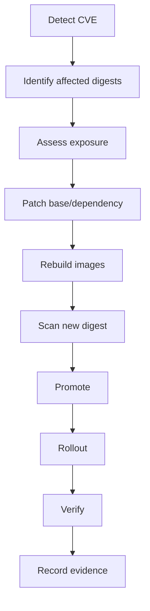

Important capability:

```text
Can we answer which running services contain package X version Y?
```

Without SBOM/image inventory, this becomes manual archaeology.

---

## 44. Incident Response: Compromised Image

If image is suspected malicious:

1. Freeze tag/digest promotion.
2. Identify all deployments using digest.
3. Pull registry audit logs.
4. Verify signature/provenance.
5. Compare image filesystem/layers to expected build.
6. Rotate registry credentials if push compromise possible.
7. Rebuild from trusted clean pipeline.
8. Promote new digest.
9. Roll production.
10. Revoke old tags or mark as blocked.
11. Scan for persistence/runtime compromise.
12. Document root cause.

Rule:

```text
Do not overwrite the suspicious tag and call it fixed.
Keep evidence for investigation.
```

---

## 45. Image Promotion Anti-Patterns

| Anti-Pattern | Failure Mode |
|---|---|
| rebuild per environment | artifacts differ, evidence fragmented |
| deploy `latest` | drift, rollback ambiguity |
| scan after deploy only | production becomes test gate |
| sign without verify | signature is ceremonial |
| SBOM not tied to digest | inventory mismatch |
| exceptions never expire | risk accumulates |
| base image owner unclear | patching stalls |
| registry push token broad | compromised CI can poison many repos |
| no immutable tags | accidental overwrite |
| no release evidence | audit failure |

---

## 46. Production Image Standard

Reusable baseline:

```text
1. Image must be built by approved CI, not manually from a laptop.
2. Image must include OCI metadata labels.
3. Image must be tagged with immutable release tag and recorded digest.
4. Image must have SBOM evidence tied to digest.
5. Image must have provenance evidence tied to build identity/source.
6. Image must pass vulnerability policy or have approved expiring exception.
7. Image must pass secret scan.
8. Image must use approved base image or approved exception.
9. Runtime image must exclude build-only tools unless explicitly approved.
10. Production deployment must use digest or verified immutable tag mapping.
11. Release evidence bundle must be stored with deployment record.
```

---

## 47. Dockerfile Supply Chain Checklist

```text
[ ] Base image is approved.
[ ] Base image version/digest strategy is explicit.
[ ] Package installs are deterministic enough for release process.
[ ] Remote downloads use pinned versions and checksums.
[ ] No curl | sh without verification.
[ ] Lockfiles are copied and used.
[ ] Build-only tools do not remain in final image.
[ ] Dockerfile labels include source/version/revision.
[ ] No secrets in ARG/ENV/layers.
[ ] Final image runs as non-root where possible.
[ ] Final image has minimal runtime surface.
```

---

## 48. CI/CD Supply Chain Checklist

```text
[ ] Build runs in approved CI identity.
[ ] Build uses isolated trusted runner class for release.
[ ] Build pushes to approved registry.
[ ] Digest is captured as release output.
[ ] SBOM attestation generated.
[ ] Provenance attestation generated.
[ ] Vulnerability scan executed.
[ ] Secret scan executed.
[ ] Image signed after build.
[ ] Signature verification tested.
[ ] Policy decision stored.
[ ] Release requires protected branch/tag/environment.
[ ] Registry credentials are scoped.
```

---

## 49. Registry Governance Checklist

```text
[ ] Registry has access control by team/environment.
[ ] Push access is limited to CI release identities.
[ ] Pull access is limited to runtime/deploy identities.
[ ] Release tags are immutable where supported.
[ ] Old images have retention policy.
[ ] Critical images are mirrored if external dependency risk is high.
[ ] Registry audit logs are retained.
[ ] Vulnerability monitoring is enabled.
[ ] Attestations/signatures are preserved.
[ ] Deprecated/vulnerable digests can be blocked.
```

---

## 50. Deployment Policy Checklist

```text
[ ] Production deploy does not use latest.
[ ] Deployment resolves image to expected digest.
[ ] Signature/provenance policy verified before deploy.
[ ] CVE policy evaluated before deploy.
[ ] Runtime hardening config checked.
[ ] Secrets are runtime-projected, not baked into image.
[ ] Rollback digest is known.
[ ] Deployed digest is recorded.
[ ] Post-deploy verification confirms expected digest running.
```

Swarm verification:

```bash
docker service inspect billing_api --format '{{json .Spec.TaskTemplate.ContainerSpec.Image}}'
```

---

## 51. Practical Lab 1 — Generate SBOM/Provenance with Buildx

Build:

```bash
docker buildx build \
  --tag localhost:5000/demo/app:1.0.0 \
  --sbom=true \
  --provenance=mode=max \
  --push \
  .
```

Inspect image metadata:

```bash
docker buildx imagetools inspect localhost:5000/demo/app:1.0.0
```

Learning questions:

```text
What digest was produced?
Where is SBOM/provenance attached?
Does your registry preserve attestations?
Can your deployment system see or verify them?
```

---

## 52. Practical Lab 2 — Compare Tag and Digest

Pull tag:

```bash
docker pull alpine:3.20
```

Inspect repo digest:

```bash
docker image inspect alpine:3.20 --format '{{json .RepoDigests}}' | jq
```

Run by digest:

```bash
docker run --rm alpine@sha256:<digest> cat /etc/alpine-release
```

Learning point:

```text
The tag helps humans find the image. The digest identifies the exact content.
```

---

## 53. Practical Lab 3 — Docker Scout Scan

Run quick view:

```bash
docker scout quickview alpine:3.20
```

Run CVE scan:

```bash
docker scout cves alpine:3.20
```

Run recommendations:

```bash
docker scout recommendations alpine:3.20
```

Learning questions:

- Which packages are present?
- Which CVEs have fixes?
- Does scanner distinguish base image update recommendation?
- What would your release gate block?
- What would your release gate warn?

---

## 54. Practical Lab 4 — Detect Root Default User

Dockerfile bad:

```Dockerfile
FROM alpine:3.20
CMD ["sleep", "3600"]
```

Build:

```bash
docker build -t user-bad:1 .
```

Inspect:

```bash
docker image inspect user-bad:1 --format '{{json .Config.User}}'
```

Dockerfile better:

```Dockerfile
FROM alpine:3.20
RUN addgroup -S app && adduser -S -G app app
USER app
CMD ["sleep", "3600"]
```

Build and inspect:

```bash
docker build -t user-good:1 .
docker image inspect user-good:1 --format '{{json .Config.User}}'
```

Learning point:

```text
Supply-chain policy can inspect image config before runtime.
```

---

## 55. Practical Lab 5 — Secret Scan Sanity Check

Create bad image:

```Dockerfile
FROM alpine:3.20
RUN echo 'AWS_SECRET_ACCESS_KEY=example-secret' > /app.env
```

Build:

```bash
docker build -t secret-image-bad:1 .
```

Manual check:

```bash
docker run --rm secret-image-bad:1 sh -c 'grep -R "AWS_SECRET" / 2>/dev/null || true'
```

Expected:

```text
The build must fail in real CI if this is a real credential.
```

---

## 56. Supply Chain Maturity Model

| Level | Behavior |
|---|---|
| 0 | manual build/push from laptop, mutable tags |
| 1 | CI builds image, basic tags, manual deploy |
| 2 | CI scan, release tags, no latest in prod |
| 3 | digest promotion, SBOM, base image policy |
| 4 | provenance, signing, policy gates, exception workflow |
| 5 | continuous monitoring, automated rebuilds, admission enforcement, audit-grade evidence |

Goal for top-tier engineering org:

```text
At least Level 4 for production-critical services.
Level 5 for regulated/high-risk platforms.
```

---

## 57. What Good Looks Like

A strong image supply chain has these properties:

1. Every artifact has immutable identity.
2. Every artifact is built by trusted automation.
3. Every artifact has inventory.
4. Every artifact has origin evidence.
5. Every artifact is scanned.
6. Every artifact is signed or otherwise authenticity-verified.
7. Every release has policy decision.
8. Every exception expires.
9. Every deployment records digest.
10. Every vulnerable digest can be found quickly.
11. Every production image can be rebuilt or replaced through a known process.
12. Every base image has an owner.

---

## 58. What Not to Overclaim

Avoid these false claims:

```text
"We have SBOM, so we are secure."
```

SBOM is inventory, not security.

```text
"We scanned it, so it is safe."
```

Scanner can miss issues and context matters.

```text
"It is signed, so it is safe."
```

Signing proves identity/integrity under policy; it does not remove vulnerabilities.

```text
"It is in a private registry, so it is trusted."
```

Private registry can still host bad artifacts.

```text
"Docker makes builds reproducible."
```

Docker helps package environments, but reproducibility requires discipline.

---

## 59. Decision Framework

Use this decision flow for release:

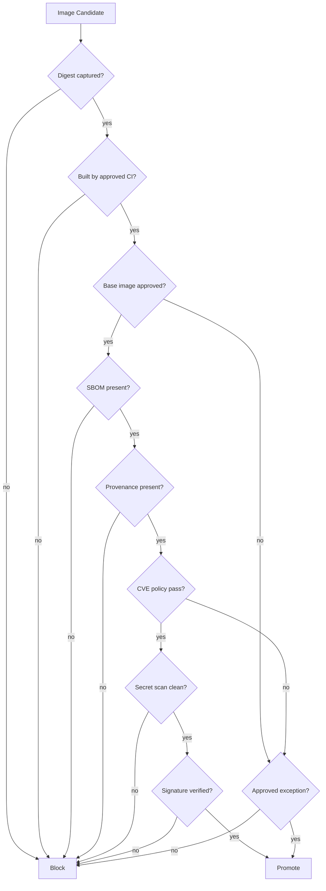

---

## 60. Engineering Handbook Standard

Reusable standard:

```text
Production Container Image Supply Chain Standard

1. All production images must be built by approved CI pipelines.
2. Manual production image pushes are prohibited except under break-glass with audit.
3. All production images must have immutable release tags and recorded digests.
4. Deployments must use image digest or verify immutable tag-to-digest mapping.
5. All production images must have SBOM and provenance evidence tied to digest.
6. All production images must pass vulnerability and secret scanning gates.
7. All production images must be signed or verified by approved authenticity mechanism.
8. Base images must come from approved sources and have assigned owners.
9. Exceptions must be approved, justified, assigned an owner, and expire.
10. The organization must be able to answer: "where is digest X running?" and "which running images contain package Y?"
```

---

## 61. Mental Model Recap

Image supply chain is evidence engineering.

```text
A container image is not trustworthy because it runs.
A container image is trustworthy when its identity, contents, origin, risk, and approval are known and verified.
```

Core invariants:

1. Tags are names; digests are content identity.
2. Build once, promote the same digest.
3. SBOM is inventory, not safety.
4. Scanning is necessary, not sufficient.
5. Signing proves authenticity, not absence of vulnerabilities.
6. Provenance connects artifact to build/source.
7. Base image governance controls inherited risk.
8. Exceptions must expire.
9. Release evidence should survive log retention.
10. Runtime deployment should record exact digest.

---

## 62. References

- Docker Docs — Docker Scout: https://docs.docker.com/scout/
- Docker Docs — Docker Scout quickstart and policy evaluation: https://docs.docker.com/scout/quickstart/
- Docker Docs — `docker scout policy`: https://docs.docker.com/reference/cli/docker/scout/policy/
- Docker Docs — Build attestations: https://docs.docker.com/build/metadata/attestations/
- Docker Docs — SBOM attestations: https://docs.docker.com/build/metadata/attestations/sbom/
- Docker Docs — Provenance attestations: https://docs.docker.com/build/metadata/attestations/slsa-provenance/
- Docker Docs — Build annotations: https://docs.docker.com/build/metadata/annotations/
- Docker Docs — Content Trust in Docker: https://docs.docker.com/engine/security/trust/
- Sigstore Docs — Signing containers with Cosign: https://docs.sigstore.dev/cosign/signing/signing_with_containers/
- OCI Image Spec — Annotations: https://specs.opencontainers.org/image-spec/annotations/

---

## 63. What Comes Next

Part 025 akan memulai fase Docker Swarm:

- Swarm mode architecture;
- manager/worker;
- Raft;
- desired state;
- service/task model;
- scheduler;
- quorum;
- operational invariants.
