# Part 025 — Docker Swarm Architecture: Managers, Workers, Raft, Desired State

> Target pembelajaran: setelah part ini, kita mampu membaca Docker Swarm sebagai **distributed control plane**, bukan hanya kumpulan command `docker service`; memahami manager, worker, Raft, desired state, service/task/container mapping, scheduling loop, node lifecycle, quorum, failure boundary, dan invariants yang harus dijaga agar Swarm layak dipakai sebagai production runtime.

Part 024 menutup fase **supply chain trust**. Mulai part ini, kita masuk ke fase **Docker Swarm engineering**.

Docker Swarm sering dipelajari terlalu dangkal:

```text
init swarm -> join worker -> create service -> scale service
```

Itu cukup untuk demo, tetapi tidak cukup untuk operasi nyata.

Mental model yang lebih tepat:

```text
Docker Swarm = distributed desired-state orchestrator embedded in Docker Engine.
```

Ia memiliki:

- cluster membership;
- manager/worker role;
- replicated cluster state;
- scheduler;
- desired-state reconciliation;
- service abstraction;
- task lifecycle;
- network orchestration;
- secret/config distribution;
- rolling update/rollback machinery;
- operational failure modes seperti quorum loss, node drain, network partition, manager outage, and task churn.

Part ini bukan tutorial command. Part ini adalah arsitektur.

---

## 1. Kaufman Framing: Subskill yang Harus Dikuasai

Menurut pendekatan Kaufman, skill kompleks harus dipecah menjadi subskill kecil yang bisa dipraktikkan dan dikoreksi cepat.

Untuk Swarm architecture, subskill utama adalah:

| Subskill | Yang harus bisa dijelaskan tanpa hafalan |
|---|---|
| Swarm mode | Apa yang berubah ketika Docker Engine masuk mode Swarm |
| Node roles | Perbedaan manager, worker, leader, reachable manager, unavailable manager |
| Raft | Mengapa manager perlu quorum dan apa akibatnya jika quorum hilang |
| Desired state | Mengapa service bukan container, dan mengapa task bisa diganti |
| Scheduler | Bagaimana task dipilihkan node berdasarkan constraints/resources/availability |
| Reconciliation | Bagaimana Swarm memperbaiki actual state agar mendekati desired state |
| Failure boundary | Apa yang terjadi ketika node mati, manager hilang, task crash, atau network partition |
| Operations | Bagaimana merancang manager count, role separation, backup, drain, dan update |

Jika kita hanya hafal command, kita akan bingung saat terjadi:

- service stuck di `Pending`;
- task terus restart;
- node `Down` tapi service tidak pindah;
- manager tidak bisa menerima update;
- cluster kehilangan quorum;
- placement constraint tidak terpenuhi;
- global service tidak berjalan di node tertentu;
- service update mengganti task lama dengan task baru yang berbeda identity.

---

## 2. Apa Itu Swarm Mode?

Swarm mode adalah mode Docker Engine untuk mengelola beberapa Docker host sebagai satu cluster.

Satu host Docker biasa:

```text
Docker CLI -> Docker Engine -> container local host
```

Swarm:

```text
Docker CLI -> manager node -> cluster desired state -> scheduler -> task di banyak node
```

Perubahan mental model:

| Non-Swarm Docker | Swarm mode |
|---|---|
| `docker run` membuat container lokal | `docker service create` membuat desired service |
| Container adalah unit utama | Service adalah unit deklaratif, task adalah unit eksekusi |
| Host lokal adalah boundary utama | Cluster adalah scheduling domain |
| Failure handling mostly local | Failure handling dilakukan reconciliation loop |
| Scaling manual per-host | Scaling lewat desired replicas |
| Network mostly single-host | Overlay network across nodes |
| Secret lokal/manual | Swarm secrets terdistribusi ke task yang berhak |

Swarm bukan pengganti semua fitur Kubernetes. Tetapi Swarm tetap penting sebagai contoh orchestrator yang sederhana, embedded, dan dekat dengan Docker Engine.

---

## 3. Arsitektur Besar Swarm

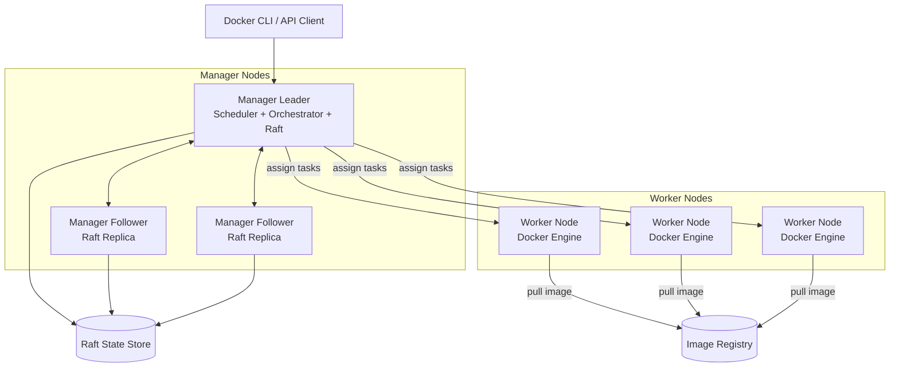

Komponen arsitektur:

| Komponen | Fungsi |
|---|---|
| Manager node | Menyimpan cluster state, menerima API management, menjalankan scheduler/orchestrator |
| Worker node | Menjalankan task yang diberikan manager |
| Leader manager | Manager aktif yang mengambil keputusan scheduling/orchestration |
| Follower manager | Menyimpan state dan bisa menjadi leader jika election terjadi |
| Raft store | State cluster yang direplikasi antar-manager |
| Service | Desired state level tinggi |
| Task | Satu unit eksekusi service yang dijadwalkan ke node |
| Container | Runtime process yang dibuat dari task |
| Overlay network | Network multi-host untuk komunikasi service antar-node |
| Registry | Sumber image untuk semua node |

---

## 4. Control Plane vs Data Plane

Swarm harus dibaca sebagai dua plane.

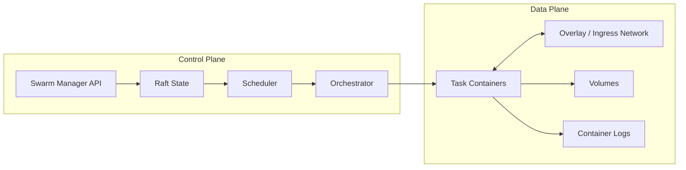

Control plane menjawab:

- service apa yang seharusnya ada;
- berapa replica;
- task mana berjalan di node mana;
- update apa yang sedang berlangsung;
- secret/config mana yang boleh diterima task;
- network mana yang harus tersedia;
- node mana active/drain/pause/down.

Data plane menjawab:

- container benar-benar berjalan atau tidak;
- traffic antar-service lewat mana;
- port mana yang dipublish;
- volume mana dipakai;
- logs/metrics apa yang muncul;
- process crash atau tidak.

Banyak incident terjadi karena engineer mencampur dua plane ini.

Contoh:

```text
Service terlihat desired replicas = 3.
Tetapi actual task hanya 1 running.
```

Ini bukan masalah definisi service. Ini masalah reconciliation/scheduling/runtime.

---

## 5. Node: Unit Infrastruktur Swarm

Node adalah Docker Engine yang menjadi anggota swarm.

Role utama:

| Role | Tugas utama | Apakah menjalankan workload? |
|---|---|---|
| Manager | Control plane, state, scheduler | Bisa, kecuali dibatasi |
| Worker | Menjalankan task | Ya |

Secara default, manager juga bisa menjalankan task. Namun untuk production, kita sering memisahkan:

```text
manager nodes: control-plane only
worker nodes: workload execution
```

Alasannya:

- mengurangi noisy-neighbor pada manager;
- menjaga latency control-plane;
- mengurangi risiko workload compromise di manager;
- membuat capacity planning lebih jelas;
- menjaga quorum lebih stabil.

Namun cluster kecil bisa saja memakai manager sebagai worker juga, terutama development/staging/lab.

---

## 6. Manager Node

Manager node memiliki beberapa tanggung jawab:

1. menerima command management seperti `docker service create`, `docker service update`, `docker node update`;
2. menyimpan cluster state;
3. menjalankan Raft consensus;
4. melakukan leader election;
5. menjadwalkan task ke node;
6. mendistribusikan secret/config ke node yang menjalankan task terkait;
7. melakukan reconciliation ketika task/node berubah;
8. mengelola rolling update/rollback;
9. memelihara membership cluster.

Manager bukan sekadar worker dengan privilege tambahan. Manager adalah stateful control-plane node.

### 6.1 Manager Leader

Leader manager adalah manager yang saat ini mengambil keputusan orchestration.

Ia bertanggung jawab untuk:

- menerima mutation terhadap desired state;
- memutuskan scheduling;
- mengubah task assignment;
- mengoordinasikan update;
- menulis state ke Raft log.

### 6.2 Manager Follower

Follower manager menyimpan replika state.

Ia penting karena:

- menjaga high availability control-plane;
- bisa mengikuti leader election jika leader mati;
- membantu mempertahankan quorum;
- menjadi basis disaster recovery jika manager leader hilang.

Follower bukan standby pasif yang tidak penting. Ia adalah bagian dari consensus group.

---

## 7. Worker Node

Worker node menjalankan task.

Tanggung jawab worker:

- menerima task assignment dari manager;
- pull image dari registry;
- membuat container sesuai task spec;
- menghubungkan container ke network yang diperlukan;
- memasang secret/config/volume sesuai entitlement;
- melaporkan status task ke manager;
- restart task lokal sesuai policy/task lifecycle;
- menghapus task yang tidak lagi diinginkan.

Worker tidak menyimpan authoritative cluster state. Worker tahu task yang harus ia jalankan, tetapi tidak mengambil keputusan global.

---

## 8. Node State, Availability, dan Lifecycle

Swarm memiliki konsep node availability.

| Availability | Makna operasional |
|---|---|
| `active` | Node bisa menerima task baru |
| `pause` | Node tetap menjalankan task lama, tapi tidak menerima task baru |
| `drain` | Node tidak menerima task baru dan task existing dipindahkan/dihentikan sesuai service |

State yang sering terlihat:

| State | Makna |
|---|---|
| `Ready` | Node reachable dan siap |
| `Down` | Node tidak reachable |
| `Unknown` | Manager tidak yakin status node |

Node lifecycle:

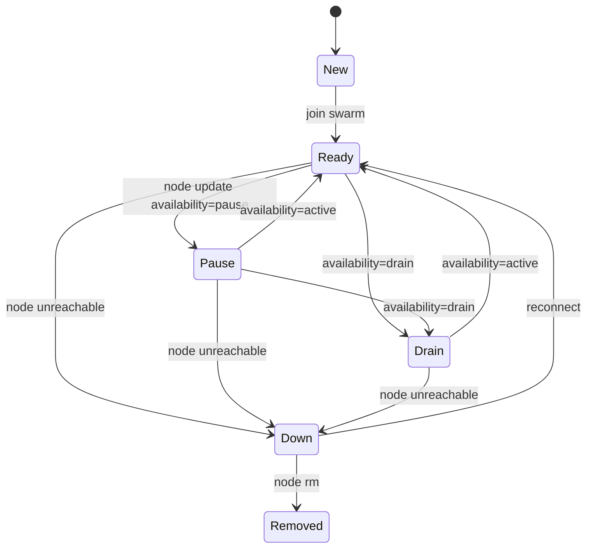

### 8.1 Active

Gunakan `active` untuk normal worker.

```bash
Docker CLI example:
docker node update --availability active worker-1
```

### 8.2 Pause

Gunakan `pause` ketika kita ingin mencegah scheduling baru tetapi tidak ingin memindahkan workload existing.

Contoh use case:

- node sedang diamati;
- kapasitas node hampir penuh;
- kita ingin menghindari task baru selama maintenance ringan;
- kita ingin menghentikan pertumbuhan workload tanpa reschedule besar.

### 8.3 Drain

Gunakan `drain` untuk maintenance node.

Efeknya:

- task replicated service di node itu akan dihentikan;
- orchestrator mencoba membuat replacement di node lain;
- global service biasanya juga dihentikan di node yang drain;
- jika tidak ada node lain yang memenuhi constraint, task bisa pending.

Drain bukan sekadar “disable node”. Drain adalah operasi rescheduling.

---

## 9. Raft Consensus: Mengapa Quorum Penting

Swarm manager memakai Raft untuk menjaga cluster state konsisten.

Masalah distributed system:

```text
Jika ada beberapa manager, siapa yang boleh membuat keputusan?
Bagaimana agar semua manager sepakat tentang state cluster?
Bagaimana jika network partition terjadi?
```

Raft menjawab dengan:

- leader election;
- replicated log;
- majority quorum;
- consistent state machine;
- strong leadership model.

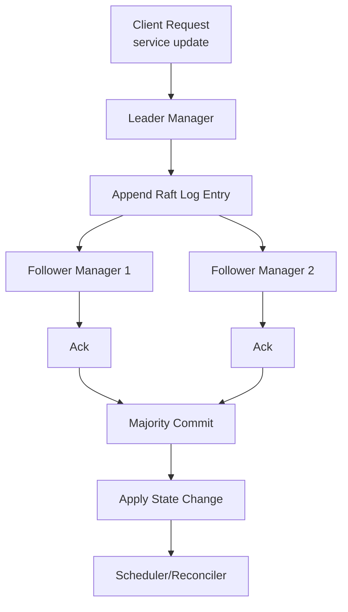

Tanpa quorum, manager tidak boleh membuat mutation yang aman terhadap cluster state.

---

## 10. Quorum Mental Model

Quorum berarti mayoritas manager harus tersedia untuk mengambil keputusan.

Formula:

```text
quorum = floor(N / 2) + 1
```

| Manager count | Quorum | Manager failure yang masih bisa ditoleransi |
|---:|---:|---:|
| 1 | 1 | 0 |
| 2 | 2 | 0 |
| 3 | 2 | 1 |
| 4 | 3 | 1 |
| 5 | 3 | 2 |
| 6 | 4 | 2 |
| 7 | 4 | 3 |

Inilah alasan jumlah manager umumnya ganjil: 3, 5, atau 7.

### 10.1 Kenapa 2 Manager Buruk?

Dengan 2 manager:

```text
quorum = 2
```

Jika satu manager mati, hanya tersisa satu. Cluster kehilangan quorum.

Dengan 3 manager:

```text
quorum = 2
```

Jika satu mati, masih ada 2. Cluster tetap bisa mengambil keputusan.

### 10.2 Kenapa Tidak Terlalu Banyak Manager?

Lebih banyak manager bukan selalu lebih baik.

Trade-off:

- lebih banyak manager menaikkan fault tolerance sampai batas tertentu;
- tetapi write latency consensus bisa meningkat;
- operational surface membesar;
- network stability antar-manager menjadi lebih penting;
- backup/upgrade/maintenance makin kompleks.

Rule of thumb:

| Cluster size | Manager count yang masuk akal |
|---|---:|
| Lab/dev | 1 |
| Small production | 3 |
| Medium/critical production | 3 atau 5 |
| Large multi-AZ critical | 5 atau 7 dengan desain network matang |

---

## 11. Apa yang Terjadi Saat Quorum Hilang?

Jika quorum hilang:

- running task tidak otomatis mati;
- data plane yang sudah berjalan bisa tetap melayani traffic;
- cluster tidak bisa menerima state change secara normal;
- service update/scale/rollback bisa gagal;
- scheduler tidak bisa membuat keputusan global baru secara aman;
- recovery harus fokus mengembalikan majority manager atau melakukan force-new-cluster dalam skenario disaster.

Penting:

```text
Quorum loss is a control-plane incident, not necessarily an immediate data-plane outage.
```

Tetapi jika ada task crash saat control plane tidak sehat, cluster mungkin tidak bisa mengganti task dengan benar.

---

## 12. Desired State: Konsep Paling Penting di Swarm

Swarm bukan imperative runtime seperti `docker run`.

Swarm bekerja secara deklaratif:

```text
User declares desired state.
Swarm continuously reconciles actual state toward desired state.
```

Contoh desired state:

```bash
docker service create --name api --replicas 3 nginx:1.27
```

Maknanya bukan:

```text
buat tiga container lalu selesai
```

Maknanya:

```text
selama service api ada, cluster harus berusaha mempertahankan 3 task api running
```

Jika satu task mati, Swarm membuat replacement task.

Jika satu node mati, Swarm mencoba menempatkan replacement di node lain.

Jika image diupdate, Swarm membuat task generasi baru.

---

## 13. Service, Task, Container: Jangan Disamakan

Ini mapping inti:

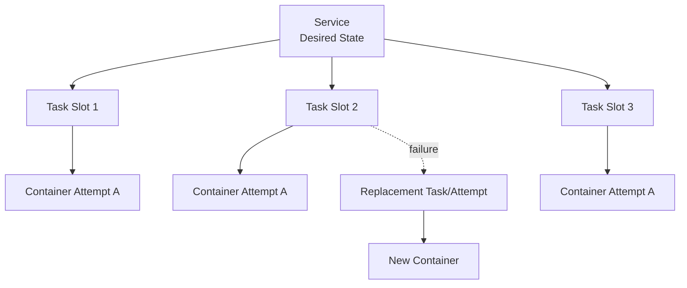

| Level | Sifat | Identity |
|---|---|---|
| Service | Long-lived desired state | Stabil selama service ada |
| Task | Assignment unit | Bisa diganti saat failure/update |
| Container | Runtime process | Ephemeral, implementation detail task |

Kesalahan umum:

```text
Saya exec ke container service api dan mengubah file config.
```

Masalah:

- container bisa diganti kapan saja;
- perubahan tidak masuk desired state;
- replacement task tidak membawa perubahan itu;
- ini menghasilkan drift.

Di Swarm, konfigurasi harus masuk service spec, image, secret, config, environment, network, atau volume yang benar.

---

## 14. Swarm Reconciliation Loop

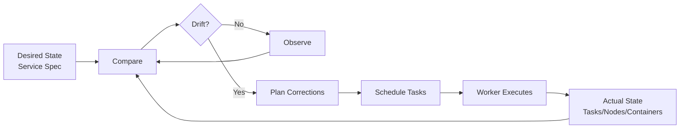

Contoh drift:

| Desired | Actual | Reconciliation |
|---|---|---|
| replicas=3 | 2 running | create replacement task |
| image=v2 | some tasks v1 | rolling update remaining tasks |
| node active | node down | reschedule eligible tasks |
| task desired shutdown | task still running | stop/remove task |
| constraint requires SSD | no SSD node available | task pending |

Reconciliation bukan magic. Ia dibatasi oleh:

- resource capacity;
- placement constraints;
- network reachability;
- image availability;
- secret/config availability;
- node state;
- quorum;
- update policy;
- restart policy.

---

## 15. Scheduler: Apa yang Diputuskan?

Scheduler menentukan node untuk task.

Input scheduler:

- service mode: replicated/global;
- replica count;
- node availability;
- placement constraints;
- placement preferences;
- resource reservations;
- published port mode;
- network requirements;
- task history/restart behavior;
- node labels;
- engine labels;
- platform/architecture;
- image constraints indirectly, via pull success/failure.

Output scheduler:

```text
task X assigned to node Y
```

Scheduler tidak menjamin aplikasi sehat. Scheduler hanya menempatkan task sesuai rule yang ia pahami.

Health, readiness, dependency readiness, dan business correctness harus diekspresikan lewat service design.

---

## 16. Swarm Architecture State Machine

Swarm bisa dibaca sebagai state machine bertingkat.

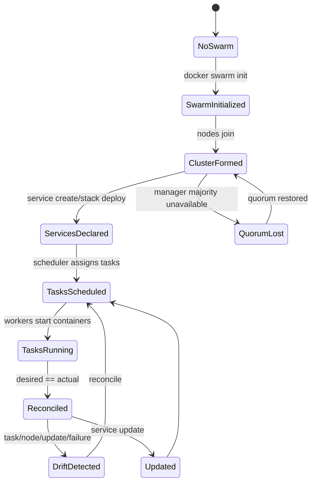

---

## 17. Service Mode: Replicated vs Global Preview

Detail service/task ada di Part 026, tetapi arsitektur perlu tahu dua mode besar.

### 17.1 Replicated Service

```text
Run N replicas of this service somewhere in the cluster.
```

Contoh:

```bash
docker service create --name web --replicas 5 nginx:1.27
```

Scheduler bebas memilih eligible nodes.

### 17.2 Global Service

```text
Run one task on every eligible node.
```

Contoh use case:

- log agent;
- metrics collector;
- node exporter;
- security agent;
- daemon-like infrastructure component.

---

## 18. Cluster Membership

Swarm membership memakai join token.

Ada token untuk:

- worker join;
- manager join.

Prinsip governance:

```text
manager join token is highly sensitive.
worker join token is sensitive but lower impact.
```

Jika manager token bocor, attacker bisa mencoba menambahkan manager baru ke control plane.

Operational standard:

- simpan join token seperti secret;
- rotate token setelah exposure;
- audit node list;
- jangan embed token di public script;
- pisahkan bootstrap automation dari runtime secret management.

---

## 19. Certificates and Node Identity

Swarm memakai mutual TLS antar-node.

Mental model:

```text
node identity != hostname only
node identity includes Swarm-issued certificate and membership state
```

Dampak:

- node yang join mendapat identity;
- manager bisa mengenali node;
- communication antar-node terenkripsi/terautentikasi di control plane;
- certificate rotation menjadi bagian operasi cluster.

Dalam operasi serius, hostname tetap penting untuk observability, tetapi identity authoritative berada di Swarm membership.

---

## 20. Network Ports yang Harus Dipahami

Swarm punya port penting antar-node.

| Port | Protocol | Fungsi umum |
|---:|---|---|
| 2377 | TCP | cluster management communication |
| 7946 | TCP/UDP | node discovery / gossip |
| 4789 | UDP | overlay network VXLAN traffic |

Checklist firewall:

- manager-manager harus bisa komunikasi control plane;
- worker-manager harus bisa komunikasi management sesuai kebutuhan;
- node-node harus bisa gossip;
- node-node harus bisa overlay data plane jika overlay network digunakan;
- published service ports harus dibuka sesuai exposure policy.

Port block sering menghasilkan gejala yang membingungkan:

- node join berhasil tapi overlay traffic gagal;
- service running tapi tidak bisa saling reach;
- routing mesh tidak konsisten;
- task sehat secara lokal tetapi tidak bisa melayani antar-node.

---

## 21. Image Registry sebagai Dependency Cluster

Swarm tidak “mengirim image” dari manager ke worker.

Worker harus bisa pull image dari registry.

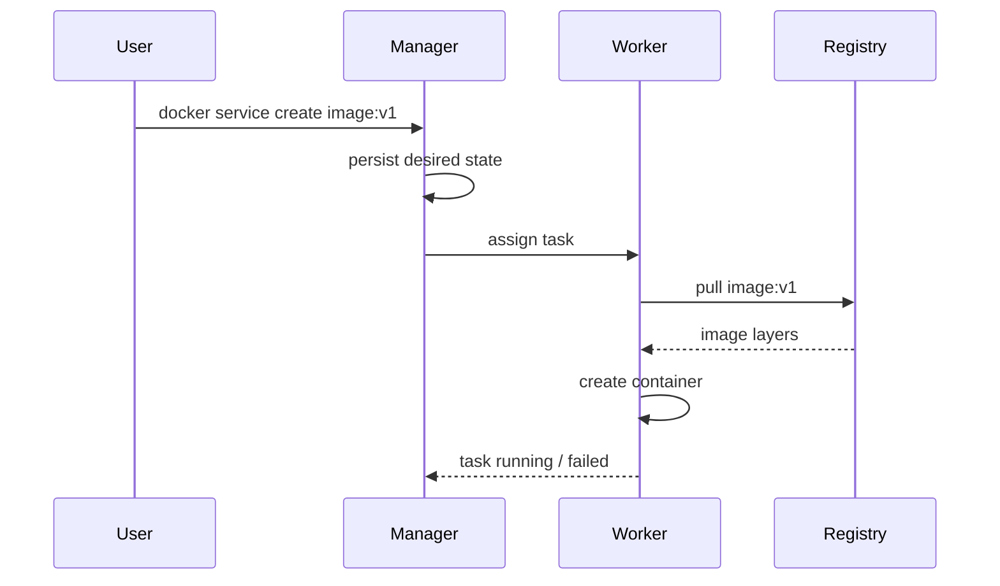

Implikasi:

- semua node butuh akses registry;
- registry credential harus tersedia dengan aman;
- image tag mutable bisa menyebabkan node berbeda pull artifact berbeda jika deployment tidak pakai digest;
- registry outage bisa membuat replacement task gagal;
- private registry CA/cert harus dikonfigurasi di semua node;
- air-gapped cluster butuh mirror/preload strategy.

---

## 22. Desired State dan Image Digest

Untuk production, service sebaiknya menggunakan digest atau deployment pipeline yang resolve digest.

Masalah tag mutable:

```text
manager schedules task image:app:prod
worker-1 pulls app:prod at 10:00 -> digest A
worker-2 pulls app:prod at 10:05 -> digest B because tag moved
```

Hasil:

```text
same service spec by tag, different binary artifact by digest
```

Deployment yang lebih kuat:

```text
app@sha256:<digest>
```

Atau pipeline melakukan:

1. build image;
2. scan;
3. sign/attest;
4. push immutable digest;
5. deploy service by digest;
6. keep evidence bundle.

---

## 23. Security Boundary Manager vs Worker

Manager lebih sensitif dari worker.

Manager compromise dapat berdampak:

- membaca/mengubah service specs;
- mengakses Swarm state;
- membuat service baru;
- mendistribusikan malicious workload;
- mengakses secrets yang relevan melalui orchestration path;
- mengubah node availability;
- mengganggu cluster.

Worker compromise berdampak:

- task di node itu;
- network access dari workload di node itu;
- secret/config yang mounted ke task di node itu;
- host boundary jika runtime hardening lemah.

Karena itu:

- manager harus lebih sedikit;
- manager sebaiknya tidak menjalankan workload umum;
- akses Docker socket di manager harus sangat dibatasi;
- SSH/API access manager harus audited;
- backup state manager harus protected.

---

## 24. Swarm State Store: Apa yang Ada di Sana?

Raft state menyimpan cluster configuration seperti:

- nodes;
- services;
- tasks;
- networks;
- secrets metadata/payload sesuai mekanisme Swarm;
- configs;
- desired state;
- update state;
- membership information.

Konsekuensi:

```text
manager data directory is sensitive infrastructure state.
```

Backup manager state bukan sekadar backup config. Ia backup control-plane identity dan desired state cluster.

---

## 25. Failure Model: Node Failure

Scenario:

```text
worker-2 mati.
service api replicas=3.
one task api running on worker-2.
```

Flow:

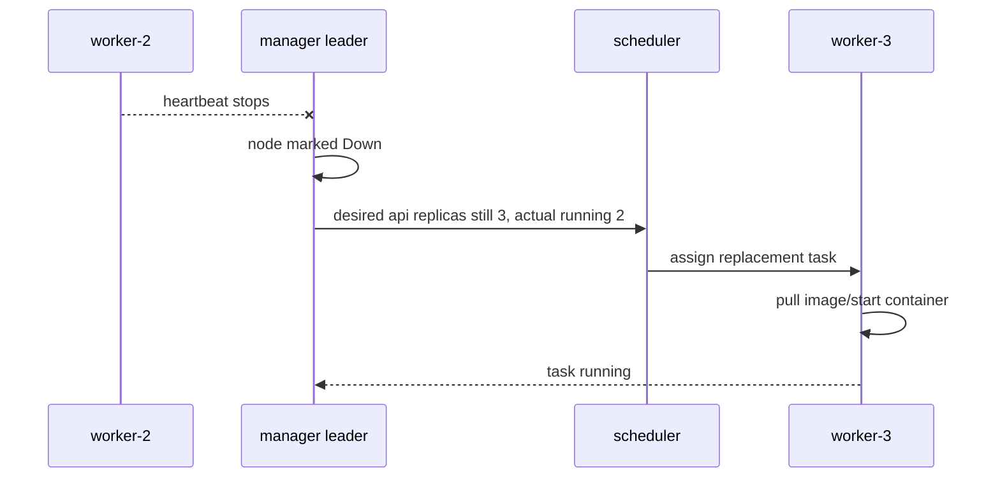

Caveats:

- jika tidak ada kapasitas, replacement pending;
- jika constraint hanya cocok dengan worker-2, replacement pending;
- jika image pull gagal, task rejected/failed;
- jika registry down, task cannot start;
- jika network broken, task may start but not serve.

---

## 26. Failure Model: Task Crash

Scenario:

```text
container exits with code 1.
service restart policy allows restart.
```

Swarm akan membuat replacement attempt sesuai task/service policy.

Namun yang harus dipahami:

```text
restart loop is not recovery if the cause is deterministic misconfiguration.
```

Contoh deterministic failure:

- missing env var;
- wrong secret path;
- migration not run;
- invalid command;
- permission denied;
- image built for wrong architecture;
- app exits because DB not ready and app has no retry.

Reconciliation bisa mempercepat kerusakan jika desired state salah.

---

## 27. Failure Model: Manager Leader Failure

Scenario:

```text
3 managers: m1 leader, m2 follower, m3 follower.
m1 dies.
```

Flow:

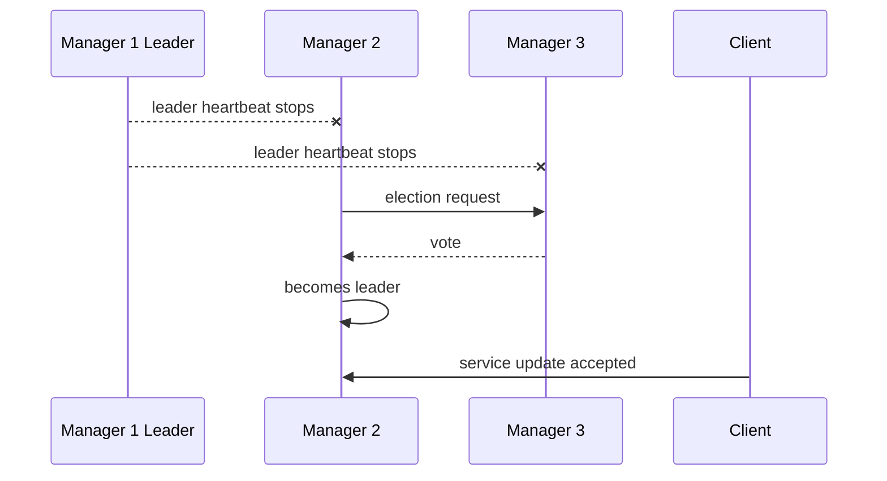

Jika quorum tetap ada, cluster control plane pulih melalui leader election.

Data plane task yang sudah berjalan tidak perlu restart hanya karena leader berubah.

---

## 28. Failure Model: Network Partition

Partition paling berbahaya karena tidak sama dengan node mati total.

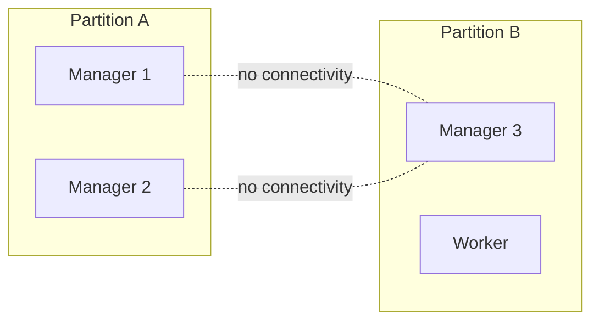

Dengan 3 manager:

- sisi dengan 2 manager punya quorum;
- sisi dengan 1 manager tidak punya quorum;
- hanya sisi quorum yang boleh membuat decision.

Ini mencegah split-brain control plane.

Namun data plane bisa tetap menghasilkan gejala aplikasi:

- task di partition minor tetap berjalan tapi tidak terkelola penuh;
- traffic overlay bisa gagal;
- service discovery bisa tidak konsisten dari perspektif aplikasi;
- replacement task bisa dibuat di sisi quorum, menyebabkan duplicate effect jika aplikasi tidak idempotent dan partitioned task masih melakukan side effect.

Karena itu distributed application harus tetap dirancang untuk partition/failure, bukan mengandalkan orchestrator sebagai magic exactly-once runtime.

---

## 29. Failure Model: Registry Outage

Registry outage tidak mematikan container yang sudah running.

Tetapi ia mempengaruhi:

- new task creation;
- replacement task;
- rolling update;
- rollback ke image yang belum cached;
- node recovery;
- scale-out;
- disaster recovery.

Mitigasi:

- registry HA;
- registry mirror/cache;
- digest pinning;
- pre-pull untuk critical images;
- rollback image retained;
- image retention policy;
- node bootstrap validation.

---

## 30. Failure Model: Full Disk on Node

Docker node dengan disk penuh bisa gagal:

- pull image;
- write container layer;
- write logs;
- create volume data;
- rotate logs;
- start new task.

Scheduler tidak selalu punya full semantic awareness terhadap aplikasi-level disk pressure.

Operational control:

- log rotation config;
- volume monitoring;
- image prune policy;
- overlay2 directory monitoring;
- registry/image retention;
- capacity alerts;
- stateful workload isolation.

---

## 31. Failure Model: Manager Disk Corruption

Manager menyimpan Raft state. Disk corruption pada manager bisa lebih serius daripada worker disk failure.

Mitigasi:

- reliable disk;
- backup swarm state;
- multi-manager quorum;
- tested restore procedure;
- manager separation;
- no arbitrary workload on manager;
- host-level monitoring.

Jangan menganggap manager sebagai disposable worker biasa.

---

## 32. Swarm Is Not a Database HA Layer

Swarm bisa menjalankan database container, tetapi Swarm tidak otomatis menyelesaikan:

- database replication;
- write consistency;
- failover semantics;
- volume replication;
- split-brain prevention aplikasi;
- backup correctness;
- transaction recovery;
- quorum DB;
- schema migration safety.

Swarm mengorkestrasi containers. Database HA tetap domain database.

Rule:

```text
Orchestrator can restart or reschedule a database process.
It cannot make a non-HA database become HA.
```

---

## 33. Manager Count and Topology Design

### 33.1 Single Manager

Cocok untuk:

- lab;
- local multi-node simulation;
- non-critical environment;
- learning.

Tidak cocok untuk production critical.

Risk:

- manager failure = control-plane outage;
- backup/restore menjadi sangat penting;
- maintenance sulit tanpa downtime control plane.

### 33.2 Three Managers

Default production baseline.

Benefit:

- tolerates one manager failure;
- simpler than 5/7;
- reasonable consensus overhead;
- easier to reason.

### 33.3 Five Managers

Cocok untuk:

- higher availability;
- multi-AZ design;
- tolerates two manager failures;
- critical control plane.

Trade-off:

- lebih banyak operational work;
- consensus traffic lebih banyak;
- network reliability antar-manager lebih penting.

### 33.4 Manager Placement

Production placement:

```text
managers across failure domains, but with low-latency stable connectivity
```

Jangan:

- menaruh semua manager di satu host fisik;
- menaruh manager di network unreliable;
- menyebar manager lintas region latency tinggi tanpa alasan kuat;
- menjalankan workload noisy di manager.

---

## 34. Node Labels: Architecture Boundary

Node labels adalah metadata untuk scheduling.

Contoh label:

```bash
docker node update --label-add disk=ssd worker-1
docker node update --label-add zone=az-a worker-1
docker node update --label-add workload=frontend worker-2
```

Label bukan observability metric. Label adalah input scheduling policy.

Jangan membuat label terlalu granular atau berubah-ubah cepat.

Label bagus:

- `zone=az-a`;
- `disk=ssd`;
- `gpu=true`;
- `compliance=restricted`;
- `workload=edge`.

Label buruk:

- `cpu_available_now=low`;
- `current_memory=70percent`;
- `deploy_today=yes`;
- `temporary-debug-node=true` lalu lupa dihapus.

---

## 35. Swarm Object Model

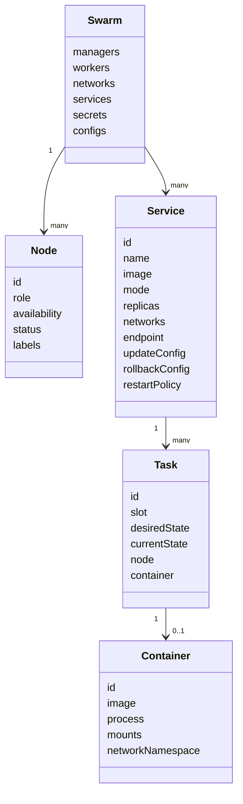

---

## 36. Command Surface: Minimum You Must Know

Bagian ini bukan command tutorial, tetapi command surface membantu mental model.

### 36.1 Cluster

```bash
docker swarm init
docker swarm join-token worker
docker swarm join-token manager
docker swarm update
docker swarm leave
```

### 36.2 Node

```bash
docker node ls
docker node inspect <node>
docker node ps <node>
docker node update --availability drain <node>
docker node update --role manager <node>
docker node update --role worker <node>
docker node promote <node>
docker node demote <node>
docker node rm <node>
```

### 36.3 Service

```bash
docker service create
docker service ls
docker service ps <service>
docker service inspect <service>
docker service logs <service>
docker service scale <service>=<n>
docker service update <service>
docker service rollback <service>
docker service rm <service>
```

### 36.4 Stack

```bash
docker stack deploy -c compose.yml mystack
docker stack services mystack
docker stack ps mystack
docker stack rm mystack
```

---

## 37. Observability: What to Look At

| Pertanyaan | Command/signal |
|---|---|
| Node mana manager/worker? | `docker node ls` |
| Leader manager siapa? | `docker node ls`, inspect manager status |
| Task service ada di mana? | `docker service ps` |
| Kenapa task tidak running? | `docker service ps --no-trunc` |
| Node menerima task baru? | node availability |
| Apakah service desired/actual match? | `docker service ls` |
| Apakah update sedang jalan? | service inspect update status |
| Apakah task gagal pull image? | task error di `service ps` |
| Apakah manager quorum sehat? | node manager reachability/status |

---

## 38. Incident Reading Pattern

Ketika service bermasalah, jangan mulai dari container random.

Gunakan urutan:

```text
1. Cluster control plane sehat?
2. Node eligible sehat?
3. Desired state benar?
4. Task scheduled atau pending?
5. Task rejected/failed kenapa?
6. Container started atau exit?
7. App health/logs bagaimana?
8. Network/secret/volume dependency tersedia?
```

Diagram:

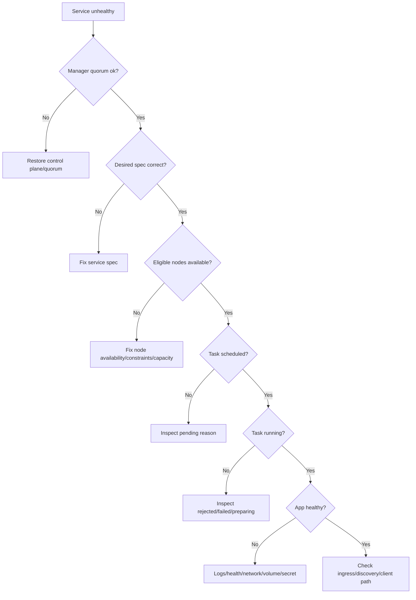

---

## 39. Design Invariants for Production Swarm

Invariants yang harus dijaga:

1. Manager count ganjil dan quorum-aware.
2. Manager nodes tidak menjadi tempat workload umum kecuali ada alasan eksplisit.
3. Semua node bisa reach registry dan network cluster ports.
4. Images deployable by digest or controlled immutable tag.
5. Node labels stabil dan bermakna.
6. Secrets/configs tidak hardcoded dalam image.
7. Service spec menjadi source of truth runtime.
8. Manual mutation dalam container dilarang.
9. Stateful workload punya storage/failover design eksplisit.
10. Drain digunakan sebelum maintenance node.
11. Backup manager state diuji, bukan hanya dibuat.
12. Rolling update/rollback policy didefinisikan sebelum incident.
13. Observability membaca service-task-node-container hierarchy.
14. Capacity planning memasukkan replacement capacity saat node failure.
15. Failure drill dilakukan: node down, task crash, registry down, manager failover.

---

## 40. Anti-Patterns

### 40.1 Semua Node Manager

Untuk lab kecil boleh. Untuk production, ini sering buruk.

Masalah:

- semua node membawa state sensitif;
- compromise surface membesar;
- noisy workload bisa memengaruhi control plane;
- maintenance manager makin kompleks.

### 40.2 Dua Manager Production

Dua manager terlihat HA, tetapi tidak toleran terhadap satu manager failure karena quorum butuh dua.

Gunakan 1 untuk non-HA atau 3 untuk HA minimum.

### 40.3 Mengandalkan Restart Policy untuk Bug Konfigurasi

Jika task selalu exit karena config salah, restart hanya membuat loop.

Recovery yang benar adalah memperbaiki desired state atau dependency.

### 40.4 Deploy by Mutable Tag Tanpa Governance

`app:latest` atau `app:prod` tanpa digest/promotion discipline bisa menghasilkan artifact drift.

### 40.5 Menjalankan Database Seolah Stateless

Jika volume lokal node mati, database tidak otomatis pindah dengan data yang benar.

### 40.6 Debugging dari Container ID Acak

Di Swarm, container adalah detail ephemeral. Mulai dari service/task/node, bukan container random.

---

## 41. Practice Lab: Build a Mental Swarm

Tujuan: membuat cluster kecil dan membaca state.

### 41.1 Setup

Gunakan 3 VM atau 3 local Linux nodes.

Minimal:

- `manager-1`;
- `worker-1`;
- `worker-2`.

### 41.2 Initialize

```bash
docker swarm init --advertise-addr <manager-ip>
```

Ambil token worker:

```bash
docker swarm join-token worker
```

Join worker:

```bash
docker swarm join --token <token> <manager-ip>:2377
```

### 41.3 Inspect

```bash
docker node ls
docker node inspect self --pretty
docker info
```

Pertanyaan:

- node mana manager?
- node mana worker?
- siapa leader?
- node availability apa?
- network swarm aktif apa saja?

### 41.4 Create Service

```bash
docker service create --name demo --replicas 3 nginx:1.27
```

Inspect:

```bash
docker service ls
docker service ps demo
```

Pertanyaan:

- task tersebar ke node mana?
- berapa slot?
- task ID sama dengan container ID?
- apa yang terjadi jika container dihapus manual?

### 41.5 Kill a Task

Di salah satu worker:

```bash
docker ps
# docker rm -f <container>
```

Lalu:

```bash
docker service ps demo
```

Expected observation:

- task lama shutdown/failed;
- task baru dibuat;
- service tetap mengarah ke desired replicas.

### 41.6 Drain a Node

```bash
docker node update --availability drain worker-1

docker service ps demo
```

Expected observation:

- task pindah dari worker-1;
- service tetap mencoba maintain replicas;
- worker-1 tidak menerima task baru.

### 41.7 Restore Active

```bash
docker node update --availability active worker-1
```

Swarm tidak selalu otomatis rebalance existing tasks hanya karena node kembali active. Ini penting.

---

## 42. Practice Lab: Quorum Thought Experiment

Buat tabel untuk 1, 2, 3, 5 manager.

Untuk masing-masing:

- berapa quorum;
- berapa manager bisa mati;
- apa efek maintenance satu manager;
- apakah cocok production;
- bagaimana restore jika kehilangan majority.

Tujuannya bukan menghafal formula, tetapi memahami trade-off.

---

## 43. Review Checklist

Gunakan checklist ini untuk membaca arsitektur Swarm.

### Cluster

- [ ] Manager count ganjil.
- [ ] Manager ditempatkan di failure domain yang benar.
- [ ] Manager tidak menjalankan workload umum, atau alasannya terdokumentasi.
- [ ] Backup swarm state tersedia dan restore diuji.
- [ ] Join token dilindungi dan bisa dirotasi.
- [ ] Firewall membuka port cluster yang diperlukan.
- [ ] Semua node bisa pull image dari registry.

### Node

- [ ] Node labels stabil.
- [ ] Node availability dipakai untuk maintenance.
- [ ] Drain procedure jelas.
- [ ] Node resource monitoring aktif.
- [ ] Disk/log pressure dimonitor.

### Service

- [ ] Desired state didefinisikan dalam service/stack spec.
- [ ] Image deployment tidak bergantung pada mutable tag tanpa kontrol.
- [ ] Restart/update/rollback behavior dipahami.
- [ ] Stateful workload punya storage strategy eksplisit.
- [ ] Placement constraints tidak membuat service mustahil dijadwalkan.

### Operations

- [ ] Incident runbook membaca service -> task -> node -> container.
- [ ] Failure drill dilakukan.
- [ ] Registry outage scenario dipahami.
- [ ] Quorum loss procedure terdokumentasi.

---

## 44. Mini Case Study: API Service di Swarm

Kita punya service `case-api`:

```text
replicas = 6
nodes = 3 workers
manager = 3 dedicated managers
image = registry.internal/case-api@sha256:abc...
network = app-overlay
secret = db-password
config = app-config-v12
```

Desired state:

```text
6 task case-api running across eligible worker nodes
```

Failure: `worker-2` mati.

Expected:

- manager marks `worker-2` down;
- tasks di worker-2 no longer count as running;
- scheduler creates replacement tasks on worker-1/worker-3 if capacity allows;
- new workers pull exact digest;
- secret/config mounted only into replacement tasks;
- service returns to 6 running tasks;
- logs/metrics show churn.

Risk if poorly designed:

- no spare capacity -> replicas degraded;
- registry unavailable -> replacement fails;
- local state on worker-2 -> data lost/unavailable;
- app not idempotent -> duplicate side effect if network partition not total failure;
- healthcheck missing -> task `Running` but not actually ready.

---

## 45. What Top Engineers Notice

Engineer pemula melihat:

```text
docker service create --replicas 3
```

Engineer kuat melihat:

```text
A declarative state transition request to a replicated control plane,
which must survive manager failover, node failure, image pulls,
network partitions, resource constraints, task churn, and rollback.
```

Engineer pemula bertanya:

```text
Kenapa container saya hilang?
```

Engineer kuat bertanya:

```text
Apakah task lama diganti karena desired state, update generation, restart policy, node drain, atau scheduler reconciliation?
```

Itulah level mental model yang ingin kita bangun.

---

## 46. Common Misconceptions

### 46.1 “Swarm Akan Otomatis Rebalance Semua Task”

Tidak selalu. Jika node kembali active setelah drain/down, Swarm tidak harus otomatis memindahkan task yang sudah sehat hanya untuk balance sempurna.

Rebalance biasanya memerlukan update/scale/redeploy strategy.

### 46.2 “Manager Down Berarti Aplikasi Down”

Tidak langsung. Running tasks bisa tetap berjalan. Tetapi control plane mutation/recovery terdampak jika quorum hilang.

### 46.3 “Service Sama dengan Container”

Salah. Service adalah desired state. Container adalah runtime detail.

### 46.4 “Replicas=3 Berarti Selalu 3 Healthy App Instances”

Tidak. Itu berarti Swarm berusaha menjalankan 3 task. Health/readiness aplikasi harus dirancang.

### 46.5 “Placement Constraint Memperbaiki Availability”

Constraint bisa memperbaiki locality/compliance, tetapi juga bisa mengurangi eligible nodes dan membuat service lebih mudah pending.

---

## 47. Diagnostic Exercises

### Exercise 1 — Service Pending

Symptom:

```text
service desired replicas = 3
actual running = 0
task state = Pending
```

Possible causes:

- no active nodes;
- constraints impossible;
- insufficient resource reservations;
- unsupported platform/architecture;
- port conflict with host-mode publish;
- missing plugin/volume driver;
- manager control plane issue.

Diagnostic path:

```bash
docker service ps <service> --no-trunc
docker service inspect <service>
docker node ls
docker node inspect <node>
```

### Exercise 2 — Task Rejected

Symptom:

```text
task rejected repeatedly
```

Possible causes:

- image pull failure;
- invalid mount;
- missing secret/config;
- permission error;
- runtime unsupported;
- resource issue;
- network attach failure.

### Exercise 3 — Manager Unreachable

Symptom:

```text
node ls shows manager unreachable
```

Questions:

- how many managers total?
- is quorum intact?
- is current leader reachable?
- is network partitioned?
- is disk full/corrupted?
- should node be recovered, demoted, or replaced?

---

## 48. Part 025 Summary

Swarm architecture is about desired state and distributed control.

Key takeaways:

1. Swarm mode turns Docker Engine into a cluster participant.
2. Manager nodes form the control plane and use Raft for consistent state.
3. Worker nodes execute assigned tasks and report status.
4. Service is desired state; task is execution assignment; container is runtime process.
5. Scheduler assigns tasks based on node availability, placement, resources, and service mode.
6. Reconciliation continuously tries to close desired-vs-actual drift.
7. Quorum is the core manager invariant.
8. Running tasks can survive some control-plane problems, but recovery/update requires healthy control plane.
9. Registry, network, disk, and node capacity are cluster dependencies.
10. Production Swarm requires manager topology, backup, drain, labels, registry access, observability, and failure drills.

Part 026 akan membahas **services, tasks, scheduling, placement constraints, global vs replicated mode, reservations, restart policy, and operational scheduling patterns** secara lebih detail.

---

## 49. References

- Docker Docs — Swarm mode: `https://docs.docker.com/engine/swarm/`
- Docker Docs — Swarm mode key concepts: `https://docs.docker.com/engine/swarm/key-concepts/`
- Docker Docs — How nodes work: `https://docs.docker.com/engine/swarm/how-swarm-mode-works/nodes/`
- Docker Docs — How services work: `https://docs.docker.com/engine/swarm/how-swarm-mode-works/services/`
- Docker Docs — Raft consensus in Swarm mode: `https://docs.docker.com/engine/swarm/raft/`
- Docker Docs — Administer and maintain a swarm: `https://docs.docker.com/engine/swarm/admin_guide/`
- Docker Docs — Manage nodes in a swarm: `https://docs.docker.com/engine/swarm/manage-nodes/`
