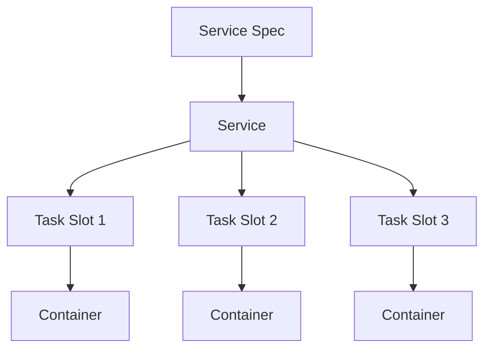
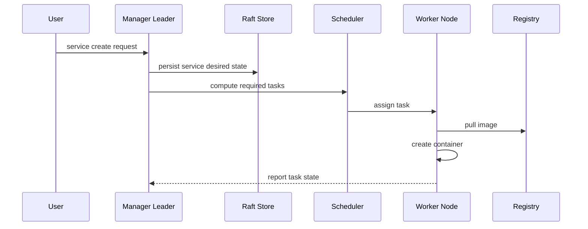
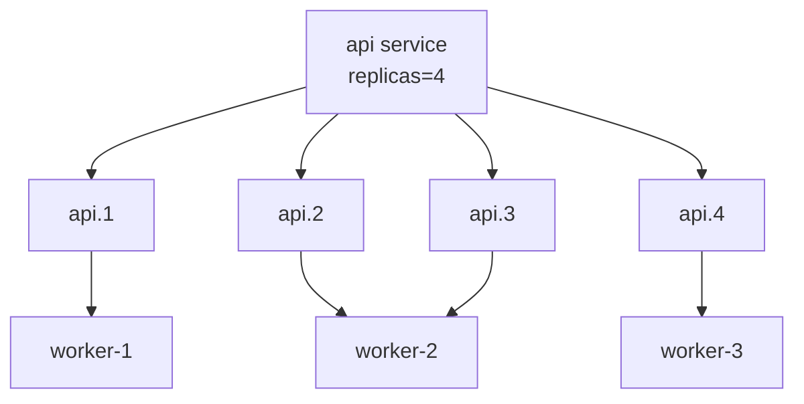
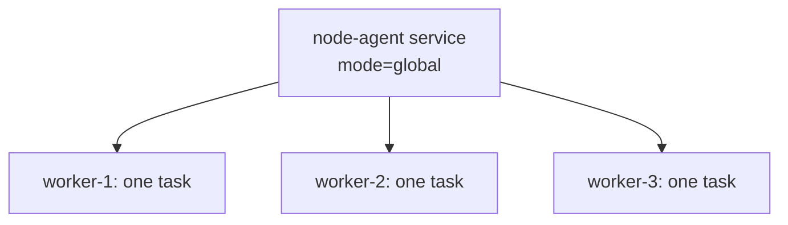
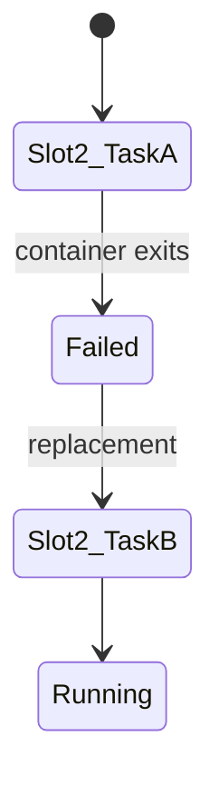
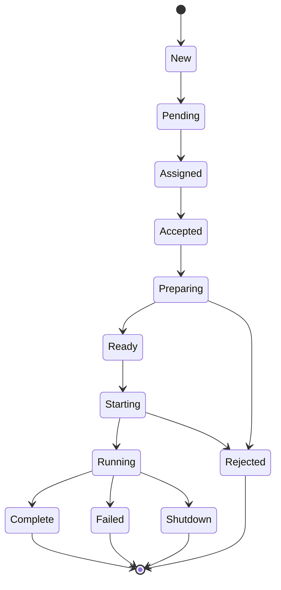
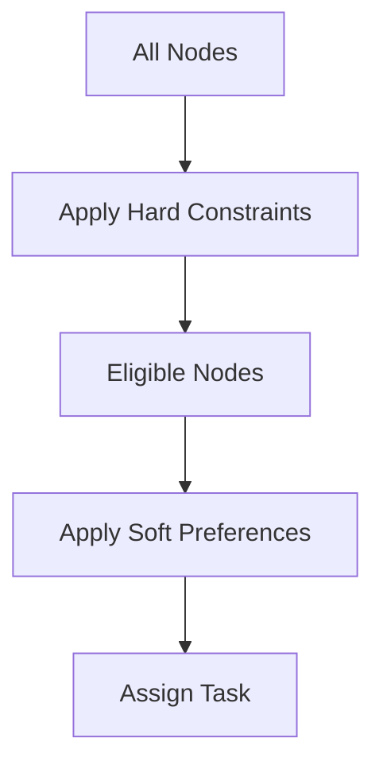
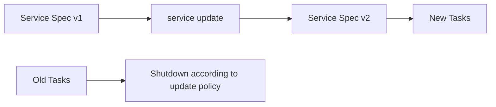
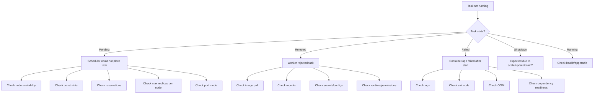

# Part 026 — Swarm Services and Tasks: Replicas, Global Mode, Placement, Constraints

> Target pembelajaran: setelah part ini, kita mampu mendesain dan mendiagnosis Docker Swarm services secara production-grade: memahami service spec, task lifecycle, slot, replicated/global mode, scheduler inputs, placement constraints/preferences, resource reservations/limits, restart policy, scaling behavior, service update semantics, dan kenapa task bisa `Pending`, `Rejected`, atau restart loop.

Part 025 membahas arsitektur Swarm: manager, worker, Raft, desired state, dan reconciliation.

Part ini zoom in ke objek paling penting saat menjalankan aplikasi di Swarm:

```text
service -> task -> container
```

Di Swarm, kita jarang mengelola container secara langsung. Kita mendeklarasikan service. Swarm membuat dan mengganti task untuk mendekati desired state.

---

## 1. Mental Model Utama

Service adalah kontrak deklaratif.

```text
A service says: run this workload, with this image, this command, this network, this secret/config, this placement rule, this update policy, and this desired scale.
```

Task adalah unit kerja scheduler.

```text
A task says: run one instance of the service spec on this node.
```

Container adalah implementasi runtime dari task.

```text
A container says: this process is currently executing the task.
```

Diagram:



Rule:

```text
Never treat a Swarm container as the durable unit of deployment.
```

---

## 2. Service Spec: Apa Saja yang Dideklarasikan?

Service spec bisa mencakup:

| Area | Contoh |
|---|---|
| Image | `nginx:1.27`, `app@sha256:...` |
| Command | `command`, `args`, entrypoint-like override |
| Replicas/mode | replicated/global |
| Networks | overlay networks attached to service |
| Ports | published ports, ingress/host mode |
| Env | environment variables |
| Secrets/configs | mounted runtime data |
| Mounts | volumes/bind mounts/tmpfs-like behavior |
| Resources | reservations and limits |
| Placement | constraints/preferences/max replicas per node |
| Restart policy | condition, delay, max attempts, window |
| Update policy | parallelism, delay, order, failure action |
| Rollback policy | rollback config |
| Labels | service/container metadata |
| Healthcheck | container health signal |

A service spec is source of truth. Manual changes inside a container are drift.

---

## 3. Create Service: What Actually Happens?

Command:

```bash
docker service create --name web --replicas 3 nginx:1.27
```

Flow:



Notice:

- manager does not necessarily run the workload;
- worker pulls the image;
- task can fail before container starts;
- service exists even if all tasks are pending;
- desired state is stored before actual state catches up.

---

## 4. Service Mode: Replicated

Replicated mode means:

```text
Run N replicas across eligible nodes.
```

Example:

```bash
docker service create \
  --name api \
  --replicas 4 \
  registry.example.com/api@sha256:abc...
```

Use replicated mode for:

- web/API services;
- stateless workers;
- horizontally scalable consumers;
- frontend/backend services;
- scalable compute tasks.

Mental model:



Replicas are desired count, not guaranteed health count.

---

## 5. Service Mode: Global

Global mode means:

```text
Run one task on every eligible node.
```

Example:

```bash
docker service create \
  --name node-exporter \
  --mode global \
  prom/node-exporter:latest
```

Use global mode for:

- log collector;
- metrics agent;
- node exporter;
- security agent;
- host-level daemon;
- sidecar-like node services.

Diagram:



Global mode is not “replicas = number of nodes” manually. It tracks eligible nodes dynamically.

If a new eligible node joins, Swarm schedules one task there.

If a node leaves, its global task disappears.

If node is drained, global task is removed from that node.

---

## 6. Replicated vs Global Decision Table

| Requirement | Use replicated | Use global |
|---|---:|---:|
| Run exactly/approximately N instances | Yes | No |
| Run one per node | No | Yes |
| Scale API horizontally | Yes | No |
| Deploy host-level agent | No | Yes |
| Add node should auto-add one task | Usually no | Yes |
| Remove node should reduce task count | Usually no | Yes |
| Use placement constraints | Yes | Yes |
| Use resource reservations | Yes | Yes |

Avoid this anti-pattern:

```text
replicas = current number of nodes for a node agent
```

That fails when nodes change.

---

## 7. Task Slot Mental Model

For replicated services, Swarm tracks slots.

Example:

```text
api.1
api.2
api.3
```

A slot represents one desired replica position.

If `api.2` fails, Swarm may create a new task for slot 2.



This is why `docker service ps` can show historical tasks for the same slot.

Example conceptual output:

```text
api.2   Running   worker-2   current task
\_ api.2 Failed    worker-1   previous task
```

The slot remains. The task changes.

---

## 8. Task Lifecycle

Swarm task states are critical for diagnosis.

Common states:

| State | Meaning |
|---|---|
| `New` | Task object created |
| `Pending` | Waiting for scheduling or resources |
| `Assigned` | Scheduler assigned node |
| `Accepted` | Worker accepted task |
| `Preparing` | Worker preparing task, image/network/mount |
| `Ready` | Ready to start |
| `Starting` | Container starting |
| `Running` | Task process running |
| `Complete` | Task completed successfully |
| `Shutdown` | Desired state is shutdown |
| `Failed` | Task failed |
| `Rejected` | Worker rejected task before successful run |
| `Orphaned` | Node disappeared long enough that task cannot be managed normally |

Diagram:



Diagnosis rule:

```text
State tells you which layer failed.
```

Examples:

| State | Likely layer |
|---|---|
| `Pending` | scheduler/placement/resource/port constraints |
| `Rejected` | worker preparation/runtime issue |
| `Failed` | application process or runtime after start |
| `Running` but unhealthy | application readiness/health path |
| `Shutdown` | update/scale/remove/drain expected behavior |

---

## 9. Scheduler Inputs

The scheduler needs to choose a node.

Inputs include:

```text
eligible nodes = nodes where all hard conditions are satisfied
```

Hard conditions:

- node is active;
- node role constraint satisfied;
- node labels match constraints;
- engine labels/platform match;
- resource reservations available;
- published port constraints satisfied;
- plugin/volume/network requirements satisfied;
- service mode semantics satisfied.

Soft preferences:

- spread across label values;
- balance according to placement preference;
- internal scheduler strategy.

Output:

```text
task assigned to one eligible node
```

If no node is eligible:

```text
task stays Pending
```

---

## 10. Placement Constraints

Constraints are hard filters.

Example:

```bash
docker service create \
  --name payments \
  --constraint 'node.labels.compliance == pci' \
  --replicas 3 \
  registry.example.com/payments@sha256:abc
```

Only nodes with label `compliance=pci` are eligible.

Common constraints:

```bash
--constraint 'node.role == worker'
--constraint 'node.labels.disk == ssd'
--constraint 'node.labels.zone == az-a'
--constraint 'node.hostname != worker-3'
--constraint 'engine.labels.operatingsystem == ubuntu'
```

Constraint operators:

- equality: `==`;
- inequality: `!=`.

Constraint design rules:

1. Use constraints for real invariants.
2. Avoid constraints for temporary preferences.
3. Keep labels stable.
4. Document why each constraint exists.
5. Check capacity after applying constraints.

Bad constraint:

```text
node.hostname == worker-1
```

This pins service to one node and destroys rescheduling unless truly required.

Better:

```text
node.labels.storage == fast-ssd
```

This captures capability, not accidental identity.

---

## 11. Placement Preferences

Preferences are soft distribution hints.

Typical use:

```bash
docker service create \
  --name api \
  --replicas 6 \
  --placement-pref 'spread=node.labels.zone' \
  registry.example.com/api@sha256:abc
```

This asks scheduler to spread tasks across zones.

Important:

```text
preference does not make an ineligible node eligible
```

Constraints filter first. Preferences influence distribution among remaining nodes.



---

## 12. Constraints vs Preferences

| Aspect | Constraint | Preference |
|---|---|---|
| Type | Hard rule | Soft rule |
| If impossible | Task pending | Scheduler chooses best possible |
| Use for | compliance, hardware, role, OS | spreading across zone/rack/datacenter |
| Risk | over-constraining | false sense of guarantee |

Example combined:

```bash
docker service create \
  --name ledger-api \
  --replicas 6 \
  --constraint 'node.labels.compliance == restricted' \
  --placement-pref 'spread=node.labels.zone' \
  registry.example.com/ledger-api@sha256:abc
```

Meaning:

```text
Only restricted nodes are eligible.
Among those, spread across zones if possible.
```

---

## 13. Max Replicas Per Node

`--replicas-max-per-node` limits how many replicas of a replicated service can run on one node.

Use case:

- avoid placing all replicas on one powerful node;
- improve fault tolerance;
- reduce blast radius;
- force distribution.

Example:

```bash
docker service create \
  --name api \
  --replicas 6 \
  --replicas-max-per-node 2 \
  registry.example.com/api@sha256:abc
```

If only two eligible nodes exist and max per node is 2, max schedulable replicas = 4. Remaining tasks pending.

Rule:

```text
max replicas per node improves spread but can reduce schedulability.
```

---

## 14. Resource Reservations and Limits

Swarm service can define resource reservations and limits.

Conceptually:

| Resource setting | Meaning |
|---|---|
| reservation | scheduler-level capacity claim |
| limit | runtime upper bound |

Example:

```bash
docker service create \
  --name api \
  --replicas 4 \
  --reserve-cpu 0.50 \
  --reserve-memory 512M \
  --limit-cpu 1.00 \
  --limit-memory 1G \
  registry.example.com/api@sha256:abc
```

Mental model:

```text
reservation affects where task can be scheduled.
limit affects how much task can consume at runtime.
```

Do not set limits without understanding app behavior.

Too-low memory limit can create OOM restart loops.

No reservation can overpack nodes.

No limit can allow noisy neighbor issues.

---

## 15. Capacity Envelope

For production, calculate capacity with failure.

Example:

```text
Service api:
replicas = 12
reservation = 0.5 CPU, 512 MiB
eligible workers = 4
one-node failure tolerated
```

Required steady capacity:

```text
CPU = 12 * 0.5 = 6 CPU
Memory = 12 * 512 MiB = 6144 MiB
```

If one worker fails, remaining 3 must handle all 12 replicas:

```text
per remaining worker average = 4 replicas
CPU = 2 CPU reserved per worker
Memory = 2 GiB reserved per worker
```

If placement constraints reduce eligible nodes to 2, failure tolerance changes drastically.

Rule:

```text
Capacity planning must be done after constraints and failure-domain policy.
```

---

## 16. Restart Policy

Restart policy defines what happens when a task exits/fails.

Key dimensions:

- condition;
- delay;
- max attempts;
- window.

Conceptual examples:

```bash
--restart-condition on-failure
--restart-delay 5s
--restart-max-attempts 3
--restart-window 60s
```

Interpretation:

```text
If task fails, wait 5s, retry, but only count failures within a window, and stop after max attempts depending on condition.
```

Use restart policy carefully.

Good use:

- transient startup failure;
- temporary dependency blip;
- recoverable crash;
- network race.

Bad use:

- hiding deterministic config failure;
- turning migration bug into infinite loop;
- masking memory leak without alerting;
- restarting non-idempotent job repeatedly.

---

## 17. Job-like Workloads in Swarm

Swarm service is designed for long-running desired state, but can run tasks that complete.

If a service command exits successfully, task can become `Complete` depending on restart policy/mode.

Caution:

```text
Do not treat replicated service as a full-featured batch scheduler without understanding restart and completion semantics.
```

For migration/seed jobs:

- prefer explicit one-off controlled process;
- avoid repeated side effects;
- ensure idempotency;
- make completion observable;
- avoid deploying as infinite-restart service.

In stack deployments, migration order needs careful design because Swarm is not a full workflow engine.

---

## 18. Scaling Semantics

Scale service:

```bash
docker service scale api=6
```

Meaning:

```text
change desired replicas to 6
```

If scaling up:

- scheduler creates additional tasks;
- tasks pull image if needed;
- service endpoint includes new running tasks when ready at Swarm level.

If scaling down:

- Swarm shuts down excess slots/tasks;
- which tasks are removed is scheduler/orchestrator decision;
- app must tolerate instance termination.

Scaling is not application readiness. If app needs warm-up, implement healthcheck/readiness behavior and traffic strategy.

---

## 19. Scale Failure Analysis

Symptom:

```text
docker service scale api=10
service stays 6/10
```

Possible causes:

- insufficient eligible nodes;
- resource reservations too high;
- placement constraint too narrow;
- max replicas per node reached;
- image pull failure on some nodes;
- port conflict;
- node paused/drained;
- wrong architecture image;
- secret/config/mount issue.

Diagnosis:

```bash
docker service ps api --no-trunc
docker service inspect api --pretty
docker node ls
docker node inspect <node> --pretty
```

Read `Error` column in `service ps` before guessing.

---

## 20. Published Ports and Scheduling

Swarm service can publish ports.

Two broad modes:

| Mode | Behavior |
|---|---|
| ingress | routing mesh exposes service across swarm nodes |
| host | bind directly on node running task |

Host-mode publishing affects scheduling because a fixed port can only be bound once per node.

Example issue:

```text
service replicas=3
publish target 80 published 8080 mode=host
eligible nodes=2
```

Only two tasks can bind port 8080 if each node can bind it once. The third task may remain pending.

Rule:

```text
Port publishing is a scheduling constraint when host mode/fixed ports are used.
```

Ingress/routing mesh details are covered in Part 027.

---

## 21. Service Discovery Preview

When service attaches to overlay network, Swarm provides service discovery.

At architecture level:

```text
service name -> service endpoint -> running tasks
```

Modes include VIP and DNSRR, covered deeper in networking part.

For this part, key point:

```text
A task being Running does not mean it is ready for application traffic.
```

Use healthcheck and application retry/backoff.

---

## 22. Healthcheck in Swarm Services

Healthcheck can be defined in Dockerfile or service/Compose spec.

It reports container health status.

Good healthcheck:

- checks actual application readiness path;
- has timeout;
- has interval;
- has retries;
- does not require external dependency unless readiness intentionally depends on it;
- is cheap;
- fails fast enough for operations.

Bad healthcheck:

```bash
curl localhost:8080 || exit 1
```

This may be acceptable for simple service, but bad if:

- endpoint always returns 200 while dependencies broken;
- endpoint mutates state;
- endpoint is expensive;
- endpoint depends on DNS path not relevant to local readiness;
- endpoint hides partial failure.

In Swarm, health status can affect update behavior and operator diagnosis, but do not assume it is a complete traffic gate for all designs.

---

## 23. Service Update Semantics Preview

A service update changes service spec.

Examples:

```bash
docker service update --image app:v2 api
docker service update --replicas 6 api
docker service update --env-add FEATURE_X=true api
```

Spec changes can create new tasks.

Conceptual update:



Rolling update/rollback is Part 030, but services/tasks must be understood first.

Key invariant:

```text
Updating a service usually replaces tasks; it does not mutate running containers in place.
```

---

## 24. Service Labels vs Container Labels

Labels can attach to service or containers/tasks.

Use labels for:

- routing metadata;
- observability grouping;
- ownership;
- environment;
- cost center;
- compliance domain;
- automation hooks.

Examples:

```bash
docker service create \
  --name api \
  --label owner=case-platform \
  --container-label log.format=json \
  registry.example.com/api@sha256:abc
```

Governance rule:

```text
Labels are API surface for automation. Treat label schema as contract.
```

Do not let teams invent uncontrolled label variants:

```text
owner=payments
team=payment
owned-by=pay-team
```

Pick one schema.

---

## 25. Environment Variables

Environment variables are common but dangerous if overused.

Use env vars for:

- non-sensitive config;
- feature toggles;
- endpoint URLs;
- runtime mode;
- logging level.

Do not use env vars for:

- password;
- private key;
- long-lived token;
- certificate private material;
- anything likely to appear in inspect/log/crash dump.

Use secrets/configs for sensitive and structured runtime material.

---

## 26. Secrets and Configs in Services

Service can reference secrets/configs.

Mental model:

```text
Only tasks of services granted a secret/config should receive it.
```

This is stronger than shipping secrets inside image or env.

Example conceptual service:

```bash
docker service create \
  --name api \
  --secret db_password \
  --config source=api_config_v12,target=/etc/app/config.yml \
  registry.example.com/api@sha256:abc
```

Design rule:

- configs are versioned and immutable in practice;
- secrets rotate by creating new secret and updating service;
- app should read files from stable paths;
- avoid baking environment-specific config into image.

---

## 27. Mounts and Volumes in Services

Service mounts can use volumes or bind mounts.

Volume example:

```bash
docker service create \
  --name reports \
  --mount type=volume,source=reports-data,target=/data \
  registry.example.com/reports@sha256:abc
```

Bind mount example:

```bash
docker service create \
  --name edge \
  --mount type=bind,source=/srv/edge,target=/data,readonly \
  registry.example.com/edge@sha256:abc
```

Swarm scheduling risk:

```text
A local volume or bind path is node-local unless external storage handles replication/shared access.
```

If task moves to another node, data may not follow.

For stateful services, placement and storage must be designed together.

---

## 28. Node-local State and Placement

Suppose service writes to local volume on `worker-1`.

If `worker-1` dies and Swarm reschedules task to `worker-2`:

```text
process recovers, state may not
```

Options:

| Approach | Trade-off |
|---|---|
| Pin to node | Simple, low HA |
| Shared storage | Operational complexity, performance semantics |
| Application-level replication | More correct for databases, more engineering |
| External managed DB/storage | Often best for critical state |
| Volume plugin | Depends on plugin reliability |

Do not pretend local Docker volume is cluster-replicated.

---

## 29. Node Role Constraints

Common production pattern:

```bash
--constraint 'node.role == worker'
```

This keeps workload off managers.

But it only works if enough workers exist.

If cluster has only managers and service requires worker:

```text
task pending forever
```

Rule:

```text
Every constraint must have a capacity model.
```

---

## 30. Zone-Aware Scheduling

Suppose nodes have labels:

```bash
docker node update --label-add zone=az-a worker-1
docker node update --label-add zone=az-b worker-2
docker node update --label-add zone=az-c worker-3
```

Service:

```bash
docker service create \
  --name api \
  --replicas 6 \
  --placement-pref 'spread=node.labels.zone' \
  registry.example.com/api@sha256:abc
```

Expected intent:

```text
spread replicas across zones
```

But if all eligible capacity exists in one zone, preference may not guarantee strict distribution.

For hard compliance, use constraints. For availability spreading, combine:

- enough nodes per zone;
- max replicas per node;
- placement preferences;
- external load balancing;
- failure drills.

---

## 31. Scheduling Matrix Example

Nodes:

| Node | Role | Availability | zone | disk | compliance | CPU free | Mem free |
|---|---|---|---|---|---|---:|---:|
| worker-1 | worker | active | a | ssd | pci | 4 | 8G |
| worker-2 | worker | active | b | ssd | pci | 2 | 4G |
| worker-3 | worker | drain | c | hdd | standard | 8 | 16G |
| manager-1 | manager | active | a | ssd | pci | 2 | 4G |

Service:

```text
replicas = 3
constraint node.role == worker
constraint node.labels.compliance == pci
constraint node.labels.disk == ssd
reservation = 1 CPU, 2G memory
```

Eligible:

| Node | Eligible? | Reason |
|---|---:|---|
| worker-1 | Yes | matches all |
| worker-2 | Yes | matches all |
| worker-3 | No | drain, hdd, standard |
| manager-1 | No | role manager |

If `--replicas-max-per-node 1`, only 2 tasks can schedule. Third pending.

If max-per-node omitted, scheduler may place two tasks on one worker if capacity allows.

---

## 32. Why Tasks Become Pending

`Pending` means the task has not successfully been assigned/executed to running state.

Common root causes:

### 32.1 No Active Nodes

All nodes are `drain`, `pause`, `down`, or not reachable.

### 32.2 Impossible Constraints

Service requires:

```text
node.labels.gpu == true
```

No node has label.

### 32.3 Capacity Reservations

Service requests:

```text
reserve-memory=16G
```

No eligible node has 16G allocatable.

### 32.4 Port Conflict

Host-mode published fixed port already used on eligible nodes.

### 32.5 Max Replicas Per Node

Distribution rule blocks remaining replicas.

### 32.6 Platform Mismatch

Image/platform requirement not compatible with available node architecture.

### 32.7 Missing Plugin/Driver

Volume/network plugin required but not available.

Diagnostic command:

```bash
docker service ps <service> --no-trunc
```

Always read the full error.

---

## 33. Why Tasks Become Rejected

`Rejected` usually means worker received task but could not prepare/start it correctly.

Common causes:

- image pull denied;
- image not found;
- registry TLS/CA issue;
- mount source path invalid;
- secret/config target conflict;
- port bind failure;
- unsupported runtime;
- invalid command/entrypoint;
- permission issue;
- network attach failure;
- architecture mismatch not caught earlier.

`Rejected` is not “app returned 500”. It is usually infrastructure/runtime preparation failure.

---

## 34. Why Tasks Become Failed

`Failed` usually means container started and then failed.

Common causes:

- process exits non-zero;
- app crashes;
- OOM kill;
- failed startup validation;
- missing runtime dependency;
- permission denied at runtime;
- app cannot connect dependency and exits;
- migration failure;
- bad config loaded successfully but app rejects it.

Diagnostic path:

```bash
docker service ps <service> --no-trunc
docker service logs <service>
docker inspect <container-or-task-if-available>
```

Use logs plus task state.

---

## 35. Restart Loop Taxonomy

Restart loop can have different meanings.

| Pattern | Likely cause | Fix |
|---|---|---|
| immediate exit every time | bad command/config | fix spec/image/config |
| exits after memory growth | memory leak/OOM | profile app, change limit, fix leak |
| exits only on one node | node-specific dependency/path/permission | inspect node |
| exits during deploy only | startup order/readiness | add retries/health/dependency design |
| exits after traffic | app bug/load/resource | inspect metrics/logs |

Do not set `restart-condition any` and call it solved.

---

## 36. Service Logs

Swarm service logs aggregate logs from tasks.

Useful:

```bash
docker service logs api
docker service logs --follow api
docker service logs --tail 100 api
```

Caveats:

- log driver matters;
- task history affects visibility;
- node availability affects retrieval;
- logs are not a durable observability backend;
- production needs centralized logging.

Service logs are diagnostic convenience, not compliance-grade log storage.

---

## 37. Service Inspection

Inspect service:

```bash
docker service inspect api --pretty
docker service inspect api
```

Look for:

- image digest;
- endpoint spec;
- update config;
- rollback config;
- restart policy;
- placement constraints;
- resources;
- networks;
- secrets/configs;
- task template;
- version index.

Service inspect answers:

```text
What did we ask Swarm to run?
```

Service ps answers:

```text
What happened when Swarm tried to run it?
```

Logs answer:

```text
What did the process say?
```

---

## 38. Service Versioning and Drift

Every update changes service spec version.

Manual changes to running container are not service spec updates.

Drift examples:

| Drift | Why bad |
|---|---|
| editing file inside container | lost on replacement |
| manually installing package | not in image |
| manually changing env | not in service spec |
| manually restarting container | orchestrator may replace anyway |
| changing host bind data without versioning | invisible config drift |

Correct pattern:

```text
source -> build image/config/secret -> update service/stack -> observe tasks
```

---

## 39. Compose Deploy Spec in Swarm Preview

In Part 028, we cover stack deploy deeply. But service scheduling maps to Compose deploy fields.

Example:

```yaml
services:
  api:
    image: registry.example.com/api@sha256:abc
    deploy:
      mode: replicated
      replicas: 4
      placement:
        constraints:
          - node.role == worker
          - node.labels.compliance == pci
        preferences:
          - spread: node.labels.zone
      resources:
        reservations:
          cpus: "0.50"
          memory: 512M
        limits:
          cpus: "1.00"
          memory: 1G
      restart_policy:
        condition: on-failure
        delay: 5s
        max_attempts: 3
```

Important:

```text
Compose local `docker compose up` and Swarm `docker stack deploy` do not interpret every field identically.
```

For Swarm, `deploy` becomes important.

For local Compose, many `deploy` fields historically did not affect normal local `docker compose up` behavior the same way.

Always test the target runtime.

---

## 40. Service Endpoint and DNS Names

Service name becomes discovery identity on attached networks.

Example:

```text
api service on app-net
worker service can call http://api:8080
```

But DNS resolution and endpoint mode do not prove readiness.

Checklist:

- is caller on same overlay network?
- is service attached to network?
- is target port container port, not published host port?
- is app listening on `0.0.0.0`, not `127.0.0.1`?
- are tasks running?
- is health/readiness acceptable?

---

## 41. Application Shutdown Semantics

Swarm can replace tasks during updates, failures, drain, scale-down.

App must handle termination.

Requirements:

- handle SIGTERM;
- stop accepting new work;
- finish or checkpoint in-flight work;
- close connections;
- commit offsets safely;
- avoid duplicate side effects;
- exit before kill timeout;
- expose health/readiness changes during shutdown if needed.

If app ignores SIGTERM, Swarm/Engine may eventually kill it.

For workers/consumers, termination semantics are business-critical.

---

## 42. Idempotency and Duplicate Work

Orchestrators can restart tasks. They cannot guarantee business-level exactly-once execution.

If task processes messages:

```text
task receives message -> starts side effect -> node fails -> replacement task retries
```

Possible duplicate.

Application-level design must provide:

- idempotency keys;
- transactional outbox;
- message ack after durable commit;
- deduplication;
- lease/lock expiry;
- compensating action;
- safe retry semantics.

Swarm scheduling cannot solve this.

---

## 43. Designing a Stateless API Service

Recommended shape:

```yaml
services:
  api:
    image: registry.example.com/case-api@sha256:abc
    networks:
      - app
    secrets:
      - db_password
    configs:
      - source: api_config_v12
        target: /etc/case-api/config.yml
    deploy:
      replicas: 6
      placement:
        constraints:
          - node.role == worker
        preferences:
          - spread: node.labels.zone
      resources:
        reservations:
          cpus: "0.50"
          memory: 512M
        limits:
          cpus: "1.00"
          memory: 1G
      restart_policy:
        condition: on-failure
        delay: 5s
        max_attempts: 5
        window: 60s
```

Properties:

- image immutable;
- config versioned;
- secret not env;
- workload off manager;
- spread by zone;
- reservations for scheduler;
- limits for runtime blast radius;
- restart bounded.

---

## 44. Designing a Node Agent Service

Use global mode.

```yaml
services:
  log-agent:
    image: registry.example.com/log-agent@sha256:def
    deploy:
      mode: global
      placement:
        constraints:
          - node.platform.os == linux
      restart_policy:
        condition: any
    volumes:
      - /var/log:/host/var/log:ro
```

Review:

- bind mount is read-only;
- global mode tracks nodes;
- placement restricts OS;
- restart always may be acceptable for infrastructure agent;
- agent should not require broad Docker socket unless absolutely necessary.

---

## 45. Designing a Stateful Service Carefully

Example local volume DB:

```yaml
services:
  db:
    image: postgres:16
    volumes:
      - db-data:/var/lib/postgresql/data
    deploy:
      replicas: 1
      placement:
        constraints:
          - node.labels.db == primary
```

This is simple but not HA.

Reality:

```text
If the selected node fails, the data is not magically available on another node.
```

Production options:

- managed database outside Swarm;
- database-native replication;
- external replicated storage with understood semantics;
- explicit backup/restore and RPO/RTO;
- pin single instance and accept downtime;
- use Swarm only for stateless app tiers.

---

## 46. Scheduling Failure Decision Tree



---

## 47. Operational Commands by Question

| Question | Command |
|---|---|
| What services exist? | `docker service ls` |
| What tasks belong to service? | `docker service ps <service>` |
| Why did task fail? | `docker service ps <service> --no-trunc` |
| What is desired spec? | `docker service inspect <service>` |
| What logs are emitted? | `docker service logs <service>` |
| Where are tasks running? | `docker service ps <service>` |
| What nodes are available? | `docker node ls` |
| What labels does node have? | `docker node inspect <node>` |
| What tasks are on node? | `docker node ps <node>` |
| Scale service? | `docker service scale svc=n` |
| Update image? | `docker service update --image ... svc` |
| Roll back service? | `docker service rollback svc` |

---

## 48. Practice Lab 1: Replicated Service

Create:

```bash
docker service create \
  --name web \
  --replicas 3 \
  nginx:1.27
```

Inspect:

```bash
docker service ls
docker service ps web
docker service inspect web --pretty
```

Questions:

- how many slots?
- where are tasks assigned?
- what image is in spec?
- what state are tasks in?
- is service desired state equal actual state?

Scale:

```bash
docker service scale web=5
```

Observe task creation.

Scale down:

```bash
docker service scale web=2
```

Observe task shutdown.

---

## 49. Practice Lab 2: Global Service

Create:

```bash
docker service create \
  --name agent \
  --mode global \
  alpine:3.20 \
  sh -c 'while true; do date; sleep 10; done'
```

Inspect:

```bash
docker service ps agent
```

Add a new worker node if possible. Observe global task creation.

Drain a node:

```bash
docker node update --availability drain <node>
```

Observe global task removal from drained node.

---

## 50. Practice Lab 3: Impossible Constraint

Label one node:

```bash
docker node update --label-add disk=ssd worker-1
```

Create service requiring impossible label:

```bash
docker service create \
  --name impossible \
  --replicas 1 \
  --constraint 'node.labels.gpu == true' \
  nginx:1.27
```

Inspect:

```bash
docker service ps impossible --no-trunc
```

Expected:

```text
task pending because no suitable node
```

Fix:

```bash
docker node update --label-add gpu=true worker-1
```

Observe scheduling.

---

## 51. Practice Lab 4: Resource Reservation

Create a service with too-large reservation:

```bash
docker service create \
  --name hungry \
  --replicas 1 \
  --reserve-memory 100G \
  nginx:1.27
```

Inspect:

```bash
docker service ps hungry --no-trunc
```

Expected:

```text
pending due to insufficient resources
```

Lesson:

```text
reservation is a scheduling contract
```

---

## 52. Practice Lab 5: Task Failure

Create failing service:

```bash
docker service create \
  --name crash \
  --restart-condition on-failure \
  --restart-max-attempts 3 \
  alpine:3.20 \
  sh -c 'echo failing; exit 1'
```

Inspect:

```bash
docker service ps crash --no-trunc
docker service logs crash
```

Questions:

- does task reach Running?
- how many attempts?
- what is final state?
- what does restart policy do?

---

## 53. Review Checklist for Service Design

### Service Spec

- [ ] Image is immutable or digest-pinned.
- [ ] Command/args are explicit and reviewed.
- [ ] Env does not contain secrets.
- [ ] Secrets/configs are mounted through proper mechanisms.
- [ ] Healthcheck exists and is meaningful.
- [ ] Labels follow organization schema.

### Scheduling

- [ ] Service mode is correct: replicated vs global.
- [ ] Replica count matches capacity and availability target.
- [ ] Placement constraints are real invariants.
- [ ] Preferences express desired spreading.
- [ ] Max replicas per node is used when needed.
- [ ] Reservations reflect real capacity planning.
- [ ] Limits reflect runtime safety.

### Failure Behavior

- [ ] Restart policy is bounded and intentional.
- [ ] App handles SIGTERM.
- [ ] Work processing is idempotent or safely checkpointed.
- [ ] Scale down does not corrupt work.
- [ ] Node failure scenario is tested.
- [ ] Registry outage impact is understood.

### Operations

- [ ] `service ps --no-trunc` is part of incident flow.
- [ ] Logs are centralized beyond `docker service logs`.
- [ ] Task history retention is sufficient for debugging.
- [ ] Update/rollback policies are defined.
- [ ] Service ownership is labeled.

---

## 54. Anti-Patterns

### 54.1 Hard Pinning to Hostname

```text
node.hostname == worker-1
```

This is sometimes necessary for local state, but often destroys HA.

Prefer capability labels.

### 54.2 No Resource Reservations

Without reservations, scheduler can overpack nodes.

### 54.3 Limits Without Load Testing

A memory limit guessed too low creates OOM loops.

### 54.4 Global Mode for Application API

Global mode for API can be wrong if you need precise scale independent of node count.

### 54.5 Replicated Mode for Node Agent

Replicas for node agent can miss nodes or duplicate agents on a node.

### 54.6 Infinite Restart for Deterministic Failure

Restart loop is not recovery.

### 54.7 Using Env Vars for Secrets

Environment variables are too visible for many secret use cases.

### 54.8 Local Volume with Free Rescheduling

If state is node-local, free rescheduling may start app without data.

---

## 55. What Top Engineers Notice

A weak service review asks:

```text
Does it run?
```

A strong service review asks:

```text
What is the desired state?
What can prevent scheduling?
What happens during node failure?
Can this be updated safely?
Can it terminate safely?
Can it scale safely?
Can replacement tasks access the same required state?
Is the artifact identity stable?
Can we diagnose Pending vs Rejected vs Failed quickly?
```

This is the difference between container usage and orchestration engineering.

---

## 56. Part 026 Summary

Key takeaways:

1. Service is the durable desired-state object; container is ephemeral.
2. Task is the scheduler's unit of work.
3. Replicated mode runs N desired replicas; global mode runs one task per eligible node.
4. Constraints are hard filters; preferences are soft distribution hints.
5. Resource reservations affect scheduling; limits affect runtime consumption.
6. `Pending`, `Rejected`, and `Failed` point to different layers of failure.
7. Local state must be aligned with placement and storage strategy.
8. Scaling changes desired replicas; it does not guarantee application readiness.
9. Updates replace tasks rather than mutate containers in place.
10. Production service design requires placement, resources, restart behavior, shutdown semantics, and observability.

Part 027 akan membahas **Swarm Networking: Overlay, Routing Mesh, VIP, DNSRR, Ingress** — bagian yang menentukan bagaimana services benar-benar saling berkomunikasi di multi-node cluster.

---

## 57. References

- Docker Docs — Deploy services to a swarm: `https://docs.docker.com/engine/swarm/services/`
- Docker Docs — How services work: `https://docs.docker.com/engine/swarm/how-swarm-mode-works/services/`
- Docker Docs — Swarm task states: `https://docs.docker.com/engine/swarm/how-swarm-mode-works/swarm-task-states/`
- Docker Docs — Docker service create CLI reference: `https://docs.docker.com/reference/cli/docker/service/create/`
- Docker Docs — Manage nodes in a swarm: `https://docs.docker.com/engine/swarm/manage-nodes/`
- Docker Docs — Compose Deploy Specification: `https://docs.docker.com/reference/compose-file/deploy/`
- Docker Docs — Resource constraints: `https://docs.docker.com/engine/containers/resource_constraints/`
