# Part 027 — Swarm Networking: Overlay, Routing Mesh, VIP, DNSRR, Ingress

> Target part ini: kita tidak hanya bisa membuat service Swarm “saling connect”, tetapi mampu menjelaskan **jalur packet**, **control plane vs data plane**, **service discovery**, **load balancing**, **routing mesh**, **published port semantics**, dan **failure mode** jaringan Swarm dengan cukup jelas untuk melakukan design review production.

Di part sebelumnya kita sudah membahas Swarm service dan task sebagai model desired state. Sekarang kita masuk ke aspek yang paling sering menyebabkan kebingungan: **networking**.

Swarm networking berbeda dari Docker networking single-host karena service dapat berjalan di node mana pun. Artinya, network harus menyelesaikan masalah berikut:

1. service A di node 1 harus bisa memanggil service B walaupun task B ada di node 2;
2. traffic dari luar cluster harus bisa masuk ke service yang task-nya tersebar;
3. service discovery harus stabil meskipun task diganti, node down, atau replica berpindah;
4. operator harus bisa memilih antara routing mesh, direct host publish, VIP load balancing, dan DNS round-robin;
5. network boundary harus tetap defensible: service internal tidak boleh tidak sengaja terbuka ke luar.

Dokumentasi Docker menjelaskan bahwa Swarm menghasilkan dua jenis traffic: **control/management plane traffic** dan **application data plane traffic**. Control/management plane traffic selalu dienkripsi, sedangkan application data plane traffic adalah traffic container dan client eksternal, dan perlu keputusan desain tersendiri untuk enkripsi overlay.

---

## 1. Kaufman Skill Deconstruction

Menurut pendekatan Josh Kaufman, kita tidak memulai dari menghafal command. Kita pecah skill kompleks menjadi subskill kecil yang dapat dilatih dan dikoreksi.

Untuk Swarm networking, subskill pentingnya adalah:

| Subskill | Yang Harus Dikuasai | Bukti Penguasaan |
|---|---|---|
| Network object model | Bisa membedakan `overlay`, `ingress`, `docker_gwbridge`, service DNS, VIP, DNSRR | Bisa menggambar topology Swarm tanpa melihat dokumentasi |
| Traffic classification | Bisa membedakan control plane, gossip/discovery, overlay data, published ingress, host publish | Bisa menentukan port firewall antar-node |
| Service discovery | Bisa menjelaskan nama service, task DNS, VIP, DNSRR, endpoint mode | Bisa memilih endpoint mode berdasarkan workload |
| Routing mesh | Bisa menjelaskan kenapa port terbuka di semua node walaupun task tidak ada di node itu | Bisa memilih `ingress` vs `host` publish |
| Overlay debugging | Bisa debug DNS, service reachability, published port, MTU, attachability, node firewall | Bisa membuat runbook debugging sistematis |
| Production design | Bisa membuat network segmentation, edge proxy, internal-only network, external LB design | Bisa membuat Compose stack file yang defensible |

Mental model utama:

> Swarm networking adalah mekanisme yang membuat **service identity** lebih stabil daripada **container location**.

Container boleh berpindah. Task boleh diganti. Node boleh down. Tetapi service name dan service endpoint harus tetap menjadi kontrak network aplikasi.

---

## 2. Why Swarm Networking Exists

Pada Docker single-host, container biasanya berkomunikasi lewat bridge network lokal:

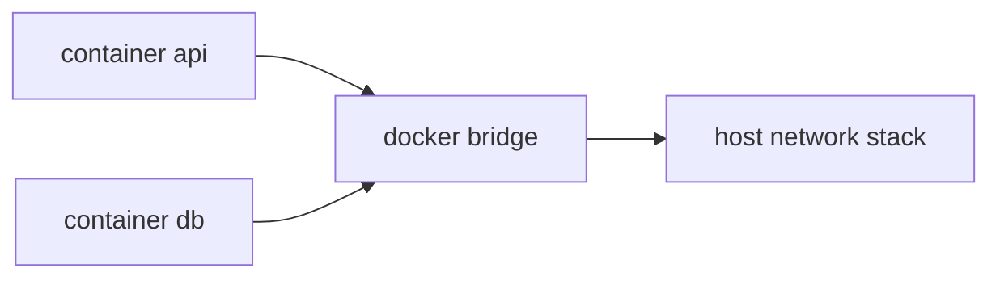

Di Swarm, service replica bisa tersebar:

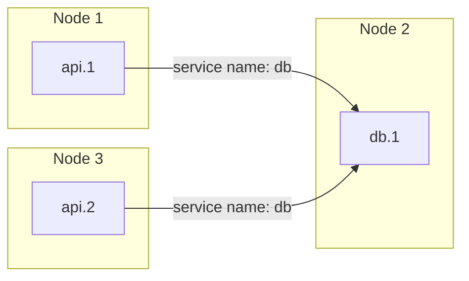

Tanpa overlay network, `api.1` di node 1 tidak punya network path langsung ke `db.1` di node 2 sebagai container identity yang dikelola Docker. Overlay network memberi ilusi bahwa container di berbagai host berada dalam satu network virtual.

Kuncinya:

- **container location** adalah detail scheduling;
- **service identity** adalah kontrak aplikasi;
- **overlay network** adalah fabric antar-node;
- **service discovery** adalah mapping nama service ke endpoint yang benar;
- **routing mesh** adalah mekanisme ingress untuk published service.

---

## 3. Swarm Network Object Model

Ada beberapa network object penting di Swarm.

### 3.1 Overlay Network

Overlay network menghubungkan Docker daemons yang tergabung dalam swarm. Service yang attach ke overlay network dapat berkomunikasi satu sama lain walaupun task berada di node berbeda.

Contoh:

```bash
# dibuat di manager node
docker network create \
  --driver overlay \
  app_internal
```

Lalu service:

```bash
docker service create \
  --name api \
  --network app_internal \
  --replicas 3 \
  registry.example.com/acme/api:1.0.0
```

### 3.2 Ingress Network

`ingress` adalah overlay network khusus yang dipakai Swarm routing mesh ketika service publish port dalam mode ingress.

Karakteristik:

- dibuat otomatis saat swarm diinisialisasi;
- dipakai untuk mengarahkan traffic eksternal ke service task;
- tidak sama dengan network aplikasi internal;
- jangan diperlakukan sebagai network segmentation utama aplikasi.

### 3.3 docker_gwbridge

`docker_gwbridge` adalah bridge network lokal pada setiap node yang menghubungkan overlay network ke network stack host.

Sederhananya:

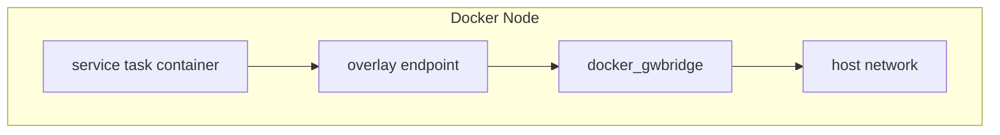

Sebagian besar engineer jarang perlu menyentuh `docker_gwbridge`, tetapi penting dipahami ketika debugging routing, NAT, MTU, atau host egress.

### 3.4 Service Endpoint

Service endpoint adalah cara Swarm mengekspos service ke service lain atau ke dunia luar.

Endpoint dapat berupa:

- **internal service discovery** via service name;
- **VIP endpoint mode**;
- **DNSRR endpoint mode**;
- **published port** via ingress routing mesh;
- **published port** via host mode.

---

## 4. Traffic Types in Swarm

Swarm networking harus dibaca sebagai beberapa lapisan traffic, bukan satu jalur tunggal.

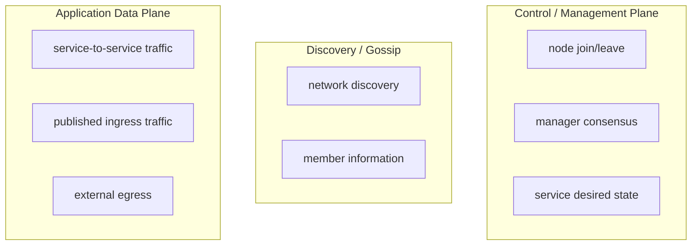

Operationally, firewall antar-node harus memperhatikan port umum berikut:

| Purpose | Typical Port | Protocol | Notes |
|---|---:|---|---|
| Swarm cluster management | `2377` | TCP | Dipakai manager untuk cluster management; biasanya hanya manager yang expose |
| Node discovery / gossip | `7946` | TCP/UDP | Dipakai komunikasi antar-node |
| Overlay network traffic | `4789` | UDP | VXLAN data path overlay network |
| Published service ports | sesuai service | TCP/UDP | Dibuka sesuai kebutuhan aplikasi |

Catatan penting:

- jangan membuka port manager ke internet publik;
- antar-node swarm harus dapat saling mencapai port yang dibutuhkan;
- external load balancer hanya perlu mencapai published application ports;
- firewall yang salah sering terlihat sebagai service `Running`, tetapi unreachable antar-node.

---

## 5. Overlay Network Mental Model

Overlay network menyembunyikan detail host fisik. Setiap task mendapat endpoint pada network virtual.

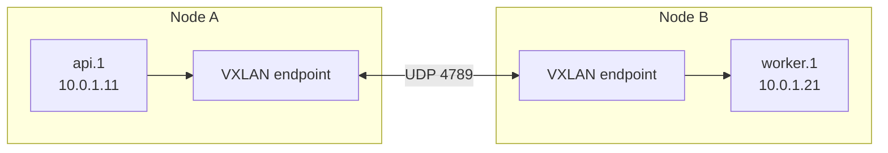

Dari sudut pandang `api.1`, `worker` berada di network yang sama. Dari sudut pandang host, packet sebenarnya dibungkus dan dikirim antar-node melalui overlay data path.

### 5.1 Membuat Overlay Network

```bash
docker network create \
  --driver overlay \
  app_internal
```

Untuk service-to-service communication:

```bash
docker service create \
  --name orders-api \
  --network app_internal \
  --replicas 3 \
  registry.example.com/acme/orders-api:2026.07.01


docker service create \
  --name orders-worker \
  --network app_internal \
  --replicas 2 \
  registry.example.com/acme/orders-worker:2026.07.01
```

Di dalam container `orders-api`, service `orders-worker` dapat diakses menggunakan nama service:

```bash
curl http://orders-worker:8080/health
```

### 5.2 Attachable Overlay Network

Secara default, overlay network untuk Swarm service tidak selalu ditujukan untuk standalone container. Untuk debugging, kita kadang ingin menjalankan container sementara yang attach ke network.

```bash
docker network create \
  --driver overlay \
  --attachable \
  app_internal
```

Lalu:

```bash
docker run --rm -it \
  --network app_internal \
  nicolaka/netshoot \
  sh
```

Gunakan attachable overlay secara sadar:

- bagus untuk debugging dan migration tool;
- berisiko jika dipakai sembarangan karena container non-service dapat masuk network internal;
- di production, akses attachable sebaiknya dibatasi lewat prosedur operasional.

### 5.3 Encrypted Overlay

Overlay network bisa dibuat dengan enkripsi data plane:

```bash
docker network create \
  --driver overlay \
  --opt encrypted \
  app_secure
```

Trade-off:

| Aspek | Tanpa encrypted overlay | Dengan encrypted overlay |
|---|---|---|
| Performance | Lebih ringan | Ada overhead enkripsi |
| Data protection antar-node | Bergantung network underlay | Lebih kuat untuk traffic overlay |
| Complexity | Lebih sederhana | Perlu capacity/performance test |
| Use case | private trusted network | multi-tenant / regulated / less trusted underlay |

Jangan menganggap encrypted overlay menggantikan TLS aplikasi. Untuk sistem serius, gunakan TLS/mTLS pada aplikasi atau service mesh/proxy layer bila diperlukan.

---

## 6. Service Discovery in Swarm

Ketika service attach ke network yang sama, Docker menyediakan DNS internal.

Contoh service:

```bash
docker service create \
  --name payment-api \
  --network app_internal \
  --replicas 3 \
  registry.example.com/acme/payment-api:1.0.0
```

Service lain dapat memanggil:

```text
http://payment-api:8080
```

Tetapi apa yang di-resolve oleh `payment-api`?

Jawabannya bergantung pada **endpoint mode**.

---

## 7. VIP Endpoint Mode

VIP adalah default endpoint mode untuk Swarm service.

Dalam mode ini:

- service name resolve ke virtual IP;
- Docker melakukan load balancing internal dari VIP ke task aktif;
- client service tidak perlu mengetahui semua task IP;
- task replacement tidak mengubah kontrak client.

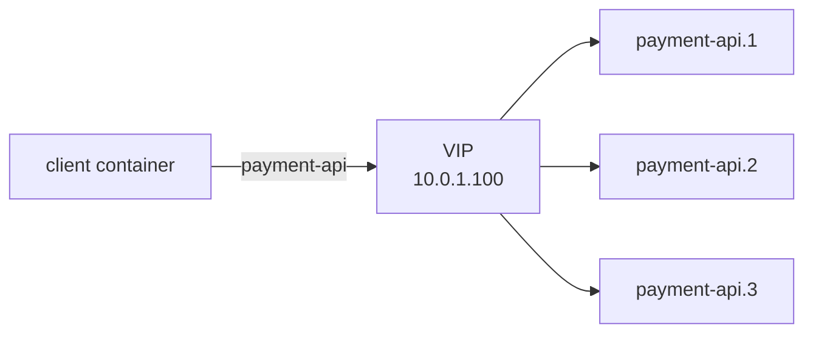

Contoh eksplisit:

```bash
docker service create \
  --name payment-api \
  --network app_internal \
  --endpoint-mode vip \
  --replicas 3 \
  registry.example.com/acme/payment-api:1.0.0
```

### 7.1 Kapan VIP Cocok?

VIP cocok untuk:

- stateless HTTP service;
- service internal umum;
- workload yang tidak perlu tahu semua endpoint replica;
- aplikasi yang tidak punya client-side discovery khusus.

### 7.2 Kapan VIP Tidak Ideal?

VIP bisa kurang ideal jika:

- aplikasi ingin melakukan client-side load balancing sendiri;
- service butuh mengetahui identity setiap peer;
- workload stateful butuh direct peer discovery;
- jumlah task sangat besar sehingga desain network perlu dipecah lebih halus;
- ada external load balancer yang lebih cocok mengelola balancing.

---

## 8. DNSRR Endpoint Mode

DNSRR berarti DNS round-robin. Dalam mode ini, service name resolve ke beberapa IP task, bukan VIP tunggal.

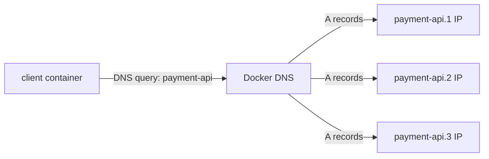

Contoh:

```bash
docker service create \
  --name payment-api \
  --network app_internal \
  --endpoint-mode dnsrr \
  --replicas 3 \
  registry.example.com/acme/payment-api:1.0.0
```

### 8.1 Kapan DNSRR Cocok?

DNSRR cocok untuk:

- service yang punya client-side load balancing;
- broker, cluster peer, atau stateful workload tertentu;
- external load balancer yang ingin melihat daftar task;
- skenario yang ingin menghindari VIP load balancing;
- network besar yang perlu desain endpoint lebih eksplisit.

### 8.2 Risiko DNSRR

DNSRR bukan silver bullet.

| Risiko | Penjelasan |
|---|---|
| DNS caching | Client/runtime bisa cache DNS terlalu lama atau tidak sesuai ekspektasi |
| Uneven balancing | Round-robin DNS tidak sama dengan real load balancing berbasis latency/load |
| Failed endpoint | Client harus robust terhadap task yang hilang setelah DNS resolve |
| Language runtime behavior | JVM, Go, Node.js, libc, dan resolver library bisa punya perilaku DNS berbeda |

Untuk Java, perhatikan DNS caching di JVM. Jika aplikasi cache DNS terlalu lama, perubahan task bisa lambat terlihat. Solusi biasanya bukan “gunakan DNSRR saja”, tetapi desain client discovery dan timeout/retry secara benar.

---

## 9. VIP vs DNSRR Decision Matrix

| Pertanyaan | Pilih VIP Jika | Pilih DNSRR Jika |
|---|---|---|
| Apakah client butuh tahu semua replica? | Tidak | Ya |
| Apakah workload stateless HTTP biasa? | Ya | Tidak wajib |
| Apakah ada external LB yang butuh daftar backend? | Tidak | Ya |
| Apakah client punya service discovery/load balancing sendiri? | Tidak | Ya |
| Apakah desain ingin sederhana? | Ya | Tidak selalu |
| Apakah workload cluster-aware? | Tidak | Sering ya |

Rule of thumb:

> Default ke VIP untuk service internal stateless. Gunakan DNSRR hanya saat ada alasan eksplisit yang bisa dijelaskan dan diuji.

---

## 10. Routing Mesh Mental Model

Routing mesh adalah fitur Swarm yang membuat published port dapat diterima oleh semua node swarm, meskipun task service tidak berjalan di node tersebut.

Misal service `web` punya 2 replicas di node 1 dan node 3:

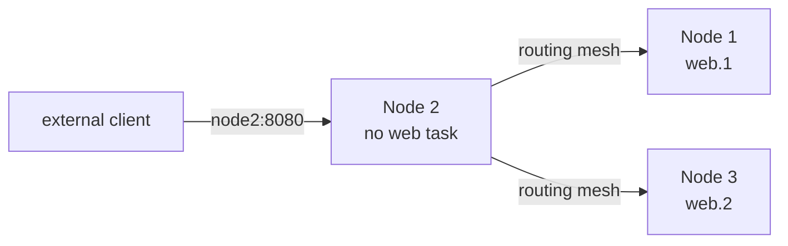

Walaupun node 2 tidak menjalankan task `web`, node 2 tetap dapat menerima koneksi pada published port dan meneruskannya ke task aktif.

### 10.1 Publish Port via Ingress Routing Mesh

```bash
docker service create \
  --name web \
  --replicas 3 \
  --publish published=8080,target=80,mode=ingress \
  nginx:alpine
```

Atau short form:

```bash
docker service create \
  --name web \
  --replicas 3 \
  -p 8080:80 \
  nginx:alpine
```

Namun untuk production, long syntax lebih eksplisit.

### 10.2 Apa yang Terjadi?

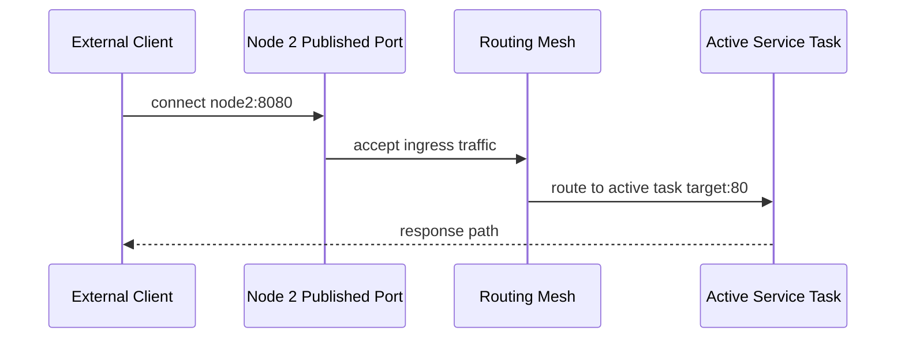

Keuntungan:

- client/external LB bisa mengarah ke node mana pun;
- task bisa berpindah tanpa mengubah endpoint node;
- deployment sederhana untuk cluster kecil/menengah.

Risiko:

- jalur traffic bisa hairpin ke node lain;
- observability source/destination bisa lebih sulit;
- latency tambahan mungkin muncul;
- semua node menerima published port;
- firewall/security harus memahami bahwa port terbuka di cluster, bukan hanya node yang punya task.

---

## 11. Host Publish Mode

Kita bisa bypass routing mesh dengan `mode=host`.

```bash
docker service create \
  --name web \
  --replicas 3 \
  --publish published=8080,target=80,mode=host \
  nginx:alpine
```

Dalam mode host:

- port hanya dibuka pada node tempat task berjalan;
- tidak ada routing mesh ingress untuk port tersebut;
- external LB harus tahu node mana yang menjalankan task;
- satu node tidak bisa menjalankan dua task yang bind published port sama, kecuali port dibuat dinamis atau replica placement diatur.

### 11.1 Kapan Host Mode Cocok?

Host mode cocok untuk:

- external load balancer yang health-check langsung ke backend node;
- latency-sensitive ingress;
- ingin menghindari routing mesh;
- edge proxy global service;
- kontrol port binding yang lebih eksplisit.

### 11.2 Host Mode dan Global Service

Pattern umum:

```bash
docker service create \
  --name edge-proxy \
  --mode global \
  --publish published=80,target=80,mode=host \
  --publish published=443,target=443,mode=host \
  traefik:v3
```

Ini membuat satu edge proxy task per node. External LB dapat mengarah ke semua node yang memenuhi label/role tertentu.

---

## 12. Ingress vs Host Publish Decision Matrix

| Pertanyaan | Ingress Routing Mesh | Host Publish |
|---|---|---|
| Ingin endpoint sederhana di semua node? | Ya | Tidak |
| Ingin external LB sederhana? | Ya | Bisa, tapi harus tahu backend aktif |
| Ingin latency/direct path lebih eksplisit? | Tidak ideal | Lebih cocok |
| Ingin hanya node tertentu expose port? | Perlu firewall/placement tambahan | Lebih natural |
| Service replica banyak di node yang sama? | Bisa | Hati-hati port conflict |
| Edge proxy global | Bisa, tapi tidak selalu ideal | Sering cocok |

Rule of thumb:

> Gunakan ingress routing mesh untuk kesederhanaan. Gunakan host publish saat ingress path perlu eksplisit, external LB lebih pintar, atau edge proxy berjalan global.

---

## 13. Stack File Examples

### 13.1 Internal Overlay + Published API

```yaml
services:
  api:
    image: registry.example.com/acme/orders-api:2026.07.01
    networks:
      - public
      - internal
    ports:
      - target: 8080
        published: 8080
        protocol: tcp
        mode: ingress
    deploy:
      replicas: 3
      endpoint_mode: vip
      update_config:
        parallelism: 1
        order: start-first
      restart_policy:
        condition: on-failure

  worker:
    image: registry.example.com/acme/orders-worker:2026.07.01
    networks:
      - internal
    deploy:
      replicas: 2
      endpoint_mode: vip

  postgres:
    image: postgres:16
    networks:
      - internal
    volumes:
      - pgdata:/var/lib/postgresql/data
    deploy:
      replicas: 1
      placement:
        constraints:
          - node.labels.storage == local-ssd

networks:
  public:
    driver: overlay
  internal:
    driver: overlay

volumes:
  pgdata:
```

Interpretasi:

- `api` berada di `public` dan `internal`;
- `worker` dan `postgres` hanya di `internal`;
- hanya `api` yang publish port;
- DB tidak boleh diekspos ke luar cluster;
- placement DB dikunci ke node storage tertentu.

### 13.2 External Pre-Created Encrypted Overlay

Untuk encrypted overlay, lebih defensible membuat network secara eksplisit:

```bash
docker network create \
  --driver overlay \
  --opt encrypted \
  --attachable \
  acme_secure_internal
```

Lalu stack:

```yaml
services:
  api:
    image: registry.example.com/acme/api:2026.07.01
    networks:
      - secure_internal
    deploy:
      replicas: 3

networks:
  secure_internal:
    external: true
    name: acme_secure_internal
```

Mengapa external network?

- network security property dibuat sebagai resource platform;
- deployment aplikasi tidak diam-diam mengubah network fabric;
- operator dapat mengaudit network secara terpisah;
- menghindari perbedaan behavior antar versi Compose/Stack parser.

---

## 14. Network Segmentation Pattern

Jangan masukkan semua service ke satu overlay network besar.

### 14.1 Bad Pattern

```yaml
services:
  api:
    networks: [default]
  worker:
    networks: [default]
  db:
    networks: [default]
  redis:
    networks: [default]
  admin:
    networks: [default]
```

Masalah:

- semua service dapat resolve dan reach semua service lain;
- lateral movement terlalu mudah;
- sulit menjelaskan boundary;
- audit jaringan tidak punya struktur.

### 14.2 Better Pattern

```yaml
services:
  edge:
    networks:
      - public
      - app

  api:
    networks:
      - app
      - data

  worker:
    networks:
      - app
      - data

  postgres:
    networks:
      - data

  redis:
    networks:
      - data

networks:
  public:
    driver: overlay
  app:
    driver: overlay
  data:
    driver: overlay
```

Mental model:

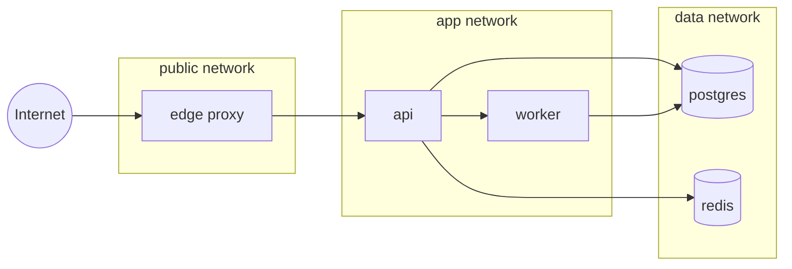

Service hanya join network yang benar-benar diperlukan.

---

## 15. Published Port Design

Published port adalah boundary dari cluster ke luar. Review-nya harus ketat.

### 15.1 Good Published Port Checklist

Sebelum publish port, jawab:

1. Apakah service memang public/external?
2. Apakah harus publish langsung atau lewat reverse proxy?
3. Apakah port harus terbuka di semua node?
4. Apakah mode `ingress` atau `host` lebih tepat?
5. Apakah TLS termination jelas?
6. Apakah source IP behavior dipahami?
7. Apakah health endpoint aman?
8. Apakah service internal tidak ikut publish port secara tidak sengaja?
9. Apakah external firewall/security group sesuai?
10. Apakah observability bisa membedakan node ingress dan node task?

### 15.2 Prefer Edge Proxy for Public Traffic

Untuk banyak aplikasi, pattern yang lebih rapi:

- hanya edge proxy yang publish `80/443`;
- service internal tidak publish port;
- routing ke service internal melalui overlay network;
- TLS, auth, rate limit, headers, tracing di edge layer.

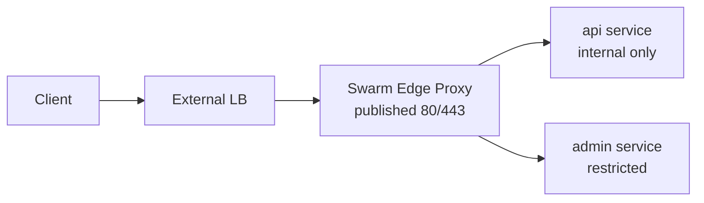

---

## 16. Source IP and Observability Considerations

Routing mesh dapat mempengaruhi cara aplikasi melihat source IP, tergantung topology, proxy, dan network path. Dalam production, jangan mendesain audit/security logic hanya berdasarkan asumsi source IP di container.

Lebih defensible:

- terminate traffic di reverse proxy yang eksplisit;
- gunakan `X-Forwarded-For` atau `Forwarded` header secara terkontrol;
- hanya trust header dari proxy yang dipercaya;
- log request ID, trace ID, service name, node, task slot;
- korelasikan Docker service logs dengan load balancer logs.

Observability metadata yang berguna:

```text
service=orders-api
stack=orders
node={{.Node.Hostname}}
task={{.Task.Name}}
image_digest=sha256:...
request_id=...
trace_id=...
```

---

## 17. MTU and Overlay Failure Mode

Overlay network menambahkan encapsulation overhead. Jika underlay network punya MTU kecil, packet fragmentation atau blackhole bisa terjadi.

Gejala umum:

- small request sukses, large response gagal;
- TLS handshake kadang gagal;
- upload/download intermittent;
- service healthcheck simple sukses, traffic real gagal;
- masalah hanya muncul antar-node, bukan same-node.

Debug approach:

```bash
# inspeksi network
docker network inspect app_internal

# test path dari debug container
docker run --rm -it --network app_internal nicolaka/netshoot sh

# di dalam container
ping -c 3 other-service
curl -v http://other-service:8080/health
tracepath other-service
```

Jika dicurigai MTU:

- cek MTU interface underlay;
- cek overlay network options;
- test packet size;
- koordinasikan dengan network/cloud provider;
- jangan asal menaikkan subnet atau mengubah MTU tanpa rollback plan.

---

## 18. Overlay Subnet Sizing

Docker documentation merekomendasikan overlay network dengan `/24` block untuk default VIP-based endpoint mode karena limitasi Swarm mode. Jika butuh lebih dari 256 IP, rekomendasinya bukan memperbesar subnet sembarangan, tetapi memakai beberapa overlay network lebih kecil atau DNSRR dengan external load balancer.

Engineering implication:

- jangan letakkan seluruh platform dalam satu network besar;
- segmentasi network bukan hanya security, tetapi juga scale boundary;
- desain service domain secara eksplisit;
- hindari “one giant overlay network”.

Contoh:

```text
orders_public     /24
orders_app        /24
orders_data       /24
billing_app       /24
billing_data      /24
observability     /24
```

---

## 19. Debugging Swarm Networking

Debugging harus mengikuti layer, bukan menebak-nebak.

### 19.1 Start with Desired State

```bash
docker service ls
docker service ps orders_api --no-trunc
docker service inspect orders_api --pretty
```

Pertanyaan:

- service running?
- replicas desired == current?
- task tersebar di node mana?
- ada rejected/pending/failed task?
- image pull berhasil di semua node?

### 19.2 Inspect Network

```bash
docker network ls
docker network inspect orders_app
```

Cek:

- driver overlay?
- attachable?
- subnet?
- services attached?
- peers/nodes terlihat?
- external network name sesuai?

### 19.3 Test from Inside the Network

```bash
docker run --rm -it \
  --network orders_app \
  nicolaka/netshoot \
  sh
```

Inside:

```bash
getent hosts orders-api
nslookup orders-api
curl -v http://orders-api:8080/health
nc -vz orders-api 8080
```

Jika standalone debug container tidak bisa attach, network mungkin tidak `attachable`. Alternatif: exec ke task container yang sudah berjalan.

### 19.4 Check Published Ports

```bash
docker service inspect orders_api \
  --format '{{json .Endpoint.Ports}}'

curl -v http://node1.example.com:8080/health
curl -v http://node2.example.com:8080/health
curl -v http://node3.example.com:8080/health
```

Jika mode ingress, semua node seharusnya menerima published port, selama firewall membolehkan.

Jika mode host, hanya node yang menjalankan task yang bind port.

### 19.5 Check Node Firewall

Antar-node perlu mengizinkan port Swarm yang relevan. Gejala firewall salah:

- service running tetapi antar-service timeout;
- task di node yang sama bisa connect, beda node gagal;
- published port dari node tertentu gagal;
- overlay network inspect terlihat aneh;
- cluster join sukses tetapi network data plane bermasalah.

### 19.6 Check DNS Behavior

Masalah DNS sering berasal dari client runtime.

Checklist:

- service berada di network yang sama?
- service name benar?
- endpoint mode VIP atau DNSRR?
- client cache DNS terlalu lama?
- aplikasi memakai custom DNS resolver?
- container override `/etc/resolv.conf`?
- ada hardcoded IP?

---

## 20. Failure Taxonomy

| Symptom | Kemungkinan Penyebab | Cara Memverifikasi |
|---|---|---|
| Service A tidak bisa resolve B | beda network, typo service name, DNS issue | `docker network inspect`, `getent hosts` |
| Resolve sukses tapi connect timeout | firewall, service tidak listen, wrong port, overlay issue | `nc -vz`, `curl`, service logs |
| Published port jalan di node tertentu saja | mode host, firewall, node unavailable | inspect endpoint ports, test per node |
| Semua node accept port tapi response lambat | routing mesh hairpin, overloaded task, LB issue | trace logs, node/task placement |
| Large payload gagal | MTU/fragmentation | `tracepath`, packet size test |
| DNSRR tidak balance | client cache DNS, resolver behavior | inspect DNS response, app runtime config |
| Service intermitten | task restart, healthcheck, network flap | `docker service ps`, `docker events` |
| External LB healthcheck gagal | mode host vs ingress mismatch, wrong path | LB logs, curl per node |

---

## 21. Production Network Patterns

### 21.1 Internal-Only Service Pattern

```yaml
services:
  worker:
    image: registry.example.com/acme/worker:2026.07.01
    networks:
      - app
    deploy:
      replicas: 4

networks:
  app:
    driver: overlay
```

Tidak ada `ports`. Service hanya reachable oleh service lain di network yang sama.

### 21.2 Public Edge + Internal API Pattern

```yaml
services:
  edge:
    image: traefik:v3
    ports:
      - target: 80
        published: 80
        mode: host
      - target: 443
        published: 443
        mode: host
    networks:
      - public
      - app
    deploy:
      mode: global
      placement:
        constraints:
          - node.labels.edge == true

  api:
    image: registry.example.com/acme/api:2026.07.01
    networks:
      - app
    deploy:
      replicas: 6

networks:
  public:
    driver: overlay
  app:
    driver: overlay
```

Manfaat:

- hanya edge nodes expose port;
- service internal tetap internal;
- external LB bisa mengarah ke node label `edge=true`;
- TLS/routing terpusat.

### 21.3 External LB + DNSRR Pattern

```yaml
services:
  api:
    image: registry.example.com/acme/api:2026.07.01
    networks:
      - app
    deploy:
      replicas: 6
      endpoint_mode: dnsrr
```

External system atau sidecar/proxy dapat melakukan discovery dan balancing lebih eksplisit.

Gunakan pattern ini hanya jika:

- LB/proxy benar-benar mendukung dynamic backend management;
- DNS cache behavior dipahami;
- health check ada;
- failure endpoint ditangani.

### 21.4 Admin Network Pattern

```yaml
services:
  admin-api:
    image: registry.example.com/acme/admin-api:2026.07.01
    networks:
      - admin
      - data
    deploy:
      replicas: 2
      placement:
        constraints:
          - node.labels.admin == true

networks:
  admin:
    driver: overlay
  data:
    driver: overlay
```

Admin surface harus dipisahkan dari public app surface.

---

## 22. Network Labels and Governance

Docker objects dapat diberi labels. Untuk platform serius, label membantu audit.

Contoh:

```yaml
networks:
  app:
    driver: overlay
    labels:
      com.acme.owner: platform
      com.acme.data-classification: internal
      com.acme.environment: production
      com.acme.reviewed-by: security
```

Gunakan label untuk:

- ownership;
- environment;
- data classification;
- exposure level;
- compliance mapping;
- cost/accounting;
- automated linting.

---

## 23. Anti-Patterns

### 23.1 Publishing Every Service

```yaml
services:
  api:
    ports: ["8080:8080"]
  worker:
    ports: ["8081:8081"]
  db:
    ports: ["5432:5432"]
  redis:
    ports: ["6379:6379"]
```

Ini sering terjadi karena pola local Compose dibawa ke Swarm production.

Masalah:

- terlalu banyak attack surface;
- service internal jadi external;
- firewall menjadi sulit;
- audit exposure buruk.

### 23.2 One Huge Overlay Network

Semua service dalam satu network:

- lateral movement mudah;
- DNS namespace terlalu luas;
- sulit troubleshooting;
- skala IP lebih cepat habis;
- boundary domain tidak jelas.

### 23.3 Hardcoded Task IP

Task IP bukan kontrak stabil. Gunakan service name, bukan IP task.

### 23.4 Assuming `depends_on` Solves Runtime Reachability

Dalam stack/Swarm, readiness dan dependency harus didesain dengan healthcheck, retry, backoff, migration job, dan service robustness. Network reachability tidak berarti dependency siap secara semantik.

### 23.5 Debugging from the Host Only

Testing dari host tidak sama dengan testing dari container network namespace. Selalu test dari dalam network yang sama dengan service.

---

## 24. Review Checklist for Swarm Network Design

Gunakan checklist ini saat review stack production.

### 24.1 Network Topology

- [ ] Setiap service hanya join network yang diperlukan.
- [ ] Public, app, data, admin network dipisahkan jika relevan.
- [ ] Tidak ada giant shared overlay network tanpa alasan.
- [ ] Network naming mengikuti convention environment/domain.
- [ ] External/pre-created network dipakai untuk resource platform yang sensitif.

### 24.2 Service Discovery

- [ ] Endpoint mode default VIP dipakai untuk service stateless biasa.
- [ ] DNSRR hanya dipakai dengan alasan eksplisit.
- [ ] Client DNS caching dipahami.
- [ ] Tidak ada hardcoded task IP.
- [ ] Retry/timeout/circuit breaker ada di client.

### 24.3 Published Ports

- [ ] Hanya edge/public service yang publish port.
- [ ] Mode ingress vs host dipilih sadar.
- [ ] External LB topology terdokumentasi.
- [ ] Firewall sesuai published mode.
- [ ] DB/cache/internal service tidak publish port ke publik.

### 24.4 Security

- [ ] Overlay encryption dipertimbangkan untuk data sensitive antar-node.
- [ ] TLS/mTLS aplikasi tidak digantikan oleh overlay encryption.
- [ ] Docker socket tidak diekspos ke service yang tidak perlu.
- [ ] Admin surface dipisahkan.
- [ ] Labels/audit metadata ada.

### 24.5 Operations

- [ ] Port Swarm antar-node dibuka benar.
- [ ] MTU/underlay network sudah diuji.
- [ ] Debug network dapat dilakukan dengan prosedur terbatas.
- [ ] Observability mencatat service, task, node, request ID.
- [ ] Runbook network failure tersedia.

---

## 25. Hands-On Lab: Build a Defensible Swarm Network

### 25.1 Goal

Membuat stack dengan:

- edge service publish port;
- API internal;
- worker internal;
- Redis internal;
- network segmentation;
- endpoint mode eksplisit;
- debug procedure.

### 25.2 Stack File

```yaml
services:
  edge:
    image: nginx:alpine
    ports:
      - target: 80
        published: 8080
        protocol: tcp
        mode: ingress
    networks:
      - public
      - app
    deploy:
      replicas: 2
      endpoint_mode: vip
      placement:
        preferences:
          - spread: node.id

  api:
    image: hashicorp/http-echo:1.0
    command:
      - "-text=api"
      - "-listen=:8080"
    networks:
      - app
      - data
    deploy:
      replicas: 3
      endpoint_mode: vip

  worker:
    image: alpine:3.20
    command: ["sh", "-c", "while true; do wget -qO- http://api:8080 || true; sleep 5; done"]
    networks:
      - app
    deploy:
      replicas: 2

  redis:
    image: redis:7-alpine
    networks:
      - data
    deploy:
      replicas: 1

networks:
  public:
    driver: overlay
  app:
    driver: overlay
  data:
    driver: overlay
```

### 25.3 Deploy

```bash
docker stack deploy -c stack.yml acme
```

### 25.4 Inspect

```bash
docker stack services acme
docker stack ps acme
docker network ls | grep acme
docker network inspect acme_app
```

### 25.5 Test

From outside:

```bash
curl http://<any-node-ip>:8080
```

From inside app network:

```bash
docker run --rm -it --network acme_app nicolaka/netshoot sh

# inside
getent hosts api
curl -v http://api:8080
getent hosts redis
nc -vz redis 6379
```

From public network, Redis should not be reachable unless the debug container also joins data network.

### 25.6 Tear Down

```bash
docker stack rm acme
```

---

## 26. Mental Model Recap

Swarm networking is not “Docker bridge but bigger”. It is a service-oriented network fabric.

Remember these invariants:

1. **Service name is the contract**, task IP is implementation detail.
2. **Overlay network connects tasks across nodes**.
3. **VIP hides replica identity behind one virtual endpoint**.
4. **DNSRR exposes task endpoints for clients that can handle discovery**.
5. **Routing mesh exposes published ports on every node in ingress mode**.
6. **Host publish bypasses routing mesh and binds only where tasks run**.
7. **Network segmentation is both security and scale design**.
8. **Firewall, MTU, DNS caching, and published mode explain most Swarm network incidents**.

---

## 27. Self-Correction Questions

1. Jika service `api` publish port `8080` dengan mode ingress dan hanya task-nya ada di node 1, apakah node 2 bisa menerima request pada port `8080`?
2. Apa perbedaan VIP dan DNSRR?
3. Kenapa hardcoded task IP buruk?
4. Kapan host publish lebih tepat daripada ingress routing mesh?
5. Mengapa DB service biasanya tidak perlu `ports`?
6. Apa bedanya `overlay`, `ingress`, dan `docker_gwbridge`?
7. Mengapa `/24` overlay network sering lebih disarankan daripada satu subnet besar?
8. Bagaimana cara membuktikan problem ada di DNS, bukan di aplikasi?
9. Bagaimana MTU bisa menyebabkan request kecil sukses tetapi response besar gagal?
10. Apa risiko attachable overlay network di production?

---

## 28. References

- Docker Docs — Manage swarm service networks: `https://docs.docker.com/engine/swarm/networking/`
- Docker Docs — Use Swarm mode routing mesh: `https://docs.docker.com/engine/swarm/ingress/`
- Docker Docs — Deploy services to a swarm: `https://docs.docker.com/engine/swarm/services/`
- Docker Docs — docker network create: `https://docs.docker.com/reference/cli/docker/network/create/`
- Docker Docs — docker service create: `https://docs.docker.com/reference/cli/docker/service/create/`

---

## 29. Next Part

Part berikutnya akan membahas **Swarm Stacks**: bagaimana Compose file berubah menjadi deployment unit, bagaimana `deploy` specification dipakai, bagaimana stack dipromosikan antar-environment, dan bagaimana release dibuat reproducible.
