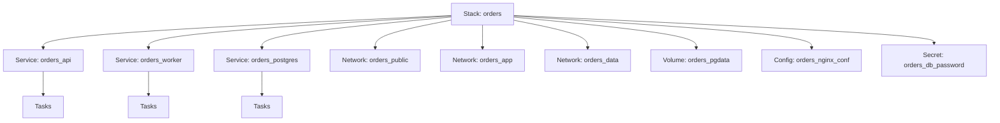
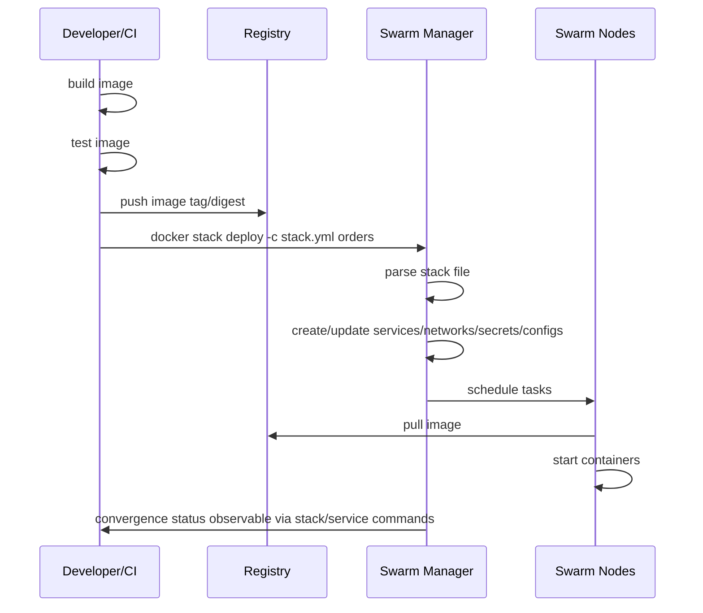
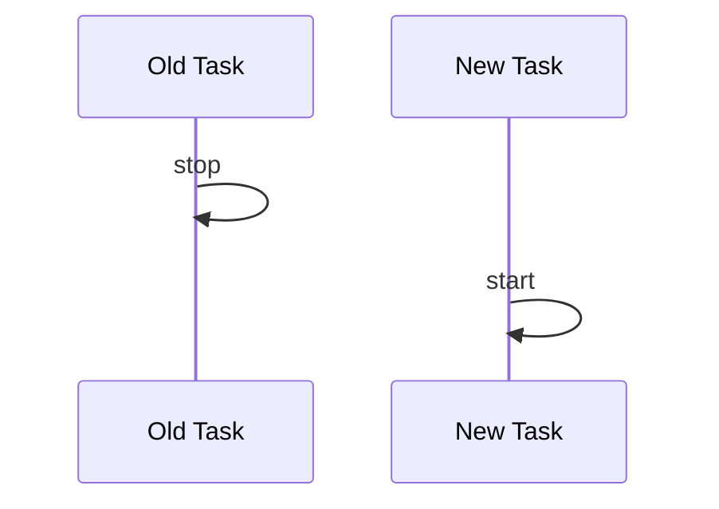
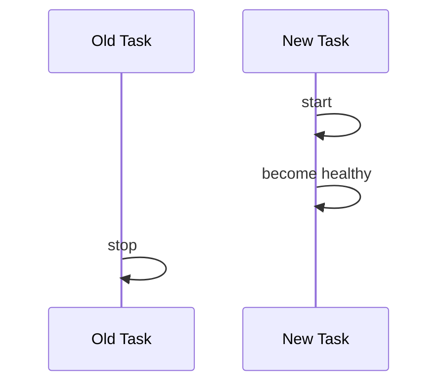
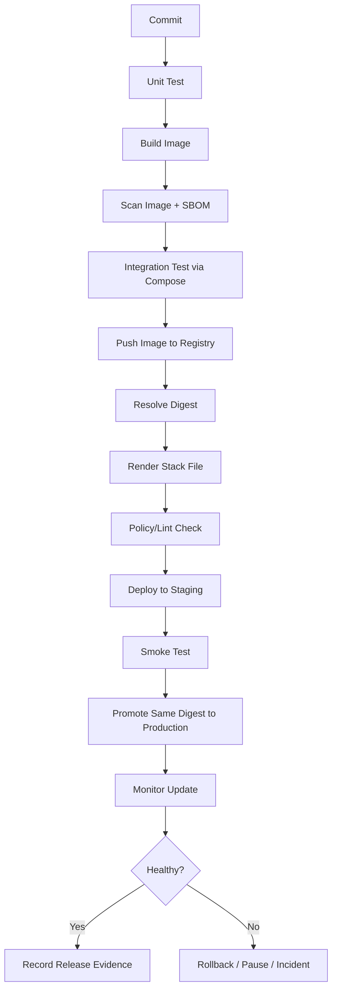

# Part 028 — Swarm Stacks: Compose Deploy Spec, Stack Files, and Environment Promotion

> Target part ini: kita mampu memperlakukan Swarm stack sebagai **release unit** yang reproducible, reviewable, promotable, dan rollbackable. Kita tidak sekadar menjalankan `docker stack deploy`, tetapi memahami apa yang terjadi pada service, network, volume, config, secret, placement, update policy, rollback policy, dan environment boundary.

Di Part 027 kita membahas networking Swarm. Sekarang kita naik satu level: bagaimana aplikasi multi-service dideploy sebagai satu unit menggunakan **stack**.

Docker stack adalah cara mendeploy kumpulan service, network, volume, secret, dan config ke Swarm memakai Compose-style file. Ini bukan sekadar Compose lokal. Stack adalah kontrak deployment cluster.

---

## 1. Kaufman Skill Deconstruction

Untuk menguasai Swarm stacks, pecah skill menjadi subskill berikut:

| Subskill | Yang Harus Dikuasai | Bukti Penguasaan |
|---|---|---|
| Stack object model | Bisa membedakan stack, service, task, network, volume, config, secret | Bisa menjelaskan output `docker stack services` dan `docker stack ps` |
| Deploy specification | Bisa memakai `deploy.replicas`, `placement`, `resources`, `restart_policy`, `update_config`, `rollback_config` | Bisa membuat stack file production-ready |
| Image promotion | Bisa membedakan build lokal, push registry, deploy digest/tag | Bisa membuat pipeline build-push-deploy reproducible |
| Environment separation | Bisa memisahkan dev Compose, test Compose, stack prod | Tidak membawa bind mount/debug/dev setting ke Swarm production |
| Release safety | Bisa mengatur rolling update, rollback, monitor, failure action | Bisa menjelaskan apa yang terjadi saat update gagal |
| Operations | Bisa inspect stack, service, task, logs, rollback, remove, prune | Bisa membuat runbook deployment |

Mental model utama:

> Compose lokal adalah **developer application model**. Swarm stack adalah **cluster deployment model**. Bentuk file bisa mirip, tetapi constraint operasionalnya berbeda.

---

## 2. What Is a Swarm Stack?

Stack adalah namespace deployment di Swarm.

Jika kita deploy:

```bash
docker stack deploy -c stack.yml orders
```

Docker membuat resource dengan prefix stack:

```text
orders_api
orders_worker
orders_postgres
orders_app
orders_data
orders_pgdata
```

Diagram:



Stack memberikan grouping, bukan transactional deployment sempurna. Jika sebagian service gagal converge, operator tetap perlu inspect dan memperbaiki.

---

## 3. Compose File vs Stack File

Banyak engineer menganggap stack file sama dengan Compose file lokal. Ini jebakan.

| Area | Docker Compose Local | Docker Stack Swarm |
|---|---|---|
| Command utama | `docker compose up` | `docker stack deploy` |
| Target | single Docker context/host atau local dev | Swarm cluster |
| Build source | `build:` umum dipakai | image sebaiknya sudah ada di registry |
| Scaling | `--scale`, local service replicas | `deploy.replicas` |
| Placement | tidak relevan/sangat terbatas | `deploy.placement` penting |
| Rolling update | tidak sama dengan orchestrated update Swarm | `deploy.update_config` |
| Rollback | manual/recreate | `rollback_config` + `docker service rollback` |
| Secrets | local file-based behavior | Swarm secrets cluster resource |
| Configs | local/config behavior | Swarm configs cluster resource |
| Lifecycle | dev/test ergonomics | production deployment semantics |

Prinsip:

> Jangan deploy file Compose dev langsung ke Swarm production.

Compose dev biasanya punya:

- bind mounts;
- hot reload;
- debug ports;
- local-only credentials;
- `build:` context;
- permissive network;
- fake dependencies;
- exposed DB/cache ports.

Stack production harus punya:

- immutable image references;
- deploy policy;
- placement constraints;
- secret/config resources;
- resource reservation/limit;
- network segmentation;
- healthcheck/restart strategy;
- update/rollback policy;
- labels/metadata.

---

## 4. Minimal Stack File

```yaml
services:
  api:
    image: registry.example.com/acme/orders-api:2026.07.01
    networks:
      - app
    deploy:
      replicas: 3

networks:
  app:
    driver: overlay
```

Deploy:

```bash
docker stack deploy -c stack.yml orders
```

Inspect:

```bash
docker stack ls
docker stack services orders
docker stack ps orders
```

Remove:

```bash
docker stack rm orders
```

---

## 5. Stack Deployment Lifecycle



Critical boundary:

- `docker stack deploy` sebaiknya tidak bertugas membangun image;
- build dan deploy harus dipisahkan;
- registry adalah boundary antara artifact creation dan runtime deployment.

---

## 6. Production Image Reference

### 6.1 Avoid `latest`

Buruk:

```yaml
services:
  api:
    image: registry.example.com/acme/orders-api:latest
```

Masalah:

- tidak reproducible;
- rollback ambigu;
- audit sulit;
- node berbeda bisa pull image berbeda jika tag berubah;
- incident response lemah.

### 6.2 Better: Immutable Version Tag

```yaml
services:
  api:
    image: registry.example.com/acme/orders-api:2026.07.01-1730-a1b2c3d
```

### 6.3 Stronger: Digest-Pinned Image

```yaml
services:
  api:
    image: registry.example.com/acme/orders-api@sha256:3b5f...abcd
```

Trade-off:

| Approach | Pros | Cons |
|---|---|---|
| Semantic tag | human readable | mutable jika registry tidak enforce immutability |
| Git SHA tag | traceable | masih tag, bukan content identity |
| Digest | strongest reproducibility | kurang human readable |
| Tag + deploy metadata | readable + traceable | perlu governance |

Pattern praktis:

- build image;
- push tag;
- resolve digest;
- deploy digest atau tag yang dikunci immutability;
- simpan evidence mapping tag → digest.

---

## 7. Deploy Specification Deep Dive

`deploy` adalah bagian Compose Deploy Specification yang digunakan platform orchestrator untuk mengatur deployment service.

Contoh umum:

```yaml
services:
  api:
    image: registry.example.com/acme/api:2026.07.01
    deploy:
      mode: replicated
      replicas: 4
      endpoint_mode: vip
      placement:
        constraints:
          - node.labels.tier == app
        preferences:
          - spread: node.labels.zone
      resources:
        reservations:
          cpus: "0.25"
          memory: 256M
        limits:
          cpus: "1.00"
          memory: 768M
      restart_policy:
        condition: on-failure
        delay: 5s
        max_attempts: 3
        window: 120s
      update_config:
        parallelism: 1
        delay: 10s
        order: start-first
        failure_action: rollback
        monitor: 30s
        max_failure_ratio: 0
      rollback_config:
        parallelism: 1
        delay: 10s
        order: stop-first
        failure_action: pause
        monitor: 30s
```

Kita bedah satu per satu.

---

## 8. `deploy.mode`

Ada dua mode utama:

```yaml
deploy:
  mode: replicated
  replicas: 3
```

atau:

```yaml
deploy:
  mode: global
```

### 8.1 Replicated

Replicated berarti Swarm menjalankan sejumlah replica tertentu.

Cocok untuk:

- API service;
- worker pool;
- frontend;
- stateless service umum.

### 8.2 Global

Global berarti satu task per eligible node.

Cocok untuk:

- log collector;
- node exporter;
- edge proxy per node;
- security/monitoring agent;
- local cache agent tertentu.

Pattern:

```yaml
services:
  node-exporter:
    image: prom/node-exporter:v1.8.2
    deploy:
      mode: global
      placement:
        constraints:
          - node.platform.os == linux
```

Global service tetap menghormati placement constraints. Jika hanya node dengan label tertentu eligible, task hanya berjalan di node tersebut.

---

## 9. `deploy.replicas`

```yaml
deploy:
  mode: replicated
  replicas: 6
```

Replicas adalah desired count, bukan guarantee availability absolut.

Jika resources tidak cukup atau placement constraint terlalu sempit, service bisa tidak mencapai replica count.

Debug:

```bash
docker service ls
docker service ps orders_api --no-trunc
docker service inspect orders_api --pretty
```

Failure examples:

| Failure | Penyebab Umum |
|---|---|
| `0/6` replicas | image pull gagal, placement impossible, secret missing |
| `4/6` replicas | resource tidak cukup, sebagian node down |
| task `Rejected` | invalid mount, invalid config, unsupported option |
| task loop restart | app crash, health/failure, config salah |

---

## 10. `deploy.endpoint_mode`

```yaml
deploy:
  endpoint_mode: vip
```

atau:

```yaml
deploy:
  endpoint_mode: dnsrr
```

Recap dari Part 027:

- `vip`: service name resolve ke virtual IP dan load-balanced internal;
- `dnsrr`: service name resolve ke task IP records.

Default umumnya `vip`. Gunakan `dnsrr` hanya jika client/load balancer memang membutuhkan task-level discovery.

---

## 11. Placement Constraints

Placement constraints membatasi node eligible untuk service.

```yaml
deploy:
  placement:
    constraints:
      - node.labels.tier == app
      - node.platform.os == linux
```

Contoh label node:

```bash
docker node update --label-add tier=app worker-1
docker node update --label-add tier=data worker-2
docker node update --label-add zone=az-a worker-1
docker node update --label-add zone=az-b worker-2
```

### 11.1 Common Constraints

| Constraint | Use Case |
|---|---|
| `node.role == manager` | service control-plane tertentu; hati-hati jangan overload manager |
| `node.role == worker` | workload biasa tidak berjalan di manager |
| `node.labels.tier == app` | pisah app/data/edge node |
| `node.labels.storage == local-ssd` | stateful service tertentu |
| `node.labels.zone == az-a` | topology control |
| `node.platform.os == linux` | OS compatibility |

### 11.2 Constraint Anti-Pattern

Constraint terlalu spesifik:

```yaml
deploy:
  replicas: 3
  placement:
    constraints:
      - node.hostname == worker-1
```

Masalah:

- replica 3 tidak mungkin jika semua task butuh port host yang sama atau resource terbatas;
- node failure membuat service down;
- scheduler tidak punya fleksibilitas;
- environment promotion sulit.

Gunakan label semantik, bukan hostname, kecuali ada alasan kuat.

---

## 12. Placement Preferences

Placement preference memberi arahan penyebaran, bukan hard constraint.

```yaml
deploy:
  placement:
    preferences:
      - spread: node.labels.zone
```

Artinya Swarm mencoba menyebar task berdasarkan label zone.

Gunakan untuk:

- menyebar replica antar availability zone;
- mengurangi blast radius node;
- menyebar workload antar rack/host class;
- menjaga distribusi lebih seimbang.

Tetap perlu memahami bahwa preference bukan guarantee keras.

---

## 13. Resources: Reservations and Limits

```yaml
deploy:
  resources:
    reservations:
      cpus: "0.25"
      memory: 256M
    limits:
      cpus: "1.00"
      memory: 768M
```

### 13.1 Reservation

Reservation adalah input scheduler. Ini mengatakan: “service ini membutuhkan minimal resource ini agar layak ditempatkan.”

Tanpa reservation, scheduler bisa overpack node dan menyebabkan noisy neighbor.

### 13.2 Limit

Limit adalah enforcement runtime. Ini mengatakan: “container tidak boleh melewati batas ini.”

Risiko limit terlalu rendah:

- CPU throttling;
- OOM kill;
- latency spike;
- task restart loop;
- false incident.

Risiko limit terlalu tinggi:

- noisy neighbor;
- node pressure;
- cascading failure.

### 13.3 Resource Envelope Pattern

Untuk setiap service, definisikan:

```text
baseline memory: 180M
p95 memory:      260M
spike memory:    420M
limit:           512M
reservation:     256M
```

Jangan pilih angka dari feeling. Gunakan load test dan production telemetry.

---

## 14. Restart Policy

```yaml
deploy:
  restart_policy:
    condition: on-failure
    delay: 5s
    max_attempts: 3
    window: 120s
```

Field umum:

| Field | Meaning |
|---|---|
| `condition` | `none`, `on-failure`, atau `any` |
| `delay` | jeda sebelum restart |
| `max_attempts` | jumlah attempt dalam window |
| `window` | periode evaluasi restart |

Production guideline:

- API service biasanya `on-failure` atau `any` tergantung failure semantics;
- one-shot job biasanya jangan restart tanpa batas;
- crash loop harus terlihat, bukan disembunyikan restart infinite;
- restart policy bukan pengganti root cause fix.

---

## 15. Rolling Update Config

```yaml
deploy:
  update_config:
    parallelism: 1
    delay: 10s
    order: start-first
    failure_action: rollback
    monitor: 30s
    max_failure_ratio: 0
```

### 15.1 Field Semantics

| Field | Meaning |
|---|---|
| `parallelism` | berapa task diupdate bersamaan |
| `delay` | jeda antar batch update |
| `order` | `stop-first` atau `start-first` |
| `failure_action` | `pause`, `continue`, atau `rollback` |
| `monitor` | window untuk mendeteksi failure setelah task update |
| `max_failure_ratio` | rasio failure yang masih ditoleransi |

### 15.2 `stop-first` vs `start-first`

`stop-first`:



Pros:

- resource lebih hemat;
- port conflict lebih aman;
- default behavior.

Cons:

- bisa ada capacity dip;
- downtime jika replica sedikit atau readiness lambat.

`start-first`:



Pros:

- lebih cocok zero/minimal downtime;
- menjaga capacity saat update.

Cons:

- butuh extra resources;
- bisa port conflict untuk host publish;
- aplikasi harus mampu berjalan overlap versi lama/baru.

### 15.3 Safe Update Defaults

Untuk stateless API:

```yaml
update_config:
  parallelism: 1
  delay: 10s
  order: start-first
  failure_action: rollback
  monitor: 30s
  max_failure_ratio: 0
```

Untuk worker idempotent:

```yaml
update_config:
  parallelism: 2
  delay: 5s
  order: stop-first
  failure_action: pause
  monitor: 30s
```

Untuk stateful singleton:

```yaml
update_config:
  parallelism: 1
  order: stop-first
  failure_action: pause
  monitor: 60s
```

---

## 16. Rollback Config

```yaml
deploy:
  rollback_config:
    parallelism: 1
    delay: 10s
    order: stop-first
    failure_action: pause
    monitor: 30s
```

Rollback config mengatur bagaimana service dikembalikan jika update gagal atau operator menjalankan rollback.

Manual rollback:

```bash
docker service rollback orders_api
```

Cek status:

```bash
docker service ps orders_api --no-trunc
docker service inspect orders_api --pretty
```

Important nuance:

> Rollback image bukan rollback database schema, data migration, external dependency, cache state, atau message format.

Untuk sistem production, rollback harus didesain bersama:

- backward-compatible schema;
- expand-contract migration;
- event schema compatibility;
- feature flags;
- idempotent workers;
- safe config changes;
- release notes dan evidence.

---

## 17. Secrets and Configs in Stack Files

### 17.1 Secrets

```yaml
services:
  api:
    image: registry.example.com/acme/api:2026.07.01
    secrets:
      - db_password

secrets:
  db_password:
    external: true
```

Create secret:

```bash
printf 'super-secret' | docker secret create orders_db_password -
```

Stack file:

```yaml
secrets:
  db_password:
    external: true
    name: orders_db_password
```

Why external?

- secret lifecycle dikelola platform/security process;
- stack deploy tidak perlu membawa secret plaintext;
- rotasi lebih eksplisit;
- audit lebih baik.

### 17.2 Configs

```bash
docker config create orders_nginx_conf ./nginx.conf
```

Stack file:

```yaml
services:
  edge:
    image: nginx:alpine
    configs:
      - source: nginx_conf
        target: /etc/nginx/nginx.conf

configs:
  nginx_conf:
    external: true
    name: orders_nginx_conf
```

Configs cocok untuk:

- nginx config;
- app static config non-secret;
- policy file;
- routing table;
- feature config non-sensitive.

Configs bukan tempat password/token/private key.

---

## 18. Volumes in Stack Files

```yaml
services:
  postgres:
    image: postgres:16
    volumes:
      - pgdata:/var/lib/postgresql/data
    deploy:
      replicas: 1
      placement:
        constraints:
          - node.labels.storage == local-ssd

volumes:
  pgdata:
```

Caution:

- named volume lokal pada node tertentu tidak otomatis replikasi antar-node;
- jika task pindah ke node lain, data lokal tidak ikut pindah;
- stateful workload perlu placement constraint, volume driver eksternal, backup strategy, atau database managed service;
- jangan mengira Swarm membuat data durable multi-node hanya karena service dideploy ke cluster.

Untuk production-grade stateful service, pertanyaan review:

1. Di node mana data berada?
2. Apa yang terjadi jika node itu down?
3. Bagaimana backup dilakukan?
4. Bagaimana restore diuji?
5. Apakah task boleh reschedule ke node lain?
6. Apakah volume driver mendukung multi-node semantics?
7. Apakah consistency model dipahami?

---

## 19. Environment Promotion Strategy

Kita butuh cara mempromosikan stack dari dev → staging → production tanpa copy-paste liar.

### 19.1 Separate Concerns

```text
compose.dev.yml       local development, bind mounts, hot reload
compose.test.yml      integration test topology
stack.base.yml        common Swarm production-ish model
stack.staging.yml     staging overrides
stack.prod.yml        production overrides
```

### 19.2 Base Stack

```yaml
services:
  api:
    image: ${API_IMAGE}
    networks:
      - app
      - data
    secrets:
      - db_password
    deploy:
      endpoint_mode: vip
      restart_policy:
        condition: on-failure
        delay: 5s
      update_config:
        parallelism: 1
        order: start-first
        failure_action: rollback
        monitor: 30s

networks:
  app:
    driver: overlay
  data:
    driver: overlay

secrets:
  db_password:
    external: true
```

### 19.3 Staging Override

```yaml
services:
  api:
    deploy:
      replicas: 2
      placement:
        constraints:
          - node.labels.env == staging
```

### 19.4 Production Override

```yaml
services:
  api:
    deploy:
      replicas: 6
      placement:
        constraints:
          - node.labels.env == production
        preferences:
          - spread: node.labels.zone
      resources:
        reservations:
          cpus: "0.25"
          memory: 256M
        limits:
          cpus: "1.00"
          memory: 768M
```

### 19.5 Deploy

```bash
API_IMAGE=registry.example.com/acme/api@sha256:... \
  docker stack deploy \
  -c stack.base.yml \
  -c stack.prod.yml \
  orders
```

Policy:

- same artifact promoted across environments;
- environment changes mostly replica count, placement, secrets names, ingress hostname/port;
- image should not be rebuilt per environment;
- config changes reviewable.

---

## 20. CI/CD Pipeline for Swarm Stack



Important gates:

- Dockerfile lint;
- image vulnerability scan;
- SBOM/provenance generated;
- stack file schema/lint;
- no `latest` in production;
- no bind mount to host sensitive path;
- no public port except allowlist;
- resource reservations required;
- rollback config required;
- placement constraints reviewed;
- secrets external, not inline.

---

## 21. Rendering and Validating Stack Files

Before deploy, render config:

```bash
docker compose \
  -f stack.base.yml \
  -f stack.prod.yml \
  config
```

Then inspect output:

- resolved environment variables;
- final image values;
- ports;
- networks;
- secrets/configs;
- deploy section;
- accidental dev mounts;
- missing values.

Potential command flow:

```bash
set -euo pipefail

export API_IMAGE="registry.example.com/acme/api@sha256:..."
export WORKER_IMAGE="registry.example.com/acme/worker@sha256:..."

docker compose \
  -f stack.base.yml \
  -f stack.prod.yml \
  config > rendered.stack.yml

./scripts/lint-stack.sh rendered.stack.yml

docker stack deploy \
  -c rendered.stack.yml \
  --with-registry-auth \
  orders
```

`--with-registry-auth` forwards registry authentication details to Swarm agents so workers can pull private images. Gunakan sesuai security policy organisasi.

---

## 22. Stack Operations

### 22.1 List Stacks

```bash
docker stack ls
```

### 22.2 List Services in Stack

```bash
docker stack services orders
```

### 22.3 List Tasks in Stack

```bash
docker stack ps orders
```

For detailed failures:

```bash
docker stack ps orders --no-trunc
```

### 22.4 Inspect Service

```bash
docker service inspect orders_api --pretty
```

### 22.5 Logs

```bash
docker service logs orders_api --tail 100 --follow
```

### 22.6 Update Stack

Deploy same stack name again with new file/image:

```bash
docker stack deploy -c rendered.stack.yml orders
```

### 22.7 Remove Stack

```bash
docker stack rm orders
```

Removal is asynchronous. Services/tasks/networks may take time to disappear.

---

## 23. Convergence Monitoring

After deployment, do not assume success just because command exited.

Monitor:

```bash
docker stack services orders

docker service ps orders_api --no-trunc

docker service inspect orders_api \
  --format '{{json .UpdateStatus}}'
```

A deployment is healthy only if:

- desired replicas reached;
- no task restart loop;
- healthcheck passes;
- published endpoints respond;
- application smoke tests pass;
- logs do not show startup migration/config errors;
- metrics stay within expected envelope.

Pseudo gate:

```bash
./scripts/wait-service-converged.sh orders_api 300
./scripts/smoke-test.sh https://orders.example.com/health
./scripts/check-error-budget-spike.sh orders-api
```

---

## 24. Stack File Anti-Patterns

### 24.1 `build:` in Production Stack

Bad:

```yaml
services:
  api:
    build: .
```

Why bad:

- cluster deploy should consume artifact, not create artifact;
- worker nodes may not have source/build context;
- build result not reproducible;
- supply chain evidence weak.

Better:

```yaml
services:
  api:
    image: registry.example.com/acme/api@sha256:...
```

### 24.2 Bind Mount Source Code

Bad:

```yaml
services:
  api:
    volumes:
      - .:/app
```

This is dev workflow, not production deployment.

### 24.3 Publishing Internal Dependencies

Bad:

```yaml
services:
  postgres:
    ports:
      - "5432:5432"
```

Better:

```yaml
services:
  postgres:
    networks:
      - data
```

### 24.4 No Resource Reservations

Bad:

```yaml
deploy:
  replicas: 20
```

Better:

```yaml
deploy:
  replicas: 20
  resources:
    reservations:
      cpus: "0.25"
      memory: 256M
    limits:
      cpus: "1.00"
      memory: 768M
```

### 24.5 No Update/Rollback Policy

Bad:

```yaml
deploy:
  replicas: 6
```

Better:

```yaml
deploy:
  replicas: 6
  update_config:
    parallelism: 1
    order: start-first
    failure_action: rollback
    monitor: 30s
  rollback_config:
    parallelism: 1
    monitor: 30s
```

### 24.6 Hostname Constraints Everywhere

Bad:

```yaml
placement:
  constraints:
    - node.hostname == worker-7
```

Better:

```yaml
placement:
  constraints:
    - node.labels.tier == app
  preferences:
    - spread: node.labels.zone
```

### 24.7 Environment Variables as Secrets

Bad:

```yaml
environment:
  DB_PASSWORD: super-secret
```

Better:

```yaml
secrets:
  - db_password
```

---

## 25. Example: Production-Ready Stack

```yaml
services:
  edge:
    image: traefik:v3.1
    command:
      - "--providers.swarm=true"
      - "--entrypoints.web.address=:80"
      - "--entrypoints.websecure.address=:443"
    ports:
      - target: 80
        published: 80
        protocol: tcp
        mode: host
      - target: 443
        published: 443
        protocol: tcp
        mode: host
    networks:
      - public
      - app
    deploy:
      mode: global
      placement:
        constraints:
          - node.labels.edge == true
      restart_policy:
        condition: any
      update_config:
        parallelism: 1
        order: start-first
        failure_action: rollback
      labels:
        com.acme.owner: platform
        com.acme.exposure: public

  api:
    image: ${API_IMAGE}
    networks:
      - app
      - data
    secrets:
      - source: db_password
        target: db_password
    configs:
      - source: api_config
        target: /etc/acme/api/config.yml
    environment:
      APP_ENV: production
      DB_PASSWORD_FILE: /run/secrets/db_password
    healthcheck:
      test: ["CMD", "wget", "-qO-", "http://127.0.0.1:8080/health"]
      interval: 10s
      timeout: 3s
      retries: 3
      start_period: 20s
    deploy:
      mode: replicated
      replicas: 6
      endpoint_mode: vip
      placement:
        constraints:
          - node.labels.tier == app
        preferences:
          - spread: node.labels.zone
      resources:
        reservations:
          cpus: "0.25"
          memory: 256M
        limits:
          cpus: "1.00"
          memory: 768M
      restart_policy:
        condition: on-failure
        delay: 5s
        max_attempts: 3
        window: 120s
      update_config:
        parallelism: 1
        delay: 10s
        order: start-first
        failure_action: rollback
        monitor: 30s
        max_failure_ratio: 0
      rollback_config:
        parallelism: 1
        delay: 10s
        order: stop-first
        failure_action: pause
        monitor: 30s
      labels:
        com.acme.owner: orders-team
        com.acme.service: orders-api
        com.acme.data-classification: confidential

  worker:
    image: ${WORKER_IMAGE}
    networks:
      - app
      - data
    secrets:
      - db_password
    environment:
      APP_ENV: production
      DB_PASSWORD_FILE: /run/secrets/db_password
    deploy:
      mode: replicated
      replicas: 4
      endpoint_mode: vip
      placement:
        constraints:
          - node.labels.tier == app
      resources:
        reservations:
          cpus: "0.25"
          memory: 256M
        limits:
          cpus: "1.00"
          memory: 1G
      restart_policy:
        condition: on-failure
        delay: 10s
      update_config:
        parallelism: 1
        order: stop-first
        failure_action: pause
        monitor: 60s

networks:
  public:
    driver: overlay
    labels:
      com.acme.exposure: public
  app:
    driver: overlay
    labels:
      com.acme.exposure: internal
  data:
    driver: overlay
    labels:
      com.acme.exposure: restricted

secrets:
  db_password:
    external: true
    name: orders_prod_db_password_v3

configs:
  api_config:
    external: true
    name: orders_prod_api_config_20260701
```

Notes:

- images injected as digest or immutable tag via environment;
- edge exposes public ports;
- app/data networks segmented;
- secrets/configs external;
- healthcheck present;
- update/rollback configured;
- resource envelope declared;
- placement is semantic via labels;
- labels provide governance metadata.

---

## 26. Release Workflow Example

### 26.1 Build

```bash
docker buildx build \
  --platform linux/amd64 \
  -t registry.example.com/acme/orders-api:2026.07.01-a1b2c3d \
  --push \
  .
```

### 26.2 Resolve Digest

```bash
docker buildx imagetools inspect \
  registry.example.com/acme/orders-api:2026.07.01-a1b2c3d
```

### 26.3 Export Deployment Variables

```bash
export API_IMAGE='registry.example.com/acme/orders-api@sha256:...'
export WORKER_IMAGE='registry.example.com/acme/orders-worker@sha256:...'
```

### 26.4 Render

```bash
docker compose \
  -f stack.base.yml \
  -f stack.prod.yml \
  config > rendered.prod.yml
```

### 26.5 Review

```bash
grep -n "latest" rendered.prod.yml && exit 1 || true
grep -n "./:" rendered.prod.yml && exit 1 || true
./scripts/policy-check rendered.prod.yml
```

### 26.6 Deploy

```bash
docker stack deploy \
  -c rendered.prod.yml \
  --with-registry-auth \
  orders
```

### 26.7 Verify

```bash
docker stack services orders
docker service ps orders_api --no-trunc
curl -fsS https://orders.example.com/health
```

### 26.8 Record Evidence

Save:

```text
release_id
stack name
deployed image digests
rendered stack file hash
SBOM location
scan result
approver
deployment timestamp
smoke test result
rollback command
```

This matters for regulated or audit-heavy systems.

---

## 27. Stack Deployment Failure Modes

| Symptom | Likely Cause | Debug Command |
|---|---|---|
| service stuck `0/n` | image pull fail, placement impossible, missing secret | `docker service ps --no-trunc` |
| some replicas pending | insufficient resources, constraints too narrow | `docker node ls`, `docker node inspect` |
| task rejected | bad mount/config/port conflict | `docker service ps --no-trunc` |
| update paused | update failure_action pause, health failure | `docker service inspect --pretty` |
| rollback failed | previous version invalid or resource conflict | `docker service ps`, logs |
| network not found | external network missing | `docker network ls` |
| secret not found | external secret missing/wrong name | `docker secret ls` |
| private image pull fail | worker lacks registry auth | deploy with registry auth / node login |
| port conflict | host publish with too many replicas | inspect ports/placement |
| data lost after reschedule | local volume moved to different node | placement/volume driver review |

---

## 28. Stack Review Rubric

Score each item 0–2:

| Category | 0 | 1 | 2 |
|---|---|---|---|
| Image identity | `latest` / mutable only | version tag | digest or immutable tag + evidence |
| Network | flat/default | partial segmentation | explicit public/app/data/admin segmentation |
| Secrets | env/plaintext | mixed | external Swarm secrets |
| Configs | baked/manual | partial configs | versioned external configs |
| Resources | none | limits only | reservations + limits based on telemetry |
| Placement | random/hostname | some labels | semantic labels + spread preferences |
| Update | default | partial update config | explicit update + rollback policy |
| Observability | logs only | some labels | labels + health + release metadata |
| Stateful design | local volume assumption | placement known | backup/restore/driver/DR documented |
| Promotion | copy-paste | per-env files | same digest promoted with rendered evidence |

Interpretation:

```text
0-8    unsafe / prototype
9-14   workable but risky
15-18  production candidate
19-20  strong operational baseline
```

---

## 29. Practical Rules of Thumb

1. **Build outside Swarm; deploy images into Swarm.**
2. **Use stack as release unit, not as development scratchpad.**
3. **Never use `latest` for production stack.**
4. **Use semantic node labels, not hostname pinning.**
5. **Declare resource reservations before scale becomes painful.**
6. **Use `update_config` and `rollback_config` for every critical service.**
7. **Treat database migration rollback as separate from service rollback.**
8. **Keep secrets external and rotated.**
9. **Render and lint stack file before deploy.**
10. **Observe convergence after deploy; command success is not production success.**

---

## 30. Self-Correction Questions

1. Apa perbedaan Compose local file dan Swarm stack file?
2. Mengapa `build:` tidak cocok sebagai production deployment primitive?
3. Apa yang terjadi saat `docker stack deploy` dijalankan ulang dengan image baru?
4. Apa bedanya `deploy.resources.reservations` dan `deploy.resources.limits`?
5. Kapan memakai `mode: global`?
6. Mengapa `start-first` bisa gagal pada service yang publish port `mode=host`?
7. Apa risiko rollback service jika database migration tidak backward-compatible?
8. Mengapa `node.hostname == x` biasanya lebih buruk daripada `node.labels.tier == app`?
9. Apa arti deployment “converged”?
10. Evidence apa yang harus disimpan setelah production release?

---

## 31. References

- Docker Docs — Deploy a stack to a swarm: `https://docs.docker.com/engine/swarm/stack-deploy/`
- Docker Docs — Deploy services to a swarm: `https://docs.docker.com/engine/swarm/services/`
- Docker Docs — Compose Deploy Specification: `https://docs.docker.com/reference/compose-file/deploy/`
- Docker Docs — Compose file reference: `https://docs.docker.com/reference/compose-file/`
- Docker Docs — docker service update: `https://docs.docker.com/reference/cli/docker/service/update/`
- Docker Docs — docker service rollback: `https://docs.docker.com/reference/cli/docker/service/rollback/`

---

## 32. Next Part

Part berikutnya akan membahas **Swarm Secrets, Configs, Volumes, and Stateful Service Design**: bagaimana menjaga data sensitif, konfigurasi immutable, dan workload stateful tetap defensible di cluster Swarm.
