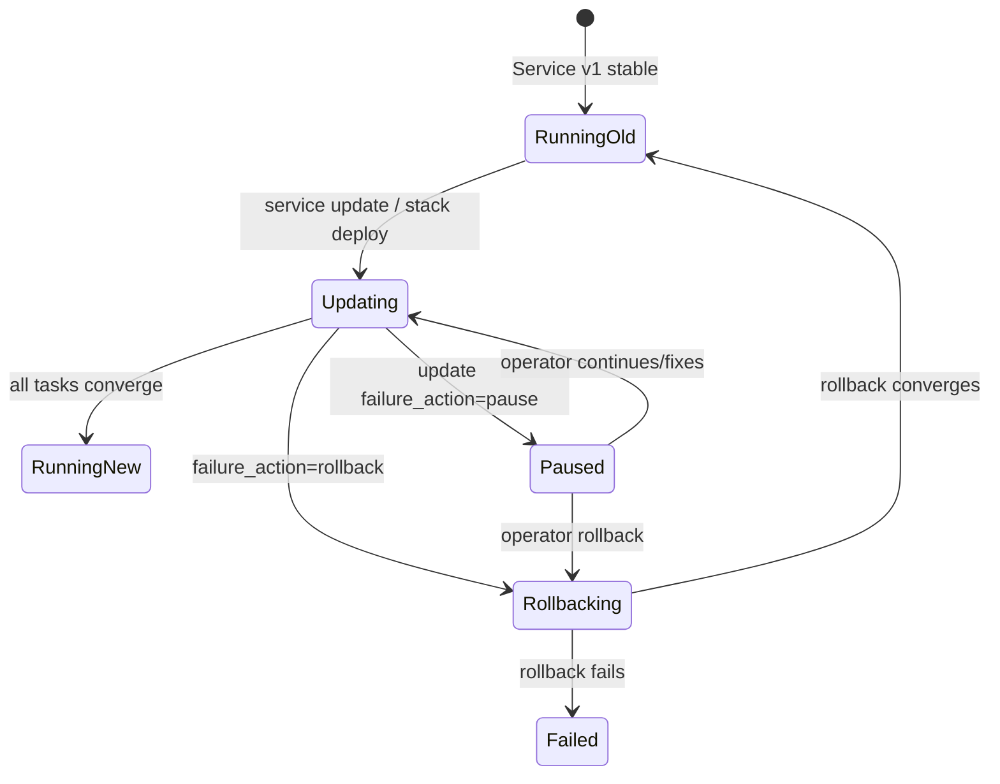
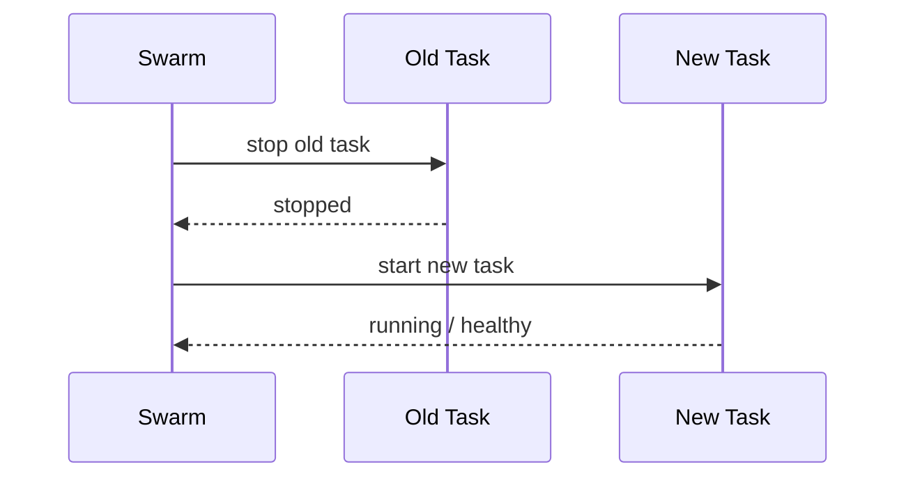
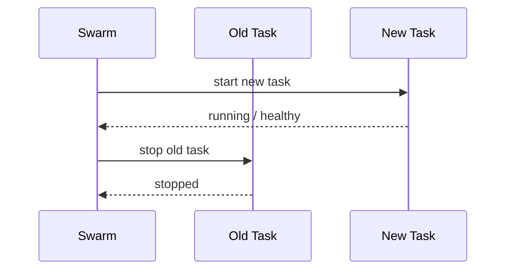
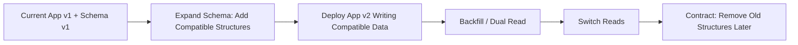
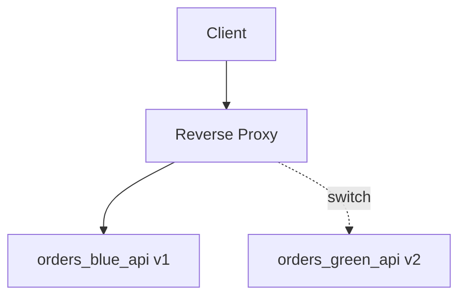
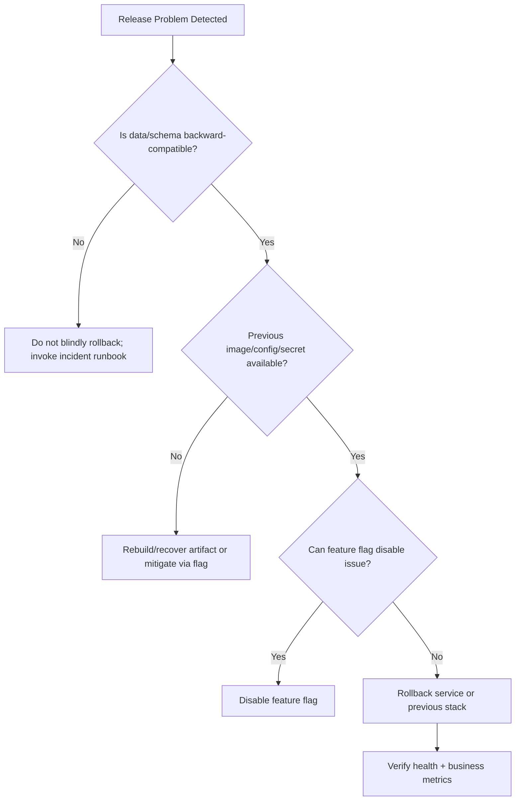
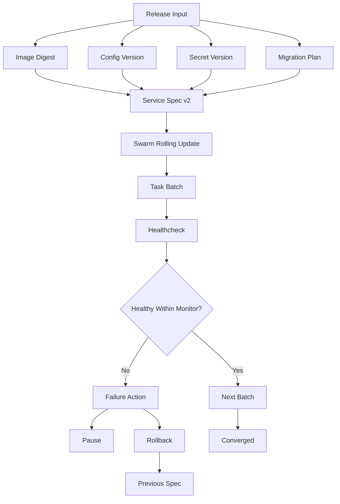

# Part 030 — Swarm Release Safety: Rolling Updates, Rollbacks, Health Gates, Failure Modes

> Target part ini: kita mampu mendesain rollout Swarm yang aman, observable, rollbackable, dan failure-aware. Kita tidak sekadar menjalankan `docker service update`, tetapi memahami update sebagai perubahan desired state yang memicu task replacement, health monitoring, failure action, dan rollback semantics.

Di Part 029 kita membahas secrets, configs, volumes, dan stateful services. Sekarang kita fokus pada proses release: bagaimana versi baru masuk ke cluster tanpa membuat outage yang tidak perlu.

Mental model utama:

> Release adalah state transition. Swarm mengubah service spec lama menjadi service spec baru dengan mengganti tasks sesuai update policy. Safety berasal dari kecilnya batch, jelasnya health signal, cukupnya monitor window, dan rollback path yang masih valid.

---

## 1. Kaufman Skill Deconstruction

Untuk menguasai Swarm release safety, pecah skill menjadi subskill berikut:

| Subskill | Yang Harus Dikuasai | Bukti Penguasaan |
|---|---|---|
| ServiceSpec transition | Bisa menjelaskan apa yang berubah saat `service update` atau `stack deploy` | Bisa membaca `docker service inspect` sebelum/sesudah update |
| Rolling update policy | Bisa mengatur `parallelism`, `delay`, `order`, `monitor`, `failure_action` | Update tidak mengganti semua task sekaligus tanpa alasan |
| Health gate | Bisa membuat healthcheck yang merepresentasikan readiness | Swarm bisa mendeteksi task buruk sebelum blast radius membesar |
| Rollback mechanics | Bisa memakai automatic/manual rollback dan memahami batasnya | Bisa restore versi service sebelumnya dengan evidence |
| Failure modeling | Bisa memprediksi image pull failure, boot failure, readiness failure, runtime failure | Runbook punya langkah diagnosis |
| Release governance | Bisa membuat preflight, deploy, observe, rollback, and post-release checklist | Deployment repeatable dan audit-friendly |

Kaufman deliberate practice:

1. Deploy service v1.
2. Update to v2 with safe rolling policy.
3. Introduce broken image.
4. Observe failure action.
5. Roll back manually.
6. Tune healthcheck and monitor window.
7. Repeat until diagnosis becomes automatic.

---

## 2. Release as a State Transition

A Swarm service has a desired state.

Before update:

```text
orders_api:
  image: registry.example.com/orders-api:2026.07.01
  replicas: 6
  config: api_config_v1
  secret: db_password_v1
```

After update:

```text
orders_api:
  image: registry.example.com/orders-api:2026.07.02
  replicas: 6
  config: api_config_v2
  secret: db_password_v1
```

Swarm reconciles by replacing tasks.



Key idea:

> Rollout safety is not one feature. It is a chain: image correctness, startup behavior, healthcheck quality, update batch size, monitor duration, rollback path, and operator response.

---

## 3. What Triggers a Swarm Update?

Swarm replaces tasks when relevant service specification changes.

Examples:

- image tag/digest changes
- command/entrypoint changes
- environment changes
- secret/config references change
- resource limits/reservations change
- network changes
- mounts change
- placement changes
- update/rollback policy changes may not always force task replacement by themselves

CLI examples:

```bash
docker service update \
  --image registry.example.com/orders-api:2026.07.02 \
  orders_api
```

Stack deploy example:

```bash
docker stack deploy -c stack.prod.yml orders
```

Force update without changing image:

```bash
docker service update --force orders_api
```

Use force carefully. It restarts tasks and can hide the fact that your deployment artifact did not actually change.

---

## 4. Rolling Update Parameters

Compose Deploy Specification supports `update_config`:

```yaml
deploy:
  update_config:
    parallelism: 1
    delay: 10s
    order: start-first
    failure_action: rollback
    monitor: 30s
    max_failure_ratio: 0.1
```

Meaning:

| Field | Meaning | Engineering Question |
|---|---|---|
| `parallelism` | how many tasks update at once | How much capacity can we lose or risk at once? |
| `delay` | wait between batches | How long until downstream metrics reveal pain? |
| `order` | `stop-first` or `start-first` | Do we need capacity preservation or strict port/state exclusivity? |
| `failure_action` | `pause`, `continue`, or `rollback` | What should happen when update fails? |
| `monitor` | duration to watch updated task for failure | How long does bad version take to reveal itself? |
| `max_failure_ratio` | tolerated failure ratio | How much failure is acceptable before action? |

Default values are rarely enough for serious production.

---

## 5. Stop-First vs Start-First

### 5.1 Stop-First

```yaml
update_config:
  order: stop-first
```

Sequence:



Good for:

- stateful singletons
- services with exclusive local port/resource
- jobs where duplicate instance is unsafe
- low traffic or maintenance window

Risk:

- capacity drops during update
- short downtime if replicas are low

### 5.2 Start-First

```yaml
update_config:
  order: start-first
```

Sequence:



Good for:

- stateless APIs
- preserving capacity
- services behind routing mesh or load balancer
- high availability rollout

Risk:

- temporary extra resource usage
- duplicate consumers/workers may process concurrently
- port conflict if using host publish mode
- unsafe if app cannot run old and new simultaneously

Rule:

> Use `start-first` for stateless request-serving services when capacity matters. Use `stop-first` for singleton/stateful/exclusive-resource services unless proven otherwise.

---

## 6. Parallelism and Blast Radius

For 10 replicas:

```yaml
parallelism: 1
```

Blast radius: one task at a time.

```yaml
parallelism: 2
```

Blast radius: two tasks at a time.

```yaml
parallelism: 10
```

Blast radius: all tasks at once. This is not rolling update; it is almost replacement-at-once.

Decision matrix:

| Service Type | Replicas | Suggested Parallelism | Reason |
|---|---:|---:|---|
| Critical public API | 6–30 | 1 or 10–20% | minimize blast radius |
| Internal API | 3–10 | 1–2 | balance speed/safety |
| Stateless worker | many | small percentage | avoid queue shock |
| Singleton scheduler | 1 | 1 + stop-first | no concurrency |
| Database | 1 | 1 + stop-first | only with planned maintenance |

---

## 7. Delay and Monitor Window

`delay` waits between batches. `monitor` watches an updated task for failure.

Bad policy:

```yaml
update_config:
  parallelism: 3
  delay: 0s
  monitor: 0s
  failure_action: continue
```

This can roll through a bad version before symptoms show.

Better:

```yaml
update_config:
  parallelism: 1
  delay: 15s
  monitor: 60s
  failure_action: rollback
```

Choose monitor based on failure reveal time:

| Failure Type | Reveal Time | Monitor Guidance |
|---|---:|---|
| image pull failure | immediate | short enough |
| process boot failure | seconds | 10–30s |
| migration/config failure | seconds-minutes | 30–120s |
| memory leak | minutes-hours | healthcheck alone insufficient |
| downstream error rate | seconds-minutes | combine with external monitoring |
| business correctness bug | delayed | requires canary/validation outside Swarm |

Swarm health gates are necessary but not sufficient.

---

## 8. Healthcheck as Release Gate

A healthcheck is only useful if it represents readiness.

Bad healthcheck:

```dockerfile
HEALTHCHECK CMD curl -f http://localhost:8080 || exit 1
```

This may pass even if app cannot reach database.

Better healthcheck:

```dockerfile
HEALTHCHECK --interval=10s --timeout=3s --retries=3 --start-period=30s \
  CMD curl -fsS http://localhost:8080/health/ready || exit 1
```

Readiness endpoint should check:

- HTTP server is accepting traffic
- required config loaded
- required secrets readable
- database connectivity if service cannot function without DB
- migration compatibility if relevant
- local dependency initialization complete

It should not check every optional downstream in a way that causes cascading failure.

---

## 9. Liveness vs Readiness in Swarm

Swarm has Docker health status, not Kubernetes-style separate liveness/readiness probes. You must design one healthcheck carefully.

Mental split:

| Probe Concept | Meaning | Swarm Approximation |
|---|---|---|
| Liveness | should process be restarted? | container exits or healthcheck fails depending restart behavior |
| Readiness | should receive traffic? | healthcheck + update monitor + external load balancer behavior |
| Startup | give app time to initialize | `start_period` in Dockerfile healthcheck |

Avoid healthchecks that cause self-inflicted restarts during temporary downstream blips unless that is truly desired.

---

## 10. Example Production API Stack Update Policy

```yaml
services:
  api:
    image: registry.example.com/orders-api:2026.07.02@sha256:abc123...
    ports:
      - target: 8080
        published: 8080
        protocol: tcp
        mode: ingress
    networks:
      - public
      - app
    deploy:
      replicas: 6
      update_config:
        parallelism: 1
        delay: 15s
        order: start-first
        failure_action: rollback
        monitor: 60s
        max_failure_ratio: 0
      rollback_config:
        parallelism: 1
        delay: 10s
        order: start-first
        failure_action: pause
        monitor: 60s
      restart_policy:
        condition: any
        delay: 5s
        max_attempts: 3
        window: 120s
```

Why this is safer:

- digest-pinned image reduces tag ambiguity
- one task at a time limits blast radius
- start-first preserves capacity
- monitor gives bad task time to fail
- automatic rollback limits outage
- rollback policy is also controlled

---

## 11. Worker Rollout Policy

Workers have different risk.

For queue consumers:

```yaml
services:
  worker:
    image: registry.example.com/orders-worker:2026.07.02
    deploy:
      replicas: 8
      update_config:
        parallelism: 2
        delay: 30s
        order: stop-first
        failure_action: rollback
        monitor: 90s
      rollback_config:
        parallelism: 2
        delay: 15s
        order: stop-first
```

Why `stop-first` may be better:

- prevents duplicate consumer behavior during overlap
- avoids temporary queue over-consumption
- safer for non-idempotent work

But if the worker is idempotent and capacity-sensitive, `start-first` may be fine.

Worker release checklist:

- Is job processing idempotent?
- Can old and new worker process same message type?
- Is schema backward-compatible?
- Does worker ack before or after durable side effects?
- What happens if a task is killed mid-message?

---

## 12. Singleton Scheduler Rollout Policy

Schedulers and cron-like services are often singleton.

```yaml
services:
  scheduler:
    image: registry.example.com/orders-scheduler:2026.07.02
    deploy:
      replicas: 1
      update_config:
        parallelism: 1
        order: stop-first
        failure_action: rollback
        monitor: 60s
      rollback_config:
        parallelism: 1
        order: stop-first
```

Why:

- two schedulers may fire duplicate jobs
- distributed lock may fail
- start-first overlap can violate business rules

If duplicate scheduler is safe because of a strong distributed lock, document it.

---

## 13. Database or Stateful Singleton Rollout Policy

For stateful singleton:

```yaml
services:
  postgres:
    image: postgres:16.4
    deploy:
      replicas: 1
      placement:
        constraints:
          - node.labels.orders.postgres == true
      update_config:
        parallelism: 1
        order: stop-first
        failure_action: pause
        monitor: 60s
      rollback_config:
        parallelism: 1
        order: stop-first
        failure_action: pause
```

Why not automatic rollback by default?

- data migration may be irreversible
- old binary may not read new data files
- rollback can corrupt or fail
- human decision may be safer

For databases, rollout is not merely container replacement. It is data format and recovery risk.

---

## 14. Manual Service Update Commands

Update image:

```bash
docker service update \
  --image registry.example.com/orders-api:2026.07.02 \
  orders_api
```

Update with policy:

```bash
docker service update \
  --image registry.example.com/orders-api:2026.07.02 \
  --update-parallelism 1 \
  --update-delay 15s \
  --update-order start-first \
  --update-failure-action rollback \
  --update-monitor 60s \
  orders_api
```

Rollback:

```bash
docker service rollback orders_api
```

Inspect update status:

```bash
docker service inspect orders_api --pretty
```

Watch tasks:

```bash
docker service ps orders_api --no-trunc
```

Logs:

```bash
docker service logs -f --tail=100 orders_api
```

---

## 15. Stack Deploy and Release Promotion

In production, prefer stack file as source of deployment state:

```bash
docker stack deploy -c stack.prod.yml orders
```

But ensure image exists in registry and all nodes can pull it.

Preflight:

```bash
docker context show

docker stack config -c stack.prod.yml

docker buildx imagetools inspect registry.example.com/orders-api:2026.07.02

docker secret ls

docker config ls
```

Deploy:

```bash
docker stack deploy -c stack.prod.yml orders
```

Observe:

```bash
docker stack services orders

docker stack ps orders --no-trunc

docker service logs -f orders_api
```

---

## 16. Digest Pinning and Update Ambiguity

Bad:

```yaml
image: registry.example.com/orders-api:latest
```

Better:

```yaml
image: registry.example.com/orders-api:2026.07.02
```

Best for reproducibility:

```yaml
image: registry.example.com/orders-api:2026.07.02@sha256:abc123...
```

Why:

- tag can be moved
- different nodes may pull at different times
- rollback evidence is unclear
- audit trails need exact artifact identity

Operational rule:

> In production, deploy immutable tags or digests. For regulated or high-trust systems, record digest in release evidence.

---

## 17. Failure Modes During Rolling Update

### 17.1 Image Pull Failure

Symptoms:

```text
No such image
manifest unknown
pull access denied
```

Likely causes:

- image not pushed
- tag typo
- private registry credentials missing
- node cannot reach registry
- architecture mismatch

Checks:

```bash
docker service ps orders_api --no-trunc

docker node ps <node> --no-trunc

docker buildx imagetools inspect <image>
```

### 17.2 Start Failure

Symptoms:

```text
task: non-zero exit
```

Likely causes:

- bad command/entrypoint
- missing env/config/secret
- permission error
- incompatible binary

Checks:

```bash
docker service logs orders_api --tail=200

docker inspect <container-id>
```

### 17.3 Healthcheck Failure

Symptoms:

```text
starting -> unhealthy
```

Likely causes:

- app not ready before timeout
- endpoint path wrong
- dependency unavailable
- config loaded incorrectly
- healthcheck too strict

Checks:

```bash
docker service ps orders_api --no-trunc

docker service logs orders_api --tail=200
```

### 17.4 Runtime Failure After Monitor Window

Symptoms:

- update completes
- minutes later error rate rises
- memory leak or slow downstream issue appears

Swarm may not auto-rollback because monitor window already passed.

Need external observability:

- metrics
- logs
- traces
- synthetic checks
- business KPIs
- alerting

### 17.5 Semantic Failure

Symptoms:

- service healthy
- requests succeed
- business behavior wrong
- data written incorrectly

Swarm cannot detect this. You need:

- contract tests
- canary validation
- shadow traffic
- feature flags
- business metrics
- post-release checks

---

## 18. Automatic Rollback Is Not Magic

`failure_action: rollback` can help when task update fails.

But rollback can fail if:

- previous image was deleted from registry
- old secret/config was removed
- database migration is not backward-compatible
- old version cannot read new data
- external dependency changed
- old image has vulnerability and was blocked by policy
- placement/resource constraints changed

Rollback readiness checklist:

- [ ] Previous image digest still available.
- [ ] Previous configs/secrets still available.
- [ ] Database schema is backward-compatible.
- [ ] Feature flags can disable new path.
- [ ] External API contract remains compatible.
- [ ] Rollback command is documented.
- [ ] Operators know when rollback is unsafe.

---

## 19. Schema Migration and Release Safety

Database migration is often the real release risk.

Unsafe pattern:

1. Deploy app v2.
2. App v2 applies destructive migration.
3. v2 fails.
4. Rollback app to v1.
5. v1 cannot read new schema.

Safer expand-contract pattern:



Rules:

- Add columns/tables before requiring them.
- Do not drop old columns in same release that stops using them.
- Support old and new app versions during rolling window.
- Make migration idempotent.
- Separate irreversible migrations from app rollout when possible.
- Rollback plan must include schema posture.

---

## 20. Old and New Version Compatibility

During rolling update, old and new versions coexist.

Therefore compatibility must be checked across:

| Interface | Compatibility Required? | Example |
|---|---:|---|
| Database schema | Yes | v1 and v2 both work during rollout |
| Queue message format | Yes | worker v1 can ignore v2 fields |
| API contract | Yes | clients not updated simultaneously |
| Cache key format | Usually | avoid cache poisoning |
| Session format | Usually | user sessions survive rollout |
| Config/secrets | Yes | old version does not crash on new config |

Mental model:

> Rolling update means temporary heterogeneity. Any assumption that “all services update instantly” is wrong.

---

## 21. Canary-Like Rollout in Swarm

Swarm does not provide a first-class canary object like some advanced deployment platforms, but you can approximate.

### 21.1 Separate Canary Service

```yaml
services:
  api:
    image: registry.example.com/orders-api:2026.07.01
    deploy:
      replicas: 6

  api_canary:
    image: registry.example.com/orders-api:2026.07.02
    deploy:
      replicas: 1
```

Then route small traffic subset through reverse proxy labels/config.

Risks:

- two services to manage
- routing complexity
- metrics must separate stable/canary
- config drift possible

### 21.2 One-Replica First Rollout

1. Scale service to desired replicas.
2. Set `parallelism: 1`.
3. Use long delay.
4. Observe after first task.
5. Continue or rollback.

This is simpler but less explicit than real canary traffic splitting.

---

## 22. Blue/Green Approximation

Swarm can approximate blue/green by deploying two stacks or two services:

```text
orders_blue_api
orders_green_api
```

Reverse proxy points to one color.



Benefits:

- fast traffic switch
- easy fallback if old stack remains alive
- full environment validation before cutover

Costs:

- double capacity during release
- database compatibility still required
- state migration remains hard
- routing/proxy config must be reliable

---

## 23. Feature Flags and Swarm Rollout

Feature flags reduce release risk by decoupling deployment from activation.

Deploy inactive code:

```yaml
environment:
  FEATURE_NEW_RECONCILIATION: "false"
```

Then enable after rollout via config/flag service.

Advantages:

- rollback can be logical, not full redeploy
- smaller blast radius
- easier progressive exposure
- safer for semantic failures

Risks:

- flag debt
- inconsistent behavior across tasks if flag refresh is not controlled
- flag service becomes critical dependency
- stale flags hide dead code

---

## 24. Release Evidence Bundle

For high-discipline engineering, every release should produce evidence.

Example:

```text
release-id: orders-api-2026.07.02
image: registry.example.com/orders-api:2026.07.02@sha256:abc123
stack-file: stack.prod.yml sha256:def456
configs:
  - orders_api_config_2026_07_v2
secrets:
  - orders_db_password_2026_07_v1
update-policy:
  parallelism: 1
  order: start-first
  failure_action: rollback
healthcheck: /health/ready
preflight: passed
post-release: passed
rollback-tested: yes/no
operator: <name/team>
time: 2026-07-01T10:00:00+07:00
```

This matters for:

- incident response
- audit
- compliance
- reproducibility
- postmortem quality

---

## 25. Preflight Checklist

Before deployment:

- [ ] Correct Docker context selected.
- [ ] Target swarm healthy.
- [ ] Manager quorum healthy.
- [ ] Nodes have enough CPU/memory/disk.
- [ ] Registry reachable from all nodes.
- [ ] Image exists and digest recorded.
- [ ] Required secrets exist.
- [ ] Required configs exist.
- [ ] Stack file renders correctly.
- [ ] Healthcheck is defined and meaningful.
- [ ] Update/rollback config exists.
- [ ] Previous image/config/secret still available.
- [ ] Database migration plan reviewed.
- [ ] Backward compatibility verified.
- [ ] Observability dashboard ready.
- [ ] Rollback command known.

Commands:

```bash
docker context show

docker node ls

docker service ls

docker stack config -c stack.prod.yml

docker buildx imagetools inspect registry.example.com/orders-api:2026.07.02

docker secret ls

docker config ls
```

---

## 26. Deployment Checklist

During deployment:

- [ ] Deploy from reviewed stack file.
- [ ] Watch service task replacement.
- [ ] Watch service logs.
- [ ] Watch health status.
- [ ] Watch external metrics.
- [ ] Confirm no unexpected node placement.
- [ ] Confirm old and new versions coexist safely.
- [ ] Stop rollout if failure is ambiguous.

Commands:

```bash
docker stack deploy -c stack.prod.yml orders

watch -n 2 'docker stack services orders'

watch -n 2 'docker service ps orders_api --no-trunc'

docker service logs -f --tail=100 orders_api
```

---

## 27. Post-Release Checklist

After deployment:

- [ ] All replicas converge to intended image.
- [ ] No tasks stuck in rejected/failed loop.
- [ ] Error rate stable.
- [ ] Latency stable.
- [ ] Saturation stable.
- [ ] Business metric stable.
- [ ] Logs free from new recurring exceptions.
- [ ] Old configs/secrets retained until rollback window ends.
- [ ] Release evidence stored.
- [ ] Ticket/change record updated.

Command to verify image per task:

```bash
docker service ps orders_api --no-trunc

docker service inspect orders_api --format '{{json .Spec.TaskTemplate.ContainerSpec.Image}}'
```

---

## 28. Rollback Procedure

Manual rollback:

```bash
docker service rollback orders_api
```

Watch rollback:

```bash
docker service ps orders_api --no-trunc

docker service inspect orders_api --pretty
```

Stack-level rollback is less direct than service rollback. If stack file changed, you can redeploy previous stack file:

```bash
docker stack deploy -c stack.prod.previous.yml orders
```

But this is only safe if previous dependencies still exist.

Rollback decision tree:



---

## 29. Rollback Is Not Always the Best First Move

Sometimes better first moves:

| Situation | Better First Move |
|---|---|
| Bad feature behind flag | disable flag |
| One bad node | drain node or reschedule |
| Registry pull issue | pause rollout and fix registry/auth |
| Bad config only | deploy corrected config |
| DB migration issue | stop writes, invoke data runbook |
| Downstream outage | pause rollout, avoid churn |
| Traffic spike | scale or rate limit |

Rollback is powerful but not universal.

---

## 30. Observability for Release Safety

Swarm can report task state, but production safety requires external signals.

Observe:

- task states
- container health
- service logs
- error rate
- latency percentiles
- CPU/memory saturation
- restart count
- queue lag
- DB connections
- downstream errors
- business KPIs

Release dashboard should answer:

1. Are new tasks healthy?
2. Are users impacted?
3. Is system saturation increasing?
4. Is error budget being consumed?
5. Are downstream dependencies stressed?
6. Is rollback safe?

---

## 31. Diagnosing Update Stuck in Paused State

Inspect:

```bash
docker service inspect orders_api --pretty

docker service ps orders_api --no-trunc
```

Look for:

- `UpdateStatus.State`
- `UpdateStatus.Message`
- rejected tasks
- failed tasks
- image pull errors
- healthcheck failures
- placement constraint failures

Options:

Continue after fix:

```bash
docker service update --detach=false orders_api
```

Rollback:

```bash
docker service rollback orders_api
```

Update with corrected image:

```bash
docker service update --image registry.example.com/orders-api:2026.07.02-fix1 orders_api
```

---

## 32. Release Safety for Config and Secret Changes

Changing config/secret reference can be as risky as changing image.

Example risky config update:

```yaml
configs:
  - source: orders_api_config_2026_07_v3
    target: /app/config/application.yml
```

Possible failures:

- YAML syntax error
- wrong endpoint
- missing required field
- incompatible flag
- references new secret not mounted

Treat config changes as releases:

- validate schema
- test config in staging
- version config name
- update one task at a time
- keep previous config during rollback window

Secret changes need even more care:

- backend credential must exist before rollout
- old credential must remain during rollback window
- app must read correct secret path
- rotation must be observable

---

## 33. Capacity During Start-First Update

`start-first` may temporarily require extra resources.

For 6 replicas and `parallelism: 1`, temporary max tasks can be 7.

For 20 replicas and `parallelism: 4`, temporary max tasks can be 24.

Preflight capacity check:

```text
temporary_capacity = current_replicas + update_parallelism
```

For each node:

- enough memory for extra task?
- enough CPU reservation?
- enough port availability?
- enough disk for image pull?
- enough DB connection capacity?

If not, use lower parallelism or stop-first.

---

## 34. Registry and Node Pull Behavior

During update, every node that runs new task needs the image.

Failure causes:

- tag not pushed
- digest not available
- private registry login missing
- node DNS cannot resolve registry
- TLS CA missing
- image architecture mismatch
- rate limiting

Pre-pull strategy:

```bash
for node in worker-1 worker-2 worker-3; do
  ssh "$node" docker pull registry.example.com/orders-api:2026.07.02
done
```

In mature environments, this is handled by CI/CD or node bootstrap.

---

## 35. Graceful Shutdown During Update

Rolling update stops old tasks. Application must handle termination.

Checklist:

- respond to SIGTERM
- stop accepting new work
- drain in-flight requests
- finish or requeue messages
- close DB connections
- flush logs/traces
- exit before stop timeout

Dockerfile:

```dockerfile
STOPSIGNAL SIGTERM
```

Service command should not wrap app in shell that swallows signals.

Bad:

```dockerfile
CMD java -jar app.jar
```

Depending on shell form, signal behavior can be weaker.

Better:

```dockerfile
ENTRYPOINT ["java", "-jar", "/app/app.jar"]
```

---

## 36. Worker Shutdown and Message Safety

For workers, shutdown semantics are data correctness.

Bad behavior:

1. Worker receives message.
2. Worker acknowledges message early.
3. Swarm stops task during update.
4. Side effect not completed.
5. Message lost.

Better behavior:

1. Worker receives message.
2. Performs idempotent side effect.
3. Commits result.
4. Acknowledges message after durable success.
5. On shutdown, stops receiving new messages and finishes current work or releases it.

Release policy and app behavior must align.

---

## 37. End-to-End Release Runbook

```mdx
# Runbook: Release orders-api <version>

## Inputs
- image: registry.example.com/orders-api:<version>@sha256:<digest>
- stack file: stack.prod.yml
- config: orders_api_config_<version>
- migration: yes/no
- feature flags: <list>

## Preflight
1. Confirm Docker context.
2. Confirm swarm health and manager quorum.
3. Confirm image digest exists.
4. Confirm secrets/configs exist.
5. Render stack config.
6. Confirm previous image/config/secret retained.
7. Confirm metrics dashboard ready.

## Deploy
1. Run docker stack deploy.
2. Watch docker service ps.
3. Watch logs and metrics.
4. Pause/rollback if update fails.

## Validate
1. Health endpoints pass.
2. Error rate stable.
3. Latency stable.
4. Queue lag stable.
5. Business smoke tests pass.

## Rollback
1. Disable feature flag if possible.
2. docker service rollback orders_api, or redeploy previous stack file.
3. Validate old version health.
4. Keep incident evidence.

## Cleanup
1. Keep old artifacts until rollback window closes.
2. Remove old configs/secrets after approved.
3. Store release evidence.
```

---

## 38. Practice Lab

### Lab 1 — Safe Rolling Update

1. Deploy `nginx:1.27` with 4 replicas.
2. Add healthcheck.
3. Update to another tag with `parallelism: 1` and `start-first`.
4. Watch `docker service ps`.

Expected learning:

- task replacement sequence
- start-first behavior
- update status

### Lab 2 — Broken Image Rollback

1. Deploy working service.
2. Update to invalid image tag.
3. Observe task rejection.
4. Set failure action rollback.
5. Verify service returns to old image.

Expected learning:

- image pull failure
- rollback trigger
- previous spec dependency

### Lab 3 — Healthcheck Failure

1. Deploy service with `/health/ready`.
2. Update to version whose health endpoint fails.
3. Observe update pause or rollback.
4. Tune `monitor` and `start_period`.

Expected learning:

- healthcheck as release gate
- monitor window importance

### Lab 4 — Config Rollout Failure

1. Deploy app with config v1.
2. Create config v2 with bad value.
3. Update service.
4. Observe failure.
5. Roll back to config v1.

Expected learning:

- config is release artifact
- rollback needs old config object

### Lab 5 — Worker Duplicate Processing Simulation

1. Deploy queue worker with `start-first`.
2. Observe overlap during update.
3. Change to `stop-first`.
4. Compare behavior.

Expected learning:

- rollout order affects correctness, not just availability

---

## 39. Common Anti-Patterns

| Anti-Pattern | Why It Fails | Better Approach |
|---|---|---|
| `latest` in production | tag ambiguity | immutable tag or digest |
| no healthcheck | Swarm cannot gate update meaningfully | readiness healthcheck |
| all-at-once update | maximum blast radius | small parallelism |
| short monitor window | failure appears after rollout completes | monitor based on failure reveal time |
| automatic rollback for DB migration | rollback may corrupt or fail | human-gated data runbook |
| delete old secret/config immediately | rollback impossible | retain through rollback window |
| start-first for non-idempotent worker | duplicate processing | stop-first or idempotency |
| no external metrics | semantic failures invisible | release dashboard |
| rollback untested | false safety | rollback drills |

---

## 40. Mental Model Summary



Final invariant:

> A safe release is not “new container starts”. A safe release is controlled replacement, bounded blast radius, meaningful health signal, observable behavior, and a rollback path that still exists.

---

## 41. What Good Looks Like

A production-ready Swarm release system has:

- immutable image identity
- versioned stack/config/secrets
- meaningful healthcheck
- small update parallelism
- explicit update and rollback policies
- compatibility across old/new versions
- schema migration discipline
- graceful shutdown behavior
- external monitoring
- release evidence
- rollback drill
- cleanup after rollback window

This is the operational difference between deployment as a command and deployment as a controlled state transition.

---

## 42. References

- Docker Docs — Apply rolling updates to a service: `https://docs.docker.com/engine/swarm/swarm-tutorial/rolling-update/`
- Docker Docs — Docker service update CLI reference: `https://docs.docker.com/reference/cli/docker/service/update/`
- Docker Docs — Docker service rollback CLI reference: `https://docs.docker.com/reference/cli/docker/service/rollback/`
- Docker Docs — Compose Deploy Specification: `https://docs.docker.com/reference/compose-file/deploy/`
- Docker Docs — Deploy services to a swarm: `https://docs.docker.com/engine/swarm/services/`
- Docker Docs — Deploy a stack to a swarm: `https://docs.docker.com/engine/swarm/stack-deploy/`
