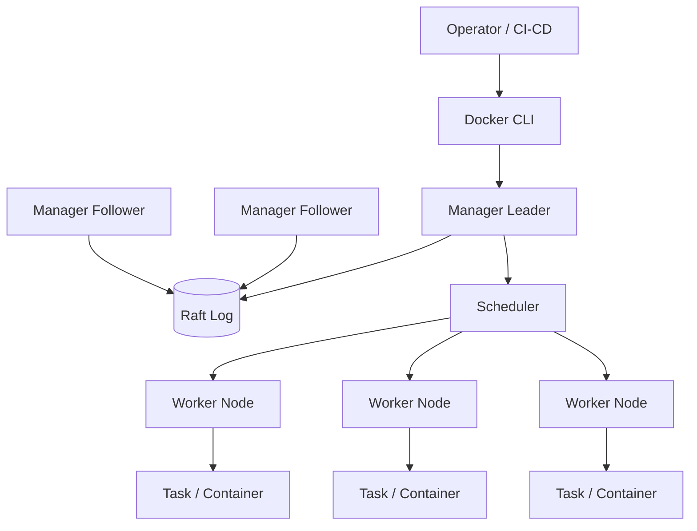
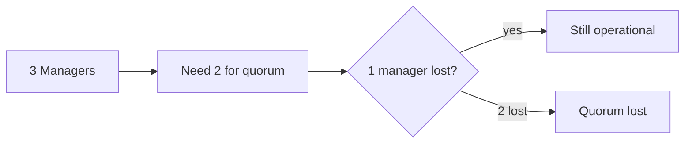
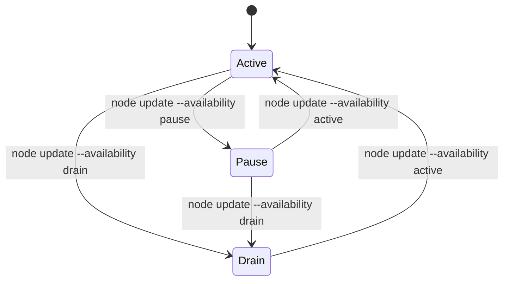
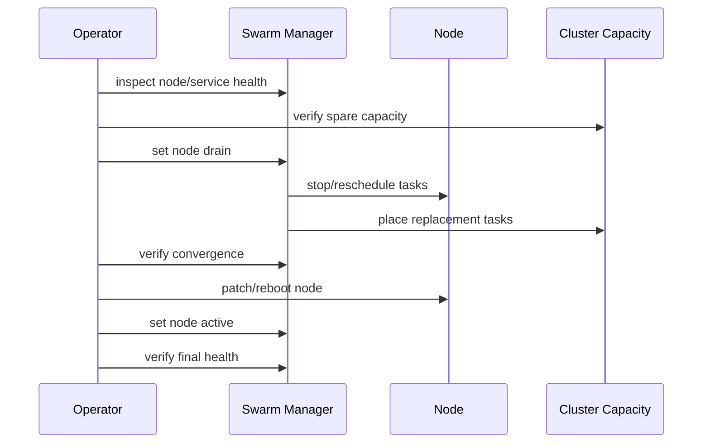
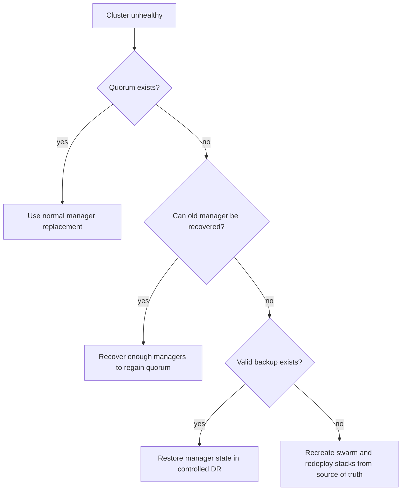
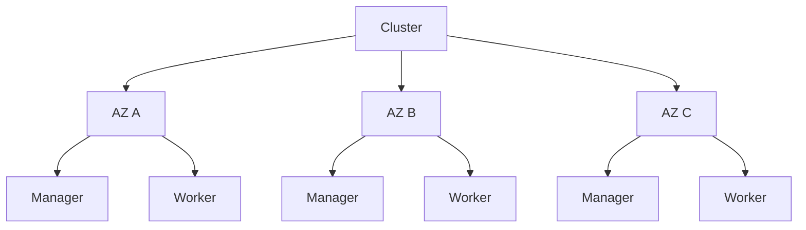

# Part 031 — Swarm Operations: HA Managers, Quorum, Backup, Upgrade, Node Drain

Part ini membahas Swarm bukan sebagai fitur CLI, tetapi sebagai **distributed control plane** yang harus dijaga agar tetap konsisten, tersedia, dan dapat dipulihkan.

Setelah memahami service, task, scheduler, overlay network, stack, secret/config, dan rolling update, pertanyaan berikutnya adalah:

> Bagaimana menjaga cluster Swarm tetap sehat saat node mati, manager hilang, server perlu maintenance, certificate berganti, versi Engine naik, atau control plane kehilangan quorum?

Di level top engineer, operasi Swarm bukan sekadar tahu command `docker node ls`. Yang penting adalah memahami **invariant cluster**:

1. manager menjaga cluster state;
2. Raft membutuhkan quorum;
3. worker menjalankan task tetapi tidak memutuskan desired state;
4. backup cluster state berarti backup Raft state manager;
5. maintenance harus dilakukan dengan drain dan capacity planning;
6. upgrade harus mempertahankan quorum dan service availability;
7. disaster recovery harus dilatih sebelum bencana terjadi.

---

## 1. Kaufman Deconstruction

Mengikuti pendekatan *The First 20 Hours*, skill “mengoperasikan Swarm production” kita pecah menjadi subskill kecil yang bisa dilatih cepat.

| Subskill | Target performa |
|---|---|
| Quorum reasoning | Bisa menentukan apakah cluster masih dapat menerima perubahan saat beberapa manager mati |
| Node lifecycle | Bisa mengubah node menjadi active, pause, drain, demote, promote, leave, remove tanpa merusak workload |
| Maintenance execution | Bisa melakukan patching host satu per satu tanpa downtime aplikasi yang didesain benar |
| Backup/restore | Bisa mengambil backup Swarm state dan memahami kapan restore aman dilakukan |
| Upgrade planning | Bisa menaikkan versi Docker Engine dengan urutan aman manager/worker |
| Certificate/autolock management | Bisa mengelola token, CA, cert rotation, dan unlock key |
| Failure recovery | Bisa membedakan worker failure, manager failure, quorum loss, service failure, network failure |

Prinsip Kaufman: jangan mulai dari seluruh dokumentasi. Mulai dari **operasi yang paling sering menyelamatkan produksi**:

1. inspect health cluster;
2. drain node;
3. restore capacity;
4. maintain quorum;
5. backup state;
6. recover dari failure simulasi;
7. upgrade terkontrol.

---

## 2. Swarm Control Plane Mental Model

Swarm control plane adalah kombinasi:

- manager node;
- Raft log;
- desired state store;
- scheduler;
- service/task reconciliation;
- membership management;
- PKI/certificate subsystem;
- API endpoint untuk orchestration.

Worker node hanya menjalankan task yang ditugaskan. Worker tidak memutuskan replika baru harus ditempatkan di mana.



Manager memiliki dua fungsi besar:

1. **control-plane state**: menerima deklarasi service/stack, menyimpan state cluster, memilih leader, menjaga konsistensi;
2. **scheduling/reconciliation**: membandingkan desired state dan observed state lalu membuat task baru, menghentikan task lama, reschedule jika perlu.

Worker memiliki fungsi:

1. menerima assignment task;
2. menjalankan container;
3. melaporkan status task;
4. ikut networking/data plane.

Implikasi operasional:

- worker failure memengaruhi workload capacity;
- manager failure memengaruhi kemampuan cluster berubah;
- quorum loss membuat cluster tidak bisa dipakai untuk update state normal;
- workload yang sudah berjalan bisa tetap berjalan, tetapi perubahan desired state tidak reliable tanpa quorum.

---

## 3. Manager Quorum: Invariant Paling Penting

Swarm manager memakai Raft untuk menjaga global state cluster. Konsekuensinya, cluster butuh **mayoritas manager aktif** untuk membuat keputusan.

Rumus mental model:

```txt
quorum = floor(manager_count / 2) + 1
```

| Jumlah manager | Quorum | Toleransi manager gagal |
|---:|---:|---:|
| 1 | 1 | 0 |
| 2 | 2 | 0 secara praktis |
| 3 | 2 | 1 |
| 4 | 3 | 1 |
| 5 | 3 | 2 |
| 7 | 4 | 3 |

Kenapa odd number disarankan? Karena 4 manager tetap hanya toleran 1 failure, sama seperti 3 manager, tetapi lebih mahal dan punya quorum lebih tinggi.

Untuk production kecil-menengah:

- 1 manager: hanya untuk lab/dev;
- 3 manager: baseline HA umum;
- 5 manager: cluster lebih penting atau multi-zone;
- 7 manager: jarang perlu, overhead konsensus naik.



Praktik penting:

1. jangan jalankan production Swarm dengan 2 managers;
2. jangan maintenance dua manager sekaligus pada cluster 3-manager;
3. jangan demote manager tanpa menghitung quorum;
4. jangan `docker swarm leave --force` di manager terakhir kecuali sedang recovery terencana;
5. pisahkan manager lintas availability zone bila infrastruktur mendukung.

---

## 4. Inspect Cluster Health

Sebelum mengubah apa pun, baca kondisi cluster.

```bash
# lihat status node
 docker node ls

# lihat detail node
 docker node inspect <node> --pretty

# lihat status swarm dari node lokal
 docker info

# lihat service global
 docker service ls

# lihat task service
 docker service ps <service>

# lihat stack
 docker stack ls
 docker stack services <stack>
 docker stack ps <stack>
```

Hal yang harus diperiksa:

| Check | Kenapa penting |
|---|---|
| Manager count | Menentukan quorum risk |
| Leader location | Menentukan node paling sensitif saat maintenance |
| Node availability | Active/pause/drain memengaruhi scheduling |
| Node reachability | Reachable/unreachable/down menunjukkan control-plane health |
| Task distribution | Memastikan drain/upgrade tidak menumpuk replika pada satu host |
| Service desired/current replicas | Mengindikasikan convergence |
| Pending/rejected tasks | Mengindikasikan resource/placement/network/image issue |

Contoh format review cepat:

```bash
docker node ls --format 'table {{.Hostname}}\t{{.Status}}\t{{.Availability}}\t{{.ManagerStatus}}'
```

Interpretasi:

```txt
Hostname   Status   Availability   ManagerStatus
mgr-1      Ready    Active         Leader
mgr-2      Ready    Active         Reachable
mgr-3      Ready    Active         Reachable
wrk-1      Ready    Active
wrk-2      Ready    Active
```

Cluster di atas sehat dari sisi quorum.

---

## 5. Node Availability: Active, Pause, Drain

Setiap node punya availability scheduling.

| Availability | Makna |
|---|---|
| `active` | Node boleh menerima task baru |
| `pause` | Node tidak menerima task baru, task lama tetap jalan |
| `drain` | Node tidak menerima task baru dan task lama dipindahkan jika service memungkinkan |

Command:

```bash
# hentikan scheduling task baru, tetapi jangan pindahkan task lama
 docker node update --availability pause <node>

# keluarkan workload dari node untuk maintenance
 docker node update --availability drain <node>

# aktifkan kembali node
 docker node update --availability active <node>
```

Mental model:



`pause` cocok untuk:

- mencegah task baru saat investigasi ringan;
- menahan node agar tidak menerima workload tambahan;
- capacity shaping sementara.

`drain` cocok untuk:

- patch host;
- reboot;
- mengganti disk;
- migrasi node;
- demote manager;
- menghapus node dari cluster.

Kesalahan umum:

```bash
# Salah: reboot worker aktif tanpa drain
sudo reboot
```

Yang lebih aman:

```bash
NODE=worker-2

docker node update --availability drain "$NODE"
docker node ps "$NODE"
# tunggu task pindah/selesai
# lakukan maintenance
# reboot / patch / replace

docker node update --availability active "$NODE"
```

---

## 6. Drain Semantics dan Capacity Planning

Drain bukan magic. Drain hanya berhasil bila cluster punya tempat untuk menjalankan replacement task.

Drain bisa gagal atau stuck jika:

1. resource reservation terlalu besar;
2. placement constraint terlalu sempit;
3. volume lokal hanya ada di node itu;
4. port publish host mode konflik;
5. image tidak bisa dipull node target;
6. secret/config/network tidak tersedia karena cluster bermasalah;
7. service global memang dirancang berjalan di semua active nodes.

Sebelum drain:

```bash
# lihat task di node
 docker node ps <node>

# lihat service yang mungkin terdampak
 docker service ps <service>

# cek constraints service
 docker service inspect <service> --format '{{json .Spec.TaskTemplate.Placement}}'

# cek reservations
 docker service inspect <service> --format '{{json .Spec.TaskTemplate.Resources}}'
```

Checklist kapasitas:

| Pertanyaan | Harus dijawab sebelum drain |
|---|---|
| Berapa replika di node target? | Untuk estimasi impact |
| Apakah service replicated punya replika > 1? | Untuk availability |
| Apakah ada single-replica critical service? | Drain bisa menyebabkan downtime |
| Apakah service stateful pakai local volume? | Bisa tidak bisa dipindahkan aman |
| Apakah ada `placement.constraints` ke node target? | Replacement mungkin pending |
| Apakah total reserved CPU/memory cukup di node lain? | Scheduler butuh capacity |

Pattern maintenance aman:



---

## 7. Manager Maintenance Without Losing Quorum

Manager maintenance lebih berisiko daripada worker maintenance.

Untuk cluster 3-manager:

- hanya satu manager boleh offline pada satu waktu;
- jangan maintenance leader dan follower bersamaan;
- setelah satu manager kembali, tunggu `Reachable` sebelum lanjut;
- verifikasi `docker node ls` dari manager lain.

Urutan aman:

```bash
# 1. lihat status manager
 docker node ls

# 2. drain manager yang akan dimaintenance
 docker node update --availability drain mgr-2

# 3. pastikan task pindah
 docker node ps mgr-2

# 4. patch/reboot host mgr-2

# 5. pastikan kembali reachable
 docker node ls

# 6. aktifkan kembali
 docker node update --availability active mgr-2
```

Catatan penting: manager bisa juga menjalankan task workload jika availability active. Banyak organisasi memilih:

- manager dedicated: manager tidak menjalankan app workload;
- manager mixed: manager juga worker untuk cluster kecil.

Untuk production yang lebih defensif, gunakan manager dedicated:

```bash
# drain manager agar tidak menjalankan application task
 docker node update --availability drain mgr-1
 docker node update --availability drain mgr-2
 docker node update --availability drain mgr-3
```

Trade-off:

| Model | Kelebihan | Kekurangan |
|---|---|---|
| Dedicated manager | Control plane lebih bersih dan stabil | Butuh node tambahan |
| Mixed manager/worker | Hemat resource | Workload noisy bisa ganggu manager |

---

## 8. Promote dan Demote Manager

Node bisa dipromosikan menjadi manager atau diturunkan menjadi worker.

```bash
# promote worker ke manager
 docker node promote worker-3

# demote manager ke worker
 docker node demote mgr-3
```

Sebelum promote:

- pastikan network latency rendah ke manager lain;
- pastikan disk stabil;
- pastikan host cukup aman;
- pastikan tidak menambah manager menjadi angka genap tanpa alasan kuat;
- pastikan node berada di failure domain yang benar.

Sebelum demote:

- hitung quorum setelah demotion;
- jangan demote leader tanpa rencana;
- drain jika node menjalankan workload sensitif;
- pastikan ada manager lain reachable.

Contoh salah:

```txt
Cluster: 3 managers
Action: demote 2 managers karena maintenance
Result: quorum hilang
```

Contoh benar:

```txt
Cluster: 3 managers
Action: demote 1 manager setelah promote worker lain menjadi manager dan cluster stabil
Result: quorum tetap aman
```

---

## 9. Manager Failure Scenarios

### 9.1 Satu manager mati pada cluster 3-manager

Status:

```txt
mgr-1 Leader
mgr-2 Reachable
mgr-3 Down
```

Dampak:

- quorum masih ada: 2/3;
- update service masih bisa dilakukan;
- jangan maintenance manager lain sampai mgr-3 pulih atau diganti.

Tindakan:

1. investigasi host mgr-3;
2. bila bisa dipulihkan, restore host dan tunggu reachable;
3. bila hilang permanen, remove dan join manager baru.

```bash
# setelah node benar-benar hilang dan tidak akan kembali
 docker node rm mgr-3

# dari manager aktif, ambil token manager
 docker swarm join-token manager
```

### 9.2 Dua manager mati pada cluster 3-manager

Status:

```txt
mgr-1 Leader? isolated
mgr-2 Down
mgr-3 Down
```

Dampak:

- quorum hilang;
- cluster tidak bisa membuat keputusan normal;
- service yang sudah jalan mungkin masih berjalan;
- update/scale/stack deploy tidak aman/tersedia.

Tindakan:

1. prioritaskan menghidupkan salah satu manager lama;
2. jangan langsung force new cluster kecuali recovery path dipahami;
3. gunakan backup hanya jika state lama hilang/korup dan prosedur DR sudah dipilih.

### 9.3 Manager disk corrupt

Dampak:

- Raft state lokal bisa rusak;
- node mungkin tidak bisa join ulang;
- jika quorum masih ada, replace manager lebih aman daripada repair manual.

Tindakan:

```bash
# pada manager sehat
 docker node rm <bad-manager>
 docker swarm join-token manager

# pada host pengganti
 docker swarm join --token <token> <manager-ip>:2377
```

---

## 10. Backup Swarm State

Swarm state penting karena berisi:

- service definitions;
- network definitions;
- secrets/configs metadata;
- Raft log;
- cluster membership;
- certificates/keys yang diperlukan control plane.

Backup dilakukan dari manager. Secara konsep, yang perlu dijaga adalah direktori state Docker Swarm pada manager.

High-level procedure:

1. pilih manager yang sehat;
2. hentikan Docker daemon di manager tersebut untuk snapshot konsisten;
3. backup state Swarm;
4. start Docker daemon lagi;
5. simpan backup di storage aman terenkripsi;
6. uji restore di environment latihan.

Contoh prosedur konseptual Linux:

```bash
# pilih salah satu manager
sudo systemctl stop docker

# backup swarm state
sudo tar -czf /secure-backup/swarm-state-$(date +%F).tgz /var/lib/docker/swarm

sudo systemctl start docker
```

Catatan:

- detail path dan prosedur harus mengikuti OS/package layout yang digunakan;
- jangan menganggap backup valid sebelum restore test;
- backup harus dilindungi seperti secret material;
- jika autolock aktif, unlock key juga harus dikelola aman;
- backup lama mungkin tidak kompatibel dengan perubahan cluster yang jauh lebih baru.

---

## 11. Restore dan Disaster Recovery

Restore bukan operasi harian. Restore adalah operasi krisis.

Skenario restore:

1. semua manager hilang;
2. Raft state rusak;
3. cluster control plane tidak bisa recover;
4. rebuild cluster dari backup lebih aman daripada manual repair.

Prinsip restore:

- restore ke manager replacement yang bersih;
- gunakan backup yang konsisten;
- jangan restore state lama ke cluster aktif yang masih punya quorum tanpa memahami konsekuensi split-brain;
- validasi service/network/secret setelah restore;
- pastikan worker rejoin atau node list dibersihkan.

DR decision tree:



Strategi production yang lebih sehat:

- jadikan Git/registry/secret manager sebagai source of truth aplikasi;
- Swarm backup sebagai source of truth cluster state;
- stack files harus bisa redeploy cluster baru;
- persistent data aplikasi harus punya backup sendiri, terpisah dari Swarm state.

Jangan mencampur:

```txt
Swarm state backup != database backup
Swarm secret backup != application data backup
Stack file backup != runtime state backup
```

---

## 12. Autolock dan Unlock Key

Swarm dapat dikunci agar manager memerlukan unlock key setelah Docker restart. Ini meningkatkan proteksi encryption key Raft state.

Contoh saat inisialisasi:

```bash
docker swarm init --autolock
```

Mengaktifkan pada cluster berjalan:

```bash
docker swarm update --autolock=true
```

Melihat unlock key:

```bash
docker swarm unlock-key
```

Rotate unlock key:

```bash
docker swarm unlock-key --rotate
```

Unlock manager setelah restart:

```bash
docker swarm unlock
```

Trade-off:

| Autolock aktif | Dampak |
|---|---|
| Lebih aman untuk key material | Manager butuh intervensi unlock setelah restart |
| Cocok untuk environment sensitif | Automation restart harus mengakomodasi unlock process |
| Melindungi state saat disk dicuri | Unlock key menjadi secret critical |

Operational rule:

- simpan unlock key di secret vault, bukan di wiki bebas;
- rotate setelah incident akses;
- pastikan on-call tahu prosedur unlock;
- uji restart manager dengan autolock di staging.

---

## 13. Certificate dan Token Management

Swarm memakai PKI internal untuk node identity. Ada beberapa material penting:

- join token worker;
- join token manager;
- node certificates;
- swarm CA;
- unlock key jika autolock aktif.

Melihat join token:

```bash
docker swarm join-token worker
docker swarm join-token manager
```

Rotate token:

```bash
docker swarm join-token --rotate worker
docker swarm join-token --rotate manager
```

Rotate CA:

```bash
docker swarm ca --rotate
```

Policy:

| Material | Sensitivitas | Rotasi |
|---|---|---|
| Worker token | Medium | Setelah exposure / scheduled |
| Manager token | High | Setelah exposure / manager onboarding incident |
| Unlock key | Very high | Setelah exposure / key custodian change |
| CA | Very high | Jarang, terencana, diuji |

Jangan kirim manager token via chat publik. Manager token berarti kemampuan menambahkan node yang ikut control plane.

---

## 14. Upgrade Docker Engine pada Swarm

Upgrade harus mempertahankan:

1. quorum;
2. service availability;
3. network compatibility;
4. rollback path;
5. observability selama proses.

Urutan defensif:

1. baca release notes versi target;
2. backup Swarm state;
3. validasi stack di staging;
4. upgrade worker satu per satu;
5. upgrade manager follower satu per satu;
6. upgrade leader terakhir atau biarkan leadership berpindah natural;
7. validasi service convergence;
8. monitor logs/events/metrics.

Worker upgrade:

```bash
NODE=worker-1

docker node update --availability drain "$NODE"
# patch Docker Engine di host worker-1
# restart daemon/host sesuai kebutuhan

docker node update --availability active "$NODE"
docker node ls
```

Manager upgrade:

```bash
NODE=mgr-2

docker node update --availability drain "$NODE"
# patch Docker Engine di manager follower
# restart daemon/host
# jika autolock aktif: docker swarm unlock

docker node ls
# tunggu Reachable

docker node update --availability active "$NODE"
```

Hal yang harus dihindari:

- upgrade semua manager bersamaan;
- upgrade tanpa backup;
- upgrade saat cluster sudah degraded;
- upgrade saat ada rolling deployment besar;
- upgrade tanpa memastikan registry/image pull berjalan;
- upgrade daemon sambil tidak ada monitoring events/logs.

---

## 15. Node Labels dan Operational Targeting

Node labels membantu scheduler dan operasi.

Tambah label:

```bash
docker node update --label-add zone=az-a worker-1
docker node update --label-add disk=ssd worker-1
docker node update --label-add workload=frontend worker-2
```

Gunakan di stack:

```yaml
services:
  api:
    image: registry.example.com/team/api:1.7.2
    deploy:
      placement:
        constraints:
          - node.labels.workload == app
        preferences:
          - spread: node.labels.zone
```

Governance label:

| Label | Contoh | Tujuan |
|---|---|---|
| `zone` | `az-a` | Spread HA |
| `disk` | `ssd` | Stateful/IO workload |
| `workload` | `frontend`, `batch` | Segmentation |
| `compliance` | `pci`, `internal` | Regulatory boundary |
| `gpu` | `true` | Hardware-specific placement |

Anti-pattern:

```txt
node.labels.role == important
```

Label harus menggambarkan property yang bisa diaudit, bukan opini kabur.

---

## 16. Capacity and Failure Domain Engineering

Cluster yang terlihat sehat bisa tetap gagal saat drain jika kapasitas spare tidak cukup.

Minimal capacity rule:

```txt
N+1 worker capacity = cluster tetap bisa menjalankan workload saat 1 worker hilang
N+1 manager quorum = cluster tetap bisa mengelola state saat 1 manager hilang
```

Untuk service critical:

- replicas minimal 2 atau 3;
- spread across zones/nodes;
- resource reservations realistis;
- healthcheck benar;
- rolling update parallelism kecil;
- persistent data punya strategi jelas.

Contoh placement spread:

```yaml
services:
  api:
    image: registry.example.com/api:2026.07.01
    deploy:
      replicas: 6
      placement:
        preferences:
          - spread: node.labels.zone
      resources:
        reservations:
          cpus: "0.25"
          memory: 256M
        limits:
          cpus: "1.0"
          memory: 768M
```

Model failure domain:



Jika satu AZ mati, masih ada 2 manager untuk quorum pada cluster 3-manager.

---

## 17. Service and Task Recovery During Node Failure

Saat worker mati:

1. manager mendeteksi node down;
2. task pada node itu dianggap failed/lost;
3. scheduler membuat replacement task bila service replicated;
4. replacement ditempatkan pada node yang memenuhi constraint dan capacity;
5. routing mesh/service discovery mengarah ke task aktif.

Yang harus dicek:

```bash
docker node ls
docker service ps <service> --no-trunc
docker service inspect <service> --pretty
```

Common diagnosis:

| Gejala | Kemungkinan sebab |
|---|---|
| Replacement task `Pending` | Tidak ada node sesuai constraint/resource |
| Task `Rejected` | Image pull gagal, mount invalid, secret/config missing |
| Task restart loop | App crash, healthcheck gagal, config salah |
| Service reachable sebagian | Network/routing/health issue |
| Semua task di satu node | Placement spread tidak ada atau capacity imbalance |

---

## 18. Operational Runbook: Worker Maintenance

```mdx-code-block
## Runbook: Drain and Patch Worker

1. Identify node:
   docker node ls

2. Inspect workload:
   docker node ps <node>

3. Check spare capacity:
   docker service ls
   docker service ps <critical-service>

4. Drain node:
   docker node update --availability drain <node>

5. Wait for convergence:
   docker service ls
   docker node ps <node>

6. Patch/reboot host.

7. Confirm node ready:
   docker node ls

8. Reactivate:
   docker node update --availability active <node>

9. Watch for regressions:
   docker service ps <critical-service>
   docker system events --since 10m
```

Exit criteria:

- node `Ready`;
- node `Active`;
- critical services desired=current;
- no unexpected restart loop;
- monitoring green.

---

## 19. Operational Runbook: Manager Replacement

Use case: manager node permanently lost, but quorum masih ada.

```bash
# 1. Dari manager sehat
 docker node ls

# 2. Remove lost manager jika tidak akan kembali
 docker node rm <lost-manager>

# 3. Ambil manager join token
 docker swarm join-token manager

# 4. Join node pengganti dari host baru
 docker swarm join --token <manager-token> <manager-ip>:2377

# 5. Verifikasi
 docker node ls
```

Checklist:

- quorum tidak hilang selama proses;
- manager baru berada di failure domain yang benar;
- disk/network stabil;
- Docker Engine version kompatibel;
- manager token dirotasi bila exposure risk.

```bash
docker swarm join-token --rotate manager
```

---

## 20. Operational Runbook: Quorum Risk Review

Sebelum maintenance manager:

```txt
Manager count: 3
Quorum: 2
Currently reachable: 3
Planned offline: 1
Reachable after action: 2
Result: safe, but no second manager maintenance until restored
```

Sebelum demotion:

```txt
Manager count: 5
Quorum: 3
Demote: 1
Manager count after: 4
New quorum: 3
If one more manager down: still 3 reachable? depends
```

Better approach:

- maintain odd manager count;
- promote replacement first;
- wait stable;
- demote old manager;
- remove old node.

---

## 21. Operational Runbook: Backup Validation Drill

Backup yang belum diuji belum layak disebut backup.

Drill outline:

1. create staging Swarm;
2. deploy test stack with secret/config/network/service;
3. take backup;
4. destroy manager state in lab;
5. restore backup according to documented procedure;
6. verify service definitions, secrets/configs, networks, node state;
7. redeploy if necessary;
8. document RTO/RPO observed.

Evidence yang harus dicatat:

| Evidence | Contoh |
|---|---|
| Backup timestamp | `2026-07-01T02:00:00Z` |
| Docker Engine version | `docker version` |
| Cluster ID | `docker info` |
| Unlock key location | Vault path, bukan key mentah |
| Restore duration | 18 minutes |
| Data excluded | DB volume backup handled separately |
| Validation result | service converged, secrets mounted |

---

## 22. Incident Patterns

### Pattern A — Drain menyebabkan outage

Root causes:

- service hanya 1 replica;
- tidak ada spare capacity;
- placement constraint hanya ke node itu;
- local volume tidak available di node lain;
- host mode port conflict.

Prevention:

- pre-drain check;
- minimum replicas;
- spread strategy;
- stateful placement plan;
- maintenance window for singletons.

### Pattern B — Quorum hilang saat patching

Root causes:

- patch dua manager sekaligus;
- cluster punya 2 managers;
- manager ketiga sudah degraded tapi diabaikan;
- tidak melihat `docker node ls` sebelum maintenance.

Prevention:

- manager count odd;
- maintenance one manager at a time;
- preflight quorum calculation;
- stop maintenance if any manager unreachable.

### Pattern C — Node kembali tetapi tidak menerima workload

Root causes:

- node masih `Drain`;
- labels hilang/berubah;
- disk pressure;
- Docker daemon unhealthy;
- network overlay issue.

Prevention:

- post-maintenance checklist;
- automated node label audit;
- daemon logs review;
- service convergence check.

### Pattern D — Restore berhasil tetapi app tidak pulih

Root causes:

- Swarm state restored, application data tidak;
- image tag sudah berubah di registry;
- secret/config external tidak cocok;
- DNS/TLS external dependency berubah.

Prevention:

- digest pinning;
- registry retention;
- data backup terpisah;
- environment reconstruction runbook.

---

## 23. Automation Boundaries

Automation membantu, tetapi control-plane operasi harus punya guardrail.

Good automation:

- preflight check quorum;
- block maintenance if manager unreachable;
- drain then wait convergence;
- collect diagnostics automatically;
- verify node active after patch;
- rotate tokens on schedule;
- backup and validate checksum;
- alert if node remains drain too long.

Dangerous automation:

- reboot all nodes in parallel;
- auto-demote manager without quorum check;
- auto-remove down nodes immediately;
- auto-restore backup without human decision;
- auto-rotate CA without staged validation.

Pseudo-logic safe drain:

```txt
function safeDrain(node):
  cluster = inspectCluster()
  if node.role == manager:
    assert cluster.reachableManagers - 1 >= quorum(cluster.managerCount)
  assert criticalServicesHaveEnoughReplicas()
  assert spareCapacityExists()
  setAvailability(node, drain)
  waitForConvergence(timeout)
  if not converged:
    collectDiagnostics()
    stopMaintenance()
```

---

## 24. Practice Lab

### Lab 1 — Build a 3-manager / 3-worker Swarm

Target:

- initialize Swarm;
- join 2 additional managers;
- join 3 workers;
- label nodes by zone;
- deploy replicated service.

Expected:

```bash
docker node ls
```

shows 3 managers and 3 workers.

### Lab 2 — Drain Worker

1. deploy service with 6 replicas;
2. drain one worker;
3. observe task rescheduling;
4. reactivate worker;
5. scale service.

Questions:

- Did tasks return automatically to the reactivated node?
- Why or why not?
- How would placement preferences affect redistribution?

### Lab 3 — Manager Failure

1. stop Docker daemon on one manager;
2. observe manager status;
3. deploy service update;
4. restart manager;
5. verify reachable.

Questions:

- Was quorum preserved?
- Could you update service while one manager was down?

### Lab 4 — Quorum Loss Simulation

Only in lab:

1. stop two managers in 3-manager cluster;
2. try `docker service update`;
3. observe behavior;
4. restore one manager;
5. validate cluster recovery.

Goal: feel the operational difference between worker loss and quorum loss.

### Lab 5 — Backup Drill

1. deploy service with secret/config;
2. take manager state backup;
3. document restore process;
4. perform restore in isolated lab;
5. verify cluster metadata.

---

## 25. Production Readiness Checklist

### Manager Topology

- [ ] Odd number of managers.
- [ ] Minimum 3 managers for production HA.
- [ ] Managers distributed across failure domains.
- [ ] No two-manager production cluster.
- [ ] Manager maintenance one at a time.

### Node Lifecycle

- [ ] Drain used before maintenance.
- [ ] Node availability checked after maintenance.
- [ ] Node labels audited.
- [ ] Capacity verified before drain.
- [ ] Stateful task placement reviewed.

### Backup/DR

- [ ] Swarm state backup documented.
- [ ] Backup encrypted and access controlled.
- [ ] Restore drill performed.
- [ ] Unlock key stored securely if autolock enabled.
- [ ] Application data backup separate from Swarm backup.

### Upgrade

- [ ] Release notes reviewed.
- [ ] Staging upgrade tested.
- [ ] Workers upgraded before managers or according to tested policy.
- [ ] Managers upgraded one at a time.
- [ ] Quorum preserved.
- [ ] Monitoring active during upgrade.

### Security Material

- [ ] Worker token rotated as needed.
- [ ] Manager token protected.
- [ ] Manager token rotated after exposure.
- [ ] CA rotation policy defined.
- [ ] Autolock decision documented.

---

## 26. Key Takeaways

Swarm operations is mostly about preserving control-plane invariants.

A strong engineer does not ask only:

> “Command apa untuk drain node?”

A strong engineer asks:

> “Jika node ini keluar, apakah quorum tetap ada, service tetap punya capacity, stateful workload tetap aman, dan rollback path tetap jelas?”

Operational maturity means:

1. quorum is calculated before action;
2. drain is normal, not emergency;
3. backup is tested, not assumed;
4. manager replacement is rehearsed;
5. upgrades preserve desired state and availability;
6. every action has preflight, execution, validation, and rollback.

---

## 27. References

- Docker Docs — Administer and maintain a swarm of Docker Engines: https://docs.docker.com/engine/swarm/admin_guide/
- Docker Docs — Manage nodes in a swarm: https://docs.docker.com/engine/swarm/manage-nodes/
- Docker Docs — Join nodes to a swarm: https://docs.docker.com/engine/swarm/join-nodes/
- Docker Docs — Raft consensus in swarm mode: https://docs.docker.com/engine/swarm/raft/
- Docker Docs — Lock your swarm to protect its encryption key: https://docs.docker.com/engine/swarm/swarm_manager_locking/
