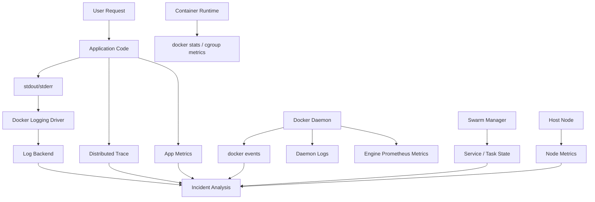
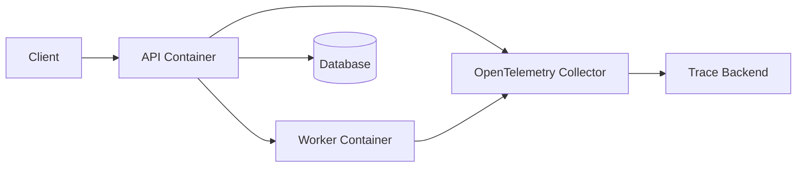
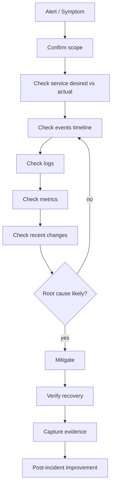

# Part 032 — Docker Observability: Logs, Metrics, Events, Traces, and Runtime Signals

Container yang berjalan bukan berarti sistem sehat.

Di production, pertanyaan yang lebih penting adalah:

- apa yang berubah;
- kapan berubah;
- container mana yang restart;
- task mana yang gagal placement;
- image mana yang sedang berjalan;
- node mana yang disk/CPU/memory/network-nya tertekan;
- service mana yang tidak mencapai desired state;
- log mana yang menunjukkan root cause;
- event mana yang menjelaskan transisi state;
- trace mana yang menunjukkan latency path aplikasi.

Observability Docker bukan satu tool. Ia adalah **sistem sinyal** dari beberapa lapisan:

1. application logs;
2. container stdout/stderr;
3. Docker logging driver;
4. daemon logs;
5. Docker events;
6. runtime metrics;
7. service/task state;
8. node metrics;
9. network/storage signals;
10. distributed traces dari aplikasi.

Tujuan part ini: membangun mental model dan runbook observability agar kita tidak debugging dengan tebakan.

---

## 1. Kaufman Deconstruction

Skill “observability container platform” kita pecah menjadi subskill yang bisa dilatih.

| Subskill | Target performa |
|---|---|
| Log pipeline design | Bisa memilih logging driver/local rotation/collector tanpa membuat disk penuh |
| Event interpretation | Bisa membaca `docker events` untuk state transition container/service |
| Metrics reading | Bisa membedakan CPU throttling, memory pressure, OOM, network IO, disk pressure |
| Service convergence diagnosis | Bisa melihat desired vs actual state pada Compose/Swarm |
| Label-based correlation | Bisa menghubungkan log, metric, service, task, image, commit, environment |
| Incident workflow | Bisa menjalankan alur observe → correlate → isolate → mitigate → learn |
| Tracing boundary | Bisa memahami apa yang Docker bisa/tidak bisa lihat dari transaksi aplikasi |

Observability adalah feedback loop untuk deliberate practice.

Tanpa observability, engineer hanya “menjalankan command”. Dengan observability, engineer bisa memperbaiki mental model karena setiap tindakan menghasilkan sinyal yang bisa diverifikasi.

---

## 2. Observability Layer Map



Docker memberi banyak sinyal, tetapi tidak semuanya cukup untuk memahami aplikasi.

Docker bisa melihat:

- container start/stop/restart;
- exit code;
- health status;
- image/tag/digest metadata;
- CPU/memory/network/block IO;
- events dari daemon;
- service/task desired state;
- log stdout/stderr;
- daemon error.

Docker tidak otomatis tahu:

- request latency per endpoint;
- database query lambat;
- business transaction gagal;
- distributed trace antar service;
- domain-level error;
- correctness hasil proses.

Maka observability production harus menggabungkan Docker signals dan application signals.

---

## 3. Logs: Contract Pertama Container

Best practice container logging: aplikasi menulis log ke `stdout` dan `stderr`. Docker logging driver mengambil stream tersebut.

Good logging contract:

```txt
application -> stdout/stderr -> Docker logging driver -> collector/backend -> query/alert
```

Bad logging contract:

```txt
application -> /var/log/app/app.log inside container -> forgotten writable layer -> disk full -> lost logs
```

Kenapa stdout/stderr?

1. sesuai model container process;
2. memudahkan `docker logs`;
3. memisahkan log dari filesystem app;
4. lebih mudah dikirim ke collector;
5. mengurangi kebutuhan bind mount log.

Contoh Java/Spring Boot:

```properties
logging.pattern.console=%d{yyyy-MM-dd'T'HH:mm:ss.SSSXXX} level=%level service=${SERVICE_NAME:-api} trace=%X{traceId:-} span=%X{spanId:-} logger=%logger{36} msg=%msg%n
```

Contoh Node.js structured log:

```json
{"ts":"2026-07-01T10:15:30.123Z","level":"info","service":"orders-api","env":"prod","trace_id":"abc","message":"order accepted"}
```

Structured log lebih mudah dikorelasikan daripada text bebas.

---

## 4. Docker Logging Drivers

Docker mendukung beberapa logging driver. Yang umum:

| Driver | Kegunaan | Catatan |
|---|---|---|
| `json-file` | Default klasik, log lokal JSON | Perlu rotation agar disk tidak penuh |
| `local` | Local logging lebih efisien untuk host | Direkomendasikan untuk mencegah disk exhaustion pada banyak kasus |
| `journald` | Integrasi systemd journal | Cocok di Linux systemd estate |
| `syslog` | Kirim ke syslog | Infrastruktur tradisional |
| `fluentd` | Kirim structured logs ke Fluentd | Cocok untuk pipeline aggregator |
| `gelf` | Graylog/Logstash ecosystem | Banyak dipakai untuk centralized logging |
| `awslogs` | CloudWatch Logs | AWS-centric deployment |
| `splunk` | Splunk backend | Enterprise logging |

Cek driver aktif:

```bash
docker info --format '{{.LoggingDriver}}'
```

Set default di `daemon.json`:

```json
{
  "log-driver": "local",
  "log-opts": {
    "max-size": "10m",
    "max-file": "5"
  }
}
```

Untuk `json-file` dengan rotation:

```json
{
  "log-driver": "json-file",
  "log-opts": {
    "max-size": "10m",
    "max-file": "3"
  }
}
```

Tanpa log rotation, container yang banyak menulis log bisa menghabiskan disk host.

---

## 5. Per-Service Logging Configuration

Pada Compose:

```yaml
services:
  api:
    image: registry.example.com/orders-api:1.4.2
    logging:
      driver: local
      options:
        max-size: "10m"
        max-file: "5"
```

Pada Swarm stack:

```yaml
services:
  api:
    image: registry.example.com/orders-api:1.4.2
    logging:
      driver: json-file
      options:
        max-size: "20m"
        max-file: "5"
    deploy:
      replicas: 4
```

Policy:

- default daemon logging harus aman;
- service boleh override bila ada alasan;
- log high-volume service wajib punya volume estimate;
- log multiline harus ditangani aplikasi/collector;
- log secret harus dilarang di source code review.

---

## 6. `docker logs` dan `docker service logs`

Untuk single container:

```bash
docker logs <container>
docker logs --tail 100 <container>
docker logs -f <container>
docker logs --since 30m <container>
docker logs --timestamps <container>
```

Untuk Swarm service:

```bash
docker service logs <service>
docker service logs -f <service>
docker service logs --tail 200 <service>
docker service logs --timestamps <service>
```

Untuk Compose:

```bash
docker compose logs
docker compose logs api
docker compose logs -f --tail 100 api
```

Interpretasi penting:

| Sinyal | Arti |
|---|---|
| Log berhenti tiba-tiba | Process mungkin crash, blocked, atau logging pipeline macet |
| Log restart berulang | App crash loop atau health failure/restart policy |
| Log hanya muncul di satu replica | Load balancing/task distribution issue |
| Log tidak muncul via `docker logs` | Logging driver tidak mendukung path tersebut atau app tidak menulis stdout/stderr |
| Log duplicate | App + collector + driver double shipping |

---

## 7. Daemon Logs

Container logs menjelaskan aplikasi. Daemon logs menjelaskan Docker Engine.

Gunakan daemon logs saat:

- container tidak bisa start;
- overlay network error;
- image pull gagal aneh;
- storage driver error;
- daemon restart;
- node unreachable;
- Swarm manager issue;
- plugin/driver failure.

Linux systemd:

```bash
journalctl -u docker.service --since "1 hour ago"
journalctl -u docker.service -f
```

Atau sesuai OS/package layout.

Jangan hanya melihat app logs saat masalahnya ada di Engine. Misalnya:

```txt
app container tidak start
app logs kosong
root cause ada di daemon logs: mount failed / permission denied / network plugin error
```

---

## 8. Docker Events: Timeline of State Changes

`docker events` memberi stream real-time dari daemon. Ini sangat berguna untuk debugging state transition.

```bash
docker events

docker events --since 30m

docker events --filter type=container

docker events --filter container=<container>

docker events --filter event=oom
```

Untuk Compose:

```bash
docker compose events

docker compose events --json
```

Events menjawab pertanyaan:

- container dibuat kapan;
- container start kapan;
- container die kapan;
- OOM event terjadi atau tidak;
- health_status berubah kapan;
- image ditarik kapan;
- network connect/disconnect kapan;
- volume create/remove kapan.

Contoh incident:

```txt
10:01 deploy started
10:02 container create
10:02 container start
10:03 health_status: unhealthy
10:04 container die exitCode=1
10:04 restart
10:05 health_status: unhealthy
```

Dari timeline itu, fokus debugging bukan network eksternal, melainkan startup/health/app crash.

---

## 9. Runtime Metrics: `docker stats`

`docker stats` memberi live stream resource usage container.

```bash
docker stats

docker stats <container>

docker stats --no-stream

 docker stats --format 'table {{.Name}}\t{{.CPUPerc}}\t{{.MemUsage}}\t{{.NetIO}}\t{{.BlockIO}}\t{{.PIDs}}'
```

Sinyal penting:

| Metric | Interpretasi awal |
|---|---|
| CPU % tinggi | CPU-bound, spin loop, traffic tinggi, GC pressure |
| Memory naik terus | leak, cache tak terkendali, load tinggi |
| Memory mendekati limit | risiko OOM |
| Net I/O tinggi | traffic/load atau retry storm |
| Block I/O tinggi | disk-bound, logging besar, DB workload |
| PIDs tinggi | process/thread leak, fork storm |

`docker stats` bagus untuk diagnosis cepat, tetapi bukan storage observability jangka panjang. Untuk production, metrics harus dikumpulkan ke time-series backend.

---

## 10. Docker Engine Metrics with Prometheus

Docker daemon dapat expose metrics dalam format Prometheus dengan `metrics-addr`.

Contoh `daemon.json`:

```json
{
  "metrics-addr": "127.0.0.1:9323",
  "experimental": false
}
```

Atau via dockerd flag:

```bash
dockerd --metrics-addr 127.0.0.1:9323
```

Prometheus scrape example:

```yaml
scrape_configs:
  - job_name: docker-engine
    static_configs:
      - targets:
          - "docker-host-1:9323"
          - "docker-host-2:9323"
```

Security note:

- jangan expose metrics endpoint sembarangan ke publik;
- batasi network access;
- gunakan firewall/security group;
- pertimbangkan reverse proxy/auth bila perlu;
- jangan menganggap metrics tidak sensitif.

---

## 11. Host Metrics Are Still Required

Docker metrics tidak menggantikan host metrics.

Wajib monitor:

| Host signal | Kenapa penting |
|---|---|
| CPU saturation | Semua container terdampak |
| Load average | Scheduler pressure |
| Memory available | OOM risk |
| Disk usage `/var/lib/docker` | Image/log/layer/volume exhaustion |
| Inode usage | Banyak file kecil bisa membuat disk “penuh” meski byte tersisa |
| Network errors/drops | Overlay/routing issue |
| Filesystem latency | DB/log workload impact |
| Docker daemon uptime | Engine restart impact |

Common alert:

```txt
/var/lib/docker disk > 80% warning
/var/lib/docker disk > 90% critical
inode usage > 85% warning
container restart rate > threshold
service desired replicas != running replicas for > 5m
manager quorum risk detected
```

---

## 12. Healthchecks as Runtime Signals

Healthcheck bukan pengganti observability, tetapi sinyal penting untuk scheduler dan operator.

Dockerfile:

```Dockerfile
HEALTHCHECK --interval=30s --timeout=3s --retries=3 CMD curl -fsS http://localhost:8080/actuator/health/readiness || exit 1
```

Compose:

```yaml
services:
  api:
    image: registry.example.com/api:1.2.0
    healthcheck:
      test: ["CMD", "curl", "-fsS", "http://localhost:8080/actuator/health/readiness"]
      interval: 30s
      timeout: 3s
      retries: 3
      start_period: 30s
```

Swarm service update relies heavily on task state and health behavior. Healthchecks help reveal whether a container is merely running or actually usable.

Good health endpoint:

- checks local process readiness;
- avoids expensive dependency fan-out;
- has timeout;
- returns quickly;
- distinguishes liveness/readiness where app framework supports it;
- does not mutate state.

Bad health endpoint:

- always returns OK;
- calls every downstream dependency deeply;
- performs slow query;
- requires external auth token;
- has no timeout;
- logs huge stack trace every probe.

---

## 13. Labels for Correlation

Labels adalah metadata murah yang membuat observability lebih kuat.

Image labels:

```Dockerfile
LABEL org.opencontainers.image.title="orders-api"
LABEL org.opencontainers.image.version="1.4.2"
LABEL org.opencontainers.image.revision="a1b2c3d4"
LABEL org.opencontainers.image.source="https://git.example.com/payments/orders-api"
```

Compose service labels:

```yaml
services:
  api:
    image: registry.example.com/orders-api:1.4.2
    labels:
      com.example.service: orders-api
      com.example.team: payments
      com.example.env: production
      com.example.tier: api
```

Swarm deploy labels:

```yaml
services:
  api:
    image: registry.example.com/orders-api:1.4.2@sha256:...
    deploy:
      labels:
        com.example.release: "2026-07-01.1"
        com.example.git-sha: "a1b2c3d4"
```

Correlation questions labels should answer:

- service apa ini;
- team pemilik siapa;
- environment apa;
- release versi berapa;
- git commit apa;
- image digest apa;
- compliance boundary apa;
- cost center apa.

Tanpa label, incident response sering dimulai dengan “container ini milik siapa?”. Itu tanda maturity rendah.

---

## 14. Service and Task State Observability in Swarm

Swarm memiliki observability control-plane sendiri.

Commands:

```bash
docker service ls

docker service ps <service>

docker service ps <service> --no-trunc

docker service inspect <service> --pretty

docker stack services <stack>

docker stack ps <stack> --no-trunc
```

Key signals:

| Signal | Meaning |
|---|---|
| `REPLICAS 3/3` | Desired and current aligned |
| `REPLICAS 2/3` | One task missing/pending/failed |
| `Pending` | Scheduler cannot place task yet |
| `Rejected` | Node rejected task due to config/image/mount/etc |
| `Failed` | Task ran and failed |
| `Shutdown` | Old task stopped, often from update/scale |
| `Preparing` | Pull/mount/setup phase |
| `Running` | Process running, not necessarily healthy |

Example investigation:

```bash
docker service ps payments_api --no-trunc
```

Possible output:

```txt
NAME              IMAGE                         NODE      DESIRED STATE  CURRENT STATE           ERROR
payments_api.1    registry/api:1.4.2             wrk-1     Running        Running 2 minutes ago
payments_api.2    registry/api:1.4.2             wrk-2     Running        Rejected 5 seconds ago  "No such image"
payments_api.3    registry/api:1.4.2             wrk-3     Running        Pending 1 minute ago
```

Interpretation:

- task 2 has image pull problem or registry auth problem;
- task 3 may have placement/resource constraint;
- app logs alone may not show anything because container never started.

---

## 15. Compose Observability

Compose is often used in dev/test/CI, but observability discipline still matters.

Useful commands:

```bash
docker compose ps

docker compose logs -f

docker compose events --json

docker compose top

docker compose config
```

`docker compose config` is observability for configuration resolution. It answers:

- what environment variables resolved;
- which files merged;
- which profiles active;
- what final network/volume/service model is.

Example CI diagnostic block:

```bash
docker compose ps
docker compose logs --tail 200
docker compose events --json | tail -100 || true
docker compose config > compose.resolved.yaml
```

Persist artifacts:

- resolved Compose config;
- container logs;
- test reports;
- service ps;
- events tail;
- inspect output for failed containers.

---

## 16. Distributed Tracing Boundary

Docker does not create distributed tracing automatically.

Tracing must be implemented at application/infrastructure level, for example with OpenTelemetry SDK/agent/collector.

Trace pipeline:



Docker helps by providing:

- service name via env/labels;
- stable network aliases;
- deployment metadata;
- container identity;
- runtime placement info.

Application must provide:

- trace ID;
- span ID;
- parent-child propagation;
- latency spans;
- error status;
- baggage/resource attributes;
- log correlation with trace ID.

Example env:

```yaml
services:
  api:
    image: registry.example.com/orders-api:1.4.2
    environment:
      OTEL_SERVICE_NAME: orders-api
      OTEL_RESOURCE_ATTRIBUTES: deployment.environment=prod,service.version=1.4.2
      OTEL_EXPORTER_OTLP_ENDPOINT: http://otel-collector:4317
```

---

## 17. Observability for Release Safety

Tie observability to release.

During deployment, watch:

```bash
docker service ps <service> --no-trunc

docker service logs -f <service>

docker events --since 10m
```

Release signals:

| Signal | Good | Bad |
|---|---|---|
| Task update | Old tasks replaced gradually | Mass failure/rejected tasks |
| Health | New tasks healthy | Healthcheck unstable |
| Logs | Expected startup messages | Exception loop |
| Metrics | Normal CPU/memory | Spike/leak/throttling |
| Error rate | Stable | Increase after rollout |
| Latency | Stable | Tail latency spike |
| Events | Predictable update events | OOM/die/restart storm |

Release gate example:

```txt
Proceed to next batch only if:
- service replicas match desired
- no task rejected
- healthchecks pass
- error rate <= baseline + threshold
- p95 latency <= threshold
- restart count stable
```

---

## 18. Observability Anti-Patterns

### Anti-pattern 1 — No log rotation

Symptom:

```txt
Disk full on /var/lib/docker
Docker daemon unstable
Containers fail to start
```

Fix:

- configure `local` or rotated `json-file`;
- ship logs centrally;
- alert disk usage;
- reduce noisy logs.

### Anti-pattern 2 — Logs only inside container file

Symptom:

```txt
docker logs empty
incident cannot find app logs
container removed and logs lost
```

Fix:

- log to stdout/stderr;
- add sidecar/agent only with explicit design;
- persist only intentional audit logs.

### Anti-pattern 3 — Healthcheck always OK

Symptom:

```txt
Swarm says service healthy but users fail
```

Fix:

- readiness checks real local serving state;
- expose app metrics;
- monitor external SLO.

### Anti-pattern 4 — Metrics without labels

Symptom:

```txt
CPU high but unknown service/team/release
```

Fix:

- label containers/services/images;
- propagate release metadata;
- enforce label policy in CI.

### Anti-pattern 5 — Trace IDs missing from logs

Symptom:

```txt
Trace shows slow request but logs cannot be found
```

Fix:

- inject trace ID into MDC/log context;
- structured logging;
- standard log fields.

---

## 19. Incident Workflow

Use a deterministic incident loop.



### Step 1 — Confirm scope

```bash
docker service ls
docker stack services <stack>
docker node ls
```

Ask:

- one service or many?
- one node or many?
- one stack or global?
- after deploy or without change?

### Step 2 — Events timeline

```bash
docker events --since 30m
```

Look for:

- restart storm;
- health_status unhealthy;
- OOM;
- image pull;
- network disconnect;
- volume mount failure.

### Step 3 — Service/task state

```bash
docker service ps <service> --no-trunc
```

Look for:

- rejected tasks;
- pending tasks;
- same node repeated failure;
- new image digest;
- current state error message.

### Step 4 — Logs

```bash
docker service logs --since 30m <service>
```

Look for:

- startup exception;
- config missing;
- migration failure;
- connection refused;
- permission denied;
- OOM-like symptoms;
- downstream timeout.

### Step 5 — Metrics

```bash
docker stats --no-stream
```

Look for:

- memory near limit;
- CPU pegged;
- block IO abnormal;
- network IO abnormal;
- PID count abnormal.

### Step 6 — Recent changes

```bash
docker service inspect <service> --pretty
```

Check:

- image version/digest;
- env vars;
- secrets/configs;
- update_config;
- resource limits;
- placement constraints.

---

## 20. Example: Debugging Restart Loop

Symptom:

```txt
service api shows 1/3 replicas
```

Commands:

```bash
docker service ps api --no-trunc
docker service logs --tail 200 api
docker events --since 15m --filter type=container
docker stats --no-stream
```

Possible evidence:

```txt
Task failed with exit code 1
Logs: Cannot connect to database
Events: container die -> restart repeatedly
Stats: memory normal
```

Root cause direction:

- not memory;
- not CPU;
- likely config/dependency/readiness issue.

Mitigations:

- rollback service;
- restore previous config;
- verify DB network/secret;
- deploy fix.

---

## 21. Example: Debugging OOM

Symptom:

```txt
container restarts randomly under load
```

Commands:

```bash
docker events --since 1h --filter event=oom
docker inspect <container> --format '{{.State.OOMKilled}} {{.State.ExitCode}}'
docker stats <container>
```

Evidence:

```txt
OOMKilled true
ExitCode 137
Memory usage near limit
```

Root cause possibilities:

- memory limit too low;
- heap max not aligned with cgroup limit;
- memory leak;
- traffic spike;
- cache unbounded;
- native memory/direct buffer leak.

Fix paths:

- align JVM/Node/Go runtime config with cgroup limit;
- increase memory limit only if capacity supports;
- profile memory;
- add backpressure;
- scale horizontally;
- reduce per-request memory.

---

## 22. Example: Debugging Disk Exhaustion

Symptom:

```txt
Docker cannot start containers
host disk full
```

Commands:

```bash
df -h
df -i
docker system df
du -sh /var/lib/docker/* 2>/dev/null | sort -h
```

Likely causes:

- unrotated logs;
- dangling images;
- unused build cache;
- large writable layers;
- volumes growing;
- test stacks not cleaned;
- registry mirror cache.

Mitigation:

```bash
# careful: review before prune in production
 docker system df
 docker builder prune
 docker image prune
```

For production, never run broad prune blindly without knowing whether images/volumes are needed.

Prevention:

- log rotation;
- disk alert;
- build cache policy;
- volume growth monitoring;
- CI cleanup;
- separate disk for Docker data root where appropriate.

---

## 23. Dashboard Design

A useful dashboard should answer operational questions quickly.

### Cluster dashboard

- managers reachable;
- quorum risk;
- workers ready;
- nodes drain/pause/active;
- services desired/current replicas;
- task failures/rejections;
- overlay network errors;
- Docker daemon uptime.

### Node dashboard

- CPU saturation;
- memory available;
- disk usage `/var/lib/docker`;
- inode usage;
- network drops/errors;
- Docker daemon logs/errors;
- container count;
- restart count.

### Service dashboard

- running replicas;
- restart rate;
- error rate;
- latency p50/p95/p99;
- CPU/memory per replica;
- log error volume;
- task placement distribution;
- deployed image digest/version.

### Release dashboard

- current release;
- previous release;
- task update progress;
- rollback status;
- health status;
- error/latency delta;
- event timeline.

---

## 24. Alert Design

Bad alert:

```txt
Container CPU > 80%
```

Why weak:

- may be normal under load;
- no duration;
- no service criticality;
- no user impact.

Better alert:

```txt
Critical service desired replicas != running replicas for 5 minutes
```

Better:

```txt
payments-api p95 latency > SLO threshold AND restart rate increased after release
```

Alert classes:

| Alert | Priority |
|---|---|
| Manager quorum risk | Critical |
| Critical service replicas below desired | Critical |
| Node disk `/var/lib/docker` > 90% | Critical |
| Container OOM repeated | High |
| Task rejected repeatedly | High |
| Healthcheck failure rate high | High |
| Log volume abnormal | Medium |
| Build cache disk growth | Medium |

Avoid paging humans for signals that are not actionable.

---

## 25. Observability as Compliance Evidence

For regulated or defensible systems, observability is also evidence.

You may need to prove:

- which image version ran;
- when deployment happened;
- who triggered deployment;
- whether rollback occurred;
- which nodes ran workload;
- whether secrets were mounted properly;
- whether container restarted;
- whether healthchecks failed;
- whether system recovered within target;
- whether incident timeline is complete.

Recommended evidence bundle per release:

```txt
release-id/
  stack.resolved.yaml
  image-digests.txt
  docker-service-inspect.json
  docker-service-ps-before.txt
  docker-service-ps-after.txt
  events-window.jsonl
  health-summary.txt
  sbom.json
  vulnerability-report.json
  rollback-plan.md
```

This turns Docker operations into auditable engineering, not tribal memory.

---

## 26. Practice Lab

### Lab 1 — Logging Driver and Rotation

1. configure `json-file` with small max-size/max-file in a lab host;
2. run a noisy container;
3. observe log file rotation;
4. compare with no rotation;
5. switch to `local` driver and compare behavior.

### Lab 2 — Events Timeline

1. run a container with failing command;
2. observe `docker events`;
3. add restart policy;
4. observe restart loop events;
5. add healthcheck and observe health events.

### Lab 3 — Service Failure in Swarm

1. deploy service with wrong image tag;
2. inspect `docker service ps --no-trunc`;
3. fix tag;
4. redeploy;
5. capture event timeline.

### Lab 4 — OOM Simulation

1. run memory-hungry container with memory limit;
2. trigger OOM;
3. inspect exit code and events;
4. adjust limit/runtime config;
5. document interpretation.

### Lab 5 — Release Observability

1. deploy version A;
2. deploy version B with rolling update;
3. collect service ps/logs/events;
4. rollback;
5. compare evidence before/after.

---

## 27. Production Readiness Checklist

### Logs

- [ ] Apps write to stdout/stderr.
- [ ] Logs are structured where practical.
- [ ] Log rotation configured.
- [ ] Central log collection available.
- [ ] Secret leakage checks exist.
- [ ] `docker service logs` usable for emergency diagnosis.

### Metrics

- [ ] Host metrics collected.
- [ ] Container metrics collected.
- [ ] Docker Engine metrics considered/configured.
- [ ] Service-level metrics exposed by app.
- [ ] Dashboards map node/service/release.
- [ ] Disk and inode alerts exist.

### Events

- [ ] `docker events` used in runbooks.
- [ ] Deploy windows capture events.
- [ ] OOM/restart/health events alert or are queryable.
- [ ] Compose CI captures events on failure.

### Tracing

- [ ] Service name standardized.
- [ ] Trace IDs included in logs.
- [ ] OpenTelemetry or equivalent configured.
- [ ] Trace backend available.
- [ ] Release metadata attached to traces.

### Swarm

- [ ] Service desired/current replicas monitored.
- [ ] Task rejection/pending alert exists.
- [ ] Node availability monitored.
- [ ] Manager quorum risk monitored.
- [ ] Deploy/rollback evidence captured.

---

## 28. Key Takeaways

Docker observability is not “run `docker logs` when something breaks”.

A production-grade mental model combines:

1. logs for narrative;
2. events for state transition timeline;
3. metrics for resource pressure;
4. service/task state for orchestration convergence;
5. traces for request path;
6. labels for correlation;
7. dashboards and alerts for operational feedback;
8. evidence bundles for release and incident defensibility.

The strongest debugging question is not:

> “Apa error log-nya?”

It is:

> “What changed, which layer observed it, what state transition happened, what resource pressure existed, which release introduced it, and what mitigation restores the invariant fastest?”

---

## 29. References

- Docker Docs — Configure logging drivers: https://docs.docker.com/engine/logging/configure/
- Docker Docs — JSON File logging driver: https://docs.docker.com/engine/logging/drivers/json-file/
- Docker Docs — Journald logging driver: https://docs.docker.com/engine/logging/drivers/journald/
- Docker Docs — Fluentd logging driver: https://docs.docker.com/engine/logging/drivers/fluentd/
- Docker Docs — docker system events: https://docs.docker.com/reference/cli/docker/system/events/
- Docker Docs — docker compose events: https://docs.docker.com/reference/cli/docker/compose/events/
- Docker Docs — Runtime metrics: https://docs.docker.com/engine/containers/runmetrics/
- Docker Docs — Collect Docker metrics with Prometheus: https://docs.docker.com/engine/daemon/prometheus/
- Docker Docs — dockerd daemon metrics option: https://docs.docker.com/reference/cli/dockerd/
- Docker Docs — docker service logs: https://docs.docker.com/reference/cli/docker/service/logs/
