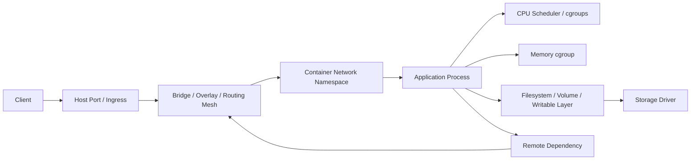
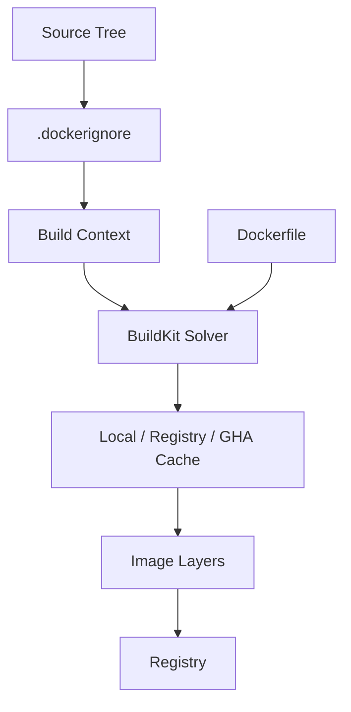
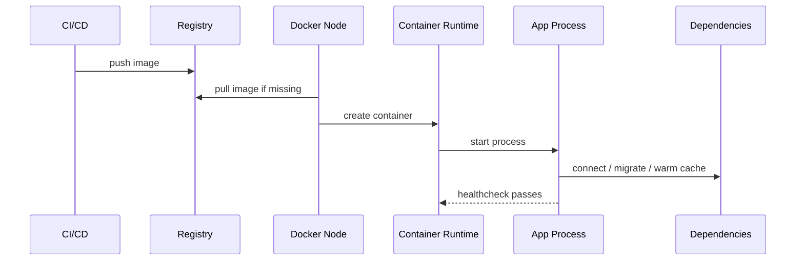
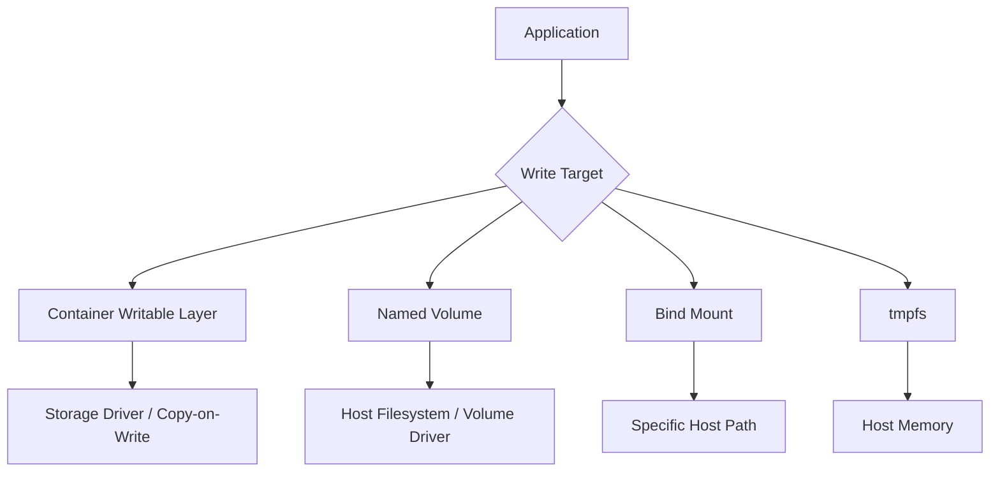

# Part 033 — Performance and Capacity Engineering: Build, Runtime, Network, Storage

Container yang benar secara fungsional belum tentu benar secara operasional.

Di lingkungan engineering nyata, pertanyaan pentingnya bukan hanya:

> “Apakah container bisa jalan?”

Melainkan:

- seberapa cepat image dibangun;
- seberapa cepat image dipull;
- seberapa cepat container cold start;
- seberapa besar memory baseline;
- kapan CPU throttling mulai terlihat;
- kapan OOM kill terjadi;
- apakah writable layer dipakai untuk data yang salah;
- apakah network path menambah latency;
- apakah registry menjadi bottleneck CI/CD;
- apakah node Swarm punya kapasitas cukup untuk desired state;
- apakah Compose test stack bisa jalan paralel tanpa saling mengganggu.

Performance engineering Docker adalah kemampuan membaca container sebagai sistem resource-constrained yang berjalan di atas host, network, storage, registry, dan scheduler.

Tujuan part ini: membuat kita mampu menganalisis, mengukur, dan merancang container platform dengan model kapasitas yang defensible.

---

## 1. Kaufman Deconstruction

Skill “Docker performance and capacity engineering” kita pecah menjadi subskill berikut.

| Subskill | Target performa |
|---|---|
| Build performance | Bisa mengurangi build time dengan cache, context, layer ordering, dan external cache |
| Image transfer performance | Bisa mengurangi pull time dengan image size, layer reuse, registry locality, dan digest discipline |
| Startup performance | Bisa membedakan cold start aplikasi, image pull, container create, dependency readiness |
| CPU capacity | Bisa membaca quota, throttling, shares, cpuset, dan service-level impact |
| Memory capacity | Bisa menetapkan limit/reservation, memahami RSS/cache, OOM, dan GC interaction |
| Storage IO | Bisa membedakan writable layer, volume, bind mount, tmpfs, dan storage-driver overhead |
| Network performance | Bisa menganalisis DNS, bridge NAT, overlay network, MTU, routing mesh, dan service discovery |
| Scheduler capacity | Bisa menilai Compose/Swarm placement, resource reservation, bin packing, dan headroom |
| Benchmarking discipline | Bisa membuat eksperimen yang repeatable dan tidak menipu |

Kaufman lens-nya sederhana:

1. **deconstruct** container performance ke beberapa jalur resource;
2. **learn enough to self-correct** dengan metric dan benchmark kecil;
3. **remove practice barriers** dengan lab script yang repeatable;
4. **practice deliberately** pada bottleneck paling mahal.

Performance bukan hafalan flag.

Performance adalah kemampuan membangun hipotesis, mengukur, memperbaiki, lalu memverifikasi.

---

## 2. Mental Model: Container Performance Path

Sebuah request yang masuk ke service container melewati beberapa boundary.



Ada beberapa observasi penting.

Pertama, container tidak menghapus hukum fisika.

CPU tetap terbatas. Memory tetap terbatas. Disk tetap bisa lambat. Network tetap punya latency. DNS tetap bisa gagal. Scheduler tetap bisa membuat antrean.

Kedua, container menambah boundary.

Boundary ini memberi isolation dan repeatability, tetapi juga menambah titik konfigurasi:

- cgroup CPU/memory;
- network namespace;
- NAT/iptables;
- overlay encapsulation;
- writable layer;
- volume mount;
- logging driver;
- registry pull;
- healthcheck interval;
- restart policy;
- Swarm placement.

Ketiga, bottleneck sering berpindah.

Setelah image dibuat kecil, bottleneck bisa pindah ke DB readiness. Setelah CPU limit dinaikkan, bottleneck bisa pindah ke DB connection pool. Setelah registry cache dibuat, bottleneck bisa pindah ke test fixture seeding.

Performance engineering berarti selalu bertanya:

> “Resource mana yang menjadi constraint saat ini, dan sinyal apa yang membuktikannya?”

---

## 3. Performance Taxonomy

Docker performance bisa diklasifikasikan menjadi lima domain.

| Domain | Contoh gejala | Sinyal utama |
|---|---|---|
| Build performance | CI lambat, cache miss, context besar | build log, layer cache hit, buildx output, context size |
| Distribution performance | deploy lambat, pull timeout, registry overload | image size, layer count, pull time, registry logs |
| Runtime performance | latency tinggi, throughput turun, restart | CPU/memory/stats, logs, app metrics |
| Platform performance | node penuh, service pending, noisy neighbor | Swarm service ps, node stats, reservations |
| Operational performance | debugging lama, rollback lambat, cleanup mahal | runbook time, MTTR, event timeline |

Engineer top-tier tidak mencampur kelima domain ini.

Contoh: “Docker lambat” adalah diagnosis buruk.

Diagnosis yang lebih baik:

- build lambat karena context 1.8 GB dan cache invalidated oleh `COPY . .` terlalu awal;
- deploy lambat karena image 2.1 GB dan registry berada di region berbeda;
- service lambat karena CPU quota 0.5 core menyebabkan throttling saat peak;
- node lambat karena writable layer penuh oleh log aplikasi;
- test lambat karena database fixture selalu rebuild tanpa volume cache.

---

## 4. Build Performance Model

Build performance ditentukan oleh empat hal besar:

1. build context;
2. Dockerfile instruction ordering;
3. cache availability;
4. builder topology.



### 4.1 Build Context Is a Performance Boundary

Build context adalah input build.

Jika context besar, setiap build membayar biaya:

- scanning file;
- transfer context ke builder;
- hashing metadata;
- cache key calculation;
- risiko secret ikut terkirim;
- risiko cache invalidated oleh file yang tidak relevan.

Checklist `.dockerignore` untuk repo serius:

```dockerignore
.git
.gitignore
.github
.idea
.vscode
node_modules
target
build
dist
coverage
*.log
.env
.env.*
*.pem
*.key
.DS_Store
```

Tetapi `.dockerignore` tidak boleh asal copy.

Ia harus mengikuti contract build.

Pertanyaan review:

- file apa yang benar-benar dibutuhkan untuk build;
- file apa yang hanya untuk development;
- file apa yang hanya untuk test;
- file apa yang berisi secret;
- file apa yang menyebabkan cache miss palsu;
- file apa yang terlalu besar untuk dikirim ke remote builder.

### 4.2 Instruction Ordering

Cache Docker bekerja paling baik ketika instruksi yang jarang berubah ditempatkan sebelum instruksi yang sering berubah.

Contoh buruk Node.js:

```dockerfile
FROM node:22-alpine
WORKDIR /app
COPY . .
RUN npm ci
RUN npm run build
CMD ["node", "dist/server.js"]
```

Masalah:

- perubahan README bisa invalidate `npm ci`;
- perubahan source kecil membuat dependency reinstall;
- context mungkin membawa `node_modules` lokal;
- build tidak deterministic jika lockfile tidak dipakai dengan benar.

Contoh lebih baik:

```dockerfile
FROM node:22-alpine AS deps
WORKDIR /app
COPY package.json package-lock.json ./
RUN npm ci

FROM deps AS build
COPY . .
RUN npm run build

FROM node:22-alpine AS runtime
WORKDIR /app
ENV NODE_ENV=production
COPY package.json package-lock.json ./
RUN npm ci --omit=dev
COPY --from=build /app/dist ./dist
USER node
CMD ["node", "dist/server.js"]
```

Mental model:

- dependency manifest berubah jarang;
- source berubah sering;
- runtime artifact harus lebih kecil dari build environment;
- dev dependency tidak perlu masuk runtime image.

### 4.3 BuildKit Cache Mount

BuildKit cache mount berguna untuk dependency manager yang punya cache internal.

Contoh Maven:

```dockerfile
# syntax=docker/dockerfile:1
FROM eclipse-temurin:21-jdk AS build
WORKDIR /src
COPY pom.xml .
RUN --mount=type=cache,target=/root/.m2 mvn -B -q dependency:go-offline
COPY src ./src
RUN --mount=type=cache,target=/root/.m2 mvn -B -q package -DskipTests
```

Cache mount bukan bagian dari final image.

Ia adalah cache builder.

Benefit:

- dependency download lebih cepat;
- layer final tetap bersih;
- cache bisa dipakai ulang antar build;
- CI bisa lebih stabil jika dipasangkan dengan external cache.

Risk:

- cache corrupt bisa menghasilkan failure sulit;
- cache terlalu besar bisa menekan disk builder;
- cache tidak boleh menyimpan secret;
- cache harus dibersihkan dengan policy.

### 4.4 External Cache

Di CI, local cache sering hilang karena runner ephemeral.

External cache bisa disimpan di:

- registry;
- GitHub Actions cache;
- local shared volume;
- remote builder.

Contoh buildx registry cache:

```bash
docker buildx build \
  --cache-from type=registry,ref=registry.example.com/team/app:buildcache \
  --cache-to type=registry,ref=registry.example.com/team/app:buildcache,mode=max \
  -t registry.example.com/team/app:${GIT_SHA} \
  --push .
```

Decision rule:

| Situation | Cache strategy |
|---|---|
| Developer laptop | local BuildKit cache + cache mount |
| Ephemeral CI runner | external registry/GHA cache |
| Multi-stage heavy build | `mode=max` may increase hit rate |
| Simple build | inline/min cache may be enough |
| Secret-heavy build | use secret mount, never ARG/COPY secret |

### 4.5 Build Performance Metrics

Ukuran yang perlu dicatat:

| Metric | Why it matters |
|---|---|
| Context size | Large context slows transfer and cache analysis |
| Total build time | CI feedback loop |
| Cache hit ratio | Dockerfile quality signal |
| Dependency download time | External network bottleneck |
| Final image size | Pull and startup cost |
| Intermediate cache size | Builder disk pressure |
| Layer count and size | Transfer and reuse behavior |
| SBOM/scanning time | Release gate capacity |

Contoh script sederhana:

```bash
#!/usr/bin/env bash
set -euo pipefail

IMAGE="local/app:perf-test"
START=$(date +%s)
docker build --progress=plain -t "$IMAGE" .
END=$(date +%s)

echo "build_seconds=$((END-START))"
docker image inspect "$IMAGE" --format 'image_size_bytes={{.Size}}'
docker history "$IMAGE" --no-trunc
```

Jangan hanya mengukur sekali.

Minimal bandingkan:

- clean build;
- warm build tanpa perubahan;
- warm build setelah source berubah;
- warm build setelah dependency berubah;
- CI build dengan external cache;
- CI build tanpa external cache.

---

## 5. Image Size and Pull Performance

Image size memengaruhi:

- registry storage;
- network egress;
- node cold start;
- CI/CD deploy time;
- rollback time;
- vulnerability surface;
- SBOM/scanning volume.

Tetapi “image kecil” bukan satu-satunya tujuan.

Image harus cukup kecil, cukup aman, cukup debuggable, dan cukup reproducible.

### 5.1 Layer Reuse

Docker image terdiri dari layers.

Layer yang sama bisa dipakai ulang oleh banyak image.

Implikasi:

- beberapa image besar bisa murah jika banyak layer shared;
- satu image kecil bisa mahal jika selalu unik;
- base image standardisasi bisa meningkatkan pull reuse;
- terlalu sering mengganti base image mengurangi cache di node.

Contoh platform standard:

| Workload | Base strategy |
|---|---|
| Java service | one blessed JRE base per major version |
| Node service | one blessed Node runtime base per major version |
| Go service | static binary + minimal runtime base |
| Debug build | separate debug image tag |
| Batch job | same runtime base if possible |

### 5.2 Tags vs Digests

Tag nyaman untuk manusia.

Digest aman untuk deployment.

Untuk production:

```yaml
services:
  api:
    image: registry.example.com/platform/api@sha256:...
```

Benefit digest:

- image identity immutable;
- audit lebih jelas;
- rollback tidak berubah karena tag digeser;
- supply chain evidence bisa dikaitkan ke artifact final.

Trade-off:

- file deployment kurang readable;
- perlu automation untuk update digest;
- multi-arch digest perlu dipahami dengan benar.

### 5.3 Pull-Time Model

Pull time kira-kira dipengaruhi oleh:

```text
pull_time ≈ registry_latency + auth + manifest_fetch + layer_download + layer_decompress + unpack
```

Bottleneck bisa ada di:

- registry region jauh;
- rate limit;
- authentication latency;
- TLS/proxy;
- layer terlalu besar;
- disk unpack lambat;
- node sudah disk pressure;
- parallel pull limit;
- network egress terbatas.

Runbook pull lambat:

```bash
time docker pull registry.example.com/team/app:sha-abc

docker image inspect registry.example.com/team/app:sha-abc --format '{{.Size}}'
docker history registry.example.com/team/app:sha-abc
```

Pertanyaan diagnosis:

- apakah layer sudah ada di node;
- apakah semua node menarik image yang sama bersamaan;
- apakah registry dekat dengan cluster;
- apakah registry mirror diperlukan;
- apakah image terlalu sering berubah di layer besar;
- apakah deploy memaksa pull walaupun digest sama.

---

## 6. Startup Performance

Startup container terdiri dari beberapa fase.



Startup lambat bisa disebabkan oleh:

- image pull lambat;
- container create lambat karena mount/network setup;
- app cold start lambat;
- JVM warmup;
- dependency connect timeout;
- migration terlalu berat;
- healthcheck terlalu lambat atau salah;
- DNS resolver lambat;
- disk IO lambat;
- logging backend blocking.

### 6.1 Startup Metrics

Pisahkan metric:

| Metric | Meaning |
|---|---|
| Pull duration | Registry + network + disk unpack |
| Container create duration | Runtime and host setup |
| Process start duration | Entrypoint to listening port |
| Readiness duration | App usable by downstream |
| Warmup duration | Performance reaches steady state |
| First successful request | End-to-end observable readiness |

Contoh instrumentation aplikasi:

```text
startup.phase=process_started t=0ms
startup.phase=config_loaded t=120ms
startup.phase=db_connected t=420ms
startup.phase=server_listening t=650ms
startup.phase=ready t=1450ms
```

Healthcheck tidak boleh menjadi startup blindfold.

Jika healthcheck hanya `curl /`, tetapi `/` tidak mengecek dependency kritis, service bisa dianggap sehat padahal belum siap menerima traffic nyata.

### 6.2 Java-Specific Note

Untuk Java service, startup performance sering dipengaruhi oleh:

- classpath scanning;
- dependency injection graph;
- JIT warmup;
- TLS truststore loading;
- DNS lookup;
- connection pool initialization;
- migration tool;
- logback/log4j initialization;
- CPU quota yang terlalu kecil.

Container CPU limit kecil dapat membuat startup Java terlihat “random lambat”.

Bukan karena Docker ajaib lambat, tetapi karena proses startup CPU-bound diberi quota terlalu sempit.

---

## 7. CPU Capacity Engineering

Docker dapat mengatur CPU melalui beberapa mekanisme:

- CPU shares;
- CPU quota/period;
- cpuset;
- Swarm resource limit/reservation;
- host scheduler;
- cgroup accounting.

### 7.1 CPU Shares vs CPU Quota

CPU shares adalah bobot relatif saat contention.

CPU quota adalah batas keras.

| Mechanism | Nature | Good for | Risk |
|---|---|---|---|
| shares | relative weight | fairness during contention | not a strict limit |
| quota | hard ceiling | predictable max CPU | throttling |
| cpuset | pin to CPU cores | isolation / NUMA control | imbalance |
| reservation | scheduler planning | Swarm placement | false safety if not measured |

Contoh:

```bash
docker run --cpus="1.5" my-app
```

Atau Compose:

```yaml
services:
  api:
    image: registry.example.com/api:sha
    deploy:
      resources:
        limits:
          cpus: "1.50"
        reservations:
          cpus: "0.50"
```

Catatan penting:

- field `deploy.resources` relevan untuk platform orchestrator seperti Swarm;
- Compose lokal punya perilaku yang perlu diverifikasi sesuai versi/engine;
- jangan menganggap YAML sama dengan enforcement tanpa inspeksi.

### 7.2 CPU Throttling

CPU throttling terjadi saat container ingin memakai CPU lebih dari quota.

Gejala:

- latency naik saat traffic tinggi;
- CPU container terlihat 100% dari limit;
- throughput tidak naik walau ada host core idle;
- GC pause meningkat;
- request timeout tanpa OOM;
- startup lambat.

Diagnosis:

```bash
docker stats

docker inspect my-container --format '{{json .HostConfig.NanoCpus}}'
```

Untuk analisis Linux lebih detail, baca cgroup stats di host.

Dengan cgroup v2, path tergantung sistem, tetapi pola observasinya:

```bash
cat /sys/fs/cgroup/<group>/cpu.stat
```

Cari sinyal seperti throttled periods/time jika tersedia.

### 7.3 CPU Capacity Envelope

Jangan hanya menetapkan CPU limit berdasarkan “feeling”.

Buat envelope:

| Load level | RPS | p95 latency | CPU | Error | Decision |
|---|---:|---:|---:|---:|---|
| idle | 0 | - | 0.05 core | 0 | baseline |
| normal | 100 | 80ms | 0.6 core | 0 | safe |
| peak | 300 | 180ms | 1.4 core | 0 | acceptable |
| stress | 500 | 800ms | throttled | 1% | saturation |
| overload | 800 | timeout | throttled | 10% | reject/scale |

Capacity decision:

```text
reservation = normal sustained CPU + safety margin
limit       = peak CPU + burst allowance
replicas    = required throughput / safe throughput per replica
headroom    = capacity for node failure + deploy surge + traffic spike
```

---

## 8. Memory Capacity Engineering

Memory container bukan hanya heap aplikasi.

Ada banyak komponen:

- application heap;
- native memory;
- thread stack;
- JIT/code cache;
- direct buffers;
- TLS buffers;
- filesystem page cache;
- shared libraries;
- runtime overhead;
- logging buffers;
- sidecar/helper process;
- kernel accounting.

### 8.1 Memory Limit and OOM

Jika container melewati memory limit, kernel bisa membunuh proses.

Docker akan menunjukkan container exit karena OOM.

Diagnosis:

```bash
docker inspect my-container --format '{{.State.OOMKilled}} {{.State.ExitCode}}'
docker stats my-container
```

Gejala OOM:

- exit code 137;
- restart loop;
- log berhenti mendadak;
- tidak ada stacktrace aplikasi;
- node log menunjukkan OOM kill;
- Swarm task terus diganti.

### 8.2 Memory Limit vs Application Runtime

Runtime modern sering membaca cgroup limit, tetapi tetap perlu konfigurasi sadar container.

Untuk Java:

```bash
JAVA_TOOL_OPTIONS="-XX:MaxRAMPercentage=70 -XX:InitialRAMPercentage=50"
```

Rule of thumb:

```text
container_memory_limit = heap + native + stack + direct + metaspace + page_cache + safety_margin
```

Jangan set heap sama dengan container limit.

Jika container limit 512 MiB dan heap max 512 MiB, masih ada native memory lain yang butuh ruang.

### 8.3 Memory Reservation

Reservation adalah sinyal ke scheduler.

Limit adalah batas keras runtime.

| Field | Meaning |
|---|---|
| reservation | capacity planning / scheduling intent |
| limit | enforcement upper bound |

Untuk Swarm, reservation penting agar scheduler tidak menempatkan terlalu banyak task pada node yang sama.

Tetapi reservation salah bisa berbahaya:

- terlalu rendah: overcommit, OOM saat peak;
- terlalu tinggi: bin packing buruk, banyak capacity idle;
- tidak ada: scheduler buta terhadap kebutuhan memory;
- limit tanpa telemetry: restart loop saat workload nyata.

### 8.4 Memory Practice Lab

Eksperimen sederhana:

```bash
docker run --rm -m 128m python:3.12-slim python - <<'PY'
chunks=[]
while True:
    chunks.append(bytearray(10 * 1024 * 1024))
    print(len(chunks) * 10, "MiB allocated")
PY
```

Lalu amati:

```bash
docker ps -a --latest
docker inspect $(docker ps -aq --latest) --format '{{.State.ExitCode}} {{.State.OOMKilled}}'
```

Tujuan lab bukan membuat OOM.

Tujuannya memahami failure signature.

---

## 9. Storage Performance Engineering

Storage Docker punya beberapa path.



### 9.1 Writable Layer Is Not a Database

Writable layer cocok untuk ephemeral runtime data.

Ia tidak cocok untuk:

- database durable storage;
- long-lived logs;
- large uploads;
- persistent cache penting;
- shared state;
- backup target;
- audit archive.

Alasan:

- hilang saat container dihapus;
- lebih sulit dikelola;
- bisa lebih lambat karena copy-on-write;
- tidak mudah dipindah;
- membuat disk pressure sulit dilacak;
- tidak punya lifecycle governance.

Docker storage driver memang dioptimalkan untuk efisiensi layer, tetapi writable layer dapat lebih lambat dari native filesystem terutama untuk workload write-heavy.

### 9.2 Volume vs Bind Mount vs tmpfs

| Mechanism | Performance profile | Use case | Risk |
|---|---|---|---|
| named volume | managed by Docker, generally good for persistent data | DB dev/test, app data | locality, backup needed |
| bind mount | direct host path | source code, config dev | host coupling, permission, security |
| tmpfs | memory-backed | ephemeral secrets/cache/temp | memory pressure, lost on stop |
| writable layer | CoW, ephemeral | small transient files | slow/write-heavy, hidden growth |

### 9.3 Database in Container

Database container bisa valid untuk:

- local development;
- integration testing;
- ephemeral environment;
- small internal deployment with clear backup;
- controlled single-host setup.

Database container berisiko untuk:

- multi-node Swarm tanpa shared storage strategy;
- local volume tanpa placement constraint;
- no backup/restore drill;
- heavy write workload pada wrong storage path;
- accidental redeploy to another node;
- unclear ownership of data lifecycle.

Swarm stateful service rule:

```text
Stateful service requires identity + storage locality + backup + restore + maintenance policy.
```

Jika salah satu tidak ada, service belum production-ready.

### 9.4 Storage IO Diagnosis

Sinyal storage bottleneck:

- request latency tinggi saat write;
- CPU rendah tetapi latency tinggi;
- DB checkpoint lambat;
- log write blocking;
- disk util tinggi di host;
- container writable layer tumbuh besar;
- `docker system df` menunjukkan disk pressure;
- image prune/build cache prune sering diperlukan.

Command baseline:

```bash
docker system df
docker system df -v

docker inspect my-container --format '{{json .Mounts}}'
docker diff my-container

docker stats --no-stream
```

Host tools:

```bash
df -h
du -sh /var/lib/docker
lsblk
iostat -xz 1
```

`iostat` bukan Docker-specific, tetapi sering menjelaskan root cause yang Docker CLI tidak bisa lihat.

---

## 10. Network Performance Engineering

Network container punya beberapa mode dan overhead.

| Path | Typical overhead | Notes |
|---|---|---|
| same container process | none | in-process only |
| same bridge network | low | container DNS + bridge |
| host published port | NAT/proxy path | depends on platform |
| host network | lower isolation | Linux only behavior differs from Desktop |
| overlay network | encapsulation + routing | cross-node Swarm |
| routing mesh | extra hop possible | convenient but can add path complexity |
| external LB direct host mode | simpler data path | requires LB/node awareness |

### 10.1 DNS Latency

Docker service discovery is convenient, but DNS can become hidden latency.

Gejala:

- request pertama lambat;
- intermittent connection failure;
- startup race;
- service name resolves but app not ready;
- DNS works in one network but not another;
- container uses host DNS with corporate proxy issues.

Debug:

```bash
docker exec -it api getent hosts db
docker exec -it api nslookup db || true
docker exec -it api cat /etc/resolv.conf
```

Minimal image mungkin tidak punya `nslookup`.

Gunakan debug container di network yang sama:

```bash
docker run --rm -it --network myproject_default nicolaka/netshoot
```

### 10.2 Port Publishing Cost

Port publishing berguna untuk expose service ke host.

Tetapi internal service-to-service call dalam Compose/Swarm sebaiknya memakai service name dan internal port, bukan published port.

Buruk:

```text
api -> localhost:5432
api -> host.docker.internal:5432
api -> published-host-port
```

Lebih baik:

```text
api -> db:5432
api -> redis:6379
api -> broker:5672
```

Published port adalah external contract.

Internal network adalah service graph contract.

### 10.3 Overlay Network and MTU

Swarm overlay menambah encapsulation.

Jika underlay network punya MTU kecil, overlay bisa mengalami fragmentation atau packet loss.

Gejala:

- request kecil berhasil, payload besar gagal;
- TLS handshake intermittent;
- service antar-node lambat;
- healthcheck pass tapi workload besar gagal;
- masalah hanya terjadi di cross-node, bukan same-node.

Diagnosis:

```bash
docker network inspect my-overlay
ping -M do -s 1472 target
tracepath target
```

Tidak semua image punya `ping`/`tracepath`; gunakan debug image.

### 10.4 Routing Mesh vs Host Publish Mode

Routing mesh memudahkan: koneksi ke published port di node mana pun bisa diarahkan ke task service.

Tetapi untuk performance dan predictability, kadang host mode lebih tepat.

| Requirement | Better fit |
|---|---|
| convenience / simple ingress | routing mesh |
| external LB controls traffic | host publish mode |
| preserve source locality | host publish mode |
| avoid extra hop | host publish mode |
| small cluster, low traffic | routing mesh acceptable |

Decision jangan dogmatis.

Ukur path latency dan failure mode.

---

## 11. Logging Performance and Disk Pressure

Logging sering dilupakan sebagai performance path.

Aplikasi menulis stdout/stderr.

Docker logging driver mengumpulkan.

Backend menyimpan/mengirim.

Jika log terlalu besar:

- disk host penuh;
- container write blocked;
- daemon terbebani;
- log retrieval lambat;
- incident makin sulit;
- build/cache/image bisa gagal karena disk pressure.

### 11.1 Log Volume Budget

Tentukan budget:

```text
log_bytes_per_request × requests_per_second × seconds_per_day × replicas
```

Contoh:

```text
800 bytes/request × 100 RPS × 86400 × 6 replicas
= 41,472,000,000 bytes/day
≈ 41 GB/day
```

Tanpa sampling, rotation, dan retention, log bisa menjadi bottleneck.

### 11.2 Log Rotation

Untuk Docker `json-file`, atur rotation.

Contoh daemon config:

```json
{
  "log-driver": "local",
  "log-opts": {
    "max-size": "10m",
    "max-file": "5"
  }
}
```

Atau per service Compose:

```yaml
services:
  api:
    image: registry.example.com/api:sha
    logging:
      driver: local
      options:
        max-size: "10m"
        max-file: "5"
```

Rule:

- stdout/stderr untuk event log;
- bukan untuk payload besar;
- bukan untuk audit archive utama tanpa backend;
- bukan untuk debug-level permanen;
- bukan untuk PII tanpa governance.

---

## 12. Compose Capacity Engineering

Compose biasanya single-host.

Capacity-nya ditentukan oleh host laptop/VM/server.

Masalah umum:

- semua service jalan walau tidak dibutuhkan;
- bind mount lambat di Desktop;
- database volume tumbuh tanpa cleanup;
- logs memenuhi disk;
- test stack paralel bentrok port/nama volume;
- service memory default terlalu tinggi;
- hot reload watcher memakan CPU.

### 12.1 Profiles as Capacity Control

Gunakan profiles untuk service opsional.

```yaml
services:
  api:
    build: .

  postgres:
    image: postgres:16

  kafka:
    image: bitnami/kafka:latest
    profiles: ["messaging"]

  mailhog:
    image: mailhog/mailhog
    profiles: ["devtools"]
```

Command:

```bash
docker compose up -d
COMPOSE_PROFILES=messaging docker compose up -d
```

Benefit:

- dev stack lebih ringan;
- CI bisa memilih topology;
- heavy dependency tidak selalu hidup;
- onboarding lebih cepat.

### 12.2 Compose Parallel Test Capacity

Jika test berjalan paralel, isolasi project wajib.

```bash
export COMPOSE_PROJECT_NAME="app_test_${CI_JOB_ID}"
docker compose -f compose.test.yml up --abort-on-container-exit --exit-code-from tests
```

Hindari:

- fixed published ports;
- fixed container names;
- shared named volumes antar job;
- shared test database;
- global network name tanpa project prefix.

Good pattern:

- no `container_name`;
- no published ports unless needed;
- use internal service DNS;
- unique project name;
- disposable volumes;
- cleanup trap.

---

## 13. Swarm Capacity Engineering

Swarm menambah scheduler.

Capacity bukan hanya “host punya resource”, tetapi:

- node availability;
- resource reservations;
- placement constraints;
- update parallelism;
- manager quorum;
- image pull capacity;
- overlay network capacity;
- storage locality;
- failure headroom.

### 13.1 Desired State Needs Headroom

Jika service punya 10 replicas dan cluster hanya punya kapasitas pas-pasan, update bisa gagal.

Kenapa?

Dengan `order: start-first`, Swarm mencoba menjalankan task baru sebelum menghentikan task lama.

Artinya butuh surge capacity.

```yaml
services:
  api:
    image: registry.example.com/api:sha
    deploy:
      replicas: 10
      update_config:
        parallelism: 2
        order: start-first
      resources:
        reservations:
          cpus: "0.50"
          memory: 512M
```

Surge requirement kasar:

```text
extra_capacity = update_parallelism × reservation_per_task
```

Jika cluster tidak punya extra capacity, update bisa pending.

### 13.2 N+1 Capacity

Untuk production, pikirkan node failure.

```text
required_capacity = steady_state_capacity + largest_failure_domain + deploy_surge + operational_margin
```

Failure domain bisa:

- satu worker node;
- satu availability zone;
- satu rack;
- satu storage backend;
- satu manager node untuk control plane;
- satu registry region.

Swarm kecil tiga node tetap bisa production untuk workload tertentu, tetapi capacity model harus jujur.

Jika satu node mati, apakah replicas bisa reschedule?

Jika tidak, availability claim tidak valid.

### 13.3 Reservation Accuracy

Tanpa reservations, scheduler kurang informasi.

Dengan reservations yang terlalu rendah, node overcommit.

Dengan reservations terlalu tinggi, utilization buruk.

Calibration pattern:

1. run load test;
2. collect p50/p95 CPU/memory per replica;
3. set reservation near sustained normal;
4. set limit near safe peak;
5. simulate node drain;
6. simulate rolling update;
7. observe pending/rejected/OOM;
8. adjust.

### 13.4 Placement Constraints and Capacity Fragmentation

Constraint bisa membuat kapasitas terfragmentasi.

Contoh:

```yaml
placement:
  constraints:
    - node.labels.disk == ssd
    - node.labels.zone == a
```

Jika hanya dua node memenuhi constraint, service tidak bisa memakai node lain walau idle.

Capacity model harus dihitung pada eligible node set, bukan total cluster.

```text
eligible_capacity(service) = sum(capacity(node) where node matches constraints)
```

---

## 14. Benchmarking Discipline

Benchmark buruk lebih berbahaya daripada tidak ada benchmark.

Benchmark buruk memberi keyakinan palsu.

### 14.1 Benchmark Principles

| Principle | Meaning |
|---|---|
| isolate one variable | jangan ubah image, CPU, DB, network sekaligus |
| warmup | bedakan cold start dan steady state |
| repeat | satu angka tidak cukup |
| capture environment | host, kernel, Docker version, image digest |
| use realistic payload | benchmark hello-world jarang relevan |
| measure saturation | cari titik failure, bukan hanya happy path |
| store results | performance regression perlu history |

### 14.2 Benchmark Metadata

Setiap hasil benchmark harus punya metadata:

```yaml
benchmark:
  date: 2026-07-01
  host:
    cpu: 8 cores
    memory: 32GiB
    disk: nvme
    os: linux
  docker:
    engine: "..."
    cgroup: v2
    storage_driver: overlay2
  image:
    name: registry.example.com/api
    digest: sha256:...
  runtime:
    cpus: "1.5"
    memory: 1024M
    replicas: 4
  workload:
    rps: 400
    duration: 15m
    payload: realistic-order-submit
```

Tanpa metadata, benchmark sulit direproduksi.

### 14.3 Simple Load Test Harness

```bash
#!/usr/bin/env bash
set -euo pipefail

URL="${URL:-http://localhost:8080/health}"
DURATION="${DURATION:-60s}"
CONNECTIONS="${CONNECTIONS:-50}"

printf "url=%s duration=%s connections=%s\n" "$URL" "$DURATION" "$CONNECTIONS"

docker run --rm --network host williamyeh/wrk \
  -t4 -c"$CONNECTIONS" -d"$DURATION" "$URL"
```

Catatan:

- `--network host` hanya cocok pada Linux dan perlu hati-hati;
- untuk Compose, lebih sering lebih baik menjalankan load generator di network yang sama;
- test endpoint `/health` bukan representasi transaksi bisnis;
- load generator juga punya capacity limit.

Compose load generator:

```yaml
services:
  api:
    build: .

  load:
    image: williamyeh/wrk
    depends_on:
      api:
        condition: service_healthy
    command: ["-t4", "-c100", "-d120s", "http://api:8080/orders"]
    profiles: ["perf"]
```

---

## 15. Performance Failure Modes

### 15.1 Build Cache Collapse

Symptoms:

- CI build suddenly doubles;
- dependency download repeats;
- Dockerfile unchanged but build slow;
- remote builder disk prune wiped cache;
- lockfile copied too late.

Causes:

- `.dockerignore` missing;
- `COPY . .` before dependency install;
- build args change frequently;
- cache backend not configured;
- dependency mirror unstable;
- timestamp/generated files included.

Mitigation:

- isolate dependency layer;
- reduce context;
- use cache mounts;
- use external cache;
- pin base image digest;
- log build cache behavior.

### 15.2 Image Pull Storm

Symptoms:

- deploy starts but nodes pull slowly;
- registry rate limit;
- network egress spike;
- Swarm tasks pending/running slowly;
- rollback also slow.

Causes:

- image too large;
- no layer reuse;
- all nodes pull simultaneously;
- registry far away;
- no local mirror;
- tags mutable, causing unnecessary pull.

Mitigation:

- reduce image size;
- standardize base layers;
- pre-pull critical images;
- registry mirror/cache;
- deploy by digest;
- stagger updates.

### 15.3 CPU Throttling Incident

Symptoms:

- p95 latency spikes;
- CPU appears capped;
- errors during peak only;
- host CPU not fully used;
- Java GC or Node event loop delay increases.

Causes:

- quota too low;
- replicas too few;
- CPU-bound endpoint;
- noisy neighbor;
- sync logging;
- crypto/compression spike.

Mitigation:

- increase CPU limit;
- add replicas;
- optimize hot path;
- async/offload heavy work;
- set reservation correctly;
- autoscale externally if available.

### 15.4 Memory/OOM Loop

Symptoms:

- exit 137;
- OOMKilled true;
- restart loop;
- no useful app stacktrace;
- memory rises until kill.

Causes:

- memory leak;
- heap too close to limit;
- direct/native memory ignored;
- too many threads;
- large payload buffering;
- log/metrics buffer;
- cache unbounded.

Mitigation:

- set runtime memory options;
- profile memory;
- bound caches;
- stream payload;
- increase limit with evidence;
- alert on restart/OOM.

### 15.5 Disk Pressure

Symptoms:

- builds fail;
- containers cannot start;
- logs missing or huge;
- registry pull fails during unpack;
- host disk full.

Causes:

- no log rotation;
- build cache unbounded;
- dangling images;
- writable layer used for data;
- volume grows;
- test cleanup missing.

Mitigation:

- configure log rotation;
- prune with policy;
- monitor `/var/lib/docker`;
- use volumes intentionally;
- backup/delete old volumes;
- restrict debug logging.

### 15.6 Overlay Network Latency

Symptoms:

- cross-node traffic slower;
- same-node tasks fine;
- large payload failures;
- intermittent service discovery issue.

Causes:

- MTU mismatch;
- routing mesh extra hop;
- encryption overhead;
- overloaded node;
- DNS TTL/lookup behavior;
- firewall/network appliance.

Mitigation:

- test same-node vs cross-node;
- inspect overlay network;
- verify MTU;
- use host publish mode with external LB if needed;
- segment networks;
- monitor node network IO.

---

## 16. Capacity Planning Worksheet

Gunakan worksheet ini sebelum production deployment.

```mdx
## Service Capacity Worksheet

Service: api
Image digest: sha256:...
Environment: production

### Runtime baseline
- idle CPU:
- idle memory:
- startup time:
- readiness time:
- image size:
- pull time from empty node:

### Load profile
- normal RPS:
- peak RPS:
- payload size:
- p95 target:
- error budget:

### Per-replica result
- safe RPS per replica:
- CPU at safe RPS:
- memory at safe RPS:
- p95 at safe RPS:
- saturation point:

### Resource config
- CPU reservation:
- CPU limit:
- memory reservation:
- memory limit:
- replicas normal:
- replicas peak:

### Failure model
- node failure tolerated:
- deploy surge capacity:
- rollback time:
- registry dependency:
- state dependency:

### Observability
- logs:
- metrics:
- alerts:
- dashboard:
- runbook:
```

---

## 17. Engineering Decision Matrix

| Decision | Choose this | When |
|---|---|---|
| reduce image size | multi-stage/minimal runtime | pull/startup/security matters |
| keep debug image | separate debug tag | production image minimal |
| use cache mount | dependency manager cache heavy | Maven/npm/pip/go modules |
| use external cache | CI runner ephemeral | repeated CI builds |
| use named volume | persistent app data | Docker-managed lifecycle acceptable |
| use bind mount | dev source sync | host coupling acceptable |
| use tmpfs | ephemeral sensitive/temp data | memory budget available |
| CPU quota | enforce tenant boundary | can tolerate throttling effects |
| CPU reservation | Swarm scheduling | measured baseline known |
| memory limit | prevent node exhaustion | runtime tuned for container |
| routing mesh | simple ingress | extra path acceptable |
| host publish | performance/control | external LB available |
| Compose profiles | reduce dev/test load | optional service topology |
| Swarm constraints | node-specific capability | capacity fragmentation understood |

---

## 18. Practice Lab

### Lab 1 — Build Cache Experiment

Goal: observe cache hit/miss behavior.

Steps:

1. Create Dockerfile with dependency layer before source layer.
2. Build clean.
3. Build again without changes.
4. Change source file.
5. Change dependency manifest.
6. Compare build time.

Expected learning:

- source changes should not reinstall dependency;
- dependency changes should invalidate dependency layer;
- context size should remain small.

### Lab 2 — CPU Throttling

Goal: observe CPU quota effect.

Run CPU-bound container with different limits:

```bash
docker run --rm --cpus=0.25 alpine sh -c 'while true; do :; done'
docker stats
```

Repeat with:

```bash
docker run --rm --cpus=1.0 alpine sh -c 'while true; do :; done'
```

Expected learning:

- CPU percentage is relative to configured limit/host view;
- hard quota changes throughput;
- throttling can happen even when host has idle cores.

### Lab 3 — Memory OOM Signature

Goal: recognize OOM.

Use memory allocation script from Section 8.4.

Expected learning:

- exit code 137;
- `OOMKilled=true`;
- restart policy can hide original failure.

### Lab 4 — Storage Path Difference

Goal: compare writable layer vs volume.

Create two containers:

```bash
docker run --rm -it alpine sh -c 'dd if=/dev/zero of=/tmp/test bs=1M count=256; sync'

docker volume create perfvol
docker run --rm -it -v perfvol:/data alpine sh -c 'dd if=/dev/zero of=/data/test bs=1M count=256; sync'
```

Expected learning:

- writable layer and volume have different lifecycle;
- performance may differ by driver/host;
- `docker diff` reveals writable-layer mutation.

### Lab 5 — Compose Stack Weight

Goal: reduce dev stack resource use.

1. Create services: api, db, redis, kafka, mailhog.
2. Put kafka/mailhog behind profiles.
3. Compare `docker stats` with and without profiles.

Expected learning:

- profiles reduce default cognitive and resource cost;
- optional topology should be explicit.

### Lab 6 — Swarm Surge Capacity

Goal: observe update pending when insufficient capacity.

1. Create Swarm with small resource nodes.
2. Deploy service with reservations.
3. Configure `update_config.order=start-first` and `parallelism=2`.
4. Reduce available capacity.
5. Trigger update.
6. Observe task pending.

Expected learning:

- rolling update requires extra capacity;
- reservations matter;
- desired state convergence depends on scheduler feasibility.

---

## 19. Review Checklist

Before merging Docker performance-sensitive change:

- [ ] Build context is small and `.dockerignore` is intentional.
- [ ] Dockerfile places stable dependency layers before source layers.
- [ ] BuildKit cache mounts are used where dependency downloads dominate.
- [ ] CI has an external cache strategy if runners are ephemeral.
- [ ] Final image excludes build-only tools and dev dependencies.
- [ ] Image tag/digest strategy is clear.
- [ ] Image size and layer history are reviewed.
- [ ] Container startup has separate readiness signal.
- [ ] CPU reservation/limit is based on measurement.
- [ ] Memory limit leaves room for non-heap/native memory.
- [ ] OOM and restart loop alerts exist.
- [ ] Logs have rotation and volume budget.
- [ ] Durable state is not stored in writable layer.
- [ ] Network path is appropriate for latency requirement.
- [ ] Compose profiles reduce unnecessary local/test services.
- [ ] Swarm update strategy has surge capacity.
- [ ] Node failure headroom is explicitly calculated.
- [ ] Benchmark result includes environment metadata.

---

## 20. Common Mistakes

### Mistake 1 — Optimizing Image Size Only

A 35 MB image that takes 10 minutes to build and cannot be debugged may be worse than a 120 MB image that is reproducible, secure, fast enough, and has a debug variant.

Optimize system cost, not vanity size.

### Mistake 2 — No Memory Limit

No limit can allow one container to pressure the host.

But limit without runtime tuning can cause OOM.

Correct practice: set limit, tune runtime, measure under load, alert on OOM.

### Mistake 3 — CPU Limit Too Aggressive

A service may pass functional tests with 0.25 CPU but fail under real traffic due to throttling.

CPU limit is not just cost control. It changes latency behavior.

### Mistake 4 — Logs as Infinite Storage

Container stdout is not infinite durable storage.

Without rotation and backend policy, logs become a platform incident.

### Mistake 5 — Benchmarking on Laptop and Calling It Production

Laptop benchmark is useful for relative local comparison.

It is not evidence for production capacity unless production environment is similar.

### Mistake 6 — Compose Parity Overload

Trying to run the entire company architecture on every laptop often reduces productivity.

Use profiles and realistic subsets.

### Mistake 7 — Swarm Reservation by Guess

Reservation guessed too low creates overcommit.

Reservation guessed too high wastes capacity.

Measure, then calibrate.

---

## 21. Top 1% Mental Model

Top 1% Docker performance engineering is not about knowing every flag.

It is about invariants:

1. Every build has an input graph.
2. Every image has transfer and security cost.
3. Every container has resource envelope.
4. Every workload has saturation point.
5. Every storage write has lifecycle semantics.
6. Every network path has latency and failure mode.
7. Every scheduler decision depends on declared constraints.
8. Every benchmark must be reproducible.
9. Every optimization must have a measured before/after.
10. Every capacity claim must survive failure, deploy, and peak traffic.

The mature question is not:

> “How do I make Docker fast?”

The mature question is:

> “Which resource path is limiting this workload, how do I prove it, and what trade-off does the fix introduce?”

---

## 22. References

- Docker Docs — Optimize cache usage in builds: https://docs.docker.com/build/cache/optimize/
- Docker Docs — Cache storage backends: https://docs.docker.com/build/cache/backends/
- Docker Docs — Building best practices: https://docs.docker.com/build/building/best-practices/
- Docker Docs — Resource constraints: https://docs.docker.com/engine/containers/resource_constraints/
- Docker Docs — Runtime metrics: https://docs.docker.com/engine/containers/runmetrics/
- Docker Docs — Storage drivers: https://docs.docker.com/engine/storage/drivers/
- Docker Docs — Networking overview: https://docs.docker.com/engine/network/
- Docker Docs — Swarm services: https://docs.docker.com/engine/swarm/services/
