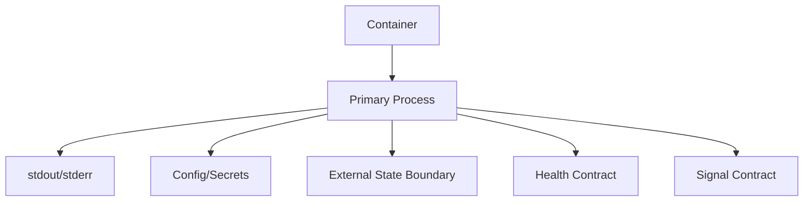
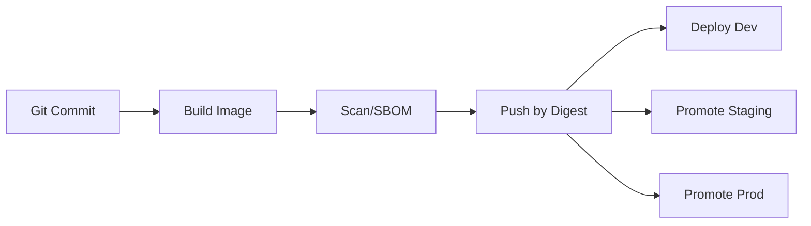
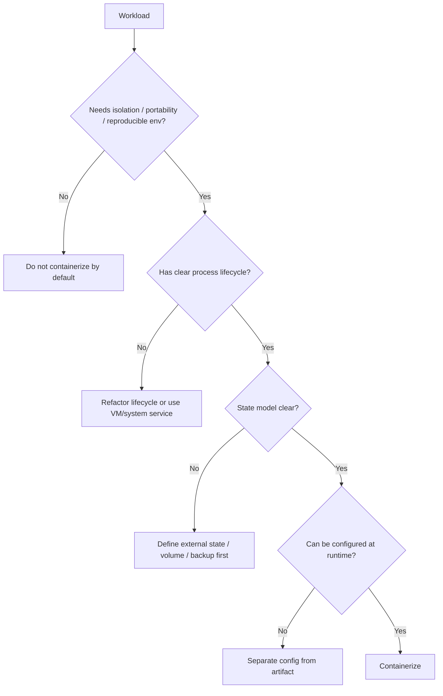
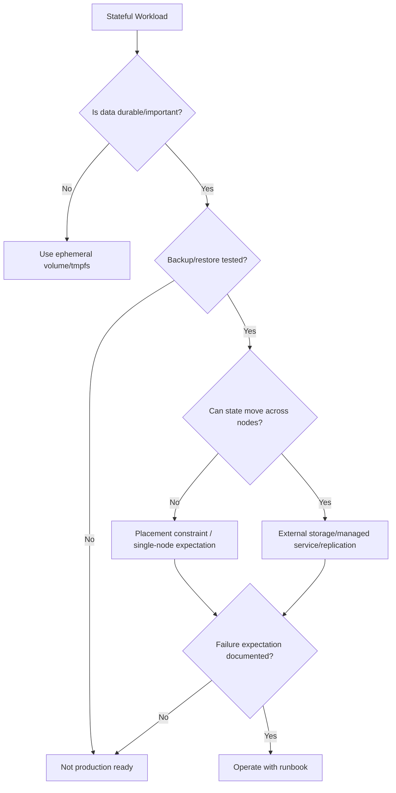
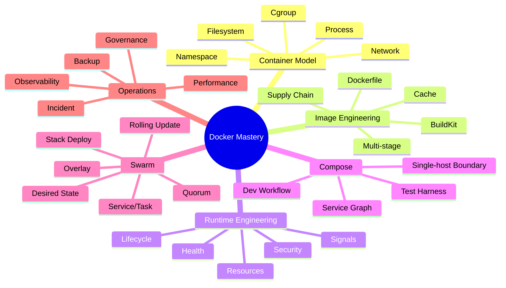

# Part 034 — Patterns, Anti-Patterns, and Decision Frameworks

Docker mastery bukan hanya kemampuan menulis Dockerfile atau Compose file.

Docker mastery adalah kemampuan membuat keputusan yang benar ketika konteks berubah.

Pertanyaan yang lebih matang:

- apakah ini perlu container;
- apakah service boundary-nya benar;
- apakah image ini reproducible;
- apakah runtime-nya least privilege;
- apakah state-nya ditempatkan di boundary yang benar;
- apakah Compose cukup;
- apakah Swarm sesuai;
- apakah Kubernetes justru overkill;
- apakah secret bisa bocor;
- apakah rollback benar-benar aman;
- apakah observability cukup untuk incident nyata;
- apakah keputusan ini bisa dipertanggungjawabkan enam bulan lagi.

Part ini mengumpulkan pattern, anti-pattern, dan decision framework dari seluruh seri.

Tujuannya bukan membuat daftar dogma.

Tujuannya membangun judgement.

---

## 1. Kaufman Deconstruction

Skill “Docker architectural judgement” kita pecah menjadi subskill berikut.

| Subskill | Target performa |
|---|---|
| Boundary selection | Bisa menentukan apa yang masuk/tidak masuk container |
| Image design judgement | Bisa memilih base, layer, tag, digest, multi-stage, debug variant |
| Runtime design judgement | Bisa memilih user, capabilities, mounts, healthcheck, restart policy |
| Compose judgement | Bisa memakai Compose untuk dev/test/single-host tanpa menjadikannya pseudo-orchestrator buruk |
| Swarm judgement | Bisa memakai Swarm untuk service orchestration dengan constraints, update policy, secrets, configs |
| Stateful judgement | Bisa membedakan valid stateful container vs operational trap |
| Security judgement | Bisa mengenali privilege escalation, socket risk, secret leakage, mutable artifact |
| Operational judgement | Bisa merancang logs, metrics, events, backup, rollback, capacity, runbook |
| Migration judgement | Bisa memutuskan kapan tetap di Compose/Swarm, kapan naik ke platform lain |

Kaufman lens:

- deconstruct keputusan besar menjadi sub-keputusan;
- pelajari cukup untuk mengenali error;
- buat checklist agar friction rendah;
- latih judgement lewat scenario review.

---

## 2. Pattern Language

Pattern adalah solusi yang berulang untuk masalah yang berulang dalam konteks tertentu.

Anti-pattern adalah solusi yang tampak nyaman tetapi menciptakan kerusakan tersembunyi.

Di Docker, anti-pattern sering terasa produktif di awal:

- `latest` cepat;
- `privileged: true` menyelesaikan permission issue;
- mount Docker socket memudahkan automation;
- environment variable memudahkan secret injection;
- `sleep 30` menyelesaikan startup race;
- bind mount semua folder memudahkan dev;
- satu image untuk semua environment tampak sederhana;
- database di local volume Swarm tampak jalan.

Masalahnya muncul saat scale, audit, incident, security review, atau onboarding.

Engineering judgement berarti melihat biaya tertunda.

---

## 3. Container Boundary Patterns

### 3.1 Good Pattern — One Service Contract per Container

Satu container idealnya merepresentasikan satu service contract utama.

Bukan berarti satu proses secara absolut dalam semua kasus, tetapi harus ada satu lifecycle owner.

Good examples:

- API server container;
- worker container;
- migration job container;
- scheduler container;
- nginx reverse proxy container;
- test runner container.

Contract yang jelas:

- entrypoint jelas;
- signal handling jelas;
- log ke stdout/stderr;
- healthcheck jelas;
- config dari environment/file/secret;
- state external atau volume jelas;
- shutdown graceful.



### 3.2 Anti-Pattern — Mini VM Container

Gejala:

- container menjalankan systemd tanpa alasan kuat;
- banyak daemon unrelated dalam satu container;
- SSH server di container;
- log ditulis ke file internal saja;
- update package dilakukan saat runtime;
- container diperlakukan seperti VM mutable;
- debugging dilakukan dengan masuk container dan mengubah file.

Masalah:

- lifecycle kabur;
- healthcheck sulit;
- restart policy tidak bermakna;
- log tidak terpusat;
- patching tidak reproducible;
- attack surface naik;
- artifact tidak immutable.

Better pattern:

- pecah service;
- gunakan supervisor hanya jika ada alasan jelas;
- jadikan image immutable;
- kirim log ke stdout/stderr;
- rebuild dan redeploy untuk perubahan.

### 3.3 Nuance — Multiple Processes Can Be Valid

Dogma “one process only” terlalu sederhana.

Beberapa kasus multi-process valid:

- init/tini untuk signal reaping;
- web server + helper tightly coupled;
- agent yang wajib mendampingi proses utama;
- legacy app yang tidak bisa dipisah tanpa risiko besar;
- test container yang menjalankan test runner + helper.

Decision rule:

```text
Multi-process is acceptable if lifecycle, logs, signals, health, and failure semantics remain clear.
```

Jika satu proses mati, apa container harus mati?

Jika tidak bisa dijawab, desainnya belum matang.

---

## 4. Image Design Patterns

### 4.1 Good Pattern — Immutable Runtime Image

Image production harus artifact immutable.

Ciri:

- dibangun dari commit/release tertentu;
- punya tag yang traceable;
- punya digest;
- tidak mengunduh dependency saat startup;
- tidak menjalankan package update saat runtime;
- berisi hanya runtime dependency;
- punya SBOM/provenance jika supply chain policy mengharuskan;
- bisa dipromosikan antar environment tanpa rebuild.

Promotion flow:



Environment berbeda harus mengubah config, bukan image.

### 4.2 Anti-Pattern — Rebuild per Environment

Gejala:

```text
app:dev
app:staging
app:prod
```

dibangun dari source yang sama tetapi dengan file config berbeda di dalam image.

Masalah:

- artifact prod tidak identik dengan staging;
- bug bisa muncul hanya di prod image;
- audit sulit;
- rollback tidak jelas;
- secret/config bisa tertanam;
- supply chain evidence terpecah.

Better pattern:

- satu image digest;
- config per environment via runtime config/secrets;
- promotion by digest;
- environment-specific deployment file.

### 4.3 Good Pattern — Multi-Stage Build

Build stage berisi compiler/build tool.

Runtime stage berisi artifact minimal.

```dockerfile
FROM eclipse-temurin:21-jdk AS build
WORKDIR /src
COPY . .
RUN ./mvnw -B package -DskipTests

FROM eclipse-temurin:21-jre AS runtime
WORKDIR /app
COPY --from=build /src/target/app.jar ./app.jar
USER 10001:10001
ENTRYPOINT ["java", "-jar", "/app/app.jar"]
```

Benefit:

- image lebih kecil;
- build tools tidak ikut runtime;
- attack surface turun;
- dependency build tidak bocor;
- runtime lebih jelas.

### 4.4 Anti-Pattern — Dockerfile as Bash Script

Gejala:

- Dockerfile ratusan baris melakukan semua hal;
- mengunduh file dari URL tidak tervalidasi;
- menjalankan script remote;
- `RUN` chaining terlalu panjang tanpa struktur;
- build berbeda tergantung waktu/network;
- tidak ada pinning;
- tidak ada checksum;
- build step berubah sering dan invalidate cache.

Better pattern:

- gunakan build tool asli;
- minimalkan logic shell;
- pin dependency;
- gunakan checksum/signature;
- pisahkan stage;
- buat build reproducible.

### 4.5 Good Pattern — Debug Variant

Production image bisa minimal.

Tetapi engineer tetap butuh debugging.

Pattern:

- `app:sha` minimal production;
- `app:sha-debug` berisi shell/tools;
- debug image tidak dipakai default;
- debug image punya same artifact;
- debug image punya access policy.

Atau gunakan debug container/tooling di network namespace yang sama.

Jangan memasukkan curl, bash, tcpdump, compiler ke semua production image hanya karena “mungkin perlu”.

### 4.6 Anti-Pattern — `latest` in Production

`latest` adalah default tag convenience, bukan release identity.

Masalah:

- mutable;
- tidak menjelaskan versi;
- rollback bisa berubah;
- audit sulit;
- node berbeda bisa punya image berbeda jika pull timing berbeda;
- incident timeline kabur.

Better pattern:

```yaml
image: registry.example.com/team/api@sha256:...
```

Atau minimal:

```yaml
image: registry.example.com/team/api:2026.07.01-abc1234
```

Digest tetap lebih kuat untuk identity.

---

## 5. Runtime Patterns

### 5.1 Good Pattern — Least Privilege Container

Baseline:

```yaml
services:
  api:
    image: registry.example.com/api@sha256:...
    user: "10001:10001"
    read_only: true
    tmpfs:
      - /tmp
    cap_drop:
      - ALL
    security_opt:
      - no-new-privileges:true
```

Tambahkan capability hanya jika ada kebutuhan jelas.

Review question:

> “Privilege apa yang benar-benar dibutuhkan workload ini?”

Bukan:

> “Flag apa yang membuat error hilang?”

### 5.2 Anti-Pattern — `privileged: true` as Permission Fix

`privileged: true` memberi container akses sangat luas.

Gejala:

- permission error diselesaikan dengan privileged;
- device access tanpa model risiko;
- host mount luas;
- security review dilewati;
- container bisa memodifikasi host boundary.

Better pattern:

- identifikasi capability spesifik;
- gunakan device mount spesifik;
- gunakan group/UID yang benar;
- gunakan read-only mount;
- gunakan seccomp/AppArmor override minimal;
- dokumentasikan alasan.

Decision:

```text
privileged=true requires explicit exception, owner, expiry, and threat model.
```

### 5.3 Good Pattern — Explicit Signal Contract

Container harus graceful saat stop.

Ciri:

- app menangani SIGTERM;
- `stop_grace_period` cukup;
- `STOPSIGNAL` benar jika perlu;
- worker menyelesaikan/invalidate pekerjaan;
- HTTP server stop menerima request baru;
- connection pool ditutup;
- log flush.

Compose:

```yaml
services:
  worker:
    image: registry.example.com/worker:sha
    stop_grace_period: 60s
```

Dockerfile:

```dockerfile
STOPSIGNAL SIGTERM
```

### 5.4 Anti-Pattern — Shell Wrapper Eats Signals

Contoh buruk:

```dockerfile
CMD sh -c "java -jar app.jar"
```

Masalah:

- shell menjadi PID 1;
- signal tidak diteruskan dengan benar;
- zombie process bisa muncul;
- shutdown tidak graceful;
- Swarm update bisa menunggu lalu kill.

Better:

```dockerfile
ENTRYPOINT ["java", "-jar", "/app/app.jar"]
```

Jika perlu script:

```sh
#!/usr/bin/env sh
set -e
exec java -jar /app/app.jar
```

`exec` penting agar process utama menggantikan shell.

### 5.5 Good Pattern — Healthcheck as Runtime Evidence

Healthcheck harus merepresentasikan readiness yang benar.

```dockerfile
HEALTHCHECK --interval=30s --timeout=3s --retries=3 CMD wget -qO- http://localhost:8080/health || exit 1
```

Good healthcheck:

- cepat;
- tidak membuat load besar;
- dependency-aware jika dependency kritis;
- punya timeout;
- menghindari side effect;
- membedakan liveness/readiness jika orchestrator mendukung.

### 5.6 Anti-Pattern — Healthcheck That Lies

Buruk:

```dockerfile
HEALTHCHECK CMD echo ok
```

Atau:

```dockerfile
HEALTHCHECK CMD curl http://localhost:8080/
```

padahal root endpoint tidak mengecek readiness penting.

Masalah:

- service dianggap sehat padahal tidak usable;
- Compose/Swarm dependency gate salah;
- rolling update melepas traffic terlalu cepat;
- incident detection terlambat.

---

## 6. Configuration and Secret Patterns

### 6.1 Good Pattern — Config Outside Image

Image memuat executable.

Config datang saat runtime.

Sources:

- environment variable untuk non-sensitive config kecil;
- config file mounted untuk config kompleks;
- Compose configs untuk non-sensitive config;
- Swarm configs untuk cluster-managed non-sensitive config;
- secrets untuk sensitive data.

Decision:

| Data | Mechanism |
|---|---|
| feature toggle | environment/config service |
| DB host | environment/config |
| TLS cert private key | secret |
| public CA bundle | image/config |
| app YAML | config mount |
| password/token | secret |
| build-time private repo key | BuildKit SSH/secret mount |

### 6.2 Anti-Pattern — Secret in Image

Gejala:

```dockerfile
COPY .env /app/.env
ENV DB_PASSWORD=supersecret
ARG NPM_TOKEN=...
```

Masalah:

- secret bisa muncul di image layer/history;
- registry menyimpan secret;
- scanner/log bisa mengekstrak;
- revoke sulit;
- semua environment bisa mewarisi secret;
- audit gagal.

Better:

- BuildKit secret mount untuk build-time secret;
- runtime secret via orchestrator;
- secret file mount;
- rotation plan;
- never print secret.

### 6.3 Good Pattern — Secret Versioning by Name

Swarm secrets immutable.

Rotation pattern:

```text
db_password_v1 -> service uses v1
create db_password_v2
update service to mount v2
verify
remove v1 from service
remove secret v1 when no longer used
```

This avoids in-place mutation ambiguity.

### 6.4 Anti-Pattern — Environment Variables for Everything

Environment variable nyaman, tetapi tidak selalu aman.

Risiko:

- terlihat di inspect/process environment;
- bisa masuk logs/debug dump;
- sulit untuk file-shaped secret;
- ukuran terbatas;
- tidak punya lifecycle secret yang baik.

Gunakan env untuk config non-sensitive.

Gunakan secret mechanism untuk sensitive data.

---

## 7. Storage and State Patterns

### 7.1 Good Pattern — Stateless Service by Default

Service stateless:

- bisa direstart tanpa kehilangan data;
- bisa diskalakan horizontal;
- bisa dipindah node;
- session/state disimpan di external store;
- local cache boleh hilang;
- logs keluar ke stdout/backend.

Stateless bukan berarti tidak punya dependency state.

Artinya container instance tidak menjadi sumber kebenaran durable.

### 7.2 Anti-Pattern — Durable Data in Writable Layer

Gejala:

- upload disimpan di `/app/uploads` tanpa volume;
- SQLite production di writable layer;
- logs file internal dipakai untuk audit;
- container commit untuk menyimpan perubahan;
- backup dilakukan dengan copy dari stopped container acak.

Masalah:

- data hilang saat remove;
- backup tidak sistematis;
- migration sulit;
- Swarm reschedule kehilangan state;
- disk pressure tersembunyi.

Better:

- named volume;
- external DB/storage;
- bind mount hanya jika lifecycle jelas;
- backup/restore drill;
- storage owner jelas.

### 7.3 Good Pattern — Stateful Container with Explicit Identity

Stateful container bisa valid jika contract lengkap.

Wajib punya:

- stable identity;
- stable storage location;
- placement constraint jika storage local;
- backup plan;
- restore drill;
- upgrade procedure;
- monitoring;
- maintenance window;
- disaster recovery expectation.

Swarm example:

```yaml
services:
  postgres:
    image: postgres:16
    volumes:
      - pgdata:/var/lib/postgresql/data
    deploy:
      placement:
        constraints:
          - node.labels.pgdata == true
volumes:
  pgdata:
    external: true
```

This is still not automatically HA.

It only makes locality explicit.

### 7.4 Anti-Pattern — Local Volume Without Placement Constraint in Swarm

Jika service stateful memakai local volume dan Swarm menempatkan task di node lain, volume berbeda bisa dipakai.

Gejala:

- data “hilang” setelah reschedule;
- DB start kosong di node lain;
- rollback tidak mengembalikan data;
- backup mengambil node yang salah.

Better:

- placement constraint;
- external volume driver;
- managed database;
- replicated storage with clear semantics;
- don't use Swarm for that state if team cannot operate it.

---

## 8. Networking Patterns

### 8.1 Good Pattern — Internal Service DNS

Compose/Swarm service-to-service call sebaiknya memakai service name.

```text
api -> postgres:5432
api -> redis:6379
api -> broker:5672
```

Benefit:

- tidak bergantung host port;
- tidak bentrok port lokal;
- portable antar environment;
- service graph lebih jelas.

### 8.2 Anti-Pattern — `localhost` Trap

Dalam container, `localhost` berarti container itu sendiri.

Bukan host.

Bukan container lain.

Gejala:

```text
api tries localhost:5432 but database is another container
```

Better:

```text
api uses db:5432
```

Jika perlu host service:

- `host.docker.internal` pada Docker Desktop;
- `host-gateway` pattern pada Linux jika dikonfigurasi;
- lebih baik containerize dependency untuk dev/test jika feasible.

### 8.3 Good Pattern — Network Segmentation

Jangan semua service berada di satu flat network tanpa alasan.

Example:

```yaml
services:
  proxy:
    networks: [edge, app]

  api:
    networks: [app, data]

  postgres:
    networks: [data]

networks:
  edge:
  app:
  data:
```

Benefit:

- reduce accidental reachability;
- model trust boundary;
- simplify debugging;
- support least privilege network access.

### 8.4 Anti-Pattern — Publishing Every Port

Gejala:

```yaml
ports:
  - "5432:5432"
  - "6379:6379"
  - "5672:5672"
```

padahal hanya API yang perlu diakses host/user.

Masalah:

- port collision;
- attack surface naik;
- test paralel sulit;
- dependency internal terekspos;
- environment coupling.

Better:

- publish hanya external contract;
- gunakan `expose` atau internal network untuk service lain;
- gunakan profiles/debug override jika perlu akses lokal.

---

## 9. Compose Patterns

### 9.1 Good Pattern — Compose as Local System Model

Compose ideal untuk:

- local development;
- integration test;
- contract test;
- demo stack;
- single-host internal deployment;
- dependency simulation;
- reproducible onboarding.

Good Compose file:

- tidak punya `container_name` kecuali alasan kuat;
- memakai service DNS;
- punya healthchecks;
- memakai `depends_on` dengan condition saat perlu;
- punya profiles untuk optional services;
- tidak mempublish semua port;
- secrets/configs tidak dicampur ke image;
- volume lifecycle jelas;
- environment default aman.

### 9.2 Anti-Pattern — Compose as Undisciplined Production Platform

Gejala:

- single host production tanpa backup;
- no rollback plan;
- no log rotation;
- no healthcheck;
- mutable image tags;
- `docker compose pull && up` manual dari SSH;
- secret di `.env` tanpa akses kontrol;
- semua service restart always tanpa root cause;
- no monitoring.

Compose production bisa valid untuk skala tertentu.

Tetapi harus jujur:

- single-host availability;
- host backup;
- restore process;
- image immutability;
- log/metric pipeline;
- patching plan;
- operator access;
- disaster recovery expectation.

### 9.3 Good Pattern — Multiple Files by Intent

```text
compose.yml
compose.dev.yml
compose.test.yml
compose.perf.yml
compose.prod.yml
```

Rule:

- base file defines canonical topology;
- dev file adds bind mounts/watch/debug;
- test file adds test runner/fixtures;
- perf file adds load generator;
- prod file removes dev-only surface and sets production constraints.

Avoid duplicating entire files.

Use override intentionally.

### 9.4 Anti-Pattern — One Giant Compose File for Everything

Gejala:

- 800-line Compose file;
- too many profiles;
- unclear defaults;
- secrets mixed with dev config;
- test/prod/dev all in one file;
- new engineer afraid to edit.

Better:

- split by intent;
- document commands;
- keep base minimal;
- avoid clever YAML anchors when readability suffers;
- create `make` targets or scripts.

### 9.5 Good Pattern — Test Stack Isolation

CI Compose:

```bash
export COMPOSE_PROJECT_NAME="app_${CI_JOB_ID}"
docker compose -f compose.test.yml up --abort-on-container-exit --exit-code-from tests
```

Rules:

- no fixed container name;
- no fixed host port;
- unique project name;
- disposable volume;
- cleanup trap;
- diagnostics on failure.

### 9.6 Anti-Pattern — Fixed `container_name`

`container_name` seems convenient.

But it breaks scaling and parallelism.

Problems:

- two project instances conflict;
- Compose cannot scale service properly;
- CI parallel jobs collide;
- service identity becomes global not project-scoped.

Better:

- let Compose generate names;
- use service DNS;
- use labels for discovery;
- use `COMPOSE_PROJECT_NAME` for isolation.

---

## 10. Swarm Patterns

### 10.1 Good Pattern — Service Desired State

Swarm service describes desired state.

Good service spec includes:

- image digest;
- replicas/global mode;
- placement constraints;
- resource reservations/limits;
- update_config;
- rollback_config;
- secrets/configs;
- healthcheck;
- endpoint mode if needed;
- labels.

```yaml
services:
  api:
    image: registry.example.com/api@sha256:...
    deploy:
      replicas: 6
      placement:
        preferences:
          - spread: node.labels.zone
      resources:
        reservations:
          cpus: "0.5"
          memory: 512M
        limits:
          cpus: "1.5"
          memory: 1G
      update_config:
        parallelism: 2
        order: start-first
        failure_action: rollback
      rollback_config:
        parallelism: 2
        order: stop-first
```

### 10.2 Anti-Pattern — Swarm Without Resource Reservations

Symptoms:

- scheduler places too many tasks on one node;
- memory pressure;
- OOM loops;
- noisy neighbor;
- rolling update fails unpredictably;
- node drain causes overload elsewhere.

Better:

- benchmark per-replica baseline;
- set reservations;
- set limits;
- verify node failure headroom;
- test rolling update with surge.

### 10.3 Good Pattern — Manager Quorum Discipline

Swarm manager nodes are control plane.

Good practice:

- odd number of managers;
- separate manager/worker role for larger clusters;
- manager backup;
- autolock if required;
- certificate rotation plan;
- node drain for maintenance;
- monitor quorum health.

Decision:

```text
Do not treat manager nodes as disposable workers unless capacity and quorum consequences are understood.
```

### 10.4 Anti-Pattern — Too Many Managers

More managers does not always mean better.

Too many managers can increase consensus overhead and operational complexity.

Better:

- 3 managers for small HA cluster;
- 5 for higher tolerance;
- avoid even counts if possible;
- keep manager network reliable.

### 10.5 Good Pattern — Stack as Release Unit

A stack is deployment unit.

Good stack release:

1. build image;
2. scan/SBOM;
3. push digest;
4. render stack file with digest;
5. deploy stack;
6. monitor convergence;
7. verify health;
8. keep release evidence;
9. rollback if needed.

### 10.6 Anti-Pattern — Manual Container on Swarm Node

Running ad-hoc containers on swarm nodes can bypass scheduler.

Problems:

- hidden resource consumption;
- no desired state;
- no service logs;
- no update policy;
- no placement constraints;
- no operational evidence.

Better:

- represent workload as service/job pattern;
- use labeled one-off admin task carefully;
- document exception.

---

## 11. Security Anti-Patterns

### 11.1 Docker Socket Mount

```yaml
volumes:
  - /var/run/docker.sock:/var/run/docker.sock
```

This effectively gives container control over Docker daemon.

Valid use cases exist:

- CI runner on isolated host;
- local developer tool;
- trusted platform automation;
- socket proxy with strict control.

But default answer should be no.

Review checklist:

- who owns container image;
- can it start privileged containers;
- can it mount host filesystem;
- can it read secrets;
- is host single-tenant;
- is there a socket proxy;
- is there an expiry/exception record.

### 11.2 Bind Mount Host Root

```yaml
volumes:
  - /:/host
```

This is extremely sensitive.

It may be valid for node exporter/security agent/debug emergency, but should never be casual.

Safer approach:

- read-only if possible;
- mount narrow paths;
- drop capabilities;
- use purpose-built agent;
- isolate node;
- document exception.

### 11.3 Running as Root by Default

Root inside container is not identical to root on host, but it increases blast radius if isolation breaks or mounts are unsafe.

Good baseline:

- create non-root user;
- ensure writable dirs owned correctly;
- use read-only filesystem;
- avoid broad bind mounts;
- combine with user namespace/rootless if appropriate.

### 11.4 Secret in Logs

Common leak paths:

- echo environment during startup;
- print config object;
- stacktrace includes connection string;
- build log prints token;
- CI debug mode;
- `docker inspect` shared in ticket.

Mitigation:

- redaction library;
- secret mount not env when possible;
- CI masked variables;
- never print full config;
- incident process for leaked secret.

---

## 12. Observability Patterns

### 12.1 Good Pattern — Correlation Labels

Apply labels to image/service/container:

```yaml
labels:
  org.opencontainers.image.revision: "${GIT_SHA}"
  com.example.service: "api"
  com.example.env: "production"
  com.example.owner: "platform-payments"
```

Benefit:

- logs searchable by service/env/version;
- metrics align with release;
- incident timeline clearer;
- audit easier;
- cleanup automation safer.

### 12.2 Anti-Pattern — Logs Without Rotation

Default log behavior can fill disk if not configured.

Pattern:

```yaml
logging:
  driver: local
  options:
    max-size: "10m"
    max-file: "5"
```

Also set daemon-level defaults where possible.

### 12.3 Good Pattern — Event Timeline During Incident

Use:

```bash
docker events --since 30m

docker service ps api --no-trunc

docker inspect <container-or-task>
```

Build timeline:

```text
12:00 deploy started
12:02 task new image pulled
12:03 healthcheck failing
12:05 rollback triggered
12:07 old version healthy
```

Incident review without event timeline becomes storytelling.

### 12.4 Anti-Pattern — Health Equals Observability

Healthcheck is not observability.

It is one signal.

You still need:

- logs;
- metrics;
- traces;
- events;
- service state;
- resource metrics;
- alerts;
- dashboard;
- runbook.

---

## 13. Decision Framework: Should This Be Containerized?



Good container candidates:

- web/API service;
- stateless worker;
- batch job;
- test dependency;
- CLI tool with reproducible env;
- local dev dependency;
- reverse proxy;
- migration job.

Weak candidates:

- workload requiring full VM semantics;
- heavy GUI app unless specific setup;
- stateful clustered DB without operational expertise;
- privileged host management tool without threat model;
- app that cannot handle signals or config externally.

---

## 14. Decision Framework: Docker Compose vs Swarm vs Kubernetes vs VM

| Need | Compose | Swarm | Kubernetes | VM/Systemd |
|---|---|---|---|---|
| local dev | excellent | poor | possible but heavier | weak |
| integration test | excellent | usually unnecessary | possible | weak |
| single-host deployment | good | possible | overkill | good |
| multi-host service orchestration | weak | good | excellent | manual |
| rolling update | limited | good | excellent | custom |
| built-in service discovery | good single-host | good cluster | excellent | manual |
| secrets/configs | basic/local | good | excellent | external |
| ecosystem | Docker-native | simpler | largest | mature OS tools |
| operational complexity | low | medium | high | medium |
| platform extensibility | low | medium | high | low |

Decision guidance:

- Use Compose for dev/test and simple single-host setups.
- Use Swarm when you want Docker-native multi-host orchestration with moderate complexity.
- Use Kubernetes when you need broad ecosystem, autoscaling, CRDs/operators, advanced scheduling, strong platform extensibility.
- Use VM/systemd when container abstraction adds little and OS-level service management is enough.

Do not migrate for fashion.

Migrate when requirements exceed current platform.

---

## 15. Decision Framework: Runtime Hardening Level

| Level | Controls | Use case |
|---|---|---|
| L0 | default Docker | throwaway local experiment |
| L1 | non-root, no secret in image, log rotation | normal dev/test service |
| L2 | read-only FS, tmpfs, cap_drop, healthcheck | internal production service |
| L3 | custom seccomp/AppArmor, rootless/userns, digest pinning | sensitive production workload |
| L4 | strict policy gates, signed images, SBOM/provenance, isolated nodes | regulated/high-risk workload |

Hardening has cost.

The goal is not maximum restriction everywhere.

The goal is appropriate restriction with documented risk acceptance.

---

## 16. Decision Framework: Stateful Workload



Checklist:

- where is data stored;
- who owns backup;
- restore RTO/RPO;
- placement constraints;
- upgrade process;
- corruption recovery;
- disk capacity alert;
- snapshot consistency;
- failover process;
- security of data at rest.

---

## 17. Decision Framework: Image Base Selection

| Base | Strength | Risk | Good for |
|---|---|---|---|
| official full distro | compatibility | larger surface | early dev, complex native deps |
| slim | smaller, still familiar | missing tools/libs | many production apps |
| alpine | small | musl compatibility issues | simple workloads that support it |
| distroless | minimal runtime | harder debug | mature production services |
| scratch | smallest | very strict requirements | static binaries |
| internal hardened base | governance | maintenance burden | enterprise platform |

Questions:

- does runtime need shell;
- does app depend on glibc;
- how will CA certs/timezone work;
- how will debugging work;
- who patches base;
- how are CVEs tracked;
- are tags pinned;
- is digest used in production.

---

## 18. Scenario Reviews

### Scenario 1 — “It works only with privileged”

Bad response:

```yaml
privileged: true
```

Better review:

1. What operation fails?
2. Is it file permission, device access, network admin, sysctl, mount, time, ptrace?
3. Which capability is required?
4. Can UID/GID fix it?
5. Can a narrower device mount fix it?
6. Can read-only bind mount work?
7. Is this workload appropriate for container?
8. Is exception documented?

### Scenario 2 — “Compose test is flaky”

Likely causes:

- service not ready;
- `depends_on` only starts, not ready;
- fixed port conflict;
- shared volume;
- database migration race;
- test starts before fixture;
- healthcheck lies;
- startup timeout too small.

Pattern:

- healthcheck dependencies;
- migration job with `service_completed_successfully`;
- unique project name;
- no fixed ports;
- collect diagnostics on failure.

### Scenario 3 — “Swarm update caused outage”

Likely causes:

- healthcheck not representative;
- `parallelism` too high;
- `order: stop-first` reduced capacity;
- no rollback_config;
- DB migration incompatible;
- no feature flag;
- resource surge unavailable;
- image pull slow.

Pattern:

- start-first if capacity allows;
- failure_action rollback;
- monitor window;
- backward-compatible schema;
- lower parallelism;
- release evidence;
- rollback drill.

### Scenario 4 — “Disk full on Docker host”

Likely causes:

- logs unbounded;
- build cache;
- old images;
- dangling volumes;
- writable layer writes;
- registry mirror cache;
- test stacks not cleaned.

Pattern:

- log driver/rotation;
- `docker system df` monitoring;
- prune policy;
- volume ownership;
- CI cleanup trap;
- alert on disk usage.

### Scenario 5 — “Database lost data after redeploy”

Likely causes:

- data in writable layer;
- local volume on different node;
- no placement constraint;
- wrong volume name/project;
- volume deleted by cleanup;
- backup never tested.

Pattern:

- explicit volume;
- external volume or placement constraint;
- backup/restore;
- managed DB for critical state;
- forbid destructive prune in prod.

---

## 19. Architectural Review Checklist

Use this during PR/design review.

### Image

- [ ] Image is built from deterministic source and lockfiles.
- [ ] Multi-stage build separates build and runtime.
- [ ] Runtime image excludes dev/build tools unless intentional.
- [ ] Base image is justified.
- [ ] Tag and digest strategy is clear.
- [ ] Image labels include revision/source/version.
- [ ] SBOM/scanning policy exists where needed.
- [ ] No secret is copied or embedded.

### Runtime

- [ ] Container does not run as root unless justified.
- [ ] Filesystem is read-only where feasible.
- [ ] Writable dirs are explicit.
- [ ] Capabilities are dropped/reduced.
- [ ] No privileged mode unless exception approved.
- [ ] Signal handling works.
- [ ] Healthcheck represents readiness.
- [ ] Restart policy is intentional.

### Config and Secret

- [ ] Environment-specific values are runtime config, not image rebuilds.
- [ ] Secrets use secret mechanism.
- [ ] Secret rotation path exists.
- [ ] Logs do not print secret/config dump.
- [ ] `.env` files are not shipped accidentally.

### Network

- [ ] Internal calls use service DNS.
- [ ] Only required ports are published.
- [ ] Networks are segmented by trust boundary.
- [ ] `localhost` assumptions are reviewed.
- [ ] Overlay/routing mesh trade-off is understood.

### Storage

- [ ] Durable data is not in writable layer.
- [ ] Volumes have ownership and backup policy.
- [ ] Stateful Swarm service has placement/storage strategy.
- [ ] Disk usage and log retention are monitored.

### Compose

- [ ] Base file is clean and readable.
- [ ] Dev/test/prod overrides are separated by intent.
- [ ] Profiles avoid unnecessary service load.
- [ ] No fixed `container_name` for scalable/tested services.
- [ ] CI project names are isolated.

### Swarm

- [ ] Services use image digest.
- [ ] Reservations and limits are measured.
- [ ] Placement constraints are justified.
- [ ] Update/rollback config exists.
- [ ] Manager quorum is protected.
- [ ] Backup/restore for swarm state and app data exists.

### Observability

- [ ] Logs have rotation/backend.
- [ ] Metrics include resource and app metrics.
- [ ] Docker events/service state are available during incident.
- [ ] Labels enable correlation.
- [ ] Alerts cover restart/OOM/disk/service convergence.
- [ ] Runbook exists.

---

## 20. Anti-Pattern Catalog

| Anti-pattern | Why it happens | Damage | Better pattern |
|---|---|---|---|
| `latest` in production | convenience | mutable release identity | digest/tag by commit |
| secret in image | quick build | credential leak | BuildKit/runtime secrets |
| `privileged: true` | permission fix | host escape risk | specific capability/device |
| Docker socket mount | automation | daemon control | socket proxy/isolated host |
| data in writable layer | simple path | data loss | volume/external storage |
| fixed container_name | convenience | scaling/CI conflict | service DNS/project name |
| publish all ports | debugging ease | attack surface/conflict | internal networks/profiles |
| `sleep` for startup | race workaround | flaky startup | healthcheck dependency |
| rebuild per env | config convenience | artifact drift | promote same digest |
| logs without rotation | default behavior | disk full | log driver/retention |
| no resource reservation | simplicity | scheduler blind | measured reservation |
| giant Compose file | one file policy | unreadable/fragile | split by intent |
| manual container on Swarm node | quick fix | bypass scheduler | service/job pattern |
| no backup drill | optimism | unrecoverable state | restore-tested backup |
| healthcheck lies | superficial check | false readiness | representative health |
| image with build tools | easy debug | attack surface | multi-stage/debug variant |
| bind mount host root | quick access | host compromise | narrow read-only mounts |
| unlimited memory | avoid OOM | host pressure | tuned memory limit |
| too-low CPU quota | cost control | throttling latency | measured CPU envelope |
| no release evidence | speed | poor audit/rollback | evidence bundle |

---

## 21. Top 1% Decision Heuristics

### Heuristic 1 — Artifact and Config Must Be Separate

If environment difference requires rebuild, ask why.

Usually the image should stay the same and config should change.

### Heuristic 2 — Runtime Privilege Must Be Earned

Start least privilege.

Add privilege only with specific reason.

### Heuristic 3 — State Must Have an Owner

Every durable byte must have owner, backup, restore, and deletion policy.

### Heuristic 4 — Readiness Must Be Proven

A container that has started is not necessarily ready.

### Heuristic 5 — The Scheduler Can Only Use What You Declare

If you do not declare resource needs, placement decisions are guesswork.

### Heuristic 6 — Mutable Tags Are Operational Debt

Tags are names. Digests are identities.

### Heuristic 7 — Debuggability Should Be Designed, Not Accidentally Shipped

Use debug variants/tooling, not bloated production images by default.

### Heuristic 8 — Local Convenience Must Not Become Production Policy

Bind mounts, broad env files, fixed ports, and manual commands may be fine locally but dangerous in production.

### Heuristic 9 — Every Escape Hatch Needs an Expiry

Privileged container, host mount, socket mount, mutable tag, no healthcheck: if allowed, record why and when to remove.

### Heuristic 10 — Prefer Evidence Over Opinion

For Docker decisions, evidence includes:

- image digest;
- build log;
- SBOM/scan;
- benchmark result;
- `docker inspect`;
- `docker events` timeline;
- resource metrics;
- service convergence;
- backup restore proof;
- rollback drill.

---

## 22. Practice: Architecture Review Kata

Review this Compose file.

```yaml
services:
  app:
    image: mycompany/app:latest
    container_name: app
    privileged: true
    ports:
      - "8080:8080"
      - "5432:5432"
    volumes:
      - .:/app
      - /var/run/docker.sock:/var/run/docker.sock
    environment:
      DB_PASSWORD: supersecret
      DB_HOST: localhost
    command: sh -c "sleep 30 && java -jar app.jar"

  db:
    image: postgres:latest
    container_name: db
```

Find issues.

Expected issues:

- mutable `latest` tags;
- fixed `container_name`;
- privileged mode;
- unnecessary DB port published via app service confusion;
- broad bind mount;
- Docker socket mount;
- secret in environment;
- `DB_HOST=localhost` wrong for another container;
- sleep startup race;
- shell wrapper signal issue;
- no volume for database;
- no healthcheck;
- no network segmentation;
- no resource limits/reservations;
- no log rotation;
- no non-root user;
- no image immutability.

Improved local-dev shape:

```yaml
services:
  app:
    build:
      context: .
    ports:
      - "8080:8080"
    environment:
      DB_HOST: db
      DB_NAME: app
    secrets:
      - db_password
    depends_on:
      db:
        condition: service_healthy
    healthcheck:
      test: ["CMD", "wget", "-qO-", "http://localhost:8080/health"]
      interval: 10s
      timeout: 3s
      retries: 5
    networks: [app]

  db:
    image: postgres:16
    environment:
      POSTGRES_DB: app
      POSTGRES_USER: app
      POSTGRES_PASSWORD_FILE: /run/secrets/db_password
    secrets:
      - db_password
    volumes:
      - dbdata:/var/lib/postgresql/data
    healthcheck:
      test: ["CMD-SHELL", "pg_isready -U app -d app"]
      interval: 10s
      timeout: 3s
      retries: 5
    networks: [app]

secrets:
  db_password:
    file: ./secrets/db_password.txt

volumes:
  dbdata:

networks:
  app:
```

Still review:

- local file secret is not production-grade by itself;
- app image should become immutable in CI;
- production should not use bind mount/build context directly;
- logging/resource settings may be added by prod override;
- DB production choice needs backup/restore plan.

---

## 23. Practice: Swarm Review Kata

Review this stack file.

```yaml
services:
  api:
    image: registry.example.com/api:latest
    deploy:
      replicas: 8
    ports:
      - "80:8080"

  postgres:
    image: postgres:latest
    volumes:
      - pgdata:/var/lib/postgresql/data
    deploy:
      replicas: 1

volumes:
  pgdata:
```

Issues:

- mutable image tags;
- no update_config;
- no rollback_config;
- no healthcheck shown;
- no resource reservations/limits;
- no placement strategy;
- postgres local volume has no placement constraint/external storage;
- no secrets for DB password;
- no backup/restore plan;
- routing mesh/default port decision unreviewed;
- no network segmentation;
- no labels for correlation.

Improved conceptual shape:

```yaml
services:
  api:
    image: registry.example.com/api@sha256:...
    networks: [edge, app]
    ports:
      - target: 8080
        published: 80
        protocol: tcp
        mode: ingress
    deploy:
      replicas: 8
      resources:
        reservations:
          cpus: "0.50"
          memory: 512M
        limits:
          cpus: "1.50"
          memory: 1G
      update_config:
        parallelism: 2
        delay: 10s
        monitor: 30s
        failure_action: rollback
        order: start-first
      rollback_config:
        parallelism: 2
        order: stop-first
      labels:
        com.example.service: api
        com.example.owner: platform

  postgres:
    image: postgres:16@sha256:...
    networks: [app]
    secrets:
      - db_password
    volumes:
      - pgdata:/var/lib/postgresql/data
    deploy:
      replicas: 1
      placement:
        constraints:
          - node.labels.pgdata == true
      resources:
        reservations:
          cpus: "1.0"
          memory: 2G

secrets:
  db_password:
    external: true

volumes:
  pgdata:
    external: true

networks:
  edge:
    driver: overlay
  app:
    driver: overlay
```

Still review:

- postgres HA is not solved;
- local/external volume semantics must be known;
- backup/restore must be tested;
- DB may be better as managed service;
- ingress mode may or may not fit latency requirements.

---

## 24. Governance Model

For serious engineering organizations, Docker usage needs governance that is lightweight but real.

### 24.1 Golden Path

Provide default templates:

- Dockerfile templates per language;
- Compose dev/test templates;
- Swarm stack template;
- logging config;
- healthcheck examples;
- non-root user pattern;
- BuildKit cache pattern;
- CI build/push/scan/sign workflow;
- release evidence format.

Golden path reduces friction.

It should not become rigid bureaucracy.

### 24.2 Policy Gates

Potential gates:

- no `latest` in production;
- no secret pattern in Dockerfile;
- no privileged without exception;
- no Docker socket mount without exception;
- image scan threshold;
- base image allowlist;
- SBOM/provenance required;
- non-root required;
- healthcheck required;
- resource reservation required for Swarm.

### 24.3 Exception Process

Exception should include:

```yaml
exception:
  control: privileged-container
  service: node-debug-agent
  owner: platform-runtime
  reason: requires host network namespace diagnostics
  scope: production-debug-nodes only
  expiry: 2026-09-30
  compensating_controls:
    - isolated node pool
    - signed image only
    - read-only host mounts
    - audit logs
```

Without expiry, exception becomes architecture.

---

## 25. Final Mental Model Before Capstone

At this point, the Docker skill tree should feel like this:



The mature Docker engineer sees every container decision as a boundary decision:

- artifact boundary;
- process boundary;
- config boundary;
- secret boundary;
- filesystem boundary;
- network boundary;
- privilege boundary;
- resource boundary;
- scheduler boundary;
- operational boundary.

Bad Docker usage blurs boundaries.

Great Docker usage makes boundaries explicit, observable, testable, and reversible.

---

## 26. Part 034 Summary

Kita telah membahas:

- container boundary patterns;
- mini-VM anti-pattern;
- immutable image pattern;
- rebuild-per-environment anti-pattern;
- multi-stage build pattern;
- Dockerfile-as-bash-script anti-pattern;
- debug variant pattern;
- `latest` anti-pattern;
- least privilege runtime;
- privileged mode anti-pattern;
- signal and healthcheck contract;
- config/secret boundary;
- stateful container judgement;
- network segmentation;
- Compose design patterns;
- Swarm service/stack patterns;
- security anti-patterns;
- observability patterns;
- decision frameworks;
- governance model.

Part berikutnya adalah capstone terakhir.

Di sana kita akan menggabungkan seluruh seri menjadi satu end-to-end production-grade container platform: dari laptop, build, Compose dev/test, registry promotion, SBOM/scanning, Swarm deploy, rolling update, rollback, observability, incident drill, sampai final Kaufman practice checklist.

---

## 27. References

- Docker Docs — Dockerfile reference: https://docs.docker.com/reference/dockerfile/
- Docker Docs — Building best practices: https://docs.docker.com/build/building/best-practices/
- Docker Docs — Optimize cache usage in builds: https://docs.docker.com/build/cache/optimize/
- Docker Docs — Resource constraints: https://docs.docker.com/engine/containers/resource_constraints/
- Docker Docs — Docker Engine security: https://docs.docker.com/engine/security/
- Docker Docs — Rootless mode: https://docs.docker.com/engine/security/rootless/
- Docker Docs — User namespace remap: https://docs.docker.com/engine/security/userns-remap/
- Docker Docs — Compose file reference: https://docs.docker.com/reference/compose-file/
- Docker Docs — Compose startup order: https://docs.docker.com/compose/how-tos/startup-order/
- Docker Docs — Swarm services: https://docs.docker.com/engine/swarm/services/
- Docker Docs — Swarm networking: https://docs.docker.com/engine/swarm/networking/
- Docker Docs — Compose deploy specification: https://docs.docker.com/reference/compose-file/deploy/
