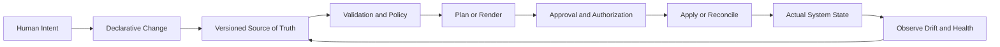
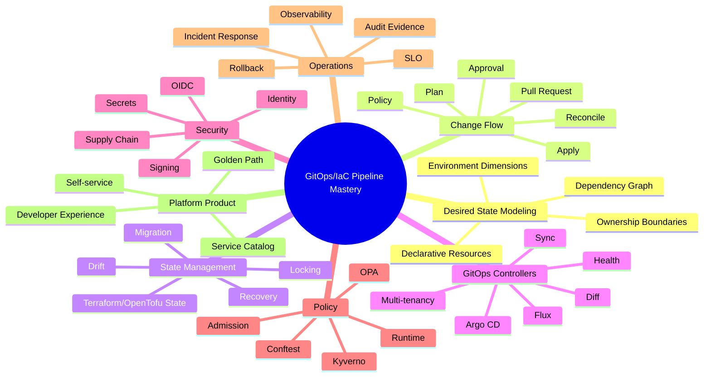
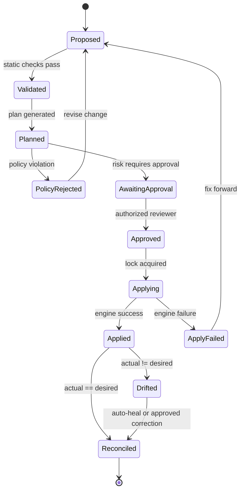
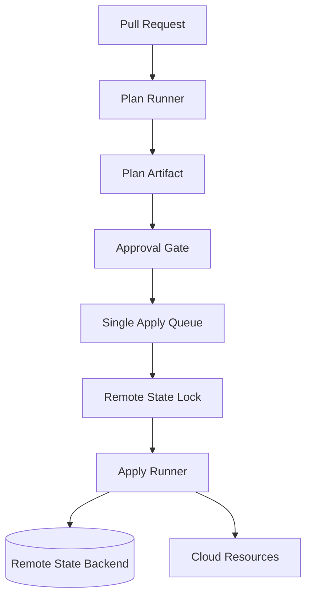
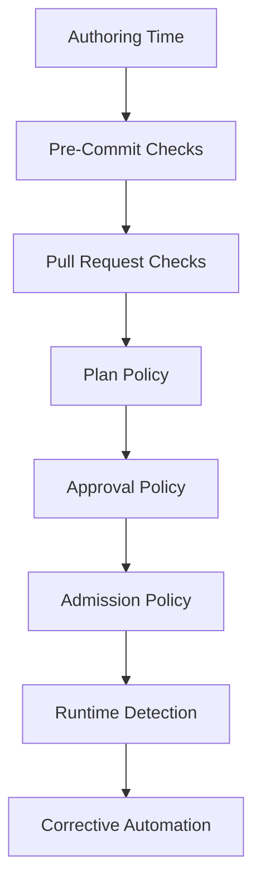
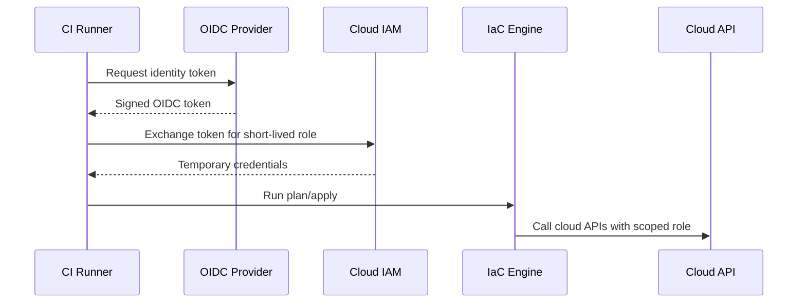
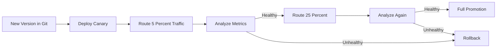
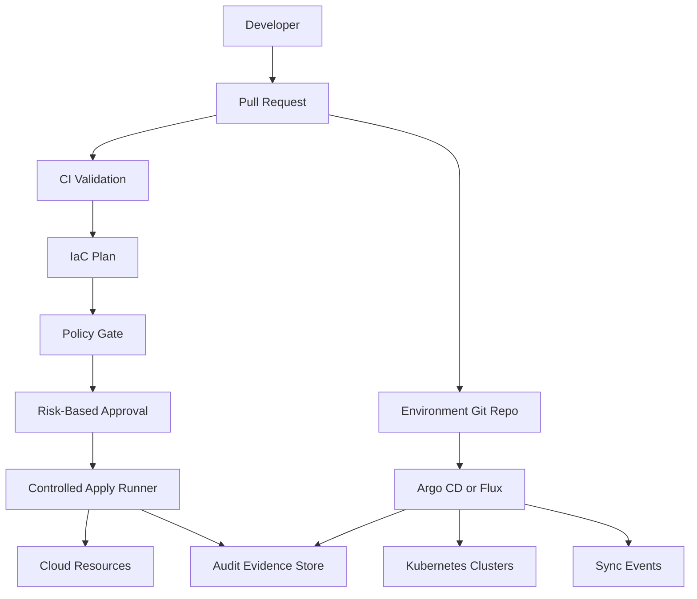

# Part 001 — Kaufman Skill Map

Kita mulai seri ini dengan peta kemampuan, bukan dengan tool.

Tool akan berubah. Terraform bersaing dengan OpenTofu. Argo CD dan Flux punya model berbeda. Cloud provider menambah fitur baru. Security tool datang dan pergi. Tetapi sistem yang kuat selalu berdiri di atas beberapa invariant yang lebih stabil:

1. **desired state harus jelas**;
2. **perubahan harus reviewable**;
3. **eksekusi harus idempotent dan terkontrol**;
4. **state harus punya owner tunggal**;
5. **drift harus terlihat**;
6. **rollback/rollforward harus dipikirkan sebelum production rusak**;
7. **audit evidence harus lahir dari sistem, bukan dikarang setelah incident**.

Seri ini tidak mengajarkan “cara install Argo CD” atau “cara menulis file Terraform pertama”. Itu terlalu dangkal untuk target kita. Kita akan membangun cara berpikir seorang engineer yang bisa mendesain, mengoperasikan, mengevaluasi, dan memperbaiki GitOps/IaC platform untuk organisasi nyata.

Materi ini mengikuti pendekatan Josh Kaufman dalam *The First 20 Hours*: deconstruct skill, learn enough to self-correct, remove practice barriers, and practice deliberately. Tetapi karena target kita bukan sekadar “bisa pakai”, melainkan “bisa membangun sistem production-grade”, kita akan memperluasnya menjadi skill map internal engineering handbook.

---

## 1. Apa yang Sebenarnya Dipelajari?

Pertanyaan yang salah:

> “Tool GitOps apa yang paling bagus?”

Pertanyaan yang lebih tepat:

> “Bagaimana kita membuat pipeline yang menjadikan Git sebagai control surface, IaC sebagai desired-state compiler, policy sebagai guardrail, identity sebagai trust boundary, dan reconciler sebagai executor yang bisa diaudit?”

Itulah inti seri ini.

GitOps/IaC pipeline yang state-of-the-art bukan sekumpulan YAML. Ia adalah **distributed control system** untuk mengubah real-world infrastructure dan runtime workloads melalui deklarasi yang versioned, direview, dipolicy-kan, dieksekusi, diamati, dan direkonsiliasi.

Mental model-nya:



Jika sistem ini rusak, biasanya bukan karena “tool kurang bagus”. Biasanya karena salah satu invariant berikut dilanggar:

- Git bukan source of truth yang konsisten.
- Ada lebih dari satu actor yang bisa menulis state yang sama.
- Plan tidak dipercaya karena tidak sesuai apply context.
- Secret masuk Git dalam bentuk plain text.
- Approval ada, tetapi tidak terhubung dengan risk level.
- Drift diketahui terlambat.
- Rollback dianggap “git revert saja”, padahal resource/state/data sudah berubah.
- Audit log tersebar dan tidak bisa membuktikan *who approved what, under which policy, producing which runtime state*.

---

## 2. Definisi Minimum yang Harus Kita Pegang

Sebelum masuk ke skill map, kita perlu menyamakan istilah.

### 2.1 GitOps

GitOps adalah pendekatan pengelolaan sistem yang menggunakan deklarasi desired state di Git, kemudian agent/controller menarik deklarasi tersebut dan merekonsiliasinya ke actual state. OpenGitOps merangkum prinsipnya sebagai: declarative, versioned and immutable, pulled automatically, and continuously reconciled.

Dalam praktik production, ini berarti:

- Git menyimpan intent yang bisa direview.
- Sistem tidak bergantung pada engineer yang menjalankan perintah manual dari laptop.
- Agent/controller membaca Git dan membandingkan desired state dengan actual state.
- Perbedaan antara Git dan runtime menjadi sinyal penting: sync, alert, block, atau auto-heal.

### 2.2 Infrastructure as Code

Infrastructure as Code adalah praktik mendefinisikan resource infrastruktur dalam file yang bisa diproses oleh engine, misalnya Terraform/OpenTofu/Pulumi/Crossplane/provider-specific template.

IaC tidak otomatis berarti GitOps.

Contoh IaC tanpa GitOps:

```text
engineer laptop -> terraform apply -> cloud resources
```

Contoh GitOps/IaC yang lebih matang:

```text
pull request -> plan -> policy -> approval -> controlled runner -> state lock -> apply -> drift detection -> evidence
```

### 2.3 CI/CD

CI/CD biasa fokus pada build, test, package, dan deploy. GitOps/IaC pipeline lebih luas karena ia mengubah infrastructure state, security boundary, runtime topology, dan compliance evidence.

CI/CD bertanya:

> “Apakah artifact berhasil dibuild dan dideploy?”

GitOps/IaC pipeline bertanya:

> “Apakah perubahan desired state ini aman, authorized, sesuai policy, diterapkan oleh actor yang tepat, menghasilkan actual state yang sesuai, dan bisa dibuktikan setelahnya?”

### 2.4 Platform Engineering

Platform engineering adalah disiplin membangun internal platform agar developer bisa melakukan perubahan secara self-service tanpa kehilangan governance.

GitOps/IaC pipeline adalah salah satu tulang punggung platform tersebut. Ia menjadi jalur resmi untuk mengubah infrastructure, cluster config, workloads, policy, secrets references, release promotion, dan operational metadata.

---

## 3. Target Kompetensi Seri Ini

Setelah menyelesaikan seri ini, targetnya bukan sekadar “bisa membuat pipeline”. Targetnya adalah bisa menjawab dan mengimplementasikan pertanyaan seperti ini:

1. Bagaimana membagi repository agar ownership, blast radius, dan promotion flow jelas?
2. Kapan perubahan harus via CI runner, kapan via GitOps controller, kapan via control plane seperti Crossplane?
3. Bagaimana memastikan plan yang direview sama dengan apply yang dieksekusi?
4. Bagaimana mencegah dua pipeline menulis Terraform state yang sama?
5. Bagaimana mendesain approval yang berbasis risiko, bukan sekadar “klik approve”? 
6. Bagaimana menjaga secrets tetap aman tanpa membuat developer workflow terlalu berat?
7. Bagaimana policy-as-code dibagi antara pre-merge, pre-apply, admission, dan runtime detection?
8. Bagaimana mendeteksi drift tanpa membuat tim kebanjiran noise?
9. Bagaimana melakukan rollback untuk perubahan yang irreversible?
10. Bagaimana menghasilkan audit evidence yang defensible untuk compliance/regulator/security review?

Itulah level yang kita kejar.

---

## 4. Kaufman Skill Map

Josh Kaufman menyarankan memecah skill besar menjadi sub-skill kecil yang bisa dipraktikkan. Untuk GitOps/IaC pipeline, skill besar ini dapat dipecah seperti berikut.



Kita akan membangun semua sub-skill ini secara bertahap.

---

## 5. Sub-Skill 1 — Desired State Modeling

Desired state adalah kontrak antara manusia dan sistem.

Ia menjawab:

- apa yang ingin ada;
- siapa pemiliknya;
- lingkungan mana yang ditargetkan;
- dependencies apa yang harus tersedia;
- policy apa yang berlaku;
- bagaimana sistem tahu bahwa state sudah sehat.

Contoh buruk:

```text
infra/prod/main.tf
```

Semua resource prod ditaruh dalam satu folder besar. Tidak jelas mana network, database, IAM, cluster, workload, atau observability. Semua perubahan terlihat sama. Blast radius sulit dibaca. Approval tidak bisa dibedakan antara perubahan tag dan perubahan IAM admin.

Contoh yang lebih baik:

```text
infra-live/
  accounts/
    prod-main/
      global/
        iam/
        dns/
      ap-southeast-1/
        network/
        eks-platform/
        data-postgres/
        observability/
        app-runtime/
```

Struktur ini belum tentu cocok untuk semua organisasi, tetapi ia menunjukkan prinsip penting: desired state harus dibagi menurut **ownership**, **blast radius**, **lifecycle**, dan **dependency direction**.

Desired state yang baik memiliki ciri:

| Sifat | Makna |
|---|---|
| Declarative | File menjelaskan hasil akhir, bukan langkah manual. |
| Reviewable | Reviewer bisa memahami dampak perubahan dari diff. |
| Composable | Bagian kecil bisa digabung tanpa membentuk monster config. |
| Bounded | Satu unit perubahan punya cakupan jelas. |
| Recoverable | Jika gagal, kita tahu state mana yang terdampak. |
| Auditable | Bisa dijelaskan siapa mengubah apa, kapan, dan kenapa. |

---

## 6. Sub-Skill 2 — Change Flow Engineering

Pipeline bukan hanya urutan job. Pipeline adalah **state machine**.



Engineer biasa melihat pipeline sebagai:

```text
yaml job 1 -> yaml job 2 -> yaml job 3
```

Engineer senior melihat pipeline sebagai:

```text
state transition + authority + evidence + failure mode
```

Setiap transisi harus menjawab:

1. Kondisi apa yang membuat transisi valid?
2. Actor apa yang boleh memicu transisi?
3. Evidence apa yang disimpan?
4. Apa yang terjadi jika transisi gagal di tengah jalan?
5. Apakah transisi ini idempotent?
6. Apakah transisi ini reversible?

Contoh:

| Transisi | Risiko | Guardrail |
|---|---|---|
| Proposed → Planned | Plan dibuat dari context yang salah | Pin tool version, isolate credentials, deterministic backend config |
| Planned → Approved | Approval formalitas | Risk-based reviewer, CODEOWNERS, policy severity mapping |
| Approved → Applying | Race condition state | Remote state lock, apply queue, concurrency group |
| Applying → Applied | Partial resource created | Retry model, import/reconcile, state repair playbook |
| Applied → Reconciled | Runtime drift | Controller health check, drift detection, notification |

---

## 7. Sub-Skill 3 — State Ownership

State adalah pusat gravitasi IaC.

Untuk Terraform/OpenTofu, state menjembatani konfigurasi deklaratif dengan resource nyata. Jika state rusak, tidak sinkron, atau ditulis oleh actor yang salah, pipeline menjadi tidak bisa dipercaya.

Aturan dasar:

> Satu state harus punya satu owner eksekusi resmi.

Anti-pattern umum:

```text
Developer laptop apply
CI runner apply
Scheduled drift fixer apply
Manual cloud console changes
```

Semua aktor ini menyentuh resource yang sama tanpa koordinasi. Hasilnya:

- state lock contention;
- plan yang tidak stabil;
- drift palsu;
- resource replacement tidak sengaja;
- audit gap;
- recovery sulit.

Model yang lebih baik:



State ownership bukan hanya soal backend. Ini soal authority.

Pertanyaan yang harus selalu dijawab:

- Siapa boleh membaca state?
- Siapa boleh menulis state?
- Apakah plan boleh membaca secret value dari state?
- Apakah state terenkripsi?
- Bagaimana state dipulihkan jika corrupt?
- Bagaimana memindahkan resource antar-state tanpa downtime?
- Bagaimana mencegah dua pipeline apply bersamaan?

---

## 8. Sub-Skill 4 — Reconciliation Thinking

GitOps controller seperti Argo CD/Flux bekerja dengan pola reconciliation. Mereka membandingkan desired state dari source dengan actual state di cluster, lalu melakukan tindakan agar keduanya konvergen.

Ini berbeda dari pipeline push tradisional.

Push deployment:

```text
CI job has credentials -> kubectl apply -> cluster
```

Pull-based GitOps:

```text
controller inside/near cluster -> pulls desired state -> reconciles cluster
```

Perbedaan ini mengubah security dan operation model.

| Aspek | Push CD | Pull GitOps |
|---|---|---|
| Credential location | CI system menyimpan credential cluster | Controller memiliki akses cluster terbatas |
| Drift visibility | Perlu tool tambahan | Built into reconciliation loop |
| Audit focus | Pipeline job log | Git commit + controller event + cluster state |
| Failure mode | Job gagal lalu berhenti | Controller terus mencoba/reconcile |
| Runtime authority | External pipeline | In-cluster/near-cluster agent |

Reconciliation tidak berarti semua hal harus auto-heal. Untuk production, kita perlu membedakan:

- **safe drift**: label hilang, annotation berubah, replica count diubah HPA;
- **dangerous drift**: security group terbuka, IAM privilege naik, image diganti manual;
- **intentional drift**: emergency override saat incident;
- **controller noise**: diff karena defaulting/mutating webhook;
- **ownership conflict**: dua controller mengelola field yang sama.

Top engineer tidak hanya mengaktifkan auto-sync. Ia mendesain policy kapan sistem boleh memperbaiki otomatis, kapan harus alert, dan kapan harus block.

---

## 9. Sub-Skill 5 — Policy as Code

Policy as Code bukan “menulis Rego agar terlihat enterprise”. Ia adalah cara mengubah aturan organisasi menjadi guardrail yang bisa dieksekusi konsisten.

Policy harus ditempatkan di beberapa lapisan:



Contoh pembagian:

| Layer | Contoh Policy | Tujuan |
|---|---|---|
| Authoring | Format, schema, static lint | Feedback cepat |
| PR | No public S3 bucket, required tags | Block sebelum merge |
| Plan | IAM admin change requires security approval | Risk-aware approval |
| Admission | Pod cannot run privileged | Block runtime unsafe config |
| Runtime | Detect public endpoint drift | Catch out-of-band changes |
| Corrective | Auto-close noncompliant security group | Remediasi terbatas |

Policy yang baik tidak hanya “melarang”. Ia harus:

- memberikan pesan error yang actionable;
- punya severity;
- punya exception process;
- punya owner;
- punya test case;
- punya observability;
- tidak membuat developer mencari jalan belakang.

---

## 10. Sub-Skill 6 — Identity and Trust Boundaries

Pipeline adalah sistem yang memegang kuasa besar. Ia bisa membuat database, membuka network, mengubah IAM, mengganti image production, dan menghapus resource.

Maka pertanyaan utamanya bukan “credential disimpan di mana?”, tetapi:

> “Actor mana diberi authority apa, untuk resource mana, dalam kondisi apa, dengan evidence apa?”

Model modern lebih memilih credential sementara berbasis identity federation dibanding long-lived static keys.



Trust boundary yang harus diperhatikan:

- PR dari fork tidak boleh otomatis dapat credential production.
- Plan untuk environment sensitif harus dijalankan dengan read-only/minimal permission jika memungkinkan.
- Apply harus memakai role berbeda dari plan.
- Human admin access harus break-glass, time-bound, dan logged.
- Controller credential harus scoped ke namespace/project/resource yang dikelola.
- Secret decryption harus dibatasi pada context yang sah.

---

## 11. Sub-Skill 7 — Secrets Management

GitOps memaksa kita menyelesaikan paradoks:

> Desired state harus ada di Git, tetapi secret tidak boleh bocor di Git.

Ada beberapa pendekatan:

| Pendekatan | Kapan Cocok | Risiko |
|---|---|---|
| Encrypted secrets in Git | Git tetap source of truth, cocok untuk bootstrap tertentu | Key management dan rotation sulit |
| External secret reference | Secret value tinggal di secret manager | Runtime dependency ke secret manager |
| Dynamic secret | Credential dibuat on-demand | Complexity lebih tinggi |
| Sealed secret | Cluster-specific encrypted secret | Portability dan key recovery harus jelas |

Yang penting bukan memilih satu tool, tetapi menjawab lifecycle:

- siapa membuat secret;
- di mana value disimpan;
- siapa bisa decrypt;
- bagaimana rotation dilakukan;
- bagaimana revoke dilakukan;
- bagaimana audit dilakukan;
- apa yang terjadi saat secret manager down;
- bagaimana bootstrap cluster pertama.

---

## 12. Sub-Skill 8 — Progressive Delivery

GitOps/IaC pipeline modern tidak boleh menganggap deployment sebagai binary event.

Production change sering harus berjalan bertahap:

- canary;
- blue-green;
- traffic shifting;
- shadow traffic;
- feature flag;
- metric-based promotion;
- automatic rollback berdasarkan SLO.

Diagram sederhana:



Progressive delivery tidak menggantikan GitOps. Ia memperluas reconciliation agar runtime signal ikut menentukan apakah desired rollout boleh terus maju.

---

## 13. Sub-Skill 9 — Observability and Audit Evidence

Pipeline yang tidak bisa diamati tidak bisa dipercaya.

Minimal signals:

| Signal | Kenapa Penting |
|---|---|
| Plan duration | Mendeteksi graph terlalu besar atau provider lambat |
| Apply duration | Mengukur deployment/change latency |
| State lock wait time | Mendeteksi contention dan struktur state buruk |
| Drift count | Mengukur out-of-band change atau controller conflict |
| Policy rejection rate | Melihat apakah guardrail membantu atau menghambat |
| Sync failure count | Menandakan broken desired state atau runtime problem |
| Reconciliation lag | Mengetahui berapa lama cluster tertinggal dari Git |
| Rollback frequency | Mengukur kualitas change management |

Audit evidence harus bisa menjawab:

```text
Commit apa yang mengubah sistem?
Siapa pembuat PR?
Siapa reviewer?
Policy apa yang dijalankan?
Plan apa yang disetujui?
Runner/identity apa yang apply?
Resource apa yang berubah?
Apakah actual state match desired state?
Jika gagal, siapa melakukan override?
```

Jika jawaban ini tersebar di 8 sistem dan hanya bisa dikumpulkan manual setelah incident, pipeline belum production-grade.

---

## 14. Sub-Skill 10 — Failure Modeling

Top engineer tidak mendesain happy path saja. Ia mendesain kegagalan.

Contoh failure mode:

| Failure | Gejala | Respons yang Benar |
|---|---|---|
| Plan stale | Plan dibuat sebelum merge terbaru | Re-plan after merge atau apply only exact reviewed commit |
| State lock stuck | Apply tidak bisa lanjut | Lock inspection, owner check, safe unlock playbook |
| Partial apply | Sebagian resource terbuat | Import/reconcile/fix-forward, jangan asal re-run |
| Drift dangerous | Cloud console change membuka akses publik | Alert/block/auto-remediate sesuai severity |
| Controller stuck | Argo/Flux tidak sync | Inspect source, render, health, RBAC, API errors |
| Secret rotation failed | Workload crashloop | Rollback secret version atau fix consumer compatibility |
| Policy false positive | Change valid diblokir | Exception workflow with expiry and owner |
| Provider bug | Plan tidak stabil | Pin version, isolate module, provider downgrade/upgrade test |

Failure modeling membuat pipeline realistis.

---

## 15. Skill Ladder

Gunakan ladder ini untuk menilai posisi Anda.

### Level 1 — User

Bisa menjalankan pipeline yang sudah ada.

Ciri:

- tahu membuat PR;
- membaca plan dasar;
- menunggu approval;
- tahu Argo/Flux sync status secara permukaan.

Belum cukup untuk target seri ini.

### Level 2 — Implementer

Bisa membuat pipeline sederhana.

Ciri:

- menulis job plan/apply;
- setup remote state;
- setup basic Argo/Flux;
- menambah lint/policy sederhana.

Masih sering lemah di failure mode dan governance.

### Level 3 — Operator

Bisa menjaga pipeline production.

Ciri:

- memahami state lock;
- bisa debug failed apply;
- bisa membaca controller diff;
- punya runbook;
- tahu kapan rollback tidak aman.

Ini level minimal untuk platform engineer production.

### Level 4 — Designer

Bisa mendesain platform untuk banyak tim.

Ciri:

- memilih repo topology berdasarkan ownership;
- membagi state berdasarkan blast radius;
- mendesain approval berdasarkan risiko;
- menghubungkan policy, identity, audit, dan observability;
- mengurangi cognitive load developer.

Ini target utama seri.

### Level 5 — Systems Architect

Bisa mengevaluasi trade-off organisasi besar.

Ciri:

- mendesain multi-account/multi-cluster/multi-region model;
- memahami regulatory evidence;
- bisa membuat migration path dari legacy pipeline;
- bisa membangun platform API/self-service;
- bisa menjelaskan invariant dan konsekuensi desain.

Ini target “top 1% engineer” yang kita maksud.

---

## 16. Practice Plan 20 Jam Pertama

Kaufman menekankan practice, bukan konsumsi materi. Berikut rencana 20 jam awal untuk membangun fondasi.

### Jam 1–2 — Membuat Vocabulary Map

Tulis definisi operasional untuk:

- desired state;
- actual state;
- drift;
- reconciliation;
- plan;
- apply;
- state lock;
- policy gate;
- admission control;
- progressive delivery;
- audit evidence.

Tujuan: tidak tertipu oleh buzzword.

### Jam 3–4 — Menggambar Pipeline State Machine

Buat state machine perubahan infra dari PR sampai actual state.

Wajib ada:

- proposed;
- validated;
- planned;
- awaiting approval;
- approved;
- applying;
- applied;
- reconciled;
- drifted;
- failed.

Tujuan: melihat pipeline sebagai sistem transisi state.

### Jam 5–6 — Mendesain Repo Topology Mini

Ambil sistem imajiner:

- 3 aplikasi;
- 2 environment;
- 2 region;
- shared network;
- shared database;
- tim platform dan tim aplikasi.

Buat 2 alternatif repo topology dan tulis trade-off-nya.

Tujuan: tidak fanatik mono-repo atau multi-repo.

### Jam 7–8 — Membagi Terraform/OpenTofu State

Ambil resource berikut:

- IAM;
- VPC/network;
- Kubernetes cluster;
- database;
- app namespace;
- monitoring;
- DNS.

Kelompokkan ke state berbeda. Jelaskan dependency graph dan blast radius.

Tujuan: memahami state sebagai boundary operasi.

### Jam 9–10 — Membuat Risk-Based Approval Matrix

Buat matrix:

| Change Type | Risk | Required Reviewer | Policy Gate |
|---|---|---|---|
| Tag update | Low | Team owner | Static lint |
| IAM privilege escalation | High | Security | Plan policy |
| Public endpoint | High | Security + Platform | Plan + runtime detection |
| Replica increase | Medium | Service owner | Cost check |

Tujuan: approval tidak lagi formalitas.

### Jam 11–12 — Membuat Drift Taxonomy

Definisikan minimal 5 jenis drift:

- harmless;
- dangerous;
- intentional emergency;
- defaulting noise;
- ownership conflict.

Untuk setiap drift, tentukan apakah sistem harus ignore, alert, auto-heal, atau block.

Tujuan: reconciliation tidak membabi buta.

### Jam 13–14 — Mendesain Secret Lifecycle

Untuk satu aplikasi production, jelaskan:

- secret dibuat di mana;
- masuk Git sebagai apa;
- didecrypt oleh siapa;
- diinject ke workload bagaimana;
- rotation-nya bagaimana;
- incident revoke-nya bagaimana.

Tujuan: tidak menyederhanakan secrets menjadi “pakai Vault saja”.

### Jam 15–16 — Menulis Failure Playbook

Ambil 5 failure mode:

- stuck state lock;
- failed apply;
- broken Argo sync;
- leaked secret;
- bad production manifest.

Untuk masing-masing, tulis:

- detection;
- immediate containment;
- recovery;
- prevention;
- evidence to collect.

Tujuan: siap mengoperasikan sistem nyata.

### Jam 17–18 — Audit Evidence Walkthrough

Simulasikan satu perubahan production database parameter.

Buktikan:

- siapa membuat change;
- siapa approve;
- policy apa yang pass;
- plan apa yang dieksekusi;
- runner identity apa yang apply;
- state mana yang berubah;
- bagaimana actual state diverifikasi.

Tujuan: membangun regulatory defensibility.

### Jam 19–20 — Architecture Review

Ambil desain pipeline Anda sendiri, lalu review dengan checklist:

- apakah ada single writer per state?
- apakah plan/apply context konsisten?
- apakah credentials short-lived?
- apakah secret tidak bocor?
- apakah approval sesuai risk?
- apakah drift terlihat?
- apakah rollback realistic?
- apakah audit evidence lengkap?

Tujuan: belajar mengoreksi desain sendiri.

---

## 17. Minimal Lab yang Akan Dipakai Sepanjang Seri

Agar materi tidak abstrak, kita akan memakai satu studi kasus konsisten.

### Studi Kasus

Sebuah organisasi memiliki:

- beberapa tim aplikasi;
- Kubernetes sebagai runtime utama;
- cloud infrastructure dengan network, IAM, database, storage, DNS;
- Terraform/OpenTofu untuk cloud IaC;
- Argo CD atau Flux untuk Kubernetes GitOps;
- policy-as-code untuk guardrail;
- secret manager eksternal;
- audit requirement untuk perubahan production.

Target platform:



Kita akan membangun desainnya bertahap, bukan sekaligus.

---

## 18. Anti-Goals Seri Ini

Agar pembelajaran efisien, beberapa hal tidak akan diulang panjang:

1. dasar Git;
2. dasar Docker;
3. dasar Kubernetes object;
4. dasar cloud networking;
5. syntax Terraform paling dasar;
6. syntax YAML dasar;
7. tutorial install tool langkah demi langkah tanpa reasoning.

Jika suatu syntax muncul, ia akan dipakai untuk menjelaskan desain, bukan sebagai tutorial beginner.

---

## 19. Cara Membaca Seri Ini

Untuk setiap part, gunakan pola berikut:

1. baca mental model;
2. pahami invariant;
3. lihat contoh desain;
4. pelajari failure mode;
5. lakukan exercise kecil;
6. catat trade-off;
7. bandingkan dengan sistem yang pernah Anda lihat.

Jangan menghafal template. Template cepat basi. Invariant lebih tahan lama.

---

## 20. Checklist Part 001

Sebelum lanjut ke Part 002, pastikan Anda bisa menjawab:

- Apa beda GitOps, IaC, CI/CD, dan platform engineering?
- Mengapa GitOps/IaC pipeline lebih tepat dilihat sebagai state machine?
- Apa saja invariant dasar pipeline production-grade?
- Mengapa state ownership adalah masalah authority, bukan hanya file backend?
- Mengapa reconciliation tidak selalu berarti auto-heal?
- Di mana saja policy harus ditempatkan?
- Evidence apa yang harus ada agar perubahan production bisa diaudit?

Jika jawaban Anda masih berupa nama tool, ulangi bagian mental model.

---

## 21. Referensi Utama

- OpenGitOps — GitOps principles and standards: https://opengitops.dev/
- Argo CD Documentation — declarative GitOps continuous delivery for Kubernetes: https://argo-cd.readthedocs.io/
- Flux Documentation — Kubernetes GitOps continuous delivery and reconciliation: https://fluxcd.io/flux/
- OpenTofu Documentation — state backends, state storage, and locking: https://opentofu.org/docs/language/state/backends/
- OpenTofu Documentation — state locking behavior: https://opentofu.org/docs/language/state/locking/

