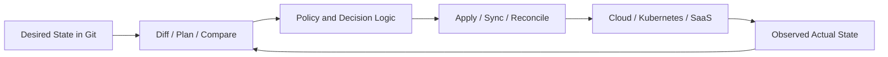
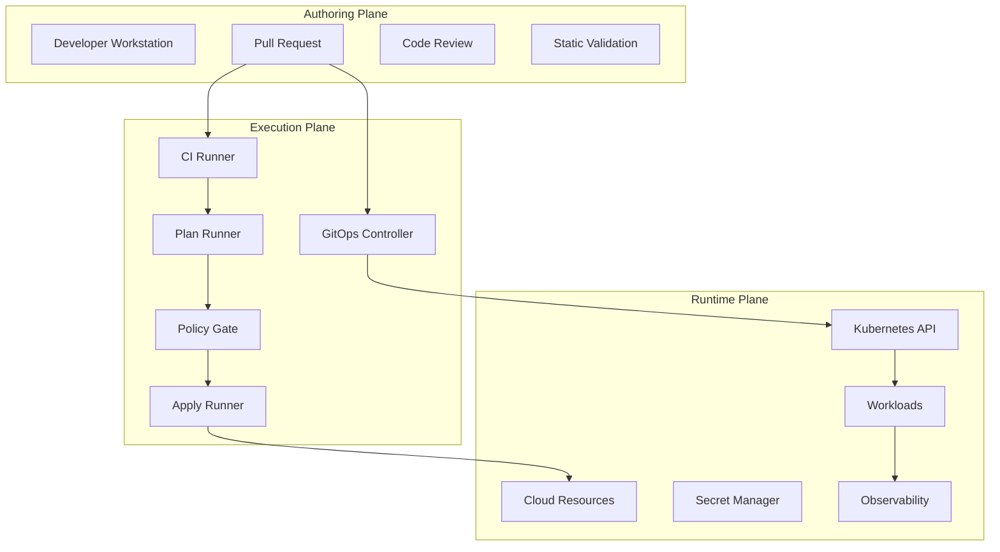
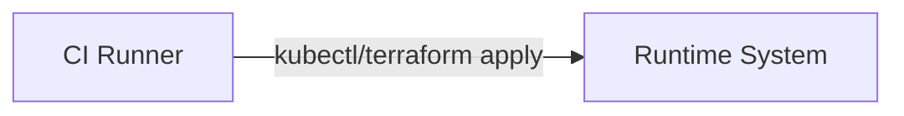
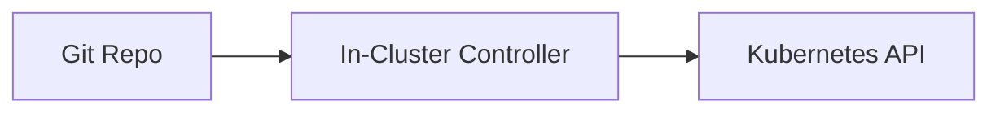
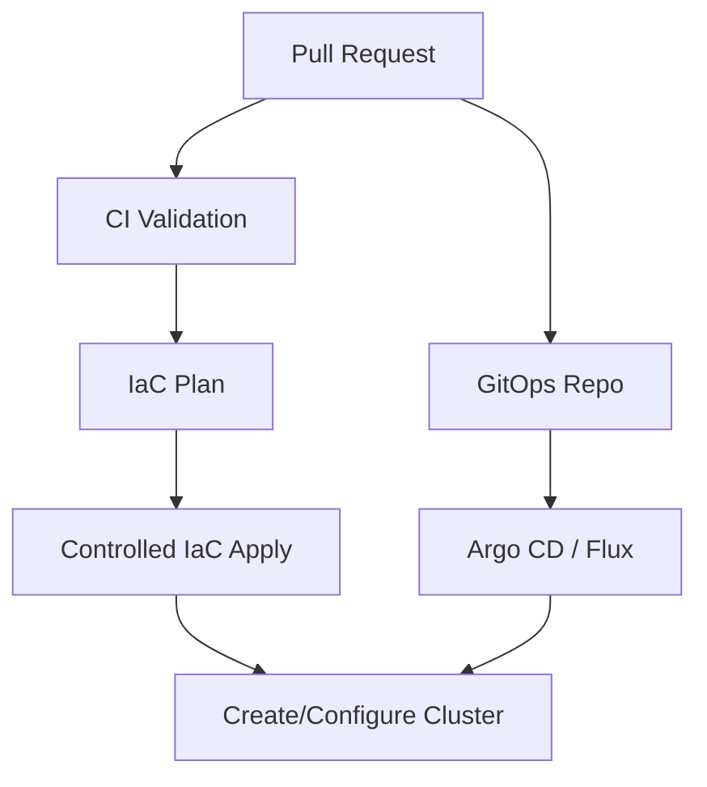
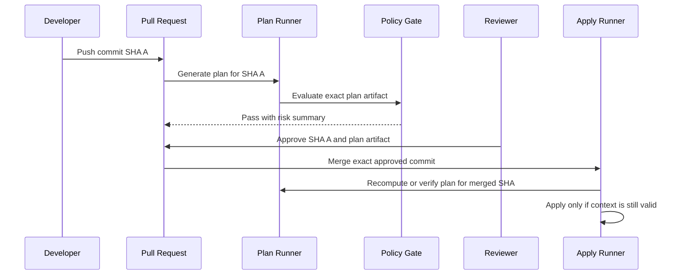
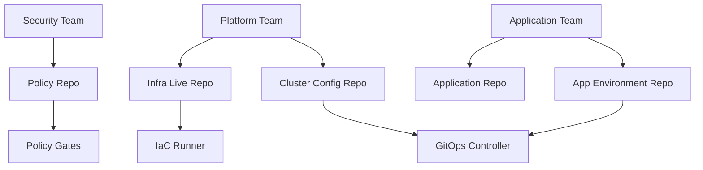
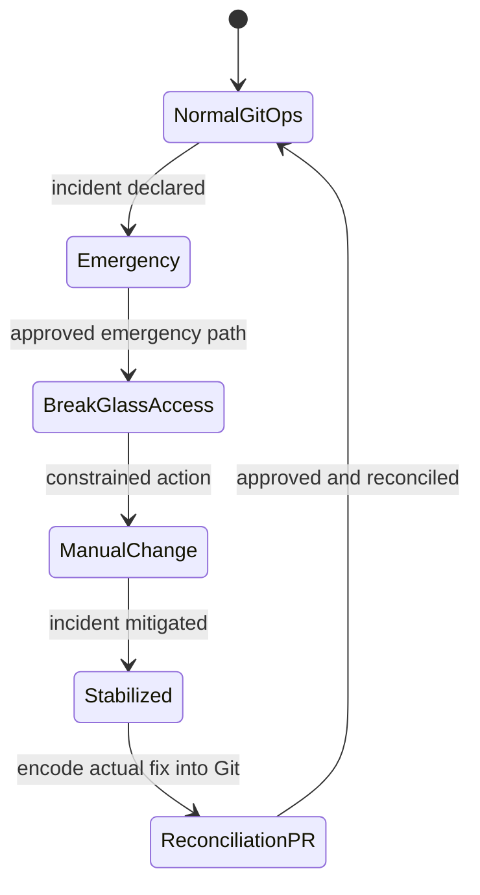
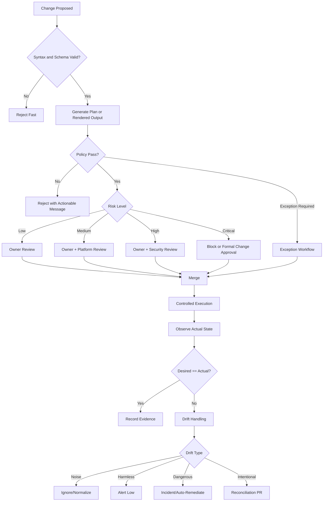

# Part 002 — GitOps/IaC Is an Operating Model, Not a Toolchain

Banyak tim mengira mereka “sudah GitOps” karena sudah memakai Argo CD, Flux, Terraform, Helm, atau pipeline CI.

Itu asumsi yang lemah.

Tool bisa membantu, tetapi tidak otomatis membentuk operating model. Operating model menjawab pertanyaan yang lebih dalam:

- siapa boleh mengubah apa;
- perubahan masuk melalui jalur mana;
- evidence apa yang wajib ada;
- siapa owner state;
- apa yang dilakukan sistem saat actual state berbeda dari desired state;
- bagaimana approval dihubungkan dengan risiko;
- bagaimana exception dikelola;
- bagaimana failure dipulihkan;
- bagaimana developer tetap cepat tanpa bypass governance.

GitOps/IaC pipeline production-grade adalah **cara organisasi mengubah sistem secara aman dan dapat dibuktikan**.

Toolchain hanyalah implementasi.

---

## 1. Toolchain vs Operating Model

Mari bandingkan dua organisasi.

### Organisasi A — Toolchain-Oriented

Mereka punya:

- Terraform;
- Argo CD;
- GitHub Actions/GitLab CI/Jenkins;
- Helm;
- Vault;
- OPA/Kyverno;
- cloud provider;
- dashboards.

Tetapi workflow-nya seperti ini:

```text
Developer membuat PR.
CI membuat plan.
Reviewer melihat sekilas.
Seseorang merge.
Kadang apply otomatis.
Kadang engineer apply dari laptop.
Kadang hotfix via cloud console.
Argo kadang auto-sync, kadang manual-sync.
Secret kadang via Vault, kadang masuk CI variable, kadang masuk YAML terenkripsi.
Audit dilakukan manual saat diminta.
```

Mereka punya banyak tool, tetapi tidak punya operating model yang kuat.

### Organisasi B — Operating-Model-Oriented

Mereka mungkin memakai tool yang sama, tetapi aturannya jelas:

```text
Semua perubahan production harus lewat pull request.
Setiap state punya single official writer.
Plan dibuat oleh runner resmi dengan versi tool yang dipin.
Apply hanya boleh untuk commit yang sudah direview dan disetujui.
Policy gate menentukan apakah change boleh lanjut, butuh approval tambahan, atau harus ditolak.
Secrets tidak pernah disimpan plain text.
Controller hanya mengelola resource yang masuk ownership boundary-nya.
Drift diberi taxonomy: ignore, alert, auto-heal, atau incident.
Setiap perubahan menghasilkan evidence otomatis.
Break-glass ada, tetapi time-bound, logged, dan direkonsiliasi kembali ke Git.
```

Organisasi B mungkin tidak memiliki tool paling banyak, tetapi sistemnya lebih mature.

---

## 2. GitOps/IaC Sebagai Control System

Cara paling berguna memahami GitOps/IaC adalah sebagai control system.

Control system memiliki:

- desired state;
- observed state;
- comparator;
- controller;
- actuator;
- feedback loop.



Dalam Terraform/OpenTofu, comparator-nya adalah plan. Actuator-nya apply. Observed state berasal dari provider API dan state file.

Dalam Argo CD/Flux, comparator-nya adalah diff antara rendered manifests/source dan cluster object. Actuator-nya Kubernetes apply/reconciliation. Observed state berasal dari Kubernetes API.

Dalam Crossplane, comparator dan actuator hidup sebagai Kubernetes controller yang merekonsiliasi custom resources ke external cloud resources.

Pola umumnya sama:

```text
desired -> compare -> decide -> act -> observe -> compare again
```

Kalau Anda memahami control loop, Anda tidak akan mudah tertipu oleh tool.

---

## 3. Desired State, Actual State, and Declared Authority

Git sebagai source of truth bukan berarti semua file di Git otomatis benar. Git hanya menjadi source of truth jika organisasi mendeklarasikan authority-nya.

Contoh:

```text
repo A owns network resources
repo B owns application manifests
repo C owns cluster bootstrap
repo D owns policy definitions
```

Tanpa declared authority, dua repo bisa mengklaim resource yang sama.

Contoh konflik:

```text
platform-repo/namespaces/payments.yaml
app-repo/payments/namespace.yaml
```

Dua file berbeda mencoba mengelola namespace `payments`. Hasilnya bisa:

- controller fight;
- diff tidak pernah stabil;
- ownership tidak jelas;
- incident sulit dianalisis;
- tim saling menyalahkan.

Operating model harus menentukan:

| Resource Type | Owner | Source of Truth | Executor | Change Path |
|---|---|---|---|---|
| Cloud IAM baseline | Security/Platform | infra-live repo | IaC runner | PR + security approval |
| Network | Platform | infra-live repo | IaC runner | PR + platform approval |
| Kubernetes cluster addons | Platform | cluster-config repo | GitOps controller | PR + platform approval |
| App deployment | App team | app-env repo | GitOps controller | PR + app owner approval |
| Admission policy | Security/Platform | policy repo | GitOps controller | PR + security approval |
| Runtime secret reference | App team | app-env repo | GitOps controller | PR + app owner approval |
| Secret value | Security/App owner | Secret manager | Secret rotation workflow | Controlled secret process |

Tabel seperti ini lebih penting daripada memilih Helm atau Kustomize.

---

## 4. The Three Planes: Authoring, Execution, Runtime

Production GitOps/IaC platform harus dipisah menjadi tiga plane.



### 4.1 Authoring Plane

Authoring plane adalah tempat manusia menyatakan intent.

Komponen:

- Git repository;
- branch;
- pull request;
- code owners;
- review;
- local validation;
- static checks.

Risiko umum:

- diff terlalu besar untuk direview;
- struktur repo membuat ownership kabur;
- reviewer tidak tahu dampak plan;
- template menyembunyikan perubahan nyata;
- generated YAML masuk PR tanpa penjelasan.

### 4.2 Execution Plane

Execution plane adalah tempat intent diproses menjadi perubahan nyata.

Komponen:

- CI runner;
- Terraform/OpenTofu runner;
- policy engine;
- secret decryption context;
- approval gate;
- apply queue;
- GitOps controller.

Risiko umum:

- runner terlalu privileged;
- plan/apply berbeda context;
- apply paralel menulis state yang sama;
- approval tidak terkait exact artifact;
- long-lived credentials bocor;
- controller mengelola resource di luar boundary.

### 4.3 Runtime Plane

Runtime plane adalah sistem yang berubah.

Komponen:

- cloud provider API;
- Kubernetes clusters;
- database;
- DNS;
- IAM;
- secret manager;
- observability system.

Risiko umum:

- manual changes;
- mutating webhooks membuat diff noise;
- provider API eventually consistent;
- resource deletion irreversible;
- external dependency down;
- actual state tidak cocok dengan state file.

Top engineer mendesain batas antar-plane dengan jelas.

---

## 5. Push, Pull, and Hybrid Execution

Tidak semua perubahan harus dieksekusi dengan model yang sama.

Ada tiga model utama.

### 5.1 Push Model



CI runner punya credential untuk target system.

Cocok untuk:

- ephemeral environment;
- simple deployment;
- non-critical internal system;
- workflow yang perlu orchestration imperative.

Risiko:

- credential besar hidup di CI;
- drift visibility tidak built-in;
- job selesai lalu tidak ada reconciliation;
- sulit untuk multi-cluster fleet besar.

### 5.2 Pull GitOps Model



Controller menarik source dari Git dan merekonsiliasi runtime.

Cocok untuk:

- Kubernetes workloads;
- cluster addons;
- multi-cluster deployment;
- declarative config yang harus terus dijaga;
- audit melalui Git plus controller events.

Risiko:

- controller misconfiguration bisa menyebabkan mass sync error;
- diff noise harus dikelola;
- secret handling harus matang;
- rollback tidak selalu cukup dengan git revert jika ada stateful change.

### 5.3 Hybrid Model



Model hybrid paling umum di enterprise:

- Terraform/OpenTofu membuat cloud primitives;
- GitOps controller mengelola Kubernetes resources;
- policy dan evidence menghubungkan keduanya.

Contoh:

| Layer | Execution Model |
|---|---|
| Cloud account vending | Push IaC runner |
| VPC/network | Push IaC runner |
| Kubernetes cluster creation | Push IaC runner |
| Cluster bootstrap | Hybrid: IaC installs controller, controller takes over |
| App workloads | Pull GitOps controller |
| Admission policy | Pull GitOps controller |
| Secret values | External secret manager + runtime sync |

Hybrid bukan kompromi buruk. Justru ini sering model paling realistis.

---

## 6. Change Path as a Product

Operating model yang bagus memperlakukan change path sebagai produk internal.

Developer tidak boleh dipaksa memahami semua kompleksitas IAM, state backend, controller internals, admission webhooks, dan audit evidence hanya untuk deploy service.

Tetapi platform juga tidak boleh menyembunyikan risiko sampai developer tidak paham dampak perubahan.

Targetnya adalah **progressive disclosure**:

```text
Simple change -> simple workflow
Risky change -> additional explanation, policy, and approval
Emergency change -> break-glass with stronger evidence
```

Contoh:

| Perubahan | UX Developer | Guardrail Sistem |
|---|---|---|
| Update image version | PR biasa | automated checks + owner review |
| Increase replicas | PR biasa | capacity/cost signal |
| Add public ingress | PR dengan risk annotation | security policy + security review |
| Add cloud IAM permission | PR dengan generated plan | least privilege policy + security approval |
| Delete production DB | Block by default | explicit exception + executive/security approval |

Dengan model ini, pipeline tidak menjadi polisi buta. Ia menjadi sistem navigasi risiko.

---

## 7. Git as Control Surface, Not Just Storage

Git dalam GitOps bukan sekadar tempat menyimpan file. Git adalah control surface.

Ia memberikan:

- history;
- diff;
- review;
- branch;
- merge semantics;
- commit identity;
- signature/provenance;
- CODEOWNERS;
- audit trail;
- rollback primitive.

Tetapi Git juga punya batas:

- tidak memahami runtime health;
- tidak memahami cloud API eventual consistency;
- tidak tahu apakah migration data aman;
- tidak menjamin reviewer membaca plan;
- tidak otomatis mencegah secret leak;
- tidak cocok untuk menyimpan high-churn runtime status besar.

Maka operating model harus menentukan apa yang masuk Git dan apa yang tidak.

### Cocok Masuk Git

- desired infrastructure config;
- Kubernetes manifests;
- Helm/Kustomize values;
- policy definitions;
- environment mapping;
- promotion metadata;
- encrypted secret atau secret reference;
- runbook dan architecture decision records.

### Tidak Cocok Masuk Git

- plaintext secret;
- large generated artifacts yang tidak direview;
- noisy runtime status;
- temporary credentials;
- unbounded logs;
- data migration result besar;
- state file jika tidak memang didesain sebagai backend aman.

Git adalah source of truth untuk intent, bukan database observability.

---

## 8. Plan Is a Safety Contract

Dalam IaC pipeline, plan bukan sekadar output command. Plan adalah kontrak keselamatan antara proposed change dan apply.

Plan harus menjawab:

- resource apa dibuat;
- resource apa diubah;
- resource apa dihapus;
- apakah ada replacement;
- apakah ada perubahan IAM/network/data;
- policy apa yang mengevaluasi plan;
- siapa menyetujui plan;
- apakah apply mengeksekusi plan yang sama.

Masalah besar muncul ketika plan yang direview tidak sama dengan apply yang dijalankan.

Contoh anti-pattern:

```text
PR opened -> plan generated
3 commits later -> reviewer approves old plan
merge -> apply runs new plan silently
```

Model yang lebih aman:



Ada dua pola:

1. **Saved plan artifact apply**: apply menjalankan artifact plan yang sama.
2. **Re-plan at apply time**: apply membuat plan baru setelah merge, lalu memastikan tidak ada risk delta yang tidak disetujui.

Keduanya punya trade-off. Yang tidak boleh adalah apply berubah diam-diam dari apa yang disetujui.

---

## 9. Reconciliation Is Not Deployment

GitOps sering disalahpahami sebagai deployment automation. Padahal reconciliation lebih luas.

Deployment adalah event:

```text
version X deployed at time T
```

Reconciliation adalah loop:

```text
while actual != desired:
    decide what to do
    act
    observe
```

Konsekuensinya:

- controller bisa memperbaiki manual drift;
- controller juga bisa memperburuk incident jika desired state salah;
- controller butuh health model, bukan hanya apply success;
- diff harus dipahami sebagai signal, bukan noise semata;
- auto-sync harus disesuaikan dengan risk.

Contoh:

```text
Desired: replicas = 5
Actual: replicas = 8
Reason: HPA scaled workload due to traffic
```

Apakah ini drift? Tergantung ownership field.

Jika Git mengelola `spec.replicas`, maka controller mungkin ingin mengembalikan ke 5. Tetapi jika HPA mengelola scale, Git tidak boleh fight dengan HPA.

Operating model harus menghindari field ownership conflict.

---

## 10. Ownership Is More Important Than Folder Structure

Repository layout sering menjadi debat panjang:

- mono-repo atau multi-repo?
- app repo atau env repo?
- Helm atau Kustomize?
- branch per environment atau folder per environment?

Semua itu penting, tetapi ownership lebih fundamental.

Pertanyaan awal:

1. Siapa owner perubahan?
2. Siapa reviewer yang sah?
3. Siapa executor yang sah?
4. State mana yang akan berubah?
5. Blast radius apa?
6. Evidence apa yang diperlukan?
7. Apa recovery path?

Setelah itu baru pilih layout.

Contoh ownership map:



Jika ownership jelas, folder structure dapat dievaluasi secara objektif.

---

## 11. Approval Must Be Risk-Based

Approval yang buruk:

```text
Any PR to prod requires one approval.
```

Ini terlihat aman, tetapi sering gagal karena semua perubahan diperlakukan sama.

Tag update dan IAM privilege escalation tidak boleh punya approval model yang sama.

Approval yang lebih baik:

| Risk Signal | Example | Required Gate |
|---|---|---|
| Low | Label/tag update | Owner review |
| Medium | Replica increase, new internal service | Owner + automated policy |
| High | Public ingress, IAM write permission | Owner + security review |
| Critical | Delete database, disable encryption | Block or exceptional approval |

Risk signal bisa berasal dari:

- path changed;
- resource type;
- plan action;
- policy result;
- environment;
- data classification;
- blast radius;
- historical incident pattern.

Approval harus terikat pada artifact:

```text
Reviewer approved commit SHA + plan hash + policy result.
```

Bukan sekadar “LGTM”.

---

## 12. Break-Glass Is Part of the System

Production incident bisa membutuhkan tindakan cepat.

Operating model yang naif berkata:

> “Semua perubahan harus lewat Git. Tidak boleh manual.”

Operating model yang realistis berkata:

> “Manual emergency access boleh hanya melalui break-glass yang time-bound, logged, justified, dan direkonsiliasi kembali ke Git.”

Break-glass harus punya:

- trigger condition;
- authorized role;
- time limit;
- logging;
- mandatory incident ticket;
- post-incident reconciliation PR;
- review after use.

Flow:



Jika tidak ada break-glass resmi, engineer akan membuat break-glass ilegal saat incident. Itu lebih berbahaya.

---

## 13. Platform Pipeline as Policy-Enforced State Machine

Mari gabungkan konsepnya.



Ini operating model, bukan sekadar YAML.

---

## 14. Common Maturity Levels

### Level 0 — Manual Ops

- Infrastructure dibuat manual.
- Tidak ada state resmi.
- Audit berdasarkan screenshot atau ingatan.
- Perubahan production sulit direproduksi.

### Level 1 — Scripted Ops

- Ada script.
- Ada CI job.
- Masih banyak credential manual.
- Review tidak melihat dampak real.

### Level 2 — Basic IaC

- Terraform/OpenTofu digunakan.
- Remote state ada.
- CI membuat plan.
- Apply masih kadang dari laptop.
- Policy belum sistematis.

### Level 3 — Controlled IaC

- Plan/apply lewat runner resmi.
- State lock jelas.
- Approval ada.
- Policy basic ada.
- Audit mulai terbentuk.

### Level 4 — GitOps Runtime

- Kubernetes runtime dikelola Argo/Flux.
- Drift terlihat.
- App promotion berbasis Git.
- Secrets mulai dikelola secara aman.
- Controller ownership jelas.

### Level 5 — Integrated Platform Operating Model

- IaC, GitOps, policy, identity, secrets, observability, and audit terhubung.
- Risk-based approval.
- Break-glass resmi.
- Drift taxonomy.
- Evidence otomatis.
- Developer self-service melalui golden path.

Target seri ini adalah Level 5.

---

## 15. Decision Rule: When Is Something GitOps?

Gunakan checklist sederhana.

Sebuah workflow dapat disebut GitOps jika:

1. desired state dideklarasikan;
2. desired state disimpan dalam source yang versioned dan immutable secara historis;
3. agent menarik desired state secara otomatis;
4. agent merekonsiliasi actual state terhadap desired state;
5. perubahan bisa diaudit melalui source history dan controller/execution logs;
6. manual drift terlihat dan punya handling;
7. ownership source dan runtime jelas.

Jika hanya ada:

```text
Git repo + CI job + kubectl apply
```

itu belum tentu GitOps. Itu mungkin hanya push-based CD yang memakai Git sebagai trigger.

Ini bukan masalah istilah akademik. Istilah yang kabur membuat operating model kabur.

---

## 16. Decision Rule: When Should IaC Not Be Fully Automated?

Tidak semua perubahan harus auto-apply.

Auto-apply cocok jika:

- blast radius kecil;
- rollback mudah;
- policy coverage kuat;
- state ownership jelas;
- perubahan sering dan low-risk;
- observability bagus.

Manual approval wajib jika:

- production critical;
- IAM/security boundary berubah;
- data store dihapus/diganti;
- network exposure berubah;
- encryption/logging/backup berubah;
- migration irreversible;
- regulatory evidence diperlukan.

Block by default jika:

- delete production database;
- disable encryption;
- expose admin endpoint public;
- grant wildcard admin permission;
- remove audit logging;
- bypass policy without exception record.

Automation tanpa risk classification adalah cara cepat membuat incident otomatis.

---

## 17. How to Think About “State-of-the-Art”

State-of-the-art bukan berarti memakai semua tool paling baru.

State-of-the-art berarti desain Anda memiliki properti berikut:

| Properti | Pertanyaan Uji |
|---|---|
| Declarative | Apakah intent bisa dibaca dari source? |
| Deterministic | Apakah render/plan stabil untuk input yang sama? |
| Governed | Apakah policy dan approval berbasis risiko? |
| Least privilege | Apakah executor hanya punya authority yang dibutuhkan? |
| Observable | Apakah drift, sync, apply, dan policy terlihat? |
| Recoverable | Apakah failure punya playbook realistis? |
| Auditable | Apakah evidence otomatis dan lengkap? |
| Scalable | Apakah banyak tim bisa memakai platform tanpa saling mengganggu? |
| Extensible | Apakah pola bisa diperluas untuk cloud/resource baru? |
| Humane | Apakah developer experience cukup baik sehingga orang tidak bypass? |

Tool modern membantu mencapai properti ini, tetapi tidak menjamin.

---

## 18. Practical Example: Bad Pipeline vs Good Operating Model

### 18.1 Bad Pipeline

```text
on pull_request:
  terraform plan

on merge:
  terraform apply -auto-approve
```

Masalah:

- tidak ada risk classification;
- tidak jelas plan yang direview sama dengan apply;
- tidak ada policy gate;
- tidak ada concurrency control;
- tidak ada state ownership model;
- tidak ada secret lifecycle;
- tidak ada drift handling;
- tidak ada evidence selain CI log.

### 18.2 Better Operating Model

```text
on pull_request:
  detect changed stacks
  validate format/schema
  generate plan per stack
  evaluate plan policy
  compute risk summary
  publish plan artifact and policy result
  require reviewers based on risk

on merge:
  verify approved commit and policy result
  acquire stack-specific apply lock
  assume short-lived role for target environment
  re-plan or verify saved plan
  apply with controlled concurrency
  record evidence
  trigger drift/sync observation
  notify owner on result
```

Ini belum sempurna, tetapi sudah menjadi operating model.

---

## 19. Operating Model Documents yang Harus Ada

Untuk organisasi nyata, pipeline tidak cukup hanya kode. Harus ada dokumen operasional.

Minimal:

1. **Change Path Policy**  
   Menjelaskan jenis perubahan dan jalur approval-nya.

2. **State Ownership Map**  
   Menjelaskan state/resource/repo owner.

3. **Credential and Identity Model**  
   Menjelaskan role, OIDC, secret access, break-glass.

4. **Policy Catalog**  
   Menjelaskan aturan, severity, owner, exception path.

5. **Drift Handling Policy**  
   Menjelaskan apa yang auto-heal, alert, ignore, atau incident.

6. **Failure Runbook**  
   Menjelaskan stuck lock, failed apply, controller failure, secret issue.

7. **Audit Evidence Model**  
   Menjelaskan data apa yang dikumpulkan, dari mana, dan retention-nya.

8. **Developer Golden Path**  
   Menjelaskan cara paling mudah dan benar untuk melakukan perubahan umum.

Tanpa dokumen ini, knowledge akan tersebar di kepala beberapa platform engineer.

---

## 20. Architecture Smell Checklist

Gunakan checklist ini untuk mengevaluasi pipeline yang sudah ada.

### Smell 1 — Too Many Writers

Tanda:

- laptop bisa apply;
- CI bisa apply;
- controller bisa apply;
- admin cloud console sering dipakai.

Dampak:

- state tidak dipercaya;
- drift tinggi;
- audit buruk.

Perbaikan:

- tetapkan official writer;
- disable/batasi manual write;
- break-glass formal;
- drift reconciliation.

### Smell 2 — Plan Theater

Tanda:

- plan muncul di PR;
- reviewer approve;
- apply membuat plan baru yang berbeda tanpa review.

Dampak:

- approval tidak berarti;
- change risk tidak terlihat.

Perbaikan:

- bind approval ke commit + plan hash;
- re-plan with delta detection;
- block jika risk berubah.

### Smell 3 — Policy Afterthought

Tanda:

- policy hanya lint kecil;
- high-risk change tetap bisa merge;
- exception lewat chat.

Dampak:

- governance rapuh;
- compliance evidence lemah.

Perbaikan:

- policy taxonomy;
- severity mapping;
- exception workflow with expiry.

### Smell 4 — Secret Sprawl

Tanda:

- secret ada di CI variables, local files, encrypted YAML, cloud secret manager tanpa lifecycle jelas.

Dampak:

- rotation sulit;
- revoke tidak jelas;
- blast radius besar.

Perbaikan:

- secret lifecycle map;
- external secret references;
- short-lived credentials;
- access audit.

### Smell 5 — Green Dashboard Fallacy

Tanda:

- Argo/Flux green dianggap production sehat.

Dampak:

- sync success disamakan dengan service health;
- incident telat diketahui.

Perbaikan:

- bedakan desired sync, resource health, workload SLO, business SLO.

---

## 21. Small Design Exercise

Ambil satu perubahan:

> “Tim payments ingin menambahkan public API baru ke production.”

Desain operating model-nya.

Jawab:

1. Repo mana yang berubah?
2. File apa yang berubah?
3. Apakah ada cloud infra baru?
4. Apakah ada Kubernetes manifest baru?
5. Apakah ada DNS/TLS/ingress?
6. Policy apa yang mengevaluasi public exposure?
7. Siapa reviewer wajib?
8. Credential apa yang dipakai plan/apply?
9. Apakah Argo/Flux auto-sync?
10. Evidence apa yang tersimpan?
11. Drift apa yang berbahaya setelah deploy?
12. Rollback-nya apa?

Jika jawaban Anda hanya “buat PR lalu merge”, operating model belum cukup.

---

## 22. Practical Rule of Thumb

Gunakan aturan berikut saat mendesain:

1. **Start from ownership, not folders.**  
   Folder mengikuti ownership, bukan sebaliknya.

2. **Bind approval to evidence.**  
   Approval tanpa plan/policy artifact hanya ritual.

3. **Single writer per state.**  
   Banyak writer berarti state cepat kehilangan makna.

4. **Separate plan authority from apply authority.**  
   Plan boleh lebih luas membaca; apply harus sangat terkendali menulis.

5. **Never treat Git revert as universal rollback.**  
   Infra, database, dan external systems punya irreversible changes.

6. **Make bypass visible.**  
   Bypass mungkin diperlukan saat incident, tetapi tidak boleh invisible.

7. **Policy must be actionable.**  
   Error message yang buruk akan menciptakan shadow workflow.

8. **Observe the loop, not only the job.**  
   CI success tidak sama dengan runtime converged.

---

## 23. Checklist Part 002

Sebelum lanjut ke Part 003, pastikan Anda bisa menjawab:

- Mengapa GitOps/IaC harus dilihat sebagai operating model?
- Apa perbedaan toolchain-oriented dan operating-model-oriented organization?
- Apa saja komponen control loop GitOps/IaC?
- Mengapa Git adalah control surface, bukan sekadar file storage?
- Apa perbedaan push, pull, dan hybrid execution?
- Mengapa plan adalah safety contract?
- Mengapa approval harus risk-based?
- Apa itu break-glass yang sehat?
- Apa saja architecture smell yang menandakan pipeline belum mature?

Jika bisa menjawab ini, Anda siap masuk ke Part 003: **System Boundaries and Pipeline Invariants**.

---

## 24. Referensi Utama

- OpenGitOps — GitOps principles and standards: https://opengitops.dev/
- Argo CD Documentation — declarative GitOps continuous delivery for Kubernetes: https://argo-cd.readthedocs.io/
- Flux Documentation — continuous delivery and reconciliation for Kubernetes: https://fluxcd.io/flux/
- Flux Core Concepts — GitOps Toolkit and controller model: https://fluxcd.io/flux/concepts/
- OpenTofu Documentation — state backends, state storage, and locking: https://opentofu.org/docs/language/state/backends/
- OpenTofu Documentation — state locking: https://opentofu.org/docs/language/state/locking/

