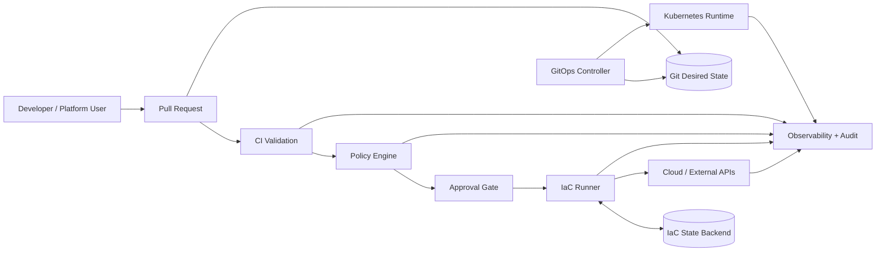
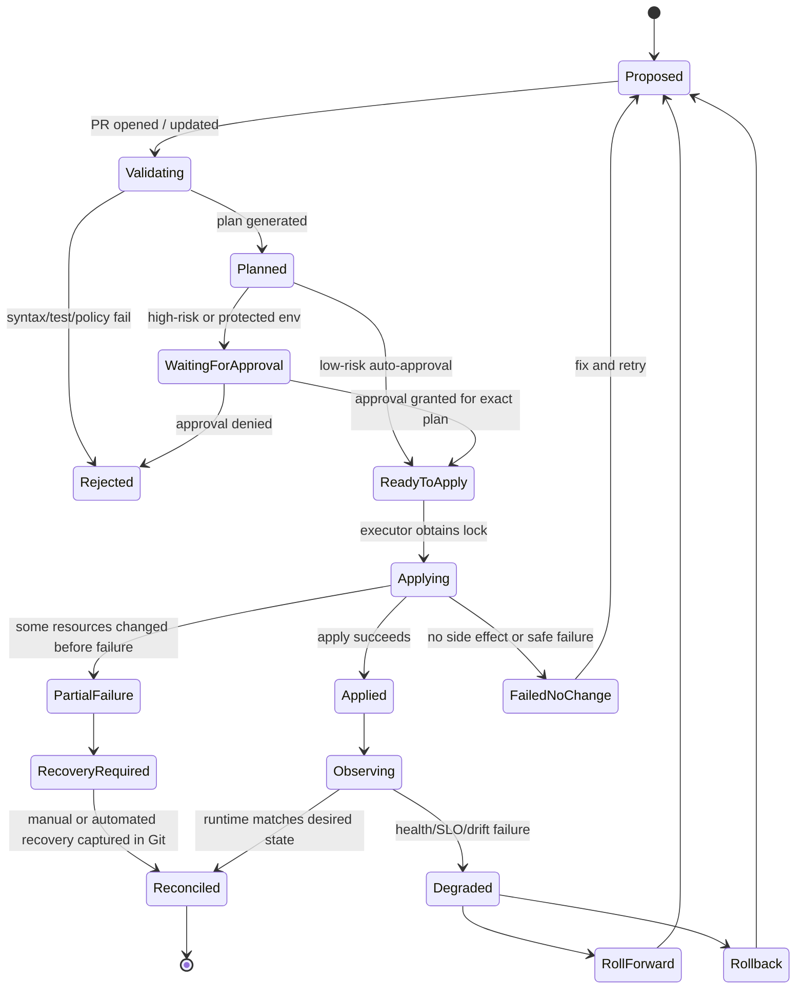
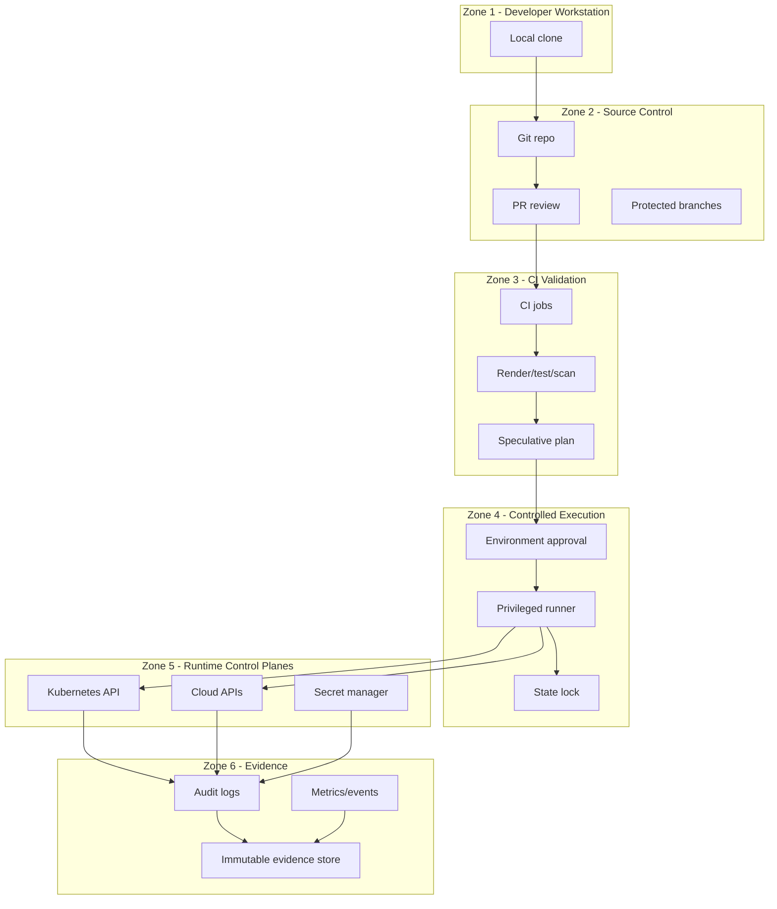

# Part 003 — System Boundaries and Pipeline Invariants

Sebelum memilih tool, kita harus menjawab pertanyaan yang lebih penting:

> Dalam sistem ini, siapa boleh mengubah apa, melalui jalur apa, dengan identitas apa, terhadap state milik siapa, dan bukti apa yang tertinggal setelah perubahan selesai?

GitOps/IaC pipeline yang buruk biasanya tidak gagal karena kurang YAML. Ia gagal karena batas sistemnya kabur.

Contoh:

- developer bisa merge konfigurasi, tetapi juga bisa mengubah runtime langsung;
- CI bisa membuat plan, tetapi plan yang di-approve bukan plan yang benar-benar di-apply;
- runner punya credential terlalu luas;
- state Terraform/OpenTofu bisa ditulis paralel;
- GitOps controller melakukan auto-sync tanpa policy boundary;
- emergency fix dilakukan manual, lalu tidak pernah direkonsiliasi kembali ke Git;
- audit evidence dibuat dari screenshot, bukan dari event chain yang bisa diverifikasi.

Di part ini kita membangun fondasi keras: **system boundaries** dan **pipeline invariants**.

Kalau Part 001 adalah skill map, dan Part 002 adalah operating model, maka Part 003 adalah kontrak desain. Ia menjawab: “desain seperti apa yang tidak boleh dilanggar meskipun tool-nya berubah?”

---

## 1. Pipeline Ini Bukan Satu Program, Tapi Distributed Control System

Pipeline GitOps/IaC modern terdiri dari banyak komponen yang berjalan di waktu berbeda, dengan identitas berbeda, dan efek samping berbeda.

Komponen utamanya:

1. **Git repository** menyimpan desired state dan history perubahan.
2. **Pull request system** menjadi tempat review, diskusi, policy feedback, dan approval.
3. **CI system** menjalankan validasi, test, render, lint, plan, scan, dan packaging.
4. **IaC runner** mengeksekusi plan/apply terhadap cloud API atau platform API.
5. **State backend** menyimpan state IaC dan menyediakan locking.
6. **Policy engine** mengevaluasi perubahan sebelum masuk runtime.
7. **Secret manager** menyimpan rahasia; Git hanya menyimpan referensi atau ciphertext yang bisa didekripsi secara terkontrol.
8. **Artifact registry** menyimpan image/chart/bundle yang immutable.
9. **GitOps controller** menarik desired state dari Git dan merekonsiliasi runtime.
10. **Runtime API** seperti Kubernetes API, cloud API, DNS API, IAM API, database API.
11. **Observability stack** menangkap logs, metrics, traces, events, audit records.
12. **Human approval system** mengikat keputusan manusia ke perubahan spesifik.

Secara mental model, jangan bayangkan pipeline sebagai garis lurus. Bayangkan sebagai sekumpulan control loop.



Hal penting: **setiap panah adalah boundary**.

Panah bukan sekadar “data mengalir”. Panah adalah tempat di mana kita harus bertanya:

- siapa pemanggilnya?
- credential apa yang digunakan?
- apakah input-nya immutable?
- apakah output-nya disimpan?
- apakah operasi ini idempotent?
- apakah ada lock?
- apakah bisa diulang?
- apakah bisa diaudit?
- apakah failure-nya aman?

Top 1% engineer tidak hanya bertanya “tool apa yang dipakai?”, tetapi “apa invariant pada setiap boundary?”

---

## 2. Definisi Boundary

Dalam konteks GitOps/IaC, **boundary** adalah titik pemisah yang mengubah trust, authority, state ownership, atau execution semantics.

Boundary bukan hanya network boundary. Ada beberapa tipe.

### 2.1 Source Boundary

Source boundary memisahkan sumber kebenaran dari representasi turunannya.

Contoh:

- Git repo adalah source untuk manifest Kubernetes.
- Terraform/OpenTofu module registry adalah source untuk reusable module version.
- Container registry adalah source untuk image artifact.
- Secret manager adalah source untuk rahasia plaintext.

Invariant source boundary:

> Setiap runtime object harus bisa ditelusuri ke source declaration atau source artifact yang jelas.

Kalau object production tidak bisa dijelaskan asalnya dari commit, artifact digest, module version, atau external source yang disetujui, object itu adalah unmanaged configuration.

### 2.2 Decision Boundary

Decision boundary adalah titik ketika sistem memutuskan apakah perubahan boleh lanjut.

Contoh:

- PR approval.
- CODEOWNERS review.
- OPA/Conftest policy result.
- cost policy approval.
- security exception approval.
- change freeze override.

Invariant decision boundary:

> Keputusan harus mengikat ke input yang immutable.

Approval terhadap “PR terbaru” tidak cukup jika branch masih bisa berubah setelah approval. Approval harus terikat pada commit SHA, plan hash, artifact digest, rendered manifest hash, atau change set ID.

### 2.3 Execution Boundary

Execution boundary adalah titik ketika sistem melakukan efek samping.

Contoh:

- `tofu apply` membuat VPC, IAM role, database, DNS record.
- Argo CD sync membuat Deployment, Service, ConfigMap.
- External Secrets Operator menulis Kubernetes Secret dari secret manager.
- cert-manager membuat certificate.

Invariant execution boundary:

> Eksekutor harus menggunakan machine identity yang least privilege dan berbeda dari identity pembuat perubahan.

Developer boleh mengusulkan perubahan. Developer tidak otomatis menjadi principal yang menulis production.

### 2.4 State Boundary

State boundary adalah batas yang menentukan siapa owner state dan bagaimana state ditulis.

Contoh:

- Terraform/OpenTofu state untuk cloud resources.
- Kubernetes API server state untuk cluster resources.
- Argo CD Application state untuk sync/health.
- database migration table untuk schema version.
- cloud control plane state untuk IAM, networking, DNS.

Invariant state boundary:

> Satu state domain harus punya satu authoritative writer untuk mutation normal.

Jika Terraform membuat IAM role, jangan biarkan Helm chart, manual console, dan Crossplane juga mengelola IAM role yang sama tanpa ownership protocol. Itu bukan fleksibilitas. Itu race condition administratif.

### 2.5 Observation Boundary

Observation boundary adalah batas antara sistem operasional dan bukti yang dikonsumsi manusia/organisasi.

Contoh:

- audit log;
- deployment event;
- PR timeline;
- policy decision log;
- cloud API trail;
- Argo CD sync history;
- Terraform/OpenTofu plan/apply log;
- incident timeline.

Invariant observation boundary:

> Bukti harus dibuat otomatis saat event terjadi, bukan dikonstruksi manual setelah masalah muncul.

Audit evidence yang dibuat setelah incident biasanya bias, tidak lengkap, dan sulit dipertahankan.

---

## 3. The Change Contract

Setiap perubahan production harus bisa direpresentasikan sebagai kontrak.

```txt
Change = {
  actor,
  intent,
  source_revision,
  rendered_output,
  diff,
  policy_result,
  approval_record,
  executor_identity,
  state_lock,
  execution_result,
  runtime_observation,
  evidence_pointer
}
```

Mari pecah satu per satu.

### 3.1 `actor`

Siapa yang mengusulkan perubahan.

Bisa manusia, bot dependency update, platform automation, atau release system.

Yang penting: actor pengusul tidak harus sama dengan executor.

### 3.2 `intent`

Apa tujuan perubahan.

Contoh intent yang baik:

- “menambah read replica untuk PostgreSQL production karena read latency melewati SLO”;
- “menaikkan replica API dari 4 ke 8 untuk event campaign tanggal 2026-07-10”;
- “membuka egress ke payment provider X melalui NAT gateway yang sudah disetujui”.

Intent buruk:

- “fix infra”;
- “update yaml”;
- “misc changes”.

Intent penting karena policy tidak selalu bisa memahami konteks bisnis. Approval manusia juga harus memahami mengapa perubahan diperlukan.

### 3.3 `source_revision`

Commit SHA, tag, artifact digest, atau module version yang menjadi sumber perubahan.

Invariant:

> Tidak boleh ada apply production dari mutable reference yang tidak dikunci.

`main` adalah pointer bergerak. `latest` adalah pointer bergerak. Branch name bukan bukti final. Untuk execution, gunakan commit SHA, plan hash, artifact digest, atau immutable release tag.

### 3.4 `rendered_output`

Output konkret yang akan dieksekusi.

Contoh:

- rendered Kubernetes manifests setelah Helm/Kustomize/Jsonnet/Cue;
- Terraform/OpenTofu plan JSON;
- Crossplane composite resource manifest;
- database migration SQL setelah templating;
- policy bundle yang dipakai untuk evaluasi.

Rendered output penting karena review terhadap source saja sering tidak cukup. Banyak sistem memakai template, default, generator, values inheritance, dan overlays. Reviewer perlu tahu hasil final.

### 3.5 `diff`

Perbedaan antara desired state baru dan state lama/live state.

Diff harus menjawab:

- resource apa dibuat?
- resource apa diubah?
- resource apa dihapus?
- apakah ada replacement?
- apakah ada downtime risk?
- apakah ada privilege escalation?
- apakah ada public exposure?
- apakah ada data-loss risk?

### 3.6 `policy_result`

Hasil evaluasi policy.

Policy result harus bukan sekadar pass/fail. Untuk sistem production-grade, policy result perlu menyimpan:

- policy set version;
- input hash;
- rule yang dievaluasi;
- decision;
- severity;
- exemption reference jika ada;
- evaluator identity;
- timestamp.

### 3.7 `approval_record`

Bukti approval.

Approval record harus mengikat ke:

- actor;
- reviewer;
- commit SHA;
- plan hash atau rendered output hash;
- environment;
- risk class;
- waktu approval;
- aturan approval yang dipenuhi.

Tanpa binding ini, approval bisa menjadi dekorasi UI, bukan control.

### 3.8 `executor_identity`

Machine identity yang menjalankan apply/sync.

Contoh:

- GitHub Actions OIDC principal;
- GitLab CI OIDC identity;
- Kubernetes ServiceAccount dengan workload identity;
- Argo CD controller identity;
- Flux controller identity;
- Terraform Cloud workspace identity;
- Spacelift stack identity.

Invariant:

> Executor identity harus scoped ke environment, state domain, dan operation class.

Jangan memakai satu credential global bernama `prod-admin` untuk semua stack.

### 3.9 `state_lock`

Bukti bahwa state domain dikunci saat mutation.

Untuk Terraform/OpenTofu, locking mencegah concurrent write yang bisa merusak state. Untuk Kubernetes, API server memiliki optimistic concurrency dan server-side apply semantics, tetapi ownership field tetap harus jelas. Untuk database migration, migration table dan transaction semantics menjadi lock/ordering mechanism.

### 3.10 `execution_result`

Hasil apply/sync.

Tidak cukup “job succeeded”. Kita perlu tahu:

- operation apa dijalankan;
- resource apa berubah;
- output apa dihasilkan;
- apakah ada partial failure;
- apakah retry dilakukan;
- apakah perubahan diverifikasi setelah apply.

### 3.11 `runtime_observation`

Apa yang benar-benar terjadi setelah perubahan.

Contoh:

- Argo CD health = healthy;
- Flux Kustomization ready = true;
- deployment rollout complete;
- load balancer reachable;
- service SLO tidak turun;
- drift tidak muncul lagi;
- cloud API resource ada dan tag-nya sesuai.

### 3.12 `evidence_pointer`

Pointer ke bukti: PR, logs, plan artifact, policy decision, approval, audit event, sync history, metrics snapshot.

Ini penting untuk organisasi yang butuh compliance. Tetapi bahkan tanpa compliance formal, evidence membantu debugging.

---

## 4. Pipeline State Machine

Setiap perubahan sebaiknya dipikirkan sebagai state machine, bukan script linear.



Yang sering salah: organisasi hanya mendesain happy path.

Happy path:

```txt
PR -> plan -> approve -> apply -> done
```

Production path yang realistis:

```txt
PR -> plan -> policy warning -> exception -> approval -> apply -> partial fail -> lock stuck -> recovery -> drift -> reconcile -> evidence
```

Kalau state machine tidak memiliki state `PartialFailure`, `RecoveryRequired`, dan `Degraded`, maka pipeline Anda belum production-grade.

---

## 5. Invariant Utama GitOps/IaC Pipeline

Invariant adalah aturan yang harus tetap benar meskipun implementasi berubah.

Tool boleh berubah. Invariant tidak.

### Invariant 1 — Desired State Harus Punya Canonical Owner

Setiap resource harus memiliki owner deklaratif.

Contoh:

| Resource | Owner Normal | Anti-Pattern |
|---|---|---|
| AWS VPC | Terraform/OpenTofu network stack | manual console + Terraform campur |
| IAM Role aplikasi | Terraform/OpenTofu identity stack | Helm chart membuat IAM tanpa review platform |
| Kubernetes Deployment | GitOps app repo via Argo/Flux | `kubectl edit` langsung di production |
| Kubernetes Secret | External Secrets Operator | plaintext secret di Git |
| DNS record | IaC DNS stack | dibuat manual saat incident lalu dilupakan |
| DB schema version | migration tool | DDL manual tanpa migration file |

Aturan praktis:

> Untuk setiap resource, harus bisa menjawab: “file mana yang mengelola resource ini, pipeline mana yang mengeksekusi, dan identity mana yang punya hak mutation?”

Jika tidak bisa dijawab, resource itu unmanaged.

### Invariant 2 — Mutasi Runtime Normal Tidak Boleh Menghindari Git

GitOps bukan berarti tidak pernah ada emergency manual action. Tetapi manual action harus menjadi exception path, bukan normal path.

Normal path:

```txt
Change intent -> Git change -> review -> policy -> apply/reconcile -> observe
```

Emergency path yang sehat:

```txt
Incident -> bounded manual action -> ticket/evidence -> backport to Git -> reconcile -> close exception
```

Emergency path yang buruk:

```txt
Incident -> console change -> nobody remembers -> drift becomes permanent
```

### Invariant 3 — Plan yang Di-approve Harus Sama dengan Plan yang Di-apply

Ini salah satu invariant paling sering dilanggar.

PR mendapat plan A. Reviewer approve. Branch berubah. Apply menjalankan plan B.

Itu bukan approval yang sah.

Solusi desain:

- simpan plan artifact;
- hash plan artifact;
- bind approval ke commit SHA dan plan hash;
- block apply jika source revision berubah setelah approval;
- regenerate plan jika ada perubahan;
- gunakan immutable artifact untuk apply.

Untuk Terraform/OpenTofu, ini berarti apply sebaiknya menggunakan saved plan file dari revision yang sama, atau minimal memverifikasi bahwa plan yang dieksekusi identik secara semantik dengan yang di-review.

### Invariant 4 — State Write Harus Serialized per State Domain

IaC state adalah shared mutable state. Shared mutable state tanpa lock adalah sumber kerusakan.

Jika dua apply menulis state yang sama secara bersamaan, failure mode-nya bisa buruk:

- state kehilangan resource;
- resource dibuat dua kali;
- output stack tidak konsisten;
- dependency stack membaca output lama;
- destroy tidak sengaja terjadi karena refresh/plan race.

Aturan:

> Satu state backend key/workspace/stack hanya boleh di-mutate oleh satu execution pada satu waktu.

Lock bukan optional hygiene. Lock adalah concurrency control.

### Invariant 5 — Executor Identity Harus Berbeda dari Human Identity

Manusia membuat keputusan. Machine identity mengeksekusi.

Kenapa?

Karena audit dan least privilege.

Jika production apply memakai credential pribadi engineer, organisasi tidak bisa membedakan:

- apakah engineer melakukan apply dari pipeline atau laptop;
- apakah credential bocor;
- apakah permission terlalu luas;
- apakah akses masih aktif setelah engineer pindah tim.

Model sehat:

```txt
Human identity -> PR/approval authority
Machine identity -> execution authority
Policy -> maps approved change to allowed execution
```

### Invariant 6 — Credential Harus Short-Lived dan Scoped

Credential jangka panjang di CI adalah risk multiplier.

Model modern memakai identity federation/OIDC supaya runner mendapatkan credential sementara berdasarkan claim yang diverifikasi:

- repository;
- branch/tag;
- environment;
- workflow;
- job;
- actor;
- audience;
- protected environment approval.

Invariant:

> Credential production hanya boleh dikeluarkan untuk workload yang memenuhi kondisi source, branch, environment, dan approval yang tepat.

### Invariant 7 — Secrets Tidak Boleh Menjadi Plain Desired State

Git boleh menyimpan desired state untuk secrets, tetapi bukan plaintext secret.

Pola yang lebih aman:

- Git menyimpan reference ke secret manager;
- Git menyimpan encrypted secret dengan SOPS dan key management yang jelas;
- Git menyimpan ExternalSecret manifest yang meminta secret dari Vault/AWS Secrets Manager/Azure Key Vault/GCP Secret Manager;
- runtime secret dibuat oleh controller dengan identity terbatas.

Invariant:

> Plaintext secret tidak boleh muncul di Git, CI logs, plan artifacts, rendered manifests, atau audit output yang tidak terenkripsi.

### Invariant 8 — Policy Harus Dievaluasi Sebelum Efek Samping

Policy yang hanya mendeteksi setelah apply adalah detective control. Itu berguna, tetapi tidak cukup.

Minimal policy gate sebelum efek samping:

- IaC plan policy;
- rendered manifest policy;
- dependency/artifact policy;
- secret reference policy;
- approval policy;
- environment protection policy.

Policy tidak harus menghentikan semua perubahan. Policy bisa menghasilkan:

- allow;
- deny;
- warn;
- require approval;
- require exception;
- require manual review from owner.

### Invariant 9 — Runtime Drift Harus Diklasifikasi

Tidak semua drift sama.

| Drift Type | Contoh | Respons |
|---|---|---|
| Accidental drift | seseorang edit replica count manual | auto-reconcile atau PR backport |
| Emergency drift | hotfix saat incident | capture evidence, backport, expire exception |
| Controller drift | controller lain mengubah field yang sama | perbaiki ownership boundary |
| Provider drift | cloud provider default berubah | update module atau ignore field terkontrol |
| Malicious drift | akses tidak sah mengubah IAM/security group | incident response |

Invariant:

> Drift harus terlihat, diklasifikasi, dan punya owner respons.

“Auto-heal semua drift” terdengar ideal, tetapi kadang berbahaya. Misalnya saat incident, manual scale-up mungkin sengaja dilakukan untuk menjaga availability. Auto-heal langsung menurunkannya kembali bisa memperburuk incident.

### Invariant 10 — Destructive Change Harus Punya Jalur Khusus

Tidak semua change set setara.

Change biasa:

- menambah tag;
- menaikkan CPU request;
- menambah replica;
- update image digest.

Change berbahaya:

- delete database;
- replace subnet;
- rotate root key;
- destroy IAM role shared;
- recreate load balancer;
- drop column;
- disable encryption;
- open public ingress;
- remove backup policy.

Destructive change harus punya:

- explicit detection;
- higher approval;
- backup/restore plan;
- maintenance window jika perlu;
- rollback/rollforward plan;
- manual confirmation jika irreversible.

### Invariant 11 — Promotion Harus Immutable

Promosi environment tidak boleh berarti “render ulang dari floating dependency”.

Buruk:

```txt
dev uses chart latest
stage uses chart latest
prod uses chart latest
```

Baik:

```txt
dev validates artifact digest sha256:abc
stage promotes same digest sha256:abc
prod promotes same digest sha256:abc
```

Untuk infra modules:

```txt
module version 1.4.2 -> validated in dev -> promoted to stage -> promoted to prod
```

Bukan:

```txt
main branch module -> semua environment mengambil perubahan terbaru tanpa promotion record
```

### Invariant 12 — Evidence Harus Otomatis

Sistem yang baik meninggalkan jejak:

- siapa mengusulkan;
- siapa review;
- commit apa;
- plan apa;
- policy apa;
- approval apa;
- executor apa;
- resource apa berubah;
- health apa setelah apply;
- exception apa dipakai.

Kalau evidence perlu dikumpulkan manual dari 10 tempat, pipeline belum cukup matang.

---

## 6. Ownership Matrix

Salah satu artifact pertama yang harus dibuat dalam platform GitOps/IaC adalah ownership matrix.

| Domain | Source of Truth | Executor | State Owner | Runtime Owner | Approval Owner |
|---|---|---|---|---|---|
| Network baseline | infra-live/network | IaC runner network-prod | OpenTofu state network-prod | Platform network team | Network CODEOWNER |
| IAM baseline | infra-live/iam | IaC runner iam-prod | OpenTofu state iam-prod | Platform security team | Security CODEOWNER |
| Kubernetes platform addons | platform-gitops repo | Argo/Flux platform controller | Kubernetes API | Platform team | Platform CODEOWNER |
| Application deployment | app-env repo | Argo/Flux app controller | Kubernetes API | App team | App CODEOWNER |
| Secrets references | app-env repo | External Secrets controller | Secret manager + Kubernetes Secret | App/platform shared | App + security rule |
| DB schema | app repo migrations | migration runner | migration table | App team | App + DBA/data owner |
| DNS | infra-live/dns | IaC runner dns-prod | OpenTofu state dns-prod | Platform network team | Network/platform |
| Observability config | observability repo | GitOps controller | Kubernetes API / SaaS API | SRE/platform | SRE CODEOWNER |

Matrix ini bukan birokrasi. Ini mencegah resource menjadi yatim piatu.

Pertanyaan review:

1. Apakah ada domain tanpa source of truth?
2. Apakah ada domain dengan dua executor?
3. Apakah state owner dan runtime owner berbeda tanpa kontrak?
4. Apakah approval owner punya konteks risiko?
5. Apakah ada runner dengan privilege lintas domain terlalu luas?

---

## 7. Trust Zones

Kita perlu memisahkan area berdasarkan tingkat trust.



Design principle:

> Semakin dekat ke runtime production, semakin kecil jumlah actor, semakin pendek umur credential, semakin kuat audit, dan semakin ketat policy.

Developer workstation adalah low-trust zone. Ia tidak boleh menyimpan production credential jangka panjang. Ia boleh membuat PR dan menjalankan local validation.

CI validation zone adalah medium-trust. Ia boleh membaca source, membuat plan, scan, dan komentar PR. Tetapi belum tentu boleh apply production.

Controlled execution zone adalah high-trust. Ia boleh melakukan efek samping, tetapi hanya setelah boundary dipenuhi.

Runtime control plane adalah ultimate side-effect zone. Semua akses harus eksplisit.

Evidence zone harus append-only atau minimal tamper-resistant.

---

## 8. Normal Path vs Exception Path

Production platform yang matang tidak menolak kenyataan bahwa incident terjadi. Ia membedakan normal path dan exception path.

### 8.1 Normal Path

```txt
PR dibuat
  -> validasi syntax/test/render
  -> plan/diff dibuat
  -> policy dievaluasi
  -> approval sesuai risk class
  -> apply/sync oleh machine identity
  -> health/drift diamati
  -> evidence disimpan
```

### 8.2 Exception Path

```txt
Incident aktif
  -> incident commander mengizinkan emergency action
  -> action dilakukan dengan break-glass identity terbatas waktu
  -> semua command/API call diaudit
  -> issue/PR dibuat untuk backport desired state
  -> drift ditutup
  -> exception expired
  -> post-incident review memperbaiki normal path
```

Exception path bukan celah permanen. Ia harus punya TTL.

Anti-pattern umum:

> “Kami GitOps, kecuali production yang sering diubah manual karena urgent.”

Itu bukan GitOps. Itu manual ops dengan repository dekoratif.

---

## 9. Boundary Failure Modes

Mari lihat failure mode berdasarkan boundary.

### 9.1 Source Boundary Failure

Gejala:

- runtime object tidak punya source file;
- ada resource dibuat manual;
- `kubectl diff` menunjukkan banyak perubahan yang tidak ada di Git;
- Terraform/OpenTofu state punya resource yang tidak ada di repo;
- repo punya resource yang sudah tidak ada di runtime.

Dampak:

- rollback tidak jelas;
- audit sulit;
- ownership kabur;
- perubahan berikutnya bisa menghancurkan manual fix.

Mitigasi:

- resource inventory;
- tag/label ownership;
- drift detection;
- import unmanaged resources ke IaC;
- enforce mutation path.

### 9.2 Decision Boundary Failure

Gejala:

- approval diberikan sebelum plan final;
- policy warning diabaikan tanpa exception;
- CODEOWNERS terlalu luas;
- reviewer tidak mengerti domain;
- bot bisa merge perubahan berisiko.

Dampak:

- approval tidak bermakna;
- compliance evidence lemah;
- high-risk change masuk production.

Mitigasi:

- approval binding ke hash;
- risk-based approval;
- policy-as-code;
- environment protection;
- reviewer domain mapping.

### 9.3 Execution Boundary Failure

Gejala:

- runner credential terlalu luas;
- CI job untrusted bisa mengakses secret production;
- apply dari laptop;
- satu runner mengelola semua account/cluster;
- log berisi secret.

Dampak:

- privilege escalation;
- lateral movement;
- production compromise;
- sulit atribusi.

Mitigasi:

- OIDC federation;
- scoped machine identities;
- protected runner pool;
- network egress control;
- secret masking dan redaction;
- per-environment execution identity.

### 9.4 State Boundary Failure

Gejala:

- lock stuck;
- concurrent apply;
- state file berubah manual;
- resource address berubah tanpa migration;
- state backend tidak terenkripsi;
- workspace salah dipakai.

Dampak:

- corrupt state;
- accidental destroy;
- orphaned resources;
- output dependency salah.

Mitigasi:

- remote backend dengan locking;
- per-stack state isolation;
- state backup/versioning;
- formal state migration process;
- restricted state backend access.

### 9.5 Observation Boundary Failure

Gejala:

- tidak tahu perubahan terakhir yang menyebabkan outage;
- logs CI hilang;
- Argo/Flux events tidak dikumpulkan;
- cloud audit trail tidak dikorelasikan dengan PR;
- tidak ada deployment timeline.

Dampak:

- MTTR naik;
- postmortem lemah;
- audit gagal;
- organisasi kehilangan kepercayaan ke pipeline.

Mitigasi:

- event correlation ID;
- immutable log retention;
- PR/deployment/audit linking;
- metrics untuk reconciliation;
- evidence archive.

---

## 10. Resource Ownership Protocol

Untuk mencegah double-writer, tetapkan ownership protocol.

Minimal setiap resource deklaratif memiliki metadata:

```yaml
metadata:
  labels:
    app.kubernetes.io/managed-by: argocd
    platform.example.com/owner-team: payments
    platform.example.com/environment: prod
    platform.example.com/source-repo: payments-env
    platform.example.com/source-path: clusters/prod/payments
  annotations:
    platform.example.com/change-policy: standard
    platform.example.com/escalation-owner: sre-payments
```

Untuk cloud resources, gunakan tag set sejenis:

```hcl
tags = {
  ManagedBy     = "opentofu"
  OwnerTeam     = "platform-network"
  Environment   = "prod"
  Stack         = "network-prod"
  SourceRepo    = "infra-live"
  DataClass     = "internal"
  CostCenter    = "platform"
}
```

Metadata bukan cosmetic. Ia mendukung:

- inventory;
- cost allocation;
- policy enforcement;
- incident routing;
- ownership discovery;
- drift classification;
- decommissioning.

---

## 11. Risk Classification

Pipeline tidak boleh memperlakukan semua perubahan sama.

Gunakan risk class.

| Risk Class | Contoh | Gate |
|---|---|---|
| R0 — No runtime effect | README, comment, docs | normal review |
| R1 — Low risk additive | tag, label, dashboard, non-prod config | CI + owner review |
| R2 — Standard change | replica, resource limit, new queue, non-critical IAM read | plan + policy + CODEOWNER |
| R3 — Sensitive change | prod IAM, network route, ingress, secret reference, DB param | security/platform approval |
| R4 — Destructive/irreversible | delete DB, replace subnet, drop column, disable backup | change window + senior approval + rollback plan |
| R5 — Emergency | incident mitigation | break-glass + after-action backport |

Risk classification bisa otomatis sebagian, tetapi tidak seluruhnya.

Contoh policy otomatis:

- detect `delete` or `replace` resource;
- detect public CIDR `0.0.0.0/0`;
- detect wildcard IAM action;
- detect `LoadBalancer` public service;
- detect secret plaintext;
- detect database deletion protection disabled;
- detect replica reduction below minimum;
- detect chart/image uses mutable tag.

Namun konteks bisnis tetap penting. Membuka egress ke provider tertentu bisa low risk atau high risk tergantung data class.

---

## 12. Designing for Idempotency

Idempotency berarti menjalankan operasi berkali-kali menghasilkan state akhir yang sama.

GitOps/IaC bergantung pada idempotency.

Tetapi banyak operation tidak idempotent secara alami:

- generate random password;
- create database migration with side effects;
- rotate key;
- send notification;
- provision external SaaS resource;
- run script via `null_resource`;
- execute ad-hoc SQL.

Aturan:

> Jika operasi tidak idempotent, jangan disembunyikan sebagai resource deklaratif biasa tanpa state dan recovery protocol.

Untuk non-idempotent operation, butuh:

- explicit state record;
- operation ID;
- retry strategy;
- compensating action;
- human approval;
- log evidence;
- timeout behavior;
- duplicate detection.

Dalam desain pipeline, anggap semua external API bisa:

- timeout setelah sukses;
- sukses parsial;
- gagal sementara;
- mengembalikan eventual consistency;
- menolak delete karena dependency;
- mengubah default tanpa notifikasi.

---

## 13. Desain Boundary untuk Pull Request

PR adalah decision surface, bukan sekadar code review.

PR production-grade harus menampilkan:

1. intent perubahan;
2. affected environments;
3. affected stacks/apps;
4. plan/diff summary;
5. risk classification;
6. policy result;
7. cost impact jika relevan;
8. secret exposure check;
9. approval requirements;
10. rollback/rollforward notes;
11. evidence link setelah apply.

Contoh PR comment yang berguna:

```txt
Stack: prod/network
Commit: 9f3a12c
Plan hash: sha256:abc123
Risk: R3 - network exposure change

Summary:
  + aws_security_group_rule.api_ingress
  ~ aws_lb_listener.api_https

Policy:
  PASS encryption-required
  PASS required-tags
  WARN public-ingress-requires-owner
  REQUIRE approval: platform-network, security

Apply allowed after:
  - CODEOWNER approval from platform-network
  - security approval
  - no new commits after plan generation
```

Bandingkan dengan komentar buruk:

```txt
Terraform plan succeeded.
```

Komentar buruk tidak memberi reasoning.

---

## 14. Desain Boundary untuk Apply

Apply adalah efek samping. Perlakukan seperti operasi berisiko.

Sebelum apply:

- source revision immutable;
- plan sesuai revision;
- policy pass atau exception valid;
- approval terpenuhi;
- environment tidak freeze;
- state lock tersedia;
- runner identity benar;
- secrets tersedia tanpa bocor;
- dependency stack sehat.

Selama apply:

- log correlation ID;
- lock diperoleh;
- timeout jelas;
- retry terbatas;
- output disimpan;
- secret redaction aktif.

Setelah apply:

- refresh/readback state;
- validate outputs;
- publish event;
- update PR/status;
- trigger downstream reconciliation jika perlu;
- archive evidence;
- release lock.

---

## 15. GitOps Controller Boundary

Argo CD/Flux bukan sekadar deployment tool. Mereka adalah reconciliation agents.

Boundary pertanyaan:

- controller boleh membaca repo apa?
- controller boleh menulis namespace apa?
- controller boleh membuat CRD/cluster-wide resource?
- controller boleh auto-sync atau manual sync?
- apakah prune aktif?
- apakah self-heal aktif?
- siapa boleh override sync?
- bagaimana secret didekripsi?
- apakah controller punya permission lintas tenant?

Design principle:

> GitOps controller privilege harus mengikuti blast radius aplikasi/environment, bukan kenyamanan instalasi.

Anti-pattern:

- satu Argo CD admin instance dengan cluster-admin ke semua cluster dan semua namespace;
- semua tim bisa membuat Application ke namespace mana saja;
- AppProject tidak membatasi source repo/destination/cluster resource;
- auto-prune aktif untuk resource yang belum jelas ownership-nya.

---

## 16. Boundary Checklist

Gunakan checklist ini saat review architecture.

### Source

- [ ] Setiap resource punya source declaration.
- [ ] Artifact yang dipromosikan immutable.
- [ ] Module/chart/image version dikunci.
- [ ] Tidak ada mutable `latest` untuk production.

### Decision

- [ ] Plan/rendered output tersedia untuk review.
- [ ] Approval terikat ke commit/plan hash.
- [ ] Risk class diketahui.
- [ ] CODEOWNER sesuai domain.
- [ ] Policy result disimpan.

### Execution

- [ ] Apply hanya oleh machine identity.
- [ ] Credential short-lived.
- [ ] Runner scoped per environment/domain.
- [ ] Protected branch/environment aktif.
- [ ] Secret tidak muncul di log.

### State

- [ ] Remote state backend digunakan.
- [ ] Locking aktif.
- [ ] State dipisah per blast radius.
- [ ] State access dibatasi.
- [ ] State backup/versioning tersedia.

### Reconciliation

- [ ] GitOps controller pull dari repo yang benar.
- [ ] Scope controller dibatasi.
- [ ] Drift terlihat.
- [ ] Prune/self-heal policy jelas.
- [ ] Manual drift punya backport process.

### Evidence

- [ ] PR, plan, policy, approval, apply, runtime health bisa dikorelasikan.
- [ ] Logs disimpan cukup lama.
- [ ] Audit trail cloud/cluster aktif.
- [ ] Evidence tidak mudah dimodifikasi.
- [ ] Exception punya TTL dan owner.

---

## 17. Latihan Part 003

### Latihan 1 — Buat Boundary Map

Ambil satu sistem nyata atau hipotetis. Buat boundary map:

```txt
Actor -> PR -> CI -> Plan -> Policy -> Approval -> Apply -> Runtime -> Observe
```

Untuk setiap boundary, tulis:

- input;
- output;
- trust level;
- credential;
- owner;
- failure mode;
- evidence.

### Latihan 2 — Resource Ownership Matrix

Buat tabel ownership untuk minimal 10 resource:

- VPC/subnet;
- IAM role;
- Kubernetes namespace;
- Deployment;
- Secret;
- ConfigMap;
- database;
- DNS;
- queue/topic;
- dashboard/alert.

Tandai resource yang punya lebih dari satu writer.

### Latihan 3 — Approval Binding

Desain mekanisme approval yang mengikat ke:

- commit SHA;
- plan hash;
- environment;
- approver;
- policy result.

Jelaskan apa yang terjadi jika ada commit baru setelah approval.

### Latihan 4 — Exception Path

Desain break-glass flow:

- siapa boleh memulai;
- permission apa yang diberikan;
- berapa lama credential berlaku;
- event apa yang diaudit;
- bagaimana backport ke Git;
- kapan exception ditutup.

---

## 18. Ringkasan

Part ini membangun fondasi:

1. GitOps/IaC pipeline adalah distributed control system.
2. Boundary adalah titik perubahan trust, authority, state ownership, atau execution semantics.
3. Setiap production change harus memiliki change contract.
4. Pipeline perlu state machine yang menangani failure, bukan hanya happy path.
5. Invariant utama: source ownership, Git path, plan binding, state serialization, machine identity, scoped credentials, secret safety, policy before side effect, drift classification, destructive gate, immutable promotion, automatic evidence.
6. Resource ownership matrix mencegah double-writer.
7. Trust zone membantu membatasi blast radius.
8. Exception path harus eksplisit, bounded, dan kembali ke desired state.

Kalau sistem Anda belum bisa menjawab “siapa mengubah apa, dari mana, dengan izin apa, terhadap state siapa, dan bukti apa yang tertinggal”, maka toolchain-nya belum penting. Boundary-nya belum matang.

Part berikutnya menerjemahkan invariant ini menjadi **reference architecture** end-to-end.
