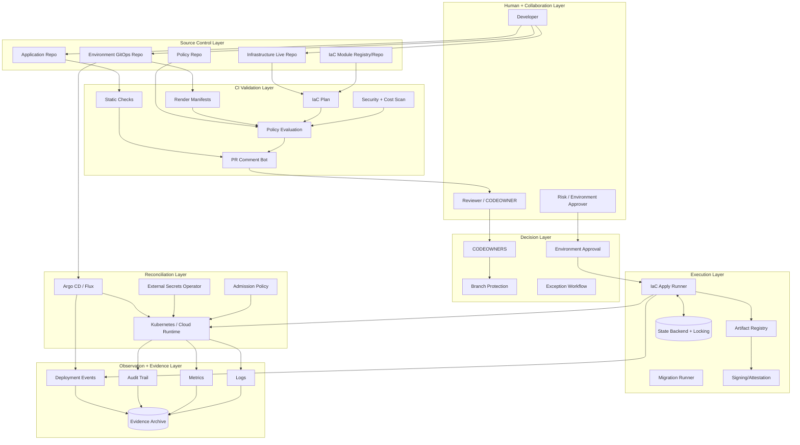
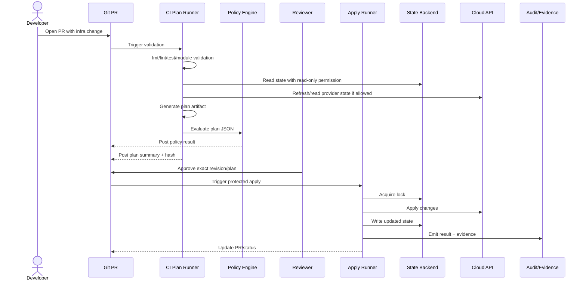
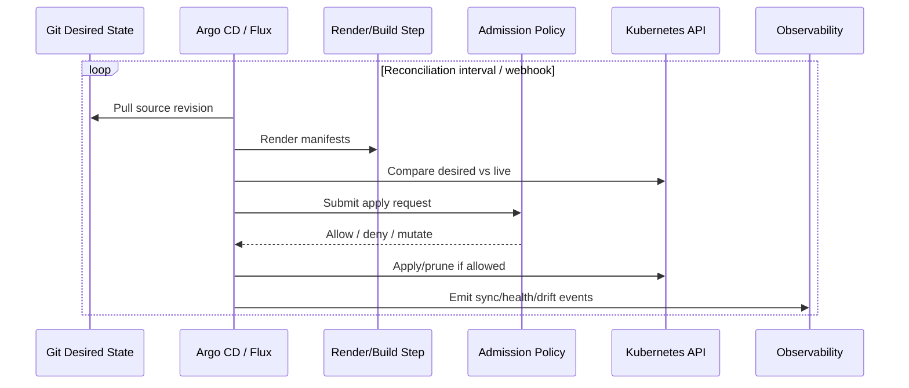
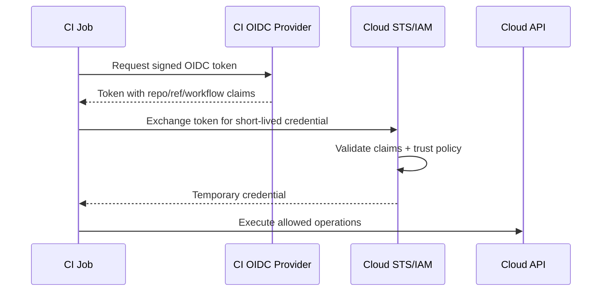
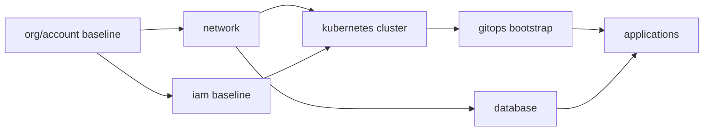
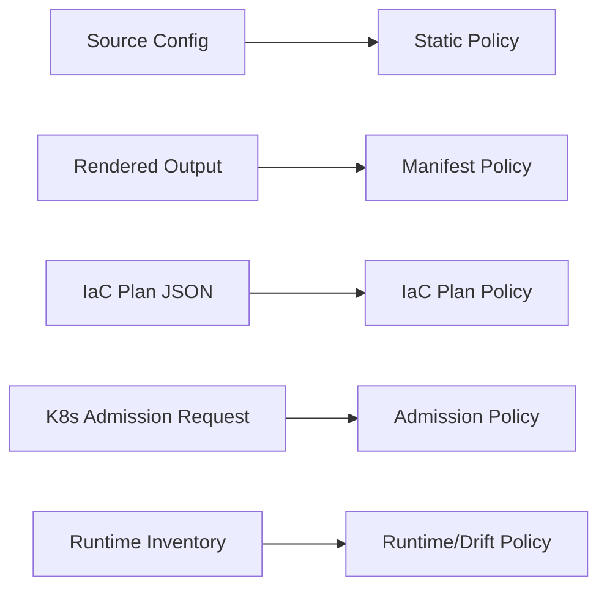
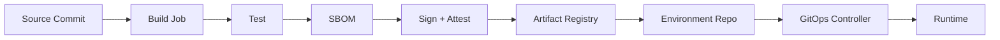
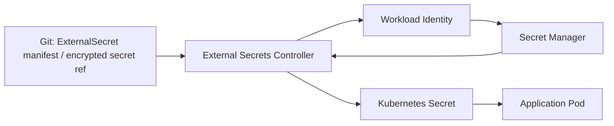
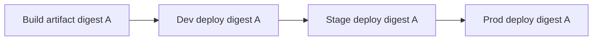

# Part 004 — Reference Architecture of a Modern GitOps/IaC Platform

Part ini menjawab pertanyaan praktis:

> Jika kita harus membangun GitOps/IaC platform production-grade dari nol untuk organisasi engineering serius, bentuk arsitektur minimal yang masuk akal seperti apa?

Kita tidak akan membuat diagram vendor marketing. Kita akan membuat arsitektur yang bisa dioperasikan.

Target arsitektur:

- developer mengusulkan perubahan via pull request;
- sistem membuat plan/diff yang bisa direview;
- policy mengevaluasi risiko sebelum efek samping;
- approval mengikat ke perubahan spesifik;
- apply dilakukan oleh machine identity yang least privilege;
- GitOps controller menarik desired state dan merekonsiliasi runtime;
- drift terlihat dan ditangani;
- semua event penting meninggalkan evidence;
- failure path tidak dianggap anomali, tetapi bagian dari desain.

---

## 1. Prinsip Arsitektur

Reference architecture ini mengikuti lima prinsip.

### 1.1 Git adalah Source of Intent, Bukan Satu-satunya State

Git menyimpan desired state, intent, dan history. Tetapi runtime state tetap hidup di control plane:

- cloud API;
- Kubernetes API server;
- Terraform/OpenTofu state backend;
- database migration table;
- secret manager;
- artifact registry;
- observability backend.

GitOps yang matang tidak pura-pura bahwa Git adalah semua state. Ia mengatur hubungan antara Git dan state lain melalui reconciliation, drift detection, dan evidence.

### 1.2 Pull Request adalah Control Surface

PR bukan hanya review kode. PR adalah tempat sistem menggabungkan:

- intent;
- diff;
- risk classification;
- policy result;
- cost impact;
- security feedback;
- approval;
- execution status;
- evidence link.

PR yang baik membuat reviewer bisa mengambil keputusan tanpa menjalankan tool lokal.

### 1.3 Runner adalah Execution Boundary

Runner yang melakukan apply/sync adalah komponen berisiko tinggi.

Ia harus:

- isolated;
- short-lived atau ephemeral jika memungkinkan;
- menggunakan workload identity/OIDC;
- scoped per environment/domain;
- tidak menerima input mutable tanpa verifikasi;
- tidak menyimpan secret permanen;
- mengirim audit events.

### 1.4 Reconciliation adalah Continuous Verification

GitOps controller tidak hanya deploy. Ia terus membandingkan desired state dan live state.

Arsitektur harus menangani:

- sync success;
- sync failure;
- health degraded;
- drift;
- prune;
- self-heal;
- dependency ordering;
- manual override;
- controller outage.

### 1.5 Evidence adalah Product dari Pipeline

Evidence bukan pekerjaan manual compliance di akhir quarter.

Setiap stage harus mengeluarkan event:

- PR opened;
- plan generated;
- policy evaluated;
- approval granted;
- apply started;
- apply completed;
- sync started;
- sync healthy;
- drift detected;
- rollback/rollforward executed.

---

## 2. High-Level Reference Architecture



Arsitektur ini sengaja memisahkan empat jalur:

1. **IaC path** untuk external/cloud infrastructure.
2. **GitOps app/platform path** untuk Kubernetes desired state.
3. **Policy/security path** untuk keputusan dan guardrails.
4. **Evidence path** untuk auditability dan debugging.

Kesalahan umum adalah mencampur semuanya menjadi satu pipeline YAML besar. Itu membuat ownership, security, dan failure recovery sulit.

---

## 3. Dua Pipeline Utama: IaC Pipeline dan GitOps Reconciliation

GitOps/IaC platform modern biasanya memiliki dua model execution yang berbeda.

### 3.1 IaC Pipeline

IaC pipeline biasanya event-driven oleh PR atau merge.



IaC pipeline cocok untuk resource yang punya state backend eksplisit:

- VPC/subnet/route table;
- IAM;
- managed database;
- DNS;
- object storage;
- queues/topics;
- Kubernetes cluster;
- cloud project/account/folder;
- external SaaS resources.

### 3.2 GitOps Reconciliation Pipeline

GitOps reconciliation biasanya controller-driven. Controller menarik desired state dari Git, bukan menunggu push dari CI.



GitOps reconciliation cocok untuk:

- Kubernetes application manifests;
- Helm releases;
- Kustomize overlays;
- platform add-ons;
- namespace-level configuration;
- service accounts and RBAC;
- network policies;
- controller CRDs;
- secret references.

### 3.3 Jangan Paksa Semua ke Satu Model

Tidak semua perubahan cocok untuk GitOps controller.

Misalnya:

- membuat cloud account baru bisa lebih cocok lewat IaC runner;
- deployment Kubernetes cocok lewat GitOps controller;
- database migration butuh sequencing khusus;
- secret rotation butuh workflow khusus;
- one-off data backfill tidak boleh disembunyikan sebagai manifest biasa.

Architecture decision:

| Change Type | Recommended Path | Reason |
|---|---|---|
| Cloud network baseline | IaC pipeline | state, dependencies, locking |
| IAM role/policy | IaC pipeline | high risk, policy plan review |
| Kubernetes deployment | GitOps controller | continuous reconciliation |
| Helm chart release | GitOps controller | declarative release state |
| DB schema migration | migration runner + release orchestration | ordering, data risk |
| Secret reference | GitOps + External Secrets | no plaintext in Git |
| Secret value rotation | secret manager workflow | sensitive side effect |
| SaaS user creation | identity lifecycle workflow | not always idempotent |
| Emergency manual scale | break-glass + backport | incident handling |

---

## 4. Repository Architecture

Repository topology menentukan cognitive load, blast radius, ownership, dan policy design.

Reference architecture ini memakai beberapa repo logis. Dalam organisasi kecil, beberapa bisa digabung. Dalam organisasi besar, biasanya dipisah.

```txt
org/
  app-payments/
  app-orders/
  infra-modules/
  infra-live/
  platform-gitops/
  env-gitops/
  policy-library/
  security-exceptions/
  evidence-index/
```

### 4.1 Application Repo

Berisi source code aplikasi dan definisi build.

```txt
app-payments/
  src/
  Dockerfile
  pom.xml / build.gradle / package.json
  deploy/
    base/
      deployment.yaml
      service.yaml
    overlays/
      dev/
      stage/
      prod/
  migrations/
    V001__init.sql
    V002__add_payment_status.sql
  .github/workflows/
    build-test.yaml
    image-release.yaml
```

Application repo bertanggung jawab untuk:

- build artifact;
- unit/integration test;
- image creation;
- SBOM/provenance;
- app-level manifests base;
- schema migration scripts;
- release artifact.

Application repo tidak sebaiknya memiliki credential production cloud luas.

### 4.2 Environment GitOps Repo

Berisi desired state per environment/cluster.

```txt
env-gitops/
  clusters/
    dev-ap-southeast-1/
      apps/
        payments/
          kustomization.yaml
          values.yaml
        orders/
      platform/
        ingress/
        monitoring/
    prod-ap-southeast-1/
      apps/
        payments/
          kustomization.yaml
          image-patch.yaml
          values.yaml
        orders/
      platform/
        ingress/
        monitoring/
  tenants/
    payments/
    orders/
```

Repo ini adalah source of truth untuk runtime Kubernetes.

Ia harus mudah dijawab:

- aplikasi apa jalan di cluster apa;
- versi artifact apa yang dipakai;
- config apa yang berbeda per environment;
- siapa owner perubahan;
- policy apa yang berlaku.

### 4.3 Infrastructure Live Repo

Berisi komposisi stack konkret per account/region/environment.

```txt
infra-live/
  accounts/
    prod/
      ap-southeast-1/
        network/
        identity/
        eks-cluster/
        rds-payments/
        dns/
    stage/
      ap-southeast-1/
        network/
        identity/
        eks-cluster/
  global/
    iam-baseline/
    audit-logging/
```

Infra-live bukan tempat module logic kompleks. Ia adalah tempat wiring:

- module version;
- input per environment;
- backend key;
- provider/account binding;
- dependency output;
- stack ownership.

### 4.4 Infrastructure Module Repo

Berisi reusable modules.

```txt
infra-modules/
  modules/
    vpc/
    eks-cluster/
    rds-postgres/
    iam-role/
    s3-bucket/
  tests/
  examples/
  docs/
  versions.md
```

Module harus versioned. Infra-live harus pin ke version tertentu.

Anti-pattern:

```hcl
source = "git::ssh://git.example.com/infra-modules.git//modules/vpc?ref=main"
```

Lebih baik:

```hcl
source = "git::ssh://git.example.com/infra-modules.git//modules/vpc?ref=v1.8.3"
```

### 4.5 Policy Repo

Berisi policy yang digunakan CI dan admission.

```txt
policy-library/
  iac/
    network.rego
    iam.rego
    database.rego
    cost.rego
  kubernetes/
    workload-security.rego
    required-labels.rego
    ingress.rego
  kyverno/
    require-image-digest.yaml
    restrict-hostpath.yaml
  exceptions/
    schema.yaml
  tests/
```

Policy harus versioned seperti code. Policy change sendiri harus melalui review.

### 4.6 Exception Repo

Exception adalah data, bukan komentar Slack.

```txt
security-exceptions/
  exceptions/
    EXC-2026-001-public-ingress-payments.yaml
    EXC-2026-002-temporary-wildcard-iam.yaml
```

Contoh:

```yaml
id: EXC-2026-001
policy: public-ingress-requires-security-review
resource: prod/payments/api-ingress
owner: payments-platform
approvedBy:
  - security-lead@example.com
reason: Temporary partner integration test
expiresAt: 2026-08-01T00:00:00Z
constraints:
  sourceCidr:
    - 203.0.113.0/24
```

Exception harus punya TTL. Exception tanpa expiry akan menjadi policy bypass permanen.

---

## 5. Stage-by-Stage Architecture Contract

Setiap stage harus punya input, output, authority, dan failure handling.

### 5.1 Stage 1 — Change Proposal

**Input:** branch change.  
**Output:** pull request.  
**Authority:** developer can propose, not execute production.  
**Evidence:** PR ID, actor, diff, timestamp.

Checklist:

- PR template meminta intent;
- affected environment disebutkan;
- change type dipilih;
- rollback notes tersedia untuk risky change;
- issue/change request link jika diperlukan.

### 5.2 Stage 2 — Static Validation

**Input:** PR revision.  
**Output:** validation result.  
**Authority:** CI read-only.  
**Evidence:** check run logs.

Validasi:

- formatting;
- schema validation;
- module validation;
- YAML/JSON syntax;
- Helm/Kustomize render;
- Terraform/OpenTofu validate;
- dependency lock check;
- secret scanning.

Failure rule:

> Static validation failure blocks plan/apply. Jangan membuat plan dari source yang tidak valid.

### 5.3 Stage 3 — Render and Normalize

**Input:** source config.  
**Output:** rendered manifests/normalized plan input.  
**Authority:** CI read-only.  
**Evidence:** rendered artifact hash.

Kenapa render penting?

Karena reviewer tidak boleh hanya melihat template. Reviewer harus melihat hasil akhir.

Helm values, Kustomize patches, Jsonnet, Cue, dan generator bisa menyembunyikan perubahan besar.

### 5.4 Stage 4 — Plan/Diff

**Input:** source revision, state snapshot, provider read.  
**Output:** plan artifact/diff.  
**Authority:** read-only access ke state dan provider jika memungkinkan.  
**Evidence:** plan hash, plan JSON, summary.

Plan harus menjelaskan:

- create/update/delete/replace;
- affected resources;
- sensitive outputs redacted;
- risk signals;
- dependencies;
- estimated cost jika tersedia.

### 5.5 Stage 5 — Policy Evaluation

**Input:** rendered manifests, plan JSON, metadata, exceptions.  
**Output:** allow/deny/warn/require-approval.  
**Authority:** policy engine.  
**Evidence:** policy version, decision log.

Policy evaluation sebaiknya murni/deterministik:

```txt
same input + same policy version = same decision
```

Jika policy tergantung runtime external data, cache/version data tersebut agar decision bisa direproduksi.

### 5.6 Stage 6 — Review and Approval

**Input:** PR, plan, policy decision.  
**Output:** approval record.  
**Authority:** CODEOWNER/environment approver/security approver.  
**Evidence:** approval event bound to revision and plan.

Approval harus risk-based.

Contoh:

| Risk | Required Approval |
|---|---|
| R1 | app CODEOWNER |
| R2 | app/platform CODEOWNER |
| R3 | platform + security |
| R4 | platform + security + senior change approver |
| R5 | incident commander + post-incident review |

### 5.7 Stage 7 — Apply / Merge / Sync

Ada dua model.

Untuk IaC:

```txt
approved plan -> apply runner -> state lock -> cloud API -> state update
```

Untuk GitOps:

```txt
merge to protected branch -> controller pulls -> diff -> apply -> health
```

Keduanya tetap perlu evidence.

### 5.8 Stage 8 — Runtime Verification

**Input:** runtime state after apply/sync.  
**Output:** health/readiness result.  
**Authority:** observer/checker.  
**Evidence:** deployment event, metrics snapshot.

Verification bisa mencakup:

- Kubernetes rollout status;
- Argo/Flux health;
- service endpoint check;
- synthetic test;
- SLO burn rate check;
- cloud resource readback;
- drift check;
- DB migration status.

### 5.9 Stage 9 — Evidence Archive

**Input:** all previous event references.  
**Output:** immutable evidence bundle.  
**Authority:** audit/evidence service.  
**Evidence:** archive index.

Evidence bundle minimal:

```yaml
changeId: CHG-2026-07-03-001
source:
  repo: infra-live
  commit: 9f3a12c
plan:
  hash: sha256:abc123
  artifact: plan-prod-network-9f3a12c.json
policy:
  version: policy-library@4e12aa
  decision: require-approval
approval:
  approvers:
    - platform-network
    - security
execution:
  runner: iac-runner-prod-network
  identity: oidc:repo:infra-live:env:prod
  result: success
runtime:
  verification: passed
  drift: none
```

---

## 6. Identity Architecture

Identity adalah pusat keamanan pipeline.

### 6.1 Human Identity

Human identity digunakan untuk:

- membuat PR;
- review;
- approval;
- exception request;
- break-glass request.

Human identity tidak ideal untuk apply production normal.

### 6.2 Machine Identity

Machine identity digunakan untuk:

- CI read-only validation;
- IaC plan read access;
- IaC apply write access;
- GitOps controller sync;
- secret reconciliation;
- admission policy;
- evidence publishing.

Prinsip:

```txt
one environment + one domain + one execution role
```

Contoh:

```txt
iac-plan-prod-network-readonly
iac-apply-prod-network-write
iac-apply-prod-iam-write
gitops-prod-payments-namespace
gitops-prod-platform-cluster-admin-limited
external-secrets-prod-payments-read
```

### 6.3 OIDC Federation Pattern

Daripada menyimpan access key permanen di CI, gunakan OIDC federation.



Trust policy harus memvalidasi claim seperti:

- organization;
- repository;
- branch/tag;
- environment;
- workflow identity;
- pull request vs protected branch;
- audience;
- subject.

Jangan hanya memvalidasi “token berasal dari GitHub/GitLab”. Itu terlalu luas.

---

## 7. State Architecture

State harus dipisah berdasarkan blast radius.

### 7.1 State Domain

State domain adalah unit locking, ownership, dan recovery.

Contoh state domain:

```txt
prod/ap-southeast-1/network
prod/ap-southeast-1/iam-baseline
prod/ap-southeast-1/eks-cluster-main
prod/ap-southeast-1/rds-payments
stage/ap-southeast-1/network
```

Jangan membuat satu state raksasa untuk semua production.

Dampak state raksasa:

- plan lambat;
- lock contention tinggi;
- blast radius besar;
- ownership kabur;
- recovery sulit;
- dependency cycle mudah muncul.

### 7.2 State Backend Requirement

State backend production harus memiliki:

- remote storage;
- encryption at rest;
- versioning/backups;
- locking;
- access control;
- audit logging;
- disaster recovery path.

### 7.3 Dependency Between States

Stack dependency harus eksplisit.



Dependency rule:

> Downstream stack boleh membaca output upstream, tetapi upstream tidak boleh bergantung pada downstream.

Jika network stack membutuhkan output aplikasi, model Anda kemungkinan terbalik.

---

## 8. GitOps Controller Architecture

Pilihannya bisa Argo CD, Flux, atau kombinasi. Reference architecture tidak bergantung pada satu tool, tetapi konsepnya sama.

### 8.1 Controller Scope

Ada tiga model.

#### Model A — Central Controller

Satu control plane mengelola banyak cluster.

Kelebihan:

- visibility terpusat;
- operasi lebih mudah;
- policy konsisten.

Risiko:

- blast radius besar;
- credential controller sangat kuat;
- multi-tenancy lebih sulit;
- network dependency ke cluster target.

#### Model B — Per-Cluster Controller

Setiap cluster punya controller sendiri.

Kelebihan:

- blast radius kecil;
- cluster lebih independen;
- cocok untuk fleet;
- network lebih sederhana.

Risiko:

- observability perlu agregasi;
- upgrade controller lebih banyak;
- konfigurasi policy harus konsisten.

#### Model C — Hybrid

Platform controller terpusat untuk bootstrap/fleet metadata, controller lokal untuk reconciliation aplikasi.

Ini sering paling masuk akal untuk organisasi besar.

### 8.2 App Boundary

Untuk Argo CD, boundary bisa ditegakkan dengan AppProject:

- source repos allowed;
- destination clusters/namespaces;
- allowed resource kinds;
- denied resource kinds;
- sync windows;
- role/RBAC.

Untuk Flux, boundary ditegakkan lewat namespace scoping, service account impersonation, Kustomization dependencies, dan controller permissions.

Konsepnya sama:

> Tim aplikasi tidak boleh secara deklaratif membuat resource di luar boundary yang disetujui.

### 8.3 Sync Policy

Auto-sync bukan default universal.

Gunakan keputusan berbasis risk.

| Domain | Auto Sync | Auto Prune | Self Heal | Catatan |
|---|---|---|---|---|
| dev app | yes | yes | yes | feedback cepat |
| stage app | yes | yes | yes | mendekati prod |
| prod stateless app | often yes | cautious | yes/cautious | tergantung maturity |
| prod platform addon | manual/cautious | cautious | cautious | blast radius besar |
| CRD lifecycle | manual | no/cautious | no | sequencing penting |
| database operator CR | cautious | no | cautious | stateful risk |

---

## 9. Policy Architecture

Policy berjalan di beberapa tempat.



### 9.1 Static Policy

Mengecek source sebelum render/apply.

Contoh:

- forbidden file path;
- required owners;
- no plaintext secrets;
- module source must be pinned;
- no mutable image tag.

### 9.2 IaC Plan Policy

Mengecek planned resource changes.

Contoh:

- deny public database;
- require encryption;
- require backup;
- detect IAM wildcard;
- detect destructive delete;
- require tagging;
- require security approval for ingress.

### 9.3 Manifest Policy

Mengecek rendered Kubernetes manifests.

Contoh:

- require resource requests/limits;
- deny privileged containers;
- deny hostPath;
- require image digest;
- require probes;
- restrict LoadBalancer;
- require network policy.

### 9.4 Admission Policy

Admission policy adalah guardrail terakhir sebelum Kubernetes API menerima object.

Ia tidak menggantikan PR policy. Ia melindungi runtime dari bypass.

### 9.5 Runtime Policy

Runtime policy mendeteksi drift dan kondisi yang muncul setelah apply.

Contoh:

- resource tanpa owner label;
- image digest tidak dikenal;
- secret terlalu tua;
- public endpoint muncul;
- policy exception expired tetapi resource masih ada.

---

## 10. Artifact and Supply Chain Architecture

GitOps/IaC pipeline harus menjaga hubungan antara source, build, artifact, deployment, dan runtime.



Production sebaiknya deploy artifact immutable:

- container image digest;
- Helm chart version + digest;
- OCI artifact digest;
- Terraform/OpenTofu module version;
- policy bundle version.

Anti-pattern:

```yaml
image: payments-api:latest
```

Lebih baik:

```yaml
image: payments-api@sha256:2c26b46b68ffc68ff99b453c1d30413413422d706483bfa0f98a5e886266e7ae
```

---

## 11. Secrets Architecture

Secrets harus dipisahkan dari config biasa.

Reference pattern:



Git menyimpan:

- nama secret;
- key reference;
- target namespace;
- refresh policy;
- metadata;
- ownership.

Git tidak menyimpan plaintext.

Secret manager menyimpan:

- plaintext secret;
- version;
- rotation policy;
- audit access;
- encryption key.

Boundary penting:

- controller hanya boleh membaca secret yang sesuai namespace/team;
- secret value tidak boleh muncul di PR comments;
- plan output harus redact sensitive values;
- rendered manifest artifact harus aman disimpan.

---

## 12. Environment Promotion Architecture

Promotion harus memindahkan artifact yang sama ke environment berikutnya.



Yang berubah antar environment:

- scale;
- endpoints;
- resource sizes;
- feature flags;
- secret references;
- replica count;
- network policy;
- allowed integrations.

Yang tidak berubah:

- application artifact identity;
- module version saat dipromosikan;
- policy decision record;
- release metadata.

Promotion record minimal:

```yaml
release: payments-api-2026.07.03-1
artifact:
  image: registry.example.com/payments-api@sha256:abc123
environments:
  dev:
    deployedAt: 2026-07-03T02:10:00Z
    result: healthy
  stage:
    deployedAt: 2026-07-03T04:20:00Z
    result: healthy
  prod:
    requestedBy: release-manager
    approvedBy:
      - payments-owner
      - sre-owner
```

---

## 13. Observability Architecture

Pipeline observability bukan hanya logs job CI.

Kita perlu observability atas control loops.

### 13.1 Key Signals

| Signal | Meaning |
|---|---|
| plan duration | waktu menghasilkan plan |
| apply duration | waktu efek samping IaC |
| lock wait time | contention pada state |
| policy deny rate | perubahan yang diblokir |
| exception count | jumlah bypass policy |
| sync lag | waktu dari merge ke runtime reconciled |
| drift count | jumlah live object berbeda dari desired |
| degraded app count | app tidak healthy |
| rollback frequency | frekuensi rollback |
| failed apply rate | health pipeline IaC |
| mean time to reconcile | kemampuan convergent system |

### 13.2 Correlation ID

Setiap perubahan harus punya correlation ID.

```txt
change_id = repo + pr_number + commit_sha + environment + stack_or_app
```

Correlation ID dipakai di:

- PR comment;
- CI logs;
- plan artifact;
- policy decision;
- apply logs;
- Argo/Flux event;
- audit archive;
- incident timeline.

Tanpa correlation ID, debugging menjadi pencarian manual.

### 13.3 Dashboards

Dashboard minimal:

1. **GitOps Health Dashboard**
   - apps synced/out-of-sync;
   - apps healthy/degraded;
   - sync error rate;
   - reconciliation latency.

2. **IaC Pipeline Dashboard**
   - plan/apply success rate;
   - lock contention;
   - high-risk changes;
   - failed stacks.

3. **Policy Dashboard**
   - deny/warn trend;
   - top violated policies;
   - active exceptions;
   - expired exceptions.

4. **Audit Dashboard**
   - production changes by team;
   - break-glass usage;
   - manual cloud console changes;
   - unmanaged resources.

---

## 14. Failure Handling Architecture

Reference architecture harus punya jalur failure.

### 14.1 PR Validation Failure

Action:

- block merge;
- show precise error;
- no privileged credential issued;
- no evidence archive required beyond CI log.

### 14.2 Policy Deny

Action:

- block apply/sync;
- explain rule;
- link docs;
- allow exception request if policy supports exception;
- record deny event.

### 14.3 Plan Failure

Action:

- classify provider auth error vs module error vs state error;
- do not allow approval;
- attach diagnostic summary;
- avoid leaking secrets.

### 14.4 Apply Partial Failure

Action:

- keep lock behavior controlled;
- refresh state;
- identify changed resources;
- require recovery PR or controlled retry;
- mark stack degraded;
- notify owner;
- archive evidence.

### 14.5 GitOps Sync Failure

Action:

- mark app out-of-sync/degraded;
- capture controller event;
- classify render failure, admission deny, dependency missing, health timeout;
- route to owning team;
- block promotion if environment not healthy.

### 14.6 Drift

Action:

- classify drift;
- auto-heal if allowed;
- require PR backport if manual emergency;
- incident response if suspicious;
- update evidence.

---

## 15. Multi-Tenancy and Blast Radius

A state-of-the-art platform must serve many teams without giving every team cluster-admin.

### 15.1 Tenant Boundary

Tenant boundary bisa berupa:

- namespace;
- cluster;
- cloud account/project/subscription;
- folder/org unit;
- environment;
- business domain;
- data classification.

### 15.2 Platform-Provided Golden Path

Platform team sebaiknya menyediakan:

- repo template;
- standard CI workflows;
- standard app manifest base;
- approved Terraform/OpenTofu modules;
- secret reference pattern;
- observability defaults;
- policy docs;
- escalation path.

Golden path bukan berarti semua tim kehilangan fleksibilitas. Ia berarti default aman dan cepat tersedia.

### 15.3 Escape Hatch

Top-tier platform menyediakan escape hatch yang terkontrol.

Contoh:

- custom module allowed with architecture review;
- custom Helm chart allowed after security check;
- temporary policy exception with TTL;
- manual sync allowed for high-risk domain;
- break-glass during incident.

Escape hatch yang baik:

- explicit;
- audited;
- time-bounded;
- reviewed after use;
- convertible into platform feature if repeated.

---

## 16. Minimal Viable Production Architecture

Jika organisasi belum punya apa-apa, jangan langsung membangun semua fitur enterprise. Mulai dari minimum yang aman.

### Phase 1 — Safe PR-Based IaC

Wajib:

- remote state + locking;
- PR plan;
- protected branch;
- CODEOWNERS;
- OIDC short-lived credentials;
- no manual production apply;
- basic policy checks;
- state backup.

### Phase 2 — GitOps Reconciliation

Wajib:

- environment repo;
- Argo CD/Flux installed;
- per-app ownership;
- namespace boundary;
- rendered manifest validation;
- sync/health dashboard;
- drift visibility.

### Phase 3 — Policy and Secrets Hardening

Wajib:

- no plaintext secrets;
- External Secrets/SOPS pattern;
- IaC plan policy;
- admission policy;
- exception workflow;
- immutable artifact deployment.

### Phase 4 — Evidence and Compliance

Wajib:

- change correlation ID;
- evidence archive;
- audit log integration;
- approval binding;
- break-glass workflow;
- regular drift report.

### Phase 5 — Platform Self-Service

Wajib:

- golden paths;
- service catalog;
- account/namespace vending;
- module catalog;
- maturity dashboards;
- developer documentation.

---

## 17. Concrete Example: Production Change Flow

Scenario:

> Team Payments ingin menambah read replica database production karena read latency tinggi.

### 17.1 PR Change

File berubah:

```txt
infra-live/accounts/prod/ap-southeast-1/rds-payments/terragrunt.hcl
```

Perubahan:

```hcl
read_replicas = 2
```

### 17.2 CI Plan

Plan summary:

```txt
+ aws_db_instance.payments_replica[0]
+ aws_db_instance.payments_replica[1]
~ aws_route53_record.payments_read
```

Risk classification:

```txt
R3 - production database topology change
```

### 17.3 Policy Result

```txt
PASS encryption_enabled
PASS backup_retention_minimum
PASS deletion_protection_enabled
PASS required_tags
REQUIRE approval: database-owner, sre-owner
```

### 17.4 Approval

Approval bound to:

```txt
commit: 9f3a12c
plan_hash: sha256:abc123
environment: prod
stack: rds-payments
```

### 17.5 Apply

Runner:

```txt
iac-apply-prod-database
```

It acquires lock:

```txt
state key: prod/ap-southeast-1/rds-payments.tfstate
```

### 17.6 Runtime Verification

Checks:

- replicas created;
- replication healthy;
- read endpoint resolves;
- app read latency improves;
- no error budget spike;
- state updated.

### 17.7 Evidence

Archive includes:

- PR link;
- plan artifact;
- policy decision;
- approval record;
- apply log;
- cloud audit events;
- verification result.

This is the difference between “we changed Terraform” and “we operated a production control system”.

---

## 18. Architecture Anti-Patterns

### Anti-Pattern 1 — One Mega Pipeline

One pipeline handles all apps, all infra, all environments.

Problem:

- blast radius huge;
- credentials too broad;
- change ownership unclear;
- failure blocks everyone;
- hard to reason about.

Better:

- separate validation, plan, apply, reconciliation;
- separate state domains;
- reusable workflow templates;
- shared policy library.

### Anti-Pattern 2 — GitOps Only for Apps, Manual Infra

Apps are GitOps. Infra is manual console.

Problem:

- app reliability depends on unmanaged infra;
- audit incomplete;
- disaster recovery weak.

Better:

- IaC for infrastructure;
- GitOps for Kubernetes runtime;
- clear boundary between them.

### Anti-Pattern 3 — Terraform Apply from Developer Laptop

Problem:

- credential sprawl;
- inconsistent tool versions;
- no central logs;
- hard to bind approval;
- local state risk.

Better:

- remote execution or controlled runner;
- tool version pinning;
- OIDC machine identity;
- central evidence.

### Anti-Pattern 4 — Auto-Sync Everything with Cluster-Admin

Problem:

- bad merge becomes production blast;
- tenant isolation weak;
- prune can delete shared resources;
- policy bypass possible.

Better:

- scope controller;
- AppProject/namespace boundary;
- risk-based sync policy;
- admission guardrails.

### Anti-Pattern 5 — Policy Without Exception Model

Problem:

- teams bypass policy entirely;
- security becomes blocker;
- real business constraints ignored.

Better:

- policy supports deny/warn/require approval;
- exception as code;
- TTL;
- audit;
- periodic review.

---

## 19. Architecture Review Questions

Gunakan pertanyaan ini untuk menilai desain GitOps/IaC Anda.

### Source and Artifact

1. Apakah production memakai artifact immutable?
2. Apakah module version dipin?
3. Apakah desired state bisa ditelusuri ke commit?
4. Apakah generated output disimpan atau minimal bisa direproduksi?

### Identity

1. Siapa bisa menjalankan apply production?
2. Apakah credential short-lived?
3. Apakah runner scoped per environment/domain?
4. Apakah human identity pernah dipakai untuk normal production mutation?

### Policy

1. Policy apa yang berjalan sebelum apply?
2. Policy apa yang berjalan saat admission?
3. Bagaimana exception dimodelkan?
4. Apakah policy decision bisa direproduksi?

### State

1. Apakah state backend remote dan locked?
2. Apakah state domain terlalu besar?
3. Siapa bisa mengakses state?
4. Bagaimana state recovery dilakukan?

### GitOps

1. Apakah controller pull dari repo yang tepat?
2. Apakah controller punya privilege terlalu luas?
3. Apakah drift terlihat?
4. Apakah prune/self-heal policy jelas?

### Evidence

1. Bisakah satu perubahan ditelusuri dari PR ke runtime?
2. Apakah approval mengikat ke plan yang di-apply?
3. Apakah logs cukup lama disimpan?
4. Apakah break-glass tercatat?

---

## 20. Latihan Part 004

### Latihan 1 — Gambar Reference Architecture Organisasi Anda

Buat diagram dengan layer:

- source;
- CI;
- policy;
- decision;
- execution;
- reconciliation;
- runtime;
- evidence.

Tandai credential pada setiap panah.

### Latihan 2 — Tentukan Repo Topology

Rancang repo topology untuk organisasi dengan:

- 20 aplikasi;
- 3 environment;
- 2 region;
- 5 tim aplikasi;
- 1 platform team;
- 1 security team.

Jelaskan mengapa Anda memilih mono-repo, multi-repo, atau hybrid.

### Latihan 3 — Buat Stage Contract

Untuk satu pipeline IaC, tulis contract tiap stage:

```txt
stage:
input:
output:
authority:
credential:
failure behavior:
evidence:
```

### Latihan 4 — Definisikan Minimal Production Rollout

Pilih organisasi yang belum punya GitOps/IaC matang. Susun roadmap 90 hari:

- apa yang dibangun dulu;
- apa yang sengaja ditunda;
- risiko terbesar;
- metric keberhasilan;
- anti-pattern yang harus dihentikan.

---

## 21. Ringkasan

Reference architecture GitOps/IaC modern bukan hanya rangkaian CI job.

Ia adalah sistem operasi perubahan production:

1. PR menjadi control surface.
2. IaC pipeline menangani stateful external infrastructure dengan plan, policy, approval, locking, dan apply.
3. GitOps controller menangani continuous reconciliation untuk runtime deklaratif seperti Kubernetes.
4. Policy berjalan di source, plan, rendered manifest, admission, dan runtime.
5. Secrets dikelola melalui secret manager atau encrypted workflow, bukan plaintext Git.
6. Identity dipisahkan antara human decision dan machine execution.
7. State dipisah berdasarkan blast radius dan dilindungi locking.
8. Promotion memakai artifact immutable.
9. Observability mengukur control loop, bukan hanya aplikasi.
10. Evidence lahir otomatis dari pipeline.

Part berikutnya akan membahas repository topology secara lebih dalam: bagaimana memilih mono-repo, multi-repo, app repo, env repo, infra-live repo, module repo, dan policy repo tanpa menciptakan kekacauan operasional.
