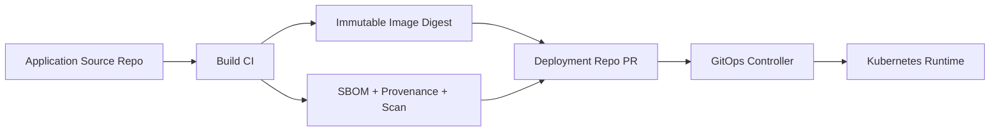
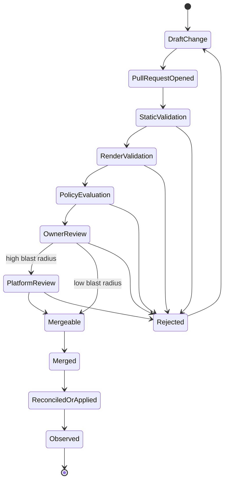
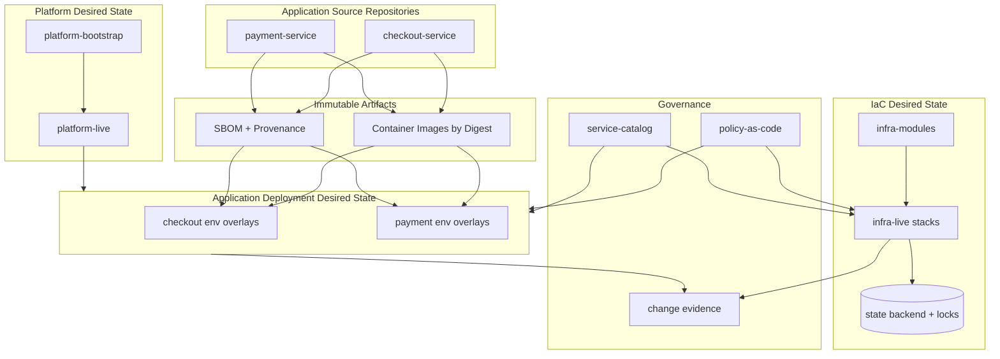

# Part 005 — Repository Topologies for Apps, Infra, Environments, and Policies

Repository topology adalah salah satu keputusan paling awal yang paling sering diremehkan.

Banyak tim mengira pertanyaannya adalah:

> “Struktur folder GitOps yang bagus seperti apa?”

Itu pertanyaan yang terlalu dangkal.

Pertanyaan yang benar:

> “Boundary apa yang ingin kita enforce melalui Git repository: ownership, state, approval, release, policy, tenancy, audit, dan blast radius?”

Repository bukan hanya tempat menyimpan file. Dalam GitOps/IaC pipeline, repository adalah **control-plane interface**. Ia menentukan siapa bisa mengubah apa, bagaimana perubahan direview, policy mana yang aktif, state mana yang boleh disentuh, dan evidence apa yang tertinggal.

GitOps menuntut desired state dideklarasikan, disimpan secara versioned dan immutable, ditarik otomatis oleh agent, lalu direkonsiliasi terus-menerus. Repository topology adalah bentuk fisik dari prinsip itu di organisasi nyata.

Kalau topology salah, tool terbaik pun akan berubah menjadi YAML landfill.

---

## 1. Repository Topology Adalah Desain Boundary

Mari mulai dari mental model.

Repository topology harus menjawab delapan pertanyaan:

1. **Ownership boundary** — siapa pemilik perubahan?
2. **State boundary** — state mana yang disentuh oleh perubahan ini?
3. **Runtime boundary** — runtime mana yang akan berubah?
4. **Approval boundary** — siapa yang wajib approve?
5. **Policy boundary** — policy mana yang harus mengevaluasi perubahan?
6. **Promotion boundary** — bagaimana perubahan bergerak dari dev ke prod?
7. **Audit boundary** — evidence apa yang membuktikan perubahan sah?
8. **Failure boundary** — kalau perubahan gagal, seberapa luas kerusakannya?

Folder yang rapi tapi gagal menjawab delapan pertanyaan ini tidak berarti banyak.

Contoh struktur yang tampak rapi tetapi buruk:

```txt
repo/
  dev/
  staging/
  prod/
  terraform/
  kubernetes/
  helm/
  scripts/
```

Struktur ini terlihat sederhana, tetapi belum menjawab:

- apakah `prod/` boleh diubah oleh semua developer?
- apakah `terraform/` punya satu state besar atau banyak state kecil?
- apakah perubahan di `helm/` langsung disinkronkan ke cluster?
- apakah `scripts/` boleh menjalankan imperative mutation?
- apakah dev dan prod menggunakan module version yang sama?
- apakah policy untuk IAM sama dengan policy untuk Kubernetes workload?
- apakah PR untuk satu service bisa ikut mengubah network boundary?

Repository topology yang baik membuat jawaban semacam ini terlihat dari struktur, bukan hanya dari dokumentasi.

---

## 2. Jangan Mendesain Repo Berdasarkan Tool, Desain Berdasarkan State

Kesalahan umum: memulai dari tool.

Misalnya:

- “Kita pakai Argo CD, jadi repo-nya begini.”
- “Kita pakai Terraform, jadi semua masuk `infra/`.”
- “Kita pakai Helm, jadi semua chart di satu repo.”
- “Kita pakai monorepo karena Google juga monorepo.”

Tool penting, tetapi bukan boundary utama. Boundary utama adalah **state ownership**.

Dalam GitOps/IaC, state terbagi menjadi beberapa jenis:

| State | Contoh | Owner ideal | Mutation path |
|---|---|---|---|
| Source code state | Java/Go/Node source | App team | CI build/test |
| Application deploy state | image digest, Helm values, replicas | App team + platform guardrails | GitOps PR/reconcile |
| Kubernetes platform state | ingress controller, cert-manager, CNI, policy controller | Platform team | GitOps controller |
| Cloud foundation state | accounts, VPC, IAM baseline, DNS zone | Platform/cloud team | IaC runner |
| Product infra state | queues, DB instances, buckets, topics | Product/platform shared | IaC runner atau platform API |
| Policy state | OPA/Kyverno/Rego rules | Security/platform/governance | Policy PR + staged rollout |
| Secret material | actual credentials, tokens, cert private key | Security/platform/secret owner | Secret manager, not plain Git |
| Secret reference state | ExternalSecret, Vault path, SOPS ciphertext | App/platform team | GitOps PR/reconcile |
| Evidence state | plan artifact, approvals, audit events | Platform/compliance | Append-only logs/artifacts |

Satu repository boleh memuat beberapa state, tetapi jangan pernah mencampurnya tanpa boundary.

Rule of thumb:

> Kalau dua jenis state punya owner, approval, blast radius, atau recovery model yang berbeda, mereka butuh boundary eksplisit. Boundary itu bisa berupa repo, folder protected, module boundary, state boundary, project boundary, atau pipeline boundary.

Repo hanyalah salah satu alat untuk membuat boundary. Tetapi karena Git permissions, CODEOWNERS, branch protection, PR history, dan audit biasanya berbasis repo/path, repo topology punya dampak besar.

---

## 3. Topology Primitive: Unit Dasar yang Harus Dipahami

Sebelum membahas monorepo vs multi-repo, kita definisikan primitive.

### 3.1 Application Source Repository

Ini repository kode aplikasi.

Contoh:

```txt
checkout-service/
  src/
  tests/
  Dockerfile
  pom.xml
  .github/workflows/build.yml
```

Repository ini menghasilkan artifact immutable:

- container image digest;
- SBOM;
- provenance attestation;
- test report;
- vulnerability scan report;
- deployment metadata.

Repository ini **tidak harus** menyimpan konfigurasi production runtime. Untuk organisasi kecil, boleh. Untuk organisasi besar, sering lebih aman memisahkan source code dan environment desired state.

### 3.2 Application Deployment Repository

Ini repository yang menyimpan desired deployment state aplikasi.

Contoh:

```txt
app-deployments/
  apps/
    checkout/
      base/
      overlays/
        dev/
        staging/
        prod/
```

Isinya bukan source code aplikasi, tetapi deklarasi runtime:

- image digest;
- config values;
- resource request/limit;
- HPA config;
- ingress route;
- service account binding;
- feature flag reference;
- ExternalSecret reference;
- rollout strategy.

GitOps controller menarik repository ini dan merekonsiliasi cluster.

### 3.3 Infrastructure Module Repository

Ini repository library IaC.

Contoh:

```txt
terraform-modules/
  modules/
    network/
    postgres/
    kafka-topic/
    service-iam/
```

Module repository harus diperlakukan seperti library software:

- versioned;
- semantically documented;
- tested;
- released;
- backward-compatible bila memungkinkan;
- punya changelog;
- tidak langsung mengubah runtime.

Module repo bukan tempat menjalankan apply.

### 3.4 Infrastructure Live Repository

Ini repository yang mengikat module ke environment nyata.

Contoh:

```txt
infra-live/
  aws/
    prod/
      ap-southeast-1/
        network/
        eks/
        databases/
    staging/
      ap-southeast-1/
        network/
        eks/
        databases/
```

Repository ini memuat root module atau stack yang punya state backend sendiri.

Ia menjawab:

- resource nyata apa yang ingin dibuat?
- di account/region/environment mana?
- menggunakan module version apa?
- state backend mana?
- lock boundary mana?
- policy mana?
- approval siapa?

### 3.5 Platform Bootstrap Repository

Ini repository yang membuat cluster atau platform bisa mengelola dirinya sendiri.

Contoh:

```txt
platform-bootstrap/
  clusters/
    prod-eks-01/
      gitops-controller/
      projects/
      root-apps/
      policy-baseline/
```

Untuk Argo CD, pattern ini sering muncul sebagai root application atau app-of-apps. Untuk Flux, bootstrap biasanya menghasilkan komponen Flux dan konfigurasi source/kustomization yang menunjuk ke repo desired state.

Bootstrap repo harus sangat dijaga karena ia menentukan siapa controller percaya dan repository mana yang boleh menjadi source of truth.

### 3.6 Policy Repository

Ini repository policy-as-code.

Contoh:

```txt
policy/
  iac/
    terraform/
      iam.rego
      network.rego
      tagging.rego
  kubernetes/
    kyverno/
      require-run-as-non-root.yaml
      restrict-hostpath.yaml
  exceptions/
    prod/
      approved-exceptions.yaml
```

Policy repo bisa dikonsumsi oleh:

- CI lint/plan gate;
- IaC runner;
- Kubernetes admission controller;
- GitOps controller plugin;
- audit/evidence pipeline.

Policy repo tidak boleh dikelola seperti repo biasa. Perubahan policy bisa lebih berbahaya daripada perubahan aplikasi karena satu rule salah dapat menolak seluruh deployment atau membuka seluruh cluster.

### 3.7 Secret Reference Repository

Dalam GitOps, rahasia plaintext tidak boleh menjadi desired state Git. Tetapi Git boleh menyimpan:

- encrypted secret dengan SOPS/sealed secret model;
- ExternalSecret reference;
- Vault path;
- secret metadata;
- rotation policy reference;
- certificate issuer reference.

Contoh:

```txt
apps/checkout/overlays/prod/external-secret.yaml
```

Yang penting: Git menyimpan **referensi atau ciphertext**, bukan kontrol bebas terhadap seluruh secret lifecycle.

---

## 4. Monorepo vs Multi-Repo: Jangan Pilih Berdasarkan Selera

Tidak ada topology yang selalu benar. Yang ada adalah trade-off.

### 4.1 Monorepo GitOps

Semua desired state Kubernetes disimpan dalam satu repository.

Contoh:

```txt
gitops-live/
  clusters/
    dev-01/
    staging-01/
    prod-01/
  apps/
    checkout/
    payment/
    catalog/
  platform/
    ingress/
    cert-manager/
    policy/
```

Keuntungan:

- visibility tinggi;
- perubahan lintas aplikasi mudah dilihat;
- dependency antar komponen lebih eksplisit;
- policy scanning lebih mudah;
- onboarding sederhana;
- promotion dapat dilakukan dengan PR yang jelas.

Kerugian:

- permission boundary lebih sulit;
- repo bisa menjadi bottleneck organisasi;
- PR noise tinggi;
- blast radius kesalahan path besar;
- merge queue bisa padat;
- sulit memberi otonomi penuh ke banyak tim;
- controller bisa punya akses terlalu luas kalau tidak dipisah dengan project/RBAC.

Monorepo cocok saat:

- platform masih relatif kecil;
- jumlah team belum terlalu banyak;
- standardisasi lebih penting daripada otonomi;
- ada platform team kuat;
- audit terpusat penting;
- environment/cluster belum terlalu banyak.

Monorepo buruk saat:

- ratusan tim butuh release cadence independen;
- permission antar domain sangat berbeda;
- regulasi menuntut segregation of duties yang keras;
- perubahan satu domain tidak boleh terlihat oleh domain lain;
- repo size dan PR velocity sudah mengganggu delivery.

### 4.2 Multi-Repo per Application

Setiap aplikasi punya repo deployment sendiri.

Contoh:

```txt
checkout-deploy/
  base/
  overlays/dev/
  overlays/staging/
  overlays/prod/

payment-deploy/
  base/
  overlays/dev/
  overlays/staging/
  overlays/prod/
```

Keuntungan:

- ownership jelas;
- team autonomy tinggi;
- PR noise rendah;
- permission lebih mudah;
- release cadence independen;
- repo lebih kecil.

Kerugian:

- standardisasi lebih sulit;
- policy drift antar repo;
- sulit melakukan fleet-wide changes;
- dependency antar aplikasi tersebar;
- onboarding controller lebih kompleks;
- audit global perlu agregasi.

Cocok saat:

- organisasi punya banyak product team;
- platform menyediakan golden path kuat;
- policy-as-code sudah matang;
- aplikasi punya lifecycle independen;
- GitOps controller/project dapat enforce boundary per repo.

Buruk saat:

- belum ada standard repo template;
- setiap tim menulis manifest sendiri tanpa guardrail;
- policy belum otomatis;
- tim belum paham Kubernetes/IaC;
- compliance membutuhkan satu jalur evidence yang belum dibangun.

### 4.3 Multi-Repo per Environment

Setiap environment punya repo sendiri.

Contoh:

```txt
gitops-dev/
gitops-staging/
gitops-prod/
```

Keuntungan:

- prod bisa sangat dikunci;
- approval per environment jelas;
- promotion terlihat sebagai PR antar repo;
- akses dev tidak otomatis berarti akses prod;
- audit prod lebih bersih.

Kerugian:

- duplication tinggi;
- drift antar environment mudah terjadi;
- promotion butuh tooling;
- sulit memastikan dev/staging/prod memakai baseline yang sama;
- perubahan global harus direplikasi.

Cocok saat:

- prod sangat regulated;
- akses prod harus dipisah keras;
- environment dikelola oleh tim berbeda;
- cluster/account prod benar-benar isolated.

Buruk saat:

- tim belum punya automation promotion;
- environment hanya berbeda sedikit;
- copy-paste menjadi mode utama;
- tidak ada diff tool antar environment.

### 4.4 Multi-Repo per Cluster

Setiap cluster punya repository sendiri.

Contoh:

```txt
cluster-prod-apac-01/
cluster-prod-eu-01/
cluster-staging-01/
```

Keuntungan:

- blast radius per cluster jelas;
- cluster owner jelas;
- bootstrap sederhana per cluster;
- failure satu repo tidak langsung mengganggu cluster lain;
- cocok untuk edge/fleet model.

Kerugian:

- fleet-wide consistency sulit;
- shared platform baseline perlu release mechanism;
- policy version bisa beda-beda;
- repo count cepat membesar;
- audit perlu inventory yang kuat.

Cocok saat:

- banyak cluster tersebar;
- cluster adalah unit tenancy;
- edge/retail/telco/fleet environment;
- region isolation penting.

Buruk saat:

- cluster hanya detail implementasi, bukan ownership boundary;
- jumlah cluster sedikit;
- platform team belum punya generator/bootstrap automation.

### 4.5 Hybrid Topology

Organisasi matang biasanya memakai hybrid.

Contoh:

```txt
platform-bootstrap/       # bootstrap GitOps controller, projects, cluster baseline
platform-gitops-live/     # shared platform addons and baseline
app-deployments/          # app runtime desired state, mungkin monorepo per domain
infra-modules/            # reusable IaC modules
infra-live/               # cloud/account/region/environment stacks
policy/                   # policy-as-code
service-catalog/          # metadata, ownership, lifecycle, golden path templates
```

Hybrid bukan berarti bebas campur. Hybrid harus punya boundary yang eksplisit.

---

## 5. Decision Matrix Topology

Gunakan matrix ini ketika menentukan topology.

| Faktor | Monorepo | App multi-repo | Env repo | Cluster repo | Hybrid |
|---|---|---|---|---|---|
| Onboarding awal | Mudah | Sedang | Sedang | Sedang | Sulit |
| Ownership aplikasi | Sedang | Tinggi | Rendah-sedang | Rendah | Tinggi bila dirancang |
| Prod isolation | Sedang | Sedang | Tinggi | Tinggi | Tinggi |
| Fleet-wide changes | Mudah | Sulit | Sedang | Sulit | Sedang |
| Audit terpusat | Mudah | Perlu agregasi | Mudah per env | Perlu agregasi | Perlu desain evidence |
| Permission boundary | Lemah-sedang | Kuat | Kuat | Kuat | Kuat |
| Risk copy-paste | Sedang | Sedang | Tinggi | Tinggi | Sedang |
| Controller config complexity | Rendah | Sedang | Sedang | Tinggi | Tinggi |
| Cocok untuk regulated prod | Mungkin | Mungkin | Ya | Ya | Ya |
| Cocok untuk scale organisasi | Sedang | Tinggi | Sedang | Tinggi untuk fleet | Tinggi |

Kesimpulan praktis:

- Mulai dengan monorepo kalau organisasi kecil dan butuh standardisasi.
- Pecah berdasarkan ownership ketika jumlah tim dan change velocity naik.
- Pecah berdasarkan environment ketika prod isolation/audit menjadi requirement keras.
- Pecah berdasarkan cluster jika cluster adalah unit operasi nyata.
- Gunakan hybrid untuk enterprise, tetapi jangan memulai hybrid tanpa automation dan policy.

---

## 6. Reference Topology untuk Enterprise GitOps/IaC Platform

Berikut topology yang akan kita gunakan sebagai reference sepanjang seri ini.

```txt
org/
  app-source/
    checkout-service/
    payment-service/
    catalog-service/

  app-deployments/
    domains/
      commerce/
        apps/
          checkout/
            base/
            envs/
              dev/
              staging/
              prod/
          payment/
            base/
            envs/
              dev/
              staging/
              prod/

  platform-bootstrap/
    clusters/
      dev-apac-01/
      staging-apac-01/
      prod-apac-01/
    controllers/
      argo-cd/
      flux/
    projects/
      platform/
      commerce/
      data/
      security/

  platform-live/
    clusters/
      prod-apac-01/
        ingress/
        cert-manager/
        external-secrets/
        policy-controller/
        observability-agent/
      staging-apac-01/
        ingress/
        cert-manager/
        external-secrets/
        policy-controller/

  infra-modules/
    modules/
      network/
      eks-cluster/
      postgres/
      redis/
      kafka-topic/
      service-iam/
      dns-record/

  infra-live/
    aws/
      prod/
        ap-southeast-1/
          foundation/
          network/
          eks/
          shared-data/
          commerce/
            checkout/
            payment/
      staging/
        ap-southeast-1/
          foundation/
          network/
          eks/
          commerce/
            checkout/
            payment/

  policy/
    iac/
      rego/
      tests/
    kubernetes/
      kyverno/
      gatekeeper/
    exceptions/
      dev/
      staging/
      prod/

  service-catalog/
    services/
      checkout.yaml
      payment.yaml
    golden-paths/
      java-service/
      batch-worker/
      event-consumer/
```

Topology ini sengaja memisahkan:

- source code aplikasi;
- deployment desired state;
- platform bootstrap;
- platform runtime baseline;
- IaC module library;
- IaC live stacks;
- policy-as-code;
- service metadata.

Mengapa tidak semuanya satu repo?

Karena state, owner, approval, dan blast radius berbeda.

---

## 7. Repository Boundary vs Folder Boundary

Repo boundary lebih kuat daripada folder boundary, tetapi folder boundary tetap berguna.

### Repo boundary memberi:

- access control lebih jelas;
- branch protection terpisah;
- audit stream terpisah;
- webhook/pipeline terpisah;
- secret/credential context terpisah;
- issue/PR lifecycle terpisah.

### Folder boundary memberi:

- struktur internal;
- CODEOWNERS path-based review;
- changed-path pipeline routing;
- module discovery;
- environment diff;
- policy mapping.

Jangan menganggap folder boundary cukup untuk semua hal. Misalnya, prod regulated environment biasanya tidak cukup hanya dipisahkan sebagai `envs/prod`. Ia juga butuh:

- protected branch;
- CODEOWNERS;
- required checks;
- approval rules;
- deploy credential separation;
- state backend separation;
- audit retention;
- policy severity berbeda.

Folder adalah boundary navigasi. Repo/pipeline/state adalah boundary kontrol.

---

## 8. The Most Important Boundary: IaC State Boundary

Untuk Terraform/OpenTofu-style IaC, topology repository harus mengikuti state boundary.

Satu root module biasanya menghasilkan satu state file. State file menyimpan mapping antara resource deklaratif dan resource nyata. Backend yang baik menyediakan locking agar dua operasi tulis tidak merusak state yang sama.

Karena itu:

> Jangan desain folder IaC hanya berdasarkan resource type. Desain berdasarkan blast radius dan lifecycle state.

Buruk:

```txt
infra-live/prod/
  main.tf   # semua: network, cluster, database, IAM, DNS, monitoring
```

Masalah:

- satu apply bisa menyentuh terlalu banyak hal;
- lock terlalu besar;
- plan terlalu noisy;
- failure recovery rumit;
- approval tidak spesifik;
- tim berbeda berebut satu state;
- refactor kecil bisa memicu plan besar.

Lebih baik:

```txt
infra-live/aws/prod/ap-southeast-1/
  foundation/       # account baseline, audit, org policy
  network/          # VPC, subnets, route tables, shared endpoints
  eks/              # cluster control plane and node groups
  shared-data/      # shared databases, shared cache, shared topics
  commerce/
    checkout/       # app-owned infra resources
    payment/
```

Setiap folder stack punya backend dan lock sendiri.

Contoh metadata stack:

```yaml
stack: commerce-checkout-prod
owner: team-commerce-checkout
environment: prod
region: ap-southeast-1
state_backend: s3://iac-state-prod/commerce/checkout/prod.tfstate
lock_scope: commerce-checkout-prod
approval:
  required:
    - team-commerce-checkout
    - platform-prod-approver
policy_profile: prod-restricted
blast_radius: service-level
```

Ini bukan hanya dokumentasi. Metadata semacam ini bisa dipakai pipeline untuk:

- memilih policy profile;
- menentukan approver;
- memilih credential role;
- menentukan concurrency group;
- menulis evidence;
- menghitung blast radius;
- membuat dashboard.

---

## 9. The Second Most Important Boundary: Reconciliation Boundary

Untuk GitOps Kubernetes, topology harus mengikuti reconciliation boundary.

Pertanyaannya:

> Controller mana yang menarik folder/repo ini, dengan permission apa, ke cluster/namespace mana, menggunakan policy apa?

Contoh buruk:

```txt
gitops-live/
  everything.yaml
```

Controller punya akses luas, semua aplikasi bercampur, dan sulit menjawab siapa owner perubahan.

Lebih baik:

```txt
gitops-live/
  clusters/
    prod-apac-01/
      root/
        platform.yaml
        commerce.yaml
      platform/
        ingress/
        external-secrets/
        policy/
      domains/
        commerce/
          checkout/
          payment/
```

Dengan boundary:

- platform project hanya bisa mengubah namespace/platform resources tertentu;
- commerce project hanya bisa deploy ke namespace commerce;
- prod cluster hanya menarik dari branch/path yang protected;
- policy controller menolak object yang melanggar baseline;
- app team tidak bisa mengubah cluster-wide resource tanpa platform approval.

Dalam Argo CD, boundary semacam ini sering dimodelkan dengan Application, AppProject, destination, source repo allowlist, namespace restriction, dan sync policy. Dalam Flux, boundary dimodelkan melalui GitRepository/OCIRepository/HelmRepository source, Kustomization, namespace, service account impersonation, dan dependency graph.

---

## 10. Branch per Environment vs Directory per Environment

Ini keputusan klasik.

### Branch per environment

Contoh:

```txt
main        # dev
staging     # staging
prod        # prod
```

Keuntungan:

- prod bisa protected sebagai branch;
- promotion bisa berupa merge/cherry-pick;
- environment history terpisah.

Kerugian:

- branch drift tinggi;
- sulit melihat perbedaan environment dalam satu view;
- merge conflict promosi sering terjadi;
- long-lived branch menjadi alternate universe;
- policy/config bisa diverge diam-diam.

### Directory per environment pada branch utama

Contoh:

```txt
main
  apps/checkout/envs/dev/
  apps/checkout/envs/staging/
  apps/checkout/envs/prod/
```

Keuntungan:

- environment diff mudah;
- satu history linear;
- PR jelas menunjukkan env mana yang berubah;
- changed-path detection mudah;
- branch drift berkurang;
- CODEOWNERS bisa path-based.

Kerugian:

- prod protection perlu path-based policy/CODEOWNERS;
- repo permissions tidak sekeras branch/repo split;
- PR ke main bisa memuat banyak env kalau tidak dikontrol.

### Rekomendasi praktis

Untuk sebagian besar platform modern:

> Gunakan directory per environment di protected main branch, lalu enforce path-based ownership, required checks, policy gates, dan promotion PR.

Gunakan branch per environment hanya jika ada alasan kuat:

- tooling internal memang mengandalkan branch promotion;
- compliance mengharuskan prod branch terpisah;
- repo split belum memungkinkan;
- tim sudah punya automation kuat untuk mencegah branch drift.

Jangan gunakan branch per environment hanya karena “terlihat seperti release branch”. Infra/environment desired state bukan source code library biasa.

---

## 11. Topology for Application Delivery

Aplikasi modern biasanya butuh dua repo atau dua area:

1. source repo untuk build artifact;
2. deployment repo untuk desired runtime state.

Flow:



Deployment repo tidak boleh sekadar menyimpan tag mutable seperti `latest`.

Buruk:

```yaml
image: registry.example.com/checkout:latest
```

Lebih baik:

```yaml
image: registry.example.com/checkout@sha256:abc123...
```

Atau minimal gunakan version tag yang immutable di registry policy.

Deployment repo PR harus menunjukkan:

- image digest lama dan baru;
- source commit asal;
- build result;
- SBOM/provenance link;
- vulnerability status;
- environment target;
- rollout strategy;
- owner approval.

Dengan begitu Git deployment state menjadi audit boundary, bukan hanya config dump.

---

## 12. Topology for Platform Addons

Platform addons berbeda dari aplikasi biasa.

Contoh:

- ingress controller;
- cert-manager;
- external-secrets;
- policy controller;
- metrics/logging agents;
- service mesh;
- CSI drivers;
- cluster autoscaler;
- DNS controllers.

Mereka biasanya punya karakteristik:

- cluster-wide permission;
- high blast radius;
- upgrade risk lebih besar;
- dependency ke cloud IAM;
- perlu sequencing;
- perlu rollback plan;
- sering menjadi dependency aplikasi.

Karena itu jangan campur platform addons dan app manifests tanpa boundary.

Contoh:

```txt
platform-live/clusters/prod-apac-01/
  00-namespaces/
  10-crds/
  20-controllers/
    cert-manager/
    external-secrets/
    ingress-nginx/
  30-policy/
  40-observability/
```

Urutan angka bukan style preference. Ia membantu dependency graph manusia. Tetapi jangan hanya mengandalkan angka. GitOps tool juga perlu dependency/sync wave/dependsOn jika didukung.

Anti-pattern:

```txt
apps/
  checkout/
    cert-manager-crds.yaml
    ingress-controller-values.yaml
    deployment.yaml
```

Aplikasi tidak boleh membawa cluster-wide controller kecuali itu memang isolated cluster miliknya.

---

## 13. Topology for Policy

Policy harus reusable dan testable.

Struktur yang baik:

```txt
policy/
  iac/
    rego/
      iam/
        deny-wildcard-admin.rego
        require-boundary.rego
      network/
        deny-public-rdp.rego
        require-private-subnet.rego
      tagging/
        require-owner-cost-center.rego
    tests/
      iam_test.rego
      network_test.rego
    profiles/
      dev.yaml
      staging.yaml
      prod.yaml
  kubernetes/
    kyverno/
      baseline/
      restricted/
      namespace-profiles/
    gatekeeper/
      constraints/
      templates/
  exceptions/
    prod/
      temporary-exceptions.yaml
```

Hal penting:

- policy punya profile per environment;
- policy test wajib berjalan sebelum policy diaktifkan;
- exception harus punya owner, reason, expiry, dan approval;
- policy rollout harus staged;
- breaking policy jangan langsung diterapkan ke prod;
- policy repo punya CODEOWNERS security/platform;
- policy harus punya changelog.

Policy topology buruk:

```txt
scripts/checks/
  prod-policy.sh
```

Mengapa buruk?

- shell script sulit dianalisis;
- output tidak terstruktur;
- rule tidak mudah dites;
- exception sulit dikelola;
- policy tidak reusable untuk CI dan admission;
- audit sulit.

---

## 14. Topology for Secrets

Dalam GitOps, rahasia adalah bagian yang paling mudah disalahpahami.

Ada tiga pendekatan umum:

1. Git menyimpan encrypted secret.
2. Git menyimpan reference ke secret manager.
3. Git tidak menyimpan secret sama sekali, hanya binding ke identity/runtime.

Untuk enterprise, pendekatan kedua dan ketiga biasanya lebih sehat.

Contoh ExternalSecret-style desired state:

```yaml
apiVersion: external-secrets.io/v1beta1
kind: ExternalSecret
metadata:
  name: checkout-db
  namespace: checkout-prod
spec:
  refreshInterval: 1h
  secretStoreRef:
    name: prod-vault
    kind: ClusterSecretStore
  target:
    name: checkout-db
  data:
    - secretKey: username
      remoteRef:
        key: /prod/commerce/checkout/db
        property: username
    - secretKey: password
      remoteRef:
        key: /prod/commerce/checkout/db
        property: password
```

Repository topology harus memisahkan:

- siapa boleh membuat secret reference;
- siapa boleh membaca secret value;
- siapa boleh mengubah secret backend;
- siapa boleh rotate secret;
- siapa boleh bind workload ke secret.

GitOps repo boleh berisi `ExternalSecret`, tetapi bukan berarti developer boleh memilih secret path sembarang. Policy harus memastikan:

- namespace cocok dengan path;
- service owner cocok dengan secret owner;
- environment cocok;
- prod secret tidak direferensi dari dev;
- ClusterSecretStore tidak bisa dibuat app team sembarangan.

---

## 15. CODEOWNERS sebagai Control Surface

CODEOWNERS bukan sekadar notifikasi reviewer. Dalam GitOps/IaC, CODEOWNERS adalah bagian dari access control dan approval evidence.

Contoh:

```txt
# Platform bootstrap
/platform-bootstrap/clusters/prod-*        @platform-prod-admins @security-platform

# Production infrastructure
/infra-live/aws/prod/**                    @cloud-platform @prod-approvers

# Commerce app deployment
/app-deployments/domains/commerce/**       @team-commerce-platform
/app-deployments/domains/commerce/apps/checkout/** @team-checkout

# Policy
/policy/**                                 @security-engineering @platform-governance

# Secret store definitions
/platform-live/**/external-secrets/stores/** @security-platform
```

Tetapi CODEOWNERS saja tidak cukup. Ia harus dikombinasikan dengan:

- required approvals;
- branch protection;
- required status checks;
- signed commits atau verified identity bila diperlukan;
- policy checks;
- merge queue;
- audit retention.

Jangan gunakan CODEOWNERS sebagai satu-satunya defense.

---

## 16. Changed-Path Routing

Repo topology yang baik memungkinkan pipeline menjalankan checks yang relevan saja.

Contoh mapping:

| Changed path | Pipeline action |
|---|---|
| `infra-modules/modules/postgres/**` | module unit test, examples plan, compatibility check |
| `infra-live/aws/prod/**` | prod IaC plan, strict policy, prod approval |
| `app-deployments/**/envs/dev/**` | render, schema validate, dev policy |
| `app-deployments/**/envs/prod/**` | render, restricted policy, security approval, rollout gate |
| `policy/iac/**` | policy unit test, dry-run against fixture plans |
| `platform-bootstrap/**` | bootstrap safety checks, restricted approval |

Tanpa topology yang jelas, pipeline akan memilih antara dua pilihan buruk:

- menjalankan semua checks untuk semua perubahan;
- menjalankan checks terlalu sedikit dan melewatkan risiko.

Changed-path routing adalah alasan teknis mengapa struktur repo penting.

---

## 17. Metadata as the Missing Layer

Folder tidak cukup untuk menggambarkan semua intent. Tambahkan metadata eksplisit.

Contoh `stack.yaml` untuk IaC:

```yaml
apiVersion: platform.example.com/v1
kind: IaCStack
metadata:
  name: checkout-prod
spec:
  owner: team-checkout
  system: commerce
  environment: prod
  region: ap-southeast-1
  blastRadius: service
  state:
    backend: s3
    key: prod/ap-southeast-1/commerce/checkout.tfstate
    lock: dynamodb:tofu-lock-prod
  execution:
    role: arn:aws:iam::123456789012:role/iac-checkout-prod
    concurrencyGroup: iac-prod-commerce-checkout
  policy:
    profile: prod-restricted
  approvals:
    required:
      - team-checkout
      - platform-prod
```

Contoh `app.yaml` untuk deployment:

```yaml
apiVersion: platform.example.com/v1
kind: ApplicationDeployment
metadata:
  name: checkout
spec:
  owner: team-checkout
  system: commerce
  environments:
    dev:
      namespace: checkout-dev
      cluster: dev-apac-01
      policyProfile: dev-baseline
    prod:
      namespace: checkout-prod
      cluster: prod-apac-01
      policyProfile: prod-restricted
      approvalProfile: prod-service
```

Metadata ini membuat pipeline tidak perlu menebak dari path saja.

---

## 18. Repository Topology State Machine

Perubahan repository sebaiknya bergerak melalui state yang eksplisit.



Repo topology harus mendukung state machine ini. Kalau tidak, perubahan akan lompat dari `DraftChange` langsung ke runtime.

---

## 19. Anti-Patterns Repository Topology

### 19.1 Folder Cosplay

Struktur terlihat enterprise, tetapi tidak ada enforcement.

```txt
prod/
staging/
dev/
```

Semua orang tetap bisa edit semua path. Tidak ada policy berbeda. Tidak ada approval berbeda. Tidak ada credential berbeda.

Itu bukan environment boundary. Itu hanya folder.

### 19.2 One Giant State

Satu root module untuk seluruh platform.

Akibat:

- plan besar;
- lock contention;
- failure recovery berat;
- approval tidak spesifik;
- blast radius terlalu luas.

### 19.3 Repo per Resource

Terlalu ekstrem ke arah sebaliknya.

```txt
vpc-repo/
subnet-repo/
route-table-repo/
eks-repo/
nodegroup-repo/
```

Akibat:

- dependency overhead tinggi;
- PR lintas repo melelahkan;
- lifecycle resource yang seharusnya satu domain terpecah;
- operator kehilangan gambaran sistem.

Boundary yang terlalu kecil sama buruknya dengan boundary yang terlalu besar.

### 19.4 Environment Branch Drift

Dev, staging, dan prod hidup di branch berbeda selama berbulan-bulan.

Akibat:

- staging tidak mencerminkan prod;
- hotfix susah dilacak;
- policy berbeda tanpa sengaja;
- rollback ambigu;
- merge conflict menjadi bagian normal.

### 19.5 App Team Owns Cluster-Wide Resources

Aplikasi membawa CRD, admission controller, ingress controller, atau ClusterRole tanpa platform review.

Akibat:

- satu service bisa mengubah cluster behavior;
- privilege escalation;
- hidden dependency;
- rollback aplikasi bisa menghapus shared controller.

### 19.6 Policy Beside Workload Without Governance

Policy disimpan di repo aplikasi dan bisa dilonggarkan oleh tim yang sama yang terkena policy.

Ini melanggar separation of duties.

### 19.7 Secrets as Plain Config

Plain secret di Git atau secret reference tanpa policy path.

Akibat:

- credential leak;
- dev bisa referensi prod secret;
- rotation tidak jelas;
- audit sulit.

### 19.8 Generated YAML Committed Without Source

Repo berisi YAML hasil generate, tetapi source values/template tidak ada.

Akibat:

- sulit review intent;
- diff noisy;
- generator version tidak diketahui;
- reproducibility hilang.

Jika commit generated YAML, simpan juga input dan generator version, atau pastikan render pipeline deterministic.

---

## 20. Practical Design: Repo Topology ADR

Setiap keputusan topology sebaiknya ditulis sebagai Architecture Decision Record.

Template sederhana:

```md
# ADR: GitOps/IaC Repository Topology

## Context
- Number of teams:
- Number of environments:
- Number of clusters/accounts/regions:
- Compliance constraints:
- Current toolchain:
- Expected growth:

## Decision
We will use:
- app source repos:
- app deployment repos:
- infra module repos:
- infra live repos:
- platform bootstrap repos:
- policy repos:

## Boundaries
- Ownership boundary:
- State boundary:
- Approval boundary:
- Runtime boundary:
- Policy boundary:
- Audit boundary:

## Consequences
Positive:
Negative:
Operational burden:
Migration cost:

## Guardrails
- CODEOWNERS:
- branch protection:
- path-based checks:
- policy gates:
- secrets rules:
- state lock rules:

## Review Date
- Revisit when team count, cluster count, or compliance scope changes.
```

Topology bukan keputusan sekali seumur hidup. Ia harus dievaluasi ulang ketika organisasi tumbuh.

---

## 21. Recommended Starting Topologies by Scale

### Small team, early platform

Gunakan:

```txt
gitops-live/
infra-modules/
infra-live/
policy/
```

Jangan terlalu cepat membuat repo per service.

Fokus:

- standardisasi;
- fast feedback;
- simple promotion;
- strong baseline policy.

### Medium organization

Gunakan:

```txt
app-source per service/domain
app-deployments per domain atau monorepo
platform-live
infra-modules
infra-live
policy
service-catalog
```

Fokus:

- domain ownership;
- path-based approval;
- state boundary;
- environment promotion;
- evidence aggregation.

### Large regulated enterprise

Gunakan hybrid:

```txt
app-source per service
app-deployment per domain or business unit
prod deployment repo separated or strongly protected
platform-bootstrap per fleet/domain
platform-live per fleet/domain
infra-modules centralized
infra-live per cloud/account/domain
policy centralized with staged rollout
service-catalog as inventory and ownership source
```

Fokus:

- segregation of duties;
- prod isolation;
- audit evidence;
- delegated ownership;
- platform APIs;
- fleet consistency;
- automated compliance.

---

## 22. Mermaid: Repository Topology Reference Model



Diagram ini menunjukkan repository sebagai jaringan state, bukan folder statis.

---

## 23. Review Checklist

Gunakan checklist ini ketika mereview topology.

### Ownership

- Apakah setiap path punya owner?
- Apakah owner sesuai dengan runtime responsibility?
- Apakah cluster-wide resource hanya bisa diubah platform owner?
- Apakah policy owner berbeda dari policy consumer?

### State

- Apakah setiap IaC stack punya state boundary jelas?
- Apakah state backend dan lock scope eksplisit?
- Apakah satu PR bisa menyentuh terlalu banyak state?
- Apakah module repo terpisah dari live state?

### Promotion

- Apakah dev/staging/prod mudah dibandingkan?
- Apakah promotion menghasilkan PR/evidence?
- Apakah environment branch drift bisa terjadi?
- Apakah prod update bisa dibatasi tanpa menghambat dev?

### Policy

- Apakah policy profile per environment jelas?
- Apakah exception punya expiry?
- Apakah policy bisa dites sebelum diterapkan?
- Apakah policy repo punya review ketat?

### Secrets

- Apakah plaintext secret tidak ada di Git?
- Apakah secret reference dipolicy-kan?
- Apakah prod secret tidak bisa direferensi dari dev?
- Apakah secret store definition dibatasi?

### Runtime

- Apakah GitOps controller access scope sesuai boundary?
- Apakah app team tidak bisa mengubah cluster-wide resource?
- Apakah bootstrap repo dilindungi?
- Apakah controller source repo allowlist jelas?

### Audit

- Apakah PR, checks, approval, plan, apply/reconcile event bisa dihubungkan?
- Apakah evidence retention cukup?
- Apakah perubahan emergency punya rekonsiliasi balik ke Git?
- Apakah siapa/mengapa/kapan/apa bisa dijawab tanpa screenshot manual?

---

## 24. Exercise: Design Your Own Topology

Ambil sistem nyata atau hipotetis dengan parameter berikut:

- 20 aplikasi;
- 5 product teams;
- 3 environment: dev, staging, prod;
- 2 region;
- 3 Kubernetes cluster;
- 1 regulated production environment;
- Terraform/OpenTofu untuk cloud resources;
- Argo CD atau Flux untuk cluster reconciliation;
- OPA/Kyverno untuk policy;
- External Secrets untuk secret reference.

Tugas:

1. Tentukan repo apa saja yang akan dibuat.
2. Tentukan folder utama di setiap repo.
3. Tentukan owner setiap path kritikal.
4. Tentukan state boundary untuk IaC.
5. Tentukan reconciliation boundary untuk GitOps.
6. Tentukan bagaimana dev dipromosikan ke staging dan prod.
7. Tentukan bagaimana policy dan exception dikelola.
8. Tentukan evidence apa yang harus dihasilkan oleh setiap perubahan prod.

Jangan mulai dari template. Mulai dari boundary.

---

## 25. Key Takeaways

Repository topology bukan urusan estetika folder.

Ia adalah desain control plane.

Yang harus diingat:

1. Repo harus mengikuti ownership, state, approval, policy, runtime, audit, dan failure boundary.
2. Monorepo bagus untuk standardisasi, tetapi bisa melemahkan permission boundary.
3. Multi-repo bagus untuk autonomy, tetapi bisa menciptakan drift dan fragmentasi.
4. Environment branch sering menciptakan drift; directory per environment di protected main branch sering lebih sehat.
5. IaC live state harus dipisah berdasarkan blast radius dan lifecycle.
6. GitOps reconciliation boundary harus mengikuti cluster/namespace/project/tenant boundary.
7. Policy dan secrets memerlukan topology sendiri, bukan disisipkan sembarangan.
8. Metadata layer membantu pipeline memahami owner, risk, policy, state, dan approval.
9. CODEOWNERS, branch protection, policy gates, dan state locks harus bekerja bersama.
10. Topology yang baik membuat perubahan aman secara default dan berbahaya secara eksplisit.

Di part berikutnya kita akan membahas **branching, promotion, and change flow**: bagaimana perubahan bergerak dari draft, PR, plan, approval, merge, apply/reconcile, observe, sampai rollback/rollforward.

---

## References

- OpenGitOps Principles: declarative desired state, versioned and immutable state, pulled automatically, continuously reconciled.
- Argo CD documentation: Git as source of truth, Applications, AppProjects, cluster bootstrapping, and app-of-apps operational model.
- Flux documentation: repository structure approaches, Git sources, Kustomizations, and reconciliation model.
- OpenTofu documentation: state, backends, and state locking behavior.
