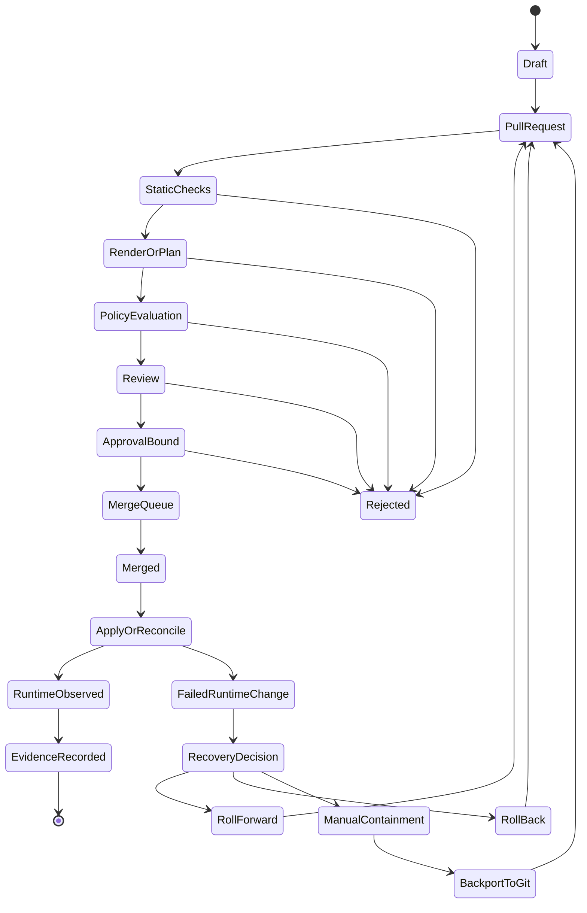
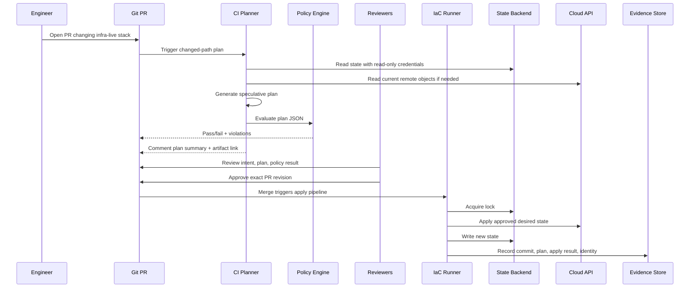
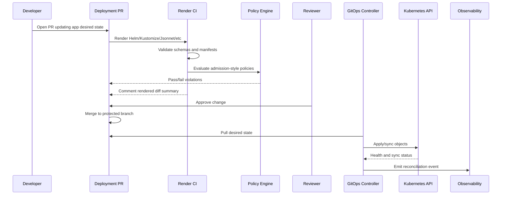
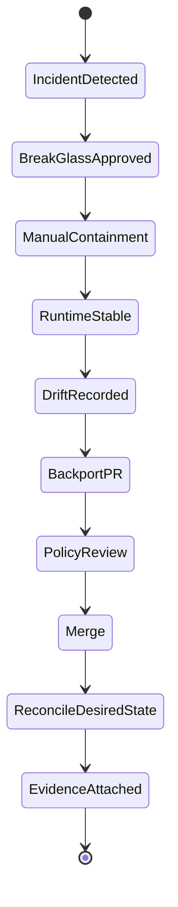
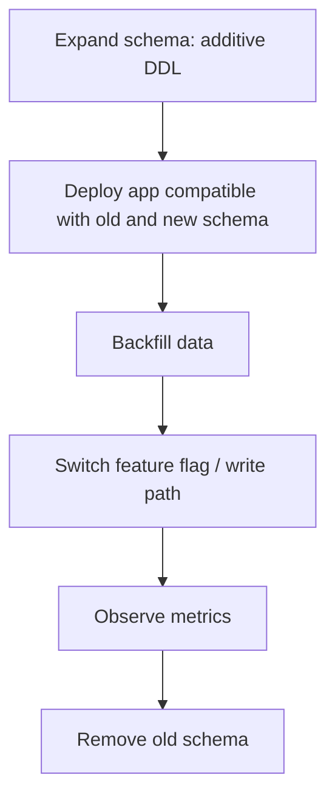

# Part 006 — Branching, Promotion, and Change Flow

Setelah repository topology ditentukan, pertanyaan berikutnya adalah:

> “Bagaimana perubahan bergerak dari ide menjadi runtime state yang sah?”

Banyak pipeline gagal bukan karena tidak punya CI/CD. Mereka gagal karena **change flow** tidak memiliki state machine yang jelas.

Gejalanya:

- PR di-approve, tetapi plan yang di-apply bukan plan yang direview;
- dev dan prod berbeda karena branch drift;
- emergency fix langsung dilakukan di console;
- rollback dianggap cukup dengan `git revert`, padahal state eksternal sudah berubah;
- prod deploy bisa terjadi tanpa evidence yang mengikat commit, approval, artifact, policy result, dan runtime event;
- change kecil ke satu service ikut memicu plan besar ke shared infra;
- pipeline paralel menulis state yang sama;
- promotion hanya copy-paste YAML antar folder.

Di part ini kita memperlakukan change flow sebagai **state transition system**.

GitOps/IaC pipeline bukan sekadar “merge lalu deploy”. Ia adalah rangkaian transisi yang harus menjaga invariants: state ownership, approval binding, artifact immutability, policy enforcement, lock safety, and auditability.

---

## 1. Change Flow sebagai State Machine

Setiap perubahan production-grade harus melewati state yang eksplisit.



Intinya:

> Change yang sehat punya lifecycle. Change yang buruk langsung melompat dari “saya edit file” ke “runtime berubah”.

State machine ini berlaku untuk:

- aplikasi;
- Kubernetes manifests;
- Terraform/OpenTofu stacks;
- cloud IAM;
- network;
- policy;
- secret reference;
- platform addons;
- bootstrap configuration.

Perbedaannya ada pada checks, approval, dan execution engine.

---

## 2. Branching Model: Tujuannya Bukan Banyak Branch, Tapi Controlled Mutation

Branching model harus mendukung tiga hal:

1. **fast feedback** untuk perubahan kecil;
2. **safe promotion** untuk environment kritikal;
3. **low drift** antara desired state dan runtime.

Branching model yang buruk biasanya terlalu mirip release management aplikasi klasik, lalu diterapkan mentah-mentah ke infra.

Infra desired state bukan library source code biasa. Ia adalah representasi sistem berjalan.

---

## 3. Preferred Default: Trunk-Based Desired State with Short-Lived PR Branches

Untuk kebanyakan GitOps/IaC platform modern, default yang sehat adalah:

- satu branch utama, misalnya `main`;
- semua perubahan masuk melalui short-lived PR branch;
- environment direpresentasikan sebagai directory, bukan long-lived branch;
- prod path diproteksi dengan CODEOWNERS, required checks, approval rules, dan policy;
- promotion terjadi melalui PR yang mengubah environment target;
- merge queue menjaga serialisasi perubahan sensitif.

Contoh:

```txt
main
  app-deployments/
    checkout/
      envs/dev/
      envs/staging/
      envs/prod/
  infra-live/
    aws/dev/
    aws/staging/
    aws/prod/
```

PR branch:

```txt
feature/checkout-prod-image-2026-07-03
fix/prod-network-route-timeout
upgrade/cert-manager-1-17-prod
policy/restrict-hostpath-prod
```

Keuntungan:

- history linear;
- environment diff mudah;
- branch drift rendah;
- policy konsisten;
- PR menunjukkan target environment eksplisit;
- rollback/revert lebih mudah dipahami;
- changed-path routing lebih sederhana.

Trade-off:

- perlu path-based protection;
- perlu CODEOWNERS kuat;
- perlu pipeline yang bisa membedakan risiko path;
- perlu discipline agar satu PR tidak mencampur banyak environment.

---

## 4. Long-Lived Environment Branches: Kapan Boleh, Kapan Berbahaya

Model lama:

```txt
dev branch
staging branch
prod branch
```

Promosi dilakukan dengan merge atau cherry-pick dari dev ke staging ke prod.

Model ini bisa berguna jika:

- organisasi sudah punya tooling branch promotion matang;
- prod branch punya compliance process khusus;
- branch protection adalah satu-satunya enforcement yang tersedia;
- repo split belum memungkinkan;
- environment harus benar-benar isolated secara Git permission.

Tetapi model ini berbahaya bila:

- branch hidup lama dan sering diverge;
- hotfix dilakukan langsung di prod branch lalu tidak dibawa balik;
- dev menjadi tempat eksperimen yang tidak pernah menyerupai prod;
- staging tidak lagi menjadi rehearsal prod;
- policy/config baseline berbeda antar branch;
- conflict resolution menjadi bagian normal dari deploy.

Rule praktis:

> Long-lived environment branches hanya sehat jika ada automation yang secara aktif mengukur dan membatasi drift.

Tanpa itu, environment branch adalah alternate universe.

---

## 5. Change Type Taxonomy

Tidak semua perubahan sama. Pipeline yang baik mengklasifikasi perubahan sebelum menentukan checks dan approval.

| Change type | Contoh | Risiko utama | Execution path |
|---|---|---|---|
| App image promotion | checkout image digest dev → staging | runtime regression | GitOps reconcile |
| App config change | env var, HPA, resource limit | outage, overload | GitOps reconcile |
| Infra app resource | queue, bucket, DB user | data loss, permission | IaC plan/apply |
| Shared infra | VPC, cluster, DNS zone | broad outage | IaC strict gate |
| IAM change | role policy, trust policy | privilege escalation | IaC strict gate + security |
| Platform addon | ingress, cert-manager, CNI | cluster-wide outage | GitOps staged rollout |
| Policy change | Kyverno/OPA rule | block deployments or loosen guardrails | policy pipeline + staged enforce |
| Secret reference | ExternalSecret path | leak or wrong credential | GitOps + secret policy |
| Secret rotation | DB password/cert | app breakage | secret manager + rollout coordination |
| Emergency fix | manual containment | drift/audit gap | break-glass + backport to Git |
| Drift remediation | bring runtime back to Git | accidental deletion or override | plan/reconcile with review |

Change flow should be selected by type, not by human mood.

---

## 6. The Change Contract

Setiap PR harus membawa kontrak perubahan.

Minimal:

```yaml
change:
  id: CHG-2026-07-03-001
  type: app_image_promotion
  owner: team-checkout
  system: commerce
  environment: prod
  blastRadius: service
  reason: release checkout v2.17.4 to production
  artifacts:
    image: registry.example.com/checkout@sha256:abc123
    sourceCommit: 71b9c2e
    sbom: oci://registry.example.com/sbom/checkout@sha256:def456
    provenance: oci://registry.example.com/attestation/checkout@sha256:789abc
  expectedEffect:
    - update checkout deployment image digest
    - trigger canary rollout
  rollback:
    strategy: roll_forward_or_revert_to_previous_digest
    previousImage: registry.example.com/checkout@sha256:old123
  approvals:
    required:
      - team-checkout
      - prod-release-manager
  policyProfile: prod-restricted
```

Ini bisa berupa PR template, metadata file, issue link, atau generated change record.

Yang penting: pipeline harus bisa mengikat:

- change request;
- Git commit;
- PR approval;
- plan/render result;
- policy result;
- artifact digest;
- identity yang menjalankan;
- runtime event;
- evidence output.

Tanpa binding, audit hanya narasi.

---

## 7. PR Lifecycle untuk IaC

IaC PR berbeda dari code PR karena output-nya adalah perubahan external state.

Lifecycle sehat:



Ada beberapa invariant penting:

1. Plan harus dibuat dari commit yang direview.
2. Approval harus terikat ke commit/revision tertentu.
3. Kalau PR berubah setelah approval, approval harus invalidated atau checks diulang.
4. Apply harus menggunakan commit hasil merge, bukan local branch yang tidak jelas.
5. State lock harus dipegang selama operation yang menulis state.
6. Credential apply harus lebih terbatas daripada admin manusia.
7. Evidence harus merekam plan/apply identity dan hasil.

---

## 8. Speculative Plan vs Apply Plan

Dalam IaC, plan di PR biasanya speculative. Ia menunjukkan apa yang kemungkinan akan terjadi jika perubahan diterapkan.

Masalah:

- state bisa berubah setelah plan dibuat;
- provider bisa membaca remote object yang berubah;
- branch bisa direbase;
- module version bisa berubah;
- policy bisa berubah;
- target stack bisa berubah oleh PR lain.

Karena itu ada dua pendekatan.

### 8.1 Re-plan on merge

PR menghasilkan speculative plan untuk review. Setelah merge, apply pipeline membuat plan ulang dari commit merge terbaru, lalu apply jika hasilnya masih sesuai policy.

Keuntungan:

- lebih aman terhadap stale plan;
- state terbaru dipakai;
- policy terbaru dipakai.

Kerugian:

- plan yang di-apply bisa sedikit berbeda dari plan yang direview;
- perlu threshold untuk menentukan kapan harus meminta approval ulang.

### 8.2 Saved plan artifact

PR menghasilkan binary plan artifact, lalu artifact yang sama di-apply.

Keuntungan:

- approval bisa terikat ke plan tertentu;
- apply sesuai hasil review.

Kerugian:

- plan bisa stale;
- artifact harus aman dari tampering;
- credential/context harus kompatibel;
- tidak semua workflow cocok;
- long-lived PR meningkatkan risiko stale.

### Rekomendasi

Untuk enterprise pipeline, gunakan model hybrid:

1. PR speculative plan untuk review.
2. Simpan plan JSON dan summary sebagai evidence.
3. Setelah merge, lakukan re-plan.
4. Bandingkan re-plan dengan approved plan summary.
5. Jika diff material berubah, stop dan minta approval ulang.
6. Jika hanya perubahan non-material yang diizinkan policy, apply.

Materiality harus didefinisikan.

Contoh material changes:

- destroy resource;
- replace database;
- widen IAM permission;
- expose public network;
- change encryption setting;
- modify production DNS;
- change state backend;
- alter cluster admin binding.

---

## 9. PR Lifecycle untuk GitOps Kubernetes

GitOps deployment PR tidak menghasilkan Terraform plan, tetapi harus menghasilkan render/diff.

Lifecycle sehat:



Invariant:

- rendered output harus deterministic;
- image harus immutable;
- policy di CI harus konsisten dengan admission policy;
- controller hanya menarik dari trusted repo/path/branch;
- controller permission harus sesuai tenant boundary;
- sync failure harus observable;
- drift harus terdeteksi.

---

## 10. Promotion Models

Promotion adalah proses memindahkan perubahan dari satu environment ke environment lain.

Jangan anggap promotion hanya “copy YAML”. Promotion adalah keputusan risiko.

### 10.1 Image digest promotion

Build source menghasilkan image digest. Dev deploy memakai digest itu. Setelah validasi, digest yang sama dipromosikan ke staging/prod.

```txt
checkout dev:     image@sha256:abc
checkout staging: image@sha256:abc
checkout prod:    image@sha256:abc
```

Keuntungan:

- artifact sama di semua environment;
- mengurangi “works in staging but different artifact in prod”;
- audit jelas.

Risiko:

- config environment tetap bisa berbeda;
- DB/schema dependency perlu sequencing;
- vulnerability baru bisa ditemukan setelah artifact dibuat.

### 10.2 Git commit promotion

Commit yang mengubah dev diangkat ke staging/prod melalui PR.

Contoh:

```txt
PR 101: update dev image digest
PR 115: promote same digest to staging
PR 132: promote same digest to prod
```

Keuntungan:

- promotion terlihat sebagai Git history;
- setiap environment punya approval sendiri;
- rollback bisa dilakukan per environment.

Risiko:

- manual bila tidak diautomasi;
- copy-paste error;
- perubahan config bisa ikut terbawa tanpa sengaja.

### 10.3 Environment overlay promotion

Base sama, overlay berbeda.

```txt
apps/checkout/base/
apps/checkout/envs/dev/kustomization.yaml
apps/checkout/envs/staging/kustomization.yaml
apps/checkout/envs/prod/kustomization.yaml
```

Promotion mengubah overlay target.

Keuntungan:

- environment differences eksplisit;
- base reuse;
- diff mudah.

Risiko:

- overlay bisa menumpuk patch kompleks;
- dev/staging/prod bisa diverge jika patch terlalu banyak.

### 10.4 Configuration package promotion

Rendered bundle atau Helm chart version dipromosikan.

Contoh:

```txt
checkout-chart 2.17.4
values-prod version 2026.07.03
```

Keuntungan:

- package version menjadi unit release;
- cocok untuk banyak cluster;
- bisa disimpan di OCI registry.

Risiko:

- review intent bisa kabur jika hanya melihat package version;
- perlu provenance dan render validation.

### 10.5 Pull request automation promotion

Bot membuka PR promosi setelah signal terpenuhi:

- dev deploy healthy 30 menit;
- integration test pass;
- vulnerability severity acceptable;
- canary metrics normal;
- approval window terbuka.

Keuntungan:

- mengurangi manual copy;
- tetap mempertahankan PR review;
- evidence otomatis.

Risiko:

- bot harus dibatasi;
- rule promosi harus jelas;
- jangan auto-promote ke prod tanpa governance yang sesuai.

---

## 11. Promotion Pipeline Reference

```mermaid
flowchart LR
  Build[Build Artifact]
  DevPR[PR to Dev Desired State]
  DevSync[Dev Reconcile]
  DevSignal[Dev Health + Tests]
  StgPR[Promotion PR to Staging]
  StgSync[Staging Reconcile]
  StgSignal[Staging Tests + Observability]
  ProdPR[Promotion PR to Prod]
  ProdGate[Prod Approval + Policy]
  ProdSync[Prod Progressive Rollout]
  Evidence[Evidence Record]

  Build --> DevPR
  DevPR --> DevSync
  DevSync --> DevSignal
  DevSignal --> StgPR
  StgPR --> StgSync
  StgSync --> StgSignal
  StgSignal --> ProdPR
  ProdPR --> ProdGate
  ProdGate --> ProdSync
  ProdSync --> Evidence
```



Perhatikan: promosi bukan langsung dari CI build ke prod. Ada environment signal dan approval.

---

## 12. Approval Binding

Approval yang baik menjawab:

- siapa approve?
- approve terhadap commit apa?
- approve terhadap plan/render apa?
- approve untuk environment apa?
- approve pada waktu kapan?
- policy result saat approval apa?
- apakah approval masih valid setelah PR berubah?

Anti-pattern:

> “LGTM” di PR yang kemudian diubah lagi sebelum merge.

Pipeline harus membatalkan approval atau mewajibkan re-review ketika:

- file sensitif berubah;
- plan berubah material;
- policy profile berubah;
- target environment berubah;
- artifact digest berubah;
- approver sendiri yang membuat perubahan;
- base branch berubah signifikan.

Approval bukan ritual. Approval adalah binding antara manusia, intent, diff, dan risiko.

---

## 13. Merge Queue dan Concurrency

Untuk GitOps/IaC, merge queue lebih penting daripada yang sering disadari.

Masalah tanpa merge queue:

1. PR A dan PR B sama-sama valid saat dicek.
2. PR A merge dulu dan mengubah shared state.
3. PR B merge berdasarkan asumsi lama.
4. Apply B gagal atau menghasilkan efek tak terduga.

Solusi:

- gunakan merge queue untuk path/state sensitif;
- re-run checks saat branch masuk queue;
- serialize apply berdasarkan state lock/concurrency group;
- gunakan changed-path routing untuk mencegah semua PR saling memblokir.

Contoh concurrency group:

```yaml
concurrency:
  group: iac-prod-ap-southeast-1-commerce-checkout
  cancel-in-progress: false
```

Untuk GitOps app deploy, concurrency bisa berdasarkan:

- application;
- namespace;
- cluster;
- environment;
- rollout object.

Untuk IaC, concurrency harus mengikuti state backend/lock scope.

---

## 14. Change Flow by Risk Level

Tidak semua perubahan butuh proses sama.

### Low risk

Contoh:

- dev environment config;
- non-prod image update;
- documentation;
- test fixture;
- app resource limit kecil di dev.

Flow:

```txt
PR → automated checks → owner approval or auto-merge → reconcile/apply
```

### Medium risk

Contoh:

- staging deployment;
- app prod config non-critical;
- service-specific infra;
- non-destructive DB parameter;
- HPA adjustment.

Flow:

```txt
PR → render/plan → policy → owner approval → merge queue → reconcile/apply → observe
```

### High risk

Contoh:

- prod IAM;
- network boundary;
- database replacement;
- cluster addon upgrade;
- policy enforcement change;
- shared DNS;
- state backend migration.

Flow:

```txt
PR → strict plan/render → policy → security/platform review → change window → merge queue → serialized apply → health verification → evidence
```

Risk classification harus otomatis sejauh mungkin.

Contoh rules:

```yaml
riskRules:
  - match: infra-live/aws/prod/**/iam/**
    risk: high
    approvals: [security, platform]
  - match: infra-live/aws/prod/**/network/**
    risk: high
    approvals: [network, platform]
  - match: app-deployments/**/envs/prod/**
    risk: medium
    approvals: [service-owner]
  - match: policy/**
    risk: high
    approvals: [security, platform]
```

---

## 15. Emergency Flow: Break Glass Without Breaking the Model

Emergency flow harus ada. Menolak emergency flow hanya membuat orang diam-diam bypass pipeline.

Emergency flow yang sehat:

1. break-glass identity digunakan;
2. action dibatasi waktu;
3. semua command/event terekam;
4. incident ID wajib;
5. scope sekecil mungkin;
6. setelah containment, perubahan dibackport ke Git;
7. drift direkonsiliasi;
8. post-incident review memperbaiki pipeline agar bypass tidak menjadi normal.

State machine:



Emergency bukan pengecualian dari GitOps. Emergency adalah alternate path yang harus kembali ke GitOps.

Kalau runtime berubah manual tetapi Git tidak diperbarui, controller bisa mengembalikannya, atau lebih buruk: drift menjadi permanen dan tidak diketahui.

---

## 16. Rollback vs Rollforward

Banyak engineer menyederhanakan rollback menjadi:

```bash
git revert <commit>
```

Untuk app deployment, kadang cukup. Untuk IaC, sering tidak cukup.

### App rollback

Biasanya:

- revert image digest;
- rollback HelmRelease version;
- revert Kustomize patch;
- pause rollout;
- shift traffic back.

Risiko:

- database migration sudah berjalan;
- feature flag dependency;
- message schema berubah;
- cache/data format berubah.

### IaC rollback

Lebih sulit.

Contoh perubahan:

- database instance class diperbesar;
- IAM policy diubah;
- bucket versioning diaktifkan;
- subnet route diganti;
- resource diganti karena force replacement.

`git revert` hanya mengubah desired state. Ia tidak menjamin external system bisa kembali tanpa efek samping.

Rule:

> Untuk IaC, rollback harus didesain sebelum apply, bukan setelah gagal.

PR high-risk harus punya rollback/rollforward plan.

Contoh:

```yaml
rollback:
  allowed: false
  reason: database major version upgrade is not reversible
  recovery: create new replica from snapshot and redirect traffic
```

Atau:

```yaml
rollback:
  allowed: true
  action: revert route table association to previous route table
  validation:
    - synthetic connectivity check
    - application error rate below threshold
```

---

## 17. Drift Remediation Flow

Drift adalah perbedaan antara desired state dan actual state.

Tetapi tidak semua drift sama.

| Drift type | Contoh | Action |
|---|---|---|
| Accidental manual drift | console edit security group | revert runtime to Git or backport if needed |
| Emergency drift | incident fix manual | record, backport, reconcile |
| External controller drift | autoscaler changes replicas | ignore or model as managed field |
| Provider default drift | cloud API adds defaults | update config or ignore field |
| Malicious drift | unauthorized IAM change | incident response |
| Intentional temporary drift | maintenance window | time-bound exception |

Drift remediation flow:

```txt
Detect → Classify → Determine owner → Decide Git wins or runtime wins → PR/apply/reconcile → Evidence
```

Jangan otomatis menghajar semua drift tanpa klasifikasi. Auto-heal bagus untuk beberapa resource, berbahaya untuk yang lain.

---

## 18. Promotion and Database Changes

Database changes sering mematahkan model promotion sederhana.

App image bisa dipromosikan dari dev ke prod, tetapi database state tidak bisa sekadar “rollback”.

Safe flow:

1. expand schema;
2. deploy app backward-compatible;
3. migrate data;
4. switch reads/writes;
5. contract old schema setelah aman.

Dalam GitOps/IaC change flow, DB migration harus punya sequencing.

Contoh:



Jangan menyatukan irreversible DDL, app image update, dan config change besar dalam satu PR tanpa sequencing.

---

## 19. Release Freeze and Change Windows

High-performing teams tidak selalu berarti deploy kapan saja untuk semua hal.

Perubahan berbeda punya window berbeda:

- app low-risk bisa continuous;
- platform addon prod mungkin butuh maintenance window;
- database major upgrade butuh freeze/coordination;
- policy enforcement change butuh staged warning mode;
- IAM broad refactor butuh security review.

Change window sebaiknya dipolicy-kan, bukan diingat manusia.

Contoh:

```yaml
changeWindow:
  prod:
    highRisk:
      allowedDays: [Tuesday, Wednesday, Thursday]
      allowedHoursUTC: [02:00-08:00]
    emergency:
      allowed: always
      requiresIncidentId: true
```

Pipeline bisa menolak atau menunda apply high-risk di luar window, kecuali emergency path.

---

## 20. Change Flow Anti-Patterns

### 20.1 Plan Once, Apply Later Without Revalidation

Plan dibuat Senin, di-apply Jumat, state sudah berubah.

Solusi:

- re-plan before apply;
- expire plan artifact;
- require re-approval for material diff.

### 20.2 Approval Without Diff Understanding

Reviewer approve tanpa melihat plan/render.

Solusi:

- PR comment harus menampilkan summary meaningful;
- destructive changes harus highlighted;
- policy violations harus jelas;
- generated diff harus bisa direview.

### 20.3 One PR Changes Everything

Satu PR mengubah:

- app image;
- DB schema;
- IAM;
- network;
- policy exception;
- Helm chart version.

Solusi:

- split by state boundary;
- split by risk;
- split by rollback semantics.

### 20.4 Auto-Merge to Prod Because Checks Passed

Checks passed bukan berarti business risk acceptable.

Solusi:

- prod requires environment-specific approval;
- risk-based gates;
- observability signal;
- change window if needed.

### 20.5 Manual Hotfix Without Backport

Runtime berubah manual, Git tetap lama.

Solusi:

- emergency path harus mewajibkan backport PR;
- drift dashboard;
- incident closure blocked until Git reconciled.

### 20.6 Environment Branch as Promotion Theater

Dev/staging/prod branch ada, tetapi sering diverge dan tidak ada drift control.

Solusi:

- directory per environment;
- automated diff;
- promotion PR;
- branch drift budget jika branch tetap dipakai.

---

## 21. Example: Application Image Promotion Flow

Scenario: `checkout-service` release `v2.17.4` ke prod.

### Step 1 — Source build

CI source repo menghasilkan:

```txt
image: registry.example.com/checkout@sha256:abc123
source commit: 71b9c2e
sbom: sha256:def456
provenance: sha256:789abc
unit tests: pass
integration tests: pass
vulnerability: no critical exploitable finding
```

### Step 2 — Dev PR

Bot membuka PR:

```diff
- image: registry.example.com/checkout@sha256:olddev
+ image: registry.example.com/checkout@sha256:abc123
```

Checks:

- render manifests;
- validate schema;
- policy baseline;
- image signature/provenance check;
- dependency metadata check.

### Step 3 — Dev reconcile and signal

GitOps controller sync ke dev.

Signal:

- rollout healthy;
- smoke test pass;
- error rate normal;
- latency no regression.

### Step 4 — Staging promotion PR

Bot membuka PR staging dengan digest yang sama.

Checks lebih ketat:

- render;
- policy staging;
- integration test;
- contract test;
- migration readiness if applicable.

### Step 5 — Prod promotion PR

PR prod harus menampilkan:

- digest lama/baru;
- dev/staging evidence;
- rollout strategy;
- rollback digest;
- owner approval;
- policy result;
- change window status.

### Step 6 — Progressive rollout

Prod sync tidak harus full rollout langsung.

Flow:

```txt
1% canary → metric check → 10% → metric check → 50% → metric check → 100%
```

### Step 7 — Evidence

Evidence record:

```yaml
changeId: CHG-2026-07-03-001
service: checkout
environment: prod
sourceCommit: 71b9c2e
imageDigest: sha256:abc123
pr: 132
approvals:
  - team-checkout-lead
  - prod-release-manager
policy: pass
sync: healthy
rollout: completed
completedAt: 2026-07-03T08:40:00Z
```

---

## 22. Example: IaC Network Change Flow

Scenario: add private subnet route for prod VPC.

### Step 1 — PR to infra-live

Changed path:

```txt
infra-live/aws/prod/ap-southeast-1/network/routes.tf
```

Risk classification:

```yaml
risk: high
reason: production network route change
requiredApprovals:
  - network-platform
  - prod-platform
policyProfile: prod-network-restricted
concurrencyGroup: iac-prod-apac-network
```

### Step 2 — Plan

Pipeline generates plan summary:

```txt
Resources to add: 1 route
Resources to change: 0
Resources to destroy: 0
Affected route tables: private-a, private-b
Public exposure: no
```

### Step 3 — Policy

Policy checks:

- no public route to restricted CIDR;
- no route table replacement;
- required tags present;
- environment matches credential role;
- change window valid.

### Step 4 — Approval

Network owner reviews route intent.

Prod platform approver reviews blast radius and timing.

### Step 5 — Merge and apply

Apply pipeline:

- re-plan;
- compare material diff;
- acquire state lock;
- apply;
- run connectivity checks;
- record evidence;
- release lock.

### Step 6 — Observe

Post-change checks:

- application connectivity;
- NAT/egress metrics;
- route table audit;
- error rate.

Rollback plan:

- remove route if connectivity fails;
- verify original route table state;
- attach evidence.

---

## 23. Designing PR Templates That Actually Help

Bad PR template:

```md
## What changed?

## Checklist
- [ ] tested
```

Better:

```md
## Change Summary

## Change Type
- [ ] App image promotion
- [ ] App config
- [ ] Service infra
- [ ] Shared infra
- [ ] IAM
- [ ] Network
- [ ] Platform addon
- [ ] Policy
- [ ] Secret reference
- [ ] Emergency backport

## Target
- System:
- Service:
- Environment:
- Region/Cluster:
- State/stack affected:

## Expected Effect

## Risk and Blast Radius

## Rollback/Rollforward Plan

## Evidence Links
- Plan/render:
- Policy result:
- Artifact digest/provenance:
- Test result:
- Observability dashboard:

## Approvals Required

## Notes for Reviewer
```

PR template harus membantu reviewer membuat keputusan, bukan hanya memenuhi checklist.

---

## 24. The Merge Commit as Control Event

Dalam GitOps/IaC, merge commit adalah event kontrol.

Ia menandai:

- desired state berubah;
- controller/runner boleh bertindak;
- audit chain harus dibuat;
- approval sudah terjadi;
- policy checks sudah pass.

Karena itu merge commit harus dilindungi.

Best practice:

- require status checks;
- require up-to-date branch or merge queue;
- require signed/verified commits if applicable;
- require CODEOWNERS review for sensitive paths;
- dismiss stale approvals on new commits;
- restrict who can bypass rules;
- log bypass separately.

Jangan biarkan admin bypass menjadi normal path.

---

## 25. Change Flow and Human Factors

Pipeline bukan hanya mesin. Ia juga sistem sosial.

Desain change flow yang terlalu berat akan dibypass. Desain terlalu longgar akan menghasilkan insiden.

Prinsipnya:

- low-risk changes harus cepat;
- high-risk changes harus eksplisit;
- reviewer harus melihat informasi yang relevan;
- emergency harus mudah tetapi terkontrol;
- policy failure harus actionable;
- evidence harus otomatis;
- rollback plan harus realistis;
- ownership harus jelas.

Jangan membuat proses yang mengandalkan heroics.

Pipeline matang membuat jalan yang aman menjadi jalan termudah.

---

## 26. Review Checklist

### Branching

- Apakah PR branch short-lived?
- Apakah environment branch drift bisa terjadi?
- Apakah prod path protected?
- Apakah branch protection membatalkan stale approval?
- Apakah merge queue digunakan untuk state sensitif?

### Promotion

- Apakah artifact yang sama dipromosikan antar environment?
- Apakah promotion menghasilkan PR/evidence?
- Apakah environment signal dipakai sebelum promosi?
- Apakah prod promotion punya approval/risk gate?
- Apakah copy-paste manual diminimalkan?

### IaC

- Apakah plan dibuat dari commit yang direview?
- Apakah re-plan dilakukan sebelum apply?
- Apakah material diff memicu approval ulang?
- Apakah apply diserialisasi berdasarkan state lock?
- Apakah destructive change ditandai jelas?

### GitOps

- Apakah rendered output deterministic?
- Apakah image digest immutable?
- Apakah policy CI sejalan dengan admission policy?
- Apakah controller source dan destination dibatasi?
- Apakah sync health menjadi evidence?

### Emergency

- Apakah break-glass path tersedia?
- Apakah manual action terekam?
- Apakah backport ke Git wajib?
- Apakah drift setelah incident diklasifikasi?
- Apakah incident closure membutuhkan reconciliation?

### Audit

- Apakah change ID, commit, PR, approvals, plan/render, policy result, runtime event terhubung?
- Apakah evidence otomatis?
- Apakah bypass terekam?
- Apakah siapa/mengapa/kapan/apa bisa dijawab?

---

## 27. Key Takeaways

Branching dan promotion bukan urusan Git style. Ia adalah desain mutation path.

Yang harus diingat:

1. Treat every change as a state transition.
2. Default sehat: protected main branch, short-lived PR branches, directory per environment, path-based gates.
3. Long-lived environment branches hanya aman jika drift dikontrol aktif.
4. PR harus membawa change contract: owner, target, risk, artifacts, expected effect, rollback, approvals.
5. IaC plan harus direview, tetapi apply harus revalidated terhadap state terbaru.
6. Approval harus terikat ke commit/revision dan material plan/render result.
7. Promotion harus membawa artifact yang sama, bukan rebuild sembarangan.
8. Merge queue dan concurrency group mencegah race condition antar perubahan.
9. Emergency flow harus kembali ke Git, bukan menjadi permanent bypass.
10. Rollback untuk IaC harus dirancang sebelum apply, terutama untuk irreversible changes.

Di part berikutnya kita akan masuk ke **IaC Engine Selection: Terraform, OpenTofu, Pulumi, Crossplane**. Kita akan membahas bagaimana memilih execution model berdasarkan state, language, reconciliation, provider ecosystem, policy, governance, dan operating cost.

---

## References

- OpenGitOps Principles: declarative desired state, versioned and immutable state, pulled automatically, and continuously reconciled.
- Argo CD documentation: Git repository as source of truth, pull-based reconciliation, Applications and sync model.
- Flux documentation: Git sources, Kustomizations, image/update automation, repository structure, and reconciliation model.
- OpenTofu documentation: state, backend behavior, and state locking for write operations.
