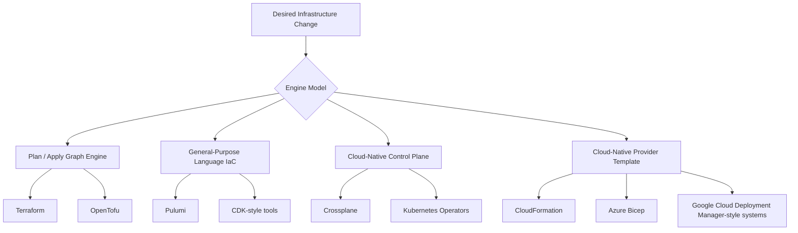
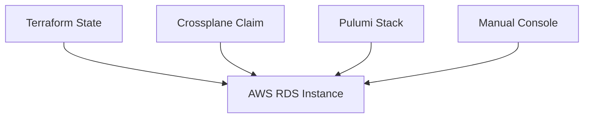
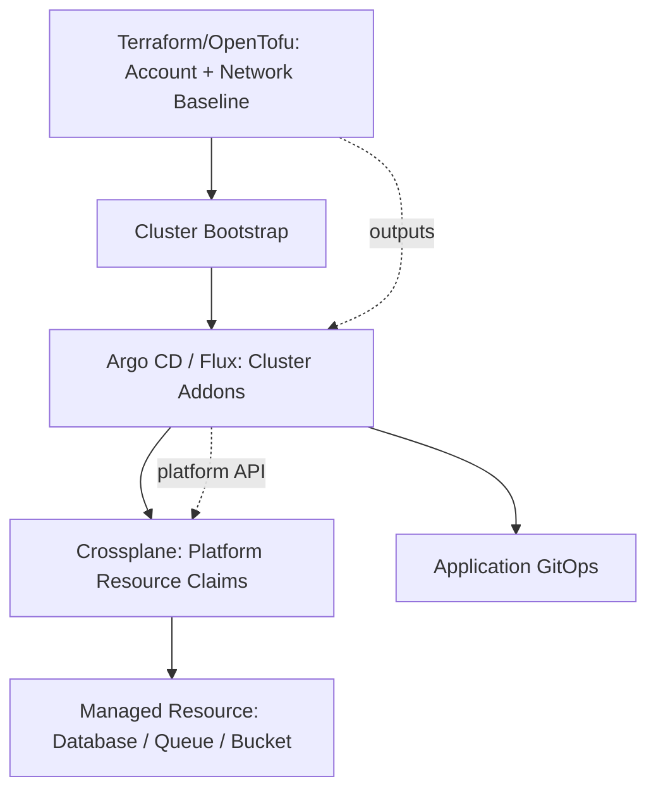
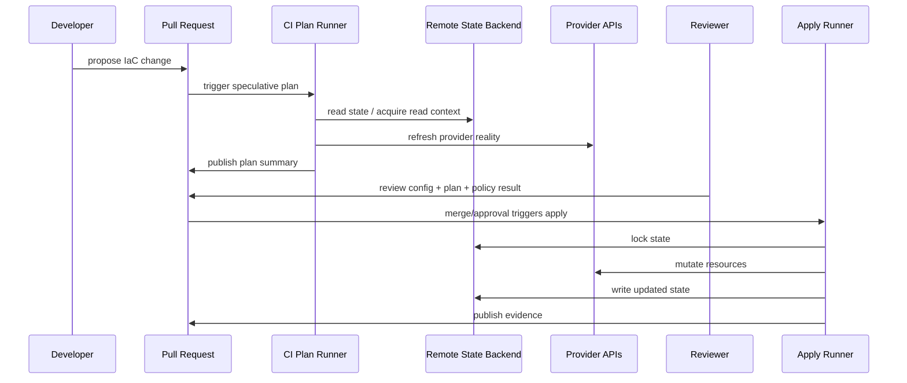
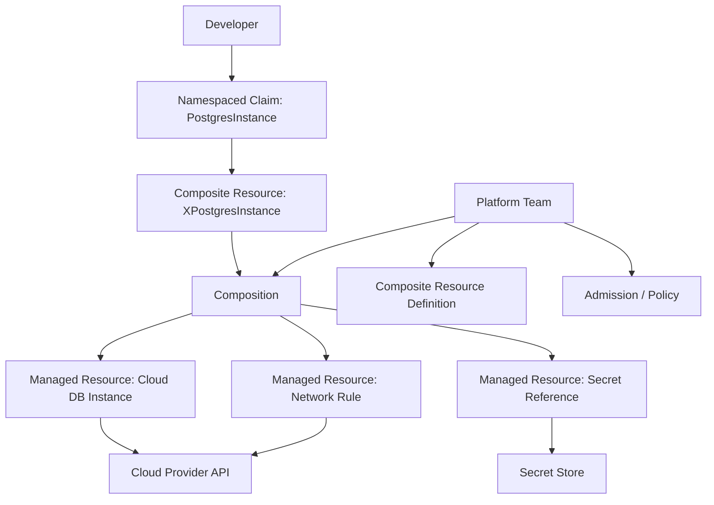
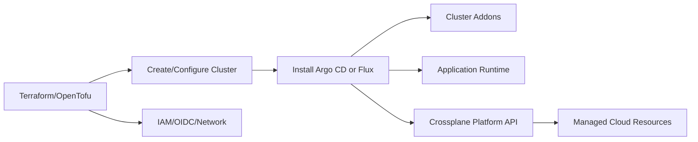
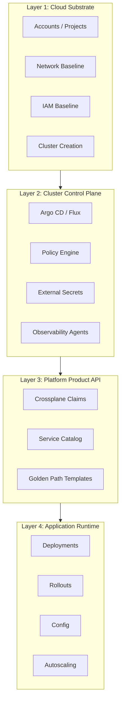
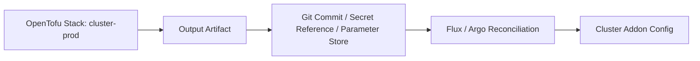

# Part 007 — IaC Engine Selection: Terraform, OpenTofu, Pulumi, Crossplane

A common mistake in infrastructure engineering is choosing an IaC tool as if it were only a syntax preference.

One team says:

> “Terraform is standard.”

Another says:

> “Pulumi lets us use real programming languages.”

Another says:

> “Crossplane is more cloud-native.”

All three can be true. None of them is enough.

An IaC engine is not just a configuration parser. It is a **state transition engine**. It decides how desired declarations become external reality, how differences are detected, how dependencies are ordered, how credentials are used, how failures are represented, and how much control humans retain before mutation.

In a production GitOps/IaC platform, engine selection is an architecture decision about:

- ownership of external resources;
- lifecycle boundary;
- blast radius;
- reconciliation model;
- state persistence;
- policy enforcement;
- auditability;
- operational recovery;
- team skill distribution;
- platform self-service model.

This part gives you a decision framework. The goal is not to declare one universal winner. The goal is to know **which engine owns which class of change** and why.

---

## 1. The Core Question

Do not start with:

> “Should we use Terraform or Pulumi?”

Start with:

> “What kind of control loop do we need for this resource lifecycle?”

That question is sharper.

Different infrastructure categories need different mutation semantics:

| Resource Class | Example | Desired Change Pattern | Preferred Control Model |
|---|---|---|---|
| Foundational cloud infra | accounts, VPCs, IAM baseline, DNS zones | explicit planned changes, low frequency, high blast radius | plan/apply with strong approval |
| Cluster platform layer | ingress controller, policy engine, external-secrets, observability agents | Git commit followed by continuous reconciliation | GitOps controller |
| Application runtime | deployment, service, HPA, rollout, config | frequent, automated, observable | GitOps + progressive delivery |
| Developer self-service infra | database claim, queue claim, bucket claim | API request, policy-backed provisioning, long-lived reconciliation | platform control plane / Crossplane-like model |
| One-off migration infra | temporary replication instance, migration VM | time-bound, high context, manual observation | explicit runbook + IaC where safe |
| SaaS configuration | GitHub teams, Datadog monitors, Okta groups | declarative but provider-dependent | Terraform/OpenTofu/Pulumi with careful provider maturity checks |

The engine should fit the lifecycle. If the lifecycle is wrong, the tool will be forced into unnatural behavior.

---

## 2. Four Mental Models of IaC Engines

Most IaC engines fall into one of four broad models.



Each model has a different failure shape.

### Model A — Plan/Apply Graph Engine

Examples: Terraform, OpenTofu.

The engine reads configuration, builds a graph, compares desired configuration with state and provider reality, produces a plan, and applies changes.

This model is strong when:

- human review before mutation is important;
- blast radius needs to be visible;
- infrastructure changes are less frequent than app deploys;
- teams need a mature provider ecosystem;
- modules and state boundaries can be designed cleanly;
- change evidence matters.

Its failure modes are usually around:

- state locking;
- state corruption;
- stale plans;
- provider bugs;
- resource import/refactor;
- concurrent applies;
- hidden values in state;
- large monolithic states.

### Model B — General-Purpose Language IaC

Example: Pulumi.

The engine lets teams define infrastructure using programming languages such as TypeScript, Python, Go, C#, Java, or YAML. The program produces a resource graph, and the engine manages state and updates.

This model is strong when:

- infrastructure abstractions need real language features;
- teams want to share libraries using existing package ecosystems;
- loops, conditionals, composition, and testing are important;
- the team is disciplined enough to avoid uncontrolled imperative behavior.

Its failure modes are usually around:

- too much abstraction;
- non-deterministic program execution;
- hidden side effects;
- dependency lockfile drift;
- language runtime/security maintenance;
- difficult review when generated resource graphs are not obvious from code.

### Model C — Cloud-Native Control Plane

Example: Crossplane.

The engine extends Kubernetes with custom resources. Platform teams define APIs and compositions. Users submit claims. Controllers continuously reconcile external resources.

This model is strong when:

- infrastructure is offered as a self-service platform API;
- developer teams should not see raw cloud provider complexity;
- reconciliation should be continuous, not only pipeline-triggered;
- platform teams want Kubernetes-style declarative APIs for external resources;
- there is a need to encode productized infrastructure primitives.

Its failure modes are usually around:

- controller complexity;
- CRD lifecycle and schema evolution;
- composition debugging;
- credential scope;
- reconciliation loops repeatedly attempting unsafe changes;
- unclear boundary between platform API and cloud provider API;
- cluster availability becoming part of infrastructure control-plane availability.

### Model D — Cloud-Native Provider Template

Examples: CloudFormation, Bicep, provider-native deployment systems.

This model uses the cloud provider's native engine. It is often strong for deep integration with one cloud, vendor support, and native drift/rollback semantics.

Its failure modes are usually around:

- portability limits;
- provider-specific mental model;
- language ergonomics;
- mixed multi-cloud governance;
- slower ecosystem development compared to popular open IaC providers.

---

## 3. The Dangerous Framing: “Which Tool Is Best?”

The better framing is:

> “Which engine should own this state transition boundary?”

A large platform may legitimately use several engines, but only if ownership boundaries are explicit.

Bad multi-engine design:



This is not flexibility. This is a resource ownership bug.

Good multi-engine design:



In the good design, each layer has a clear contract:

- foundational infra creates the substrate;
- GitOps installs and configures cluster services;
- platform control plane exposes safe abstractions;
- apps consume approved platform APIs.

No layer secretly mutates another layer's owned resources.

---

## 4. The Selection Criteria That Actually Matter

Use the following criteria when evaluating an IaC engine.

### 4.1 State Ownership

Ask:

- Where does the engine store state?
- Who can read it?
- Who can write it?
- Does the engine lock state before mutation?
- Is state encrypted?
- Is state versioned?
- Can state be recovered?
- Does state contain secrets?
- Can state be split by blast radius?

For Terraform/OpenTofu, state is central. It maps resource addresses to real-world resources and is used to determine change operations. For Pulumi, stacks have state and backends. For Crossplane, Kubernetes resources and controller status become part of the state surface.

If you cannot explain the engine's state model, you are not ready to run it in production.

### 4.2 Preview Quality

A state-of-the-art pipeline needs high-quality pre-mutation feedback.

Ask:

- Can the engine produce a reviewable plan?
- Can that plan be persisted as an artifact?
- Can the apply step prove it applies the reviewed plan?
- Can policy evaluate the plan, not just the source code?
- Are unknown values clearly represented?
- Is delete/replace visible?
- Can reviewers distinguish safe update from destructive replacement?

Terraform/OpenTofu-style speculative plans are excellent for review, but the plan must be treated carefully because provider data and state can change after the plan is created.

Crossplane-style reconciliation often has less of a classic “plan before apply” experience. That can be acceptable for self-service abstractions if the platform API is narrow and policy is strong.

### 4.3 Reconciliation Semantics

GitOps requires reconciliation: the system should continuously converge actual state toward desired state.

But not all reconciliation should be continuous.

For a Kubernetes Deployment, continuous reconciliation is natural.

For deleting a production database, continuous reconciliation must be heavily guarded.

Ask:

- Should this resource auto-heal if changed manually?
- Should manual drift be detected but not corrected automatically?
- Should deletion require extra approval?
- Should the engine retry forever?
- Can reconcile loops create cost, outages, or data loss?

A healthy platform uses different reconciliation policies for different resource classes.

### 4.4 Provider Maturity

IaC engines depend on providers.

A beautiful engine with an immature provider is still risky.

Evaluate:

- provider release cadence;
- bug history;
- import support;
- schema stability;
- drift behavior;
- handling of eventually consistent APIs;
- support for lifecycle controls;
- documentation quality;
- support for enterprise provider features;
- ability to pin versions.

Provider maturity often matters more than engine preference.

### 4.5 Policy Integration

Policy should evaluate at multiple levels:

- source files;
- rendered manifests;
- IaC plan;
- container images and attestations;
- Kubernetes admission request;
- runtime drift/event stream.

Ask:

- Can the engine emit structured plan data?
- Can policy understand creates, updates, deletes, and replacements?
- Can policy distinguish environment risk?
- Can policy enforce ownership metadata?
- Can policy require approval for high-risk changes?
- Can policy output be attached to evidence?

A pipeline that only lints source files but does not evaluate the actual planned mutation is weak.

### 4.6 Team Skill and Reviewability

A tool is not production-grade if only one expert can safely review it.

Ask:

- Can ordinary service engineers read the change?
- Can platform engineers reason about blast radius?
- Can security engineers inspect policy exceptions?
- Can SREs debug failed runs?
- Can auditors trace cause and approval?

Pulumi can be excellent for teams strong in software engineering, but the code must remain reviewable as infrastructure declaration. If the program becomes a framework inside a framework, review quality collapses.

Terraform/OpenTofu HCL is less expressive, but that limitation can be a governance advantage.

Crossplane can simplify user-facing APIs, but platform team complexity moves into compositions and controllers.

### 4.7 Lifecycle Duration

Not all resources have the same lifespan.

| Lifecycle | Examples | Engine Consideration |
|---|---|---|
| Permanent substrate | cloud accounts, VPCs, IAM baseline | strong state, strong approval, stable modules |
| Long-lived platform service | clusters, ingress, cert-manager, policy engine | GitOps reconciliation, careful bootstrap ownership |
| Team-owned managed infra | database, bucket, topic | self-service API or IaC stack per team |
| Application runtime | deployment, service, config | GitOps controller and progressive delivery |
| Temporary operational resource | migration worker, forensic snapshot | runbook + explicit TTL + cleanup evidence |

Engine selection should follow lifecycle, not fashion.

---

## 5. Terraform and OpenTofu: The Default Workhorse

Terraform and OpenTofu are plan/apply graph engines. They are often the default choice for foundational cloud infrastructure because they provide:

- broad provider ecosystem;
- declarative configuration;
- explicit state;
- plan before apply;
- module composition;
- remote backend support;
- state locking when backend supports it;
- integration with policy and cost tools;
- familiar operational model.

Use Terraform/OpenTofu when you need:

- auditable planned infrastructure changes;
- high confidence review before mutation;
- mature provider coverage;
- stable infrastructure modules;
- controlled blast radius through state segmentation;
- low-frequency but high-impact infrastructure changes.

Good fit:

- organization/account/project vending;
- VPC/VNet/network baseline;
- IAM baseline;
- DNS zones;
- cloud-managed Kubernetes clusters;
- shared databases;
- cloud logging/security baselines;
- SaaS config with mature providers.

Poor fit:

- high-frequency app deployment loops;
- per-request self-service infra without a platform wrapper;
- resources that need continuous reconciliation every few seconds;
- infrastructure that requires complex imperative workflows hidden inside provisioners;
- anything that cannot be represented reliably by provider schemas.

### 5.1 Terraform/OpenTofu Strength: Reviewable Mutation

The plan/apply model is powerful because it separates intent from mutation.



This works well when the pipeline enforces a critical invariant:

> A human does not approve abstract source code only. A human approves the proposed state transition.

### 5.2 Terraform/OpenTofu Weakness: State Is a Critical Database

State is not a temporary file.

It is a database of ownership and mapping.

If state is wrong, the engine can make wrong decisions.

Therefore, Terraform/OpenTofu production usage requires:

- remote backend;
- backend access control;
- encryption;
- versioning;
- locking;
- state backup;
- controlled state operations;
- import/move procedures;
- drift detection;
- emergency recovery runbooks.

Part 008 goes deep into this.

---

## 6. Pulumi: Real Language IaC, Real Language Risk

Pulumi's value proposition is that infrastructure can be defined using general-purpose languages.

This is powerful. It is also dangerous if misunderstood.

Use Pulumi when:

- infrastructure abstractions genuinely benefit from a programming language;
- teams already have strong language/tooling practices;
- reusable libraries matter more than HCL modules;
- unit testing abstractions is valuable;
- developer experience is a strong requirement;
- the organization can govern package dependencies and runtime behavior.

Good fit:

- productized infrastructure libraries in TypeScript/Go/Python/Java;
- teams needing complex composition with type systems;
- organizations that want IaC embedded into software delivery workflows;
- multi-cloud abstractions where code review discipline is high.

Poor fit:

- teams with weak code review culture;
- infra programs with hidden side effects;
- dynamic behavior that makes previews hard to reason about;
- unpinned package ecosystems;
- reviewers who cannot understand the language used.

### 6.1 The Pulumi Review Problem

With HCL, the configuration is constrained.

With a real language, the program can do almost anything:

- read local files;
- call APIs;
- generate resources in loops;
- depend on environment variables;
- import packages;
- construct names dynamically;
- hide logic in helper functions;
- use conditionals based on runtime data.

That flexibility is useful, but only if the team preserves determinism.

Production rule:

> A Pulumi program should behave like a deterministic declaration compiler, not a general automation script.

Recommended guardrails:

- pin package versions;
- prohibit arbitrary network calls during preview unless explicitly approved;
- require deterministic naming;
- publish preview output in PR;
- test library abstractions;
- keep resource graph readable;
- keep one stack's ownership boundary explicit;
- treat stack state as sensitive;
- apply policy to preview output.

### 6.2 Pulumi as Platform Library

Pulumi shines when infrastructure is expressed as higher-level constructs:

```ts
const service = new PlatformService("orders", {
  runtime: "java17",
  database: "postgres-small",
  publicIngress: false,
  asyncTopics: ["orders.created", "orders.cancelled"],
});
```

The user sees a platform abstraction. The library expands it into cloud resources, Kubernetes resources, IAM policies, monitoring, and network rules.

This can be very powerful.

But it must not become magic.

Every abstraction should expose:

- generated resources;
- naming rules;
- ownership tags;
- security posture;
- cost class;
- deletion behavior;
- migration constraints;
- state boundary;
- emergency support path.

---

## 7. Crossplane: Infrastructure as a Kubernetes Control Plane

Crossplane is not “Terraform but in Kubernetes.”

Crossplane turns Kubernetes into a control plane for external resources. Platform teams define APIs. Users create claims. Controllers reconcile managed resources.

The key concepts are:

- **Managed Resource**: provider-backed external resource representation.
- **Composite Resource**: higher-level resource composed from multiple managed resources.
- **Composition**: template/function pipeline that tells Crossplane how to build the composite.
- **Claim**: namespaced user-facing request for a composite resource.
- **ProviderConfig**: credential/configuration boundary for providers.

Use Crossplane when:

- platform team wants to expose self-service infra APIs;
- app teams should request infra without knowing cloud provider details;
- continuous reconciliation is desired;
- Kubernetes-native RBAC and API workflows are useful;
- the organization is ready to operate a control plane.

Good fit:

- `PostgresInstance` claim;
- `MessageQueue` claim;
- `ObjectBucket` claim;
- `ServiceEnvironment` claim;
- managed service vending;
- platform API backed by cloud resources.

Poor fit:

- one-off complex migrations;
- resources requiring manual approval for every minor mutation;
- immature provider coverage;
- teams without Kubernetes control-plane operational maturity;
- foundational bootstrap resources needed before the cluster exists.

### 7.1 Crossplane Mental Model



The platform team owns the API shape. Developer teams consume the API.

This is where Crossplane becomes powerful: it lets the organization move from “every team writes cloud provider resources” to “teams request platform products.”

### 7.2 The Crossplane Risk

Crossplane adds another control plane.

That is not free.

You must operate:

- provider controllers;
- CRDs;
- composition revisions;
- RBAC;
- admission policy;
- secret publishing;
- reconcile health;
- controller upgrades;
- backup/restore of cluster state;
- incident response when reconciliation misbehaves.

The failure mode is different from Terraform.

Terraform may fail during apply and stop.

Crossplane may continue reconciling until the desired state is satisfied or the controller is blocked.

That is excellent for safe resources. It is dangerous for poorly designed destructive workflows.

---

## 8. Argo CD / Flux Are Not IaC Engines in the Same Sense

Argo CD and Flux are GitOps reconciliation engines for Kubernetes desired state.

They are not general-purpose cloud infrastructure state engines in the same way Terraform/OpenTofu/Pulumi are.

They answer:

> “Should the Kubernetes cluster match this Git-declared desired state?”

They do not primarily answer:

> “How should I manage cloud resource state across provider APIs with plan/apply semantics?”

This distinction matters.

A common architecture is:



This is a layered architecture:

1. use IaC plan/apply for substrate;
2. use GitOps reconciliation for Kubernetes runtime;
3. optionally use Crossplane for self-service external resources;
4. keep ownership boundaries explicit.

---

## 9. Recommended Default Architecture

For a serious production platform, a pragmatic default is:

| Layer | Default Engine | Why |
|---|---|---|
| Organization/account/project vending | Terraform/OpenTofu | explicit plan/apply, audit, provider ecosystem |
| Network baseline | Terraform/OpenTofu | high blast radius, strong approval needed |
| IAM baseline | Terraform/OpenTofu | sensitive ownership and explicit review |
| Kubernetes cluster creation | Terraform/OpenTofu | cloud substrate plus bootstrap outputs |
| Cluster addons | Argo CD or Flux | continuous cluster reconciliation |
| Application deployment | Argo CD or Flux | Git-driven runtime state |
| Progressive delivery | Argo Rollouts / Flagger-like controller | metric-aware rollout control |
| Developer self-service infra | Crossplane or curated IaC service | narrow platform API and policy-backed claims |
| Complex library-style infra | Pulumi where justified | real-language abstraction with guardrails |
| Cloud-native vendor-specific stacks | CloudFormation/Bicep/etc. where justified | deep provider integration |

This is not the only architecture. It is a strong baseline because each tool is used where its control model fits.

---

## 10. Decision Matrix

Use this as a first-pass decision guide.

| Criterion | Terraform/OpenTofu | Pulumi | Crossplane | Cloud-Native Templates |
|---|---:|---:|---:|---:|
| Human-readable plan before apply | Strong | Strong, depends on program clarity | Weaker/classic plan absent | Varies |
| Provider ecosystem breadth | Very strong | Strong | Growing, provider-dependent | Strong within one cloud |
| General programming abstraction | Limited | Very strong | Limited to API/composition model | Limited/varies |
| Continuous reconciliation | Pipeline-driven, not always continuous | Pipeline-driven, not always continuous | Native controller reconciliation | Varies |
| Self-service platform API | Possible but indirect | Possible through libraries/services | Strong | Possible but cloud-specific |
| State file complexity | High | High | Kubernetes/controller state complexity | Provider-managed |
| Reviewability | Strong if modules sane | Strong only with disciplined code | Strong for claims, complex for compositions | Varies |
| Multi-cloud | Strong | Strong | Possible, but abstraction-heavy | Weak |
| Bootstrap before Kubernetes | Strong | Strong | Weak, needs Kubernetes | Strong within cloud |
| Operational recovery clarity | Mature but state-heavy | Mature but stack/backend-heavy | Controller/control-plane-heavy | Provider-specific |
| Best default for shared cloud infra | Yes | Sometimes | Usually no | Sometimes |
| Best default for app runtime | No | No | No | No |
| Best default for platform claims | Sometimes | Sometimes | Yes | Usually no |

Interpretation:

- Terraform/OpenTofu is the safest default for high-blast-radius foundational infra.
- Pulumi is excellent when language-level composition provides real value and governance is mature.
- Crossplane is excellent when the organization wants a Kubernetes-native platform API and can operate it.
- Cloud-native templates are useful when deep vendor-native behavior matters more than portability.

---

## 11. Engine Boundary Anti-Patterns

### Anti-Pattern 1 — One Engine Owns Everything

This sounds simple, but it often creates distortion.

Terraform managing every Kubernetes object can become slow and awkward. Argo CD managing all cloud resources through custom controllers can make destructive infra changes too implicit. Pulumi managing app runtime can overfit delivery to language abstractions.

One engine everywhere is sometimes operationally simple, but architecturally brittle.

### Anti-Pattern 2 — Every Team Chooses Its Own Engine

This creates a governance nightmare:

- no consistent state model;
- no standard policy integration;
- no shared evidence model;
- duplicated modules;
- unclear ownership;
- difficult incident response;
- inconsistent credential handling.

Tool freedom without platform contracts becomes entropy.

### Anti-Pattern 3 — Same Resource Managed by Multiple Engines

This is the most dangerous pattern.

Examples:

- Terraform creates an IAM role, Crossplane mutates it, and console edits patch it;
- Argo CD installs a Helm chart, Terraform also manages the same Helm release;
- Pulumi creates a bucket, Terraform imports it later without ownership migration;
- Crossplane creates a database while Terraform manages network rules generated from the same logical database object.

Production rule:

> One external resource must have one authoritative lifecycle owner.

### Anti-Pattern 4 — Choosing Based on Developer Happiness Alone

Developer experience matters, but infrastructure engines mutate real systems.

A good decision balances:

- developer usability;
- operational recovery;
- security governance;
- compliance evidence;
- state safety;
- platform team support load.

The best tool for writing code may not be the best tool for operating production.

### Anti-Pattern 5 — Ignoring Deletion Semantics

Engine selection must include delete behavior.

Ask:

- Does removing code delete the resource?
- Is deletion blocked by lifecycle policy?
- Is deletion reversible?
- Does the engine support prevent-destroy-like controls?
- Is data retained?
- Who approves deletion?
- How is deletion evidenced?

An engine that creates resources well but deletes them unsafely is not production-grade.

---

## 12. Layering Pattern: Substrate, Control Plane, Product API, Runtime

A mature platform separates layers.



Engine mapping:

- Layer 1: Terraform/OpenTofu or Pulumi with strong review.
- Layer 2: Argo CD/Flux.
- Layer 3: Crossplane or platform service that calls Terraform/OpenTofu/Pulumi safely.
- Layer 4: Argo CD/Flux plus progressive delivery.

This layering prevents control-plane recursion.

Do not make the application deployment engine responsible for creating its own foundational permissions. Do not make a self-service claim responsible for bootstrapping the cluster that hosts the claim controller.

---

## 13. How to Use Multiple Engines Without Chaos

Multi-engine platforms are safe only when contracts are explicit.

### 13.1 Declare Ownership

Every managed resource should have ownership metadata:

```yaml
metadata:
  labels:
    platform.example.com/owner-team: payments-platform
    platform.example.com/lifecycle-owner: opentofu
    platform.example.com/environment: prod
    platform.example.com/state-boundary: prod-payments-network
    platform.example.com/change-class: high-risk
```

For non-Kubernetes cloud resources, equivalent tags should exist.

### 13.2 Define Handoff Artifacts

One layer can publish outputs consumed by another layer, but it should not let the downstream layer mutate upstream resources.

Examples:

- Terraform creates cluster OIDC provider and publishes issuer URL;
- Argo CD consumes OIDC values to configure workload identity;
- Crossplane uses a ProviderConfig created by platform bootstrap;
- applications consume database connection secret generated by platform API.

Handoff should be explicit:



### 13.3 Prohibit Reverse Mutation

Downstream layers must not mutate upstream resources.

For example:

- app GitOps must not modify cluster IAM baseline;
- Crossplane claims must not rewrite account-level SCPs;
- application Helm charts must not create cluster-admin roles;
- Pulumi app stack must not mutate network baseline owned by OpenTofu.

### 13.4 Centralize Evidence Shape

Even if engines differ, evidence should be normalized.

Every change should produce:

- source commit;
- actor;
- reviewer/approver;
- policy result;
- plan/preview/diff if available;
- applied artifact identity;
- runtime result;
- links to logs;
- rollback/rollforward pointer.

This lets audit and incident response work across engines.

---

## 14. Engine-Specific Governance Rules

### 14.1 Terraform/OpenTofu Rules

Minimum production rules:

- remote backend only;
- state encryption and access control;
- locking enabled where supported;
- no human local apply for shared/prod state;
- provider versions pinned;
- module versions pinned;
- plan output posted to PR;
- destructive changes highlighted;
- apply serialized per state boundary;
- state operations require break-glass approval;
- state backup/versioning enabled;
- drift detection scheduled.

### 14.2 Pulumi Rules

Minimum production rules:

- stack backend centrally controlled;
- secrets provider configured deliberately;
- package versions pinned;
- preview output posted to PR;
- arbitrary side effects forbidden during preview/update;
- infrastructure libraries reviewed like production code;
- generated graph remains inspectable;
- policy packs or equivalent controls enforced;
- stack ownership declared;
- runtime language maintenance owned.

### 14.3 Crossplane Rules

Minimum production rules:

- claims are narrow and productized;
- provider credentials are least privilege;
- composition changes are versioned;
- composition revisions are rolled out deliberately;
- deletion policies are explicit;
- admission policy protects dangerous claims;
- reconcile health is observable;
- provider controllers are upgraded safely;
- cluster backup/restore covers Crossplane state;
- platform API docs describe lifecycle and support boundaries.

### 14.4 GitOps Controller Rules

Minimum production rules:

- application/project boundaries defined;
- controller permissions scoped;
- auto-sync used selectively;
- pruning protected by policy;
- rendered manifests validated;
- drift visibility is monitored;
- manual cluster changes are either blocked or backported;
- health checks are tuned for critical resources;
- secrets are references, not plaintext manifests.

---

## 15. Architecture Decision Record Template

Use this ADR template when choosing an engine.

```md
# ADR: IaC Engine for <Resource Class>

## Status
Proposed | Accepted | Superseded

## Context
What resource class are we managing?
What is the blast radius?
Who owns it?
How often does it change?
What are the compliance requirements?

## Decision
We will use <engine> for <boundary>.

## State Ownership
State is stored in <backend>.
Write access is limited to <runner/role>.
Manual state operations require <approval path>.

## Reconciliation Model
Changes are applied by <pipeline/controller>.
Auto-reconciliation is <enabled/disabled/conditional>.

## Policy Model
Policy is evaluated at <source/rendered/plan/admission/runtime>.
High-risk changes require <approval>.

## Deletion Semantics
Deletion is <allowed/blocked/approval-gated>.
Data-retaining resources use <retention policy>.

## Failure Handling
Primary failure modes:
- <failure 1>
- <failure 2>
- <failure 3>

Recovery runbooks:
- <runbook link>

## Alternatives Considered
- Terraform/OpenTofu: <reason accepted/rejected>
- Pulumi: <reason accepted/rejected>
- Crossplane: <reason accepted/rejected>
- Cloud-native engine: <reason accepted/rejected>

## Consequences
Benefits:
- ...

Trade-offs:
- ...

Operational obligations:
- ...
```

The important part is not the document. The important part is forcing the team to answer state, ownership, reconciliation, policy, deletion, and recovery before adopting the tool.

---

## 16. Example Decision: Production Network Baseline

Resource class:

- cloud accounts/projects;
- VPC/VNet;
- subnets;
- routing;
- NAT/egress;
- private DNS;
- security baselines.

Recommended engine:

- Terraform/OpenTofu.

Reason:

- high blast radius;
- low change frequency;
- strong need for plan review;
- mature provider support;
- state can be segmented by account/region/environment;
- destructive changes should be visible and approval-gated.

Rejected alternatives:

- Crossplane: unsuitable as primary bootstrap layer because cluster dependency and continuous reconciliation are not ideal for foundational network mutation.
- Pulumi: possible, but real-language abstraction is not necessary unless organization already standardizes on Pulumi.
- Cloud-native templates: acceptable if single-cloud strategy and native support are more important than cross-cloud consistency.

Key invariant:

> No application or cluster-level GitOps resource may mutate production network baseline.

---

## 17. Example Decision: Application Deployment

Resource class:

- Kubernetes Deployment;
- Service;
- ConfigMap;
- HPA;
- Ingress/HTTPRoute;
- Rollout object;
- service-level policy binding.

Recommended engine:

- Argo CD or Flux.

Reason:

- desired state is Kubernetes-native;
- frequent changes;
- continuous reconciliation is useful;
- drift should be detected quickly;
- rollout controllers can integrate with metrics;
- app team PR flow maps naturally to deployment manifests.

Rejected alternatives:

- Terraform/OpenTofu: not ideal for high-frequency Kubernetes app reconciliation.
- Pulumi: possible but adds stack state and language runtime where GitOps controller is simpler.
- Crossplane: not designed as a primary application deployment engine.

Key invariant:

> App GitOps may own namespaced application resources, not cluster baseline or cloud substrate.

---

## 18. Example Decision: Self-Service Database Request

Resource class:

- team requests PostgreSQL database;
- platform enforces size classes;
- secrets are delivered through approved secret manager;
- network access is constrained;
- deletion is approval-gated.

Possible engines:

1. Crossplane claim.
2. Internal platform service that triggers Terraform/OpenTofu run.
3. Pulumi-based platform library or automation API.

Recommended default:

- Crossplane if the organization already operates Kubernetes control planes well and wants API-style continuous reconciliation.
- Terraform/OpenTofu automation service if approval-heavy plan/apply is more important.

Decision point:

> Is the database lifecycle better modeled as a continuously reconciled platform API object or as an approval-gated infrastructure stack?

There is no universal answer.

For regulated environments, you may choose Terraform/OpenTofu-driven service for production databases and Crossplane for lower-risk dev/test resources.

---

## 19. The “Top 1%” Mental Model

A top engineer does not argue about IaC engines at the syntax layer.

They ask:

1. What is the resource lifecycle?
2. What is the blast radius?
3. What is the state owner?
4. What happens if the engine is wrong?
5. What happens if credentials leak?
6. What happens if the provider API is eventually consistent?
7. What happens if apply succeeds halfway?
8. What happens if humans change runtime manually?
9. What must be approved before mutation?
10. What evidence must exist after mutation?
11. How do we recover if state and reality diverge?
12. Which team is on call for this engine?

The tool choice falls out of those answers.

---

## 20. Practical Exercise

Design engine ownership for the following platform:

- three AWS accounts: dev, staging, prod;
- EKS clusters in each account;
- app teams deploy Java services;
- platform team owns ingress, cert-manager, external secrets, observability, and policy;
- app teams need self-service PostgreSQL and Kafka topics;
- production changes require audit evidence;
- manual console changes are discouraged but sometimes happen during incidents.

Create a table:

| Boundary | Engine | State Backend | Owner | Approval | Drift Policy | Recovery Path |
|---|---|---|---|---|---|---|
| AWS account baseline |  |  |  |  |  |  |
| VPC/subnets/routing |  |  |  |  |  |  |
| EKS cluster |  |  |  |  |  |  |
| cluster addons |  |  |  |  |  |  |
| app deployments |  |  |  |  |  |  |
| PostgreSQL self-service |  |  |  |  |  |  |
| Kafka topics |  |  |  |  |  |  |
| production policy |  |  |  |  |  |  |

Then answer:

- Which resources are allowed to auto-reconcile?
- Which resources require explicit approval before mutation?
- Which resources must never be deleted by a normal PR?
- Which layer publishes outputs to another layer?
- Which layer is forbidden from mutating upstream state?

---

## 21. Summary

Engine selection is not a popularity contest.

Terraform/OpenTofu, Pulumi, Crossplane, Argo CD, Flux, and provider-native systems each encode different assumptions about state, preview, reconciliation, and ownership.

The production-grade decision is not:

> “Which one do we like?”

It is:

> “Which engine should own this lifecycle boundary, and what invariants protect the system when it fails?”

A strong default is:

- Terraform/OpenTofu for foundational cloud infrastructure;
- Argo CD or Flux for Kubernetes desired state;
- Crossplane for platform self-service APIs where continuous reconciliation is appropriate;
- Pulumi where real-language abstractions provide concrete value and the team can govern them;
- provider-native templates when deep cloud integration outweighs portability.

The next part goes deep into the most important operational reality of Terraform/OpenTofu-style engines:

> state.

State is the engine's memory. If it is unsafe, every pipeline built on top of it is unsafe.

---

## References

- OpenTofu Documentation — State Storage and Locking: https://opentofu.org/docs/language/state/backends/
- OpenTofu Documentation — State Locking: https://opentofu.org/docs/language/state/locking/
- Terraform Documentation — State: https://developer.hashicorp.com/terraform/language/state
- Terraform Documentation — State Locking: https://developer.hashicorp.com/terraform/language/state/locking
- Pulumi Documentation — State and Backends: https://www.pulumi.com/docs/iac/concepts/state-and-backends/
- Pulumi Documentation — Stacks: https://www.pulumi.com/docs/iac/concepts/stacks/
- Crossplane Documentation — Composite Resources: https://docs.crossplane.io/latest/composition/composite-resources/
- Crossplane Documentation — Claims: https://docs.crossplane.io/v1.20/concepts/claims/
